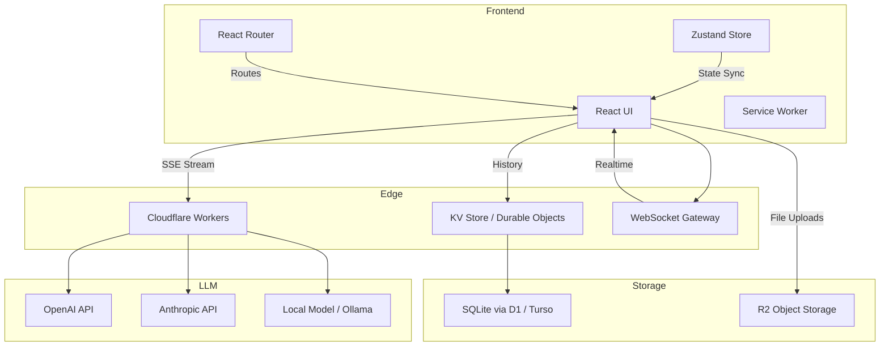
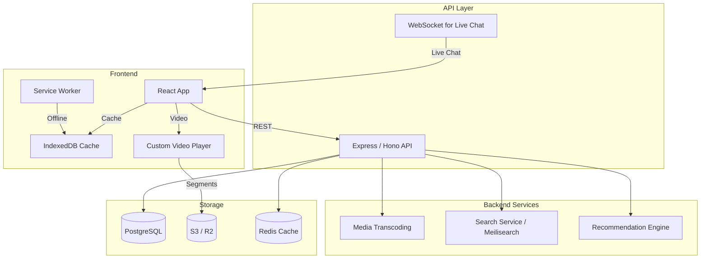
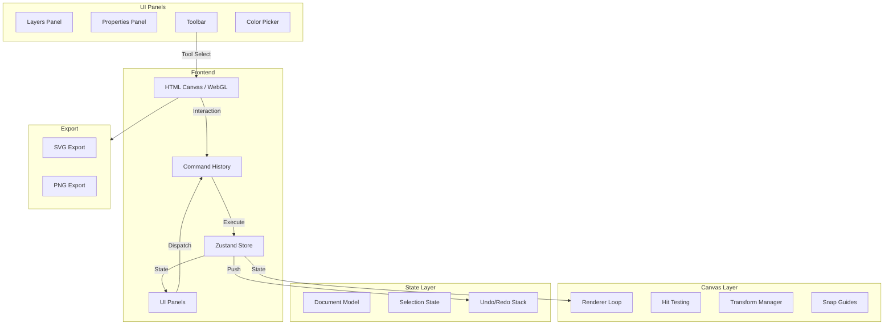
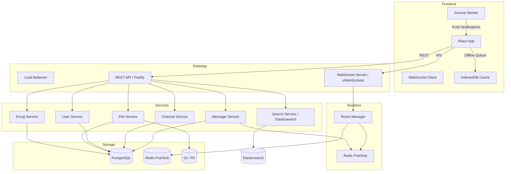

# React Capstone Projects

## 1. ChatGPT Clone

A full-featured chat interface with streaming responses, conversation management, and multi-model support.

### Architecture



### Component Tree

```
<App>
  <ThemeProvider>
    <Router>
      <Sidebar>
        <NewChatButton />
        <ConversationList>
          <ConversationItem />*   # title, preview, timestamp
          <SearchConversations />  # fuzzy search with Fuse.js
        </ConversationList>
        <UserMenu />               # settings, logout, model prefs
      </Sidebar>
      <MainPanel>
        <ChatView>
          <MessageList>
            <Message />*            # markdown render, code highlight
            <StreamingMessage />    # animated cursor during stream
          </MessageList>
          <InputArea>
            <TextArea />            # auto-resize, shift+enter submit
            <FileUploadButton />
            <ModelSelector />       # dropdown: GPT-4, Claude, Llama
            <SendButton />
          </InputArea>
        </ChatView>
      </MainPanel>
    </Router>
  </ThemeProvider>
</App>
```

### Data Flow

```
User Types Message
  → InputArea captures text
  → Zustand store dispatches sendMessage action
  → API call to /api/chat/stream (Edge Worker)
  → Edge Worker connects to LLM provider
  → SSE stream returns token chunks
  → StreamingMessage component renders tokens incrementally
  → On completion, message persisted to KV store
  → ConversationList updates with new preview
```

### Key Challenges

| Challenge | Solution |
|-----------|----------|
| Streaming with cancelation | AbortController + ReadableStream + `useRef` for cleanup |
| Conversation persistence | Optimistic writes to local cache, background sync to D1 |
| Long conversation truncation | Sliding window summarization; auto-compress after N messages |
| Code highlighting performance | `shiki` for server-side highlighting, `prism-react-renderer` for client |
| Multi-model response parsing | Adapter pattern per provider with normalized schema |
| Prompt injection prevention | Input sanitization, system prompt isolation, rate limiting |

### Implementation Snippet: Streaming Hook

```typescript
function useChatStream() {
  const abortRef = useRef<AbortController | null>(null);

  const sendMessage = useCallback(async (message: string) => {
    abortRef.current = new AbortController();
    const response = await fetch("/api/chat/stream", {
      method: "POST",
      body: JSON.stringify({ message }),
      signal: abortRef.current.signal,
    });

    const reader = response.body!.getReader();
    const decoder = new TextDecoder();
    let buffer = "";

    while (true) {
      const { done, value } = await reader.read();
      if (done) break;
      buffer += decoder.decode(value, { stream: true });
      const chunks = buffer.split("\n");
      buffer = chunks.pop()!;
      for (const chunk of chunks) {
        if (chunk.startsWith("data: ")) {
          const parsed = JSON.parse(chunk.slice(6));
          appendToken(parsed.token);
        }
      }
    }
  }, []);

  const cancel = useCallback(() => {
    abortRef.current?.abort();
  }, []);

  return { sendMessage, cancel };
}
```

---

## 2. YouTube Clone

A video platform with infinite scroll, nested comments, and search with debounce.

### Architecture



### Component Tree

```
<App>
  <Router>
    <Header>
      <Logo />
      <SearchBar>            # debounced input (300ms)
        <Suggestions />       # dropdown from search-as-you-type
      </SearchBar>
      <UserActions />         # upload, notifications, avatar
    </Header>
    <MainContent>
      <Routes>
        <HomePage>
          <CategoryTabs />
          <VideoGrid>
            <VideoCard />*    # thumbnail, title, channel, views, date
          </VideoGrid>
          <InfiniteScrollTrigger />  # IntersectionObserver
        </HomePage>
        <WatchPage>
          <VideoPlayer>        # custom: hls.js, quality selector, speed
            <Controls />       # play/pause, seek, volume, fullscreen
            <Timeline />       # clickable seek bar with thumbnails
          </VideoPlayer>
          <VideoInfo />        # title, views, likes, description
          <ChannelBar />       # avatar, subscribe button, subs count
          <CommentsSection>
            <CommentComposer />
            <CommentThread>
              <Comment />*     # avatar, text, actions, replies
              <RepliesList>    # nested threading, expand/collapse
                <Comment />*
              </RepliesList>
            </CommentThread>
          </CommentsSection>
          <RecommendedVideos>
            <VideoCard />*
          </RecommendedVideos>
        </WatchPage>
        <ChannelPage>
          <ChannelHeader />    # banner, avatar, name, subs
          <VideoTabs />        # videos, playlists, about
          <VideoGrid />
        </ChannelPage>
      </Routes>
    </MainContent>
  </Router>
</App>
```

### Data Flow

```
Search Flow:
  User types → debounce 300ms → fetch /api/search?q=
    → Backend queries Meilisearch index
    → Returns video metadata with relevance scores
    → Render suggestions dropdown
  On submit → navigate to /results?search_query=
    → Paginated results with IntersectionObserver infinite scroll

Video Playback:
  User clicks video → navigate to /watch?v=VIDEO_ID
    → Fetch video metadata (title, description, channel, comments)
    → Initialize HLS.js player with adaptive bitrate
    → Start playback at quality based on network (navigator.connection)
    → Prefetch next recommended video

Comment Threading:
  Load comments (top-level, paginated)
  Expand replies → fetch /api/videos/:id/comments/:parent/replies
  Optimistic UI on new comment → POST /api/videos/:id/comments
```

### Key Challenges

| Challenge | Solution |
|-----------|----------|
| Infinite scroll memory | Virtualization (react-window) for video grid; unmount far items |
| Video player perf | HLS.js with MSE; hardware-accelerated canvas for filters |
| Comment nesting depth | Limit to 2 levels; flat DB model with parent_id + path sort |
| Search debounce race | Abort previous request on new keystroke; useLatest callback |
| Subscription feed | Materialized view in PostgreSQL; fan-out on write for active users |
| Upload resumability | Tus protocol — resumable uploads, chunked, paused/resumed |

### Implementation Snippet: Debounced Search

```typescript
function useDebouncedSearch(query: string, delay = 300) {
  const [results, setResults] = useState<SearchResult[]>([]);
  const [isSearching, setIsSearching] = useState(false);

  useEffect(() => {
    if (!query.trim()) {
      setResults([]);
      return;
    }

    const timer = setTimeout(async () => {
      setIsSearching(true);
      try {
        const res = await fetch(`/api/search?q=${encodeURIComponent(query)}`);
        const data = await res.json();
        setResults(data.results);
      } finally {
        setIsSearching(false);
      }
    }, delay);

    return () => clearTimeout(timer);
  }, [query, delay]);

  return { results, isSearching };
}
```

---

## 3. Figma Lite

A canvas-based design tool with layers, undo/redo, and shape manipulation.

### Architecture



### Component Tree

```
<App>
  <Toolbar>
    <ToolButton />*        # select, rectangle, ellipse, line, text, hand
    <ToolOptions />        # stroke width, fill, opacity per tool
  </Toolbar>
  <CanvasArea>
    <Canvas>                # HTML Canvas element with WebGL context
      <Grid />              # background grid with snapping
      <SelectionOverlay />  # resize handles, rotation ring
      <Rulers />            # horizontal + vertical rulers
    </Canvas>
    <SnapGuides />          # magnetic alignment lines
    <Minimap />             # inset overview
  </CanvasArea>
  <RightPanel>
    <LayersPanel>
      <LayerItem />*        # visibility lock, name, drag-to-reorder
    </LayersPanel>
    <PropertiesPanel>
      <DimensionInputs />   # x, y, w, h, rotation
      <FillPicker />        # color picker + opacity
      <StrokeOptions />     # color, width, dash pattern
      <EffectsPanel />      # shadow, blur, etc.
    </PropertiesPanel>
  </RightPanel>
  <StatusBar>
    <ZoomControls />
    <CursorPosition />
    <UndoRedoIndicators />
  </StatusBar>
</App>
```

### Data Flow

```
Shape Creation:
  User selects Rectangle tool → clicks on canvas at (x, y)
    → Canvas mouseDown handler records start position
    → MouseMove → render preview rect (dashed)
    → MouseUp → CommandBus.dispatch(new AddShapeCommand(rect))
      → Command.execute() → Store.addShape(rect)
        → Store triggers re-render of canvas
        → CommandHistory.push(command)
    → Layers panel updates with new layer

Shape Manipulation:
  Select tool → click on shape → HitTest resolves shape
    → SelectionStore.setSelected(shapeId)
    → Properties panel shows shape dimensions
    → Drag handle → TransformManager updates shape
    → On release → CommandBus.dispatch(new UpdateShapeCommand(prevShape, newShape))
      → CommandHistory.push(command)

Undo:
  Ctrl+Z → CommandHistory.undo()
    → Pop last command → command.undo()
      → Store reverts to previous state
      → Canvas re-renders
```

### Command Pattern Implementation

```typescript
interface Command {
  type: string;
  execute(): void;
  undo(): void;
}

class CommandHistory {
  private undoStack: Command[] = [];
  private redoStack: Command[] = [];
  private maxSize = 100;

  dispatch(command: Command): void {
    command.execute();
    this.undoStack.push(command);
    this.redoStack = [];
    if (this.undoStack.length > this.maxSize) {
      this.undoStack.shift();
    }
  }

  undo(): void {
    const command = this.undoStack.pop();
    if (!command) return;
    command.undo();
    this.redoStack.push(command);
  }

  redo(): void {
    const command = this.redoStack.pop();
    if (!command) return;
    command.execute();
    this.undoStack.push(command);
  }
}

class AddShapeCommand implements Command {
  readonly type = "ADD_SHAPE";

  constructor(
    private store: CanvasStore,
    private shape: Shape,
  ) {}

  execute(): void {
    this.store.addShape(this.shape);
  }

  undo(): void {
    this.store.removeShape(this.shape.id);
  }
}
```

### Key Challenges

| Challenge | Solution |
|-----------|----------|
| Canvas render performance | Dirty-rect tracking; only repaint changed regions |
| Hit testing on complex shapes | Spatial hash grid for O(1) lookup |
| Undo/redo memory | Snapshot compression; command pattern (not full state snapshots) |
| Vector export fidelity | Serialize shape tree to SVG path strings |
| Smooth zoom/pan | Transform matrix on canvas context; affine transformations |
| Alignment guides | Sweep-line algorithm on shape edges within threshold |

### Implementation Snippet: Canvas Render Loop

```typescript
function useCanvasRenderer(
  canvasRef: RefObject<HTMLCanvasElement>,
  store: CanvasStore,
) {
  const rafRef = useRef<number>();

  useEffect(() => {
    const canvas = canvasRef.current;
    if (!canvas) return;
    const ctx = canvas.getContext("2d")!;

    let dirtyRects: Rect[] = [];

    const unsubscribe = store.onChange((changedShapes) => {
      for (const shape of changedShapes) {
        dirtyRects.push(shape.bounds);
      }
    });

    function render() {
      ctx.clearRect(0, 0, canvas.width, canvas.height);

      if (dirtyRects.length > 50) {
        // Full repaint
        for (const shape of store.shapes) {
          shape.draw(ctx);
        }
      } else {
        // Partial repaint
        for (const rect of dirtyRects) {
          ctx.clearRect(rect.x, rect.y, rect.w, rect.h);
          for (const shape of store.shapesInRect(rect)) {
            shape.draw(ctx);
          }
        }
      }

      dirtyRects = [];
      rafRef.current = requestAnimationFrame(render);
    }

    rafRef.current = requestAnimationFrame(render);
    return () => {
      cancelAnimationFrame(rafRef.current!);
      unsubscribe();
    };
  }, [canvasRef, store]);
}
```

---

## 4. Slack Clone

A real-time messaging platform with channels, file uploads, emoji reactions, and threads.

### Architecture



### Component Tree

```
<App>
  <SocketProvider>
    <ThemeProvider>
      <Layout>
        <Sidebar>
          <WorkspaceHeader />      # name, status indicator
          <SearchBar />            # global search with shortcut (Cmd+K)
          <ChannelList>
            <ChannelCategory />    # "Channels", "Direct Messages"
              <ChannelItem />*     # icon, name, unread count, mention badge
          </ChannelList>
          <AddChannelButton />
          <UserList>
            <UserStatus />*        # avatar, presence dot, name
          </UserList>
        </Sidebar>
        <MainArea>
          <Routes>
            <ChannelView>
              <ChannelHeader>      # name, topic, member count
                <ChannelActions /> # invite, settings, pin list
              </ChannelHeader>
              <MessageList>
                <DateDivider />    # "Today", "Yesterday", date
                <Message />*
                  <MessageContent />   # text, formatted
                  <MessageAttachments /> # images, files, links previews
                  <MessageReactions />  # emoji picker, reaction counts
                  <ThreadButton />      # reply count, last reply preview
                <NewMessageIndicator />
              </MessageList>
              <MessageInput>
                <FormattingToolbar />   # bold, italic, code, link
                <FileUploadZone />
                <EmojiPicker />
                <SendButton />
              </MessageInput>
            </ChannelView>
            <ThreadView>
              <ThreadHeader />     # parent message summary
              <ThreadMessages>
                <Message />*
              </ThreadMessages>
              <ThreadInput />
            </ThreadView>
          </Routes>
        </MainArea>
      </Layout>
    </ThemeProvider>
  </SocketProvider>
</App>
```

### Data Flow

```
Message Send:
  User types → MessageInput captures text + files
    → Optimistically add to message list (pending state)
    → POST /api/messages with channel_id, text, file_ids
    → Server persists to PostgreSQL
    → Server publishes to Redis channel `channel:{channel_id}`
    → Redis Pub/Sub → Room Manager → WebSocket broadcast
    → All connected clients receive new message
    → Sender replaces optimistic message with server-confirmed
    → SW updates IndexedDB cache for offline

Realtime Presence:
  User connects → WebSocket handshake → join room `presence`
    → Server publishes user:online to presence channel
    → Room Manager broadcasts presence update
    → Other users see presence dot turn green
  User disconnects → after 30s timeout → broadcast user:offline

Thread Reply:
  User clicks thread button on message
    → Fetch GET /api/messages/:id/thread (paginated)
    → Render ThreadView in right panel
    → Reply → POST /api/messages/:id/thread
    → Parent message shows updated reply count
```

### Key Challenges

| Challenge | Solution |
|-----------|----------|
| WebSocket reconnection | Exponential backoff + jitter; resume with last known event ID |
| Message ordering | Server-assigned monotonic timestamps (TSID); client sorts by ID |
| Offline message queue | IndexedDB pending queue; flush on reconnect |
| File upload progress | XHR with `upload.onprogress`; cancelable via AbortController |
| Emoji reactions race | CRDT-style last-write-wins on reaction count; optimistic UI |
| Unread counts | Client-side tracking via last-read timestamp per channel |

### Implementation Snippet: WebSocket with Reconnection

```typescript
class ReconnectingWebSocket {
  private ws: WebSocket | null = null;
  private retries = 0;
  private maxRetries = 10;
  private baseDelay = 1000;
  private messageQueue: string[] = [];

  connect(url: string): void {
    this.ws = new WebSocket(url);

    this.ws.onopen = () => {
      this.retries = 0;
      for (const msg of this.messageQueue) {
        this.ws!.send(msg);
      }
      this.messageQueue = [];
    };

    this.ws.onclose = () => {
      if (this.retries < this.maxRetries) {
        const delay = Math.min(
          this.baseDelay * Math.pow(2, this.retries) + Math.random() * 1000,
          30000,
        );
        this.retries++;
        setTimeout(() => this.connect(url), delay);
      }
    };

    this.ws.onmessage = (event) => {
      this.handleMessage(JSON.parse(event.data));
    };
  }

  send(data: string): void {
    if (this.ws?.readyState === WebSocket.OPEN) {
      this.ws.send(data);
    } else {
      this.messageQueue.push(data);
    }
  }
}
```

---

## Project Summary

| Project | Core Challenge | Key Tech |
|---------|---------------|----------|
| ChatGPT Clone | Streaming LLM responses | SSE, Zustand, shiki |
| YouTube Clone | Infinite scroll + video | HLS.js, virtualization, Meilisearch |
| Figma Lite | Canvas rendering + undo/redo | WebGL, Command Pattern, spatial hash |
| Slack Clone | Realtime messaging | WebSocket, Redis Pub/Sub, offline queue |

Each project demonstrates a different facet of React mastery: streaming state (ChatGPT), media-heavy UI (YouTube), custom rendering engines (Figma), and real-time distributed state (Slack).
