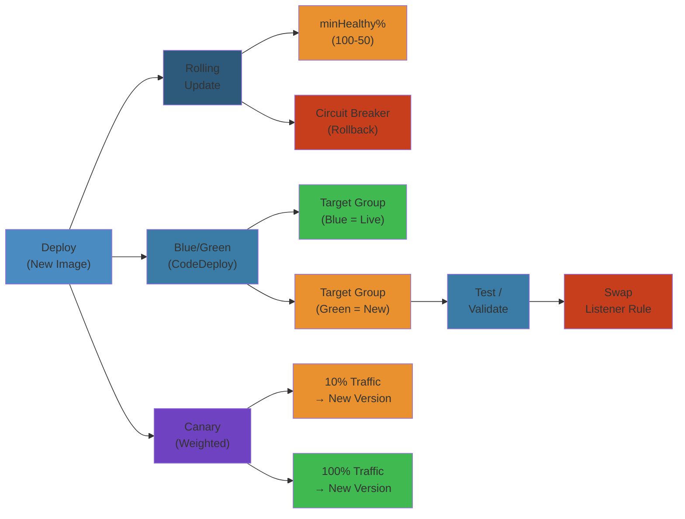
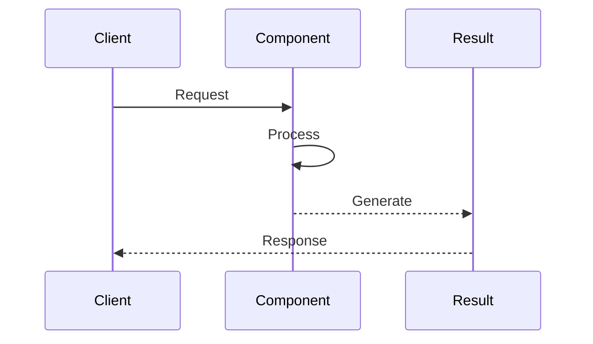

# 🐳 ECS Deployment & Operations — Complete Deep Dive




---

## Service Auto-Scaling


Three strategies for ECS services:



```awscli
aws application-autoscaling register-scalable-target \
  --service-namespace ecs \
  --resource-id service/my-cluster/my-service \
  --scalable-dimension ecs:service:DesiredCount \
  --min-capacity 1 --max-capacity 20

aws application-autoscaling put-scaling-policy \
  --policy-name cpu-target-tracking \
  --policy-type TargetTrackingScaling \
  --target-tracking-scaling-policy-configuration \
    TargetValue=70.0,\
    PredefinedMetricSpecification={PredefinedMetricType=ECSServiceAverageCPUUtilization}
```

---

## Rolling vs Blue/Green vs Canary


```text
Rolling Update:
  v2 │ v2 │ v1 │ v1 │ v1  (oldest → new)
  Min healthy = 50%, Max = 200%

Blue/Green (CodeDeploy):
  Blue (v1, 100% traffic) | Green (v2, 0% traffic)
  Validate → shift 100% → instant rollback

Canary (CodeDeploy):
  v1: 90% ───┐
  v2: 10% ───┤ Monitor → shift 100%
```

| Aspect | Rolling | Blue/Green | Canary |
|--------|---------|-----------|--------|
| Speed | Fast | Medium | Slow |
| Risk | Medium (overlap) | Low | Lowest |
| Rollback | Redeploy old | Instant flip | Instant flip |
| Cost | Normal | 2x during deploy | 2x during deploy |
| Setup | Built-in ECS | CodeDeploy | CodeDeploy |

---

## Circuit Breaker


```text
Deploy → replace tasks → monitor health checks
    ↓              ↓
Continue       X consecutive failures
Healthy        Rollback to previous task def
```

`deploymentCircuitBreaker.enable = true`, `deploymentCircuitBreaker.rollback = true`. Timeout reached without steady state → rollback.

---

## Task Networking


```text
awsvpc: Each task gets ENI + VPC IP. Works with ALB/NLB.
  Required for Fargate. Best for EC2.

bridge: docker0 bridge, port mapping. Container not VPC-reachable.
  EC2 only.

host: Container port = host port. No isolation. EC2 only.
```

| Mode | Fargate | EC2 | ENI per task | DNS |
|------|---------|-----|-------------|-----|
| awsvpc | ✅ Required | ✅ | ✅ | ✅ |
| bridge | ❌ | ✅ | ❌ | ❌ |
| host | ❌ | ✅ | ❌ | ❌ |

---

## Cloud Map Service Discovery


Tasks auto-register as DNS A/SRV records. Clients resolve `order-api.internal.example.local` to task IPs. Only healthy tasks appear (TTL + health checks).

---

## App Mesh


Service mesh for ECS/EKS. Envoy sidecars handle mTLS, tracing, retries, circuit breaking, traffic shifting (canary). Control plane configures VirtualNode/VirtualRouter/VirtualService.

---

## ECS Exec


Shell access to running containers — no SSH needed.

```awscli
aws ecs execute-command --cluster my-cluster --task abc123def \
  --container app --command "/bin/bash" --interactive
```

Flow: CLI → SSM → ECS Agent → Container. **Requirements**: `enableExecuteCommand=true`, SSM agent, IAM policy `ecs:ExecuteCommand`. Logged to CloudWatch + S3.

---

## ECS Anywhere


Run ECS tasks on on-prem infrastructure. Requirements: Linux (x86_64/ARM64), Docker, ECS agent, SSM agent, internet to AWS endpoints.

---

## Capacity Providers


```text
Cluster
  ├── FARGATE (weight: 1, base: 2)  ← First 2 + 1/4 remainder
  └── FARGATE_SPOT (weight: 3)       ← 3/4 remainder

Strategy: { base guarantees count, weight distributes rest }
```

---

## Task Placement (EC2 only)


**BINPACK**: Fill nodes to max utilization. **SPREAD**: Even across AZs/instances. **Constraints**: `distinctInstance` (one per host), `memberOf` (expression-based).

---

## GPU & Windows Support


**GPU**: EC2 only. `resourceRequirements: [{ type: "GPU", value: "1" }]`. Instances: p3/p4/g5/g6. ML training, transcoding.
**Windows**: EC2 only. `operatingSystemFamily: "WINDOWS_SERVER_2022_CORE"`. bridge/host network only. No GPU, no Fargate.

---

## Fargate Spot


Up to 70% discount. 2-min interruption warning (SIGTERM → SIGKILL). Best practices: handle SIGTERM (save state), weight-based capacity providers, stateless tasks, SQS-backed retry.

---

## EFS for Stateful Workloads


Shared file storage across all tasks (ReadWriteMany). Works with Fargate natively. Use for WordPress uploads, GitLab repos, shared configs.

---

## EventBridge Scheduling


```text
EventBridge Schedule: cron(0 6 * * ? *) → ECS RunTask
Task runs → does work → exits. Pay only for duration (Fargate).
```

Use: Daily ETL, weekly reports, hourly cleanup.

---

## Container Insights


ECS metrics: CPU, memory, network, storage per task + per cluster. Task count dashboards. Per CloudWatch custom metric cost.

---

## Simplest Mental Model


```text
SCALING         =  Restaurant adding tables during rush.
   Target Track   Aim for 70% full.
   Step           Add 2 if 80% full.
   Scheduled      20 tables at 6 PM.

ROLLING         =  Paint fence plank by plank.
BLUE/GREEN      =  New fence next to old. Switch traffic.
CANARY          =  1 in 10 tries new fence. Roll back if fail.

CIRCUIT BREAKER =  Auto-switch to old fence after 5 planks fall.

AWSVPC          =  Each container gets its own office + phone.
ECS EXEC        =  Remote hatch with badge, not key.
CAPACITY        =  Valet vs economy parking by weight.
FARGATE SPOT    =  Carpool lane. Cheap, 2-min notice.
```


---

## Code Examples


```python
import boto3
import json

ecs = boto3.client('ecs')
codedeploy = boto3.client('codedeploy')
cloudwatch = boto3.client('cloudwatch')

# Register a task definition with sidecar
def register_app_task(app_image: str, sidecar_image: str) -> str:
    resp = ecs.register_task_definition(
        family='my-app',
        taskRoleArn='arn:aws:iam::123456789012:role/ecsTaskRole',
        executionRoleArn='arn:aws:iam::123456789012:role/ecsExecutionRole',
        networkMode='awsvpc',
        containerDefinitions=[
            {
                'name': 'app', 'image': app_image,
                'memoryReservation': 512, 'cpu': 256,
                'portMappings': [{'containerPort': 8080, 'protocol': 'tcp'}],
                'logConfiguration': {'logDriver': 'awslogs',
                    'options': {'awslogs-group': '/ecs/my-app', 'awslogs-region': 'us-east-1'}},
                'environment': [{'name': 'DB_HOST', 'value': 'db.internal'}]
            },
            {
                'name': 'envoy', 'image': sidecar_image,
                'memoryReservation': 128, 'cpu': 64,
                'essential': True
            }
        ],
        cpu='512', memory='1024'
    )
    return resp['taskDefinition']['taskDefinitionArn']

# Create a CodeDeploy blue/green deployment
def blue_green_deploy(cluster: str, service: str, task_def: str):
    codedeploy.create_deployment(
        applicationName=f'{service}-app',
        deploymentGroupName=f'{service}-dg',
        revision={
            'revisionType': 'AppSpecContent',
            'appSpecContent': {
                'content': json.dumps({
                    'version': 1,
                    'Resources': [{
                        'TargetService': {
                            'Type': 'AWS::ECS::Service',
                            'Properties': {
                                'TaskDefinition': task_def,
                                'LoadBalancerInfo': {
                                    'ContainerName': 'app',
                                    'ContainerPort': 8080
                                }
                            }
                        }
                    }],
                    'Hooks': [
                        {'AfterAllowTestTraffic': f'{cluster}-test-fn'}
                    ]
                })
            }
        },
        autoRollbackConfiguration={
            'enabled': True,
            'events': ['DEPLOYMENT_FAILURE', 'DEPLOYMENT_STOP_ON_ALARM']
        }
    )

# Service auto-scaling with target tracking
def setup_scaling(cluster: str, service: str):
    appscaling = boto3.client('application-autoscaling')
    appscaling.register_scalable_target(
        ServiceNamespace='ecs',
        ResourceId=f'service/{cluster}/{service}',
        ScalableDimension='ecs:service:DesiredCount',
        MinCapacity=2, MaxCapacity=20
    )
    appscaling.put_scaling_policy(
        PolicyName='cpu-target',
        PolicyType='TargetTrackingScaling',
        ResourceId=f'service/{cluster}/{service}',
        ScalableDimension='ecs:service:DesiredCount',
        ServiceNamespace='ecs',
        TargetTrackingScalingPolicyConfiguration={
            'TargetValue': 70.0,
            'PredefinedMetricSpecification': {
                'PredefinedMetricType': 'ECSServiceAverageCPUUtilization'
            },
            'ScaleInCooldown': 120,
            'ScaleOutCooldown': 60
        }
    )
```

```bash
# Execute command on running container
aws ecs execute-command --cluster prod --task $(aws ecs list-tasks --cluster prod --query 'taskArns[0]' --output text) \
  --container app --command "/bin/bash" --interactive

# Scale ECS service
aws ecs update-service --cluster prod --service api --desired-count 10
```

---

## Common Failure Modes


**Problem**: Deployment circuit breaker triggers on false positives from slow health checks

**Root cause**: Health check grace period too short or target group health check thresholds too aggressive. New tasks start, the circuit breaker sees health check failures during JVM warmup / cache fill / DB connection pool initialization, and rolls back the deployment — even though the app would be healthy in 30 more seconds.

**Detection**: CodeDeploy shows `DEPLOYMENT_FAILURE` with cause `deployment circuit breaker triggered`. ECS service events show tasks deregistered for health check failures. Target group shows `unhealthy` during the warmup period.

**Solution**: Increase `healthCheckGracePeriodSeconds` to match app startup time (at least 60s for JVM apps, 120s for cache-heavy apps). Set target group health check thresholds: `healthyThreshold = 3`, `unhealthyThreshold = 2`, `interval = 10`. Use readiness gates — have the app expose a `/readyz` endpoint that returns 200 only after DB migrations, cache warmup, and connection pools are ready. For CodeDeploy, use `AfterAllowTestTraffic` hook to run validation tests before full traffic shift.

**Problem**: Fargate Spot interruption causing partial service unavailability

**Root cause**: When AWS reclaims Fargate Spot capacity, tasks receive a 2-minute SIGTERM warning. If the app doesn't handle SIGTERM gracefully (save state, drain connections) or the service doesn't have enough remaining tasks to handle traffic, requests fail. Multiple Spot tasks can be reclaimed simultaneously.

**Detection**: CloudWatch ECS metrics show `RunningTaskCount` drops. Service events show `task stopped: Fargate Spot interruption`. Application monitoring shows 5xx spikes during the interruption window.

**Solution**: Use a capacity provider strategy with both FARGATE and FARGATE_SPOT. Set base = 2 (guaranteed On-Demand tasks) and weight = 3 for Spot. Handle SIGTERM in application code: stop accepting new requests, finish in-flight requests, save state. Distribute Spot tasks across multiple AZs. Set `minimumHealthyPercent = 50` so the service replaces tasks before stopping old ones. Monitor Spot interruption rates and raise On-Demand base if too frequent.

---

## Interview Questions


### Q1: Compare ECS rolling updates, blue/green deployments, and canary deployments — when to use each?


**Answer**: **Rolling updates** are built into ECS — they replace tasks gradually based on `minimumHealthyPercent` and `maximumPercent`. Fast and simple, but no traffic shifting control and rollback requires redeploying the old task definition. Best for internal services, non-critical workloads, or fast iteration cycles. **Blue/green** (via CodeDeploy) creates a full new set of tasks (green), validates them, then shifts all traffic at once. Rollback is instant — just switch back to blue. Best for production services where full validation must happen before any traffic hits new code. **Canary** (also CodeDeploy) shifts traffic gradually (e.g., 10% → 50% → 100%) with monitoring at each step. Slowest but lowest risk. Best for critical customer-facing services where even brief impact is unacceptable.

### Q2: How do you handle stateful workloads in ECS Fargate?


**Answer**: Fargate is inherently stateless — each task gets ephemeral storage (20GB by default) that's lost on stop. For stateful workloads: use **EFS** for shared persistent storage (ReadWriteMany, supports Fargate natively). EFS works well for content management (WordPress uploads), shared configs, and small databases. For higher performance, use **FSx for Lustre**. For state that must be durable but can be rebuilt, write to S3 before shutdown. Implement graceful shutdown: handle SIGTERM, complete in-flight work, flush buffers, persist state. For databases, don't run them on Fargate — use RDS/Aurora/ElastiCache instead. For cache state, use ElastiCache for Redis/Memcached externally. EFS performance modes: Bursting (default, good for spiky workloads) or Provisioned Throughput (consistent performance). Enable EFS lifecycle management to move cold files to IA storage tier.

### Q3 (Mid-Level): Explain how ECS service auto-scaling works with target tracking.


**Answer**: ECS Service Auto-Scaling uses Application Auto Scaling with three policy types. Target Tracking is the recommended approach: you specify a target metric value (e.g., average CPU at 70%), and ECS adjusts the desired count to maintain it. ECS publishes custom CloudWatch metrics (`ECSServiceAverageCPUUtilization`, `ECSServiceAverageMemoryUtilization`, and `ALBRequestCountPerTarget`). Auto Scaling creates an alarm that scales out when the metric exceeds the target, and scales in when it's below. Scale-out cooldown (default 60s) prevents rapid successive scale-outs. Scale-in cooldown (default 120s) is longer to prevent flapping. Step Scaling provides manual thresholds (add 2 tasks at CPU > 80%, remove 1 at CPU < 30%). Scheduled Scaling is for predictable patterns (e.g., scale to 20 at 9 AM, to 3 at 6 PM).

### Q4 (Senior): Design a multi-region active-active ECS architecture.


**Answer**: Deploy identical ECS clusters in two regions (us-east-1, eu-west-1). Use Route53 latency-based routing to direct users to the closest region. Use an external service mesh (App Mesh or Consul) for inter-region service discovery. Share state via Aurora Global Database (one writer, cross-region readers) or DynamoDB Global Tables. Use S3 Cross-Region Replication for assets. Deploy via CodePipeline cross-region actions — build once, deploy to both regions with separate ECR repositories. Use R53 health checks per-region: if us-east-1 health check fails, Route53 routes 100% to eu-west-1. Each service uses weighted capacity providers: 80% On-Demand, 20% Spot. Monitor cross-region replication lag; if lag exceeds 5 seconds, fail-over circuit breaker holds traffic. Test region failover quarterly with GameDays.

### Q5 (Senior): How would you migrate 100 microservices from EC2 to ECS Fargate with zero downtime?


**Answer**: Use the strangler fig pattern: (1) Start with a "side-by-side" phase — deploy ECS Fargate services alongside existing EC2 services. (2) Use Route53 weighted records or ALB path-based routing to shift small percentages (5-10%) of traffic to Fargate tasks. (3) For each service, containerize the application, create Dockerfile with health checks, register in ECR. (4) Create ECS task definitions with `awsvpc` networking, point to new ALB target groups. (5) Gradually increase traffic weight while monitoring p99 latency, error rate, and CPU/memory. (6) Use CodeDeploy blue/green for ECS — deploy green tasks, validate, shift traffic, rollback instantly if errors spike. (7) Migrate stateful services last — RDS stays external, so no data migration needed. (8) Run both fleets for 2 weeks before decommissioning EC2. Key risks: IAM permissions (task roles vs instance profiles), log aggregation (CloudWatch agent vs awslogs driver), and network ACLs (new ENIs in new subnets).

## Edge Cases and Advanced Scenarios


| Scenario | Challenge | Solution |
|----------|-----------|----------|
| **Sticky sessions + blue/green** | User sessions lost during traffic shift | Use external session store (ElastiCache Redis). App writes session to Redis, not local filesystem. Both blue and green read from same Redis |
| **Large task definitions (>8 containers)** | Agent max limit per instance for EC2 | Switch to Fargate (no per-instance limit) or split into multiple services |
| **Task ENI exhaustion** | Max ENIs per subnet reached | Use larger subnets (/20+). Enable prefix delegation. Use multiple subnets per AZ |
| **Rate-limited ECR pulls** | 10 concurrent pulls per account per region | Use VPC Endpoint for ECR (Docker pulls over private IP). Pre-pull images in CI/CD to reduce cold-start |
| **ECS service mesh latency** | Envoy sidecar adds 5-10ms per request | Use App Mesh with eBPF (Cilium) for kernel-level routing. Prefer service-level mTLS over per-pod proxies |

## Cross-References


- [EC2 Networking & Security](/05-cloud/aws/ec2/02-ec2-networking-security.md) — VPC design, security groups, network ACLs
- [EKS Operations](/05-cloud/aws/eks/02-eks-operations.md) — EKS vs ECS comparison, Karpenter vs ECS capacity providers
- [CloudWatch Observability](/05-cloud/aws/cloudwatch/02-cloudwatch-observability.md) — Container Insights, CloudWatch Logs, X-Ray
- [Kubernetes Storage](/07-kubernetes/05-kubernetes-storage.md) — EBS, EFS CSI drivers, StatefulSet patterns
- [Distributed Transactions](/09-distributed-systems/02-distributed-transactions.md) — Saga patterns for ECS multi-service workflows
