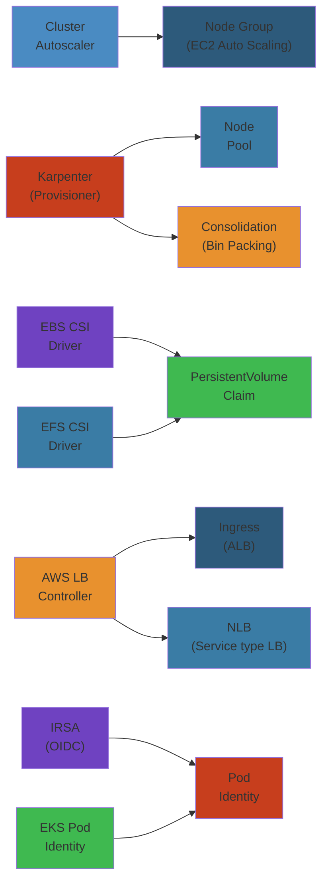
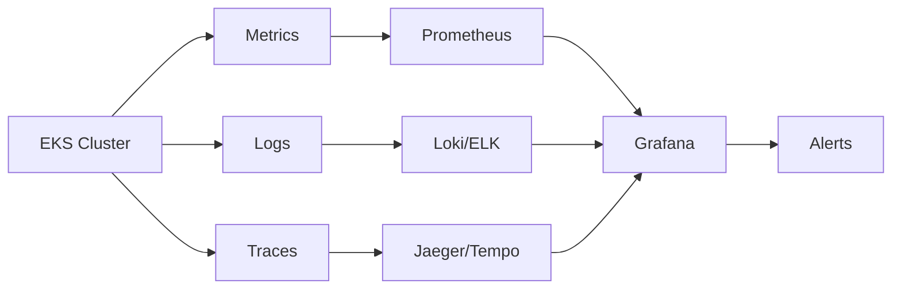

# ☸️ EKS Operations — Complete Deep Dive




## Table of Contents


- [Managed vs Self-Managed vs Fargate](#managed-vs-self-managed-vs-fargate)
- [Cluster Autoscaler vs Karpenter](#cluster-autoscaler-vs-karpenter)
- [EBS CSI Driver](#ebs-csi-driver)
- [EFS CSI Driver](#efs-csi-driver)
- [FSx for Lustre CSI](#fsx-for-lustre-csi)
- [IRSA (IAM Roles for Service Accounts)](#irsa-iam-roles-for-service-accounts)
- [EKS Pod Identity](#eks-pod-identity)
- [CNI Deep Dive](#cni-deep-dive)
- [ALB Ingress vs AWS Load Balancer Controller](#alb-ingress-vs-aws-load-balancer-controller)
- [Gateway API on EKS](#gateway-api-on-eks)
- [EKS Add-Ons](#eks-add-ons)
- [Bottlerocket](#bottlerocket)
- [EKS Anywhere & EKS Distro](#eks-anywhere--eks-distro)
- [EKS Blueprints](#eks-blueprints)
- [Simplest Mental Model](#simplest-mental-model)

---

## Managed vs Self-Managed vs Fargate


```text
Managed Node Group:
  Auto Scaling Group with EC2s. AWS manages AMI, health, labels, join.
  You customize via launch template.

Self-Managed:
  You manage AMI, bootstrap, ASG, SG, OS patches, node draining.

Fargate:
  No nodes. Pods run on AWS-managed infra. No node management.
  Limitations: no DaemonSets, no privileged, no EBS.
```

| Aspect | Managed | Self-Managed | Fargate |
|--------|---------|-------------|---------|
| AMI updates | Automated | Manual | N/A |
| Node health | AWS | You | N/A |
| Customization | Launch template | Full control | None (CPU/mem only) |
| Scaling | ASG | ASG | Immediate |
| Cost | EC2 instance | EC2 instance | Per pod (vCPU+mem) |

**Pick managed** for 90% of workloads. **Self-managed** for custom CNI/kernel modules. **Fargate** for security-isolated, spiky apps.

---

## Cluster Autoscaler vs Karpenter


```text
Cluster Autoscaler: Pending Pod → ASG scale-up → Node in ~3-5 min
Karpenter: Pending Pod → EC2 API → Node in ~30-60s

Karpenter advantages:
  • Any instance type, not limited by ASG
  • Advanced binpacking (per-pod, not per-group)
  • Consolidation (replaces inefficient nodes)
  • Multi-arch native support
  • Spot weights per NodePool
```

| Feature | Cluster Autoscaler | Karpenter |
|---------|-------------------|-----------|
| Mechanism | ASG-based | Direct EC2 API |
| Node speed | ~3-5 min | ~30-60s |
| Instance diversity | Fixed by ASG | Any type |
| Binpacking | Basic | Advanced |
| Consolidation | ❌ | ✅ |
| Configuration | ConfigMap + ASG | CRDs |

---

## EBS CSI Driver


Dynamic provisioning of EBS volumes. `WaitForFirstConsumer` ensures AZ alignment with pod.

```yaml
apiVersion: storage.k8s.io/v1
kind: StorageClass
metadata:
  name: gp3
provisioner: ebs.csi.aws.com
parameters:
  type: gp3
  iops: "3000"
  throughput: "125"
reclaimPolicy: Delete
volumeBindingMode: WaitForFirstConsumer
allowVolumeExpansion: true
```

**Snapshots & FSR**: VolumeSnapshots via `snapshot.storage.k8s.io/v1`. Fast Snapshot Restore pre-warms snapshot data (up to 10 FSR per volume). **Limitations**: ReadWriteOnce only, AZ-bound, no Fargate.

---

## EFS CSI Driver


Shared file storage with ReadWriteMany access across pods and AZs. Works on Fargate.

```yaml
apiVersion: storage.k8s.io/v1
kind: StorageClass
metadata:
  name: efs-sc
provisioner: efs.csi.aws.com
parameters:
  provisioningMode: efs-ap
  fileSystemId: fs-12345678
```

**Use cases**: WordPress uploads, GitLab repos, shared configs.

---

## FSx for Lustre CSI


| Feature | EFS | FSx for Lustre |
|---------|-----|---------------|
| Protocol | NFS v4 | Lustre (POSIX) |
| Performance | Up to 10 GB/s | Up to 1 TB/s |
| Latency | ms | Sub-ms |
| Use case | Shared config | HPC, ML training |
| Fargate | ✅ | ❌ (EC2 only) |
| S3 linkage | ❌ | ✅ |

---

## IRSA (IAM Roles for Service Accounts)


```text
1. Create OIDC provider for EKS cluster
2. IAM role with OIDC trust (sub, aud conditions)
3. Annotate ServiceAccount with role ARN
4. Pod token → STS exchange → AWS credentials
```

Token injected via projected volume, auto-rotated, scoped to the pod's service account.

---

## EKS Pod Identity


Simpler than IRSA — no OIDC provider management. EKS agent handles credential vending directly.

| Aspect | IRSA | Pod Identity |
|--------|------|-------------|
| Setup | OIDC + trust policy | IAM role + association |
| Steps | More | Fewer |
| Credential source | OIDC → STS | EKS agent → STS |

---

## CNI Deep Dive


```text
VPC CNI Default: Pods get VPC IPs from ENIs. Max pods = ENIs × IPs/ENI - 1.
Prefix Delegation: /28 prefix per ENI → 110 pods/node on c5.large (vs 29).
Custom Networking: Separate CIDR for pods (10.100.0.0/16) vs nodes (10.0.1.0/24).
Security Groups Per Pod: Attach SG directly to pod via SecurityGroupPolicy CRD.
```

---

## ALB Ingress vs AWS Load Balancer Controller


AWS LB Controller supports: ALB + NLB, IngressGroup (shared ALB), SSL redirect, OIDC auth, target type `ip` or `instance`, Gateway API.

```yaml
apiVersion: networking.k8s.io/v1
kind: Ingress
metadata:
  annotations:
    alb.ingress.kubernetes.io/scheme: internet-facing
    alb.ingress.kubernetes.io/target-type: ip
    alb.ingress.kubernetes.io/group.name: shared-alb
spec:
  ingressClassName: alb
  rules:
  - host: api.example.com
    http:
      paths:
      - path: /v1/orders
        pathType: Prefix
        backend:
          service:
            name: order-service
            port: { number: 80 }
```

---

## Gateway API on EKS


Gateway (LB) → HTTPRoute (routing) → Service (backend). Benefits: cross-vendor standard, role-oriented (ops vs dev), extended routing, service mesh integration.

---

## EKS Add-Ons


| Add-On | Purpose | Required |
|--------|---------|----------|
| vpc-cni | Pod networking | Yes |
| coredns | DNS | Yes |
| kube-proxy | Service networking | Yes |
| aws-ebs-csi-driver | EBS | Optional |
| aws-efs-csi-driver | EFS | Optional |
| aws-load-balancer-controller | ALB/NLB | Optional |

```awscli
aws eks create-addon --cluster-name my-cluster \
  --addon-name aws-ebs-csi-driver --addon-version v1.32.0-eksbuild.1
```

---

## Bottlerocket


Container-optimized OS by AWS. Immutable root, atomic A/B updates, no package manager. Host containers for SSH/debug. Smaller attack surface, faster boot.

---

## EKS Anywhere & EKS Distro


| | EKS (Managed) | EKS Anywhere | EKS Distro |
|---|---|---|---|
| Control plane | AWS | You | You |
| Workers | AWS | Your infra | Your infra |
| Upgrades | Auto/manual | Manual (CAPI) | Manual |
| Pricing | $0.10/hr/cluster | Subscription | Free |

**EKS Anywhere**: On-prem (VMware/Outposts). Same tooling. **EKS Distro**: Open-source K8s distro, free, for on-prem/air-gapped.

---

## EKS Blueprints


Open-source framework (Terraform/CDK): VPC + EKS + node groups + add-ons + teams (namespace, IAM, quotas). GitOps-ready (ArgoCD/Flux).

---

## Simplest Mental Model


```text
MANAGED NODES   =  Temp agency workers. Trained and managed.
SELF-MANAGED    =  Direct hires. Full HR control.
FARGATE         =  Robots. No visible people, just work done.

CLUSTER         =  Indecisive manager. Adds desks slowly.
AUTOSCALER         Takes ~5 min.

KARPENTER       =  Efficiency expert. Perfect desk instantly.
                   Consolidates half-empty desks.

EBS CSI         =  Dedicated USB-C drive. Fast. One computer.
EFS CSI         =  Network shared drive. Everyone reads.

IRSA/POD ID     =  Each pod has its own employee badge.
                   Used to share the node's badge.

CNI PREFIX      =  Phone numbers in blocks, not individually.
DELEGATION         More numbers per desk.

BOTTLEROCKET    =  Game console OS. Locked down. Atomic updates.

EKS ANYWHERE    =  Factory playbook in your garage.
EKS BLUEPRINTS  =  Pre-designed factory blueprint. Just build.
```


---

## Code Examples


```python
import boto3
import yaml

eks = boto3.client('eks')
ec2 = boto3.client('ec2')

# List clusters and node health
def eks_cluster_health():
    clusters = eks.list_clusters()['clusters']
    for name in clusters:
        desc = eks.describe_cluster(name=name)['cluster']
        status = desc['status']
        version = desc['version']
        endpoints = desc.get('endpoint', 'N/A')
        print(f"{name}: status={status}, version={version}, endpoint={endpoints}")

# Create a managed node group with launch template
def create_managed_nodegroup(cluster: str, nodegroup: str, subnet_ids: list):
    lt = ec2.create_launch_template(
        LaunchTemplateName=f'{nodegroup}-lt',
        LaunchTemplateData={
            'InstanceType': 'm5.large',
            'BlockDeviceMappings': [{
                'DeviceName': '/dev/xvda',
                'Ebs': {'VolumeSize': 100, 'VolumeType': 'gp3'}
            }],
            'MetadataOptions': {'HttpTokens': 'required'}
        }
    )
    eks.create_nodegroup(
        clusterName=cluster, nodegroupName=nodegroup,
        scalingConfig={'minSize': 2, 'maxSize': 10, 'desiredSize': 3},
        subnets=subnet_ids, instanceTypes=['m5.large', 'm5a.large'],
        launchTemplate={'name': lt['LaunchTemplate']['LaunchTemplateName'],
                        'version': '$Default'},
        capacityType='ON_DEMAND'
    )

# Generate IRSA IAM policy
def irsa_trust_policy(oidc_provider: str, namespace: str, service_account: str) -> dict:
    return {
        'Version': '2012-10-17',
        'Statement': [{
            'Effect': 'Allow',
            'Principal': {'Federated': f'arn:aws:iam::123456789012:oidc-provider/{oidc_provider}'},
            'Action': 'sts:AssumeRoleWithWebIdentity',
            'Condition': {
                'StringEquals': {f'{oidc_provider}:sub': f'system:serviceaccount:{namespace}:{service_account}'}
            }
        }]
    }
```

```bash
# Drain a node gracefully
NODE_NAME=$(kubectl get nodes -l nodegroup-type=spot -o name | head -1)
kubectl drain $NODE_NAME --ignore-daemonsets --delete-emptydir-data

# Upgrade a managed node group
aws eks update-nodegroup-version --cluster-name prod --nodegroup-name spot-4
```

---

## Common Failure Modes


**Problem**: CNI IP exhaustion causing pods stuck in ContainerCreating

**Root cause**: AWS VPC CNI assigns pod IPs from the VPC subnet. Each EC2 instance has a maximum number of ENIs and IPs per ENI (e.g., m5.large: 3 ENIs × 10 IPv4 = 29 max pods). Once all IPs are consumed, new pods cannot start and remain in `ContainerCreating` with reason `IPAMD: no IPs available`.

**Detection**: `kubectl describe pod` shows `Failed to create pod sandbox: IPAMD: Insufficient free IPs`. Node conditions show `PodCIDRNotAvailable`. VPC subnet may have free IPs but the ENI slot count per node is exhausted.

**Solution**: Enable prefix delegation (`AWS_VPC_CNI_PRE_DELEGATION_PREFIX: true`) — assigns /28 prefixes per ENI instead of individual IPs, increasing pod density (c5.large: 29 → 110 pods). Use larger instance types for high-density workloads. Enable custom networking with a separate CIDR for pods. If VPC IPs are scarce, use Calico with IPIP or Cilium with overlay mode (pods get non-VPC IPs).

**Problem**: Karpenter or Cluster Autoscaler failing to scale down due to PDBs and taints

**Root cause**: PodDisruptionBudgets prevent node termination if it would violate availability guarantees. Karpenter consolidation may find a cheaper node but cannot move pods because of permissive PDBs that block eviction. Taints on nodes (e.g., `CriticalAddonsOnly`) prevent Karpenter from scheduling replacement pods.

**Detection**: Karpenter logs show `consolidation failed due to PDB blocking`. Cluster Autoscaler logs show `scale-down blocked: pod PDB minAvailable`. Nodes remain at high count despite low utilization.

**Solution**: Configure PDBs with realistic `minAvailable` or `maxUnavailable` that allow at least one pod to be evicted at a time. Use `cluster-autoscaler.kubernetes.io/safe-to-evict: "true"` annotation on non-critical pods. For Karpenter, set `ttlSecondsAfterEmpty` for graceful empty node removal. Use `karpenter.sh/do-not-evict: "true"` for truly critical workloads.

---

## Interview Questions


### Q1: Compare EKS Fargate, Managed Node Groups, and Self-Managed Nodes — when would you use each?


**Answer**: **Fargate** eliminates node management entirely — no EC2 instances to patch or scale. Use it for security-isolated workloads, spiky/batch jobs, or teams without Kubernetes operations expertise. Limitations: no DaemonSets, no privileged containers, no EBS volumes, limited GPU support. **Managed Node Groups** are best for 90% of production workloads — AWS handles AMI updates, node health replacement, and scaling. Use when you need custom instance types, GPUs, or DaemonSets. **Self-Managed** is for edge cases: custom CNI plugins (non-AWS), custom kernel modules, specialized AMI configurations, or regulatory requirements that demand full OS control.

### Q2: How would you upgrade an EKS cluster from 1.27 to 1.29 with zero downtime?


**Answer**: Plan a two-version upgrade (1.27 → 1.28 → 1.29) since EKS only supports sequential upgrades. For each minor version: first upgrade the control plane (AWS handles this, ~15 min). Then upgrade managed node groups — create a new node group with the latest AMI matching the new version, cordon and drain old nodes, then delete the old node group. For self-managed nodes, update the bootstrap script's `--kubelet-extra-args` to the new version and roll the ASG. During the process, ensure at least 2 replicas of each service, PDBs set to `maxUnavailable: 1`, and PodAntiAffinity configured. Test add-on compatibility (CNI, CoreDNS, kube-proxy) before upgrading — upgrade add-ons first. Use a canary cluster before production. Rollback: if control plane upgrade fails in the 24h window, contact AWS support; node group rollback is a redeploy with old AMI.

## Edge Cases and Advanced Scenarios


| Scenario | Challenge | Solution |
|----------|-----------|----------|
| **IPv6 EKS clusters** | Pod networking with IPv6-only | EKS supports dual-stack (IPv4 + IPv6) since 1.21. Use IPv6 CIDR for VPC, ENA support required |
| **GPU node allocation** | GPU pods stuck pending waiting for GPU | Set `resource.limit.nvidia.com/gpu` on pod spec. Use `nodeSelector` for GPU node pools. Install NVIDIA device plugin as DaemonSet |
| **Bottlerocket SSH access** | No package manager, read-only filesystem | Use `bottlerocket` control container for admin tasks. `aws ssm start-session` for shell access |
| **EBS volume zone mismatch** | PVC cannot bind because volume is in different AZ | Use `WaitForFirstConsumer` volume binding mode. Deploy pod first (pinned to AZ), then PVC binds to same AZ |
| **Cluster DNS outage** | CoreDNS becomes unhealthy, cascading DNS failures | Run 2+ CoreDNS replicas, spread across nodes with PodAntiAffinity. Monitor CoreDNS `forward` latency. Use node-local DNS cache |

## Cross-References


- [EC2 Networking & Security](/05-cloud/aws/ec2/02-ec2-networking-security.md) — Nitro system, instance types, ENI limits
- [ECS Deployment Patterns](/05-cloud/aws/ecs/02-ecs-deployment-patterns.md) — Capacity providers, Fargate comparison
- [Kubernetes Networking](/07-kubernetes/03-kubernetes-networking.md) — CNI plugins, network policies, Ingress
- [Kubernetes Security](/07-kubernetes/04-kubernetes-security.md) — RBAC, Pod Security, OPA Gatekeeper
- [CloudWatch Observability](/05-cloud/aws/cloudwatch/02-cloudwatch-observability.md) — Container Insights, Prometheus metrics


## Observability




### Key Metrics


| Metric | Unit | Threshold | Indicates |
|--------|------|-----------|-----------|
| Pod restart count | count/min | < 1 | CrashLoopBackOff |
| Node CPU pressure | % | < 80% | Node overcommitment |
| Node memory pressure | % | < 80% | Memory fragmentation |
| API server latency (p99) | ms | < 1000ms | API server overload |
| etcd fsync latency | ms | < 10ms | etcd disk I/O bottleneck |
| CoreDNS forward latency | ms | < 50ms | DNS resolution issues |
| CNI pod startup delay | s | < 5s | Network plugin issues |
| kubelet PLEG relist | s | < 1s | Container runtime issues |

### Logs


- **ERROR**: Pod CrashLoopBackOff, Node NotReady, OOMKilled, API server errors, etcd leader changes
- **WARN**: Pod pending > 5min, node pressure, PVC pending, ImagePullBackOff
- **INFO**: Node joined, deployment scaled, service created, configmap updated
- **DEBUG**: API request details, controller reconciliation loops, scheduler decisions

### Traces


Use OpenTelemetry operator with auto-instrumentation for envoy/kube-api. Trace API server request flow. Use Jaeger for distributed tracing across services.

### Alerts


| Severity | Condition | Response |
|----------|-----------|----------|
| P0 | Node NotReady > 5min | Drain and replace node |
| P0 | etcd leader changes > 3 in 5min | Check etcd cluster health |
| P1 | Pod crash loop > 5 restarts | Check pod logs and events |
| P1 | API server latency > 2s | Scale API server, check etcd |
| P2 | CoreDNS latency > 100ms | Scale CoreDNS, check network |
| P2 | Node disk pressure | Clean up images, add storage |

### Dashboards


**Cluster Overview**: node count (Ready/NotReady), pod count (Running/Pending/Failed), CPU/memory utilization, API server request rate and latency, etcd leader and latency.

**Workload Dashboard**: per-deployment pod count, restart rate, CPU/memory usage, network TX/RX, PVC usage, rollout status.

**Networking Dashboard**: CoreDNS query rate/latency, CNI pod assign latency, service/endpoint count, network policy count.


## Common Failures


### Failure: Node Pressure (Disk/Memory/PID)


- **Symptoms**: Pods evicted from node, `NodeHasDiskPressure` or `NodeHasMemoryPressure` condition true. `kubectl describe node` shows pressure conditions.
- **Root Cause**: Container logs filling disk, Docker image buildup, memory leak in system components, PID exhaustion from too many containers.
- **Detection**: `node_disk_pressure` metric true. `kubelet_eviction_count` increasing. `node_filesystem_free` low. Container runtime logs show "no space left on device".
- **Recovery**: 1) `kubectl drain <node>` to evict pods. 2) Clean up unused images: `docker system prune -a` or `crictl rmi --prune`. 3) Remove large container logs: `truncate -s 0 /var/log/containers/*.log`. 4) Increase node size or add more nodes.
- **Prevention**: Configure log rotation in container runtime (max-size, max-file). Use node auto-repair (Karpenter/AWS Node Health Check). Set resource limits on pods. Monitor disk usage (alert at 80%).
- **Production Story**: A logging-heavy service wrote 50GB of logs per day per pod. Without log rotation, node disk filled in 3 days. All pods evicted, cluster degraded. Fix: added `--log-rotate-max-size=10M --log-rotate-max-backups=5` to container runtime, and moved logs to CloudWatch via fluentd sidecar.

### Failure: CrashLoopBackOff with OOMKilled


- **Symptoms**: Pod restarts repeatedly. `kubectl get pods` shows `CrashLoopBackOff`. `kubectl describe pod` shows `OOMKilled` exit reason.
- **Root Cause**: Memory limit too low for the workload. Memory leak in application. Heap grows until limit reached, then killed by OOM killer.
- **Detection**: `container_memory_working_set_bytes` equals memory limit. Pod restart count increasing. Exit code 137 (SIGKILL).
- **Recovery**: 1) Increase memory limit temporarily. 2) `kubectl logs --previous` to check last crash logs. 3) Identify memory leak via heap dump. 4) Roll back to known-good version if recent deploy caused it.
- **Prevention**: Set resource requests equal to limits (Guaranteed QoS). Monitor memory usage trend. Add memory limits based on load testing. Use VPA for initial sizing. Implement memory leak detection in CI.
- **Production Story**: A Java microservice had `-Xmx512m` but container memory limit was 256MB. The JVM allocated heap up to 512MB, got OOMKilled within 30s of each restart. Took 2h to diagnose because heap dump was lost on each restart. Fix: set `-Xmx200m` and added `-XX:+HeapDumpOnOutOfMemoryError -XX:HeapDumpPath=/dumps/`.

### Failure: CoreDNS Outage


- **Symptoms**: Services can't resolve DNS, inter-service communication fails, curl to service names fails. `nslookup kubernetes.default.svc.cluster.local` times out.
- **Root Cause**: CoreDNS pod(s) OOM or CrashLoopBackOff. Network policy blocking DNS traffic (port 53). Node-local DNS cache misconfigured. CoreDNS forwarder to upstream DNS fails.
- **Detection**: CoreDNS pod restart count > 0. `coredns_dns_request_duration_seconds` p99 > 5s. DNS query failures in application logs. `kubectl -n kube-system logs -l k8s-app=kube-dns` shows errors.
- **Recovery**: 1) Scale CoreDNS: `kubectl -n kube-system scale deployment/coredns --replicas=3`. 2) Check CoreDNS logs for errors. 3) Check network policies. 4) Restart CoreDNS pods.
- **Prevention**: Run 2+ CoreDNS replicas with PodAntiAffinity. Set resource requests/limits. Monitor CoreDNS metrics with Prometheus. Use node-local DNS cache. Set `upstream` DNS to reliable resolvers.
- **Production Story**: A cluster-wide network policy change accidentally blocked UDP port 53 for all pods not in `kube-system`. CoreDNS could still talk to upstream but pods couldn't talk to CoreDNS. All service discovery failed for 15 minutes before rollback. Fix: added explicit network policy allowing egress to CoreDNS on port 53 for all namespaces.

### Failure: CNI Pod Networking Delay


- **Symptoms**: New pods take 30s-2min to reach `Running` state. Existing pods work fine. Pod creation latency spikes.
- **Root Cause**: AWS VPC CNI IP exhaustion (ENI and /28 subnets). IPAMD (AWS CNI's IP allocator) WARM_ENI_TARGET or WARM_IP_TARGET too low for burst scale-up. Subnet CIDR exhaustion.
- **Detection**: `aws-node` pod logs show "failed to assign IP address". `kubectl describe pod <pending-pod>` shows "could not assign IP". `maxIP` in VPC CNI metrics near limit.
- **Recovery**: 1) Increase `WARM_IP_TARGET` and `WARM_ENI_TARGET`. 2) Add secondary CIDR blocks. 3) Use custom networking with larger subnets. 4) Switch to IPv6 mode.
- **Prevention**: Monitor IP usage with VPC CNI metrics. Pre-warm IP pool with `WARM_IP_TARGET=5`. Reserve CIDR blocks for pod expansion. Use Karpenter for faster node provisioning. Consider Cilium with ENI mode for better IP management.
- **Production Story**: During a major deployment, 500 new pods were created simultaneously. VPC CNI had only 10 warm IPs. Each ENI attachment took 3-5s, and each new EC2 instance added only 1 ENI per minute. Pod startup latency went from 5s to 2min. Fix: set `WARM_IP_TARGET=20` and `WARM_ENI_TARGET=5`.

### Failure: API Server Overload


- **Symptoms**: `kubectl` commands timeout, controller managers report errors, etcd leader changes, pod creation fails.
- **Root Cause**: Too many API requests from controllers, operators, or CI/CD. `kube-controller-manager` and `kube-scheduler` make frequent API calls. Aggressive watches from informers. Controller loops without rate limiting.
- **Detection**: API server `request_duration_seconds` p99 > 10s. etcd `backend_commit_duration_seconds` > 1s. `kubectl top` shows high API server CPU/memory. List-watch request rate too high.
- **Recovery**: 1) Identify heavy API consumers via API server audit logs. 2) Throttle aggressive controllers. 3) Scale API server vertically. 4) Restart etcd if stuck.
- **Prevention**: Set `--max-requests-inflight` and `--max-mutating-requests-inflight`. Use API priority and fairness (APF) to isolate heavy controllers. Monitor etcd latency. Avoid list operations on large resources.
- **Production Story**: A monitoring operator used `List` on all pods every 5 seconds across 500 nodes (10K pods). This saturated the API server and etcd. Fix: changed to `Watch` + `Informer` pattern with `ResyncPeriod=5m`.
