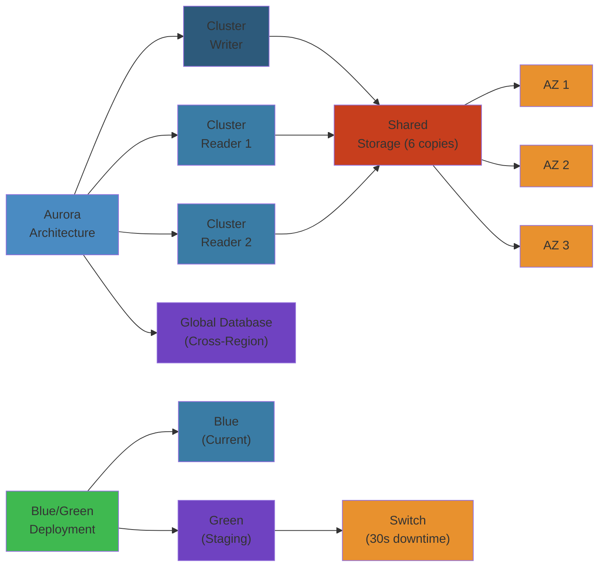
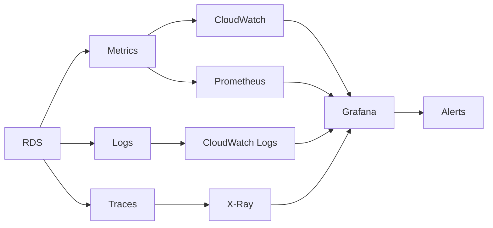

# 🗄️ RDS Advanced Patterns — Complete Deep Dive




## Table of Contents


- [Multi-AZ vs Read Replicas](#multi-az-vs-read-replicas)
- [RDS Proxy](#rds-proxy)
- [Aurora vs RDS Architecture](#aurora-vs-rds-architecture)
- [Aurora Serverless v2 & Global Database](#aurora-serverless-v2--global-database)
- [Aurora Parallel Query & RDS Custom](#aurora-parallel-query--rds-custom)
- [Performance Insights](#performance-insights)
- [Blue/Green Deployments](#bluegreen-deployments)
- [Zero-Downtime Patching & Cross-Region Replicas](#zero-downtime-patching--cross-region-replicas)
- [Encryption at Rest & In Transit](#encryption-at-rest--in-transit)
- [IAM Database Auth & Activity Streams](#iam-database-auth--activity-streams)
- [RDS Proxy vs PgBouncer](#rds-proxy-vs-pgbouncer)
- [Export to S3 & Event Notifications](#export-to-s3--event-notifications)
- [RDS Best Practices Summary](#rds-best-practices-summary)
- [Simplest Mental Model](#simplest-mental-model)

---

## Multi-AZ vs Read Replicas


```text
Multi-AZ: Writer --sync--> Standby (diff AZ). Single endpoint. Auto-failover 60-120s. No read scaling.
Read Replicas: Writer --async--> RR (same/cross region). Separate reader endpoint. Up to 15 replicas.

```

| Feature | Multi-AZ | Read Replicas |
|---------|----------|---------------|
| Purpose | HA/failover | Read scaling |
| Replication | Synchronous | Asynchronous |
| Read traffic | No | Yes |
| Cross-region | No | Yes |
| Failover | Automatic | Manual (promote) |

**Important**: Multi-AZ sync replication adds write latency (must ack in both AZs). Read Replicas use async - always some lag. Monitor with `ReplicaLag`. Replicas can be promoted to primary for DR.

## RDS Proxy


Fully managed connection pooler: app -> RDS Proxy -> RDS/Aurora.

**Connection pooling**: Reuses DB connections across many clients. Essential for Lambda where each invocation creates a new connection - without Proxy, Lambda can exhaust DB max connections.

**IAM auth**: Enable IAM database auth without modifying app code. The Proxy handles credential exchange with the DB.

**Multiplexing**: One DB connection serves multiple client connections. Drastically reduces DB load from connection management overhead.

**Failover preservation**: Connections survive Multi-AZ failover. App doesn't see connection drops.

**Cost**: $0.015/hr per ACU. Each ACU handles ~2000 connections. Best for Lambda + RDS, serverless, connection-heavy apps.

## Aurora vs RDS Architecture


```text
RDS: EC2 + EBS (block storage, max 16 TB)
Aurora: Writer + 6 storage copies across 3 AZs (shared storage, max 128 TB)

```

| | RDS | Aurora |
|---|---|---|
| Storage | EBS, max 16 TB | 6 copies, 3 AZ, max 128 TB |
| Replicas | 15 async, can lag | 15, < 10ms (same storage) |
| Failover | 60-120s (redo log replay) | < 30s (no redo log) |
| Backup | Affects I/O performance | Continuous, zero impact |
| Cost | Lower | Higher (~20%+) |

Aurora's shared storage means replicas have zero copy overhead. Failover is fast because no redo log replay needed.

## Aurora Serverless v2 & Global Database


**Serverless v2**: Auto-scales 0.5 to 128 ACU (~2 GB memory + CPU each). Sub-second scaling with warm pool prevents cold starts. Supports Multi-AZ, Global DB, read replicas. vs v1: v2 has fine-grained 0.5 ACU, Multi-AZ, Global DB - v1 was single-AZ only.

**Global Database**: Primary region -> async replication to secondaries. RPO < 1 second. Up to 16 read replicas per secondary. Promote to primary in ~1 minute for DR. Write forwarding from secondary to primary. For global applications needing low-latency reads worldwide.

## Aurora Parallel Query & RDS Custom


**Parallel Query**: Pushdown COUNT, SUM, AVG, GROUP BY to Aurora storage layer. Storage processes data in-place and returns only aggregated results. Up to 100x faster for analytic queries. No impact on OLTP workload. No extra cost.

**RDS Custom**: Full OS + database access (SSH/RDP) for SQL Server and Oracle. AWS still manages backup, replication, failover. You manage OS patches, custom extensions, 3rd-party tools, kernel parameters. For BYOL and specific performance tuning needs.

## Performance Insights


DB load visualization: AAS (Average Active Sessions). Breakdown by Top SQL (which queries consume most load), Waits (IO:write, CPU, Lock), Hosts (which app server), Users (which DB user).

**Retention**: 7 days free, 2 years paid. Automated dashboards for common analyses.

**Key insight**: AAS > 2x vCPU count = database is overloaded.

## Blue/Green Deployments


Zero-downtime schema changes and major version upgrades. Blue (prod, current) <--sync--> Green (staging, upgraded + schema changes applied). Switchover in < 1 minute. No data loss. Rollback = point DNS back to Blue.

## Zero-Downtime Patching & Cross-Region Replicas


**Patching**: RDS Multi-AZ (patch standby -> failover -> patch old primary, < 60s). Aurora (storage layer patching, no downtime with Proxy). Major version upgrades: use Blue/Green deployments.

**Cross-Region Replicas**: Async replication to other AWS regions. Uses KMS cross-region encryption keys. Promote any replica to standalone primary. For disaster recovery, local reads for global users, migration zero-downtime cutover.

## RDS Event Subscription Deep Dive


RDS Event Notifications via SNS. Categories with namespaces: **DB Instance** (creation, deletion, failover, maintenance, scaling, backup, configuration change, low storage, read replica), **DB Parameter Group** (reset, modification), **DB Security Group** (creation, deletion, revocation, authorization), **DB Snapshot** (creation, deletion, copy, sharing, restoration), **DB Cluster** (creation, deletion, failover, scaling, maintenance).

**Severity levels**: `error` and `notification`. Error events need immediate attention. Set SNS filter policy per severity.

**Tag-based filtering**: Get events by tags (`Environment=Production`). Subscribe team-specific SNS topics. No overlapping subscriptions (duplicate notifications).

**Automation**: EventBridge catch RDS events with CloudTrail. Launch Lambda to auto-scale, reboot, failover, or tag. Typical: RDS instance stopped -> Lambda snapshots -> sends alert.

## Instance Scheduler & Automation


**Stop/Start scheduling**: AWS Instance Scheduler (Solution) on EC2 + DynamoDB + Lambda. Tag-based: `Schedule=office-hours`. Stop non-prod RDS instances off-hours (up to 70% savings). Start-stop doesn't affect storage billing.

**Maintenance windows**: Defined 30-60m weekly. Fallback - occurs at next window if first fails. Allows pending modifications to apply. OS patching requires restart (less than 60s with Multi-AZ).

**Automated backups with retention**: Set >7 days for PITR. Backup window separate from maintenance window. Manual snapshots store indefinitely.

## Encryption at Rest & In Transit


**At rest**: AES-256 via KMS. Set at DB creation. Cannot encrypt existing unencrypted instance directly - create snapshot, restore to encrypted copy.

**In transit**: TLS/SSL. Enforce via parameter group: MySQL `require_secure_transport=ON`, PostgreSQL `ssl=ON`. RDS provides regional certificate bundles.

## IAM Database Auth & Activity Streams


**IAM DB auth**: `generate_db_auth_token()` produces 15-min token used as DB password. No passwords in code. Setup: enable IAM DB auth -> create DB user with AWSAuthenticationPlugin -> app gets token -> uses as password. Centralized access control via IAM policies.

**Activity Streams**: Real-time database audit to Kinesis. Captures SQL, login/logout, DDL, DML. < 1s latency. No DB plugin needed. Firehose to S3/OpenSearch. For compliance (GDPR, HIPAA, SOC 2, PCI DSS).

## RDS Proxy vs PgBouncer


| Feature | RDS Proxy | PgBouncer |
|---------|-----------|-----------|
| Managed | Yes (AWS, HA built-in) | Self-managed on EC2 |
| IAM auth | Native | Manual integration |
| Failover persistence | Yes (connections preserved) | Dropped on failover |
| Lambda optimization | Yes (pre-warmed connections) | Surge risk |
| Cost | $0.015/hr per ACU | Free (open source) |

**RDS Proxy** for Lambda/serverless workloads. **PgBouncer** for free self-managed connection pooling on EC2.

## Export to S3 & Event Notifications


**Export to S3**: Export snapshots to Apache Parquet (columnar, compressed) in S3. Per-table selection. Query with Athena, Redshift Spectrum, Glue ETL. No production impact. For data lakes, analytics, compliance archives.

**Event Notifications**: RDS publishes to SNS. Categories: failover, backup, maintenance, scaling, creation/deletion, read replica, low storage. Subscribe email/Lambda/SQS.

## RDS Best Practices Summary


**HA**: Always Multi-AZ for production. Use RDS Proxy. Enable automated backups > 7 days. Enable deletion protection.

**Performance**: Right-size with monitoring. Use Performance Insights to find problematic queries. Enable enhanced monitoring.

**Security**: Encryption at rest + TLS in transit. IAM DB auth. Restrict SGs. Enable deletion protection.

**Cost**: Reserved Instances (30-60%). Storage Auto Scaling. Delete unused snapshots.

**Monitoring**: Set CloudWatch alarms on CPUUtilization > 80%, DatabaseConnections > 80% of max, FreeStorageSpace < 10% (set storage autoscaling), ReplicaLag > 60s (check primary CPU). Performance Insights > 7 days for prod. Enhanced Monitoring for OS-level diagnostics.

## More RDS Features


**RDS Custom for Oracle/SQL Server**: Full OS + DB admin access via SSH/RDP. Customize database engine parameters, apply patches, install 3rd-party tools. Still get automated backups, automatic failover, built-in monitoring. For legacy apps requiring OS-level control. Supports up to 64 TiB storage (Oracle). Can't use Multi-AZ with certain customizations.

**Aurora Auto Scaling**: Automatically adds read replicas when CPU or connections exceed threshold. `target-tracking-scaling` policy scales on `AverageActiveConnections`. Over-provisioning not needed. Scales down when load drops. Works with RDS Proxy for zero-connection-drop scaling. Min 1 replica, max 15.

**Database Migration Service (DMS)**: Continuous replication with CDC (Change Data Capture). Source -> target, full load + ongoing sync. Supports homogeneous (MySQL->MySQL, Oracle->Oracle) and heterogeneous migrations (Oracle->Aurora, SQL Server->PostgreSQL). Schema Conversion Tool (SCT) for heterogenous. Use DMS with SCT for cloud migrations with minimal downtime.

**Option Groups**: Configure engine-specific features. MySQL: MEMCACHED (InnoDB memcache), MARIADB: AWSDIAGNOSTICS. Oracle: OEM, APEX, SSL, Timezone, SPATIAL, OLS, BIP, HADR, S3_INT, JVM, MULTITENANT, OEMAGENT. SQL Server: SSRS, SSIS, SSAS, AlwaysOn. PostgreSQL: pgaudit, pglogical, pgpool. Can't modify option groups when 0.5-2x maintenance margin.

**Scalability Failure Modes**: Storage full (set storage autoscaling), connection storm (RDS Proxy or PgBouncer), lock contention (use Performance Insights to find blocking sessions), write-heavy replica lag (upgrade primary, reduce replica count, use Aurora).

**RDS vs Aurora Cost Comparison**: RDS db.r6g.large ~$175/mo plus EBS. Aurora db.r6g.large ~$200/mo plus I/O ($0.20/1M requests). For low IO (<10M/mo), RDS cheaper. For high IO with failover need, Aurora's fast failover and 6-way storage may justify premium.

**Storage Types**: gp3 (3000 IOPS baseline, up to 16000, 125 MB/s, scalable independently of storage size). io1/io2 Block Express (up to 256K IOPS, sub-millisecond latency). Magnetic (legacy, avoid). Aurora: auto-scaling storage, no provisioning needed, pay per GB-month + I/O.

**Backup Strategies**: Automated daily + PITR (point-in-time recovery). Manual snapshots (indefinite retention). Cross-region snapshots (encrypted via DMS or KMS re-encryption). Export snapshot to S3 for data lake. Backup window configurable (choose low-traffic period). Restore: snapshot restore (fast, new instance) or PITR (any 5-minute window within retention).

**Monitoring Deep Dive**: Enhanced Monitoring (OS-level metrics: CPU, memory, file system, disk I/O, processes) vs Performance Insights (DB load, SQL-level). Unified CloudWatch Agent for RDS Custom (full OS telemetry).

**Performance Tuning Parameters**: MySQL: `innodb_buffer_pool_size` (70-80% RAM), `innodb_log_file_size` (larger = slower recovery, better write perf), `max_connections` (LEAST({DBInstanceClassMemory/9531392}, 5000)). PostgreSQL: `shared_buffers` (25% RAM), `effective_cache_size` (50-75% RAM), `work_mem` (sort/join memory per query, careful with concurrent queries), `maintenance_work_mem` (VACUUM, CREATE INDEX). Tune per workload using Parameter Groups. Overprovisioning shared_buffers causes double caching.

**Zero-ETL Integration**: Aurora MySQL -> Redshift direct integration (no DMS). Tables auto-sync for analytics. Near real-time (seconds). Use for operational analytics where OLTP data needs fast SQL analysis. No ETL overhead.

**RDS for MySQL vs PostgreSQL Decision Guide**: MySQL (InnoDB) for read-heavy, replication flexibility, JSON functions (MariaDB/MySQL 8.0), lower operational complexity. PostgreSQL for write-heavy, complex queries (CTE, window functions), GIS (PostGIS), full-text search, custom data types, PL/pgSQL stored procedures. Migration path: MySQL to Aurora MySQL (compatible). PostgreSQL to Aurora PostgreSQL (compatible).

**Connection Pool Sizing**: Max connections formula: `LEAST({DBInstanceClassMemory/9531392}, 5000)` for MySQL. For prod, limit app connections to 80% of max. Reserve connections for admin (superuser/reserved connections parameter). Use RDS Proxy to reduce active DB connections by 10x.

**Maintenance & Patching with RDS**: Parameters: immediate (static) vs pending reboot (dynamic). OS patches: automated during maintenance window. DB engine minor version upgrades: automatic (opt in) or manual. Major version upgrades: requires manual initiation (Blue/Green recommended). Zero-downtime patching with RDS Multi-AZ and Aurora.

**RDS Alarms Essentials**: Set CloudWatch alarms on:
- CPUUtilization > 80% (scale up or optimize queries)
- DatabaseConnections > 80% of max_connections (add RDS Proxy or scale)
- FreeStorageSpace < 10% (turn on Storage Auto Scaling)
- ReplicaLag > 60s for read replicas (investigate primary load)
- BurstBalance < 20% for gp2 (switch to gp3 for baseline IOPS)
- SwapUsage > 100 MB (memory pressure, insufficient RAM for workload)
- Deadlocks > 0 per minute (check application logic or contention)

---

## Simplest Mental Model


> **RDS = managed parking garage for databases.**
>
> Multi-AZ = spare tire (sync, auto-failover). Read Replicas = valet parks a copy elsewhere (async, manual-promote). RDS Proxy = traffic cop directing drivers to open spots. Aurora = conveyor belt sharing one garage (6 copies across 3 floors, < 30s failover). Serverless = garage that auto-expands. Performance Insights = dashboard showing which queries cause traffic jams. Blue/Green = backup garage to test changes before switchover.
>
> **Key decision**: Aurora vs RDS standard. Aurora costs more but gives 6-way replication, < 30s failover, 128 TB storage. Choose RDS for simple/small workloads. Choose Aurora for production HA needs.


---

## Code Examples


### Python with RDS Proxy


```python
import psycopg2
from boto3 import client as aws_client

# Connect via RDS Proxy (instead of RDS directly)
conn = psycopg2.connect(
    host="my-proxy.proxy-xxx.us-east-1.rds.amazonaws.com",
    port=5432,
    database="mydb",
    user="proxy_user",
    password="proxy_password"
)

# Use context manager (auto-close connection)
with conn.cursor() as cur:
    cur.execute("SELECT * FROM users WHERE id = %s", (123,))
    result = cur.fetchone()

conn.close()

```

### Node.js with Connection Pooling


```javascript
const { Pool } = require('pg');

const pool = new Pool({
  host: 'my-db.c9akciq32.us-east-1.rds.amazonaws.com',
  user: 'postgres',
  password: process.env.DB_PASSWORD,
  database: 'mydb',
  max: 20,  // max connections in pool
  idleTimeoutMillis: 30000,
  connectionTimeoutMillis: 2000,
});

pool.query('SELECT * FROM users', (err, res) => {
  if (err) console.error(err);
  console.log(res.rows);
});

```

### Java with Aurora Cluster Endpoints


```java
String writerEndpoint = "writer.cluster-xxx.us-east-1.rds.amazonaws.com";
String readerEndpoint = "reader.cluster-xxx.us-east-1.rds.amazonaws.com";

// Write operations
Connection writeConn = DriverManager.getConnection(
    "jdbc:postgresql://" + writerEndpoint + ":5432/mydb",
    "postgres", password);

// Read operations (load-balanced across replicas)
Connection readConn = DriverManager.getConnection(
    "jdbc:postgresql://" + readerEndpoint + ":5432/mydb",
    "postgres", password);

// Application routing
if (query.startsWith("SELECT")) {
    executeQuery(readConn, query);  // Route to reader
} else {
    executeUpdate(writeConn, query); // Route to writer
}

```

---

## Common Failure Modes


### 1. Connection Pool Exhaustion


**Problem**: Application cannot connect. "Too many connections" error.

**Root cause**:
- Missing RDS Proxy
- Connection leaks in app code
- Lambda spike (each creates new connection)
- Long-running transactions holding connections

**Solution**:

```

Deploy RDS Proxy (reuses connections, multiplexes)
  - Add RDS Proxy endpoint
  - Update app connection string
  - Monitor ACU usage (1 ACU ≈ 2000 connections)

Or fix leaks in app:
  - Always close() connections
  - Use connection pools (max 20-50)
  - Set connection timeout
  - Monitor with CloudWatch: DatabaseConnections metric

```

### 2. Read Replica Lag During High Write Load


**Problem**: Replica returns stale data. Application sees inconsistency.

**Root cause**:
- Aurora replica can't keep up with write rate
- Network throughput bottleneck
- Replica under-provisioned

**Solution**:

```

Monitor ReplicaLag CloudWatch metric
  - Expected: 0-100ms
  - Bad: > 1s
  
Fix:
  - Increase writer instance size (generate writes faster)
  - Add more replicas (share read load)
  - Upgrade Aurora to higher tier
  - Separate read-only workloads to reader endpoint only

```

### 3. Multi-AZ Failover Delays (60-120s)


**Problem**: Downtime during failover. Clients timeout.

**Root cause**:
- Synchronous replication + network latency
- DNS TTL not respected by client
- No connection pooling

**Solution**:

```

Deploy RDS Proxy
  - Maintains connection pool
  - Failover transparent to app
  - Reduces perceived downtime to ~10-15s

Configure client timeouts
  - Connection timeout: 5s
  - Read timeout: 30s
  - Retry with exponential backoff

Monitor failover events
  - CloudWatch alerts on Enhanced Monitoring
  - Test failover quarterly (RDS console)

```

### 4. Encryption Key Rotation Issues


**Problem**: Application loses connectivity after KMS key rotation.

**Root cause**:
- Application role lacks kms:Decrypt on new key
- KMS key access revoked

**Solution**:

```

IAM policy must allow kms:Decrypt for DB role
  "Action": ["kms:Decrypt", "kms:DescribeKey"]
  "Resource": "arn:aws:kms:region:account:key/*"

Monitor key rotation
  - CloudWatch: EncryptionEnabled metric
  - Test rotation in staging first

```

---

## Interview Questions


### Q1: When should you use Aurora vs standard RDS?


**Answer**:

**Use Aurora if:**
- Production workload (needs HA)
- Need failover < 30s (Aurora: 30s, RDS Multi-AZ: 60-120s)
- Scale to millions of reads (up to 15 read replicas)
- Cost flexible (2x cost of RDS but better reliability)

**Use RDS Standard if:**
- Development/staging
- Small workloads (< 100 connections)
- Cost-sensitive
- Managed failover not required

Trade-off: Aurora costs more but provides better reliability, faster failover, automatic repair.

### Q2: RDS Proxy vs app-level connection pool. Which to use?


**Answer**:

**RDS Proxy if:**
- Lambda (serverless) workload
- Rapidly scaling applications
- Connection churn (frequent new connections)
- Don't want to manage pooling code

**App-level pool if:**
- Long-lived server processes
- Stable connection count
- Fine-grained control needed

**Best practice**: Use both:
- App has pool (20-50 connections)
- RDS Proxy multiplexes those connections
- Isolation + efficiency

### Q3: How would you design for read-heavy workload with consistent data?


**Answer**:

**Option 1: Read from replicas, accept lag**

```

Write → Primary
Read → Aurora reader endpoint (load-balanced)
Lag: typically < 100ms
App tolerates eventual consistency

```

**Option 2: Read from primary, accept cost**

```

All reads go to primary (writer endpoint)
No lag: consistent reads
Cost: more expensive (single writer bottleneck)
Use only for financial transactions, critical data

```

**Option 3: Hybrid**

```

Historical data → read replicas (ok if stale)
Recent data → primary (must be current)
Application routes by data age
Balances cost + consistency

```

---

## Related


- [Databases internals](/08-databases/)
- [Distributed Systems patterns](/09-distributed-systems/)
- [Cloud Architecture](/05-cloud/aws/)


## Observability




### Key Metrics


| Metric | Unit | Threshold | Indicates |
|--------|------|-----------|-----------|
| DatabaseConnections | count | < 80% of max_connections | Connection pool exhaustion |
| CPUUtilization | % | < 75% | Query efficiency |
| ReadLatency / WriteLatency | ms | < 10ms | I/O bottleneck |
| DiskQueueDepth | count | < 10 | I/O saturation |
| FreeStorageSpace | bytes | > 20% of total | Storage growth |
| ReplicaLag | ms | < 1000ms | Replication issues |
| NetworkThroughput | bytes/s | varies | Data transfer volume |

### Logs


- **ERROR**: Connection failures, deadlock detected, out of shared memory, replication conflict
- **WARN**: Long-running query (> 5s), autovacuum triggered, checkpoint frequency high
- **INFO**: Backup started/completed, parameter group change, failover event
- **DEBUG**: Slow query logs (enable via `log_min_duration_statement`), lock wait details

### Traces


Use AWS X-Ray or OpenTelemetry to trace database queries. Capture query text, duration, rows returned, and connection pool state.

### Alerts


| Severity | Condition | Response |
|----------|-----------|----------|
| P0 | FreeStorageSpace < 5GB | Scale storage or archive data |
| P0 | ReplicaLag > 60s | Check replica I/O, increase resources |
| P1 | CPU > 90% for 5min | Identify heavy queries, scale up |
| P1 | Connection count > 90% of max | Add connection pooling, scale |
| P2 | ReadLatency > 50ms | Check cache hit ratio, IOPS |

### Dashboards


**RDS Overview**: instance health, connections, CPU/memory, read/write latency, IOPS, storage space, network throughput.

**Replication Dashboard**: replica lag, replication slot state, WAL generation rate, archive lag.


## Common Failures


### Failure: Connection Pool Exhaustion


- **Symptoms**: New connections fail with "too many clients". Application timeouts. `FATAL: remaining connection slots are reserved for non-replication superuser connections`.
- **Root Cause**: max_connections too low for workload. Application not closing connections. Connection pooling layer (pgbouncer/RDS Proxy) misconfigured. Idle connections from ORM (Hibernate/Sequelize).
- **Detection**: RDS CloudWatch `DatabaseConnections` metric at max. `pg_stat_activity` shows many `idle in transaction` connections. Application logs show connection failures.
- **Recovery**: 1) `SELECT pg_terminate_backend(pid)` to kill idle connections. 2) Increase `max_connections` temporarily (requires reboot). 3) Scale up instance size. 4) Deploy pgbouncer or RDS Proxy.
- **Prevention**: Configure connection pool limits in application. Set `idle_in_transaction_session_timeout`. Use `pg_stat_activity` monitoring. Set CloudWatch alarm at 80% of max.
- **Production Story**: A Rails app with 20 Puma workers each checked out 5 connections. max_connections was 200. During deploy (rolling restart), old workers held connections during graceful shutdown -> 200 connections used, new workers couldn't connect. Fix: reduced per-worker pool to 2, added pgbouncer.

### Failure: Replication Lag > WAL Retention


- **Symptoms**: Read replicas fall behind, queries return stale data. Replica lag grows until replica needs rebuild. `ERROR: requested WAL segment XXX has already been removed`.
- **Root Cause**: Replica CPU/I/O too slow to keep up with primary write rate. Long-running queries on replica block WAL replay. wal_keep_segments too low. Replication slot doesn't advance.
- **Detection**: `ReplicaLag` CloudWatch metric > threshold. `pg_stat_replication.replay_lag` increasing. `replay_lag` in `pg_stat_replication`.
- **Recovery**: 1) Scale up replica instance. 2) Kill long-running queries on replica. 3) Rebuild replica if WAL removed. 4) Reduce write load on primary.
- **Prevention**: Monitor `wal_generation_rate` and ensure `wal_keep_segments` covers peak lag. Use replication slots with monitoring. Ensure replica has sufficient IOPS. Use read-only traffic to replicas only.

### Failure: Autovacuum Not Keeping Up


- **Symptoms**: Table bloat (table size >> actual data), XID wraparound risk, performance degradation. `pg_stat_user_tables.n_dead_tup` steadily increases.
- **Root Cause**: High write throughput generates dead tuples faster than autovacuum can clean. Autovacuum throttled by default (cost_limit=200). Large tables need more aggressive tuning.
- **Detection**: `n_dead_tup / n_live_tup` ratio > 20%. Table size growing faster than row count. Autovacuum workers constantly at 100% CPU. `age(datfrozenxid)` approaching 2 billion.
- **Recovery**: 1) Manually `VACUUM (VERBOSE, ANALYZE)` heavy tables. 2) Temporarily set `autovacuum_vacuum_cost_limit=0` to disable throttling. 3) `REINDEX TABLE` if bloat severe.
- **Prevention**: Set `autovacuum_vacuum_scale_factor=0.01` for large tables. Increase `autovacuum_vacuum_cost_limit` to 2000. Monitor dead tuple ratio. Schedule off-peak vacuum maintenance.

### Failure: Long-Running Query


- **Symptoms**: High CPU, blocked vacuum, replication lag, connection pool exhaustion.
- **Root Cause**: Missing index causing full table scan. Inefficient query plan. Data skew invalidating cached plan. Lock contention (DDL waiting for query).
- **Detection**: `pg_stat_activity` shows query running > 5min. `pg_locks` shows granted=true, blocked=true. `state_change` timestamp old.
- **Recovery**: 1) `SELECT pg_cancel_backend(pid)` to cancel. 2) `SELECT pg_terminate_backend(pid)` if cancel fails. 3) Add missing index. 4) `ANALYZE` to update stats.
- **Prevention**: Set `statement_timeout`. Enable `auto_explain` for slow queries. Monitor `pg_stat_activity`. Regular `ANALYZE`. Query plan review in CI.

### Failure: Deadlock Detection


- **Symptoms**: Transaction aborted with "deadlock detected" error. Application retries.
- **Root Cause**: Two transactions each hold locks the other needs. Circular lock dependency. Common with concurrent updates on multiple rows in different order.
- **Detection**: PostgreSQL logs "deadlock detected" with detail and SQL. Application logs show serialization failures.
- **Recovery**: Application retries the transaction. System self-heals.
- **Prevention**: Always acquire locks in consistent order. Use `pg_advisory_lock` for application-level ordering. Shorten transaction durations. Use `NOWAIT` or `SKIP LOCKED` where appropriate.
