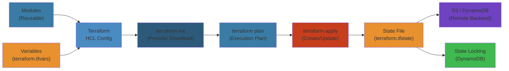

# Infrastructure as Code — Senior/Principal Engineer Deep Dive

**Related**: [Configuration Management](/06-devops/02-configuration-management.md) · [DevOps & SRE Practices](/06-devops/03-devops-sre-practices.md) · [Kubernetes](/07-kubernetes/01-kubernetes-basics.md)

---




## Table of Contents


- [IaC: The Core Idea](#iac-the-core-idea)
- [Terraform Deep Dive](#terraform-deep-dive)
  - [HCL — HashiCorp Configuration Language](#hcl--hashicorp-configuration-language)
  - [Core Execution Flow](#core-execution-flow)
  - [Terraform State: Heart of the System](#terraform-state-heart-of-the-system)
  - [State Storage Backends](#state-storage-backends)
  - [State Locking & Consistency](#state-locking--consistency)
  - [State Corruption & Recovery](#state-corruption--recovery)
  - [Provider Architecture](#provider-architecture)
  - [Provider Bugs & Incidents](#provider-bugs--incidents)
  - [Modules: Composition & Versioning](#modules-composition--versioning)
  - [Remote State & Data Sources](#remote-state--data-sources)
  - [Workspaces & Multi-Environment](#workspaces--multi-environment)
  - [Drift Detection & Remediation](#drift-detection--remediation)
  - [Secrets in IaC](#secrets-in-iac)
  - [Testing IaC: Static Analysis to Integration](#testing-iac-static-analysis-to-integration)
  - [Terraform Production Incidents](#terraform-production-incidents)
- [Pulumi: Programmable IaC](#pulumi-programmable-iac)
  - [Architecture & Automation API](#architecture--automation-api)
  - [State & Secrets](#pulumi-state--secrets)
  - [Comparison to Terraform](#comparison-to-terraform)
- [AWS CDK: Cloud Development Kit](#aws-cdk-cloud-development-kit)
  - [Constructs, Stacks, Synthesis](#constructs-stacks-synthesis)
  - [CDKTF — CDK for Terraform](#cdktf--cdk-for-terraform)
- [Large-Scale Org Patterns](#large-scale-org-patterns)
  - [Monorepo vs Multi-Repo](#monorepo-vs-multi-repo)
  - [Terragrunt Deep Dive](#terragrunt-deep-dive)
  - [Atlantis: Pull Request Automation](#atlantis-pull-request-automation)
  - [Policy as Code: Sentinel, OPA, CrossGuard](#policy-as-code-sentinel-opa-crossguard)
- [Cross-Tool Comparison](#cross-tool-comparison)
- [Failure Analysis Reference](#failure-analysis-reference)

---

## IaC: The Core Idea


Infrastructure as Code is the practice of managing infrastructure through machine-readable definition files rather than manual processes or interactive UIs. The key properties:

```
Manual                           IaC
─────────────────────────────────────────────────────────
Click "Create Instance"     →    resource "aws_instance" "web" { }
SSH in to fix config        →    Edit config file + apply
"Who changed the SG?"       →    git blame main.tf
"Set up the DB" (3 days)    →    terraform apply (3 minutes)
"Did we document that?"     →    Code review in PR
"Prod is different from staging" →  Single source of truth
```

Four categories of IaC tools:

| Category | Tools | Paradigm | Language |
|----------|-------|----------|----------|
| **Declarative — Config Language** | Terraform, CloudFormation | Desired state → engine computes diff | HCL, JSON/YAML |
| **Declarative — SDK** | AWS CDK, CDKTF, Pulumi | Define infrastructure in general-purpose lang | TypeScript, Python, Go, Java, C# |
| **Config Management, Declarative** | Ansible, Puppet, Chef | Ensure state on running systems | YAML, Ruby DSL |
| **Imperative Scripts** | Shell, Python scripts | Step-by-step commands | Any |

---

## Terraform Deep Dive


### HCL — HashiCorp Configuration Language


HCL is a declarative configuration language designed for infrastructure. It is JSON-compatible and supports expressions, functions, and dynamic blocks.

**Lexical Structure:**

```
HCL Block Structure:
┌──────────────────────────────────────────────────────────────┐
│  resource "aws_instance" "web" {         ← Block header     │
│    ami           = "ami-abc123"          ← Argument          │
│    instance_type = var.instance_type     ← Expression ref    │
│                                                │             │
│    tags = {                                 │             │
│      Name = "web-${var.environment}"  ← Interpolation     │
│    }                                                         │
│                                                              │
│    provisioner "remote-exec" {            ← Nested block     │
│      inline = ["sudo systemctl start nginx"]                 │
│    }                                                         │
│  }                                                           │
└──────────────────────────────────────────────────────────────┘
```

**Expression Language Features:**
- String interpolation: `"${var.name}"`
- Conditionals: `var.env == "prod" ? "t3.large" : "t3.medium"`
- For loops: `[for k, v in var.map : k => upper(v)]`
- Splat expressions: `aws_instance.web[*].id`
- Template files: `templatefile("${path.module}/user_data.sh", {})`
- `try`, `can` for error handling
- `one`, `flatten`, `distinct`, `setproduct` for collection transforms

**Key Evaluation Semantics:**

Terraform evaluates the entire configuration graph before producing a plan. References between resources create implicit dependencies:

```hcl
resource "aws_instance" "web" {
  ami           = "ami-abc123"
  instance_type = "t3.micro"
  subnet_id     = aws_subnet.main.id  # ← implicit dependency
}
```

This builds a **dependency graph** that Terraform uses to determine the order of operations (create, destroy, update).

---

### Core Execution Flow


```
Terraform Apply — Internal Flow:
╔═══════════════════════════════════════════════════════════════╗
║                      terraform apply                         ║
╚═══════════════════════════════════════════════════════════════╘
        │
        ▼
┌─────────────────┐
│ 1. Init         │  Download providers, modules, backend config
│   terraform init│  Lock provider versions in .terraform.lock.hcl
└────────┬────────┘
         ▼
┌─────────────────┐
│ 2. Refresh      │  Read current state of all managed resources
│                  │  from provider APIs → updates .tfstate
│   terraform plan │  If -refresh=false, uses cached state
└────────┬────────┘
         ▼
┌─────────────────┐
│ 3. Graph Build  │  Build dependency graph from configuration
│                  │  Each resource and data source is a node
│                  │  Edges are implicit (references) + explicit (depends_on)
└────────┬────────┘
         ▼
┌─────────────────┐
│ 4. Plan         │  Walk graph: for each resource node:
│                  │    • Compare state with desired config
│                  │    • Compute diff (create/update/delete/replace)
│                  │    • Store planned operations in plan file
│                  │  "terraform plan -out=plan.tfplan"
└────────┬────────┘
         ▼
┌─────────────────┐
│ 5. Apply        │  Execute plan file
│                  │  • Acquire state lock (DynamoDB / Consul / PG)
│                  │  • Walk graph in topological order
│                  │  • For each resource: call provider CRUD
│                  │  • Update state after each mutation
│                  │  • Release lock
└────────┬────────┘
         ▼
     Done
```

**Plan computation — diff algorithm (simplified):**

```
State:                            Config:
  aws_instance.web                  aws_instance.web
    ami: "ami-old"                    ami: "ami-old"
    instance_type: "t2.micro"         instance_type: "t3.large"
    subnet_id: "subnet-1"             subnet_id: "subnet-1"

Diff:
  ~ aws_instance.web
    instance_type: "t2.micro" → "t3.large"   (update in-place)
    No subnet_id change                       (no-op)

If ami changes:
  - aws_instance.web                          (force new → destroy)
  + aws_instance.web                          (create replacement)
    ~ ami: "ami-old" → "ami-new"              (requires replacement)
```

---

### Terraform State: Heart of the System


State is the single most critical concept in Terraform. It is the mapping between your config and real-world infrastructure.

**What state contains:**

```json
{
  "version": 4,
  "terraform_version": "1.5.0",
  "serial": 42,
  "lineage": "abc-def-ghi",
  "outputs": {
    "vpc_id": {
      "value": "vpc-12345",
      "type": "string"
    }
  },
  "resources": [
    {
      "module": "module.vpc",
      "mode": "managed",
      "type": "aws_vpc",
      "name": "main",
      "provider": "provider[\"registry.terraform.io/hashicorp/aws\"]",
      "instances": [
        {
          "schema_version": 1,
          "attributes": {
            "id": "vpc-12345",
            "cidr_block": "10.0.0.0/16",
            "enable_dns_support": true,
            "tags": {
              "Name": "main-vpc"
            }
          },
          "private": "REDACTED",  // provider-specific sensitive data
          "depends_on": []
        }
      ]
    }
  ]
}
```

**Key fields:**
- `serial` — Monotonically increasing integer, increments on every state write. Used for conflict detection.
- `lineage` — UUID that identifies the state lineage. Stays the same across moves. Changes if state is replaced.
- `private` — Provider-specific blob. May contain sensitive data like private keys, passwords. Providers use this to store internal details needed for updates.
- `schema_version` — Resource schema version from provider. Used for state migration when resource schemas change.

**What happens if state is lost or corrupted:**

```
Loss of State = Catastrophic
─────────────────────────────
- Terraform cannot identify which resources it owns
- `terraform import` required for every resource
- Or: `terraform destroy` does nothing (no state → nothing to destroy)
- Resources are orphaned in the cloud → cost leakage
- Providers may refuse to plan due to missing required attributes

Recovery: Restore from backup or re-import everything
(with `terraform import` or `import` blocks in v1.5+)
```

**State file naming and conventions:**

| Pattern | Description | Risk |
|---------|-------------|------|
| Single `terraform.tfstate` | Local, default | Loss, corruption, no locking |
| Remote state (S3 + DynamoDB) | Industry standard | S3 eventual consistency (rare) |
| Terraform Cloud/Enterprise | Managed backend | Vendor lock-in |
| Custom backends (pg, etcd, consul) | Advanced setups | Operational complexity |

**State locking — why it matters:**

```
Without Locking:
  Engineer A: terraform apply (reads state serial=5, plans changes)
  Engineer B: terraform apply (reads state serial=5, plans changes)
  Engineer A: writes state serial=6 ✓
  Engineer B: writes state serial=7 (overwrites A's changes!) ☠

  Result: State diverges from real infrastructure.
  Resource created by A is missing from B's state.
  Next apply wants to create it again → conflict.

With Locking:
  Engineer A: terraform apply → acquires lock
  Engineer B: terraform apply → "Error acquiring state lock"
  Engineer B waits or cancels.
```

---

### State Storage Backends


**S3 Backend (most common):**

```hcl
terraform {
  backend "s3" {
    bucket         = "myorg-tfstate"
    key            = "prod/network/terraform.tfstate"
    region         = "us-east-1"
    dynamodb_table = "terraform-locks"
    encrypt        = true
    kms_key_id     = "alias/terraform-bucket"
  }
}
```

**S3 eventual consistency issue:** S3 has read-after-write consistency for new objects (since 2020), but **list operations remain eventually consistent**. If you use `workspace_key_prefix` and Terraform lists objects, it may miss recent writes. Mitigation: Use `key` directly (not workspace listing).

**DynamoDB Lock Table Schema:**

```
LockID (Primary Key)  ──────  HashKey
  Format: {Bucket}/{Key}/{Workspace}/.terraform.lock
Path                   ──────  String
Operation              ──────  String (e.g. "Apply")
Who                    ──────  String (user/hostname)
Version                ──────  String (Terraform version)
Created                ──────  String (ISO8601 timestamp)
Info                   ──────  String (JSON blob with extra metadata)

TTL (Time-to-Live) on Created + 30 minutes — auto cleanup stale locks
```

**DynamoDB lock conflict — what the error looks like:**

```
Error acquiring the state lock

Error message: ConditionalCheckFailedException: The conditional request failed
Lock Info:
  ID:        12345678-xxxx
  Path:      myorg-tfstate:prod/network/terraform.tfstate.tfstate
  Operation: Apply
  Who:       user@engineer-laptop
  Version:   1.5.0
  Created:   2024-03-15 14:32:10.123456 +0000 UTC
  Info:

If the lock is stale, force-unlock:
  terraform force-unlock 12345678-xxxx
```

**HashiCorp Consul Backend:**

```hcl
terraform {
  backend "consul" {
    address = "consul.example.com:8500"
    path    = "terraform/prod/network"
    scheme  = "https"
    lock    = true
    gzip    = true  // for large states
  }
}
```

Consul uses CAS (Compare-And-Swap) on KV entries for locking. More resilient than S3 + DynamoDB for high-write scenarios, but requires Consul cluster management.

---

### State Corruption & Recovery


**Common corruption patterns:**

| Pattern | Cause | Detection | Recovery |
|---------|-------|-----------|----------|
| JSON parse error | Partial write during apply crash | `terraform plan` → "Error loading state: invalid character" | Restore from backup |
| Serial number regression | Older state file restored over newer | Serial goes backward | Force serial update + `terraform state push` |
| Missing resources | Manual deletion outside TF + state prune | Plan shows recreations | Import or revert |
| Duplicate resource instances | State merge bug | `terraform state list` shows duplicates | `terraform state rm` one copy |
| Provider version mismatch | Upgraded provider with breaking schema change | Plan errors on schema validation | `terraform state replace-provider` or state migration |
| Drifted private data | Provider private blob corrupted | Plan fails on provider operation | `terraform apply -refresh-only` |

**State recovery playbook:**

```
Symptom: "Error loading state: json: cannot unmarshal object into Go value"
         OR "terraform plan" fails with state-related error

Step 1: Back up current state (even corrupted)
  aws s3 cp s3://bucket/path/to/state ./corrupted-state.backup

Step 2: Check S3 versioning
  aws s3api list-object-versions --bucket my-tfstate --prefix prod/network/terraform.tfstate
  → Recover previous version

Step 3: Restore and fix serial
  aws s3api get-object-version --bucket ... --version-id ...
  Then: edit serial to be higher than current serial if needed

Step 4: Verify
  terraform state pull → should parse
  terraform plan → should produce reasonable output

Step 5: Push fixed state
  terraform state push fixed.tfstate

Prevention:
  - Enable S3 versioning on state bucket (MFA delete for extra safety)
  - Regular state backups to separate account
  - Use Terraform Cloud for managed state
  - Enable state history with terraform state pull > periodic backup
```

**Manual state surgery commands:**

```bash
# List all resources
terraform state list

# Show specific resource
terraform state show aws_instance.web

# Move resource (rename or move between modules)
terraform state mv aws_instance.web aws_instance.web_v2

# Remove from state (not destroy)
terraform state rm aws_instance.web

# Import existing resource
terraform import aws_instance.web i-12345

# Replace provider in state (after provider rename/change)
terraform state replace-provider \
  registry.terraform.io/-/aws \
  registry.terraform.io/hashicorp/aws
```

---

### Provider Architecture


Providers are plugins that Terraform uses to manage resources. They translate Terraform's generic resource lifecycle into API calls.

```
Terraform ↔ Provider ↔ Cloud API
──────────────────────────────────

Terraform Core
  │
  ├── gRPC over local TCP (or Unix socket)
  │   Protocol: hashicorp/terraform-plugin-go (v5+)
  │
  ▼
Provider Plugin (separate binary)
  │
  ├── SDK abstraction layer (Terraform Plugin SDK v2 or Plugin Framework)
  │     ├── CRUD implementations (Create, Read, Update, Delete)
  │     ├── Schema definition (attribute types, required/optional/computed)
  │     ├── State migration (when schema version changes)
  │     └── Plan customization (modify plan before apply)
  │
  ├── SDK calls Go SDK for cloud API (e.g., AWS SDK Go v2)
  │
  ▼
Cloud Provider API (REST/gRPC/GraphQL)
```

**Provider Lifecycle:**

```
1. terraform init → download provider binary to .terraform/providers/
2. terraform validate → load provider schema, validate config against schema
3. terraform plan → call provider Read/PlanResourceChange for each resource
4. terraform apply → call provider Create/Update/Delete for each planned change
5. Provider returns new state → Terraform stores it
```

**Provider Protocol (gRPC):**

```
service Provider {
    // Resource lifecycle
    rpc CreateResource(CreateResource.Request) returns (CreateResource.Response)
    rpc ReadResource(ReadResource.Request) returns (ReadResource.Response)
    rpc UpdateResource(UpdateResource.Request) returns (UpdateResource.Response)
    rpc DeleteResource(DeleteResource.Request) returns (DeleteResource.Response)

    // Plan customization
    rpc PlanResourceChange(PlanResourceChange.Request) returns (PlanResourceChange.Response)

    // Schema
    rpc GetProviderSchema(GetProviderSchema.Request) returns (GetProviderSchema.Response)

    // Validation
    rpc ValidateProviderConfig(ValidateProviderConfig.Request) returns (ValidateProviderConfig.Response)

    // State
    rpc ImportResourceState(ImportResourceState.Request) returns (ImportResourceState.Response)
    rpc UpgradeResourceState(UpgradeResourceState.Request) returns (UpgradeResourceState.Response)
}
```

**Plugin Framework vs SDK v2:**

| Aspect | SDK v2 | Plugin Framework (PF) |
|--------|--------|-----------------------|
| Released | 2019 | 2022+ |
| Protocol | Legacy (v5) | gRPC (v6) |
| Type system | String-based attribute types | Go-native types |
| Plan modification | `CustomizeDiff` | `PlanModifier` interface |
| Testing | `resource.TestCase` | `resource.Test` (improved) |
| State migration | `MigrateState` | `StateUpgraders` |
| Composite attributes | Limited | Nested attributes/objects |
| JSON plan support | No | Native |
| Deployment | Separate binary | Separate binary (same) |

---

### Provider Bugs & Incidents


**Case Study: AWS Provider — Security Group Rule Ordering (2018-2020)**

Many users experienced unexpected destruction of security group rules due to Terraform treating `ingress` as an ordered list vs. unordered set:

```
Bug: security_group_rule recreated on every apply
─────────────────────────────────────────────────
Problem: Terraform computed hash of the rule list
         If the API returned rules in different order:
         "Just recreate them all" → outage

Fix: aws_security_group_rule became its own resource type
     Use separate resource for each rule:
     resource "aws_security_group_rule" "http" { ... }
     resource "aws_security_group_rule" "https" { ... }

Lesson: Ordered lists are dangerous for infrastructure.
        Use separate resources or set-based attributes.
```

**Case Study: Azure Provider — Virtual Network Concurrent Updates**

```
Incident: Concurrent updates to Azure VNet peering
──────────────────────────────────────────────────
Two Terraform runs updating different peering connections
on the same VNet simultaneously.

Azure API: "OperationNotAllowed — concurrent operations on
resource /subscriptions/.../virtualNetworks/myvnet"

Result: Both runs failed. State not persisted.
        Manual reconciliation required.

Root Cause: Azure API-level locking per VNet.
            Terraform runs in series per VNet.

Fix: Split VNet management by region.
     Use depends_on to serialize operations.
```

**Provider best practices for production:**

```
1. PIN PROVIDER VERSIONS
   required_providers {
     aws = {
       source  = "hashicorp/aws"
       version = "~> 5.0"  # Pinning to major version
     }
   }
   # .terraform.lock.hls ensures exact versions

2. TEST PROVIDER UPGRADES
   - Clone state to a test workspace
   - terraform init -upgrade
   - terraform plan to verify no unexpected changes
   - Review provider changelog for breaking changes

3. PROVIDER UPDATE STRATEGY
   - Major version: 6-8 weeks soak in staging
   - Minor version: 2-3 weeks
   - Patch version: 1 week
   - Security patch: expedited

4. PROVIDER PLUGIN CACHE
   - Set plugin_cache_dir in .terraformrc
   - All projects share downloaded providers
   - Speeds up init significantly
```

---

### Modules: Composition & Versioning


Modules are the fundamental unit of composition in Terraform. Every Terraform config is a module (the root module). Modules can be called from local paths or registries.

**Module structure:**

```
modules/vpc/
├── main.tf          # Core resource definitions
├── variables.tf     # Input variables
├── outputs.tf       # Output values
├── terraform.tf     # Provider requirements
└── README.md        # (optional but preferred)
```

**Module calling:**

```hcl
module "vpc" {
  source = "../../modules/vpc"
  # OR
  # source = "git::https://git.company.com/infra/modules/vpc.git?ref=v1.2.0"
  # OR
  # source = "terraform-aws-modules/vpc/aws"
  # OR
  # source = "registry.terraform.io/org/module/aws"

  version = "~> 3.0"

  cidr_block = "10.0.0.0/16"
  name       = "${var.environment}-vpc"

  tags = var.tags
}
```

**Module version constraints:**

```
registry.terraform.io/org/module/aws version constraints:
  ">= 1.0, < 2.0"  — Any 1.x
  "~> 2.3"         — Any 2.3.x (pessimistic constraint)
  ">= 3.0"         — 3.0 and above
  "= 4.0.1"        — Exact version only
```

**Module dependencies (inter-module):**

```
Module A (VPC)                Module B (ECS)
┌─────────────────┐          ┌───────────────────┐
│ output vpc_id    │─────────▶│ vpc_id =           │
│                 │          │   module.vpc.vpc_id │
│ output subnet_ids│─────────▶│ subnet_ids =        │
└─────────────────┘          │   module.vpc.subnet_ids │
                             └───────────────────┘
Terraform builds implicit dependency:
  Module B depends on Module A
  Module A must create before Module B
```

**Module composition patterns for large orgs:**

```
Pattern 1: Flat Registry
  modules/
    networking/vpc
    networking/transit-gateway
    compute/ecs-cluster
    compute/ec2-instance
    database/rds
    database/redis
    monitoring/cloudwatch
    security/iam-roles
    security/kms-keys

Pattern 2: Layered
  modules/
    foundation/
      vpc/          — just VPC + subnets
      dns/          — Route53 zones
    platform/
      eks/          — EKS cluster (depends on foundation/vpc)
      rds/          — RDS cluster (depends on foundation/vpc)
    application/
      service/      — Application service (depends on platform/eks)
      pipeline/     — CI/CD (depends on platform/*)

Pattern 3: Service per Module
  modules/
    service-foo/
      main.tf       — ALB, ECS service, RDS, Redis, IAM, DNS
    service-bar/
      main.tf       — same pattern, different config
```

---

### Remote State & Data Sources


Sharing outputs between Terraform configurations:

```hcl
# Configuration A (network team)
terraform {
  backend "s3" {
    bucket = "org-tfstate"
    key    = "network/terraform.tfstate"
  }
}

output "vpc_id" {
  value = aws_vpc.main.id
}

# Configuration B (app team)
data "terraform_remote_state" "network" {
  backend = "s3"
  config = {
    bucket = "org-tfstate"
    key    = "network/terraform.tfstate"
  }
}

resource "aws_eks_cluster" "main" {
  vpc_config {
    subnet_ids = data.terraform_remote_state.network.outputs.private_subnet_ids
  }
}
```

**Data source execution behavior:**

```
Data Sources (read-only):
  data "aws_vpc" "existing" { ... }

  Terraform execution:
    1. Plan phase:  Calls provider Read for data sources
                     Gets real-time data from API
    2. Apply phase: Re-reads data (unless depends_on creates ordering)
    
  IMPORTANT: Data sources are read at plan time AND apply time.
             If data changes between plan and apply, plan may be stale!
             Use ignore_changes or lifecycle policies to handle.

Workaround for plan/apply drift:
  locals {
    # Use data from plan phase for decisions
    # but the actual apply will re-read
    vpc_id = data.aws_vpc.existing.id
  }
```

---

### Workspaces & Multi-Environment


Workspaces allow multiple state files under the same configuration.

```
Workspace structure (S3 backend):
  s3://myorg-tfstate/
    env:/
      dev/
        network/terraform.tfstate
      staging/
        network/terraform.tfstate
      prod/
        network/terraform.tfstate
```

**Workspace commands:**

```bash
# Create workspace
terraform workspace new dev
terraform workspace new staging
terraform workspace new prod

# List workspaces
terraform workspace list

# Switch
terraform workspace select staging

# Show current
terraform workspace show

# Apply to current workspace
terraform apply -var-file="environments/$(terraform workspace show).tfvars"
```

**Workspaces vs. Directory Layout:**

```
Workspaces                                Directory Layout
──────────────────────────────────────    ──────────────────────────────────
One directory, many states               One directory per environment
├── main.tf                              ├── dev/
├── variables.tf                         │   ├── main.tf
├── outputs.tf                           │   └── terraform.tfvars
├── dev.tfvars                           ├── staging/
├── staging.tfvars                       │   ├── main.tf
└── prod.tfvars                          │   └── terraform.tfvars
                                          └── prod/
Workspace: dev                            Directory: dev/

Pros:                                     Pros:
- DRY config (one source of truth)        - Complete isolation
- Easier to manage                        - Each env has its own lock
- Less duplication                        - Can run plans in parallel

Cons:                                     Cons:
- Accidental cross-env changes            - Duplication (mitigate with modules)
- Shared variable files                   - More overhead
- Single lock per backend                 - Harder to see all envs at once
```

**Hybrid approach (recommended for large orgs):**

```
environments/
  dev/
    infrastructure/
      backend.hcl    (s3 key = dev/infra/terraform.tfstate)
      main.tf
      terraform.tfvars
    compute/
      backend.hcl
      main.tf
      terraform.tfvars
  staging/
    infrastructure/
      ...
  prod/
    infrastructure/
      ...

# Standardized:
# - Each environment is a separate init → apply
# - Shared modules for DRY
# - Each env+component has its own state
# - CI/CD handles passing correct var files
```

---

### Drift Detection & Remediation


Drift occurs when real-world infrastructure differs from Terraform state.

**Types of drift:**

```
Type 1: External modification
  Someone or something (console, SDK, another tool) changes a resource
  managed by Terraform.

  Example: Engineer manually adds a security group rule via AWS console.
  Terraform state still has the old config.
  Next plan: Terraform wants to remove the manually-added rule.
  ─────────────────────────────────────────────────────────────────

Type 2: Resource deletion
  Resource deleted outside Terraform.
  Terraform state still references it.
  Next plan: Terraform wants to recreate the resource.
  ─────────────────────────────────────────────────────────────────

Type 3: API-side defaults
  Cloud provider adds a default that Terraform doesn't set.
  Terraform plan shows no diff for the defaulted attribute.
  But actual resource has the default → hidden drift.

  Example: S3 bucket encryption settings. 
  AWS began default-enabling SSE-S3 in Jan 2023.
  Old Terraform config without server_side_encryption_configuration
  now shows the resource has default encryption — but plan shows no diff
  because Terraform didn't track that attribute.
  ─────────────────────────────────────────────────────────────────

Type 4: Provider version drift
  Upgraded provider adds new computed attributes.
  State doesn't have them. Plan is clean.
  But state is technically incomplete.

  Example: aws_s3_bucket v3 → v4 migration split resources.
  Many attributes became read-only or moved to new resource types.
```

**Detection mechanisms:**

```bash
# Method 1: terraform plan (standard)
# Shows diff between state and config
# Does NOT show drift if config matches state but reality differs!
terraform plan

# Method 2: terraform refresh (limited, deprecated in v1.6+)
# Updates state from API without planning changes
terraform refresh

# Method 3: terraform plan -refresh-only (v1.6+)
# Shows drift only — what changed in real infra vs state
terraform plan -refresh-only

# Method 4: terraform apply -refresh-only (v1.6+)
# Applies state updates from drift without resource changes
terraform apply -refresh-only
```

**Drift detection architecture:**

```
┌──────────┐     ┌──────────────┐     ┌──────────────┐
│ Schedule  │────▶│ Drift Check  │────▶│ Notification │
│ (Cron/    │     │ Job (CI/CD)  │     │ (Slack/Email)│
│ EventBridge)│   │              │     │              │
└──────────┘     │ terraform    │     └──────────────┘
                 │ plan -refresh│
                 │ -out=drift.  │     ┌──────────────┐
                 │ plan         │────▶│ Remediation   │
                 │ Parse output │     │ (Automated or │
                 │              │     │ Manual PR)    │
                 └──────────────┘     └──────────────┘
```

**Tools for automated drift detection:**

```yaml
# GitHub Actions — scheduled drift detection
name: Drift Detection
on:
  schedule:
    - cron: '0 6 * * 1'  # Every Monday 6 AM
  workflow_dispatch:       # Manual trigger

jobs:
  drift-check:
    runs-on: ubuntu-latest
    steps:
      - uses: actions/checkout@v4
      - uses: hashicorp/setup-terraform@v3
      - run: terraform init
      - run: terraform plan -refresh-only -out=drift.tfplan
      - uses: actions/github-script@v7
        if: failure()
        with:
          script: |
            core.summary("⚠️ Drift detected in production infrastructure");
            // Create a GitHub issue or Slack notification
```

---

### Secrets in IaC


**The golden rule: NEVER store secrets in Terraform config or state.**

Secret exposure vectors:

```
Vector 1: State file (most common)
  - State contains plaintext resource attributes
  - RDS passwords, IAM keys, private keys end up in state
  - S3 bucket + DynamoDB lock table + encryption is minimum
  - Enable S3 bucket policy to block public access
  - Enable S3 default encryption (AES-256 or KMS)

Vector 2: Terraform config in version control
  - Hardcoded passwords in main.tf? → immediate exposure
  - Variable default values in variables.tf? → exposure
  - .tfvars files committed to git? → exposure

Vector 3: Plan files / logs
  - terraform plan output contains attribute values
  - CI/CD logs capture plan output
  - Plan files stored as artifacts may contain secrets
```

**Best practices for secrets:**

```hcl
# Method 1: Terraform Vault provider (recommended)
# Secrets never written to state or config
data "vault_kv_secret_v2" "db_password" {
  mount = "kv"
  name  = "environments/${var.environment}/database"
}

resource "aws_db_instance" "main" {
  password = data.vault_kv_secret_v2.db_password.data["password"]
  # Vault data source — only exists at runtime
  # Not stored in state (depends on provider implementation)
}

# Method 2: AWS Secrets Manager
data "aws_secretsmanager_secret_version" "db" {
  secret_id = "prod/db/password"
}

resource "aws_db_instance" "main" {
  password = data.aws_secretsmanager_secret_version.db.secret_string
}

# Method 3: Environment variables (CI/CD pipeline)
# Set TF_VAR_db_password in CI/CD, never in code
variable "db_password" {
  description = "Database password"
  type        = string
  sensitive   = true  # masks in CLI output
}

resource "aws_db_instance" "main" {
  password = var.db_password
}

# Method 4: sops-encrypted files
# Decrypt at runtime with SOPS
locals {
  secrets = yamldecode(sops_decrypt_file("${path.module}/secrets.enc.yaml"))
}
```

**State file encryption:**

```
S3 Backend Encryption Options:
──────────────────────────────────
Level 1: SSE-S3 (AES-256)
  - Automatic, no extra cost
  - AWS manages keys
  - Compliance: OK for most orgs

Level 2: SSE-KMS
  - Customer managed key
  - Audit trail (CloudTrail logs every decrypt)
  - Cross-account access control
  - Extra cost ($1/month per key + API usage)
  - Required for: SOC2, PCI-DSS, HIPAA

Level 3: SSE-C (customer-provided keys)
  - You provide the encryption key on every API call
  - High complexity — rarely used
  - Used when: regulatory requirement for key separation

State file encryption, terraform state subcommands:
  # State contains secrets even with sensitive = true
  # The value is masked in CLI but STORED in state file
  
  # Force encryption at rest:
  terraform {
    backend "s3" {
      encrypt = true
      kms_key_id = "alias/terraform-state-key"
    }
  }
  
  # For absolute safety:
  # Use vault provider or external secret store
  # that marks attributes as sensitive
```

**`sensitive = true` — what it actually does:**

```hcl
variable "api_key" {
  type      = string
  sensitive = true
}

output "api_key" {
  value     = var.api_key
  sensitive = true
}
```

`sensitive = true` masks the value in CLI output (`<sensitive>`) but:
- The **plaintext value IS stored in state** (encrypted at rest)
- The value IS visible in logs if you `echo` it
- The value IS visible in CI/CD pipeline logs if not masked
- The value IS visible to anyone with state read access

**Conclusion:** `sensitive` is display-only protection, not a security boundary.

---

### Testing IaC: Static Analysis to Integration


**Testing pyramid for IaC:**

```
                    ┌──────────┐
                    │ Integration │  ← Terratest, Kitchen-Terraform
                    │  Tests    │     Real AWS resources created
                    │ (few)     │     Expensive, slow
                    └─────┬────┘
                          │
                    ┌─────┴────┐
                    │  Contract  │  ← validate with provider schema
                    │  Tests     │     terraform validate, checkov
                    │ (some)     │     Policy checks (Sentinel, OPA)
                    └─────┬────┘
                          │
                    ┌─────┴────┐
                    │  Static    │  ← terraform fmt, terraform validate
                    │  Analysis  │     tfsec, tflint, terrascan
                    │ (many)     │     Check security, style, best practices
                    └──────────┘
```

**Static analysis tools:**

```bash
# terraform fmt — code style
terraform fmt -check -recursive
terraform fmt -recursive  # auto-fix

# terraform validate — schema validation
terraform validate

# tflint — best practices
tflint --recursive

# tfsec — security scanning (now Trivy)
tfsec .
# or
trivy config .

# checkov — broader policy compliance
checkov -d .

# terrascan — compliance
terrascan scan -d .

# OPA / Conftest — custom policies
conftest test main.tf -p policy/
```

**Checkov policy examples:**

```python
# checkov policy: ensure S3 bucket has versioning enabled
# Located in .checkov/policies/ or checkov framework

from checkov.common.models.enums import CheckResult, CheckCategories
from checkov.terraform.checks.resource.base_resource_check import BaseResourceCheck

class S3BucketVersioning(BaseResourceCheck):
    def __init__(self):
        name = "Ensure S3 bucket has versioning enabled"
        id = "CKV_AWS_21"
        supported_resources = ['aws_s3_bucket']
        categories = [CheckCategories.BACKUP_AND_RECOVERY]
        super().__init__(name=name, id=id, categories=categories, supported_resources=supported_resources)

    def scan_resource_conf(self, conf):
        if 'versioning' in conf and conf['versioning'][0].get('enabled', False):
            return CheckResult.PASSED
        return CheckResult.FAILED

check = S3BucketVersioning()
```

**Integration testing with Terratest (Go):**

```go
package test

import (
    "testing"
    "github.com/gruntwork-io/terratest/modules/terraform"
    "github.com/gruntwork-io/terratest/modules/aws"
    "github.com/stretchr/testify/assert"
)

func TestVPCDeployment(t *testing.T) {
    t.Parallel()

    terraformOptions := &terraform.Options{
        TerraformDir: "../examples/vpc",

        Vars: map[string]interface{}{
            "cidr_block": "10.0.0.0/16",
            "environment": "test",
        },
    }

    // Destroy at the end (cleanup)
    defer terraform.Destroy(t, terraformOptions)

    // Create resources
    terraform.InitAndApply(t, terraformOptions)

    // Verify VPC exists
    vpcID := terraform.Output(t, terraformOptions, "vpc_id")
    assert.NotEmpty(t, vpcID)

    // Verify VPC state via AWS SDK
    vpc := aws.GetVpcById(t, vpcID, "us-east-1")
    assert.Equal(t, "10.0.0.0/16", vpc.CidrBlock)
}
```

**Test patterns for production:**

```go
// Pattern 1: Test idempotency — apply twice, verify no changes
func TestIdempotency(t *testing.T) {
    opts := &terraform.Options{TerraformDir: "../fixtures/basic"}
    defer terraform.Destroy(t, opts)

    terraform.InitAndApply(t, opts)

    // Second apply should produce empty plan
    stdout := terraform.Apply(t, opts)
    assert.NotContains(t, stdout, "added")
    assert.NotContains(t, stdout, "changed")
    assert.NotContains(t, stdout, "destroyed")
}

// Pattern 2: Test destruction and recreation
func TestRecreation(t *testing.T) {
    opts := &terraform.Options{TerraformDir: "../fixtures/basic"}
    defer terraform.Destroy(t, opts)

    terraform.InitAndApply(t, opts)

    // Destroy
    terraform.Destroy(t, opts)

    // Recreate — should work cleanly
    terraform.InitAndApply(t, opts)
    assert.NotEmpty(t, terraform.Output(t, opts, "vpc_id"))
}

// Pattern 3: Test concurrent applies (with locking)
func TestConcurrentApplies(t *testing.T) {
    // Run 3 applies in parallel
    // Expect all to succeed (locking ensures serialization)
    // Verify final state is consistent
    // This catches locking bugs
}
```

---

### Terraform Production Incidents


**Incident 1: The State Corruption Cascade**

```
Scenario: 500+ resource state file, team of 12 applying concurrently

Timeline:
  09:00 — Engineer A: terraform apply (expected: add 1 resource)
  09:01 — Engineer B: terraform apply (expected: update 2 resources)
  09:01 — A completes: state serial 124 → 125
  09:02 — B completes: state serial 125 → 126
  09:03 — Engineer C: "terraform plan shows 28 resources to delete?!"
  
Investigation:
  State file shows serial 126, but resources from serial 124 are missing.
  
Root Cause:
  Engineer A's apply updated state with resources A, B, C...
  Engineer B's apply used state from serial 124 (read before A wrote).
  B's apply succeeded because DynamoDB lock was released by A.
  B wrote state based on stale read, overwriting A's changes.

Fix:
  - Ensure everyone uses consistent backend config
  - Enable DynamoDB locking (verified it was enabled)
  - Add pre-apply state verification step
  - Implement "state drift check" before apply
  
  The real mitigation: Terraform's own state locking should prevent this.
  Investigation showed locking was disabled for local development.
  Root cause: local overrides of backend config.

Lesson: State locking is not optional. Ever.
```

**Incident 2: The Plan/Apply Skew**

```
Scenario: Terraform plan passes, apply fails on resource creation.

Timeline:
  14:00 — Plan created: -out=deploy.tfplan
  14:05 — Code review: "Looks good"
  14:10 — Apply starts:
           Creating aws_iam_role.app... OK
           Creating aws_iam_policy.app... OK
           Creating aws_iam_role_policy_attachment.app... 
             Error: Error attaching policy: NoSuchEntity
             The role was just created, why?

Root Cause:
  IAM is an eventually consistent system.
  The role was created but not fully propagated to all regions.
  The policy attachment API call was made to a replica that didn't
  have the role yet.

  Between plan creation and apply, the IAM service's global state
  changed, but the plan was based on the assumption that the role
  would be available.

Fix:
  - Add depends_on or explicit timeouts
  - Use terraform apply directly (not plan file) for IAM heavy changes
  - Add retry logic via provider (aws_dynamodb_table has it built-in)
  - Never use a plan file that's more than 30 minutes old
```

**Incident 3: The S3 Bucket Versioning Disaster**

```
Scenario: S3 bucket with 10,000+ objects. Team decides to enable versioning.

Timeline:
  10:00 — Add versioning block to S3 bucket config
  10:01 — terraform plan shows: "update in-place"
  10:05 — terraform apply:
           aws_s3_bucket.main: Modifying...
           Error: BucketVersioningConflict: Cannot enable versioning
           on bucket with existing lifecycle rules
  10:10 — Remove lifecycle rules, try again
  10:11 — terraform apply:
           aws_s3_bucket.main: Modifying...
           (hangs for 4 hours)
           
What Actually Happened:
  The S3 API call to enable versioning triggered a full inventory scan.
  For large buckets, this takes hours and is NOT idempotent.
  Terraform's 30-minute default timeout was hit.
  State was partially updated — bucket had versioning enabled in AWS
  but TF state didn't have it.
  Next plan wanted to re-enable versioning → API returned:
  "VersioningAlreadyEnabled"

Root Cause:
  - No timeout configuration
  - No understanding of S3 versioning's async nature
  - Missing lifecycle policy for version management
  
Fix:
  - Set timeouts on resource:
    resource "aws_s3_bucket" "main" {
      timeouts {
        create = "60m"
        update = "60m"
      }
    }
  - Use terraform apply -refresh-only after timeout
  - Add lifecycle rule for version expiration upfront
```

**Incident 4: Dependency Graph Inversion**

```
Scenario: Two teams manage overlapping IaC. Team A manages VPC.
Team B manages EKS cluster in that VPC.

Problem:
  Team B's terraform apply deletes and recreates the EKS cluster
  because the VPC's subnet tags changed. But subnet tags are "owned"
  by Team A's IaC run, which changed unrelated things.

Root Cause:
  Team B's EKS module depends on subnet tags managed by Team A.
  When Team A runs, it refreshes subnets → tags change → EKS detects
  drift → Terraform wants to recreate the cluster.

Fix:
  - Clear ownership boundaries per Terraform config
  - Use data sources for cross-team dependencies (not remote state)
  - Use "shared" modules with strict output contracts
  - Implement read-only data access for dependent configs
```

**Incident 5: The Mysterious 429 Rate Limiting**

```
Scenario: 100 microservices, all in one Terraform config.
300+ ECS services. Apply runs on deploy.

Timeline:
  09:00 — terraform plan (OK, 45 seconds)
  09:01 — terraform apply begins
  09:05 — Creating ECS service "service-01"... OK
  09:06 — Creating ECS service "service-02"... OK
  09:07 — Creating ECS service "service-03"... Error: 
            Error creating ECS service: ThrottlingException:
            Rate exceeded
  09:08 — All subsequent 97 services fail
  09:09 — State is partially updated (3 created, 97 missing)
  09:10 — terraform plan: "97 items to create" (correct)

Root Cause:
  AWS API rate limiting per account per region.
  Default: 1 API call per second per ECS API.
  Terraform creates resources in parallel (within dependency limits).
  Bulk creation hit the rate limit.

Fix:
  - Enable terraform's parallel execution limit: -parallelism=5
  - Break large configs into smaller, independent stacks
  - Implement retry logic in provider (aws provider has it, but
    defaults may be too aggressive)
  - Use Terraform's resource targeting for progressive rollout
```

**Incident 6: Workspace Cross-Contamination**

```
Scenario: 3 workspaces: dev, staging, prod. Same config, different
variable files.

Error:
  Engineer runs:
    terraform workspace select prod
    terraform apply -var-file=dev.tfvars  ← WRONG FILE!

Result:
  Prod infrastructure is reconfigured with dev settings!
  - Instance types: t3.micro (was t3.large)
  - Min capacity: 1 (was 3)
  - Log level: DEBUG (was INFO)
  - RDS instance: db.t3.small (was db.r5.large)
  
  The RDS change required a reboot. Prod database down for 8 minutes.

Root Cause:
  - Human error: selected wrong var file
  - No validation constraints on variable values
  - No approval gate for prod

Fix:
  - Use directory layout instead of workspaces (stronger isolation)
  - Validate environment variable in config:
    variable "environment" {
      validation {
        condition     = var.environment != "prod" || var.instance_type != "t3.micro"
        error_message = "Prod cannot use t3.micro instance"
      }
    }
  - Require approval for prod applies (e.g., Atlantis apply requires
    "apply" comment from authorized user)
  - Use Terragrunt with per-environment provider config
```

---

## Pulumi: Programmable IaC


### Architecture & Automation API


Pulumi uses general-purpose programming languages instead of a domain-specific language (DSL). This enables loops, conditionals, abstractions, and testing patterns that are harder in HCL.

```
Pulumi Architecture:
╔═══════════════════════════════════════════════════════════════╗
║                    Pulumi Program Code                       ║
║  (TypeScript / Python / Go / C# / Java / YAML)              ║
║                                                              ║
║  const vpc = new aws.ec2.Vpc("main", {                       ║
║    cidrBlock: "10.0.0.0/16",                                 ║
║  });                                                         ║
╚═══════════════════════════════════════════════════════════════╘
        │
        ▼
┌───────────────────────────────────────────┐
│           Pulumi Engine                    │
│                                            │
│  Node 1: aws.ec2.Vpc "main"               │
│    URN: urn:pulumi:stack::proj::aws:ec2/  │
│         vpc:Vpc::main                     │
│    Inputs: {cidrBlock: "10.0.0.0/16"}     │
│    Outputs: {id: "vpc-12345"}             │
│    ───────                                  │
│  Node 2: aws.ec2.Subnet "public-1"         │
│    Inputs: {vpcId: {fn::ref: Node1.id}}    │
│    ───────                                  │
│  Dependency graph computed by engine       │
└──────────────────────┬────────────────────┘
                       │
                       ▼
┌───────────────────────────────────────────┐
│        Provider SDK                        │
│  (Same Terraform providers via           │
│   pulumi-terraform-bridge OR native       │
│   providers with faster CRUD)             │
└───────────────────────────────────────────┘
                       │
                       ▼
                Cloud API
```

**Core concepts:**

```
Program       — Your infrastructure code (single process)
  Stack       — Deployment target (dev/prod, isolated state)
    Resource  — A single infrastructure component (VPC, Instance, Bucket)
      URN     — Unique identifier: urn:pulumi:stack::project::type::name
      ID      — Cloud provider resource ID (i-12345, vpc-12345)
      Inputs  — Resource configuration inputs
      Outputs — Resource state outputs (resolved after creation)
```

**Automation API — Embed Pulumi in applications:**

```go
package main

import (
    "context"
    "github.com/pulumi/pulumi/sdk/v3/go/auto"
    "github.com/pulumi/pulumi/sdk/v3/go/auto/optup"
)

// Program returns a Pulumi stack program function
func Program(ctx *pulumi.Context) error {
    bucket, err := aws.Bucket(ctx, "my-bucket", &aws.BucketArgs{})
    if err != nil {
        return err
    }
    ctx.Export("bucketName", bucket.Bucket)
    return nil
}

// DeployWithProgress deploys infrastructure and streams progress
func DeployWithProgress(ctx context.Context, projectName, stackName string) error {
    s, err := auto.UpsertStack(ctx, stackName, Program)
    if err != nil {
        return err
    }

    _, err = s.Up(ctx, optup.ProgressStreams(os.Stdout))
    return err
}

func main() {
    ctx := context.Background()
    
    // Stack per environment
    for _, env := range []string{"dev", "staging", "prod"} {
        err := DeployWithProgress(ctx, "my-iac", env)
        if err != nil {
            log.Fatalf("Failed to deploy %s: %v", env, err)
        }
    }
}
```

**Automation API use cases:**
- Self-service infrastructure portals (internal developer platforms)
- Ephemeral environments per PR
- Dynamic scaling infrastructure
- Workflow engines (Temporal, Airflow) integrating IaC

**Real-world: 1000-ephemeral-env platform using Automation API:**

```
Request: "Create preview environment for PR #1234"
  → Webhook → Automation API client
  → pulumi up with PR-specific stack
  → Environment created in 90 seconds
  → URL returned to PR
  → PR merged → Automation API destroys stack
  → Cost: ~$0.50 for 2-hour lifecycle
```

---

### Pulumi State & Secrets


```
State Backends:
  ┌─────────────────────────────────────────────────────────┐
  │ Pulumi Cloud (managed)     │ Default, most features      │
  │   - Managed state          │ Free tier: 50 stacks        │
  │   - Policy packs           │ Paid: unlimited             │
  │   - Deployment history     │                             │
  │   - RBAC                   │                             │
  ├─────────────────────────────┼─────────────────────────────┤
  │ Self-Managed S3            │ DIY, aws s3 backend          │
  │   - State in S3 bucket     │                             │
  │   - Locking via DynamoDB   │ pulumi login s3://my-bucket  │
  ├─────────────────────────────┼─────────────────────────────┤
  │ Azure Blob / GCS           │ Azure: azblob://cont         │
  │                            │ GCS: gs://bucket             │
  └─────────────────────────────┴─────────────────────────────┘

Secrets:
  - Pulumi encrypts sensitive outputs (passwords, keys, connection strings)
  - Encryption key per stack (Pulumi Cloud) or custom provider (KMS, Vault)
  - Secrets are encrypted in state and in transit
  - CLI: pulumi config set --secret dbPassword
  
  If using self-managed backend:
    - Set --secrets-provider=awskms://alias/pulumi-secrets
    - Or: --secrets-provider=gcpkms://projects/.../locations/.../keyRings/.../cryptoKeys/...
```

---

### Comparison to Terraform


| Dimension | Terraform | Pulumi |
|-----------|-----------|--------|
| **Language** | HCL (DSL) | TypeScript, Python, Go, Java, C#, YAML |
| **State** | JSON state file, many backends | Checkpoints per stack, Cloud or self-managed |
| **Provider model** | gRPC plugin protocol | Bridged (same TF providers) or native |
| **Plan** | `terraform plan` (baked in) | `pulumi preview` (baked in) |
| **Resource model** | HCL blocks, implicit deps | Language-native objects, explicit deps |
| **Testing** | Terratest (Go), Kitchen | Native unit tests (language-native mocking) |
| **Policy** | Sentinel (paid), OPA | CrossGuard (open source), OPA |
| **Secrets** | Vault provider, external | Built-in per-stack encryption |
| **CI/CD** | Atlantis, Terraform Cloud | Automation API, GitHub Actions |
| **Maturity** | 2014+, largest community | 2018+, growing fast |
| **Multi-cloud** | 2000+ providers (via registry) | Same providers via bridge + native |
| **Reusability** | Module registry (HCL) | Packages (npm/PyPI/Go modules) |
| **Learning curve** | Low (HCL is simple) | Medium (language + IaC concepts) |
| **Best for** | Ops-heavy teams, standard IaC | Platform teams, complex logic, embedding |

**When to choose which:**

```
Terraform wins:
  - Pure infrastructure provisioning (VPC, instances, networking)
  - Teams comfortable with HCL
  - Large existing module ecosystem
  - Ops-centric workflows
  - When you need Terraform Cloud/Enterprise features

Pulumi wins:
  - Complex infrastructure logic (loops, conditionals, functions)
  - Embedded IaC (Automation API for internal platforms)
  - Teams already in TypeScript/Python/Go
  - Ephemeral environments at scale
  - Need native testing (no separate test framework)
  - Policy as code with real programming languages
```

---

## AWS CDK: Cloud Development Kit


### Constructs, Stacks, Synthesis


AWS CDK lets you define AWS infrastructure using familiar programming languages. It synthesizes to CloudFormation templates.

```
CDK Architecture:
╔═══════════════════════════════════════════════════════════════╗
║                    CDK Application Code                       ║
║  (TypeScript / Python / Java / C# / Go)                      ║
║                                                              ║
║  class MyStack extends Stack {                                ║
║    constructor(scope, id, props) {                            ║
║      new s3.Bucket(this, 'MyBucket', {                        ║
║        versioned: true,                                       ║
║      });                                                      ║
║    }                                                          ║
║  }                                                            ║
╚═══════════════════════════════════════════════════════════════╘
        │
        ▼
┌───────────────────────────────────────────────┐
│              CDK Synthesis Engine              │
│                                                │
│  Step 1: Construct tree evaluation            │
│  Each construct is instantiated, builds tree   │
│  L1 → L2 → L3 (abstraction levels)            │
│                                                │
│  Step 2: Cloud Assembly                        │
│  ├── CloudFormation templates (JSON)           │
│  ├── Asset files (Lambda code, Docker images)  │
│  ├── Manifest (metadata)                       │
│  └── Tree.json (construct tree)                │
│                                                │
│  Output: cdk.out/                              │
└──────────────────────┬────────────────────────┘
                       │
                       ▼
┌───────────────────────────────────────────────┐
│            CloudFormation Service              │
│                                                │
│  Deploy: cdk deploy → CFN CreateChangeSet      │
│                    → CFN ExecuteChangeSet      │
│                                                │
│  Destroy: cdk destroy → CFN DeleteStack         │
│                                                │
│  Diff: cdk diff → compares with deployed       │
└───────────────────────────────────────────────┘
```

**Construct levels:**

```
┌──────────────────────────────────────────────────────────────┐
│                    Construct Hierarchy                         │
│                                                               │
│  L1 (CFN Resource)  →  aws_s3_CfnBucket                       │
│    /!\ Direct CloudFormation mapping — low-level, verbose    │
│    /!\ Every CFN property exposed 1:1                        │
│    Use: When you need full control over CFN properties        │
│                                                               │
│  L2 (AWS Construct)  →  s3.Bucket                             │
│    ✓ Intelligent defaults (encryption, versioning, etc.)      │
│    ✓ Convenience methods (.grantRead(), .addLifecycleRule())  │
│    ✓ Best practices baked in                                  │
│    Use: Most common case — 95% of usage                       │
│                                                               │
│  L3 (Pattern Construct)  →  ecs.Patterns.ApplicationLoadBalancedFargateService
│    ✓ Complete architecture patterns                           │
│    ✓ Single construct = ALB + ECS + Fargate + networking       │
│    Use: Common patterns, rapid prototyping                    │
└──────────────────────────────────────────────────────────────┘
```

**Stack isolation and deployment:**

```
Stacks = deployable unit

Stack A: NetworkStack
  AWS::EC2::VPC, AWS::EC2::InternetGateway, AWS::EC2::RouteTable

Stack B: ComputeStack
  depends on Stack A outputs
  AWS::ECS::Cluster, AWS::IAM::Role

Stack C: DataStack
  AWS::RDS::DBInstance, AWS::ElastiCache::CacheCluster

Deployment:
  cdk deploy NetworkStack ComputeStack DataStack
  → Creates 3 CloudFormation stacks, deploys in dependency order
```

---

### CDKTF — CDK for Terraform


CDKTF (CDK for Terraform) brings the CDK programming model to Terraform providers:

```
cdktf Architecture:
╔═══════════════════════════════════════════════════════════════╗
║  const { App, TerraformStack } = require('cdktf');           ║
║  const { AwsProvider, Instance } = require('./.gen/aws');    ║
║                                                              ║
║  class MyStack extends TerraformStack {                      ║
║    constructor(scope, id) {                                  ║
║      super(scope, id);                                       ║
║      new AwsProvider(this, 'aws', { region: 'us-east-1' });  ║
║      new Instance(this, 'hello', {                            ║
║        ami: 'ami-abc123',                                    ║
║        instanceType: 't3.micro',                             ║
║      });                                                      ║
║    }                                                          ║
║  }                                                            ║
╚═══════════════════════════════════════════════════════════════╘
        │
        ▼
┌───────────────────────────────────────────────┐
│           cdktf synth (synthesis)              │
│                                                │
│  Generates:                                    │
│    cdktf.out/manifest.json                     │
│    cdktf.out/stacks/my-stack/                  │
│      ├── cdk.tf.json (HCL-equivalent JSON)     │
│      └── plan.json (resource graph)            │
│                                                │
│  Result: Standard Terraform config in JSON     │
│    → Can be used with terraform directly       │
└──────────────────┬────────────────────────────┘
                   │
                   ▼
┌───────────────────────────────────────────────┐
│        terraform init && terraform apply       │
│  (Standard Terraform execution)               │
│  Uses state, locks, providers same as TF      │
└───────────────────────────────────────────────┘
```

**CDKTF vs Terraform vs CDK:**

| Feature | CDKTF | Terraform (HCL) | AWS CDK |
|---------|-------|-----------------|---------|
| Engine | Terraform | Terraform | CloudFormation |
| Language | TS/Python/Go/Java | HCL | TS/Python/Go/Java/C# |
| Providers | All TF providers | All TF providers | AWS only (extensions for others) |
| State | TF state | TF state | CFN stack state |
| Locking | TF locking | TF locking | CFN service-managed |
| Ecosystem | TF module registry | TF module registry | AWS-only |

---

## Large-Scale Org Patterns


### Monorepo vs Multi-Repo


```
Monorepo Approach:
infrastructure/
├── modules/                          ← Shared modules (published internally)
│   ├── vpc/
│   ├── ecs-service/
│   └── rds/
├── environments/
│   ├── dev/
│   │   ├── networking/               ← Workspace or state prefix
│   │   ├── services/
│   │   │   ├── api/
│   │   │   ├── worker/
│   │   │   └── frontend/
│   │   └── data/
│   ├── staging/
│   │   └── ...
│   └── prod/
│       └── ...
├── policies/                         ← Policy as code
│   ├── sentinel.hcl
│   └── checkov/
└── scripts/
    ├── init.sh                       ← Standardized init per env
    └── validate-all.sh               ← Parallel validation

Pros: Single source of truth, atomic changes, consistent tooling, cross-stack refactoring
Cons: Large repos, CI/CD bottlenecks, access control per directory, merge conflicts

Multi-Repo Approach:
org-infrastructure-modules/
├── vpc-module/
├── ecs-service-module/
└── rds-module/

team-a-service/
├── infrastructure/
│   ├── modules/
│   └── environments/

team-b-service/
├── infrastructure/
│   ├── modules/
│   └── environments/

Pros: Team autonomy, granular access control, independent CI/CD, smaller repos
Cons: Duplication, version pinning complexity, cross-repo refactoring harder, drift
```

**Recommendation matrix:**

| Org Size | Team Structure | Approach |
|----------|---------------|----------|
| 1-10 engineers | Single platform team | Monorepo |
| 10-50 engineers | 2-5 product teams + platform team | Monorepo with CODEOWNERS |
| 50-200 engineers | Platform team + 5-15 product teams | Hybrid: monorepo modules + per-service repos |
| 200+ engineers | Multiple platform squads | Multi-repo with strong module registry |

---

### Terragrunt Deep Dive


Terragrunt is a thin wrapper that adds DRY configuration, remote state management, and CLI enhancements to Terraform.

**DRY remote state configuration:**

```hcl
# root.hcl (root Terragrunt config)
remote_state {
  backend = "s3"
  config = {
    bucket         = "myorg-tfstate"
    key            = "${path_relative_to_include()}/terraform.tfstate"
    region         = "us-east-1"
    encrypt        = true
    dynamodb_table = "terraform-locks"
  }
}

generate "provider" {
  path      = "provider.tf"
  if_exists = "overwrite_terragrunt"
  contents  = <<EOF
provider "aws" {
  region = var.region
}
EOF
}
```

```hcl
# prod/networking/terragrunt.hcl
include "root" {
  path = find_in_parent_folders()
}

terraform {
  source = "git::git@github.com:org/infra-modules.git//networking?ref=v1.2.0"
}

inputs = {
  vpc_cidr     = "10.0.0.0/16"
  environment  = "prod"
  region       = "us-east-1"
}
```

**Terragrunt directory structures:**

```
Terragrunt directory layout:
infrastructure/
├── _envcommon/
│   ├── vpc.hcl              ← shared inputs
│   └── ecs-service.hcl
├── dev/
│   ├── terragrunt.hcl       ← remote_state config, provider generation
│   ├── vpc/
│   │   └── terragrunt.hcl   ← source + inputs
│   ├── ecs-service/
│   │   └── terragrunt.hcl
│   └── rds/
│       └── terragrunt.hcl
├── staging/
│   └── ...
└── prod/
    ├── vpc/
    │   └── terragrunt.hcl
    ├── ecs-service/
    │   └── terragrunt.hcl
    └── rds/
        └── terragrunt.hcl
```

**Terragrunt dependency management:**

```hcl
# prod/ecs-service/terragrunt.hcl
dependency "vpc" {
  config_path = "../vpc"
  
  # Mock outputs for plan stage (vpc doesn't exist yet on first run)
  mock_outputs = {
    vpc_id     = "temporary-dummy-id"
    subnet_ids = ["subnet-dummy1", "subnet-dummy2"]
  }
  mock_outputs_allowed_terraform_commands = ["init", "validate", "plan"]
}

dependency "rds" {
  config_path = "../rds"
  mock_outputs = {
    db_address = "db.example.com"
    db_port    = 5432
  }
}

inputs = {
  vpc_id     = dependency.vpc.outputs.vpc_id
  subnet_ids = dependency.vpc.outputs.subnet_ids
  db_url     = "postgres://${dependency.rds.outputs.db_address}:${dependency.rds.outputs.db_port}"
}
```

**Terragrunt commands:**

```bash
# Apply all modules in dependency order
terragrunt run-all apply

# Plan only changed modules
terragrunt run-all plan

# Apply only a specific module
cd prod/vpc && terragrunt apply

# Output all module states
terragrunt output

# Show dependency graph
terragrunt graph-dependencies

# Validate all modules
terragrunt run-all validate

# Run arbitrary terraform commands through all modules
terragrunt run-all terraform state list
```

**Terragrunt limitations:**
- Extra layer of tooling to maintain
- Complex debugging (stack traces go through Terragrunt before Terraform)
- Dependency mocking can mask real issues
- Version compatibility: must match Terragrunt ↔ Terraform versions
- Not all Terraform features are exposed through Terragrunt
- Can encourage overly complex directory hierarchies

---

### Atlantis: Pull Request Automation


Atlantis integrates IaC with GitHub/GitLab/Bitbucket by running `terraform plan` on PRs and `terraform apply` on comments.

```
Atlantis Workflow:
╔══════════════════════╗     ╔══════════════════════╗
║    Developer          ║     ║   Atlantis Server    ║
║                      ║     ║                      ║
║ 1. Edit Terraform    ║     ║                      ║
║    config            ║     ║                      ║
║ 2. Push branch       ║────▶║ 3. Webhook: PR opened║
║                      ║     ║ 4. Clone repo        ║
║                      ║     ║ 5. terraform init    ║
║                      ║     ║ 6. terraform plan    ║
║                      ║     ║ 7. Comment plan on PR║
║                      ║     ║                      ║
║ 8. Review plan       ║     ║                      ║
║ 9. Comment:          ║────▶║ 10. terraform apply  ║
║    "atlantis apply"  ║     ║ 11. Comment result   ║
║                      ║     ║ 12. Merge PR         ║
╚══════════════════════╝     ╚══════════════════════╝
```

**Configuration (at atlantis.yaml):**

```yaml
version: 3
projects:
- name: prod-vpc
  dir: prod/vpc
  terraform_version: v1.5.0
  workflow: default
  autoplan:
    when_modified: ["*.tf", "*.tfvars", "terragrunt.hcl"]
    enabled: true

- name: prod-service
  dir: prod/service
  workflow: custom
  workspace: default
  apply_requirements: [approved]  # Require PR approval before apply

workflows:
  custom:
    plan:
      steps:
      - run: terraform init
      - run: terraform workspace select prod
      - run: terraform plan -var-file=prod.tfvars -out=plan.tfplan
    apply:
      steps:
      - run: terraform apply plan.tfplan
```

**Production Atlantis deployment:**

```
┌─────────────────────────────┐
│  Atlantis HA (ECS/EKS)      │
│                             │
│  ┌─────────┐ ┌─────────┐   │
│  │ Atlantis│ │ Atlantis│   │  → Load balancer
│  │ Server  │ │ Server  │   │  → Shared SQLite / Postgres
│  │ (node1) │ │ (node2) │   │  → S3 cache for repos
│  └─────────┘ └─────────┘   │
│                             │
│  Webhook → ALB → Atlantis   │
│  State: S3 + DynamoDB       │
│  Repos: atlantis-data bucket│
└─────────────────────────────┘
```

**Security considerations:**

```
Atlantis Security:
✓ SSH deploy keys with read-only + write-protected
✓ Webhook secret verification
✓ Apply guard: only authorized users
✓ Plan/apply output in comments (may leak sensitive data)
✓ --allow-repo-config controls if repo config is trusted

Critical: Atlantis runs terraform apply with the repo's config.
If someone adds a malicious config → Atlantis executes it.
Mitigation:
  1. Use atlantis.yaml in the repo (repo-level)
     But DO NOT use repo-level server-side config override
  2. Pin Atlantis version and audit config changes
  3. Use VCS branch protection (main is protected)
  4. Require PR approval before apply
```

---

### Policy as Code: Sentinel, OPA, CrossGuard


**Sentinel (HashiCorp, Terraform Enterprise):**

```
Policy: "Block EC2 instances without tags"
────────────────────────────────────────────
import "tfplan/v2"

# All EC2 instances must have mandatory tags
mandatory_tags = ["Name", "Environment", "Owner"]

violating_instances = filter tfplan.resource_changes as _, rc {
    rc.mode is "managed" and
    rc.type is "aws_instance" and
    rc.change.after is not null
} as addr, rc {
    not all mandatory_tags as t {
        t in keys(rc.change.after.tags)
    }
}

main = rule {
    length(violating_instances) is 0
}
```

**Open Policy Agent (OPA — open source):**

```rego
# Rego policy: Require encryption on S3 buckets
package terraform

deny[msg] {
    resource := input.resource_changes[_]
    resource.type == "aws_s3_bucket"
    
    # Check if server_side_encryption_configuration exists
    not resource.change.after.server_side_encryption_configuration
    
    msg = sprintf(
        "%v: S3 bucket must have encryption enabled",
        [resource.address]
    )
}
```

**CrossGuard (Pulumi):**

```typescript
// CrossGuard policy (TypeScript)
import { PolicyPack, validateResourceOfType } from "@pulumi/policy";
import * as aws from "@pulumi/aws";

const policies = new PolicyPack("aws-security", {
    policies: [{
        name: "s3-block-public-acl",
        description: "S3 buckets must block public ACLs",
        enforcementLevel: "mandatory",
        validateResource: validateResourceOfType(aws.s3.Bucket, (bucket, args, report) => {
            if (!bucket.blockPublicAcls) {
                report({
                    message: "S3 Bucket must block public ACLs",
                });
            }
        }),
    }],
});
```

---

## Cross-Tool Comparison


| Category | Terraform | Pulumi | AWS CDK |
|----------|-----------|--------|---------|
| **Language** | HCL | TS/Python/Go/C#/Java | TS/Python/Go/Java/C# |
| **Engine** | Go binary | Go binary | CloudFormation |
| **State** | JSON via backend | Checkpoint/Cloud | CFN-managed |
| **Provider ecosystem** | 2000+ (registry) | Same TF + native | AWS-only (extensions limited) |
| **Multi-cloud** | Yes | Yes | AWS only |
| **Testing** | Terratest | Native (mocking, unit) | CDK Assertions / integ-runner |
| **CI/CD integration** | Atlantis, TFC | Automation API | CDK Pipelines |
| **Policy** | Sentinel (paid), OPA | CrossGuard | Service Control Policies |
| **Plan diff** | Built-in | Built-in via preview | cdk diff (CFN change sets) |
| **State locking** | DynamoDB/Consul/PG | Via backend | CFN-managed |
| **Learning curve** | Low (DSL) | Medium (lang + IaC) | Medium (lang + CFN concepts) |
| **Maturity** | Mature (2014) | Growing (2018) | Mature (2019) |
| **Org scale** | Terragrunt, modular | Automation API | CDK Pipelines, Nested Stacks |

**Decision framework for tool selection:**

```
Q1: Is your infra multi-cloud or purely AWS?
  Multi-cloud → Terraform or Pulumi
  AWS-only → CDK is viable option

Q2: Do you need embedded IaC (automation API)?
  Yes → Pulumi Automation API
  No → Terraform or CDK

Q3: Is your team Ops-heavy or Dev-heavy?
  Ops-heavy → Terraform (HCL is operationally familiar)
  Dev-heavy → Pulumi or CDK (familiar languages)

Q4: What's your state management preference?
  DIY state → Terraform (most flexible backends)
  Managed → Pulumi Cloud or AWS CDK
  Enterprise → Terraform Cloud or Pulumi Cloud

Q5: Policy requirements?
  Built-in → Sentinel (TFC only)
  OSS → OPA with any tool
  Code-based → CrossGuard (Pulumi)
```

---

## Failure Analysis Reference


**Common failure modes and mitigations:**

| Failure | Symptom | Root Cause | Mitigation | Detection |
|---------|---------|------------|------------|-----------|
| State corruption | Plan shows unexpected changes | Partial write, concurrent edits | S3 versioning, state backups | `terraform validate`, periodic drift check |
| Provider incompatibility | Unknown resource type, plan errors | Provider version mismatch | Pin provider, lockfile | CI check on provider version |
| API rate limiting | ThrottlingException, TooManyRequests | Bulk operations | `-parallelism=N`, split configs | Monitor API usage metrics |
| Resource conflict | 409 Conflict, AlreadyExistsException | Race condition, duplicate create | depends_on, explicit ordering | Retry with backoff |
| Dependency deadlock | A requires B requires A | Circular module dependency | Analyze graph, extract shared | `terraform graph` visualization |
| Secret leak | Password in state, plan, logs | Plaintext in config/tfvars | Vault provider, sensitive flag | Secret scanning (trufflehog, git-secrets) |
| Drift unnoticed | Stale infra, unexpected costs | External modification, API defaults | Scheduled drift detection | `terraform plan -refresh-only` |
| Module version confusion | Wrong module version deployed | Unpinned module sources | Pin to git SHA or semver | Validate module versions in CI |
| Provider schema change | State requiring migration | Provider upgrade | Review changelog, test | `terraform plan` |
| S3 eventual consistency | Stale state listing | S3 list after write | Prefer key over listing | N/A (platform limitation) |

**Production readiness checklist:**

```
Infrastructure as Code — PRD Checklist
────────────────────────────────────────
□ State storage with locking (S3 + DynamoDB / Terraform Cloud)
□ State encryption at rest (KMS or AES-256)
□ State backups with S3 versioning (MFA delete for prod)
□ Provider versions pinned in required_providers
□ Module sources pinned (git SHA or registry version)
□ Secret management (not in config/state plaintext)
□ Remote state consumption has clear ownership
□ Workspaces or directory layout with isolation
□ drift detection scheduled (weekly minimum)
□ Static analysis in CI (tfsec/tflint/checkov)
□ Integration tests for critical paths
□ Policy as code for security/compliance
□ PR-based workflow (Atlantis or similar)
□ Approval gate for production applies
□ Rollback plan documented
```

### Visual: Terraform Plan → Apply Lifecycle

```mermaid
graph TD
    Code["Write Terraform<br/>config.tf"] -->|tf init| Init["Initialize<br/>Backend (S3+Dynamo)"]
    Init -->|Download| Providers["Download<br/>Providers"]
    Providers -->|Validate| Validate["Validate<br/>Syntax + Schema"]
    
    Validate -->|tf plan| Plan["Plan<br/>Compare desired vs actual"]
    Plan -->|Query| Current["Query current<br/>state (etcd, AWS)"]
    Current -->|Diff| Diff["Generate diff<br/>+ → ~ → -"]
    Diff -->|Show| Changeset["Changeset<br/>JSON/Human"]
    
    Changeset -->|Review| Review["Human<br/>Review"]
    Review -->|Approve| Apply["tf apply<br/>Execute Plan"]
    Review -->|Reject| Reject["Reject<br/>No changes"]
    
    Apply -->|Create| Create["Create<br/>Resources"]
    Apply -->|Update| Update["Update<br/>Existing"]
    Apply -->|Delete| Delete["Delete<br/>Marked"]
    
    Create -->|API Call| AWS["AWS API<br/>Create Resource"]
    Update -->|API Call| AWS
    Delete -->|API Call| AWS
    
    AWS -->|Success| NewState["Update State<br/>File"]
    NewState -->|Lock| Lock["State Lock<br/>(DynamoDB)"]
    Lock -->|Persist| Storage["S3 Backend<br/>Encrypted"]
    
    AWS -->|Fail| Error["Rollback<br/>Partial Apply"]
    Error -->|Revert| NewState
    
    Storage -->|Next run| Current
    
    style Code fill:#1e3a5f,stroke:#00d4ff
    style Init fill:#3a7ca5,stroke:#00d4ff
    style Providers fill:#3a7ca5,stroke:#00d4ff
    style Validate fill:#3a7ca5,stroke:#00d4ff
    style Plan fill:#3a7ca5,stroke:#00d4ff
    style Current fill:#3a7ca5,stroke:#00d4ff
    style Diff fill:#3a7ca5,stroke:#00d4ff
    style Changeset fill:#1e5f3f,stroke:#34d399
    style Review fill:#1e3a5f,stroke:#00d4ff
    style Apply fill:#1e5f3f,stroke:#34d399
    style Reject fill:#5f1e1e,stroke:#ef4444
    style Create fill:#1e5f3f,stroke:#34d399
    style Update fill:#1e5f3f,stroke:#34d399
    style Delete fill:#1e5f3f,stroke:#34d399
    style AWS fill:#3a7ca5,stroke:#00d4ff
    style NewState fill:#1e5f3f,stroke:#34d399
    style Lock fill:#3a7ca5,stroke:#00d4ff
    style Storage fill:#3a7ca5,stroke:#00d4ff
    style Error fill:#5f1e1e,stroke:#ef4444
```



---

## Interview Questions


### Beginner Level


**Q1: What is Infrastructure as Code (IaC) and why is it important?**

**Why interviewers ask this**: Fundamental DevOps concept — tests understanding of automation vs manual management.

**Ideal answer structure**:
1. **What**: Managing and provisioning infrastructure through machine-readable definition files, not manual configuration. Code = CloudFormation, Terraform, CDK, Pulumi.
2. **Why important**: **Reproducibility** (same code → same infra every time), **Version control** (infra changes tracked in git), **Auditability** (who changed what and when), **Automation** (CI/CD pipelines can provision/destroy), **Idempotency** (apply again = same state).
3. **Types**: **Declarative** (Terraform, CloudFormation — "what" not "how"), **Imperative** (CDK, Pulumi — "how" via code), **Mutative** (Ansible, Chef — push config to running infra).

**Common wrong answer**: "IaC means using the AWS console" — that's the opposite. IaC explicitly means NOT using click-ops consoles.

**Q2**: Compare Terraform and AWS CloudFormation. When would you use which?

**Answer**: **Terraform**: Cloud-agnostic (AWS, GCP, Azure), state management via backend (S3/DynamoDB), HCL syntax, richer community modules, plan-output before apply. **CloudFormation**: AWS-native, integrates with StackSets for multi-region/account, drift detection, Change Sets, no external state store needed. Use Terraform for: multi-cloud strategy, existing Terraform expertise, complex logic (count, for_each, expressions), provider-agnostic tooling. Use CloudFormation for: AWS-only shops, tight integration with CodePipeline, org-level governance via Service Catalog, organizations that already use CloudFormation StackSets.

### Intermediate Level


**Q3: Explain Terraform's state management. What happens when state is corrupted or out of sync?**

**Answer**: Terraform state maps real-world resources to configuration. Stored locally (`terraform.tfstate`) or remotely (S3 + DynamoDB locking). State contains: resource metadata, dependencies, attributes, and sensitive data (passwords). When state is out of sync: 1) **Refresh**: `terraform refresh` updates state with real infra (reads all resources). 2) **State mismatch**: if someone manually deleted a resource, `terraform plan` will show it being re-created. 3) **State corruption**: recover from backup (`terraform state pull` to inspect, `terraform state push` with caution). 4) **Locking**: use DynamoDB for state locking to prevent concurrent modifies. 5) **Import**: `terraform import <address> <id>` to bring existing resources under management. Best practice: use Terraform Cloud, Spacelift, or Atlantis for state management with RBAC.

**Q4**: How does Terraform's dependency graph work?

**Answer**: Terraform builds a directed acyclic graph (DAG) of resource dependencies. Implicit dependencies via references: `aws_instance.web` referencing `aws_security_group.sg.id`. Explicit dependencies via `depends_on`. The graph determines: creation order (parents first), destruction order (reverse), and parallel execution (independent resources in parallel). `terraform graph` outputs DOT format for visualization. The DAG enables Terraform to: minimize wait time (parallel independent resources), correctly sequence dependent resources (SG before EC2), and optimize destroy operations.

### Senior Level


**Q5: Your Terraform apply fails with "Error: Failed to acquire state lock". Another engineer is on PTO. What do you do?**

**Why interviewers ask this**: Tests practical incident response with IaC.

**Answer**: 1) Check DynamoDB lock table: `aws dynamodb get-item --table-name terraform-locks --key '{"LockID": {"S": "<state-file-path>"}}'`. Check `Info` attribute for who holds the lock. 2) If lock is stale (engineer's terminal died), force unlock: `terraform force-unlock <LOCK_ID>`. 3) If lock is live (another apply in progress), wait for it to complete. 4) Prevent future issues: implement **remote state locking** with DynamoDB (mandatory) and `terraform apply` in CI/CD only (no direct applies). Use **Atlantis** for PR-based workflow — locks are tied to PR lifecycle. Never force-unlock during active state mutation.

**Q6**: Design an IaC strategy for a multi-account AWS organization with 50 accounts, 500 developers, and compliance requirements (SOC2, PCI).

**Answer**: 1) **Account structure**: Organization with OUs (Security, Infrastructure, Workloads). 2) **IaC workflow**: Terraform modules in monorepo (or per-team repos). Atlantis for PR-based approval. 3) **State management**: Terraform Cloud workspaces (one per account+region). State access via API tokens with IP-restricted policies. 4) **Guardrails**: HashiCorp Sentinel (or OPA) policies on Terraform Cloud: enforce encryption, prohibit public S3 buckets, require tags, validate CIDR ranges. 5) **CI/CD**: GitHub Actions → plan → approve (team lead + security reviewer) → apply. 6) **Multi-account**: Use `terraform_remote_state` sparingly. Prefer **StackSet** for org-wide resources (IAM roles, guardrails). Use **Control Tower** with custom blueprints for account baseline. 7) **Secrets**: HashiCorp Vault or AWS Secrets Manager for dynamic secrets — Terraform reads via `data` sources, not hardcoded.

### Staff/Principal Level


**Q7: Your Terraform code has 5,000+ resources. A single `terraform plan` takes 30 minutes. Your developers are frustrated. Design a solution.**

**Why**: Tests large-scale Terraform refactoring skills.

**Answer**: 1) **Break monolith**: split into logical modules (networking, security, compute, data) with separate state files. Each team manages their own. 2) **Use `terraform plan` targeting**: `-target=module.vpc` for fast partial plans. 3) **Use `terraform workspace`** per environment (dev/staging/prod) vs `terraform_state` in module outputs. 4) **Migration**: use `terraform state mv` to move resources to new state files. 5) **Alternatives**: consider Terragrunt (DRY, remote state management). CDKTF (~10x faster plans via synthesized JSON). 6) **Parallel state fetching**: if state is slow via S3, use Terraform Cloud (faster state API). 7) **CI optimization**: skip `plan` for pure `main` branch changes with no infra impact (use changelist detection). 8) **Short-term**: upgrade to Terraform 1.6+ (parallel provider operations — plans 2-3x faster). Long-term: consider migrating to Pulumi (faster state engine) or AWS CDK.

**Q8**: A state file leak exposes internal infrastructure details (VPC IDs, subnet CIDRs, RDS endpoints). Design a security strategy for Terraform state.

**Answer**: 1) **Encrypt at rest**: S3 bucket with SSE-S3 (AES-256) or SSE-KMS. 2) **Encrypt in transit**: HTTPS for all API calls. 3) **Access control**: S3 bucket policy with `deny` for non-authorized roles. DynamoDB table for locking with restricted access. 4) **Sensitive values**: use Terraform's `sensitive = true` attribute (hides from CLI output, masks in logs). 5) **Secret management**: don't store secrets in state — use Vault/Secrets Manager/SSM Parameter Store with `data.aws_secretsmanager_secret`. 6) **Audit**: S3 access logs for state file reads. CloudTrail for `GetObject` on state bucket. 7) **State file backup**: versioning enabled on S3 bucket. 8) **Alternative**: Terraform Cloud (state encrypted, RBAC-controlled, no direct access).

### Tricky Edge Cases


**Q9**: Terraform reports "Resource already exists" but the resource is NOT in your state file. How did this happen and how do you fix it?

**Answer**: **State missing but resource exists**. Causes: 1) Someone deleted/modified state without updating real resources. 2) Resource created outside Terraform (console/CLI/CloudFormation). 3) Branch merge caused state file to be overwritten with old version. Fix: 1) `terraform import <resource_address> <resource_id>` to add existing resource to state. 2) Run `terraform plan` to verify now-detected resource. 3) Prevent via: always use `terraform state rm` before deleting infra manually; implement state versioning; use `prevent_destroy = true` for critical resources to catch mistakes.

**Q10**: You run `terraform apply` and it says it will destroy an entire production database. `terraform plan` didn't show this destruction. What happened?

**Answer**: **State drift + missing lifecycle block**. Scenario: someone renamed a resource (e.g., `aws_db_instance.prod` → `aws_db_instance.prod_v2`) in code but didn't `terraform state mv`. Terraform sees "old name is gone, new name is added" = delete old + create new. Or: state was refreshed and picked up a change that triggered replacement. Also: **for_each key change** — if you change the key in a `for_each` map, Terraform destroys the old resource and creates a new one. Fix: 1) Always use `lifecycle { prevent_destroy = true }` on production databases. 2) Before refactoring, `terraform state mv` to rename resources. 3) Run `terraform plan` with `-refresh-only` to detect drift before making changes. 4) Enable `-destroy` flag in CI only for explicit destroy pipelines.

## Interactive Components

### Infrastructure Topology

<div style="padding:16px;background:#0b0e14;border:1px solid #1e2a3a;border-radius:8px">
  <style>.topology-title{color:#00d4ff;font-family:monospace;font-size:14px;font-weight:bold;margin-bottom:12px;letter-spacing:1px}.topology-svg{width:100%;max-width:600px;height:300px;background:#1a2332;border:1px solid #1e3a5f;border-radius:4px}.topo-edge{stroke:#1e3a5f;stroke-width:2}.topo-legend{display:flex;gap:16px;margin-top:12px;font-size:12px;color:#e3eaf0;font-family:monospace;flex-wrap:wrap}.legend-item{display:flex;align-items:center;gap:6px}</style>
  <div class="topology-title">IaC Terraform Topology</div>
  <svg class="topology-svg" viewBox="0 0 600 300">
    <defs>
      <marker id="arrow-iac" markerWidth="10" markerHeight="10" refX="9" refY="3" orient="auto">
        <polygon points="0 0, 10 3, 0 6" fill="#1e3a5f"/>
      </marker>
    </defs>
    <g><rect x="50" y="20" width="150" height="50" rx="4" fill="#3a7ca5" stroke="#00d4ff" stroke-width="1"/><text x="125" y="50" text-anchor="middle" fill="#e3eaf0" font-size="12" font-family="monospace" font-weight="bold">HCL Config</text></g>
    <g><rect x="400" y="20" width="150" height="50" rx="4" fill="#3a7ca5" stroke="#00d4ff" stroke-width="1"/><text x="475" y="50" text-anchor="middle" fill="#e3eaf0" font-size="12" font-family="monospace" font-weight="bold">State File</text></g>
    <g><rect x="200" y="130" width="120" height="50" rx="4" fill="#1e5f3f" stroke="#34d399" stroke-width="1"/><text x="260" y="160" text-anchor="middle" fill="#e3eaf0" font-size="12" font-family="monospace" font-weight="bold">AWS/GCP</text></g>
    <line class="topo-edge" x1="125" y1="70" x2="260" y2="130" marker-end="url(#arrow-iac)"/>
    <line class="topo-edge" x1="475" y1="70" x2="260" y2="130" marker-end="url(#arrow-iac)"/>
  </svg>
  <div class="topo-legend">
    <div class="legend-item"><div style="width:14px;height:14px;background:#3a7ca5;border:1px solid #00d4ff"></div><span>Config</span></div>
    <div class="legend-item"><div style="width:14px;height:14px;background:#1e5f3f;border:1px solid #34d399"></div><span>Provider</span></div>
  </div>
</div>

### Provider Failure Cascade

<div style="padding:16px;background:#0b0e14;border:1px solid #1e2a3a;border-radius:8px">
  <style>.cascade-title{color:#00d4ff;font-family:monospace;font-size:14px;font-weight:bold;margin-bottom:16px;letter-spacing:1px}.cascade-stages{display:flex;flex-direction:column;gap:12px;margin-bottom:16px}.cascade-stage{display:flex;align-items:center;gap:12px}.cascade-label{color:#e3eaf0;font-family:monospace;font-size:12px;min-width:140px}.cascade-indicator{width:24px;height:24px;border-radius:4px;background:#34d399;border:2px solid #22c55e;transition:all 0.3s}.cascade-indicator.failing{background:#ef4444;border-color:#dc2626;box-shadow:0 0 12px #ef4444;animation:cascade-fail 0.6s ease-out}@keyframes cascade-fail{0%{transform:scale(1);opacity:1}100%{transform:scale(1.2);opacity:0.8}}.cascade-controls{display:flex;gap:8px;flex-wrap:wrap}.cascade-button{padding:8px 16px;border:1px solid #00d4ff;background:#1e3a5f;color:#00d4ff;border-radius:4px;cursor:pointer;font-family:monospace;font-size:12px;transition:all 0.2s}.cascade-button:hover{background:#2a5a8f;box-shadow:0 0 8px #00d4ff}</style>
  <div class="cascade-title">IaC Apply Failure</div>
  <div class="cascade-stages">
    <div class="cascade-stage"><span class="cascade-label">Plan Phase</span><div class="cascade-indicator" data-stage="plan"></div></div>
    <div class="cascade-stage"><span class="cascade-label">Apply Phase</span><div class="cascade-indicator" data-stage="apply"></div></div>
    <div class="cascade-stage"><span class="cascade-label">Provider API</span><div class="cascade-indicator" data-stage="provider"></div></div>
    <div class="cascade-stage"><span class="cascade-label">Resource State</span><div class="cascade-indicator" data-stage="state"></div></div>
  </div>
  <div class="cascade-controls">
    <button class="cascade-button" onclick="startIacFail()">Apply Fails</button>
    <button class="cascade-button" onclick="resetIacFail()">Destroy & Retry</button>
  </div>
  <script>
    function startIacFail() {
      const stages = ['plan', 'apply', 'provider', 'state'];
      let delay = 0;
      stages.forEach((id) => {
        setTimeout(() => {
          document.querySelector('[data-stage="'+id+'"]').classList.add('failing');
        }, delay);
        delay += 350;
      });
    }
    function resetIacFail() {
      document.querySelectorAll('[data-stage]').forEach(s => s.classList.remove('failing'));
    }
  </script>
</div>

## Related

- [Kubernetes Basics](/07-kubernetes/01-kubernetes-basics.md)
- [Advanced K8S](/07-kubernetes/02-advanced-k8s.md)
- [Kubernetes Networking](/07-kubernetes/03-kubernetes-networking.md)
- [Kubernetes Security](/07-kubernetes/04-kubernetes-security.md)
- [Kubernetes Storage](/07-kubernetes/05-kubernetes-storage.md)
- [Kubernetes Observability](/07-kubernetes/06-kubernetes-observability.md)
