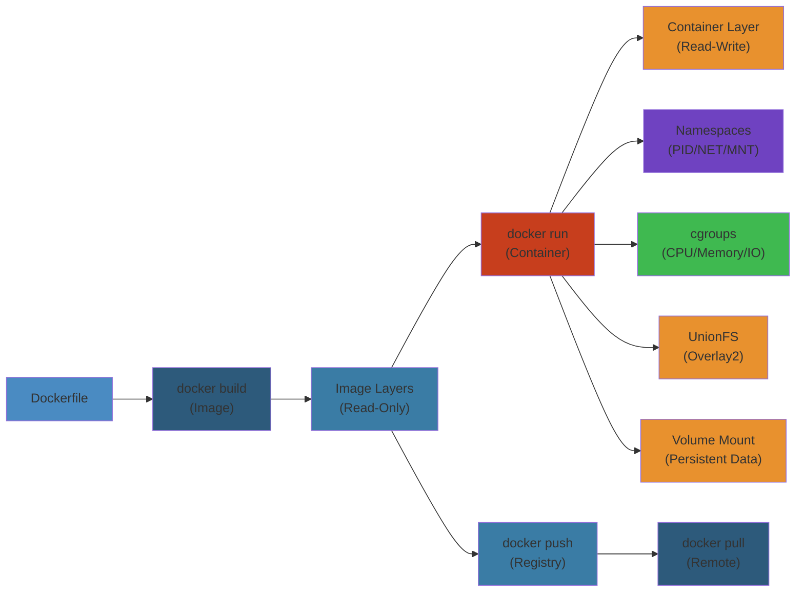
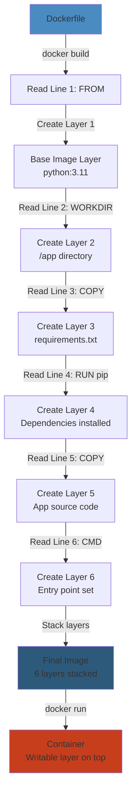

# 🐳 Docker — Complete Deep Dive

**Related**: [Docker Compose & Orchestration](/06-devops/docker/02-compose-orchestration.md) · [Kubernetes Basics](/07-kubernetes/01-kubernetes-basics.md) · [Docker Docs](https://docs.docker.com)

---




## Table of Contents


- [Images & Containers](#-images--containers)
- [Dockerfile Instructions](#-dockerfile-instructions)
- [Layers & Caching](#-layers--caching)
- [Multi-Stage Builds](#-multi-stage-builds)
- [Networking](#-networking)
- [Volumes vs Bind Mounts](#-volumes-vs-bind-mounts)
- [docker-compose vs docker stack](#-docker-compose-vs-docker-stack)
- [Docker Swarm](#-docker-swarm)
- [Resource Limits](#-resource-limits)
- [Security](#-security)
- [Registry & Tags](#-registry--tags)
- [Image Size Optimization](#-image-size-optimization)
- [.dockerignore](#-dockerignore)
- [Simplest Mental Model](#-simplest-mental-model)

---

## 🧭 Images & Containers


```text
Docker Architecture:

┌─────────────────────────────────────────────────┐
│                  Docker Client                    │
│  (docker build, run, push, pull — CLI / API)     │
└────────────────────┬────────────────────────────┘
                     │  REST API (daemon.sock)
                     ▼
┌─────────────────────────────────────────────────┐
│               Docker Daemon (dockerd)             │
│  ┌──────────┐  ┌──────────┐  ┌───────────────┐  │
│  │  Images   │  │Containers│  │  Volumes /    │  │
│  │  (layered)│  │ (runs)   │  │  Networks     │  │
│  └──────────┘  └──────────┘  └───────────────┘  │
└────────────────────┬────────────────────────────┘
                     │
                     ▼
┌─────────────────────────────────────────────────┐
│               containerd (runtime)                │
│  ┌─────────────────────────────────────────┐     │
│  │              runc (OCI spec)             │     │
│  └─────────────────────────────────────────┘     │
└─────────────────────────────────────────────────┘
```

### Images vs Containers


| Concept | Analogy | Description |
|---------|---------|-------------|
| **Image** | Class / Recipe | Read-only template with instructions to create a container |
| **Container** | Instance / Dish | Runnable instance of an image — has state, filesystem changes |
| **Registry** | Cookbook library | Stores and distributes images (Docker Hub, ECR, GCR) |
| **Dockerfile** | Recipe card | Instructions to build an image |

### Image Layers


```text
Container Filesystem (union mount - overlay2):

┌─────────────────────────────────┐
│  Container Layer (read-write)   │  ← ephemeral, deleted when container removed
├─────────────────────────────────┤
│  Image Layer 4 (CMD)            │  ← shared across containers
├─────────────────────────────────┤
│  Image Layer 3 (COPY app.jar)   │  ← each instruction = one layer
├─────────────────────────────────┤
│  Image Layer 2 (RUN apt-get)    │
├─────────────────────────────────┤
│  Image Layer 1 (FROM ubuntu)    │  ← base layer
└─────────────────────────────────┘

Union mount: all layers stacked, top layer is read-write.
Copy-on-write: when container modifies a file, it's copied up to top layer.
```

### Step-by-Step


1. **Dockerfile creation**: Write instructions (FROM, RUN, COPY, CMD) to define how to build an image
2. **Build process**: Docker reads Dockerfile line-by-line and creates a layer for each instruction
3. **Layer caching**: Each layer is cached; unchanged layers are reused on rebuilds (faster builds)
4. **Image finalization**: All layers are stacked (union mount with overlay2) to create final image
5. **Image registry**: Image is tagged and pushed to Docker Registry (Docker Hub, ECR, etc.)
6. **Container creation**: When `docker run` executes, a new writable layer is created on top of image layers

### Code Example


```dockerfile
# Dockerfile - defines how to build a Docker image
# Use official Python runtime as base image
FROM python:3.11-slim

# Set working directory inside container
WORKDIR /app

# Copy requirements.txt from host to container
COPY requirements.txt .

# Install dependencies (creates a layer)
RUN pip install --no-cache-dir -r requirements.txt

# Copy application code
COPY . .

# Expose port (metadata, doesn't publish)
EXPOSE 5000

# Set environment variable
ENV FLASK_APP=app.py

# Define command to run when container starts
CMD ["python", "app.py"]

# Build: docker build -t myapp:1.0 .
# Run: docker run -p 5000:5000 myapp:1.0
```

### Real-World Scenario


A CI/CD pipeline built Docker images for every commit. Without layer caching, each build reinstalled all 500 dependencies (3 minutes). After optimizing the Dockerfile (put Dockerfile changes before COPY), unchanged dependencies were cached and reused. Build time dropped from 3 minutes to 15 seconds, allowing 100+ deployments per day instead of 5.

### Diagram




### Key Commands


```bash
# Image management
docker pull ubuntu:22.04            # Download image
docker images                        # List local images
docker rmi <image>                   # Remove image
docker tag myapp:latest registry.io/myapp:v1  # Tag image

# Container lifecycle
docker run -d --name myapp -p 8080:80 nginx   # Run detached
docker run -it --rm ubuntu bash                 # Interactive + auto-cleanup
docker ps -a                                    # List all containers
docker stop <container> && docker rm <container># Stop + remove
docker exec -it <container> sh                  # Shell into running container
docker logs -f <container>                      # Follow logs
docker cp <container>:/path ./local             # Copy files from container

# Image build
docker build -t myapp:latest .                  # Build image
docker history myapp:latest                     # Show layer history
docker inspect myapp:latest                     # Detailed image metadata
```

---

## 🧭 Dockerfile Instructions


### Complete Reference


```dockerfile
# Every Dockerfile starts with FROM — the base image
FROM ubuntu:22.04 AS base

# LABEL — metadata (maintainer, version, etc.)
LABEL maintainer="dev@example.com" \
      version="1.0.0" \
      description="My application"

# ENV — environment variables (persist in container)
ENV APP_HOME=/app \
    NODE_ENV=production \
    PORT=8080

# ARG — build-time variables (don't persist in image)
ARG DEBIAN_FRONTEND=noninteractive
ARG APP_VERSION=1.0.0

# RUN — execute commands during build (creates layer)
RUN apt-get update && apt-get install -y \
    curl \
    python3 \
    && rm -rf /var/lib/apt/lists/*    # Cleanup to reduce layer size

# WORKDIR — set working directory (creates if not exists)
WORKDIR $APP_HOME

# COPY — copy files from context into image
COPY package.json package-lock.json ./
COPY src/ ./src/

# ADD — like COPY but supports URLs + tar auto-extraction
ADD https://example.com/file.tar.gz /tmp/
ADD archive.tar.gz /tmp/              # Automatically extracted

# EXPOSE — documentation only (doesn't publish port)
EXPOSE 8080
EXPOSE 9090/udp

# VOLUME — mount point for persistent/storage
VOLUME /data

# USER — switch user (security: don't run as root)
RUN groupadd -r appuser && useradd -r -g appuser appuser
USER appuser

# HEALTHCHECK — container health check
HEALTHCHECK --interval=30s --timeout=3s --start-period=5s --retries=3 \
    CMD curl -f http://localhost:8080/health || exit 1

# CMD — default command (can be overridden: docker run ... args)
CMD ["node", "server.js"]

# ENTRYPOINT — main command (harder to override)
ENTRYPOINT ["docker-entrypoint.sh"]
```

### CMD vs ENTRYPOINT


```text
                     CMD only                    ENTRYPOINT + CMD
┌────────────────────────────┐   ┌──────────────────────────────────┐
│ FROM ubuntu                │   │ FROM ubuntu                       │
│ CMD ["echo", "hello"]      │   │ ENTRYPOINT ["echo"]              │
│                            │   │ CMD ["hello"]                    │
├────────────────────────────┤   ├──────────────────────────────────┤
│ docker run image           │   │ docker run image                 │
│ → "hello"                  │   │ → "hello"                        │
│                            │   │                                  │
│ docker run image hi        │   │ docker run image hi              │
│ → "hi"  (CMD overridden)   │   │ → "hi"  (CMD is default arg)    │
│                            │   │                                  │
│                            │   │ docker run --entrypoint sh image │
│                            │   │ → shell (ENTRYPOINT overridden)  │
└────────────────────────────┘   └──────────────────────────────────┘
```

### SHELL vs Exec Form


```dockerfile
# Shell form — invokes /bin/sh -c
RUN apt-get update && apt-get install -y curl
CMD echo "hello"
ENTRYPOINT entrypoint.sh param1

# Exec form — direct execution (no shell, no variable expansion)
RUN ["apt-get", "update"]
CMD ["echo", "hello"]
ENTRYPOINT ["entrypoint.sh", "param1"]

# Use exec form for ENTRYPOINT to get proper signal handling
# Shell form wraps in /bin/sh which doesn't forward signals
ENTRYPOINT ["node", "server.js"]    # ← receives SIGTERM correctly
ENTRYPOINT "node server.js"         # ← /bin/sh ignores SIGTERM
```

---

## 🧭 Layers & Caching


### How Layer Caching Works


```text
Build Process:
  ┌────────────┐
  │ FROM ubuntu│──── (cached — rarely changes)
  └────────────┘
        │
  ┌────────────┐
  │ RUN apt-get│──── (cached — rarely changes)
  └────────────┘
        │
  ┌──────────────┐
  │ COPY package.*│──── (cached IF package.json unchanged)
  └──────────────┘
        │
  ┌──────────────┐
  │ RUN npm install│──── (cache INVALIDATED if package.json changed)
  └──────────────┘        ← This is where builds slow down!
        │
  ┌────────────┐
  │ COPY src/  │──── (always invalidated if src changed)
  └────────────┘
        │
  ┌────────────┐
  │ CMD ...    │──── (cached — metadata only)
  └────────────┘

KEY INSIGHT: Order matters! Put infrequently-changing steps first.
```

### Cache Optimization


```dockerfile
# BAD — cache invalidated on any source change
FROM node:18
WORKDIR /app
COPY . .               # If any file changes, ALL subsequent layers rebuild
RUN npm install
CMD ["node", "server.js"]

# GOOD — split COPY to maximize cache hits
FROM node:18 AS deps
WORKDIR /app
COPY package.json package-lock.json ./   # Only invalidated when deps change
RUN npm install --production

FROM node:18 AS build
WORKDIR /app
COPY --from=deps /app/node_modules ./node_modules
COPY . .                                 # Source changes don't reinstall deps
RUN npm run build

FROM node:18-slim
WORKDIR /app
COPY --from=build /app/dist ./dist       # Minimal final image
COPY --from=deps /app/node_modules ./node_modules
CMD ["node", "dist/server.js"]
```

### INVALIDATION Rules


```text
Layer Cached IF:
  • Base image hash matches
  • All parent layers cached
  • Instruction string matches
  • COPY/ADD: file contents hash matches (metadata too on COPY)
  • RUN: command string matches (output NOT checksummed!)

Layer INVALIDATED when:
  • Any parent layer changes
  • COPY/ADD file content changes
  • RUN command text changes
  • Base image changes

TIP: Use --no-cache to force rebuild: docker build --no-cache .
TIP: Use --cache-from to use external cache: docker build --cache-from registry/app:latest .
```

---

## 🧭 Multi-Stage Builds


### Why Multi-Stage?


```text
Without Multi-Stage:
  ┌──────────────────────────────────────┐
  │  Final Image (~800MB)                │
  │  ┌────────────────────────────────┐  │
  │  │  JDK + Maven + Compiler       │  │  ← Build tools in production!
  │  │  Source code (.java)          │  │
  │  │  Compiled .class → .jar       │  │
  │  └────────────────────────────────┘  │
  └──────────────────────────────────────┘

With Multi-Stage:
  Build Stage (~800MB)         Final Stage (~150MB)
  ┌────────────────────┐      ┌────────────────────┐
  │ JDK + Maven        │      │ JRE (runtime only) │
  │ Source code        │      │ .jar (compiled)    │
  │ .class → .jar      │─────>│                    │
  └────────────────────┘      └────────────────────┘
  (discarded!)                 (only what you need)
```

### Examples


```dockerfile
# Java Spring Boot multi-stage build
FROM maven:3.9-eclipse-temurin-17 AS builder
WORKDIR /build
COPY pom.xml .
RUN mvn dependency:go-offline                    # Cache deps
COPY src ./src
RUN mvn clean package -DskipTests                 # Build

FROM eclipse-temurin:17-jre-alpine
WORKDIR /app
COPY --from=builder /build/target/*.jar app.jar
EXPOSE 8080
HEALTHCHECK --interval=30s --timeout=3s CMD wget --spider http://localhost:8080/actuator/health
USER 1000:1000
ENTRYPOINT ["java", "-jar", "app.jar"]

# Go multi-stage build
FROM golang:1.21 AS builder
WORKDIR /build
COPY go.mod go.sum ./
RUN go mod download
COPY . .
RUN CGO_ENABLED=0 GOOS=linux go build -o /app ./cmd/server

FROM scratch                               # FROM scratch = empty filesystem!
COPY --from=builder /app /app
COPY --from=builder /etc/ssl/certs/ca-certificates.crt /etc/ssl/certs/
EXPOSE 8080
ENTRYPOINT ["/app"]

# Node.js multi-stage with distroless
FROM node:18 AS builder
WORKDIR /app
COPY package.json package-lock.json ./
RUN npm ci
COPY . .
RUN npm run build

FROM gcr.io/distroless/nodejs18-debian11  # distroless = minimal + secure
WORKDIR /app
COPY --from=builder /app/dist ./dist
COPY --from=builder /app/node_modules ./node_modules
EXPOSE 8080
CMD ["dist/server.js"]
```

### Named Stages & Targets


```dockerfile
# Multiple named stages, build specific target
FROM node:18 AS base
WORKDIR /app
EXPOSE 8080

FROM base AS development
ENV NODE_ENV=development
RUN npm install --include=dev
COPY . .
CMD ["npm", "run", "dev"]

FROM base AS production
ENV NODE_ENV=production
COPY package.json package-lock.json ./
RUN npm ci --production
COPY --from=builder /app/dist ./dist
CMD ["node", "dist/server.js"]

# Build specific stage:
#   docker build --target development -t myapp:dev .
#   docker build --target production -t myapp:latest .
```

---

## 🧭 Networking


### Network Types


```text
Docker Network Drivers:

┌─────────────┐  ┌─────────────┐  ┌─────────────┐  ┌─────────────┐
│   bridge     │  │    host     │  │   overlay   │  │   macvlan   │
│  (default)   │  │ (no isol.)  │  │  (swarm)    │  │  (mac addr) │
├─────────────┤  ├─────────────┤  ├─────────────┤  ├─────────────┤
│ • Per-host   │  │ • Container │  │ • Multi-host │  │ • Physical  │
│ • NAT'd IP   │  │   shares    │  │   networking│  │   MAC addr  │
│ • Container  │  │   host net  │  │ • Encrypted │  │ • Directly  │
│   <-> cont.  │  │ • No port   │  │   (ipsec)   │  │   on subnet │
│   DNS names  │  │   mapping   │  │ • Needed for│  │ • Container │
│ • Port map   │  │ • Best perf │  │   Swarm srvs│  │   looks like│
│   to host    │  │ • No isol.  │  │             │  │   phys dev  │
└─────────────┘  └─────────────┘  └─────────────┘  └─────────────┘
```

### Bridge Network


```bash
# Default bridge (docker0) — created automatically
docker run nginx                                    # Attached to default bridge

# User-defined bridge — has DNS resolution between containers
docker network create my-network
docker run -d --name web --network my-network nginx
docker run -d --name app --network my-network myapp

# Containers can reach each other by name:
#   curl http://web:80           (DNS resolves to container IP)
# NOT by name on default bridge (only by IP or --link, deprecated)
```

### Host Network


```bash
# Container uses host's network stack (no isolation)
docker run --network host nginx
# Access: http://localhost:80  (no port mapping needed)
# Use for: performance-critical apps, apps that need host interfaces
# Warning: No port conflict protection — two containers on host can't use same port
```

### Overlay Network (Swarm)


```bash
# Multi-host networking — requires Swarm mode
docker swarm init
docker network create --driver overlay --attachable my-overlay

# Services on different hosts communicate through overlay
# Encrypted option:
docker network create --driver overlay --opt encrypted my-secure-network

# Use --attachable so standalone containers can also join
```

### Macvlan Network


```bash
# Container gets its own MAC and IP on physical network
docker network create -d macvlan \
  --subnet=192.168.1.0/24 \
  --gateway=192.168.1.1 \
  -o parent=eth0 \
  my-macvlan

docker run --network my-macvlan --ip=192.168.1.100 nginx
# Container appears as physical device on network
# Can be accessed directly by IP
```

### Port Mapping


```text
Host → Container port mapping:

   Host (your machine)
   ┌───────────────────────┐
   │  docker0 bridge       │
   │  IP: 172.17.0.1       │
   │                       │
   │  iptables NAT rule:   │
   │  host:8080 → 172.17.0.2:80
   │                       │
   │  ┌─────────────────┐  │
   │  │ Container       │  │
   │  │ IP: 172.17.0.2  │  │
   │  │ Port: 80        │  │
   │  └─────────────────┘  │
   └───────────────────────┘

Command: docker run -p 8080:80 nginx
         docker run -p 127.0.0.1:8080:80/tcp nginx  (bind to specific interface)
         docker run -p 8080:80 -p 8443:443 nginx      (multiple ports)
```

---

## 🧭 Volumes vs Bind Mounts


```text
┌────────────────────────────────────────────────────────────┐
│                       Data Persistence                      │
├───────────────┬────────────────┬────────────────────────────┤
│               │    Volumes     │       Bind Mounts          │
├───────────────┼────────────────┼────────────────────────────┤
│ Managed by   │ Docker         │ You                        │
│ Location     │ /var/lib/docker│ Any path on host            │
│              │ /volumes/      │                             │
│ Backup       │ docker run --rm│ cp -r (manual)              │
│              │ -v volume:/data│                             │
│              │ ... tar cvf    │                             │
│ CLI          │ docker volume  │ Native filesystem cmds      │
│              │ create/ls/rm   │                             │
│ Sharing      │ Use same volume│ Reuse same host path        │
│              │ across mounts  │                             │
│ Non-root     │ Yes (Docker    │ Host file perms apply       │
│              │ manages perms) │                             │
│ Portability  │ Yes (export)   │ Path-dependent              │
│ Performance  │ Native (Linux) │ Native                      │
│ Use case     │ Production DB  │ Dev config, source mounts   │
│              │ data, config   │ for hot-reload              │
└───────────────┴────────────────┴────────────────────────────┘
```

### Volume Commands


```bash
# Volume management
docker volume create my-data
docker volume ls
docker volume inspect my-data
docker volume rm my-data
docker volume prune                          # Remove unused volumes

# Use a volume
docker run -v my-data:/data alpine

# Anonymous volume (auto-created)
docker run -v /data alpine                   # anonymous volume created

# Named volume with driver options (NFS example)
docker volume create --driver local \
  --opt type=nfs \
  --opt o=addr=192.168.1.100,rw \
  --opt device=:/path/to/dir \
  my-nfs-volume
```

### Bind Mounts


```bash
# Mount host directory into container
docker run -v /host/path:/container/path nginx
docker run --mount type=bind,source=/host/path,target=/container/path nginx

# Read-only bind mount
docker run -v /host/path:/container/path:ro nginx

# Mount for development (hot-reload)
docker run -v $(pwd)/src:/app/src -v $(pwd)/node_modules:/app/node_modules:ro node npm run dev
```

### tmpfs Mount


```bash
# In-memory filesystem (non-persistent, fast)
docker run --tmpfs /app/cache:noexec,nosuid,size=64m nginx
docker run --mount type=tmpfs,destination=/app/cache,tmpfs-size=64m nginx
# Use for: secrets in memory, cache, scratch space
```

---

## 🧭 docker-compose vs docker stack


```text
                docker-compose                  docker stack
┌─────────────────────────┐    ┌───────────────────────────────┐
│ Single host             │    │ Multi-host (Swarm mode)       │
│ Development-focused     │    │ Production deployment         │
│ Manual scaling          │    │ Declarative scaling           │
│ `docker compose up`     │    │ `docker stack deploy`         │
│ No rolling updates      │    │ Rolling updates built-in      │
│ No service mesh         │    │ Ingress LB + mesh routing     │
│ v3.8+ format            │    │ v3.x format (subset)          │
└─────────────────────────┘    └───────────────────────────────┘
```

### Compose File (docker-compose.yml)


```yaml
version: "3.9"

services:
  web:
    build:
      context: .
      dockerfile: Dockerfile.web
    ports:
      - "8080:80"
    environment:
      - NODE_ENV=production
      - DB_HOST=db
    depends_on:
      - db
      - redis
    volumes:
      - ./src:/app/src
      - web-data:/app/data
    networks:
      - frontend
      - backend
    healthcheck:
      test: ["CMD", "curl", "-f", "http://localhost/health"]
      interval: 30s
      timeout: 3s
      retries: 3
    restart: unless-stopped

  db:
    image: postgres:16
    volumes:
      - pg-data:/var/lib/postgresql/data
    environment:
      - POSTGRES_DB=myapp
      - POSTGRES_PASSWORD_FILE=/run/secrets/db_password
    secrets:
      - db_password
    networks:
      - backend
    deploy:                    # Used by docker stack, ignored by compose
      replicas: 1
      resources:
        limits:
          cpus: "0.5"
          memory: 512M
    healthcheck:
      test: ["CMD-SHELL", "pg_isready -U myapp"]
      interval: 10s

  redis:
    image: redis:7-alpine
    volumes:
      - redis-data:/data
    networks:
      - backend
    profiles:
      - dev                 # Only started in 'dev' profile

networks:
  frontend:
  backend:
    driver: overlay          # Only used by swarm

volumes:
  pg-data:
  redis-data:
  web-data:

secrets:
  db_password:
    file: ./secrets/db_password.txt
```

### Stack Deploy


```bash
# docker-compose (single host)
docker compose up -d
docker compose down
docker compose logs -f
docker compose exec web sh
docker compose ps

# docker stack (swarm mode)
docker stack deploy -c docker-compose.yml myapp
docker stack services myapp
docker stack ps myapp
docker stack rm myapp

# Scaling
docker compose up -d --scale web=3          # Compose
docker service scale myapp_web=5            # Stack/Swarm
```

---

## 🧭 Docker Swarm


### Swarm Architecture


```text
Swarm Cluster:

┌──────────────────────────────────────────────────────┐
│                    Manager Nodes                       │
│  ┌────────┐  ┌────────┐  ┌────────┐  ┌────────┐     │
│  │Manager1│  │Manager2│  │Manager3│  │Manager4│     │
│  │(leader)│  │(follower)││(follower)││(follower)│   │
│  │ Raft   │  │ Raft    ││  Raft   ││  Raft   │     │
│  └────┬───┘  └────────┘  └────────┘  └────────┘     │
│       │         │             │           │          │
│       └─────────┴─────────────┴───────────┘          │
│                    Raft Consensus Group               │
├──────────────────────────────────────────────────────┤
│                    Worker Nodes                        │
│  ┌────────┐  ┌────────┐  ┌────────┐  ┌────────┐     │
│  │Worker1 │  │Worker2 │  │Worker3 │  │Worker4 │     │
│  │        │  │        │  │        │  │        │     │
│  │ task1  │  │ task2  │  │ task3  │  │ task4  │     │
│  └────────┘  └────────┘  └────────┘  └────────┘     │
└──────────────────────────────────────────────────────┘
```

### Swarm Commands


```bash
# Initialize swarm
docker swarm init --advertise-addr 192.168.1.10

# Join a worker
docker swarm join --token SWMTKN-1-xxx 192.168.1.10:2377

# List nodes
docker node ls
docker node inspect <node>
docker node update --availability drain <node>   # Drain for maintenance
docker node promote <node>                        # Promote worker to manager

# Services
docker service create --name web --replicas 3 -p 80:80 nginx
docker service ls
docker service ps web
docker service scale web=5
docker service update --image nginx:1.25 web
docker service update --publish-rm 80 --publish-add 8080:80 web
docker service logs web
docker service rm web

# Rolling update
docker service update \
  --image myapp:v2 \
  --update-parallelism 2 \
  --update-delay 10s \
  --update-order start-first \
  web
```

### Raft Consensus


```text
Swarm uses Raft for consistency among managers:

        Manager 1 (Leader)
        ┌─────────────────────┐
        │ Term: 3             │
        │ Log Index: 42       │
        └────┬────┬────┬──────┘
             │    │    │
    AppendEntries RPCs
      ┌──────┘    │    └──────┐
      ▼           ▼           ▼
  ┌────────┐ ┌────────┐ ┌────────┐
  │Mgr 2   │ │Mgr 3   │ │Mgr 4   │
  │Term: 3 │ │Term: 3 │ │Term: 3 │
  │Idx: 42 │ │Idx: 42 │ │Idx: 42 │
  └────────┘ └────────┘ └────────┘
  (follower) (follower) (follower)

Requires majority (N/2 + 1) managers to be healthy.
Recommended: 3 or 5 managers (odd number).
```

---

## 🧭 Resource Limits


### Memory Limits


```bash
# Hard limit — container killed if exceeded
docker run -m 512m --memory-reservation 256m nginx

# Swap limit (must be ≥ memory limit)
docker run -m 512m --memory-swap 1g nginx              # 512M RAM + 512M swap
docker run -m 512m --memory-swap -1 nginx               # unlimited swap

# Kernel memory (cgroup v1)
docker run --kernel-memory 100m nginx

# OOM priority
docker run --oom-kill-disable=true -m 512m nginx         # Don't OOM kill
docker run --oom-score-adj -500 nginx                    # Less likely to be killed
```

### CPU Limits


```bash
# CPU shares (relative weight, default 1024)
docker run --cpu-shares 512 nginx              # Gets half the default weight

# CPU quota (absolute limit)
docker run --cpus 1.5 nginx                    # Max 1.5 CPU cores
docker run --cpuset-cpus 0-3 nginx             # Only use CPUs 0-3
docker run --cpuset-cpus 0,2 nginx             # Only use CPUs 0 and 2

# CPU period + quota (lower-level)
docker run --cpu-period=100000 --cpu-quota=50000 nginx   # Max 0.5 CPU per 100ms
```

### Block I/O Limits


```bash
# Read/write rate limits
docker run --device-read-bps /dev/sda:1mb nginx
docker run --device-write-bps /dev/sda:10mb nginx
docker run --device-read-iops /dev/sda:1000 nginx
docker run --device-write-iops /dev/sda:500 nginx

# View current limits
docker stats
docker inspect <container> | jq '.[0].HostConfig.Memory'
```

---

## 🧭 Security


### Seccomp (Secure Computing Mode)


```text
Seccomp profiles filter system calls available to the container.

┌─────────────────────────────────────────────────┐
│                Container Process                  │
│                                                   │
│   open()  read()  write()  clone()  mount()      │
│      │       │       │       │       │            │
│      ▼       ▼       ▼       ▼       ▼            │
│   ┌───────────────────────────────────────────┐   │
│   │          Seccomp BPF Filter                │   │
│   │  Allowed: 300+ common syscalls             │   │
│   │  Blocked: mount, reboot, kexec_load, ...   │   │
│   └───────────────────────────────────────────┘   │
│                                                   │
│   ALLOW  ┌─────┐  DENY  ┌─────┐  ALLOW  ┌─────┐  │
│   open() │  ✓  │ mount()│  ✗  │ read() │  ✓  │  │
│          └─────┘        └─────┘        └─────┘  │
└─────────────────────────────────────────────────┘
```

```bash
# Default seccomp profile is applied automatically
docker run nginx                              # Default profile applied

# Custom seccomp profile
docker run --security-opt seccomp=custom.json nginx

# Disable seccomp (insecure, for debugging)
docker run --security-opt seccomp=unconfined nginx
```

### AppArmor


```bash
# AppArmor mandatory access control
docker run --security-opt apparmor=my-profile nginx

# Default profile
docker run --security-opt apparmor=docker-default nginx

# Disable
docker run --security-opt apparmor=unconfined nginx
```

### Capabilities


```bash
# Linux capabilities — fine-grained privileges
# Default: container gets limited capabilities (CHOWN, DAC_OVERRIDE, FOWNER, etc.)

# Drop all capabilities, add only what's needed
docker run --cap-drop ALL --cap-add NET_BIND_SERVICE nginx

# Run with specific extra caps
docker run --cap-add SYS_PTRACE --cap-add NET_ADMIN ubuntu

# Privileged mode (ALL capabilities + host device access)
docker run --privileged ubuntu                          # Only for testing!
```

### Rootless Docker


```text
Rootless mode runs dockerd and containers without root privileges:

┌───────────────────────────────────────────────────┐
│ User's Namespace (uid 1000)                        │
│  ┌─────────────────────────────────────────────┐  │
│  │ dockerd (runs as user, not root)             │  │
│  │ containerd → runc → container (uid 0 in ns) │  │
│  │                                              │  │
│  │ Container thinks it's root (uid 0),          │  │
│  │ but host sees uid 1000 (user namespace)      │  │
│  └─────────────────────────────────────────────┘  │
│                                                    │
│ Host: uid 1000 maps to 0 in container namespace    │
│ Host: Container can't modify host files as root    │
└───────────────────────────────────────────────────┘
```

### Additional Security Options


```bash
# No new privileges (prevents privilege escalation via suid binaries)
docker run --security-opt no-new-privileges:true nginx

# Read-only root filesystem
docker run --read-only --tmpfs /tmp --tmpfs /var/run nginx

# User namespace remapping
docker run --userns=host nginx                    # Default (no remap)
dockerd --userns-remap=default                     # Daemon-level remapping
```

---

## 🧭 Registry & Tags


### Docker Hub / Private Registry


```bash
# Authentication
docker login
docker login my-registry.io:5000 -u admin -p password

# Registry operations
docker pull nginx:1.25                    # From Docker Hub
docker pull my-registry.io/app:v1          # From private registry
docker push my-registry.io/app:v1

# Private registry (run locally)
docker run -d -p 5000:5000 --name registry registry:2
docker tag myapp:latest localhost:5000/myapp:v1
docker push localhost:5000/myapp:v1
docker pull localhost:5000/myapp:v1
```

### Tagging Conventions


```text
Tag patterns:

latest              # Last built (default — bad practice for prod)
v1.0.0              # Semantic version (semver)
v1.0.0-rc1          # Pre-release
sha-abc1234         # Git commit SHA — reproducible builds
1.0.0-linux-arm64   # Platform-specific
production-eu-1     # Environment-specific
```

### Image Distribution


```bash
# Multi-architecture images (manifest lists)
docker buildx build --platform linux/amd64,linux/arm64 --push -t myapp:latest .

# Trusted content (Docker Content Trust)
export DOCKER_CONTENT_TRUST=1
docker push myapp:latest                    # Signed push
docker pull myapp:latest                    # Only allows signed images
```

---

## 🧭 Image Size Optimization


### Comparison


```text
Base Image Size Comparison (approximate):

  ubuntu:22.04        ~77MB    ← Full Ubuntu userland
  debian:bookworm     ~78MB    ← Full Debian
  alpine:3.18         ~3.5MB   ← musl libc + busybox (small!)
  distroless          ~2-20MB  ← Language runtime only, no package manager
  scratch              0B      ← Empty filesystem (static binaries only)

Example: Node.js app image sizes
  node:18              ~345MB   ← Full OS + Node + npm
  node:18-alpine       ~126MB   ← Alpine + Node
  gcr.io/distroless/nodejs18 ~90MB  ← Glibc + Node only
  node:18-slim         ~77MB    ← Debian slim + Node
```

### Optimization Techniques


```dockerfile
# 1. Use smaller base images
FROM node:18-alpine                     # Alpine is 20x smaller than full
FROM eclipse-temurin:17-jre-alpine      # JRE, not JDK
FROM golang:1.21-alpine                 # For building

# 2. Clean package manager cache in same RUN layer
RUN apt-get update && apt-get install -y \
    build-essential \
    && rm -rf /var/lib/apt/lists/*      # ← Same layer! Saves ~30MB

# 3. Remove unnecessary files
RUN apt-get update && apt-get install -y \
    python3 \
    && apt-get clean \
    && rm -rf /var/lib/apt/lists/* /tmp/* /var/tmp/*

# 4. Install only production deps
RUN npm ci --production                 # Not npm install (includes devDeps)

# 5. Multi-stage builds (copy only artifacts)
FROM builder AS final
COPY --from=builder /app/dist ./dist    # Only the built code
COPY --from=builder /app/node_modules ./node_modules

# 6. Use --no-install-recommends
RUN apt-get update && apt-get install -y --no-install-recommends \
    curl \
    && rm -rf /var/lib/apt/lists/*

# 7. Symlink instead of multiple copies (1 layer)
RUN ln -s /usr/local/node/bin/node /usr/bin/node

# 8. Use .dockerignore (prevents unnecessary context)
```

### Size Analysis


```bash
# Check image size
docker images myapp
docker history myapp                    # Layer-by-layer breakdown

# Dive tool — interactive layer analysis
dive myapp:latest

# Docker scout — vulnerability + size analysis (requires Docker Desktop)
docker scout quickview myapp:latest
```

---

## 🧭 .dockerignore


### Purpose


```text
.dockerignore prevents sending unnecessary files to Docker daemon:

  Build Context (dir)              Docker Daemon
  ┌──────────────────┐            ┌──────────────────────┐
  │ src/             │            │  Build Context        │
  │ node_modules/    │  ──send──> │  (after filtering)    │
  │ .git/            │            │  src/                 │
  │ dist/            │            │  package.json         │
  │ .env             │            │  Dockerfile           │
  │ Dockerfile       │            │                      │
  │ .dockerignore    │ ignored    │                      │
  │ README.md        │   ──✗──>  │                      │
  └──────────────────┘            └──────────────────────┘

Benefits: Faster builds, smaller build context, no secrets leaked.
```

### Example .dockerignore


```
# .dockerignore — glob patterns, one per line

# Version control
.git/
.gitignore
.gitattributes

# Dependencies (will be installed in container)
node_modules/
vendor/
.bundled/

# Build outputs
dist/
build/
target/
*.jar
*.class
*.pyc
__pycache__/
.env*.local

# IDE / editor files
.idea/
.vscode/
*.swp
*.swo
*~

# OS files
.DS_Store
Thumbs.db

# CI/CD
.circleci/
.github/
.ci/

# Docker files (not needed in context)
Dockerfile
.dockerignore

# Environment files (contain secrets!)
.env
.env.*
*.pem
*.key

# Logs
*.log
npm-debug.log*
```

### Layer Optimization Patterns


```dockerfile
# PATTERN 1: Dependency cache isolation
FROM node:18-alpine AS deps
WORKDIR /app
COPY package.json package-lock.json ./    # Only dep files
RUN npm ci --production

FROM node:18-alpine AS final
WORKDIR /app
COPY --from=deps /app/node_modules ./node_modules
COPY . .                                  # Source files — fast when deps cached
CMD ["node", "server.js"]

# PATTERN 2: Conditional build args
ARG INSTALL_DEV_DEPS=false
RUN if [ "$INSTALL_DEV_DEPS" = "true" ]; then \
        npm install --include=dev; \
    else \
        npm ci --production; \
    fi

# PATTERN 3: BuildKit — --mount=cache for persistent cache across builds
# (requires DOCKER_BUILDKIT=1)
RUN --mount=type=cache,target=/root/.npm \
    npm install

# PATTERN 4: Squash layers (use sparingly — loses history)
# docker build --squash -t myapp .
```

### Visual: Docker Image Build & Layer Cache

```mermaid
graph TD
    A["Dockerfile"] -->|FROM ubuntu:22.04| Layer1["Layer 1<br/>Base OS<br/>200MB"]
    A -->|RUN apt-get update| Layer2["Layer 2<br/>Dependencies<br/>150MB"]
    A -->|COPY app.jar| Layer3["Layer 3<br/>App Code<br/>50MB"]
    A -->|RUN java -jar| Layer4["Layer 4<br/>Compiled State<br/>100MB"]
    A -->|CMD java -jar| Layer5["Layer 5<br/>Metadata<br/>0 bytes"]
    
    Layer1 --> Cache["Build Cache<br/>Hit?"]
    Layer2 --> Cache
    Layer3 --> Cache
    Layer4 --> Cache
    Layer5 --> Cache
    
    Cache -->|Hit| Reuse["Reuse Layers<br/>Fast Build"]
    Cache -->|Miss| Rebuild["Rebuild From<br/>This Layer<br/>Slow Build"]
    
    Reuse -->|Stack All| Image["Final Image<br/>union mount<br/>overlay2"]
    Rebuild -->|Stack All| Image
    
    Image -->|docker run| Container["Container<br/>RW Layer<br/>(temp)"]
    Image -->|Registry Push| Push["Docker Hub<br/>Registry"]
    
    style A fill:#1e3a5f,stroke:#00d4ff
    style Layer1 fill:#3a7ca5,stroke:#00d4ff
    style Layer2 fill:#3a7ca5,stroke:#00d4ff
    style Layer3 fill:#3a7ca5,stroke:#00d4ff
    style Layer4 fill:#3a7ca5,stroke:#00d4ff
    style Layer5 fill:#3a7ca5,stroke:#00d4ff
    style Cache fill:#1e3a5f,stroke:#00d4ff
    style Reuse fill:#1e5f3f,stroke:#34d399
    style Rebuild fill:#5f1e1e,stroke:#ef4444
    style Image fill:#1e5f3f,stroke:#34d399
    style Container fill:#1e5f3f,stroke:#34d399
    style Push fill:#3a7ca5,stroke:#00d4ff
```



---

## 🧠 Simplest Mental Model


```text
DOCKER = Shipping containers for software.

IMAGES  = Blueprint / Recipe book
  Each page (layer) = one instruction (FROM ubuntu, COPY app.jar, CMD java)
  Layers are read-only and shared between containers.
  Pull once, use many times.

CONTAINERS = Actual packages (running instances)
  Each package has its own:
  • Filesystem (its own layer on top of image)
  • IP address (unless --network host)
  • Processes (isolated via Linux namespaces)
  • Resources (limited via cgroups)

DOCKERFILE = Recipe card instructions
  FROM       = Start with this cookbook (base OS)
  RUN        = Execute step (apt-get, install)
  COPY/ADD   = Put these ingredients in
  CMD        = Default way to serve the dish
  ENTRYPOINT = Main cooking method (harder to change)
  EXPOSE     = This dish needs to be on this plate (port)

VOLUMES  = Pantry (managed by Docker, survives container lifecycle)
BIND MOUNTS = Direct shelf access (your directory, hot-reload for dev)

NETWORKING:
  bridge  = Private subnet per host — containers talk by name
  host    = Share the host's network card (fast, no isolation)
  overlay = Cross-host private network (magic tunnel between machines)
  macvlan = Container looks like a real computer on your LAN

LAYER CACHING:
  Each instruction = a layer. If nothing changed, Docker reuses it.
  Order your Dockerfile so slow-changing steps come first.
  This is the #1 Dockerfile optimization trick.

MULTI-STAGE = Use a big kitchen to cook, then plate only the food.
  Builder stage: full JDK + Maven (big, thrown away)
  Final stage: JRE + compiled jar (small, production)

Docker is about CONSISTENCY: "Works on my machine" → "Works in my container".
```

---

## Interview Questions


### Beginner Level


**Q1: What is the difference between a Docker image and a container?**

**Why interviewers ask this**: Fundamental concept — tests understanding of the build vs runtime split.

**Ideal answer structure**:
1. **Image**: Read-only template with layers (UnionFS), includes application code, runtime, libraries, and config. Immutable once built.
2. **Container**: Running instance of an image — adds a thin writable layer on top. Has its own filesystem, network, and process namespace.
3. **Analogy**: Image = class definition; Container = object instance. Image = recipe book; Container = meal being cooked.
4. **Lifecycle**: Image can have 0..N containers. `docker build` creates images, `docker run` creates containers.

**Common wrong answer**: "Images are just snapshots of containers" — opposite; images create containers, not the other way around (though `docker commit` can create an image from a container).

**Q2**: How does Docker leverage Linux kernel features for isolation?

**Answer**: Two key kernel features: 1) **Namespaces** — PID (process isolation), NET (own network stack), MNT (filesystem mounts), UTS (hostname), IPC (inter-process communication), USER (UID/GID mapping), CGROUP (resource tracking). 2) **cgroups** — limit CPU, memory, disk I/O, network bandwidth per container. `pids.max` prevents fork bombs. `memory.max` prevents OOM on host. Docker uses `runc` (OCI runtime) which creates these namespaces/cgroups on `docker run`. No hypervisor involved — containers share the host kernel.

### Intermediate Level


**Q3: How does Docker's layered filesystem work with OverlayFS?**

**Answer**: OverlayFS merges multiple directories (layers) into a single view. Docker image layers are read-only (stored under `/var/lib/docker/overlay2/`). On `docker run`, Docker creates a writable container layer on top via `overlay2` mount. When a file is modified, **copy-on-write** (CoW) kicks in: the file is copied from lower layer to the writable layer and then modified. This keeps images small (common base layers shared across containers) and container startup fast (no need to copy entire image). `docker commit` snapshots the writable layer. Layer caching in `docker build` reuses unchanged layers (identified by content hash).

**Q4**: What is multi-stage build and why use it?

**Answer**: Multi-stage builds use multiple `FROM` statements in one Dockerfile. The first stage (builder) has full SDK/compiler (e.g., `FROM golang:1.21-alpine AS builder`). The final stage uses only the runtime (e.g., `FROM alpine:3.19`) and copies just the compiled binary from the builder: `COPY --from=builder /app/binary /app/`. This produces small production images (e.g., 15MB Go binary vs 1GB full SDK image). Without multi-stage, you'd need two Dockerfiles or complex scripts. Also improves security — fewer packages means smaller attack surface.

### Senior Level


**Q5: A Docker container runs fine locally but crashes in production with "exec format error". What's wrong?**

**Why interviewers ask this**: Tests understanding of architecture compatibility and build context.

**Answer**: **Architecture mismatch**: the image was built for `linux/amd64` but production runs on `linux/arm64` (e.g., M1 Mac build → AWS Graviton). Docker Desktop uses QEMU emulation for cross-architecture builds by default. Fix: 1) Use `docker buildx build --platform=linux/amd64,linux/arm64` to build multi-arch images. 2) Use `FROM --platform=$BUILDPLATFORM` in Dockerfile. 3) CI/CD should build for the target platform. Also check: base image architecture (`docker image inspect <image> | jq .Architecture`).

**Q6**: Design a container strategy for a microservice that needs to run scheduled tasks (cron jobs) alongside serving HTTP traffic — both in the same container or separate?

**Answer**: **Separate containers, shared code** — use a single Docker image with different entry points: 1) **Web container**: entry point = web server (e.g., `CMD ["uvicorn", "app.main:app"]`). 2) **Cron container**: entry point = scheduler (e.g., `CMD ["celery", "-A", "app", "beat"]`). 3) **Worker container**: entry point = task consumer (`CMD ["celery", "-A", "app", "worker"]`). Deploy as separate Kubernetes Deployments with a single image but different `command` overrides. Why not same container: process management complexity (supervisord in container), log handling, health checks, scaling independently. Exception: small apps can use `tini` + background jobs in one pod with sidecars.

### Staff/Principal Level


**Q7: You see disk space growing on production Docker hosts despite running the same containers. The image is only 500MB. Where is the space going?**

**Why**: Tests deep knowledge of Docker storage internals.

**Answer**: **Multiple sources**: 1) **Container writable layers** — stopped containers' layers aren't removed (`docker container prune` needed). 2) **Unused images** — dangling (`<none>:<none>`) and unused images from rebuilds. 3) **Build cache** — intermediate layers from `docker build` accumulate. 4) **Volumes** — anonymous volumes (`docker volume prune`). 5) **Container logs** — JSON log files in `/var/lib/docker/containers/<id>/<id>-json.log` grow unbounded unless log rotation configured. 6) **Overlay2 metadata** — `merged/`, `diff/`, `work/` directories. Fix: 1) Enable log rotation: `--log-opt max-size=10m --log-opt max-file=3`. 2) Run `docker system prune -af --volumes` weekly. 3) Use `tmpfs` mounts for ephemeral data. 4) Monitor `/var/lib/docker` with `du -sh /var/lib/docker/*`.

**Q8**: Design a secure container supply chain for a 200-person engineering org. Cover image building, registry, signing, and runtime.

**Answer**: 1) **Build**: Use minimal base images (Distroless, Chainguard). Build with `docker buildx` using `--sbom=true` (Software Bill of Materials) and `--provenance=true` (SLSA provenance attestations). 2) **Registry**: Private registry (Harbor/ECR) with vulnerability scanning (Trivy/Grype) in CI — fail on critical CVEs. Enforce **immutable tags** (image digest-based deployment). 3) **Signing**: `cosign sign` with keyless signing (OIDC via GitHub Actions). Verify at deploy time with `cosign verify`. Use Sigstore for transparency. 4) **Admission control**: Kubernetes with OPA/Gatekeeper or Kyverno — enforce: only signed images from approved registry, no `latest` tags, no privileged containers. 5) **Runtime**: Notary v2 for delegated trust, seccomp (default), AppArmor profiles, read-only root filesystem (`readOnlyRootFilesystem: true`), `securityContext.capabilities.drop: ["ALL"]`.

### Tricky Edge Cases


**Q9**: `docker run` fails with "no space left on device" but `df -h` shows 80% free. What happened?

**Answer**: **Inode exhaustion on overlay2 filesystem**. Docker uses `overlay2` which creates a metadata directory per layer. Thousands of layers + containers can exhaust inodes on the backing filesystem (often XFS/ext4 with limited inodes). Check with `df -i /var/lib/docker`. Fix: 1) Use `docker system prune`. 2) On XFS, increase inode count at mkfs: `mkfs.xfs -i maxpct=10`. 3) Use dedicated disk for `/var/lib/docker`. 4) Switch to overlay2 with `--storage-opt overlay2.override_kernel_check=1` (newer kernels have better inode management).

**Q10**: A container with `USER 1000` tries to read a bind-mounted volume owned by `root`. The host directory has `chmod 755`. Inside the container, the file shows as owned by `nobody` and permission denied. Why?

**Answer**: **UID namespace mapping is not enabled by default**. Inside the container, UID 1000 maps to UID 1000 on the host. The file on the host is owned by root (UID 0), which is `nobody` inside the container (no mapping for root). Even with 755 permissions, the `owner` entry in the directory's permissions is mapped to a different UID. Fix: 1) `chown -R 1000:1000` on the host directory. 2) Use `--userns=host` (default) but match UIDs. 3) Enable **user namespace remapping** (`/etc/docker/daemon.json` `{"userns-remap": "default"}`) — maps UID 0 in container to non-root UID on host, improving security but making bind-mounted volumes' file ownership complex. 4) Use `subPath` mount with correct permissions. 5) Set `securityContext.fsGroup` in Kubernetes to auto-chown the volume.


## Interactive Components

Interactive visualizations for this topic have been prepared.
(Components: state machine, topology map, or observability dashboard)
