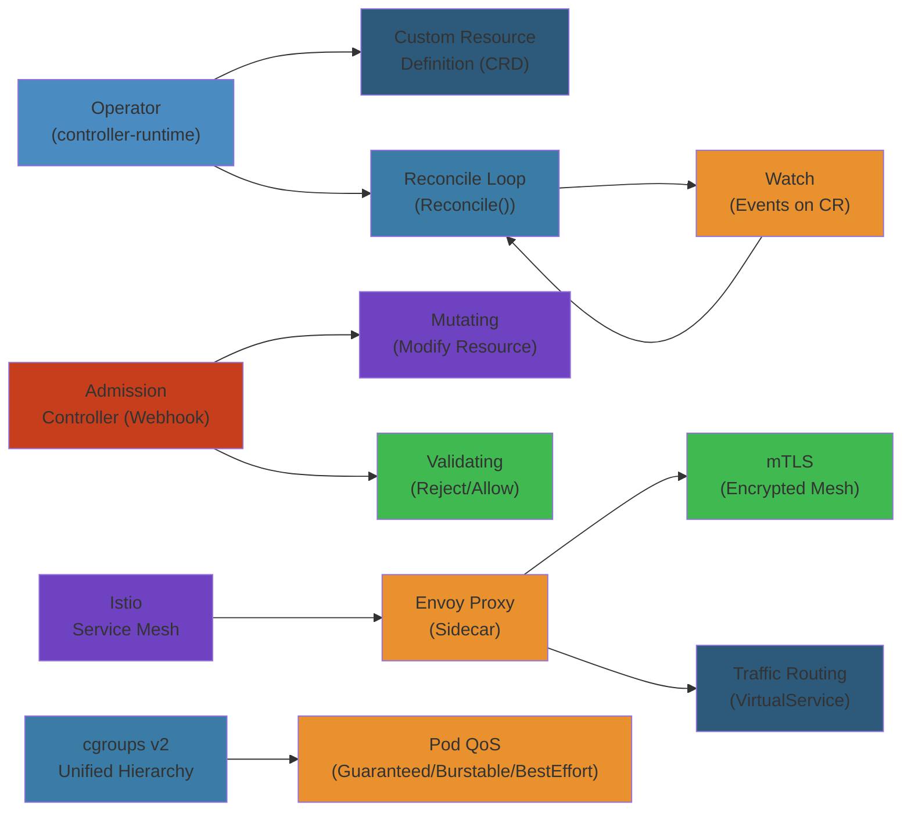

# ☸️ Advanced Kubernetes Patterns — Complete Deep Dive

**Related**: [Kubernetes Basics](/07-kubernetes/01-kubernetes-basics.md) · [Docker Compose](/06-devops/docker/02-compose-orchestration.md) · [K8s Gateway API](https://gateway-api.sigs.k8s.io)

---




## Table of Contents


- [Operators (Custom Controllers + CRDs)](#-operators-custom-controllers--crds)
- [Admission Controllers](#-admission-controllers)
- [Custom Scheduling](#-custom-scheduling)
- [Istio / Service Mesh](#-istio--service-mesh)
- [Pod Topology Spread Constraints](#-pod-topology-spread-constraints)
- [Ephemeral Containers](#-ephemeral-containers)
- [cgroups v2](#-cgroups-v2)
- [eBPF](#-ebpf)
- [K8s Gateway API](#-k8s-gateway-api)
- [Kustomize vs Helm](#-kustomize-vs-helm)
- [OPA / Gatekeeper](#-opa--gatekeeper)
- [Kyverno](#-kyverno)
- [Kaniko / BuildKit in Cluster](#-kaniko--buildkit-in-cluster)
- [Simplest Mental Model](#-simplest-mental-model)

---

### Visual: Operator Reconciliation Loop

```mermaid
stateDiagram-v2
    [*] --> WatchCR: Operator starts
    WatchCR --> FetchCR: CR event detected
    FetchCR --> CompareDV: Fetch desired spec
    CompareDV --> CheckActual: Compare desired vs actual
    CheckActual --> NeedsUpdate: Actual state matches?
    
    NeedsUpdate --> Yes: Yes
    NeedsUpdate --> No: No
    
    No --> CreateUpdate: Create/update resources
    CreateUpdate --> Persist: Persist changes
    Persist --> UpdateStatus: Update CR status
    UpdateStatus --> Requeue: Requeue reconcile
    Requeue --> WatchCR
    
    Yes --> Idle: Idle
    Idle --> WatchCR: Event trigger
    
    style WatchCR fill:#1e5f3f,stroke:#34d399
    style FetchCR fill:#1e3a5f,stroke:#00d4ff
    style CompareDV fill:#1e3a5f,stroke:#00d4ff
    style CheckActual fill:#1e3a5f,stroke:#00d4ff
    style NeedsUpdate fill:#3a7ca5,stroke:#00d4ff
    style CreateUpdate fill:#1e5f3f,stroke:#34d399
    style Persist fill:#1e5f3f,stroke:#34d399
    style UpdateStatus fill:#1e5f3f,stroke:#34d399
    style Requeue fill:#3a7ca5,stroke:#00d4ff
    style Idle fill:#1e5f3f,stroke:#34d399
```



---

## 🧭 Operators (Custom Controllers + CRDs)


### Operator Pattern


```text
Operator extends Kubernetes with application-specific automation:

  User creates:          Operator watches:          Operator manages:
  ┌────────────────┐     ┌────────────────┐     ┌────────────────────┐
  │ RedisCluster   │────>│  Controller    │────>│ • StatefulSet      │
  │ name: prod     │     │  Reconcile()   │     │ • Service (headless)│
  │ replicas: 3    │     │                │     │ • ConfigMap        │
  │ version: 7.2   │     │  Compare       │     │ • Secrets          │
  │ size: 100Gi    │     │  desired vs    │     │ • Backup CronJobs  │
  └────────────────┘     │  actual        │     │ • PodDisruptionBudget
                         │  → take action │     └────────────────────┘
                         └────────────────┘

          CRD defines the schema       Controller implements the logic
```

### Building an Operator (using Kubebuilder)


```go
// +kubebuilder:rbac:groups=cache.example.com,resources=redisclusters,verbs=get;list;watch;create;update;patch;delete
// +kubebuilder:rbac:groups=apps,resources=statefulsets,verbs=get;list;watch;create;update;patch;delete

type RedisClusterReconciler struct {
    client.Client
    Scheme *runtime.Scheme
}

func (r *RedisClusterReconciler) Reconcile(ctx context.Context, req ctrl.Request) (ctrl.Result, error) {
    log := log.FromContext(ctx)

    // 1. Fetch the CR
    var redisCluster cachev1.RedisCluster
    if err := r.Get(ctx, req.NamespacedName, &redisCluster); err != nil {
        return ctrl.Result{}, client.IgnoreNotFound(err)
    }

    // 2. Define desired StatefulSet
    sts := &appsv1.StatefulSet{
        ObjectMeta: metav1.ObjectMeta{
            Name:      redisCluster.Name,
            Namespace: redisCluster.Namespace,
        },
        Spec: appsv1.StatefulSetSpec{
            Replicas: redisCluster.Spec.Replicas,
            Template: corev1.PodTemplateSpec{ /* ... */ },
        },
    }

    // 3. Set ownership so CR deletion cascades
    if err := ctrl.SetControllerReference(&redisCluster, sts, r.Scheme); err != nil {
        return ctrl.Result{}, err
    }

    // 4. Create or Update
    _, err := controllerutil.CreateOrUpdate(ctx, r.Client, sts, func() error {
        sts.Spec.Replicas = redisCluster.Spec.Replicas
        return nil
    })

    return ctrl.Result{}, err
}
```

### Popular Operators


```yaml
# Strimzi — Kafka Operator
apiVersion: kafka.strimzi.io/v1beta2
kind: Kafka
metadata:
  name: my-cluster
  namespace: kafka
spec:
  kafka:
    replicas: 3
    version: "3.7"
    storage:
      type: persistent-claim
      size: 100Gi
      class: standard
    config:
      offsets.topic.replication.factor: 3
      transaction.state.log.replication.factor: 3
  zookeeper:
    replicas: 3
    storage:
      type: persistent-claim
      size: 50Gi

# cert-manager — TLS certificate management
apiVersion: cert-manager.io/v1
kind: Certificate
metadata:
  name: myapp-tls
  namespace: production
spec:
  secretName: myapp-tls-secret
  issuerRef:
    name: letsencrypt-prod
    kind: ClusterIssuer
  dnsNames:
    - myapp.example.com

# Prometheus Operator
apiVersion: monitoring.coreos.com/v1
kind: ServiceMonitor
metadata:
  name: web-monitor
spec:
  selector:
    matchLabels:
      app: web
  endpoints:
    - port: metrics
      interval: 30s
```

---

## 🧭 Admission Controllers


### How Admission Controllers Work


```text
API Request Flow:

  ┌────────┐    kubectl apply -f pod.yaml
  │  User   │──────────────────────────────┐
  └────────┘                               ▼
                                    ┌──────────────┐
                                    │  Authn/Authz  │
                                    │  (TLS, RBAC)  │
                                    └──────┬───────┘
                                           ▼
                                    ┌──────────────┐
                                    │  Mutating     │
                                    │  Admission    │  ← MutatingWebhookConfiguration
                                    │  Webhooks     │     (modify requests)
                                    └──────┬───────┘
                                           ▼
                                    ┌──────────────┐
                                    │  Object       │
                                    │  Validation   │  ← Validate schema
                                    └──────┬───────┘
                                           ▼
                                    ┌──────────────┐
                                    │  Validating   │
                                    │  Admission    │  ← ValidatingWebhookConfiguration
                                    │  Webhooks     │     (reject invalid requests)
                                    └──────┬───────┘
                                           ▼
                                    ┌──────────────┐
                                    │    etcd       │
                                    │ (persisted)   │
                                    └──────────────┘
```

### MutatingWebhookConfiguration


```yaml
apiVersion: admissionregistration.k8s.io/v1
kind: MutatingWebhookConfiguration
metadata:
  name: sidecar-injector
webhooks:
  - name: sidecar-injector.example.com
    clientConfig:
      service:
        name: sidecar-injector-svc
        namespace: kube-system
        path: /mutate
      caBundle: <base64-ca-cert>
    rules:
      - operations: ["CREATE"]
        apiGroups: [""]
        apiVersions: ["v1"]
        resources: ["pods"]
    admissionReviewVersions: ["v1"]
    sideEffects: None
    reinvocationPolicy: IfNeeded          # Can be called again by other webhooks
    objectSelector:                        # Only pods with label
      matchLabels:
        inject-sidecar: "true"
```

### ValidatingWebhookConfiguration


```yaml
apiVersion: admissionregistration.k8s.io/v1
kind: ValidatingWebhookConfiguration
metadata:
  name: pod-validator
webhooks:
  - name: pod-validator.example.com
    clientConfig:
      service:
        name: validation-svc
        namespace: kube-system
        path: /validate
      caBundle: <base64-ca-cert>
    rules:
      - operations: ["CREATE", "UPDATE"]
        apiGroups: [""]
        apiVersions: ["v1"]
        resources: ["pods"]
    failurePolicy: Fail                   # If webhook down, reject ALL
    timeoutSeconds: 5
    matchConditions:                      # v1.28+ — skip checks before calling
      - expression: request.userInfo.username.startsWith("system:")
    namespaceSelector:
      matchExpressions:
        - key: kubernetes.io/metadata.name
          operator: NotIn
          values:
            - kube-system
```

### Common Admission Controllers


```text
Built-in admission controllers (kube-apiserver flags):
  NamespaceLifecycle    — Reject creation in terminating namespaces
  LimitRanger           — Enforce LimitRange constraints
  ResourceQuota         — Enforce ResourceQuota
  PodSecurity           — Pod Security Standards (replaces PSP)
  DefaultStorageClass   — Add default storage class to PVCs
  NodeRestriction       — Limit kubelet self-modification

External admission webhooks:
  • Istio sidecar injector (mutating)     — Inject envoy proxy sidecar
  • cert-manager (mutating)               — Inject CA bundle into webhook configs
  • OPA Gatekeeper (validating)           — Policy enforcement
  • Kyverno (mutating + validating)       — Policy engine
  • Istio authorization (validating)      — Authorization policies
```

---

## 🧭 Custom Scheduling


### Custom Scheduler


```go
// Custom scheduler example (simplified)
package main

import (
    "context"
    "fmt"
    "sigs.k8s.io/scheduler-plugins/pkg/util"
)

type CustomScheduler struct {
    client clientset.Interface
}

func (s *CustomScheduler) Schedule(ctx context.Context, pod *v1.Pod, nodeList []*v1.Node) (string, error) {
    // Filter: nodes with GPU label
    var filtered []*v1.Node
    for _, node := range nodeList {
        if node.Labels["gpu-type"] == "a100" {
            filtered = append(filtered, node)
        }
    }

    // Score: prefer nodes with less memory usage
    var bestNode string
    var bestScore float64
    for _, node := range filtered {
        cpu := node.Status.Allocatable.Cpu().MilliValue()
        mem := node.Status.Allocatable.Memory().Value()
        score := float64(cpu) + float64(mem)
        if score > bestScore {
            bestScore = score
            bestNode = node.Name
        }
    }

    if bestNode == "" {
        return "", fmt.Errorf("no suitable node found")
    }
    return bestNode, nil
}
```

### Scheduler Configuration


```yaml
# Scheduler config file
apiVersion: kubescheduler.config.k8s.io/v1
kind: KubeSchedulerConfiguration
clientConnection:
  kubeconfig: "/etc/kubernetes/scheduler.conf"
profiles:
  - schedulerName: custom-scheduler
    plugins:
      filter:
        enabled:
          - name: NodeResourcesFit
          - name: NodeName
      score:
        enabled:
          - name: NodeResourcesBalancedAllocation
            weight: 50
          - name: ImageLocality
            weight: 30
    pluginConfig:
      - name: NodeResourcesFit
        args:
          scoringStrategy:
            type: LeastAllocated
```

### Using a Custom Scheduler


```yaml
apiVersion: v1
kind: Pod
metadata:
  name: gpu-pod
spec:
  schedulerName: custom-scheduler        # Specify custom scheduler
  containers:
    - name: gpu-worker
      image: nvidia/cuda:12.0-base
      resources:
        limits:
          nvidia.com/gpu: 2

# Multiple schedulers can coexist in the cluster
# Default scheduler handles pods without schedulerName
# Custom scheduler handles pods with schedulerName matching
```

---

## 🧭 Istio / Service Mesh


### Istio Architecture


```text
Istio Service Mesh:

  ┌──────────────────────────────────────────────────────┐
  │                  Control Plane (istiod)                │
  │  ┌──────────┐  ┌──────────┐  ┌──────────────────┐    │
  │  │ Pilot    │  │ Citadel  │  │  Galley          │    │
  │  │ (service │  │ (cert    │  │  (config         │    │
  │  │  discovery│  │  mgmt)  │  │   validation)    │    │
  │  │ traffic  │  │ mTLS)   │  │                  │    │
  │  │ mgmt)    │  │          │  │                  │    │
  │  └──────────┘  └──────────┘  └──────────────────┘    │
  └──────────────────────┬───────────────────────────────┘
                         │ xDS (discovery) + SDS (secret)
                         ▼
  ┌──────────────────────────────────────────────────────┐
  │              Data Plane (Envoy Sidecars)               │
  │                                                       │
  │  Pod 1              Pod 2              Pod 3          │
  │  ┌──────────┐      ┌──────────┐      ┌──────────┐   │
  │  │ App      │      │ App      │      │ App      │   │
  │  │ Container│      │ Container│      │ Container│   │
  │  └────┬─────┘      └────┬─────┘      └────┬─────┘   │
  │       │                 │                 │         │
  │  ┌────▼─────┐      ┌────▼─────┐      ┌────▼─────┐   │
  │  │ Envoy    │──────│ Envoy    │──────│ Envoy    │   │
  │  │ Proxy    │      │ Proxy    │      │ Proxy    │   │
  │  └──────────┘      └──────────┘      └──────────┘   │
  │       │                 │                 │         │
  └───────┼─────────────────┼─────────────────┼─────────┘
          │                 │                 │
          ▼                 ▼                 ▼
     (mutual TLS between all sidecars — automatic)
```

### Istio VirtualService & DestinationRule


```yaml
apiVersion: networking.istio.io/v1beta1
kind: VirtualService
metadata:
  name: reviews
spec:
  hosts:
    - reviews                          # Service name
  gateways:
    - mesh                            # All sidecars (internal)
    - my-gateway                       # External gateway
  http:
    - name: "canary-route"
      match:
        - headers:
            end-user:
              exact: "test-user"
      route:
        - destination:
            host: reviews
            subset: v2                  # Route test-user to v2
    - name: "default"
      route:
        - destination:
            host: reviews
            subset: v1
          weight: 90                    # 90% to v1
        - destination:
            host: reviews
            subset: v2
          weight: 10                    # 10% canary to v2
      retries:
        attempts: 3
        perTryTimeout: 2s
      timeout: 10s
      fault:                            # Fault injection for testing
        delay:
          percentage:
            value: 0.1
          fixedDelay: 5s

---
apiVersion: networking.istio.io/v1beta1
kind: DestinationRule
metadata:
  name: reviews
spec:
  host: reviews
  trafficPolicy:
    connectionPool:
      tcp:
        maxConnections: 100
      http:
        http1MaxPendingRequests: 10
        http2MaxRequests: 1000
    loadBalancer:
      simple: LEAST_CONN               # ROUND_ROBIN, LEAST_CONN, RANDOM, PASSTHROUGH
    outlierDetection:                   # Circuit breaking
      consecutive5xxErrors: 5
      interval: 30s
      baseEjectionTime: 30s
  subsets:
    - name: v1
      labels:
        version: v1
    - name: v2
      labels:
        version: v2
    - name: v3
      labels:
        version: v3
```

### Istio Gateway


```yaml
apiVersion: networking.istio.io/v1beta1
kind: Gateway
metadata:
  name: my-gateway
spec:
  selector:
    istio: ingressgateway
  servers:
    - port:
        number: 80
        name: http
        protocol: HTTP
      hosts:
        - "*.example.com"
    - port:
        number: 443
        name: https
        protocol: HTTPS
      tls:
        mode: SIMPLE                    # SIMPLE, MUTUAL, ISTIO_MUTUAL
        credentialName: myapp-tls       # cert-manager secret
      hosts:
        - "myapp.example.com"
```

### Istio AuthorizationPolicy


```yaml
apiVersion: security.istio.io/v1beta1
kind: AuthorizationPolicy
metadata:
  name: httpbin-deny
  namespace: default
spec:
  selector:
    matchLabels:
      app: httpbin
  action: DENY
  rules:
    - from:
        - source:
            principals:
              - "cluster.local/ns/default/sa/sleep"
      to:
        - operation:
            methods: ["GET"]
            paths: ["/ip"]
```

---

## 🧭 Pod Topology Spread Constraints


### Topology Spread Constraints


```yaml
apiVersion: apps/v1
kind: Deployment
metadata:
  name: web-spread
spec:
  replicas: 9
  selector:
    matchLabels:
      app: web
  template:
    metadata:
      labels:
        app: web
    spec:
      topologySpreadConstraints:
        - maxSkew: 1                          # Max imbalance between zones
          topologyKey: topology.kubernetes.io/zone
          whenUnsatisfiable: DoNotSchedule     # Or ScheduleAnyway
          labelSelector:
            matchLabels:
              app: web

        - maxSkew: 2
          topologyKey: kubernetes.io/hostname
          whenUnsatisfiable: ScheduleAnyway     # Prefer but not required
          labelSelector:
            matchLabels:
              app: web

        - maxSkew: 1
          topologyKey: kubernetes.io/hostname
          whenUnsatisfiable: DoNotSchedule
          matchLabelKeys:                      # v1.28+ — consider rolling updates
            - pod-template-hash
```

```text
Spread Constraints Example (9 pods, 3 zones, maxSkew=1):

  Zone A: 3 pods     Zone B: 3 pods     Zone C: 3 pods    ✓ balanced
  Zone A: 4 pods     Zone B: 3 pods     Zone C: 2 pods    ✓ skew=1 (ok)
  Zone A: 5 pods     Zone B: 3 pods     Zone C: 1 pod     ✗ skew=2 (blocked)
```

---

## 🧭 Ephemeral Containers


### Debugging with Ephemeral Containers


```yaml
# Ephemeral containers run temporarily in a running pod for debugging
apiVersion: v1
kind: Pod
metadata:
  name: my-pod
spec:
  containers:
    - name: app
      image: nginx
      # No shell, minimal image — can't exec into it
  ephemeralContainers:                    # Not normally defined in YAML
    - name: debugger
      image: busybox
      command: ["sh"]
      stdin: true
      tty: true
      targetContainerName: app            # Optional: attach to container's namespace
```

```bash
# Add ephemeral container to running pod
kubectl debug -it my-pod --image=busybox --target=app

# Copy ephemeral container for node debugging
kubectl debug node/node1 -it --image=ubuntu

# Share process namespace with the target container
kubectl debug -it my-pod --image=nicolaka/netshoot --share-processes

# Key features:
#   • No restart needed — runs alongside existing containers
#   • Has its own process namespace (or shared with target)
#   • Inherits pod network, volumes, security context
#   • Automatically removed when debugging done
```

---

## 🧭 cgroups v2


### cgroups v2 in Kubernetes


```text
cgroups v2 (unified hierarchy):

  Before (cgroups v1):
    /sys/fs/cgroup/
    ├── cpu/               # CPU controller
    ├── memory/            # Memory controller
    ├── blkio/             # Block IO controller
    ├── pids/              # PID controller
    └── ...                # Separate hierarchies per controller

  After (cgroups v2):
    /sys/fs/cgroup/
    └── system.slice/
        └── kubepods/
            └── pod<uid>/
                └── <container-id>/
                    ├── cpu.max           # CPU quota
                    ├── memory.max        # Memory limit
                    ├── memory.current   # Current memory usage
                    ├── pids.max          # Max PIDs
                    ├── io.max            # IO limits
                    └── io.stat           # IO statistics
```

### Key Benefits


```text
cgroups v2 advantages over v1:

  1. Unified hierarchy — single directory tree
  2. No controller conflicts — all controllers work together
  3. Pressure Stall Information (PSI) — memory/cpu/io pressure metrics
  4. Resource protection — "protect" via memory.min, cpu.weight
  5. Writeback limits — control dirty page writeback per cgroup
  6. No more :memory: vs :cpu: tag confusion

  K8s requirements: v1.25+ with cgroups v2 (default in modern distros)
  Check: kubectl get nodes -o yaml | grep cgroup
```

---

## 🧭 eBPF


### eBPF in Kubernetes


```text
eBPF programs run sandboxed in the kernel — no module needed:

  User Space                          Kernel
  ┌────────────────────┐          ┌────────────────────────┐
  │  Cilium Agent      │          │  eBPF Programs          │
  │  (daemonset)       │───load──>│  ┌──────────────────┐   │
  │                    │          │  │ Network Policy    │   │
  │  Loads eBPF        │          │  │ (TC/BPF)         │   │
  │  programs via      │          │  ├──────────────────┤   │
  │  bpf() syscall     │          │  │ Load Balancing   │   │
  │                    │          │  │ (XDP)            │   │
  │  Maps:             │<──events─│  ├──────────────────┤   │
  │  • Policy map      │          │  │ Observability    │   │
  │  • Endpoint map    │          │  │ (kprobe/trace)   │   │
  │  • Metrics         │          │  └──────────────────┘   │
  └────────────────────┘          └────────────────────────┘

  Use cases in K8s:
  • Cilium — CNI plugin (replaces kube-proxy with eBPF)
  • Network policies — 10x faster than iptables
  • Service load balancing — direct XDP, no conntrack
  • Observability — Hubble (flow visibility)
  • Security — Tetragon (process-level monitoring)
  • OOM killer — fine-grained memory pressure monitoring
```

### Cilium


```yaml
# Cilium replaces kube-proxy with eBPF
# Install:
#   helm install cilium cilium/cilium --namespace kube-system \
#     --set kubeProxyReplacement=true

apiVersion: cilium.io/v2
kind: CiliumNetworkPolicy
metadata:
  name: allow-frontend
  namespace: production
spec:
  endpointSelector:
    matchLabels:
      app: api
  ingress:
    - fromEndpoints:
        - matchLabels:
            app: frontend
      toPorts:
        - ports:
            - port: "8080"
              protocol: TCP
  egress:
    - toEndpoints:
        - matchLabels:
            app: database
      toPorts:
        - ports:
            - port: "5432"
```

---

## 🧭 K8s Gateway API


### Gateway API Overview


```yaml
# Gateway API — evolution of Ingress (v1alpha2/v1beta1/v1)
# More expressive, role-oriented, cross-namespace

apiVersion: gateway.networking.k8s.io/v1
kind: GatewayClass
metadata:
  name: example-gateway-class
spec:
  controllerName: example.io/gateway-controller
  parametersRef:
    group: example.io
    kind: GatewayParameters
    name: example

---
apiVersion: gateway.networking.k8s.io/v1
kind: Gateway
metadata:
  name: my-gateway
  namespace: production
spec:
  gatewayClassName: example-gateway-class
  listeners:
    - name: https
      protocol: HTTPS
      port: 443
      hostname: "*.example.com"
      tls:
        mode: Terminate
        certificateRefs:
          - name: wildcard-tls
      allowedRoutes:
        namespaces:
          from: Selector
          selector:
            matchLabels:
              shared-gateway: "true"

---
apiVersion: gateway.networking.k8s.io/v1
kind: HTTPRoute
metadata:
  name: app-route
  namespace: production
spec:
  parentRefs:
    - name: my-gateway
      namespace: gateway-ns              # Cross-namespace reference!
  hostnames:
    - "myapp.example.com"
  rules:
    - matches:
        - path:
            type: PathPrefix
            value: /api
      backendRefs:
        - name: api-service
          port: 8080
          weight: 90
        - name: api-service-v2
          port: 8080
          weight: 10                      # Canary 10%
    - matches:
        - path:
            type: PathPrefix
            value: /static
      backendRefs:
        - name: static-service
          port: 80
```

### Gateway API vs Ingress


```text
              Ingress                    Gateway API
  ──────────────────────────────────────────────────────
  Roles        Single resource           Multiple roles:
                                         Infra provider → GatewayClass
                                         Cluster admin → Gateway
                                         Developer → HTTPRoute/TCPRoute

  Namespace    Same namespace only       Cross-namespace routing (parentRefs)

  Protocols    HTTP/HTTPS only           HTTP, HTTPS, TCP, UDP, TLS, gRPC

  Traffic      Basic routing             Header matching, weights, filters,
  splitting                               retries, mirroring, timeouts

  Backend      Service only              Multi-backend, weights, filters

  Extensibility Annotations only          Policy attachment (Retry, Timeout, ...)

  Status       Basic                     Rich status conditions per route + listener
```

---

## 🧭 Kustomize vs Helm


### Comparison


```text
              Kustomize                         Helm
  ──────────────────────────────────────────────────────────────────
  Approach    Template-free YAML patching     Go-template YAML generation
              (overlays + patches)            (values + templates)

  Config      Raw YAML + kustomization.yaml   Chart.yaml + values.yaml + templates/

  Complexity  Lower (patches only)           Higher (templating language)

  State mgmt  Stateless (no tracking)        Stateful (helm list, history, rollback)

  Dependencies Manual (kustomize edit)       Built-in (charts/ dependencies)

  Sealed       Limited (through overlays)     Built-in (--set, --set-file, --set-string)

  Use case     Environment overlays           Application packaging & distribution
               (dev/staging/prod patches)     (public charts, operators)

  Dry run      kubectl apply -k . --dry-run   helm install --dry-run
```

### Kustomize Example


```yaml
# base/kustomization.yaml
apiVersion: kustomize.config.k8s.io/v1beta1
kind: Kustomization
resources:
  - deployment.yaml
  - service.yaml
  - configmap.yaml
commonLabels:
  app.kubernetes.io/managed-by: kustomize
namePrefix: prod-
images:
  - name: myapp/web
    newTag: v1.2.3

---
# overlays/production/kustomization.yaml
apiVersion: kustomize.config.k8s.io/v1beta1
kind: Kustomization
resources:
  - ../../base
patches:
  - path: replica-patch.yaml
  - target:
      kind: Deployment
      name: web
    patch: |-
      - op: replace
        path: /spec/replicas
        value: 5
replicas:
  - name: web
    count: 5
configMapGenerator:
  - name: app-config
    behavior: merge
    literals:
      - NODE_ENV=production
      - LOG_LEVEL=warn
```

### Helm vs Kustomize Decision


```text
Use HELM when:
  • Installing 3rd-party software (Prometheus, Nginx, cert-manager)
  • Distributing your application publicly
  • Complex configuration with many variations
  • Need history/rollback support
  • Composing multiple sub-charts

Use KUSTOMIZE when:
  • Managing your own application manifests
  • Simple environment overrides (dev/staging/prod)
  • Team prefers raw YAML over templates
  • CI/CD pipeline with kubectl apply -k
  • GitOps with ArgoCD (which understands both)

USE BOTH:
  • Helm for installing infrastructure charts
  • Kustomize for overlaying environment patches
  • ArgoCD supports both natively
```

---

## 🧭 OPA / Gatekeeper


### OPA Gatekeeper


```yaml
# ConstraintTemplate — defines policy logic (Rego)
apiVersion: templates.gatekeeper.sh/v1
kind: ConstraintTemplate
metadata:
  name: k8srequiredlabels
spec:
  crd:
    spec:
      names:
        kind: K8sRequiredLabels
      validation:
        openAPIV3Schema:
          type: object
          properties:
            labels:
              type: array
              items:
                type: string
  targets:
    - target: admission.k8s.gatekeeper.sh
      rego: |
        package k8srequiredlabels

        violation[{"msg": msg}] {
          provided := input.request.object.metadata.labels
          required := input.parameters.labels[_]
          not required == provided[_]
          msg := sprintf("Missing label: %v", [required])
        }

---
# Constraint — instantiate the policy
apiVersion: constraints.gatekeeper.sh/v1beta1
kind: K8sRequiredLabels
metadata:
  name: require-app-label
spec:
  match:
    kinds:
      - apiGroups: [""]
        kinds: ["Pod"]
    namespaces:
      - "production"
  parameters:
    labels:
      - "app"
      - "owner"
```

### Gatekeeper Use Cases


```text
Common Gatekeeper policies:
  • Required labels (app, owner, environment, cost-center)
  • Enforce resource limits (must have limits.requests)
  • Block privileged containers
  • Allowed image registries only (no untrusted images)
  • Block host network / host PID / host IPC
  • Enforce readOnly root filesystem
  • Allowed ports range
  • Block certain service types (LoadBalancer in dev)
  • Enforce network policies exist per namespace
  • Block deprecated API versions
```

---

## 🧭 Kyverno


### Kyverno Policies


```yaml
# Kyverno — Kubernetes-native policy engine (no Rego needed)
# ClusterPolicy — applies cluster-wide
apiVersion: kyverno.io/v1
kind: ClusterPolicy
metadata:
  name: require-labels
spec:
  validationFailureAction: Audit          # Audit or Enforce
  rules:
    - name: check-for-labels
      match:
        resources:
          kinds:
            - Pod
            - Deployment
            - StatefulSet
      validate:
        message: "label 'app' is required"
        pattern:
          metadata:
            labels:
              app: "?*"

---
# Mutate — add sidecar automatically
apiVersion: kyverno.io/v1
kind: ClusterPolicy
metadata:
  name: inject-fluentd-sidecar
spec:
  rules:
    - name: inject-sidecar
      match:
        resources:
          kinds:
            - Pod
      mutate:
        patchStrategicMerge:
          spec:
            containers:
              - name: fluentd
                image: fluent/fluentd:v1.16
                volumeMounts:
                  - name: logs
                    mountPath: /var/log/app
            volumes:
              - name: logs
                emptyDir: {}

---
# Generate — auto-create resources
apiVersion: kyverno.io/v1
kind: ClusterPolicy
metadata:
  name: default-network-policy
spec:
  rules:
    - name: generate-netpol
      match:
        resources:
          kinds:
            - Namespace
      generate:
        apiVersion: networking.k8s.io/v1
        kind: NetworkPolicy
        name: default-deny
        namespace: "{{request.object.metadata.name}}"
        synchronize: true
        data:
          spec:
            podSelector: {}
            policyTypes:
              - Ingress
```

### Kyverno vs Gatekeeper


```text
              Kyverno                           OPA Gatekeeper
  ──────────────────────────────────────────────────────────────────
  Language    Native YAML (no Rego)            Rego (Policoy language)

  Learning    Easy (if you know YAML)          Steep (new language)
  curve

  Mutation    Built-in (mutate rules)          Manual ValidatingWebhook only

  Generation  Built-in (generate resources)    Not available

  Validation  pattern/anyPattern/deny          rego violations

  CLI         kyverno apply                    opa eval / gatekeeper audit

  Dynamic     Less expressive for complex      Very expressive (full Rego)
              logic

  Ecosystem   Growing, CNCF sandbox            Mature, CNCF graduated

Use Kyverno for: YAML-native team, simpler policies, mutation and generation
Use Gatekeeper for: Complex logic, existing Rego investment, full control
```

---

## 🧭 Kaniko / BuildKit in Cluster


### Building Images Inside Kubernetes


```yaml
# Kaniko — build container images without Docker daemon (in-cluster)
apiVersion: v1
kind: Pod
metadata:
  name: kaniko-build
spec:
  containers:
    - name: kaniko
      image: gcr.io/kaniko-project/executor:latest
      args:
        - "--context=git://github.com/myorg/myapp.git#refs/heads/main"
        - "--destination=myregistry.io/myapp:v1.2.3"
        - "--cache=true"
        - "--cache-repo=myregistry.io/cache"
        - "--snapshot-mode=redo"            # Better layer caching
        - "--compressed-caching=false"
        - "--insecure"                      # For HTTP registry only
        - "--skip-tls-verify"
      volumeMounts:
        - name: docker-config
          mountPath: /kaniko/.docker/
      resources:
        requests:
          cpu: 1
          memory: 2Gi
        limits:
          cpu: 2
          memory: 4Gi
  volumes:
    - name: docker-config
      secret:
        secretName: registry-credentials
        items:
          - key: .dockerconfigjson
            path: config.json
  restartPolicy: Never
```

### BuildKit


```yaml
# BuildKit — faster, more efficient builds (Docker BuildX backend)
apiVersion: v1
kind: Pod
metadata:
  name: buildkitd
spec:
  containers:
    - name: buildkitd
      image: moby/buildkit:master
      args:
        - --addr=tcp://0.0.0.0:1234
        - --oci-worker-no-process-sandbox
      securityContext:
        privileged: true                    # Needs root for --sandbox
      ports:
        - containerPort: 1234

---
# BuildKit client pod
apiVersion: v1
kind: Pod
metadata:
  name: buildkit-client
spec:
  containers:
    - name: buildctl
      image: moby/buildkit:master
      command:
        - buildctl
        - --addr=tcp://buildkitd:1234
        - build
        - --frontend=dockerfile.v0
        - --local=context=/context
        - --local=dockerfile=/context
        - --output=type=image,name=myregistry.io/myapp:latest,push=true
      volumeMounts:
        - name: context
          mountPath: /context
  restartPolicy: Never
  volumes:
    - name: context
      persistentVolumeClaim:
        claimName: build-context
```

### Comparison


```text
              Docker-in-Docker (dind)         Kaniko                  BuildKit
  ──────────────────────────────────────────────────────────────────────────────
  Requires     Docker socket / privileged     No daemon needed        BuildKitd pod
  Security     High (privileged)              Low (no daemon)         Medium
  Speed        Fast (native)                  Slower (user space)     Fast (parallel)
  Layer cache  Full (native Docker)           External cache repo     Built-in caching
  Multi-arch   Via QEMU                       Good support            Native (containerd)
  Best for     CI runners with Docker         Security-conscious      Large builds,
                                                                      complex pipelines

  Recommendation: Use Kaniko or BuildKit for in-cluster builds.
  Avoid Docker-in-Docker (security risk).
```

### Visual: Service Mesh Traffic Flow (Istio/Cilium)

```mermaid
graph LR
    Client["Client Pod"] -->|Request| Envoy1["Envoy Sidecar<br/>(Pod A)"]
    Envoy1 -->|mTLS| Envoy2["Envoy Sidecar<br/>(Pod B)"]
    Envoy2 --> AppB["App Container<br/>Pod B"]
    
    Control["Control Plane<br/>(Istiod)"] -->|Config| Envoy1
    Control -->|Config| Envoy2
    
    Envoy1 -->|Metrics| Telemetry["Prometheus<br/>Metrics"]
    Envoy2 -->|Metrics| Telemetry
    
    VirtualSvc["VirtualService<br/>(Routing Rules)"] -->|Define| Control
    
    style Client fill:#1e3a5f,stroke:#00d4ff
    style Envoy1 fill:#3a7ca5,stroke:#00d4ff
    style Envoy2 fill:#3a7ca5,stroke:#00d4ff
    style AppB fill:#1e5f3f,stroke:#34d399
    style Control fill:#3a7ca5,stroke:#00d4ff
    style Telemetry fill:#3a7ca5,stroke:#00d4ff
    style VirtualSvc fill:#3a7ca5,stroke:#00d4ff
```



---

## Interactive Components

### Pod Failure Cascade

<div style="padding:16px;background:#0b0e14;border:1px solid #1e2a3a;border-radius:8px">
  <style>.cascade-title{color:#00d4ff;font-family:monospace;font-size:14px;font-weight:bold;margin-bottom:16px;letter-spacing:1px}.cascade-stages{display:flex;flex-direction:column;gap:12px;margin-bottom:16px}.cascade-stage{display:flex;align-items:center;gap:12px}.cascade-label{color:#e3eaf0;font-family:monospace;font-size:12px;min-width:120px}.cascade-indicator{width:24px;height:24px;border-radius:4px;background:#34d399;border:2px solid #22c55e;transition:all 0.3s}.cascade-indicator.failing{background:#ef4444;border-color:#dc2626;box-shadow:0 0 12px #ef4444;animation:cascade-fail 0.6s ease-out}@keyframes cascade-fail{0%{transform:scale(1);opacity:1}100%{transform:scale(1.2);opacity:0.8}}.cascade-controls{display:flex;gap:8px;flex-wrap:wrap}.cascade-button{padding:8px 16px;border:1px solid #00d4ff;background:#1e3a5f;color:#00d4ff;border-radius:4px;cursor:pointer;font-family:monospace;font-size:12px;transition:all 0.2s}.cascade-button:hover{background:#2a5a8f;box-shadow:0 0 8px #00d4ff}</style>
  <div class="cascade-title">Operator Failure Cascade</div>
  <div class="cascade-stages">
    <div class="cascade-stage"><span class="cascade-label">Operator Pod</span><div class="cascade-indicator" data-stage="op"></div></div>
    <div class="cascade-stage"><span class="cascade-label">Reconcile Loop</span><div class="cascade-indicator" data-stage="recon"></div></div>
    <div class="cascade-stage"><span class="cascade-label">CRD Resources</span><div class="cascade-indicator" data-stage="crd"></div></div>
    <div class="cascade-stage"><span class="cascade-label">App Deployment</span><div class="cascade-indicator" data-stage="app"></div></div>
  </div>
  <div class="cascade-controls">
    <button class="cascade-button" onclick="startOpCascade()">Operator Fails</button>
    <button class="cascade-button" onclick="resetOpCascade()">Recover</button>
  </div>
  <script>
    function startOpCascade() {
      const stages = ['op', 'recon', 'crd', 'app'];
      let delay = 0;
      stages.forEach((id) => {
        setTimeout(() => {
          document.querySelector('[data-stage="'+id+'"]').classList.add('failing');
        }, delay);
        delay += 300;
      });
    }
    function resetOpCascade() {
      document.querySelectorAll('[data-stage]').forEach(s => s.classList.remove('failing'));
    }
  </script>
</div>

### K8s Cluster Topology

<div style="padding:16px;background:#0b0e14;border:1px solid #1e2a3a;border-radius:8px">
  <style>.topology-title{color:#00d4ff;font-family:monospace;font-size:14px;font-weight:bold;margin-bottom:12px;letter-spacing:1px}.topology-svg{width:100%;max-width:600px;height:300px;background:#1a2332;border:1px solid #1e3a5f;border-radius:4px}.topo-edge{stroke:#1e3a5f;stroke-width:2}.topo-legend{display:flex;gap:16px;margin-top:12px;font-size:12px;color:#e3eaf0;font-family:monospace;flex-wrap:wrap}.legend-item{display:flex;align-items:center;gap:6px}.legend-color{width:16px;height:16px;border-radius:2px}</style>
  <div class="topology-title">Advanced K8s Control Plane Topology</div>
  <svg class="topology-svg" viewBox="0 0 600 300">
    <defs>
      <marker id="arrow-adv" markerWidth="10" markerHeight="10" refX="9" refY="3" orient="auto">
        <polygon points="0 0, 10 3, 0 6" fill="#1e3a5f"/>
      </marker>
    </defs>
    <!-- Istiod Control Plane -->
    <g>
      <rect x="200" y="20" width="200" height="50" rx="4" fill="#6f42c1" stroke="#00d4ff" stroke-width="1"/>
      <text x="300" y="50" text-anchor="middle" fill="#e3eaf0" font-size="12" font-family="monospace" font-weight="bold">Istiod (Service Mesh)</text>
    </g>
    <!-- Operators -->
    <g>
      <rect x="50" y="120" width="100" height="50" rx="4" fill="#3a7ca5" stroke="#00d4ff" stroke-width="1"/>
      <text x="100" y="150" text-anchor="middle" fill="#e3eaf0" font-size="12" font-family="monospace">Operators</text>
    </g>
    <!-- Webhooks -->
    <g>
      <rect x="250" y="120" width="100" height="50" rx="4" fill="#3a7ca5" stroke="#00d4ff" stroke-width="1"/>
      <text x="300" y="150" text-anchor="middle" fill="#e3eaf0" font-size="12" font-family="monospace">Webhooks</text>
    </g>
    <!-- Custom Scheduler -->
    <g>
      <rect x="450" y="120" width="100" height="50" rx="4" fill="#3a7ca5" stroke="#00d4ff" stroke-width="1"/>
      <text x="500" y="150" text-anchor="middle" fill="#e3eaf0" font-size="12" font-family="monospace">Scheduler</text>
    </g>
    <!-- Envoy Sidecars -->
    <g>
      <circle cx="100" cy="250" r="20" fill="#1e5f3f" stroke="#34d399" stroke-width="1"/>
      <text x="100" y="255" text-anchor="middle" fill="#e3eaf0" font-size="10" font-family="monospace" font-weight="bold">Envoy</text>
    </g>
    <g>
      <circle cx="300" cy="250" r="20" fill="#1e5f3f" stroke="#34d399" stroke-width="1"/>
      <text x="300" y="255" text-anchor="middle" fill="#e3eaf0" font-size="10" font-family="monospace" font-weight="bold">Envoy</text>
    </g>
    <g>
      <circle cx="500" cy="250" r="20" fill="#1e5f3f" stroke="#34d399" stroke-width="1"/>
      <text x="500" y="255" text-anchor="middle" fill="#e3eaf0" font-size="10" font-family="monospace" font-weight="bold">Envoy</text>
    </g>
    <!-- Edges -->
    <line class="topo-edge" x1="300" y1="70" x2="100" y2="120" marker-end="url(#arrow-adv)"/>
    <line class="topo-edge" x1="300" y1="70" x2="300" y2="120" marker-end="url(#arrow-adv)"/>
    <line class="topo-edge" x1="300" y1="70" x2="500" y2="120" marker-end="url(#arrow-adv)"/>
    <line class="topo-edge" x1="100" y1="170" x2="100" y2="230" marker-end="url(#arrow-adv)"/>
    <line class="topo-edge" x1="300" y1="170" x2="300" y2="230" marker-end="url(#arrow-adv)"/>
    <line class="topo-edge" x1="500" y1="170" x2="500" y2="230" marker-end="url(#arrow-adv)"/>
  </svg>
  <div class="topo-legend">
    <div class="legend-item"><div class="legend-color" style="background:#6f42c1;border:1px solid #00d4ff"></div><span>Mesh Control</span></div>
    <div class="legend-item"><div class="legend-color" style="background:#3a7ca5;border:1px solid #00d4ff"></div><span>Controllers</span></div>
    <div class="legend-item"><div class="legend-color" style="background:#1e5f3f;border:1px solid #34d399"></div><span>Sidecars</span></div>
  </div>
</div>

---

## 🧠 Simplest Mental Model


```text
ADVANCED KUBERNETES PATTERNS

OPERATORS = Smart home automation
  You say "I want 3 smart bulbs" (CR), and the operator:
  • Installs the bulbs (StatefulSet)
  • Wires the switches (Service)
  • Sets up the app (ConfigMap)
  • Schedules nightly reset (CronJob)
  Runs on its own, keeps everything working.

ADMISSION CONTROLLERS = Bouncers at the club
  Mutating webhook = "You forgot your wristband, here you go"
  Validating webhook = "You're not on the list, sorry"
  Run before anything is persisted in etcd.

CUSTOM SCHEDULING = VIP seating
  Regular pods → random seat
  GPU pods → sits at the GPU table
  Latency-sensitive → sits closest to the bar (data)

ISTIO = Traffic managers for every pod
  Each pod gets a tiny traffic cop (Envoy sidecar) that:
  • Routes: "90% to v1, 10% to v2"
  • Retries: "Try again if they don't answer in 2s"
  • Security: "All traffic must be TLS"
  • Observability: "Log every request"
  All managed centrally — no app changes needed.

eBPF = Kernel plugins without rebooting
  Like adding a new feature to the Linux kernel while it's running.
  Cilium uses this to replace 10,000 iptables rules with 50 eBPF programs.
  Network policies check packets at wire speed (XDP).

GATEWAY API = Better Ingress
  Ingress was "one developer owns everything"
  Gateway API is "the infrastructure team gives you a gateway,
  you just write HTTPRoute rules."
  Clean separation of concerns.

KUSTOMIZE = Git diff for Kubernetes
  "Base YAML + env-specific patches = env-specific YAML"
  No new language, just YAML patches strung together.
  Dev overlays on base → staging overlays on base → prod too.

HELM = apt-get for Kubernetes
  "helm install prometheus" = "apt-get install prometheus"
  Templates + values = reproducible deployments.

GATEKEEPER / KYVERNO = Policy enforcement
  "Every pod must have resource limits."
  "Only approved images from this registry."
  "No privileged containers in production."
  Like a contract your manifests must sign.

KANIKO / BUILDKIT = Kitchen inside the hotel
  Build Docker images inside Kubernetes without Docker.
  Kaniko extracts layers in user space (secure).
  BuildKit is faster with parallel processing.
  Both eliminate the "Docker socket in CI" security hole.
```

---

**Next**: [Kafka Basics](/10-messaging/kafka/01-kafka-basics.md)

## Related

- [Readme](/05-cloud/README.md)
- [Cloudwatch Deep Dive](/05-cloud/aws/cloudwatch/01-cloudwatch-deep-dive.md)
- [Cloudwatch Observability](/05-cloud/aws/cloudwatch/02-cloudwatch-observability.md)
- [Ec2 Deep Dive](/05-cloud/aws/ec2/01-ec2-deep-dive.md)
- [Ec2 Networking Security](/05-cloud/aws/ec2/02-ec2-networking-security.md)
- [Ecs Deep Dive](/05-cloud/aws/ecs/01-ecs-deep-dive.md)
