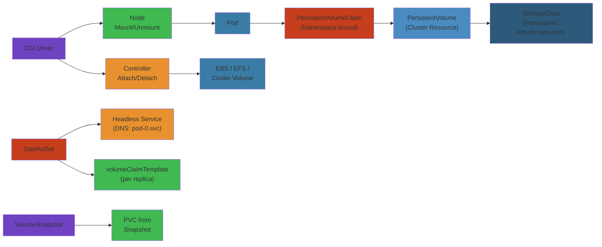

# 💾 Kubernetes Storage — Complete Deep Dive




## ToC


- PV | PVC | StorageClass | CSI Architecture | Volume Modes | CSI Drivers | StatefulSet | VolumeSnapshot | Cloning | Expansion | Ephemeral | Data Gravity | Performance

---

## PersistentVolume


```yaml
apiVersion: v1
kind: PersistentVolume
spec:
  capacity:
    storage: 100Gi
  volumeMode: Filesystem
  accessModes:
  - ReadWriteOnce
  persistentVolumeReclaimPolicy: Retain
  storageClassName: manual
  nodeAffinity:
    required:
      nodeSelectorTerms:
      - matchExpressions:
        - key: kubernetes.io/hostname
          operator: In
          values:
          - node-1
```

| Reclaim | Behavior |
|---------|----------|
| Retain | PV kept after PVC delete |
| Delete | PV + storage auto-deleted |
| Recycle | (deprecated) rm -rf |

| Access Mode | Meaning |
|-------------|---------|
| RWO | Single node read-write |
| ROX | Multi-node read-only |
| RWX | Multi-node read-write |
| RWOP | Single pod read-write |

---

## PersistentVolumeClaim


```yaml
apiVersion: v1
kind: PersistentVolumeClaim
spec:
  accessModes:
  - ReadWriteOnce
  resources:
    requests:
      storage: 50Gi
  storageClassName: gp3
---
apiVersion: v1
kind: Pod
spec:
  volumes:
  - name: data
    persistentVolumeClaim:
      claimName: app-pvc
  containers:
  - name: app
    volumeMounts:
    - mountPath: /var/lib/data
      name: data
```

**Binding flow:** PVC created -> match PV (or dynamic provision) -> one-to-one bind -> pod uses PVC -> PVC persists after pod -> reclaim on PVC delete

---

## StorageClass


```yaml
apiVersion: storage.k8s.io/v1
kind: StorageClass
metadata:
  name: fast-ssd
provisioner: ebs.csi.aws.com
parameters:
  type: gp3
  iops: "3000"
reclaimPolicy: Delete
volumeBindingMode: WaitForFirstConsumer
allowVolumeExpansion: true
```

| Binding Mode | Behavior |
|--------------|----------|
| Immediate | Bind on PVC creation |
| WaitForFirstConsumer | Bind after pod scheduled (topology-aware) |

| Provisioner | Type | Access |
|-------------|------|--------|
| ebs.csi.aws.com | EBS | RWO |
| efs.csi.aws.com | EFS | RWX |
| disk.csi.azure.com | Azure Disk | RWO |
| pd.csi.gke.io | GCE PD | RWO/RWX |
| nfs.csi.k8s.io | NFS | RWX |
| rook-ceph.rbd.csi.ceph.com | Ceph | RWO/RWX |

---

## CSI Architecture


```
  +----------------+      +----------------+      +----------------+
  | CSI Controller |      | CSI Node       |      | CSI Identity   |
  | CreateVolume   |      | NodePublish    |      | GetPluginInfo  |
  | DeleteVolume   |      | NodeUnpublish  |      | GetCapabilities|
  | ControllerPub  |      | NodeStage      |      | Probe          |
  | CreateSnapshot |      | NodeUnstage    |      |                |
  | ExpandVolume   |      | GetVolumeStats |      |                |
  +----------------+      +----------------+      +----------------+
```

**3 gRPC services:** Controller (cluster ops), Node (per-node mount), Identity (capabilities)

---

## Volume Modes


```yaml
# Filesystem (default) - formatted FS
spec:
  volumeMode: Filesystem

# Block - raw block device
spec:
  volumeMode: Block
---
apiVersion: v1
kind: Pod
spec:
  containers:
  - volumeDevices:
    - devicePath: /dev/xvda
      name: data
  volumes:
  - name: data
    persistentVolumeClaim:
      claimName: block-pvc
```

**Block:** for high-performance DB, no FS overhead

---

## CSI Drivers


```yaml
apiVersion: storage.k8s.io/v1
kind: StorageClass
metadata:
  name: ebs-gp3
provisioner: ebs.csi.aws.com
parameters:
  type: gp3
  encrypted: "true"
```

**Rook/Ceph HA:**
```yaml
apiVersion: ceph.rook.io/v1
kind: CephCluster
spec:
  mon:
    count: 3
  storage:
    nodes:
    - name: node-1
      devices:
      - name: nvme0n1
---
apiVersion: storage.k8s.io/v1
kind: StorageClass
provisioner: rook-ceph.rbd.csi.ceph.com
parameters:
  pool: replicapool
```

**Longhorn:**
```yaml
apiVersion: storage.k8s.io/v1
kind: StorageClass
provisioner: driver.longhorn.io
parameters:
  numberOfReplicas: "3"
```

---

## StatefulSet volumeClaimTemplates


```yaml
apiVersion: apps/v1
kind: StatefulSet
metadata:
  name: postgres
spec:
  replicas: 3
  volumeClaimTemplates:
  - metadata:
      name: data
    spec:
      accessModes:
      - ReadWriteOnce
      storageClassName: fast-ssd
      resources:
        requests:
          storage: 100Gi
```

**PVC naming:** `data-postgres-0`, `data-postgres-1`, `data-postgres-2`. Scale down preserves PVCs. Scale up reuses existing PVC by ordinal.

---

## VolumeSnapshot


```yaml
apiVersion: snapshot.storage.k8s.io/v1
kind: VolumeSnapshotClass
metadata:
  name: fast-snap
driver: ebs.csi.aws.com
deletionPolicy: Delete
---
apiVersion: snapshot.storage.k8s.io/v1
kind: VolumeSnapshot
spec:
  volumeSnapshotClassName: fast-snap
  source:
    persistentVolumeClaimName: data-postgres-0
---
apiVersion: v1
kind: PersistentVolumeClaim
spec:
  dataSource:
    name: db-snapshot-2024
    kind: VolumeSnapshot
    apiGroup: snapshot.storage.k8s.io
```

---

## Volume Cloning & Expansion


**Clone:**
```yaml
spec:
  dataSource:
    name: data-postgres-0
    kind: PersistentVolumeClaim
```
Requires: same/compatible SC, same access mode, same/larger size, CSI CLONE_VOLUME.

**Expansion:** `allowVolumeExpansion: true` in SC. Edit PVC size. Online on EBS, Azure Disk, GCE PD, Ceph, Longhorn. Not on NFS/EFS.

---

## Ephemeral Inline Volumes


```yaml
# CSI ephemeral
volumes:
- name: scratch
  csi:
    driver: ebs.csi.aws.com
    volumeAttributes:
      size: "20"

# Generic ephemeral
volumes:
- name: cache
  ephemeral:
    volumeClaimTemplate:
      spec:
        accessModes: [ReadWriteOnce]
        resources:
          requests:
            storage: 10Gi

# ConfigMap as volume
volumes:
- name: config
  configMap:
    name: app-config
```

**Generic ephemeral:** PVC created with pod, deleted with pod.

---

## Data Gravity Patterns


**Local SSDs:**
```yaml
apiVersion: storage.k8s.io/v1
kind: StorageClass
provisioner: kubernetes.io/no-provisioner
volumeBindingMode: WaitForFirstConsumer
```

```yaml
apiVersion: v1
kind: PersistentVolume
spec:
  local:
    path: /mnt/disks/ssd1
  nodeAffinity:
    required:
      nodeSelectorTerms:
      - matchExpressions:
        - key: kubernetes.io/hostname
          operator: In
          values:
          - node-1
```

**Rook/Ceph HA:** Replication 3x, failure domain host. Ceph CRUSH map distributes across nodes.

---

## Storage Performance


| Type | Max IOPS | Max Throughput | Latency |
|------|----------|----------------|---------|
| gp3 (EBS) | 16K | 1000 MB/s | 1-5ms |
| io2 (EBS) | 256K | 4000 MB/s | <1ms |
| Premium SSD (Azure) | 20K | 900 MB/s | 1-5ms |
| Local NVMe | 500K | 3000 MB/s | <0.1ms |

**Ephemeral storage limits:**
```yaml
apiVersion: v1
kind: Pod
spec:
  containers:
  - resources:
      requests:
        ephemeral-storage: "5Gi"
      limits:
        ephemeral-storage: "10Gi"
```

### Visual: Storage Provisioning & Mounting Pipeline

```mermaid
graph TD
    Admin["Admin<br/>Create PV"] -->|Storage Resource| PV["PersistentVolume<br/>100Gi RWO"]
    User["User<br/>Request Storage"] -->|PVC| PVC["PersistentVolumeClaim<br/>50Gi RWO"]
    
    PVC -->|Bind| Binding["PVC<br/>Bound"]
    Binding -->|Mount| Pod["Pod<br/>Create"]
    
    SC["StorageClass<br/>gp3<br/>(Provisioner)"] -->|Dynamic| CSI["CSI Driver<br/>ebs.csi.aws.com"]
    CSI -->|1. CreateVolume| VolumeCreate["AWS EBS<br/>Create Volume"]
    VolumeCreate -->|2. ControllerAttach| Attach["Attach to Node"]
    
    Pod -->|kubelet| Kubelet["kubelet<br/>Mounts PVC"]
    Attach -->|3. NodeStage| Mount["Mount<br/>/mnt/data"]
    Mount -->|4. NodePublish| MountPath["Container<br/>/data"]
    MountPath -->|5. Ready| Ready["App Access<br/>Read/Write"]
    
    VolumeCreate -->|Backend| Storage["Actual Storage<br/>AWS EBS/EFS/NFS"]
    Storage -->|Data| Ready
    
    style Admin fill:#1e3a5f,stroke:#00d4ff
    style PV fill:#1e3a5f,stroke:#00d4ff
    style User fill:#1e3a5f,stroke:#00d4ff
    style PVC fill:#3a7ca5,stroke:#00d4ff
    style Binding fill:#3a7ca5,stroke:#00d4ff
    style Pod fill:#3a7ca5,stroke:#00d4ff
    style SC fill:#3a7ca5,stroke:#00d4ff
    style CSI fill:#3a7ca5,stroke:#00d4ff
    style VolumeCreate fill:#1e5f3f,stroke:#34d399
    style Attach fill:#1e5f3f,stroke:#34d399
    style Kubelet fill:#1e3a5f,stroke:#00d4ff
    style Mount fill:#1e5f3f,stroke:#34d399
    style MountPath fill:#1e5f3f,stroke:#34d399
    style Ready fill:#1e5f3f,stroke:#34d399
    style Storage fill:#1e5f3f,stroke:#34d399
```



---

## Simplest Mental Model


```
K8s storage = shipping container warehouse

+------------------------------------------------------------------------------+
|  PV = shipping container  |  PVC = label "need 50cu ft"                     |
|  StorageClass = FedEx/UPS  |  CSI = loading dock standard                   |
|  Access = how many doors  |  Snapshot = photo of contents                   |
|  Clone = duplicate container  |  Expansion = swap for bigger                |
|  Ephemeral = cardboard box (dies with pod)                                  |
|                                                                              |
|  Core: PV = cluster resource. PVC = request matched to PV.                  |
|  StorageClass = policy for HOW PV is created. CSI = translator layer.       |
+------------------------------------------------------------------------------+


## Interview Questions


### Beginner Level


**Q1: What is the difference between a PersistentVolume (PV) and a PersistentVolumeClaim (PVC)?**

**Why interviewers ask this**: Tests understanding of storage abstraction in Kubernetes.

**Ideal answer structure**:
1. **PV** — cluster resource: a storage volume provisioned by admin or dynamically via StorageClass. Has capacity, access modes, reclaim policy.
2. **PVC** — namespace-scoped request for storage: specifies size, access mode, StorageClass. Kubernetes binds PVC to PV that satisfies requirements.
3. **Binding**: Kubernetes matches PVC to PV using size (must be >= requested), access modes, StorageClass, and labels (selector). Binding is 1:1 — once bound, the PV is claimed.
4. **Analogy**: PV = physical server in data center; PVC = "I need a server with 32GB RAM". Admin (or StorageClass) finds/provisions a matching server.

**Common wrong answer**: "PVC is a subset of PV" — no, PVC is a request, PV is the actual resource. They're separate objects that bind.

**Q2**: What are the access modes for a PV and when would you use each?

**Answer**: 1) **ReadWriteOnce (RWO)** — one node can mount read-write. Default for most block storage (EBS, GCE PD). 2) **ReadOnlyMany (ROX)** — many nodes can mount read-only (NFS, ConfigMap). 3) **ReadWriteMany (RWX)** — many nodes can mount read-write (NFS, EFS, GlusterFS). 4) **ReadWriteOncePod (RWOP)** — only one pod (not node) can mount (alpha, CSI only). Choice depends on workload: RWO for databases (single writer), RWX for shared config/files across pods.

### Intermediate Level


**Q3: How does CSI (Container Storage Interface) work in Kubernetes?**

**Answer**: CSI is a standard for exposing storage systems to container workloads. Components: 1) **CSI Controller** (Deployment) — handles create/delete/snapshot operations. 2) **CSI Node** (DaemonSet) — mount/unmount on each node. 3) **Sidecar containers** (external-attacher, external-provisioner, external-resizer, external-snapshotter) — translate Kubernetes API objects to CSI gRPC calls. Flow: PVC → external-provisioner → CreateVolume → PV created. Pod scheduled → external-attacher → ControllerPublishVolume → NodePublishVolume → mount inside pod. CSI replaces the older in-tree volume plugins with a pluggable, vendor-neutral interface.

**Q4**: What is a StorageClass and how does dynamic provisioning work?

**Answer**: StorageClass defines a class of storage with parameters: provisioner (e.g., `ebs.csi.aws.com`, `pd.csi.storage.gke.io`), `parameters` (type: gp3/io2, IOPS, encryption), `reclaimPolicy` (Delete/Retain), `allowVolumeExpansion`, `mountOptions`. When a PVC references a StorageClass (via `storageClassName`), Kubernetes dynamically calls the provisioner to create the volume. No StorageClass = no dynamic provisioning — PVs must be pre-created. Default StorageClass is marked with annotation `storageclass.kubernetes.io/is-default-class: "true"`.

### Senior Level


**Q5: A StatefulSet pod's PVC shows "Pending" and never binds. Walk your debugging process.**

**Why interviewers ask this**: Tests real-world storage troubleshooting skills.

**Answer**: 1) `kubectl describe pvc <pvc>` — check Events for error message. Common causes: a) No StorageClass matching PVC request (check `storageClassName`). b) StorageClass provisioner doesn't exist (CSI driver not deployed). c) Out of capacity — cloud provider quota (EBS volume limit per AZ). d) **Volume limit per node** — EC2 has a max attachable volumes per instance type (e.g., 40 for c5n.18xlarge). e) **Topology constraints** — if using `WaitForFirstConsumer` binding mode, pod must be scheduled first. f) **Cross-AZ** if topology constraints prevent volume creation in pod's AZ. 2) Check CSI driver pod logs: `kubectl logs -n kube-system <csi-controller-pod>`. 3) Check node `kubectl describe node` for `AttachVolume.Limit` errors.

**Q6**: Design a storage solution for a Kafka cluster on Kubernetes. Consider performance, data durability, and rebalancing.

**Answer**: 1) **StatefulSet** with `volumeClaimTemplates`, each broker gets its own PV. 2) **StorageClass**: `gp3` (or local NVMe with `volumeBindingMode: WaitForFirstConsumer`). 3) **Local SSDs** (node-local) for performance — use `local.csi.storage.gke.io` or OpenEBS — but sacrifice durability (node failure = data loss). 4) **Network storage** (EBS/EFS): EBS gp3 (3000 IOPS baseline, burst to 16000) for standard, io2 (50000+ IOPS) for high-throughput. 5) **JBOD** (just a bunch of disks) — mount multiple PVs per broker, stripes across them via `log.dirs`. 6) **Rack-aware replication**: use `topology.kubernetes.io/zone` to spread replicas across AZs. 7) **Rebalancing**: use Cruise Control (LFBacked rebalancing) — on resize, new PVC provisioned, data streamed. Risk: rebalancing network I/O can impact production traffic; rate-limit rebalances.

### Staff/Principal Level


**Q7: Your team's database pods keep getting evicted due to disk pressure. The node has 500GB free. What's happening?**

**Why**: Tests deep understanding of eviction signals and storage internals.

**Answer**: **Eviction is based on inode pressure, not disk space**. Each PV on a network filesystem (EFS/NFS) uses inodes on the node for mount points and dentries. With 500 pods each mounting 5 PVs = 2500 mounts per node. Each mount creates dentries in slab caches — `slabtop` shows `dentry` and `inode_cache`. When slab cache exceeds `eviction-hard` (default 10% of memory), kubelet evicts lowest-priority pods. Fix: 1) Increase `--eviction-hard=memory.available<5%,nodefs.available<5%,nodefs.inodesFree<5%`. 2) Use `local ephemeral volumes` for temporary data. 3) Tune `vm.vfs_cache_pressure` to retain dentries longer. 4) Use `configmap` mounts as `subPath` to reduce dentry count. 5) Reduce mount count by consolidating volumes.

**Q8**: Design a multi-region, disaster-recovery storage strategy for Kubernetes with RPO < 1 minute and RTO < 5 minutes.

**Answer**: 1) **CSI Volume Snapshots** every 60 seconds (RPO=1min). 2) **Replication**: use `VolumeReplication` CRD (via `volsync` or Kasten) for async replication to secondary region. 3) **Cluster recovery**: Velero to back up Kubernetes objects (PVC definitions, but not data — too slow) to S3. 4) **RTO < 5min**: pre-provisioned secondary cluster with warm PVs. On failover, promote snapshot → restore from latest → remap PVC → scale up application. 5) **Service mesh**: use Istio multi-primary, multi-cluster mesh for traffic shift. 6) **Key challenge**: consistent snapshot order across multiple PVs. Use application-level quiesce (pause writes, snapshot all volumes, resume). For databases: use `pg_start_backup()` / `FLUSH TABLES WITH READ LOCK`. 7) **Testing**: run `litmus` chaos experiments for region failure scenarios monthly.

### Tricky Edge Cases


**Q9**: A CSI driver creates a volume in `us-east-1a`, but the pod is scheduled in `us-east-1b`. The pod stays `ContainerCreating` for 5 minutes then fails. Why?

**Answer**: **Topology mismatch**. CSI volumes are zone-specific — an EBS volume in us-east-1a can't be attached to a pod in us-east-1b. The `WaitForFirstConsumer` mode delays volume creation until pod is scheduled, but if the StorageClass has `allowedTopologies: us-east-1a` and the pod schedules on us-east-1b via anti-affinity, the volume can't be created where the pod is. The scheduler should respect volume topology constraints via `volumeBindingMode: WaitForFirstConsumer` — but if the pod has a hard anti-affinity to "zone" that conflicts, it gets stuck. Fix: ensure scheduling constraints match StorageClass zones or use multi-zone storage (EFS, which is regional).

**Q10**: A Deployment has `replicas: 3` with `emptyDir` volumes. Two pods are on the same node. When that node fails, only 1 pod is rescheduled. Why?

**Answer**: `emptyDir` volumes are **ephemeral** — tied to the pod's lifecycle. When a node fails, the kubelet is unreachable, so pods enter `Unknown` state. After `--pod-eviction-timeout` (default 5 minutes), the controller manager evicts them. But `emptyDir` doesn't persist — the replacement pod gets a fresh empty directory. However, the **PodDisruptionBudget** (PDB) might prevent scheduling more than 1 replacement (if `minAvailable: 2` was set). Or: **DaemonSet** with `emptyDir` for logs — when the node comes back, the original pod may still be in `Terminating` state, consuming its UID/port/IP, and the new pod gets a different IP, confusing clients that cache DNS. Fix: use `persistentVolumeClaim` with `ReadWriteMany` for logs that must survive node failures.

## Interactive Components

### Storage Failure Cascade

<div style="padding:16px;background:#0b0e14;border:1px solid #1e2a3a;border-radius:8px">
  <style>.cascade-title{color:#00d4ff;font-family:monospace;font-size:14px;font-weight:bold;margin-bottom:16px;letter-spacing:1px}.cascade-stages{display:flex;flex-direction:column;gap:12px;margin-bottom:16px}.cascade-stage{display:flex;align-items:center;gap:12px}.cascade-label{color:#e3eaf0;font-family:monospace;font-size:12px;min-width:140px}.cascade-indicator{width:24px;height:24px;border-radius:4px;background:#34d399;border:2px solid #22c55e;transition:all 0.3s}.cascade-indicator.failing{background:#ef4444;border-color:#dc2626;box-shadow:0 0 12px #ef4444;animation:cascade-fail 0.6s ease-out}@keyframes cascade-fail{0%{transform:scale(1);opacity:1}100%{transform:scale(1.2);opacity:0.8}}.cascade-controls{display:flex;gap:8px;flex-wrap:wrap}.cascade-button{padding:8px 16px;border:1px solid #00d4ff;background:#1e3a5f;color:#00d4ff;border-radius:4px;cursor:pointer;font-family:monospace;font-size:12px;transition:all 0.2s}.cascade-button:hover{background:#2a5a8f;box-shadow:0 0 8px #00d4ff}</style>
  <div class="cascade-title">PVC Failure Cascade</div>
  <div class="cascade-stages">
    <div class="cascade-stage"><span class="cascade-label">Storage Backend</span><div class="cascade-indicator" data-stage="storage"></div></div>
    <div class="cascade-stage"><span class="cascade-label">CSI Driver</span><div class="cascade-indicator" data-stage="csi"></div></div>
    <div class="cascade-stage"><span class="cascade-label">Volume Mount</span><div class="cascade-indicator" data-stage="mount"></div></div>
    <div class="cascade-stage"><span class="cascade-label">Pod I/O</span><div class="cascade-indicator" data-stage="io"></div></div>
  </div>
  <div class="cascade-controls">
    <button class="cascade-button" onclick="startStorFail()">Storage Fails</button>
    <button class="cascade-button" onclick="resetStorFail()">Recovery</button>
  </div>
  <script>
    function startStorFail() {
      const stages = ['storage', 'csi', 'mount', 'io'];
      let delay = 0;
      stages.forEach((id) => {
        setTimeout(() => {
          document.querySelector('[data-stage="'+id+'"]').classList.add('failing');
        }, delay);
        delay += 350;
      });
    }
    function resetStorFail() {
      document.querySelectorAll('[data-stage]').forEach(s => s.classList.remove('failing'));
    }
  </script>
</div>

### Storage Metrics

<div style="padding:16px;background:#0b0e14;border:1px solid #1e2a3a;border-radius:8px">
  <style>.obs-title{color:#00d4ff;font-family:monospace;font-size:14px;font-weight:bold;margin-bottom:16px;letter-spacing:1px}.obs-grid{display:grid;grid-template-columns:repeat(auto-fit, minmax(150px, 1fr));gap:12px}.obs-card{padding:12px;background:#1a2332;border:1px solid #1e3a5f;border-radius:4px;display:flex;flex-direction:column;align-items:center;transition:all 0.3s}.obs-card:hover{border-color:#00d4ff;box-shadow:0 0 8px rgba(0, 212, 255, 0.3)}.obs-label{color:#a3aab8;font-family:monospace;font-size:11px;text-transform:uppercase;letter-spacing:0.5px;margin-bottom:8px}.obs-value{font-family:monospace;font-size:20px;font-weight:bold;margin-bottom:4px;letter-spacing:0.5px}.obs-unit{color:#a3aab8;font-family:monospace;font-size:10px;text-transform:uppercase}.metric-healthy{color:#34d399}.metric-warning{color:#fbbf24}.metric-critical{color:#ef4444}</style>
  <div class="obs-title">Storage Performance</div>
  <div class="obs-grid">
    <div class="obs-card">
      <div class="obs-label">PVC Bound</div>
      <div class="obs-value metric-healthy">34</div>
      <div class="obs-unit">of 34</div>
    </div>
    <div class="obs-card">
      <div class="obs-label">Avg Latency</div>
      <div class="obs-value metric-healthy">2.1</div>
      <div class="obs-unit">ms</div>
    </div>
    <div class="obs-card">
      <div class="obs-label">IOPS</div>
      <div class="obs-value metric-healthy">12K</div>
      <div class="obs-unit">ops/s</div>
    </div>
    <div class="obs-card">
      <div class="obs-label">Capacity Used</div>
      <div class="obs-value metric-warning">78</div>
      <div class="obs-unit">%</div>
    </div>
  </div>
</div>

## Related

- [Readme](/05-cloud/README.md)
- [Cloudwatch Deep Dive](/05-cloud/aws/cloudwatch/01-cloudwatch-deep-dive.md)
- [Cloudwatch Observability](/05-cloud/aws/cloudwatch/02-cloudwatch-observability.md)
- [Ec2 Deep Dive](/05-cloud/aws/ec2/01-ec2-deep-dive.md)
- [Ec2 Networking Security](/05-cloud/aws/ec2/02-ec2-networking-security.md)
- [Ecs Deep Dive](/05-cloud/aws/ecs/01-ecs-deep-dive.md)
