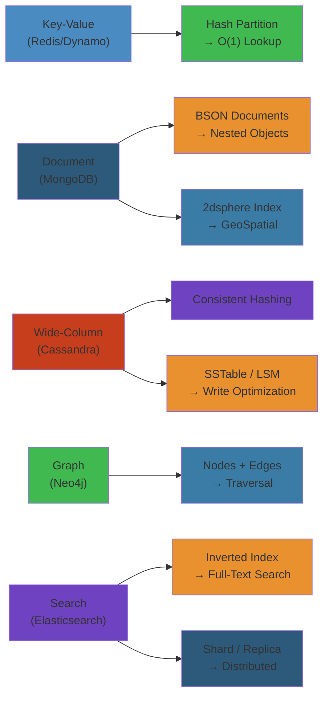

# 🎯 NoSQL Databases — Complete Deep Dive




## Table of Contents


1. [NoSQL Taxonomy](#nosql-taxonomy)
2. [DynamoDB Internals](#dynamodb-internals)
3. [MongoDB Internals](#mongodb-internals)
4. [Cassandra Internals](#cassandra-internals)
5. [Elasticsearch Internals](#elasticsearch-internals)
6. [Simplest Mental Model](#simplest-mental-model)

---

## Interactive: NoSQL Shard Topology

<div style="padding:16px;background:#0b0e14;border:1px solid #1e2a3a;border-radius:8px">
  <style>.topology-title{color:#00d4ff;font-family:monospace;font-size:14px;font-weight:bold;margin-bottom:12px}.topology-svg{width:100%;max-width:600px;height:300px;background:#1a2332;border:1px solid #1e3a5f;border-radius:4px}.topo-edge{stroke:#1e3a5f;stroke-width:2}.topo-legend{display:flex;gap:16px;margin-top:12px;font-size:12px;color:#e3eaf0;font-family:monospace;flex-wrap:wrap}.legend-item{display:flex;align-items:center;gap:6px}</style>
  <div class="topology-title">Cassandra Ring with Replication Factor 3</div>
  <svg class="topology-svg" viewBox="0 0 600 300">
    <defs><marker id="arrow-cassandra" markerWidth="10" markerHeight="10" refX="9" refY="3" orient="auto"><polygon points="0 0, 10 3, 0 6" fill="#1e3a5f"/></marker></defs>
    <!-- Ring -->
    <circle cx="300" cy="150" r="100" fill="none" stroke="#1e3a5f" stroke-width="2" stroke-dasharray="5,5"/>
    <!-- Nodes -->
    <circle cx="400" cy="150" r="18" fill="#3a7ca5" stroke="#00d4ff" stroke-width="2"/>
    <text x="400" y="155" text-anchor="middle" fill="#e3eaf0" font-size="12" font-family="monospace" font-weight="bold">N1</text>
    <circle cx="250" cy="80" r="18" fill="#3a7ca5" stroke="#00d4ff" stroke-width="2"/>
    <text x="250" y="85" text-anchor="middle" fill="#e3eaf0" font-size="12" font-family="monospace" font-weight="bold">N2</text>
    <circle cx="200" cy="220" r="18" fill="#3a7ca5" stroke="#00d4ff" stroke-width="2"/>
    <text x="200" y="225" text-anchor="middle" fill="#e3eaf0" font-size="12" font-family="monospace" font-weight="bold">N3</text>
    <!-- Replication arrows -->
    <path d="M 390 145 L 260 85" stroke="#34d399" stroke-width="2" fill="none" marker-end="url(#arrow-cassandra)"/>
    <path d="M 260 85 L 210 215" stroke="#34d399" stroke-width="2" fill="none" marker-end="url(#arrow-cassandra)"/>
    <path d="M 210 215 L 390 155" stroke="#34d399" stroke-width="2" fill="none" marker-end="url(#arrow-cassandra)"/>
    <!-- Center label -->
    <text x="300" y="155" text-anchor="middle" fill="#a3aab8" font-size="11" font-family="monospace">consistent</text>
    <text x="300" y="170" text-anchor="middle" fill="#a3aab8" font-size="11" font-family="monospace">hashing</text>
  </svg>
  <div class="topo-legend">
    <div class="legend-item"><div style="width:14px;height:14px;background:#3a7ca5;border:1px solid #00d4ff"></div><span>Data Node</span></div>
    <div class="legend-item"><div style="width:14px;height:2px;background:#34d399;position:relative;top:1px"></div><span>Replication Path</span></div>
  </div>
</div>

## NoSQL Taxonomy


```text
Key-Value → Redis, DynamoDB, Riak, Etcd
Document  → MongoDB, Couchbase, Firestore
Column    → Cassandra, ScyllaDB, HBase, BigTable
Graph     → Neo4j, ArangoDB, JanusGraph, Dgraph
Search    → Elasticsearch, Meilisearch, Typesense, Solr
```

### CAP Tradeoffs


```text
CP (Consistent + Partition-tolerant):
  HBase, MongoDB (default), Redis Cluster, Etcd
AP (Available + Partition-tolerant):
  Cassandra, DynamoDB (default), CouchDB, Riak
```

---

## DynamoDB Internals


### Data Model


```text
Table: Orders
  Partition Key: customer_id  (hash → partition)
  Sort Key:      order_date   (range → sort within partition)
  LSI: same PK, different SK (must create at table creation)
  GSI: different PK+SK (can create anytime, separate RCU/WCU)
```

### Partitioning


```text
Hash(key) → partition (10GB each)
RCU/WCU split evenly. Hot key throttles entire partition.

RCU: 1 RCU = 4KB strong, 8KB eventual, 2KB transactional
WCU: 1 WCU = 1KB standard, 0.5KB transactional
```

**Adaptive Capacity:** Burst unused capacity from other partitions.

### Streams & DAX


```text
DynamoDB Stream → Shards → Kinesis Adapter → Lambda/App
  24h retention, INSERT/MODIFY/REMOVE records

DAX (Accelerator): write-through cache → microsecond reads
```

---

## MongoDB Internals


### Document Model (BSON)


BSON: binary JSON with native types (Date, ObjectId, Decimal128). Max doc size: 16MB.

### WiredTiger Storage


```text
Memory: Cache (internal pages) + Snapshots (MVCC versions)
Disk:   Checkpoint (consistent snapshot) + Journal (WAL)
        Data files (B-tree, snappy/zstd/zlib compression)
```

**Checkpoint:** Block new txns → wait for active → flush dirty pages → atomic metadata update.

### Replication (Replica Set)


```text
Primary (all writes, oplog) → Secondary (replicate oplog)
                              Secondary (vote + replicate)
Optional: Arbiter (vote only, no data)
```

**Oplog:** Capped collection. Idempotent operations. Election by majority.

### Sharding


```text
mongos (router) → Config Servers (metadata, RS of 3)
                → Shard 0 (RS, range a-f)
                → Shard 1 (RS, range g-n)
                → Shard 2 (RS, range o-z)
```

**Shard key types:** Range (physical proximity), Hashed (even distribution), Zone (geographic).

### Aggregation Pipeline


```js
db.orders.aggregate([
  { $match:  { status: "completed" } },
  { $group:  { _id: "$customer_id", total: { $sum: "$amount" } } },
  { $sort:   { total: -1 } },
  { $limit:  10 },
  { $lookup: { from: "customers", localField: "_id", foreignField: "customer_id", as: "c" } },
  { $unwind: "$c" },
  { $merge:  { into: "top_customers" } }
]);
```

---

## Cassandra Internals


### Data Model


```sql
PRIMARY KEY ((category, region),  product_id,  created_at)
             └──partition key──┘  └──clustering columns──┘
```

Row key `electronics|US` → partition. Clustering: `product_id ASC, created_at ASC`.

### Partitioner & VNodes


```python
def partition(key):
    return murmur3(key) % num_vnodes  # -2^63 to 2^63-1
```

**VNodes:** 256 per node. Even distribution, less data movement on add/remove.

### Gossip


Every 1s: pick random peer, exchange state (generation, version, heartbeat). Last-writer-wins merge.

### Read Path


```text
Coordinator → digest from QUORUM replicas
           → if match: return
           → if mismatch: full read from all → reconcile → repair
```

**Hinted Handoff:** If replica down, coordinator stores hint (3h TTL). Delivered when replica returns.

### Tombstones


```python
# Delete = insert tombstone marker
def delete(pk, ck):
    write(Tombstone(deletion_time=now()))
```

Tombstones survive `gc_grace_seconds` (default 10 days). Compaction removes them after that.

### Consistency Levels


```text
ONE, TWO, THREE, QUORUM (RF/2+1), LOCAL_QUORUM, EACH_QUORUM, ALL, ANY
```

**Lightweight Transactions (Paxos):**
```sql
INSERT INTO products (id, price) VALUES (1, 100) IF NOT EXISTS;
UPDATE products SET price = 200 WHERE id = 1 IF price = 100;
```

---

## Elasticsearch Internals


### Inverted Index


```text
Doc 1: "The quick brown fox"
Doc 2: "The lazy dog"

the  → [1, 2]
quick→ [1]
brown→ [1]
fox  → [1]
lazy → [2]
dog  → [2]

Each posting: doc_id + term frequency + positions
```

### Segment Structure


```text
Index → Shard → Segments (immutable)
  .tip = term index (prefix → .tim block)
  .tim = term dictionary (block tree)
  .doc = postings (doc IDs, frequencies)
  .pos = positions

Refresh (1s): buffer → new segment (visible, but not fsynced)
Flush (30m/500MB): commit + fsync + clear translog
Merge: combine small segments → delete old
```

### Cluster State


Metadata on all nodes: index settings, mappings, routing, allocation. Only master updates it. Published via Zen Discovery.

### Query DSL


```json
{
  "query": {
    "bool": {
      "must":   [{ "match": { "title": "laptop" } }],
      "filter": [{ "range": { "price": { "gte": 500 } } }],
      "should": [{ "match": { "description": "gaming" } }]
    }
  },
  "aggs": {
    "by_cat": {
      "terms": { "field": "category" },
      "aggs": { "avg_price": { "avg": { "field": "price" } } }
    }
  }
}
```

### BM25 Scoring


```python
def bm25(tf, doc_len, avg_dl, num_docs, df):
    k1, b = 1.2, 0.75
    idf = math.log(1 + (num_docs - df + 0.5) / (df + 0.5))
    tf_norm = (tf * (k1 + 1)) / (tf + k1 * (1 - b + b * doc_len / avg_dl))
    return idf * tf_norm
```

---

## Simplest Mental Model


```
DynamoDB = luggage carousel
  Each bag (partition key) → one carousel
  Sorting (sort key) within bag
  Eventually all carousels have same bags

MongoDB = filing cabinet with labeled folders
  Drawers (shards) contain folders (documents)
  Pipeline = assembly line to transform docs
  Replica set = photocopier for backup

Cassandra = shared whiteboard divided into sections
  Anyone writes to their section
  Periodically everyone reads each other's sections
  Quorum = majority agreement
  Tombstones = whiteboard erasures (visible until cleaned)

Elasticsearch = Google for your data
  Builds index of everything (inverted index)
  Splits into chapters (shards)
  New pages refresh every second
  BM25 ranks relevance

"SQL is a Swiss Army knife. NoSQL is a toolbox."
```


---

## Code Examples


```python
import boto3
import json
from cassandra.cluster import Cluster
from pymongo import MongoClient

# DynamoDB: Transactional order processing with idempotency
dynamodb = boto3.resource('dynamodb')
table = dynamodb.Table('orders')

def create_order(order_id: str, customer: str, total: float) -> dict:
    try:
        table.put_item(
            Item={'pk': f'ORDER#{order_id}', 'customer': customer,
                  'total': total, 'status': 'placed',
                  'ttl': int(time.time()) + 86400},
            ConditionExpression='attribute_not_exists(pk)'
        )
        return {'status': 'created'}
    except ClientError as e:
        if e.response['Error']['Code'] == 'ConditionalCheckFailedException':
            return {'status': 'duplicate'}
        raise

# Cassandra: Time-series sensor data with TTL
cluster = Cluster(['10.0.1.10', '10.0.1.11'])
session = cluster.connect('sensors')
session.execute("""
    INSERT INTO readings (device_id, ts, temperature, humidity)
    VALUES (%s, %s, %s, %s) USING TTL 7776000
""", ("sensor-01", datetime.utcnow(), 23.5, 65.2))

# MongoDB: Aggregation pipeline for analytics
client = MongoClient('mongodb://localhost:27017')
db = client['analytics']
pipeline = [
    {'$match': {'event': 'purchase', 'timestamp': {'$gte': start, '$lt': end}}},
    {'$group': {'_id': '$product_id', 'total_revenue': {'$sum': '$amount'},
                 'count': {'$sum': 1}}},
    {'$sort': {'total_revenue': -1}},
    {'$limit': 10}
]
results = db.events.aggregate(pipeline)
```

---

## Common Failure Modes


**Problem**: Hot partition in DynamoDB throttling a subset of requests

**Root cause**: Uneven access pattern — a single partition key receives disproportionate traffic (e.g., a viral product's SKU gets 90% of reads). DynamoDB splits throughput evenly across partitions, so a hot key throttles even though total table throughput is under-utilized.

**Detection**: CloudWatch `WriteThrottleEvents` / `ReadThrottleEvents` for the table. `ConsumedReadCapacityUnits` per partition is uneven. Application sees `ProvisionedThroughputExceededException` for only one item.

**Solution**: Add a random suffix to the partition key to distribute writes (write sharding). For reads, use DynamoDB DAX cache to absorb repeated reads on the same key. Use adaptive capacity (auto-splits partitions) — enable on-demand mode temporarily during traffic spikes. Consider restructuring the data model to avoid single-key hotspots.

**Problem**: Cassandra tombstone overload causing read timeouts

**Root cause**: Frequent deletes or updates create tombstones (markers that a row was deleted). Compaction eventually removes them, but if tombstones accumulate faster than compaction handles them, reads must scan through millions of tombstones, causing timeouts.

**Detection**: `nodetool tablestats` shows high `% tombstones`. Read latency spikes after large delete operations. `org.apache.cassandra.db.filter.TombstoneOverflow` in logs. Queries with `ALLOW FILTERING` hit tombstone limits.

**Solution**: Set `gc_grace_seconds` appropriately (default 10 days). Increase compaction throughput. Use TTL-based expiration instead of explicit DELETE when possible. Batch deletes in small chunks. Monitor `TombstoneScannedHistogram` in latency metrics. For time-series data, use time-windowed compaction strategy.

---

## Interview Questions


### Q1: How do you choose between DynamoDB, MongoDB, and Cassandra for a new project?


**Answer**: **DynamoDB** is best for AWS-native projects requiring single-digit-millisecond latency at any scale, with predictable access patterns and simple key-value or single-table design. Avoid it if you need complex queries, joins, or transactions across many items. **MongoDB** excels when you have flexible/document-shaped data, need ad-hoc queries, aggregations, and secondary indexes. Avoid it if you need strict consistency or very high write throughput. **Cassandra** is ideal for high-volume write-heavy workloads (time-series, IoT, event logging) where availability and partition tolerance matter more than consistency. Avoid it if you need joins, aggregations, or flexible query patterns — Cassandra requires query-driven data modeling.

### Q2: How does Elasticsearch achieve near-real-time search and what trade-offs does this involve?


**Answer**: Elasticsearch achieves near-real-time (NRT) search by batching indexed documents into in-memory buffers. A refresh (default 1s) creates a new immutable segment from the buffer, making documents visible to search — but the segment is not yet fsynced to disk. A separate flush (triggered at 30min or 500MB) fsyncs the segment to disk and clears the translog. This design means recent writes can be lost if the node crashes before the flush. The trade-off: lower durability (1s window of potential data loss) in exchange for sub-second search visibility. For write-intensive workloads, increase the refresh interval to 30s for higher indexing throughput.


## Edge Cases


| Scenario | Challenge | Solution |
|----------|-----------|----------|
| **Cassandra tombstone overload** | Deletes leave tombstones, read queries scan 1000+ tombstones causing timeout | Set `gc_grace_seconds` = 864000. Use TimeWindowCompactionStrategy. Avoid wide-row reads after mass deletes. Monitor `tombstone_scanned` in tracing |
| **MongoDB wiredTiger cache pressure** | Cache eviction storms cause latency spikes | Set `wiredTigerCacheSizeGB` = 50% of RAM (not default 60%). Monitor `wiredTiger.cache.tracked_dirty_bytes_in_cache`. Add indexes to reduce scanned documents |
| **DynamoDB hot partition** | One partition gets disproportionate reads | Use write sharding: add random suffix to partition key. Use DAX for cache. Enable auto-scaling with `TargetUtilization=70%` |
| **Redis memory fragmentation** | High memory usage despite small datasets | Set `activedefrag yes`. Use `jemalloc` allocator. Monitor `mem_fragmentation_ratio` > 1.5. Restart during maintenance |
| **CockroachDB transaction retries** | Serialization failures under contention | Implement client-side retry with backoff. Use `SELECT FOR UPDATE` to reduce contention. Consider `SNAPSHOT` isolation for read-heavy workloads |

## Cross-References


- [PostgreSQL Architecture](/08-databases/02-postgresql-architecture.md) — ACID, MVCC, replication comparison
- [Database Internals](/08-databases/01-relational-database-internals.md) — LSM-tree vs B-tree storage engines
- [Distributed Transactions](/09-distributed-systems/02-distributed-transactions.md) — Consistency models, transaction isolation
- [Distributed Storage](/09-distributed-systems/03-distributed-storage.md) — Consistent hashing, quorum, gossip

## Related

- [Cap Consistency](/09-distributed-systems/01-cap-consistency.md)
- [Consensus Replication](/09-distributed-systems/01-consensus-replication.md)
- [Consensus Raft](/09-distributed-systems/02-consensus-raft.md)
- [Distributed Transactions](/09-distributed-systems/02-distributed-transactions.md)
- [Distributed Caching](/09-distributed-systems/03-distributed-caching.md)
- [Distributed Storage](/09-distributed-systems/03-distributed-storage.md)
