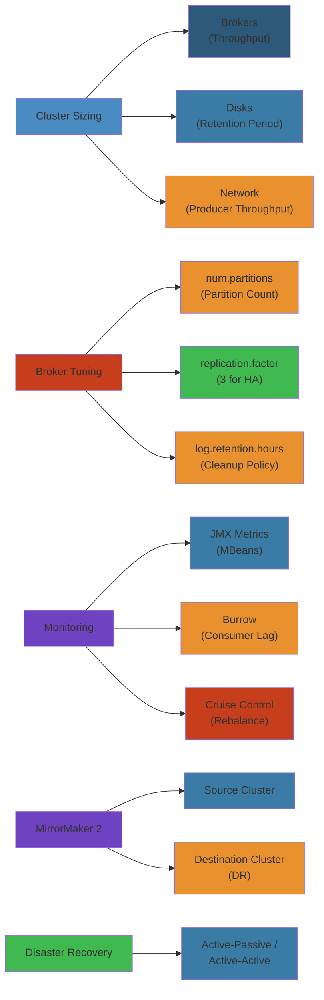

# ⚙️ Kafka Production Operations — Complete Deep Dive




## 📋 Table of Contents


- [Cluster Sizing](#cluster-sizing)
- [Disk Sizing](#disk-sizing)
- [Broker Tuning](#broker-tuning)
- [JMX Monitoring](#jmx-monitoring)
- [Burrow & Cruise Control](#burrow--cruise-control)
- [Partition Reassignment](#partition-reassignment)
- [Rolling Upgrade](#rolling-upgrade)
- [Security](#security)
- [MirrorMaker 2](#mirrormaker-2)
- [Disaster Recovery](#disaster-recovery)
- [Client Tuning](#client-tuning)
- [Quotas](#quotas)

---

## Cluster Sizing


```
Brokers = max(
    (total_throughput / per_broker_throughput),
    (total_partitions / 4000),
    RF * 2 + 1  (ISR quorum)
)
```

**Replication Factor**: RF=3 for production (tolerates 1 failure). `min.insync.replicas=2`.

### Partitions


```text
target = 100 MB/s, max partition throughput = 20 MB/s
min partitions = 5 → double for headroom → 10

Rule: total partitions < 4000 per broker (controller load grows beyond)
```

---

## Disk Sizing


```
total_storage = daily_throughput * retention_days * RF
Example: 1 TB/day × 7 days × 3 RF = 21 TB (3.5 TB/broker at 6 brokers)
```

**Hardware**: NVMe SSD mandatory (no NFS/NAS). Separate `log.dirs` by mount for parallelism.

---

## Broker Tuning


```properties
num.network.threads=8           # CPU cores × 2
num.io.threads=16                # CPU cores × 4
num.recovery.threads.per.data.dir=2

log.segment.bytes=1073741824     # 1 GB
log.retention.hours=168          # 7 days
log.cleaner.threads=4

compression.type=producer        # inherit from producer (use zstd)
unclean.leader.election.enable=false   # NEVER enable — data loss
min.insync.replicas=2
```

---

## Simplest Mental Model


> **Kafka is a distributed commit log. Partitions are parallel lanes (ordered). Replication copies each lane to 3 brokers. The controller is the traffic cop. Zookeeper/KRaft is the map.**

---

## JMX Monitoring


```bash
export KAFKA_JMX_OPTS="-Dcom.sun.management.jmxremote -Dcom.sun.management.jmxremote.port=9999"
```

### Critical Metrics


| MBean | Alert Threshold |
|-------|----------------|
| `UnderReplicatedPartitions` | > 0 for > 1 min |
| `OfflinePartitionsCount` | > 0 |
| `RequestHandlerAvgIdlePercent` | < 0.3 |
| G1 GC time | > 5% of runtime |

---

## Burrow & Cruise Control


**Burrow**: Linkedin's lag monitor — evaluates consumer progress across 3 windows (EXP/OK/LAG). Consumer-agnostic.
```bash
curl http://burrow:8000/v3/kafka/local/consumer/my-group/lag
```

**Cruise Control**: automatic partition rebalancing via REST API.
```bash
curl -X POST "http://localhost:9090/kafkacruisecontrol/rebalance?dryrun=false"
```
Goals (priority): RackAware → MinTopicLeaders → ReplicaDistribution → DiskCapacity.

---

## Partition Reassignment


When adding/removing brokers:
```bash
kafka-reassign-partitions.sh --bootstrap-server localhost:9092 \
  --generate --topics-to-move-json-file topics.json --broker-list "1,2,3,4"
kafka-reassign-partitions.sh --bootstrap-server localhost:9092 --execute \
  --reassignment-json-file reassign.json
```

**Preferred leader election**: `auto.leader.rebalance.enable=true` (default).

---

## Rolling Upgrade


```text
1. Set inter.broker.protocol.version=OLD (leave new binary)
2. Rolling restart one broker at a time:
   wait → SIGTERM → start new → wait for ISR
3. ALL upgraded: set inter.broker.protocol.version=NEW
4. Second rolling restart
5. (Optional) upgrade message format
```

```properties
inter.broker.protocol.version=3.4
```

---

## Security


### SASL/SCRAM (hashed creds in ZK/KRaft)


```bash
kafka-configs.sh --bootstrap-server localhost:9092 \
  --alter --add-config 'SCRAM-SHA-256=[password=secret]' \
  --entity-type users --entity-name producer-user
```

### mTLS


```properties
ssl.keystore.location=/var/kafka/server.keystore.jks
ssl.client.auth=required
```

### ACLs


```bash
kafka-acls.sh --authorizer-properties zookeeper.connect=localhost:2181 \
  --add --allow-principal User:producer-user \
  --operation Write --topic my-topic
```

---

## MirrorMaker 2


Replicates topics across clusters. Internal topics: `A.my-topic`, `heartbeat`, `checkpoint`.

```properties
clusters=A,B
A.bootstrap.servers=broker-a1:9092
B.bootstrap.servers=broker-b1:9092
A->B.enabled=true
topics=.*
sync.group.offsets.enabled=true
```

---

## Disaster Recovery


### Active-Passive


```text
PROD (active) ──► MM2 ──► DR (passive, standby consumers)
  Failover: redirect DNS/producer config to DR
```

### Active-Active


Both clusters have producers. Challenge: conflict resolution for same keys.

### Recovery


1. Stop MM2, redirect producers to DR
2. Validate offsets
3. Redirect consumers
4. When primary back: reverse replicate, fail back

---

## Client Tuning


### Producer


```properties
acks=all                     # Strongest durability
batch.size=16384             # 16 KB — increase for throughput
linger.ms=5                  # Fill batch up to 5ms
compression.type=zstd        # Best compression ratio
enable.idempotence=true      # Exactly-once
retries=2147483647           # Infinite retries
```

### Consumer


```properties
enable.auto.commit=false
auto.offset.reset=earliest
fetch.min.bytes=1
max.poll.records=500
session.timeout.ms=45000
heartbeat.interval.ms=3000
max.poll.interval.ms=300000
partition.assignment.strategy=org.apache.kafka.clients.consumer.CooperativeStickyAssignor
```

---

## Quotas


Limit network throughput per client-id:
```bash
kafka-configs.sh --bootstrap-server localhost:9092 \
  --alter --add-config 'producer_byte_rate=10485760,consumer_byte_rate=20971520' \
  --entity-type clients --entity-default
```

**Use**: prevent noisy tenants from saturating broker bandwidth.

---

## 📚 Key Takeaways


| Topic | Golden Rule |
|-------|-------------|
| Sizing | RF=3, min.insync=2, partitions < 4000/broker |
| Compression | Always enable (zstd) — 2-4x bandwidth reduction |
| Monitoring | UnderReplicatedPartitions = #1 signal |
| Security | SCRAM > PLAIN; mTLS for prod; ACL everything |
| Upgrades | Two rolling restarts: protocol first, then format |
| DR | Active-passive with MM2; test failover quarterly |
| Clients | Idempotent producer, cooperative rebalance |
| Quotas | Essential for multi-tenant clusters |


---

## Code Examples


```python
from kafka import KafkaProducer, KafkaConsumer
import json
import time

# Idempotent producer with compression
producer = KafkaProducer(
    bootstrap_servers=['broker1:9092', 'broker2:9092'],
    acks='all',
    enable_idempotence=True,
    compression_type='zstd',
    batch_size=32768,
    linger_ms=10,
    retries=2147483647,
    max_in_flight_requests_per_connection=5
)

def send_event(topic: str, key: str, value: dict):
    future = producer.send(topic, key=key.encode(), value=json.dumps(value).encode())
    future.add_callback(lambda meta: print(f"Sent to {meta.topic} p{meta.partition} @{meta.offset}"))
    future.add_errback(lambda exc: print(f"Failed: {exc}"))

# Consumer with cooperative rebalancing and manual commit
consumer = KafkaConsumer(
    'orders',
    bootstrap_servers=['broker1:9092'],
    group_id='order-processor',
    enable_auto_commit=False,
    auto_offset_reset='earliest',
    max_poll_records=500,
    session_timeout_ms=45000,
    heartbeat_interval_ms=3000,
    max_poll_interval_ms=300000,
    partition_assignment_strategy='cooperative-sticky'
)

def process_batch():
    while True:
        records = consumer.poll(timeout_ms=1000)
        for tp, msgs in records.items():
            for msg in msgs:
                try:
                    data = json.loads(msg.value)
                    process_order(data)
                    consumer.commit({tp: msg.offset + 1})
                except ValueError:
                    # Non-retriable: commit and skip
                    consumer.commit({tp: msg.offset + 1})

# Monitor consumer lag via admin client
from kafka.admin import KafkaAdminClient
admin = KafkaAdminClient(bootstrap_servers=['broker1:9092'])
```

```bash
# Check consumer lag
kafka-consumer-groups.sh --bootstrap-server localhost:9092 \
  --group order-processor --describe

# Reassign partitions
kafka-reassign-partitions.sh --bootstrap-server localhost:9092 \
  --reassignment-json-file reassign.json --execute

# Add a broker (auto-assign partitions)
kafka-reassign-partitions.sh --generate --broker-list "1,2,3,4"
```

---

## Common Failure Modes


**Problem**: Consumer group rebalancing storm — frequent rebalances causing processing stalls

**Root cause**: When consumers join/leave frequently (due to network hiccups, GC pauses, or pod restarts), Kafka triggers a rebalance. During rebalance, all consumers in the group stop processing (for eager protocol) or pause affected partitions (for cooperative). If rebalances happen faster than processing can stabilize, the group enters a rebalance loop — consumers never process data.

**Detection**: Consumer group metrics show `rebalance-rate-per-hour` spiking to 10+. Consumer lag spikes during rebalances. Logs show repeated `Revoke`/`Assign` cycles. Monitoring shows the group never reaches a stable state.

**Solution**: Use `cooperative-sticky` (incremental) rebalance protocol — only revokes a subset of partitions, not all. Increase `session.timeout.ms` to 45s (from default 10s) to tolerate brief network issues. Increase `heartbeat.interval.ms` to 3s. Set `max.poll.interval.ms` to 5-10 minutes to give consumers time for long processing. Use static group membership (`group.instance.id`) — consumers keep their partition assignment across restarts. Monitor GC pause times — if > session.timeout, consumers get kicked out. Right-size `max.poll.records` so the processing time fits within `max.poll.interval.ms`.

**Problem**: Under-replicated partitions causing data loss risk and producer timeouts

**Root cause**: A broker fails, and its partition leaders move to other brokers. If replicas were already lagging, the new leader is missing data. If `min.insync.replicas=2` and only 1 replica is in sync, producers with `acks=all` will time out. Common causes: network saturation between brokers, disk I/O contention on a broker, or a full GC pause on the JVM.

**Detection**: JMX metric `UnderReplicatedPartitions > 0`. `kafka-topics --describe` shows replicas not in sync. Producer logs show `NotEnoughReplicasException` or `TimeoutException`. `kafka-log-dirs.sh` shows disks at 100% on some brokers.

**Solution**: Ensure `min.insync.replicas=2` and RF=3 — tolerates one broker failure. Monitor `UnderReplicatedPartitions` as the highest-priority alert (P0). When detected, identify the cause: check broker disk space, network throughput, CPU, and GC. Use Cruise Control to move partitions away from degraded brokers. For network issues, ensure dedicated 10Gbps+ links between brokers. For disk issues, use separate NVMe disks per broker. For GC, tune Kafka JVM heap (typically 4-6GB, G1GC) and monitor GC pause times.

---

## Interview Questions


### Q1: How does Kafka achieve exactly-once semantics (EOS) end-to-end?


**Answer**: Kafka's EOS requires three things: (1) **Idempotent producer** (`enable.idempotence=true`) — the producer tags each batch with a producer ID (PID) and sequence number. The broker deduplicates any duplicate batches within a session. (2) **Transactional API** — producers can atomically produce to multiple partitions within a transaction. The coordinator writes a commit marker to an internal `__transaction_state` topic. Consumers with `isolation.level=read_committed` only see committed messages. (3) **Exactly-once semantics in Kafka Streams** — Streams applications use the transactional producer with consumer offset commits in the same transaction as output results. This ensures that "read-process-write" is atomic: if the app crashes and restarts, it resumes from the committed offset, producing duplicate results that are deduplicated by the idempotent producer. The trade-off: up to 2x latency overhead due to the commit protocol, and higher memory usage on the broker for transaction state.

### Q2: How do you size a Kafka cluster for 500 MB/s throughput with 7-day retention?


**Answer**: (1) **Compute storage**: 500 MB/s × 86400s × 7d × RF3 = ~90 TB total. With 6 brokers, each needs 15 TB. (2) **Throughput per broker**: writing 500 MB/s / 6 = ~83 MB/s per broker (plus replication reads: 83 MB/s × 2 replicas = 167 MB/s read). Modern NVMe SSDs handle 500+ MB/s sequential, so this is fine. (3) **Partitions per broker**: 500 MB/s / 20 MB/s per partition ceiling = 25 minimum partitions per topic. Double for headroom → 50. Total partitions across all topics < 4000 per broker. (4) **Broker count**: check controller load — 6 brokers with 4000 partitions each = 24K partition leaders. A single controller handles up to ~50K partitions. (5) **Memory**: Each partition leader keeps ~1MB of state → 24K × 1MB = 24GB per broker, so 64GB+ RAM. (6) **Network**: 83 MB/s in + 83 MB/s out = 166 MB/s per broker → need 10Gbps+ NIC. (7) **Connections**: Each consumer/producer connection consumes a thread. With 200 producers + 500 consumers, need `num.network.threads` = 16+ and `num.io.threads` = 8 × CPU cores. Kafka scales linearly — add brokers to increase total throughput.


## Deep Internals: Kafka Request Pipeline


```
Client (Network Layer)
    |
    v
Acceptor Threads (1 per listener, accept TCP)
    |
    v
Network Threads (num.network.threads, parse protocol, deserialize)
    |
    v
Request Queue (shared)
    |
    v
I/O Threads (num.io.threads, process requests, write to log)
    |
    v
Response Queue (per connection)
    |
    v
Network Threads (serialize response, send)
    |
    v
Purgatory (delayed operations: acks, fetch requests waiting for data)
```

**Request types:** ProduceRequest, FetchRequest, MetadataRequest, OffsetFetchRequest, LeaderAndIsrRequest, UpdateMetadataRequest

**Purgatory:** Holds delayed produce requests (waiting for acks from replicas) and delayed fetch requests (waiting for new data or timeout). Default `purge.purgeInterval` is 1000ms. High purgatory size means many delayed operations — check `DelayedOperationPurgatory` metrics.

## Production Failure Modes


### Failure 1: Under-Replicated Partitions During Rolling Restart


| Aspect | Detail |
|--------|--------|
| **Symptoms** | `UnderReplicatedPartitions` > 0 for extended periods; produce requests fail with `NOT_ENOUGH_REPLICAS` |
| **Root Cause** | Restarting a broker too fast — `min.insync.replicas` (default 2) can't be satisfied if replicas are down. Controller election triggers leader re-election, moving leadership to other brokers, temporarily leaving partitions with fewer ISR than configured |
| **Detection** | JMX metric `kafka.server:type=ReplicaManager,name=UnderReplicatedPartitions` > 0. `kafka-topics.sh --describe --under-replicated-partitions` shows replicas not in sync |
| **Recovery** | Wait for ISR to stabilize before restarting next broker. Check `kafka-log-dirs.sh` for disk space issues. If stuck, trigger preferred leader election |
| **Prevention** | Set `unclean.leader.election.enable=false`. Use rolling restart with `--wait-for-isr` flag. Monitor `OfflineReplicaCount`. Set `replica.lag.time.max.ms` to 30000 (30s) |

### Failure 2: Consumer Group Rebalancing Storm


| Aspect | Detail |
|--------|--------|
| **Symptoms** | Repeated consumer rebalances; processing stalls; messages pile up; consumer lag spikes |
| **Root Cause** | Default `session.timeout.ms` (45s) too low for processing-heavy consumers. A consumer processing a batch > 5 min triggers `max.poll.interval.ms` timeout, causing coordinator to remove it, triggering rebalance, which disrupts all consumers in the group |
| **Detection** | Kafka logs: "Revoking previously assigned partitions". `kafka-consumer-groups.sh --describe --group` shows members joining/leaving repeatedly. JMX: `kafka.consumer:type=consumer-coordinator-metrics,name=rebalance-total` increments rapidly |
| **Recovery** | Increase `max.poll.interval.ms` to 5-10 min. Increase `session.timeout.ms` to 60s+. Switch to `CooperativeStickyAssignor` for incremental rebalances |
| **Prevention** | Configure `partition.assignment.strategy=CooperativeStickyAssignor`. Set `max.poll.records` lower (500). Keep processing time per record < 10ms. Use async processing with manual offset commit |

### Failure 3: Disk Full on Broker


| Aspect | Detail |
|--------|--------|
| **Symptoms** | Broker crashes or stops accepting writes; `LogDirFailure` exception; Kafka logs: "java.io.IOException: No space left on device" |
| **Root Cause** | Retention-based cleanup didn't reclaim space fast enough; log segment deletion is asynchronous; a single topic with high throughput fills disk before cleaner threads run |
| **Detection** | `df -h` shows 100% on mount. `kafka-log-dirs.sh --describe --broker-list` shows `offline` log directories. JMX: `kafka.log:type=LogCleanerManager,name=log-cleaned-rate` zero |
| **Recovery** | Free space: increase `log.retention.bytes` or decrease `log.retention.hours`. Trigger immediate cleanup: `kafka-configs --alter --entity-type brokers --entity-default --add-config log.retention.bytes=1073741824`. Remove inactive topics: `kafka-topics --delete`. Add new disks |
| **Prevention** | Set `log.retention.bytes` and `log.retention.hours`. Configure `log.cleaner.threads` = number of CPU cores. Use separate `log.dirs` for each mount point. Set disk usage alarm at 80% via JMX `kafka.server:type=BrokerTopicMetrics,name=BytesInPerSec` |

## Interview Questions


### Q1 (Beginner): What is the difference between acks=1 and acks=all in Kafka producers?


**Answer**: `acks=1` means the leader broker writes the record to its log and responds to the producer without waiting for followers to confirm. If the leader crashes before followers replicate, the record is lost. `acks=all` (or `acks=-1`) means the leader waits for all in-sync replicas (ISR) to acknowledge the write. With `min.insync.replicas=2` and RF=3, this guarantees at least 2 replicas have the data before the producer gets confirmation. Choose `acks=1` for throughput-sensitive applications where occasional data loss is acceptable (metrics, audit logs). Choose `acks=all` for financial transactions, order processing, or any workload where data loss is unacceptable.

### Q2 (Mid-Level): How does Kafka handle exactly-once semantics?


**Answer**: Kafka provides exactly-once semantics (EOS) through three mechanisms: (1) **Idempotent Producer** — each producer gets a unique producer ID (PID). Each message gets a sequence number. The broker deduplicates based on (PID, sequence number). (2) **Transactional Producer** — atomic writes across multiple partitions/topics. The producer initiates a transaction, writes to partitions, then commits or aborts. Kafka stores an `abort` or `commit` marker in the log. Consumers with `isolation.level=read_committed` only see committed messages. (3) **Consumer Transactional Send** — offset commits are part of the producer transaction. The consume-transform-produce loop becomes atomic: offsets + output are committed in one transaction. This prevents the "zombie" problem where a failed consumer restarts and reprocesses.

### Q3 (Senior): How do you diagnose and fix Kafka partition skew (hot partitions)?


**Answer**: Partition skew occurs when one partition receives disproportionate traffic. Detection: `kafka-run-class.sh kafka.tools.JmxTool --object-name kafka.log:type=Log,name=Size` shows uneven sizes. `kafka-topics.sh --describe --topic` shows one partition with much larger log end offset. Cruise Control shows partition load distribution. Root causes: bad partition key design (e.g., using `user_id % 10` when one user generates 50% of events), key collisions, or partitioned writes from a single source. Fix: redesign partition key to ensure even distribution. For time-series data, use `UUID` or composite keys (region + hash). For user-specific data, ensure high-cardinality user IDs. Mitigation: increase partition count and use Cruise Control to reassign partition leaders using `kafka-reassign-partitions.sh`. For urgent hot partition, limit producer throughput via quotas for the client-id.

## Cross-References


- [Kafka Production Patterns](/10-messaging/kafka/02-kafka-patterns.md) — Event sourcing, CQRS, outbox pattern, stream processing
- [Kafka Streams DSL](/10-messaging/kafka/06-kafka-streams-dsl.md) — KTable, KStream, state stores, exactly-once
- [SNS & SQS Patterns](/10-messaging/sns-sqs/02-sns-sqs-patterns.md) — Queue comparison, fan-out, FIFO ordering
- [Distributed Systems](/09-distributed-systems/02-distributed-transactions.md) — 2PC, Saga, outbox pattern
- [Stream Processing](/09-distributed-systems/04-stream-processing.md) — Flink, watermarks, state management
