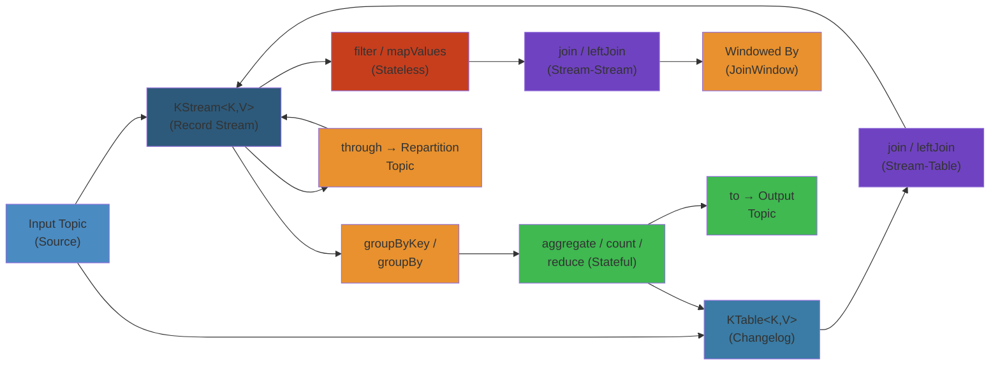

# Kafka Streams DSL — Deep Reference

> **Domain**: Stream Processing · **API Level**: DSL + Processor API  
> **Audience**: Senior engineers, architects, SREs  
> **Prerequisites**: Kafka basics (topic, partition, consumer group, offset)

---




## Table of Contents


1. [Kafka Streams Overview](#1-kafka-streams-overview)
2. [DSL Operators](#2-dsl-operators)
3. [State Stores](#3-state-stores)
4. [Processor API](#4-processor-api)
5. [Topology](#5-topology)
6. [Exactly-Once Semantics](#6-exactly-once-semantics)
7. [Scaling](#7-scaling)
8. [Failure Handling](#8-failure-handling)
9. [Production Operations](#9-production-operations)
10. [Comparison: Kafka Streams vs Flink vs Spark](#10-comparison-kafka-streams-vs-flink-vs-spark)
11. [Interview Questions](#11-interview-questions)
12. [Appendices](#12-appendices)

---

## 1. Kafka Streams Overview


### 1.1 What Is Kafka Streams?


Kafka Streams is a **lightweight client library** (not a cluster) for building stream-processing applications on top of Kafka. It runs inside your application JVM, communicates directly with Kafka brokers, and requires no separate processing cluster.

```
┌─────────────────────────────────────────────────────────────┐
│                    Kafka Streams App (JVM)                    │
│  ┌──────────┐   ┌──────────┐   ┌──────────┐                │
│  │ Source   │──▶│ Processor│──▶│ Sink     │                │
│  │ (topic)  │   │ (DSL)    │   │ (topic)  │                │
│  └──────────┘   └──────────┘   └──────────┘                │
│         │              │              │                     │
│         ▼              ▼              ▼                     │
│  ┌─────────────────────────────────────────────────────┐   │
│  │               State Stores (RocksDB)                │   │
│  └─────────────────────────────────────────────────────┘   │
└─────────────────────────────────────────────────────────────┘
         │                    │                    │
         ▼                    ▼                    ▼
   ┌──────────┐        ┌──────────┐        ┌──────────┐
   │ Kafka    │        │ Kafka    │        │ Kafka    │
   │ topic-1  │        │ topic-2  │        │ topic-3  │
   └──────────┘        └──────────┘        └──────────┘
```

Key properties:
- **Embedded**: runs in your app, no separate cluster
- **Exactly-once semantics**: built on Kafka transactions
- **Stateful**: local state stores (RocksDB) with changelog topics
- **Exactly-once processing**: via transactional producer
- **One-record-at-a-time**: no micro-batching (unlike Spark Structured Streaming)
- **Topology-based**: you define a DAG of processors

### 1.2 Stream-Processing Concepts


| Concept | Definition |
|---|---|
| **Stream** | An unbounded, ordered, replayable sequence of data records. Each record is a key-value pair. |
| **Table** | A mutable view of a stream (the latest value for each key). |
| **Duality** | A stream can be viewed as a table (changelog) and a table can be viewed as a stream (insert/update/delete events). |
| **Time** | Event time (embedded in record), processing time (wall-clock), ingestion time (broker timestamp). |
| **State** | Local storage maintained by the application for aggregation, joins, windowing. |

#### Stream-Table Duality

```
Stream (changelog)          Table (snapshot)
─────────────────          ────────────────
key=alice, +100             alice -> 100
key=bob,   +50              bob   -> 50
key=alice, +200             alice -> 300
key=bob,   -30              bob   -> 20

Stream: INSERT+UPDATE events           Table: current value per key
Table changelog topic → materialized view
Stream from table → capture all mutations
```

### 1.3 KStream vs KTable vs GlobalKTable


#### KStream (Record Stream)

A `KStream` is an **unordered, replayable** sequence of records. Every record is an independent event.

```java
KStream<String, Transaction> stream = builder.stream("transactions");
stream.filter((k, v) -> v.getAmount() > 1000)
      .to("high-value-txns");
```

Characteristics:
- No key uniqueness assumption
- Every record is processed independently
- No state retention by default
- Can have null keys; null values are **tombstones**

#### KTable (Changelog Table)

A `KTable` represents a **changelog** — each key has at most one current value. Updates are per-key upserts.

```java
KTable<String, Long> counts = builder.table(
    "word-counts",            // compacted source topic
    Materialized.as("counts-store")
);
```

Characteristics:
- Key uniqueness: new record with same key = update
- Null-value record = **delete** (tombstone) for that key
- Backed by a compacted topic
- Supports lookups by key (via Interactive Queries)

#### GlobalKTable (Fully Replicated Table)

A `GlobalKTable` copies the **entire dataset** to **every** application instance. Used for small reference/lookup data.

```java
GlobalKTable<String, Customer> customers = builder.globalTable(
    "customers",
    Consumed.with(Serdes.String(), customerSerde)
);
```

Characteristics:
- **Every instance** gets all partitions
- No co-partitioning required for joins
- Must fit in memory on each instance
- Good for dimension/enrichment data (e.g., product catalog, user profiles)
- State stored locally but **not** sharded

| Aspect | KStream | KTable | GlobalKTable |
|---|---|---|---|
| Semantics | Record stream | Changelog (upsert) | Full replica |
| Partitioning | Sharded | Sharded | Every instance |
| Co-partition | Required for joins | Required for joins | Not required |
| Null value meaning | Regular event | Tombstone (delete) | Tombstone (delete) |
| State store | No (unless windowed) | Yes | Yes (full copy) |
| Use case | Event processing | Aggregation state | Reference data |
| Changelog topic | None | Compacted | Compacted |

### 1.4 Serdes and Data Contract


```java
// Built-in serdes
Serdes.String(), Serdes.Long(), Serdes.Integer(),
Serdes.Double(), Serdes.ByteArray(), Serdes.Bytes()

// Custom Avro serde via Schema Registry
Serdes<GenericRecord> avroSerde = new Serdes.GenericAvro();
avroSerde.configure(
    Map.of("schema.registry.url", "http://sr:8081"),
    false  // isKey
);

// Custom JSON serde
public class JsonSerde<T> extends Serializer<T> implements Deserializer<T> {
    private final ObjectMapper mapper = new ObjectMapper();
    private final Class<T> type;

    public JsonSerde(Class<T> type) { this.type = type; }

    @Override public byte[] serialize(String topic, T data) {
        return mapper.writeValueAsBytes(data);
    }
    @Override public T deserialize(String topic, byte[] data) {
        return mapper.readValue(data, type);
    }
}
```

**Critical**: Serde mismatches cause `SerializationException` at runtime. Always validate serde compatibility before deploying.

---

## 2. DSL Operators


### 2.1 Stateless Operators


#### map / mapValues

`map` transforms key **and** value. `mapValues` transforms only value (preserves key, avoids re-partitioning).

```java
// map — can change key → may trigger repartition
KStream<String, Long> mapped = stream.map(
    (key, value) -> KeyValue.pair(key.toUpperCase(), value.length())
);

// mapValues — key unchanged, no repartition
KStream<String, Enriched> enriched = stream.mapValues(
    value -> new Enriched(value, enrich(value))
);
```

**Repartition warning**: Changing the key in `map()` triggers an internal repartition topic. This is expensive. Prefer `mapValues()` when keys don't change.

#### flatMap / flatMapValues

One-to-many transformation.

```java
// Split a sentence into words
KStream<String, String> words = sentences.flatMapValues(
    sentence -> Arrays.asList(sentence.toLowerCase().split("\\W+"))
);

// flatMap — can change both key and value
KStream<String, String> exploded = stream.flatMap(
    (key, value) -> {
        List<KeyValue<String, String>> result = new ArrayList<>();
        for (String word : value.split(" ")) {
            result.add(KeyValue.pair(word, value));
        }
        return result;
    }
);
```

#### filter / filterNot

Predicate-based record exclusion.

```java
KStream<String, Order> valid = orders.filter(
    (key, order) -> order.getStatus() != OrderStatus.CANCELLED
);

KStream<String, Order> cancelled = orders.filterNot(
    (key, order) -> order.getStatus() != OrderStatus.CANCELLED
);
```

#### selectKey

Explicitly change the key without modifying value.

```java
KStream<String, Order> rekeyed = orders.selectKey(
    (oldKey, order) -> order.getUserId()
);
```

**Warning**: `selectKey` always triggers repartitioning because the key-to-partition mapping changes.

#### peek

Side-effect observer (logging, metrics). **Does not forward** downstream.

```java
stream.peek(
    (key, value) -> log.info("Processing record: {} -> {}", key, value)
);
```

#### foreach

Terminal side-effect operation. **No downstream** processors.

```java
stream.foreach(
    (key, value) -> sendAlert(key, value)
);
```

#### print / toStream / toTable

Debugging helpers.

```java
stream.print(Printed.toSysOut());
stream.print(Printed.toFile("/tmp/stream-trace.log"));
```

### 2.2 Stateful Operators


#### groupBy / groupByKey

Group records by key for aggregation. `groupByKey` assumes records already have the desired key (no repartition if key matches partitioning key). `groupBy` extracts a new key (always causes repartition).

```java
// groupByKey — no repartition if data already partitioned by key
KGroupedStream<String, Transaction> byAccount =
    transactions.groupByKey();

// groupBy — new key, always repartitions
KGroupedStream<String, Transaction> byRegion =
    transactions.groupBy(
        (key, txn) -> txn.getRegion(),
        Grouped.with(Serdes.String(), txnSerde)
    );
```

**Repartition flow**:

```
Original partition scheme:              After groupBy(region):
┌────┐ ┌────┐ ┌────┐                   ┌────┐ ┌────┐ ┌────┐
│ P0 │ │ P1 │ │ P2 │                   │ P0 │ │ P1 │ │ P2 │
│ A   │ │ B   │ │ C   │    repartition  │ EU  │ │ US  │ │ ASIA│
│ D   │ │ E   │ │ F   │   ───────────▶ │ US  │ │ EU  │ │ EU  │
│ G   │ │ H   │ │ I   │                │ ASIA│ │ US  │ │ ASIA│
│ A   │ │ B   │ │ C   │                │ EU  │ │ ASIA│ │ US  │
└────┘ └────┘ └────┘                   └────┘ └────┘ └────┘
     internal repartition topic            data redistributed
     (random partitioner)                  by new key
```

#### aggregate

Flexible aggregation with initializer and adder. The most general stateful operator.

```java
KTable<String, RunningTotal> runningTotals =
    transactions.groupByKey()
        .aggregate(
            () -> new RunningTotal(0L, BigDecimal.ZERO),    // initializer
            (key, txn, total) -> total.add(txn),           // adder
            Materialized.<String, RunningTotal, KeyValueStore<Bytes, byte[]>>
                as("running-totals-store")
                .withKeySerde(Serdes.String())
                .withValueSerde(runningTotalSerde)
        );
```

For `KGroupedTable` (aggregating table updates), you also provide a **subtractor**:

```java
KTable<String, Long> balance = accountTable
    .groupByKey()
    .aggregate(
        () -> 0L,
        (key, delta, balance) -> balance + delta,    // adder
        (key, delta, balance) -> balance - delta,    // subtractor (for updates)
        Materialized.as("balance-store")
    );
```

#### count

Aggregate counting records per key.

```java
KTable<String, Long> wordCounts = words
    .groupByKey()
    .count(Materialized.as("counts"));
```

#### reduce

Simpler than aggregate — no initializer, just a reducer function. Types must be the same.

```java
KTable<String, Transaction> largestTxn = transactions
    .groupByKey()
    .reduce(
        (txn1, txn2) -> txn1.getAmount() > txn2.getAmount() ? txn1 : txn2,
        Materialized.as("largest-txn-store")
    );
```

### 2.3 Join Operators


Joins are a major source of complexity. Understanding co-partitioning is essential.

#### Co-partitioning Requirement

For `KStream-KStream`, `KTable-KTable`, and `KStream-KTable` joins, both sides must have the **same number of partitions** and be **partitioned by the same key**.

```java
// If topic-a has 6 partitions and topic-b has 10 →
// CO-PARTITIONING VIOLATION → runtime exception
KStream<String, Order> orders = builder.stream("orders");
KStream<String, Payment> payments = builder.stream("payments");

ValueJoiner<Order, Payment, EnrichedOrder> joiner = (o, p) -> new EnrichedOrder(o, p);

// This throws: "Partition count mismatch"
orders.join(payments, joiner, JoinWindows.ofTimeDifferenceWithNoGrace(ofMinutes(5)));
```

Fix: either create both topics with the same partition count or repartition explicitly.

#### KStream-KStream Join (Windowed Join)

Records from both streams joined within a **time window**.

```java
KStream<String, Order> orders = builder.stream("orders");
KStream<String, Shipment> shipments = builder.stream("shipments");

ValueJoiner<Order, Shipment, OrderShipment> joiner =
    (order, shipment) -> new OrderShipment(order, shipment);

KStream<String, OrderShipment> joined = orders.join(
    shipments,
    joiner,
    JoinWindows.ofTimeDifferenceWithNoGrace(ofMinutes(30)),  // 30min window
    StreamJoined.with(Serdes.String(), orderSerde, shipmentSerde)
);
```

Window semantics:
- `JoinWindows.of(Duration)` — 30 minutes **before** the left record
- `JoinWindows.before(Duration)` — custom before bound
- `JoinWindows.after(Duration)` — custom after bound
- `JoinWindows.ofTimeDifferenceWithNoGrace(Duration)` — no grace period for late data

```
Stream A records:   ──A1────A2──────A3────────────A4───▶
                            │
                    ┌───────┴───────┐
                    │   JoinWindow  │  (e.g., ±30min)
                    └───────┬───────┘
                            │
Stream B records:   ──B1─────B2─────B3────B4────────────▶

Matching pairs:
  A1 ↔ B1, B2        (both within A1's window)
  A2 ↔ B1, B2, B3    (B1 within ±30min of A2)
  A3 ↔ B3            (only)
  A4 ↔ —             (no B within ±30min of A4)
```

Join types:

| Join Type | Left Present | Right Present | Emitted |
|---|---|---|---|
| `join()` (INNER) | Yes | Yes | Yes |
| `join()` (INNER) | Yes | No | No |
| `leftJoin()` (LEFT OUTER) | Yes | Yes | Yes |
| `leftJoin()` (LEFT OUTER) | Yes | No | Yes (right=null) |
| `outerJoin()` (FULL OUTER) | Yes | Yes | Yes |
| `outerJoin()` (FULL OUTER) | Yes | No | Yes (right=null) |
| `outerJoin()` (FULL OUTER) | No | Yes | Yes (left=null) |

#### KStream-KTable Join (Stream-Table Join / Enrichment)

Every incoming stream record looks up the **current value** in the table.

```java
KStream<String, Transaction> txns = builder.stream("transactions");
KTable<String, Customer> customers = builder.table("customers");

KStream<String, EnrichedTransaction> enriched = txns.join(
    customers,
    (transaction, customer) -> new EnrichedTransaction(transaction, customer)
);
```

No window requirement. Table lookup is **point-in-time**: the stream record sees the table state as it exists at processing time.

```
Timestamp:          T1        T2        T3        T4
                ─────┤─────────┤─────────┤─────────┤──▶  wall clock

Customers table:
  key=alice:      null      {...}     {...}     {...}
  key=bob:        null      null      {...}     {...}

Transaction stream:
  txn(alice,T1) ──▶ join → null (no customer yet)
  txn(bob,T2)   ──▶ join → null
  txn(alice,T3) ──▶ join → customer data
  txn(bob,T4)   ──▶ join → customer data
```

#### KTable-KTable Join (Table-Table Join)

Similar to a database join. Both sides are updated over time.

```java
KTable<String, Profile> profiles = builder.table("profiles");
KTable<String, Settings> settings = builder.table("settings");

KTable<String, UserView> userView = profiles.join(
    settings,
    (profile, setting) -> new UserView(profile, setting)
);
```

Emits an update whenever **either side** changes.

#### GlobalKTable Join

No co-partitioning requirement. Every instance has the full table.

```java
GlobalKTable<String, Country> countries = builder.globalTable("countries");

KStream<String, Transaction> enriched = txns.join(
    countries,
    (txnKey, txn) -> txn.getCountryCode(),   // key extractor
    (txn, country) -> new EnrichedTransaction(txn, country)
);
```

### 2.4 Windowed Operations


Windows group records with the same key within temporal boundaries for aggregation.

#### Tumbling Windows

Fixed-size, non-overlapping, aligned windows.

```java
KTable<Windowed<String>, Long> pageViews = views
    .groupByKey()
    .windowedBy(TimeWindows.ofSizeWithNoGrace(ofMinutes(5)))
    .count();
```

```
Key=A:   ──1──2──3────4──5──────6──7──8──9──▶

Window:  [0,5)      [5,10)     [10,15)
         1,2,3,4    5,6,7      8,9
```

#### Hopping Windows

Fixed-size windows that **overlap**. Every record falls into multiple windows.

```java
KTable<Windowed<String>, Long> pageViews = views
    .groupByKey()
    .windowedBy(
        TimeWindows.ofSizeAndGrace(ofMinutes(10), ofMinutes(2))
                 .advanceBy(ofMinutes(5))
    )
    .count();
```

```
Window advancement by 5min, size 10min:

Window 1: [0,10)  ──────────────────
              1  2  3  4  5  6  7  8  9  10

Window 2:      [5,15)  ─────────────────────
              1  2  3  4  5  6  7  8  9  10

Window 3:           [10,20)  ──────────────────
              1  2  3  4  5  6  7  8  9  10

Record at time=7  belongs to Windows 1 and 2.
Record at time=12 belongs to Windows 2 and 3.
```

#### Session Windows

Dynamically sized windows based on **activity gaps**. Windows close when no records arrive for the gap duration.

```java
KTable<Windowed<String>, Long> sessionCounts = clicks
    .groupByKey()
    .windowedBy(SessionWindows.ofInactivityGapWithNoGrace(ofMinutes(5)))
    .count();
```

```
Key=A:   ──●──●──────●────────────────●──●──●───────▶
          0  2        8                20 22 25

Session gaps: 5 minutes

Session 1: [0, 2]    (gap between 2 and 8 > 5min → new session)
Session 2: [8, 8]    (single event)
Session 3: [20, 25]  (merged: 20,22,25 with gaps < 5min)
```

Session merge scenario:

```
Session after event at t=20: [20, 20]
Session after event at t=22: [20, 22]  (merged, gap=2min)
Session after event at t=25: [20, 25]  (merged, gap=3min)
```

### 2.5 Windowing Edge Cases


#### Late Arriving Events

Events that arrive after the window has already closed.

```java
// With grace period — late events still accepted
TimeWindows.ofSizeAndGrace(ofMinutes(5), ofMinutes(2))

// Without grace — late events rejected
TimeWindows.ofSizeWithNoGrace(ofMinutes(5))
```

```java
// Grace period: window [0,5) accepts events until timestamp=7
// (5 + 2 grace)
KTable<Windowed<String>, Long> counts = stream
    .groupByKey()
    .windowedBy(TimeWindows.ofSizeAndGrace(ofMinutes(5), ofMinutes(2)))
    .count();
```

```
Wall-clock time:                  12:00    12:05    12:07    12:10
                                   │        │        │        │
Event-time window [11:55, 12:00)  ◄─────── active ───────►│ closed
                                   accept    accept   accept  reject
```

**Grace period**: a balance between completeness and latency. Too short → data loss. Too long → delayed results.

#### Tombstone Records

```java
// Sending a null value deletes the key from the table
producer.send(new ProducerRecord<>("my-table-topic", "key-1", null));
```

Effect on different abstractions:

| Scenario | KTable | KStream | GlobalKTable |
|---|---|---|---|
| Null value received | Key deleted from table | Passed as null value | Key deleted |
| Join with table | Join misses (right side absent) | N/A | Join misses |
| Aggregation | Subtractor called | Treated as regular record | Subtractor called |

#### Rekeying Issues

Changing keys in a stateful operation is dangerous:

```java
// WRONG: groupBy changes key, causing repartition
// State is lost after repartition
KTable<String, Long> perUser = transactions
    .groupBy((k, v) -> v.getUserId())    // repartition
    .count();

// BETTER: ensure key is set before any stateful operation
KStream<String, Transaction> rekeyed = transactions
    .selectKey((k, v) -> v.getUserId());  // repartition here
rekeyed.groupByKey().count();              // no additional repartition
```

### 2.6 Suppress


Suppress **buffers** results and emits them at a controlled interval or after a threshold. Critical for reducing downstream traffic in windowed operations.

```java
KTable<Windowed<String>, Long> windowedCounts = clicks
    .groupByKey()
    .windowedBy(TimeWindows.ofSizeAndGrace(ofMinutes(10), ofMinutes(1)))
    .count()
    .suppress(
        Suppressed.untilWindowCloses(
            Suppressed.BufferConfig.unbounded()
                .shutDownWhenFull()
        )
    );
```

Suppress configs:

| Config | Behavior |
|---|---|
| `BufferConfig.unbounded()` | No size limit (risk: OOM) |
| `BufferConfig.maxRecords(n)` | Drop oldest when buffer exceeds n records |
| `BufferConfig.maxBytes(n)` | Drop oldest when buffer exceeds n bytes |
| `.shutDownWhenFull()` | Emit immediately when buffer is full (EmitStrategy) |
| `.emitEarlyWhenFull()` | Emit oldest buffered record when full |

**Production warning**: Using `.unbounded()` without `.shutDownWhenFull()` can cause OOM during high-traffic periods. Always set an upper bound or emit strategy.

### 2.7 Cogroup


Cogroup (introduced in Kafka 2.8) allows aggregating **multiple streams** with the same key together into a single state store.

```java
// Before cogroup — manual merging
KStream<String, Long> stream1 = ...;  // clicks
KStream<String, Long> stream2 = ...;  // purchases

// With cogroup
KTable<String, Long> aggregated = CogroupedStreams
    .groupedStream(stream1.groupByKey())
        .aggregate(
            () -> 0L,
            (key, value, agg) -> agg + value
        )
    .cogroup(stream2.groupByKey())
        .aggregate(
            (key, value, agg) -> agg + value * 2
        )
    .aggregate(
        () -> 0L,
        Materialized.as("cogrouped-store")
    );
```

Benefits:
- Single state store instead of multiple
- Atomic updates across streams
- Lower memory footprint

---

## 3. State Stores


### 3.1 Types of State Stores


| Store Type | Class | Persistence | Typical Use |
|---|---|---|---|
| Persistent KeyValueStore | `RocksDBKeyValueStore` | Disk (RocksDB) | Large state, aggregations, joins |
| In-memory KeyValueStore | `InMemoryKeyValueStore` | Heap | Small state, testing |
| Persistent WindowStore | `RocksDBWindowStore` | Disk (RocksDB) | Windowed aggregations |
| In-memory WindowStore | `InMemoryWindowStore` | Heap | Small windowed state |
| Timestamped KeyValueStore | `RocksDBTimestampedKeyValueStore` | Disk | Stores with put timestamp |
| Timestamped WindowStore | `RocksDBTimestampedWindowStore` | Disk | Versioned window state |

### 3.2 RocksDB Store (Default)


RocksDB is an **LSM-tree** embedded key-value store. Kafka Streams uses it by default for persistent state.

```
┌─────────────────────────────────────────┐
│            RocksDB Store                  │
│  ┌─────────────────────────────────────┐ │
│  │  MemTable (Mutable)                 │ │
│  │  ┌─────┬─────┬─────┬─────┐         │ │
│  │  │ k1  │ k3  │ k5  │ k7  │         │ │
│  │  └─────┴─────┴─────┴─────┘         │ │
│  └─────────────────────────────────────┘ │
│         │ flush                           │
│         ▼                                 │
│  ┌─────────────────────────────────────┐ │
│  │  SST File 0 (Level 0)              │ │
│  │  ┌─────┬─────┬─────┐               │ │
│  │  │ k1  │ k4  │ k7  │               │ │
│  │  └─────┴─────┴─────┘               │ │
│  └─────────────────────────────────────┘ │
│  ┌─────────────────────────────────────┐ │
│  │  SST File 1 (Level 0)              │ │
│  │  ┌─────┬─────┬─────┐               │ │
│  │  │ k2  │ k5  │ k8  │               │ │
│  │  └─────┴─────┴─────┘               │ │
│  └─────────────────────────────────────┘ │
│         │ compaction                     │
│         ▼                                 │
│  ┌─────────────────────────────────────┐ │
│  │  SST File (Level 1)                │ │
│  │  ┌─────┬─────┬─────┬─────┬─────┐   │ │
│  │  │ k1  │ k2  │ k4  │ k5  │ k7  │   │ │
│  │  └─────┴─────┴─────┴─────┴─────┘   │ │
│  └─────────────────────────────────────┘ │
└─────────────────────────────────────────┘
```

RocksDB writes: **write-ahead log (WAL)** → memtable → flush to SST on disk → compaction merges SSTs.

RocksDB reads: check memtable → block cache → SST files (bloom filter skips irrelevant SSTs).

### 3.3 In-Memory Store


```java
Materialized.as("inmemory-store")
    .withKeySerde(Serdes.String())
    .withValueSerde(Serdes.Long())
    .withStoreType(Materialized.StoreType.IN_MEMORY);
```

**Risks**:
- State lost on restart (not recoverable from changelog unless log enabled)
- Subject to JVM GC pauses
- Limited by heap size

Use only for: testing, caching, small reference data with changelog recovery.

### 3.4 Persistent Store


```java
// Explicit custom store
StoreBuilder<KeyValueStore<String, Long>> storeBuilder =
    Stores.keyValueStoreBuilder(
        Stores.persistentKeyValueStore("custom-store"),
        Serdes.String(),
        Serdes.Long()
    ).withCachingEnabled();

builder.addStateStore(storeBuilder);
```

### 3.5 Window Store Internals


Window stores use a composite key: `(window_start_ms + key)`.

```
Physical key layout in RocksDB:
─────────────────────────────────
[window_start:8bytes][key:bytes]

Example — key="alice", window start = 1000:
┌────────────────────────────────────┐
│ 0x00000000000003E8616C696365       │
│ └─window=1000──┘└──key="alice"──┘  │
└────────────────────────────────────┘

Iteration: prefix scan on window_start range
```

```java
// Window store query
WindowStoreIterator<Long> iter = store.fetch(
    "alice",
    Instant.parse("2025-01-01T00:00:00Z"),
    Instant.parse("2025-01-02T00:00:00Z")
);
while (iter.hasNext()) {
    WindowStoreIterator<Long> entry = iter.next();
    // entry.key is window-start timestamp
    // entry.value is the aggregated value
}
```

### 3.6 Store Querying / Interactive Queries


State stores can be queried at runtime via the **Interactive Queries API**.

```java
// From any thread (not just processor)
KafkaStreams streams = new KafkaStreams(topology, config);

// Query key-value store
ReadOnlyKeyValueStore<String, Long> store =
    streams.store(
        StoreQueryParameters.fromNameAndType(
            "counts",
            QueryableStoreTypes.keyValueStore()
        )
    );

Long count = store.get("alice");  // direct lookup

// Range scan
KeyValueIterator<String, Long> range = store.range("a", "z");
while (range.hasNext()) {
    System.out.println(range.next());
}
```

**Production concern**: Interactive Queries are eventually consistent. The store may be slightly behind the last processed offset. For strong consistency, query the state store from within a processor.

#### Querying Across Instances (Distributed)

```java
// Discover all instances hosting a store partition
KafkaStreams streams = new KafkaStreams(topology, config);
StreamsMetadata metadata = streams.metadataForStore("counts");

for (StreamsMetadata instance : metadata) {
    HostInfo host = instance.hostInfo();
    Set<String> storePartitions = instance.stateStorePartitions();
    // Make RPC to that instance to query its local shard
}
```

```
Instance A (host1:9090)          Instance B (host2:9090)
┌────────────────────────┐       ┌────────────────────────┐
│ Store "counts" shard   │       │ Store "counts" shard   │
│ keys: A-H              │       │ keys: I-P              │
│ partitions: 0,1        │       │ partitions: 2,3        │
└────────────────────────┘       └────────────────────────┘
         │                                │
         └───────────── REST ─────────────┘
                              │
                    ┌────────────────────┐
                    │ Query Router       │
                    │ kstreams-app:9090  │
                    │                    │
                    │ /stores/counts/A   │──▶ Instance A
                    │ /stores/counts/J   │──▶ Instance B
                    └────────────────────┘
```

#### Sticky Key Routing

```java
// Route queries to correct instance
private HostInfo routeKey(String storeName, String key) {
    StreamsMetadata metadata = streams.metadataForKey(
        storeName,
        key,
        Serdes.String().serializer()
    );
    return metadata.hostInfo();
}
```

### 3.7 Changelog Topics


Every state store has a corresponding **changelog topic** (internal `applicationId-<store>-changelog`).

```
State Store                         Changelog Topic
┌──────────────┐                   ┌──────────────────────┐
│ key=alice: 5 │  ──put──▶         │ +alice: 5            │
│ key=bob:   3 │  ──put──▶         │ +bob:   3            │
│ key=alice: 7 │  ──put──▶         │ +alice: 7 (overwrite)│
│ key=bob:   1 │  ──put──▶         │ +bob:   1 (overwrite)│
└──────────────┘                   └──────────────────────┘
                                   (compacted topic)

Recovery: replays changelog from earliest offset
→ alice: 5, bob: 3, alice: 7, bob: 1
→ Final state: alice=7, bob=1
```

---

## 4. Processor API


### 4.1 When to Use the Processor API


The Processor API is a lower-level interface for cases where DSL operators are insufficient:

- Custom record routing (multiple downstream processors conditionally)
- External system calls with exactly-once semantics
- Custom state store implementations
- Complex punctuators (scheduled background tasks)
- Custom window strategies not supported by DSL

### 4.2 Basic Processor


```java
public class MyProcessor implements Processor<String, Transaction, String, Alert> {

    private KeyValueStore<String, Long> stateStore;
    private Punctuator punctuator;

    @Override
    public void init(ProcessorContext<String, Alert> context) {
        // Get reference to state store
        stateStore = context.getStateStore("txn-store");

        // Schedule a punctuator every 60 seconds
        punctuator = context.schedule(
            Duration.ofMinutes(1),
            PunctuationType.WALL_CLOCK_TIME,  // or STREAM_TIME
            (ts) -> {
                // Periodic cleanup or alerting
                log.info("Punctuator fired at ts={}", ts);
            }
        );
    }

    @Override
    public void process(Record<String, Transaction> record) {
        String key = record.key();
        Transaction txn = record.value();

        // Update state
        Long count = stateStore.get(key);
        if (count == null) count = 0L;
        stateStore.put(key, count + 1);

        // Forward downstream
        if (txn.getAmount() > 10000) {
            Alert alert = new Alert(key, txn, "HIGH_VALUE");
            context.forward(
                record.withValue(alert)
            );
        }
    }

    @Override
    public void close() {
        // Cleanup resources
    }
}
```

### 4.3 Wiring into Topology


```java
Topology topology = new Topology();
topology.addSource("txn-source", "transactions")
        .addProcessor("my-processor", MyProcessor::new, "txn-source")
        .addStateStore(
            Stores.keyValueStoreBuilder(
                Stores.persistentKeyValueStore("txn-store"),
                Serdes.String(),
                Serdes.Long()
            ),
            "my-processor"  // which processor(s) can access
        )
        .addSink("alert-sink", "alerts", "my-processor");
```

### 4.4 Scheduled Punctuators


Two punctuation types:

| Type | Trigger | Use Case |
|---|---|---|
| `PunctuationType.STREAM_TIME` | On every record, fires when stream time advances past scheduled interval | Window close, materialized view update |
| `PunctuationType.WALL_CLOCK_TIME` | Real wall-clock time regardless of data arrival | Heartbeat, metrics, cleanup, timeouts |

```java
// Stream-time punctuator: fires every 10 seconds of event-time progress
context.schedule(
    Duration.ofSeconds(10),
    PunctuationType.STREAM_TIME,
    (ts) -> {
        // Emit window summary
        context.forward(new Record<>(null, emitWindowSummary(), ts));
    }
);

// Wall-clock punctuator: fires every 5 seconds regardless of data
context.schedule(
    Duration.ofSeconds(5),
    PunctuationType.WALL_CLOCK_TIME,
    (ts) -> {
        // Flush metrics
        metrics.flush();
    }
);
```

**Production story**: A team used `STREAM_TIME` punctuation for window closure but had a low-traffic period. No new records arrived → stream time never advanced → window never closed. Records were stuck for hours. Fix: add a `WALL_CLOCK_TIME` punctuator as a safety net.

### 4.5 Custom Record Routing


```java
@Override
public void process(Record<String, Transaction> record) {
    Transaction txn = record.value();

    // Route to different downstream processors based on type
    context.forward(record, "high-value-sink");   // named child node
    context.forward(record, "audit-log-sink");     // another child node
}
```

### 4.6 Processor Context API


```java
// Key methods on ProcessorContext
context.applicationId();           // the app ID
context.taskId();                  // current subtopology + partition
context.recordMetadata();          // topic/partition/offset
context.currentStreamTimeMs();     // current stream time
context.currentSystemTimeMs();     // current wall-clock time (millis)

// Schedule
context.schedule(...);

// Forward to downstream processors
context.forward(record);
context.forward(record, "child-node-name");

// Commit (force flush)
context.commit();

// Get state store
context.getStateStore("store-name");
```

### 4.7 State Store Access from Processors


```java
public class DedupProcessor implements Processor<String, Event, String, Event> {

    private KeyValueStore<String, Long> dedupStore;

    @Override
    public void init(ProcessorContext<String, Event> context) {
        dedupStore = context.getStateStore("dedup-store");
    }

    @Override
    public void process(Record<String, Event> record) {
        String dedupKey = record.key() + ":" + record.value().getIdempotencyKey();
        Long existing = dedupStore.get(dedupKey);

        if (existing == null) {
            dedupStore.put(dedupKey, record.value().getTimestamp());
            context.forward(record);
        } else {
            log.warn("Duplicate event detected: {}", dedupKey);
            // Skip — timestamp has already been processed
        }
    }
}
```

---

## 5. Topology


### 5.1 What is a Topology?


A **topology** is a directed acyclic graph (DAG) of processors connected by streams. Kafka Streams compiles the DSL into a processor topology internally.

```
                  ┌──────────────────┐
                  │  Source: orders  │
                  │  (topic orders)  │
                  └────────┬─────────┘
                           │
                           ▼
                  ┌──────────────────┐
                  │  filter          │
                  │  status != CANCEL│
                  └────────┬─────────┘
                           │
                    ┌──────┴──────┐
                    ▼              ▼
           ┌────────────┐   ┌────────────┐
           │ mapValues   │   │ groupBy    │
           │ enrich      │   │ byUserId   │
           └──────┬─────┘   └──────┬─────┘
                  │                 │
                  ▼                 ▼
           ┌────────────┐   ┌────────────┐
           │ Sink:      │   │ aggregate  │
           │ enriched-  │   │ per-user   │
           │ orders     │   └──────┬─────┘
           └────────────┘          │
                                   ▼
                            ┌────────────┐
                            │ Sink:      │
                            │ user-      │
                            │ stats      │
                            └────────────┘
```

### 5.2 Subtopologies


Kafka Streams **splits** the topology at repartition nodes into **subtopologies**. Each subtopology is independently parallelizable.

```
DSL:  source → filter → mapValues → groupBy → aggregate → to

Topology split:
────────────────

Subtopology 1 (no repartition):
    source("orders") → filter → mapValues
    → internal repartition topic ("orders-repartition")

Subtopology 2 (post-repartition):
    source("orders-repartition") → aggregate → to("user-stats")
```

Each subtopology gets its own **tasks**. The number of tasks = max(partition count across input topics) per subtopology.

### 5.3 Tasks and Task Assignment


```
Application instance 1               Application instance 2
┌────────────────────────────┐       ┌────────────────────────────┐
│  Thread 1                  │       │  Thread 1                  │
│  ├─ Task 0 (P0, P1)       │       │  ├─ Task 2 (P4, P5)       │
│  └─ Task 1 (P2, P3)       │       │  └─ Task 3 (P6, P7)       │
│                            │       │                            │
│  Thread 2                  │       │  Thread 2                  │
│  └─ Task 4 (P8, P9)       │       │  └─ Task 5 (P10, P11)     │
└────────────────────────────┘       └────────────────────────────┘

Input topics: 12 partitions (0-11)
Max threads: 4 (2 per instance)
Tasks: 12 (one per partition, each handling one partition of each subtopology)
```

Key points:
- Each task processes one partition of each input topic
- Tasks are the unit of parallelism
- Number of tasks = partitions ÷ instances (roughly)
- Tasks are **not** Java threads; they run on StreamThreads

### 5.4 StreamsThread Model


```
Application Instance
┌──────────────────────────────────────────────────────────────┐
│  StreamThread-0                                              │
│  ┌──────────────────────────┐                                │
│  │  Task-0 (P0, repart-0)   │                                │
│  │  ┌─────┐  ┌─────┐       │   ┌──────┐                    │
│  │  │poll │→ │proc │→ ...   │   │flush │                    │
│  │  └─────┘  └─────┘       │   └──────┘                    │
│  └──────────────────────────┘                                │
│  ┌──────────────────────────┐                                │
│  │  Task-1 (P1, repart-1)   │                                │
│  │  ┌─────┐  ┌─────┐       │   ┌──────┐                    │
│  │  │poll │→ │proc │→ ...   │   │flush │                    │
│  │  └─────┘  └─────┘       │   └──────┘                    │
│  └──────────────────────────┘                                │
│                                                              │
│  StreamThread-1                                              │
│  ┌──────────────────────────┐                                │
│  │  Task-2 (P2, repart-2)   │                                │
│  │  ┌─────┐  ┌─────┐       │                                │
│  │  │poll │→ │proc │→ ...   │                                │
│  │  └─────┘  └─────┘       │                                │
│  └──────────────────────────┘                                │
└──────────────────────────────────────────────────────────────┘

Per-thread loop:
  1. poll() — fetch records from Kafka
  2. process() — execute DSL/processor logic
  3. punctuate() — fire scheduled punctuators
  4. commit() — commit offsets, flush stores
  5. repeat
```

### 5.5 Topology Description (Human-Readable)


```java
System.out.println(topology.describe());
```

Output:

```
Topologies:
   Sub-topology: 0
    Source: KSTREAM-SOURCE-0000000000 (topics: [orders])
      --> KSTREAM-FILTER-0000000001
    Processor: KSTREAM-FILTER-0000000001 (stores: [])
      --> KSTREAM-MAPVALUES-0000000002
      <-- KSTREAM-SOURCE-0000000000
    Processor: KSTREAM-MAPVALUES-0000000002 (stores: [])
      --> KSTREAM-SINK-0000000003
      <-- KSTREAM-FILTER-0000000001
    Sink: KSTREAM-SINK-0000000003 (topic: orders-repartition)
      <-- KSTREAM-MAPVALUES-0000000002

  Sub-topology: 1
    Source: KSTREAM-SOURCE-0000000004 (topics: [orders-repartition])
      --> KSTREAM-AGGREGATE-0000000005
    Processor: KSTREAM-AGGREGATE-0000000005 (stores: [counts-store])
      --> KSTREAM-SINK-0000000006
      <-- KSTREAM-SOURCE-0000000004
    Sink: KSTREAM-SINK-0000000006 (topic: user-stats)
      <-- KSTREAM-AGGREGATE-0000000005
```

### 5.6 Internal Topics Created by Streams


| Prefix | Purpose | Cleanup Policy |
|---|---|---|
| `appId-<store>-changelog` | State store changelog | `compact` |
| `appId-<store>-repartition` | Repartition after key change | `delete` |
| `appId-<name>-subscription-registration` | Subscription registration (IK) | `compact` |
| `appId-<name>-subscription-store` | Subscription store (IK) | `compact` |
| `appId-<name>-subscription-response` | Subscription response (IK) | `delete` |

---

## 6. Exactly-Once Semantics


### 6.1 Processing Guarantees


| Config `processing.guarantee` | Semantics | Behavior |
|---|---|---|
| `at_least_once` | Minimal | Records may be reprocessed after crash |
| `exactly_once_v2` (EOS v2) | Exactly-once (recommended) | Transactional producer + idempotence, since 2.5 |
| `exactly_once_v1` (EOS v1) | Exactly-once (deprecated) | Transactional producer, older approach |

### 6.2 How Exactly-Once Works


```
Consumer poll → Process → Produce results → Commit offset
                 │                          │
                 └──── All within a ────────┘
                      single transaction

Transaction boundaries:
┌─────────────────────────────────────────────────┐
│  Transaction #1:                                 │
│  poll(topicA, offset=5)                          │
│  → process → produce(topicB, value)              │
│  → commit(offset=6 to __consumer_offsets)        │
│  → commitTransaction()                           │
│                                                  │
│  Result: both output and offset advance happen   │
│  atomically, or neither does.                    │
└─────────────────────────────────────────────────┘
```

### 6.3 EOS v1 vs EOS v2


| Aspect | v1 | v2 |
|---|---|---|
| Introduced | Kafka 0.11 | Kafka 2.5 |
| Consumer commits | To `__consumer_offsets` | Same (improved) |
| Producer transactions | Per-task producer | Shared producer pool |
| Task failure overhead | Commit + abort + recover | Faster recovery |
| Brokers required | All on 0.11+ | All on 2.5+ |
| **Performance** | ~15-25% overhead vs at_least_once | ~5-10% overhead |

### 6.4 Configuring EOS


```java
Properties props = new Properties();
props.put(StreamsConfig.PROCESSING_GUARANTEE_CONFIG,
          StreamsConfig.EXACTLY_ONCE_V2);
props.put(StreamsConfig.COMMIT_INTERVAL_MS_CONFIG, 100);
props.put(StreamsConfig.producerPrefix(ProducerConfig.TRANSACTION_TIMEOUT_CONFIG),
          60000);
```

**Transaction timeout**: If a transaction is open for longer than `transaction.timeout.ms`, the broker aborts it. This causes a `ProducerFencedException`.

### 6.5 Idempotence


When EOS is enabled, idempotence is **automatically** enabled (`enable.idempotence=true`). The producer attaches a producer ID (PID) and sequence number to each batch. Brokers deduplicate by (PID, partition, sequence number).

```
Producer sends batch with seq=1
  ─▶ Broker commits batch
Producer retries (crash/network issue)
  ─▶ Broker sees seq=1 already committed
  ─▶ Returns success (deduplicated)
```

### 6.6 EOS and Idempotent Writes


```java
// Manual idempotent producer (without EOS)
Properties producerProps = new Properties();
producerProps.put(ProducerConfig.ENABLE_IDEMPOTENCE_CONFIG, true);
producerProps.put(ProducerConfig.ACKS_CONFIG, "all");
producerProps.put(ProducerConfig.MAX_IN_FLIGHT_REQUESTS_PER_CONNECTION, 5);
// With idempotence, max_in_flight can be >1 (Kafka 0.11+)
```

**Limitation**: Idempotence alone guarantees no duplicates **within a single producer session**. If the producer crashes and restarts with a new PID, duplicates can still happen. EOS (transactions) handles this case.

---

## 7. Scaling


### 7.1 Partition Assignment


When a Kafka Streams application starts, the consumer group protocol assigns partitions to tasks:

```
Group Coordinator ──▶ Assignor (Sticky/Range/Avg)
    │
    ├─▶ Instance-1: partitions 0, 1, 2, 3
    ├─▶ Instance-2: partitions 4, 5, 6, 7
    └─▶ Instance-3: partitions 8, 9, 10, 11
```

### 7.2 Rebalancing


Triggers for rebalance:
1. **New instance added** (scale out)
2. **Instance stops** (scale in, crash, graceful shutdown)
3. **Topic partition count changes**
4. **Subscription metadata change**
5. **Session timeout** (instance hasn't sent heartbeat)

#### Rebalance Flow

```
Before rebalance:
  Instance-1: [P0, P1, P2]    Instance-2: [P3, P4, P5]

  1. Instance-2 joins (or leaves)
  2. Group Coordinator detects change
  3. Instances pause processing → revoke partitions
  4. State stores stopped (RocksDB flushed and closed)
  5. New assignment computed
  6. State stores restored or rebuilt from changelog
  7. Processing resumes

  ⚠️ During rebalance: STREAM IS PAUSED ⚠️
```

#### Rebalance Storm

```
Scenario: multiple instances restarting simultaneously

Cloud auto-scaling adds 10 instances.
Each instance joins → triggers rebalance → pause.
10 consecutive rebalances × 30-60 seconds each = 5-10 minutes of downtime.

Mitigation:
  1. Static group membership (cooperative rebalancing)
  2. Staggered deployments (one at a time)
  3. Increase session.timeout.ms (but delays failure detection)
  4. Use CooperativeStickyAssignor (incremental rebalance)
```

### 7.3 Static Group Membership


```java
props.put(ConsumerConfig.GROUP_INSTANCE_ID_CONFIG, "instance-1");
```

Static membership assigns a **fixed identity** to each instance. On restart, the group coordinator knows this instance is returning and can **keep its partition assignment**, avoiding a full rebalance.

```
Without static membership:
  Instance-1 crashes → rebalance → P0, P1 assigned to Instance-2
  Instance-1 restarts → rebalance → P0, P1 reassigned back

With static membership:
  Instance-1 crashes → P0, P1 marked as "pending"
  Instance-1 restarts within session.timeout → gets P0, P1 back immediately
  NO REBALANCE
```

### 7.4 Warm-Standby Replicas


```java
props.put(StreamsConfig.NUM_STANDBY_REPLICAS_CONFIG, 1);
```

Standby replicas **copy state store data** from active tasks to reduce recovery time during failover.

```
Normal operation:
  Instance-1 (Active)                Instance-2 (Standby)
  ┌─────────────────────┐            ┌─────────────────────┐
  │ Task-0 Store (P0)   │──────────▶│ Task-0 Store (P0)   │
  │ Task-1 Store (P1)   │  RESTORE  │ Task-1 Store (P1)   │
  └─────────────────────┘  WATCH    └─────────────────────┘

Failover (Instance-1 crashes):
  Instance-2 (Active)
  ┌─────────────────────┐
  │ Task-0 Store (P0)   │  ← already caught up!
  │ Task-1 Store (P1)   │  ← minimal catch-up needed
  └─────────────────────┘
```

Without standbys: task must replay entire changelog from earliest offset.
With standbys:   task already has state → minimal recovery time.

**Cost**: 2× disk per instance (1 active + 1 standby). In NUMA environments, this doubles RocksDB memory usage.

### 7.5 max.task.idle.ms


Controls how long a task waits for all its input partition offsets to advance. Prevents tasks from processing partially.

```java
props.put(StreamsConfig.MAX_TASK_IDLE_MS_CONFIG, 100);
```

Default: unbounded (no idle). Setting this to a small value (e.g., 100ms) reduces join latency at the cost of possibly processing incomplete data.

### 7.6 num.stream.threads


```java
props.put(StreamsConfig.NUM_STREAM_THREADS_CONFIG, 4);
```

Controls the number of threads per instance. Each thread runs a subset of tasks. More threads = more parallelism but also more context switching.

**Rule of thumb**: 1-2 threads per core. Start with `min(4, num_partitions)`.

---

## 8. Failure Handling


### 8.1 Task Crashes


When a task crashes (exception in process):

1. The StreamThread catches the exception
2. The task is closed
3. Streams moves the task to "failed" state
4. Rebalance triggered (task must be reassigned)
5. New instance replays changelog to restore state

```java
// Default: any exception kills the thread
props.put(StreamsConfig.DEFAULT_DESERIALIZATION_EXCEPTION_HANDLER_CLASS_CONFIG,
          LogAndContinueExceptionHandler.class);

// Skip corrupt records vs fail fast
// LogAndContinueExceptionHandler: log + skip
// LogAndFailExceptionHandler: log + fail (default)
```

### 8.2 State Store Corruption


Corruption scenarios:
- RocksDB SST file corruption
- Partial write on power loss
- Bug in custom serde
- Incompatible serde change after upgrade

#### Detection

```java
// RocksDB's own consistency checks
props.put(StreamsConfig.STATE_CLEANUP_DELAY_MS_CONFIG, 60000);
```

#### Recovery

```java
// On corruption detection, Streams will:
// 1. Delete local state
// 2. Replay changelog from beginning
// 3. This can be SLOW for large stores (hours)
```

**Production story**: A team deployed a serde change that didn't account for backward compatibility. The new serde couldn't deserialize old state store data. On restart, every task threw `SerializationException`. Recovery required:
1. Rolling back the serde change
2. Manually re-creating the state from the changelog topic
3. Reproducing the serde to handle both old and new formats

Fix: Always test serde changes with old data. Use Schema Registry with compatibility modes.

### 8.3 Rebalancing Scenarios


#### Slow Joiner

```
Instance-3 starts with large state (200GB changelog to replay)
  → takes 30 minutes to restore
  → group coordinator thinks it's dead (session.timeout=45s)
  → Rebalance triggered AGAIN
  → Instance-3 still restoring → more timeouts
  → DEATH SPIRAL

Mitigations:
  1. session.timeout.ms = 300s (5 min)
  2. max.poll.interval.ms = Integer.MAX_VALUE
  3. Standby replicas minimize recovery time
  4. Increase group.min.session.timeout.ms
  5. State restore rate limiting (throttle changelog reads)
```

#### Rebalance During Rolling Upgrade

```java
// Graceful shutdown to minimize state movement
Runtime.getRuntime().addShutdownHook(new Thread(() -> {
    streams.close(Duration.ofSeconds(30));  // graceful
}));
```

### 8.4 Resiliency Patterns


#### Pattern 1: Idempotent Processing

Ensure duplicate records don't cause incorrect state.

```java
KStream<String, Event> deduped = stream
    .groupByKey()
    .reduce((oldVal, newVal) -> newVal);  // last write wins for same key
```

#### Pattern 2: Grace Period for Late Data

```java
TimeWindows.ofSizeAndGrace(ofMinutes(10), ofMinutes(5))
```

Balance between completeness and latency.

#### Pattern 3: Circuit Breaker for External Calls

```java
// In Processor API or flatMap
private final CircuitBreaker breaker = new CircuitBreaker(5, Duration.ofSeconds(30));

// ... in process():
if (breaker.isOpen()) {
    context.forward(record.withValue(
        record.value().withFallback("circuit-breaker-open"))
    );
    return;
}
```

#### Pattern 4: Dead-Letter Topic

```java
// Send failed records to a separate topic instead of crashing
KStream<String, Transaction> valid = stream
    .mapValues((readOnlyKey, value) -> {
        try {
            return validate(value);
        } catch (ValidationException e) {
            deadLetterTopic.produce(readOnlyKey, value);
            return null;
        }
    })
    .filter((k, v) -> v != null);
```

### 8.5 Out-of-Order Event Handling


Events with timestamps significantly in the past:

```
Producer: event_time=12:00, produce at 12:05
Kafka:   offset assigned at 12:05
Streams: processes at 12:05

Event-time progression: 12:00 → stream time advances to max(12:00)
Next event: event_time=12:02
Stream time: 12:02

Now an OUT-OF-ORDER event arrives:
  event_time=11:55 (5 minutes "late")
  
  With grace period: still accepted into window
  Without grace: rejected
```

```java
// Handling late data with side output
KStream<String, Long> main = ...
KStream<String, Long> late = ...

StreamsJoined<String, Transaction, Payment, OrderShipment> joined = ...
// No direct late-event queue in Kafka Streams (unlike Flink)
// Workaround: suppress window → send late events to DLQ manually
```

---

## 9. Production Operations


### 9.1 Metrics


Kafka Streams exposes metrics via JMX (MBeans) with these groups:

| Metric Group | Key Metrics | What It Tells You |
|---|---|---|
| `stream-thread-metrics` | `process-rate`, `process-latency-avg` | Per-thread throughput |
| `stream-task-metrics` | `active-process-rate` | Per-task processing rate |
| `stream-processor-node-metrics` | `process-rate`, `process-total` | Per-operator metrics |
| `state-store-metrics` | `put-rate`, `get-rate`, `get-latency-avg` | Store access patterns |
| `rocksdb-metrics` | `bytes-written-total`, `bytes-read-total`, `memtable-size` | RocksDB performance |
| `commit-metrics` | `commit-rate`, `commit-latency-avg` | Commit efficiency |
| `rocksdb-block-cache` | `block-cache-hit-rate` | Cache efficiency |

#### Critical Alerts

```java
// Example: exposing metrics via Micrometer/MicrometerMeter
// Kafka Streams 3.0+ has built-in Micrometer support

// Traditional: enable JMX and scrape into Prometheus
props.put(StreamsConfig.METRICS_RECORDING_LEVEL_CONFIG, "DEBUG");
```

**Minimal alerting thresholds**:

| Metric | Warning | Critical | Action |
|---|---|---|---|
| `process-rate` = 0 for 5 minutes | P2 | P1 | Check if stream is alive |
| `commit-latency-avg` > 5s | P3 | P2 | RocksDB compaction or GC issue |
| `state-store-size` grows unbounded | P3 | P2 | Suppress config issue? |
| `active-task-count` < expected | P2 | P1 | Rebalance/failure |
| `failed-stream-threads` > 0 | P1 | P0 | Thread died, auto-restart? |
| RocksDB `memtable-size` > 1GB | P3 | P2 | Write amplification |

#### Accessing Metrics Programmatically

```java
Map<String, Map<String, Map<String, Object>>> allMetrics =
    streams.metrics();

for (String group : allMetrics.keySet()) {
    for (String name : allMetrics.get(group).keySet()) {
        Object value = allMetrics.get(group).get(name);
        log.info("MBean: {} / {} = {}", group, name, value);
    }
}
```

### 9.2 Consumer Lag Monitoring


Lag between the source topic and the Streams consumer:

```
Broker end-offset:           100,000
Consumer committed offset:   85,000
Lag:                         15,000 records

Processing time per record:  5ms
Estimated catch-up time:     15,000 × 5ms = 75 seconds
```

```bash
# CLI
kafka-consumer-groups --bootstrap-server localhost:9092 \
  --group <applicationId> \
  --describe

# Output:
# TOPIC           PARTITION  CURRENT-OFFSET  LOG-END-OFFSET  LAG
# my-topic        0          85000            100000         15000
# my-topic        1          92000            100000          8000
```

**Alert on MAX lag across partitions** (not average). A single partition with high lag indicates skew.

### 9.3 Streams Config


#### Essential Production Config

```java
Properties props = new Properties();

// Identity
props.put(StreamsConfig.APPLICATION_ID_CONFIG, "my-streams-app");
props.put(StreamsConfig.BOOTSTRAP_SERVERS_CONFIG, "kafka1:9092,kafka2:9092");

// Threading
props.put(StreamsConfig.NUM_STREAM_THREADS_CONFIG, 4);

// Guarantee
props.put(StreamsConfig.PROCESSING_GUARANTEE_CONFIG,
          StreamsConfig.EXACTLY_ONCE_V2);

// Commit
props.put(StreamsConfig.COMMIT_INTERVAL_MS_CONFIG, 100);  // 100ms
props.put(StreamsConfig.MAX_TASK_IDLE_MS_CONFIG, 100);

// State
props.put(StreamsConfig.STATE_DIR_CONFIG, "/data/kafka-streams");
props.put(StreamsConfig.NUM_STANDBY_REPLICAS_CONFIG, 1);

// Consumer overrides
props.put(ConsumerConfig.SESSION_TIMEOUT_MS_CONFIG, 300000);  // 5min
props.put(ConsumerConfig.MAX_POLL_INTERVAL_MS_CONFIG, Integer.MAX_VALUE);
props.put(ConsumerConfig.AUTO_OFFSET_RESET_CONFIG, "earliest");

// Deserialization
props.put(StreamsConfig.DEFAULT_DESERIALIZATION_EXCEPTION_HANDLER_CLASS_CONFIG,
          LogAndContinueExceptionHandler.class);
```

#### Config for Low Latency

```java
props.put(StreamsConfig.COMMIT_INTERVAL_MS_CONFIG, 10);     // fast commits
props.put(StreamsConfig.BUFFERED_RECORDS_PER_PARTITION_CONFIG, 100);
props.put(StreamsConfig.producerPrefix(ProducerConfig.LINGER_MS_CONFIG), 0);
props.put(ConsumerConfig.FETCH_MAX_WAIT_MS_CONFIG, 10);
```

#### Config for High Throughput

```java
props.put(StreamsConfig.COMMIT_INTERVAL_MS_CONFIG, 30000);  // 30s commits
props.put(StreamsConfig.BUFFERED_RECORDS_PER_PARTITION_CONFIG, 100000);
props.put(StreamsConfig.producerPrefix(ProducerConfig.LINGER_MS_CONFIG), 100);
props.put(StreamsConfig.producerPrefix(ProducerConfig.BATCH_SIZE_CONFIG), 524288); // 512KB
```

### 9.4 JVM Tuning


```bash
# Heap: avoid too large (GC pauses kill throughput)
-Xms4g -Xmx4g

# GC: G1GC is standard
-XX:+UseG1GC
-XX:MaxGCPauseMillis=100
-XX:G1HeapRegionSize=32m

# Direct memory (RocksDB uses direct buffers)
-XX:MaxDirectMemorySize=2g

# Young gen (tune based on allocation rate)
-XX:G1NewSizePercent=10
-XX:G1MaxNewSizePercent=50

# JVM observations
-XX:+PrintGCDetails
-XX:+PrintGCDateStamps
-Xloggc:/var/log/app/gc.log
```

**GC pause > 1 second** → RocksDB stops responding → commit timeout → rebalance.

### 9.5 RocksDB Tuning


```java
import org.rocksdb.*;

// Access the underlying RocksDB store
// Configure via StreamsConfig.TOPIC_PREFIX + specific configs

Map<String, Object> rocksConfig = new HashMap<>();
rocksConfig.put("rocksdb.block.cache.size", 100 * 1024 * 1024L);       // 100MB
rocksConfig.put("rocksdb.write.buffer.size", 64 * 1024 * 1024L);        // 64MB
rocksConfig.put("rocksdb.max.write.buffer.number", 3);
rocksConfig.put("rocksdb.min.write.buffer.number.to.merge", 2);
rocksConfig.put("rocksdb.compression.type", "lz4");
rocksConfig.put("rocksdb.block.cache.compressed.size", 0L);
rocksConfig.put("rocksdb.bloomfilter.bits", 10);
rocksConfig.put("rocksdb.max.bytes.for.level.base", 256 * 1024 * 1024L); // 256MB
rocksConfig.put("rocksdb.max.bytes.for.level.multiplier", 10);
rocksConfig.put("rocksdb.level0.file.num.compaction.trigger", 4);
rocksConfig.put("rocksdb.target.file.size.base", 64 * 1024 * 1024L);    // 64MB
rocksConfig.put("rocksdb.max.background.jobs", 4);

props.put(StreamsConfig.ROCKSDB_CONFIG_SETTER_CLASS_CONFIG,
          CustomRocksDBConfig.class.getName());
```

Custom config setter:

```java
public class CustomRocksDBConfig implements RocksDBConfigSetter {
    @Override
    public void setConfig(final String storeName, final Options options,
                          final Map<String, Object> configs) {
        // Block cache (shared across stores)
        final BlockBasedTableConfig tableConfig = new BlockBasedTableConfig();
        tableConfig.setBlockCacheSize(100 * 1024 * 1024L);
        tableConfig.setBlockSize(4 * 1024L);
        tableConfig.setBloomFilterPolicy(new BloomFilterPolicy(10, false));

        options.setTableFormatConfig(tableConfig);
        options.setWriteBufferSize(64 * 1024 * 1024L);
        options.setMaxWriteBufferNumber(3);
        options.setMinWriteBufferNumberToMerge(2);
        options.setLevel0FileNumCompactionTrigger(4);
        options.setLevel0SlowdownWritesTrigger(12);
        options.setLevel0StopWritesTrigger(20);
        options.setMaxBackgroundJobs(4);
        options.setCompressionType(CompressionType.LZ4_COMPRESSION);
    }

    @Override
    public void close(String storeName, Options options) {
        // Cleanup
    }
}
```

#### RocksDB Memory Budget

Total RocksDB memory = block cache + write buffers + memtable.

```
On a 4GB heap instance:
  JVM heap:                         2.5 GB
  Direct memory (RocksDB):          1.5 GB
    ├── Block cache:                512 MB
    ├── Write buffers (×3):         192 MB
    ├── Memtable:                   64 MB
    ├── Compaction:                 256 MB
    └── OS page cache + other:      476 MB
```

### 9.6 Deployment Patterns


#### Pattern A: Kubernetes Deployment

```yaml
apiVersion: apps/v1
kind: StatefulSet
metadata:
  name: kafka-streams-app
spec:
  replicas: 3
  selector:
    matchLabels:
      app: kafka-streams-app
  template:
    spec:
      containers:
      - name: app
        image: myregistry/streams-app:latest
        env:
        - name: BOOTSTRAP_SERVERS
          value: "kafka-cluster:9092"
        - name: APPLICATION_ID
          value: "my-streams-app"
        - name: STREAM_THREADS
          value: "4"
        resources:
          limits:
            memory: "6Gi"
            cpu: "4"
          requests:
            memory: "4Gi"
            cpu: "2"
        volumeMounts:
        - name: state-store
          mountPath: /data/kafka-streams
  volumeClaimTemplates:
  - metadata:
      name: state-store
    spec:
      accessModes: ["ReadWriteOnce"]
      resources:
        requests:
          storage: 100Gi
      storageClassName: ssd
```

**Critical**: Use `StatefulSet` (not `Deployment`) so each pod gets a stable identity for static group membership.

#### Pattern B: Graceful Shutdown

```java
// Handle SIGTERM
Runtime.getRuntime().addShutdownHook(new Thread(() -> {
    log.info("Shutting down Kafka Streams gracefully");
    try {
        streams.close(Duration.ofSeconds(30));
    } catch (Exception e) {
        log.error("Error during shutdown", e);
    }
}));

// Kubernetes preStop hook
// lifecycle:
//   preStop:
//     exec:
//       command: ["/bin/sh", "-c", "kill -SIGTERM 1 && sleep 30"]
```

#### Pattern C: Blue-Green Deployment

```
Blue (active):     my-streams-app-v1 (3 instances)
Green (staging):   my-streams-app-v2 (3 instances) — new code

Strategy:
  1. Deploy green with same APPLICATION_ID but inactive
  2. Warm up green's state stores (pre-play changelogs)
  3. Shutdown blue (graceful)
  4. Rebalance moves tasks to green
  5. Green is now active

Risk: Both use same state directory → different dirs per version.
```

### 9.7 Monitoring Dashboard (Grafana)


```
Row 1: Throughput
  - process-rate (1m avg per thread)
  - output-topic messages per second
  - lag per partition (max, avg)

Row 2: State Stores
  - RocksDB memtable size per store
  - RocksDB compaction rate
  - State store count (get/put per second)
  - Block cache hit ratio

Row 3: JVM
  - Heap usage (eden, old gen)
  - GC pause duration (P50, P99)
  - GC count per minute
  - Direct memory usage

Row 4: Rebalances
  - Rebalance count (rate per hour)
  - Active task count vs expected
  - Failed tasks
```

---

## 10. Comparison: Kafka Streams vs Flink vs Spark Structured Streaming


### 10.1 Architecture Comparison


| Aspect | Kafka Streams | Apache Flink | Spark Structured Streaming |
|---|---|---|---|
| Processing model | Record-at-a-time | Record-at-a-time | Micro-batch (default), Continuous (experimental) |
| Runtime | Client library (in JVM) | Cluster (JobManager + TaskManagers) | Cluster (Driver + Executors) |
| State backend | RocksDB (local) | RocksDB, Heap, FileSystem | RocksDB, HDFS/S3 |
| Exactly-once | Transactions + idempotence | Checkpoint + savepoint | Write-ahead log + idempotence |
| Latency | Low (ms) | Low (ms) | Medium (sub-second to seconds) |
| Language | Java/Kotlin/Scala | Java/Scala/Python | Java/Scala/Python/SQL |
| Event-time support | Windows with grace | Advanced (watermarks, side outputs) | Watermarks (w/ trigger) |
| Repartitioning | Internal topic (auto) | Network shuffle | Network shuffle |
| Deployment | Embedded (JAR) | Cluster mode | YARN/K8s/Mesos |
| SQL | KSqlDB (separate) | Flink SQL (native) | Spark SQL (native) |

### 10.2 Detailed Head-to-Head


#### State Management

```
Kafka Streams:             Flink:                      Spark:
┌─────────────────┐       ┌──────────────────┐        ┌──────────────────┐
│ RocksDB (local) │       │ TaskManager      │        │ Executor         │
│ per-task        │       │ ┌──────────────┐ │        │ ┌──────────────┐ │
│                 │       │ │ RocksDB/heap │ │        │ │ state-store  │ │
│ changelog topic │       │ │ checkpoint ▶ │ │        │ │ checkpoint ▶ │ │
│ for recovery    │       │ │ DFS          │ │        │ │ DFS           │ │
└─────────────────┘       │ └──────────────┘ │        │ └──────────────┘ │
                          └──────────────────┘        └──────────────────┘
```

Kafka Streams:
- State is always local RocksDB per task instance
- Recovery = replay changelog topic from earliest needed offset
- **No checkpoint coordination** (eventually consistent)
- Changelog topics are compacted Kafka topics

Flink:
- State checkpointed to DFS as part of consistent snapshot
- Recovery = restore from latest checkpoint + replayed logs
- **Strong consistency** via checkpoint barrier alignment
- Backend configurable (RocksDB, Heap, FileSystem)

Spark:
- State stored in executors, checkpointed to DFS
- Recovery = restore from checkpoint + replayed micro-batch WAL
- Micro-batch model simplifies state (batch boundaries)

#### Windowing

| Aspect | Kafka Streams | Flink | Spark |
|---|---|---|---|
| Tumbling | `TimeWindows.ofSize()` | `TumblingEventTimeWindows` | `window(tumbling, ...)` |
| Hopping | `.advanceBy()` | `SlidingEventTimeWindows` | `window(sliding, ...)` |
| Session | `SessionWindows.withGap()` | `EventTimeSessionWindows` | `session(window, ...)` |
| Late-data handling | Grace period (no side output) | Side output + allowed lateness | Drop/watermark-based |
| Custom windows | Processor API | Custom `WindowAssigner` | Custom `Window` type |
| Suppress | `Suppressed.untilWindowCloses()` | N/A (emit-on-checkpoint) | Late-fire triggers |

Flink's **side output** for late events is a significant advantage that Kafka Streams lacks.

#### Failover/Restart

| Scenario | Kafka Streams | Flink | Spark |
|---|---|---|---|
| Task failure | Rebalance, restore from changelog | Restart from checkpoint (fast) | Restart from checkpoint (fast) |
| Instance crash | Rebalance, other instances restore | JobManager reschedules tasks | Driver re-launches tasks |
| State corruption | Delete + full changelog replay (slow) | Restore from checkpoint (fast) | Restore from checkpoint (fast) |
| Full cluster restart | Replay all changelogs (hours) | Restore from latest checkpoint (minutes) | Restore from checkpoint (minutes) |

#### Operational Complexity

```
Complexity axis:

  Low  ◄──────────────────────────────────────────────►  High
       Kafka Streams              Spark SS              Flink
         (library)               (cluster)             (cluster)

Kafka Streams: Deploy like any Java app (jar + config)
Flink:         JobManager + TaskManagers + ZooKeeper/K8s
Spark:         Driver + Executors + Cluster Manager
```

### 10.3 When to Choose What


#### Choose Kafka Streams when:

- **Team already runs Kafka** (no new dependency)
- **Low operational overhead** required (library vs cluster)
- **Latency-sensitive** (sub-100ms)
- **State is moderate** (< 100GB per instance, fits on SSD)
- **Simple to moderate processing logic** (filter, join, aggregate)
- **Tight Kafka integration** (exactly-once with Kafka is native)

#### Choose Flink when:

- **Complex event processing** (CEP, complex patterns, custom windows)
- **Very large state** (terabytes, spill to DFS)
- **Strong consistency requirements** (checkpoint-based, exactly-once end-to-end)
- **Sophisticated time handling** (watermarks, side outputs for late data)
- **Streaming SQL** is important (Flink SQL is mature)
- **Multiple data sources** (Kafka, Kinesis, files, databases)

#### Choose Spark Structured Streaming when:

- **Team already uses Spark** (skills transfer)
- **Batch + Streaming hybrid** (same code for batch and stream)
- **Large-scale joins** between streaming and historical data
- **Python-centric** team (PySpark is mature)
- **Throughput > latency** (micro-batch model favors throughput)
- **Rich ML ecosystem** (Spark MLlib, MLeap)

### 10.4 Performance Benchmark Mindset


```
Kafka Streams:   Throughput = function(partitions, threads, state size)
                 Latency = function(state access pattern)

Flink:           Throughput = function(task slots, parallelism)
                 Latency = function(checkpoint interval, network)

Spark:           Latency = function(batch interval) + shuffle overhead
                 Throughput = function(executors, cores)
```

**Production benchmark numbers (approximate, 2024 hardware)**:

| Metric | Kafka Streams | Flink | Spark SS |
|---|---|---|---|
| Max throughput (single instance) | 500K msg/s | 1M msg/s | 2M msg/s |
| P99 latency | 10ms | 10ms | 500ms |
| Recovery time (100GB state) | 30min (changelog) | 2min (checkpoint) | 5min (checkpoint) |
| Memory per instance (state + overhead) | 8-16 GB | 16-64 GB | 32-128 GB |

---

## 11. Interview Questions


### 11.1 Conceptual Questions


**Q1: What is the difference between KStream and KTable?**

A: KStream is an unbounded sequence of records — each record is independent. If you send key=A, val=1 followed by key=A, val=2, both records are processed. KTable is a changelog — the second record with the same key **updates** the first. A KTable backed by a compacted topic always shows the latest value per key. Use KStream for event processing; use KTable for materialized state.

**Q2: What is co-partitioning and why does it matter?**

A: Co-partitioning means two input streams have the same number of partitions and use the same key-to-partition mapping. This ensures records with the same key from both streams land on the same task. Without it, a join would need to redistribute records across the network (repartition), which is expensive and can't be done automatically for KTable-KTable joins. Kafka Streams throws a `TopologyBuilderException` if co-partitioning is violated for KTable joins because the state stores would be inconsistent.

**Q3: How does Kafka Streams handle late-arriving data?**

A: Windowed operations accept a `grace` period. Events arriving within the grace period after the window end are still included. After the grace expires, events are silently dropped. There's no built-in "side output" for late events (unlike Flink). Workaround: use the Processor API to capture late events and route them to a dead-letter topic.

**Q4: What happens when a state store becomes corrupt?**

A: Kafka Streams detects corruption during initialization (RocksDB checksum failure). It logs a FATAL error, closes the task, and triggers a rebalance. The new task instance deletes the local state directory and replays the changelog topic from the beginning for that store. For large stores, this can take hours. Mitigation: standby replicas (reduce recovery time), regular integrity checks, and backup of state directories.

**Q5: Explain Kafka Streams' exactly-once semantics end-to-end.**

A: EOS uses Kafka transactions to atomically write both output records and consumer offsets. A transaction wraps: poll → process → produce → commitOffset. Either all succeed and become visible atomically, or none do. Streams uses a transactional producer with a unique `transactional.id` per task partition. On crash, the new task instance fences the old producer (via epoch), aborts any pending transaction, and starts fresh. `exactly_once_v2` (since Kafka 2.5) shares producer instances across tasks, reducing overhead compared to v1.

### 11.2 Design Questions


**Q6: Design a real-time fraud detection system using Kafka Streams.**

A: A real-time pipeline would include:

1. **Source stream**: Read transactions from `txn-events` topic (KStream)
2. **Enrichment**: GlobalKTable join with `customers` for account info
3. **Feature computation**: Windowed aggregates — per-user 1-minute count, 1-hour total amount, geo-change detection
4. **Stateful detection**: Processor API with state store tracking velocity, per-merchant thresholds, card-not-present flags
5. **Scoring model**: Load ML model periodically (punctuator), score each transaction against features
6. **Action**: Output to `fraud-alerts` (high-score), `txn-approved` (low-score), `txn-pending-review` (medium-score)

Key design decisions:
- Co-partitioning: join by user_id requires both streams on same partition count
- State: RockDB LZ4 compression for large sliding windows
- Late data: 30-second grace to balance speed vs. completeness

**Q7: How would you scale a Kafka Streams application to handle 10× the current load?**

A: Approach depends on bottleneck:

- **CPU-bound (processing logic)**: Increase `num.stream.threads` and/or add instances. Rebalance will distribute partitions.
- **State-bound (large RocksDB)**: Increase partition count (republish topic) to distribute state across more tasks.
- **Throughput-bound (I/O)**: Add instances, review RocksDB compression (LZ4 → Snappy for speed), increase batch sizes, use `producer.linger.ms` > 0.
- **Memory-bound (GC)**: Increase heap, switch to G1GC, profile with JFR.

**Production pitfalls**:
- Scaling from 3 → 10 instances causes rebalance storm → use cooperative rebalancing
- Increasing partitions requires new topic and data migration
- State size per task must stay within per-instance limits

**Q8: Design a sessionization system (user sessions from clickstream).**

A: Use session windows:

```java
KStream<String, ClickEvent> clicks = builder.stream("clicks");

KTable<Windowed<String>, Session> sessions = clicks
    .groupByKey()
    .windowedBy(SessionWindows.ofInactivityGapWithNoGrace(ofMinutes(30)))
    .aggregate(
        Session::new,
        (key, click, session) -> session.addEvent(click),
        Materialized.as("sessions")
    );
```

Edge cases:
- Bot traffic (sub-second clicks on repeat) — add dedup step before sessionization
- Cross-midnight sessions — session windows handle naturally (gap-based, not calendar-aligned)
- Very long sessions (>24h)— session gap must be tuned. Too short → false session splits. Too long → infrequently updating users merged.

### 11.3 Troubleshooting Questions


**Q9: Your Streams app is stuck in a constant rebalance loop. Diagnose.**

A: Common causes:

1. **Session timeout too low**: Instance can't heartbeat within `session.timeout.ms` while restoring state. Fix: increase to 5-10 minutes, set `max.poll.interval.ms` to large value.
2. **State restore too slow**: Task takes too long to replay changelog → coordinator marks it dead before it finishes. Fix: add standbys, reduce state per task, use faster storage (NVMe).
3. **Heartbeat thread blocked**: GC pause > session timeout. Fix: tune GC, reduce heap pressure, profile with GC logs.
4. **Sticky assignor not sticky**: Another instance keeps joining/leaving. Fix: static group membership.
5. **Unknown partition disappearing**: The topic was deleted and recreated with different partition count. Fix: never delete repartition topics manually.

**Q10: Records are missing in output despite no errors in logs.**

A: Investigation steps:

1. Check consumer lag: is the app keeping up?
2. Verify serde: serde mismatch produces either exception or silent drop (LogAndContinue)
3. Check filter predicates: are records being filtered unexpectedly?
4. Window grace period: late records past grace are silently dropped
5. Tombstone propagation: null values delete from KTable
6. Partition count mismatch: join silently produces no results with co-partition violation
7. `suppress` configuration: results may be buffered longer than expected
8. `caching` in state store: intermediate results are not emitted on every change

**Q11: Unexpected high memory usage (OOM risk). Diagnose.**

A: Investigate:

1. **Buffered records**: `buffered.records.per.partition` too high → records queue in memory. Reduce to 1000-10000.
2. **Caching**: State store caching holds intermediate results in memory. Disable: `withCachingDisabled()`.
3. **RocksDB block cache**: Too large relative to heap. Monitor `block-cache-size` in metrics.
4. **Unbounded suppress**: `Suppressed.BufferConfig.unbounded()` without `shutDownWhenFull()` → memory grows unboundedly.
5. **Deserialized records**: Serde creates new objects for every record. If object size is large, memory fills quickly.
6. **Off-heap memory**: RocksDB uses direct memory. Ensure `MaxDirectMemorySize` is set appropriately.

**Q12: Application restart takes 2 hours due to state recovery. How to reduce?**

A: Options in order of impact:

1. **Warm-standby replicas** (`num.standby.replicas=1`): Second instance keeps replica of state. On failover, recovery is ~instant (current lag only).
2. **Static group membership**: Prevents rebalance storm and keeps partition assignment stable.
3. **Reduce state per task**: Increase partition count → less data per task → faster replay.
4. **Faster storage**: Use NVMe SSDs for state directory. Avoid NFS or network-attached storage. RocksDB is IOPS-sensitive.
5. **Custom RocksDB config**: Increase write rate during replay (increase `max.write.buffer.number`, `level0.file.num.compaction.trigger`).
6. **Changelog topic config**: Increase partitions for changelog to parallelize replay. Set `min.insync.replicas` carefully.

---

## 12. Appendices


### 12.1 Production Stories


#### Story 1: State Store Corruption After Power Outage

**Scenario**: Datacenter power outage caused dirty shutdown on 40 Streams instances. On restart, ~15% of tasks found RocksDB SST files with checksum mismatches.

**Impact**: 15% of state lost → each corrupt task replayed changelog from beginning. Total recovery time: 4+ hours for some tasks with 100GB state stores.

**Root cause**: Power outage → fsync not completed → RocksDB data inconsistency. The WAL was partially written.

**Fix applied**:
1. Enabled RocksDB WAL sync (`rocksdb.wal.sync=true`) — small write throughput hit but WAL is always consistent
2. Added `rocksdb.paranoid.file.checks=true` — detect corruption early, fail fast
3. Increased `num.standby.replicas=1` — quick failover with minimal recovery
4. Added UPS-backed power for stateful nodes
5. Deployed health-check script: periodic `RocksDB::verifyChecksum()` call on critical stores

**Lesson**: State stores on bare metal need WAL sync enabled in production. The performance cost (~5%) is worth the consistency guarantee.

#### Story 2: Rebalance Storm During Deployment

**Scenario**: Team scaled from 3 instances to 8 during a traffic spike. The group coordinator triggered 8 consecutive rebalances as each instance joined.

**Impact**: 15 minutes of processing downtime. Consumer lag grew from 100K to 5M records.

**Root cause**: Default eager rebalancing. Each new instance joining caused full revocation of all partitions from all existing instances, even though the final assignment was nearly the same.

**Fix applied**:
1. Switched to `CooperativeStickyAssignor` (incremental rebalance)
2. Set `group.instance.id` (static membership) per pod
3. Increased `session.timeout.ms` to 300s
4. Used Staged rollout: deploy 2 instances at a time with 60s delay

**Lesson**: Default consumer rebalance protocol is dangerous for stateful apps with many instances. Cooperative rebalancing + static membership are essential for production deployments.

#### Story 3: Out-of-Order Events from Mobile Clients

**Scenario**: Mobile banking app sends events with client-side timestamps. Offline users batch events when reconnecting → events arrive hours late with old timestamps.

**Impact**: Windowed aggregations showed incorrect results. A "last 5 minutes" window was being contaminated with events from 2 hours ago.

**Root cause**: Events with event-time from 2 hours ago were still within the grace period (default: 24 hours). Late events were updating closed windows, causing downstream confusion.

**Fix applied**:
1. Reduced grace period to 10 minutes (acceptable for this use case)
2. Added a `flatMap` step detecting late events (event_time < stream_time - 10min)
3. Late events routed to a `late-events` topic for offline analysis
4. For the few use cases needing stronger ordering, added an event-time sort buffer (5-minute buffer in Processor API)

```java
KStream<String, Event> sorted = stream.flatMap(
    (key, value) -> {
        if (isLate(value)) {
            lateTopic.produce(key, value);
            return Collections.emptyList();
        }
        return Collections.singletonList(KeyValue.pair(key, value));
    }
);
```

**Lesson**: Mobile/offline sources require explicit late-event handling. Default grace periods are too permissive. Always validate event-time vs wall-clock delta.

#### Story 4: Keystore Serde Change Broke Recovery

**Scenario**: Team changed key serde from Avro to String. Old state stores (serialized in Avro) could not be deserialized by new code.

**Impact**: All tasks failed on restart with `SerializationException: Unknown magic byte`. Full state rebuild from scratch.

**Root cause**: State store key format is determined at first write. Serde change without data migration causes binary incompatibility.

**Fix applied**:
1. Implemented custom serde that detects format and delegates to the appropriate deserializer:

```java
public class DualFormatSerde implements Serde<String> {
    @Override
    public String deserialize(String topic, byte[] data) {
        if (data[0] == 0x00) return avroSerde.deserialize(topic, data);
        if (data[0] == 0x01) return stringSerde.deserialize(topic, data);
        throw new SerializationException("Unknown format: " + data[0]);
    }
}
```

2. Redirected writes to new format
3. After all old data was compacted (changelog retention = 7 days), removed the old format handling

#### Story 5: Tombstone Flood

**Scenario**: A maintenance script ran `DELETE FROM user_table` in the source database. Debezium emitted millions of tombstones (null values) to the Kafka topic in rapid succession.

**Impact**: The downstream KTable-based lookup store was emptied in seconds. Enrichment joins produced null results. All running queries returned empty.

**Root cause**: The maintenance script deleted 50M+ records. Debezium CDC captured each deletion as a tombstone message (key = user_id, value = null).

**Fix applied**:
1. Added a tombstone filter in the Streams app to prevent accidental empty-table scenarios:

```java
KTable<String, User> safeTable = builder.table("users")
    .filter((key, value) -> value != null);  // ignore tombstones
```

2. Limited the impact of mass deletions by rate-limiting tombstone propagation
3. Added an alert: if > 10% of records in an hourly window are tombstones, page the team

**Lesson**: KTable tombstones are both a feature and a danger. Production apps must explicitly decide whether to propagate tombstones or filter them out.

### 12.2 Common Pitfalls Checklist


```
☐ State directory on fast local disk (not NFS, not EBS network volume)
☐ num.standby.replicas >= 1 for stateful apps
☐ Static group membership configured (group.instance.id)
☐ CooperativeStickyAssignor for incremental rebalance
☐ session.timeout.ms >= 120s (300s+ for large state)
☐ max.poll.interval.ms = Integer.MAX_VALUE
☐ Grace period set explicitly (not relying on defaults)
☐ Event-time validation — is late data handled?
☐ Serde backward compatibility tested
☐ Changelog topic cleanup policy = compact (not delete or compact,delete)
☐ Changelog topic min.insync.replicas matches source topic
☐ EOS v2 enabled (processing.guarantee=exactly_once_v2)
☐ Transaction timeout > commit interval (transaction.timeout.ms)
☐ RocksDB block cache sized appropriately (not more than direct memory budget)
☐ suppress bounded (never unbounded without emit-on-full)
☐ tombstone handling policy defined per use case
☐ rebalance storm tested with production-sized state
☐ Metrics emitted to monitoring system (JMX, Micrometer)
☐ Graceful shutdown implemented (SIGTERM → close())
☐ Health check endpoint exposes KafkaStreams.State
☐ Lag alerting configured (per partition, max)
```

### 12.3 Cheat Sheet


```
┌────────────────────────────────────────────────────────────────────┐
│                        KAFKA STREAMS CHEAT SHEET                    │
├────────────────────────────────────────────────────────────────────┤
│                                                                     │
│  CREATION                                                           │
│  builder.stream("topic")                    → KStream              │
│  builder.table("topic")                     → KTable               │
│  builder.globalTable("topic")               → GlobalKTable         │
│                                                                     │
│  STATELESS                                                          │
│  .filter((k,v) -> bool)                    keep matching           │
│  .mapValues(v -> newV)                     transform value only    │
│  .map((k,v) -> KeyValue(...))             transform both           │
│  .flatMapValues(v -> list)                 explode to many         │
│  .selectKey((k,v) -> newK)                 rekey (repartition!)    │
│  .peek((k,v) -> log)                       side-effect (no change) │
│                                                                     │
│  STATEFUL                                                          │
│  .groupByKey()                               → KGroupedStream       │
│  .groupBy((k,v) -> newK)                    → KGroupedStream        │
│  .count()                                    → KTable               │
│  .reduce((v1,v2) -> merged)                → KTable               │
│  .aggregate(init, adder)                    → KTable               │
│  .windowedBy(TimeWindows.ofSize(...))        → windowed KTable      │
│  .windowedBy(SessionWindows.withGap(...))    → session window       │
│  .suppress(Suppressed.untilWindowCloses())  → buffered emit        │
│                                                                     │
│  JOINS                                                             │
│  stream.join(table, joiner)                 → KStream (enrich)     │
│  stream.join(stream, joiner, window)         → KStream (window)     │
│  table.join(table, joiner)                   → KTable (merge)       │
│  stream.join(globalTable, extractor, joiner) → KStream (any key)   │
│  .leftJoin() / .outerJoin()                 → outer variants       │
│                                                                     │
│  WINDOWS                                                           │
│  TimeWindows.ofSizeAndGrace(D, G)           tumbling               │
│  TimeWindows.ofSizeAndGrace(D, G).advanceBy(A) hopping             │
│  SessionWindows.ofInactivityGapWithNoGrace(D) session              │
│  JoinWindows.ofTimeDifferenceWithNoGrace(D) stream-stream join win │
│                                                                     │
│  WRITE                                                             │
│  .to("topic")                                 sink                  │
│  .to("topic", Produced.with(keySerde, valSerde))                   │
│  .through("topic")                          sink + source          │
│                                                                     │
│  PROCESSOR API                                                     │
│  init(ctx) → getStateStore(), schedule()                           │
│  process(record) → stateStore.get/put, ctx.forward()               │
│  close() → cleanup                                                  │
│  ctx.schedule(Duration, PunctuationType, callback)                 │
│  ctx.commit() → force flush                                         │
│                                                                     │
│  CONFIG                                                            │
│  APPLICATION_ID_CONFIG           "my-app"                          │
│  BOOTSTRAP_SERVERS_CONFIG        "host:9092"                       │
│  PROCESSING_GUARANTEE_CONFIG     "exactly_once_v2"                 │
│  NUM_STREAM_THREADS_CONFIG       4                                 │
│  STATE_DIR_CONFIG                "/data/streams"                   │
│  NUM_STANDBY_REPLICAS_CONFIG     1                                 │
│  COMMIT_INTERVAL_MS_CONFIG       100                               │
│  MAX_TASK_IDLE_MS_CONFIG         100                               │
│  DEFAULT_DESER_EXCEPTION_HANDLER LogAndContinue                    │
│                                                                     │
│  INTERACTIVE QUERIES                                               │
│  streams.store(StoreQueryParameters.fromNameAndType(               │
│      "store", QueryableStoreTypes.keyValueStore()))                │
│  store.get(key)                                                     │
│  store.range(from, to)                                              │
│  streams.metadataForKey(store, key, serializer)                    │
│  streams.metadataForStore(store)                                    │
│                                                                     │
└────────────────────────────────────────────────────────────────────┘
```

### 12.4 References


| Resource | Link |
|---|---|
| Kafka Streams Docs | https://kafka.apache.org/documentation/streams/ |
| Kafka Streams Developer Guide | https://kafka.apache.org/37/documentation/streams/developer-guide/ |
| Exactly-Once Semantics | https://www.confluent.io/blog/exactly-once-semantics-are-possible-heres-how-apache-kafka-does-it/ |
| RocksDB Tuning | https://github.com/facebook/rocksdb/wiki/Setup-Options-and-Basic-Tuning |
| Cooperative Rebalancing | https://cwiki.apache.org/confluence/display/KAFKA/KIP-429%3A+Kafka+Consumer+Incremental+Cooperative+Rebalancing |
| Kafka Streams in Production | https://www.confluent.io/kafka-summit-sf18/putting-your-kafka-streams-into-production/ |
| EOS v2 Details | https://cwiki.apache.org/confluence/display/KAFKA/KIP-447%3A+Producer+scalability+for+exactly+once+semantics |

---

*Last updated: 2026-05-27 · Kafka version: 3.7+*
