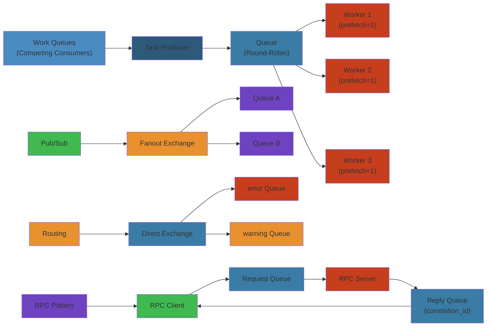

# 🐇 RabbitMQ Patterns — Complete Deep Dive

**Related**: [RabbitMQ Basics](/10-messaging/rabbitmq/01-rabbitmq-basics.md) · [Enterprise Integration Patterns](https://www.enterpriseintegrationpatterns.com/) · [SNS & SQS Patterns](/10-messaging/sns-sqs/02-sns-sqs-patterns.md)

---




## Table of Contents


- [Work Queues (Competing Consumers)](#-work-queues-competing-consumers)
- [Pub/Sub with Fanout](#-pubsub-with-fanout)
- [Routing with Direct Exchange](#-routing-with-direct-exchange)
- [Topic-Based Subscriptions](#-topic-based-subscriptions)
- [RPC Pattern](#-rpc-pattern)
- [Scatter-Gather](#-scatter-gather)
- [Routing Slip](#-routing-slip)
- [Wire Tap](#-wire-tap)
- [Message Sequencer](#-message-sequencer)
- [Idempotent Receiver](#-idempotent-receiver)
- [Reliable Delivery](#-reliable-delivery)
- [Saga Orchestration](#-saga-orchestration)
- [Retry with DLX + TTL](#-retry-with-dlx--ttl)
- [Simplest Mental Model](#-simplest-mental-model)

---

## 🧭 Work Queues (Competing Consumers)


```text
┌──────────────────────────────────────────────────────────────────┐
│  Work Queue = distribute tasks across workers                    │
│                                                                   │
│       ┌──────────┐                                               │
│       │ Producer │                                               │
│       └────┬─────┘                                               │
│            │                                                      │
│            ▼                                                      │
│     ┌─────────────┐                                              │
│     │ task_queue  │                                              │
│     │  [msg][msg] │  ← messages sit until consumed               │
│     └──────┬──────┘                                              │
│         ┌──┴──┐                                                  │
│         ▼     ▼                                                  │
│    ┌──────┐ ┌──────┐                                             │
│    │Worker│ │Worker│  ← each gets round-robin                     │
│    │  1   │ │  2   │                                              │
│    └──────┘ └──────┘                                             │
│                                                                   │
│  Key: prefetch_count=1 for fair dispatch                          │
└──────────────────────────────────────────────────────────────────┘
```

```python
# Producer
channel.queue_declare(queue="work_queue", durable=True)
channel.basic_publish(
    exchange="",
    routing_key="work_queue",
    body=task,
    properties=pika.BasicProperties(delivery_mode=2),
)

# Consumer (fair dispatch)
channel.basic_qos(prefetch_count=1)
channel.basic_consume(queue="work_queue", on_message_callback=callback, auto_ack=False)
```

---

## 🧭 Pub/Sub with Fanout


```text
┌──────────────────────────────────────────────────────────────────┐
│  Fanout Exchange — broadcast every message to ALL queues         │
│                                                                   │
│       ┌──────────┐                                               │
│       │ Producer │                                               │
│       └────┬─────┘                                               │
│            │ publish("logs", "")                                  │
│            ▼                                                      │
│    ┌──────────────┐                                              │
│    │  fanout_logs │  ← exchange                                  │
│    └──┬───┬───┬───┘                                              │
│       │   │   │                                                  │
│       ▼   ▼   ▼                                                  │
│   ┌────┐┌────┐┌────┐                                            │
│   │ Q1 ││ Q2 ││ Q3 │  ← each consumer gets its own queue         │
│   └──┬─┘└──┬─┘└──┬─┘                                            │
│      ▼     ▼     ▼                                               │
│     C1    C2    C3                                               │
│                                                                   │
│  Use: event broadcast, log distribution, cache invalidation      │
└──────────────────────────────────────────────────────────────────┘
```

```python
# Producer
channel.exchange_declare(exchange="broadcast", exchange_type="fanout")
channel.basic_publish(exchange="broadcast", routing_key="", body=msg)

# Consumer — each gets an exclusive queue
result = channel.queue_declare(queue="", exclusive=True)
queue_name = result.method.queue
channel.queue_bind(queue=queue_name, exchange="broadcast")
channel.basic_consume(queue=queue_name, on_message_callback=callback)
```

---

## 🧭 Routing with Direct Exchange


```text
┌──────────────────────────────────────────────────────────────────┐
│  Direct Exchange — route based on exact routing key match        │
│                                                                   │
│       ┌────────────┐                                             │
│       │ Producer A │    │ Producer B                             │
│       └─────┬──────┘    └────┬───────┘                           │
│             │ "error"        │ "info"                             │
│             ▼                ▼                                    │
│       ┌────────────────────────┐                                 │
│       │   direct_exchange     │                                 │
│       └───┬────────────┬──────┘                                 │
│           │ "error"    │ "info"                                  │
│           ▼            ▼                                         │
│       ┌──────┐    ┌────────┐                                    │
│       │errors│    │  logs  │                                     │
│       └──┬───┘    └───┬────┘                                    │
│          ▼            ▼                                          │
│         C_error      C_all                                      │
└──────────────────────────────────────────────────────────────────┘
```

```python
# Bind queues with routing keys
channel.queue_bind(queue="errors", exchange="direct_logs", routing_key="error")
channel.queue_bind(queue="all", exchange="direct_logs", routing_key="info")
channel.queue_bind(queue="all", exchange="direct_logs", routing_key="error")
```

---

## 🧭 Topic-Based Subscriptions


```text
┌──────────────────────────────────────────────────────────────────┐
│  Topic patterns:                                                 │
│    * (star)  = exactly one word                                  │
│    # (hash)  = zero or more words                                │
│                                                                   │
│  Routing key: "log.<severity>.<service>"                         │
│  ┌──────────────┬──────────────────────┐                        │
│  │ Pattern      │ Matches             │                         │
│  ├──────────────┼──────────────────────┤                        │
│  │ log.*.auth   │ log.error.auth      │                         │
│  │ log.#        │ log.error.auth.web  │                         │
│  │ log.error.*  │ log.error.web       │                         │
│  │ #.auth       │ log.info.auth       │                         │
│  │ log.*.*      │ log.error.web       │                         │
│  │ log.critical │ (exact match only)  │                         │
│  └──────────────┴──────────────────────┘                        │
└──────────────────────────────────────────────────────────────────┘
```

```python
channel.exchange_declare(exchange="topic_logs", exchange_type="topic")
channel.queue_bind(queue="auth_q", exchange="topic_logs", routing_key="#.auth")
channel.queue_bind(queue="error_q", exchange="topic_logs", routing_key="*.error.*")
channel.basic_publish(exchange="topic_logs", routing_key="log.error.auth", body=msg)
```

---

## 🧭 RPC Pattern


```text
┌──────────────────────────────────────────────────────────────────┐
│  RPC: Client sends request, waits for reply                      │
│                                                                   │
│  Client                    Server                                │
│    │                         │                                   │
│    │─── request ──────────► │                                   │
│    │  (routing_key=rpc_queue)│                                   │
│    │  reply_to=amq.gen-xxx  │                                   │
│    │  correlation_id=uuid   │                                   │
│    │                         │── process ──►                    │
│    │◄── response ────────── │                                   │
│    │  (routing_key=reply_to)│                                   │
│    │  correlation_id=uuid   │                                   │
│    │                         │                                   │
│  Properties:                                                     │
│  - reply_to: callback queue name                                 │
│  - correlation_id: match response to request                     │
└──────────────────────────────────────────────────────────────────┘
```

```python
# Server
channel.queue_declare(queue="rpc_queue")
channel.basic_qos(prefetch_count=1)

def on_request(ch, method, props, body):
    response = process(body)
    ch.basic_publish(
        exchange="",
        routing_key=props.reply_to,
        properties=pika.BasicProperties(correlation_id=props.correlation_id),
        body=response,
    )
    ch.basic_ack(delivery_tag=method.delivery_tag)

# Client
class RPCClient:
    def __init__(self):
        self.response = None
        self.corr_id = None
        self.callback_queue = channel.queue_declare(queue="", exclusive=True).method.queue

    def call(self, request):
        self.corr_id = str(uuid.uuid4())
        channel.basic_publish(
            exchange="",
            routing_key="rpc_queue",
            properties=pika.BasicProperties(
                reply_to=self.callback_queue,
                correlation_id=self.corr_id,
            ),
            body=request,
        )
        # Wait for response
        while self.response is None:
            connection.process_data_events()
        return self.response
```

---

## 🧭 Scatter-Gather


```text
┌──────────────────────────────────────────────────────────────────┐
│  Scatter-Gather: request from multiple services, aggregate       │
│                                                                   │
│       ┌────────────────┐                                         │
│       │  Aggregator    │                                         │
│       └───┬───┬───┬────┘                                         │
│           │   │   │                                              │
│     ┌─────┘   │   └─────┐                                       │
│     ▼         ▼         ▼                                        │
│  ┌──────┐ ┌──────┐ ┌──────┐                                     │
│  │Svc A │ │Svc B │ │Svc C │                                     │
│  └──────┘ └──────┘ └──────┘                                     │
│                                                                   │
│  Implementation:                                                  │
│  1. Fanout exchange → multiple queues                            │
│  2. Each consumer replies to shared response queue               │
│  3. Aggregator collects responses, waits for all/timeout         │
└──────────────────────────────────────────────────────────────────┘
```

```python
# Aggregator — collects N responses or timeout
class Aggregator:
    def __init__(self, expected=3, timeout=5.0):
        self.responses = {}
        self.expected = expected
        self.timeout = timeout

    def collect(self):
        start = time.time()
        while len(self.responses) < self.expected:
            if time.time() - start > self.timeout:
                break
            connection.process_data_events(time_limit=0.1)
        return self.responses
```

---

## 🧭 Routing Slip


```text
┌──────────────────────────────────────────────────────────────────┐
│  Routing Slip: message visits services in sequence               │
│                                                                   │
│  Header: ["validate", "enrich", "persist", "notify"]             │
│                                                                   │
│  ┌──► validate_q ──► enrich_q ──► persist_q ──► notify_q        │
│  │     │              │              │             │             │
│  │     ▼              ▼              ▼             ▼             │
│  │  validate()     enrich()      persist()     notify()          │
│  │     │              │              │             │             │
│  └─────┴──────────────┴──────────────┴─────────────┘             │
│         ← each step re-publishes with updated slip               │
│                                                                   │
│  Each consumer:                                                   │
│  1. Process current step                                          │
│  2. Advance routing slip header                                   │
│  3. Re-publish to next step's exchange                            │
└──────────────────────────────────────────────────────────────────┘
```

---

## 🧭 Wire Tap


```text
┌──────────────────────────────────────────────────────────────────┐
│  Wire Tap: eavesdrop on messages without affecting flow          │
│                                                                   │
│  Producer ──► exchange ──┬──► main_queue ──► consumer            │
│                          │                                       │
│                          └──► audit_queue ──► auditor            │
│                                                                   │
│  Implementation: bind audit queue to the same exchange            │
│  with same routing key → audit queue gets a COPY                 │
└──────────────────────────────────────────────────────────────────┘
```

```python
# Tap into all messages on a topic exchange
channel.queue_bind(queue="audit", exchange="main_exchange", routing_key="#")
```

---

## 🧭 Message Sequencer


```text
┌──────────────────────────────────────────────────────────────────┐
│  Sequencer: split large message into ordered sequence           │
│                                                                   │
│  Input: 1MB file                                                │
│  Output: [chunk1 seq=1, chunk2 seq=2, ..., chunkN seq=N]       │
│                                                                   │
│  Header: sequence_id, sequence_number, sequence_total            │
│                                                                   │
│  Receiver reassembles using sequence_id                          │
└──────────────────────────────────────────────────────────────────┘
```

---

## 🧭 Idempotent Receiver


```python
# Idempotency — ensure exactly-once processing
class IdempotentConsumer:
    def __init__(self):
        self.processed = set()  # or Redis set with TTL

    def process(self, ch, method, properties, body):
        msg_id = properties.message_id or properties.headers.get("x-msg-id")

        if msg_id in self.processed:
            # Already processed — ack and skip
            ch.basic_ack(delivery_tag=method.delivery_tag)
            return

        try:
            handle_message(body)
            self.processed.add(msg_id)
            ch.basic_ack(delivery_tag=method.delivery_tag)
        except Exception:
            ch.basic_nack(delivery_tag=method.delivery_tag, requeue=False)
```

---

## 🧭 Reliable Delivery


```text
┌──────────────────────────────────────────────────────────────────┐
│  End-to-end reliable delivery:                                   │
│                                                                   │
│  Producer side:                                                   │
│  1. Publisher confirms (wait for ack)                            │
│  2. Retry on nack/timeout                                        │
│  3. Mandatory flag (return unroutable)                           │
│                                                                   │
│  Broker side:                                                     │
│  4. Persistent messages (delivery_mode=2)                        │
│  5. Quorum queues (Raft replication)                             │
│  6. Mirrored queues (classic HA)                                 │
│                                                                   │
│  Consumer side:                                                   │
│  7. Manual ack (auto_ack=False)                                  │
│  8. prefetch_count=1 for fair dispatch                           │
│  9. Idempotent processing                                        │
│ 10. DLX for poison messages                                      │
│                                                                   │
│  Result: at-least-once delivery                                  │
└──────────────────────────────────────────────────────────────────┘
```

---

## 🧭 Saga Orchestration


```text
┌──────────────────────────────────────────────────────────────────┐
│  Saga: distributed transaction with compensation (rollback)      │
│                                                                   │
│  ┌────────────┐     ┌────────────┐     ┌────────────┐           │
│  │  Orchestr  │────►│  Order Svc │────►│ Payment Svc │           │
│  │    ator    │     └─────┬──────┘     └──────┬──────┘           │
│  │  (Queue)   │           │ failed            │ failed           │
│  └────────────┘           ▼                    ▼                  │
│                      ┌────────┐          ┌──────────┐           │
│                      │Compensa│          │ Compensa │           │
│                      │  te    │          │   te     │           │
│                      │ Order  │          │ Payment  │           │
│                      └────────┘          └──────────┘           │
│                                                                   │
│  Each step publishes success/failure to orchestrator queue       │
│  On failure → orchestrator sends compensation commands           │
└──────────────────────────────────────────────────────────────────┘
```

```python
# Orchestrator consumer
def handle_step_response(ch, method, properties, body):
    data = json.loads(body)
    saga_id = properties.correlation_id

    if data["status"] == "failed":
        # Send compensation for all completed steps
        for step in reversed(saga_state[saga_id]["completed"]):
            publish_compensation(step)
    elif data["status"] == "success":
        saga_state[saga_id]["completed"].append(data["step"])
        # Publish next step
        next_step = get_next_step(saga_id)
        if next_step:
            publish_command(next_step, saga_id)
        else:
            saga_state[saga_id]["status"] = "completed"
```

---

## 🧭 Retry with DLX + TTL


```text
┌──────────────────────────────────────────────────────────────────┐
│  Retry pipeline with exponential backoff                         │
│                                                                   │
│  ┌──────────┐     ┌──────────────┐     ┌──────────────┐         │
│  │ main_q   │────►│   retry_q    │────►│   retry_q2   │──...    │
│  │ TTL: 30s │     │   TTL: 60s   │     │   TTL: 120s  │         │
│  │ DLX: dlx │     │   DLX: dlx2  │     │   DLX: final │         │
│  └────┬─────┘     └──────┬───────┘     └──────┬───────┘         │
│       │                  │                     │                  │
│       ▼                  ▼                     ▼                  │
│   main_consumer      retry_consumer         retry_consumer2      │
│   (on nack, pub      (on timeout,           (on timeout,         │
│    to retry_q)        auto-return to         auto-return to       │
│                       main via DLX)          main via DLX)       │
│                                                                   │
│  After max retries → dead letter queue (poison messages)         │
└──────────────────────────────────────────────────────────────────┘
```

```python
# Step 1: decorator for retry with DLX
def with_retry(max_retries=3, dlx="dlx", retry_ttls=[30_000, 60_000, 120_000]):
    def decorator(func):
        def wrapper(ch, method, properties, body):
            headers = properties.headers or {}
            retry_count = headers.get("x-retry-count", 0)

            try:
                func(body)
                ch.basic_ack(delivery_tag=method.delivery_tag)
            except RetryableError:
                if retry_count >= max_retries:
                    ch.basic_nack(delivery_tag=method.delivery_tag, requeue=False)
                else:
                    ttl = retry_ttls[retry_count]
                    new_headers = {**headers, "x-retry-count": retry_count + 1}
                    ch.basic_publish(
                        exchange="",
                        routing_key=f"retry_q_{retry_count}",
                        body=body,
                        properties=pika.BasicProperties(
                            expiration=str(ttl),
                            headers=new_headers,
                            delivery_mode=2,
                        ),
                    )
                    ch.basic_ack(delivery_tag=method.delivery_tag)
        return wrapper
    return decorator
```

---

## 🧭 Simplest Mental Model


```text
RabbitMQ patterns = routing logic for message flows

┌──────────────────────────────────────────────────────────────────┐
│  Core insight:                                                   │
│  Patterns are combinations of exchanges + queues + TTL + DLX     │
│                                                                   │
│  Pattern         = Exchange Type + Queues + Config               │
│  ─────────────────────────────────────────────────────────────    │
│  Work Queue      = Direct exchange + 1 queue + prefetch=1        │
│  Pub/Sub         = Fanout exchange + N exclusive queues          │
│  Routing         = Direct exchange + N queues + bindings         │
│  Topics          = Topic exchange + pattern bindings             │
│  RPC             = 2 queues (request + reply) + correlation_id    │
│  Retry           = N queues + TTL + DLX chain                   │
│  Saga            = Orchestrator queue + event queues             │
│                                                                   │
│  Every pattern is built from:                                    │
│  1 exchange + N queues + bindings + message headers/properties   │
└──────────────────────────────────────────────────────────────────┘
```


## Practical Example


See code examples above for practical usage patterns.