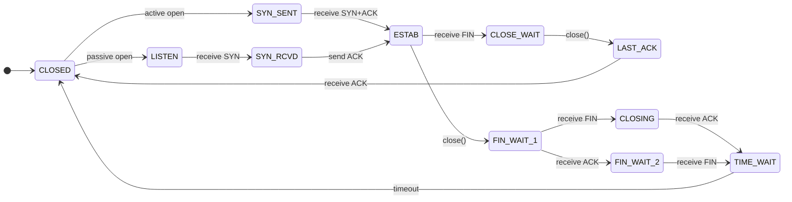
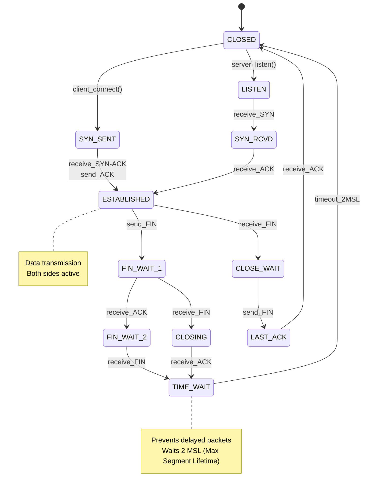

# TCP Connection State Machine — Interactive Guide

> **Run the live simulator**: [tcp-state-machine.html](/11-networking/tcp-state-machine.html) — step through SYN, SYN-ACK, ACK handshake and FIN teardown interactively.

## Overview





Visual walkthrough of TCP three-way handshake, data transmission, and connection teardown.

## The 11 TCP States


```
┌─────────────────────────────────────────────────────────────┐
│                                                             │
│  LISTEN ──┐                                     ┌─ CLOSED  │
│           │                                     │           │
│           ├─ SYN received ─→ SYN_RCVD ────────┤            │
│           │                     ↓              │            │
│           └─ SYN sent ──→ SYN_SENT ────────┐   │            │
│                              ↓             │   │            │
│                          ESTABLISHED ──────┼───┤            │
│                          ↓       ↓         │   │            │
│                      FIN_WAIT_1 │         │   │            │
│                          ↓       │         │   │            │
│                      CLOSING ←───┘         │   │            │
│                          ↓                 │   │            │
│                      FIN_WAIT_2            │   │            │
│                          ↓                 │   │            │
│                      TIME_WAIT ────────────┘   │            │
│                          ↓                     │            │
│                        CLOSED ←────────────────┘            │
│                                                             │
└─────────────────────────────────────────────────────────────┘

Server states:     LISTEN → SYN_RCVD → ESTABLISHED
Client states:     SYN_SENT → ESTABLISHED
```

---

## Scenario 1: Normal Three-Way Handshake (Opening)


**Goal**: Establish bidirectional communication.

### Step-by-Step


1. **Client initiates** by sending SYN packet with random sequence number (ISS), transitions to SYN_SENT state
2. **Server listens** in LISTEN state, receives SYN, transitions to SYN_RCVD, sends back SYN-ACK with its own ISS
3. **Acknowledgment** in SYN-ACK: server acknowledges client's sequence number + 1
4. **Client acknowledges** by sending ACK with server's sequence number + 1, transitions to ESTABLISHED
5. **Server confirms** receipt of ACK, transitions to ESTABLISHED
6. **Bidirectional channel** is now open — both parties agreed on sequence numbers and window sizes

### Code Example


```python
# TCP handshake state machine simulation
from enum import Enum
from dataclasses import dataclass
from typing import Optional

class TCPState(Enum):
    CLOSED = "CLOSED"
    LISTEN = "LISTEN"
    SYN_SENT = "SYN_SENT"
    SYN_RCVD = "SYN_RCVD"
    ESTABLISHED = "ESTABLISHED"

@dataclass
class TCPPacket:
    seq: int
    ack: Optional[int]
    flags: str  # "SYN", "ACK", "SYN-ACK", etc.
    
class TCPConnection:
    def __init__(self, is_server=False):
        self.is_server = is_server
        self.state = TCPState.LISTEN if is_server else TCPState.CLOSED
        self.send_seq = None
        self.recv_ack = None
    
    def initiate_connection(self):
        """Client initiates three-way handshake."""
        if not self.is_server and self.state == TCPState.CLOSED:
            self.send_seq = 1000  # Random ISS
            self.state = TCPState.SYN_SENT
            return TCPPacket(seq=self.send_seq, ack=None, flags="SYN")
    
    def receive_syn(self, packet: TCPPacket):
        """Server receives SYN."""
        if self.is_server and self.state == TCPState.LISTEN:
            self.recv_ack = packet.seq + 1
            self.send_seq = 2000  # Random ISS
            self.state = TCPState.SYN_RCVD
            return TCPPacket(seq=self.send_seq, ack=self.recv_ack, flags="SYN-ACK")
    
    def receive_syn_ack(self, packet: TCPPacket):
        """Client receives SYN-ACK."""
        if not self.is_server and self.state == TCPState.SYN_SENT:
            self.recv_ack = packet.seq + 1
            self.state = TCPState.ESTABLISHED
            return TCPPacket(seq=packet.ack, ack=self.recv_ack, flags="ACK")
    
    def receive_ack(self, packet: TCPPacket):
        """Server receives ACK."""
        if self.is_server and self.state == TCPState.SYN_RCVD:
            self.state = TCPState.ESTABLISHED

# Simulate three-way handshake
client = TCPConnection(is_server=False)
server = TCPConnection(is_server=True)

# Step 1: Client sends SYN
syn_packet = client.initiate_connection()
print(f"Client→Server: SYN(seq={syn_packet.seq})")

# Step 2: Server receives SYN, sends SYN-ACK
syn_ack = server.receive_syn(syn_packet)
print(f"Server→Client: SYN-ACK(seq={syn_ack.seq}, ack={syn_ack.ack})")

# Step 3: Client receives SYN-ACK, sends ACK
ack_packet = client.receive_syn_ack(syn_ack)
print(f"Client→Server: ACK(seq={ack_packet.seq}, ack={ack_packet.ack})")

# Step 4: Server receives ACK
server.receive_ack(ack_packet)

print(f"\nFinal states:")
print(f"Client: {client.state.value}")
print(f"Server: {server.state.value}")
```

### Real-World Scenario


During the 2016 Dyn DDoS attack affecting Twitter, GitHub, and Netflix, attackers exploited TCP's vulnerability by sending millions of SYN packets without completing handshakes, exhausting server SYN queues. The attacks revealed the importance of SYN cookies (cookies encoded in the ISS instead of storing all half-open connections), which became essential for DDoS mitigation. Modern systems now implement TCP SYN rate limiting and automatic backoff to prevent this attack vector.

### State Transition Diagram




---

```
CLIENT                              SERVER
  │                                   │
  ├─ SYN_SENT ──────────────────────→ LISTEN
  │  (seq=1000)                        │
  │                                 SYN_RCVD
  │                                    │
  │ ←────── SYN-ACK ──────────────────┤
  │  (seq=2000, ack=1001)              │
  │                                    │
  ├─ ESTABLISHED ────────── ACK ─────→ ESTABLISHED
     (seq=1001, ack=2001)              (seq=2001, ack=1001)
```

**Detailed timeline:**

```
T=0ms    CLIENT initiates connection
         STATE: SYN_SENT
         ACTION: Send SYN packet
           - Sequence number: 1000 (random, ISS)
           - Flag: SYN
           - Window size: 65535 (recv buffer size)

T=5ms    SERVER receives SYN
         STATE: LISTEN → SYN_RCVD
         ACTION: Send SYN-ACK response
           - Sequence number: 2000 (random ISS)
           - Acknowledgment: 1000 + 1 = 1001 (client's next expected seq)
           - Flag: SYN, ACK
           - Window size: 65535

T=10ms   CLIENT receives SYN-ACK
         STATE: SYN_SENT → ESTABLISHED
         ACTION: Send ACK
           - Sequence number: 1001 (next after SYN)
           - Acknowledgment: 2000 + 1 = 2001 (server's next expected)
           - Flag: ACK
           - Can include payload data

T=15ms   SERVER receives ACK
         STATE: SYN_RCVD → ESTABLISHED
         Ready to send/receive data

RESULT: 3-way handshake complete
        Both sides synchronize sequence numbers
        Both sides open receive windows
```

**Why 3 ways?**
```
SYN:     Client → Server: "I exist, let's sync sequence numbers"
SYN-ACK: Server → Client: "I exist, I got your number, here's mine"
ACK:     Client → Server: "I got your number, let's start"

Not 2 ways, because:
- SYN alone: Server might not get ACK back (client unreachable)
- With 3 ways: Both sides confirm other side is listening
```

---

## Scenario 2: Data Exchange


**Setup**: Connection established (as above).

```
CLIENT [seq=1001]              SERVER [seq=2001]
  │                              │
  ├─ "Hello" (20 bytes) ────────→ ESTABLISHED
  │  seq=1001, ack=2001           │ (receives 20 bytes)
  │                               │
  │ ←────── ACK ──────────────────┤
  │         seq=2001, ack=1021    │ (ack = 1001 + 20)
  │                               │
  ├─ "World" (5 bytes) ──────────→ │
  │  seq=1021, ack=2001           │ (receives 5 bytes)
  │                               │
  │ ←─ "Got it" (6 bytes) ────────┤
  │   seq=2001, ack=1026          │
  │   (ack = 1021 + 5)            │
  │                               │
  ├─ ACK ────────────────────────→ │
     seq=1026, ack=2007
     (ack = 2001 + 6)
```

**Sequence number progression:**

```
Byte 1-20:   CLIENT sends at seq 1001
             SERVER acks with ack 1021 (1001 + 20)
             Next CLIENT send at seq 1021

Byte 21-25:  CLIENT sends at seq 1021
             SERVER acks with ack 1026 (1021 + 5)

Byte 2001-2006: SERVER sends at seq 2001
             CLIENT acks with ack 2007 (2001 + 6)
             Next SERVER send at seq 2007

Rule: Each byte consumed increments ack by 1
      Sequence number = cumulative bytes sent
      Ack number = cumulative bytes received + 1
```

**Sliding Window (Flow Control):**

```
SERVER announces "window=5000" in ACK
CLIENT can send up to 5000 bytes before waiting for next ACK

If CLIENT sends 10000 bytes:
  - First 5000 accepted
  - Next 5000 buffered by kernel (TCP_SEND_BUFFER)
  - Blocks application write() when buffer full
  - When SERVER acks, more data sent

This prevents sender from overwhelming receiver
```

---

## Scenario 3: Connection Close (Normal FIN-ACK)


**Goal**: Gracefully close both directions.

```
CLIENT                           SERVER
ESTABLISHED                      ESTABLISHED
  │                                │
  ├─ FIN ─────────────────────────→ FIN_WAIT_1
  │  (no more data to send)         │
  │                            CLOSE_WAIT
  │ ←───── ACK ──────────────────── FIN_WAIT_1
  │         seq=2007, ack=1026      │
  │                                 │
  ├─ FIN_WAIT_2                 LAST_ACK
  │                                 │
  │ ←───── FIN ────────────────────┤
  │  (server done sending)          │
  │                                 │
  ├─ TIME_WAIT ──── ACK ─────────→ CLOSED
  │  (wait 2×MSL)
  │
  └─ CLOSED
```

**Detailed timeline:**

```
T=100ms   APPLICATION calls close() on CLIENT socket
          STATE: ESTABLISHED → FIN_WAIT_1
          ACTION: Send FIN (seq=1026, ack=2007)
                   - FIN flag set
                   - seq incremented (FIN consumes 1 seq number)
          Meaning: "I have no more data. Closing my write side."

T=105ms   SERVER receives FIN
          STATE: ESTABLISHED → CLOSE_WAIT
          ACTION: Send ACK (seq=2007, ack=1027)
          APPLICATION still can:
            - Receive already-buffered data
            - Call close() to finish shutdown

T=110ms   CLIENT receives ACK of FIN
          STATE: FIN_WAIT_1 → FIN_WAIT_2
          ACTION: Wait for server's FIN
          Meaning: "Server acknowledged my FIN. Waiting for server to close."

T=115ms   SERVER application calls close()
          STATE: CLOSE_WAIT → LAST_ACK
          ACTION: Send FIN (seq=2007, ack=1027)
          Meaning: "I'm also done. Closing read side."

T=120ms   CLIENT receives FIN
          STATE: FIN_WAIT_2 → TIME_WAIT
          ACTION: Send ACK (seq=1027, ack=2008)
          Special: Enter TIME_WAIT (wait 2×MSL = 120 seconds)
          Reason: Stale FIN packets might arrive late

T=125ms   SERVER receives ACK of FIN
          STATE: LAST_ACK → CLOSED
          Connection fully closed on server

T=120s    CLIENT's TIME_WAIT expires
          STATE: TIME_WAIT → CLOSED
          Now port can be reused (if SO_REUSEADDR)
```

**Why TIME_WAIT?**

```
Without TIME_WAIT:
1. CLIENT closes connection
2. New client opens same (IP, port) combination
3. Old FIN packet delayed by network arrives
4. New connection mistakenly closes
5. Data corruption

With TIME_WAIT (2×MSL = ~120s):
- Stale packets are dropped
- Port blocked from reuse for 120 seconds
- New connections guaranteed clean state

MSL = Maximum Segment Lifetime = 60 seconds (IPv4)
2×MSL = 120 seconds (time for packet to traverse network twice)
```

---

## Scenario 4: Abrupt Close (RST)


```
CLIENT                           SERVER
ESTABLISHED                      ESTABLISHED
  │                                │
  ├─ RST ─────────────────────────→ CLOSED
  │  (force close, no handshake)    │
  │                                 │
  └─ CLOSED
```

**When does RST occur?**

```
1. Server receives data on closed port
   → RST sent immediately
   
2. Connection timeout
   → TCP retries, then sends RST
   
3. SO_LINGER = 0 in socket options
   → close() sends RST instead of FIN
   
4. Memory pressure
   → Kernel force-closes connections
```

**RST vs FIN:**

```
FIN: Graceful close
     - Both sides can finish sending buffered data
     - Guarantees no data loss
     - Slower (2×RTT for handshake)

RST: Abrupt close
     - Immediately terminate
     - Buffered data might be lost
     - Faster (1 packet)
     - Used for errors/timeouts
```

---

## Scenario 5: Simultaneous Close


```
CLIENT                           SERVER
ESTABLISHED                      ESTABLISHED
  │                                │
  ├─ FIN ─────────────────────────→ (packet in flight)
  │                                 │
  ← (packet in flight) ─── FIN ────┤
  │                                 │
  ├─ FIN_WAIT_1                     │ ← FIN_WAIT_1
  │                                 │
  │ ←───── ACK ──────────────────── (receives FIN)
  │         seq=2007, ack=1027      │
  │                                 │
  ├─ CLOSING ←── ACK ──────────────┤
  │  (waits for server's ACK)       │ ← FIN_WAIT_2
  │                                 │
  │ ←───── ACK ──────────────────── (receives ACK)
  │                                 │
  ├─ TIME_WAIT                      ├─ TIME_WAIT
  │  (wait 2×MSL)                   │
```

**Key difference**: CLOSING state (not FIN_WAIT_2) because FINs crossed.

---

## Common Issues & Solutions


### Issue 1: Address Already in Use (EADDRINUSE)


**Symptom**: Can't restart server. "Port 8080 already in use."

**Cause**: Previous connection in TIME_WAIT.

**Solution:**
```c
int opt = 1;
setsockopt(fd, SOL_SOCKET, SO_REUSEADDR, &opt, sizeof(opt));
bind(fd, (struct sockaddr*)&addr, sizeof(addr));
```

Allows binding to port in TIME_WAIT (safe because OS tracks old connections internally).

### Issue 2: Connection Stuck in CLOSE_WAIT


**Symptom**: `netstat` shows many CLOSE_WAIT connections. Server memory leaks.

**Cause**: SERVER received FIN but application didn't call close().

**Solution:**
```python
# Always call close() in finally block
try:
    socket.send(data)
finally:
    socket.close()  # ← Must do this
```

### Issue 3: FIN_WAIT_2 Timeout


**Symptom**: Client waits forever for server's FIN.

**Cause**: Server crashed, didn't close connection.

**Solution**: Kernel timeout (default 60 seconds in most OS).

```c
setsockopt(fd, IPPROTO_TCP, TCP_LINGER2, &seconds, sizeof(seconds));
// Force close if FIN_WAIT_2 exceeds timeout
```

### Issue 4: Half-Closed Connection


```
CLIENT                      SERVER
ESTABLISHED                 ESTABLISHED
  │                           │
  ├─ FIN ───────────────────→ CLOSE_WAIT
  │                           │ (Server can still send)
  │ ←──── DATA ──────────────┤
  │ ←──── FIN ────────────────┤ 
  │                        LAST_ACK
```

**Use case**: Half-duplex protocols where server sends reply after client closes write side.

---

## TCP Flags Explained


| Flag | Meaning | Usage |
|------|---------|-------|
| SYN | Synchronize | Start connection, send initial sequence |
| ACK | Acknowledge | Confirm received data, ack number valid |
| FIN | Finish | Graceful close of one direction |
| RST | Reset | Force close, error condition |
| PSH | Push | Don't buffer, deliver immediately |
| URG | Urgent | Urgent data (rarely used) |

---

## Interview Questions


### Q1: Why does TCP use sequence numbers instead of just byte counts?


**Answer**: Sequence numbers handle:
- **Out-of-order packets**: Can reorder using seq numbers
- **Retransmissions**: Can identify duplicates (same seq number)
- **Wrapping**: Seq numbers wrap (32-bit), but duplicate detection works because "same seq number means sent in different lifetime"

Without seq numbers, receiver couldn't distinguish "old retransmit" from "new data."

### Q2: What's the purpose of TIME_WAIT?


**Answer**: Two purposes:
1. **Stale packet cleanup**: FIN/data packets delayed by network drop off
2. **Port reuse prevention**: Old connection fully cleaned before reusing port

Without TIME_WAIT: delayed FIN from old connection closes new connection.

### Q3: When is FIN-ACK exchange safe?


**Answer**: When both sides have:
1. Sent all data (FIN sent)
2. Received all data (ACK'd all ack numbers)
3. Received FIN (responded with ACK)

After both sides confirm, state machine reached CLOSED safely.

### Q4: What happens if server doesn't call close() after receiving FIN?


**Answer**: Server is in CLOSE_WAIT forever (leak).

Meanwhile:
- Client: FIN_WAIT_2 → timeout (usually 60s) → CLOSED
- Server: CLOSE_WAIT forever (until process killed)

Fix: Always pair recv FIN with close() call.

---

## Real-World TCP Tuning


```bash
# Linux TCP parameters
net.ipv4.tcp_fin_timeout = 60              # FIN_WAIT_2 timeout
net.ipv4.tcp_tw_reuse = 1                  # Reuse TIME_WAIT sockets
net.core.somaxconn = 4096                  # Listen queue size
net.ipv4.tcp_max_syn_backlog = 4096        # SYN queue size

# Application level (Python socket)
socket.setsockopt(SOL_SOCKET, SO_REUSEADDR, 1)
socket.setsockopt(IPPROTO_TCP, TCP_NODELAY, 1)  # Disable Nagle
socket.settimeout(30)  # Read timeout
```

---

## Key Takeaways


1. **3-way handshake**: Synchronize sequence numbers bidirectionally
2. **Sequence numbers**: Enable reliable, in-order delivery
3. **FIN-ACK**: Graceful close, both sides confirm
4. **TIME_WAIT**: Protect against stale packets
5. **RST**: Force close (error recovery)

**Real-world**: Every HTTP request, SSH session, database connection uses this state machine.

## Related

- [Cap Consistency](/09-distributed-systems/01-cap-consistency.md)
- [Consensus Replication](/09-distributed-systems/01-consensus-replication.md)
- [Consensus Raft](/09-distributed-systems/02-consensus-raft.md)
- [Distributed Transactions](/09-distributed-systems/02-distributed-transactions.md)
- [Distributed Caching](/09-distributed-systems/03-distributed-caching.md)

---

## Interactive Components

### TCP State Transitions

<div style="padding:16px;background:#0b0e14;border:1px solid #1e2a3a;border-radius:8px">
  <style>.state-machine-title{color:#00d4ff;font-family:monospace;font-size:14px;font-weight:bold;margin-bottom:16px}.state-demo{text-align:center}.state-display{font-size:18px;font-family:monospace;padding:16px;border-radius:4px;margin:16px 0;color:#0b0e14;font-weight:bold;min-height:50px;display:flex;align-items:center;justify-content:center;border:2px solid currentColor}.state-listen{background:#9333ea;border-color:#7e22ce}.state-syn{background:#60a5fa;border-color:#3b82f6}.state-established{background:#34d399;border-color:#22c55e}.state-closing{background:#fbbf24;border-color:#f59e0b}.state-wait{background:#f87171;border-color:#dc2626}.state-buttons{display:flex;gap:8px;justify-content:center;flex-wrap:wrap;margin-top:16px}.state-button{padding:8px 16px;border:1px solid #00d4ff;background:#1e3a5f;color:#00d4ff;border-radius:4px;cursor:pointer;font-family:monospace;font-size:11px;transition:all 0.2s}.state-button:hover{background:#2a5a8f;box-shadow:0 0 8px #00d4ff}</style>
  <div class="state-machine-title">TCP State Diagram</div>
  <div class="state-demo">
    <div class="state-display state-listen" id="state-display">LISTEN</div>
    <div class="state-buttons">
      <button class="state-button" onclick="setState('LISTEN')">LISTEN</button>
      <button class="state-button" onclick="setState('SYN_SENT')">SYN_SENT</button>
      <button class="state-button" onclick="setState('SYN_RCVD')">SYN_RCVD</button>
      <button class="state-button" onclick="setState('ESTABLISHED')">ESTAB</button>
      <button class="state-button" onclick="setState('FIN_WAIT_1')">FIN_WAIT_1</button>
      <button class="state-button" onclick="setState('FIN_WAIT_2')">FIN_WAIT_2</button>
      <button class="state-button" onclick="setState('TIME_WAIT')">TIME_WAIT</button>
      <button class="state-button" onclick="setState('CLOSED')">CLOSED</button>
    </div>
  </div>
  <script>
    const stateMap = {
      'LISTEN': { label: 'LISTEN', class: 'state-listen' },
      'SYN_SENT': { label: 'SYN_SENT', class: 'state-syn' },
      'SYN_RCVD': { label: 'SYN_RCVD', class: 'state-syn' },
      'ESTABLISHED': { label: 'ESTABLISHED', class: 'state-established' },
      'FIN_WAIT_1': { label: 'FIN_WAIT_1', class: 'state-closing' },
      'FIN_WAIT_2': { label: 'FIN_WAIT_2', class: 'state-closing' },
      'TIME_WAIT': { label: 'TIME_WAIT', class: 'state-wait' },
      'CLOSED': { label: 'CLOSED', class: 'state-listen' }
    };
    function setState(state) {
      const display = document.getElementById('state-display');
      const info = stateMap[state];
      display.textContent = info.label;
      display.className = 'state-display ' + info.class;
    }
  </script>
</div>

### Connection Lifecycle Flow

<div style="display:flex;flex-direction:column;align-items:center;gap:8px;padding:16px;background:#0b0e14;border:1px solid #1e2a3a;border-radius:8px">
  <style>@keyframes flow-pulse{0%,100%{opacity:.3;transform:translateY(0)}50%{opacity:1;transform:translateY(-2px)}}.flow-title{color:#00d4ff;font-family:monospace;font-size:14px;font-weight:bold;margin-bottom:8px;letter-spacing:1px}.flow-node{display:inline-block;padding:8px 16px;border-radius:4px;font-size:12px;font-family:monospace;color:#e3eaf0;background:#1e3a5f;border:1px solid #00d4ff}.flow-arrow{color:#00d4ff;font-size:16px;animation:flow-pulse 1.5s infinite;font-weight:bold}</style>
  <div class="flow-title">TCP Connection Lifecycle</div>
  <div style="display:flex;flex-direction:column;align-items:center;gap:6px">
    <div class="flow-node">Server: LISTEN</div>
    <div class="flow-arrow">↓ SYN</div>
    <div class="flow-node">Handshake: SYN_RCVD</div>
    <div class="flow-arrow">↓ SYN-ACK</div>
    <div class="flow-node">Client: SYN_SENT → ESTAB</div>
    <div class="flow-arrow">↓ ACK</div>
    <div class="flow-node">Both: ESTABLISHED</div>
    <div class="flow-arrow">↓ Data Transfer</div>
    <div class="flow-node">Either: FIN_WAIT_1</div>
    <div class="flow-arrow">↓ FIN-ACK</div>
    <div class="flow-node">Initiator: TIME_WAIT → CLOSED</div>
  </div>
</div>

### RTO (Retransmission Timeout) Tuning

<div style="padding:16px;background:#0b0e14;border:1px solid #1e2a3a;border-radius:8px">
  <style>.slider-title{color:#00d4ff;font-family:monospace;font-size:14px;font-weight:bold;margin-bottom:12px}.slider-container{display:flex;flex-direction:column;gap:12px}.slider-label{color:#e3eaf0;font-family:monospace;font-size:12px}.slider-wrapper{display:flex;align-items:center;gap:12px}.slider-input{flex:1;height:6px;border-radius:3px;background:#1e3a5f;outline:none;-webkit-appearance:none;appearance:none}.slider-input::-webkit-slider-thumb{-webkit-appearance:none;appearance:none;width:18px;height:18px;border-radius:50%;background:#00d4ff;cursor:pointer;box-shadow:0 0 8px #00d4ff;border:2px solid #0b0e14}.slider-input::-moz-range-thumb{width:18px;height:18px;border-radius:50%;background:#00d4ff;cursor:pointer;box-shadow:0 0 8px #00d4ff;border:2px solid #0b0e14}.slider-value{font-family:monospace;color:#34d399;min-width:80px;text-align:right;font-size:12px;font-weight:bold}</style>
  <div class="slider-title">Retransmission Timeout Configuration</div>
  <div class="slider-container">
    <label class="slider-label">Initial RTO (ms):</label>
    <div class="slider-wrapper">
      <input type="range" min="100" max="10000" value="1000" class="slider-input" id="rto-slider">
      <span class="slider-value" id="rto-value">1000 ms</span>
    </div>
  </div>
  <script>
    const slider = document.getElementById('rto-slider');
    const value = document.getElementById('rto-value');
    slider.addEventListener('input', (e) => { value.textContent = e.target.value + ' ms'; });
  </script>
</div>
- [Distributed Storage](/09-distributed-systems/03-distributed-storage.md)
