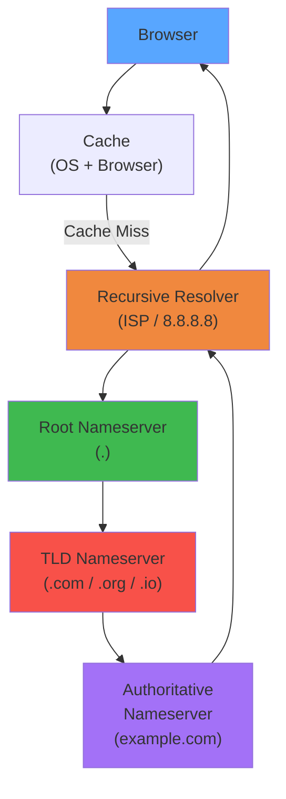
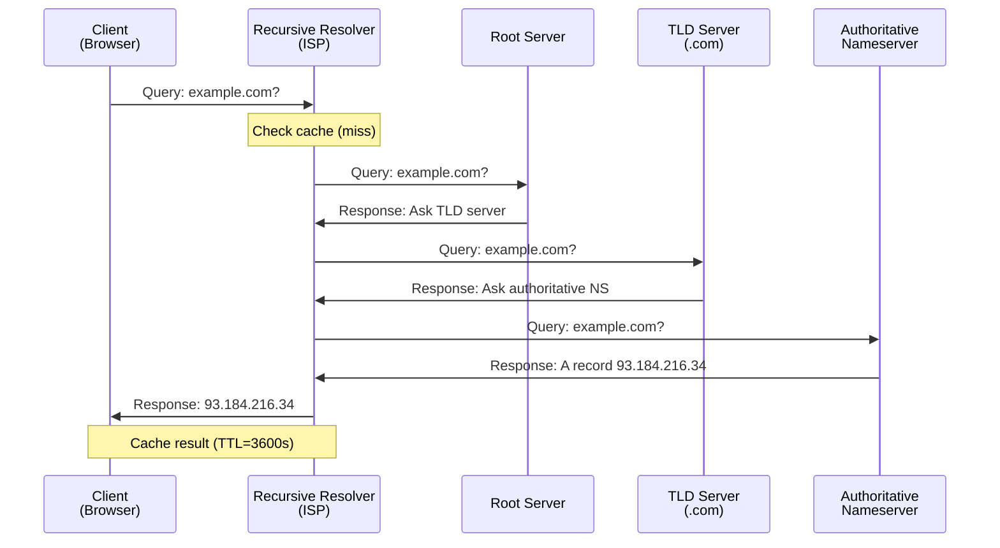

# DNS Resolution Flow — Interactive Animation

## Overview




Simulate the full DNS resolution flow: from browser to authoritative nameserver and back. Visualize recursive resolution, caching at multiple levels, TTL-based expiry, CNAME chasing, and failure handling.



**Learning Objectives:**
- Understand the hierarchical DNS resolution process
- See how caching at browser, OS, and resolver levels reduces latency
- Observe the role of each nameserver type (root, TLD, authoritative)
- Learn about different DNS record types (A, AAAA, CNAME, MX, NS)
- Understand TTL behavior and cache invalidation
- See how DNS failures are handled (NXDOMAIN, SERVFAIL, timeouts)

---

## Actors/Components


| Actor | Role |
|-------|------|
| **Browser** | Initiates DNS lookup for a hostname |
| **OS Cache** | Local stub resolver (mDNSResponder / systemd-resolved) |
| **Recursive Resolver** | ISP resolver or public (8.8.8.8, 1.1.1.1) |
| **Root Server** | 13 logical root zones (a-root through m-root) |
| **TLD Server** | Manages .com, .org, .net, .io, .gov, etc. |
| **Authoritative NS** | Serves the actual DNS records for a domain |
| **CNAME Target** | Alias resolution chain (one name to another to A record) |
| **Cache** | TTL-based storage at each resolver level |

---

## State Machine


### DNS Query State


```
         ┌──────────┐
         │  QUERY   │ ── Resolver receives lookup request
         └────┬─────┘
              │
         ┌────▼─────┐
         │ CACHE    │ ── Check cache for existing record
         └────┬─────┘
              │
      ┌───────┴───────┐
      ▼               ▼
 ┌─────────┐   ┌──────────┐
 │  HIT   │   │   MISS   │
 │ (return)│   └─────┬────┘
 └─────────┘         │
               ┌─────▼──────┐
               │ RECURSIVE  │ ── Start recursive resolution
               │ RESOLUTION │
               └─────┬──────┘
                     │
         ┌───────────┼───────────┐
         ▼           ▼           ▼
   ┌─────────┐ ┌─────────┐ ┌──────────┐
   │ROOT    │ │TLD     │ │AUTHORITY│
   │QUERY   │→│QUERY   │→│QUERY    │
   └─────────┘ └─────────┘ └──────────┘
                              │
                         ┌────▼────┐
                         │RESPONSE │
                         │(A/AAAA) │
                         └────┬────┘
                              │
                         ┌────▼────┐
                         │  CACHE  │
                         └────┬────┘
                              │
                         ┌────▼────┐
                         │ RETURN  │
                         └─────────┘
```

### Resolution failure states


```
                    ┌──────────┐
                    │  QUERY   │
                    └────┬─────┘
                         │
               ┌─────────┼─────────┐
               ▼         ▼         ▼
         ┌─────────┐ ┌───────┐ ┌────────┐
         │NXDOMAIN │ │SERVFAIL│ │TIMEOUT │
         │(domain  │ │(server │ │(no     │
         │doesn't  │ │error)  │ │resp.)  │
         │exist)   │ │        │ │        │
         └─────────┘ └───────┘ └────────┘
               │         │         │
               ▼         ▼         ▼
         ┌──────────────────────────────┐
         │   ERROR returned to client   │
         │   + cache NXDOMAIN (optional)│
         └──────────────────────────────┘
```

### Cache Entry State


```
         ┌──────────┐
         │ CREATED  │ ── Record added to cache
         └────┬─────┘
              │
         ┌────▼─────┐
         │ VALID    │ ── TTL > 0
         └────┬─────┘
              │
         ┌────▼─────┐
         │ STALE    │ ── TTL expired, but may serve stale
         └────┬─────┘
              │
         ┌────▼─────┐
         │ EVICTED  │ ── Removed from cache
         └──────────┘
```

---

## Animation Frames


### Frame 1: Browser to Cache Check


```
User types: "https://www.example.com"

Browser checks caches in order:

1. Browser DNS cache:
   Host            Record      TTL Rem.
   google.com      142.250.x   45s
   github.com      140.82.x    12s
   example.com     ---         MISS

2. OS Cache (stub resolver):
   Host            Record      TTL
   localhost       127.0.0.1   ∞
   example.com     ---         MISS

3. Check /etc/hosts:
   → example.com NOT FOUND

Result: CACHE MISS → Fire recursive DNS query to resolver (8.8.8.8)
```

### Frame 2: Resolver to Root Server


```
Recursive Resolver (8.8.8.8) starts resolution:

Resolver cache check:
  example.com: MISS
  .com NS: a.gtld-servers.net  (cached)
  . (root) NS: a.root-servers.net  (cached)

Step 1: Query root server for "www.example.com"

  Resolver → Root (a.root-servers.net)
  Q: "What is the A record for www.example.com?"
  
  Root doesn't know example.com
  Root responds:
    "I don't know. Ask the .com TLD.
     Here are .com nameservers:"
    Referral: NS → a.gtld-servers.net
    Glue:     172.217.5.10
  
  Result: Resolver caches .com delegation
          Proceeds to query .com TLD
```

### Frame 3: Resolver to TLD Server


```
Step 2: Query .com TLD server

  Resolver → TLD (a.gtld-servers.net)
  Q: "What is the A record for www.example.com?"
  
  TLD responds:
    "example.com is delegated to:
     NS → ns1.example.com
     NS → ns2.example.com
     Glue: 192.0.2.1, 192.0.2.2"
  
  Note: TLD server does NOT have the A record!
  It only knows who is AUTHORITATIVE for example.com
  This is called a "referral" or "delegation"
  
  Result: Resolver caches example.com NS records
          Proceeds to query ns1.example.com
```

### Frame 4: Resolver to Authoritative NS


```
Step 3: Query authoritative nameserver for example.com

  Resolver → Authoritative (ns1.example.com)
  Q: "What is the A record for www.example.com?"
  
  Authoritative responds:
    ANSWER SECTION:
    www.example.com. 86400 IN A 93.184.216.34
    
    AUTHORITY SECTION:
    example.com. 86400 IN NS ns1.example.com
    example.com. 86400 IN NS ns2.example.com
    
    ADDITIONAL SECTION:
    ns1.example.com. 86400 IN A 192.0.2.1
    ns2.example.com. 86400 IN A 192.0.2.2

  Resolver caches: www.example.com A=93.184.216.34 TTL=86400
  Resolver → Browser: 93.184.216.34
  
  Browser caches the result.
  Now connects to 93.184.216.34:443

Total steps: 4 network round trips (if nothing was cached)
Total latency: 4 * RTT (e.g., 4 * 20ms = 80ms)
```

### Frame 5: CNAME Resolution


```
Domain: "blog.example.com" is a CNAME

Step 1: Query root → TLD → authoritative for blog.example.com
  Authoritative responds:
    ANSWER: blog.example.com. 3600 IN CNAME example.com.
    
  CNAME means: "blog.example.com IS AN ALIAS for example.com"
  Resolver must RESTART resolution with the new target!

Step 2: Query authoritative for example.com
  Authoritative responds:
    ANSWER: example.com. 86400 IN A 93.184.216.34

Full chain:
  blog.example.com CNAME example.com A 93.184.216.34
                                          ↑
  Two separate resolution queries!       actual IP

Visual: dotted arrow from blog.example.com → example.com → IP
         Split path with CNAME node in between
```

---

## User Interactions


| Control | Type | Range/Options | Effect |
|---------|------|---------------|--------|
| **Domain name** | text input | any valid domain | Target for resolution |
| **Record type** | dropdown | A, AAAA, CNAME, MX, NS, TXT | Type of DNS record to query |
| **Clear caches** | button per level | Browser, OS, Resolver | Flush caches at selected levels |
| **TTL override** | slider | 0-86400s | Override TTL for records |
| **Recursive vs Iterative** | toggle | - | Mode of resolution |
| **Resolver IP** | dropdown | 8.8.8.8, 1.1.1.1, 9.9.9.9, Custom | Choose which recursive resolver |
| **Inject failure** | button | - | Simulate DNS failure at a level |
| **CNAME chain depth** | slider | 1-5 | Number of CNAME indirections |
| **Add CDN** | toggle | - | Show CDN-based DNS behavior |
| **DNSSEC** | toggle | on/off | Show DNSSEC validation flow |
| **Simulation speed** | slider | 0.1x-10x | Time scale |
| **Show packet details** | toggle | - | Show raw DNS packet fields |

---

## Visual Transitions


| Event | Visual Effect |
|-------|---------------|
| **Cache hit** | Green lightning bolt; record appears from cache box |
| **Cache miss** | Red X on cache; arrow launches to next resolver |
| **Query sent** | Blue packet animates from one server to another |
| **Response received** | Green packet returns; record highlighted |
| **Referral (NS delegation)** | Yellow arrow with "NS →" label |
| **Glue record** | Small attachment on packet showing NS IP |
| **CNAME resolution** | Packet splits; follows alias chain (dotted path) |
| **NXDOMAIN** | Red "404" overlay on domain; stop sign |
| **SERVFAIL** | Red "500" overlay; server icon shows error |
| **Timeout** | Hourglass animation; "Query lost" label |
| **TTL countdown** | Timer on cached entry decreasing in real time |
| **Cache eviction** | Record fades from cache; "EXPIRED" label |
| **DNSSEC validation** | Blue shield overlay; checkmark if valid |
| **Round-robin** | Multiple A records spin; one selected |

---

## Edge Cases


| Edge Case | Behavior |
|-----------|----------|
| **Empty non-terminal** | Domain has no records but subdomains exist |
| **CNAME at zone apex** | CNAME at root zone not allowed; must be A/AAAA |
| **CNAME chain loop** | a → b → a results in loop error |
| **DNS glue missing** | NS IP inside own zone; chicken-and-egg problem |
| **Delegation without NS** | Zone cut missing NS records; resolution fails |
| **Lame delegation** | NS points to servers that don't serve the zone |
| **Multiple A records** | Round-robin; different order each query |
| **ANY query** | Returns all record types (deprecated) |
| **Out-of-bailiwick NS** | NS for different domain; extra queries |
| **Wildcard DNS** | *.example.com matches any undefined subdomain |
| **Negative caching** | NXDOMAIN responses cached (SOA min TTL) |
| **DNS over HTTPS (DoH)** | Encrypted query; different flow path |
| **DNS64 + NAT64** | Synthetic AAAA from IPv4 mapping |

---

## Failure Modes


| Failure | Symptom | Recovery |
|---------|---------|----------|
| **Root server unreachable** | Stub resolver timeout | Use anycast; retry other root servers |
| **TLD server failure** | Recursive resolver fails to get delegation | Try secondary TLD servers |
| **Authoritative NS down** | SERVFAIL response | Retry with secondary NS |
| **DNSSEC validation failure** | SERVFAIL (even if A record valid) | Fix zone signing; check key rollover |
| **CNAME loop** | Resolution fails with loop detected | Fix DNS zone configuration |
| **NXDOMAIN** | Domain does not exist | Check typo; register domain |
| **DNS cache poisoning** | Wrong IP returned | Enable DNSSEC; use random source ports |
| **Resolver overload** | Timeout or SERVFAIL | Use alternative resolver |
| **Network fragmentation** | UDP response truncated (TC flag) | Retry over TCP |
| **EDNS buffer too small** | Response truncated | Increase EDNS buffer size |
| **Zone transfer failure** | Stale records on secondary NS | Fix AXFR/IXFR configuration |
| **TTL misconfiguration** | Very long TTL → slow updates; very short → resolver load | Balance TTL based on record stability |

---

## Metrics to Display


| Metric | Unit | Source |
|--------|------|--------|
| **Total resolution time** | ms | Query start → response received |
| **Steps taken** | count | Number of queries sent (root, TLD, auth) |
| **Cache hit ratio** | % | Cache hits / total queries |
| **Cache entries** | count | Records in each cache level |
| **TTL remaining** | seconds | Per-cached-record countdown |
| **Network RTT per hop** | ms | Time to each nameserver |
| **CNAME chain length** | count | Number of aliases followed |
| **Response size** | bytes | DNS packet size per response |
| **Query count per second** | qps | Recursive resolver throughput |
| **NXDOMAIN rate** | % | Rate of non-existent domain responses |
| **SERVFAIL rate** | % | Rate of server failure responses |
| **Resolved IPs** | list | Final A/AAAA records returned |
| **Resolver load** | % | Simulated resolver utilization |
| **DNSSEC status** | boolean/string | Valid / Invalid / Not signed |

---

## Scenario Walkthroughs


### Scenario 1: Fresh Resolution — No Cache


**Setup:** Browser never visited example.com, all caches empty, TTL=86400

```
Timeline:

T=0ms    User enters "https://www.example.com" in browser
         Browser initiates DNS lookup

T=1ms    Browser DNS cache: MISS
         OS cache: MISS
         → Forward to recursive resolver (8.8.8.8)

T=5ms    Resolver receives query for www.example.com
         Resolver cache: MISS (example.com not cached)
         
         Resolver starts recursion:
         Has root hints (. NS records) pre-configured

T=10ms   Query root server (a.root-servers.net):
         "What is the A record for www.example.com?"
         
         Root responds:
         "I don't know. Refer to .com TLD at a.gtld-servers.net"
         
         Latency: 20ms (RTT to root)

T=30ms   Query .com TLD server (a.gtld-servers.net):
         "What is the A record for www.example.com?"
         
         TLD responds:
         "example.com is delegated to ns1.example.com (192.0.2.1)"
         
         Latency: 20ms (RTT to TLD)

T=50ms   Query authoritative ns1.example.com:
         "What is the A record for www.example.com?"
         
         Authoritative responds:
         "www.example.com A = 93.184.216.34 (TTL=86400)"
         
         Latency: 20ms (RTT to authoritative)

T=70ms   Resolver caches result:
         www.example.com → 93.184.216.34 (TTL: 86399s remaining)
         
         Sends response to browser

T=72ms   Browser receives 93.184.216.34
         Browser caches: TTL=86400
         Browser initiates TCP connection to 93.184.216.34:443

Total DNS resolution: 72ms
First-byte latency (DNS + TCP handshake): ~82ms
```

### Scenario 2: Cached Resolution — Sub-ms Response


**Setup:** Same site, 5 minutes later

```
Timeline:

T=0ms    User clicks link to same site

T=0.5ms  Browser DNS cache: HIT!
         www.example.com → 93.184.216.34 (TTL: 86100s remaining)
         
         No network query needed.

T=1ms    Browser initiates TCP connection directly

Total DNS resolution: <1ms (versus 72ms fresh!)

vs. No cache: 72ms difference per page load
vs. 100 page loads: 7.2 seconds saved

Cascade benefit:
  If multiple resources on same domain (images, scripts, API):
  One DNS lookup serves all → massive savings on complex pages
```

### Scenario 3: CNAME Chain — CDN Resolution


**Setup:** Domain uses CDN; CDN provides CNAME-based routing

```
Domain: "www.example.com" → CNAME → "example.cloudfront.net"

Timeline:

T=0ms    Browser requests www.example.com
         All caches: MISS

T=20ms   Root → TLD → Authoritative resolution

T=50ms   Authoritative responds:
         ANSWER SECTION:
         www.example.com. 300 IN CNAME example.cloudfront.net.
         
         (TTL=300 = 5 minutes, relatively short for CNAMEs)
         
         Resolver now needs to resolve example.cloudfront.net

T=55ms   Resolver repeats process for example.cloudfront.net
         (CloudFront's DNS, likely different authoritative servers)

T=75ms   Authoritative for cloudfront.net responds:
         ANSWER SECTION:
         example.cloudfront.net. 60 IN A 203.0.113.10
         example.cloudfront.net. 60 IN A 203.0.113.20
         
         (TTL=60 = 1 minute, short because CDN IPs can change)
         Multiple A records for load balancing

T=80ms   Final result:
         www.example.com → example.cloudfront.net → 203.0.113.10
         
         Browser connects to 203.0.113.10 (nearest CDN edge)

Subsequent requests (within 60s TTL):
  Resolver cache has example.cloudfront.net A records
  Only need to resolve www.example.com CNAME (if TTL expired)

Total with CNAME: ~80ms (vs 70ms without CNAME)
CNAME adds one extra resolution hop.
```

### Scenario 4: NXDOMAIN — Domain Does Not Exist


**Setup:** User typos a domain name

```
Timeline:

T=0ms    Browser resolves "www.examplle.com" (typo)

T=1ms    All caches: MISS

T=10ms   Root query: "examplle.com" not in root zone
         Root → .com TLD referral

T=30ms   TLD (.com) query for www.examplle.com
         
         TLD responds:
         RCODE: NXDOMAIN
         "examplle.com does not exist in .com zone"
         
         Authority SOA: examplle.com. SOA ns1.examplle.com.
                       hostmaster.examplle.com. 2024010100 3600 900 86400 300

T=35ms   Resolver caches NXDOMAIN:
         www.examplle.com → NXDOMAIN (negative cache TTL = 300s from SOA)
         
         Returns NXDOMAIN to browser

T=36ms   Browser shows error: "DNS_PROBE_FINISHED_NXDOMAIN"
         No server connection attempted

Subsequent lookups within 5 minutes:
  Resolver returns NXDOMAIN from cache immediately
  Without negative caching: would re-query every time!

Important: NXDOMAIN for the whole zone (examplle.com)
           not just the specific hostname
           → All *.examplle.com lookups fail immediately
```

### Scenario 5: SERVFAIL — Authoritative NS Failure


**Setup:** Authoritative NS is down or misconfigured

```
Timeline:

T=0ms    Browser resolves "www.example.com"

T=10ms   Root → .com TLD → ns1.example.com delegation obtained

T=50ms   Query ns1.example.com (192.0.2.1):
         No response (server down)

T=55ms   Query ns1.example.com again (retry 1):
         No response

T=65ms   Query ns1.example.com again (retry 2):
         No response

T=75ms   Query secondary NS ns2.example.com (192.0.2.2):
         No response (both down!)

T=90ms   Resolver exhausts all retries.
         Returns SERVFAIL to client.
         
         Browser shows:
         "DNS_PROBE_FINISHED_SERVFAIL"

vs. If secondary is available:

T=50ms   ns1.example.com: timeout
T=75ms   ns2.example.com: responds! A=93.184.216.34 → SUCCESS

In production: always have at least 2 NS, ideally in different
               networks / data centers for redundancy.

DNS retry strategy:
  - Retry same server: 3 times
  - Try all servers in delegation
  - Total timeout: usually 10-30 seconds
```

---

## Implementation Notes


**State Management:**
- Cache entries at each level (browser, OS, resolver) with TTL countdown
- Server status: online, timeout, error
- Queries in flight: domain → target_type → status
- Resolution steps logged as a timeline

**Data Structures:**
```python
@dataclass
class DNSCacheEntry:
    name: str
    record_type: str  # A, AAAA, CNAME, NS, MX, etc.
    value: str  # IP, hostname, etc.
    ttl: int  # seconds remaining
    created_at: int

@dataclass
class DNSResponse:
    rcode: str  # NOERROR, NXDOMAIN, SERVFAIL, REFUSED
    answer: List[Tuple[str, str, int, str, str]]  # name, type, ttl, class, rdata
    authority: List[Tuple]
    additional: List[Tuple]

class DNSServer:
    zone: str  # "." for root, ".com" for TLD, "example.com" for authoritative
    records: Dict[str, List[DNSResponse]]
    status: str  # "up", "down", "slow"
    latency: int  # simulated RTT in ms
```

**Resolution Algorithm:**
```python
def resolve(domain, record_type, resolver_cache, servers):
    # Check cache at each level
    for cache in [browser_cache, os_cache, resolver_cache]:
        entry = cache.get(domain, record_type)
        if entry and entry.ttl > 0:
            return entry
    
    # Start recursion
    for server in [root, tld, auth]:
        response = server.query(domain, record_type)
        if response.rcode == "REFERRAL":
            # Update resolver cache with NS records
            cache_referral(response)
            continue  # go to next server level
        elif response.rcode == "CNAME":
            # Follow CNAME
            return resolve(response.answer[0].rdata, record_type, ...)
        elif response.rcode == "NOERROR":
            # Cache and return
            resolver_cache.store(domain, response)
            return response
        else:  # NXDOMAIN, SERVFAIL
            return response  # or try fallback
```

**CNAME handling:** When an answer contains a CNAME record, the resolver must restart resolution using the CNAME target as the new query name. The CNAME target may itself be a CNAME, forming a chain. The resolver should detect loops by tracking visited names.

**Cache behavior:**
- Positive cache: TTL from SOA minimum or record TTL (whichever shorter)
- Negative cache (NXDOMAIN): TTL from SOA minimum field (typically 300-3600s)
- Minimum TTL can override very short TTLs at resolver level
- Maximum TTL can cap very long TTLs (some resolvers cap at 86400)

**Simulation loop:** Each tick processes pending queries, applies simulated latency, returns responses, and updates cache TTLs. Cache entries tick down each second (or faster in accelerated mode).

## Related

- [Cap Consistency](/09-distributed-systems/01-cap-consistency.md)
- [Consensus Replication](/09-distributed-systems/01-consensus-replication.md)
- [Consensus Raft](/09-distributed-systems/02-consensus-raft.md)
- [Distributed Transactions](/09-distributed-systems/02-distributed-transactions.md)
- [Distributed Caching](/09-distributed-systems/03-distributed-caching.md)

---

## Interactive Components

### Recursive DNS Query Sequence

<div style="display:flex;flex-direction:column;align-items:center;gap:8px;padding:16px;background:#0b0e14;border:1px solid #1e2a3a;border-radius:8px">
  <style>@keyframes flow-pulse{0%,100%{opacity:.3;transform:translateY(0)}50%{opacity:1;transform:translateY(-2px)}}.flow-title{color:#00d4ff;font-family:monospace;font-size:14px;font-weight:bold;margin-bottom:8px;letter-spacing:1px}.flow-node{display:inline-block;padding:8px 16px;border-radius:4px;font-size:12px;font-family:monospace;color:#e3eaf0;background:#1e3a5f;border:1px solid #00d4ff}.flow-arrow{color:#00d4ff;font-size:16px;animation:flow-pulse 1.5s infinite;font-weight:bold}</style>
  <div class="flow-title">Full Recursive DNS Resolution</div>
  <div style="display:flex;flex-direction:column;align-items:center;gap:6px">
    <div class="flow-node">Stub Resolver (Browser)</div>
    <div class="flow-arrow">↓ example.com?</div>
    <div class="flow-node">Recursive Resolver (ISP)</div>
    <div class="flow-arrow">↓ Query Root (.)</div>
    <div class="flow-node">Root Nameserver</div>
    <div class="flow-arrow">↓ Refer to .com TLD</div>
    <div class="flow-node">TLD Nameserver (.com)</div>
    <div class="flow-arrow">↓ Refer to Auth NS</div>
    <div class="flow-node">Authoritative (example.com)</div>
    <div class="flow-arrow">↓ A Record: 93.184.216.34</div>
    <div class="flow-node">Cached & Returned to Client</div>
  </div>
</div>

### DNS Resolver Cascade Failure

<div style="padding:16px;background:#0b0e14;border:1px solid #1e2a3a;border-radius:8px">
  <style>.cascade-title{color:#00d4ff;font-family:monospace;font-size:14px;font-weight:bold;margin-bottom:16px;letter-spacing:1px}.cascade-stages{display:flex;flex-direction:column;gap:12px;margin-bottom:16px}.cascade-stage{display:flex;align-items:center;gap:12px}.cascade-label{color:#e3eaf0;font-family:monospace;font-size:12px;min-width:140px}.cascade-indicator{width:24px;height:24px;border-radius:4px;background:#34d399;border:2px solid #22c55e;transition:all 0.3s}.cascade-indicator.failing{background:#ef4444;border-color:#dc2626;box-shadow:0 0 12px #ef4444;animation:cascade-fail 0.6s ease-out}@keyframes cascade-fail{0%{transform:scale(1);opacity:1}100%{transform:scale(1.2);opacity:0.8}}.cascade-controls{display:flex;gap:8px;flex-wrap:wrap}.cascade-button{padding:8px 16px;border:1px solid #00d4ff;background:#1e3a5f;color:#00d4ff;border-radius:4px;cursor:pointer;font-family:monospace;font-size:12px;transition:all 0.2s}.cascade-button:hover{background:#2a5a8f;box-shadow:0 0 8px #00d4ff}</style>
  <div class="cascade-title">DNS Resolver Failure Impact</div>
  <div class="cascade-stages">
    <div class="cascade-stage"><span class="cascade-label">Primary Resolver</span><div class="cascade-indicator" data-stage="primary"></div></div>
    <div class="cascade-stage"><span class="cascade-label">Recursive Queries Timeout</span><div class="cascade-indicator" data-stage="recursive"></div></div>
    <div class="cascade-stage"><span class="cascade-label">Application DNS Errors</span><div class="cascade-indicator" data-stage="app"></div></div>
    <div class="cascade-stage"><span class="cascade-label">Service Unavailable</span><div class="cascade-indicator" data-stage="service"></div></div>
  </div>
  <div class="cascade-controls">
    <button class="cascade-button" onclick="dnsFailure()">Resolver Failure</button>
    <button class="cascade-button" onclick="dnsReset()">Recover</button>
  </div>
  <script>
    function dnsFailure() {
      const stages = ['primary', 'recursive', 'app', 'service'];
      let delay = 0;
      stages.forEach((id) => {
        setTimeout(() => {
          document.querySelector('[data-stage="'+id+'"]').classList.add('failing');
        }, delay);
        delay += 300;
      });
    }
    function dnsReset() {
      document.querySelectorAll('[data-stage]').forEach(s => s.classList.remove('failing'));
    }
  </script>
</div>

### Query Response Time Distribution

<div style="padding:16px;background:#0b0e14;border:1px solid #1e2a3a;border-radius:8px">
  <style>.slider-title{color:#00d4ff;font-family:monospace;font-size:14px;font-weight:bold;margin-bottom:12px}.slider-container{display:flex;flex-direction:column;gap:12px}.slider-label{color:#e3eaf0;font-family:monospace;font-size:12px}.slider-wrapper{display:flex;align-items:center;gap:12px}.slider-input{flex:1;height:6px;border-radius:3px;background:#1e3a5f;outline:none;-webkit-appearance:none;appearance:none}.slider-input::-webkit-slider-thumb{-webkit-appearance:none;appearance:none;width:18px;height:18px;border-radius:50%;background:#00d4ff;cursor:pointer;box-shadow:0 0 8px #00d4ff;border:2px solid #0b0e14}.slider-input::-moz-range-thumb{width:18px;height:18px;border-radius:50%;background:#00d4ff;cursor:pointer;box-shadow:0 0 8px #00d4ff;border:2px solid #0b0e14}.slider-value{font-family:monospace;color:#34d399;min-width:80px;text-align:right;font-size:12px;font-weight:bold}</style>
  <div class="slider-title">DNS Query Timeout Configuration</div>
  <div class="slider-container">
    <label class="slider-label">Resolution Timeout (ms):</label>
    <div class="slider-wrapper">
      <input type="range" min="100" max="5000" value="2000" class="slider-input" id="dns-timeout-slider">
      <span class="slider-value" id="dns-timeout-value">2000 ms (2 sec)</span>
    </div>
  </div>
  <script>
    const slider = document.getElementById('dns-timeout-slider');
    const value = document.getElementById('dns-timeout-value');
    slider.addEventListener('input', (e) => { 
      const ms = e.target.value;
      const sec = (ms / 1000).toFixed(1);
      value.textContent = ms + ' ms (' + sec + ' sec)'; 
    });
  </script>
</div>
- [Distributed Storage](/09-distributed-systems/03-distributed-storage.md)
