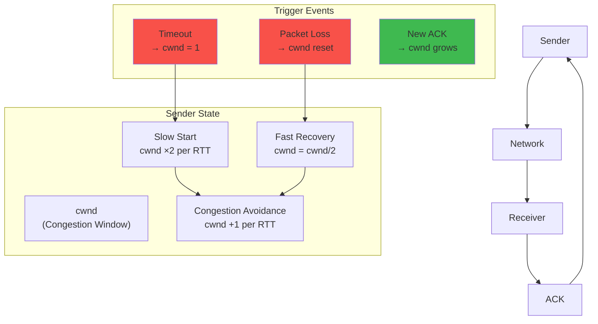

# TCP Congestion Control — Interactive Simulator

## Overview




Simulate TCP congestion control algorithms: Reno, Cubic, and BBR. Visualize the congestion window (cwnd) over time, see how each algorithm responds to packet loss, and understand the difference between slow start, congestion avoidance, fast retransmit, and fast recovery.

**Learning Objectives:**
- Understand the AIMD (Additive Increase Multiplicative Decrease) principle
- Visualize cwnd evolution over time under different algorithms
- See how Reno, Cubic, and BBR differ in loss recovery
- Understand slow start threshold (ssthresh) behavior
- Learn about fast retransmit and fast recovery mechanics
- Compare algorithm throughput under different network conditions

---

## Actors/Components


| Actor | Role |
|-------|------|
| **Sender** | Transmits data packets; maintains cwnd and ssthresh |
| **Receiver** | Sends ACKs for received packets |
| **Network Pipe** | Simulates bandwidth, delay, packet loss, and jitter |
| **Congestion Window (cwnd)** | Number of packets in-flight without ACK |
| **Slow Start Threshold (ssthresh)** | Boundary between slow start and congestion avoidance |
| **RTT Estimator** | Tracks smoothed RTT and RTT variance |
| **Loss Detector** | Detects packet loss via duplicate ACKs or timeout |
| **ACK Clock** | Self-clocking: ACKs drive new packet transmissions |

---

## State Machine


### Congestion Control State (per algorithm)


#### Reno

```
                    ┌──────────┐
                    │ SLOW     │
                    │ START    │ ── cwnd ×2 per RTT
                    └────┬─────┘
                         │
                    cwnd ≥ ssthresh
                         │
                         ▼
                    ┌──────────┐
                    │ CONGESTION│ ── cwnd +1 per RTT (AIMD)
                    │ AVOIDANCE │
                    └────┬─────┘
                         │
                    ┌────┴─────┐
                    ▼         ▼
              ┌──────────┐ ┌──────────┐
              │ FAST     │ │ TIMEOUT  │
              │ RECOVERY │ │ ssthresh │
              │ cwnd/=2 │ │ cwnd=1   │
              │ ssthresh │ │ ss       │
              │ = cwnd/2 │ │          │
              └────┬─────┘ └────┬─────┘
                   │            │
                   └────┬───────┘
                        ▼
                  ┌──────────┐
                  │ CA (Reno)│
                  └──────────┘
```

#### Cubic

```
                    ┌──────────┐
                    │ SLOW     │
                    │ START    │ ── Same as Reno initially
                    └────┬─────┘
                         │
                    cwnd ≥ ssthresh
                         │
                         ▼
                    ┌──────────┐
                    │  CUBIC   │ ── cwnd = C*(t-K)^3 + Wmax
                    │  WINDOW  │     where K = (Wmax*β/C)^(1/3)
                    └────┬─────┘         t = time since loss
                         │               Wmax = cwnd before loss
                    loss detected         β = 0.3 (vs Reno's 0.5)
                         │
                         ▼
                    ┌──────────┐
                    │ FAST     │
                    │ RECOVERY │ ── ssthresh = cwnd * β (0.3)
                    └────┬─────┘    cwnd = ssthresh
                         │
                         ▼
                    ┌──────────┐
                    │  CUBIC   │ ── Resumes from ssthresh
                    │(plateau) │     Grows toward Wmax
                    └──────────┘     (fast near Wmax, slows above)
```

#### BBR

```
                    ┌──────────┐
                    │ STARTUP  │ ── Exponential growth like SS
                    └────┬─────┘     until pipe full (BW detected)
                         │
                    ┌────▼─────┐
                    │  DRAIN   │ ── Reduce inflight to BDP
                    └────┬─────┘
                         │
                    ┌────▼─────┐
                    │  PROBE BW│ ── Cruising, probe for more BW
                    │ (cycle)  │     Gain cycle: 1.25, 0.75, 1.0, 1.0...
                    └────┬─────┘
                         │
                    ┌────▼─────┐
                    │ PROBE RTT│ ── Reduce inflight to measure minRTT
                    └──────────┘
```

---

## Animation Frames


### Frame 1: Slow Start — Exponential Growth


```
cwnd evolution:

cwnd = 1 packet
Send 1 packet, wait for ACK
ACK received → cwnd = 2
Send 2 packets
ACKs received → cwnd = 4
Send 4 packets
ACKs received → cwnd = 8
...

Time: 0 ----------- RTT ---------- RTT ---------- RTT ---------->
cwnd: 1    ──────► 2    ──────► 4    ──────► 8    ──────► 16

Each RTT: cwnd doubles!

Visual: packets per row doubles each round
        Row 1:  ▪
        Row 2:  ▪▪
        Row 3:  ▪▪▪▪
        Row 4:  ▪▪▪▪▪▪▪▪

ssthresh typically = ~65535 bytes (~44 packets)
When cwnd reaches ssthresh → transition to Congestion Avoidance
```

### Frame 2: Congestion Avoidance — AIMD


```
After slow start, cwnd ≥ ssthresh:
Transition to CONGESTION AVOIDANCE

cwnd = 44 packets (ssthresh boundary)

Each RTT: cwnd += 1 (additive increase)
Every ACK: cwnd += 1/cwnd (fractional increment)

Time:   RTT 0     RTT 1     RTT 2     RTT 3     RTT 4
cwnd:   44  ──►  45  ──►  46  ──►  47  ──►  48  ──► ...

vs Slow Start:
  SS: 1 → 2 → 4 → 8 → 16 → 32 → 64 (7 RTTs)
  CA: 44 → 45 → 46 → 47 → 48 → 49 (each RTT, +1)

Much slower growth! This is intentional:
- Slow start: probing for available bandwidth
- Congestion avoidance: gentle increase to avoid causing loss

Until packet loss occurs:
  Loss detected via 3 duplicate ACKs → Fast Recovery
  ssthresh = cwnd / 2
  cwnd = ssthresh
  Return to congestion avoidance
```

### Frame 3: Fast Retransmit and Fast Recovery


```
Normal transmission:

Sender sends: [1][2][3][4][5][6][7][8][9]
                         ✗ ← Packet 5 LOST

Receiver receives: 1 2 3 4 [gap] 6 7 8 9
ACKs sent:         1 2 3 4 4   4 4 4 4 ← Duplicate ACK for 4

Sender receives:
  ACK 4 (first) ─ normal, slide window
  ACK 4 (dup1)  ─ hmm, packet 5 might be lost
  ACK 4 (dup2)  ─ likely lost
  ACK 4 (dup3)  ─ definitely lost! → Fast Retransmit

Fast Retransmit:
  ┌─────────────────────────────────────────────┐
  │ Immediately retransmit packet 5             │
  │ WITHOUT waiting for timeout!                │
  └─────────────────────────────────────────────┘

Fast Recovery (Reno):
  ┌─────────────────────────────────────────────┐
  │ ssthresh = cwnd / 2  (e.g., 64 → 32)       │
  │ cwnd = ssthresh + 3  (35 for the 3 dups)   │
  │ Each additional dup ACK: cwnd += 1          │
  │ When new ACK (ACK 9) arrives:               │
  │   cwnd = ssthresh (32)                      │
  │   Enter congestion avoidance                │
  └─────────────────────────────────────────────┘

After recovery:
  cwnd cut in half! (64 → 32)
  Then AIMD growth resumes (cwnd +1 per RTT)

Without Fast Recovery (old TCP):
  - Timeout: wait RTO (usually 1-3 seconds)
  - cwnd reset to 1! Much worse!
```

### Frame 4: Timeout — Full Reset


```
Extreme loss: all packets in flight lost

Sender has 64 packets in flight
Network drops EVERYTHING (e.g., link down)

Sender receives: nothing
After RTO (Retransmission Timeout, typically ≥ 1 second):
  ┌─────────────────────────────────────────────┐
  │ Retransmit packet                          │
  │ ssthresh = cwnd / 2  (64 → 32)             │
  │ cwnd = 1 (SLOW START!)                     │
  │ Restart from slow start                     │
  └─────────────────────────────────────────────┘

vs Fast Recovery:
  - Timeout: cwnd = 1 (catastrophic drop)
  - Fast Recovery: cwnd = cwnd/2 (mild drop)

This is why preventing timeouts is critical.
Fast Retransmit/Fast Recovery avoid the full reset.
```

### Frame 5: Cubic vs Reno Comparison


```
Scenario: High-bandwidth, long-RTT network (e.g., satellite)

Reno behavior after loss:
  cwnd drops to 50% of Wmax
  Linear growth: +1 per RTT → takes many RTTs to recover
  
Cubic behavior after loss:
  cwnd drops to 70% of Wmax (β=0.3 instead of 0.5)
  Cubic function: grows slowly near Wmax, FAST after Wmax

Visual comparison:

cwnd
│
│ Wmax ──── ┌───┐
│          │                                     Cubic
│          │         ── Reno                    ◄───
│          │     ┌──┘                         /
│ Wmax*0.7 ──────┘                        ───┘
│ Wmax*0.5 ────────┐                     /
│                  │        ┌──────┐    /
│                  └────────┘      └───┘
│
└──────────────────────────────────────────────► time
                  Loss event

Reno: drops to 50%, takes 0.5*Wmax RTTs to recover
Cubic: drops to 70%, concave growth (fast near plateau)
       Then convex growth (fast increase AFTER exceeding Wmax)
       Result: much better throughput on high-BW paths

Cubic advantage grows with BDP (bandwidth-delay product):
  10Mbps, 100ms RTT:  Reno ≈ Cubic (small pipe)
  1Gbps,  100ms RTT:  Cubic 3-5x better than Reno
  10Gbps, 200ms RTT:  Cubic 10x+ better
```

---

## User Interactions


| Control | Type | Range/Options | Effect |
|---------|------|---------------|--------|
| **Algorithm** | dropdown | Reno, Cubic, BBR | Congestion control algorithm |
| **Bandwidth** | slider | 1-10000 Mbps | Link capacity |
| **RTT** | slider | 1-500 ms | Round trip time |
| **Packet loss rate** | slider | 0-20% | Random loss probability |
| **Buffer size** | slider | 1-1000 packets | Router buffer (affects loss pattern) |
| **Burst of loss** | toggle/button | - | Inject burst loss at a specific time |
| **Flow count** | slider | 1-10 | Number of competing TCP flows |
| **Graph scale** | toggle | linear/log | cwnd axis scaling |
| **Show ssthresh** | toggle | on/off | Overlay ssthresh line |
| **Show BDP** | toggle | on/off | Show bandwidth-delay product line |
| **Animate packets** | toggle | on/off | Show individual packet flight |
| **Simulation speed** | slider | 0.1x-10x | Time scale |
| **Reset** | button | - | Restart simulation |

---

## Visual Transitions


| Event | Visual Effect |
|-------|---------------|
| **cwnd increases** | Line on cwnd-time chart sweeps upward |
| **Fast Retransmit** | Red flash on lost packet; "RETRANSMIT" label |
| **Fast Recovery** | Yellow background on chart; ssthresh line drops |
| **Timeout** | Red flash on entire window; cwnd drops to 1 |
| **Slow start** | Steep exponential curve (green) |
| **Congestion avoidance** | Shallow linear curve (blue) |
| **Duplicate ACK** | Small warning icon on each dup ACK |
| **New ACK** | Green check mark; cwnd increments slightly |
| **Packet in flight** | Blue arrow from sender to receiver |
| **Packet lost** | Red X on packet mid-flight; fades out |
| **BBR probeBW** | cwnd oscillates in regular gain cycle pattern |
| **BBR probeRTT** | cwnd drops to BDP/2 for one RTT |
| **RTT estimate** | Moving line on RTT-over-time subgraph |
| **Throughtput** | Area under cwnd fills with color gradient |
| **Competing flows** | Each flow has separate colored line |

---

## Edge Cases


| Edge Case | Behavior |
|-----------|----------|
| **ACK loss** | Cumulative ACKs cover for lost ACKs (next ACK fills in) |
| **Window scaling** | RFC 1323: 64KB window limit exceeded with scaling factor |
| **Explicit Congestion Notification (ECN)** | Router marks packet instead of dropping; sender halves cwnd |
| **Spurious retransmit (RTO too early)** | RTO fires but ACK arrives after retransmit (TSOPT helps detect) |
| **Delayed ACKs** | Receiver ACKs every other packet (standard) → affects growth rate |
| **Initial window (IW)** | Modern TCP starts with IW=10 (instead of old IW=1-3) |
| **Threshold after loss** | ssthresh may be max(2, cwnd/2) to avoid degenerate values |
| **App-limited vs network-limited** | Sender not sending enough data to fill window (different dynamics) |
| **Tahoe vs Reno** | Tahoe: always slow start after loss (no fast recovery) |
| **Hybla (satellite)** | Compensation for long RTT by scaling window growth faster |
| **Westwood** | Bandwidth estimation-based; uses ACK rate instead of just loss |
| **Tail loss probe** | Single retransmit near tail of transmission to avoid RTO |

---

## Failure Modes


| Failure | Symptom | Recovery |
|---------|---------|----------|
| **Persistent high loss** | cwnd stays very small; throughput collapses | Reduce network congestion; fix link errors |
| **Spurious RTO** | Unnecessary retransmission; cwnd reset | Enable F-RTO (detect false RTO) |
| **Bufferbloat** | Very high RTT but no loss; cwnd bloats | Use AQM (CoDel, RED); BBR helps here |
| **TCP incast** | Many-to-one communication → micro-bursts cause loss | Use pacing; smaller initial windows |
| **ACK compression** | ACKs arrive in bursts instead of evenly spaced | Enable pacing on sender |
| **Misordered delivery** | Duplicate ACKs from reordering, not loss | Increase dupthresh; use DSACK |
| **RTT amplification** | Retransmitted packets increase RTT estimate | Use timestamp option (RFC 7323) |
| **Short flows (web)** | Most flows in slow start; never reach CA | Initial window=10 helps; faster start |
| **Time-based loss detection** | RTO-based detection very slow (1s+) | Use TLP (Tail Loss Probe) to detect earlier |
| **Lost ACK burst** | All ACKS lost; cumulative ACK may not cover | Next data packet triggers ACK |
| **Competing flows starvation** | Reno flows get less bandwidth than Cubic in mixed environment | Use same CC algorithm across flows |

---

## Metrics to Display


| Metric | Unit | Source |
|--------|------|--------|
| **cwnd size** | packets (or bytes) | Current congestion window |
| **ssthresh** | packets | Slow start threshold |
| **RTT (smoothed)** | ms | srtt, current RTT estimate |
| **RTT variance** | ms | RTT variation |
| **RTO** | ms | Retransmission timeout value |
| **In-flight packets** | count | Outstanding unACKed packets |
| **Bandwidth estimate** | Mbps | Achieved throughput |
| **BDP** | packets | Bandwidth-delay product |
| **Loss rate** | % | Observed packet loss |
| **Retransmit count** | count | Total retransmitted packets |
| **Dup ACK count** | count | Received duplicate ACKs |
| **Time in slow start** | RTTs | How many RTTs in SS |
| **Time since last loss** | RTTs | How long since congestion event |
| **Goodput** | Mbps | Application-level throughput |
| **Window utilization** | % | in_flight / cwnd |
| **ACK rate** | ACKs/sec | Incoming acknowledgment rate |
| **Packet pacing gap** | ms | Time between packet transmissions |
| **Algorithm state** | string | SS, CA, FR, Recovery, etc. |

---

## Scenario Walkthroughs


### Scenario 1: Basic Reno — Slow Start, Loss, AIMD Cycle


**Setup:** 100Mbps link, 50ms RTT, 0.1% random loss, Reno

```
Timeline:

Phase A: Slow Start

T=0 RTT      cwnd=10, ssthresh=64 (default)
             Send 10 packets
T=1 RTT      ACKs received → cwnd=20
             Send 20 packets
T=2 RTT      ACKs → cwnd=40
             Send 40 packets
T=3 RTT      ACKs → cwnd=64 (reached ssthresh!)
             SS → CA transition
             
Phase B: Congestion Avoidance

T=4 RTT      cwnd=65 (+1 per RTT)
T=5 RTT      cwnd=66
...
T=20 RTT     cwnd=81  (steady linear growth)
             In-flight: 81 packets

Phase C: Loss Event

T=21 RTT     Packet 5,761 is dropped (0.1% loss hit)
             Sender has 81 packets in flight
             
             Receiver gets:
             [5760, ---, 5762, 5763, 5764, 5765, ...]
             ACKs: ACK 5760, ACK 5760 (dup1), ACK 5760 (dup2),
                   ACK 5760 (dup3) → Fast Retransmit!

             Fast Recovery:
               ssthresh = 81/2 = 40
               cwnd = 40 + 3 = 43
               Retransmit packet 5761
               
               More duplicate ACKs:
               dup4 → cwnd=44
               dup5 → cwnd=45
               
               Finally: ACK 5761 (new ACK, covering all)
               cwnd = 40 (ssthresh)
               Enter CA

Phase D: Recovery

T=22 RTT     cwnd=41
...
T=40 RTT     cwnd=59  (growing toward 81 again)
T=61 RTT     cwnd=81  (back to pre-loss cwnd!)
             
             40 RTTs to recover from one loss event!
             Each RTT = 50ms → 2 seconds of reduced throughput
             
             During recovery:
             Throughput = (cwnd * MSS) / RTT
             At cwnd=40: (40 * 1500) / 0.05 = 12 Mbps
             At cwnd=81: 24 Mbps
             
             Loss event caused ~50% throughput drop for 2 seconds!

Key insight: Reno suffers on high-BDP paths because
             linear growth is too slow to recover.
```

### Scenario 2: Cubic on High-BDP — Faster Recovery


**Setup:** 1Gbps link, 100ms RTT, 0.01% loss, Cubic vs Reno

```
Comparison of the same scenario with Reno vs Cubic:

BDP = 1Gbps * 0.1s = 100Mb = ~8,333 packets (with 1500 byte MSS)

Reno:
  Wmax = 8,333 packets (steady state cwnd)
  Loss → cwnd = 4,166 (50% drop)
  Growth: +1 per RTT
  Time to recover: 8,333 - 4,166 = 4,167 RTTs = 416.7 seconds!
  Over 7 minutes to recover!

Cubic:
  Wmax = 8,333 packets
  Loss → cwnd = 8,333 * 0.7 = 5,833 (30% drop, β=0.3)
  
  Cubic function: cwnd = C*(t - K)^3 + Wmax
  where C = 0.4 (default), K = (Wmax*β/C)^(1/3)
  
  K = (8333 * 0.3 / 0.4)^(1/3)
    = (6249.75)^(1/3)
    ≈ 18.4 seconds (time to reach Wmax again)
  
  After loss at t=0:
  cwnd = 5,833

  t=1s:    cwnd = Wmax - Δ (just below 8,333)  ← slow growth near Wmax
  t=10s:   cwnd ≈ 7,900 (approaching Wmax)
  t=18.4s: cwnd = 8,333 (back to Wmax! K-sec)
  t=20s:   cwnd = 8,500 (now above Wmax, growing fast)
  t=30s:   cwnd = 11,000+

Result:
  Reno:  416 seconds to recover → 7 min
  Cubic: 18 seconds to recover → 25x faster!

  Average throughput:
  Reno:  (8333 + 4166)/2 packets = ~500 Mbps (half capacity)
  Cubic: (8333 + 5833)/2 → ~7,083 avg → ~850 Mbps (85% capacity)

Cubic is dramatically better on high-BDP paths.
This is why Linux switched from Reno to Cubic as default.
```

### Scenario 3: BBR — Model-Based Congestion Control


**Setup:** 100Mbps link, 50ms RTT, no loss (clean channel)

```
BBR does NOT use loss as congestion signal.
Instead: BBR models the network path.

Phase A: Startup (exponential)

T=0-3 RTT  Same as slow start: cwnd doubles each RTT
           But BBR tracks delivery rate (BW) instead of window

T=4 RTT    BBR detects no BW increase (pipe full)
           Pacing rate = max BW estimate (pacing_rate)
           Transition to DRAIN

Phase B: Drain

T=5 RTT    Reduce in-flight to BDP
           BDP = BW * minRTT = 100Mbps * 0.05s = 5Mb = ~417 pkts
           in_flight drops from ~800 to 417

Phase C: ProbeBW (steady state)

BBR cycles through gain values to probe for more BW:

           Gain 1.25: send at 1.25x estimated BW (for ~1-2 RTTs)
           Gain 0.75: drain queue created by 1.25x gain
           Gain 1.0: cruise at estimated BW (for ~5-7 RTTs)
           Repeat...

Visual pattern:
cwnd
│
│  ┌───┐           ┌───┐           ┌───┐
│  │1.25│   ┌─────┐│1.25│   ┌─────┐│1.25│
│  │    │   │1.0  ││    │   │1.0  ││    │
│  │    └───┘     ││    └───┘     ││    └───
│  │    ┌───┐     ││    ┌───┐     ││
│  └────┘0.75     └┴────┘0.75     └┴────
│
└──────────────────────────────────────► time

Key: BBR detects actual delivery rate from ACKs
     It probes gently without filling buffers
     Result: low latency + high throughput
     (vs loss-based CC which fills buffers → bufferbloat)

Phase D: ProbeRTT (every ~10 seconds)

If RTT > minRTT observed:
  Enter ProbeRTT for ~200ms
  Reduce in-flight to BDP/2
  Measure actual minRTT
  Return to ProbeBW

Purpose: Prevent minRTT estimate from drifting upward
         due to bufferbloat.
```

### Scenario 4: Bufferbloat — Reno vs BBR


**Setup:** 100Mbps link, 50ms RTT, large 1000-packet buffer

```
Reno (loss-based):

Sender sees: no loss (big buffer absorbs bursts)
cwnd keeps growing: 80 → 160 → 320 → 640...
But buffer fills up:
  Buffer occupancy: 0 → 100 → 500 → 1000 packets

RTT increases:
  Without buffer: 50ms
  With 1000 packets in buffer (100Mbps):
    Buffer delay = 1000 * 1500 * 8 / 100Mbps = 120ms
    Measured RTT = 50ms + 120ms = 170ms!

cwnd at this point: cwnd = 640+ (very large)
But real throughput = cwnd / RTT = 640*1500*8 / 0.17 = 45 Mbps!
Even though cwnd is large, throughput HALVED?

No! cwnd = BW * RTT (self-consistency):
  Actual BW limited to 100Mbps link
  cwnd = 100Mbps * 0.17s = 2.125MB = ~1,417 packets
  
  Throughput = 100Mbps (link-limited)
  But delayed: new connections experience 170ms RTT!
  
  Result: all flows on this path suffer 170ms latency
          even when sending tiny amounts!
          This is BUFFERBLOAT.

BBR (model-based):

BBR estimates:
  BW ≈ 100Mbps (probed correctly)
  minRTT ≈ 50ms (probed during ProbeRTT phase)
  
  BDP = 100Mbps * 0.05 = 5Mb = 417 packets
  
  BBR paces at BW rate (100Mbps)
  in_flight ≈ BDP (417 packets)
  Buffer occupancy ≈ 0! (no excess in flight)
  
  Resulting RTT = 50ms (no buffer delay!)
  Throughput = 100Mbps

Visual comparison:
              ┌─────────────────────────────────────┐
              │         BUFFER OCCUPANCY            │
              ├──────────────────┬──────────────────┤
              │     RENO        │       BBR        │
              │  1000 packets   │     ~0 packets   │
              │  (buffer full)  │  (buffer empty)  │
              ├──────────────────┴──────────────────┤
              │         OBSERVED RTT               │
              ├──────────────────┬──────────────────┤
              │    170ms         │     50ms         │
              └──────────────────┴──────────────────┘

BBR wins: same throughput (100Mbps), 3.4x lower latency!
```

### Scenario 5: Competing Flows — Fairness


**Setup:** 3 Reno flows + 1 Cubic flow, 1Gbps link, 20ms RTT

```
Flow dynamics:

All 4 flows start at T=0:
  All in slow start together
  They share the 1Gbps bandwidth

Slow start ends for all around same time:
  Each flow cwnd ≈ 100 packets
  Total: 400 packets in flight
  Link capacity: cwnd_total_for_full_bw = 1667 pkts

Equilibrium:
  Fair share per flow: 250 Mbps (if fair)
  
  Reno flows: AIMD, each gets ~250 Mbps
  Cubic flow: more aggressive after loss
  
  Loss event:
    Reno: cwnd /= 2, linear growth (+1/RTT)
    Cubic: cwnd *= 0.7, cubic growth (+α*cwnd^2)
    
    After loss, Cubic recovers faster → gets more bandwidth
    Reno flows get squeezed
  
  Long-term:
    Reno flows: ~200 Mbps each (total 600 Mbps)
    Cubic flow: ~400 Mbps (gets 40% instead of 25%)
    
    This is the "Reno-friendly" problem:
    Cubic is NOT fully fair to Reno.
    
    Fix: Cubic has Reno-friendly mode when
         cwnd < previous Wmax (aims to behave like Reno)

Real-world impact:
  Old servers (Reno) get squeezed by new servers (Cubic)
  Solution: Use same CC algorithm across data center
            Or deploy pacing / traffic shaping at switches
```

---

## Implementation Notes


**State Management:**
- Per-flow state: `cwnd, ssthresh, state (SS/CA/Recovery), RTT estimates`
- Network model: `bandwidth, delay, loss_rate, buffer_size`
- Packet tracking: `in_flight list with sequence numbers, timestamps, ACK status`

**Algorithm implementations:**

```python
class RenoCC:
    def on_ack(self, ack_num):
        if self.state == "SLOW_START":
            self.cwnd += ack.increment  # typically +1 per ACK
            if self.cwnd >= self.ssthresh:
                self.state = "CONGESTION_AVOIDANCE"
        elif self.state == "CONGESTION_AVOIDANCE":
            self.cwnd += 1 / self.cwnd  # +1 per RTT

    def on_loss(self, dup_ack_count):
        if dup_ack_count >= 3:  # Fast Retransmit
            self.ssthresh = max(self.cwnd / 2, 2)
            self.cwnd = self.ssthresh + 3
            self.state = "FAST_RECOVERY"
        elif timeout:
            self.ssthresh = max(self.cwnd / 2, 2)
            self.cwnd = 1
            self.state = "SLOW_START"

class CubicCC:
    def __init__(self):
        self.C = 0.4
        self.beta = 0.3
        self.Wmax = 0
        self.K = 0
        self.loss_time = 0

    def on_loss(self, time):
        self.Wmax = self.cwnd
        self.ssthresh = max(self.cwnd * self.beta, 2)
        self.cwnd = self.ssthresh
        self.loss_time = time
        self.K = (self.Wmax * self.beta / self.C) ** (1/3)

    def cubic_window(self, time_elapsed):
        t = time_elapsed - self.K
        return self.C * t ** 3 + self.Wmax

class BBR:
    def __init__(self):
        self.bw = 0  # max bandwidth estimate
        self.min_rtt = float('inf')
        self.pacing_rate = 0
        self.state = "STARTUP"

    def on_ack(self, ack, delivery_rate, rtt):
        self.bw = max(self.bw, delivery_rate)
        self.min_rtt = min(self.min_rtt, rtt)
        self.update_pacing_rate()

        if self.state == "STARTUP":
            if round_gain < 1.25:  # BW plateaued
                self.state = "DRAIN"
        elif self.state == "DRAIN":
            if in_flight <= BDP:
                self.state = "PROBE_BW"
```

**Simulation Loop:**
```
while running:
    t += 1 (simulated ms)
    
    # Sender: send packets if cwnd allows
    while in_flight < cwnd and data_left:
        send_packet(next_seq, timestamp=t)
        in_flight += 1
    
    # Network: deliver packets with delay + loss
    for packet in flight:
        if random() < loss_rate:
            drop_packet(packet)  # lost!
        else:
            deliver_to_receiver(packet, delay=rtt/2)
    
    # Receiver: generate ACKs
    for received packet:
        send_ack(packet.seq, delayed_ack=True)
    
    # Sender: process ACKs
    for ACK in received_acks:
        if not cum_ack:
            dup_acks[packet] += 1
        if dup_acks[packet] >= 3:
            cc.on_loss(time)
    
    # Update metrics
    update_graph()
    
    render_frame()
```

**Timing Model:** Use event-driven simulation where each packet transmission, ACK arrival, and timer expiry is an event. Network delay is approximated as RTT/2 each way. Simulate at millisecond granularity.

## Related

- [Cap Consistency](/09-distributed-systems/01-cap-consistency.md)
- [Consensus Replication](/09-distributed-systems/01-consensus-replication.md)
- [Consensus Raft](/09-distributed-systems/02-consensus-raft.md)
- [Distributed Transactions](/09-distributed-systems/02-distributed-transactions.md)
- [Distributed Caching](/09-distributed-systems/03-distributed-caching.md)
- [Distributed Storage](/09-distributed-systems/03-distributed-storage.md)
