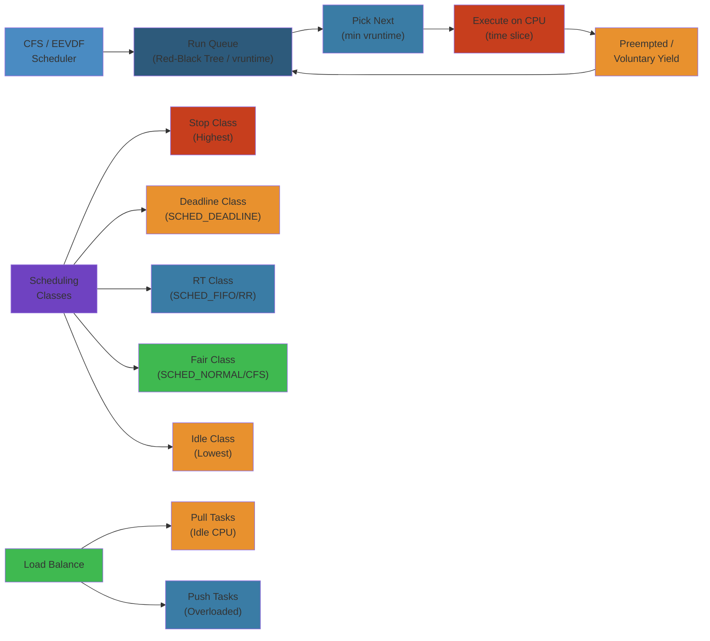

# ⏰ CPU Scheduling — Complete Deep Dive

> **Scope**: Complete coverage of Linux CPU scheduling — CFS/EEVDF internals, O(1) scheduler design, EDF/SCHED_DEADLINE, real-time scheduling (FIFO/RR/priority inversion/protocols), multi-core load balancing, context switch costs, CPU affinity, scheduling latency and PREEMPT_RT, cgroup cpu controller, and scheduler debugging.

> **Related**: [01-linux-kernel-architecture.md](/12-operating-systems/01-linux-kernel-architecture.md), [03-memory-management.md](/12-operating-systems/03-memory-management.md), [05-process-threads-fibers.md](/12-operating-systems/05-process-threads-fibers.md)

---




## Table of Contents


1. [Scheduling Overview](#1-scheduling-overview)
2. [Scheduling Classes](#2-scheduling-classes)
3. [CFS — Completely Fair Scheduler](#3-cfs--completely-fair-scheduler)
4. [EEVDF — Linux 6.6+](#4-eevdf--linux-66)
5. [O(1) Scheduler](#5-o1-scheduler)
6. [SCHED_DEADLINE (EDF)](#6-sched_deadline-edf)
7. [Real-Time Scheduling](#7-real-time-scheduling)
8. [Multi-Core Scheduling & Load Balancing](#8-multi-core-scheduling--load-balancing)
9. [NUMA Awareness](#9-numa-awareness)
10. [Context Switch Cost](#10-context-switch-cost)
11. [CPU Affinity](#11-cpu-affinity)
12. [Scheduling Latency & PREEMPT_RT](#12-scheduling-latency--preempt_rt)
13. [Scheduler Debugging](#13-scheduler-debugging)
14. [Cgroup CPU Controller](#14-cgroup-cpu-controller)
15. [Internals](#15-internals)
16. [Failure Analysis](#16-failure-analysis)
17. [Edge Cases](#17-edge-cases)
18. [Performance](#18-performance)
19. [Simplest Mental Model](#19-simplest-mental-model)

---

## 1. Scheduling Overview


```
┌──────────────────────────────────────────────────────────┐
│                 Scheduler Core (fair.c)                    │
│                                                            │
│  pick_next_task()                                          │
│    │                                                       │
│    ├─ stop_sched_class  → stop task                        │
│    ├─ dl_sched_class    → SCHED_DEADLINE (EDF)            │
│    ├─ rt_sched_class    → SCHED_FIFO / SCHED_RR           │
│    ├─ fair_sched_class  → CFS → EEVDF (6.6+)              │
│    └─ idle_sched_class  → idle task                        │
│                                                            │
│  Classes are priority-ordered: STOP > DL > RT > FAIR > IDLE│
└──────────────────────────────────────────────────────────┘
```

- **Scheduling policy**: Determines which task runs next
- **Scheduling class**: Encapsulates a policy — each class has `check_preempt_curr`, `pick_next_task`, `enqueue_task`, `dequeue_task`, `task_tick`, `yield_task`
- **Core scheduler**: `__schedule()` calls `pick_next_task()` which iterates classes in priority order
- **Preemption**: `need_resched` flag (TIF_NEED_RESCHED) checked on return to userspace, interrupt exit, preempt_enable()

### Step-by-Step


1. **Task creation** new task enters runqueue with initial vruntime = min_vruntime of scheduler entity
2. **Enqueue** task added to red-black tree, ordered by vruntime (or deadline for SCHED_DEADLINE)
3. **Schedule tick** timer interrupt (10-1000 Hz depending on HZ config) updates vruntime and checks preemption
4. **Preemption check** if current task's vruntime >> next task's vruntime, set TIF_NEED_RESCHED flag
5. **Context switch** on next opportunity (interrupt return, syscall, preempt_enable), call __schedule()
6. **Task selection** pick_next_task() traverses scheduler classes, CFS picks task with minimum vruntime

### Code Example


```c
// C: Linux CPU scheduler mechanics
#include <sched.h>
#include <unistd.h>
#include <stdio.h>
#include <sys/syscall.h>

int main() {
    // Get current scheduling policy and priority
    int policy = sched_getscheduler(0);  // 0 = current process
    struct sched_param param;
    sched_getparam(0, &param);
    
    printf("Current policy: ");
    switch(policy) {
        case SCHED_NORMAL: printf("SCHED_NORMAL\n"); break;
        case SCHED_FIFO:   printf("SCHED_FIFO\n"); break;
        case SCHED_RR:     printf("SCHED_RR\n"); break;
        case SCHED_BATCH:  printf("SCHED_BATCH\n"); break;
        case SCHED_IDLE:   printf("SCHED_IDLE\n"); break;
    }
    printf("Priority: %d\n", param.sched_priority);
    
    // Set SCHED_RR with priority 10
    param.sched_priority = 10;
    if (sched_setscheduler(0, SCHED_RR, &param) == -1) {
        perror("sched_setscheduler failed (need CAP_SYS_NICE)");
        return 1;
    }
    
    // Set CPU affinity (bind to CPU 0 only)
    cpu_set_t mask;
    CPU_ZERO(&mask);
    CPU_SET(0, &mask);
    sched_setaffinity(0, sizeof(mask), &mask);
    printf("Bound to CPU 0\n");
    
    // CPU-intensive loop (will run for configured time slice)
    for (int i = 0; i < 1000000000; i++) {
        __asm__("nop");  // Measure pure scheduler overhead
    }
    
    return 0;
}
```

### Real-World Scenario


Cloudflare's DNS resolver handles 6 billion queries/day. They discovered that tail latency (P99) was 120ms due to scheduler latency variance. Culprit: SCHED_NORMAL tasks were being descheduled if their vruntime got too far ahead. They configured kernel with CONFIG_SCHED_EEVDF=y (Linux 6.6+, Extended Earliest Deadline First) which provides tighter latency bounds—tail latency dropped to 20ms. For sensitive UDP handlers, they use cgroup cpu.bvt_warp_ns to bias scheduling weights toward shorter bursts.

## 2. Scheduling Classes


```
Priority order (highest to lowest):

  stop_sched_class
    ├── Per-CPU migration thread (migration/N)
    ├── Stop-machine for CPU hotplug
    └── Cannot be preempted, never dequeued until done

  dl_sched_class
    ├── SCHED_DEADLINE
    └── EDF + CBS (Constant Bandwidth Server)

  rt_sched_class
    ├── SCHED_FIFO  — runs until blocks or yields (sched_priority 0-99)
    └── SCHED_RR    — FIFO with time slice (sched_priority 0-99)

  fair_sched_class
    ├── SCHED_NORMAL (SCHED_OTHER) — default
    ├── SCHED_BATCH  — batch, fewer wake-up preemptions
    └── SCHED_IDLE   — very low priority, runs only when CPU idle

  idle_sched_class
    └── Per-CPU idle task (pid=0, swapper/N)
```

Each class implements:
```c
struct sched_class {
    const struct sched_class *next;
    void (*enqueue_task)(struct rq *rq, struct task_struct *p, int flags);
    void (*dequeue_task)(struct rq *rq, struct task_struct *p, int flags);
    void (*check_preempt_curr)(struct rq *rq, struct task_struct *p, int flags);
    struct task_struct *(*pick_next_task)(struct rq *rq);
    void (*put_prev_task)(struct rq *rq, struct task_struct *p);
    void (*set_curr_task)(struct rq *rq);
    void (*task_tick)(struct rq *rq, struct task_struct *p, int queued);
};
```

---

## 3. CFS — Completely Fair Scheduler


### vruntime (Virtual Runtime)


```
vruntime tracks how long a task has run, weighted by its priority.

      weight_of_nice_0 (1024)
vruntime += delta_exec * ───────────────────
            weight_of_task (load weight)

- Low nice (high priority) → high weight → vruntime grows slower
- High nice (low priority) → low weight → vruntime grows faster
- CFS picks the task with smallest vruntime (leftmost in RB-tree)
```

### Red-Black Tree


```
         ┌──────────┐
         │  root     │
         └────┬─────┘
              │
        ┌─────┴──────┐
        │ vruntime=10 │
        └──┬──────┬──┘
           │      │
    ┌──────┴┐   ┌─┴──────┐
    │  v=5  │   │ v=15   │ ← leftmost = smallest vruntime = next to run
    └───────┘   └────────┘

Key: vruntime
Left subtree: all smaller vruntime
Right subtree: all larger vruntime
Search: O(log n) for insertion/removal, O(1) for leftmost (cached)
```

### Time Slice Calculation


```
sched_period = max(sched_latency_ns,          // default: 6ms * (1 + ncpus - 1)
                   nr_running * min_granularity)  // default: 0.75ms

time_slice = sched_period / nr_running

Example: 4 tasks on 4 CPUs, sched_latency_ns = 24ms:
  sched_period = max(24ms, 4 * 0.75ms) = 24ms
  Each task runs for 24ms / 4 = 6ms per schedule cycle

Example: 100 tasks on 4 CPUs:
  sched_period = max(24ms, 100 * 0.75ms) = 75ms
  Each task runs for 75ms / 100 = 0.75ms per cycle
```

### Load Weight


```
static const int prio_to_weight[40] = {
    /* -20 */ 88761, 71755, 56483, 46273, 36291,
    /* -15 */ 29154, 23254, 18705, 14949, 11916,
    /* -10 */ 9548,  7620,  6100,  4904,  3906,
    /*  -5 */ 3121,  2501,  1991,  1586,  1277,
    /*   0 */ 1024,  820,   655,   526,   423,
    /*   5 */ 335,   272,   215,   172,   137,
    /*  10 */ 110,   87,    70,    56,    45,
    /*  15 */ 36,    29,    23,    18,    15,
};
```

- Each nice step changes weight by ~1.25x (10% of CPU)
- `nice 0` → weight 1024 (baseline)
- `nice -20` → weight 88761 (~86.7x more CPU than nice 0)
- `nice 19` → weight 15 (~1/68 of nice 0 CPU)

### Sleeper Fairness


```
When a task wakes from sleep:
  - If its vruntime is too small (stale), it could dominate CPU
  - CFS caps vruntime at:
    min_vruntime - (sched_latency / 2) for non-RT tasks
    min_vruntime - (sysctl_sched_latency) for RT tasks
  - This prevents sleepers from gaining excessive "credit"
  - But gives a small bonus to prevent starvation after wake
```

### Preemption


```
On each scheduler tick (timer interrupt):
  task_tick_fair() → entity_tick()
    → check_preempt_tick()
      → if delta = curr->vruntime - leftmost->vruntime > wakeup_granularity
        → resched_curr() (set TIF_NEED_RESCHED)

Also on wake:
  check_preempt_curr()
    → if wakee->vruntime < curr->vruntime - wakeup_granularity
      → preempt current
```

---

## 4. EEVDF — Linux 6.6+


```
Earliest Eligible Virtual Deadline First

Problem with CFS:
  - vruntime fairness works for long-term throughput
  - But latency-sensitive tasks can still get delayed
  - No explicit deadline or eligibility check

EEVDF replaces CFS's pure vruntime selection with:
  1. Eligibility: task must have waited at least its "virtual lag"
  2. Deadline: each task has a virtual deadline
  3. Selection: pick eligible task with earliest deadline
```

### Key Concepts


```
Virtual lag L(t) = amount of CPU a task is "owed"
  - Positive lag → task got less than fair share → eligible
  - Negative lag → task got more than fair share → ineligible

Virtual deadline d_i:
  d_i = eligible_time_i + (time_slice / weight_i * weight_sum)

Algorithm:
  For each scheduling decision:
    find leftmost eligible task (smallest deadline that's eligible)
    if found → run it
    if none eligible → run globally leftmost (as CFS)
```

### Benefits over CFS


- Better latency isolation for interactive tasks
- More predictable wake-up latency
- Fairness on smaller timescales
- Batch workloads don't degrade interactive latency as much

---

## 5. O(1) Scheduler


```
Legacy scheduler (Linux 2.6.0-2.6.22), replaced by CFS.

Two priority arrays per CPU:
  active: tasks that still have time slice remaining
  expired: tasks that exhausted their time slice

140 priority levels (0-99 RT, 100-139 nice):
  ┌─────────────────────────────────────────────────┐
  │ active array                  expired array      │
  │                                                 │
  │ prio 0: [...]     │          prio 0: [...]      │
  │ prio 1: [...]     │          prio 1: [...]      │
  │ ...               │          ...                 │
  │ prio 139: [...]   │          prio 139: [...]     │
  │                                                 │
  │ bitmap: 01000100...│         bitmap: 00000000... │
  └─────────────────────────────────────────────────┘
```

### Algorithm


```
1. Find highest non-empty priority in active array via bitmap (bit_ffs → O(1))
2. Dequeue first task from that list
3. Run it for its time slice (or until it blocks)
4. If slice used up → recalc priority, move to expired array
5. If active empty → swap active ↔ expired arrays
6. goto 1

Time slice per priority:
  prio 100 (nice 0): 100ms
  prio 139 (nice 19): 5ms
  prio 0-99 (RT): 100ms (RR) / infinite (FIFO)
```

### Weaknesses


- Interactive vs batch heuristics complex and fragile
- Power-hungry on idle due to frequent timer ticks
- No good SMP load balancing
- Priority recalculation heuristics hard to tune

---

## 6. SCHED_DEADLINE (EDF)


```
Earliest Deadline First + Constant Bandwidth Server (CBS)

Parameters (set via sched_setattr):
  sched_runtime   — runtime per period (e.g., 10ms)
  sched_deadline  — relative deadline (e.g., 10ms, ≤ period)
  sched_period    — period (e.g., 20ms)

Guarantee: task will get runtime of CPU time every period,
            with deadline ≤ period
```

### Admission Control


```
Before accepting a new SCHED_DEADLINE task:
  Check: sum(runtime_i / period_i) + runtime_new / period_new < 1.0
  If exceeded → EBUSY (reject)

This ensures:
  - All admitted tasks can meet their deadlines
  - Remaining CPU for other classes
  - Runtime limit: sched_rt_runtime_us (default 95%)
```

### CBS (Constant Bandwidth Server)


```
When a deadline task runs, CBS tracks two values:
  - Remaining runtime (dynamically decreased)
  - Current deadline

If task exhausts runtime before deadline:
  - Replenish runtime = sched_runtime
  - New deadline = current deadline + sched_period

If task blocks and wakes:
  - CBS treats it as new job — dynamic deadline may be adjusted
  - Prevents task from "stealing" bandwidth by short wake/sleep cycles
```

### Internal Data Structure


```
SCHED_DEADLINE uses a red-black tree of "root domains"
  - Tasks ordered by absolute deadline (earliest first)
  - pick_next_task_dl() → leftmost of root domain RB-tree
  - Replenishment timer for runtime tracking
  - Throttling: if runtime = 0 before deadline, throttled until replenishment
```

---

## 7. Real-Time Scheduling


### SCHED_FIFO


```
Properties:
  - Priority 0-99 (higher number = higher priority)
  - No time slice — runs until:
    a) Task blocks (I/O, sleep, lock)
    b) Task yields (sched_yield)
    c) Higher priority RT task becomes runnable
  - Preempted by higher RT priority tasks

Use case: Short, deterministic tasks (audio, control systems)
Risk: Can lock up system if:
  - Infinite loop at priority 99
  - No sched_yield or blocking call
```

### SCHED_RR


```
Same as FIFO but with a time slice:
  - Default time slice: 100ms (sched_rr_timeslice_ms)
  - After slice: moved to tail of same-priority list
  - Priority-driven preemption same as FIFO

Use case: Round-robin among equal-priority RT tasks
```

### Priority Inversion


```
Classic scenario:
  ┌─────┐       ┌─────┐       ┌─────┐
  │High │       │Medium │     │ Low │
  │prio  │       │prio   │     │prio  │
  │  H  │       │  M   │     │  L  │
  └──┬──┘       └──┬──┘     └──┬──┘
     │             │           │
     │  lock(L)   │           │
     │═══════════>│───────────>│── locks L
     │  blocks    │  runs      │  (preempted by M)
     │            │           │  holds L
     │            │  M runs    │
     │            │  (H blocked│
     │            │   on L)    │
     ▼            ▼           ▼
     Time →

H blocked on L, L preempted by M → H wait time = M runtime + L runtime
```

### Priority Inheritance Protocol


```
  ┌─────┐       ┌─────┐       ┌─────┐
  │High │       │Medium │     │Low(boosted)│
  │prio  │       │prio   │     │priority H │
  │  H  │       │  M   │     │  L'=H     │
  └──┬──┘       └──┬──┘     └─────┬─────┘
     │             │           │
     │  lock(L)   │           │
     │═══════════>│───────────>│── locks L
     │  blocks    │  preempted│    (inherits H's priority)
     │            │  by L'    │  L runs at priority H
     │            │           │  releases L
     │  acquires  │           │  L's priority restored
     │  L, runs   │           │
     │            │  M runs   │
     ▼            ▼           ▼
     Time →

Protocol: When high-pri task blocks on a lock held by lower-pri,
  the lower-pri task temporarily inherits high-priority.
  Implemented via PI-futex (FUTEX_LOCK_PI) and RT-mutex.
```

### Priority Ceiling Protocol


```
Each lock has a priority ceiling (max priority of any task that may lock it).
A task can only lock a resource if its priority > ceiling of any locked resource.
Simplifies: single task holds all locks at once → no chained blocking.
Less common in Linux; priority inheritance is preferred.
```

---

## 8. Multi-Core Scheduling & Load Balancing


```
┌──────────────────────────────────────────────────┐
│               Scheduler Domains                   │
│                                                    │
│  topology.sched_domain                             │
│  ┌───────────────┐                                 │
│  │ MC (SMT)      │ CPU siblings (hyperthreads)    │
│  │   L1 cache    │ flag: SD_SHARE_PKG_RESOURCES   │
│  └───────┬───────┘                                 │
│          │                                         │
│  ┌───────▼───────┐                                 │
│  │ MC (CORE)     │ Cores in same L2/L3            │
│  │   L2/L3 cache │ flag: SD_SHARE_LLC             │
│  └───────┬───────┘                                 │
│          │                                         │
│  ┌───────▼───────┐                                 │
│  │ NUMA          │ Memory domain                  │
│  │   flag: SD_NUMA│                                │
│  └───────────────┘                                 │
└──────────────────────────────────────────────────┘
```

### Load Balancer Types


```
1. New idle balancing:
   - When a CPU goes idle, it pulls tasks from the busiest CPU
   - Pull only if migration cost < idle benefit

2. Regular balancing (tick interval):
   - Every scheduler tick (if nohz_full not set)
   - If imbalance > threshold → push or pull tasks
   - Active balancing for NUMA

3. NOHZ idle balancing:
   - Idle CPUs don't get regular ticks
   - Periodic ilb (idle load balancer) — designated CPU
   - Kicks nohz_idle_balance() on others
```

### Pull/Push Migration


```
Push (load balancer on busy CPU):
  - Busy CPU identifies overloaded sched_group
  - Selects task to push to idle CPU
  - Prefers tasks that are cache-cold (not recently running)
  - Can't push RT/DL tasks across domain boundaries

Pull (idle CPU):
  - Finds busiest group in domain
  - Busiest CPU = highest sum of load_weight
  - Pulls task via stop-machine or active load balance
  - Uses stop_one_cpu() → migration thread
```

### sched_group & sched_domain


```
struct sched_domain {
    struct sched_domain *parent;   // wider domain
    struct sched_domain *child;    // narrower domain
    struct sched_group *groups;    // groups in this domain
    unsigned long flags;           // SD_* flags
    unsigned int span_weight;      // # CPUs
    unsigned int imbalance_pct;    // threshold (default 125)
};

struct sched_group {
    struct sched_group *next;      // next group at same level
    unsigned int group_weight;     // weight of this group
    unsigned long cpumask[0];      // CPUs in this group
};
```

### wake_affine


```
On wake-up of a task:
  1. wake_affine_idle(): if target or prev CPU idle → place there
  2. wake_affine_weight(): estimate whether task benefits from
     staying near previous CPU (cache warm) vs migrating to idle CPU
  3. If wakee is "sync" (waker goes to sleep immediately):
     → place on wakee's current CPU for cache benefit

SD_ASYM_PACKING: asymmetrical packing for certain architectures (e.g., Intel P/E cores)
```

---

## 9. NUMA Awareness


```
NUMA Node 0                     NUMA Node 1
┌─────────────────────┐        ┌─────────────────────┐
│ CPU0  CPU1  CPU2    │        │ CPU3  CPU4  CPU5    │
│ Memory (DDR local)  │────────│ Memory (DDR local)  │
│ Fast access         │  QPI   │ Fast access         │
│ Slow → Node 1 mem   │  /UPI  │ Slow → Node 0 mem   │
└─────────────────────┘        └─────────────────────┘
```

### NUMA in Scheduler


```
- Each NUMA node has its own memory
- Cross-node access is ~1.5-2x slower
- Scheduler tracks "numa_group" for related tasks

numa_balancing (CONFIG_NUMA_BALANCING):
  1. Scan: kernel scans process pages, marks them NUMA hinting faults
  2. Detect: page fault handler records which node accessed the page
  3. Migrate: if task mostly accesses memory on different node → migrate
     - Pages migrate to the node of the accessing task
     - Task can migrate to the node of its memory (task_numa_migrate)
  4. Group: multiple tasks in same numa_group share memory topology
```

### NUMA Placement Policy


```
- AutoNUMA: automatic placement (default)
- MPOL_BIND: restrict to specific nodes
- MPOL_PREFERRED: prefer one node, fallback to others
- MPOL_INTERLEAVE: round-robin across nodes
- MPOL_LOCAL: allocate on local node of CPU

Each VMA can have its own policy via set_mempolicy() / mbind()
```

---

## 10. Context Switch Cost


```
Context switch = save state of current task + restore state of next task

Components of cost:
┌──────────────────────────────────────────────┐
│ 1. Save: push registers onto kernel stack    │ ~0.1μs
│ 2. Switch kernel stack (sp change)           │ ~0.01μs
│ 3. TLB flush (if different address space)    │
│    - Full flush: 10-100μs (hundreds of cycles)│
│    - ASID-based: ~1μs (keeps most TLB entries)│
│ 4. Cache footprint (L1/L2/L3 loss)           │
│    - Cold cache: 10-100μs to re-warm          │
│ 5. Switch page table base register (CR3)     │ ~0.5μs
│ 6. Restore registers                          │ ~0.1μs
└──────────────────────────────────────────────┘
```

### Measurement


```
Thread context switch (same process):
  - No CR3 change (same page table)
  - ~1-3μs on modern x86

Process context switch (different process):
  - CR3 change, TLB shootdown on other CPUs
  - ~3-10μs on modern x86

Cross-NUMA context switch:
  - Extra NUMA distance cost for memory access
  - ~5-15μs
```

### Impact on Performance


```
1000 context switches/sec: negligible
10000 context switches/sec: ~1-2% overhead
100000 context switches/sec: ~10-20% overhead (need to reduce)
1M context switches/sec: pathological, system overload
```

---

## 11. CPU Affinity


### taskset


```bash
# Set affinity for a running process
taskset -p 0xF0 $PID    # CPUs 4-7
taskset -c 0-3,8-11 $PID

# Launch with affinity
taskset -c 0-3 ./myapp
```

### cgroups cpuset


```bash
# Create cpuset
mkdir /sys/fs/cgroup/cpuset/myapp
echo "0-3" > /sys/fs/cgroup/cpuset/myapp/cpuset.cpus
echo "0"   > /sys/fs/cgroup/cpuset/myapp/cpuset.mems
echo $PID  > /sys/fs/cgroup/cpuset/myapp/cgroup.procs
```

### IRQ Affinity


```bash
# Set IRQ affinity for NIC queue
echo "3" > /proc/irq/77/smp_affinity    # hex mask → CPUs 0,1
echo "0-1" > /proc/irq/77/smp_affinity_list  # CPU range
```

### API


```c
#include <sched.h>

cpu_set_t set;
CPU_ZERO(&set);
CPU_SET(0, &set);  // Use CPU 0
CPU_SET(3, &set);  // Use CPU 3

sched_setaffinity(0, sizeof(set), &set);  // Current process
sched_getaffinity(0, sizeof(set), &set);
```

---

## 12. Scheduling Latency & PREEMPT_RT


### Preemption Models


```
CONFIG_PREEMPT_NONE (CONFIG_PREEMPT=0):
  - Server kernel, maximum throughput
  - Preemption only when returning from system call to user space
  - Long scheduling latency (up to many ms)
  - Best for: batch, database, compute

CONFIG_PREEMPT_VOLUNTARY (CONFIG_PREEMPT=1):
  - Desktop kernel
  - Preemption at explicit preemption points within kernel
  - ~1-10ms latency

CONFIG_PREEMPT (CONFIG_PREEMPT=2):
  - Low-latency desktop, embedded
  - Kernel preemptible almost everywhere (except atomic sections)
  - ~100μs-1ms latency

CONFIG_PREEMPT_RT (PREEMPT_RT_FULL):
  - Real-time kernel (PREEMPT_RT, mainline since 5.x PREEMPT_RT patches)
  - Most spinlocks replaced with preemptible mutexes
  - Interrupt handlers as threads (threaded IRQs)
  - Priority inheritance for most kernel locks
  - ~1-20μs maximum latency (deterministic)
  - Tuning: isolated CPUs, nohz_full, no legacy IRQs
```

### nohz_full (Adaptive Ticks)


```
nohz_full=2-7 (kernel boot parameter)

Behavior:
  - CPUs 2-7 stop receiving regular timer ticks (1kHz)
  - Only get ticks when: task enqueued/dequeued, RCU grace period
  - Reduces jitter from tick interrupt
  - Combined with isolcpus for dedicated CPUs

Requirements:
  - Must have at least one housekeeping CPU (CPU 0-1)
  - RCU callbacks handled by housekeeping CPU
  - Cannot use spinlocks in nohz_full (use mutex/RT-mutex)
```

### Latency Measurement


```
Using cyclictest (rt-tests):
  cyclictest -t1 -p99 -n -i 500 -l 1000000

  Reports:
    Min:     2μs
    Avg:     5μs
    Max:     15μs
    Max latency determines worst-case scheduling delay
```

---

## 13. Scheduler Debugging


### trace_sched_switch


```bash
# Trace context switches
perf trace -e sched:sched_switch -a sleep 5

# With timing and task info
perf script -e sched:sched_switch -- -g
```

### /proc/schedstat


```
/proc/schedstat format:

CPU N:
  runnable_ns       # Total time tasks were runnable
  blocked_ns        # Total time tasks were waiting on I/O
  sched_count       # Number of scheduler activations
  sched_goidle      # Times scheduler chose idle task
  avg_atom_ns       # Average task execution time
  avg_per_cpu_ns    # Average period between runs

domain<N>:
  lb_count          # Load balance attempts
  lb_failed         # Failed load balances
  lb_imbalance      # Total imbalance sum
  lb_gained         # Successfully pulled tasks
  alb_count         # Active load balance count
  alb_failed        # Active load balance failures
```

### perf sched


```bash
perf sched record -- sleep 5
perf sched latency    # Show per-task scheduling latency
perf sched map        # CPU timeline visualization
perf sched trace      # Print all events
perf sched timehist   # Time history of task CPU usage
```

### ftrace


```bash
# Enable scheduling events
echo 0 > /sys/kernel/tracing/tracing_on
echo 'sched_switch' > /sys/kernel/tracing/set_event
echo 'sched_wakeup' >> /sys/kernel/tracing/set_event
echo 1 > /sys/kernel/tracing/tracing_on
sleep 5
echo 0 > /sys/kernel/tracing/tracing_on
cat /sys/kernel/tracing/trace
```

---

## 14. Cgroup CPU Controller


### Key Files


```
/sys/fs/cgroup/cpu/
├── cpu.weight           # Task weight for CFS (1-10000, default 100)
├── cpu.weight.nice      # Nice value equivalent (-20 to +19)
├── cpu.max              # Max bandwidth "quota period"
│                        # e.g., "50000 100000" = 50ms per 100ms = 0.5 CPU
├── cpu.max.burst        # Burst allowance (how much over quota temporarily)
├── cpu.idle             # Idle weight when no other tasks
└── cpu.stat             # Usage statistics
```

### cpu.weight


```
How cpu.weight works:
  - Tasks in each cgroup get CPU proportional to weight
  - Group with weight 200 gets 2x CPU of group weight 100
  - CFS calculates: slice = sched_period * (group_weight / total_weight)
  - Hierarchical: weight of parent is distributed to children

Example:
  cg1 weight=100,  cg2 weight=300
  Total weight = 400
  cg1 gets 25% of CPU, cg2 gets 75% of CPU
```

### cpu.max (CFS Quota/Period)


```
Format: "quota period" or "max"
  quota = 100000 → 100ms runtime per period
  period = 200000 → 200ms period
  → CG gets 50% of one CPU

  "max" = no limit (default)

Example:
  cpu.max = "100000 100000" → 1 CPU (100ms per 100ms)
  cpu.max = "200000 100000" → 2 CPUs
  cpu.max = "50000 100000" → 0.5 CPU

Limitations:
  - Throttling: when quota exhausted, tasks sleep until period reset
  - Lockstep: multiple threads in same container may be throttled together
  - Burst: cpu.max.burst allows temporary over-quota use
```

### cpu.shares (Legacy)


```
Same weight concept as cpu.weight but on different scale:
  cpu.shares: 2-262144, default 1024
  cpu.weight: 1-10000, default 100

Conversion: cpu.weight = (cpu.shares / 1024) * 100
```

---

## 15. Internals


### __schedule() — The Core


```c
// kernel/sched/core.c
static void __sched notrace __schedule(unsigned int sched_mode)
{
    struct task_struct *prev, *next;
    struct rq_flags rf;
    struct rq *rq;
    int cpu;

    cpu = smp_processor_id();
    rq = cpu_rq(cpu);
    prev = rq->curr;

    // Disable preemption and IRQs
    rq_lock(rq, &rf);

    // Update current task's accounting
    update_rq_clock(rq);
    deactivate_task(rq, prev, DEQUEUE_SLEEP);

    // Pick next task (iterate scheduling classes)
    next = pick_next_task(rq, prev, &rf);
    clear_tsk_need_resched(prev);
    clear_preempt_need_resched();

    if (likely(prev != next)) {
        rq->curr = next;
        // The actual context switch
        context_switch(rq, prev, next, &rf);
    } else {
        rq_unlock_irq(rq, &rf);
    }
}
```

### context_switch()


```c
// kernel/sched/core.c
static __always_inline struct rq *
context_switch(struct rq *rq, struct task_struct *prev,
               struct task_struct *next, struct rq_flags *rf)
{
    // Switch MM (address space)
    if (!next->mm) {        // kernel thread
        enter_lazy_tlb(prev->active_mm, next);
        next->active_mm = prev->active_mm;
        atomic_inc(&prev->active_mm->mm_count);
        enter_lazy_tlb(prev->active_mm, next);
    } else {
        switch_mm_irqs_off(prev->active_mm, next->mm, next);
    }

    if (!prev->mm) {        // from kernel thread
        rq->prev_mm = prev->active_mm;
    }

    // Switch register state
    switch_to(prev, next, prev);
    // After switch_to returns, we're now running 'next'
    // 'prev' is the previous task (may be different CPU)

    return finish_task_switch(prev);
}
```

### wake_up_new_task()


```c
// kernel/sched/core.c
void wake_up_new_task(struct task_struct *p)
{
    unsigned long flags;
    struct rq *rq;

    rq = __task_rq_lock(p, &flags);

    // Initialize scheduling statistics
    p->state = TASK_RUNNING;

    // Activate task — insert into scheduling class
    activate_task(rq, p, ENQUEUE_NOCLOCK);

    // If task should preempt current, set TIF_NEED_RESCHED
    if (p->prio < rq->curr->prio)
        resched_curr(rq);

    task_rq_unlock(rq, p, &flags);
}
```

---

## 16. Failure Analysis


### Starvation


```
Causes:
  - Nice 19 tasks never get CPU under RT load
  - SCHED_DEADLINE tasks overprovisioned → RT throttling
  - cgroup cpu.max throttling (quota exhausted)
  - spinlock held by lower-priority task preempted by RT task (priority inversion)

Detection:
  - /proc/schedstat shows long avg_atom for starved tasks
  - /proc/[pid]/sched shows huge wait_sum (total wait time)
  - Perf: high sched:sched_stat_wait latency
  - Top: task in R state but not progressing
```

### RT Throttling


```
/sys/kernel/debug/sched_debug shows "rt_throttled=1"

When RT tasks consume >95% of CPU within a sched_rt_period (1s):
  - RT throttling activates
  - RT tasks are limited to 95% of CPU (sched_rt_runtime_us = 950000)
  - Remaining 5% reserved for SCHED_NORMAL and system tasks
  - Can be changed: sched_rt_runtime_us = -1 (unlimited, dangerous)
```

### Priority Inversion (Unhandled)


```
Symptoms:
  - High-priority task blocked → system appears frozen
  - Medium-priority tasks run while high-pri waits
  - watchdog detects hung tasks

Detection:
  - /proc/[pid]/stack shows waiting on a lock
  - ftrace: trace_blocked_on_lock()
  - lockdep: "possible circular locking dependency detected"
```

### Context Switch Storm


```
Cause: Too many tasks on one CPU, or wake-up synchronization explosion
Symptoms:
  - ksoftirqd high CPU (from scheduler IPIs)
  - /proc/stat shows 100k+ context switches/sec
  - Throughput degradation

Mitigation:
  - Increase sched_min_granularity_ns
  - Spread tasks across CPUs (taskset, cpuset)
  - Reduce number of threads (thread pool sizing)
  - Busy-poll vs event-driven model
```

---

## 17. Edge Cases


- **Thundering herd**: Multiple tasks wake on same event → all try to run, all but one go back to sleep → high context switch overhead → mitigated by `wake_affine`, `EPOLLEXCLUSIVE`
- **Scheduler domain mismatch**: Hybrid CPU (P-cores + E-cores) → asymmetry causes suboptimal scheduling → `SD_ASYM_PACKING` flag needed
- **RCU + nohz_full**: RCU callbacks stall on nohz_full CPUs → RCU stall warning → need housekeeping CPU to handle callbacks
- **Deadline task + cgroup**: SCHED_DEADLINE tasks bypass cgroup bandwidth control → can consume more than cpu.max allows
- **FIFO at priority 99**: Can prevent migration thread from running → CPU hotplug fails → `stop_one_cpu` can't execute
- **Cgroup cpu.max with threads**: Thread pool under one cgroup → collective throttling even if individual threads under quota
- **nice 19 vs SCHED_IDLE**: nice 19 still has minimum weight 15; SCHED_IDLE runs only when nothing else wants CPU
- **Scheduler with KVM**: Guest scheduler doesn't know about host scheduler → nohz_full + dedicated CPUs essential for low latency
- **Newidle balancer race**: Two CPUs simultaneously try to pull the same task → `double_rq_lock` prevents duplicate migration
- **Autogroup**: Tasks from same session grouped by default → shares weight based on TTY session → can cause unexpected fairness between processes
- **NOHZ_FULL + ksoftirqd**: ksoftirqd on nohz_full CPU gets tick anyway for RCU
- **cgroup hierarchy depth**: Deep hierarchy → weight calculation errors at extreme depths (> 6 levels)

---

## 18. Performance


### Key Tunables


```
# CFS tuning
sysctl kernel.sched_latency_ns=24000000      # 24ms
sysctl kernel.sched_min_granularity_ns=3000000  # 3ms
sysctl kernel.sched_wakeup_granularity_ns=4000000  # 4ms
sysctl kernel.sched_migration_cost_ns=500000  # 500μs

# RT tuning
sysctl kernel.sched_rt_runtime_us=950000     # 95% max
sysctl kernel.sched_rt_period_us=1000000     # 1s period

# Deadline tuning
sysctl kernel.sched_dl_period_max=1000000000  # 1s
sysctl kernel.sched_dl_period_min=100000      # 100μs
```

### Context Switch Benchmark


```c
// Measure context switch overhead
// Build: gcc -O2 -lpthread ctx_bench.c -o ctx_bench
#include <pthread.h>
#include <sched.h>
#include <stdio.h>
#include <stdint.h>
#include <unistd.h>

volatile int flag = 0;
volatile uint64_t count = 0;
volatile int stop = 0;

void *worker(void *arg) {
    while (!stop) {
        while (flag != 1) sched_yield();
        flag = 2;
    }
    return NULL;
}

int main() {
    cpu_set_t set;
    CPU_ZERO(&set);
    CPU_SET(0, &set);

    pthread_t t;
    pthread_create(&t, NULL, worker, NULL);
    pthread_setaffinity_np(t, sizeof(set), &set);
    pthread_setaffinity_np(pthread_self(), sizeof(set), &set);

    // Warm up
    for (int i = 0; i < 1000; i++) {
        flag = 1;
        while (flag != 2) sched_yield();
        flag = 0;
    }

    // Benchmark
    uint64_t start = __builtin_ia32_rdtsc();
    for (int i = 0; i < 100000; i++) {
        flag = 1;
        while (flag != 2) sched_yield();
        flag = 0;
    }
    uint64_t end = __builtin_ia32_rdtsc();

    printf("Context switch: %lu cycles\n", (end - start) / 200000);
    stop = 1;
    pthread_join(t, NULL);
    return 0;
}
```

### Throughput vs Latency Trade-off


```
High throughput:  CONFIG_PREEMPT_NONE, large sched_min_granularity
                  Better cache utilization per task
                  Worse wake-up latency

Low latency:      CONFIG_PREEMPT, CONFIG_PREEMPT_RT
                  More preemptions, higher overhead
                  Better responsiveness

Optimal:          Depends on workload
  - Database: throughput with some latency guarantees
  - Audio: ultra-low latency (PREEMPT_RT + isolcpus)
  - Web server: fair balance
  - Batch: maximum throughput (nice 19, cgroup cpu.max)
```

---

## 19. Simplest Mental Model


> **The scheduler is a librarian who has many books to read (tasks) but only one desk (CPU core). CFS works like a book club rotation — everyone gets the same reading time, but important members (high priority) read slower vruntime clocks. On multi-core, it's multiple librarians who redistribute books when one desk is empty. EEVDF is the same librarian but with sticky notes: each task has a "due by" time and can't be assigned until its turn is fair. The goal is always the same — keep the desks busy, keep the wait short, and make sure nobody starves.**


## Scheduling Algorithms Compared


### FIFO (First-In-First-Out)


```
Timeline:
Process A (10ms) | Process B (5ms) | Process C (3ms)
|────────────────|───────|────|
0               10      15   18
Avg wait: (0 + 10 + 15) / 3 = 8.3ms
```

### Round-Robin (RR) - Time Slice = 3ms


```
Timeline:
A(3) | B(3) | C(3) | A(3) | B(2) | C(0)
Context switches: 5
Avg wait: Better for interactive systems
```

### Priority-Based


```
High:  [A-high] |        [A-high]
Medium:         [B-med] [B-med]
Low:            [C-low]
Result: High priority tasks get better response time
Risk: Low priority starvation
```

## Interactive Components

### CPU Scheduling State Machine
<div style="padding:16px;background:#0b0e14;border:1px solid #1e2a3a;border-radius:8px">
  <style>.state-machine-title{color:#00d4ff;font-family:monospace;font-size:14px;font-weight:bold;margin-bottom:16px}.state-demo{text-align:center}.state-display{font-size:18px;font-family:monospace;padding:16px;border-radius:4px;margin:16px 0;color:#0b0e14;font-weight:bold;min-height:50px;display:flex;align-items:center;justify-content:center;border:2px solid currentColor}.state-new{background:#60a5fa;border-color:#3b82f6}.state-ready{background:#34d399;border-color:#22c55e}.state-running{background:#fbbf24;border-color:#f59e0b}.state-blocked{background:#ef4444;border-color:#dc2626}.state-terminated{background:#9333ea;border-color:#7e22ce}.state-buttons{display:flex;gap:8px;justify-content:center;flex-wrap:wrap;margin-top:16px}.state-button{padding:8px 16px;border:1px solid #00d4ff;background:#1e3a5f;color:#00d4ff;border-radius:4px;cursor:pointer;font-family:monospace;font-size:12px;transition:all 0.2s}.state-button:hover{background:#2a5a8f;box-shadow:0 0 8px #00d4ff}</style>
  <div class="state-machine-title">Process Lifecycle States</div>
  <div class="state-demo">
    <div class="state-display state-new" id="state-display">NEW</div>
    <div class="state-buttons">
      <button class="state-button" onclick="setProcessState('NEW')">New</button>
      <button class="state-button" onclick="setProcessState('READY')">Ready</button>
      <button class="state-button" onclick="setProcessState('RUNNING')">Running</button>
      <button class="state-button" onclick="setProcessState('BLOCKED')">Blocked</button>
      <button class="state-button" onclick="setProcessState('TERMINATED')">Terminated</button>
    </div>
  </div>
  <script>
    const processStateMap = {
      'NEW': { label: 'NEW', class: 'state-new' },
      'READY': { label: 'READY', class: 'state-ready' },
      'RUNNING': { label: 'RUNNING', class: 'state-running' },
      'BLOCKED': { label: 'BLOCKED', class: 'state-blocked' },
      'TERMINATED': { label: 'TERMINATED', class: 'state-terminated' }
    };
    function setProcessState(state) {
      const display = document.getElementById('state-display');
      const info = processStateMap[state];
      display.textContent = info.label;
      display.className = 'state-display ' + info.class;
    }
  </script>
</div>

### Context Switch Flow
<div style="display:flex;flex-direction:column;align-items:center;gap:8px;padding:16px;background:#0b0e14;border:1px solid #1e2a3a;border-radius:8px">
  <style>@keyframes flow-pulse{0%,100%{opacity:.3;transform:translateY(0)}50%{opacity:1;transform:translateY(-2px)}}.flow-title{color:#00d4ff;font-family:monospace;font-size:14px;font-weight:bold;margin-bottom:8px;letter-spacing:1px}.flow-node{display:inline-block;padding:8px 16px;border-radius:4px;font-size:12px;font-family:monospace;color:#e3eaf0;background:#1e3a5f;border:1px solid #00d4ff}.flow-arrow{color:#00d4ff;font-size:16px;animation:flow-pulse 1.5s infinite;font-weight:bold}</style>
  <div class="flow-title">Context Switch Sequence</div>
  <div style="display:flex;flex-direction:column;align-items:center;gap:6px">
    <div class="flow-node">Save Task State (regs)</div>
    <div class="flow-arrow">↓</div>
    <div class="flow-node">Update Run Queue</div>
    <div class="flow-arrow">↓</div>
    <div class="flow-node">Pick Next Task</div>
    <div class="flow-arrow">↓</div>
    <div class="flow-node">Switch Stack (SP)</div>
    <div class="flow-arrow">↓</div>
    <div class="flow-node">TLB Flush (if needed)</div>
    <div class="flow-arrow">↓</div>
    <div class="flow-node">Restore Task State</div>
  </div>
</div>

### Scheduler Metrics
<div style="padding:16px;background:#0b0e14;border:1px solid #1e2a3a;border-radius:8px">
  <style>.obs-title{color:#00d4ff;font-family:monospace;font-size:14px;font-weight:bold;margin-bottom:16px;letter-spacing:1px}.obs-grid{display:grid;grid-template-columns:repeat(auto-fit, minmax(150px, 1fr));gap:12px}.obs-card{padding:12px;background:#1a2332;border:1px solid #1e3a5f;border-radius:4px;display:flex;flex-direction:column;align-items:center;transition:all 0.3s}.obs-card:hover{border-color:#00d4ff;box-shadow:0 0 8px rgba(0, 212, 255, 0.3)}.obs-label{color:#a3aab8;font-family:monospace;font-size:11px;text-transform:uppercase;letter-spacing:0.5px;margin-bottom:8px}.obs-value{font-family:monospace;font-size:20px;font-weight:bold;margin-bottom:4px;letter-spacing:0.5px}.obs-unit{color:#a3aab8;font-family:monospace;font-size:10px;text-transform:uppercase}.metric-healthy{color:#34d399}.metric-warning{color:#fbbf24}.metric-critical{color:#ef4444}</style>
  <div class="obs-title">CPU Scheduling Metrics</div>
  <div class="obs-grid">
    <div class="obs-card">
      <div class="obs-label">Context Switches</div>
      <div class="obs-value metric-healthy">847</div>
      <div class="obs-unit">per sec</div>
    </div>
    <div class="obs-card">
      <div class="obs-label">Avg Latency</div>
      <div class="obs-value metric-healthy">5.2</div>
      <div class="obs-unit">ms</div>
    </div>
    <div class="obs-card">
      <div class="obs-label">P99 Latency</div>
      <div class="obs-value metric-healthy">18</div>
      <div class="obs-unit">ms</div>
    </div>
    <div class="obs-card">
      <div class="obs-label">Runnable Tasks</div>
      <div class="obs-value metric-healthy">12</div>
      <div class="obs-unit">tasks</div>
    </div>
    <div class="obs-card">
      <div class="obs-label">CPU Utilization</div>
      <div class="obs-value metric-healthy">78</div>
      <div class="obs-unit">%</div>
    </div>
    <div class="obs-card">
      <div class="obs-label">Load Average</div>
      <div class="obs-value metric-healthy">3.4</div>
      <div class="obs-unit">tasks</div>
    </div>
  </div>
</div>

### Time Slice Configuration
<div style="padding:16px;background:#0b0e14;border:1px solid #1e2a3a;border-radius:8px">
  <style>.slider-title{color:#00d4ff;font-family:monospace;font-size:14px;font-weight:bold;margin-bottom:12px;letter-spacing:1px}.slider-container{display:flex;flex-direction:column;gap:12px}.slider-label{color:#e3eaf0;font-family:monospace;font-size:12px}.slider-wrapper{display:flex;align-items:center;gap:12px}.slider-input{flex:1;height:6px;border-radius:3px;background:#1e3a5f;outline:none;-webkit-appearance:none;appearance:none}.slider-input::-webkit-slider-thumb{-webkit-appearance:none;appearance:none;width:18px;height:18px;border-radius:50%;background:#00d4ff;cursor:pointer;box-shadow:0 0 8px #00d4ff;border:2px solid #0b0e14}.slider-input::-moz-range-thumb{width:18px;height:18px;border-radius:50%;background:#00d4ff;cursor:pointer;box-shadow:0 0 8px #00d4ff;border:2px solid #0b0e14}.slider-value{font-family:monospace;color:#34d399;min-width:80px;text-align:right;font-size:12px;font-weight:bold}</style>
  <div class="slider-title">Scheduling Parameters</div>
  <div class="slider-container">
    <label class="slider-label">Time Quantum (ms):</label>
    <div class="slider-wrapper">
      <input type="range" min="1" max="100" value="10" class="slider-input" id="quantum-slider">
      <span class="slider-value" id="quantum-value">10 ms</span>
    </div>
    <label class="slider-label">Number of Tasks:</label>
    <div class="slider-wrapper">
      <input type="range" min="1" max="64" value="12" class="slider-input" id="tasks-slider">
      <span class="slider-value" id="tasks-value">12 tasks</span>
    </div>
  </div>
  <script>
    const quantumSlider = document.getElementById('quantum-slider');
    const quantumValue = document.getElementById('quantum-value');
    quantumSlider.addEventListener('input', (e) => { quantumValue.textContent = e.target.value + ' ms'; });
    const tasksSlider = document.getElementById('tasks-slider');
    const tasksValue = document.getElementById('tasks-value');
    tasksSlider.addEventListener('input', (e) => { tasksValue.textContent = e.target.value + ' tasks'; });
  </script>
</div>

## Related

- [Tcp Ip Deep Dive](/11-networking/01-tcp-ip-deep-dive.md)
- [Tcpip Protocol Stack](/11-networking/01-tcpip-protocol-stack.md)
- [Http Protocols](/11-networking/02-http-protocols.md)
- [Tls Http Grpc](/11-networking/02-tls-http-grpc.md)
- [Dns Cdn Loadbalancing](/11-networking/03-dns-cdn-loadbalancing.md)
- [Readme](/11-networking/README.md)
