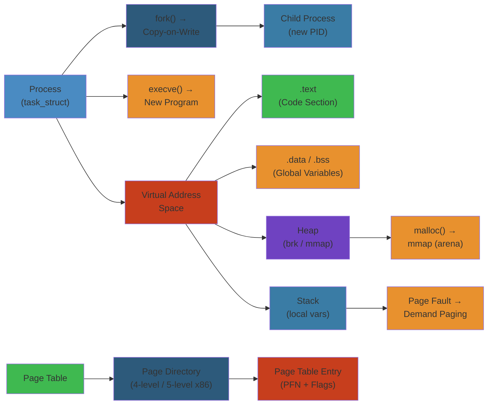

# 🖥️ Linux Process & Memory Management — Complete Deep Dive




## Table of Contents


- [Process Lifecycle](#process-lifecycle)
- [Process States](#process-states)
- [Scheduling (CFS)](#scheduling-cfs)
- [Context Switch](#context-switch)
- [Virtual Memory](#virtual-memory)
- [Memory Allocation](#memory-allocation)
- [Address Space Layout](#address-space-layout)
- [Stack](#stack)
- [Heap](#heap)
- [NUMA](#numa)
- [Cgroups v2](#cgroups-v2)
- [Namespaces](#namespaces)
- [Signals](#signals)
- [/proc Filesystem](#proc-filesystem)
- [Simplest Mental Model](#simplest-mental-model)

---

## Process Lifecycle


```text
       fork()                  execve()                _exit()
  ┌──────────┐   ┌─────────────────────────┐   ┌──────────────┐
  │  Parent  │──►│  Child (new program)    │──►│   Zombie     │
  │  clone() │   │  replaces address space │   │  (wait() to  │
  │  COW     │   │  preserves pid, ppid    │   │   reap)      │
  └──────────┘   └─────────────────────────┘   └──────────────┘
```

**fork()**: Creates child via copy-on-write. Returns 0 to child, PID to parent. Child gets copy of page tables (both point to same physical pages until write).

**execve()**: Replaces entire address space (text, data, heap, stack). Loads ELF binary. Only pid, ppid, fd table, signal dispositions survive.

**wait()/waitpid()**: Parent collects exit status. Without this → zombie. If parent dies first → orphan (reparented to init/pid 1).

**exit_group()**: glibc `exit()` calls this. Thread group exit. Calls `do_exit()` per task.

**COW (Copy on Write)**: After fork, both parent and child map same physical pages as read-only. First write triggers page fault → kernel allocates new page. Saves memory when child immediately exec().

**vfork()**: Parent blocks, child borrows parent's address space. Child must exec() or _exit() immediately. No page table copy at all.

---

## Process States


```text
                  TASK_RUNNING
                 ┌──────┬──────┐
                 │ Running │ Runnable │
                 └──────┴──────┘
                       │
        ┌──────────────┼──────────────┐
        ▼              ▼              ▼
TASK_INTERRUPTIBLE  TASK_UNINTERRUPTIBLE  TASK_STOPPED
  (wait for event)    (wait for D state)   (SIGSTOP)
        │              │                    │
        ▼              ▼                    ▼
TASK_TRACED ──── EXIT_ZOMBIE ──── EXIT_DEAD
  (ptrace)      (wait() needed)  (task struct freed)
```

| State | Flag | Meaning |
|-------|------|---------|
| `TASK_RUNNING` | 0x0000 | On runqueue or currently executing |
| `TASK_INTERRUPTIBLE` | 0x0001 | Sleeping, wakeable by signal |
| `TASK_UNINTERRUPTIBLE` | 0x0002 | Sleeping, ignores signals (D state) |
| `TASK_STOPPED` | 0x0004 | Stopped by SIGSTOP/SIGTSTP |
| `TASK_TRACED` | 0x0008 | Stopped by ptrace |
| `EXIT_ZOMBIE` | 0x0010 | Dead, task struct not yet reaped |
| `EXIT_DEAD` | 0x0020 | Final state after release_task() |

**TASK_UNINTERRUPTIBLE** (D state): Cannot be killed even by SIGKILL. Typically waiting on I/O. Can lead to hung tasks.

**TASK_KILLABLE** (`TASK_UNINTERRUPTIBLE | TASK_WAKEKILL`): Recent Linux addition. D state that can respond to fatal signals.

---

## Scheduling (CFS)


Completely Fair Scheduler (CFS) replaced O(1) scheduler in Linux 2.6.23.

```text
                        Red-Black Tree of sched_entity
                        ┌──────────────────────────────┐
                        │        root                  │
                        │         │                    │
                        │    ┌────┴────┐               │
                        │    │  node   │               │
                        │   ┌┴────────┴┐              │
                        │   │  vruntime │              │
                        │   │  = 12ms   │              │
                        │   └┬────────┬┘              │
                        │  ┌─┘        └─┐             │
                        │ ┌┴┐          ┌┴┐            │
                        │ │vr=8ms     │vr=15ms │      │
                        │ └─┘          └─┘            │
                        │   LEFT          RIGHT       │
                        │  (next to run)  (further)   │
                        └──────────────────────────────┘
```

**Key Tunables** (`/sys/kernel/debug/scheduler/` or `/proc/sys/kernel/sched_*`):

| Parameter | Typical Default | Effect |
|-----------|----------------|--------|
| `sched_latency_ns` | 24ms | Target latency per scheduling period |
| `sched_min_granularity_ns` | 3ms | Minimum preemption granularity |
| `sched_wakeup_granularity_ns` | 4ms | Wakeup preemption bias |

**vruntime**: Each task accumulates `vruntime = runtime * (NICE_0_LOAD / task_load)`. Lower priority tasks (higher nice) get more vruntime per actual CPU time, pushing them right in the RB-tree.

**pick_next_task**: Leftmost node in the RB-tree (smallest vruntime) wins.

**nice values**: Range -20 to +19. Maps to weight via `prio_to_weight[]` table. Nice 0 = 1024 weight. Each nice level ~10% CPU difference. Nice -20 gets ~25x more CPU than nice +19.

**CFS Bandwidth Control**: `cpu.cfs_quota_us` / `cpu.cfs_period_us` in cgroups. Limits CPU usage for a group.

**Scheduling Classes**:
1. **stop_class** (highest prio, for hotplug/migration)
2. **dl_class** (deadline scheduling, SCHED_DEADLINE)
3. **rt_class** (real-time, SCHED_FIFO/SCHED_RR)
4. **fair_class** (CFS, SCHED_NORMAL/SCHED_BATCH)
5. **idle_class** (SCHED_IDLE)

**SCHED_DEADLINE**: Uses CBS (Constant Bandwidth Server). Each task specifies runtime, deadline, period. Guarantees bandwidth reservation.

---

## Context Switch


```text
    Process A (running)           scheduler          Process B (running)
  ┌─────────────────────┐       ┌──────────┐      ┌─────────────────────┐
  │  user registers     │──────►│save A    │─────►│  restore B          │
  │  kernel stack       │       │pick B    │      │  user registers     │
  │  page tables        │       │switch_mm │      │  kernel stack       │
  │  FPU state          │◄──────│restore B │◄─────│  page tables        │
  └─────────────────────┘       │switch_to │      └─────────────────────┘
                                └──────────┘
```

**Components saved/restored**:
- **HW context**: CPU registers, program counter, stack pointer
- **SW context**: Kernel stack pointer (TR/TSS or per-cpu entry area)
- **Memory context**: CR3 register (page table base) → TLB flush
- **FPU/AVX state**: Deferred via lazy restore or XSAVE/XRSTOR

**Cost**: ~1-10 microseconds on modern hardware. Primary costs:
- TLB flush (unless PCID feature)
- Cache misses (warm vs cold cache)
- Branch predictor clearing

**TLB optimization**: Process Context IDentifiers (PCID) allow TLB entries tagged by process. On switch, only flush non-matching PCID entries.

**switch_mm_irqs_off**: Handles TLB flush, LDT switch, and KPTI (Kernel Page Table Isolation) switching.

**membarrier()**: Memory barrier across context switch used by RCU and JIT runtimes.

---

## Virtual Memory


```text
    Virtual Address                   Physical Memory
  ┌─────────────────┐             ┌────────────────────┐
  │  0x7fff...      │             │     RAM pages      │
  │  Stack          │             │  ┌──┐ ┌──┐ ┌──┐   │
  │  0x7f...        │  page table │  │  │ │  │ │  │   │
  │  Mappings       │────────────►│  └──┘ └──┘ └──┘   │
  │  0x6...         │  translate  │  PFN + offset      │
  │  Heap           │             └────────────────────┘
  │  0x4...         │                  │
  │  Data / BSS     │                  ▼
  │  0x4...         │              Swap (disk)
  │  Text           │             ┌──────────┐
  │  0x0...         │             │  swap    │
  └─────────────────┘             │  slots   │
                                  └──────────┘
```

**Page Table Walk (4-level, x86-64)**:

```text
  Virtual Address (48 bits):
  ┌──────────┬──────────┬──────────┬──────────┬──────────┐
  │  PML4    │  PDPT    │   PD     │    PT    │  Offset  │
  │  bits    │  bits    │  bits    │  bits    │  bits    │
  │  47-39   │  38-30   │  29-21   │  20-12   │  11-0    │
  │  9 bits  │  9 bits  │  9 bits  │  9 bits  │ 12 bits  │
  └────┬─────┴────┬─────┴────┬─────┴────┬─────┴────┬─────┘
       ▼          ▼          ▼          ▼          ▼
    PML4[0] ─► PDPT[1] ─► PD[2] ─► PT[3] ─► 4KB page
```

**Page Sizes**: 4KB (base), 2MB (huge page in PD), 1GB (huge page in PDPT).

**5-Level Paging** (since Ice Lake/5.0): Adds PML5 level, 57-bit VA, supporting up to 128 PiB virtual address space on 52-bit physical.

**Page Fault Types**:
- **Major**: Page on disk (swap or mmap'd file). Requires I/O. Shows as `majflt` in `getrusage`.
- **Minor**: Page in memory but not mapped in this process's page table. COW, lazy allocation, shared library. Shows as `minflt`.
- **Invalid**: Segmentation fault (SIGSEGV) — accessing unmapped memory.

**Demand Paging**: Pages are only loaded from disk when accessed, not at program start. ELF loader sets up VMA (virtual memory area) but doesn't load pages.

**mmap()**: Creates VMA in address space. File-backed or anonymous. Shared (writable by other processes) or private (COW on write). `MAP_POPULATE` pre-faults pages. `MAP_HUGETLB` uses huge pages.

**brk/sbrk**: Old heap management. `brk()` sets program break (end of data segment). `sbrk(incr)` increments it. Modern `malloc()` uses mmap for large allocations.

**VMA (vm_area_struct)**: Each contiguous mapped region in `/proc/pid/maps`. Contains start, end, permissions, file backing, flags. Stored in RB-tree and linked list.

---

## Memory Allocation


### Buddy Allocator


```text
  Order 0: [ 4K ][ 4K ][ 4K ][ 4K ][ 4K ][ 4K ][ 4K ][ 4K ]
  Order 1: [   8K   ][   8K   ][   8K   ][   8K   ]
  Order 2: [      16K      ][      16K      ]
  Order 3: [             32K              ]
  Order 4: [             64K              ]
```

Allocates physically contiguous pages. Splits larger blocks; merges on free. Fragmentation tracked by `/proc/buddyinfo`.

### Slab Allocator


```text
  ┌─────────────────────────────────────┐
  │ kmem_cache (e.g. task_struct)       │
  │  ┌───┬───┬───┬───┬───┬───┬───┬───┐ │
  │  │obj│obj│obj│obj│obj│obj│  │  │ │
  │  └───┴───┴───┴───┴───┴───┴───┴───┘ │
  │  partial full free                 │
  └─────────────────────────────────────┘
```

Replaces the old SLOB/SLUB allocators (SLUB is now default). Pre-allocates objects of fixed size. Caches common structs: `task_struct`, `inode`, `dentry`, `mm_struct`.

**`/proc/slabinfo`**: Shows each cache, number of objects, active count, size per object.

### kmalloc vs vmalloc


| Feature | kmalloc | vmalloc |
|---------|---------|---------|
| Physical | Contiguous | Non-contiguous |
| Virtual | Contiguous | Contiguous |
| Allocation | Buddy+Slab | Page table manipulation |
| Speed | Fast | Slower |
| Max size | ~4MB (order 10) | Up to VMALLOC_SIZE |
| Use | Device drivers, small structs | Large buffers, modules |

### Page Cache


```text
  read("file") ──► page cache lookup ──► hit? ──► return data
                                │
                               miss
                                ▼
                       I/O to disk ──► add to cache ──► return
```

Pages mapped from files. Managed by LRU lists: active, inactive, unevictable. `/proc/meminfo`: `Cached`, `Dirty`, `Writeback`, `Mapped`.

**Swap**: Pages evicted from page cache to swap device. Swap slots in swap cache. Swapin/swapout. `swapoff` moves everything back.

**OOM Killer**: When memory is exhausted and swap is full. `oom_badness()` scores processes. `/proc/pid/oom_score`, `/proc/pid/oom_adj`. Adj -1000 disables OOM kill. Adj +1000 always kills. `oom_reaper` reaps memory after kill.

### /proc/meminfo


```
MemTotal:        8172000 kB
MemFree:          183000 kB
MemAvailable:    4200000 kB
Buffers:          120000 kB
Cached:          3800000 kB
SwapCached:         4000 kB
Active:          4400000 kB
Inactive:        2500000 kB
Dirty:              8000 kB
Writeback:            0 kB
AnonPages:       2000000 kB
Mapped:           800000 kB
Shmem:            120000 kB
Slab:             280000 kB
SReclaimable:     210000 kB
SUnreclaim:        70000 kB
KernelStack:        8000 kB
PageTables:       200000 kB
Committed_AS:   8000000 kB
VmallocTotal:   34359738367 kB
VmallocUsed:       24000 kB
HugePages_Total:      0
HugePages_Free:       0
```

---

## Address Space Layout


```text
  0x0 ──────────────────────────────── Top of memory
       env strings
       argument strings
       auxiliary vectors (AT_RANDOM, AT_PHDR...)
  rsp ──► Stack (grows down, dynamic)
       │
       │   (gap / guard page)
       │
       Memory mapped region (shared libs, mmap, thread stacks)
       │
       │   (gap)
       │
  brk ──► Heap (grows up via brk/sbrk)
       Uninitialized data (BSS)
       Initialized data (.data)
       Read-only data (.rodata)
       Program text (.text ──► starts at 0x400000 typically)
  0x0 ──────────────────────────────── Bottom of memory
```

### ASLR (Address Space Layout Randomization)


Each region is randomly shifted at exec time. Controlled by `/proc/sys/kernel/randomize_va_space`:
- 0 = disabled
- 1 = randomize stack, mmap, shared libs (PIE)
- 2 = also randomize brk (heap)

**PIE** (Position Independent Executable): Entire binary position-independent. Rebase at load time via `ld.so`. Without PIE, text segment at fixed `0x400000`.

---

## Stack


**Growth**: Downwards (from high to low addresses). `RSP` points to top of stack (lowest address in use). Push decrements RSP, pop increments.

**Stack Frame**:

```text
  ┌─────────────────────────┐  RBP (base pointer)
  │  arguments passed       │
  ├─────────────────────────┤  return address
  │  saved RBP (previous)   │
  ├─────────────────────────┤  RBP (current)
  │  local variables        │
  ├─────────────────────────┤
  │  saved callee-save regs │
  └─────────────────────────┘  RSP
```

**Guard Page**: A single unmapped page at the bottom of the stack zone. Stack overflow touches it → SIGSEGV. Stack size limit via `ulimit -s` (default 8MB). RLIMIT_STACK.

**Red Zone** (x86-64 ABI): 128 bytes below RSP that signal handlers won't clobber. Leaf functions can use it without adjusting RSP.

**Thread stacks**: Created with `mmap()` for pthreads. Size set by `pthread_attr_setstacksize()`. Default ~2MB on 64-bit.

---

## Heap


**glibc malloc (ptmalloc3)**: Based on Doug Lea's malloc (dlmalloc). Uses mmap for large allocations, sbrk for small.

**Arenas**: Main arena uses sbrk. Threads get separate arenas (mmap'd) to reduce lock contention. 64-bit: number of arenas = 8 * number of cores.

**Bins**:

```text
  ┌──────────┐     ┌──────┐     ┌──────┐
  │ fastbins │────►│  16  │────►│  32  │──►... (LIFO, no coalesce)
  ├──────────┤     ├──────┤     ├──────┤
  │ tcache   │────►│ per-thread cache (glibc 2.26+)
  ├──────────┤     ├──────┤     ├──────┤
  │ unsorted │────►│ single list, recently freed
  ├──────────┤     ├──────┤     ├──────┤
  │ smallbins│────►│ 32..1024 bytes (FIFO)
  ├──────────┤     ├──────┤     ├──────┤
  │ largebins│────►│ >1024 bytes (FIFO)
  └──────────┘     └──────┘     └──────┘
```

**tcache** (thread-local cache): Per-thread cache of freed chunks. Up to 7 per size class. Reduces lock contention. Chunks can leak between threads via `tcache` access from another thread.

**mmap threshold**: Default 128KB. Allocations larger than this use `mmap()` directly. Tunable via `mallopt(M_MMAP_THRESHOLD)`.

**Fragmentation**: Internal (wasted space within chunk due to alignment/headers) and external (free chunks not adjacent, can't coalesce). glibc coalesces adjacent free chunks in regular bins (not fastbins).

**`MALLOC_TRIM`**: `malloc_trim(0)` returns heap memory to kernel via `madvise(MADV_DONTNEED)`.

---

## NUMA


**Non-Uniform Memory Access**: Access time depends on memory location relative to CPU.

```text
    ┌──────────┐         ┌──────────┐
    │   CPU 0  │─────────│  CPU 1   │
    │  ┌─────┐ │  QPI    │ ┌─────┐  │
    │  │ L3  │ │─────────│ │ L3  │  │
    │  └──┬──┘ │         │ └──┬──┘  │
    │     │    │         │    │     │
    ├──┐  │    │         ├──┐ │     │
    │RAM0◄─┘    │         │RAM1◄┘     │
    │Node 0     │         │Node 1     │
    └──────────┘         └──────────┘
```

**numactl**: `numactl --hardware` shows topology. `numactl --membind=0` binds to node 0. `numactl --interleave=all` interleaves across nodes.

**Memory policy**: `mbind()`, `set_mempolicy()`. Bind, interleave, preferred, local.

**NUMA balancing**: Automatic page migration. Scans pages, detects remote accesses, migrates pages to accessing node. `/proc/sys/kernel/numa_balancing`.

**`/sys/devices/system/node/`**: Per-node memory info: `node0/numastat`, `node0/meminfo`, `node0/distance`.

---

## Cgroups v2


**Control Groups v2** (unified hierarchy, since Linux 4.5).

```text
  /sys/fs/cgroup/
  ├── cgroup.controllers     # available controllers
  ├── cgroup.subtree_control # enabled for child cgroups
  ├── cpu/
  │   ├── cpu.max            # quota period (e.g. "50000 100000")
  │   ├── cpu.weight         # relative weight (1-10000)
  │   └── cpu.stat           # usage, throttled time
  ├── memory/
  │   ├── memory.max         # hard limit (max, or bytes)
  │   ├── memory.current     # current usage
  │   ├── memory.swap.max    # swap limit
  │   ├── memory.zswap.max   # zswap limit
  │   └── memory.stat        # detailed breakdown
  ├── io/
  │   ├── io.max             # read/write/iops limits per device
  │   └── io.weight          # relative I/O weight
  ├── pids/
  │   └── pids.max           # max process count
  ├── cpuset/
  │   ├── cpuset.cpus        # allowed CPUs
  │   └── cpuset.mems        # allowed NUMA nodes
  └── freezer/
      └── cgroup.freeze      # 1 to freeze, 0 to thaw
```

**Key Design**: Everything in single hierarchy. Controllers must be enabled in ancestors. No more cgroup v1 co-mounting.

**PSI (Pressure Stall Information)**: `/proc/pressure/{cpu,memory,io}`. Shows time spent stalled due to resource shortage. Used by cgroup memory pressure notifications.

---

## Namespaces


| Namespace | `CLONE_NEW*` | Isolates | Since |
|-----------|-------------|----------|-------|
| pid | `NEWPID` | Process IDs | 2.6.24 |
| net | `NEWNET` | Network stack, interfaces | 2.6.24 |
| mnt | `NEWNS` | Mount points | 2.4.19 |
| uts | `NEWUTS` | Hostname, domainname | 2.6.19 |
| ipc | `NEWIPC` | System V IPC, POSIX mq | 2.6.19 |
| user | `NEWUSER` | UID/GID mappings | 3.8 |
| cgroup | `NEWCGROUP` | Cgroup root | 4.6 |
| time | `NEWTIME` | Clock offsets (boot/monotonic) | 5.6 |

**Creation**: `unshare()`, `clone()` with flags, or `ip netns add` (net).

**`/proc/pid/ns/`**: Symlinks to namespace inodes. `ls -la /proc/self/ns/`. Shared namespaces have same inode numbers.

**User namespace**: Allows unprivileged users to be mapped to root inside namespace. Key to container security. `uid_map`, `gid_map` files.

---

## Signals


```text
  ┌─────────┐    ┌─────────┐    ┌────────┐
  │ pending │    │ blocked │    │ handler│
  │ sigset  │    │ sigset  │    │  table │
  └────┬────┘    └────┬────┘    └───┬────┘
       │              │             │
  kernel adds ──► check blocked ──► if unblocked,
  signal to       (mask with      call handler
  pending         SIG_BLOCK)      (or default action)
```

**Important Signals**:

| Signal | Default Action | Typical Use |
|--------|---------------|-------------|
| SIGCHLD | Ignore | Child stopped/exited (waitpid reaps) |
| SIGTERM | Terminate | Graceful shutdown request |
| SIGKILL | Terminate (cannot catch) | Force kill |
| SIGSTOP | Stop (cannot catch) | Ctrl-Z, job control |
| SIGSEGV | Core dump | Invalid memory access |
| SIGPIPE | Terminate | Write to broken pipe |
| SIGUSR1/2 | Terminate | User-defined |

**sigaction()**: Modern handler setup. `sa_handler`, `sa_sigaction` (with siginfo_t), `sa_mask` (blocked during handler), `sa_flags` (SA_RESTART, SA_SIGINFO).

**signalfd()**: Receive signals as file descriptor readable by `read()`. FD becomes readable when signal is pending. Used with epoll to integrate signals into event loop.

**Signal Mask**: `pthread_sigmask()`. `SIG_BLOCK`, `SIG_UNBLOCK`, `SIG_SETMASK`. Thread-specific in multi-threaded programs.

**Signal Delivery**: Kernel checks pending signals on return to userspace. Dequeues one signal per syscall exit. `TIF_SIGPENDING` thread flag.

**Real-time signals** (SIGRTMIN to SIGRTMAX): Queueable. Reliable (no loss). Include data (`sigqueue()` with `sival_int` or `sival_ptr`). In-band data with signal.

---

## /proc Filesystem


**Per-Process** (`/proc/[pid]/`):

| Entry | Content |
|-------|---------|
| `cmdline` | Command line (null-separated) |
| `cwd` | Symlink to current working directory |
| `environ` | Environment variables |
| `exe` | Symlink to executable |
| `fd/` | File descriptors (symlinks) |
| `fdinfo/` | FD flags, pos, mount ID |
| `maps` | Memory mappings (VMA list) |
| `smaps` | Detailed per-mapping memory stats |
| `smaps_rollup` | Aggregated smaps |
| `numa_maps` | NUMA memory policy per mapping |
| `status` | State, ppid, UID/GID, memory, signals |
| `stat` | Process stats (scheduler, time) |
| `statm` | Memory summary (size, rss, shared, text) |
| `oom_score` | OOM killer score (0-1000) |
| `oom_score_adj` | OOM score adjustment (-1000 to 1000) |
| `oom_adj` | Legacy OOM adjustment |
| `cgroup` | Cgroup membership |
| `ns/` | Namespace inode references |
| `mountinfo` | Detailed mount information |
| `pagemap` | Physical page frame mapping |
| `sched` | CFS scheduling stats |
| `task/` | Per-thread entries |

**System-wide**:

| Entry | Content |
|-------|---------|
| `cpuinfo` | CPU details per core |
| `meminfo` | RAM/Swap usage |
| `loadavg` | 1/5/15 min load averages |
| `stat` | Kernel/system statistics |
| `uptime` | Time since boot |
| `vmstat` | Virtual memory stats (page faults, swap) |
| `net/tcp` | TCP socket table |
| `net/dev` | Network interface stats |
| `diskstats` | Disk I/O per device |
| `slabinfo` | Slab allocator per-cache |
| `zoneinfo` | Per-zone memory info (DMA, Normal, HighMem) |
| `buddyinfo` | Free page fragmentation by order |
| `pagetypeinfo` | Page type count by zone/order |

---

## Simplest Mental Model


> **A Linux process is like a person with a notebook.**
>
> - **Fork** = photocopy the notebook (shared pages until someone writes)
> - **Exec** = rip out the pages, replace with new content
> - **Scheduler** = librarian deciding who reads next, giving everyone fair time
> - **Virtual memory** = notebook has numbered pages but they can be in drawers (RAM) or filing cabinet (swap)
> - **Page fault** = turning to a page that's still in the filing cabinet, need to fetch it
> - **Stack** = sticky notes on your desk, grow down as you work, pop when done
> - **Heap** = random pile of paper, grab pieces as needed, return when done
> - **Signal** = someone tapping your shoulder saying "stop", "continue", "clean up"
> - **Cgroup** = company policy on how much paper/drawer space your department gets
> - **Namespace** = pretending you're alone in your own office even though you share the building
> - **OOM** = office manager evicts the messiest desk when paper runs out

## Related

- [Tcp Ip Deep Dive](/11-networking/01-tcp-ip-deep-dive.md)
- [Tcpip Protocol Stack](/11-networking/01-tcpip-protocol-stack.md)
- [Http Protocols](/11-networking/02-http-protocols.md)
- [Tls Http Grpc](/11-networking/02-tls-http-grpc.md)
- [Dns Cdn Loadbalancing](/11-networking/03-dns-cdn-loadbalancing.md)
- [Readme](/11-networking/README.md)

## Interactive Components

### Process Memory Layout Visualization
<div style="display:flex;flex-direction:column;align-items:center;gap:8px;padding:16px;background:#0b0e14;border:1px solid #1e2a3a;border-radius:8px">
  <style>@keyframes flow-pulse{0%,100%{opacity:.3;transform:translateY(0)}50%{opacity:1;transform:translateY(-2px)}}.flow-title{color:#00d4ff;font-family:monospace;font-size:14px;font-weight:bold;margin-bottom:8px;letter-spacing:1px}.flow-node{display:inline-block;padding:8px 16px;border-radius:4px;font-size:12px;font-family:monospace;color:#e3eaf0;background:#1e3a5f;border:1px solid #00d4ff}.flow-arrow{color:#00d4ff;font-size:16px;animation:flow-pulse 1.5s infinite;font-weight:bold}</style>
  <div class="flow-title">Memory Allocation Flow</div>
  <div style="display:flex;flex-direction:column;align-items:center;gap:6px">
    <div class="flow-node">malloc() call</div>
    <div class="flow-arrow">↓</div>
    <div class="flow-node">Glibc allocator</div>
    <div class="flow-arrow">↓</div>
    <div class="flow-node">mmap() / brk()</div>
    <div class="flow-arrow">↓</div>
    <div class="flow-node">Kernel page allocator</div>
    <div class="flow-arrow">↓</div>
    <div class="flow-node">Physical memory</div>
  </div>
</div>

### Memory Metrics
<div style="padding:16px;background:#0b0e14;border:1px solid #1e2a3a;border-radius:8px">
  <style>.obs-title{color:#00d4ff;font-family:monospace;font-size:14px;font-weight:bold;margin-bottom:16px;letter-spacing:1px}.obs-grid{display:grid;grid-template-columns:repeat(auto-fit, minmax(150px, 1fr));gap:12px}.obs-card{padding:12px;background:#1a2332;border:1px solid #1e3a5f;border-radius:4px;display:flex;flex-direction:column;align-items:center;transition:all 0.3s}.obs-card:hover{border-color:#00d4ff;box-shadow:0 0 8px rgba(0, 212, 255, 0.3)}.obs-label{color:#a3aab8;font-family:monospace;font-size:11px;text-transform:uppercase;letter-spacing:0.5px;margin-bottom:8px}.obs-value{font-family:monospace;font-size:20px;font-weight:bold;margin-bottom:4px;letter-spacing:0.5px}.obs-unit{color:#a3aab8;font-family:monospace;font-size:10px;text-transform:uppercase}.metric-healthy{color:#34d399}.metric-warning{color:#fbbf24}.metric-critical{color:#ef4444}</style>
  <div class="obs-title">Process Memory Stats</div>
  <div class="obs-grid">
    <div class="obs-card"><div class="obs-label">RSS</div><div class="obs-value metric-healthy">256</div><div class="obs-unit">MB</div></div>
    <div class="obs-card"><div class="obs-label">VSZ</div><div class="obs-value metric-healthy">1024</div><div class="obs-unit">MB</div></div>
    <div class="obs-card"><div class="obs-label">Heap Size</div><div class="obs-value metric-healthy">128</div><div class="obs-unit">MB</div></div>
    <div class="obs-card"><div class="obs-label">Shared</div><div class="obs-value metric-healthy">32</div><div class="obs-unit">MB</div></div>
  </div>
</div>
