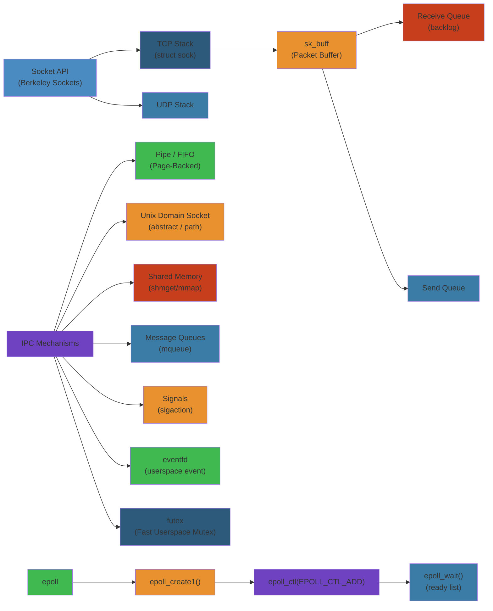

# 🌐 Linux Networking & IPC — Complete Deep Dive




## Table of Contents


- [Socket Internals](#socket-internals)
- [Berkeley Sockets API](#berkeley-sockets-api)
- [TCP Stack](#tcp-stack)
- [Zero-Copy](#zero-copy)
- [epoll](#epoll)
- [Unix Domain Sockets](#unix-domain-sockets)
- [Pipes/FIFO](#pipesfifo)
- [Shared Memory](#shared-memory)
- [Message Queues](#message-queues)
- [eBPF](#ebpf)
- [Netfilter/nftables](#netfilternftables)
- [Netlink Sockets](#netlink-sockets)
- [Network Namespaces & Virtual Networking](#network-namespaces--virtual-networking)
- [Simplest Mental Model](#simplest-mental-model)

---

## Socket Internals


```text
  Userspace                Kernel
  ┌──────────────┐    ┌──────────────────────┐
  │  fd = socket()│───►│  struct socket       │
  │              │    │  ┌────────────────┐   │
  │  send(fd)    │    │  │ sk = sock      │   │
  │  recv(fd)    │    │  │ ┌────────────┐ │   │
  │  close(fd)   │    │  │ │sk_buff     │ │   │
  └──────────────┘    │  │ │(receive Q) │ │   │
                      │  │ ├────────────┤ │   │
                      │  │ │sk_buff     │ │   │
                      │  │ │(write Q)   │ │   │
                      │  │ └────────────┘ │   │
                      │  │ proto_ops      │   │
                      │  │ (inet_stream_ops)│  │
                      │  └────────────────┘   │
                      │  INET layer           │
                      │  ┌────────────────┐   │
                      │  │ TCP/UDP        │   │
                      │  │ tcp_v4_connect │   │
                      │  │ tcp_v4_rcv     │   │
                      │  └────────────────┘   │
                      └──────────────────────┘
```

**Kernel Objects**:
- **`struct socket`**: BSD socket layer. `ops` (proto_ops), `sock` (inode for VFS).
- **`struct sock`**: INET socket. Contains all protocol state (sndbuf, rcvbuf, congestion, retransmit). Huge struct (~5000 bytes, using SLAB cache).
- **`struct sk_buff`**: Packet buffer. `head`, `data`, `tail`, `end` pointers. `skb_shared_info` at tail. `dev`, `sk`, `protocol`, `cb[48]` (control block per layer).
- **`struct proto_ops`**: Method table: `.connect`, `.accept`, `.listen`, `.sendmsg`, `.recvmsg`, `.bind`, `.ioctl`, `.mmap`.
- **`struct proto`**: Transport-specific: `.connect`, `.disconnect`, `.hash`, `.unhash`, `.close`, `.rcv_msg`, `.send_msg`, `.shutdown`.

**Socket buffer manipulation**:

```text
  sk_buff layout:
  ┌──────┬──────┬────────────┬──────┬────────────────┐
  │ head │ data │    payload    │ tail │  skb_shared_info  │
  └──────┴──────┴────────────┴──────┴────────────────┘
  │←headroom→│                │←tailroom→│

  push: head→data (add header)
  pull: data→tail (remove header)
  put:  tail→end (add payload)
  trim: end→tail (remove payload)
```

---

## Berkeley Sockets API


| Call | Description | Key syscall |
|------|-------------|-------------|
| `socket()` | Create endpoint | `sys_socket(domain, type, protocol)` |
| `bind()` | Assign address | `sys_bind(fd, addr, addrlen)` |
| `listen()` | Mark as passive | `sys_listen(fd, backlog)` — SYN queue + accept queue |
| `accept()` | Accept connection | `sys_accept4(fd, addr, addrlen, flags)` — SOCK_CLOEXEC |
| `connect()` | Initiate connection | `sys_connect(fd, addr, addrlen)` |
| `send()` | Send data | `sys_sendto(fd, buf, len, flags, NULL, 0)` |
| `recv()` | Receive data | `sys_recvfrom(fd, buf, len, flags, NULL, NULL)` |
| `sendmsg()` | Scatter-gather send | `sys_sendmsg(fd, msg, flags)` — msghdr with iovec |
| `recvmsg()` | Scatter-gather recv | `sys_recvmsg(fd, msg, flags)` — ancillary data |
| `close()` | Close fd | `sys_close(fd)` |
| `shutdown()` | Shutdown connection | `sys_shutdown(fd, how)` — SHUT_RD/WR/RDWR |

**`struct msghdr`**: `msg_name` (dest addr), `msg_iov` (iovec array), `msg_control` (ancillary data), `msg_flags` (MSG_CTRUNC, MSG_EOR).

**Flags**: `MSG_OOB` (out-of-band), `MSG_WAITALL` (block until full len), `MSG_NOSIGNAL` (no SIGPIPE on closed), `MSG_DONTWAIT` (non-blocking), `MSG_MORE` (like TCP_CORK for send).

---

## TCP Stack


### Three-Way Handshake


```text
  Client                      Server
    │                           │
    │───── SYN (seq=100) ──────►│
    │                           │
    │◄── SYN+ACK (seq=300, ack=101) ─┤
    │                           │
    │───── ACK (seq=101, ack=301) ──►│
    │                           │
    │◄======== DATA ============►│
    │                           │
```

**Sequence numbers**: Random ISN (Initial Sequence Number). `/proc/sys/net/ipv4/tcp_keepalive_time`.

**Window scaling**: `tcp_adv_win_scale`, `tcp_rmem`, `tcp_wmem`. RFC 1323. Allows >64KB window. 14-bit shift count.

**Congestion Control Algorithms**:

| Algorithm | Type | Key Idea | Default in |
|-----------|------|----------|------------|
| Reno | AIMD | Additive inc, multiplicative dec | Legacy |
| CUBIC | BIC-based | Cubic function for window growth | Linux since 2.6.19 |
| BBR | Model-based | Bandwidth + RTT model | Since 4.9 |
| Tahoe | AIMD | Reno + fast retransmit | Historical |
| Westwood | End-to-end | Bandwidth estimation over loss | Realtek |
| DCTCP | Data-center | ECN-based, low latency | DC |

**CUBIC**: After loss, window reduces by 20%. Growth follows cubic function: `W(t) = C(t-K)^3 + Wmax`. Fast growth after long idle (no RTT bias).

**BBR**: Estimates bottleneck bandwidth and round-trip propagation time. Pacing-based, not loss-based. `bbr_bw` and `bbr_min_rtt`. No packet loss induced.

**Nagle's Algorithm**: Delays small writes to coalesce. Wait for ACK of previous data or buffer full enough. Disable via `TCP_NODELAY`.

**Delayed ACK**: Linux delays ACK up to 200ms (`tcp_delack_min`, `tcp_delack_max`). Allows piggybacking ACK on data.

**TCP_CORK**: Like Nagle on steroids. Doesn't send until buffer full or TCP_NODELAY or timeout.

**TSO/GSO (TCP/GENERIC Segmentation Offload)**: Stack hands large (>MSS) segments to NIC. NIC segments into MSS-sized packets. Reduces per-packet overhead.

```text
  Without TSO:     With TSO:
  4x1500B packets  1x6000B packet
  ┌──┐┌──┐┌──┐┌──┐  ┌────────┐
  │p1││p2││p3││p4│  │ 6000B  │
  └──┘└──┘└──┘└──┘  └────────┘
  CPU segments     NIC segments
```

**GRO (Generic Receive Offload)**: NIC coalesces multiple packets into one large skb. Reverse of TSO. Reduces skb processing.

**TPA (TCP Pacing)**: Kernel rate-limits sending to avoid bursts. `tcp_pacing_ca_usr` (pacing for C.A.) + `tcp_pacing_ss_ratio` (slow start multiplier).

**tcp_info**: `getsockopt(TCP_INFO)` returns `struct tcp_info`: srtt, mdev, snd_cwnd, snd_ssthresh, rcv_space, total_retrans, pacing_rate, delivered, delivered_ce.

---

## Zero-Copy


| Method | Direction | System Calls | Description |
|--------|-----------|-------------|-------------|
| `sendfile()` | File→Socket | `sendfile(out_fd, in_fd, off, count)` | DMA from page cache to NIC |
| `splice()` | Pipe→FD | `splice(in_fd, off, out_fd, off, len, flags)` | Move pages between buffers |
| `tee()` | Pipe→Pipe | `tee(in_fd, out_fd, len, flags)` | Duplicate pipe buffers |
| `vmsplice()` | User→Pipe | `vmsplice(fd, iov, nr_segs, flags)` | Pin user pages into pipe |
| `SO_ZEROCOPY` | Socket→NIC | Setsockopt + `MSG_ZEROCOPY` | Skip copy from user to kernel |

**sendfile()**: Transfer file to socket without data going through userspace. Used by web servers for static files. Internally: `splice` from file to pipe, `splice` from pipe to socket.

**SO_ZEROCOPY + MSG_ZEROCOPY**: Application sends data, kernel pins user pages and DMA's directly. Notifies completion via `SO_EE_ORIGIN_ZEROCOPY` error queue. Application must not reuse buffer until notified.

**Cross-memory attach**: `process_vm_readv()`, `process_vm_writev()`. Read/write memory of another process. Used by debuggers, lttng-ust (user-space tracing).

---

## epoll


**Event notification interface**. Scales to millions of FDs.

```text
                    epoll_fd
  ┌──────────────────────────────────┐
  │  struct eventpoll                │
  │  ┌────────────────┐             │
  │  │ ready_list     │───► rbtree  │
  │  │ (active fds)   │    (all     │
  │  └────────────────┘     monitored│
  │  │                     fds)     │
  │  └───────────────────────────────┘
  │    wait queue (blocked threads)
  └──────────────────────────────────┘
```

**API**:

```c
int epfd = epoll_create1(EPOLL_CLOEXEC);
struct epoll_event ev = {.events = EPOLLIN, .data.fd = fd};
epoll_ctl(epfd, EPOLL_CTL_ADD, fd, &ev);
int nfds = epoll_wait(epfd, events, maxevents, timeout);
```

**Edge-Triggered vs Level-Triggered**:

| Mode | Behavior | When to use |
|------|----------|-------------|
| **Level-Triggered (default)** | Re-arms event if data still present | Simpler; `epoll_wait` keeps returning |
| **Edge-Triggered** | Event fires only on state change | Must read all data; non-blocking I/O required |

**Implementation**: Each FD's wait queue has `ep_pqueue` callback. On event (e.g., data arrives), callback adds fd to `ep->ready_list` and wakes blocked threads.

**epoll vs poll vs select**:

| Feature | select | poll | epoll |
|---------|--------|------|-------|
| Max FDs | FD_SETSIZE (~1024) | No limit | No limit |
| Copy | Bitmap copy each call | Full array copy | Once (epoll_ctl) |
| Monitoring | O(n) scan | O(n) scan | O(1) per event |
| Workflow | Rebuild fdset each call | Rebuild pollfd each call | Register once, wait |

**EPOLLEXCLUSIVE** (since 4.5): Only wake one thread per event. Avoids thundering herd on listener socket.

**EPOLLONESHOT**: Auto-disarm after one event. Must rearm via `EPOLL_CTL_MOD`. Edge-triggered workflows.

**epoll_pwait2()**: nanosecond timeout resolution.

---

## Unix Domain Sockets


**Communication within same host**. Uses filesystem path or abstract namespace.

| Type | Semantics |
|------|-----------|
| `SOCK_STREAM` | Reliable, connection-oriented (like TCP) |
| `SOCK_DGRAM` | Datagram (like UDP, but reliable and in-order) |
| `SOCK_SEQPACKET` | Record-based, connection-oriented, preserves message boundaries |

**Abstract Namespace**: Bind to `"\0abstract_name"` (leading null byte). Not in filesystem. No cleanup needed on close. `sun_path[0] = '\0'`.

**Credentials Passing**: `SCM_CREDENTIALS` ancillary data. Sender struct ucred (pid, uid, gid). Receiver must set `SO_PASSCRED`.

**FD Passing** (`SCM_RIGHTS`): Send file descriptor to another process. Kernel increments refcount on send, decrements on close of sender's fd. Receiver gets new fd number. Works across namespace boundaries.

**Performance**: Unix sockets are ~2x faster than TCP over loopback. No protocol overhead (no headers, checksums, congestion). Uses `sock_alloc_send_skb` / `unix_stream_sendmsg`.

**Buffer sizes**: `net/unix/max_dgram_qlen` (default 10 for dgram). Stream socket uses `sk_sndbuf`/`sk_rcvbuf` from sysctl.

---

## Pipes/FIFO


**Anonymous pipes**: `pipe(int pipefd[2])`. `pipefd[0]` = read end, `pipefd[1]` = write end.

**Named pipes (FIFO)**: `mkfifo(path, mode)`. `open()` then read/write. Bidirectional if opened read-write.

```text
  Process A                            Process B
  ┌──────────┐     pipe buffer     ┌──────────┐
  │  write()  │────► circular ────►│  read()  │
  │ pipefd[1] │     buffer (pages)  │ pipefd[0]│
  └──────────┘                     └──────────┘
```

**Pipe buffer**: Per-pipe circular buffer of pages. Default 16 pages (64KB). `fcntl(fd, F_SETPIPE_SZ)` to change. Max: `/proc/sys/fs/pipe-max-size` (1MB default).

**PIPE_BUF**: Minimum size of atomic write (POSIX: 4096). Writes ≤ PIPE_BUF are atomic. Larger writes may interleave with other writers.

**splice redirection**: `splice()` moves pages from source pipe to destination without copying. Used by `sendfile()` internally.

**`O_NONBLOCK`**: Read on empty pipe returns -EAGAIN. Write on full pipe returns -EAGAIN (or partial).

**`pipe2()`**: Like pipe(2) but with flags: `O_CLOEXEC`, `O_DIRECT` (packet mode), `O_NONBLOCK`.

---

## Shared Memory


### System V Shared Memory


```c
int shmid = shmget(IPC_PRIVATE, size, IPC_CREAT | 0666);
void *addr = shmat(shmid, NULL, 0);   // attach
shmdt(addr);                            // detach
shmctl(shmid, IPC_RMID, NULL);        // remove
```

**Kernel limits** (`/proc/sys/kernel/`):
- `shmmax` — max size of single segment (default 32MB or higher)
- `shmall` — total pages allowed for shm
- `shmmni` — max number of segments

**SHM_HUGETLB**: Backed by huge pages. `shmget()` with `SHM_HUGETLB` flag.

### POSIX Shared Memory


```c
int fd = shm_open("/myregion", O_CREAT | O_RDWR, 0666);
ftruncate(fd, size);
void *addr = mmap(NULL, size, PROT_READ|PROT_WRITE, MAP_SHARED, fd, 0);
close(fd);
shm_unlink("/myregion");
```

Files under `/dev/shm/` (tmpfs). `ls /dev/shm`. Survives as long as referenced (open FD or mmap).

### memfd_create


```c
int fd = memfd_create("name", MFD_CLOEXEC | MFD_ALLOW_SEALING);
ftruncate(fd, size);
void *addr = mmap(NULL, size, PROT_READ|PROT_WRITE, MAP_SHARED, fd, 0);
```

Anonymous file descriptor (no filesystem path). Can be passed via SCM_RIGHTS. Supports seals (F_SEAL_SHRINK, F_SEAL_GROW, F_SEAL_WRITE, F_SEAL_SEAL). Used by Wayland, pipewire, flatpak.

---

## Message Queues


### POSIX Message Queues


```c
mqd_t mqd = mq_open("/mqname", O_CREAT | O_RDWR, 0666, &attr);
mq_send(mqd, msg, len, priority);
ssize_t n = mq_receive(mqd, buf, len, &priority);
mq_close(mqd);
mq_unlink("/mqname");
```

**Notification**: `mq_notify(mqd, &sevp)` — signal or thread callback on message arrival.

**`/proc/sys/fs/mqueue/`**: `msg_max` (default 10), `msgsize_max` (default 8192), `queues_max` (default 256).

**Kernel implementation**: Uses `struct mqueue_inode_info`. Messages stored in RB-tree (priority-sorted). Compatible with epoll.

### System V Message Queues


```c
int msqid = msgget(IPC_PRIVATE, IPC_CREAT | 0666);
msgsnd(msqid, &buf, len, 0);
ssize_t n = msgrcv(msqid, &buf, len, msgtype, 0);
msgctl(msqid, IPC_RMID, NULL);
```

**msgtype**: >0 receive specific type, 0 receive first, <0 receive <= absolute value.

---

## eBPF


**Extended Berkeley Packet Filter**: In-kernel virtual machine. Sandboxed programs attached to events.

```text
  ┌──────────────────┐    ┌──────────────────┐
  │  BPF Program     │    │  BPF Map         │
  │  (bytecode,      │    │  (hash, array,   │
  │   verified)      │    │   ring buf, etc) │
  └────────┬─────────┘    └────────┬─────────┘
           │                       │
           │    reads/writes       │
           └───────────────────────┘
                    │
                    ▼
  Attach points: XDP, tc, cgroup, kprobe, tracepoint, perf_event, socket
```

**BPF Program Types**:

| Type | Attach Point | Use Case |
|------|-------------|----------|
| `BPF_PROG_TYPE_XDP` | NIC driver (early) | DDoS filtering, load balancing |
| `BPF_PROG_TYPE_SCHED_CLS` | tc ingress/egress | Traffic control, shaping |
| `BPF_PROG_TYPE_CGROUP_SKB` | cgroup socket | Container network policy |
| `BPF_PROG_TYPE_KPROBE` | kprobe/kretprobe | Dynamic tracing |
| `BPF_PROG_TYPE_TRACEPOINT` | Tracepoint | Static tracing |
| `BPF_PROG_TYPE_SOCKET_FILTER` | Raw socket | Socket filtering |
| `BPF_PROG_TYPE_SK_SKB` | Socket map | Rewrite/redirect sockets |

**BPF Maps**: `bpf_map_create()`, `bpf_map_lookup_elem()`, `bpf_map_update_elem()`, `bpf_map_delete_elem()`. Types: BPF_MAP_TYPE_HASH, ARRAY, LRU_HASH, PERCPU_HASH, RINGBUF, STACK, QUEUE, SOCKMAP, CPUMAP, DEVMAP.

**XDP (eXpress Data Path)**: BPF program runs at NIC driver level, before skb allocation. Returns: XDP_DROP, XDP_PASS, XDP_TX (redirect back out same NIC), XDP_REDIRECT (to other NIC/CPU), XDP_ABORTED.

**tc BPF**: Attach to `clsact` qdisc. Ingress/egress. Can modify, redirect, drop packets.

**BTF (BPF Type Format)**: Debug info for BPF programs. Enables CO-RE (Compile Once, Run Everywhere). Relocation against kernel's BTF.

**CO-RE**: BPF compiled once, adapts to kernel struct field offsets at load time. No need to recompile for different kernel versions. Uses `BPF_CORE_READ()` macros and `__builtin_preserve_access_index()`.

**Verifier**: Checks BPF program safety: no loops (or bounded loops since 5.3), valid memory access, no out-of-bounds, no null pointer deref. Max 1M instructions (complexity limit).

**bpftrace**: High-level tracing language. One-liners:

```bpftrace
# Count syscalls by process
bpftrace -e 'tracepoint:syscalls:sys_enter_* { @[comm, probe] = count(); }'

# Block I/O latency
bpftrace -e 'kprobe:blk_start_request { @start[tid] = nsecs; }
             kretprobe:blk_start_request { $s = @start[tid]; delete(@start[tid]); @us = hist(($s - nsecs) / 1000); }'
```

---

## Netfilter/nftables


```text
  Packet Flow through Netfilter hooks:

  ┌───►[PREROUTING]───►[Routing]───►[FORWARD]───►[POSTROUTING]───► out
  │        │                            │
  │        ▼                            │
  │    [INPUT]                       [OUTPUT]
  │        │                            │
  │        ▼                            │
  └──── local process ◄─────────────────┘
```

**Hook Points**:
1. **NF_INET_PRE_ROUTING**: Before routing decision
2. **NF_INET_LOCAL_IN**: For locally destined packets
3. **NF_INET_FORWARD**: Forwarded packets
4. **NF_INET_LOCAL_OUT**: Packets from local process
5. **NF_INET_POST_ROUTING**: After routing, before wire

**Tables** (nftables replaces iptables):

| Table | Purpose |
|-------|---------|
| `filter` | Packet filtering (allow/deny) |
| `nat` | NAT (SNAT/DNAT/masquerade) |
| `mangle` | Packet modification (TTL, DSCP) |
| `raw` | Connection tracking bypass |
| `security` | SELinux secmark |

**Connection Tracking (conntrack)**: `nf_conntrack`. Tracks state of each connection: NEW, ESTABLISHED, RELATED, INVALID. `/proc/net/nf_conntrack`. Max entries: `nf_conntrack_max`.

**NAT**: Source NAT (SNAT, masquerade) changes source IP/port. Destination NAT (DNAT, redirect) changes dest IP/port. Both modify packet + reverse translation on reply.

**nftables syntax**:

```bash
nft add table inet filter
nft add chain inet filter input { type filter hook input priority 0 \; }
nft add rule inet filter input tcp dport 22 accept
nft add rule inet filter input ct state established,related accept
nft add rule inet filter input drop
```

---

## Netlink Sockets


**Netlink**: Communication between kernel and userspace. Socket family `AF_NETLINK`.

```text
  Userspace                           Kernel
  ┌──────────────────┐    ┌──────────────────────┐
  │  socket(AF_NETLINK│    │                      │
  │    , SOCK_RAW,   │───►│  netlink_kernel_create│
  │    NETLINK_ROUTE)│    │                      │
  │  sendmsg()       │    │  netlink_rcv_skb()   │
  │  recvmsg()       │◄───│  netlink_unicast()   │
  └──────────────────┘    └──────────────────────┘
```

| Protocol | Family | Use |
|----------|--------|-----|
| `NETLINK_ROUTE` | rtnetlink | Network config (ip link, ip addr, ip route) |
| `NETLINK_KOBJECT_UEVENT` | udev event | Device hotplug |
| `NETLINK_GENERIC` | genl | Generic netlink (custom protocols) |
| `NETLINK_NETFILTER` | nfnetlink | netfilter configuration |
| `NETLINK_SELINUX` | selinux | SELinux events |
| `NETLINK_AUDIT` | audit | Audit subsystem |

**rtnetlink**: `ip link add`, `ip addr add`, `ip route add` all go through `NETLINK_ROUTE`. Struct `ifinfomsg`, `ifaddrmsg`, `rtmsg` with NLA (Netlink Attributes).

**Generic Netlink**: Extensible protocol for kernel→userspace communication. Used by: cfg80211 (Wi-Fi), acpi, tcp_metrics, wwan. Family registration with `genl_register_family()`.

---

## Network Namespaces & Virtual Networking


```text
  ┌──────────────────┐    ┌──────────────────┐
  │  netns blue      │    │  netns red       │
  │                  │    │                  │
  │  lo: 127.0.0.1  │    │  lo: 127.0.0.1  │
  │  veth0: 10.0.0.1│────│  veth1: 10.0.0.2│
  │  ┌──────────┐   │    │  ┌──────────┐   │
  │  │ nginx    │   │    │  │ postgres │   │
  │  └──────────┘   │    │  └──────────┘   │
  └──────────────────┘    └──────────────────┘
```

**veth pairs**: Virtual Ethernet. Packets in one end appear on the other. `ip link add veth0 type veth peer name veth1`. Usually one end in each namespace.

**Bridge**: Virtual switch (`ip link add br0 type bridge`). Forwards L2 between ports (veths, TAPs, physical NICs). Uses FDB (forwarding database, learned MACs). `bridge fdb show`.

**tun/tap**: Virtual network kernel devices. tun (L3, /dev/net/tun), tap (L2, /dev/net/tap). Userspace program reads/writes packets. Used by VPNs (OpenVPN, WireGuard), VMs (QEMU).

**macvlan**: Multiple MAC addresses on one physical NIC. Subtypes: private, vepa, bridge, passthru. `ip link add mac0 link eth0 type macvlan mode bridge`.

**ipvlan**: Shares MAC but has separate IP. L3-based. L2 or L3 mode. `ip link add ipv0 link eth0 type ipvlan mode l3`. Used by containers.

---

## Simplest Mental Model


> **Linux networking and IPC is a post office with various delivery services.**
>
> - **Socket** = a mailbox. You set up your address (bind), wait for letters (accept), write letters (send), get letters (recv).
> - **TCP** = registered mail with return receipts. Every letter is numbered (seq/ack). If lost, sender resends. Congestion control = throttling letters when the mail truck is full.
> - **UDP** = postcard. Fire and forget. Cheap but might get lost.
> - **epoll** = a sorting clerk who rings a bell when any of your mailboxes has mail. You don't have to check each one individually.
> - **Unix socket** = passing notes within the same building. No stamp needed, much faster.
> - **Pipe** = a tube between two desks. Stuff goes in one end, comes out the other. PIPE_BUF = the tube can't mix things if you push less than 4096 bytes.
> - **Shared memory** = a whiteboard both people can see and write on. Fastest communication — no copying. But you need locks to avoid chaos.
> - **eBPF** = a tiny inspector you can embed inside the mailbox sorting room itself. It can check every letter before it's even stamped, drop spam before it enters the building.
> - **Network namespace** = a separate virtual post office for each tenant. They each have their own lo, their own eth, their own routing table.
> - **veth pair** = a pneumatic tube connecting two post offices. Push a letter in one end, it pops out the other.


## Practical Example


See code examples above for practical usage patterns.

## Interactive Components

### Network Packet Flow
<div style="display:flex;flex-direction:column;align-items:center;gap:8px;padding:16px;background:#0b0e14;border:1px solid #1e2a3a;border-radius:8px">
  <style>@keyframes flow-pulse{0%,100%{opacity:.3;transform:translateY(0)}50%{opacity:1;transform:translateY(-2px)}}.flow-title{color:#00d4ff;font-family:monospace;font-size:14px;font-weight:bold;margin-bottom:8px;letter-spacing:1px}.flow-node{display:inline-block;padding:8px 16px;border-radius:4px;font-size:12px;font-family:monospace;color:#e3eaf0;background:#1e3a5f;border:1px solid #00d4ff}.flow-arrow{color:#00d4ff;font-size:16px;animation:flow-pulse 1.5s infinite;font-weight:bold}</style>
  <div class="flow-title">IPC Message Flow</div>
  <div style="display:flex;flex-direction:column;align-items:center;gap:6px">
    <div class="flow-node">send() call</div>
    <div class="flow-arrow">↓</div>
    <div class="flow-node">Kernel socket buffer</div>
    <div class="flow-arrow">↓</div>
    <div class="flow-node">Network stack</div>
    <div class="flow-arrow">↓</div>
    <div class="flow-node">Network device</div>
    <div class="flow-arrow">↓</div>
    <div class="flow-node">Receive socket</div>
  </div>
</div>

### Network Metrics
<div style="padding:16px;background:#0b0e14;border:1px solid #1e2a3a;border-radius:8px">
  <style>.obs-title{color:#00d4ff;font-family:monospace;font-size:14px;font-weight:bold;margin-bottom:16px;letter-spacing:1px}.obs-grid{display:grid;grid-template-columns:repeat(auto-fit, minmax(150px, 1fr));gap:12px}.obs-card{padding:12px;background:#1a2332;border:1px solid #1e3a5f;border-radius:4px;display:flex;flex-direction:column;align-items:center;transition:all 0.3s}.obs-card:hover{border-color:#00d4ff;box-shadow:0 0 8px rgba(0, 212, 255, 0.3)}.obs-label{color:#a3aab8;font-family:monospace;font-size:11px;text-transform:uppercase;letter-spacing:0.5px;margin-bottom:8px}.obs-value{font-family:monospace;font-size:20px;font-weight:bold;margin-bottom:4px;letter-spacing:0.5px}.obs-unit{color:#a3aab8;font-family:monospace;font-size:10px;text-transform:uppercase}.metric-healthy{color:#34d399}.metric-warning{color:#fbbf24}</style>
  <div class="obs-title">Network Performance</div>
  <div class="obs-grid">
    <div class="obs-card"><div class="obs-label">Throughput</div><div class="obs-value metric-healthy">940</div><div class="obs-unit">Mbps</div></div>
    <div class="obs-card"><div class="obs-label">Latency</div><div class="obs-value metric-healthy">0.3</div><div class="obs-unit">ms</div></div>
    <div class="obs-card"><div class="obs-label">Packet Loss</div><div class="obs-value metric-healthy">0.01</div><div class="obs-unit">%</div></div>
    <div class="obs-card"><div class="obs-label">Jitter</div><div class="obs-value metric-healthy">0.15</div><div class="obs-unit">ms</div></div>
  </div>
</div>

## Related

- [Tcp Ip Deep Dive](/11-networking/01-tcp-ip-deep-dive.md)
- [Tcpip Protocol Stack](/11-networking/01-tcpip-protocol-stack.md)
- [Http Protocols](/11-networking/02-http-protocols.md)
- [Tls Http Grpc](/11-networking/02-tls-http-grpc.md)
- [Dns Cdn Loadbalancing](/11-networking/03-dns-cdn-loadbalancing.md)
- [Readme](/11-networking/README.md)
