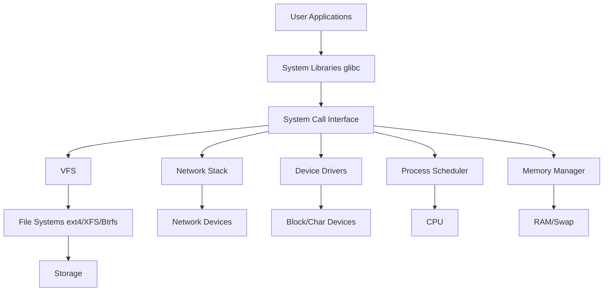
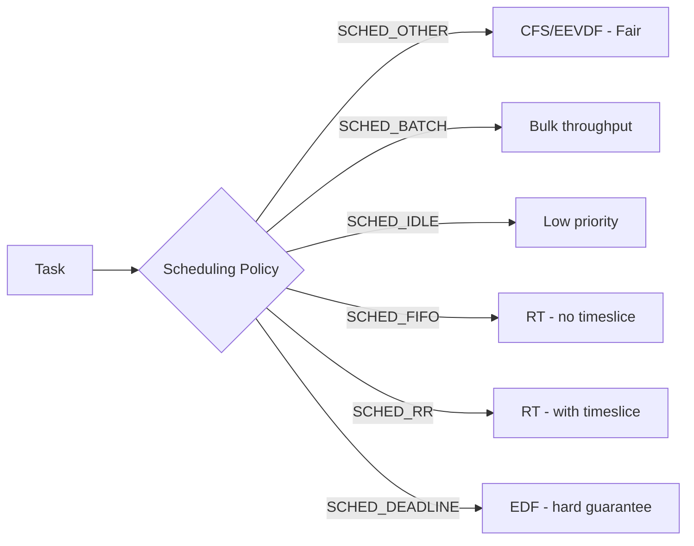

# Operating Systems — Complete Deep Dive 🖥️


> **Run the live simulator**: [page-replacement.html](/12-operating-systems/page-replacement.html) — step through FIFO, LRU, and LFU page replacement algorithms interactively.

The OS is the **resource manager** between hardware and applications. It virtualizes CPU, memory, storage, and devices into clean abstractions (processes, virtual memory, files, sockets).

**Related**: [Linux Internals](/12-operating-systems/README.md) · [Networking](/11-networking/README.md) · [Performance Engineering](/18-performance-engineering/README.md) · [Distributed Systems](/09-distributed-systems/README.md)

---

## Table of Contents

- [Architecture Overview](#architecture-overview-)
- [Kernel Internals](#1-kernel-internals-)
- [CPU Scheduling](#2-cpu-scheduling-)
- [Processes & Threads](#3-processes--threads-)
- [Memory Management](#4-memory-management-)
- [I/O Models](#5-io-models-)
- [Storage & File Systems](#6-storage--file-systems-)
- [Inter-Process Communication](#7-inter-process-communication-ipc-)
- [System Calls](#8-system-calls-)
- [Synchronization Primitives](#9-synchronization-primitives-)
- [Observability & Tracing](#10-observability--tracing-)
- [Virtualization & Containers](#11-virtualization--containers-)
- [Real-Time OS](#12-real-time-os-)
- [Learning Path](#-learning-path)
- [Related Domains](#-related-domains)
- [Simplest Mental Model](#-simplest-mental-model)

---

## Architecture Overview 🏛️



---

## 1. Kernel Internals 💾

### Monolithic vs Microkernel
- **Linux**: Monolithic kernel with dynamically loadable modules
- **Microkernel** (Minix, QNX): Minimal kernel, services in user space
- **Hybrid** (Windows NT): Microkernel-ish but with kernel-mode subsystems

### Linux Kernel Subsystems
| Subsystem | Responsibility | Key Files |
|-----------|---------------|-----------|
| Scheduler | CPU time allocation | `kernel/sched/` |
| Memory Manager | Virtual memory, page alloc | `mm/` |
| VFS | File system abstraction | `fs/` |
| Network Stack | Protocol implementation | `net/` |
| Device Drivers | Hardware communication | `drivers/` |
| IPC | Inter-process communication | `ipc/` |

### Key Concepts
- **Kernel Space vs User Space**: Protected ring separation (ring 0 vs ring 3)
- **Context Switch**: Kernel saves/restores register state on process switch (~1-10μs)
- **Interrupts**: Hardware IRQs → IDT → interrupt handler → bottom half (softirq/tasklet/workqueue)
- **System Calls**: `sys_call_table` indexed by syscall number, `SYSCALL_DEFINEn` macros
- **Modules**: `.ko` files, `insmod`/`rmmod`, `module_init`/`module_exit`

---

## 2. CPU Scheduling ⏱️

### Scheduler Evolution
| Scheduler | Kernel | Algorithm | Complexity |
|-----------|--------|-----------|------------|
| O(n) | 2.4 | Circular linked list traversal | O(n) |
| O(1) | 2.6 | Two-runqueue arrays (active/expired), priority buckets | O(1) |
| CFS | 2.6.23+ | Red-black tree, `vruntime`-based, fair sharing | O(log n) |
| EEVDF | 6.6+ | Earliest Eligible Virtual Deadline First, better latency | O(log n) |
| RT | 2.6+ | FIFO/RR policies for real-time tasks | O(1) |

### Completely Fair Scheduler (CFS)
- **Target**: Perfect fair CPU allocation among runnable tasks
- **vruntime**: Tracks runtime weighted by nice value. Scheduler picks smallest `vruntime`
- **Red-Black Tree**: Self-balancing BST for O(log n) task selection
- **Scheduling Classes**: `stop > deadline > realtime > fair > idle`
- **Timeslice**: Dynamically computed from `sysctl_sched_latency` and task count
- **Group Scheduling**: Hierarchical fair sharing via CPU cgroups

### EEVDF (Earliest Eligible Virtual Deadline First)
- **Replaces CFS** in Linux 6.6+
- Each task gets a **virtual deadline** based on weight and timeslice
- Scheduler picks task with earliest eligible deadline
- Better **latency** for latency-sensitive workloads
- More **deterministic** wake-up latency

### O(1) Scheduler
- Two priority arrays (active + expired), 140 priority levels
- Bitmap-based `find_first_bit()` for O(1) next-task selection
- Timeslice recalculated when active array empties

### Real-Time Scheduling
- **SCHED_FIFO**: Runs until blocked or preempted by higher-priority RT task
- **SCHED_RR**: FIFO with timeslice rotation
- **SCHED_DEADLINE**: Earliest Deadline First (EDF) with CBS
- Priority inversion solved via **priority inheritance** (`pthread_mutexattr_setprotocol`)

### Scheduling Policies Comparison


---

## 3. Processes & Threads 🧵

### Process Lifecycle
```
Fork() → exec() → Running ↔ Sleeping ↔ Runnable → Exit → Zombie
```

### Process States (Linux)
- **TASK_RUNNING**: On runqueue or currently running
- **TASK_INTERRUPTIBLE**: Sleeping, can be woken by signal
- **TASK_UNINTERRUPTIBLE**: Sleeping, ignores signals (D-state)
- **TASK_STOPPED**: SIGSTOP/SIGTSTP
- **TASK_TRACED**: Under ptrace
- **EXIT_ZOMBIE**: Process died, parent hasn't reaped
- **EXIT_DEAD**: Final state

### Thread Models
- **1:1** (Linux NPTL): Each user thread = 1 kernel thread. Most common.
- **N:1** (Green threads): Many user threads → 1 kernel thread. No parallelism.
- **N:M** (Go goroutines): Many user threads → M kernel threads. Hybrid.
- **Fiber/coroutine**: User-space cooperative multitasking

### Linux Thread Implementation
- **clone()** syscall with `CLONE_THREAD | CLONE_VM | CLONE_SIGHAND`
- **NPTL** (Native POSIX Thread Library): 1:1 model since glibc 2.3
- **TID**: Per-thread ID, distinct from PID
- **TGID**: Thread group ID = PID of first thread
- **`/proc/[pid]/task/`**: Lists all threads in a thread group

### Context Switch Cost
- Direct cost: ~1-10μs (save/restore registers, switch CR3, TLB flush)
- Indirect cost: Cache/TLB pollution (cold caches on resume)
- Thread switch < process switch (no address space switch = no TLB flush)

---

## 4. Memory Management 🧠

### Virtual Memory
- **Page Tables**: 4-level x86 (PML4 → PDPT → PD → PT → 4KB page)
- **5-level paging**: Intel 57-bit, kernel 5.0+ for >256 TiB physical
- **Huge Pages**: 2MB (PDPE), 1GB (PDPE+no PD). Reduces TLB pressure.
- **THP** (Transparent Huge Pages): Kernel automatically promotes pages
- **MMU**: Hardware page table walker, TLB (translation lookaside buffer)
- **TLB Shootdown**: Inter-processor interrupt to flush TLB on other cores

### Page Table Walk Cost
```
Virtual Address → PML4 → PDPT → PD → PT → Physical Frame (4KB)
                    9-bit   9-bit  9-bit  9-bit     12-bit offset
```

### Buddy Allocator
- **Purpose**: Physical page allocation, external fragmentation avoidance
- **Algorithm**: Binary buddy system — splits/coalesces power-of-2 blocks
- **Order**: 0 (4KB) to 10 (4MB) on x86
- **`/proc/buddyinfo`**: Shows free pages per order per node
- **Migration types**: UNMOVABLE, RECLAIMABLE, MOVABLE per zone

### Slab Allocator
- **Purpose**: Kernel object caching (inodes, file structs, task_structs)
- **SLAB**: Original, complex, per-CPU caches
- **SLUB** (default since 2.6.23): Simplified, better NUMA, less overhead
- **SLOB**: For embedded systems, simple linked-list
- **`/proc/slabinfo`**: Per-cache stats (objects, active, size)

### OOM Killer
- **Trigger**: `__alloc_pages_nodemask()` fails, reclaim fails
- **OOM Score**: `oom_badness()` = `(total_rss * 4 + total_swap)` / `adjustment`
- **`/proc/[pid]/oom_score`**: Higher = more likely to be killed
- **`/proc/[pid]/oom_score_adj`**: -1000 (immune) to +1000
- **panic_on_oom**: `sysctl vm.panic_on_oom = 0` (kill) or `1` (panic)

### NUMA
- **Node**: CPU + local memory bank
- **UMA vs NUMA**: Uniform vs Non-Uniform Memory Access
- **First-touch policy**: Pages allocated on node of accessing CPU
- **numa_balancing**: Automatic page migration for remote access
- **`numactl`**: Control memory/CPU policy per process
- **ZONE_MOVABLE**: Can be offlined for hotplug/huge pages

### Swap & zswap
- **Swap**: Pages written to disk when memory pressure high
- **zswap**: Compressed in-memory cache before swap-out. Reduces I/O.
- **zram**: Compressed block device in RAM (common for embedded/containers)
- **Swappiness**: `vm.swappiness` (0-200). Higher = more aggressive swap.
- **OOM vs Thrashing**: Swapping under memory pressure causes thrashing

---

## 5. I/O Models 📥📤

### Blocking I/O
- Application calls `read()` → kernel waits for data → returns
- Thread blocks until I/O completes
- **Problem**: Wastes CPU, need many threads for concurrency

### Non-Blocking I/O
- `read()` returns `EAGAIN`/`EWOULDBLOCK` if data not ready
- Application must poll (busy-wait or `select`/`poll`)

### I/O Multiplexing
| Mechanism | Complexity | Scalability | Supported |
|-----------|------------|-------------|-----------|
| `select()` | O(n) | FD_SETSIZE=1024 | All Unix |
| `poll()` | O(n) | No hard limit | All Unix |
| `epoll` | O(1) | Edge-triggered, 10M+ fds | Linux |
| `kqueue` | O(1) | Event filter system | BSD/macOS |
| `iocp` | O(1) | Completion ports | Windows |

### epoll Deep Dive
- **epoll_create**: Creates epoll instance (red-black tree + ready list)
- **epoll_ctl**: Add/mod/delete monitored fds (RB-tree insert)
- **epoll_wait**: Returns ready fds (reads from ready list, O(1))
- **Level-triggered vs Edge-triggered**: LT = notify while available, ET = notify on state change
- **ET + Non-blocking**: Standard high-performance pattern (nginx, Redis, Node.js)

### io_uring
- **Linux kernel 5.1+**: Asynchronous I/O framework
- **SQ (Submission Queue)** + **CQ (Completion Queue)** in shared memory
- Zero-copy system calls — no `read()`/`write()` syscall per operation
- Supports: read/write, openat, accept, connect, sendmsg, recvmsg, splice, nop
- **Features**:
  - Polling mode (IORING_SETUP_IOPOLL): Bypass interrupts for NVMe
  - Kernel-side polling (IORING_SETUP_SQPOLL): No syscall at all
  - Registered buffers + files: Skip fd/buffer validation
- **Mode: liburing**: User-space library, simpler than raw io_uring

### AIO (Linux Async I/O)
- **POSIX AIO**: Thread-pool based, not true async
- **Linux AIO**: `io_submit()`/`io_getevents()`, O_DIRECT only
- **io_uring superiority**: No O_DIRECT requirement, lower overhead

### DPDK
- **Data Plane Development Kit**: Bypasses kernel entirely
- Userspace NIC drivers, huge pages, CPU affinity, lockless rings
- **Use cases**: Packet processing, 5G core, NFV, high-frequency trading
- **Limitation**: Application must poll, no kernel networking stack

### XDP (eXpress Data Path)
- **eBPF-based**: Run BPF program at network driver level
- **Packet processing before sk_buff allocation**: Ultra-low latency
- **Actions**: XDP_DROP, XDP_PASS, XDP_TX, XDP_REDIRECT
- **Use cases**: DDoS mitigation, load balancing (Cilium), packet filtering
- **Performance**: 10-25M pps per core vs ~1M pps with iptables

---

## 6. Storage & File Systems 💽

### File Systems
| FS | Features | Max File Size | Max Volume Size |
|----|----------|---------------|-----------------|
| ext4 | Journaling, extents, delayed allocation | 16 TB | 1 EB |
| XFS | Scalable, online defrag, COW | 8 EB | 8 EB |
| Btrfs | COW, snapshots, compression, RAID | 16 EB | 16 EB |
| ZFS | COW, pool storage, checksums, dedup | 16 EB | 256 ZB |
| F2FS | Flash-friendly, LFS | 16 TB | 16 TB |

### VFS (Virtual File System)
- Common API for all file systems: `open`/`read`/`write`/`close`
- **Objects**: superblock, inode, dentry, file
- **Dentry Cache**: LRU of directory entries for path resolution
- **Inode Cache**: Slab-allocated inode objects

### Page Cache
- **Read path**: Page cache → if miss → disk read → cache → return
- **Write path**: Buffered write → dirty page → flusher thread → disk
- **`/proc/meminfo`**: `Dirty`, `Writeback`, `DirtyRatio`
- **`vm.dirty_ratio`**: Max dirty pages before blocking writers (default 20%)

### I/O Schedulers
| Scheduler | Algorithm | Use Case |
|-----------|-----------|----------|
| CFQ | Per-process fair queuing | HDD fairness |
| Deadline | FIFO with expiration | Latency-sensitive |
| NOOP | Simple FIFO merge | Fast devices/NVMe |
| BFQ | Budget-based fairness | Interactive desktop |
| Kyber | Two-level latency target | Consistent latency |
| mq-deadline | Multiqueue variant | NVMe/SSD |

---

## 7. Inter-Process Communication (IPC) 📨

### IPC Mechanisms
| Method | Speed | Use Case | Persistence |
|--------|-------|----------|-------------|
| Pipes | Fast | Parent-child streaming | Kernel buffer |
| FIFO (named pipe) | Fast | Unrelated processes | File system |
| Unix Domain Socket | Very fast | Same-host bidirectional | Kernel socket |
| TCP Socket | Moderate | Network communication | OS + network |
| Shared Memory | Fastest | Low-latency data sharing | Kernel (shm) |
| Message Queues | Moderate | Structured messages | Kernel (msg) |
| Semaphores | N/A | Synchronization | Kernel |
| Signals | Moderate | Notifications | Kernel |
| futex | Fast | Fast userspace mutex | User + kernel |

### Shared Memory
- **POSIX**: `shm_open()` + `mmap()`, `/dev/shm/`
- **System V**: `shmget()`/`shmat()`, `ipcs` command
- **mmap with MAP_SHARED**: Shares anonymous or file-backed pages
- **Cache Coherency**: Architecture-specific memory barriers needed
- **NUMA considerations**: Bind shared memory to NUMA node

### Futex (Fast Userspace Mutex)
- **Fast path**: Atomic operation in userspace (no syscall)
- **Slow path**: `futex(FUTEX_WAIT)`/`futex(FUTEX_WAKE)` syscall on contention
- **Basis**: All pthread mutexes, condition variables, rwlocks
- **PI futex**: Priority inheritance for RT mutexes
- **FUTEX_REQUEUE**: Wake N waiters, requeue rest to another futex

### Signals
- **Signal delivery**: Kernel modifies task_struct, returns to userspace
- **Signal handlers**: Registered via `signal()`/`sigaction()`
- **Reliable signals**: `SIGRTMIN`-`SIGRTMAX` (queued, data-passing)
- **Signals in multithreaded**: Per-thread signal mask via `pthread_sigmask()`

---

## 8. System Calls 🔧

### Syscall Flow
```
Application → libc wrapper → syscall instruction → sys_call_table → handler → return
```

### Execution
1. User calls libc function (`read(fd, buf, len)`)
2. libc saves args, executes `syscall` instruction (or `int 0x80` legacy)
3. CPU switches to ring 0, jumps to entry_syscall_64
4. Kernel dispatches via `sys_call_table[syscall_nr]`
5. Handler performs operation, returns to `syscall_return_slowpath()`
6. CPU switches back to ring 3, returns to libc
7. libc returns to application

### Hot System Calls
| Syscall | Purpose | Frequency |
|---------|---------|-----------|
| `read` | Read from fd | Very high |
| `write` | Write to fd | Very high |
| `open`/`close` | File operations | High |
| `mmap` | Memory mapping | Moderate |
| `poll`/`epoll_wait` | I/O waiting | High (event loops) |
| `sendmsg`/`recvmsg` | Network I/O | High |
| `futex` | Synchronization | Moderate |
| `clone` | Thread creation | Low |

### Fast vs Slow Syscalls
- **Fast**: Returns quickly (e.g., `getpid`, `clock_gettime`)
- **Slow**: May block (e.g., `read` from disk, `wait`)
- **`vdso`**: Some syscalls (`gettimeofday`, `time`) mapped into userspace
- **restart_syscall**: Re-executes if interrupted by signal

---

## 9. Synchronization Primitives 🔒

### Kernel Synchronization
| Primitive | Context | Use Case |
|-----------|---------|----------|
| Spinlock | Any (incl. interrupt) | Short critical sections |
| Mutex | Process context | Longer waits, may sleep |
| Semaphore | Process context | Count-limited access |
| RCU | Read-mostly | Lock-free reads |
| Read-Write Lock | Process context | Read-heavy workloads |
| Atomic Ops | Any | Simple counters |
| Seqlock | Writer-priority | Fast writes, tolerant readers |

### RCU (Read-Copy-Update)
- **Read**: Lock-free traversal of shared data structure
- **Update**: Create new copy, atomically swap pointer, defer free
- **Grace period**: Wait until all pre-existing readers complete
- **Use cases**: Network routing tables, dentry cache, module lists

### Lock-Free Data Structures
- **CAS (Compare-And-Swap)**: Hardware atomic `cmpxchg`
- **LL/SC**: Load-Linked/Store-Conditional (ARM, PowerPC)
- **ABA Problem**: Solved with tagged pointers (hazard pointers, RCU)

---

## 10. Observability & Tracing 🔍

### Tools Overview
| Tool | Purpose | Data Source |
|------|---------|-------------|
| `strace` | Syscall tracing | ptrace |
| `ltrace` | Library call tracing | ptrace |
| `perf` | CPU profiling, PMU counters | perf_events |
| `ftrace` | Kernel function tracing | tracepoints |
| `eBPF` | Dynamic tracing, sandboxed | BPF virtual machine |
| `SystemTap` | Dynamic probing | Kprobes/Uprobes |
| `LTTng` | Low-overhead tracing | Tracepoints |
| `magic-trace` | Intel PT, instruction-level | Processor Trace |

### eBPF (Extended Berkeley Packet Filter)
- **Sandboxed**: BPF verifier ensures safety (no loops, bounded execution)
- **JIT**: Just-in-time compilation to native machine code
- **Program types**: `kprobe`, `tracepoint`, `perf_event`, `xdp`, `sk_skb`, etc.
- **Maps**: Hash, array, LRU, ring buffer, stack trace
- **Use cases**: Observability (bcc, bpftrace), networking (Cilium), security (Falco)
- **Key advantage**: No kernel module compilation, production-safe

### ftrace
- Built into kernel, enabled via `CONFIG_DYNAMIC_FTRACE`
- **function tracer**: Records every kernel function call
- **function_graph**: Shows function call graph with timing
- **trace events**: Static tracepoints in kernel code
- **`/sys/kernel/tracing/`**: Control interface

### perf
- **`perf stat`**: Hardware PMU counters (cycles, instructions, cache misses)
- **`perf record`/`report`**: Sampling-based profiling
- **`perf top`**: Live kernel + userspace profiling
- **`perf trace`**: Syscall tracing, strace alternative
- **`perf c2c`**: Cache-to-cache transfer analysis (false sharing)

### strace
- **Mechanism**: `ptrace(PTRACE_SYSCALL, ...)` — intercepts every syscall
- **Overhead**: ~100-1000x slowdown — not for production
- **`-f`**: Follow child processes
- **`-e trace=network`**: Filter by syscall category
- **`-c`**: Summary of syscall counts and times

---

## 11. Virtualization & Containers 📦

### Hypervisor Types
- **Type 1** (Bare-metal): KVM, Xen, VMware ESXi
- **Type 2** (Hosted): VirtualBox, QEMU (without KVM)

### KVM (Kernel-based Virtual Machine)
- Turn Linux into a Type 1 hypervisor
- `/dev/kvm` ioctl interface for VM creation
- **vCPU**: QEMU thread + KVM kernel support
- **VT-x/AMD-V**: Hardware virtualization extensions

### Container Isolation
| Mechanism | What It Isolates |
|-----------|-----------------|
| Namespaces | PID, NET, MNT, UTS, IPC, USER, CGROUP |
| Cgroups | CPU, memory, I/O, PID limits |
| Seccomp | System call filtering |
| Capabilities | Fine-grained root privileges |
| SELinux/AppArmor | Mandatory access control |

### Namespace Types (Linux)
| Namespace | Isolates | Since |
|-----------|----------|-------|
| PID | Process ID numbering | 2.6.24 |
| NET | Network stack (interfaces, IP, routing) | 2.6.24 |
| MNT | Mount points and filesystem view | 2.6.19 |
| UTS | Hostname, domain | 2.6.19 |
| IPC | System V IPC, POSIX mqueues | 2.6.19 |
| USER | UID/GID mapping | 3.8 |
| CGROUP | Cgroup root directory | 4.6 |
| TIME | Clock offsets (boot/monotonic) | 5.6 |

---

## 12. Real-Time OS ⏰

### RT Linux Approaches
- **PREEMPT_RT** (mainlined gradually since 5.x): Fully preemptible kernel
- **Dual-kernel**: Xenomai, RTAI (Linux + small RT co-kernel)

### Key RT Features
- **Priority Inheritance**: Avoids priority inversion in mutexes
- **Preemptible RCU**: Readers can be preempted
- **Sleeping Spinlocks**: RT-aware spinlocks that can sleep
- **High-Resolution Timers**: `hrtimers`, microsecond/nanosecond precision
- **Deadline Scheduling**: `SCHED_DEADLINE` with EDF + CBS

---

## 📚 Learning Path

### Phase 1: Foundations
1. Linux process model (`ps`, `/proc`, `top`)
2. Basic syscalls (`strace` on simple programs)
3. Memory layout (`/proc/[pid]/maps`)
4. File descriptors and `lsof`

### Phase 2: Kernel Internals
1. Build custom kernel from source
2. Write kernel module (hello world, char device)
3. Understand scheduler via `perf sched`
4. Memory management (`/proc/buddyinfo`, `/proc/slabinfo`)

### Phase 3: Advanced Topics
1. eBPF programming (bcc, bpftrace)
2. io_uring (liburing examples)
3. DPDK packet processing
4. NUMA optimization (`numactl`, `numastat`)

### Phase 4: Linux Kernel Development
- Read: Linux kernel mailing list, LWN.net
- Study: `kernel/sched/`, `mm/`, `fs/`, `net/`
- Contribute: Fix kernel bugs, cleanup patches

---

## 🔗 Related Domains

| Domain | Connection |
|--------|-----------|
| [Networking](/11-networking/README.md) | Network stack, sockets, DPDK, XDP, eBPF |
| [Performance Engineering](/18-performance-engineering/README.md) | CPU profiling, memory analysis, I/O tuning |
| [Distributed Systems](/09-distributed-systems/README.md) | IPC semantics, RPC, distributed consistency |
| [Containers & Kubernetes](/07-kubernetes/README.md) | Namespaces, cgroups, container runtime |
| [Cloud Computing](/05-cloud/README.md) | Cloud VMs, bare metal, OS tuning in cloud |
| [Security](/13-security/README.md) | Kernel hardening, seccomp, capabilities, SELinux |
| [Database Internals](/08-databases/README.md) | Buffer pool, page cache, fsync, O_DIRECT, AIO |
| [SRE & Observability](/14-sre-observability/README.md) | System metrics, eBPF-based monitoring |

---

## 🧠 Simplest Mental Model

```
Operating System = Traffic Controller + Librarian + Accountant + Security Guard

Traffic Controller  → Scheduler (who gets CPU next)
Librarian           → Memory Manager (what goes where in RAM)
Accountant          → Resource tracker (tracks allocations, limits)
Security Guard      → Protection (user vs kernel, process isolation)
```

Everything else (IPC, file systems, networking) is these four roles extending their reach to coordinate between processes, talk to devices, and persist data.

---

**Next**: [Security Engineering](/13-security/README.md) · [Performance Engineering](/18-performance-engineering/README.md)

## Related

- [Tcp Ip Deep Dive](/11-networking/01-tcp-ip-deep-dive.md)
- [Tcpip Protocol Stack](/11-networking/01-tcpip-protocol-stack.md)
- [Http Protocols](/11-networking/02-http-protocols.md)
- [Tls Http Grpc](/11-networking/02-tls-http-grpc.md)
- [Dns Cdn Loadbalancing](/11-networking/03-dns-cdn-loadbalancing.md)
- [Readme](/11-networking/README.md)
