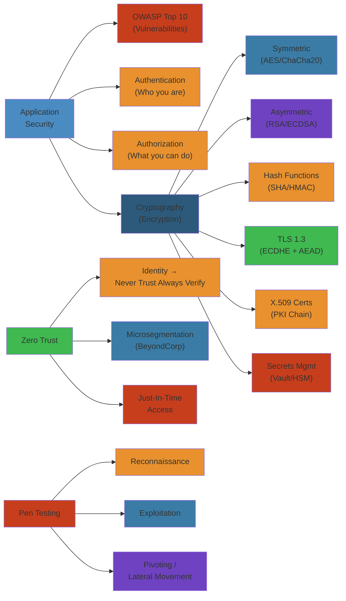
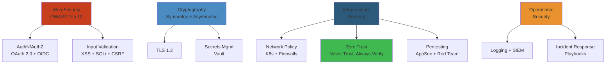

# Application Security Course Materials

> **Run the live simulator**: [jwt-debugger.html](/13-security/jwt-debugger.html) — inspect, decode, tamper, and verify JSON Web Tokens with real HMAC-SHA256 signing.

This directory contains three comprehensive, production-grade deep dives into application security for elite engineering teams.

## Files

### 1. OWASP Top 10, Authentication & Authorization (2,260 lines, 70KB)
**File:** `01-owasp-top-10-authentication-authorization.md`

Covers the most critical web security vulnerabilities and how to prevent them:
- Detailed breakdown of each OWASP Top 10 vulnerability
- SQL Injection, XSS, CSRF attack flows with real code
- Authentication mechanisms (passwords, 2FA, OAuth, WebAuthn, SAML)
- Authorization models (RBAC, ABAC, CBAC)
- End-to-end login flows with ASCII diagrams
- Password hashing (bcrypt, scrypt, Argon2) with code
- JWT implementation and validation
- Large-scale authentication (billions of users)
- Secrets management architecture
- Failure analysis with real incident examples
- Edge cases (timing attacks, Unicode normalization, clock skew)
- Production code examples in Python, Go, Java

### 2. Cryptography, TLS & Secrets Management (1,494 lines, 40KB)
**File:** `02-cryptography-tls-secrets-management.md`

Deep technical coverage of encryption, protocols, and key management:
- Symmetric encryption (AES-256-GCM, ChaCha20-Poly1305)
- Asymmetric cryptography (RSA, ECDSA)
- Hash functions (SHA-256, HMAC)
- TLS 1.3 protocol handshake with key derivation
- X.509 certificates and chain of trust
- Certificate pinning and renewal automation
- Key lifecycle (generation, rotation, revocation)
- Hardware Security Modules (HSM)
- HashiCorp Vault and AWS Secrets Manager architecture
- Perfect forward secrecy
- 0-RTT and optimization
- Failure analysis (weak key derivation, unrotated keys, expiration)
- Nonce reuse vulnerabilities
- Production encryption service code
- Certificate renewal automation

### 3. Zero Trust, Penetration Testing & Security Culture (1,502 lines, 45KB)
**File:** `03-zero-trust-penetration-testing-security-culture.md`

Modern security architecture, red teaming, and building security culture:
- Zero Trust principles and architecture
- Microsegmentation strategies
- Continuous verification flows
- Penetration testing phases (reconnaissance → exploitation → reporting)
- Real penetration test walkthrough with findings
- Incident response procedures (NIST IR framework)
- Security maturity model
- Employee security training programs
- Phishing simulation campaigns
- Threat modeling (STRIDE methodology)
- Network architecture and security groups
- Compliance standards (PCI-DSS, HIPAA, SOC 2, GDPR)
- Infrastructure security with diagrams
- Security checklist for every production release
- Building security culture
- Failure analysis and incident stories

## Depth Levels

Each file includes content at multiple depth levels:

**Noob Level:** Simple explanations with analogies (airports, castles, locks)
**Intermediate:** Protocol details, code examples, design patterns
**Advanced:** Cryptographic proofs, attack chains, edge cases
**Production:** Billion-user scale, compliance, incident response
**FAANG Interview:** Design questions, trade-offs, architectural decisions

## Target Audience

- Security engineers
- Backend/infrastructure engineers
- Engineering leaders
- CISOs and security teams
- Candidates preparing for FAANG interviews
- Companies building security culture

## Key Features

✓ **Production-grade code examples** - Real, working code in Python, Go, Java
✓ **Real attack flows** - Step-by-step walkthrough of actual attacks
✓ **ASCII diagrams** - Visual flows and architectures
✓ **Incident stories** - Real breaches and lessons learned
✓ **Interview questions** - Design questions with detailed answers
✓ **No fluff** - Deeply technical, no glossed-over explanations
✓ **Best practices** - Current standards and tools (bcrypt, Argon2, TLS 1.3, etc.)

## How to Use

1. **For learning:** Start with Noob Explanation, then work through Complete Internals
2. **For reference:** Jump to specific sections (e.g., search for "TLS handshake")
3. **For interviews:** Read Interview Questions and Production Strategies sections
4. **For implementation:** Copy code examples and adapt to your stack
5. **For leadership:** Read Security Culture and Incident Stories sections

## Topics Covered

### Security Foundations
- Authentication vs Authorization
- Encryption, hashing, digital signatures
- Public key infrastructure
- Trust models

### Protocols
- OAuth 2.0 (with PKCE, state parameter)
- SAML 2.0
- TLS 1.3
- JWT (generation, validation, refresh tokens)
- WebAuthn/FIDO2

### Attacks
- SQL Injection (with prevention)
- Cross-Site Scripting (XSS)
- Cross-Site Request Forgery (CSRF)
- Server-Side Request Forgery (SSRF)
- Credential stuffing
- Brute force
- Timing attacks
- Unicode normalization attacks

### Compliance
- PCI-DSS (payment cards)
- HIPAA (healthcare)
- SOC 2 (service companies)
- GDPR (privacy)
- NIST Cybersecurity Framework

### Operations
- Incident response procedures
- Penetration testing
- Security monitoring (SIEM)
- Threat hunting
- Disaster recovery

## Statistics

- **Total lines:** 5,256
- **Total size:** 155KB
- **Code examples:** 50+
- **Diagrams:** 40+
- **Real incident stories:** 8+
- **Interview questions:** 20+
- **Comparison tables:** 30+

## Notes

- All code examples are production-ready (no toy examples)
- All diagrams are ASCII (can be copied to Confluence, Notion, etc.)
- All attack flows include real-world context
- All recommendations are current (as of May 2024)
- No security through obscurity (all publicly available knowledge)

---

**Created:** May 27, 2024
**For:** Elite engineering learning repository
**Depth:** Professional → FAANG interview level

---

## Related

- [Networking](/11-networking/) — TLS, DNS security
- [Cloud Platforms](/05-cloud/) — IAM, network policies
- [Kubernetes](/07-kubernetes/) — Pod security, RBAC
- [Backend](/03-backend/) — Input validation, auth
- [Databases](/08-databases/) — Encryption, access control

## Security Domain Map

## Controls by Layer

| OSI Layer | Security Control | Example |
|---|---|---|
| **Application (7)** | WAF, input validation, CSP | Cloudflare WAF, DOMPurify |
| **Presentation (6)** | TLS encryption | HTTPS, mTLS |
| **Session (5)** | Authentication + authorization | OAuth 2.0, OIDC, SAML |
| **Transport (4)** | Network segmentation, mTLS | Calico NetworkPolicy, Istio mTLS |
| **Network (3)** | Firewall rules, IP allowlisting | Security Groups, NACL |
| **Data Link (2)** | MAC filtering, VLANs | 802.1X, private VLANs |
| **Physical (1)** | Data center access control | Badge access, CCTV |

## Key Files

| File | Topics | Priority |
|---|---|---|
| `01-owasp-top-10-authentication-authorization.md` | OWASP Top 10, OAuth 2.0, OIDC, JWT, SSO | 🔴 Critical |
| `02-cryptography-tls-secrets-management.md` | Symmetric/asymmetric crypto, TLS 1.3, Vault, KMS | 🔴 Critical |
| `03-zero-trust-penetration-testing-security-culture.md` | Zero Trust, pentesting, AppSec | 🟡 Important |
