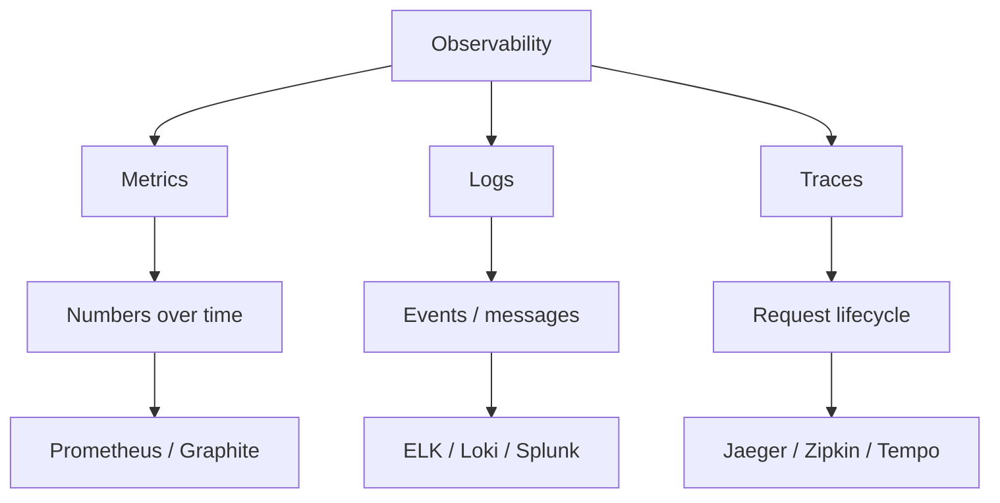
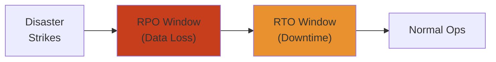

# SRE & Observability — Complete Deep Dive 📊

Site Reliability Engineering applies **software engineering to operations**. Observability is the ability to understand system internals from external outputs — answering **why** something is happening, not just **what**.

**Related**: [Monitoring & Alerting](/05-cloud/README.md) · [Distributed Systems](/09-distributed-systems/README.md) · [Kubernetes](/07-kubernetes/README.md) · [Performance Engineering](/18-performance-engineering/README.md)

---

## Table of Contents

- [SRE Principles](#-sre-principles)
- [Observability Three Pillars](#1-observability-three-pillars-)
- [Metrics](#2-metrics-)
- [Logging](#3-logging-)
- [Distributed Tracing](#4-distributed-tracing-)
- [Prometheus](#5-prometheus-)
- [Grafana](#6-grafana-)
- [OpenTelemetry](#7-opentelemetry-)
- [ELK Stack](#8-elk-stack-)
- [Loki](#9-loki-)
- [SLO / SLA / Error Budgets](#10-slo--sla--error-budgets-)
- [Alerting & On-Call](#11-alerting--on-call-)
- [Incident Management](#12-incident-management-)
- [SRE Maturity Model](#13-sre-maturity-model-)
- [Service Level Indicators](#14-service-level-indicators-)
- [Capacity Planning](#15-capacity-planning-)
- [Chaos Engineering](#16-chaos-engineering-)
- [Learning Path](#-learning-path)
- [Related Domains](#-related-domains)
- [Simplest Mental Model](#-simplest-mental-model)

---

## 🏢 SRE Principles

### What is SRE?
- **Coined by Google**: Ben Treynor Sloss (2003)
- **Definition**: "What happens when you treat operations as a software engineering problem"
- **SRE vs DevOps**: SRE is a specific implementation of DevOps principles

### Core Tenets
- **Hiring**: Hire software engineers, not ops people (then teach them ops)
- **Risk Acceptance**: 100% reliability is wrong target — 99.99% allows ~52min downtime/year
- **Error Budget**: The acceptable amount of unreliability = `1 - SLO`
- **Toil Automation**: Automate repetitive operational work
- **Reduce cost of failure**: Blameless postmortems, faster recovery over prevention
- **Shared ownership**: Devs and SREs share on-call

### SRE Activities
```
Release Engineering        → CI/CD pipeline, canary, rollback
Monitoring & Alerting      → What to measure, when to page
Capacity Planning          → When to add resources
Emergency Response         → Incident management + on-call
Change Management          → Progressive delivery + review
Performance Tuning         → Latency, throughput, cost
Security & Compliance      → Access control, audit logging
Toil Reduction             → Automate away manual work
Data & Business Analysis   → SLO tracking, cost analysis
```

---

## 1. Observability Three Pillars 📐



### The Gap — High Cardinality
- Metrics are **aggregated** — lose individual request detail
- Logs are **verbose** — expensive to store/search, no structure across services
- Traces are **sampled** — never capture everything
- **Solution**: Metrics → logs → traces workflow (drill down from high to low cardinality)

---

## 2. Metrics 📏

### Metric Types
| Type | Description | Example |
|------|-------------|---------|
| Counter | Monotonically increasing | Total requests, errors |
| Gauge | Up/down value | CPU, memory, queue depth |
| Histogram | Bucketed latency distribution | Request latency p50/p99 |
| Summary | Quantiles over sliding window | Apdex score |
| Gauge (derived) | Rate of change | Requests/sec |

### RED Method (microservices)
- **R**ate: Requests per second
- **E**rrors: Failed requests per second
- **D**uration: Latency distribution

### USE Method (infrastructure)
- **U**tilization: % busy
- **S**aturation: Queue depth
- **E**rrors: Error count

### Four Golden Signals
1. **Latency**: Time to serve a request
2. **Traffic**: Demand on the system
3. **Errors**: Rate of failing requests
4. **Saturation**: How "full" the system is

---

## 3. Logging 📝

### Structured vs Unstructured
```json
// Structured (JSON)
{"level": "ERROR", "timestamp": "2024-01-01T12:00:00Z", "service": "auth", "trace_id": "abc123", "message": "Login failed", "user_id": "u456"}

// Unstructured (text)
[ERROR] 2024-01-01 12:00:00 auth: Login failed for user u456
```

### Log Levels
- **TRACE** / **DEBUG**: Development details
- **INFO**: Normal operations (request started/completed)
- **WARN**: Unexpected but handled (retry, degraded)
- **ERROR**: Failure that needs attention
- **FATAL**: System will crash

### Best Practices
- **Log as structured JSON**: Machine-parseable, searchable
- **Include context**: `trace_id`, `service`, `version`, `user_id`
- **Don't log PII**: Tokenize or redact sensitive fields
- **Log levels in production**: INFO and above; DEBUG in dev
- **Log sampling**: For high-volume endpoints, sample logs
- **Centralized logging**: All services → single log aggregator

---

## 4. Distributed Tracing 🔗

### Why Tracing?
```
Request → API Gateway → Auth → User Service → Post Service → DB
                                              → Cache
```
Without tracing: Each service logs independently — impossible to reconstruct timeline.

### Trace Components
- **Trace**: End-to-end request path
- **Span**: Single unit of work within a trace
- **Context Propagation**: Trace ID + Span ID passed via headers (`traceparent`, `x-request-id`)
- **Span Attributes**: Service name, operation, start/end time, tags

### Sampling Strategies
| Strategy | Pros | Cons |
|----------|------|------|
| Head-based (always) | Complete traces | Expensive at high volume |
| Head-based (probabilistic) | Simple, adjustable | Misses rare events |
| Tail-based | Captures specific patterns | More complex, buffering needed |
| Adaptive | Dynamic sampling rate | Implementation complexity |

### Trace-Driven Workflow
```
Alert (high latency) → Jaeger UI (find slow trace)
  → Identify bottleneck service
    → Deep dive span: DB query taking 2s
      → Query optimization needed
```

---

## 5. Prometheus 📈

### Architecture
```
Target (app) ──scrape──▶ Prometheus Server ──query──▶ Grafana
                             │
                             ▼
                         TSDB (local storage)
```

### Data Model
```
<metric_name>{<label_name>=<label_value>, ...} <value> <timestamp>
http_requests_total{method="GET", endpoint="/api", status="200"} 1024 1700000000
```

### Metric Collection
- **Pull model**: Prometheus scrapes targets at intervals
- **Service Discovery**: Kubernetes, Consul, file-based, DNS
- **Jobs & Instances**: `job="api"`, `instance="10.0.0.1:8080"`
- **Rate**: `rate(http_requests_total[5m])` — per-second rate over 5min window

### PromQL (Query Language)
```promql
# Request rate by status
rate(http_requests_total[5m])

# 95th percentile latency
histogram_quantile(0.95, sum(rate(http_request_duration_seconds_bucket[5m])) by (le))

# Error rate
sum(rate(http_requests_total{status=~"5.."}[5m])) / sum(rate(http_requests_total[5m]))

# CPU usage by pod
rate(container_cpu_usage_seconds_total[5m])
```

### Alerting Rules
```yaml
groups:
  - name: api
    rules:
      - alert: HighErrorRate
        expr: error_rate > 0.05
        for: 5m
        labels: { severity: critical }
        annotations:
          summary: "API error rate {{ $value }}%"
```

### Strengths & Limitations
- **Strengths**: Simple, reliable, works at scale (millions of series)
- **Limitations**: Not designed for event logging, no long-term storage built-in
- **Long-term**: Thanos / Cortex (scale-out, long-term, multi-cluster)

---

## 6. Grafana 📊

### Features
- **Data Sources**: Prometheus, Loki, Elasticsearch, CloudWatch, Datadog, InfluxDB
- **Panels**: Time series, bar chart, stat, heatmap, geomap, logs
- **Dashboards**: Templated (variables), annotations, alerts
- **Alerting**: Grafana Alerting (unified from v8+)
- **Explore**: Ad-hoc querying (PromQL, LogQL)

### Dashboard Design Principles
- **USE / RED / Four Golden Signals** per service
- **Top-down**: Business metrics → Service metrics → Infrastructure
- **Consistent layout**: Row per service, panel per metric
- **Variables**: `$service`, `$environment`, `$region`
- **Annotations**: Deployments, incidents, config changes

### Common Dashboard Types
```
┌─────────────────────────────────────────┐
│ Service Dashboard                       │
│ Requests (rate, latency, errors)        │
│ Resource usage (CPU, memory, disk)      │
│ Dependencies (DB, cache, upstream)      │
├─────────────────────────────────────────┤
│ Business Dashboard                      │
│ Active users, signups, revenue, uptime  │
├─────────────────────────────────────────┤
│ Infrastructure Dashboard                 │
│ Cluster, node, pod, network, storage    │
└─────────────────────────────────────────┘
```

---

## 7. OpenTelemetry 📡

### What is OpenTelemetry?
- **Vendor-neutral**: Single API for generating metrics, logs, traces
- **CNCF project**: Merged from OpenTracing + OpenCensus
- **Components**:
  - **API**: Interfaces for instrumentation
  - **SDK**: Implementation + export pipeline
  - **Collector**: Agent/standalone for receiving, processing, exporting
  - **Instrumentation Libraries**: Auto-instrumentation for popular frameworks

### Architecture
```
Application (OTel SDK) ──▶ OTel Collector ──▶ Backend
                              │                    │
                         Batch, filter,      Prometheus, Jaeger,
                         sample, enrich       Datadog, CloudWatch
```

### Instrumentation
```python
# Manual instrumentation
from opentelemetry import trace
tracer = trace.get_tracer(__name__)
with tracer.start_as_current_span("handle_request") as span:
    span.set_attribute("user_id", user_id)
    result = process()
    return result

# Automatic instrumentation
# pip install opentelemetry-instrumentation-flask
# opentelemetry-instrument flask run
```

### Semantic Conventions
Standard attribute names for common operations:
- `http.method`, `http.url`, `http.status_code`
- `db.system`, `db.statement`, `db.cassandra.keyspace`
- `messaging.system`, `messaging.destination`

---

## 8. ELK Stack 🦌

### Components
| Component | Purpose |
|-----------|---------|
| **E**lasticsearch | Distributed search & analytics engine |
| **L**ogstash | Data processing pipeline (ingest → transform → output) |
| **K**ibana | Visualization dashboard |

### Logstash Pipeline
```
Input (filebeat/tcp) → Filter (grok/mutate/date) → Output (Elasticsearch)
```

### Beats (Lightweight Shippers)
- **Filebeat**: Log files
- **Metricbeat**: System + service metrics
- **Heartbeat**: Uptime monitoring
- **Winlogbeat**: Windows event logs
- **Packetbeat**: Network packet analysis

### Elastic Search
- **Schema-on-read**: Dynamic mapping (vs pre-defined schema)
- **Index**: Sharded across nodes
- **Hot-Warm-Cold architecture**: Hot (SSD, recent), Warm (HDD), Cold (frozen, rarely accessed)

---

## 9. Loki 📋

### Architecture
```
Promtail (agent) ──push──▶ Loki ──query──▶ Grafana
    │
    ▼
Log files
```

### Key Design
- **Prometheus for logs**: Same label model, low-cost indexing
- **Index**: Labels only (not full text) — much cheaper than Elasticsearch
- **LogQL**: `{job="api"} |= "error" | json | latency > 1s`
- **Storage**: Object storage (S3, GCS, MinIO) for log chunks

### LogQL
```logql
# Filter by label
{job="api"} |= "ERROR"

# Filter + metric
rate({job="api"} |= "ERROR" [5m])

# JSON parsing
{job="api"} | json | latency > 1000

# Pattern parser
{job="api"} | pattern "<ip> - <method> <path> <status> <latency>"
```

### Loki vs Elasticsearch
| Feature | Loki | Elasticsearch |
|---------|------|---------------|
| Index | Labels only | Full text |
| Storage | Object store | Local/volume |
| Query | LogQL (label-based) | Query DSL (full-text) |
| Cost at scale | Lower (less indexing) | Higher (more indexing) |
| Real-time search | Moderate | Excellent |

---

## 10. SLO / SLA / Error Budgets 🎯

### Definitions
- **SLI** (Service Level Indicator): What we measure (latency, error rate)
- **SLO** (Service Level Objective): Target value (p99 latency < 200ms)
- **SLA** (Service Level Agreement): Contract with customer (usually looser than SLO)

```
SLI = actual metric
SLO = internal target (99.9%)
SLA = legal contract (99.5%)
```

### Error Budget
```
Error Budget = 1 - SLO
Example: 99.9% SLO = 0.1% error budget = ~8.76 hours downtime/year
```

### Error Budget Policy
- **While budget remains**: Normal release velocity
- **Budget exhausted**: Freeze releases → focus on reliability
- **Track**: Dashboard showing budget consumption rate

### SLO Example (HTTP API)
```yaml
slo:
  name: api_latency
  sli: latency
  target: 99.9  # p99 under 200ms
  window: 28d   # rolling 28 days
  error_budget: 0.1%  # 1 - 0.999
  burn_rate:
    warning: 2x  # consuming budget twice as fast as expected
    critical: 10x
```

### Multi-Window, Multi-Burn-Rate Alerting
- **Short window** (1h): Catches fast burn
- **Long window** (6h): Confirms sustained burn
- **Alert**: Both windows must exceed threshold (reduces false positives)

---

## 11. Alerting & On-Call 🔔

### Alertmanager
- **Deduplication**: Group identical alerts
- **Silencing**: Maintenance windows
- **Inhibition**: High-severity suppresses low-severity
- **Routing**: Route to different receivers (team, severity-based)

### Alert Configuration
```yaml
receivers:
  - name: oncall
    pagerduty_configs:
      - routing_key: "..."
        severity: critical

inhibit_rules:
  - source_match: { severity: critical }
    target_match: { severity: warning }
    equal: [alertname, service]
```

### On-Call Best Practices
- **Follow-the-sun**: Regional rotations
- **Secondary**: Always have secondary/backup
- **Rotation**: 1-2 week shifts
- **Handoff**: Document active incidents before rotation change
- **Escalation**: Auto-escalate if primary doesn't acknowledge

### Alert Fatigue Prevention
- **Actionable**: Every alert requires a human action
- **No duplicates**: Group related alerts
- **Runbooks**: Every alert links to runbook
- **Silence noisy**: Identify and fix chronic alerting
- **Alert on symptoms, not causes**: "High latency" not "CPU > 90%"

---

## 12. Incident Management 🚨

### Incident Lifecycle
```
Detect → Triage → Respond → Mitigate → Resolve → Postmortem
```

### Severity Levels
| Level | Description | Response Time |
|-------|-------------|---------------|
| SEV1 | Service down, critical impact | < 15 min |
| SEV2 | Partial degradation | < 1 hour |
| SEV3 | Minor issue, no customer impact | Next business day |
| SEV4 | Low priority, cosmetic | Best effort |

### Incident Response Roles
- **Incident Commander**: Coordinates response, makes decisions
- **Communications Lead**: Internal + external status updates
- **Operations Lead**: Technical investigation and mitigation
- **Scribe**: Timeline documentation during event

### Communication
- **Status page**: Public status page (external)
- **Slack channel**: #incident-name for coordination
- **Timeline**: Record all actions + timestamps
- **Updates**: Regular intervals (every 30 min for SEV1)

### Postmortem
```
Title: Postmortem: Brief Description
Date: YYYY-MM-DD
Severity: SEV1
Duration: 2h 15m

Summary: One paragraph of what happened

Timeline:
  - 14:02 UTC — Deploy of v2.3.1
  - 14:05 UTC — Error rate spike
  - 14:08 UTC — PagerDuty alert
  - 14:15 UTC — Incident declared
  ...

Root Cause: Detailed technical explanation

Resolution: What was done to fix

Action Items:
  - [ ] P1: Fix root cause (owner, date)
  - [ ] P2: Add monitoring (owner, date)
  - [ ] P3: Update runbook (owner, date)
```

### Blameless Culture
- **Goal**: Understand system, not blame people
- **"5 Whys"**: Root cause analysis technique
- **Contributing factors**: Not just "human error" but "why was the guardrail missing?"

---

## 13. SRE Maturity Model 📈

### Level 1: Reactive
- Manual operations
- No monitoring
- Firefighting mode
- No documentation

### Level 2: Proactive
- Basic monitoring (CPU, memory, disk)
- Simple dashboards
- Runbooks exist but outdated
- On-call rotation

### Level 3: Automated
- CI/CD pipelines
- Automated rollback
- Infrastructure as code
- SLO tracking

### Level 4: Data-Driven
- Error budgets drive decisions
- Capacity planning based on trends
- Chaos engineering experiments
- Blameless postmortems

### Level 5: Autonomous
- Self-healing systems
- Predictive analytics
- Auto-scaling based on business metrics
- Continuous improvement culture

---

## 14. Service Level Indicators 📐

### Common SLIs

**Availability**
```
ratio = successful_requests / total_requests
Target: > 99.9%
```

**Latency**
```
latency_p99 < 500ms for API
latency_p95 < 2s for page load
```

**Throughput**
```
requests_per_second > target
```

**Durability**
```
data_loss = events_lost / total_events
Target: no data loss
```

**Freshness**
```
time_since_last_update < 1h for batch
time_since_last_event < 5min for streaming
```

### SLI Implementation
```promql
# Good events / Valid events
(
  sum(rate(http_requests_total{status!~"5.."}[5m]))
  /
  sum(rate(http_requests_total[5m]))
)

# Or
(
  1
  -
  sum(rate(http_requests_total{status=~"5.."}[5m]))
  /
  sum(rate(http_requests_total[5m]))
)
```

---

## 15. Capacity Planning 📅

### Steps
1. **Measure current utilization**: CPU, memory, storage, network
2. **Forecast growth**: Linear/exponential trend lines
3. **Determine lead time**: How long to provision new capacity
4. **Set thresholds**: 60% warning, 80% critical
5. **Plan scaling**: Horizontal (more instances) vs vertical (bigger instances)

### Metrics for Capacity
```
trend_line(container_cpu_usage_seconds_total[30d]) — 30-day trend
predict_linear(container_memory_working_set_bytes[7d], 86400 * 7) — 7 day forecast
```

### Auto-scaling
- **HPA**: Kubernetes Horizontal Pod Autoscaler (CPU/memory/custom metrics)
- **Predictive scaling**: ML-based traffic forecasting
- **Scheduled scaling**: Known patterns (peak hours, events)

---

## 16. Chaos Engineering 🧪

### Principles (Principles of Chaos)
1. Define steady state (normal behavior)
2. Hypothesize steady state continues
3. Introduce real-world variables (server crash, latency, network partition)
4. Look for difference between steady state and experiment
5. Improve system if weakness found

### Maturity Model
- **Level 0**: No experimentation
- **Level 1**: Ad-hoc experiments
- **Level 2**: Automated experiments in staging
- **Level 3**: Automated experiments in production
- **Level 4**: Continuous verification in CI/CD

### Experiment Types
- **Infrastructure**: Kill a pod, terminate an AZ
- **Network**: Latency injection, packet loss, partition
- **State**: Corrupt data, kill processes
- **Load**: Traffic spike, resource exhaustion

---

## Disaster Recovery

Planning, testing, and automating recovery from catastrophic failures.

### RPO / RTO — The Core Tradeoff



| Metric | Definition | Target Ranges |
|--------|-----------|---------------|
| **RPO** (Recovery Point Objective) | Max acceptable data loss in time | 0 (sync) – 24 hours |
| **RTO** (Recovery Time Objective) | Max acceptable downtime | < 1 min – 72 hours |
| **WRT** (Work Recovery Time) | Time to verify resume business | 15 min – 4 hours |
| **MTD** (Maximum Tolerable Downtime) | RTO + WRT = total outage limit | 4 hours – 7 days |

**RPO/RTO Tradeoff:**
```text
                 Cost
                  ↑
                  |     Active-Active
                  |        (RPO=0, RTO=0)
                  |     Warm Standby
                  |        (RPO=s, RTO=min)
                  |     Pilot Light
                  |        (RPO=min, RTO=min-hr)
                  |     Backup & Restore
                  |        (RPO=hr, RTO=hr-day)
                  +──────────────────→ Reliability
```

### Backup Strategies

| Strategy | RPO | Restore Time | Storage | Use Case |
|----------|-----|-------------|---------|----------|
| **Full** | Snapshot time | Fastest | Largest | Weekly baseline |
| **Incremental** | Minutes | Slowest (chain) | Smallest | Daily/hourly |
| **Differential** | Since last full | Medium | Medium | Intermediate |
| **Transaction Log** | Seconds | Point-in-time | Large | Databases |
| **Continuous** | Near-zero | Any point | Very large | Critical systems |

**Implementation with Terraform:**
```hcl
resource "aws_backup_plan" "critical" {
  name = "critical-backup"

  rule {
    rule_name         = "daily-full"
    target_vault_name = aws_backup_vault.main.name
    schedule          = "cron(0 3 * * ? *)"
    lifecycle {
      cold_storage_after = 7
      delete_after       = 90
    }
  }

  rule {
    rule_name         = "hourly-transaction"
    schedule          = "cron(0 * * * ? *)"
    lifecycle {
      delete_after = 7
    }
  }
}
```

**Backup Verification:**
```yaml
backup_verification:
  auto_integrity_check:
    schedule: "every backup"
    action: "verify checksum, metadata, encryption status"

  auto_restore_test:
    schedule: "weekly"
    action: "restore to test env, run validation queries"
    validation_queries:
      - "SELECT COUNT(*) FROM orders"
      - "SELECT MAX(created_at) FROM orders"

  full_dr_exercise:
    schedule: "quarterly"
    action: "simulate region failure, measure actual RTO/RPO"
```

### DR Scenarios & Response

**AZ Failure:**
```text
Impact:  Single AZ in region goes down
Response:
  - Multi-AZ services continue (RDS Multi-AZ, spread pods)
  - ASG replaces instances in remaining AZs
  - LB removes failed AZ from rotation
RTO:    Seconds (automatic)
RPO:    Zero (sync replication within region)
```

**Region Failure:**
```text
Impact:  Entire region unavailable
Response:
  - Activate cross-region failover (DNS/GSLB switch)
  - Promote replica in secondary region to primary
  - Scale up secondary compute
RTO:    Minutes–Hours (depends on active-passive vs active-active)
RPO:    Seconds (async replication lag)
```

**Data Corruption:**
```text
Impact:  Application bug or operator error corrupts data
Response:
  - Block writes, isolate affected service
  - Identify corruption scope (table, time range)
  - Restore from PIT backup (pre-corruption moment)
  - Replay transaction logs up to corruption time
RTO:    Hours (manual investigation + restore)
RPO:    < 15 min (backup frequency)
```

**Ransomware Recovery:**
```text
Impact:  Encrypted data, ransom demand
Response:
  - IMMEDIATELY isolate affected systems (network disconnect)
  - DO NOT pay ransom
  - Restore from immutable backups (S3 Object Lock, WORM)
  - Scan backups before restore
  - Forensic investigation
Prevention:
  - Immutable backup storage (S3 Object Lock, WORM)
  - Air-gapped backups (separate account, no cross-account delete)
  - Multi-factor auth on backup systems
  - Regular restore drills (quarterly minimum)
```

### DR Patterns Comparison

| Pattern | RTO | RPO | Cost | Architecture |
|---------|-----|-----|------|-------------|
| **Backup & Restore** | Hours–Days | Hours | Lowest | Back up data, restore to new infra on failover |
| **Pilot Light** | Minutes–Hours | Minutes | Low–Med | Core DB running, compute scaled to 1, scale up on failover |
| **Warm Standby** | Seconds–Minutes | Seconds | Medium | Scaled-down full copy, scale up on failover |
| **Multi-Region Active-Active** | Near-zero | Near-zero | Highest | All regions serving traffic, instant failover |
| **Cold Standby** | Hours–Days | Hours | Lowest | Config exists but turned off, no data replica |

### Runbook Automation for DR

```yaml
# ansible/playbooks/dr-region-failover.yaml
- name: Region Failover - Warm Standby
  hosts: localhost
  vars:
    failover_region: eu-west-2
    primary_region: us-east-1

  tasks:
    - name: Verify primary region health
      uri:
        url: "https://{{ primary_endpoint }}/health"
        status_code: 200
      register: primary_health
      ignore_errors: yes

    - name: Promote standby database
      community.aws.rds_instance:
        id: "db-standby-{{ failover_region }}"
        state: present
        promote: yes

    - name: Update Route53 failover record
      route53:
        zone: "example.com"
        record: "api"
        type: A
        value: "{{ failover_lb_dns }}"
        ttl: 30
        overwrite: yes
```

### Chaos Engineering for DR

**AWS FIS — Terminate instances in an AZ:**
```hcl
resource "aws_fis_experiment_template" "az_outage" {
  description = "Simulate AZ failure"
  role_arn    = aws_iam_role.fis.arn

  action {
    name      = "kill-instances"
    action_id = "aws:ec2:stop-instances"

    target {
      key   = "Instances"
      resource_arns = data.aws_instances.target_az.arns
    }
  }

  stop_condition {
    source = "aws:cloudwatch:alarm"
    value  = aws_cloudwatch_metric_alarm.dr_breach.arn
  }
}
```

### DR Production Checklist

```
□ RPO/RTO defined for every critical service
□ Backups follow 3-2-1 rule (3 copies, 2 media, 1 off-site)
□ Backup verification automated (weekly restore tests)
□ DR plan documented with step-by-step runbooks
□ Chaos engineering experiments test AZ/region failures
□ Cross-region failover tested at least quarterly
□ Immutable backups configured for ransomware protection
□ Replication lag monitored and alerted
□ Secrets/credentials rotate correctly on failover
□ DNS TTLs configured for failover speed (30s or less)
□ DR plan includes dependencies: CDN, monitoring, CI/CD, auth
□ Post-DR testing documented: how to confirm recovery is clean
```

---

## 📚 Learning Path

### Phase 1: Fundamentals
1. Prometheus — install, instrument app, query
2. Grafana — create dashboards, variables, alerts
3. Logging — structured JSON logging, centralized with Loki
4. Basic alerting (Alertmanager, PagerDuty)

### Phase 2: Deep Dive
1. Distributed tracing with OpenTelemetry + Jaeger
2. SLO definition and error budget implementation
3. Log aggregation with ELK/Loki
4. On-call rotations and incident management

### Phase 3: Advanced
1. Multi-cluster Prometheus (Thanos/Cortex)
2. Tail-based sampling for traces
3. SRE maturity assessment and improvement plan
4. Capacity planning and forecasting automation

### Phase 4: Expert
1. OpenTelemetry collector pipelines (batch, filter, enrich)
2. Chaos engineering in production
3. Build custom integrations and exporters
4. SRE consulting — define strategy for multi-team orgs

---

## 🔗 Related Domains

| Domain | Connection |
|--------|-----------|
| [Kubernetes](/07-kubernetes/README.md) | kube-state-metrics, cAdvisor, node exporter, HPA |
| [Distributed Systems](/09-distributed-systems/README.md) | Distributed tracing, consensus monitoring |
| [Performance Engineering](/18-performance-engineering/README.md) | Profiling, latency analysis, benchmarking |
| [Microservices](/16-microservices/README.md) | Service-level dashboards, RED method |
| [Cloud Computing](/05-cloud/README.md) | Managed observability (CloudWatch, Stackdriver) |
| [DevOps](/06-devops/README.md) | CI/CD observability, deployment metrics |
| [Security](/13-security/README.md) | SIEM, security monitoring, audit logging |

---

## 🧠 Simplest Mental Model

```
Observability = Car Dashboard + Black Box + GPS History

Dashboard (Metrics)   → Speed, RPM, fuel level — current state
Black Box (Logs)      → Every event recorded — "check engine light came on at 14:32"
GPS History (Traces)  → Your exact route — "why did we go through that neighborhood?"

SRE = Fleet Manager
  - SLA: "Package arrives within 2 days"
  - SLO: "95% within 1 day" (internal target)
  - Error Budget: 5% can be late
  - When budget exhausted: Stop new routes, optimize existing
```

**The goal isn't to monitor everything — it's to know what matters and fix it when it breaks.**

---

**Next**: [System Design](/15-system-design/README.md) · [Performance Engineering](/18-performance-engineering/README.md)

## Related

- [Readme](/18-performance-engineering/README.md)
- [Jvm Performance](/18-performance-engineering/jvm-tuning/01-jvm-performance.md)
- [Optimization Patterns](/18-performance-engineering/optimization/01-optimization-patterns.md)
- [Profiling Deep Dive](/18-performance-engineering/profiling/01-profiling-deep-dive.md)
- [Kubernetes Basics](/07-kubernetes/01-kubernetes-basics.md)
- [Advanced K8S](/07-kubernetes/02-advanced-k8s.md)
