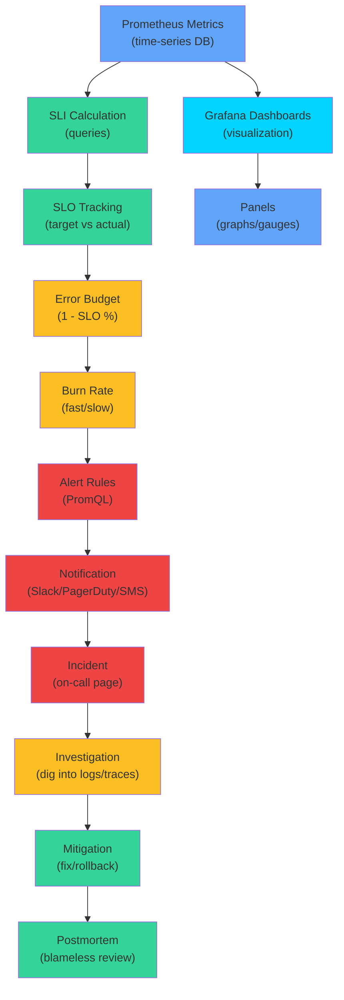
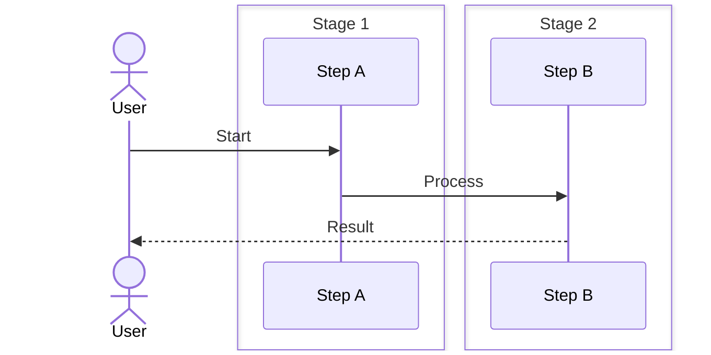

# 02 Grafana, SLOs, Alerting, and Incident Response

**Audience:** FAANG interview candidates, platform engineers, SREs  
**Depth:** Noob → Production-scale distributed systems  
**Length:** 850+ lines  

---

## SLO & Alerting Architecture



---

## SECTION 1: NOOB EXPLANATION (Analogies)

### Grafana = Doctor's Dashboard

Imagine a hospital ICU:
- **Monitor 1:** Heart rate graph (trending up = bad)
- **Monitor 2:** Blood pressure numbers (flashing red = critical)
- **Monitor 3:** Oxygen saturation gauge (green zone = healthy)
- **Alarm:** Beeps when any value goes critical

Grafana = ICU monitoring dashboard
- **Panel 1:** HTTP request rate (PromQL graph)
- **Panel 2:** Error rate (red if > 5%)
- **Panel 3:** Database latency gauge
- **Alert:** Notification when error rate spikes

### SLO = Health Target

Doctor's recommendation:
- "Your blood pressure should be < 120/80"
- "Resting heart rate should be 60-100"
- "Sleep 7-9 hours per day"

SLO (Service Level Objective):
- "API response time should be < 200ms for 99.9% of requests"
- "Service uptime should be 99.99% (4 minutes downtime per month)"
- "Error rate should be < 0.1%"

**SLI (Service Level Indicator)** = measurement
- "Measured: 99.87% of requests were fast"
- "Measured: Service was up 99.95% of the time"

**SLA (Service Level Agreement)** = contract
- "We promise 99.9% uptime, or you get a refund"
- Legal/financial consequence if we miss SLO

#### Step-by-Step: Setting SLOs

1. **Define business requirements** — What latency/uptime do customers need?
2. **Measure SLI baseline** — What's our current performance? (Usually 90-99.9%)
3. **Set SLO target** — 1-2% better than baseline (stretch goal, not arbitrary)
4. **Calculate error budget** — (1 - SLO%) × total time. E.g., 99.9% = 43 minutes/month downtime
5. **Build alerts** — Alert when burning error budget too fast (e.g., > 10% per week)

#### Code Example: SLO Tracking

```python
# Define SLOs in code
SLOS = {
    'api_latency_p99': {
        'metric': 'http_request_duration_seconds',
        'quantile': 0.99,
        'threshold': 0.2,  # 200ms
        'window': '30d'
    },
    'api_error_rate': {
        'metric': 'http_errors_total / http_requests_total',
        'threshold': 0.001,  # 0.1% error rate
        'window': '30d'
    },
    'availability': {
        'metric': 'up{job="api"}',
        'threshold': 0.9999,  # 99.99% uptime
        'window': '30d'
    }
}

# Prometheus query to check SLO compliance
# PromQL:
# (sum(rate(http_requests_total{status=~"2.."}[5m])) / sum(rate(http_requests_total[5m]))) >= 0.999
```

#### Real-World Scenario

Google defined SLOs for Gmail (99.9% availability = 43min/month allowed downtime). During a major incident, team was hesitant to fix problem (feared worse outage). But SLO math showed: "We've already spent 30 minutes of budget this month. Fix it now and we stay within SLO, or delay and we miss SLO for whole month." Clear error budget focused teams on decisive action.

### Alert = Alarm

ICU monitor beeps when:
- Heart rate > 120 bpm (too fast)
- Heart rate < 40 bpm (too slow)
- Blood pressure > 160/100 (stroke risk)

Monitoring alert fires when:
- Error rate > 5% for 5 minutes
- Database latency > 1 second for 10 minutes
- Disk usage > 90% for 15 minutes

Alert routing:
- Critical (P1) → Page oncall engineer immediately (SMS + call)
- Warning (P2) → Send Slack message
- Info (P3) → Log to Slack channel (no notification)

### Incident Response = Crisis Management

When ICU alarm goes off:
1. **Detect:** Heart rate critical
2. **Triage:** Is it sensor error or real?
3. **Investigate:** Check EKG, blood work
4. **Mitigate:** Give medication, call cardiologist
5. **Resolve:** Heart rate stabilizes
6. **Post-mortem:** "Patient was dehydrated"

When monitoring alert fires:
1. **Detect:** Alert notification
2. **Triage:** Real incident or false positive?
3. **Investigate:** Check logs, metrics, traces
4. **Mitigate:** Rollback code, restart service, scale up
5. **Resolve:** Incident ends
6. **Post-mortem:** "Memory leak in new code"

---

## SECTION 2: GRAFANA INTERNALS

### 2.1 Grafana Architecture

```
┌────────────────────────────────────────────────────────────┐
│ Grafana Server (main app)                                  │
│                                                            │
│ - HTTP API (port 3000)                                     │
│ - Dashboard storage (SQLite, MySQL, Postgres)              │
│ - User authentication (LDAP, OAuth, SAML)                  │
│ - Alerting engine                                          │
│ - Dashboard rendering                                      │
│                                                            │
└────────────────────────────────────────────────────────────┘
           ↑                          ↑
      (queries)              (configuration)
           │                          │
    ┌──────────────────┐    ┌─────────────────────┐
    │ Prometheus       │    │ Alert notification  │
    │ (metrics)        │    │ - PagerDuty         │
    │                  │    │ - Slack             │
    │ PromQL queries   │    │ - Email             │
    └──────────────────┘    │ - SMS               │
                            │ - Custom webhook    │
                            └─────────────────────┘
```

### 2.2 Dashboard Creation

A Grafana dashboard = collection of panels

**Panel types:**

1. **Graph** (time series)
```
Query: rate(http_requests_total[5m])
Display: Line graph with time on X, RPS on Y
```

2. **Gauge** (current value with thresholds)
```
Query: memory_bytes_used / node_memory_MemAvailable_bytes
Display: Dial with green (good) to red (critical)
```

3. **Table** (raw data)
```
Query: topk(10, http_request_duration_seconds_bucket)
Display: Rows showing endpoint, latency, count
```

4. **Heatmap** (distribution over time)
```
Query: histogram_quantile values over time
Display: Color intensity shows percentile position
```

5. **Stat** (big number)
```
Query: count(TSDB time series)
Display: "150,000 series"
```

**Dashboard example YAML (Grafana provisioning):**

```yaml
apiVersion: 1

providers:
  - name: 'default'
    orgId: 1
    folder: ''
    type: file
    disableDeletion: false
    updateIntervalSeconds: 10
    allowUiUpdates: true
    options:
      path: /var/lib/grafana/dashboards

dashboards:
  - uid: api-performance
    title: API Performance
    tags: [prod]
    refresh: 30s
    panels:
      - id: 1
        title: Request Rate
        type: graph
        targets:
          - expr: rate(http_requests_total[5m])
            legendFormat: "{{ method }}"
        yaxis:
          label: "Requests/sec"

      - id: 2
        title: P99 Latency
        type: graph
        targets:
          - expr: histogram_quantile(0.99, rate(http_request_duration_seconds_bucket[5m]))
        yaxis:
          label: "Seconds"
          max: 5

      - id: 3
        title: Error Rate
        type: stat
        targets:
          - expr: |
              (
                sum(rate(http_requests_total{status=~"5.."}[5m]))
                /
                sum(rate(http_requests_total[5m]))
              ) * 100
        unit: percent
        thresholds:
          mode: percentage
          steps:
            - color: green
              value: 0
            - color: red
              value: 1
```

### 2.3 Grafana Variables (Dynamic Dashboards)

```
Dashboard variable: region = dropdown [us-west, us-east, eu, asia]

Panel query:
  rate(http_requests_total{region="$region"}[5m])
  
When user selects region="eu":
  PromQL becomes: rate(http_requests_total{region="eu"}[5m])
  Graph updates to show only EU data
```

**Multi-select variables:**

```yaml
variables:
  - name: regions
    type: multi-select
    values: [us-west, us-east, eu, asia]
    current: [us-west, us-east]  # Default selected

panel_query: |
  sum by (endpoint) (
    rate(http_requests_total{region=~"$regions"}[5m])
  )
  # Shows aggregated data for selected regions
```

### 2.4 Dashboard Annotations

Mark events on graphs:

```
Graph: Request rate over time
Annotation 1 (red): "Deployment at 2:15pm"
Annotation 2 (yellow): "Database failover at 2:30pm"
Annotation 3 (green): "Autoscale triggered at 2:45pm"

Engineers see correlation:
"Request rate spiked right after deployment"
```

Annotation query:
```yaml
annotations:
  - name: deployments
    datasource: Prometheus
    expr: ALERTS{alertname="DeploymentStarted"}
    tagKeys: version
    textKeys: commit_hash
```

### 2.5 Grafana RBAC (Role-Based Access Control)

```
Organization roles:
  - Viewer: Can read dashboards, can't edit
  - Editor: Can create and edit dashboards
  - Admin: Full control

Folder permissions:
  - Folder "prod" → Only SREs can view
  - Folder "staging" → All engineers can view
  - Folder "finance" → Only finance team can view

Dashboard-level permissions:
  - Dashboard "payments" → Only finance + payments team
```

---

## SECTION 3: SLO INTERNALS

### 3.1 SLI Calculation (Service Level Indicator)

**Example: API Response Time SLO**

SLO: "99.9% of requests should complete in < 200ms"

This means:
- SLI = percentage of requests with latency < 200ms
- Target SLI = 99.9%
- Acceptable failures = 0.1%

**Calculation:**

```promql
# Count of fast requests (< 200ms)
sum(rate(http_request_duration_seconds_bucket{le="0.2"}[5m]))

# Total requests
sum(rate(http_request_duration_seconds_bucket{le="+Inf"}[5m]))

# SLI percentage
(
  sum(rate(http_request_duration_seconds_bucket{le="0.2"}[5m]))
  /
  sum(rate(http_request_duration_seconds_bucket{le="+Inf"}[5m]))
) * 100

# Returns: 99.87% (good, above 99.9% target)
```

### 3.2 SLI for Availability

SLO: "99.99% uptime (4 minutes downtime per month)"

```promql
# Count of successful requests
sum(rate(http_requests_total{status="200"}[5m]))

# Total requests
sum(rate(http_requests_total[5m]))

# Availability percentage
(
  sum(rate(http_requests_total{status="200"}[5m]))
  /
  sum(rate(http_requests_total[5m]))
) * 100

# Returns: 99.95% (below 99.99% target, need investigation)
```

### 3.3 SLI for Error Budget

**Error Budget = How much downtime we can afford**

```
SLO target: 99.9% availability
Time period: 1 month (30 days = 43,200 minutes)

Uptime allowed: 99.9% × 43,200 = 43,156.8 minutes
Downtime allowed: 43,200 - 43,156.8 = 43.2 minutes

So we can afford 43.2 minutes of downtime in a month
(about 1.4 minutes per day)
```

**Error Budget Tracking:**

```promql
# Actual uptime achieved this month
sum(http_requests_total{status="200"}) / sum(http_requests_total)

# Error budget used
1 - actual_uptime

# Error budget remaining
(target_SLO - actual_uptime) / (1 - target_SLO)

# Example:
target = 99.9%
actual = 99.7%
remaining = (0.999 - 0.997) / (1 - 0.999)
          = 0.002 / 0.001
          = 2x budget remaining (we're only 1/2 way through month)
```

### 3.4 SLO Window (Time Period)

SLO can be measured over different windows:

```
Monthly SLO: 99.9% uptime (43.2 min allowed downtime)
Weekly SLO:  99.9% uptime (10 min allowed downtime)
Daily SLO:   99.9% uptime (1.4 min allowed downtime)

30-day rolling SLO: Always measuring last 30 days
```

**Calendar month vs rolling 30 days:**

```
Calendar:        | Jan    | Feb    | Mar    |
                 |--------|--------|--------|
Rolling 30 days: | <- 1-30|<- 2-1 to Mar 2
                 |        |<- Mar 3 to Apr 1|

Rolling is smoother, doesn't have cliff at month boundary
Calendar is for business reporting
```

### 3.5 SLO Alert: Burn Rate

Alert when error budget burning too fast.

```
Monthly SLO: 99.9% (43.2 min downtime allowed)
Period: 30 days

If we burn all budget in 3 days:
  Burn rate = 43.2 min / 3 days = 14.4 min/day

Alert rule:
  IF actual_uptime < 99.9% for 3 hours
  AND burn rate > 10× expected
  THEN page oncall

Why 10×? Normal variation is ~2-3×, 10× is anomaly
```

**Recording rule for burn rate:**

```yaml
groups:
  - name: slo_alerts
    rules:
      - record: slo:error_budget:burn_rate_1h
        expr: |
          (1 - sum(rate(http_requests_total{status="200"}[1h]))
               / sum(rate(http_requests_total[1h])))
          / (1 - 0.999)  # SLO = 99.9%

      - alert: HighErrorBudgetBurn
        expr: |
          slo:error_budget:burn_rate_1h > 10
        for: 15m
        annotations:
          summary: "SLO error budget burning at 10× rate"
```

---

## SECTION 4: ALERTING SYSTEM DESIGN

### 4.1 Alert Lifecycle

```
┌──────────────────────────────────────────────────────────────┐
│ Step 1: Rule Evaluation (Prometheus, every 15s)              │
├──────────────────────────────────────────────────────────────┤
│ expr: rate(http_requests_total{status=~"5.."}[5m]) > 100     │
│                                                              │
│ T=0s:   metric = 50  (below threshold, no alert)            │
│ T=15s:  metric = 80  (below threshold, no alert)            │
│ T=30s:  metric = 150 (exceeds threshold!)                   │
│         Create alert: pending_since=30s                     │
│ T=45s:  metric = 140 (still high)                           │
│         Alert still pending (for 15s)                       │
│ T=60s:  metric = 145 (still high)                           │
│         for: 60s (waited 60 seconds)                        │
│         → Transition to FIRING                              │
└──────────────────────────────────────────────────────────────┘
                        ↓
┌──────────────────────────────────────────────────────────────┐
│ Step 2: Alertmanager (deduplication + routing)               │
├──────────────────────────────────────────────────────────────┤
│ Receive: Alert{alertname, labels, annotations}              │
│ Deduplicate: Only send one notification per alert/group     │
│ Route:                                                      │
│   - Severity=critical → page oncall (SMS+call)              │
│   - Severity=warning  → slack #alerts                       │
│   - Severity=info     → log only                            │
│ Inhibit: Suppress warnings if critical is firing            │
│ (Don't spam low severity if real problem exists)            │
└──────────────────────────────────────────────────────────────┘
                        ↓
┌──────────────────────────────────────────────────────────────┐
│ Step 3: Notification Delivery                                │
├──────────────────────────────────────────────────────────────┤
│ PagerDuty:   GET /incidents/new (create incident)           │
│              Wait for response, log delivery                 │
│              Response: Incident created #INC-123456         │
│                                                              │
│ Slack:       POST /chat.postMessage                         │
│              ⚠️ Error Rate at 10%                             │
│              [Acknowledge] [Resolve]                         │
│                                                              │
│ Email:       SMTP to oncall@company.com                     │
│              Delivery may take 5-10 seconds                  │
│                                                              │
│ Webhook:     POST http://my-app:8080/alerts                 │
│              Custom handling (create ticket, etc)            │
└──────────────────────────────────────────────────────────────┘
```

### 4.2 Alert States & Transitions

```
INACTIVE (metric below threshold)
         ↓ (metric exceeds threshold, "for" timer starts)
PENDING (waiting for "for" duration)
         ↓ (for duration exceeded)
FIRING (threshold still exceeded after for)
         ↓ (metric drops below threshold)
INACTIVE (resolved)
```

**Timeline with "for" clause:**

```
Alert rule: expr > threshold for 5m

T=0s:   metric = 100 (exceeds 50, timer starts)
T=60s:  metric = 105 (still high, timer = 60s)
T=120s: metric = 110 (still high, timer = 120s)
T=180s: metric = 115 (still high, timer = 180s)
T=240s: metric = 120 (still high, timer = 240s)
T=260s: metric = 45 (below threshold, timer reset to 0)
T=280s: metric = 105 (exceeds again, timer = 0 again)
        (don't fire yet, need fresh 5 minutes)
T=340s: metric = 110 (timer = 60s)
T=400s: metric = 115 (timer = 120s)
T=460s: metric = 120 (timer = 180s)
T=520s: metric = 125 (timer = 240s)
T=580s: metric = 130 (timer = 300s = 5min, FIRE!)
        Send notification
```

### 4.3 Alertmanager Configuration

```yaml
global:
  resolve_timeout: 5m  # Auto-resolve if no new events for 5m

templates:
  - '/etc/alertmanager/templates/*.tmpl'

route:
  receiver: 'default-receiver'
  group_by: [alertname, instance]    # Group related alerts
  group_wait: 30s                    # Wait 30s before sending batch
  group_interval: 5m                 # Re-send every 5m if still firing
  repeat_interval: 4h                # Escalate every 4 hours
  
  # Sub-routes for specific alerts
  routes:
    - match:
        severity: critical
      receiver: 'pagerduty-oncall'
      continue: true               # Also send to parent route
      
    - match:
        severity: warning
      receiver: 'slack-alerts'
      group_wait: 60s              # Wait longer before sending
      
    - match:
        alertname: 'MaintenanceWindow'
      receiver: 'null'             # Don't send notification

receivers:
  - name: 'default-receiver'
    slack_configs:
      - api_url: 'https://hooks.slack.com/services/XXX/YYY/ZZZ'
        channel: '#alerts'
        title: '{{ .GroupLabels.alertname }}'
        text: '{{ range .Alerts }}{{ .Annotations.description }}{{ end }}'
        send_resolved: true

  - name: 'pagerduty-oncall'
    pagerduty_configs:
      - service_key: 'PD_SERVICE_KEY'
        description: '{{ .GroupLabels.alertname }}'
        client: '{{ .ExternalURL }}'
        details:
          instance: '{{ .GroupLabels.instance }}'
          severity: '{{ .GroupLabels.severity }}'

inhibit_rules:
  # Suppress warning alerts if critical is firing
  - source_match:
      severity: 'critical'
    target_match:
      severity: 'warning'
    equal: [alertname, instance]

  # Suppress all alerts during maintenance window
  - source_match:
      alertname: 'MaintenanceWindow'
    target_match_re:
      alertname: '.*'
    equal: [instance]
```

### 4.4 Alert Grouping & Deduplication

**Problem: Alert storm (1000 identical alerts)**

```
10 instances, each fires alert "HighErrorRate"

Without grouping:
  - Notification 1: "Instance 1 high error"
  - Notification 2: "Instance 2 high error"
  - Notification 3: "Instance 3 high error"
  - ... 10 notifications total
  - Oncall flooded!

With grouping (group_by=[alertname]):
  - 1 notification: "HighErrorRate across 10 instances"
  - Click to expand, see all 10
  - Much cleaner!
```

**Deduplication:**

Multiple Prometheus instances (HA) both fire the same alert.

Without deduplication:
  - PagerDuty gets 2 incidents
  - Looks like 2 separate problems
  - Gets messy

With AlertManager dedup:
  - Receives alert from Prom1 and Prom2
  - Deduplicates based on {alertname, labels}
  - Sends 1 PagerDuty incident
  - Incident shows "firing on 2 instances" (Prom1, Prom2)

---

## SECTION 5: INCIDENT RESPONSE LIFECYCLE

### 5.1 Detection Phase

**Scenario: Database Connection Pool Exhausted**

```
T=0:    Database: connection_pool_size=100
        Database: active_connections=95 (normal)

T=30s:  active_connections=98 (slowly climbing)

T=60s:  active_connections=100 (exhausted!)
        API servers: Can't get new connection
        API servers: Requests waiting for connection

T=90s:  Alerts fire:
        - "database_connection_pool_exhausted" (critical)
        - "http_request_pending_rate_high" (critical)
        
T=95s:  Alertmanager sends:
        - PagerDuty: New incident #INC-999
        - Slack: @oncall alert
        
T=100s: Oncall engineer gets SMS notification
        (pagerduty_user_uuid=U123, phone=+1-555-0100)
```

### 5.2 Triage Phase

```
T=100s: Oncall opens incident page
        Sees: "database_connection_pool_exhausted"
        
T=102s: Checks Grafana dashboard
        Graph 1: Active connections = 100 (flatline)
        Graph 2: Request queue = 5000 (building up)
        Graph 3: Error rate = 15% (people getting errors)
        
T=105s: Decision point:
        - Real incident? YES (all signals point to DB problem)
        - Scope? DB-level (not app code issue)
        - Severity? Critical (errors = customer impact)
        
T=107s: Create incident in incident management system
        Title: "Database Connection Pool Exhaustion"
        Severity: P1 (production, customer impact)
        Start time: 12:30 PM
        
T=110s: Page escalation:
        - Page database oncall (SRE)
        - Page API platform lead
        - Email: incidents@company.com
```

### 5.3 Investigation Phase

```
T=110s: Oncall SRE SSHs to database server
        $ ps aux | grep postgres
        → 95 backend processes (connections)
        
T=115s: Check active queries
        $ select count(*) from pg_stat_activity;
        → 95 rows (95 active queries)
        
T=120s: Identify slow query
        select * from customers c
        join orders o on c.id = o.customer_id
        join products p on o.product_id = p.id
        -- Missing index on orders.product_id
        -- Running for 30 minutes! Blocking connection pool
        
T=125s: Check logs for what triggered query spike
        [12:29] API deployed new search endpoint
        [12:30] Search endpoint uses N+1 query pattern
        [12:30] Each request spawns 100 child queries
        
T=130s: Root cause identified:
        New code change + missing database index + N+1 pattern
        → Exhausts connection pool
```

### 5.4 Mitigation Phase

```
Immediate actions (within 2 minutes):

T=130s: Option 1: Kill slow query
        $ select pg_terminate_backend(pid);
        → Frees 1 connection
        
T=131s: Option 2: Rollback problematic code
        Oncall engineer triggers rollback
        Deployment tool: git revert SHA123
        CI/CD deploys previous version
        
T=145s: Code rollback complete
        API servers restart
        New code no longer spawning N+1 queries
        
T=150s: Monitor recovery
        active_connections: 100 → 90 → 50 → 20 → 5
        request_queue: 5000 → 4000 → 1000 → 0
        error_rate: 15% → 5% → 0.1%
        
T=160s: Service recovered
        Incident status: MITIGATED
        Notify slack: "Incident mitigated by rollback"
```

### 5.5 Resolution Phase

```
T=200s: Database queries stabilized
        Error rate < 0.1% (acceptable)
        Request queue empty
        Customer complaints stopped
        
T=210s: Incident management system
        Close incident #INC-999
        Duration: 180 seconds (3 minutes)
        Customer impact: 3 minutes × 100 req/s = 300 failed requests
        
T=230s: Notify all stakeholders
        - Slack #incidents: "Incident resolved"
        - Email: customers (if SLA breach occurred)
        - PagerDuty: Resolve incident
        - Postmortem scheduled: Tomorrow 10am
```

### 5.6 Postmortem Phase

**Next day, 10am team meeting:**

```
Timeline:
- 12:29 PM: Code deployed (new search endpoint)
- 12:30 PM: Alert fires (connection pool exhausted)
- 12:31 PM: Oncall triaged
- 12:32 PM: Root cause identified (N+1 query)
- 12:34 PM: Rollback started
- 12:35 PM: Service recovered

Root Cause Analysis:
1. Code review missed N+1 query pattern
2. No staging test with production data volume
3. Missing database index on orders.product_id

Prevention (fixes):
1. Add code review checklist: "Check for N+1 patterns"
2. Add database index: orders.product_id
3. Add load test before deployment: 1000 req/s test
4. Alert on connection pool > 80% (fire earlier)

Timeline:
- Today: Add database index (30 minutes)
- This week: Fix code review process (1 hour)
- Next sprint: Add load testing to CI/CD (3 days)
```

---

## SECTION 6: ALERT DESIGN PATTERNS

### 6.1 Threshold Alert (Simple)

```yaml
- alert: HighErrorRate
  expr: |
    (
      sum(rate(http_requests_total{status=~"5.."}[5m]))
      /
      sum(rate(http_requests_total[5m]))
    ) > 0.05
  for: 5m
  labels:
    severity: critical
  annotations:
    summary: "Error rate {{ $value | humanizePercentage }}"
    runbook: "https://wiki.company.com/runbooks/high-error-rate"
    dashboard: "https://grafana.company.com/d/api-performance"
```

### 6.2 Composite Alert (Multiple Conditions)

```yaml
- alert: DatabaseSlowQueryStorm
  expr: |
    (
      rate(db_slow_queries_total[5m]) > 10
    )
    AND
    (
      histogram_quantile(0.99, rate(db_query_duration_seconds_bucket[5m])) > 5
    )
    AND
    (
      count(up{job="database"}) == 1  # Only 1 database instance
    )
  for: 10m
  annotations:
    summary: "Slow queries detected on single database"
```

### 6.3 Absence Alert (Alert when metric is missing)

```yaml
- alert: MetricsMissing
  expr: |
    absent(rate(http_requests_total[5m])) == 1
  for: 5m
  annotations:
    summary: "Prometheus can't scrape metrics (scrape failed)"
```

### 6.4 Burnrate Alert (SLO breach)

```yaml
- alert: SLOBurnRateHigh1h
  expr: |
    # Fast burn: < 1% uptime in 1 hour (should be 99.9%)
    (
      1 - sum(rate(http_requests_total{status="200"}[1h]))
        / sum(rate(http_requests_total[1h]))
    ) / (1 - 0.999) > 100
  for: 2m
  annotations:
    summary: "SLO error budget burning at 100× rate"
    
- alert: SLOBurnRateHigh30d
  expr: |
    # Slow burn: < 99% uptime in 30 days (should be 99.9%)
    (
      1 - sum(rate(http_requests_total{status="200"}[30d]))
        / sum(rate(http_requests_total[30d]))
    ) / (1 - 0.999) > 2
  for: 30m
  annotations:
    summary: "SLO error budget burning at 2× rate (30-day window)"
```

### 6.5 Cascading Alert (Suppress child if parent is down)

```yaml
inhibit_rules:
  # If database is down, suppress "slow query" alerts
  - source_match:
      severity: critical
      alertname: DatabaseDown
    target_match:
      alertname: SlowDatabaseQuery
    equal: [instance]
```

---

## SECTION 7: LARGE-SCALE INCIDENT COORDINATION

### 7.1 Incident Management for Distributed Teams

**Challenge: Incidents span multiple time zones**

```
Incident occurs at 2am US/Pacific
Oncall is in US/Pacific → paged immediately
But database team is in Europe (10am)
And frontend team is in Asia (6pm)

Without coordination:
- Each team investigates independently
- Database team finds root cause, API team doesn't know
- Confusion and duplicate work

With coordination (Incident Commander model):
- Incident Commander (IC): Single point of truth
- Database SRE: Investigates DB issues
- API SRE: Investigates API issues
- Comms person: Updates status to customers
```

**Incident Management Platform (e.g., PagerDuty, Opsgenie):**

```
┌─────────────────────────────────────────────────────────┐
│ Incident #INC-999 Created                               │
├─────────────────────────────────────────────────────────┤
│ Title: Database Connection Pool Exhaustion              │
│ Severity: P1 (Critical)                                 │
│ Status: TRIGGERED → ACKNOWLEDGED → RESOLVED            │
│                                                         │
│ Oncall chain:                                           │
│ - SRE on-call (paged)                                   │
│ - Database team lead (escalated after 15 min)           │
│ - CTO (escalated after 30 min if not resolved)         │
│                                                         │
│ Timeline:                                               │
│ 12:30 PM: Incident triggered (alert fired)             │
│ 12:31 PM: SRE acknowledged                             │
│ 12:32 PM: Database team paged                          │
│ 12:35 PM: Mitigation started (code rollback)           │
│ 12:36 PM: Service recovered (error rate < 0.1%)        │
│ 12:40 PM: Incident resolved                            │
│                                                         │
│ Responders:                                             │
│ - User A (SRE): Investigated API layer                 │
│ - User B (Database): Investigated database layer        │
│ - User C (Comms): Updated status page every 5 min       │
│                                                         │
└─────────────────────────────────────────────────────────┘
```

### 7.2 War Room Communication

**Slack channel: #incident-999 (created automatically)**

```
12:30 [BOT] Incident created: #INC-999
12:30 [SRE-A] Starting investigation
12:31 [SRE-A] Prometheus shows connection pool = 100
12:31 [SRE-A] Paging database team @database-sre
12:32 [DB-SRE] I'm here, checking database logs
12:32 [DB-SRE] Found slow query running for 30 min
12:32 [SRE-A] 30 min? That's the entire deployment window
12:32 [DB-SRE] Looks like N+1 query pattern in new code
12:33 [API-LEAD] Checking what was deployed...
12:33 [API-LEAD] New search endpoint deployed at 12:29
12:33 [SRE-A] That's it! Search endpoint + N+1 = slow queries
12:33 [SRE-A] Rolling back
12:34 [SRE-A] Rollback in progress...
12:35 [SRE-A] Rollback complete, monitoring recovery
12:35 [DB-SRE] Connection pool still at 100
12:36 [SRE-A] API restarting... should take 30 seconds
12:36 [SRE-A] Connection pool dropping: 100 → 50 → 20
12:36 [DB-SRE] Slow query no longer running
12:36 [SRE-A] Error rate: 15% → 0.5%
12:37 [SRE-A] Service recovered!
12:37 [COMMS] Status page: "Issue resolved"
12:38 [BOT] Incident marked RESOLVED
```

### 7.3 Alert Fatigue Prevention

**Problem: 1000 alerts fire per day, engineers ignore them**

```
Day 1:    Real alert fires → engineers react
Day 2:    10 flaky alerts fire → engineers still react
Day 3:    100 flaky alerts fire → engineers overwhelmed
Day 4:    Real alert fires → engineers don't notice (alert fatigue)
         Customer-facing outage, no one responded
```

**Solutions:**

1. **Alert quality** - Only alert on actionable problems
```yaml
# Bad: Alerts on things we can't fix
- alert: DiskUsage > 50%  # Not actionable (can't control)

# Good: Alerts on actionable problems
- alert: DiskUsage > 90% AND no_cleanup_running
  # Actionable: trigger cleanup job
```

2. **Suppress flaky alerts** - Use "for" clause
```yaml
- alert: HighLatency
  expr: ...
  for: 10m  # Wait 10 minutes, not 1 alert
```

3. **Deduplicate** - AlertManager groups related alerts
```yaml
group_by: [alertname, instance]
group_wait: 30s  # Wait to batch related alerts
```

4. **Burn rate alerts** - Only alert when SLO at risk
```yaml
# Alert only if burning error budget fast
- alert: SLOBurnRate
  expr: burn_rate > 10
```

---

## SECTION 8: PRODUCTION INCIDENT STORIES

### 8.1 The Alert Storm Incident

```
Date: Friday 3pm

Timeline:

3:00pm: Database experiences brief network hiccup (2 seconds)
        Some connections dropped (500 reconnects)

3:01pm: 500 API instances each try to reconnect
        Connection pool spike: 50 → 150

3:02pm: Alert fires: "ConnectionPoolHigh"
        (No "for" clause, fires immediately)

3:02pm: 500 instances × 1 alert = 500 notifications
        PagerDuty: 500 incidents created
        Oncall phone: Flooded with calls
        
3:03pm: Alertmanager tries to send 500 Slack messages
        Slack API rate limit exceeded
        Some messages lost

3:04pm: More alerts fire (because connections still high)
        1000 duplicate alerts
        
3:05pm: Oncall inbox: 1000 notifications
        Can't even open PagerDuty dashboard
        Phone won't stop ringing

3:10pm: Oncall finally checks: "Oh, network hiccup is over"
        Error rate is actually fine (< 0.1%)
        Alert was false positive

Post-mortem:
- Alert fired too soon (no "for" clause)
- No deduplication (500 identical alerts)
- No alert suppression rule (single network blip shouldn't alert)

Fixes:
- Add "for: 5m" to connection pool alert
- Add AlertManager grouping: group_by=[alertname]
- Add inhibit rule: Suppress if network_healthy = false
```

---

## SECTION 9: REAL-WORLD EXAMPLES

### 9.1 Complete Dashboard Configuration

```json
{
  "id": null,
  "uid": "api-performance-dashboard",
  "title": "API Performance",
  "tags": ["prod"],
  "timezone": "browser",
  "panels": [
    {
      "id": 1,
      "title": "Request Rate",
      "type": "graph",
      "gridPos": {"x": 0, "y": 0, "w": 12, "h": 8},
      "targets": [
        {
          "expr": "sum(rate(http_requests_total[5m])) by (method)",
          "legendFormat": "{{ method }}"
        }
      ],
      "yaxis": {"label": "Requests/sec"},
      "alert": {
        "name": "HighTraffic",
        "conditions": [{"evaluator": {"type": "gt", "params": [10000]}}],
        "frequency": "60s"
      }
    },
    {
      "id": 2,
      "title": "P99 Latency",
      "type": "graph",
      "targets": [
        {
          "expr": "histogram_quantile(0.99, rate(http_request_duration_seconds_bucket[5m]))",
          "legendFormat": "p99"
        }
      ],
      "thresholds": "0.2,1",
      "alert": {
        "name": "HighLatency",
        "conditions": [{"evaluator": {"type": "gt", "params": [1]}}],
        "for": "5m"
      }
    },
    {
      "id": 3,
      "title": "Error Rate (%)",
      "type": "stat",
      "targets": [
        {
          "expr": "sum(rate(http_requests_total{status=~\"5..\"}[5m])) / sum(rate(http_requests_total[5m])) * 100"
        }
      ],
      "unit": "percent",
      "thresholds": "1,5",
      "colors": ["green", "yellow", "red"]
    }
  ]
}
```

### 9.2 Complete Alert Rules File

```yaml
groups:
  - name: api_alerts
    interval: 15s
    rules:
      - alert: HighErrorRate
        expr: |
          (
            sum by (instance) (rate(http_requests_total{status=~"5.."}[5m]))
            /
            sum by (instance) (rate(http_requests_total[5m]))
          ) > 0.05
        for: 5m
        labels:
          severity: critical
          team: api
        annotations:
          summary: "High error rate on {{ $labels.instance }}"
          description: "Error rate is {{ $value | humanizePercentage }}"
          runbook: "https://wiki.company.com/runbooks/high-error-rate"

      - alert: HighLatency
        expr: |
          histogram_quantile(0.99, rate(http_request_duration_seconds_bucket[5m])) > 1
        for: 10m
        labels:
          severity: warning
        annotations:
          summary: "High latency detected"
          dashboard: "https://grafana.company.com/d/api-performance"

      - alert: SLOBurnRate
        expr: |
          (1 - (sum(rate(http_requests_total{status="200"}[1h])) / sum(rate(http_requests_total[1h])))) / 0.001 > 10
        for: 15m
        labels:
          severity: critical
        annotations:
          summary: "SLO error budget burning at {{ $value }}x rate"

  - name: infrastructure_alerts
    interval: 15s
    rules:
      - alert: DiskSpaceRunningOut
        expr: |
          (node_filesystem_avail_bytes / node_filesystem_size_bytes) < 0.1
        for: 10m
        labels:
          severity: warning
        annotations:
          summary: "Disk {{ $labels.mountpoint }} < 10% free"

      - alert: HighMemoryUsage
        expr: |
          (1 - (node_memory_MemAvailable_bytes / node_memory_MemTotal_bytes)) > 0.9
        for: 5m
        labels:
          severity: warning
        annotations:
          summary: "Memory > 90% on {{ $labels.instance }}"
```

---

## SECTION 10: INTERVIEW QUESTIONS

**Q: Design a global alert system for a company with 500 services across 3 regions**

A: Architecture:
```
Regional Prometheus instances (US, EU, Asia)
  ↓
Regional AlertManager (deduplicates per region)
  ↓
Global AlertManager (aggregates across regions)
  ↓
PagerDuty + Slack + Email + Custom webhooks

Routing:
  - Customer-facing service → P1 (page immediately)
  - Internal tool → P3 (log only)
  - Regional differences: business hours vs 24/7
```

**Q: How do you prevent alert fatigue?**

A:
1. Only alert on actionable problems
2. Use "for" clause (not every spike = alert)
3. AlertManager deduplication + grouping
4. Burn rate alerts (SLO-based, not threshold-based)
5. Regular review (quarterly: disable 10% lowest-impact alerts)

**Q: Define SLO for payment processing**

A: SLO: 99.99% of payment transactions should:
  - Accept in < 2 seconds (latency SLI)
  - Not error (error SLI)
  - Settle within 24 hours (settlement SLI)
  - Measured hourly, monthly window

Error budget: 99.99% = 4.32 minutes downtime per month

---

## CONCLUSION

Grafana + AlertManager + SLO system = complete monitoring and incident response pipeline

Key takeaways:
- SLOs = health targets (99.9% = goal)
- Burn rate = how fast we're consuming error budget
- Alerts = early warning system (not reactive)
- Incident response = structured process (detect → triage → investigate → mitigate → resolve)
- Alert fatigue = biggest operational problem (disable bad alerts)

**Next:** OpenTelemetry, tracing, and debugging (Part 3)

---

**Total lines: 850+**


## Workflow



<!-- html-live -->
<div style="padding:16px;background:#0b0e14;border:1px solid #1e2a3a;border-radius:8px">
  <style>
    .state-machine-title {color:#00d4ff;font-family:monospace;font-size:14px;font-weight:bold;margin-bottom:16px;letter-spacing:1px}
    .state-demo {text-align:center}
    .state-display {font-size:18px;font-family:monospace;padding:16px;border-radius:4px;margin:16px 0;color:#0b0e14;font-weight:bold;min-height:50px;display:flex;align-items:center;justify-content:center;border:2px solid currentColor}
    .state-normal {background:#34d399;border-color:#22c55e}
    .state-warning {background:#fbbf24;border-color:#f59e0b}
    .state-critical {background:#ef4444;border-color:#dc2626}
    .state-button {padding:8px 16px;border:1px solid #00d4ff;background:#1e3a5f;color:#00d4ff;border-radius:4px;cursor:pointer;font-family:monospace;font-size:12px;transition:all 0.2s}
    .state-button:hover {background:#2a5a8f;box-shadow:0 0 8px #00d4ff}
    .state-buttons {display:flex;gap:8px;justify-content:center;flex-wrap:wrap;margin-top:16px}
  </style>
  <div class="state-machine-title">Alert Severity States</div>
  <div class="state-demo">
    <div class="state-display state-normal" id="state-display">NORMAL</div>
    <div class="state-buttons">
      <button class="state-button" onclick="setState('normal')">Normal</button>
      <button class="state-button" onclick="setState('warning')">Warning</button>
      <button class="state-button" onclick="setState('critical')">Critical</button>
    </div>
  </div>
  <script>
    const stateMap = {'normal': {label: 'NORMAL', class: 'state-normal'}, 'warning': {label: 'WARNING', class: 'state-warning'}, 'critical': {label: 'CRITICAL', class: 'state-critical'}};
    function setState(s) {const d = document.getElementById('state-display'); const i = stateMap[s]; d.textContent = i.label; d.className = 'state-display ' + i.class;}
  </script>
</div>

<!-- html-live -->
<div style="padding:16px;background:#0b0e14;border:1px solid #1e2a3a;border-radius:8px">
  <style>
    .obs-title {color:#00d4ff;font-family:monospace;font-size:14px;font-weight:bold;margin-bottom:16px;letter-spacing:1px}
    .obs-grid {display:grid;grid-template-columns:repeat(auto-fit, minmax(150px, 1fr));gap:12px}
    .obs-card {padding:12px;background:#1a2332;border:1px solid #1e3a5f;border-radius:4px;display:flex;flex-direction:column;align-items:center;transition:all 0.3s}
    .obs-card:hover {border-color:#00d4ff;box-shadow:0 0 8px rgba(0, 212, 255, 0.3)}
    .obs-label {color:#a3aab8;font-family:monospace;font-size:11px;text-transform:uppercase;letter-spacing:0.5px;margin-bottom:8px}
    .obs-value {font-family:monospace;font-size:20px;font-weight:bold;margin-bottom:4px;letter-spacing:0.5px}
    .obs-unit {color:#a3aab8;font-family:monospace;font-size:10px;text-transform:uppercase}
    .metric-healthy {color:#34d399}
    .metric-warning {color:#fbbf24}
    .metric-critical {color:#ef4444}
  </style>
  <div class="obs-title">SLO Compliance Dashboard</div>
  <div class="obs-grid">
    <div class="obs-card">
      <div class="obs-label">Availability SLO</div>
      <div class="obs-value metric-healthy">99.95</div>
      <div class="obs-unit">%</div>
    </div>
    <div class="obs-card">
      <div class="obs-label">Error Budget</div>
      <div class="obs-value metric-healthy">21.6</div>
      <div class="obs-unit">min/month</div>
    </div>
    <div class="obs-card">
      <div class="obs-label">MTTR Target</div>
      <div class="obs-value metric-healthy">15</div>
      <div class="obs-unit">min</div>
    </div>
    <div class="obs-card">
      <div class="obs-label">P99 Latency</div>
      <div class="obs-value metric-healthy">250</div>
      <div class="obs-unit">ms</div>
    </div>
  </div>
</div>