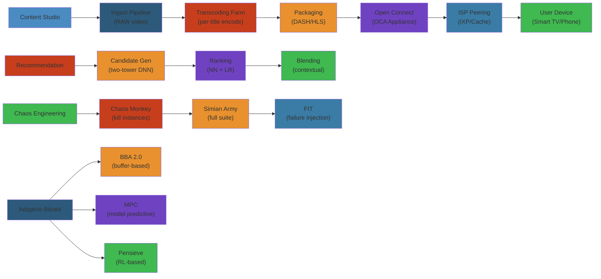

# 🎬 Design Netflix — Complete System Design Deep Dive

> **Scope**: Requirements (200M subscribers, 100PB+ content, 1000+ device types, adaptive streaming), content pipeline (transcoding, packaging, DRM), CDN (Open Connect, peering), personalization (recommendation pipeline, two-tower DNN, candidate generation/ranking/blending), adaptive streaming algorithms (BBA, MPC, Pensieve), chaos engineering (Chaos Monkey, Simian Army, CAP, FIT), failure analysis.
>
> **Related**: [01-whatsapp.md](/15-system-design/01-whatsapp.md)




## Table of Contents

1. Requirements & Scale
2. High-Level Architecture
3. Content Pipeline
4. Content Delivery (Open Connect)
5. Personalization & Recommendations
6. Adaptive Bitrate Streaming
7. Chaos Engineering
8. Failure Analysis
9. Performance Considerations

---

## 1. Requirements & Scale

```text
Netflix Scale (2024):
  - 260M+ paid subscribers globally
  - 1000+ device types (smart TVs, phones, tablets, consoles, set-top boxes)
  - 100PB+ content library (encoded + originals)
  - 1B+ hours streamed per month
  - 15% of global internet downstream traffic
  - 200K+ encoding profiles generated daily
  - 800+ Open Connect Appliances (OCAs) deployed globally
```

**Key Requirements:**
- Low startup latency (< 2s to start playback)
- Adaptive streaming to maintain smooth playback across variable bandwidth
- High-quality video (4K HDR/Dolby Vision, Atmos audio)
- Global CDN with regional availability
- Personalized home page per user
- Fault-tolerant: survive region-level failures

### Architecture Design Steps and Implementation

#### Step-by-Step: Netflix Architecture Design

1. **Content ingestion** — Studio uploads raw video files, metadata
2. **Encoding pipeline** — Per-title encoding (optimize bitrate/quality for each title)
3. **Packaging** — Create DASH/HLS segments with DRM (Widevine)
4. **CDN distribution** — Deploy to Open Connect (Netflix-owned CDN appliances in ISPs)
5. **Client adaptation** — Adaptive bitrate algorithm (BBA 2.0, MPC, Pensieve) adjusts quality
6. **Personalization** — Recommendation engine (two-tower DNN) ranks content per user

#### Code Example: Adaptive Bitrate Selection

```python
# Simplified BBA (Buffer-Based Algorithm)
class ABRController:
    def __init__(self, min_bitrate, max_bitrate):
        self.min_bitrate = min_bitrate
        self.max_bitrate = max_bitrate
        self.buffer_level = 0  # seconds of buffered video
    
    def select_bitrate(self, network_bandwidth, buffer_level):
        """
        Netflix BBA: Choose bitrate based on buffer level, not just bandwidth
        """
        # Target buffer: 10 seconds
        target_buffer = 10
        
        if buffer_level < target_buffer * 0.5:
            # Buffer critically low, use minimum bitrate (fast recovery)
            return self.min_bitrate
        elif buffer_level > target_buffer * 1.5:
            # Buffer has cushion, can use higher bitrate
            bitrate = int(network_bandwidth * 0.85)  # Use 85% of available BW
            return min(bitrate, self.max_bitrate)
        else:
            # Normal state, maintain current bitrate
            return self.current_bitrate

# Usage:
abr = ABRController(min_bitrate=500e3, max_bitrate=25e6)  # 500kbps to 25Mbps
selected_bitrate = abr.select_bitrate(
    network_bandwidth=10e6,  # 10 Mbps measured
    buffer_level=12  # 12 seconds buffered
)
```

#### Real-World Scenario: Netflix's 2013 AWS Outage

Netflix deployed content across AWS regions with multi-region failover. During AWS EC2 outage in US-East region, Netflix services in other regions failed too (shared microservice dependencies). Netflix discovered: "We designed for redundancy, but created hidden dependencies." Lesson: Chaos engineering (Chaos Monkey, FIT) caught this. Now Netflix regularly kills random instances/regions to verify true fault tolerance. This practice saved them from multiple production incidents.

## 2. High-Level Architecture

```text
+-------------+     +----------------+     +------------------+
|  Content    |     |  Encoding/     |     |  CDN (Open       |
|  Ingestion  |---->|  Transcoding   |---->|  Connect)        |
|  (Studio)   |     |  Pipeline      |     |  Appliances      |
+-------------+     +----------------+     +--------+---------+
                                                    |
+-------------+     +----------------+              |
|  User       |     |  Client (App)  |<-------------+
|  Request    |---->|  (Smart TV)    |
+-------------+     +-------+--------+
                            |
                            v
+------------------+     +------------------+     +------------------+
|  AWS Cloud       |     | Microservices    |     | Data Pipeline    |
|  - CDN Steering  |<--->| - API Gateway    |<--->| - Kafka/Spark    |
|  - DNS Routing   |     | - Personaliz.    |     | - Cassandra      |
|  - Auth Services |     | - A/B Testing    |     | - EVCache        |
+------------------+     +------------------+     +------------------+
```

**Key Components:**
- **Content Pipeline:** Studio delivery -> transcoding -> packaging -> CDN deployment
- **Open Connect:** Netflix's own CDN deployed at ISP locations
- **Personalization:** Offline ML + online inference for recommendations
- **Chaos Engineering:** Deliberate failure injection for resilience testing

---

## 3. Content Pipeline

```text
Studio -> Source Master -> Transcoding Farm -> DASH/HLS Packaging -> CDN

Transcoding Pipeline:
  Source File (4K, HDR)
        |
        v
  +-----+------+
  | Per-Title  |  (analyze complexity -> select optimal encode ladder)
  +-----+------+
        |
        v
  +-----+------+
  | Chunked    |  (divide into 2-10s chunks, parallel encode)
  | Encoding   |  (VP9, H.264, H.265, AV1)
  +-----+------+
        |
        v
  +-----+------+
  | Quality    |  (content-aware encoding, CAE)
  | Analysis   |  (VMAF, PSNR, SSIM thresholds)
  +-----+------+
        |
        v
  +-----+------+
  | Packaging  |  (DASH MPD, HLS m3u8, subtitles, DRM)
  +------------+
```

**Per-Title Encode Optimization:** Each title gets an optimal encode ladder based on its visual complexity. A static film needs fewer bitrates than an action movie. Net result: 20-50% bandwidth savings at same perceived quality (VMAF score).

**Content-Aware Encoding (CAE):** Per-chunk quality analysis. More bits to complex scenes, fewer to simple scenes. Dynamic bitrate allocation across chunks.

**Video Codecs:**
| Codec | Bitrate Savings vs H.264 | Adoption |
|-------|-------------------------|----------|
| H.264 | Baseline | Universal (100% devices) |
| H.265/HEVC | 30-50% | Modern devices, TVs |
| VP9 | 30-40% | Web browsers, Android |
| AV1 | 40-60% | Latest devices, smart TVs |

**Encoding Farm:** Parallel encoding on AWS + Netflix's own encoding cluster. Chunked encoding: each 2-10s segment encoded independently, then stitched.

**Packaging:**
- DASH (Dynamic Adaptive Streaming over HTTP): MPD manifest, fragmented MP4 segments
- HLS (HTTP Live Streaming): m3u8 playlist, TS/fMP4 segments
- DRM: Widevine (Android/Chrome), PlayReady (Xbox/Windows), FairPlay (Apple)
- Subtitles: TTML, VTT, multiple languages
- Audio: Dolby Atmos, 5.1, stereo, descriptive audio

---

## 4. Content Delivery (Open Connect)

```text
Open Connect Appliance (OCA):
  +------------------------------------------+
  |  OCA Server (whitebox, 100TB+ storage)   |
  |  - Intel Xeon CPU                         |
  |  - 100Gbps+ NIC                           |
  |  - NVMe cache + HDD bulk storage          |
  |  - Custom FreeBSD-based caching software  |
  |  - Pre-populated with popular content     |
  +------------------------------------------+

Deployment:
  ISP Data Center                  Netflix Origin
       |                                |
  +----+----+                      +----+----+
  |  OCA    |<--- peering -------->|  OCA    |
  |  (cache)|                      |  (fill)  |
  +----+----+                      +----+----+
       |
  +----+----+
  | User's  |
  | ISP     |
  +----+----+
```

**CDN Steering:** Based on user's ISP and location, DNS resolves to nearest OCA. If OCA is overloaded or down, DNS-based failover to another OCA or cloud CDN.

**CDN Multi-Cast:** Multicast-assisted delivery for live events. Use multicast within ISP network to reduce bandwidth. Convert to unicast at edge.

**OCA Capacity:** Each OCA can serve 100Gbps+ throughput. Multiple OCAs per ISP (deployed in strategic locations).

**CDN Failover:**
```text
Primary OCA -> Secondary OCA -> Cloud CDN (AWS) -> Different Region
(Tier 1)       (Tier 2)         (Tier 3)           (Tier 4)
```

**Peering Strategy:** Netflix pays ISPs to deploy OCAs (free peering). ISPs benefit from reduced transit costs (traffic stays local). Win-win arrangement.

**Content Pre-Population:** Popular content is pushed to OCAs during off-peak hours (proactive fill). Less popular content fetched on-demand (reactive fill).

---

## 5. Personalization & Recommendations

```text
Recommendation Pipeline:

  +--------+    +-----------+    +-------+    +--------+    +----------+
  |Candidate|    | Ranking   |    |Blending|    |Filter  |    |Explain   |
  |Generation|-->| Model    |-->| +      |-->| +      |-->| +        |
  | 200 items|   | score    |   | Rank   |   | Context|   | Reason   |
  +--------+    +-----------+   +-------+   +--------+   +----------+
       |              |              |            |            |
  Candidate Sources:                |
  - Trending                        v
  - Continue Watching        +-------------+
  - Top Picks               | A/B Testing |
  - Similar to Watched      | (Multi-armed|
  - New Releases            |  Bandit)    |
  - Genre Picks             +-------------+
  - Because You Watched X
  - Seasonal/Events
```

**Two-Tower DNN (Retrieval):**

```text
User Tower:                        Item Tower:
  user_id (embedding)                item_id (embedding)
  watch_history (sequence)           title_embedding
  device_type                        genre_vector
  time_of_day                        popularity_score
  region                             release_date
  language                           language
  subscription_tier                  maturity_rating
        |                                 |
        v                                 v
  +-----+-----+                     +-----+-----+
  | MLP Layers|                     | MLP Layers|
  +-----+-----+                     +-----+-----+
        |                                 |
        v                                 v
  user_embedding (128d)            item_embedding (128d)
        |                                 |
        +--- dot product = score ---------+

Candidate generation: ANN (Approximate Nearest Neighbor) search
over item embeddings using user embedding as query.
Top-N candidates returned (200 items per user).
```

**Ranking (Wide & Deep):**

```text
Input Features:
  - User embedding + Item embedding (from retrieval)
  - Cross features: user_region x item_language
  - Context features: day_of_week, hour, device_type
  - Historical features: user_avg_watch_time, genre_affinity

Wide component: (memorization)
  Cross-product of sparse features (like item_genre x user_region)
  Linear model: learns specific correlations

Deep component: (generalization)
  DNN over dense embeddings
  Learns new combinations not seen in training data

Output: P(click), P(watch_10min), P(finish), P(like)
Weighted score = 0.3*click + 0.5*watch_10min + 0.2*finish
```

**A/B Testing & Multi-Armed Bandit:**
- Every user in an experiment: test new recommendation algorithm
- MAB: dynamically adjust traffic allocation based on reward (watch time)
- Epsilon-greedy: 90% exploit best model, 10% explore

**Real-Time Data Pipeline:**
```text
Client Events -> Kafka -> Spark/Storm -> Cassandra -> EVCache -> Serving

Events collected:
  play, pause, stop, seek, browse, search, rate, add_to_list
  device info, buffering events, AB test group
 -> Personalization model retrained daily (offline)
 -> User state updated in real-time (continue watching position)
```

---

## 6. Adaptive Bitrate Streaming

```text
Streaming Flow:

1. Client requests manifest (MPD for DASH, m3u8 for HLS)
2. Manifest lists available bitrates + segment URLs
3. Client selects initial bitrate (conservative: start at low bitrate)
4. Client requests segment at selected bitrate
5. Bandwidth monitor (download speed history)
6. ABR algorithm selects next segment's bitrate
7. Repeat for each segment (every 2-10 seconds)

          Bandwidth
             ^
             |
  8 Mbps ----+------+------+------+------+ (1080p)
             |      |      |      |
  5 Mbps ----+------+------+------+------+ (720p)
             |      |      |      |
  2 Mbps ----+------+------+------+------+ (480p)
             |      |      |      |
             +------+------+------+------+---> Time
              seg1   seg2   seg3   seg4
                   1080p   480p   720p
```

**ABR Algorithms:**

**BBA (Buffer-Based Algorithm):**
```text
Decision based on buffer occupancy, not bandwidth estimate.

If buffer > HIGH_THRESHOLD (30s): upgrade bitrate
If buffer < LOW_THRESHOLD (5s):  downgrade bitrate (prevent rebuffering)
If LOW < buffer < HIGH: maintain or modest adjustment

Pros: Simple, no bandwidth estimation needed
Cons: Slow to react, may not fully utilize bandwidth
```

**MPC (Model Predictive Control):**
```text
Predict throughput for next N segments using harmonic mean of past throughput.
Select bitrate that maximizes QoE over prediction horizon.

QoE = sum(quality_score) - penalty*quality_changes - penalty*rebuffering

Optimization: dynamic programming over possible bitrate sequences for next N segments.

Pros: Optimizes for smooth playback + quality
Cons: Requires accurate throughput prediction
```

**Pensieve (RL-Based):**
```text
State: recent throughput, buffer level, bitrate history
Action: select bitrate for next segment
Reward: QoE (quality - changes - rebuffering)

Trained via A3C (Asynchronous Advantage Actor-Critic)
Learned policy: more robust to throughput variation than MPC/BBA

Pros: Best performance across diverse network conditions
Cons: Training overhead, black-box (harder to debug)
```

**Bitrate Ladder (Example):**
```text
Bitrate    Resolution   Codec
  235K      320x240     H.264
  375K      384x288     H.264
  560K      512x384     H.264
  750K      512x384     H.264
  1.0M      640x480     H.264
  1.5M      720x480     H.264
  2.0M      1024x576    H.264
  3.0M      1280x720    H.264
  4.5M      1280x720    H.264
  6.0M      1920x1080   H.264
  8.0M      1920x1080   H.264
 12.0M      1920x1080   H.265
 20.0M      3840x2160   H.265 (4K)
 30.0M      3840x2160   H.265 (4K HDR)
```

**Startup Bitrate:**
- Start at lowest bitrate (fast startup)
- Or use saved bandwidth history from previous session
- Or start at medium if user has fast network historically

**Seamless Quality Switching:**
- DASH/HLS allows segment-level quality switch
- Next segment requested at new bitrate
- Player interpolates (no gap or freeze)

---

## 7. Chaos Engineering

```text
Simian Army:
  +------------------+     +------------------+
  | Chaos Monkey     |     | Latency Monkey   |
  | Randomly kill    |     | Injects latency  |
  | EC2 instances    |     | into requests    |
  +------------------+     +------------------+
  +------------------+     +------------------+
  | Conformity Monkey|     | Doctor Monkey    |
  | Checks instance  |     | Detects unhealthy|
  | config compliance|     | instances        |
  +------------------+     +------------------+
  +------------------+     +------------------+
  | Janitor Monkey   |     | Security Monkey  |
  | Cleans unused    |     | Checks security  |
  | resources        |     | vulnerabilities  |
  +------------------+     +------------------+
  +------------------+
  | 10-18 Monkeys    |
  | (deprecated,     |
  | evolved into CAP)|
  +------------------+
```

**Chaos Automation Platform (CAP):**

```text
CAP Architecture:
  +----------+     +----------+     +----------+
  | Experiment|     | Failure  |     | Observ.  |
  | Definition|     | Executor |     | & Analysis|
  +-----+----+     +----+-----+     +-----+----+
        |               |                  |
        v               v                  v
  +-----+----+     +----+-----+     +-----+----+
  | Target   |     | Failure  |     | Impact   |
  | Selection|     | Injection|     | Analysis |
  | (service,|     | (kill,   |     | (metrics, |
  |  region, |     |  latency,|     |  logs,    |
  |  AZ)     |     |  black-  |     |  traces)  |
  +----------+     |  hole)   |     +----------+
                   +----------+
```

**Chaos Kong (Region Failover):** Simulates full AWS region failure. Tests cross-region failover of entire Netflix stack. Run regularly to validate DR readiness.

**FIT (Failure Injection Testing):**
- RPC-level failure injection
- Microservice-level testing
- Canary: inject failures into 1% of traffic first
- Production-safe: circuit breakers catch cascading failures

**Key Principles:**
1. **Blast Radius Control:** Start small (1 instance, 1% traffic)
2. **Automated Rollback:** If error budget exceeded, immediately stop experiment
3. **Steady State Hypothesis:** System should remain within error budget during injected failures
4. **Continuous:** Run experiments 24/7 (not one-off)

---

## 8. Failure Analysis

**CDN Outage:**
```text
Problem: OCA cluster at major ISP goes offline.

Impact: Users at that ISP experience buffering or cannot start playback.

Mitigations:
  - DNS steering to backup OCA (if available at same ISP)
  - Fallback to cloud CDN (AWS CloudFront)
  - CDN failover hierarchy: OCA -> peer OCA -> AWS -> different region
  - Retry with exponential backoff in client manifest request
  - Client cached manifest (re-fetch with CDN list)
```

**Chaos Monkey Kills Critical Service:**
```text
Problem: Chaos Monkey terminates all instances of user-auth service
in an availability zone.

Mitigation:
  - N+2 redundancy (at least 3 AZs)
  - Auto-scaling group replaces terminated instances
  - Service mesh routes around failed AZ
  - Circuit breakers prevent cascading
  - Client retries on failure
```

**Transcoding Pipeline Failure:**
```text
Problem: Encoding job fails mid-way (source corruption, server crash).

Mitigations:
  - Chunked encoding: only failed chunk needs retry
  - Retry with different encoding server
  - Source file health check before encoding begins
  - Parallel encoding with redundancy (encode same chunk twice)
  - CQ (concurrency queue) with timeout and retry
```

**Recommendation Service Failure:**
```text
Problem: Personalization model serving returns errors (model stale, cache miss).

Mitigations:
  - Fallback: serve popular/trending content (generic recommendation)
  - Cache: EVCache serves stale recommendations within TTL
  - Circuit breaker: if error rate > 10%, bypass personalization for 30s
  - Graceful degradation: show rows one at a time (continue watching first)
```

**Streaming Failure (Rebuffering):**
```text
Problem: Client buffers below threshold -> video freezes.

Mitigations:
  - ABR downgrade to lower bitrate
  - Client-side bitrate overshoot detection and rollback
  - CDN retry with different edge
  - Pre-fetch next segment: client requests next segment before current ends
  - Client-side fallback: if DASH fails, retry with HLS
```

**Chaos Kong Region Failover:**
```text
Problem: Full AWS region outage (simulated or real).

Steps:
  1. DNS steering shifts traffic to healthy region
  2. Cassandra cross-region replication (async) -> new region catches up
  3. EVCache cross-region replication (warm cache in backup region)
  4. Transcoding pipeline restarted in backup region
  5. Open Connect steering: reconfigure OCAs globally for regional shift
  6. Monitor error budget: if too high, rollback to original region

Expected: 5-15 minute failover window (some users affected).
Acceptable for a full region outage.
```

---

## 9. Performance Considerations

```text
Streaming Performance Targets:
  - Startup time: < 2s (P50)
  - Rebuffer rate: < 1% of play time (P99)
  - Average bitrate: > 5 Mbps (HD), > 15 Mbps (4K)
  - Quality switches: < 2 per hour

Recommendation Serving:
  - P50 latency: < 200ms
  - P99 latency: < 1s
  - Cache hit ratio (EVCache): > 95%
  - Model refresh: daily offline, real-time features

CDN Performance:
  - OCA capacity: 100Gbps+ per appliance
  - Cache hit ratio: > 95% for popular content
  - DNS resolution: < 50ms
  - Cross-region replication: < 5s for metadata, async for media

Data Pipeline:
  - Kafka throughput: 10M+ events/sec
  - Spark offline training: 4 hours for full model retrain
  - Cassandra: 100K writes/sec, P99 read < 10ms
```

---

## Simplest Mental Model

**Netflix is like a global video library with three core jobs: make the video ready (transcode), get it close to you (CDN), and pick what you'd like to watch (recommendation).** The video is pre-sliced into tiny chunks at many quality levels. The player acts like a smart taxi driver — it picks the best road (bitrate) based on traffic (bandwidth) and keeps a buffer (passengers waiting). Chaos engineering is like a fire drill that randomly shuts off rooms to make sure the exits work — the system is trained to handle failure as a normal state.

## Related

- [Cap Consistency](/09-distributed-systems/01-cap-consistency.md)
- [Consensus Replication](/09-distributed-systems/01-consensus-replication.md)
- [Consensus Raft](/09-distributed-systems/02-consensus-raft.md)
- [Distributed Transactions](/09-distributed-systems/02-distributed-transactions.md)
- [Distributed Caching](/09-distributed-systems/03-distributed-caching.md)
- [Distributed Storage](/09-distributed-systems/03-distributed-storage.md)
