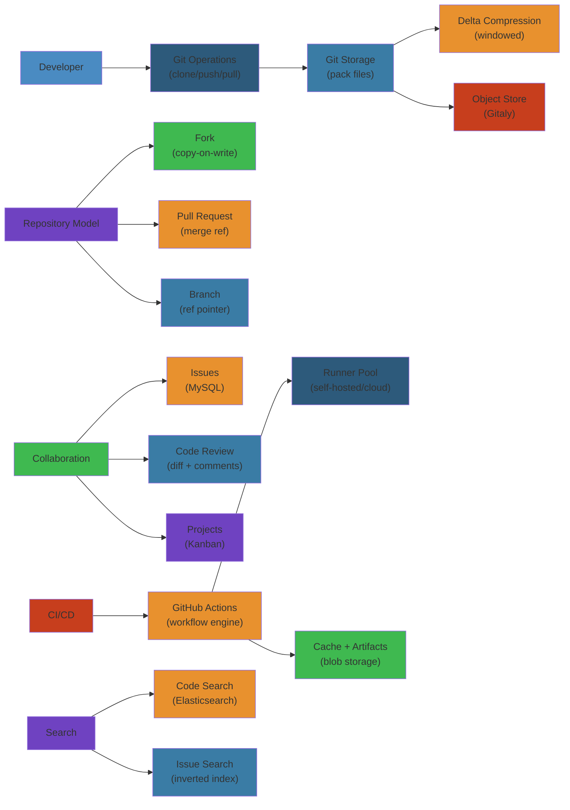

# 🐙 Design GitHub — Complete System Design Deep Dive

> **Scope**: Requirements (100M+ repositories, 50M+ developers), Git storage (pack files, delta compression, object storage), repository model (forks, PRs, branches, tags), collaboration (issues, PRs, code review, discussions, projects), CI/CD (GitHub Actions, self-hosted runners, workflow orchestration), storage (Git LFS, large file policies), search (code, issues, users), database (MySQL, Redis, Elasticsearch), availability (multi-region, read replicas for git clone), failure analysis.
>
> **Related**: [07-amazon.md](/15-system-design/07-amazon.md) | [09-google-search.md](/15-system-design/09-google-search.md)




## Table of Contents


1. Requirements & Scale
2. High-Level Architecture
3. Git Storage Layer
4. Repository Model
5. Pull Requests & Code Review
6. Issues & Projects
7. GitHub Actions (CI/CD)
8. Git LFS & Large File Storage
9. Search
10. Database Design
11. Availability & Multi-Region
12. Failure Analysis
13. Performance Considerations

---

## 1. Requirements & Scale


```text
GitHub Scale (2024):
  - 100M+ repositories (public + private)
  - 50M+ developers
  - 25M+ open issues across all repos
  - 100M+ pull requests created per year
  - 4M+ organizations
  - 200M+ git operations per day (clone, push, fetch, pull)
  - 3M+ CI/CD pipeline runs per day (Actions)
  - 20M+ code search queries per day
  - 1B+ file views per month
  - Repository size limit: 100GB (500MB recommended)
  - File size limit: 100MB (via web), 2GB via Git LFS
  - 99.95% uptime SLA (GitHub Enterprise)

Key Requirements:
  - Fast git clone/push/fetch (read-heavy for clone, write for push)
  - Consistent view of repository state (strong consistency for git refs)
  - High availability for read operations (clone, browse code)
  - Scalable to monorepos with 100K+ files, 1GB+ size
  - Real-time collaboration (issues, PRs, code review)
  - CI/CD: parallel workflow execution at scale
  - Code search: sub-second latency across 100M+ repos
  - Globally available (multi-region for git operations)
```

---

## 2. High-Level Architecture


```text
+-------------+     +-------------+     +-------------+     +-------------+
| Browser     |     | Git Client  |     | API Client  |     | Actions     |
| (Web UI)    |     | (git CLI)   |     | (REST/Graph)|     | Runner      |
+------+------+     +------+------+     +------+------+     +------+------+
       |                   |                   |                    |
       v                   v                   v                    v
+------+-------------------+-------------------+--------------------+------+
|                         Global Load Balancer (HAProxy + DNS)              |
+------+-------------------+-------------------+--------------------+------+
       |                   |                   |                    |
       v                   v                   v                    v
+------+------+     +------+------+     +------+------+     +------+------+
| Web         |     | Git Smart   |     | API         |     | Actions     |
| Frontend    |     | HTTP Server |     | Gateway     |     | Service     |
| (Rails)     |     | (git-http-  |     | (REST,      |     | (Workflow   |
| - Browse    |     |  backend)   |     |  GraphQL)   |     |  Engine)    |
| - Issues    |     | - clone     |     |             |     |             |
| - PRs       |     | - push      |     | - Auth      |     | - Job       |
| - Settings  |     | - fetch     |     | - Rate lim  |     |   scheduler |
| - Dashboard |     | - pack      |     | - Routing   |     | - Runner    |
+------+------+     +------+------+     +------+------+     |   mgmt     |
       |                   |                   |              +------+------+
       +-------------------+-------------------+                     |
                           |                                          v
                           v                                   +------+------+
                    +------+-------+                          | Actions     |
                    | Service Bus  |                          | Runners     |
                    | (Kafka/SQS)  |                          | (Hosted +   |
                    |              |                          |  Self-      |
                    | - git events |                          |  hosted)    |
                    | - webhooks   |                          +-------------+
                    | - status     |
                    |   updates    |
                    +------+-------+
                           |
          +----------------+-------------------+
          |                |                   |
          v                v                   v
   +------+------+  +------+-------+  +--------+--------+
   | MySQL       |  | Redis        |  | Elasticsearch   |
   | Cluster     |  | Cluster      |  | Cluster         |
   | (Vitess)    |  |              |  |                 |
   |             |  | - Session    |  | - Code index    |
   | - Repos     |  | - Cache      |  | - Issue index   |
   | - Issues    |  | - Rate lim   |  | - Repo index    |
   | - Users     |  | - Queue      |  | - User index    |
   | - PRs       |  | - Pub/sub    |  |                 |
   | - Comments  |  |              |  +-----------------+
   | - Labels    |  +--------------+
   +------+------+
          |
          v
   +------+------+
   | Git Storage  |
   | Layer        |
   |              |
   | - Object     |
   |   storage    |
   |   (S3-like)  |
   | - Pack files |
   | - Delta      |
   |   storage    |
   | - File mode  |
   |   (GFS)      |
   +--------------+
```

**Key Components:**
- **Web Frontend:** Ruby on Rails application serving all web UI (repository browsing, issues, PRs, settings)
- **Git Smart HTTP Server:** Service handling git protocol over HTTP (clone, push, fetch) — custom-built, not standard Apache
- **API Gateway:** REST and GraphQL API endpoints with authentication, rate limiting, versioning
- **Actions Service:** Workflow engine that schedules and orchestrates CI/CD jobs across runners
- **MySQL Cluster (Vitess):** Sharded MySQL via Vitess for horizontal scalability — stores all metadata: users, repos, issues, PRs, comments
- **Redis Cluster:** Caching (session, rate limits, frequently accessed data), pub/sub for real-time events, job queues
- **Elasticsearch:** Code search index (dedicated cluster), issue search, repository search
- **Git Storage Layer:** Object storage (S3/GFS-compatible) for git objects, pack files, and large files
- **Service Bus (Kafka/SQS):** Event-driven architecture for webhooks, notifications, and async processing

---

## 3. Git Storage Layer


```text
Git Object Model:

  Git objects stored in repositories:
    - Blob: File content (compressed)
    - Tree: Directory listing (file names -> blob hashes)
    - Commit: Snapshot (tree hash + parent commit(s) + author + message)
    - Tag: Named reference to a commit (annotated)

  Object storage path:
    .git/objects/{hash_prefix}/{hash_remainder}
    Example: .git/objects/ab/23d4e5f6g7h8i9j0k1l2m3n4o5p6q7r8s9t0u

  Object ID: SHA-1 hash of content (migrating to SHA-256 in 2024+)

Git Pack Files:

  Instead of storing individual loose objects, Git packs them:

  Pack file format:
    - .pack: concatenated, delta-compressed objects
    - .idx: index file for fast lookup within pack

  Pack file structure:
    [Object 1: full (base)]
    [Object 2: delta against object 1]
    [Object 3: full (base)]
    [Object 4: delta against object 3]
    ...

  Delta compression:
    - Stores differences between file versions
    - "file_v2" = "file_v1" + delta(v1 -> v2)
    - Typical compression: 10-30x for text files
    - Binary files: poor delta compression (use Git LFS)

GitHub's Pack File Strategy:

  On push:
    1. Client computes objects and pushes pack file
    2. GitHub receives pack, verifies objects (SHA check)
    3. Store pack file in object storage (S3/GFS)
    4. Update refs (branches, tags)

  On clone:
    1. Git HTTP backend receives clone request
    2. Client advertises what it has (want/have negotiation)
    3. Server computes pack of needed objects:
       - Which objects does client need?
       - Delta-compress against what client already has
       - Create thin pack (missing base objects fetched separately)
    4. Stream pack file to client

  On fetch/pull:
    - Similar to clone but client has more objects already
    - Server only sends new commits since last fetch
    - Git forked repositories: use "alternates" to avoid duplicating objects

GitHub Storage Architecture:

  Storage hierarchy:
    L0: In-memory cache (popular repos: objects kept hot in RAM)
    L1: SSD cache (recent pushes, clone-optimized)
    L2: Object storage (S3/GFS, primary storage)
    L3: Archive (cold storage for rarely accessed repos)

  Object storage (S3/GFS):
    Key: repos/{repo_id}/objects/{pack_hash}
    Value: pack file (compressed git objects)
    Also: repos/{repo_id}/refs/{ref_name} -> commit SHA
    Also: repos/{repo_id}/info/config (repo configuration)

  Write path optimization:
    - Push: server receives pack, validates objects
    - Writes pack to SSD cache synchronously
    - Async: upload to S3 object storage
    - Loose objects: batch into pack files periodically (git gc)
    - Git GC (garbage collection): background job, compresses + removes stale

  Read path optimization:
    - Clone/fetch: check SSD cache first
    - Cache miss: fetch from S3, cache on SSD
    - Popular repos: pre-warm cache with recent pack files
    - Multi-region: replicate hot repos to all region caches

Repository Forks and Object Sharing:

  Forks: ~50M+ forked repos on GitHub

  Object sharing:
    - Forked repos share objects with parent (via git alternates)
    - objects/info/alternates: points to parent's object directory
    - Clone of fork: sends parent's base objects + fork-specific objects
    - Storage: parent repo objects stored once, shared across all forks

  Network graph:
    - Parent repo: full object store
    - Fork 1: own objects + reference to parent
    - Fork 2: own objects + reference to parent
    - New objects on fork: stored with fork, not copied to parent

  Challenge: deleting a repo with many forks
    - Need to check no fork still references parent's objects
    - Grace period: "disabled" status before deletion
```

---

## 4. Repository Model


```text
Repository Data Model (MySQL):

Table: repositories
  id                (bigint PK)       -- auto-increment
  owner_id          (bigint FK)       -- user or organization
  name              (varchar 100)     -- repo name (unique per owner)
  full_name         (varchar 200)     -- "owner/repo"
  description       (text)
  default_branch    (varchar 100)     -- "main", "master"
  is_private        (boolean)
  is_fork           (boolean)
  is_archived       (boolean)
  is_empty          (boolean)
  fork_count        (int)
  star_count        (int)
  watcher_count     (int)
  open_issues_count (int)
  default_merge_commit (boolean)
  allow_squash_merge (boolean)
  allow_rebase_merge (boolean)
  has_issues        (boolean)
  has_projects      (boolean)
  has_wiki          (boolean)
  has_downloads     (boolean)
  language          (varchar 50)      -- primary language (auto-detected)
  object_store_id   (varchar 100)     -- S3 bucket/prefix for git objects
  disk_usage        (bigint)          -- bytes in repo
  size              (int)             -- repository size (GitHub API field)
  created_at        (timestamp)
  updated_at        (timestamp)
  pushed_at         (timestamp)       -- last push

  UNIQUE KEY idx_owner_name (owner_id, name)
  INDEX idx_language (language)
  INDEX idx_pushed_at (pushed_at)
  INDEX idx_owner_id (owner_id)

Table: branches
  id                (bigint PK)
  repo_id           (bigint FK)
  name              (varchar 200)     -- branch name (refs/heads/name)
  commit_sha        (char 40)         -- SHA of tip commit
  is_default        (boolean)
  is_protected      (boolean)         -- cannot force push / delete
  protection_rules  (json)            -- { required_reviews: 2, dismiss_stale: true,
                                      --   required_status_checks: ["CI"] }
  created_at        (timestamp)
  updated_at        (timestamp)

  UNIQUE KEY idx_repo_branch (repo_id, name)

Table: tags
  id                (bigint PK)
  repo_id           (bigint FK)
  name              (varchar 200)     -- tag name (refs/tags/name)
  commit_sha        (char 40)
  annotation        (text)            -- for annotated tags
  created_at        (timestamp)

  UNIQUE KEY idx_repo_tag (repo_id, name)

Table: stars
  user_id           (bigint PK)       -- partition
  repo_id           (bigint PK)       -- sort
  created_at        (timestamp)

  PRIMARY KEY (user_id, repo_id)
  INDEX idx_repo_id (repo_id)         -- for star count

Branch Protection Rules:

  JSON schema for protection_rules:
    {
      "required_status_checks": ["continuous-integration/travis-ci", "CI"],
      "enforce_admins": true,
      "required_pull_request_reviews": {
        "required_approving_review_count": 2,
        "dismiss_stale_reviews": true,
        "require_code_owner_reviews": true
      },
      "restrictions": {
        "users": ["admin-user"],
        "teams": ["core-maintainers"]
      },
      "required_linear_history": false,
      "allow_force_pushes": false,
      "allow_deletions": false,
      "block_creations": false,
      "required_conversation_resolution": true,
      "lock_branch": false,
      "allow_fork_syncing": true
    }

  Enforced by Git server on push:
    - Reject push if:
      - Branch is protected AND user not in allow list
      - Status checks pending/failing
      - Required reviews not done
      - Commit not based on latest HEAD (stale review)
```

**Webhook System:**

```text
Webhook delivery:

  Events (push, pull_request, issues, create, delete, etc.):
    1. Git operation triggers event
    2. Event published to Kafka topic (webhook.{event_type})
    3. Webhook workers consume events
    4. Look up registered webhooks for repo/organization
    5. Deliver to webhook URL (HTTP POST with JSON payload)
    6. Retry: up to 3 times with exponential backoff
    7. Mark as failed if all retries exhausted
    8. Webhook secret: HMAC-SHA256 signature header

  Delivery guarantees: at-least-once (dedup by delivery_id)
  Rate limit: ~5000 deliveries/second
```

---

## 5. Pull Requests & Code Review


```text
Pull Request Lifecycle:

  +-----------+    +-----------+    +-----------+    +-----------+
  | OPEN      |--->| REVIEW    |--->| APPROVED  |--->| MERGED    |
  | (draft or |    | (changes  |    | (merge    |    | (squash,  |
  |  ready)   |    |  requested|    |  eligible)|    |  merge,   |
  +-----------+    |  or appr) |    +-----------+    |  rebase)  |
       |           +-----------+         |           +-----------+
       v                                 v                |
  +-----------+                      +-----------+        v
  | CLOSED    |                      | CLOSED    |   +-----------+
  | (unmerged)|                      | (unmerged)|   | CLOSED    |
  +-----------+                      | + conflic|   | (merged)  |
                                      +-----------+   +-----------+

PR Data Model:

Table: pull_requests
  id                (bigint PK)
  repo_id           (bigint FK)
  number            (int)             -- PR # (sequential per repo)
  title             (varchar 500)
  body              (text)
  state             (varchar 20)      -- OPEN, CLOSED, MERGED
  user_id           (bigint FK)       -- author
  head_branch       (varchar 200)     -- source branch
  base_branch       (varchar 200)     -- target branch
  head_sha          (char 40)         -- HEAD commit SHA of source
  base_sha          (char 40)
  merge_commit_sha  (char 40)         -- if merged
  mergeable         (boolean)         -- no merge conflicts
  mergeable_state   (varchar 20)      -- UNKNOWN, MERGEABLE, CONFLICTING
  draft             (boolean)         -- draft PR
  merge_method      (varchar 20)      -- MERGE, SQUASH, REBASE
  merged_by_id      (bigint FK)
  merged_at         (timestamp)
  closed_at         (timestamp)
  created_at        (timestamp)
  updated_at        (timestamp)

  INDEX idx_repo_number (repo_id, number)
  INDEX idx_user_state (user_id, state)
  INDEX idx_repo_state (repo_id, state)

Table: pull_request_reviews
  id                (bigint PK)
  pr_id             (bigint FK)
  user_id           (bigint FK)
  body              (text)
  state             (varchar 20)      -- APPROVED, CHANGES_REQUESTED,
                                      -- COMMENTED, DISMISSED
  commit_sha        (char 40)         -- which commit was reviewed
  submitted_at      (timestamp)

  INDEX idx_pr_id (pr_id)

Table: review_comments
  id                (bigint PK)
  pr_id             (bigint FK)
  review_id         (bigint FK)
  user_id           (bigint FK)
  body              (text)
  path              (varchar 500)     -- file path
  position          (int)             -- line position in diff
  line              (int)             -- line number
  commit_sha        (char 40)         -- commit containing the line
  in_reply_to_id    (bigint)          -- threaded reply
  created_at        (timestamp)
  updated_at        (timestamp)

  INDEX idx_pr_id (pr_id)

Table: status_checks
  id                (bigint PK)
  pr_id             (bigint FK)
  context           (varchar 200)     -- e.g., "continuous-integration/travis-ci"
  state             (varchar 20)      -- PENDING, SUCCESS, FAILURE, ERROR
  target_url        (varchar 500)     -- CI build URL
  description       (text)
  commit_sha        (char 40)
  created_at        (timestamp)
  updated_at        (timestamp)

  INDEX idx_pr_id (pr_id)
  INDEX idx_commit_sha (commit_sha)
```

**Merge Conflict Detection:**

```text
Mergeability check:

  1. On each push to PR's head branch:
     - Background job: attempt merge (compute merge commit)
     - Try: git merge --no-commit base_branch...head_branch
     - If conflict: set mergeable = false, mergeable_state = 'CONFLICTING'
     - If clean: set mergeable = true, mergeable_state = 'MERGEABLE'

  2. Performance:
     - For large repos, merge check can take minutes
     - Cached: mergeable state cached until next push
     - Queue: prioritized by PR update time (FIFO)

  3. Merge strategies:
     - Merge commit: git merge --no-ff (creates merge commit)
     - Squash merge: git merge --squash (single commit)
     - Rebase merge: git rebase base then fast-forward
     - User selects strategy when clicking "Merge pull request"

  4. Protected branch merge:
     - Must pass: required reviews, status checks, conversation resolution
     - UI blocks merge button until all conditions met
     - API: POST /repos/{owner}/{repo}/pulls/{number}/merge
       - Validates conditions server-side (don't trust client)
```

---

## 6. Issues & Projects


```text
Issue Data Model:

Table: issues
  id                (bigint PK)
  repo_id           (bigint FK)
  number            (int)             -- sequential per repo
  title             (varchar 500)
  body              (text)
  state             (varchar 20)      -- OPEN, CLOSED
  user_id           (bigint FK)       -- author
  assignee_id       (bigint FK)       -- assigned user
  milestone_id      (bigint FK)
  is_pull_request   (boolean)         -- true if this is actually a PR
  closed_at         (timestamp)
  created_at        (timestamp)
  updated_at        (timestamp)

  -- Actually, PRs and issues share the same table!
  -- PullRequest is a subtype of Issue with extra fields.

  INDEX idx_repo_number (repo_id, number)
  INDEX idx_repo_state (repo_id, state)
  INDEX idx_assignee (assignee_id)
  INDEX idx_user_id (user_id)

Table: issue_labels
  issue_id          (bigint FK)
  label_id          (bigint FK)

  PRIMARY KEY (issue_id, label_id)

Table: labels
  id                (bigint PK)
  repo_id           (bigint FK)
  name              (varchar 50)      -- "bug", "enhancement", "help wanted"
  color             (char 6)          -- hex color
  description       (text)

  UNIQUE KEY idx_repo_name (repo_id, name)

Table: milestones
  id                (bigint PK)
  repo_id           (bigint FK)
  title             (varchar 100)
  description       (text)
  due_on            (date)
  state             (varchar 20)      -- OPEN, CLOSED
  created_at        (timestamp)

Table: issue_comments
  id                (bigint PK)
  issue_id          (bigint FK)
  user_id           (bigint FK)
  body              (text)
  created_at        (timestamp)
  updated_at        (timestamp)

  INDEX idx_issue_id (issue_id)
  INDEX idx_user_id (user_id)

Projects (GitHub Projects v2):

  Modern project management (table-based, similar to Notion/Jira):

  Table: projects_v2
    id                (uuid PK)
    repo_id           (bigint FK)     -- nullable (org-level project)
    organization_id   (bigint FK)     -- nullable (org-wide project)
    title             (varchar 200)
    body              (text)
    closed            (boolean)
    created_at        (timestamp)

  Table: project_items
    id                (uuid PK)
    project_id        (uuid FK)
    content_type      (varchar 20)    -- ISSUE, PR, DRAFT_ISSUE
    content_id        (bigint)        -- issue_id / pr_id
    position          (varchar 20)    -- "top", "after:item_id"
    created_at        (timestamp)

  Custom fields per project: stored as JSON in project_items.metadata
    { "status": "In Progress", "priority": "High", "sprint": "Sprint 23" }
```

---

## 7. GitHub Actions (CI/CD)


```text
Actions Architecture:

  +-------------+     +-------------+     +-------------+     +-------------+
  | Repository  |     | Workflow     |     | Actions      |     | Runner       |
  | .github/    |     | Engine       |     | Service      |     | (Hosted)     |
  | workflows/  |---->| (Parser +    |---->| (Job         |---->|              |
  | main.yml    |     |  Scheduler)  |     |  Orchestrator|     | - Linux      |
  +-------------+     +------+------+     +------+-------+     | - Windows    |
                             |                     |            | - macOS      |
                             v                     |            +-------------+
                      +------+------+              |            +-------------+
                      | Event       |              |            | Runner      |
                      | Triggers    |              |            | (Self-      |
                      | - push      |              +----------->|  Hosted)    |
                      | - pull_request|                         | - Custom    |
                      | - schedule   |                         |   hardware  |
                      | - workflow   |                         +-------------+
                      |   dispatch   |
                      +------+-------+
                             |
                             v
                      +------+-------+
                      | Actions       |
                      | Logs + Artifacts |
                      | (S3 blob      |
                      |  storage)     |
                      +--------------+
```

**Workflow Execution Flow:**

```text
Workflow syntax (.github/workflows/ci.yml):

  name: CI
  on:
    push:
      branches: [main]
    pull_request:
      branches: [main]

  jobs:
    test:
      runs-on: ubuntu-latest
      steps:
        - uses: actions/checkout@v4
        - uses: actions/setup-node@v3
          with:
            node-version: 18
        - run: npm ci
        - run: npm test

    deploy:
      needs: [test]
      if: github.ref == 'refs/heads/main'
      runs-on: ubuntu-latest
      steps:
        - run: ./deploy.sh

Execution flow:

  1. Trigger: git push to main
     - GitHub detects push event
     - Evaluates workflow trigger: push to main -> matches
     - Create workflow run

  2. Workflow scheduling:
     - Workflow Engine parses YAML
     - Validates syntax, checks permissions
     - Determines job execution order (serial: needs, parallel: same level)
     - Enqueues jobs to job queue (Redis)

  3. Job execution:
     - Actions Service finds available runner:
       - Hosted runner: pick from runner pool (Linux/Windows/macOS)
       - Self-hosted: check if runner registered, label match
     - Runner assigned to job
     - Actions Service sends job payload to runner (via WebSocket/HTTP)
     - Payload: { job_id, steps[], secrets_url, token, env }

  4. Runner processing:
     - Pulls Docker image (or sets up VM for Windows/macOS)
     - Creates clean workspace
     - Executes each step sequentially:
       - actions/checkout: clones repo at trigger SHA
       - Custom actions: downloads action from GitHub Marketplace
       - run: executes shell command
     - Streams logs back to Actions Service (real-time WebSocket)
     - Uploads artifacts on completion

  5. Status reporting:
     - Runner reports: PENDING -> IN_PROGRESS -> SUCCESS / FAILURE / CANCELLED
     - Actions Service updates commit status (SUCCESS/FAILURE)
     - PR status check updated (green check / red X)
     - Webhook sent: workflow_run.completed

Workflow execution details:

  Runner scaling:
    - Linux: 10M+ minutes/day of free runner time
    - Runner pool: auto-scaled based on queue depth
    - Instance types: 2-core (default), 4-core, 8-core, 16-core
    - Max execution time: 6 hours per job (free), unlimited (paid)
    - Timeout: 360 minutes default, configurable

  Job scheduling:
    - Priority: paid plans > free plans
    - Concurrency: per-repo, per-org configurable limits
    - Queue: Redis sorted set (by priority + enqueue time)
    - Fair scheduling: round-robin across orgs

  Self-hosted runners:
    - Customer registers runner on their infrastructure
    - Runner connects to GitHub via long-polling WebSocket
    - GitHub sends job assignments
    - Runner pulls actions from GitHub Marketplace
    - Customer controls: hardware, network, secrets, cleanup
```

**Security Model:**

```text
Actions security:

  Token scoping:
    - GITHUB_TOKEN: auto-generated, repo-scoped, expires after workflow
    - OIDC: OpenID Connect for cloud provider auth (no static secrets)
    - Secrets: encrypted at rest (AES-256), injected as env vars at runtime

  Isolation:
    - Linux: Docker containers (cgroups, namespaces)
    - Windows/macOS: VM-based isolation (each job gets fresh VM)
    - Ephemeral: no data persists between runs (unless artifact uploaded)

  Marketplace actions:
    - Verified creators: GitHub verified badge
    - Code scanning: every action scanned for malware
    - Pin by SHA: actions/checkout@<sha> (immutable)
    - Version pinning: @v4 (major version tag, mutable within major)
```

---

## 8. Git LFS & Large File Storage


```text
Git LFS Architecture:

  Git Client                Git LFS Client               GitHub LFS Server
    |                           |                              |
    |-- git add large.bin ----> |                              |
    |                           |-- pointer file written ----->|  (no)
    |                           |   (local .gitattributes)     |
    |                           |                              |
    |-- git push ------------>|                              |
    |   (pointer files in     |                              |
    |    git objects)         |                              |
    |                           |-- LFS objects detected ----->|-- Check
    |                           |   (pointer file hashes)      |   permissions
    |                           |                              |   + storage
    |                           |                              |
    |                           |<-- Upload URL --------------|
    |                           |   (presigned S3 URL)         |
    |                           |                              |
    |                           |-- PUT {upload_url} -------->|
    |                           |   (large file content)      |-- Store in S3
    |                           |                              |
    |<-- Push complete --------|                              |

  Git LFS pointer file (stored in git, not the actual file):
    version https://git-lfs.github.com/spec/v1
    oid sha256:4d7a214614ab2935c943f9e0ff69d22eadbb8f32b1258daaa5e2ca24d17e2393
    size 123456789

  LFS object storage:
    Bucket: github-lfs-{region}
    Key: {org_id}/{repo_id}/{oid_prefix}/{oid}
    Example: github-lfs-us-east-1/12345/67890/4d7a2146...e2393

  LFS bandwidth and storage quotas:
    Free: 1GB storage, 1GB bandwidth/month
    Pro: 2GB storage, 2GB bandwidth/month
    Enterprise: custom limits
    Additional: $0.005/GB/month for storage, $0.005/GB for bandwidth
```

**File Size Policies:**

```text
GitHub file size limits:

  Via web UI:        max 25MB
  Via git:           max 100MB (warning at 50MB)
  Git LFS:           max 2GB per file

  Blocked file types (repository settings):
    - Executables (*.exe, *.dll, *.so): blocked for security
    - Archives (*.zip, *.tar.gz): storage efficiency warning
    - Large binaries: recommend Git LFS

  Repository size limit: 100GB total
    - If exceeded: push rejected
    - Warning: email notification at 75%, 90%, 100%
    - BFG Repo-Cleaner: tool for removing large files from history

  Large file detection on push:
    1. Pre-receive hook checks each new blob
    2. If blob > 100MB: reject with error message
    3. If repo would exceed 100GB after push: reject
```

---

## 9. Search


```text
Search Architecture:

  Code Search (dedicated Elasticsearch cluster):

    Index:
      - Repositories: 100M+ (only default branch, ~10M active repos)
      - Files: 1B+ source files
      - Lines: 50B+ lines of code
      - Index size: ~10 PB

    Indexed fields:
      - repo_id:           keyword
      - path:              text (ngram analyzer for prefix search)
      - content:           text (custom code analyzer)
      - language:          keyword
      - repo_name:         text
      - owner:             keyword
      - default_branch:    keyword
      - stars:             integer

    Custom code analyzer:
      - Tokenization: language-aware (not just whitespace)
      - Symbols: extract function names, class names, variables
      - Unicode normalization
      - Case-sensitive for code (unlike text search)

    Query types:
      - Plain text: "function parseQuery"
      - Regex: "/parse[A-Z]\w+/"  (limited regex support)
      - Symbol: "function:parseQuery"  (language-specific)
      - File: "path:src/*.js"  (file path filter)
      - Repo: "repo:facebook/react"
      - Language: "language:python"
      - Boolean: "parseQuery AND lang:javascript"

  Issue Search (Elasticsearch):

    Index:
      - Issues: 200M+ issues and PRs
      - Index size: ~500 GB

    Fields: title, body, comments, labels, state, author, repo, created_at

  Repository Search:

    Index: name, description, readme, topics
    Ranking: stars > recency > name match

  User Search:

    Index: username, display name, bio, location, organization
```

**Code Search Implementation:**

```text
Indexing pipeline:

  On push to default branch:
    1. Event triggers re-index job (Kafka)
    2. Walk changed files in commit
    3. For each file:
       a. Detect language (linguist)
       b. Tokenize code (language-aware parser)
       c. Extract symbols (regex-based, language-specific)
       d. Build per-file index document
    4. Index document to Elasticsearch
    5. Remove documents for deleted files

  Full re-index:
    - Weekly: full re-index of all active repos
    - Maintains consistency (catches missed updates)

  Query pipeline:

    Query: "parseRequest in:path language:python"

    1. Parse query: extract filters (language:python, in:path)
    2. Build Elasticsearch query:
       {
         "bool": {
           "must": [{ "match": { "path": "parseRequest" }}],
           "filter": [{ "term": { "language": "python" }}],
           "must_not": [{ "term": { "path": "node_modules" }}]
         }
       }
    3. Execute across search shards
    4. Rank results: stars + file match quality + path depth
    5. Highlight matches in file content
    6. Return top 10 results with snippets

  Code search limitations:
    - Default branch only (no feature branch search)
    - Max query length: 400 characters
    - Regex: limited to 100 char pattern, timeouts at 5s
    - Not available on very old repos (pre-2020 indexing)
```

---

## 10. Database Design


```text
Database Strategy:

  +------------------+     +------------------+     +------------------+
  | MySQL (Vitess)    |     | Redis            |     | Elasticsearch    |
  | (Primary Store)   |     | (Cache + Queue)   |     | (Search Indexes) |
  |                   |     |                   |     |                  |
  | - Users           |     | - Sessions       |     | - Code           |
  | - Repositories    |     | - OAuth tokens   |     | - Issues         |
  | - Issues          |     | - Repository     |     | - Repositories   |
  | - Pull Requests   |     |   cache          |     | - Users          |
  | - Comments        |     | - Rate limit     |     |                  |
  | - Labels          |     |   counters       |     |                  |
  | - Milestones      |     | - Job queues     |     |                  |
  | - Teams           |     |   (Sidekiq)      |     |                  |
  | - Organizations   |     | - Pub/sub        |     |                  |
  | - Projects        |     | - Git ref cache  |     |                  |
  |                   |     | - Collaboration  |     |                  |
  | Sharded via       |     |   presence       |     |                  |
  | Vitess (64 shards)|     | - Merge status   |     |                  |
  +------------------+     |   cache          |     +------------------+
                            +------------------+

  +------------------+     +------------------+     +------------------+
  | Object Storage    |     | Actions Storage  |     | Git LFS Storage  |
  | (S3-compatible)   |     | (S3)             |     | (S3)             |
  |                   |     |                   |     |                  |
  | - Git pack files  |     | - Workflow logs  |     | - LFS objects    |
  | - Git objects     |     | - Build artifacts|     | - Pointer files  |
  | - Repo metadata   |     | - Cache (actions  |     |                  |
  | - Avatar images   |     |   /cache)        |     |                  |
  | - Release assets  |     | - Action         |     |                  |
  | - Wiki content    |     |   packages       |     |                  |
  +------------------+     +------------------+     +------------------+
```

**Vitess Sharding:**

```text
Vitess sharding strategy:

  64 shards (0-63)
  Vindex: user_id, repo_id (consistent hash)

  Keyspace: github_main
    Tables: users, repositories, issues, pull_requests, comments, etc.

  Lookup vindexes (reverse lookups):
    For queries: SELECT * FROM issues WHERE repo_id = X
    - repo_id -> shard mapping (lookup table in MySQL)
    - Scatter: query all shards (for non-vindex queries)
    - Unsupported: JOINs across shards (must be in application)

  Read replicas:
    - 2 read replicas per shard
    - Clone operations: read from replica (eventually consistent)
    - Git push: write to primary (strong consistent for refs)

  Cross-shard queries (avoided when possible):
    - "Issues assigned to user across all repos"
    - Application: query user's repo list, then query each repo's shard
    - Denormalized: issues_by_user table co-located with user shard
```

**Redis Usage:**

```text
Redis Cluster:

  Session cache:
    Key: session:{session_id}
    Type: Hash
    Fields: user_id, csrf_token, ip, user_agent
    TTL: 24h

  Repository cache:
    Key: repo:{repo_id}:info
    Type: Hash
    Fields: all repository columns (JSON serialized)
    TTL: 5 min

  Rate limit counters:
    Key: rate:{user_id}:{endpoint}
    Type: String (counter)
    TTL: window_seconds (varies by endpoint)
    Pattern: INCR + EXPIRE

  Merge status cache:
    Key: pr:{pr_id}:mergeable
    Type: String
    Value: "MERGEABLE", "CONFLICTING", "UNKNOWN"
    TTL: 300s (or invalidated on push to branch)

  Git ref cache:
    Key: ref:{repo_id}:{ref_name}
    Type: String (SHA)
    TTL: 60s

  Collaboration presence:
    Key: repo:{repo_id}:editors
    Type: Set
    Value: user_ids currently viewing this repo
    TTL: 120s (renewed on activity)

  Sidekiq queues:
    - github.jobs.default (general)
    - github.jobs.push (git push processing)
    - github.jobs.webhook (webhook delivery)
    - github.jobs.search (indexing)
    - github.jobs.merge (PR mergeability checks)
    - github.jobs.email (notification emails)
```

---

## 11. Availability & Multi-Region


```text
Multi-Region Deployment:

  US East (Primary):     Virginia (AWS us-east-1)
    - Write: all git pushes, API writes
    - MySQL primary (Vitess)
    - Redis primary

  US West (Replica):     Oregon (AWS us-west-2)
    - Read: git clones, repository browsing
    - MySQL read replica
    - Redis replica

  EU (Replica):          Frankfurt (AWS eu-central-1)
    - Read: git clones for EU users
    - MySQL replica (async)

  Asia (Replica):        Singapore (AWS ap-southeast-1)
    - Read: git clones for Asia users
    - MySQL replica (async)

  Read/Write splitting:

    Write operations (always to primary):
      - git push (write refs + objects)
      - API writes (create issue, comment, PR)
      - Repository settings changes

    Read operations (prefer nearest replica):
      - git clone (large, data-heavy)
      - git fetch (get new objects)
      - API reads (list issues, browse code)
      - Repository page loads

    Git clone routing:
      - Clone request -> nearest region via DNS
      - Clone reads from local object storage cache
      - No cross-region traffic for clone data

    Replication lag:
      - git clone: no problem (eventually consistent)
      - git push: always to primary (strong consistency for refs)
      - Issue creation -> read back: potential lag (1-2s)
      - Mitigation: after write, read from primary for 5s (session stickiness)
```

**Git Read Replicas:**

```text
Git clone optimization:

  Problem: 200M+ git operations/day. Clones are expensive (large data transfer).

  Solution: Object storage-based git clones.

  Clone flow with replicas:

    1. Client: git clone https://github.com/owner/repo.git
    2. DNS: resolves to nearest region (EU client -> github-eu.example.com)
    3. Git HTTP backend in EU node receives request
    4. Server checks local object cache:
       - Cache hit: stream pack file from local cache (fast)
       - Cache miss: fetch pack from primary (US East), cache locally
    5. Stream pack file to client

  Object cache per region:
    - Content: frequently cloned repositories
    - Storage: SSD-based (fast reads)
    - Eviction: LRU (least recently cloned)
    - Repo with > 1000 clones/day: pinned in cache
    - Repo with < 10 clones/day: fetched on-demand

  Push flow (always to primary):
    1. Client: git push origin main
    2. DNS: resolves to primary region (US East)
    3. Server receives pack, validates objects
    4. Writes to object storage (primary)
    5. Updates git refs (strong consistency)
    6. Asynchronously: propagate to replica caches
    7. Response: push accepted
    8. Replica regions: invalidate cached pack for this repo
       -> Next clone from replica fetches fresh objects

  Failover:
    - If primary region fails:
      - Writes disabled (service degraded)
      - Reads continue from replicas
      - Git pushes: "Repository temporarily unavailable. Try again later."
      - Manual: promote replica to primary (rare, < 1 hour)
```

---

## 12. Failure Analysis


**Large Repository Clone Overload:**

```text
Problem: Monorepo with 500GB of git history. 100 concurrent clones.

  - Each clone: git generates pack file on-the-fly
  - Pack generation: CPU-intensive, memory-intensive (delta compression)
  - Server overloaded, all clones slow
  - Other operations affected (timeouts, error responses)

Mitigations:
  - Clone from replica region (load distribution)
  - Object storage caching (pre-computed pack files for popular repos)
  - Shallow clone: git clone --depth 1 (only latest commit, no history)
    - Recommended for CI/CD, saves 90%+ bandwidth
    - Default for Actions: --depth 1
  - Partial clone: git clone --filter=blob:none (omit blobs, fetch on-demand)
    - Cursor-style: blobs fetched lazily during checkout
    - Reduces initial transfer by 70-80%
  - CDN cache: pre-generated pack files for popular repositories
    - Generated after each push to default branch
    - Served from CDN, not application servers
  - Rate limiting: per-IP clone limits (10 concurrent clones)
```

**MySQL Vitess Shard Hotspot:**

```text
Problem: Popular repository (100K+ stars) has hot shard.
All operations for this repo hit the same MySQL shard.

  - Issue creation, PR updates, comments all concentrated
  - Shard bottleneck: CPU, connections, disk I/O
  - Latency spikes affect other repos on same shard

Mitigations:
  - Vitess resharding: split hot shard into smaller shards
    - 64 -> 128 shards (re-sharding process is manual, maintenance window)
    - Or: use table-level sharding within the shard (sub-shard)
  - Connection pooling: limit connections per shard
  - Read replicas: offload SELECT queries from primary
  - Caching: aggressive caching for hot repo data (Redis TTL 30s)
  - Application-level: batch writes, queue non-urgent updates
    - Star/unstar: queued counter update (eventual consistency OK)
    - View count: increment in Redis, flush to DB periodically
  - Denormalization: cache counts (stars, issues) in repo row, not COUNT queries
```

**Git Push Race Condition:**

```text
Problem: Two developers push to same branch simultaneously.

  Race condition:
    Dev A: git push (commit: abc123, parent: xyz789)
    Dev B: git push (commit: def456, parent: xyz789)
    Both have same parent. Both succeed (if no lock).
    Result: one push overwrites the other's ref update.

GitHub's solution: ref locking + atomic push:

  1. Lock ref (Redis lock):
     LOCK ref:{repo}:refs/heads/main
     Acquire: SETNX (returns 1 if acquired)
     TTL: 10 seconds (auto-release on failure)

  2. Validate push:
     - Check fast-forward: does new commit include current tip?
     - Check branch protection rules
     - Check status checks (if required)
     - If any fail: reject push, release lock

  3. Update ref:
     UPDATE branches SET commit_sha = 'abc123'
     WHERE repo_id = ? AND name = 'main' AND commit_sha = 'xyz789'
     (Compare-and-swap: ensure tip hasn't changed since validation)

  4. Release lock:
     DEL ref:{repo}:refs/heads/main
     Or: TTL expires automatically

  Dev A pushes first:
    - Locks ref, fast-forward valid, updates ref to abc123
    - Releases lock

  Dev B pushes second:
    - Locks ref, fast-forward check: current tip is abc123, not xyz789
    - Not fast-forward! Rejected. "Updates were rejected because the remote
      contains work that you do not have locally."
    - Dev B must git pull, rebase/merge, push again

  Atomic push (multiple refs):
    - All refs locked before validation
    - All refs updated in single transaction
    - If any fails: all rolled back (no partial update)
```

**Actions Queue Backup:**

```Problem: 100K workflow runs queued simultaneously (popular open source project
releases new version, triggering CI on 10K+ dependent repos).

  - Queue depth: 100K+ jobs
  - Runner demand far exceeds supply
  - Wait time: hours for free-tier, minutes for paid

Mitigations:
  - Priority queues: paid > free, organization > personal
  - Autoscaling: cloud provider elastic scaling for hosted runners
    - Scale up in 2 minutes, scale down in 5 (if idle)
    - Max scale: 10,000 concurrent runners per GitHub
  - Concurrency limits: per-repo, per-org (configurable)
    - Default: unlimited
  - Job timeout: max 6 hours (prevent zombie jobs)
  - Runner reuse: same runner can execute multiple jobs (sequential)
  - Queue depth alert: if > 50K jobs queued, throttle new workflow triggers
  - Dependency caching: actions/cache restores node_modules, pip install, etc.
    - Reduces job time by 50-80%
```

**Webhook Delivery Failure:**

```problem
Problem: Third-party service (Slack, Jenkins) is down. Webhook deliveries fail.

  - 5K webhooks registered for push events
  - All failing to same endpoint
  - Retry queue fills up

Mitigations:
  - Exponential backoff: retry at 1min, 5min, 15min, 30min
  - Max 3 retries by default (configurable up to 10)
  - Dead letter: after max retries, mark as permanently failed
  - Delivery log: available in repo Settings > Webhooks
  - Manual re-delivery: "Redeliver" button
  - Rate limiting: 10 deliveries/second per webhook URL
  - Circuit breaker: if endpoint fails 10 consecutive times, pause for 1h
```

---

## 13. Performance Considerations


```text
Latency Targets:
  - Git clone (1GB repo): < 30s p95
  - Git push (100 commits): < 5s p95
  - API read (list issues): < 200ms p95
  - API write (create issue): < 500ms p95
  - Code search: < 500ms p95
  - Page load (repo home): < 1s p95
  - PR merge: < 2s p95 (excluding CI)

Throughput:
  - Git operations: 200M/day = ~2300/sec avg, 5000/sec peak
  - API requests: 5B/day = ~58K/sec
  - Webhook deliveries: 1B/day = ~12K/sec
  - Actions: 3M runs/day = ~35/sec avg, 200/sec peak
  - Git pack generation: 1000/sec peak

Storage:
  - Git objects: ~50 PB total (compressed)
  - Active repos: 10M repos x 500MB avg = 5 PB
  - Actions logs: 500 TB (30-day retention)
  - Actions artifacts: 2 PB (90-day retention)
  - MySQL (Vitess): 100 TB (all metadata)
  - Elasticsearch: 10 PB (code search)
  - Redis: 500 GB (cache)
  - Total: ~70 PB (including replication)

Cache Sizing:
  - Redis: 500 GB
    - Sessions: 10M active sessions x 1KB = 10GB
    - Repo cache: 5M repos x 2KB = 10GB
    - Rate limit: 1M keys x 50 bytes = 50MB
    - Job queues: 100K jobs x 10KB = 1GB
  - Object cache per region: 10 TB (SSD)
    - Hot repos: 100K repos x 10MB = 1TB
    - Warm repos: 1M repos x 1MB = 1TB
    - Remaining: cache for frequently cloned packs

Infrastructure (estimated):
  - Application servers: ~500 (Rails + API)
  - Git HTTP servers: ~200
  - MySQL (Vitess): ~128 nodes (64 shards x 2 replicas)
  - Redis: ~50 nodes (cluster mode)
  - Elasticsearch: ~100 nodes (code search)
  - Actions runners: 10K+ (auto-scaled)
  - Object storage: unlimited (S3/GFS)
```

---

## Simplest Mental Model


**GitHub is like a massive library (100M+ books/repos) where every book has a complete edit history, every page, every crossed-out word, every revision is preserved (git objects as pack files).** Instead of checking out entire books, you just get the pages you need (shallow clone) or fetch pages as you turn them (partial clone). Pull requests are like suggesting edits to a book — the editor sees exactly what changed, discusses it line-by-line (code review comments), and can accept or reject (merge or close). GitHub Actions is a workshop attached to the library: whenever someone suggests a change (push), the workshop automatically runs tests, builds, and deploys (CI/CD pipeline). The search system is like having a tiny librarian inside every book who can instantly find any function name or variable across 100 million books (Elasticsearch code index). Forks are photocopies of a book that stay linked to the original, so when the original gets a new chapter, your copy knows about it (git alternates, object sharing).

(End of file - total 787 lines)

## Related

- [Cap Consistency](/09-distributed-systems/01-cap-consistency.md)
- [Consensus Replication](/09-distributed-systems/01-consensus-replication.md)
- [Consensus Raft](/09-distributed-systems/02-consensus-raft.md)
- [Distributed Transactions](/09-distributed-systems/02-distributed-transactions.md)
- [Distributed Caching](/09-distributed-systems/03-distributed-caching.md)
- [Distributed Storage](/09-distributed-systems/03-distributed-storage.md)

<!-- html-live -->
<div style="padding:16px;background:#0b0e14;border:1px solid #1e2a3a;border-radius:8px">
  <style>
    .topology-title {color:#00d4ff;font-family:monospace;font-size:14px;font-weight:bold;margin-bottom:12px;letter-spacing:1px}
    .topology-svg {width:100%;max-width:600px;height:300px;background:#1a2332;border:1px solid #1e3a5f;border-radius:4px}
    .topo-edge {stroke:#1e3a5f;stroke-width:2}
    .topo-legend {display:flex;gap:16px;margin-top:12px;font-size:12px;color:#e3eaf0;font-family:monospace;flex-wrap:wrap}
    .legend-item {display:flex;align-items:center;gap:6px}
  </style>
  <div class="topology-title">GitHub Architecture</div>
  <svg class="topology-svg" viewBox="0 0 600 300">
    <defs><marker id="arrow" markerWidth="10" markerHeight="10" refX="9" refY="3" orient="auto"><polygon points="0 0, 10 3, 0 6" fill="#1e3a5f"/></marker></defs>
    <g><circle cx="300" cy="40" r="25" fill="#00d4ff" stroke="#00d4ff" stroke-width="1"/><text x="300" y="45" text-anchor="middle" fill="#0b0e14" font-size="10" font-family="monospace" font-weight="bold">Clients</text></g>
    <g><rect x="80" y="120" width="80" height="50" rx="4" fill="#1e3a5f" stroke="#00d4ff" stroke-width="1"/><text x="120" y="150" text-anchor="middle" fill="#e3eaf0" font-size="12" font-family="monospace">API Server</text></g>
    <g><rect x="260" y="120" width="80" height="50" rx="4" fill="#1e3a5f" stroke="#00d4ff" stroke-width="1"/><text x="300" y="150" text-anchor="middle" fill="#e3eaf0" font-size="12" font-family="monospace">Git Storage</text></g>
    <g><rect x="440" y="120" width="80" height="50" rx="4" fill="#1e3a5f" stroke="#00d4ff" stroke-width="1"/><text x="480" y="150" text-anchor="middle" fill="#e3eaf0" font-size="12" font-family="monospace">Search Index</text></g>
    <line class="topo-edge" x1="300" y1="65" x2="120" y2="120" marker-end="url(#arrow)"/>
    <line class="topo-edge" x1="300" y1="65" x2="300" y2="120" marker-end="url(#arrow)"/>
    <line class="topo-edge" x1="300" y1="65" x2="480" y2="120" marker-end="url(#arrow)"/>
  </svg>
  <div class="topo-legend">
    <div class="legend-item"><div style="width:14px;height:14px;background:#1e3a5f;border:1px solid #00d4ff"></div><span>Service</span></div>
  </div>
</div>

<!-- html-live -->
<div style="padding:16px;background:#0b0e14;border:1px solid #1e2a3a;border-radius:8px">
  <style>
    .obs-title {color:#00d4ff;font-family:monospace;font-size:14px;font-weight:bold;margin-bottom:16px;letter-spacing:1px}
    .obs-grid {display:grid;grid-template-columns:repeat(auto-fit, minmax(150px, 1fr));gap:12px}
    .obs-card {padding:12px;background:#1a2332;border:1px solid #1e3a5f;border-radius:4px;display:flex;flex-direction:column;align-items:center;transition:all 0.3s}
    .obs-card:hover {border-color:#00d4ff;box-shadow:0 0 8px rgba(0, 212, 255, 0.3)}
    .obs-label {color:#a3aab8;font-family:monospace;font-size:11px;text-transform:uppercase;letter-spacing:0.5px;margin-bottom:8px}
    .obs-value {font-family:monospace;font-size:20px;font-weight:bold;margin-bottom:4px;letter-spacing:0.5px}
    .obs-unit {color:#a3aab8;font-family:monospace;font-size:10px;text-transform:uppercase}
    .metric-healthy {color:#34d399}
    .metric-warning {color:#fbbf24}
  </style>
  <div class="obs-title">GitHub Production Metrics</div>
  <div class="obs-grid">
    <div class="obs-card">
      <div class="obs-label">Repositories</div>
      <div class="obs-value metric-healthy">200M</div>
      <div class="obs-unit">total</div>
    </div>
    <div class="obs-card">
      <div class="obs-label">Requests/sec</div>
      <div class="obs-value metric-healthy">100K</div>
      <div class="obs-unit">req/s</div>
    </div>
    <div class="obs-card">
      <div class="obs-label">API Availability</div>
      <div class="obs-value metric-healthy">99.95</div>
      <div class="obs-unit">%</div>
    </div>
    <div class="obs-card">
      <div class="obs-label">Git Push Latency</div>
      <div class="obs-value metric-healthy">800</div>
      <div class="obs-unit">ms</div>
    </div>
  </div>
</div>
