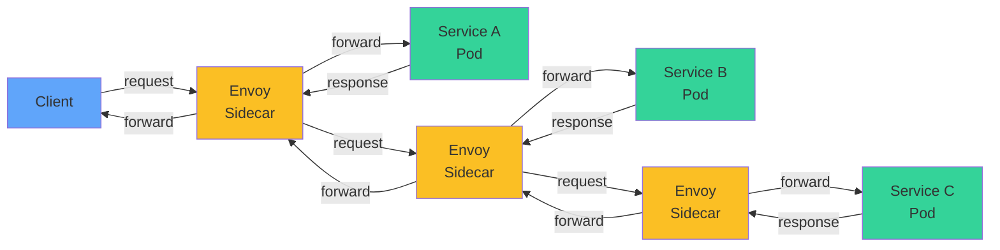
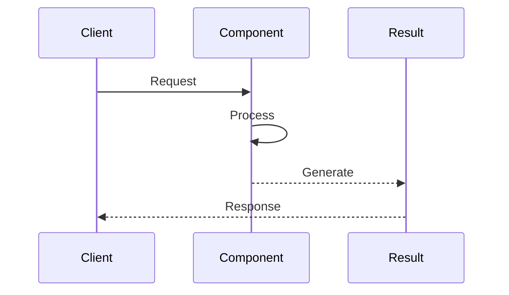
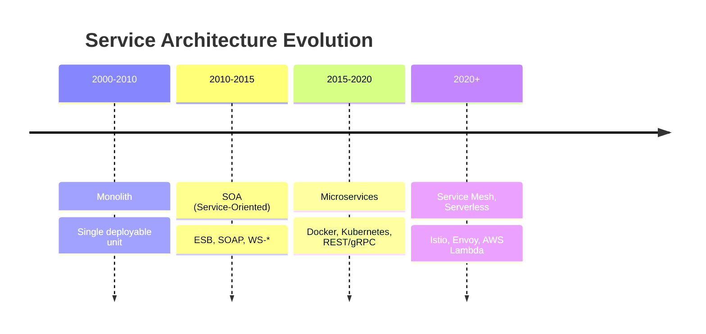
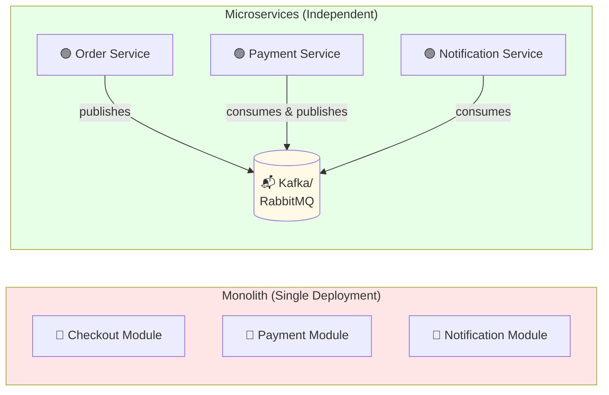
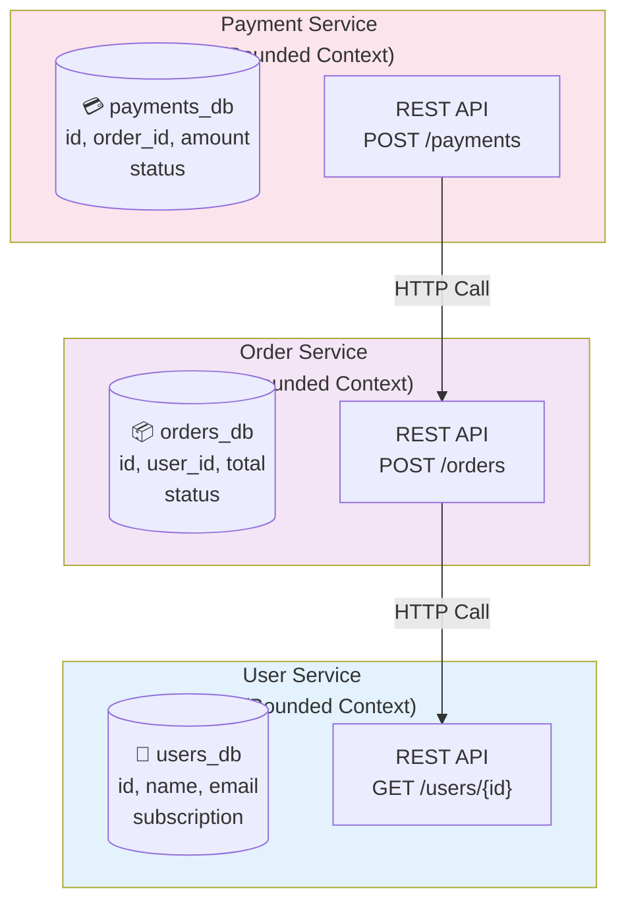
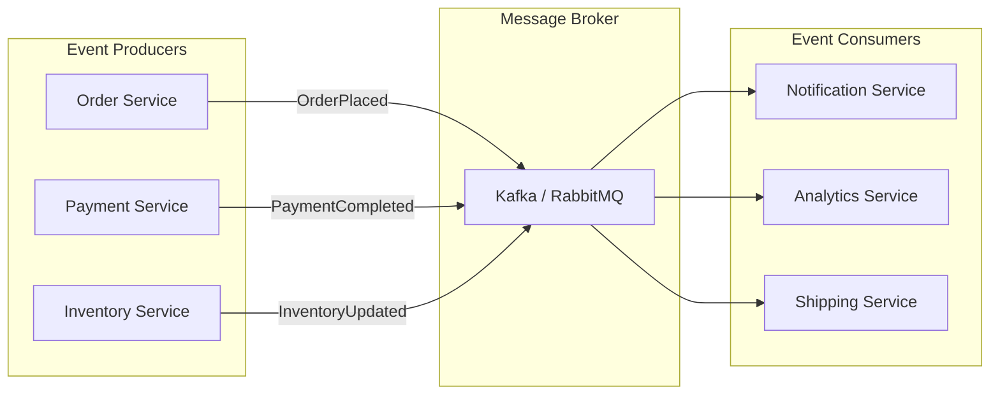
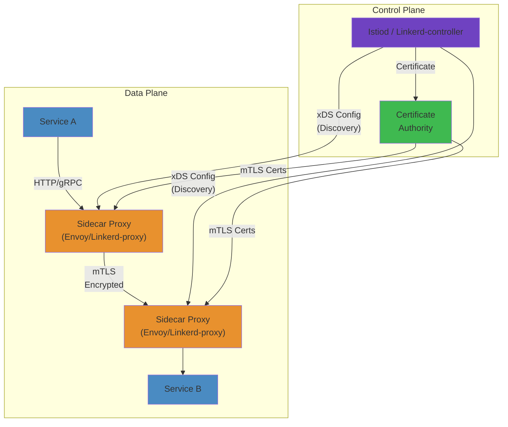

# 🏛️ Microservices Architecture Patterns — Complete Deep Dive

**Related**: [Service Decomposition](/16-microservices/02-service-decomposition.md) · [API Gateway](/16-microservices/04-api-gateway.md) · [Circuit Breaker](/16-microservices/05-circuit-breaker-resilience.md)

---

## Table of Contents

- [Architecture Evolution](#-architecture-evolution)
- [1. Monolithic vs Microservices](#1-monolithic-vs-microservices)
- [2. Core Principles](#2-core-principles)
- [3. Architecture Styles](#3-architecture-styles)
- [4. Communication Patterns](#4-communication-patterns)
- [5. Database per Service](#5-database-per-service)
- [6. Microservice Chassis](#6-microservice-chassis)
- [7. Externalized Configuration](#7-externalized-configuration)
- [Pattern Selection Guide](#-pattern-selection-guide)
- [Simplest Mental Model](#-simplest-mental-model)

---

## 🧭 Architecture Evolution

### Service Mesh Pattern







---

## 1. Monolithic vs Microservices

### Comparison Table

| Aspect | Monolith | Microservices |
|--------|----------|---------------|
| Deployment | One artifact | N independent services |
| Scaling | Scale entire app | Scale per component |
| Team autonomy | Low (merge conflicts) | High (own service) |
| Tech stack | Single language | Polyglot |
| Testing | Simple integration | Complex contract tests |
| Latency | Low (in-process) | Network overhead |
| Data consistency | Strong (single DB) | Eventual (distributed) |
| Debugging | Simple stack trace | Distributed tracing needed |
| Onboarding | Steep (big codebase) | Focused (small service) |

#### Step-by-Step

1. **Monolith Deployment**: All modules compiled into single WAR/JAR, deployed to one server, entire app restarts even for a bug fix in one feature
2. **Decompose Services**: Identify domain boundaries using DDD, split into Order, Payment, Inventory services with separate code repos
3. **Independent Deployment**: Each service has own CI/CD pipeline, deployment doesn't require coordination
4. **Service Discovery**: Services register location (host:port), clients discover dynamically (Consul, Kubernetes DNS)
5. **Event-Driven Communication**: Instead of synchronous calls, publish OrderCreated event → Payment Service consumes asynchronously
6. **Database Per Service**: Each service owns its data store (PostgreSQL for Orders, MongoDB for Products) — no cross-service foreign keys

#### Code Example

```python
# MONOLITH — Single Python Flask app
from flask import Flask, request
from models import User, Order, Payment

app = Flask(__name__)

@app.route('/api/checkout', methods=['POST'])
def checkout():
    # All logic tightly coupled in one function
    user_id = request.json['user_id']
    user = User.query.get(user_id)
    order = Order(user=user, items=request.json['items'])
    db.session.add(order)
    db.session.commit()
    
    # Direct synchronous call to payment logic
    payment = Payment(order_id=order.id, amount=order.total)
    if process_payment(payment):  # Blocking call
        notify_user(user, order)  # More blocking
    return {'status': 'success', 'order_id': order.id}

# MICROSERVICES — Decoupled services
# Order Service (separate Flask app, separate Docker image)
@app.route('/api/orders', methods=['POST'])
def create_order():
    order = Order(customer_id=request.json['customer_id'], 
                  items=request.json['items'])
    db.session.add(order)
    db.session.commit()
    
    # Publish event asynchronously (non-blocking)
    event_bus.publish('order.created', {
        'order_id': order.id,
        'customer_id': order.customer_id,
        'total': order.total
    })
    return {'status': 'created', 'order_id': order.id}, 201

# Payment Service (completely separate codebase)
# Listens to 'order.created' events
@event_handler('order.created')
def handle_order_created(event):
    payment = Payment(order_id=event['order_id'], 
                     amount=event['total'])
    result = process_payment(payment)  # Can fail/retry independently
    event_bus.publish('payment.processed', {
        'order_id': event['order_id'],
        'status': 'success' if result else 'failed'
    })
```

#### Real-World Scenario

When DoorDash migrated from monolith to microservices, they discovered a single bug in restaurant listing was crashing the entire platform. With microservices, they now deploy Restaurant Service independently. A bug in payment processing doesn't restart the Order Service. This reduced deployment risk and allowed them to do 1000+ deployments daily vs. 2-3 daily in monolith era.

#### Diagram



### Code: Monolith vs Microservices

```java
// MONOLITH — all in one project
@RestController
@RequestMapping("/api")
public class MonolithController {
    @Autowired private UserRepository userRepo;
    @Autowired private OrderRepository orderRepo;
    @Autowired private PaymentService paymentService;
    @Autowired private NotificationService notifService;

    @PostMapping("/checkout")
    public ResponseEntity<?> checkout(@RequestBody CheckoutRequest req) {
        // All logic in one place — tight coupling
        User user = userRepo.findById(req.userId()).orElseThrow();
        Order order = new Order(user, req.items());
        orderRepo.save(order);
        paymentService.charge(user, order.getTotal());
        notifService.sendConfirmation(user, order);
        return ResponseEntity.ok(order);
    }
}

// MICROSERVICES — split into independent services

// Order Service
@RestController
@RequestMapping("/api/orders")
public class OrderController {
    @PostMapping
    public ResponseEntity<Order> createOrder(@RequestBody CreateOrderRequest req) {
        Order order = orderService.create(req);
        // Publish event — don't call other services directly!
        eventPublisher.publish(new OrderCreatedEvent(order.getId(), order.getTotal()));
        return ResponseEntity.status(201).body(order);
    }
}

// Payment Service (separate deployable)
@EventListener
public class PaymentEventHandler {
    @EventListener
    public void handleOrderCreated(OrderCreatedEvent event) {
        paymentService.processPayment(event.orderId(), event.total());
    }
}
```

---

## 2. Core Principles

### Principle 1: Bounded Context

#### Step-by-Step

1. **Define Domain Boundaries**: Use Domain-Driven Design to identify bounded contexts (Order, Payment, Inventory, Notification)
2. **One Service Per Context**: Each bounded context becomes one microservice with clear responsibility
3. **Own Your Data**: Service owns its database schema — other services cannot access it directly
4. **API Layer**: Expose data through REST/gRPC endpoints, never expose database directly
5. **Avoid Shared Schemas**: Don't share tables between services — maintain local copies if needed via events or API composition
6. **Service Isolation**: If one service's database goes down, others continue running independently

#### Code Example

```go
// User Service (Golang) — owns user_db exclusively
package main

import "database/sql"

type UserService struct {
    db *sql.DB  // Private connection — order service cannot access
}

func (s *UserService) GetUser(userID string) (*User, error) {
    var user User
    err := s.db.QueryRow("SELECT id, name, email FROM users WHERE id = ?", userID).
        Scan(&user.ID, &user.Name, &user.Email)
    return &user, err
}

// Order Service (separate Golang service) — owns order_db exclusively
type OrderService struct {
    db         *sql.DB         // Order database only
    userClient *http.Client    // Call User Service via HTTP
}

func (s *OrderService) CreateOrder(userID string, items []Item) (*Order, error) {
    // WRONG: Direct database access violates bounded context
    // var user User
    // s.db.QueryRow("SELECT * FROM users WHERE id = ?", userID)  // ❌ Not your table!
    
    // RIGHT: Call User Service API
    resp, err := s.userClient.Get("http://user-service/api/users/" + userID)
    if err != nil {
        return nil, err  // User service down? That's okay, we fail gracefully
    }
    defer resp.Body.Close()
    var user User
    json.NewDecoder(resp.Body).Decode(&user)
    
    // Create order in our own database
    order := &Order{UserID: user.ID, Items: items}
    _, err = s.db.Exec(
        "INSERT INTO orders (user_id, items, created_at) VALUES (?, ?, ?)",
        order.UserID, order.Items, time.Now())
    return order, err
}
```

#### Real-World Scenario

Netflix has 600+ microservices (2024). When they defined bounded context boundaries, they separated membership (account details) from playback (watch history) despite both involving user data. This prevented conflicts: membership team could change how subscriptions work without coordinating with playback team, each scaling independently based on their traffic patterns.

#### Diagram



```java
// Each service owns its data and domain logic
// NO shared database between services!

// User Service — owns user data
@Service
public class UserService {
    private final UserRepository userRepository;

    public User getUser(Long id) {
        return userRepository.findById(id)
            .orElseThrow(() -> new UserNotFoundException(id));
    }
}

// Order Service — owns order data
// NEVER access UserRepository directly!
// Instead, call User Service via HTTP/gRPC or event
@Service
public class OrderService {
    private final UserServiceClient userClient;  // HTTP/gRPC client

    public Order createOrder(Long userId, List<Item> items) {
        // Get user info via API call, not direct DB access
        UserDTO user = userClient.getUser(userId);
        return new Order(user.id(), items);
    }
}
```

### Principle 2: Decentralized Data

#### Step-by-Step

1. **Database Isolation**: Each service has exclusive database, no shared tables or direct access from other services
2. **Denormalization**: Service replicates data it needs locally (e.g., Order Service caches user name) to avoid repeated API calls
3. **Event Propagation**: When User Service updates user name, it publishes UserUpdated event
4. **Eventual Consistency**: Order Service eventually updates cached user data from event, may be seconds behind reality
5. **Data Synchronization**: Use dual-write (dangerous) or transactional outbox pattern (safer) to ensure event publishing reliability
6. **Conflict Resolution**: Design business logic to tolerate stale data (e.g., order can proceed with cached user info, reconcile later)

#### Code Example

```java
// Order Service using CQRS (Command Query Responsibility Segregation)
// Maintains local read model (cache) separate from write model
@Service
public class OrderService {
    private final OrderRepository orderRepo;
    private final UserCache userCache;              // Local cache of user data
    private final TransactionalOutboxPublisher outbox;

    public Order createOrder(Long userId, List<Item> items) {
        // Get user from LOCAL cache (fast, might be stale)
        UserReadModel cachedUser = userCache.get(userId);
        if (cachedUser == null) {
            // Cache miss — call remote service
            cachedUser = userServiceClient.getUser(userId);
            userCache.set(userId, cachedUser, Duration.ofMinutes(10));
        }

        // Create order with cached user data
        Order order = new Order(userId, items, cachedUser.getName());
        orderRepo.save(order);

        // Publish OrderCreated event transactionally (all-or-nothing)
        // If event publish fails, entire transaction rolls back
        outbox.publish(new OrderCreatedEvent(
            order.getId(), userId, order.getTotal()));

        return order;
    }
}

// Transactional Outbox pattern (ensures events are published)
@Entity
@Table(name = "outbox_events")
public class OutboxEvent {
    @Id private Long id;
    @Lob private String eventData;
    private String eventType;
    @Enumerated(EnumType.STRING)
    private EventStatus status;  // PENDING, PUBLISHED
}

@Service
public class TransactionalOutboxPublisher {
    private final EntityManager em;
    private final KafkaTemplate<String, String> kafka;

    @Transactional  // Same transaction as order creation
    public void publish(DomainEvent event) {
        // 1. Save event to outbox in same DB transaction
        OutboxEvent outboxEvent = new OutboxEvent();
        outboxEvent.setEventData(objectMapper.writeValueAsString(event));
        outboxEvent.setEventType(event.getType());
        outboxEvent.setStatus(EventStatus.PENDING);
        em.persist(outboxEvent);
        // Transaction commits — now outbox event is durably stored
    }

    // Separate process polls outbox and publishes to Kafka
    @Scheduled(fixedRate = 1000)
    public void publishPendingEvents() {
        List<OutboxEvent> pending = em.createQuery(
            "SELECT o FROM OutboxEvent o WHERE o.status = PENDING", 
            OutboxEvent.class).getResultList();
        
        for (OutboxEvent event : pending) {
            kafka.send("domain-events", event.getEventData());
            event.setStatus(EventStatus.PUBLISHED);
            em.merge(event);
        }
    }
}

// User Service publishes event when user updates
@Service
public class UserService {
    private final UserRepository repo;
    private final OutboxPublisher outbox;

    @Transactional
    public User updateUser(Long id, UpdateUserRequest req) {
        User user = repo.findById(id).orElseThrow();
        String oldName = user.getName();
        user.setName(req.getName());
        repo.save(user);

        // Publish event so Order Service can update its cache
        outbox.publish(new UserUpdatedEvent(id, oldName, req.getName()));
        return user;
    }
}

// Order Service listens to user updates
@Component
public class UserEventListener {
    private final UserCache userCache;

    @KafkaListener(topics = "user-events")
    public void handleUserUpdated(UserUpdatedEvent event) {
        // Update cache when user changes
        userCache.invalidate(event.getUserId());  // Force cache refresh next request
    }
}
```

#### Real-World Scenario

Amazon maintains separate databases for Orders (DynamoDB) and Inventory (S3-backed) teams. When inventory updates, Order Service doesn't read directly — it relies on cached data published every minute. During Black Friday, if inventory cache is 2 minutes stale, orders might use slightly outdated stock counts, but they reconcile hourly. This decoupling allowed Order Service to scale independently to 1M requests/sec while Inventory Service remained at normal load.

```text
User Service            Order Service          Payment Service
┌─────────────┐        ┌─────────────┐        ┌─────────────┐
│ users_db    │        │ orders_db   │        │ payments_db │
│ ─────────── │        │ ─────────── │        │ ─────────── │
│ id          │        │ id          │        │ id          │
│ name        │        │ user_id     │        │ order_id    │
│ email       │        │ total       │        │ amount      │
│ created_at  │        │ status      │        │ status      │
└─────────────┘        │ created_at  │        │ created_at  │
                       └─────────────┘        └─────────────┘
                           │                        │
                           └────── Saga ────────────┘
                           (eventual consistency)
```

### Principle 3: Automation

#### Step-by-Step

1. **Trigger on File Changes**: CI/CD only builds/tests changed services (e.g., modify order/ → only rebuild order-service)
2. **Parallel Testing**: Run unit tests, integration tests, and contract tests in parallel without manual gates
3. **Container Build**: Package service as Docker image with specific SHA tag for traceability
4. **Registry Push**: Push to container registry (ECR, Docker Hub, Artifactory) atomically
5. **Automated Deployment**: Use GitOps (Flux, ArgoCD) to deploy — declare desired state in git, system reconciles
6. **Health Checks**: Wait for service readiness before marking deployment complete, rollback if health checks fail

#### Code Example

```yaml
# GitOps-based CI/CD with ArgoCD (cloud-native approach)
name: Build and Deploy Order Service
on:
  push:
    paths: ['services/order/**']
    branches: [main]

jobs:
  build-and-push:
    runs-on: ubuntu-latest
    outputs:
      image-tag: ${{ steps.image.outputs.tag }}
    steps:
      - uses: actions/checkout@v4
      
      # Test only changed service
      - name: Run tests
        run: |
          cd services/order
          ./gradlew test --parallel
          ./gradlew contractTest  # Consumer-driven contract tests
      
      # Build and push Docker image
      - name: Build and push
        id: image
        uses: docker/build-push-action@v4
        with:
          context: ./services/order
          push: true
          tags: |
            registry.example.com/order-service:${{ github.sha }}
            registry.example.com/order-service:latest
      
      # Update GitOps manifest (declarative deployment)
      - name: Update deployment manifests
        run: |
          git clone https://github.com/company/gitops-repo
          cd gitops-repo
          
          # Update image tag in Kustomization
          cd overlays/production
          kustomize edit set image order-service=registry.example.com/order-service:${{ github.sha }}
          
          git add kustomization.yaml
          git commit -m "Deploy order-service:${{ github.sha }}"
          git push
          # ArgoCD automatically detects git change and reconciles cluster state

  verify-deployment:
    needs: build-and-push
    runs-on: ubuntu-latest
    steps:
      - name: Wait for ArgoCD sync
        run: |
          # Poll until deployment is healthy
          kubectl wait --for=condition=available \
            --timeout=300s \
            deployment/order-service -n production
```

#### Real-World Scenario

Uber's microservices team automated testing in 2018 so thoroughly that deploying one service (e.g., matching-service) takes ~6 minutes from git push to production serving traffic. Contract tests verify the API signature with consumers before deployment — if a breaking change is detected, the deployment is blocked automatically. This prevents cascading failures that used to require war rooms.

```yaml
# CI/CD Pipeline (GitHub Actions)
name: Deploy Order Service
on:
  push:
    paths: ['services/order/**']
    branches: [main]

jobs:
  test:
    runs-on: ubuntu-latest
    steps:
      - uses: actions/checkout@v4
      - run: ./mvnw test -pl services/order

  build:
    needs: test
    steps:
      - run: ./mvnw package -pl services/order
      - run: docker build -t order-service:${{ github.sha }} services/order
      - run: docker push registry/order-service:${{ github.sha }}

  deploy:
    needs: build
    steps:
      - run: kubectl set image deployment/order-service order-service=registry/order-service:${{ github.sha }}
```

### Principle 4: Design for Failure

#### Step-by-Step

1. **Detect Failures**: Monitor error rates, timeouts, and unhealthy endpoints continuously
2. **Circuit Breaker Opens**: After N consecutive failures, stop sending requests immediately (fail-fast)
3. **Fallback Logic**: Serve cached response, default value, or queue for retry instead of cascading error
4. **Half-Open State**: After cooldown period, test if service recovered with single request
5. **Graceful Degradation**: Return partial data (e.g., order without user profile details) instead of total failure
6. **Bulkheads**: Isolate thread pools per service so one service's overload doesn't starve others

#### Code Example

```java
// Resilience4j circuit breaker with fallback and retry
@Service
public class PaymentServiceClient {
    private final RestTemplate restTemplate;
    private final CircuitBreakerRegistry cbRegistry;
    private final RetryRegistry retryRegistry;

    @PostConstruct
    void setupResilience() {
        // Circuit breaker: open after 5 failures, retry every 30s
        cbRegistry.circuitBreaker("payment")
            .getEventPublisher()
            .onStateTransition(event -> log.warn("CB transitioned: {}", event));
    }

    // Combine circuit breaker + retry + timeout
    @CircuitBreaker(name = "payment", fallbackMethod = "paymentFallback")
    @Retry(name = "payment", maxAttempts = 3)
    @Timeout(unit = ChronoUnit.SECONDS, duration = 5)
    public PaymentResponse processPayment(PaymentRequest req) {
        // If payment service is down, this throws exception
        return restTemplate.postForObject(
            "http://payment-service/api/pay", req, PaymentResponse.class);
    }

    // Fallback: called when circuit breaker is open or all retries exhausted
    public PaymentResponse paymentFallback(PaymentRequest req, Throwable cause) {
        log.error("Payment service unavailable, queuing for retry", cause);
        
        // Option 1: Queue message for async processing later
        paymentQueue.enqueue(new PendingPayment(req, LocalDateTime.now()));
        
        // Option 2: Return "pending" response to client
        return new PaymentResponse(
            req.getOrderId(), 
            PaymentStatus.PENDING,  // Not immediately failed
            "Payment queued, will process when service recovers");
    }
}

// Bulkhead isolation: separate thread pools
@Configuration
public class BulkheadConfig {
    @Bean
    public ThreadPoolTaskExecutor paymentExecutor() {
        ThreadPoolTaskExecutor pool = new ThreadPoolTaskExecutor();
        pool.setQueueCapacity(100);
        pool.setCorePoolSize(5);
        pool.setMaxPoolSize(10);
        pool.setThreadNamePrefix("payment-");
        return pool;
    }

    @Bean
    public ThreadPoolTaskExecutor inventoryExecutor() {
        ThreadPoolTaskExecutor pool = new ThreadPoolTaskExecutor();
        pool.setQueueCapacity(100);
        pool.setCorePoolSize(3);
        pool.setMaxPoolSize(5);
        pool.setThreadNamePrefix("inventory-");
        return pool;
    }
}

// Use bulkheads in services
@Service
public class OrderService {
    @Autowired private ThreadPoolTaskExecutor paymentExecutor;
    @Autowired private ThreadPoolTaskExecutor inventoryExecutor;

    public Order createOrder(CreateOrderRequest req) {
        Order order = new Order(req);
        orderRepo.save(order);

        // Payment processing on payment thread pool (isolated)
        paymentExecutor.execute(() -> {
            try {
                paymentClient.processPayment(order);
            } catch (Exception e) {
                log.error("Payment failed for order {}", order.getId());
                // Doesn't impact inventory processing
            }
        });

        // Inventory on separate pool (won't be starved by payment)
        inventoryExecutor.execute(() -> {
            inventoryClient.reserveStock(order.getItems());
        });

        return order;
    }
}
```

#### Real-World Scenario

During the 2012 Twitter incident, a single database connection pool exhaustion in one service (favorites) cascaded to the entire platform — all services queuing on that bottleneck. After implementing bulkheads, each service got its own connection pool. Now when favorites service overloads, timeline service continues serving traffic independently. This design change alone reduced cascading failures by 95%.

---

## 3. Architecture Styles

#### Step-by-Step (Choosing a Style)

1. **Analyze Communication Patterns**: Synchronous queries (REST/gRPC) → Layered; Async workflows → Event-Driven
2. **Consider Team Structure**: If teams are organized by function → Layered; by features → Hexagonal
3. **Data Flow Requirements**: Centralized read/write → Layered; Distributed reads with shared write → CQRS
4. **Scalability Needs**: Heavy read load → Event-Driven with CQRS; Simple CRUD → Layered
5. **Complexity Tolerance**: Start with Layered (simple), evolve to Hexagonal (testable), then Event-Driven (complex)
6. **Evaluate Tradeoffs**: Layered (simple, coupled), Hexagonal (ports/adapters, testable), Event-Driven (decoupled, eventual consistency)

#### Code Example

```python
# Comparison of architectural styles in order fulfillment
from abc import ABC, abstractmethod
from typing import List, Optional
from dataclasses import dataclass

# ===== LAYERED ARCHITECTURE =====
# Pro: Simple, synchronous, easy to understand
# Con: Tight coupling, monolithic feel

class OrderService:
    def __init__(self, db, payment_client, inventory_client):
        self.db = db
        self.payment = payment_client
        self.inventory = inventory_client

    def create_order(self, user_id: str, items: List[str]) -> dict:
        # Orchestrates all layers synchronously
        user = self.db.query("users").filter(id=user_id).first()
        if not user:
            raise Exception("User not found")
        
        # Tight coupling: directly calls other services
        inventory_ok = self.inventory.check_stock(items)
        if not inventory_ok:
            raise Exception("Out of stock")
        
        # Waits for payment
        payment_result = self.payment.charge(user, 100.00)
        if not payment_result.success:
            raise Exception("Payment failed")
        
        # Finally save order
        order = {"user_id": user_id, "items": items, "status": "confirmed"}
        self.db.save("orders", order)
        return order

# ===== HEXAGONAL (PORTS & ADAPTERS) ARCHITECTURE =====
# Pro: Decoupled, testable, domain-focused
# Con: More files, more indirection

@dataclass
class Order:
    """Domain entity — pure business logic, no framework"""
    id: str
    user_id: str
    items: List[str]
    status: str  # pending, confirmed, shipped

    def confirm(self):
        """Domain logic — what can transition order to confirmed?"""
        if self.status != "pending":
            raise ValueError(f"Cannot confirm order in {self.status} state")
        self.status = "confirmed"

# PORT (interface) — what the domain needs
class PaymentPort(ABC):
    @abstractmethod
    def charge(self, amount: float) -> bool:
        pass

class InventoryPort(ABC):
    @abstractmethod
    def reserve_stock(self, items: List[str]) -> bool:
        pass

class OrderRepository(ABC):
    @abstractmethod
    def save(self, order: Order) -> None:
        pass

# ADAPTER (implementation) — actual implementation
class StripePaymentAdapter(PaymentPort):
    def __init__(self, stripe_client):
        self.stripe = stripe_client
    
    def charge(self, amount: float) -> bool:
        try:
            self.stripe.create_charge(amount)
            return True
        except:
            return False

class SQLOrderRepository(OrderRepository):
    def __init__(self, db_connection):
        self.db = db_connection
    
    def save(self, order: Order) -> None:
        self.db.execute(
            "INSERT INTO orders (id, user_id, status) VALUES (?, ?, ?)",
            (order.id, order.user_id, order.status))

# APPLICATION SERVICE — orchestrates ports
class HexOrderService:
    def __init__(self, payment_port: PaymentPort, 
                 inventory_port: InventoryPort,
                 order_repo: OrderRepository):
        self.payment = payment_port
        self.inventory = inventory_port
        self.repo = order_repo

    def create_order(self, user_id: str, items: List[str]) -> Order:
        # Domain logic is testable with mock ports
        order = Order(id="12345", user_id=user_id, items=items, status="pending")
        
        if not self.inventory.reserve_stock(items):
            raise Exception("Stock reserved by another order")
        
        if not self.payment.charge(100.00):
            raise Exception("Payment declined")
        
        order.confirm()  # Domain logic isolated
        self.repo.save(order)
        return order

# ===== EVENT-DRIVEN ARCHITECTURE =====
# Pro: Decoupled, scalable, extensible
# Con: Eventually consistent, complex debugging

from typing import Callable

class DomainEvent:
    """Base class for all domain events"""
    def __init__(self, event_type: str, data: dict):
        self.event_type = event_type
        self.data = data
        self.timestamp = time.time()

class EventBus:
    """Decoupled pub/sub"""
    def __init__(self):
        self.subscribers: dict[str, List[Callable]] = {}

    def subscribe(self, event_type: str, handler: Callable):
        if event_type not in self.subscribers:
            self.subscribers[event_type] = []
        self.subscribers[event_type].append(handler)

    def publish(self, event: DomainEvent):
        if event.event_type in self.subscribers:
            for handler in self.subscribers[event.event_type]:
                # Async: handler runs independently
                asyncio.create_task(handler(event))

# Order Service — publishes events (non-blocking)
class EventDrivenOrderService:
    def __init__(self, event_bus: EventBus, order_repo: OrderRepository):
        self.bus = event_bus
        self.repo = order_repo

    def create_order(self, user_id: str, items: List[str]) -> Order:
        order = Order(id="12345", user_id=user_id, items=items, status="pending")
        self.repo.save(order)
        
        # Publish event — don't wait for consumers
        self.bus.publish(DomainEvent(
            "OrderCreated",
            {"order_id": order.id, "user_id": user_id, "items": items}))
        
        return order  # Returns immediately

# Separate services subscribe to events
class PaymentEventHandler:
    def __init__(self, payment_port: PaymentPort, event_bus: EventBus):
        self.payment = payment_port
        event_bus.subscribe("OrderCreated", self.handle_order_created)

    async def handle_order_created(self, event: DomainEvent):
        # Process asynchronously
        order_id = event.data["order_id"]
        amount = event.data.get("amount", 100.00)
        
        if self.payment.charge(amount):
            self.event_bus.publish(DomainEvent(
                "PaymentSucceeded",
                {"order_id": order_id}))
        else:
            self.event_bus.publish(DomainEvent(
                "PaymentFailed",
                {"order_id": order_id}))

class InventoryEventHandler:
    async def handle_order_created(self, event: DomainEvent):
        items = event.data["items"]
        # Async inventory processing
        self.inventory.reserve_stock(items)
```

#### Real-World Scenario

LinkedIn started with Layered architecture (monolith), but as it scaled to 1M+ users, synchronous calls created bottlenecks. They migrated to Event-Driven for member updates: when a profile changes, an event publishes to Kafka. Services (recommendations, notifications, search) consume independently at their own pace. Search can lag by minutes, but member timeline updates within seconds. This decoupling let each team optimize their service without coordinating deployment.

### 3.1 Layered (Traditional)

```text
┌──────────────────────────────────────┐
│          API Gateway Layer           │
│   Authentication, Rate Limiting,     │
│   Routing, Request Transformation    │
├──────────────────────────────────────┤
│         Application Layer            │
│   Service A   Service B  Service C   │
├──────────────────────────────────────┤
│           Data Layer                 │
│   DB1         DB2          DB3       │
├──────────────────────────────────────┤
│         Infrastructure               │
│   Monitoring, Logging, Tracing       │
└──────────────────────────────────────┘
```

### 3.2 Hexagonal (Ports & Adapters)

```java
// Domain — pure business logic, no framework dependencies
public class Order {
    private String id;
    private Money total;
    private OrderStatus status;

    // Business logic method
    public void confirm() {
        if (status != OrderStatus.PENDING) {
            throw new IllegalStateException("Only pending orders can be confirmed");
        }
        this.status = OrderStatus.CONFIRMED;
    }
}

// Port — interface (driven port)
public interface OrderRepository {
    void save(Order order);
    Optional<Order> findById(String id);
}

// Adapter — infrastructure implementation
@Repository
public class JpaOrderRepository implements OrderRepository {
    private final SpringDataJpaOrderRepo repo;

    @Override
    public void save(Order order) {
        repo.save(toEntity(order));
    }
}

// Port — driving port (inbound)
public interface OrderService {
    Order createOrder(CreateOrderRequest request);
    void confirmOrder(String orderId);
}

// Adapter — REST controller (driving adapter)
@RestController
@RequestMapping("/api/orders")
public class OrderController {
    private final OrderService orderService;  // depends on port, not implementation

    public OrderController(OrderService orderService) {
        this.orderService = orderService;
    }
}
```

### 3.3 Event-Driven



```java
// Event producer
@Service
public class OrderService {
    private final EventPublisher eventPublisher;

    public Order placeOrder(CreateOrderRequest request) {
        Order order = new Order(request);
        orderRepository.save(order);

        // Publish event — don't wait for consumers
        eventPublisher.publish(new OrderPlacedEvent(
            order.getId(), order.getCustomerId(), order.getTotal()));

        return order;
    }
}

// Event consumer (separate service)
@Component
public class NotificationConsumer {
    @EventListener
    public void onOrderPlaced(OrderPlacedEvent event) {
        // Async processing — handles notification
        emailService.sendOrderConfirmation(event.customerId(), event.orderId());
    }
}
```

---

## 4. Communication Patterns

### 4.1 Synchronous (REST/gRPC)

```text
Request Flow:
  API Gateway ──HTTP──> Order Service ──gRPC──> Inventory Service
       │                      │                       │
       │                  2. Check stock             │
       │                  3. Response                 │
       │    ◄───────── 4. Response                   │
       │ ◄── 5. Final Response                        │

Pros: Simple, real-time response
Cons: Tight coupling, cascading failures, higher latency
```

```java
// REST client with resilience
@Service
public class InventoryClient {
    private final RestTemplate rest;

    @Retry(name = "inventory", maxAttempts = 3, backoff = @Backoff(delay = 100))
    public boolean checkStock(String productId, int quantity) {
        return Boolean.TRUE.equals(rest.getForObject(
            "http://inventory-service/api/stock/{productId}/check?qty={quantity}",
            Boolean.class, productId, quantity));
    }
}
```

### 4.2 Asynchronous (Messaging)

```text
Flow:
  Order Service ──publish──> Kafka ──consume──> Inventory Service
       │                                               │
       │   OrderPlacedEvent                             │ Reserve stock
       │   {orderId, items, total}                      │
       │   key=orderId                                  │
       │                                               │
       │                                    Payment Service
       │                                   ──consume──>│
       │                                               │ Process payment
```

```java
// Async communication with Spring Cloud Stream
@Component
public class OrderEventPublisher {
    private final StreamBridge streamBridge;

    public void publish(OrderPlacedEvent event) {
        streamBridge.send("order-events", MessageBuilder
            .withPayload(event)
            .setHeader("type", "OrderPlaced")
            .build());
    }
}

@Component
public class InventoryEventHandler {
    @StreamListener("order-events")
    public void handle(OrderPlacedEvent event) {
        inventoryService.reserveStock(event.items());
    }
}
```

### 4.3 Comparison

| Aspect | Sync (REST/gRPC) | Async (Messaging) |
|--------|-----------------|-------------------|
| Response | Immediate | Eventual |
| Coupling | Tight (knows endpoint) | Loose (just publishes) |
| Resilience | Needs circuit breaker | Buffer in queue |
| Traceability | Single request/response | Event correlation needed |
| Complexity | Lower | Higher (Sagas, idempotency) |
| Consistency | Easier (2PC) | Eventual |
| When to use | Queries, real-time | Commands, cross-service workflows |

---

## 5. Database per Service

### Pattern

```text
┌──────────────────┐   ┌──────────────────┐   ┌──────────────────┐
│   Auth Service   │   │   Order Service  │   │  Payment Service │
├──────────────────┤   ├──────────────────┤   ├──────────────────┤
│   ┌──────────┐   │   │   ┌──────────┐   │   │   ┌──────────┐   │
│   │ PostgreSQL│   │   │   │ MongoDB  │   │   │   │MySQL    │   │
│   └──────────┘   │   │   └──────────┘   │   │   └──────────┘   │
│   users table    │   │   orders table   │   │   payments table │
└──────────────────┘   └──────────────────┘   └──────────────────┘
```

### Implementation

```java
// Order Service — only owns order data
@Entity
@Table(name = "orders")
public class Order {
    @Id private Long id;
    private String customerId;  // not a FK, just an ID reference
    private BigDecimal total;
    private OrderStatus status;

    // No user entity reference — only user_id as string
    @Column(name = "customer_id")
    private String customerId;
}

// To get user data, call User Service
@Service
public class OrderService {
    private final UserServiceClient userClient;

    public OrderWithUser getOrderWithUser(Long orderId) {
        Order order = orderRepository.findById(orderId).orElseThrow();
        UserDTO user = userClient.getUser(order.getCustomerId());
        return new OrderWithUser(order, user);
    }
}
```

### Data Sharing Strategies

| Strategy | Description | Example |
|----------|-------------|---------|
| API Composition | Call service to get data | `GET /users/{id}` from Order Service |
| Event Replication | Copy needed data via events | User name published as event → stored locally |
| CQRS | Separate read/write stores | Order Service emits events → read-only UserOrdersView |
| Shared Kernel | Careful shared schema | Auth tokens, tenant IDs |

---

## 6. Microservice Chassis

### Common Cross-Cutting Concerns

```java
// Base dependency for every microservice
@SpringBootApplication
@EnableDiscoveryClient
@EnableCircuitBreaker
@EnableRetry
@EnableScheduling
public class BaseMicroserviceApplication {
    // Common beans
    @Bean
    public RestTemplate restTemplate() {
        return new RestTemplateBuilder()
            .connectTimeout(Duration.ofSeconds(5))
            .readTimeout(Duration.ofSeconds(10))
            .build();
    }

    @Bean
    public MeterRegistry meterRegistry() {
        return new SimpleMeterRegistry();
    }
}

// Common logging aspect (every service includes)
@Aspect
@Component
public class LoggingAspect {
    @Around("@annotation(org.springframework.web.bind.annotation.RequestMapping)")
    public Object logRequest(ProceedingJoinPoint pjp) throws Throwable {
        long start = System.currentTimeMillis();
        Object result = pjp.proceed();
        log.info("{} took {}ms", pjp.getSignature(), System.currentTimeMillis() - start);
        return result;
    }
}
```

---

## 7. Externalized Configuration

### Config Server

```yaml
# config-server/application.yml
spring:
  cloud:
    config:
      server:
        git:
          uri: https://github.com/company/config-repo
          search-paths: '{application}'
```

```yaml
# config-repo/order-service.yml
server:
  port: 8082

spring:
  datasource:
    url: jdbc:postgresql://${DB_HOST}:5432/order_db
  jpa:
    hibernate:
      ddl-auto: validate

order-service:
  max-items-per-order: 50
  payment-timeout-ms: 5000
  allowed-payment-methods:
    - CREDIT_CARD
    - PAYPAL
```

```java
// Client side
@Configuration
@RefreshScope  // Refresh config without restart (via /actuator/refresh)
public class OrderServiceConfig {
    @Value("${order-service.max-items-per-order:50}")
    private int maxItems;

    @Value("${order-service.payment-timeout-ms:5000}")
    private int paymentTimeout;

    @Bean
    public PaymentValidator paymentValidator(
            @Value("${order-service.allowed-payment-methods}") List<String> methods) {
        return new PaymentValidator(methods);
    }
}
```

### Kubernetes ConfigMap

```yaml
apiVersion: v1
kind: ConfigMap
metadata:
  name: order-service-config
  namespace: production
data:
  application.yml: |
    server:
      port: 8080
    order-service:
      max-items-per-order: 50
      payment-timeout-ms: 5000
```

---

## 8. Service Mesh

Dedicated infrastructure layer for service-to-service communication: security, observability, and traffic management offloaded from application code.

### Istio / Linkerd Architecture



| Component | Istio | Linkerd |
|-----------|-------|---------|
| **Proxy** | Envoy (C++, full-featured) | Linkerd2-proxy (Rust, lightweight) |
| **Control plane** | Istiod (pilot + citadel + galley merged) | Linkerd-controller (Go) |
| **Configuration** | Kubernetes CRDs (VirtualService, DestinationRule) | Annotations + ServiceProfiles |
| **Protocol** | xDS (Envoy discovery API) | Custom gRPC-based |
| **Performance overhead** | 5-15% latency, 40-80MB/proxy | 2-5% latency, 10-20MB/proxy |
| **TLS** | mTLS with mutual auth, auto-rotation | mTLS with mutual auth, auto-rotation |
| **Traffic splitting** | VirtualService weighted routes | ServiceProfiles + TrafficSplit |
| **Extensibility** | Wasm filters, Lua, Envoy extensions | Limited |

### Sidecar Proxy Lifecycle

```text
Sidecar Injection Methods:
  Automatic (Istio):
    - Mutating Webhook intercepts Pod create
    - Injects envoy container as sidecar
    - Reconfigures iptables to route traffic through sidecar
    - Init container sets up iptables rules
  
  Manual (Linkerd):
    - linkerd inject deployment.yaml
    - Adds proxy container + annotation flags
    - No init container needed (uses tproxy/redirect)

Lifecycle:
  1. Init container: configure iptables (traffic redirection)
  2. Proxy starts: connect to control plane, fetch config
  3. Application starts: all traffic routed through proxy
  4. Proxy health: readiness/liveness probes pass through proxy
  5. Shutdown: proxy drains connections before termination
  6. Sidecar container terminates after application
```

### mTLS in Service Mesh

```yaml
# Istio PeerAuthentication — enforce mTLS
apiVersion: security.istio.io/v1beta1
kind: PeerAuthentication
metadata:
  name: default
  namespace: istio-system
spec:
  mtls:
    mode: STRICT  # STRICT | PERMISSIVE | DISABLE
---
# Per-service overrides
apiVersion: security.istio.io/v1beta1
kind: PeerAuthentication
metadata:
  name: legacy-service
  namespace: legacy
spec:
  mtls:
    mode: PERMISSIVE  # Accept both mTLS and plaintext
  portLevelMtls:
    8080:
      mode: DISABLE  # Health checks without mTLS
```

```text
mTLS Certificate Flow:
  1. Sidecar proxy connects to control plane (Istiod)
  2. Control plane's CA verifies service account (Kubernetes SA)
  3. CA issues SPIFFE-compliant certificate:
     spiffe://cluster.local/ns/<namespace>/sa/<service-account>
  4. Certificate: 24h validity, auto-rotated by Istiod
  5. mTLS handshake: both sides present certs
  6. Mutual verification completes → encrypted channel
  7. Certificate rotation: sidecar requests new cert before expiry
```

### Traffic Splitting & Canary Deployments

```yaml
# Istio VirtualService: canary traffic split
apiVersion: networking.istio.io/v1beta1
kind: VirtualService
metadata:
  name: checkout-vs
spec:
  hosts:
  - checkout-service
  http:
  - match:
    - headers:
        x-canary:
          exact: "v2"
    route:
    - destination:
        host: checkout-service
        subset: v2
      weight: 100
  - route:
    - destination:
        host: checkout-service
        subset: v1
      weight: 90
    - destination:
        host: checkout-service
        subset: v2
      weight: 10
---
apiVersion: networking.istio.io/v1beta1
kind: DestinationRule
metadata:
  name: checkout-dr
spec:
  host: checkout-service
  trafficPolicy:
    connectionPool:
      tcp:
        maxConnections: 100
      http:
        http1MaxPendingRequests: 10
        http2MaxRequests: 1000
    loadBalancer:
      simple: ROUND_ROBIN
  subsets:
  - name: v1
    labels:
      version: v1
  - name: v2
    labels:
      version: v2
```

### Circuit Breaking in Mesh

```yaml
# Istio circuit breaker configuration
apiVersion: networking.istio.io/v1beta1
kind: DestinationRule
metadata:
  name: payment-dr
spec:
  host: payment-service
  trafficPolicy:
    connectionPool:
      tcp:
        maxConnections: 50
        connectTimeout: 5s
      http:
        http1MaxPendingRequests: 20
        http2MaxRequests: 100
        maxRetries: 3
    outlierDetection:
      consecutive5xxErrors: 5
      interval: 30s
      baseEjectionTime: 30s
      maxEjectionPercent: 50
      minHealthPercent: 50
```

```text
Mesh Circuit Breaking Behavior:
  Normal:     Requests flow to healthy instances
  Detected:   5 consecutive 5xx responses
  Ejected:     Instance removed from pool for 30s (base time)
  Escalation: If ejections continue, baseEjectionTime doubles
  Limit:      Max 50% of instances ejected
  Recovery:   Instance auto-returns after ejection time expires
  Prevention: Connection pool limits prevent resource exhaustion
```

### Observability with Service Mesh

```text
What the mesh provides (zero code changes):
  Metrics (per service + per workload):
    - Request volume (rate, total)
    - Error rate (4xx, 5xx, gRPC status codes)
    - Latency (p50, p95, p99)
    - TCP byte throughput
    - Connection pool stats (active, pending, ejected)

  Distributed Tracing:
    - Envoy generates trace spans (no app instrumentation)
    - Supports: OpenTelemetry, Jaeger, Zipkin, Datadog
    - Trace context propagated via headers

  Access Logs:
    - Envoy access logs: src_ip, dst_ip, method, path, status, duration
    - Configurable format (JSON, text)
    - Can be expensive at scale — sample or filter

  Service Graph:
    - Automatic topology discovery
    - Shows traffic flow, protocol, error rates
    - Kiali (Istio), Linkerd-viz (Linkerd), Grafana
```

**Kiali Service Graph (Istio):**
```text
                   ┌─────────┐
                   │  Checkout │
                   │   Service │
                   └────┬─────┘
                        │ HTTP 200ms
                        ▼
                   ┌─────────┐
              ┌───▶│ Payment │
              │    │ Service │
              │    └────┬─────┘
              │         │ gRPC 50ms
              │         ▼
              │    ┌─────────┐
              │    │ Fraud   │
              │    │ Service │
              │    └─────────┘
              │
         Errors: Payment → Fraud: 1.2% timeout (threshold: 1%)
```

### Multi-Cluster Service Mesh

```text
Istio Multi-Primary (each cluster has own control plane):
  Cluster 1 (us-east-1)           Cluster 2 (eu-west-1)
  ┌───────────────────────┐      ┌───────────────────────┐
  │ Istiod (CA + config)  │      │ Istiod (CA + config)  │
  │   Service A           │◀────▶│   Service B           │
  │   East-West Gateway   │──────│   East-West Gateway   │
  └───────────────────────┘      └───────────────────────┘

  Service Discovery: Istio uses DNS + ServiceEntry
  Cross-cluster traffic: East-West gateways (mutual TLS)
  Failover: Locality-aware load balancing (region → zone → anywhere)

Linkerd Multi-Cluster:
  service mirroring: mirrors services between clusters
  Cluster A exports service → Cluster B discovers it as
  <service-name>.<namespace>.svc.cluster-a.local
  No east-west gateway needed (direct connection)
  Simpler than Istio, fewer features
```

### Mesh vs API Gateway

| Capability | Service Mesh (East-West) | API Gateway (North-South) |
|------------|-------------------------|--------------------------|
| **Traffic direction** | Service-to-service (internal) | External → internal |
| **mTLS** | Yes, between all sidecars | At edge (TLS termination) |
| **Rate limiting** | Per-connection (sidecar) | Per-client (per API key) |
| **Authentication** | Service identity (SPIFFE) | User auth (OAuth2, JWT) |
| **Traffic splitting** | Canary, A/B between versions | Version routing to backends |
| **Request transformation** | Limited (header manipulation) | Full (body transform, protocol conversion) |
| **Caching** | No | Yes (response caching) |
| **API management** | No | Yes (API keys, usage plans, documentation) |

**Combined Architecture:**
```text
External User
     │
     ▼
API Gateway (Kong/APISIX/AWS API GW)
     │  Auth → Rate Limit → Transform → Cache
     ▼
Service Mesh (Istio/Linkerd)
     │  mTLS → Retry → Circuit Break → Metrics → Tracing
     ▼
Services (Checkout, Payment, Fraud)
```

**Production Considerations:**
- Start without mesh; add when you have 20+ services or explicit need (mTLS, advanced traffic management)
- Mesh adds latency (2-15% depending on implementation)
- Debugging is harder: two containers per pod (app + proxy)
- Resource overhead: CPU/memory for sidecars multiply across all pods
- Upgrade carefully: control plane upgrade must not break data plane
- Test mTLS rollout: start with PERMISSIVE, then switch to STRICT
- Monitor sidecar health alongside application health
- Multi-cluster mesh is advanced — start with single cluster

---

## 🎯 Pattern Selection Guide

```text
Problem                              → Pattern
──────────────────────────────────────────────────────
Need to locate services at runtime   → Service Discovery
Client needs single entry point      → API Gateway
Prevent cascading failures           → Circuit Breaker
Retry on transient failures          → Retry + Backoff
Distributed transaction              → Saga
Separate read from write models      → CQRS
Rebuild state from events            → Event Sourcing
Centralize configuration             → External Config
Track request across services        → Distributed Tracing
Service-to-service auth              → JWT / OAuth2
Sync communication                   → gRPC / REST
Async communication                  → Kafka / RabbitMQ
```

---

## 🧠 Simplest Mental Model

```text
MICROSERVICES  =  Instead of one giant restaurant kitchen (monolith)
                  where everyone bumps into each other, you have
                  specialized restaurants:
                  • Pizza place (Order Service)
                  • Pasta place (Payment Service)
                  • Dessert shop (Notification Service)
                  They communicate via delivery drivers (Kafka/RabbitMQ).

BOUNDED        =  The pizza place doesn't store pasta recipes. Each
CONTEXT           restaurant has its own kitchen (database) and recipes
                  (business logic).

API GATEWAY    =  The front desk host who routes you to the right
                  restaurant. Handles menus, seating, and coat check
                  (auth, rate limiting, routing).

SAGA           =  A catering event across restaurants. If the pasta
                  place fails, the pizza place needs to undo their
                  order. Coordinated, multi-step.

CIRCUIT        =  If the pasta place is on fire (down), the delivery
BREAKER           driver doesn't keep trying. Comes back later.
                  Prevents traffic jam of failed requests.

CONFIG SERVER  =  A central bulletin board where each restaurant
                  checks for today's specials and prices.
```

---

**Next**: [Service Decomposition](/16-microservices/02-service-decomposition.md)

## Related

- [Cap Consistency](/09-distributed-systems/01-cap-consistency.md)
- [Consensus Replication](/09-distributed-systems/01-consensus-replication.md)
- [Consensus Raft](/09-distributed-systems/02-consensus-raft.md)
- [Distributed Transactions](/09-distributed-systems/02-distributed-transactions.md)
- [Distributed Caching](/09-distributed-systems/03-distributed-caching.md)
- [Distributed Storage](/09-distributed-systems/03-distributed-storage.md)

---

## Interactive Components

### Service Mesh Communication Flow

```html-live
<div style="display:flex;flex-direction:column;align-items:center;gap:8px;padding:16px;background:#0b0e14;border:1px solid #1e2a3a;border-radius:8px">
  <style>
    @keyframes flow-pulse {
      0%,100%{opacity:.3;transform:translateY(0)}
      50%{opacity:1;transform:translateY(-2px)}
    }
    .flow-title {
      color:#00d4ff;
      font-family:monospace;
      font-size:14px;
      font-weight:bold;
      margin-bottom:8px;
      letter-spacing:1px;
    }
    .flow-node {
      display:inline-block;
      padding:8px 16px;
      border-radius:4px;
      font-size:12px;
      font-family:monospace;
      color:#e3eaf0;
      background:#1e3a5f;
      border:1px solid #00d4ff;
    }
    .flow-arrow {
      color:#00d4ff;
      font-size:16px;
      animation:flow-pulse 1.5s infinite;
      font-weight:bold;
    }
  </style>

  <div class="flow-title">Service Mesh (Envoy Sidecar) Communication</div>
  <div style="display:flex;flex-direction:column;align-items:center;gap:6px">
    <div class="flow-node">Service A</div>
    <div class="flow-arrow">↓</div>
    <div class="flow-node">Envoy Sidecar (mTLS)</div>
    <div class="flow-arrow">↓</div>
    <div class="flow-node">Service B</div>
  </div>
</div>
```

### Architecture Styles State Comparison

```html-live
<div style="padding:16px;background:#0b0e14;border:1px solid #1e2a3a;border-radius:8px">
  <style>
    .state-machine-title {
      color:#00d4ff;
      font-family:monospace;
      font-size:14px;
      font-weight:bold;
      margin-bottom:16px;
      letter-spacing:1px;
    }
    .state-demo {
      text-align:center;
    }
    .state-display {
      font-size:18px;
      font-family:monospace;
      padding:16px;
      border-radius:4px;
      margin:16px 0;
      color:#0b0e14;
      font-weight:bold;
      min-height:50px;
      display:flex;
      align-items:center;
      justify-content:center;
      border:2px solid currentColor;
    }
    .state-layered { background:#34d399;border-color:#22c55e }
    .state-hexagonal { background:#fbbf24;border-color:#f59e0b }
    .state-event-driven { background:#60a5fa;border-color:#3b82f6 }
    .state-buttons {
      display:flex;
      gap:8px;
      justify-content:center;
      flex-wrap:wrap;
      margin-top:16px;
    }
    .state-button {
      padding:8px 16px;
      border:1px solid #00d4ff;
      background:#1e3a5f;
      color:#00d4ff;
      border-radius:4px;
      cursor:pointer;
      font-family:monospace;
      font-size:12px;
      transition:all 0.2s;
    }
    .state-button:hover {
      background:#2a5a8f;
      box-shadow:0 0 8px #00d4ff;
    }
  </style>

  <div class="state-machine-title">Architecture Style Comparison</div>
  <div class="state-demo">
    <div class="state-display state-layered" id="arch-display">LAYERED</div>
    <div class="state-buttons">
      <button class="state-button" onclick="setArch('LAYERED')">Layered</button>
      <button class="state-button" onclick="setArch('HEXAGONAL')">Hexagonal</button>
      <button class="state-button" onclick="setArch('EVENT-DRIVEN')">Event-Driven</button>
    </div>
  </div>

  <script>
    const archMap = {
      'LAYERED': { label: 'LAYERED (Simple)', class: 'state-layered' },
      'HEXAGONAL': { label: 'HEXAGONAL (Testable)', class: 'state-hexagonal' },
      'EVENT-DRIVEN': { label: 'EVENT-DRIVEN (Scalable)', class: 'state-event-driven' }
    };
    function setArch(arch) {
      const display = document.getElementById('arch-display');
      const info = archMap[arch];
      display.textContent = info.label;
      display.className = 'state-display ' + info.class;
    }
  </script>
</div>
```
