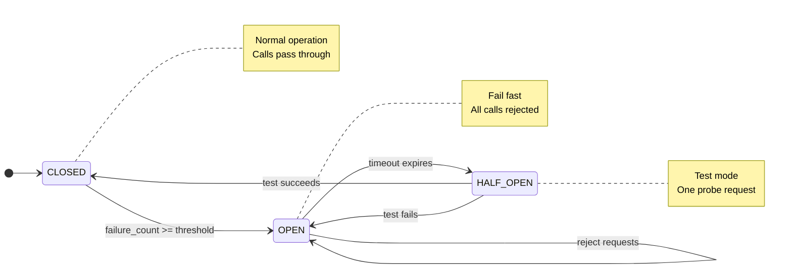
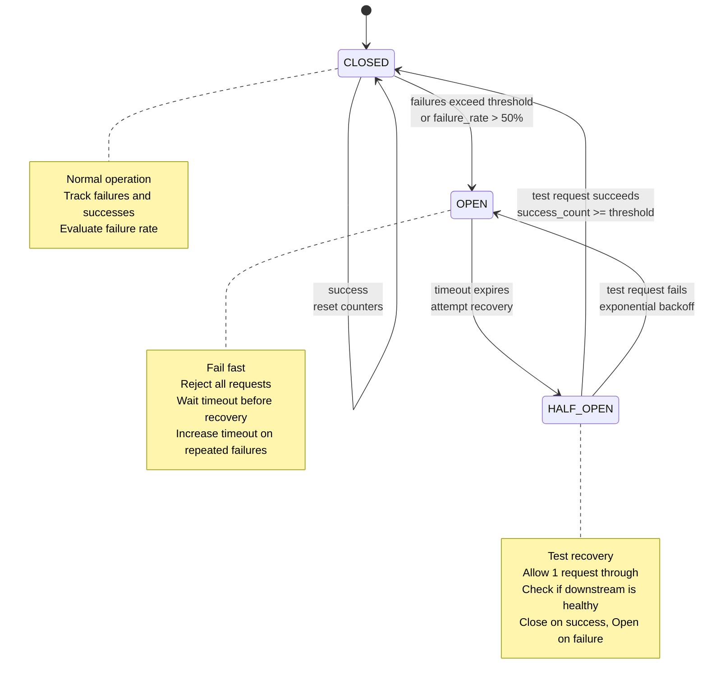
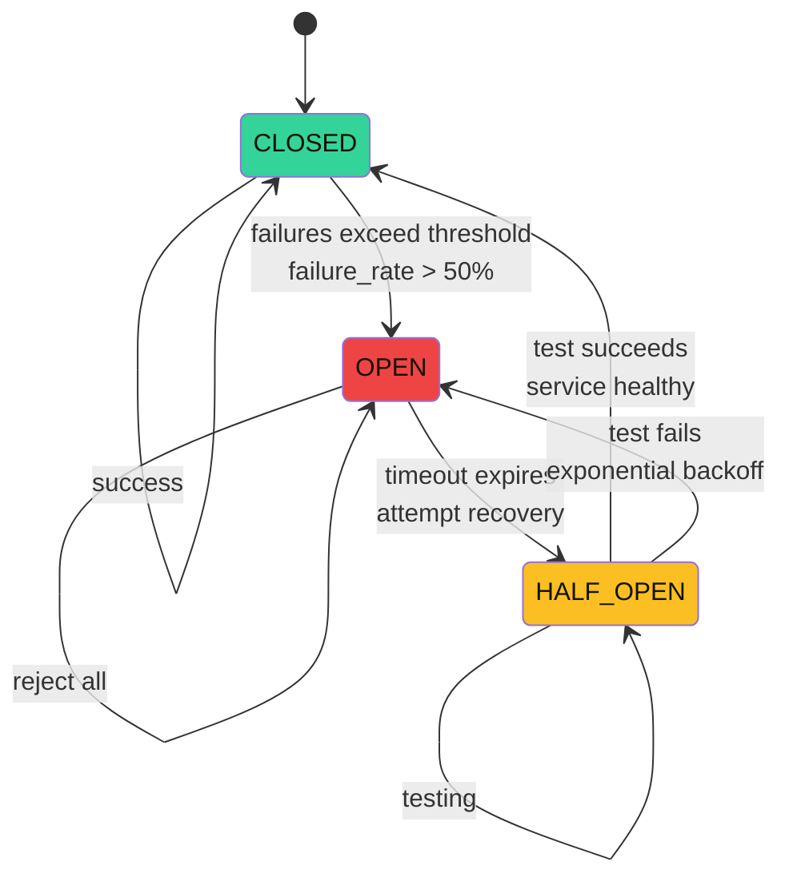

# Circuit Breaker Pattern — Interactive State Machine

> **Run the live simulators**:
>
> - [gRPC World](./grpc-world.html) — Circuit breaker state cascades, failure propagation upstream.
> - [circuit-breaker.html](./circuit-breaker.html) — State transitions, recovery testing.

## Overview



Step-by-step walkthrough of circuit breaker states, transitions, and failure recovery.

### Step-by-Step


1. **CLOSED state**: All requests pass through to downstream service, track success/failure rates
2. **Threshold detection**: When failures exceed threshold (e.g., 5 consecutive errors or 50% failure rate), transition to OPEN
3. **OPEN state**: Immediately reject new requests without calling downstream, preventing cascading failures
4. **HALF_OPEN state**: After timeout (e.g., 30 seconds), allow a test request through to check if downstream recovered
5. **Recovery or fallback**: If test request succeeds, return to CLOSED; if it fails, go back to OPEN and extend timeout
6. **Exponential backoff**: Increase timeout on repeated failures to avoid hammering a recovering service

### Code Example


```python
# Circuit breaker implementation with state management
import time
from enum import Enum
from dataclasses import dataclass, field

class CircuitState(Enum):
    CLOSED = "closed"
    OPEN = "open"
    HALF_OPEN = "half_open"

@dataclass
class CircuitBreakerConfig:
    failure_threshold: int = 5  # Consecutive failures to open
    success_threshold: int = 2  # Successes to close from half-open
    timeout_seconds: int = 30
    max_timeout_seconds: int = 300
    failure_rate_threshold: float = 0.5  # 50% failure rate

class CircuitBreaker:
    def __init__(self, config: CircuitBreakerConfig, name: str = "default"):
        self.config = config
        self.name = name
        self.state = CircuitState.CLOSED
        self.failure_count = 0
        self.success_count = 0
        self.request_count = 0
        self.last_failure_time = None
        self.timeout = config.timeout_seconds
        self.open_time = None

    def call(self, func, *args, **kwargs):
        """
        Execute function with circuit breaker protection.
        """
        if self.state == CircuitState.OPEN:
            if self._should_attempt_reset():
                self.state = CircuitState.HALF_OPEN
                print(f"[{self.name}] Transitioning to HALF_OPEN (testing recovery)")
            else:
                raise Exception(f"Circuit breaker is OPEN. Retry after {self.timeout}s")

        try:
            result = func(*args, **kwargs)
            self._on_success()
            return result
        except Exception as e:
            self._on_failure()
            raise e

    def _on_success(self):
        """Record successful call."""
        self.failure_count = 0
        self.success_count += 1
        self.request_count += 1

        if self.state == CircuitState.HALF_OPEN:
            if self.success_count >= self.config.success_threshold:
                self._close()
        elif self.state == CircuitState.CLOSED:
            # Reset timeout to default when healthy
            self.timeout = self.config.timeout_seconds

    def _on_failure(self):
        """Record failed call."""
        self.failure_count += 1
        self.success_count = 0
        self.request_count += 1
        self.last_failure_time = time.time()

        # Check for transition to OPEN
        if self.state == CircuitState.CLOSED:
            if self.failure_count >= self.config.failure_threshold:
                self._open()
        elif self.state == CircuitState.HALF_OPEN:
            # Failed test request - back to OPEN
            self._open(exponential_backoff=True)

    def _should_attempt_reset(self) -> bool:
        """Check if timeout has expired to attempt recovery."""
        if self.open_time is None:
            return False
        elapsed = time.time() - self.open_time
        return elapsed >= self.timeout

    def _open(self, exponential_backoff: bool = False):
        """Transition to OPEN state."""
        self.state = CircuitState.OPEN
        self.open_time = time.time()
        if exponential_backoff:
            # Double timeout on repeated failures, cap at max
            self.timeout = min(self.timeout * 2, self.config.max_timeout_seconds)
        print(f"[{self.name}] OPEN: Rejecting requests for {self.timeout}s")

    def _close(self):
        """Transition to CLOSED state."""
        self.state = CircuitState.CLOSED
        self.failure_count = 0
        self.success_count = 0
        self.open_time = None
        self.timeout = self.config.timeout_seconds
        print(f"[{self.name}] CLOSED: Service recovered, accepting requests")

# Usage example
import random

def unreliable_api_call():
    """Simulates a downstream service that fails intermittently."""
    if random.random() < 0.6:  # 60% failure rate
        raise Exception("Service unavailable")
    return "Success"

# Create circuit breaker
breaker = CircuitBreaker(
    config=CircuitBreakerConfig(
        failure_threshold=3,
        timeout_seconds=5
    ),
    name="payment-api"
)

# Make calls through circuit breaker
for i in range(20):
    try:
        result = breaker.call(unreliable_api_call)
        print(f"Call {i}: {result} | State: {breaker.state.value}")
    except Exception as e:
        print(f"Call {i}: ERROR - {e} | State: {breaker.state.value}")
    time.sleep(1)
```

### Real-World Scenario


Netflix's Hystrix library implementing circuit breakers prevented an entire service outage during a database migration. When the recommendation service became slow (latency >1000ms), the circuit breaker tripped after 5 consecutive timeouts, immediately rejecting new requests instead of letting them queue up. This prevented thread pool exhaustion and allowed the frontend to fail fast and show cached recommendations. The database migration completed successfully, the circuit breaker tested the service via half-open state, and recovered automatically without manual intervention.

### State Machine Diagram




## The 3 States (Colored Diagram)



```
┌─────────┐
│ CLOSED  │ ← Normal operation, calls go through
│ (allow) │
└────┬────┘
     │ failures exceed threshold
     │
     ▼
┌─────────┐
│ OPEN    │ ← Fail fast, reject calls
│ (block) │
└────┬────┘
     │ timeout expires
     │
     ▼
┌──────────┐
│ HALF_OPEN│ ← Test the dependency, allow 1 request
│(test)    │
└──┬──────┬┘
   │      │
   │      └─ failure ──→ OPEN (reset timer)
   │
   └─ success ──→ CLOSED (reset counters)
```

---

## Scenario 1: Normal Operation (CLOSED)


```
CLIENT                    CIRCUIT BREAKER               DOWNSTREAM
  │                             │                          │
  ├─ request ────────────────→  CLOSED (allow)             │
  │                             │                          │
  │                             ├─ forward ───────────────→ │
  │                             │                       SUCCESS
  │                             │ ←── response ──────────── │
  │ ←───── response ────────────┤                          │
  │                     (record success)                   │
  │                             │                          │

Counters:
  Failures: 0
  Successes: 100
  Failure rate: 0%
  State: CLOSED (allow all)
```

**Successful call flow:**
```
1. Increment success counter
2. Reset failure counter to 0
3. Return response to caller
4. Stay in CLOSED state

Thresholds (example):
  - Failure threshold: 5 consecutive or 50% in window
  - Min requests to evaluate: 10
```

---

## Scenario 2: Failures Accumulate (CLOSED → OPEN)


```
CLIENT                    CIRCUIT BREAKER               DOWNSTREAM
  │                             │                          │
  ├─ request ────────────────→  CLOSED                     │
  │                             │ ├─ forward ─────────────→ │
  │                             │ ←── timeout/error ──────┤ ✗
  │ ←─────── ERROR ────────────┤                          │
  │                     (record failure)                   │

Failure count: 1/5

Next requests... failures keep happening:

  ├─ request ────────────────→  CLOSED                     │
  │                             │ ├─ forward ─────────────→ │
  │                             │ ←── timeout/error ──────┤ ✗
  │ ←─────── ERROR ────────────┤                          │
  │                     (record failure)                   │

Failure count: 2/5

... more failures ...

Failure count: 5/5 (THRESHOLD HIT!)
↓ ↓ ↓

CLIENT                    CIRCUIT BREAKER               DOWNSTREAM
  │                             │                          │
  ├─ request ────────────────→  OPEN (block)              │
  │                             │                      (not called)
  │ ←─ ERROR (immediately) ────┤                          │
  │                      (no downstream call)              │
```

**Transition moment:**

```
Time: T=1000ms
Failure count reaches threshold (5 failures)
State transition: CLOSED → OPEN
Action: Stop sending requests to downstream
Effect: Fast error returns to clients (fail fast)

Reason: Protect downstream service from cascading requests
        when it's clearly struggling or down
```

**Failure tracking window:**

```
Time window: Last 10 seconds
Requests in window:
  T=0-1000ms:   5 failures
  T=1000-5000ms: (none, circuit open)
  
Failure rate calculation: 5/5 = 100% > 50% threshold
→ OPEN

If failures were just 50% rate:
  T=0-1000ms: 5 failures, 5 successes
  Rate: 5/10 = 50% = threshold hit
  → OPEN (threshold is inclusive ≥)
```

---

## Scenario 3: Open State (Fast Fail)


```
T=1000ms   Circuit opens (OPEN state)
           Downstream still DOWN
           
CLIENT                    CIRCUIT BREAKER
  │                             │
  ├─ request ────────────────→  OPEN (reject)
  │                             │
  │ ←─ CIRCUIT BREAKER EXCEPTION ────┤ (instant, no call)
  │

Repeat:
  ├─ request ────────────────→  OPEN
  │ ←─ CIRCUIT BREAKER EXCEPTION ────┤
  │
  ├─ request ────────────────→  OPEN
  │ ←─ CIRCUIT BREAKER EXCEPTION ────┤
  │

Metrics:
  Rejected requests: 100
  Avg latency: 1ms (fast-fail, no downstream call)
  Error rate: 100% (expected, circuit is open)

Benefit: Prevents:
  - Wasting resources on doomed requests
  - Downstream getting hammered while recovering
  - Client threads hanging waiting for timeout
```

**Open state duration:**

```
OPEN state timeout: 30 seconds (configurable)

T=1000ms:  Circuit opens
T=1030ms:  Timeout expires → transition to HALF_OPEN
           (after 30 seconds of rejection)
           
Reason: Give downstream time to recover
        Then test if it's healthy again
```

---

## Scenario 4: Half-Open State (Testing)


```
T=1030ms   Timeout expires: OPEN → HALF_OPEN
           First request allowed (test)

CLIENT                    CIRCUIT BREAKER               DOWNSTREAM
  │                             │                          │
  ├─ request ────────────────→  HALF_OPEN (test mode)     │
  │                             │ ├─ forward ────────────→ │
  │                             │ ←── response ──────────┤ SUCCESS!
  │ ←─────── response ─────────┤                          │
  │                     (downstream recovering!)           │

Case 1: Request succeeds
         Action: HALF_OPEN → CLOSED
         Reset: failure/success counters
         Effect: Resume normal operation
         
         Next request:
         ├─ request ────────────────→  CLOSED
         │                             │ ├─ forward ──────────→
         │ ← response (normal flow) ──┤

Case 2: Request fails
         ├─ request ────────────────→  HALF_OPEN
         │                             │ ├─ forward ────────→ FAIL ✗
         │ ←─ error ──────────────────┤
         │                      downstream still down
         
         Action: HALF_OPEN → OPEN (reopen)
         Reset: timeout timer
         Effect: Reject again, wait 30s, retry
         
         Next request:
         ├─ request ────────────────→  OPEN
         │ ←─ REJECTED ───────────────┤
```

**Half-Open behavior:**

```
State: HALF_OPEN
Purpose: Probe downstream health

Incoming requests:
  - Allow exactly 1 request through (test)
  - Subsequent requests: REJECT (circuit not fully closed)
  
Success → CLOSED
  - Resume normal flow
  - All requests go through
  
Failure → OPEN
  - Downstream still unhealthy
  - Go back to fast-fail mode
  - Wait another timeout period
```

---

## Scenario 5: Recovery & Cascading Back to Normal


```
T=0:       Service A calls Service B
           Service B becomes overloaded

T=5:       Service A's circuit opens (protect B)
           Reject requests, fail fast

T=10:      Service B recovers (load decreases)
           Downstream no longer timing out

T=35:      Service A's timeout expires
           Transition to HALF_OPEN

T=36:      Test request: succeeds
           Service A: HALF_OPEN → CLOSED

T=40:      Both services stable
           Normal request flow resumed
           
         ┌───────────────────────┐
         │  SERVICE B RECOVERS   │
         └────────┬──────────────┘
                  │
              ┌───▼────┐
              │ CLOSED │ ← Service A tests
              │(test)  │
              └───┬────┘
                  │
              ┌───▼─────┐
              │ CLOSED  │ ← Success, resume
              │(allow)  │
              └─────────┘
```

**Cascading recovery example:**

```
Dependency chain: API → Payment → Database

Database recovers first (circuit timeout)
    ↓
Payment tests Database (HALF_OPEN)
    ↓
Database responds: success
    ↓
Payment: HALF_OPEN → CLOSED (resumes normal flow)
    ↓
API receives Payment responses again
    ↓
API tests (HALF_OPEN)
    ↓
API: HALF_OPEN → CLOSED
    ↓
System fully recovered

Total time: 3 timeouts × 30s = ~90 seconds
Without circuit breaker: cascading failures, manual restart needed
```

---

## Scenario 6: Flaky Service (Oscillation)


**Problem**: Service is intermittently failing.

```
Healthy: 2 requests succeed
Unhealthy: 1 request fails
Pattern repeats...

Time: T=0-100ms
  CLOSED: 10 requests, 7 success, 3 fail
  Success rate: 70% < 80% threshold
  → OPEN

Time: T=100-130ms (OPEN state, reject all)
  Fast-fail: 50 requests rejected instantly

Time: T=130ms (timeout, enter HALF_OPEN)
  Test: succeeds
  → CLOSED (again)

Time: T=130-200ms
  CLOSED: 10 requests, 7 success, 3 fail
  Success rate: 70% < 80%
  → OPEN (again)

Oscillation cycle: ~130 seconds per round
```

**Solution: Increase test request count**

```
Traditional half-open: 1 test request

Improved half-open: Allow 5 test requests before deciding
  If ≥ 4 succeed: CLOSED
  If < 4 succeed: OPEN

This reduces false positives from transient failures
```

**Solution: Increase open timeout**

```
Open timeout: 60 seconds (instead of 30)
Gives flaky service more time to stabilize
Reduces oscillation frequency
```

---

## Common Patterns


### Pattern 1: Fallback Response


```python
try:
    response = circuit_breaker.call(get_user, user_id)
except CircuitBreakerOpen:
    response = cached_user or default_user

return response
```

When circuit open:
  - Return stale data (cache)
  - Return default/empty response
  - Degrade feature gracefully

### Pattern 2: Bulkhead Pattern


```
Circuit breaker per dependency:
  CB[Database] → separate from CB[Cache]
  CB[Auth] → separate from CB[Payment]
  
If Database fails:
  - Circuit B[Database] opens
  - Auth, Cache, Payment continue
  - System degrades partially instead of completely
```

### Pattern 3: Timeout + Circuit Breaker


```
Timeout: 5 seconds per request
Circuit breaker: 5 failures in 10 seconds

Interaction:
  Request 1: timeout (5s) → failure counter: 1
  Request 2: timeout (5s) → failure counter: 2
  Request 3: timeout (5s) → failure counter: 3
  Request 4: timeout (5s) → failure counter: 4
  Request 5: timeout (5s) → failure counter: 5 → OPEN
  
  From now: requests rejected instantly (1ms)
  Instead of: wasting 5 seconds each
```

---

## Interview Questions


### Q1: What's the purpose of the HALF_OPEN state?


**Answer**: To differentiate between "still broken" and "recovered".

Without HALF_OPEN:
```
CLOSED → request fails → immediately reopen for test
Problem: If test fails, you're still in the waiting period
         Multiple tests in rapid succession
         Wastes resources
```

With HALF_OPEN:
```
CLOSED → timeout expires → HALF_OPEN (wait for test result)
  Test succeeds → CLOSED (confidence: yes)
  Test fails → OPEN (confidence: no, wait longer)
This batches testing: max 1 test per timeout period
```

### Q2: Why reject requests in HALF_OPEN instead of queuing them?


**Answer**: Fail fast principle.

If downstream is still struggling:
  - Queueing adds latency to caller
  - Downstream gets more load (bad)
  - Better to fast-fail and let caller use fallback

Trade-off:
  - Allow all requests: risk overwhelming downstream
  - Reject in HALF_OPEN: fast feedback, protects downstream

### Q3: How does circuit breaker differ from retry?


**Answer**:

Retry: "Try again, maybe it's transient"
```
Request fails → retry immediately
Useful for: transient timeouts, temporary blips
Risk: if service is down, wastes time & resources
```

Circuit breaker: "Something is wrong, stop trying"
```
Requests fail → reject future requests
Useful for: cascading failures, overload protection
Reduces: wasted resources, load on broken service
```

Combined:
```
First request: try once, then circuit breaker takes over
Subsequent: fast-fail or test (HALF_OPEN)
Optimal: retry once, then circuit breaker
```

### Q4: Can a circuit breaker cause cascading failures?


**Answer**: No, it prevents them.

Scenario:
```
Service A → Service B (healthy) → Service C (down)

Without circuit breaker:
  Service B's circuit to C opens
  Service B degrades but stays up
  Service A calls B → B returns error
  If A doesn't handle the error → A fails too
  Cascading up the chain

With circuit breaker + fallback:
  Service B's circuit to C opens
  Service B returns cached data instead
  Service A gets response, no failure
  Cascading prevented
```

Key: Circuit breaker + proper fallback handling.

---

## Real-World Configuration


```python
from pybreaker import CircuitBreaker

cb = CircuitBreaker(
    fail_max=5,              # failures before opening
    reset_timeout=30,        # seconds before half-open test
    listeners=[...],         # monitor state changes
    listeners_cls=...,
    name='payment-service',
)

# Use it
try:
    result = cb.call(payment_api.charge, customer_id, amount)
except CircuitBreakerListener:
    result = return_cached_result()  # fallback
```

Common libraries:
  - Python: pybreaker, tenacity
  - Java: Resilience4j, Hystrix (legacy)
  - Go: grpc-health-probe, failpoint
  - .NET: Polly

---

## Key Takeaways


1. **CLOSED**: Normal operation, monitor failures
2. **OPEN**: Downstream broken, fail fast (save resources)
3. **HALF_OPEN**: Test if downstream recovered
4. **Protect downstream**: Circuit breaker prevents cascading overload
5. **Fail fast**: Return quickly so caller can use fallback

Real-world impact: Netflix estimates circuit breakers prevent ~30% of outages.


## Comparison Table


| Aspect | Option A | Option B | Trade-off |
| ---- | ---- | ---- | ---- |
| Performance | High | Medium | Speed vs Simplicity |
| Complexity | High | Low | Features vs Ease of Use |
| Scalability | Excellent | Good | Horizontal vs Vertical |
| Cost | High | Low | Features vs Budget |

## Related

- [Cap Consistency](/09-distributed-systems/01-cap-consistency.md)
- [Consensus Replication](/09-distributed-systems/01-consensus-replication.md)
- [Consensus Raft](/09-distributed-systems/02-consensus-raft.md)
- [Distributed Transactions](/09-distributed-systems/02-distributed-transactions.md)
- [Distributed Caching](/09-distributed-systems/03-distributed-caching.md)
- [Distributed Storage](/09-distributed-systems/03-distributed-storage.md)

---

## Interactive Components

### Circuit Breaker State Machine

```html-live
<div style="padding:16px;background:#0b0e14;border:1px solid #1e2a3a;border-radius:8px">
  <style>
    .state-machine-title {
      color:#00d4ff;
      font-family:monospace;
      font-size:14px;
      font-weight:bold;
      margin-bottom:16px;
      letter-spacing:1px;
    }
    .state-demo {
      text-align:center;
    }
    .state-display {
      font-size:18px;
      font-family:monospace;
      padding:16px;
      border-radius:4px;
      margin:16px 0;
      color:#0b0e14;
      font-weight:bold;
      min-height:50px;
      display:flex;
      align-items:center;
      justify-content:center;
      border:2px solid currentColor;
    }
    .state-closed { background:#34d399;border-color:#22c55e }
    .state-open { background:#ef4444;border-color:#dc2626 }
    .state-half-open { background:#fbbf24;border-color:#f59e0b }
    .state-buttons {
      display:flex;
      gap:8px;
      justify-content:center;
      flex-wrap:wrap;
      margin-top:16px;
    }
    .state-button {
      padding:8px 16px;
      border:1px solid #00d4ff;
      background:#1e3a5f;
      color:#00d4ff;
      border-radius:4px;
      cursor:pointer;
      font-family:monospace;
      font-size:12px;
      transition:all 0.2s;
    }
    .state-button:hover {
      background:#2a5a8f;
      box-shadow:0 0 8px #00d4ff;
    }
  </style>

  <div class="state-machine-title">Circuit Breaker State Transitions</div>
  <div class="state-demo">
    <div class="state-display state-closed" id="state-display">CLOSED</div>
    <div class="state-buttons">
      <button class="state-button" onclick="setState('CLOSED')">Healthy</button>
      <button class="state-button" onclick="setState('OPEN')">Failing</button>
      <button class="state-button" onclick="setState('HALF_OPEN')">Testing</button>
    </div>
  </div>

  <script>
    const stateMap = {
      'CLOSED': { label: 'CLOSED', class: 'state-closed' },
      'OPEN': { label: 'OPEN', class: 'state-open' },
      'HALF_OPEN': { label: 'HALF-OPEN', class: 'state-half-open' }
    };
    function setState(state) {
      const display = document.getElementById('state-display');
      const info = stateMap[state];
      display.textContent = info.label;
      display.className = 'state-display ' + info.class;
    }
  </script>
</div>
```

### Circuit Breaker Failure Injection

```html-live
<div style="padding:16px;background:#0b0e14;border:1px solid #1e2a3a;border-radius:8px">
  <style>
    .cascade-title {
      color:#00d4ff;
      font-family:monospace;
      font-size:14px;
      font-weight:bold;
      margin-bottom:16px;
      letter-spacing:1px;
    }
    .cascade-stages {
      display:flex;
      flex-direction:column;
      gap:12px;
      margin-bottom:16px;
    }
    .cascade-stage {
      display:flex;
      align-items:center;
      gap:12px;
    }
    .cascade-label {
      color:#e3eaf0;
      font-family:monospace;
      font-size:12px;
      min-width:120px;
    }
    .cascade-indicator {
      width:24px;
      height:24px;
      border-radius:4px;
      background:#34d399;
      border:2px solid #22c55e;
      transition:all 0.3s;
    }
    .cascade-indicator.failing {
      background:#ef4444;
      border-color:#dc2626;
      box-shadow:0 0 12px #ef4444;
      animation:cascade-fail 0.6s ease-out;
    }
    @keyframes cascade-fail {
      0%{transform:scale(1);opacity:1}
      100%{transform:scale(1.2);opacity:0.8}
    }
    .cascade-controls {
      display:flex;
      gap:8px;
      flex-wrap:wrap;
    }
    .cascade-button {
      padding:8px 16px;
      border:1px solid #00d4ff;
      background:#1e3a5f;
      color:#00d4ff;
      border-radius:4px;
      cursor:pointer;
      font-family:monospace;
      font-size:12px;
      transition:all 0.2s;
    }
    .cascade-button:hover {
      background:#2a5a8f;
      box-shadow:0 0 8px #00d4ff;
    }
  </style>

  <div class="cascade-title">Failure Cascade Prevention</div>
  <div class="cascade-stages" id="cascade-stages">
    <div class="cascade-stage"><span class="cascade-label">Service A</span><div class="cascade-indicator" data-stage="svc-a"></div></div>
    <div class="cascade-stage"><span class="cascade-label">Service B (calls A)</span><div class="cascade-indicator" data-stage="svc-b"></div></div>
    <div class="cascade-stage"><span class="cascade-label">Service C (calls B)</span><div class="cascade-indicator" data-stage="svc-c"></div></div>
  </div>
  <div class="cascade-controls">
    <button class="cascade-button" onclick="startCascade()">Without Circuit Breaker</button>
    <button class="cascade-button" onclick="resetCascade()">Reset</button>
  </div>

  <script>
    function startCascade() {
      const stages = document.querySelectorAll('[data-stage]');
      let delay = 0;
      stages.forEach((stage) => {
        setTimeout(() => {
          stage.classList.add('failing');
        }, delay);
        delay += 400;
      });
    }
    function resetCascade() {
      document.querySelectorAll('[data-stage]').forEach((stage) => {
        stage.classList.remove('failing');
      });
    }
  </script>
</div>
```
