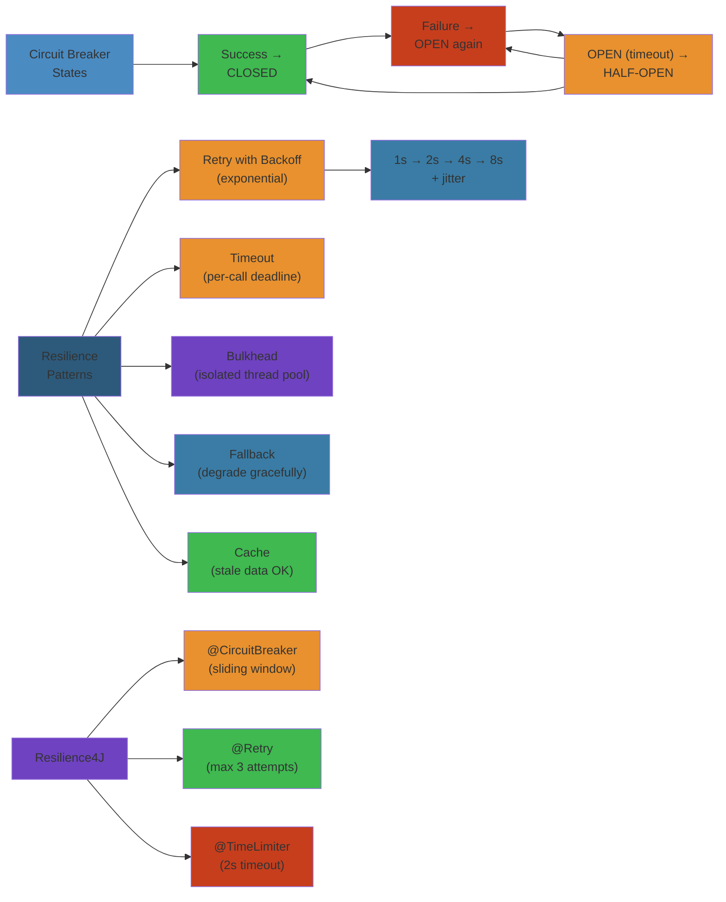
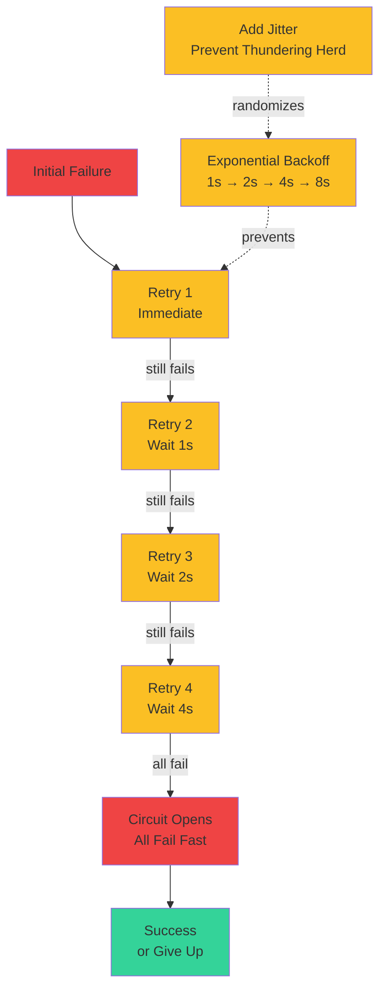

# 🛡️ Circuit Breaker & Resilience Patterns — Complete Deep Dive

[🎨 Interactive Visualization](../../../html/05-circuit-breaker-resilience-viz.html)

> **Run the live simulator**: [circuit-breaker.html](/16-microservices/circuit-breaker.html) — click buttons to trigger state transitions and watch the circuit breaker react.

**Related**: [API Gateway](/16-microservices/04-api-gateway.md) · [Distributed Transactions](/16-microservices/06-distributed-transactions-saga.md) · [Observability](/16-microservices/08-security-identity.md)

---



## Table of Contents

- [The Problem: Cascading Failures](#-the-problem-cascading-failures)
- [1. Circuit Breaker Pattern](#1-circuit-breaker-pattern)
- [2. Retry with Backoff](#2-retry-with-backoff)
- [3. Timeout & Bulkhead](#3-timeout--bulkhead)
- [4. Fallback Patterns](#4-fallback-patterns)
- [5. Resilience4J in Depth](#5-resilience4j-in-depth)
- [6. Spring Cloud Circuit Breaker](#6-spring-cloud-circuit-breaker)
- [Simplest Mental Model](#-simplest-mental-model)

---

## 🧭 The Problem: Cascading Failures

```text
Normal:
  Client ──> Service A ──> Service B ──> Service C
                                          ✅ OK

Cascading Failure:
  Client ──> Service A ──> Service B ──> Service C (SLOW!)
               │                         ❌ Timeout after 10s
               │ (thread pool fills up)
               │ (new requests queue up)
               │ (memory runs out)
               ▼
            Service A CRASHES

Without circuit breaker:
  One slow service → all downstream services collapse

With circuit breaker:
  Service B detects C is failing → opens circuit
  → Returns cached/fallback instantly
  → Other services unaffected
```

---

## 1. Circuit Breaker Pattern

#### Step-by-Step (Circuit Breaker Lifecycle)

1. **CLOSED State**: Service healthy, requests pass through normally. Track failure count in sliding window.
2. **Detect Failures**: Count consecutive failures (e.g., 5 in a row) or failure rate (>50% in last 100 requests)
3. **Open Circuit**: When threshold hit, circuit opens. New requests immediately fail (fail-fast) without calling service
4. **Fast-Fail**: Prevent cascading failures — threads don't wait on broken service, memory/connections freed
5. **Half-Open**: After timeout (e.g., 30 seconds), allow single probe request to test if service recovered
6. **Recovery**: If probe succeeds, close circuit (traffic flows again). If fails, reopen and wait another 30s

#### Code Example

```python
# Circuit breaker implementation in Python
from enum import Enum
from datetime import datetime, timedelta
import threading

class CircuitState(Enum):
    CLOSED = "closed"      # Normal operation
    OPEN = "open"         # Failing, reject requests
    HALF_OPEN = "half_open"  # Testing recovery

class CircuitBreaker:
    def __init__(self, failure_threshold: int = 5, 
                 timeout_seconds: int = 30,
                 window_size: int = 100):
        self.state = CircuitState.CLOSED
        self.failure_count = 0
        self.success_count = 0
        self.failure_threshold = failure_threshold
        self.timeout_seconds = timeout_seconds
        self.window_size = window_size
        self.last_open_time = None
        self.lock = threading.Lock()
    
    def call(self, func, *args, **kwargs):
        """Execute function with circuit breaker protection"""
        with self.lock:
            if self.state == CircuitState.OPEN:
                # Check if timeout elapsed
                if self._should_attempt_reset():
                    self.state = CircuitState.HALF_OPEN
                    print(f"Circuit opened, entering HALF_OPEN after {self.timeout_seconds}s")
                else:
                    # Still in timeout period
                    raise CircuitBreakerOpenException(
                        f"Circuit open, will retry in "
                        f"{self._time_until_retry()}s")
            
            # Try the call
            try:
                result = func(*args, **kwargs)
                self._on_success()
                return result
            except Exception as e:
                self._on_failure()
                raise
    
    def _on_success(self):
        """Called when function executes successfully"""
        self.failure_count = 0
        if self.state == CircuitState.HALF_OPEN:
            print("Health check passed, closing circuit")
            self.state = CircuitState.CLOSED
        self.success_count += 1
    
    def _on_failure(self):
        """Called when function fails"""
        self.failure_count += 1
        
        if self.state == CircuitState.HALF_OPEN:
            # Failed during recovery attempt
            print("Health check failed, reopening circuit")
            self.state = CircuitState.OPEN
            self.last_open_time = datetime.now()
        elif self.failure_count >= self.failure_threshold:
            # Too many consecutive failures
            print(f"Failure threshold reached ({self.failure_count}), opening circuit")
            self.state = CircuitState.OPEN
            self.last_open_time = datetime.now()
    
    def _should_attempt_reset(self) -> bool:
        """Check if timeout has elapsed"""
        return datetime.now() - self.last_open_time >= timedelta(seconds=self.timeout_seconds)
    
    def _time_until_retry(self) -> int:
        """Seconds until retry is allowed"""
        elapsed = (datetime.now() - self.last_open_time).total_seconds()
        return max(0, int(self.timeout_seconds - elapsed))

# Usage example
class CircuitBreakerOpenException(Exception):
    pass

# Simulate payment service
def process_payment(amount: float) -> dict:
    """Simulates a flaky payment service"""
    import random
    if random.random() < 0.6:  # 60% failure rate
        raise Exception("Payment service timeout")
    return {"status": "success", "amount": amount}

# Wrap with circuit breaker
payment_breaker = CircuitBreaker(failure_threshold=3, timeout_seconds=5)

def safe_process_payment(amount: float) -> dict:
    return payment_breaker.call(process_payment, amount)

# Test the circuit breaker
print("=== Testing Circuit Breaker ===")
for i in range(15):
    try:
        result = safe_process_payment(100.0)
        print(f"[{i}] ✓ Payment processed: {result}")
    except CircuitBreakerOpenException as e:
        print(f"[{i}] ✗ Circuit breaker: {e}")
    except Exception as e:
        print(f"[{i}] ✗ Service error: {e}")
    
    # Show circuit state
    print(f"    State: {payment_breaker.state.value}, "
          f"Failures: {payment_breaker.failure_count}")
```

#### Real-World Scenario

AWS Lambda encountered cascading failures during 2017 outage: one service (metadata service) slowed down, all Lambda invocations waited indefinitely, thread pools exhausted. Teams implementing circuit breakers would have stopped calling the slow service after first few failures, allowing system to degrade gracefully instead of crashing. Netflix added circuit breakers to Hystrix library specifically to prevent this pattern.

### States

```text
                    ┌─────────────────────────────┐
                    │         CLOSED              │
                    │   Normal operation          │
                    │   Requests pass through     │
                    │   Track failure count       │
                    └──────────────┬──────────────┘
                                   │ failures > threshold
                                   ▼
                    ┌─────────────────────────────┐
                    │          OPEN                │
                    │   Requests FAIL FAST         │
                    │   No calls to remote service│
                    │   Wait: timeout (e.g., 30s) │
                    └──────────────┬──────────────┘
                                   │ timeout elapsed
                                   ▼
                    ┌─────────────────────────────┐
                    │        HALF_OPEN             │
                    │   Try ONE request            │
                    └──────────────┬──────────────┘
                              /          \
                          success         fail
                            │              │
                            ▼              ▼
                    ┌───────────┐   ┌──────────────┐
                    │  CLOSED   │   │    OPEN      │
                    └───────────┘   └──────────────┘
```

### Code: Circuit Breaker Implementation

```java
// Using Resilience4J
@Service
public class PaymentGatewayClient {

    private final RestTemplate restTemplate;
    private final CircuitBreaker circuitBreaker;

    public PaymentGatewayClient(RestTemplate restTemplate,
                                CircuitBreakerRegistry registry) {
        this.restTemplate = restTemplate;
        this.circuitBreaker = registry.circuitBreaker("paymentGateway");
    }

    public PaymentResponse processPayment(PaymentRequest request) {
        // The circuit breaker wraps the call
        Supplier<PaymentResponse> decorated = circuitBreaker
            .decorateSupplier(() ->
                restTemplate.postForObject(
                    "http://payment-service/api/charge",
                    request,
                    PaymentResponse.class));

        // Execute with fallback
        return Try.ofSupplier(decorated)
            .recover(throwable -> {
                log.warn("Payment service failed, using fallback", throwable);
                return new PaymentResponse("FAILED", "Service unavailable");
            })
            .get();
    }
}

// Configuration
@Configuration
public class CircuitBreakerConfig {

    @Bean
    public CircuitBreakerRegistry circuitBreakerRegistry() {
        CircuitBreakerConfig config = new CircuitBreakerConfig()
            .failureRateThreshold(50)           // 50% failure rate opens
            .waitDurationInOpenState(Duration.ofSeconds(30))  // wait 30s
            .permittedNumberOfCallsInHalfOpenState(3)  // try 3 calls
            .minimumNumberOfCalls(10)            // need 10 calls to calculate
            .slidingWindowType(CircuitBreakerConfig.SlidingWindowType.COUNT_BASED)
            .slidingWindowSize(20)               // last 20 calls
            .recordExceptions(IOException.class, TimeoutException.class)
            .ignoreExceptions(BusinessException.class);  // don't count business failures

        return CircuitBreakerRegistry.of(config);
    }

    @Bean
    public CircuitBreaker paymentCircuitBreaker(CircuitBreakerRegistry registry) {
        return registry.circuitBreaker("paymentGateway");
    }
}

// Configuration via application.yml
// resilience4j:
//   circuitbreaker:
//     configs:
//       default:
//         sliding-window-size: 20
//         minimum-number-of-calls: 10
//         failure-rate-threshold: 50
//         wait-duration-in-open-state: 30s
//         permitted-number-of-calls-in-half-open-state: 3
//         automatic-transition-from-open-to-half-open-enabled: true
//         record-exceptions:
//           - java.io.IOException
//           - java.util.concurrent.TimeoutException
//     instances:
//       paymentGateway:
//         base-config: default
//         wait-duration-in-open-state: 60s
```

### Event Listeners

```java
@Component
public class CircuitBreakerEventListener {

    private static final Logger log = LoggerFactory.getLogger(CircuitBreakerEventListener.class);

    public CircuitBreakerEventListener(CircuitBreakerRegistry registry) {
        registry.getAllCircuitBreakers().forEach(cb -> {
            cb.getEventPublisher()
                .onSuccess(e -> log.info("CB {} SUCCESS", e.getCircuitBreakerName()))
                .onError(e -> log.warn("CB {} ERROR: {}", e.getCircuitBreakerName(), e.getThrowable().getMessage()))
                .onStateTransition(e -> log.warn("CB {} {} → {} (failureRate={}%)",
                    e.getCircuitBreakerName(),
                    e.getOldState(),
                    e.getNewState(),
                    e.getFailureRate()))
                .onCallNotPermitted(e -> log.warn("CB {} OPEN — call rejected",
                    e.getCircuitBreakerName()));
        });
    }
}
```

---

## 2. Retry with Backoff

### Retry Storm Prevention



### Traditional Retry Pattern

### Problem

```text
Without retry:
  transient failure (e.g., DB connection pool exhausted for 100ms)
  → client gets 503
  → request fails
  → user sees error

With retry:
  → first attempt fails
  → wait 100ms
  → second attempt succeeds
  → user never notices
```

### Code: Retry

```java
@Service
public class RetryableInventoryClient {

    private final RestTemplate restTemplate;

    // Spring Retry annotation
    @Retryable(
        retryFor = {TimeoutException.class, ResourceAccessException.class},
        maxAttempts = 3,
        backoff = @Backoff(delay = 200, multiplier = 2, maxDelay = 5000)
    )
    public InventoryResponse checkStock(String productId) {
        return restTemplate.getForObject(
            "http://inventory-service/api/stock/{id}",
            InventoryResponse.class, productId);
    }

    // Recovery method after all retries exhausted
    @Recover
    public InventoryResponse recover(ResourceAccessException e, String productId) {
        log.error("Inventory service unavailable for {}, all retries failed", productId, e);
        return new InventoryResponse(productId, 0, "UNAVAILABLE");
    }
}

// Configuration
@Configuration
@EnableRetry
public class RetryConfig {
    // @EnableRetry enables @Retryable
}
```

### Resilience4J Retry

```java
@Service
public class ResilientClient {

    private final RestTemplate rest;
    private final Retry retry;

    public ResilientClient(RestTemplate rest, RetryRegistry registry) {
        this.rest = rest;
        this.retry = registry.retry("default");
    }

    public UserDTO getUser(Long id) {
        RetryConfig config = RetryConfig.custom()
            .maxAttempts(3)
            .waitDuration(Duration.ofMillis(500))
            .retryExceptions(IOException.class, TimeoutException.class)
            .ignoreExceptions(IllegalArgumentException.class)
            .failAfterMaxAttempts(true)
            .build();

        Retry customRetry = Retry.of("userService", config);

        Supplier<UserDTO> supplier = Retry.decorateSupplier(customRetry,
            () -> rest.getForObject(
                "http://user-service/api/users/{id}", UserDTO.class, id));

        return Try.ofSupplier(supplier)
            .getOrElseGet(e -> {
                log.error("Failed to fetch user {} after retries", id, e);
                return new UserDTO(id, "Unknown");
            });
    }
}
```

### Retry Strategies

```text
1. Fixed Delay:
   Attempt 1 — failed — wait 500ms
   Attempt 2 — failed — wait 500ms
   Attempt 3 — failed → give up

2. Exponential Backoff (MULTIPLIER):
   Attempt 1 — failed — wait 200ms
   Attempt 2 — failed — wait 400ms (×2)
   Attempt 3 — failed — wait 800ms (×2)
   Attempt 4 — failed — wait 1600ms (×2) → give up

3. Exponential Backoff with Jitter:
   Same as above but add randomness to prevent thundering herd
   wait = baseDelay * (multiplier ^ attempt) * random(0.5, 1.5)

4. Randomized Delay:
   wait = random(minDelay, maxDelay)
```

```java
// Spring Retry with exponential backoff
@Retryable(
    maxAttempts = 5,
    backoff = @Backoff(
        delay = 100,
        multiplier = 2,
        maxDelay = 10000,
        random = true  // add jitter
    )
)
public void callExternalService() {
    // ...
}
```

---

## 3. Timeout & Bulkhead

### Timeout

```java
@Service
public class TimeoutConfig {

    // Resilience4J TimeLimiter
    @Bean
    public TimeLimiterRegistry timeLimiterRegistry() {
        TimeLimiterConfig config = TimeLimiterConfig.custom()
            .timeoutDuration(Duration.ofSeconds(3))
            .cancelRunningFuture(true)
            .build();

        return TimeLimiterRegistry.of(config);
    }

    // Usage
    public Mono<PaymentResponse> processPayment(PaymentRequest request) {
        TimeLimiter timeLimiter = timeLimiterRegistry().timeLimiter("payment");

        Supplier<CompletableFuture<PaymentResponse>> futureSupplier = () ->
            CompletableFuture.supplyAsync(() ->
                restTemplate.postForObject("http://payment-service/api/charge",
                    request, PaymentResponse.class));

        // Apply timeout
        Supplier<PaymentResponse> decorated = TimeLimiter
            .decorateSupplier(timeLimiter, futureSupplier);

        return Mono.fromFuture(() ->
            CompletableFuture.supplyAsync(() -> decorated.get()));
    }
}

// application.yml
// resilience4j:
//   timelimiter:
//     instances:
//       payment:
//         timeout-duration: 3s
//         cancel-running-future: true
```

### Bulkhead

```text
Prevents one service from exhausting all threads.

Without bulkhead:
  Service A calls Service B (slow, 10s per call)
  100 concurrent requests → 100 threads blocked → all services affected

With bulkhead (thread pool isolation):
  ┌─────────────────────────────────────────────────────────┐
  │                 Application Thread Pool                  │
  ├──────────────────┬──────────────────┬──────────────────┤
  │  Payment Service │  User Service    │  Order Service   │
  │  max threads: 5  │  max threads: 10 │  max threads: 8  │
  │  queue: 10       │  queue: 20       │  queue: 15       │
  │                   │                   │                  │
  │  Payment slow →   │  Not affected     │  Not affected    │
  │  Only 5 threads   │  Still full speed │  Still full speed│
  │  blocked          │                   │                  │
  └──────────────────┴──────────────────┴──────────────────┘
```

```java
@Configuration
public class BulkheadConfig {

    // Thread pool bulkhead (isolated thread pool per service)
    @Bean
    public BulkheadRegistry bulkheadRegistry() {
        BulkheadConfig config = BulkheadConfig.custom()
            .maxConcurrentCalls(10)          // max 10 parallel calls
            .maxWaitDuration(Duration.ofMillis(500))  // wait 500ms in queue
            .writableStackTraceEnabled(true)
            .build();

        return BulkheadRegistry.of(config);
    }

    // Semaphore bulkhead (lighter weight)
    @Bean
    public BulkheadRegistry semaphoreBulkheadRegistry() {
        BulkheadConfig config = BulkheadConfig.custom()
            .maxConcurrentCalls(20)
            .build();

        return BulkheadRegistry.of(config);
    }
}

@Service
public class BulkheadedClient {
    private final Bulkhead bulkhead;

    public BulkheadedClient(BulkheadRegistry registry) {
        this.bulkhead = registry.bulkhead("paymentService");
    }

    public PaymentResponse callPayment(PaymentRequest request) {
        Supplier<PaymentResponse> decorated = Bulkhead
            .decorateSupplier(bulkhead, () -> callPaymentService(request));

        return Try.ofSupplier(decorated)
            .onFailure(e -> log.warn("Bulkhead full - payment service busy"))
            .getOrElse(new PaymentResponse("REJECTED", "Too many requests"));
    }
}

// application.yml
// resilience4j:
//   bulkhead:
//     instances:
//       paymentService:
//         max-concurrent-calls: 10
//         max-wait-duration: 500ms
```

---

## 4. Fallback Patterns

### Stale Cache Fallback

```java
@Service
public class CachedProductClient {
    private final ProductServiceClient client;
    private final Cache<String, Product> cache;

    public CachedProductClient(ProductServiceClient client) {
        this.client = client;
        this.cache = Caffeine.newBuilder()
            .maximumSize(10_000)
            .expireAfterWrite(5, TimeUnit.MINUTES)
            .build();
    }

    public Product getProduct(String id) {
        try {
            Product product = client.fetchProduct(id);
            cache.put(id, product);  // update cache
            return product;
        } catch (Exception e) {
            // Fallback to stale cache
            Product cached = cache.getIfPresent(id);
            if (cached != null) {
                log.warn("Product service down, using cached data for {}", id);
                return cached;
            }
            throw new ProductUnavailableException("No data available for " + id, e);
        }
    }
}
```

### Default Value Fallback

```java
@CircuitBreaker(name = "recommendation", fallbackMethod = "emptyRecommendations")
public List<Recommendation> getRecommendations(String userId) {
    return restTemplate.exchange(
        "http://recommendation-service/api/recommend/{userId}",
        HttpMethod.GET, null,
        new ParameterizedTypeReference<List<Recommendation>>() {},
        userId).getBody();
}

public List<Recommendation> emptyRecommendations(String userId, Throwable t) {
    log.warn("Recommendations unavailable for {}, returning empty", userId);
    return List.of();  // graceful degradation
}
```

### Null Object Fallback

```java
@CircuitBreaker(name = "pricing")
public Price getPrice(String productId) {
    return pricingClient.getPrice(productId);
}

public Price getPriceFallback(String productId, Throwable t) {
    // Null object pattern — return safe default
    return Price.unknown();  // never null, just "call for price"
}
```

---

## 5. Resilience4J in Depth

### Combined Decorators

```java
@Service
public class FullyResilientClient {

    private final RestTemplate rest;
    private final CircuitBreaker circuitBreaker;
    private final Retry retry;
    private final Bulkhead bulkhead;
    private final TimeLimiter timeLimiter;

    public FullyResilientClient(RestTemplate rest,
                                CircuitBreakerRegistry cbRegistry,
                                RetryRegistry retryRegistry,
                                BulkheadRegistry bulkheadRegistry,
                                TimeLimiterRegistry timeLimiterRegistry) {
        this.rest = rest;
        this.circuitBreaker = cbRegistry.circuitBreaker("userService");
        this.retry = retryRegistry.retry("userService");
        this.bulkhead = bulkheadRegistry.bulkhead("userService");
        this.timeLimiter = timeLimiterRegistry.timeLimiter("userService");
    }

    public UserDTO getUser(Long id) {
        Supplier<CompletableFuture<UserDTO>> futureSupplier = () ->
            CompletableFuture.supplyAsync(() ->
                rest.getForObject(
                    "http://user-service/api/users/{id}",
                    UserDTO.class, id));

        // Chain decorators: Bulkhead → CircuitBreaker → Retry → TimeLimiter
        Supplier<UserDTO> decorated = Bulkhead.decorateSupplier(bulkhead,
            CircuitBreaker.decorateSupplier(circuitBreaker,
                Retry.decorateSupplier(retry,
                    TimeLimiter.decorateSupplier(timeLimiter, futureSupplier))));

        return Try.ofSupplier(decorated)
            .recover(e -> {
                log.error("All resilience mechanisms exhausted for user {}", id, e);
                return new UserDTO(id, "Unknown User");
            })
            .get();
    }
}
```

### Metrics Export

```java
@Component
public class ResilienceMetrics {
    // Expose circuit breaker metrics to Micrometer/Prometheus
    @Bean
    public MeterRegistryCustomizer<MeterRegistry> metricsCustomizer(
            CircuitBreakerRegistry registry) {
        return meterRegistry -> {
            registry.getAllCircuitBreakers().forEach(cb -> {
                // State gauge
                Gauge.builder("resilience4j.circuitbreaker.state", cb,
                        c -> c.getState().getOrder())
                    .tag("name", cb.getName())
                    .register(meterRegistry);

                // Failure rate
                Gauge.builder("resilience4j.circuitbreaker.failure.rate", cb,
                        CircuitBreaker::getFailureRate)
                    .tag("name", cb.getName())
                    .register(meterRegistry);

                // Call counts
                Gauge.builder("resilience4j.circuitbreaker.calls", cb,
                        c -> c.getMetrics().getNumberOfSuccessfulCalls())
                    .tag("name", cb.getName())
                    .tag("type", "successful")
                    .register(meterRegistry);

                Gauge.builder("resilience4j.circuitbreaker.calls", cb,
                        c -> c.getMetrics().getNumberOfFailedCalls())
                    .tag("name", cb.getName())
                    .tag("type", "failed")
                    .register(meterRegistry);
            });
        };
    }
}
```

---

## 6. Spring Cloud Circuit Breaker

```java
@SpringBootApplication
@EnableCircuitBreaker
public class ResilientApplication {
    // ...
}

// Declarative circuit breaker
@Service
public class DeclarativeClient {

    @CircuitBreaker(name = "default", fallbackMethod = "fallback")
    @Retry(name = "default")
    @TimeLimiter(name = "default")
    @Bulkhead(name = "default")
    public CompletableFuture<String> callExternal(String param) {
        return CompletableFuture.supplyAsync(() ->
            restTemplate.getForObject("http://external/api/{param}",
                String.class, param));
    }

    public CompletableFuture<String> fallback(String param, Throwable t) {
        return CompletableFuture.completedFuture("fallback-" + param);
    }
}
```

---

## 🧠 Simplest Mental Model

```text
CIRCUIT        =  A light switch. When the remote service fails too many
BREAKER           times, the switch flips to OFF (OPEN).
                  Instead of trying and failing every time, it fails fast.
                  After a timeout, it tries one request (HALF_OPEN).
                  If that works, switch back ON (CLOSED).

RETRY          =  "Let me try that again, maybe it was a fluke."
                  First time: fails. Wait a bit. Try again.
                  Like rebooting your router — sometimes it just works.

BACKOFF        =  "I'll wait longer each time before retrying."
                  After 1st failure: wait 100ms
                  After 2nd failure: wait 200ms
                  After 3rd failure: wait 400ms
                  Gives the system time to recover.

TIMEOUT        =  "I'll wait max 3 seconds, then give up."
                  Without timeout: wait forever → blocked thread → cascade.
                  With timeout: "3 seconds is enough. Fail fast."

BULKHEAD       =  Separate compartments in a ship. If one compartment
                  floods (slow service), the ship doesn't sink.
                  Each service has its own thread pool.
                  One slow service can't steal threads from others.

FALLBACK       =  "Plan B." The primary service is down, but we have
                  a backup:
                  • Stale cache (old but usable data)
                  • Default value (empty list, unknown user)
                  • Null object (safe "no data" response)

CASCADING      =  Domino effect. One service fails → all downstream
FAILURE           services also fail → everything is down.
                  Circuit breaker = remove the domino before it falls.
```

---

**Next**: [Distributed Transactions & Saga](/16-microservices/06-distributed-transactions-saga.md)

## Related

- [Cap Consistency](/09-distributed-systems/01-cap-consistency.md)
- [Consensus Replication](/09-distributed-systems/01-consensus-replication.md)
- [Consensus Raft](/09-distributed-systems/02-consensus-raft.md)
- [Distributed Transactions](/09-distributed-systems/02-distributed-transactions.md)
- [Distributed Caching](/09-distributed-systems/03-distributed-caching.md)
- [Distributed Storage](/09-distributed-systems/03-distributed-storage.md)

---

## Interactive Components

### Resilience Pattern State Transitions

```html-live
<div style="padding:16px;background:#0b0e14;border:1px solid #1e2a3a;border-radius:8px">
  <style>
    .state-machine-title {
      color:#00d4ff;
      font-family:monospace;
      font-size:14px;
      font-weight:bold;
      margin-bottom:16px;
      letter-spacing:1px;
    }
    .state-demo {
      text-align:center;
    }
    .state-display {
      font-size:18px;
      font-family:monospace;
      padding:16px;
      border-radius:4px;
      margin:16px 0;
      color:#0b0e14;
      font-weight:bold;
      min-height:50px;
      display:flex;
      align-items:center;
      justify-content:center;
      border:2px solid currentColor;
    }
    .state-normal { background:#34d399;border-color:#22c55e }
    .state-degraded { background:#fbbf24;border-color:#f59e0b }
    .state-recovering { background:#60a5fa;border-color:#3b82f6 }
    .state-buttons {
      display:flex;
      gap:8px;
      justify-content:center;
      flex-wrap:wrap;
      margin-top:16px;
    }
    .state-button {
      padding:8px 16px;
      border:1px solid #00d4ff;
      background:#1e3a5f;
      color:#00d4ff;
      border-radius:4px;
      cursor:pointer;
      font-family:monospace;
      font-size:12px;
      transition:all 0.2s;
    }
    .state-button:hover {
      background:#2a5a8f;
      box-shadow:0 0 8px #00d4ff;
    }
  </style>

  <div class="state-machine-title">Resilience Pattern Recovery</div>
  <div class="state-demo">
    <div class="state-display state-normal" id="resilience-display">HEALTHY</div>
    <div class="state-buttons">
      <button class="state-button" onclick="setResilience('HEALTHY')">Healthy</button>
      <button class="state-button" onclick="setResilience('DEGRADED')">Degraded</button>
      <button class="state-button" onclick="setResilience('RECOVERING')">Recovering</button>
    </div>
  </div>

  <script>
    const resMap = {
      'HEALTHY': { label: 'HEALTHY (All Systems)', class: 'state-normal' },
      'DEGRADED': { label: 'DEGRADED (Fallback)', class: 'state-degraded' },
      'RECOVERING': { label: 'RECOVERING (Half-Open)', class: 'state-recovering' }
    };
    function setResilience(state) {
      const display = document.getElementById('resilience-display');
      const info = resMap[state];
      display.textContent = info.label;
      display.className = 'state-display ' + info.class;
    }
  </script>
</div>
```

### Retry Backoff Configuration

```html-live
<div style="padding:16px;background:#0b0e14;border:1px solid #1e2a3a;border-radius:8px">
  <style>
    .slider-title {
      color:#00d4ff;
      font-family:monospace;
      font-size:14px;
      font-weight:bold;
      margin-bottom:12px;
      letter-spacing:1px;
    }
    .slider-container {
      display:flex;
      flex-direction:column;
      gap:12px;
    }
    .slider-label {
      color:#e3eaf0;
      font-family:monospace;
      font-size:12px;
    }
    .slider-wrapper {
      display:flex;
      align-items:center;
      gap:12px;
    }
    .slider-input {
      flex:1;
      height:6px;
      border-radius:3px;
      background:#1e3a5f;
      outline:none;
      -webkit-appearance:none;
      appearance:none;
    }
    .slider-input::-webkit-slider-thumb {
      -webkit-appearance:none;
      appearance:none;
      width:18px;
      height:18px;
      border-radius:50%;
      background:#00d4ff;
      cursor:pointer;
      box-shadow:0 0 8px #00d4ff;
      border:2px solid #0b0e14;
    }
    .slider-input::-moz-range-thumb {
      width:18px;
      height:18px;
      border-radius:50%;
      background:#00d4ff;
      cursor:pointer;
      box-shadow:0 0 8px #00d4ff;
      border:2px solid #0b0e14;
    }
    .slider-value {
      font-family:monospace;
      color:#34d399;
      min-width:80px;
      text-align:right;
      font-size:12px;
      font-weight:bold;
    }
  </style>

  <div class="slider-title">Backoff Multiplier</div>
  <div class="slider-container">
    <label class="slider-label">Exponential Backoff Factor:</label>
    <div class="slider-wrapper">
      <input type="range" min="1" max="5" value="2" class="slider-input" id="backoff-slider" step="0.5">
      <span class="slider-value" id="backoff-value">2x</span>
    </div>
  </div>

  <script>
    const slider = document.getElementById('backoff-slider');
    const valueDisplay = document.getElementById('backoff-value');
    slider.addEventListener('input', (e) => {
      valueDisplay.textContent = e.target.value + 'x';
    });
  </script>
</div>
```
