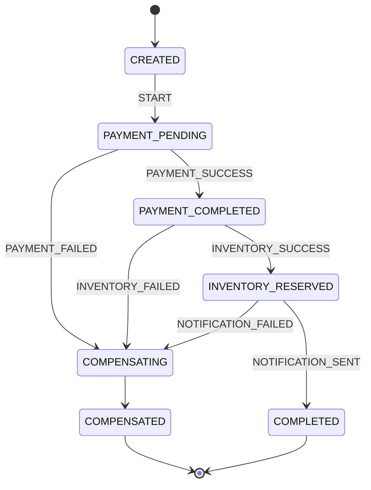

# 🔄 Distributed Transactions & Saga Pattern — Complete Deep Dive

[🎨 Interactive Visualization](../../../html/06-saga-pattern-transactions-viz.html)

**Related**: [Architecture Patterns](/16-microservices/01-architecture-patterns.md) · [CQRS & Event Sourcing](/16-microservices/07-observability-monitoring.md) · [Resilience Patterns](/16-microservices/05-circuit-breaker-resilience.md)

---

## Table of Contents


- [The Distributed Transaction Problem](#-the-distributed-transaction-problem)
- [1. Two-Phase Commit (2PC)](#1-two-phase-commit-2pc)
- [2. Saga Pattern Overview](#2-saga-pattern-overview)
- [3. Choreography-Based Saga](#3-choreography-based-saga)
- [4. Orchestration-Based Saga](#4-orchestration-based-saga)
- [5. Rollback & Compensating Transactions](#5-rollback--compensating-transactions)
- [6. Saga Implementation with Kafka](#6-saga-implementation-with-kafka)
- [7. Saga Implementation with Camunda](#7-saga-implementation-with-camunda)
- [Comparison: Choreography vs Orchestration](#-comparison-choreography-vs-orchestration)
- [Simplest Mental Model](#-simplest-mental-model)

---

## Distributed Saga Transaction Flow

```mermaid
sequenceDiagram
    participant Client
    participant Order as Order Service
    participant Payment as Payment Service
    participant Inventory as Inventory Service
    participant Notify as Notification Service
    
    Client->>Order: 1. Create Order
    Order->>Payment: 2. Charge Payment
    alt Payment Success
        Payment-->>Order: Charged
        Order->>Inventory: 3. Reserve Inventory
        alt Inventory Success
            Inventory-->>Order: Reserved
            Order->>Notify: 4. Send Confirmation
            Notify-->>Order: Sent
            Order-->>Client: Order Complete ✓
        else Inventory Fails
            Inventory-->>Order: Failed
            Order->>Payment: Compensate: Refund
            Payment-->>Order: Refunded
            Order-->>Client: Order Failed (inventory)
        end
    else Payment Fails
        Payment-->>Order: Failed
        Order-->>Client: Order Failed (payment)
    end
    
    style Client fill:#60a5fa
    style Order fill:#fbbf24
    style Payment fill:#34d399
    style Inventory fill:#34d399
    style Notify fill:#34d399
```

---

## 🧭 The Distributed Transaction Problem


```text
Monolith — easy:
  BEGIN TRANSACTION;
    UPDATE inventory SET stock = stock - 1 WHERE product_id = 123;
    INSERT INTO orders (user_id, product_id) VALUES (1, 123);
    INSERT INTO payments (order_id, amount) VALUES (456, 99.99);
  COMMIT;  -- All succeed OR all rollback. Simple.

Microservices — hard:
  ┌──────────────┐    ┌──────────────┐    ┌──────────────┐
  │ Order Service│    │Payment Service│    │Inventory Svc │
  │ (PostgreSQL) │    │ (MySQL)      │    │ (MongoDB)    │
  └──────────────┘    └──────────────┘    └──────────────┘
         │                   │                   │
         ├── 1. Create Order│                   │
         │ 2. ──────────────────> Charge Card   │
         │                   │ 3. ───────────────────> Reserve
         │                   │                   │
  ❌ What if payment succeeds but inventory fails?
  ❌ What if order created but payment times out?
  ❌ No cross-database transaction possible!
```

---

## 1. Two-Phase Commit (2PC)


```text
2PC tries to solve this with a coordinator:

Phase 1: Prepare
  Coordinator ──── Can you commit? ────> Service A
  Coordinator ──── Can you commit? ────> Service B
  Coordinator ──── Can you commit? ────> Service C
                 ┌─ Yes (ready)
                 └─ No  (abort all)

Phase 2: Commit
  If all YES → Coordinator ──── COMMIT ────> All services
  If any NO  → Coordinator ──── ROLLBACK ───> All services

Problems with 2PC:
  • Coordinator is a SPOF
  • Locks held during Phase 1 → low concurrency
  • Not supported by NoSQL, message brokers
  • Not supported across different DB types
  • Slow (multiple network round trips)

➜ Use Saga pattern instead!
```

---

## 2. Saga Pattern Overview


### What is a Saga?


```text
A saga is a sequence of local transactions. Each transaction updates
data within a single service and publishes an event. If a step fails,
the saga executes compensating transactions to undo earlier steps.

Order Flow (Success):
  ┌────────┐   ┌────────┐   ┌────────┐   ┌────────┐
  │ Order  │──>│Payment │──>│Inventory│──>│Notif.  │
  │Created │   │Charged │   │Reserved │   │Sent    │
  └────────┘   └────────┘   └────────┘   └────────┘

Order Flow (Failure - Payment fails:
  ┌────────┐   ┌────────┐
  │ Order  │──>│Payment │   ──✗ FAILED
  │Created │   │Charged │
  └────────┘   └────────┘
       │
       ▼  Compensate
  ┌────────┐
  │ Order  │
  │Rejected│  ← Cancel the order
  └────────┘

Order Flow (Failure - Inventory fails after payment):
  ┌────────┐   ┌────────┐   ┌────────┐
  │ Order  │──>│Payment │──>│Inventory│  ──✗ FAILED
  │Created │   │Charged │   │Reserved │
  └────────┘   └────────┘   └────────┘
                    │            │
                    ▼            ▼
               ┌────────┐   ┌────────────┐
               │Payment │   │ Order      │
               │Refunded│   │ Cancelled  │
               └────────┘   └────────────┘
  (compensating transactions)
```

---

## 3. Choreography-Based Saga


### How It Works


```text
No central coordinator. Each service listens for events and acts.

  Order Service                 Payment Service           Inventory Service
       │                             │                         │
       │  1. Create Order            │                         │
       ├─── OrderCreated ────────────>│                         │
       │   (event)                    │                         │
       │                             │  2. Charge Customer      │
       │                             ├─── PaymentSucceeded ─────>│
       │                             │   (event)                 │
       │                             │                          │  3. Reserve
       │                             │                          ├─── StockReserved
       │                             │                          │   (event)
       │  ◄──────────────────────────┘                          │
       │  ◄─────────────────────────────────────────────────────┘
       │  4. Update Order Status                                │
       │                                                       │
       │         All happy path events flow through Kafka       │
```

### Code: Choreography Saga


```java
// === ORDER SERVICE ===
// Step 1: Create order and publish event
@Service
public class OrderSagaParticipant {

    private final OrderRepository orderRepository;
    private final KafkaTemplate<String, Object> kafka;

    @Transactional
    public Order createOrder(CreateOrderRequest request) {
        Order order = new Order(request);
        order.setStatus(OrderStatus.PENDING);
        order = orderRepository.save(order);

        // Publish event — others will react
        kafka.send("saga-orders", new OrderCreatedEvent(
            order.getId(), order.getCustomerId(),
            order.getTotal(), order.getItems()));

        return order;
    }

    // Listen for compensating events
    @KafkaListener(topics = "saga-compensations")
    public void handleCompensation(SagaCompensationEvent event) {
        if ("ORDER".equals(event.getService())) {
            Order order = orderRepository.findById(event.getOrderId()).orElseThrow();
            order.setStatus(OrderStatus.CANCELLED);
            order.setCancellationReason(event.getReason());
            orderRepository.save(order);
            log.warn("Order {} cancelled due to saga compensation", order.getId());
        }
    }
}

// === PAYMENT SERVICE ===
// Step 2: Listen for OrderCreated, process payment
@Service
public class PaymentSagaParticipant {

    private final PaymentRepository paymentRepository;
    private final KafkaTemplate<String, Object> kafka;

    @KafkaListener(topics = "saga-orders")
    public void handleOrderCreated(OrderCreatedEvent event) {
        try {
            // Process payment
            Payment payment = new Payment();
            payment.setOrderId(event.getOrderId());
            payment.setAmount(event.getTotal());
            payment.setStatus(PaymentStatus.SUCCEEDED);
            paymentRepository.save(payment);

            // Publish success event
            kafka.send("saga-payments", new PaymentSucceededEvent(
                event.getOrderId(), payment.getId()));

        } catch (Exception e) {
            log.error("Payment failed for order {}", event.getOrderId(), e);

            // Publish failure event — triggers compensation
            kafka.send("saga-compensations", new SagaCompensationEvent(
                event.getOrderId(), "PAYMENT", "Payment processing failed: " + e.getMessage()));
        }
    }

    // Compensating action: refund
    @KafkaListener(topics = "saga-compensations")
    public void handleCompensation(SagaCompensationEvent event) {
        if ("INVENTORY".equals(event.getService())) {
            // Payment needs to be refunded
            Payment payment = paymentRepository.findByOrderId(event.getOrderId());
            if (payment != null && payment.getStatus() == PaymentStatus.SUCCEEDED) {
                payment.setStatus(PaymentStatus.REFUNDED);
                paymentRepository.save(payment);
                log.info("Payment {} refunded due to saga", payment.getId());
            }
        }
    }
}

// === INVENTORY SERVICE ===
// Step 3: Listen for PaymentSucceeded, reserve stock
@Service
public class InventorySagaParticipant {

    private final InventoryRepository inventoryRepository;
    private final KafkaTemplate<String, Object> kafka;

    @KafkaListener(topics = "saga-payments")
    public void handlePaymentSucceeded(PaymentSucceededEvent event) {
        try {
            // Reserve inventory
            List<OrderItem> items = getOrderItems(event.getOrderId());
            for (OrderItem item : items) {
                inventoryRepository.reserve(item.getProductId(), item.getQuantity());
            }

            // All good — publish success
            kafka.send("saga-inventory", new InventoryReservedEvent(event.getOrderId()));

        } catch (Exception e) {
            log.error("Inventory reservation failed", e);

            // Trigger compensation for payment and order
            kafka.send("saga-compensations", new SagaCompensationEvent(
                event.getOrderId(), "INVENTORY", "Insufficient stock"));
        }
    }
}

// === ORDER SERVICE (completion) ===
// Listen for inventory success, finalize
@Component
public class OrderCompletionListener {

    private final OrderRepository orderRepository;

    @KafkaListener(topics = "saga-inventory")
    public void handleInventoryReserved(InventoryReservedEvent event) {
        Order order = orderRepository.findById(event.getOrderId()).orElseThrow();
        order.setStatus(OrderStatus.CONFIRMED);
        orderRepository.save(order);
        log.info("Order {} confirmed!", order.getId());
    }
}
```

---

## 4. Orchestration-Based Saga


### How It Works


```text
Central Saga Coordinator controls the flow:

                ┌─────────────────────────────┐
                │    Saga Orchestrator          │
                │    (OrderSagaManager)         │
                └──────┬──────┬───────┬────────┘
                       │      │       │
              ┌────────┘      │       └──────────┐
              ▼               ▼                  ▼
       ┌────────────┐  ┌────────────┐  ┌──────────────┐
       │ Order Svc  │  │Payment Svc │  │ Inventory Svc│
       └────────────┘  └────────────┘  └──────────────┘

Flow:
   Orchestrator              Services
       │                        │
       │  1. Create Order ──────>│
       │  ◄── Order Created ────│
       │                        │
       │  2. Process Payment ───>│
       │  ◄── Payment Done ─────│
       │                        │
       │  3. Reserve Stock ─────>│
       │  ◄── Stock Reserved ───│
       │                        │
       │  4. Confirm Order ─────>│
       │  ◄── Order Confirmed ──│
       │                        │
```

### Code: Orchestrator Saga


```java
// Step 1: Define saga steps
public class OrderSaga {

    private final Long orderId;
    private final Long customerId;
    private final List<OrderItem> items;
    private final Money total;

    // State
    private OrderSagaStatus status;
    private String failureReason;

    public enum Step {
        CREATE_ORDER,
        PROCESS_PAYMENT,
        RESERVE_INVENTORY,
        SEND_NOTIFICATION
    }

    // Constructor, getters
    public void fail(String reason) {
        this.status = OrderSagaStatus.FAILED;
        this.failureReason = reason;
    }
}

// Step 2: Orchestrator
@Service
public class OrderSagaOrchestrator {

    private final Map<Long, OrderSaga> activeSagas = new ConcurrentHashMap<>();

    private final OrderServiceClient orderClient;
    private final PaymentServiceClient paymentClient;
    private final InventoryServiceClient inventoryClient;
    private final NotificationServiceClient notificationClient;

    public OrderSagaOrchestrator(OrderServiceClient orderClient,
                                 PaymentServiceClient paymentClient,
                                 InventoryServiceClient inventoryClient,
                                 NotificationServiceClient notificationClient) {
        this.orderClient = orderClient;
        this.paymentClient = paymentClient;
        this.inventoryClient = inventoryClient;
        this.notificationClient = notificationClient;
    }

    @Transactional
    public void startSaga(CreateOrderRequest request) {
        OrderSaga saga = new OrderSaga(request);
        activeSagas.put(saga.getOrderId(), saga);

        try {
            // Step 1: Create Order
            OrderDTO order = orderClient.createOrder(request);
            saga.setOrderId(order.getId());

            // Step 2: Process Payment
            PaymentResult payment = paymentClient.charge(
                order.getId(), order.getTotal());

            // Step 3: Reserve Inventory
            inventoryClient.reserve(order.getId(), order.getItems());

            // Step 4: Send Notification
            notificationClient.sendConfirmation(order.getId(), order.getCustomerId());

            // All steps succeeded
            orderClient.confirmOrder(order.getId());
            saga.setStatus(OrderSagaStatus.COMPLETED);

        } catch (Exception e) {
            log.error("Saga failed for order request", e);
            compensate(saga, e.getMessage());
        }
    }

    private void compensate(OrderSaga saga, String reason) {
        log.warn("Compensating saga for order {}", saga.getOrderId());

        // Execute compensating actions in REVERSE order
        try { notificationClient.undo(saga.getOrderId()); } catch (Exception e) { /* log */ }
        try { inventoryClient.undoReservation(saga.getOrderId()); } catch (Exception e) { /* log */ }
        try { paymentClient.refund(saga.getOrderId()); } catch (Exception e) { /* log */ }
        try { orderClient.cancelOrder(saga.getOrderId()); } catch (Exception e) { /* log */ }

        saga.setStatus(OrderSagaStatus.COMPENSATED);
        saga.setFailureReason(reason);
    }
}

// Step 3: Client interfaces (Feign clients)
@FeignClient("order-service")
public interface OrderServiceClient {
    @PostMapping("/api/orders")
    OrderDTO createOrder(@RequestBody CreateOrderRequest request);

    @PostMapping("/api/orders/{id}/confirm")
    void confirmOrder(@PathVariable Long id);

    @PostMapping("/api/orders/{id}/cancel")
    void cancelOrder(@PathVariable Long id);
}

@FeignClient("payment-service")
public interface PaymentServiceClient {
    @PostMapping("/api/payments")
    PaymentResult charge(@RequestParam Long orderId, @RequestParam Money amount);

    @PostMapping("/api/payments/{id}/refund")
    void refund(@PathVariable Long orderId);
}

@FeignClient("inventory-service")
public interface InventoryServiceClient {
    @PostMapping("/api/inventory/reserve")
    void reserve(@RequestParam Long orderId, @RequestBody List<OrderItem> items);

    @PostMapping("/api/inventory/undo")
    void undoReservation(@RequestParam Long orderId);
}
```

### State Machine Saga


```java
@Component
public class StateMachineSaga {

    private final StateMachine<OrderSagaStates, OrderSagaEvents> stateMachine;

    public StateMachineSaga(StateMachine<OrderSagaStates, OrderSagaEvents> stateMachine) {
        this.stateMachine = stateMachine;
    }

    public void startSaga(Long orderId) {
        stateMachine.start();
        stateMachine.sendEvent(OrderSagaEvents.START, new SagaContext(orderId));
    }

    public void onPaymentCompleted(Long orderId) {
        stateMachine.sendEvent(OrderSagaEvents.PAYMENT_SUCCESS, new SagaContext(orderId));
    }

    public void onPaymentFailed(Long orderId) {
        stateMachine.sendEvent(OrderSagaEvents.PAYMENT_FAILED, new SagaContext(orderId));
    }
}

enum OrderSagaStates {
    CREATED, PAYMENT_PENDING, PAYMENT_COMPLETED,
    INVENTORY_RESERVED, COMPLETED,
    COMPENSATING, COMPENSATED, FAILED
}

enum OrderSagaEvents {
    START, PAYMENT_SUCCESS, PAYMENT_FAILED,
    INVENTORY_SUCCESS, INVENTORY_FAILED,
    COMPENSATE
}
```



---

## 5. Rollback & Compensating Transactions


### Compensating Actions Table


| Forward Action | Compensating Action | Idempotent? |
|---------------|-------------------|-------------|
| Create Order | Cancel Order | Yes |
| Charge Payment | Refund Payment | Yes |
| Reserve Inventory | Release Inventory | Yes |
| Send Email | (No action needed) | N/A |
| Book Hotel | Cancel Booking | Yes |
| Add Loyalty Points | Remove Points | Yes |
| Update Credit Score | Revert Score | Yes |
| Ship Package | Initiate Return | No (manual) |

### Idempotency Keys


```java
// Every compensating action must be idempotent — running it twice
// should have the same effect as running it once.

@Service
public class IdempotentPaymentService {

    private final Set<String> processedRefunds = ConcurrentHashMap.newKeySet();

    @Transactional
    public void refund(String orderId) {
        String idempotencyKey = "refund-" + orderId;

        // Check if already processed
        if (processedRefunds.contains(idempotencyKey)) {
            log.info("Refund for {} already processed, skipping", orderId);
            return;
        }

        // Process refund
        Payment payment = paymentRepository.findByOrderId(orderId);
        if (payment != null && payment.getStatus() == PaymentStatus.SUCCEEDED) {
            payment.setStatus(PaymentStatus.REFUNDED);
            paymentRepository.save(payment);
        }

        // Mark as processed
        processedRefunds.add(idempotencyKey);
    }
}
```

---

## 6. Saga Implementation with Kafka


### Event Schema


```java
// Generic saga event
public class SagaEvent {
    private String sagaId;
    private String eventType;       // ORDER_CREATED, PAYMENT_SUCCESS, etc.
    private String service;         // which service produced it
    private String status;          // SUCCESS, FAILURE, COMPENSATE
    private Instant timestamp;
    private Map<String, Object> payload;
    private String failureReason;
}
```

### Saga State Store


```java
@Component
public class SagaStateStore {

    private final Map<String, SagaState> sagas = new ConcurrentHashMap<>();

    public SagaState create(String sagaId) {
        SagaState state = new SagaState(sagaId);
        sagas.put(sagaId, state);
        return state;
    }

    public void recordStep(String sagaId, String step, boolean success) {
        SagaState state = sagas.get(sagaId);
        if (state != null) {
            state.recordStep(step, success);
            state.setLastUpdated(Instant.now());
        }
    }

    public void complete(String sagaId) {
        SagaState state = sagas.get(sagaId);
        if (state != null) state.setStatus(SagaStatus.COMPLETED);
    }

    public void fail(String sagaId, String reason) {
        SagaState state = sagas.get(sagaId);
        if (state != null) {
            state.setStatus(SagaStatus.FAILED);
            state.setFailureReason(reason);
        }
    }

    public SagaState get(String sagaId) {
        return sagas.get(sagaId);
    }
}
```

---

## 7. Saga Implementation with Camunda


### BPMN Process


```xml
<!-- saga-process.bpmn -->
<?xml version="1.0" encoding="UTF-8"?>
<bpmn:definitions>
  <bpmn:process id="orderSaga" isExecutable="true">
    <bpmn:startEvent id="start" />
    <bpmn:serviceTask id="createOrder" name="Create Order"
      camunda:delegateExpression="${createOrderDelegate}" />
    <bpmn:serviceTask id="processPayment" name="Process Payment"
      camunda:delegateExpression="${processPaymentDelegate}" />
    <bpmn:serviceTask id="reserveInventory" name="Reserve Inventory"
      camunda:delegateExpression="${reserveInventoryDelegate}" />
    <bpmn:endEvent id="end" />

    <!-- Compensate path -->
    <bpmn:boundaryEvent id="paymentError" attachedToRef="processPayment">
      <bpmn:errorEventDefinition />
    </bpmn:boundaryEvent>
    <bpmn:serviceTask id="cancelOrder" name="Cancel Order"
      camunda:delegateExpression="${cancelOrderDelegate}" />
  </bpmn:process>
</bpmn:definitions>
```

### Java Delegates


```java
@Component
public class CreateOrderDelegate implements JavaDelegate {
    @Override
    public void execute(DelegateExecution execution) throws Exception {
        CreateOrderRequest request = (CreateOrderRequest)
            execution.getVariable("request");
        OrderDTO order = orderService.createOrder(request);
        execution.setVariable("orderId", order.getId());
    }
}

@Component
public class CancelOrderDelegate implements JavaDelegate {
    @Override
    public void execute(DelegateExecution execution) throws Exception {
        Long orderId = (Long) execution.getVariable("orderId");
        orderService.cancelOrder(orderId);
        log.info("Compensating: Order {} cancelled", orderId);
    }
}
```

---

## 📊 Comparison: Choreography vs Orchestration


| Aspect | Choreography | Orchestration |
|--------|-------------|---------------|
| Coordinator | None (distributed) | Central orchestrator |
| Complexity | Lower per service | Higher (orchestrator) |
| Coupling | Event contracts only | Depends on orchestrator |
| Visibility | Hard (follow events) | Easy (orchestrator state) |
| Adding steps | Just listen to new events | Update orchestrator logic |
| Testing | Complex (event chains) | Simpler (mock services) |
| Failure handling | Distributed compensation | Centralized compensation |
| Rollback | Services compensate themselves | Orchestrator coordinates |
| Best for | Simple, linear workflows | Complex, branching workflows |
| Example | Order → Payment → Inventory | Loan approval, multi-step |

---

## 🧠 Simplest Mental Model


```text
SAGA          =  A group of friends going to dinner.
                 Step 1: Reserve table (Host)
                 Step 2: Order food (Server)
                 Step 3: Pay bill (Cashier)
                 Step 4: Split bill (Friends)

                 If Step 3 fails (card declined):
                 → Step 2: Send food back (compensate)
                 → Step 1: Cancel reservation (compensate)
                 Everything is undone gracefully.

2PC           =  A hostage negotiation. Everyone must agree FIRST
                 (Phase 1: Prepare), THEN everyone commits.
                 "Everyone ready? OK, GO!" Slow, rigid.

SAGA vs 2PC   =  Saga = neighborhood watch. Each neighbor does their
                 part and tells the next. If something goes wrong,
                 neighbors call each other to fix it.

                 2PC = military drill. "READY... AIM... FIRE!"
                 All or nothing. If one misfires, everyone resets.

CHOREOGRAPHY  =  Dancing without a choreographer. Each dancer knows
                 their steps and reacts to others' movements.

ORCHESTRATION =  A conductor leads the orchestra. All musicians
                 follow the conductor's baton.

COMPENSATING  =  "Undo" button for real-world transactions.
TRANSACTION      Can't just "rollback" a shipped package.
                 Instead: initiate return, process refund.

IDEMPOTENT    =  Pressing the elevator button multiple times.
                 Same effect as pressing it once.
                 Prevents double charges if the saga
                 retries a step.
```

---

**Next**: [CQRS & Event Sourcing](/16-microservices/07-observability-monitoring.md)

## Related

- [Cap Consistency](/09-distributed-systems/01-cap-consistency.md)
- [Consensus Replication](/09-distributed-systems/01-consensus-replication.md)
- [Consensus Raft](/09-distributed-systems/02-consensus-raft.md)
- [Distributed Transactions](/09-distributed-systems/02-distributed-transactions.md)
- [Distributed Caching](/09-distributed-systems/03-distributed-caching.md)
- [Distributed Storage](/09-distributed-systems/03-distributed-storage.md)
