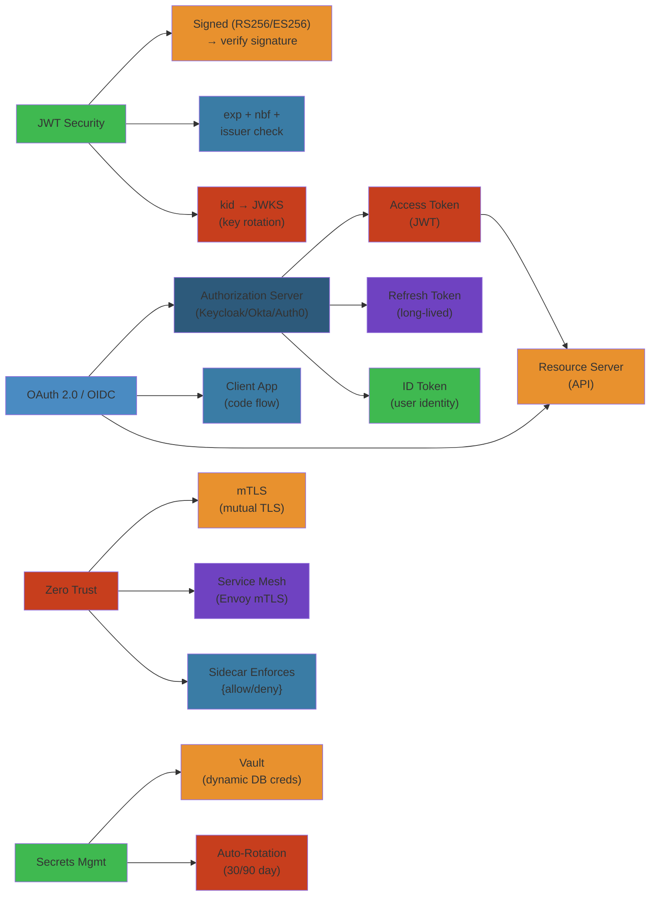

# 🔐 Microservices Security — Complete Deep Dive




## Table of Contents


- [1. OAuth 2.0 & OIDC](#1-oauth-20--oidc)
- [2. JWT Deep Dive](#2-jwt-deep-dive)
- [3. Token Security](#3-token-security)
- [4. Zero Trust](#4-zero-trust)
- [5. API Gateway Security](#5-api-gateway-security)
- [6. Secrets Management](#6-secrets-management)
- [7. Access Control](#7-access-control)
- [8. API Security Special Topics](#8-api-security-special-topics)
- [Simplest Mental Model](#simplest-mental-model)

---

## 1. OAuth 2.0 & OIDC


### Roles & Flows


```text
┌─────────┐        ┌─────────────┐        ┌─────────┐
│ Resource│        │ Authorization│        │ Client │
│ Owner   │───────▶│ Server (AS) │◀───────│ (App)  │
│ (User)  │        │             │        │        │
└─────────┘        └──────┬──────┘        └─────────┘
                          │
                          ▼
                   ┌──────────────┐
                   │  Resource    │
                   │  Server (API)│
                   └──────────────┘
```

| Role                | Description                       | Example          |
|---------------------|-----------------------------------|------------------|
| Resource Owner      | Entity granting access            | End-user         |
| Client              | App requesting access             | SPA, mobile, CLI |
| Authorization Server| Issues tokens after auth          | Keycloak, Auth0  |
| Resource Server     | Validates tokens, serves API      | Your microservice|

### Authorization Code + PKCE (SPAs)


```text
Browser → SPA:        Click login → generate code_verifier + code_challenge
SPA → AS:             Redirect with ?response_type=code&code_challenge=<sha256>
User → AS:            Authenticate & consent
AS → SPA:             Authorization code
SPA → AS:             POST /token with code_verifier
AS → SPA:             access_token + id_token + refresh_token
```

### Client Credentials (M2M)


```text
Backend → AS:   POST /token with client_id + client_secret + grant_type
AS → Backend:   access_token
Backend → API:  GET /orders with Bearer token
```

### Device Code (TV/CLI)


```text
Device → AS:   POST /device_code → get user_code + verification_uri
User → Browser: Enter code at URL, approve
Device → AS:   Poll POST /token until approved → get access_token
```

### OIDC (Identity Layer)


```json
// GET /.well-known/openid-configuration
{
  "issuer": "https://auth.example.com",
  "authorization_endpoint": "https://auth.example.com/auth",
  "jwks_uri": "https://auth.example.com/.well-known/jwks.json",
  "scopes_supported": ["openid", "profile", "email"],
  "id_token_signing_alg_values_supported": ["RS256", "ES256"]
}
```

Scope `openid` is required for `id_token`. Userinfo endpoint returns additional claims.

---

## 2. JWT Deep Dive


### Structure


```text
JWT = Header.Payload.Signature

Header:    {"alg": "RS256", "kid": "p1", "typ": "JWT"}
Payload:   {"iss": "https://auth.ex", "sub": "123", "aud": "api",
            "exp": 1516242622, "iat": 1516239022, "jti": "unique"}
Signature: RSA(SHA256(base64(header) + "." + base64(payload)))
```

### Standard Claims


| Claim | Name          | Description                              |
|-------|---------------|------------------------------------------|
| `iss` | Issuer        | Who issued the token                     |
| `sub` | Subject       | User identifier (never reused)           |
| `aud` | Audience      | Intended recipient (API identifier)      |
| `exp` | Expiration    | Expiry Unix timestamp                    |
| `iat` | Issued At     | When issued                              |
| `jti` | JWT ID        | Unique ID (prevents replay)              |
| `kid` | Key ID        | Which JWK key signed this                |

### JWK Key Set & Rotation


```json
{
  "keys": [
    {"kty": "RSA", "kid": "p1", "use": "sig", "n": "0vx7...", "e": "AQAB"},
    {"kty": "RSA", "kid": "p2", "use": "sig", "n": "1wxy...", "e": "AQAB"}
  ]
}
```

Rotation: add new key to JWKS, start signing with it, remove old after TTL.

---

## 3. Token Security


### HMAC vs RSA vs ECDSA


```text
HMAC (HS256):   Shared secret sign + verify  — ⚠️ never use with public verifiers
RSA (RS256):    Private sign, public verify   — ✅ standard choice
ECDSA (ES256):  EC private sign, EC public    — ✅ smaller keys, faster
```

### Attacks


| Attack               | Defense                                               |
|----------------------|-------------------------------------------------------|
| Algorithm confusion  | Reject `alg: none`, validate alg against allowlist    |
| kid injection        | Don't use kid in file paths without sanitization      |
| jku attack           | Disable dynamic JWKS URLs                             |
| Replay               | Short exp, jti uniqueness, nonce                      |

### Token Storage


```text
SPA:     httpOnly + Secure + SameSite=Strict cookie ✅
         localStorage / sessionStorage ❌ (XSS vulnerable)
Mobile:  iOS Keychain / Android Keystore ✅
Backend: In-memory or encrypted DB, short expiry
```

### Revocation


```text
1. Revocation list: Redis SET jti:xxx "" EX 3600, check per request
2. Introspection:   POST /introspect {token}, AS returns active: bool
3. Opaque tokens:   Random ID → immediate revocation by deleting from DB
4. Short expiry:    Access token 5 min, rotate refresh token on use
```

---

## 4. Zero Trust


### Principles


```text
"Never trust, always verify."
  • All traffic untrusted (even inside network)
  • Every request authenticated
  • Least privilege access
  • Micro-segmentation (breach stops at service boundary)
  • All traffic encrypted (mTLS)
```

### mTLS


```text
Standard TLS: Client verifies server cert only
mTLS:         Client + Server both present certs (mutual verification)
```

### SPIFFE/SPIRE


```text
Identity: spiffe://trust-domain/ns/default/sa/payment-service
Agent on each node → attests workload → Server issues SVID (X.509/JWT)
```

### Service Mesh Comparison


| Feature       | Istio          | Linkerd        | Consul        | Cilium       |
|---------------|----------------|----------------|---------------|--------------|
| Data plane    | Envoy          | Linkerd-proxy  | Envoy         | eBPF         |
| mTLS          | ✓ auto rotate  | ✓              | ✓             | ✓            |
| Performance   | Higher overhead| Low            | Medium        | Lowest (eBPF)|
| L7 mgmt       | Full           | HTTP/gRPC/TCP  | L4 + basic L7 | Full L3-L7   |

---

## 5. API Gateway Security


### WAF & OWASP Top 10


```yaml
waf:
  rules:
    - SQL injection: block
    - XSS: block
    - Path traversal: block
    - Rate limit: 100 req/s per client
    - Body size limit: 1MB
```

### Rate Limiting Algorithms


```text
Token Bucket:  Capacity=100, refill=10/s → burst up to 100, steady 10/s
Sliding Window: Log timestamps per window, drop if count > limit
Leaky Bucket:   Fixed queue + steady outflow, drop if full
```

### CORS, CSP, HSTS


```yaml
Access-Control-Allow-Origin: https://app.example.com
Content-Security-Policy: default-src 'self'; script-src 'self'
Strict-Transport-Security: max-age=31536000; includeSubDomains
```

---

## 6. Secrets Management


### HashiCorp Vault


```text
App → Vault: auth (approle/kubernetes) → token
App → Vault: read secret (kv engine)
Vault → App: secret value
```

| Engine      | Purpose                                           |
|-------------|---------------------------------------------------|
| `kv`        | Key-value storage (v1/v2 with versioning)         |
| `transit`   | Encryption-as-a-service, no secret leaving Vault  |
| `pki`       | Dynamic X.509 cert generation                     |
| `database`  | Dynamic DB credentials, auto-rotated              |
| `aws`       | Dynamic AWS IAM credentials                       |

### Kubernetes Secrets


```yaml
# External Secrets Operator
apiVersion: external-secrets.io/v1beta1
kind: ExternalSecret
spec:
  secretStoreRef: { name: vault-backend, kind: SecretStore }
  target: { name: db-creds }
  data:
    - secretKey: password
      remoteRef: { key: secret/data/database, property: password }

# Sealed Secrets: encrypt in git, decrypt only by controller in cluster
# SOPS: encrypt fields in YAML, decrypt with KMS key
```

### Password Hashing


| Algorithm  | Memory-hard | Recommended for     |
|------------|-------------|---------------------|
| bcrypt     | No          | Legacy systems      |
| scrypt     | Yes         | Better alternative  |
| argon2id   | Yes         | ✅ Best (2026)     |
| PBKDF2     | No          | FIPS compliance     |

```java
// argon2id (current best practice)
Argon2 argon2 = Argon2Factory.create();
String hash = argon2.hash(2, 65536, 1, password);
```

---

## 7. Access Control


### RBAC vs ABAC


```text
RBAC: Alice has role=admin → write:* permissions
      Bob has role=viewer → read:* permissions

ABAC: Allow if user.department == resource.department
      AND request.time between 09:00 and 17:00
      AND resource.classification == "internal"
```

| Aspect       | RBAC                         | ABAC                        |
|--------------|------------------------------|-----------------------------|
| Complexity   | Simple                       | Complex policy engine       |
| Granularity  | Coarse (role-level)          | Fine (attribute-level)      |
| Flexibility  | New roles per scenario       | Policies combine attributes |
| Performance  | Fast (static lookup)         | Slower (attribute eval)     |

### API Keys


```text
Format: sk_live_a1b2c3d4e5f6g7h8i9j0k
Store:  SHA-256 hash, never log full key
Rotate: support overlap window (old + new both valid)
Limit:  per-key rate limiting
```

---

## 8. API Security Special Topics


### GraphQL Security


```python
# Depth limiting — prevent billion-laughs attack
MAX_DEPTH = 5  # reject queries deeper than 5 levels

# Query complexity — each field costs points
COMPLEXITY_LIMIT = 1000

# Batching — prevent N+1 with DataLoader
class UserLoader(DataLoader):
    def batch_load_fn(self, keys):
        return Promise.resolve(User.batch_find(keys))
```

### gRPC Security


```java
// TLS
Server server = ServerBuilder.forPort(8443)
    .useTransportSecurity(new File("server.crt"), new File("server.key"))
    .addService(new MyServiceImpl()).build();

// Auth interceptor
class AuthInterceptor implements ServerInterceptor {
    @Override
    public <ReqT, RespT> ServerCall.Listener<ReqT> interceptCall(
        ServerCall<ReqT, RespT> call, Metadata headers,
        ServerCallHandler<ReqT, RespT> next) {
        String token = headers.get(AuthorizationHeader);
        if (!validateToken(token)) {
            call.close(Status.UNAUTHENTICATED, new Metadata());
            return new NoopListener<>();
        }
        return next.startCall(call, headers);
    }
}
```

---

## Simplest Mental Model


**Security is a building with multiple locked doors.**

- **OAuth 2.0**: Hotel key system — front desk gives you a key that opens only certain doors (scopes) for a limited time (expiry).
- **JWT**: Laminated ID card with photo, access level, and expiration. Tamper-proof (signature) but anyone can read (Base64).
- **PKCE**: One-time puzzle on your key so a stolen auth code is useless.
- **Zero Trust / mTLS**: Every door checks ID, even if you're inside. No trust-by-location.
- **Vault**: Safety deposit box that dispenses keys when you prove who you are. Can generate auto-expiring temporary keys.
- **API Gateway**: Front security guard checking every visitor, limiting through-put, calling cops (WAF) on suspicious behavior.
- **Rate Limiting**: One person = 10 entries/minute. No, you can't bring 100 guests at once.
- **Argon2id**: A safe that's deliberately heavy and slow — brute-forcers give up.
- **The Core Principle**: Never trust the hallway. Verify at every door.


## Production Failure Modes


### Failure 1: JWT Secret Rotation Causes Widespread 401 Errors


| Aspect | Detail |
|--------|--------|
| **Symptoms** | All services return 401 after secret rotation. Users logged out globally. Support flooded with "can't log in" reports |
| **Root Cause** | JWT signed with old secret, services validate with new secret. No overlap period where both secrets are accepted. Rotation script deployed without staggered rollout |
| **Detection** | IDP logs show successful token issuance. Service logs show `signature verification failed`. Grafana: `jwt_validation_errors` spikes to 100% of requests |
| **Recovery** | Add old secret as secondary validation key in all services. Redeploy with `jwt.valid-signing-keys = [new_key, old_key]`. Invalidate only after all services have deployed |
| **Prevention** | Use JWKS endpoint (IDP serves multiple keys). Implement key overlap: new key active for validation immediately, old key valid for 2x token expiry duration. Automate rotation with Terraform + Vault |

### Failure 2: OAuth Token Leak Through Logs


| Aspect | Detail |
|--------|--------|
| **Symptoms** | Token appears in CloudWatch logs, ELK stack, and error reporting tools. Anyone with log access can impersonate the user |
| **Root Cause** | Application logs request headers for debugging. `Authorization: Bearer <token>` captured verbatim. Log retention policy allows months of access |
| **Detection** | Search logs for `"Authorization"`. Find JWT tokens in `trace` and `debug` level logs. CloudWatch Logs Insights: `fields @message | filter @message like /Bearer/` |
| **Recovery** | Rotate all tokens. Add log redaction: replace `Bearer\s+[A-Za-z0-9._-]+` with `Bearer [REDACTED]`. Restrict log access to on-call engineers only |
| **Prevention** | Never log Authorization header. Use structured logging with PII redaction (Logstash `fingerprint` filter, Fluentd `record_modifier`). Pre-commit hook to detect token patterns in test logs |

### Failure 3: API Gateway Rate Limiting Blocks Legitimate Traffic


| Aspect | Detail |
|--------|--------|
| **Symptoms** | 429 Too Many Requests returned for normal usage. Users report "site not working." Customer support sees spike |
| **Root Cause** | Rate limit calculated per IP but legitimate users share NAT IP (corporate VPN, office network). One heavy user triggers limit for all |
| **Detection** | API Gateway logs: `rateLimitExceeded` for multiple customer IDs from same IP. Rate limit exceeded for the `X-Forwarded-For` value |
| **Recovery** | Switch from per-IP to per-api-key rate limiting. Increase limit for known IP ranges. Whitelist corporate IPs temporarily |
| **Prevention** | Use per-user (API key) rate limiting, not per-IP. Implement token bucket with burst allowance. Return `Retry-After` header. Use sliding window instead of fixed window |

### Failure 4: mTLS Certificate Expiry in Production


| Aspect | Detail |
|--------|--------|
| **Symptoms** | Service-to-service communication fails. mTLS handshake fails with `certificate expired`. All east-west traffic blocked |
| **Root Cause** | Certificate issued 1 year ago, no monitoring. No auto-renewal. Service mesh (Istio/Linkerd) rejects expired cert at protocol level |
| **Detection** | Service logs: `x509: certificate has expired or is not yet valid`. Prometheus: `istio_requests_total{response_code="503"}` spikes. Grafana: `cert_expiry_days == 0` |
| **Recovery** | Issue new cert via cert-manager. Restart sidecar proxies to pick up new cert. Verify mTLS handshake with `openssl s_client -connect` |
| **Prevention** | Use cert-manager with auto-renewal (30 days before expiry). Monitor cert expiry: `cert_expiry_days` metric. Alert at T-45 days. Use short-lived certs (7 days) rotated every 24h |

### Failure 5: RBAC Overly Permissive — Any Service Can Read Any Secret


| Aspect | Detail |
|--------|--------|
| **Symptoms** | Compromised service A reads service B's database credentials. Lateral movement possible. No audit log of the access |
| **Root Cause** | RBAC roles use wildcard: `secrets:*`. No namespace isolation. Default deny not configured. Least privilege principle not followed |
| **Detection** | Vault audit log: `secret/data/db-credentials-b` read by service A. Kubernetes audit: service A's service account has `list secrets` across all namespaces |
| **Recovery** | Revoke over-permissive roles. Create per-service roles: `service-a-secrets-reader`, `service-b-secrets-reader`. Test each service independently |
| **Prevention** | Use Kubernetes RBAC with least privilege: `Role` (namespaced), not `ClusterRole`. Vault policy per service path. Use OPA/Gatekeeper for policy enforcement. Audit RBAC quarterly |

## Edge Cases


| Scenario | Challenge | Solution |
|----------|-----------|----------|
| **Token size exceeds header limit** | Large JWTs (>8KB) exceed proxy limits | Store claims in DB, use opaque token reference. Or use token compression (zlib) |
| **Clock skew in distributed systems** | JWT `nbf`/`exp` validation fails across DCs | Allow 300s clock skew in JWT validation. Use NTP with multiple sources |
| **OIDC provider down** | Login flow fails entirely | Cache IDP public keys (JWKS). Graceful degradation: allow already-issued tokens to work until their expiry |
| **Refresh token stolen** | Attacker maintains access after access token expires | Use refresh token rotation: issue new refresh token with each use, invalidate old one. Short refresh token lifetime |
| **Service mesh cert revocation** | Compromised cert not propagated to all proxies | Use short-lived certs (24h) instead of CRLs. CRLs are slow and complex in mesh environments |

## Cross-References


- [OAuth2 & JWT](/11-networking/02-http-protocols.md#oauth2--jwt) — Token exchange, introspection, revocation
- [Kubernetes Security](/07-kubernetes/04-kubernetes-security.md) — Service mesh mTLS, pod security policies, RBAC
- [API Gateway](/11-networking/03-dns-cdn-loadbalancing.md) — Rate limiting at edge, WAF integration
- [Backend Roadmap](/21-roadmaps/01-backend-engineer.md) — Phase 3+ security topics for senior engineers

## Related

- [Cap Consistency](/09-distributed-systems/01-cap-consistency.md)
- [Consensus Replication](/09-distributed-systems/01-consensus-replication.md)
- [Consensus Raft](/09-distributed-systems/02-consensus-raft.md)
- [Distributed Transactions](/09-distributed-systems/02-distributed-transactions.md)
- [Distributed Caching](/09-distributed-systems/03-distributed-caching.md)
- [Distributed Storage](/09-distributed-systems/03-distributed-storage.md)
