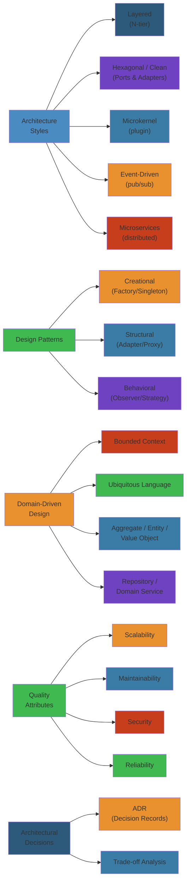
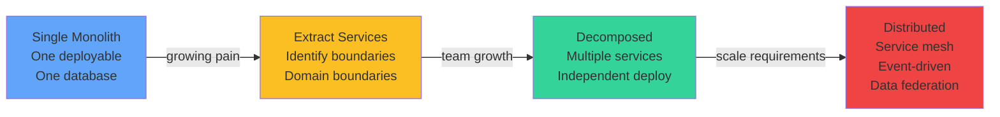
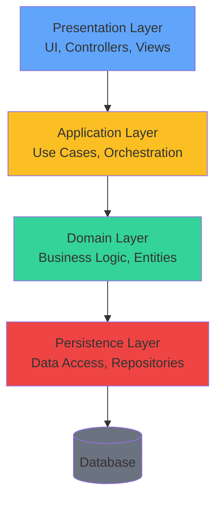
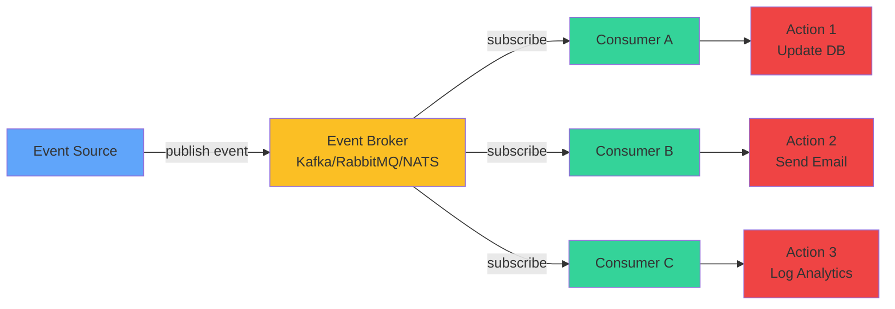

# Software Architecture — Complete Deep Dive 🏛️

Software architecture is the **high-level structure** of a system — the set of design decisions that shape how it's built, deployed, and evolved. Good architecture makes change easy; bad architecture makes every feature a nightmare.

**Related**: [Microservices](/16-microservices/README.md) · [System Design](/15-system-design/README.md) · [Design Patterns](/17-software-architecture/design-patterns/designpatterns.md) · [Domain-Driven Design](/05-cloud/README.md)

---




## Table of Contents

- [Architecture Fundamentals](#-architecture-fundamentals)
- [Design Patterns (GoF + Modern)](#1-design-patterns-gof--modern-)
- [Architecture Styles](#2-architecture-styles-)
- [Layered Architecture](#3-layered-architecture-)
- [Hexagonal / Clean / Onion Architecture](#4-hexagonal--clean--onion-architecture-)
- [CQRS & Event Sourcing](#5-cqrs--event-sourcing-)
- [Event-Driven Architecture](#6-event-driven-architecture-)
- [Domain-Driven Design](#7-domain-driven-design-)
- [Architectural Decision Records](#8-architectural-decision-records-)
- [Anti-Patterns](#9-anti-patterns-)
- [Architecture Evaluation](#10-architecture-evaluation-)
- [Quality Attributes](#11-quality-attributes-)
- [Documenting Architecture](#12-documenting-architecture-)
- [Learning Path](#-learning-path)
- [Related Domains](#-related-domains)
- [Simplest Mental Model](#-simplest-mental-model)

---

## 🎯 Architecture Fundamentals

### What is Software Architecture?
> "The set of structures needed to reason about the system, which comprises software elements, relations among them, and properties of both." — Bass, Clements, Kazman

### Why Architecture Matters
- **Enables (or blocks) change**: Good architecture makes adding features cheap
- **Drives quality attributes**: Performance, security, maintainability, scalability
- **Reduces complexity**: Break system into understandable pieces
- **Supports team structure**: Conway's Law — architecture mirrors organization
- **Manages risk**: Early decisions have highest impact

### Architecture vs Design
```
Architecture: Decisions that are hard to change later
  - System decomposition
  - Technology choices
  - Communication patterns
  - Deployment topology

Design: Decisions within an architectural decision
  - Class design
  - Algorithm choice
  - Data structure selection
  - Method signatures
```

---

## 1. Design Patterns (GoF + Modern) 🧩

### Creational Patterns
| Pattern | Purpose | Example |
|---------|---------|---------|
| **Singleton** | One instance, global access | Logger, config manager |
| **Factory Method** | Create objects via interface | `DocumentParserFactory` |
| **Abstract Factory** | Families of related objects | UI toolkit (Win/Mac/Linux) |
| **Builder** | Step-by-step object construction | SQL query builder, URL builder |
| **Prototype** | Clone existing objects | Cache object copying |
| **Object Pool** | Reuse expensive objects | DB connection pool, thread pool |

### Structural Patterns
| Pattern | Purpose | Example |
|---------|---------|---------|
| **Adapter** | Compatible interface for existing class | Database drivers |
| **Bridge** | Decouple abstraction from implementation | Device + Remote control |
| **Composite** | Tree structure of objects | UI component tree |
| **Decorator** | Add behavior dynamically | Middleware, I/O streams |
| **Facade** | Simplified interface to subsystem | SDK wrapper |
| **Flyweight** | Share fine-grained objects | Character rendering |
| **Proxy** | Surrogate for another object | Lazy loading, caching, AOP |

### Behavioral Patterns
| Pattern | Purpose | Example |
|---------|---------|---------|
| **Chain of Responsibility** | Pass request along handler chain | Middleware pipeline |
| **Command** | Encapsulate request as object | Undo/redo, queue operations |
| **Interpreter** | Grammar evaluation | Expression parsers |
| **Iterator** | Sequential access to collection | For-each loops |
| **Mediator** | Centralized communication | Chat room, UI dialog |
| **Memento** | Capture/restore object state | Save/load game |
| **Observer** | One-to-many dependency notification | Event listeners, pub/sub |
| **State** | Object behavior changes with state | Workflow state machine |
| **Strategy** | Interchangeable algorithms | Sorting, compression, auth |
| **Template Method** | Algorithm skeleton, subclasses fill | JUnit `setUp()/tearDown()` |
| **Visitor** | New operation on object structure | AST operations |

### Concurrency Patterns
| Pattern | Purpose | Modern Equivalent |
|---------|---------|-----------------|
| **Active Object** | Decouple method execution from invocation | Actor model |
| **Monitor Object** | Thread-safe method execution | `synchronized` / Lock |
| **Thread Pool** | Reuse worker threads | ExecutorService / goroutines |
| **Reactor** | Event demultiplexing + dispatch | epoll / kqueue / libevent |
| **Proactor** | Asynchronous operation completion | io_uring / I/O completion ports |
| **Scheduler** | Control task execution order | Work-stealing, rate limiter |
| **Two-phase Termination** | Graceful thread shutdown | Shutdown hooks |

### Modern/Enterprise Patterns
| Pattern | Source | Use Case |
|---------|--------|----------|
| **Inversion of Control (IoC)** | Framework pattern | Dependency injection containers |
| **Middleware** | Web frameworks | Authentication, logging, rate limiting |
| **Pipeline** | Data processing | ETL, CI/CD, stream processing |
| **Sidecar** | Sidecar deployment | Service mesh (Envoy, Linkerd) |
| **Ambassador** | Proxy service | Centralized rate limiting, auth |
| **Adapter (Message)** | Enterprise integration | Protocol translation between services |
| **Canary Release** | Deployment | Gradual rollout with monitoring |
| **Feature Toggle** | Deployment | Conditional feature enablement |
| **Strangler Fig** | Migration | Incremental monolith → microservices |
| **Outbox** | Data consistency | Reliable message publishing from DB |

---

## 2. Architecture Styles 📐

### Style Comparison
| Style | Deployability | Scalability | Modifiability | Complexity |
|-------|---------------|-------------|---------------|------------|
| Layered | Low | Low | Moderate | Low |
| MVC | Low | Low | Moderate | Low |
| Hexagonal | Moderate | Moderate | High | Moderate |
| CQRS | Moderate | High | High | Moderate |
| Event-Driven | High | High | High | High |
| Microservices | High | High | High | High |
| Serverless | High | High | Low | Moderate |
| Space-based | Moderate | Very High | Low | Very High |

### When to Use What
```
Layered / MVC        → Simple CRUD, monolith (start here)
Hexagonal / Clean    → Complex business logic, testability matters
CQRS                 → Read-heavy, different read/write patterns
Event-Driven         → Async decoupling, real-time, complex workflows
Microservices        → Large team, independent deployability needed
Serverless           → Event-driven, variable load, simple logic
Pipeline             → Data/ETL processing
Space-based          → Very high scalability (trading, gaming)
```

### Architecture Evolution Path



---

## 3. Layered Architecture 📚

### Traditional N-Tier (Visual)



### Traditional N-Tier (ASCII)
```
┌──────────────────────┐
│ Presentation Layer   │  UI, Controllers
├──────────────────────┤
│ Application Layer    │  Use cases, orchestration
├──────────────────────┤
│ Domain Layer         │  Business logic, entities
├──────────────────────┤
│ Persistence Layer    │  Data access, repositories
└──────────────────────┘
```

### Rules
- Dependencies flow inward (high → low level)
- Layer N can only depend on layer N-1 (strict layered)
- Or layer N can depend on any lower layer (relaxed layered)

### Pros
- Simple, familiar, well-understood
- Easy to test (mock below layers)
- Separation of concerns

### Cons
- Leaky abstraction (UI concerns in domain)
- Rigid (hard to skip layers)
- Becomes anemic if not careful
- Promotes monolithic deployment

---

## 4. Hexagonal / Clean / Onion Architecture 🧅

### Hexagonal (Ports and Adapters)
```
                      ┌──────────┐
     ┌────────────────┤  Domain  ├────────────────┐
     │                │  (Core)  │                │
     │                └──────────┘                │
     │                                            │
┌──────────┐                                ┌──────────┐
│ Inbound  │                                │ Outbound │
│ (Driven) │                                │ (Driver) │
│ Adapters │                                │ Adapters │
├──────────┤                                ├──────────┤
│ REST     │                                │ JPA/DB   │
│ gRPC     │                                │ HTTP     │
│ CLI      │                                │ Queue    │
│ WebSocket│                                │ File     │
└──────────┘                                └──────────┘
```

### Clean Architecture (Uncle Bob)
```
┌───────────────────────────────┐
│         Frameworks            │  Outer
│ ┌─────────────────────────┐   │
│ │     Interface Adapters  │   │
│ │ ┌───────────────────┐   │   │
│ │ │   Application     │   │   │
│ │ │ ┌─────────────┐   │   │   │
│ │ │ │   Domain    │   │   │   │
│ │ │ │  Entities   │   │   │   │
│ │ │ └─────────────┘   │   │   │
│ │ └───────────────────┘   │   │  Inner
│ └─────────────────────────┘   │
└───────────────────────────────┘
```

### Rules
- Dependency inversion: Inner layers define interfaces, outer layers implement
- Domain has zero external dependencies
- Use cases (application layer) orchestrate domain objects
- Frameworks are plugins, not core

### Onion Architecture (Jeffrey Palermo)
Similar to Clean — concentric circles, domain at center, dependency inversion outward.

### Benefits
- Testable: Domain tests need no infrastructure
- Replaceable: Swap DB, UI, or framework without touching core
- Framework-independent business logic
- Clear boundaries

---

## 5. CQRS & Event Sourcing 📝

### CQRS (Command Query Responsibility Segregation)
```
Command Model (Write)                Query Model (Read)
┌────────────────────┐               ┌────────────────────┐
│ Command Handler    │               │ Query Handler      │
│ Changes state      │               │ Reads state        │
│ Validates rules    │               │ No side effects    │
└────────┬───────────┘               └────────┬───────────┘
         │                                    │
         ▼                                    ▼
   Write DB (Normalized)               Read DB (Denormalized)
         │                                    ▲
         └────────── Synchronize ─────────────┘
```

### When CQRS Makes Sense
- Complex domain with different read/write shapes
- High read traffic (optimized read model)
- Different security perimeters for reads vs writes
- Team specialization (read team + write team)

### When NOT to Use CQRS
- Simple CRUD (just adds complexity)
- Single data shape (reads = writes)

### Event Sourcing
- **Store events, not state**
- Current state = fold over all past events
- Append-only event store (immutable log)
- `AccountCreated → MoneyDeposited → MoneyWithdrawn → AccountClosed`

### Events vs Current State
```
Traditional:  Account(balance=100)
Event Sourced: 
  AccountCreated(id=1)         → $0
  MoneyDeposited(id=1, $100)   → $100
  MoneyWithdrawn(id=1, $30)    → $70
```

### Benefits
- Complete audit trail
- Time travel (reconstruct state at any point)
- Temporal queries ("what was balance on Jan 1?")
- No object-relational impedance mismatch

### Limitations
- Event schema evolution (events are forever)
- Query performance (needs projections/snapshots)
- Learning curve

---

## 6. Event-Driven Architecture 📨

### Event Flow Diagram



### Concepts
- **Event**: Something significant that happened
- **Producer**: Emits events (doesn't know consumers)
- **Consumer**: Processes events (discovers via broker)
- **Broker**: Routes events (Kafka, RabbitMQ, NATS)
- **Channel**: Topic, queue, stream

### Event Types
```
Domain Event: Something that happened in the domain
  OrderPlaced, PaymentReceived, UserRegistered

Notification: Information to trigger action
  PriceDropAlert, MemoryAlmostFull

Integration Event: Cross-service communication
  OrderCreated { orderId, customerId, total }
```

### Event-Driven Topologies
```
Mediator Topology:
  Producer → Event Queue → Event Mediator → Channel → Consumer

Broker Topology:
  Producer → Broker → Consumer A
         → Broker → Consumer B
         → Broker → Consumer C
```

### Event Processing Patterns
| Pattern | Description | Example |
|---------|-------------|---------|
| Event Notification | Simple signal | "Order shipped" → send email |
| Event-Carried State Transfer | Full data in event | Order with items, total, address |
| Event Sourcing | Store events as truth | All state changes as events |
| CQRS with Events | Event-sourced + read projection | Payment system |

### Eventual Consistency
- Events are asynchronous
- Consumers may lag
- Readers may see stale state
- Acceptable for most business domains
- Not acceptable for financial reconciliation

---

## 7. Domain-Driven Design (DDD) 🗺️

### Core Concepts
```
Domain: The subject area the software addresses
Subdomain: A sub-area (core, supporting, generic)
Bounded Context: Explicit boundary within which a model applies
Ubiquitous Language: Shared language between domain experts and developers
Entity: Object with identity (not just attributes)
Value Object: Describes characteristics (no identity)
Aggregate: Cluster of entities + value objects treated as unit
Aggregate Root: Entry point to the aggregate
Domain Event: Something significant that domain experts care about
Repository: Collection-like interface for aggregates
Factory: Encapsulates complex creation logic
Service: Domain operation that doesn't fit entity/value object
```

### Tactical Patterns
```java
// Entity
class Order implements AggregateRoot {
    private OrderId id;
    private List<OrderLine> lines;
    private OrderStatus status;

    // Business method (not just getters/setters)
    public void addItem(Product product, Quantity qty) {
        // validate business rules
        lines.add(new OrderLine(product, qty));
        addDomainEvent(new ItemAddedToOrder(id, product.getId()));
    }
}

// Value Object
class Address {
    private final String street;
    private final String city;
    private final String zipCode;
    // immutable, equality by fields
}

// Domain Event
class OrderPlaced {
    private final OrderId orderId;
    private final Instant occurredAt;
    // timestamp, identity, serializable
}

// Repository
interface OrderRepository {
    Order findById(OrderId id);
    void save(Order order);
}

// Domain Service
class ShippingCostCalculator {
    Money calculate(Order order, ShippingMethod method) {
        // business logic that doesn't fit entity
    }
}
```

### Strategic Design
1. **Identify bounded contexts** via domain analysis
2. **Map relationships** between contexts (context map)
3. **Define shared kernel** or anticorruption layer
4. Use **event风暴** (Event Storming) workshops for discovery

---

## 8. Architectural Decision Records 📝

### ADR Structure
```markdown
# ADR-001: Use PostgreSQL for Order database

## Status
Accepted

## Context
We need a database for the Order service that supports
ACID transactions, complex queries, and JSON fields.

## Decision
We will use PostgreSQL.

## Alternatives Considered
- MySQL: Good but PostgreSQL has better JSON support
- MongoDB: Schema flexibility but no ACID transactions
- DynamoDB: No complex queries needed, over-engineered

## Consequences
- (+) ACID compliance for order transactions
- (+) JSON columns for flexible attributes
- (-) Need operational expertise for PostgreSQL
- (-) Need connection pooling (PgBouncer)

## Compliance
- Must encrypt data at rest (RDS encryption)
- Must back up every 6 hours
```

### When to Write ADRs
- Architecture decisions (DB, framework, communication pattern)
- Technology choices
- Design decisions with significant impact
- Tradeoffs between competing alternatives

---

## 9. Anti-Patterns ❌

| Anti-Pattern | Problem | Solution |
|-------------|---------|----------|
| Big Ball of Mud | No architecture, everything everywhere | DDD, bounded contexts |
| God Class | One class does too much | SRP, extract services |
| Anemic Domain Model | Entities are data bags with no behavior | Move logic to entities |
| Golden Hammer | Using favorite tool for everything | Choose tool per problem |
| Lava Flow | Dead code left in place | Continuous refactoring |
| Architecture by Accident | No intentional design decisions | ADR process |
| Vendor Lock-in | Excessive dependency on one vendor | Abstract at boundaries |
| Copy-Paste Programming | Duplicate logic everywhere | DRY, shared libraries |
| Premature Optimization | Optimizing before measuring | Profile first, then optimize |
| Inner Platform | Reimplementing the platform | Use existing platforms |

---

## 10. Architecture Evaluation ✅

### ATAM (Architecture Tradeoff Analysis Method)
Structured evaluation approach:
1. **Present architecture** (design decisions)
2. **Identify quality attributes** (scalability, modifiability)
3. **Analyze scenarios** (specific use cases)
4. **Identify tradeoffs** (attribute interactions)
5. **Document risks** and non-risks

### Quality Attribute Scenarios
```
Scenario: User loads product page
Source: User
Stimulus: Requests /products/123
Artifact: Product service
Environment: Normal load (500 QPS)
Response: Loads in < 200ms
Response Measure: P95 latency < 200ms
```

### Evaluation Checklist
- [ ] Separation of concerns maintained?
- [ ] Dependencies flow in correct direction?
- [ ] Abstraction layers are stable?
- [ ] Cross-cutting concerns addressed?
- [ ] Scalability strategy defined?
- [ ] Failure modes considered?
- [ ] Security built in, not bolted on?
- [ ] Testability supported?
- [ ] Documentation exists and is current?
- [ ] ADRs captured for key decisions?

---

## 11. Quality Attributes 🎯

### ISO 25010 Quality Model
| Category | Attributes |
|----------|-----------|
| Functional | Completeness, correctness, appropriateness |
| Performance | Time behavior, resource utilization, capacity |
| Compatibility | Coexistence, interoperability |
| Usability | Appropriateness, learnability, accessibility |
| Reliability | Maturity, availability, fault tolerance, recoverability |
| Security | Confidentiality, integrity, non-repudiation, accountability |
| Maintainability | Modularity, reusability, analyzability, modifiability, testability |
| Portability | Adaptability, installability, replaceability |

### Architecture Tactics for Quality
```
Availability: Redundancy, failover, health monitoring
Performance: Caching, concurrency, async processing
Security: Authentication, authorization, encryption, audit
Modifiability: Abstraction, separation of concerns, plugins
Testability: Dependency injection, interfaces, mocks
Scalability: Stateless design, partitioning, load balancing
```

---

## 12. Documenting Architecture 📄

### C4 Model
```
Level 1: Context (System Scope)
  - System boundary, users, external systems
Level 2: Container (Deployment Units)
  - Services, databases, queues
Level 3: Component (Internal Structure)
  - Controllers, services, repositories
Level 4: Code (Class Level)
  - Class diagrams, interfaces
```

### Architecture Documentation Template
```markdown
# System Architecture Documentation

## 1. Overview
   - Purpose, scope, key stakeholders

## 2. Quality Attributes
   - Performance, availability, security requirements

## 3. Architectural Decisions
   - ADR list (link to each)

## 4. Context Diagram (C4 Level 1)
   - System interactions with external actors

## 5. Container Diagram (C4 Level 2)
   - Services, databases, queues, external integrations

## 6. Key Scenarios
   - How the architecture handles critical flows

## 7. Cross-Cutting Concerns
   - Logging, monitoring, security, deployment

## 8. Tradeoffs
   - Known tradeoffs and unresolved issues
```

---

## 📚 Learning Path

### Phase 1: Foundations
1. Understand layered architecture
2. Learn GoF design patterns (start with creational + structural)
3. Read Clean Architecture by Robert C. Martin
4. Practice drawing system context diagrams

### Phase 2: Core Concepts
1. DDD (Domain-Driven Design) — tactical patterns
2. Hexagonal architecture implementation
3. CQRS with simple example
4. Architectural Decision Records

### Phase 3: Advanced
1. Event-driven architecture patterns
2. Event sourcing deep dive
3. Architecture evaluation (ATAM)
4. Microservices architecture decisions

### Phase 4: Mastery
1. Write ADRs for real projects
2. Lead architecture review sessions
3. Mentor teams on design patterns
4. Contribute to architecture decision frameworks

---

## 🔗 Related Domains

| Domain | Connection |
|--------|-----------|
| [Microservices](/16-microservices/README.md) | Architecture styles, bounded context, patterns |
| [System Design](/15-system-design/README.md) | Quality attributes, tradeoffs, evaluation |
| [Software Engineering](/25-software-engineering/README.md) | SOLID, clean code, refactoring |
| [Pattern Catalog](/17-software-architecture/design-patterns/designpatterns.md) | GoF patterns, enterprise patterns |
| [Distributed Systems](/09-distributed-systems/README.md) | Event-driven, CQRS in distributed context |
| [Performance Engineering](/18-performance-engineering/README.md) | Architecture performance tactics |

---

## 🧠 Simplest Mental Model

```
Architecture = House Blueprint (not the house)

Blueprint tells you:
  - Load-bearing walls (core domain — don't move)
  - Plumbing paths (data flow)
  - Electrical wiring (communication)
  - Room layout (module structure)
  - Foundation (infrastructure layer)
  - Roof (presentation)

Good architecture:
  - Can add a room without moving the kitchen
  - Can upgrade plumbing without tearing down walls
  - New family (team) can understand the layout
  - Survives storms (load spikes, failures)

Bad architecture:
  - Every change needs three approvals
  - Adding one feature breaks two others
  - No one knows why the hallway is there
  - "We can't change that — it's too risky"
```

**Good architecture makes change easy. Bad architecture makes every change feel like open-heart surgery.**

---

**Next**: [Performance Engineering](/18-performance-engineering/README.md) · [Software Engineering](/25-software-engineering/README.md)

## Related

- [System Design Principles](/15-system-design/01-system-design-principles.md)
- [Whatsapp](/15-system-design/01-whatsapp.md)
- [Netflix](/15-system-design/02-netflix.md)
- [System Design Blueprints](/15-system-design/02-system-design-blueprints.md)
- [Twitter](/15-system-design/03-twitter.md)
- [Uber](/15-system-design/04-uber.md)
