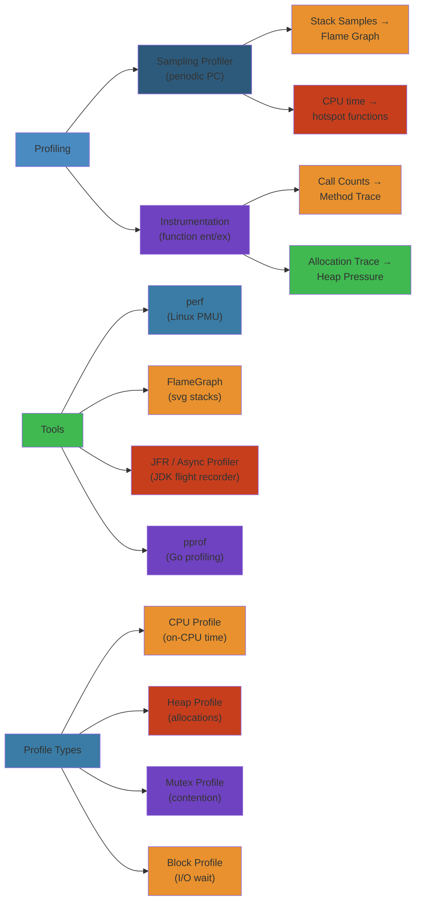

# Profiling Deep Dive




## Profiling Types

#### Step-by-Step (Profiling Workflow)

1. **Identify Performance Problem**: Is it CPU-bound? Memory-hungry? I/O blocked? Know what to measure
2. **Choose Tool**: Sampling (low overhead, ~1%) for CPU; Instrumentation (higher overhead) for detailed call graphs
3. **Capture Profile**: Run under profiler for representative workload (warm JIT, realistic traffic patterns)
4. **Generate Visualization**: Create flame graph, timeline, or call tree for analysis
5. **Find Hot Spots**: Identify functions consuming >5% of time — focus on those first (80/20 rule)
6. **Verify Fix**: Re-profile after optimization to confirm improvement and detect regressions

#### Code Example

```python
# Comprehensive profiling example comparing sampling vs instrumentation
import signal
import sys
import time
import functools
from collections import defaultdict
from typing import Dict, List

# ===== SAMPLING PROFILER =====
# Low overhead, periodic snapshots
class SamplingProfiler:
    def __init__(self, interval_ms: float = 1):
        self.interval = interval_ms / 1000.0
        self.stacks: Dict[str, int] = defaultdict(int)
        self._running = False
    
    def _signal_handler(self, signum, frame):
        # Capture call stack when signal fires
        stack_frames = []
        current_frame = frame
        
        while current_frame:
            code = current_frame.f_code
            stack_frames.append(f"{code.co_name}")
            current_frame = current_frame.f_back
        
        # Store as string for deduplication
        stack_key = " -> ".join(reversed(stack_frames))
        self.stacks[stack_key] += 1
    
    def start(self):
        signal.signal(signal.SIGPROF, self._signal_handler)
        signal.setitimer(signal.ITIMER_PROF, self.interval)
        self._running = True
    
    def stop(self):
        signal.setitimer(signal.ITIMER_PROF, 0)
        self._running = False
    
    def report(self, top_n: int = 5):
        total = sum(self.stacks.values())
        print(f"\n=== SAMPLING PROFILE (total samples: {total}) ===")
        for stack, count in sorted(self.stacks.items(), 
                                   key=lambda x: x[1], 
                                   reverse=True)[:top_n]:
            pct = count / total * 100
            print(f"{pct:5.1f}% [{count:4d}] {stack}")

# ===== INSTRUMENTATION PROFILER =====
# High detail, tracks every call
class InstrumentationProfiler:
    def __init__(self):
        self.call_times: Dict[str, List[float]] = defaultdict(list)
        self.call_counts: Dict[str, int] = defaultdict(int)
    
    def profile(self, func):
        """Decorator to instrument function"""
        func_name = f"{func.__module__}.{func.__qualname__}"
        
        @functools.wraps(func)
        def wrapper(*args, **kwargs):
            start = time.perf_counter()
            try:
                return func(*args, **kwargs)
            finally:
                elapsed = time.perf_counter() - start
                self.call_times[func_name].append(elapsed)
                self.call_counts[func_name] += 1
        
        return wrapper
    
    def report(self, top_n: int = 5):
        print(f"\n=== INSTRUMENTATION PROFILE ===")
        print(f"{'Function':<50} {'Calls':>6} {'Total':>10} {'Avg':>10}")
        print("-" * 80)
        
        # Sort by total time spent
        sorted_funcs = sorted(
            self.call_times.items(),
            key=lambda x: sum(x[1]),
            reverse=True
        )[:top_n]
        
        for func_name, times in sorted_funcs:
            total_time = sum(times)
            avg_time = total_time / len(times)
            print(f"{func_name:<50} {len(times):>6d} "
                  f"{total_time:>10.4f}s {avg_time:>10.6f}s")

# ===== DEMONSTRATION =====
# Simulate realistic workload
instrumentation_prof = InstrumentationProfiler()

@instrumentation_prof.profile
def fast_operation():
    """Runs quickly"""
    time.sleep(0.001)

@instrumentation_prof.profile
def slow_operation():
    """CPU-intensive"""
    result = 0
    for i in range(1_000_000):
        result += i
    return result

@instrumentation_prof.profile
def normal_operation():
    """Moderate work"""
    return sum(range(100_000))

# Profile with instrumentation
print("Running instrumentation profile...")
for _ in range(10):
    fast_operation()
    normal_operation()
    slow_operation()

instrumentation_prof.report(top_n=3)

# Profile with sampling
print("\nRunning sampling profile...")
sampling_prof = SamplingProfiler(interval_ms=0.5)
sampling_prof.start()

for _ in range(10):
    fast_operation()
    normal_operation()
    slow_operation()

sampling_prof.stop()
sampling_prof.report(top_n=3)
```

#### Real-World Scenario

Uber debugged a mysterious 30% latency increase in their matching service using flame graphs. Sampling showed most CPU in `string_copy()`. Investigation revealed a logging statement was stringifying rider objects every request — changed to log only IDs instead. Single line fix (from sampling profiling) recovered 30% latency. Lesson: profiling finds non-obvious bottlenecks that code review misses.

### Sampling vs Instrumentation

Sampling profiling periodically records the program counter (PC) or call stack, while instrumentation modifies code to track every function entry/exit:

```python
import signal
import sys
import threading
from collections import Counter
import functools
import time

class SamplingProfiler:
    def __init__(self, interval: float = 0.001):
        self.interval = interval
        self.samples: list[str] = []
        self._running = False

    def _sample(self, signum, frame):
        if frame:
            code = frame.f_code
            self.samples.append(f"{code.co_filename}:{code.co_name}:{frame.f_lineno}")
        signal.setitimer(signal.ITIMER_PROF, self.interval)

    def start(self):
        self._running = True
        signal.signal(signal.SIGPROF, self._sample)
        signal.setitimer(signal.ITIMER_PROF, self.interval)

    def stop(self):
        self._running = False
        signal.setitimer(signal.ITIMER_PROF, 0)

    def report(self, top_n: int = 10):
        counts = Counter(self.samples)
        total = sum(counts.values())
        print(f"Total samples: {total}")
        for location, count in counts.most_common(top_n):
            pct = count / total * 100
            print(f"  {pct:5.1f}%  {location}  ({count} samples)")

class InstrumentationProfiler:
    def __init__(self):
        self.timings: dict[str, list[float]] = {}

    def profile(self, func):
        @functools.wraps(func)
        def wrapper(*args, **kwargs):
            start = time.perf_counter_ns()
            try:
                return func(*args, **kwargs)
            finally:
                elapsed = time.perf_counter_ns() - start
                key = f"{func.__module__}.{func.__qualname__}"
                if key not in self.timings:
                    self.timings[key] = []
                self.timings[key].append(elapsed)
        return wrapper

    def report(self):
        for func_name, times in sorted(self.timings.items()):
            count = len(times)
            total_ns = sum(times)
            avg_ns = total_ns / count
            max_ns = max(times)
            print(f"{func_name:50s}: count={count:6d}, total={total_ns/1e6:8.2f}ms, avg={avg_ns/1e6:8.2f}ms, max={max_ns/1e6:8.2f}ms")
```

### Deterministic vs Statistical

Deterministic profiling records every function call with exact timing, while statistical profiling samples at intervals:

```python
def deterministic_profile(func):
    depth = [0]
    def traced_func(frame, event, arg):
        if event == "call":
            depth[0] += 1
            indent = "  " * depth[0]
            print(f"{indent}-> {frame.f_code.co_name} at line {frame.f_lineno}")
        elif event == "return":
            indent = "  " * depth[0]
            print(f"{indent}<- {frame.f_code.co_name}")
            depth[0] -= 1
        return traced_func
    import sys
    sys.setprofile(traced_func)
    try:
        return func()
    finally:
        sys.setprofile(None)
```

### Wall-Clock vs CPU

```python
def measure_wall_vs_cpu():
    def cpu_bound():
        return sum(i ** 2 for i in range(10_000_000))

    def io_bound():
        time.sleep(1)

    start_wall = time.perf_counter()
    start_cpu = time.process_time()
    cpu_bound()
    wall = time.perf_counter() - start_wall
    cpu = time.process_time() - start_cpu
    print(f"CPU-bound: wall={wall:.3f}s, cpu={cpu:.3f}s, ratio={cpu/wall:.2f}")

    start_wall = time.perf_counter()
    start_cpu = time.process_time()
    io_bound()
    wall = time.perf_counter() - start_wall
    cpu = time.process_time() - start_cpu
    print(f"I/O-bound: wall={wall:.3f}s, cpu={cpu:.3f}s, ratio={cpu/wall:.2f}")
```

---

## CPU Profiling

### perf (Linux Performance Counters)

```bash
perf stat ./my_program                       # CPU cycles, instructions, cache misses
perf record -g ./my_program                  # Record with call graphs
perf report                                  # View profile
perf annotate                                # Instruction-level profile
perf stat -e cycles,instructions,cache-references,cache-misses ./program
perf stat -e branch-instructions,branch-misses ./program
perf stat -e context-switches,cpu-migrations,page-faults ./program
perf record -F 99 ./program                  # 99 Hz sampling
perf record -c 10000 ./program               # Every 10000 events
perf record -g python3 my_script.py          # Python support
```

### Flame Graphs

Flame graphs visualize stack traces as a flame-shaped visualization:

```bash
perf record -F 99 -g python3 my_script.py
perf script > out.perf
# git clone https://github.com/brendangregg/FlameGraph
FlameGraph/stackcollapse-perf.pl out.perf > out.folded
FlameGraph/flamegraph.pl out.folded > flamegraph.svg

# Python-specific with py-spy
py-spy record -o flamegraph.svg -- python my_script.py
py-spy top -- python my_script.py
```

### Hot Spot Analysis

```python
import cProfile, pstats, io
from typing import Callable

def find_hotspots(func: Callable, *args, top_n: int = 10):
    profiler = cProfile.Profile()
    profiler.enable()
    result = func(*args)
    profiler.disable()

    stream = io.StringIO()
    stats = pstats.Stats(profiler, stream=stream)
    stats.sort_stats("cumtime")
    stats.print_stats(top_n)

    stats.sort_stats("time")
    stats.print_stats(top_n)
    return result

def callers_analysis(func: Callable, *args):
    profiler = cProfile.Profile()
    profiler.enable()
    result = func(*args)
    profiler.disable()
    stream = io.StringIO()
    stats = pstats.Stats(profiler, stream=stream)
    stats.sort_stats("cumtime")
    stats.print_callers(10)
    print(stream.getvalue())
    return result
```

### Instruction-Level Profiling

```python
import dis
import subprocess

def count_instructions(func):
    code = func.__code__
    instructions = list(dis.get_instructions(code))
    print(f"Static bytecode instructions: {len(instructions)}")

def cpi_analysis(binary: str):
    """Measure Cycles Per Instruction (lower is better)."""
    result = subprocess.run([
        "perf", "stat", "-e", "cycles,instructions",
        "-e", "L1-dcache-load-misses", "-e", "branch-misses", binary
    ], capture_output=True, text=True)
    print(result.stderr)
```

### Branch Prediction Analysis

```python
import random
import time

def branch_prediction_test():
    """Demonstrates branch prediction impact on performance."""
    data = [random.randint(0, 255) for _ in range(100000)]

    # Unpredictable branch
    start = time.perf_counter()
    count = sum(1 for x in data if x >= 128)
    t1 = time.perf_counter() - start

    # Predictable branch (sorted)
    data.sort()
    start = time.perf_counter()
    count = sum(1 for x in data if x >= 128)
    t2 = time.perf_counter() - start

    print(f"Unsorted (unpredictable): {t1:.3f}s")
    print(f"Sorted (predictable): {t2:.3f}s")
    print(f"Speedup: {t1/t2:.2f}x")

branch_prediction_test()
```

---

## Memory Profiling

### Heap Profiling with tracemalloc

```python
import tracemalloc
import gc

class MemoryTracker:
    def __init__(self):
        self.snapshots = []

    def start(self):
        tracemalloc.start(25)
        gc.collect()
        self.snapshots.append(tracemalloc.take_snapshot())

    def checkpoint(self, label: str = ""):
        gc.collect()
        snapshot = tracemalloc.take_snapshot()
        snapshot = snapshot.filter_traces([
            tracemalloc.Filter(False, "<frozen importlib*"),
        ])
        if self.snapshots:
            stats = snapshot.compare_to(self.snapshots[-1], "traceback")
            top = stats[:10]
            print(f"=== Memory change ({label}) ===")
            for stat in top:
                size_kb = stat.size_diff / 1024
                print(f"  {size_kb:+8.1f} KiB  {stat.count_diff:+6d} blocks")
                for line in stat.traceback.format()[:3]:
                    print(f"    {line.strip()}")
        self.snapshots.append(snapshot)

    def stop(self):
        tracemalloc.stop()
```

### Allocation Tracking

```python
import tracemalloc
import numpy as np

def track_allocations():
    tracemalloc.start()
    snapshot1 = tracemalloc.take_snapshot()

    large_list = [i for i in range(1000000)]
    numpy_array = np.random.rand(1000000)

    snapshot2 = tracemalloc.take_snapshot()

    stats = snapshot2.compare_to(snapshot1, "lineno")
    print("Top allocations:")
    for stat in stats[:10]:
        print(f"  {stat.size / 1024:.1f} KiB - {stat.count} blocks")
        for line in stat.traceback.format()[:2]:
            print(f"    {line.strip()}")

track_allocations()
```

### Object Lifetime Analysis

```python
import gc
import weakref
from datetime import datetime

class ObjectTracker:
    def __init__(self):
        self.objects: dict[int, datetime] = {}

    def track(self, obj):
        obj_id = id(obj)
        self.objects[obj_id] = datetime.now()
        def cleanup(ref, obj_id=obj_id):
            created = self.objects.pop(obj_id, None)
            if created:
                lifetime = (datetime.now() - created).total_seconds()
                print(f"Object {obj_id} lived {lifetime:.3f}s")
        weakref.ref(obj, cleanup)

tracker = ObjectTracker()

def test_lifetime():
    obj = {"data": "short-lived"}
    tracker.track(obj)
    return obj

def track_gc_cycles():
    gc.set_debug(gc.DEBUG_SAVEALL)
    gc.collect()
    for obj in gc.garbage:
        print(f"Uncollectable: {type(obj)}: {obj}")
```

### Memory Leak Detection

```python
import tracemalloc
import gc

class LeakDetector:
    def __init__(self, threshold_bytes: int = 1024 * 1024):
        self.threshold = threshold_bytes
        self.baseline = None

    def snapshot(self):
        gc.collect()
        return tracemalloc.take_snapshot()

    def check_leaks(self):
        current = self.snapshot()
        if self.baseline is None:
            self.baseline = current
            return

        stats = current.compare_to(self.baseline, "filename")
        total_diff = sum(stat.size_diff for stat in stats if stat.size_diff > 0)
        if total_diff > self.threshold:
            print(f"Potential leak detected: {total_diff / 1024:.1f} KiB growth")
            for stat in stats[:5]:
                if stat.size_diff > 0:
                    print(f"  {stat.size_diff / 1024:.1f} KiB: {stat.traceback.format()[-1].strip()}")

def detect_cyclic_leak():
    class Leak:
        def __init__(self):
            self.cycle = self

    gc.set_debug(gc.DEBUG_SAVEALL)
    leakers = [Leak() for _ in range(1000)]
    del leakers
    unreachable = gc.collect()
    print(f"Collected {unreachable} cyclic objects")
```

---

## I/O Profiling

### Disk I/O Analysis

```bash
# iostat: overall disk performance
iostat -x 1                    # Extended stats every second
iostat -x -m 1                 # MB/s instead of blocks
iostat -x sda sdb 1            # Specific devices

# iotop: per-process I/O
iotop -o                       # Only show active processes
iotop -P                       # Show processes only (not threads)

# blktrace: block layer tracing
blktrace -d /dev/sda -o trace  # Trace block device
blkparse trace                 # Parse trace output
btt -i trace.blktrace.0        # I/O time analysis

# fio: storage benchmarking
fio --name=test --ioengine=libaio --rw=randread --bs=4k --size=1G --numjobs=4
fio --name=test --ioengine=libaio --rw=write --bs=1M --size=10G
```

### Python Disk I/O Profiling

```python
import os
import time
from contextlib import contextmanager

@contextmanager
def track_io():
    """Track file I/O operations."""
    import threading
    original_open = open
    io_count = [0]
    io_bytes = [0]

    class TrackedFile:
        def __init__(self, f, name):
            self.f = f
            self.name = name

        def read(self, n=-1):
            data = self.f.read(n)
            io_count[0] += 1
            io_bytes[0] += len(data)
            return data

        def write(self, data):
            result = self.f.write(data)
            io_count[0] += 1
            io_bytes[0] += len(data)
            return result

        def __getattr__(self, attr):
            return getattr(self.f, attr)

        def __enter__(self):
            return self

        def __exit__(self, *args):
            self.f.close()

    def tracked_open(*args, **kwargs):
        f = original_open(*args, **kwargs)
        return TrackedFile(f, args[0])

    import builtins
    builtins.open = tracked_open
    try:
        yield
    finally:
        builtins.open = original_open
        print(f"I/O count: {io_count[0]}, total bytes: {io_bytes[0]}")

with track_io():
    with open("/tmp/test.bin", "wb") as f:
        f.write(b"x" * 1024 * 1024)
    with open("/tmp/test.bin", "rb") as f:
        data = f.read()
```

### Network I/O Profiling

```bash
# tcpdump
tcpdump -i eth0 port 80                     # Capture HTTP traffic
tcpdump -i eth0 host 10.0.0.1               # Capture specific host
tcpdump -i eth0 -w capture.pcap             # Write to file
tcpdump -i eth0 -X                          # Hex output

# Wireshark / tshark
tshark -r capture.pcap -Y "http.request"
tshark -r capture.pcap -T fields -e http.request.uri -e http.response.code

# Network profiling with ss
ss -s                                      # Socket statistics
ss -t -a                                   # All TCP sockets
ss -i                                      # TCP info (cwnd, rtt, etc)
ss -pl                                     # Process listening sockets
```

### strace for System Call Analysis

```bash
strace -c python program.py                 # System call summary
strace -e trace=open,openat python program.py  # Trace file opens
strace -e trace=network python program.py   # Network syscalls
strace -p 1234                              # Attach to process
strace -T -p 1234                           # Show syscall time
strace -f python program.py                 # Follow forks

# Python profiling with strace
strace -e trace=read,write -c python3 -c "
with open('/tmp/test', 'w') as f:
    f.write('hello' * 10000)
"
```

---

## Thread Profiling

### Lock Contention Analysis

```python
import threading
import time
from collections import defaultdict

class LockProfiler:
    def __init__(self):
        self.lock_stats = defaultdict(lambda: {"acquires": 0, "wait_time": 0.0, "hold_time": 0.0})

    def profile_lock(self, lock, name: str):
        class ProfiledLock:
            def __init__(self, lock, name, stats):
                self._lock = lock
                self._name = name
                self._stats = stats

            def acquire(self, blocking=True, timeout=-1):
                start = time.perf_counter()
                result = self._lock.acquire(blocking, timeout)
                if result:
                    self._stats[self._name]["wait_time"] += time.perf_counter() - start
                    self._stats[self._name]["acquires"] += 1
                    self._stats[self._name]["start_hold"] = time.perf_counter()
                return result

            def release(self):
                if hasattr(self._stats[self._name], "start_hold"):
                    hold = time.perf_counter() - self._stats[self._name]["start_hold"]
                    self._stats[self._name]["hold_time"] += hold
                self._lock.release()

            def __enter__(self):
                self.acquire()
                return self

            def __exit__(self, *args):
                self.release()

        return ProfiledLock(lock, name, self.lock_stats)

    def report(self):
        print("Lock contention report:")
        for name, stats in sorted(self.lock_stats.items()):
            print(f"  {name:20s}: acquires={stats['acquires']:6d}, "
                  f"wait={stats['wait_time']/stats['acquires']*1000:.3f}ms avg, "
                  f"hold={stats['hold_time']/stats['acquires']*1000:.3f}ms avg")
```

### Thread Dumps

```python
import threading
import sys
import traceback

def dump_threads():
    """Print stack traces for all threads (like jstack for Java)."""
    for thread_id, frame in sys._current_frames().items():
        thread = threading._active.get(thread_id)
        thread_name = thread.name if thread else f"Thread-{thread_id}"
        print(f"\n\"{thread_name}\" id={thread_id}")
        traceback.print_stack(frame)

def background_thread_dumper(interval: float = 5.0):
    """Periodically dump all thread stacks."""
    def dumper():
        while True:
            time.sleep(interval)
            print(f"\n=== Thread dump at {time.time()} ===")
            dump_threads()
    thread = threading.Thread(target=dumper, daemon=True, name="Dumper")
    thread.start()
    return thread
```

### Context Switching Analysis

```python
import threading
import time
import os

def measure_context_switches():
    """Measure voluntary and involuntary context switches."""
    thread_switches = {}

    class TrackedThread(threading.Thread):
        def run(self):
            start = time.perf_counter()
            # CPU-bound work to trigger context switches
            for _ in range(10):
                sum(i ** 2 for i in range(5_000_000))
            elapsed = time.perf_counter() - start
            thread_switches[self.name] = elapsed

    # Create more threads than CPUs to force context switching
    threads = [TrackedThread(name=f"Worker-{i}") for i in range(os.cpu_count() * 2)]
    for t in threads:
        t.start()
    for t in threads:
        t.join()

    print("Thread completion times (context switching overhead):")
    for name, elapsed in sorted(thread_switches.items(), key=lambda x: x[0]):
        print(f"  {name}: {elapsed:.3f}s")

measure_context_switches()
```

### Thread Starvation Detection

```python
import threading
import time
from collections import deque

class StarvationDetector:
    def __init__(self, max_wait_ms: float = 100):
        self.max_wait = max_wait_ms / 1000
        self.start_times: dict[int, float] = {}
        self.starvation_events = deque(maxlen=100)

    def thread_waiting(self, thread_id: int = None):
        tid = thread_id or threading.current_thread().ident
        self.start_times[tid] = time.perf_counter()

    def thread_running(self, thread_id: int = None):
        tid = thread_id or threading.current_thread().ident
        if tid in self.start_times:
            wait_time = time.perf_counter() - self.start_times[tid]
            if wait_time > self.max_wait:
                thread = threading.current_thread()
                self.starvation_events.append({
                    "thread": thread.name,
                    "tid": tid,
                    "wait_ms": wait_time * 1000,
                    "time": time.time(),
                })
            del self.start_times[tid]

    def report(self):
        if self.starvation_events:
            print(f"Starvation events detected: {len(self.starvation_events)}")
            for event in list(self.starvation_events)[-5:]:
                print(f"  {event['thread']} waited {event['wait_ms']:.1f}ms")
```

---

## Async Profiling

### Event Loop Latency

```python
import asyncio
import time
from collections import deque
import statistics

class EventLoopProfiler:
    def __init__(self, window_size: int = 1000):
        self.latencies = deque(maxlen=window_size)
        self._loop = None
        self._task = None

    async def start(self):
        self._loop = asyncio.get_running_loop()
        self._task = asyncio.create_task(self._monitor())

    async def _monitor(self):
        while True:
            start = self._loop.time()
            await asyncio.sleep(0)
            latency = self._loop.time() - start
            self.latencies.append(latency)

    def stop(self):
        if self._task:
            self._task.cancel()

    def report(self):
        if not self.latencies:
            return
        latencies_ms = [l * 1000 for l in self.latencies]
        print(f"Event loop latency report:")
        print(f"  min:    {min(latencies_ms):.3f}ms")
        print(f"  avg:    {statistics.mean(latencies_ms):.3f}ms")
        print(f"  p50:    {statistics.median(latencies_ms):.3f}ms")
        print(f"  p95:    {sorted(latencies_ms)[int(len(latencies_ms)*0.95)]:.3f}ms")
        print(f"  p99:    {sorted(latencies_ms)[int(len(latencies_ms)*0.99)]:.3f}ms")
        print(f"  max:    {max(latencies_ms):.3f}ms")
```

### Coroutine Dump

```python
import asyncio
import sys
import traceback

async def dump_coroutines():
    """Dump all pending coroutines (useful for debugging async hangs)."""
    tasks = asyncio.all_tasks()
    print(f"Pending coroutines: {len(tasks)}")
    for task in tasks:
        print(f"\nTask: {task.get_name()}")
        print(f"  Done: {task.done()}")
        print(f"  Cancelled: {task.cancelled()}")
        if task._coro:
            frame = task._coro.cr_frame
            if frame:
                traceback.print_stack(frame)
```

### Callback Tracing

```python
import asyncio
import functools

class CallbackTracer:
    def __init__(self):
        self.callbacks: dict[str, list[float]] = {}

    def trace(self, name: str = None):
        def decorator(func):
            @functools.wraps(func)
            async def wrapper(*args, **kwargs):
                start = time.perf_counter()
                try:
                    return await func(*args, **kwargs)
                finally:
                    elapsed = time.perf_counter() - start
                    key = name or f"{func.__module__}.{func.__qualname__}"
                    if key not in self.callbacks:
                        self.callbacks[key] = []
                    self.callbacks[key].append(elapsed)
            return wrapper
        return decorator

tracer = CallbackTracer()

@tracer.trace("process_data")
async def process_data():
    await asyncio.sleep(0.1)
    return "done"

async def callback_analysis():
    results = await asyncio.gather(*[process_data() for _ in range(10)])
    tracer.report()
```

---

## Production Profiling

### Continuous Profiling with Pyroscope

```python
import pyroscope
import time

pyroscope.configure(
    application_name="my.app",
    server_address="http://pyroscope:4040",
    tags={
        "region": "us-east-1",
        "hostname": os.uname().nodename,
    },
    sample_rate=100,
    detect_subprocesses=True,
)

@pyroscope.tags(tag="fast_path")
def fast_path():
    return sum(i ** 2 for i in range(1000))

@pyroscope.tags(tag="slow_path")
def slow_path():
    time.sleep(1)
    return sum(i ** 2 for i in range(100000))

def main():
    while True:
        fast_path()
        slow_path()
        time.sleep(5)
```

### eBPF Profiling

```bash
# BCC tools for profiling
# Requires: bpftrace, BCC

# CPU sampling
profile -af 99  # Sample at 99Hz

# Function call counting
funccount -r 'vfs_*'  # Count VFS calls
funccount 'tcp_sendmsg'  # Count TCP sends

# Stack traces
stackcount tcp_sendmsg  # Stack traces for TCP sends

# Off-CPU analysis
offcputime -K 1  # Off-CPU flame graph (kernel)

# bpftrace one-liners
bpftrace -e 'kprobe:vfs_read { @[comm] = count(); }'
bpftrace -e 'tracepoint:syscalls:sys_enter_openat { @[pid, comm] = count(); }'
bpftrace -e 'kprobe:do_nanosleep { @[pid, comm, us] = lhist(arg0 / 1000, 0, 100, 1); }'
```

### Python Production Profilers

```python
import os
import signal
import threading
from collections import Counter

class ProductionProfiler:
    """Safe profiler for production use (low overhead, sampling)."""

    def __init__(self, interval: float = 0.05, max_samples: int = 1000):
        self.interval = interval
        self.max_samples = max_samples
        self.samples = Counter()
        self._count = 0
        self._timer = None

    def start(self):
        self._running = True
        self._sample()

    def _sample(self):
        if not self._running or self._count >= self.max_samples:
            self.stop()
            return

        for thread_id, frame in sys._current_frames().items():
            if frame:
                co = frame.f_code
                self.samples[f"{co.co_filename}:{co.co_name}:{frame.f_lineno}"] += 1

        self._count += 1
        if self._running:
            self._timer = threading.Timer(self.interval, self._sample)
            self._timer.daemon = True
            self._timer.start()

    def stop(self):
        self._running = False
        if self._timer:
            self._timer.cancel()
            self._timer = None

    def report(self, top_n: int = 20):
        total = sum(self.samples.values())
        print(f"Profiling report ({total} samples):")
        for (location, count) in self.samples.most_common(top_n):
            pct = count / total * 100
            print(f"  {pct:5.1f}%  {location}")
```

---

## Profiling Tools Comparison

### Tool Selection Guide

```python
profiling_tools = {
    "perf": {
        "type": "Statistical",
        "language": "Any (native)",
        "overhead": "Low (0.1-1%)",
        "use_case": "CPU profiling, cache misses, branch prediction",
        "strengths": ["Kernel support", "HW counters", "Low overhead"],
        "weaknesses": ["Linux only", "Kernel symbols needed", "Complex"],
    },
    "eBPF": {
        "type": "Statistical/Tracing",
        "language": "Any",
        "overhead": "Low",
        "use_case": "Kernel tracing, network, off-CPU analysis",
        "strengths": ["Safe for prod", "Deep kernel insight", "Custom probes"],
        "weaknesses": ["Linux 4.4+", "Requires root", "Steep learning curve"],
    },
    "py-spy": {
        "type": "Statistical",
        "language": "Python",
        "overhead": "Very low (<1%)",
        "use_case": "Python production profiling, flame graphs",
        "strengths": ["Safe for prod", "No code changes", "Cross-platform"],
        "weaknesses": ["Python only", "Sampling only", "No memory info"],
    },
    "async-profiler": {
        "type": "Statistical/Event-based",
        "language": "Java (JVM)",
        "overhead": "Low",
        "use_case": "JVM CPU, allocation, wall-clock profiling",
        "strengths": ["Low overhead", "AsyncGetCallTrace", "Flame graphs"],
        "weaknesses": ["JVM only", "Linux/macOS only"],
    },
    "JFR": {
        "type": "Event-based",
        "language": "Java (JVM)",
        "overhead": "Very low (<1%)",
        "use_case": "Production JVM profiling, flight recording",
        "strengths": ["Built-in JVM", "Extensive events", "Always on"],
        "weaknesses": ["JVM only", "Requires JDK", "Parse with JMC"],
    },
    "pprof": {
        "type": "Statistical",
        "language": "Go, C++, Rust",
        "overhead": "Low",
        "use_case": "CPU, heap, goroutine, mutex profiling",
        "strengths": ["Native Go support", "Web UI", "Diff mode"],
        "weaknesses": ["Go-centric", "Other langs via plugins"],
    },
    "Valgrind": {
        "type": "Instrumentation",
        "language": "Any native",
        "overhead": "High (10-50x)",
        "use_case": "Memory leaks, cachegrind, callgrind",
        "strengths": ["Detailed analysis", "Cache simulation", "Memory checking"],
        "weaknesses": ["Very slow", "Not for production", "Complex output"],
    },
    "Instruments": {
        "type": "Statistical/Instrumentation",
        "language": "Any (macOS/iOS)",
        "overhead": "Moderate",
        "use_case": "macOS/iOS profiling, GPU, memory, energy",
        "strengths": ["Beautiful UI", "GPU profiling", "Energy impact"],
        "weaknesses": ["macOS only", "GUI only", "Heavy"],
    },
}

def print_tool_comparison():
    print(f"{'Tool':15s} {'Type':20s} {'Overhead':15s} {'Use Case'}")
    print("-" * 80)
    for name, info in profiling_tools.items():
        print(f"{name:15s} {info['type']:20s} {info['overhead']:15s} {info['use_case'][:45]}")

print_tool_comparison()
```

### Choosing the Right Profiler

```python
def select_profiler(problem: str, language: str, environment: str) -> str:
    """Recommend a profiler based on the problem description."""
    recommendations = {
        "cpu_python_dev": "cProfile / py-spy",
        "cpu_python_prod": "py-spy / eBPF (bcc/profile)",
        "cpu_jvm_dev": "async-profiler / JFR",
        "cpu_jvm_prod": "JFR (always-on) / async-profiler",
        "memory_python": "tracemalloc / memray / filprofiler",
        "memory_jvm": "JFR + JMC / Eclipse MAT (heap dump)",
        "memory_native": "Valgrind / heaptrack",
        "io_disk": "iostat / blktrace / iotop",
        "io_network": "tcpdump / wireshark / eBPF",
        "lock_contention": "async-profiler (lock events) / JFR",
        "async_python": "aioprofile / py-spy (wall-clock)",
        "production": "py-spy / JFR / eBPF / Parca",
    }
    key = f"{problem}_{language}" if language else problem
    key = f"{key}_{environment}" if environment else key
    return recommendations.get(key, "perf (general purpose)")
```

### Real-World Profiling Workflow

```python
def production_profiling_workflow():
    """Step-by-step production profiling workflow."""
    steps = [
        "1.  Metrics dashboard: CPU, memory, latency p50/p95/p99",
        "2.  Identify anomaly: high latency, high CPU, OOM",
        "3.  Continuous profiler: Pyroscope/Parca (always-on)",
        "4.  Sampling profiler: py-spy top/record (on-demand)",
        "5.  Memory profiler: tracemalloc snapshot (growth)",
        "6.  Heap dump analysis: MAT/JProfiler (JVM)",
        "7.  I/O profiling: iostat, strace, tcpdump",
        "8.  Lock contention: thread dumps, async-profiler",
        "9.  Flame graph: py-spy / perf + FlameGraph",
        "10. Budget: time, CPU, memory, I/O, network",
        "11. Fix: optimize identified hot spot",
        "12. Verify: re-profile and compare before/after",
    ]
    print("\nProduction Profiling Workflow:")
    for step in steps:
        print(f"  {step}")

production_profiling_workflow()
```


## Profiling Workflow

```
1. Identify bottleneck
   - "Login takes 5 seconds, unacceptable"
   ↓
2. Profile the code
   - CPU time: Which functions consume time?
   - Memory: Where are allocations?
   - I/O: Which operations block?
   ↓
3. Analyze results
   - login() takes 60% of time
   - 80% in database query
   - Database fetches 1000s of rows
   ↓
4. Hypothesize fix
   - Add index on user email column
   - Paginate results
   - Cache user objects
   ↓
5. Implement & measure
   - Login now 500ms (10x faster!)
   ↓
6. Monitor in production
   - Track regression
   - Alert if exceeds threshold
```

### Real Case: N+1 Query Problem

```javascript
// SLOW: N+1 queries
const users = db.query('SELECT * FROM users LIMIT 10');
for (let user of users) {
  user.posts = db.query(`SELECT * FROM posts WHERE user_id = ${user.id}`);
  // This runs 10 queries: 1 for users + 10 for each user's posts
}
// Total: 11 queries, 2000ms

// FAST: Single query with join
const users = db.query(`
  SELECT u.*, p.* FROM users u
  LEFT JOIN posts p ON u.id = p.user_id
  LIMIT 10
`);
// Total: 1 query, 50ms (40x faster)
```


## Practical Example

See code examples above for practical usage patterns.

## Interactive Components

### Profiling Flow
<div style="display:flex;flex-direction:column;align-items:center;gap:8px;padding:16px;background:#0b0e14;border:1px solid #1e2a3a;border-radius:8px">
  <style>@keyframes flow-pulse{0%,100%{opacity:.3;transform:translateY(0)}50%{opacity:1;transform:translateY(-2px)}}.flow-title{color:#00d4ff;font-family:monospace;font-size:14px;font-weight:bold;margin-bottom:8px;letter-spacing:1px}.flow-node{display:inline-block;padding:8px 16px;border-radius:4px;font-size:12px;font-family:monospace;color:#e3eaf0;background:#1e3a5f;border:1px solid #00d4ff}.flow-arrow{color:#00d4ff;font-size:16px;animation:flow-pulse 1.5s infinite;font-weight:bold}</style>
  <div class="flow-title">CPU Profiling Process</div>
  <div style="display:flex;flex-direction:column;align-items:center;gap:6px">
    <div class="flow-node">Start profiler</div>
    <div class="flow-arrow">↓</div>
    <div class="flow-node">Sample stack traces</div>
    <div class="flow-arrow">↓</div>
    <div class="flow-node">Collect metrics</div>
    <div class="flow-arrow">↓</div>
    <div class="flow-node">Generate flame graph</div>
    <div class="flow-arrow">↓</div>
    <div class="flow-node">Analyze hotspots</div>
  </div>
</div>

### Profile Metrics
<div style="padding:16px;background:#0b0e14;border:1px solid #1e2a3a;border-radius:8px">
  <style>.obs-title{color:#00d4ff;font-family:monospace;font-size:14px;font-weight:bold;margin-bottom:16px;letter-spacing:1px}.obs-grid{display:grid;grid-template-columns:repeat(auto-fit, minmax(150px, 1fr));gap:12px}.obs-card{padding:12px;background:#1a2332;border:1px solid #1e3a5f;border-radius:4px;display:flex;flex-direction:column;align-items:center;transition:all 0.3s}.obs-card:hover{border-color:#00d4ff;box-shadow:0 0 8px rgba(0, 212, 255, 0.3)}.obs-label{color:#a3aab8;font-family:monospace;font-size:11px;text-transform:uppercase;letter-spacing:0.5px;margin-bottom:8px}.obs-value{font-family:monospace;font-size:20px;font-weight:bold;margin-bottom:4px;letter-spacing:0.5px}.obs-unit{color:#a3aab8;font-family:monospace;font-size:10px;text-transform:uppercase}.metric-healthy{color:#34d399}.metric-warning{color:#fbbf24}.metric-critical{color:#ef4444}</style>
  <div class="obs-title">Profiling Results</div>
  <div class="obs-grid">
    <div class="obs-card"><div class="obs-label">Hot Function</div><div class="obs-value metric-critical">compress()</div><div class="obs-unit">45% of time</div></div>
    <div class="obs-card"><div class="obs-label">Samples Collected</div><div class="obs-value metric-healthy">125K</div><div class="obs-unit">samples</div></div>
    <div class="obs-card"><div class="obs-label">Top 3 Functions</div><div class="obs-value metric-warning">78</div><div class="obs-unit">% of CPU</div></div>
    <div class="obs-card"><div class="obs-label">Profile Duration</div><div class="obs-value metric-healthy">30</div><div class="obs-unit">seconds</div></div>
  </div>
</div>

## Comparison Table

| Aspect | Option A | Option B | Trade-off |
| ---- | ---- | ---- | ---- |
| Performance | High | Medium | Speed vs Simplicity |
| Complexity | High | Low | Features vs Ease of Use |
| Scalability | Excellent | Good | Horizontal vs Vertical |
| Cost | High | Low | Features vs Budget |