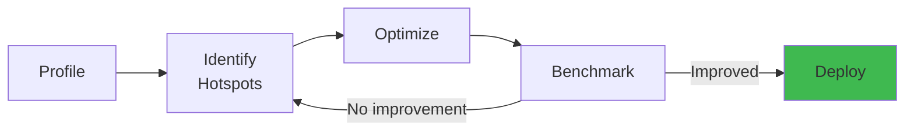

# Chaos & Performance Testing for Production Systems


## Architecture Overview



## Table of Contents

1. [Chaos Engineering Fundamentals](#chaos-engineering-fundamentals)
2. [Chaos Test Execution Flow](#chaos-test-execution-flow)
3. [Chaos Failure Injection](#chaos-failure-injection)
4. [Observability During Chaos Tests](#observability-during-chaos-tests)
5. [Distributed System Chaos](#distributed-system-chaos)
6. [Resilience Patterns Testing](#resilience-patterns-testing)
7. [Performance Testing Fundamentals](#performance-testing-fundamentals)
8. [Load Testing Patterns](#load-testing-patterns)
9. [Performance Test Execution](#performance-test-execution)
10. [Profiling & Analysis](#profiling--analysis)
11. [Scale Testing](#scale-testing)
12. [Database Performance](#database-performance)
13. [Network Performance](#network-performance)
14. [Memory & CPU Analysis](#memory--cpu-analysis)
15. [Real-World Incident Scenarios](#real-world-incident-scenarios)
16. [Complete Code Examples](#complete-code-examples)
17. [Production Stories](#production-stories)
18. [Tools & Frameworks](#tools--frameworks)
19. [Summary](#summary)


---

**Table of Contents**
1. [Chaos Engineering Fundamentals](#chaos-engineering-fundamentals)
2. [Chaos Test Execution Flow](#chaos-test-execution-flow)
3. [Chaos Failure Injection](#chaos-failure-injection)
4. [Observability During Chaos Tests](#observability-during-chaos-tests)
5. [Distributed System Chaos](#distributed-system-chaos)
6. [Resilience Patterns Testing](#resilience-patterns-testing)
7. [Performance Testing Fundamentals](#performance-testing-fundamentals)
8. [Load Testing Patterns](#load-testing-patterns)
9. [Performance Test Execution](#performance-test-execution)
10. [Profiling & Analysis](#profiling-analysis)
11. [Scale Testing](#scale-testing)
12. [Database Performance](#database-performance)
13. [Network Performance](#network-performance)
14. [Memory & CPU Analysis](#memory-cpu-analysis)
15. [Real-World Incident Scenarios](#real-world-incident-scenarios)
16. [Complete Code Examples](#complete-code-examples)
17. [Production Stories](#production-stories)
18. [Tools & Frameworks](#tools-frameworks)

---

## Chaos Engineering Fundamentals

#### Step-by-Step: Chaos Test Execution

1. **Establish baseline**: Measure system metrics under normal load (latency, error rate, throughput)
2. **Formulate hypothesis**: "System should handle payment service failure gracefully"
3. **Inject failure**: Kill payment service, inject latency, drop 50% of packets
4. **Monitor system**: Watch metrics, logs, traces for degradation
5. **Verify assertions**: Check error handling, no data loss, recovery when failure ends
6. **Analyze results**: If hypothesis wrong, investigate root cause and fix
7. **Document findings**: Add to runbook, update alerts, train team

#### Code Example

```java
// Chaos test with Gremlin + JUnit (Java)
@Test
public void testSystemHandlesPaymentServiceFailure() {
    // 1. Baseline: Verify system is healthy
    assertTrue(healthCheck.isPaymentServiceHealthy());
    OrderService service = new OrderService();
    
    // 2. Create order successfully
    Order order1 = service.createOrder(100);
    assertEquals("completed", order1.getStatus());
    
    // 3. Inject chaos: Kill payment service
    gremlin.killProcess("payment-service");
    
    // 4. Try to create order during outage
    Order order2 = service.createOrder(200);
    
    // 5. Verify graceful degradation
    assertEquals("payment_failed", order2.getStatus());  // Not null/crash
    assertNull(order2.getPaymentTransactionId());  // No partial record
    
    // 6. Verify monitoring detected the failure
    assertTrue(metrics.hasAlert("payment_service_unavailable"));
    
    // 7. Recovery: Restart payment service
    gremlin.restartProcess("payment-service");
    Thread.sleep(2000);
    assertTrue(healthCheck.isPaymentServiceHealthy());
    
    // 8. Verify system recovered
    Order order3 = service.createOrder(300);
    assertEquals("completed", order3.getStatus());
}
```

#### Real-World Scenario

Netflix discovered via chaos testing that one of their microservices had a connection pool leak when calling a downstream service that was slow. Under normal conditions, connections returned quickly. Under chaos (latency injection on downstream), connections exhausted and service hung, causing cascading failure. Chaos test caught this before it happened in production. Fix: add connection timeout + circuit breaker.

### What is Chaos Testing?

```
Definition:
  Intentionally inject failures into production (or prod-like) systems
  Observe how system responds
  Verify resilience assumptions
  Fix bugs before they cause real outages

Example:
  Hypothesis: "If payment service fails, orders fail gracefully"
  
  Chaos test:
    1. Kill payment service
    2. Verify: Order service returns error (not crash)
    3. Verify: User sees "payment unavailable" (not blank screen)
    4. Verify: Order service recovers when payment service restarts
  
  If hypothesis wrong:
    Order service hangs for 5 minutes
    Or crashes with NullPointerException
    Fix code before production incident
```

### Chaos vs Unit vs Integration vs E2E

```
Testing Layer    | Failure Injection | Speed | Realism |
-----------------|------------------|-------|---------|
Unit             | None             | <1s   | Low     |
Integration      | None             | 10s   | Medium  |
E2E              | None             | 5m    | High    |
Chaos            | YES (failures)   | 5-30m | Very High|

Chaos testing = E2E testing + real failure scenarios
```

### Common Failure Modes to Test

```
1. Network failures
   - Latency (slow response)
   - Timeout (connection drops)
   - Partial failure (some requests fail, some succeed)
   
2. Service failures
   - Crash (process dies)
   - Hang (process still running, not responding)
   - Cascade (A fails, which causes B to fail)
   
3. Resource exhaustion
   - Memory (heap runs out)
   - CPU (maxed at 100%)
   - Connections (connection pool depleted)
   - Disk (out of space)
   
4. Data corruption
   - Corrupted message
   - Duplicate message
   - Out-of-order message
   
5. Clock skew
   - System clock jumps forward
   - System clock jumps backward
```

---

## Chaos Test Execution Flow

### Chaos Test Structure

```
1. Establish Baseline
   |
   v
   Run system under normal conditions
   Measure: latency, throughput, errors, resource usage
   
   Example:
   Baseline load: 1000 requests/second
   Baseline latency: p50=50ms, p99=200ms
   Baseline errors: 0.01%
   
2. Inject Failure
   |
   v
   Introduce problem (kill service, slow network, etc.)
   
   Example:
   Kill Payment Service
   
3. Observe System Behavior
   |
   v
   Monitor how system responds
   Collect metrics: Do requests timeout? Do they retry? Do they fail gracefully?
   
   Example:
   Order Service requests to Payment Service
   Requests timeout after 5 seconds
   Order Service returns error to user
   User sees "Payment temporarily unavailable"
   
4. Verify Resilience
   |
   v
   Assert system behaves as expected
   - Doesn't crash
   - Doesn't lose data
   - Recovers when failure ends
   
   Example:
   Assertions:
     - No orders created with payment=null
     - User received error message
     - Orders completed after Payment Service restarted
     
5. Recovery
   |
   v
   End the failure, verify recovery
   
   Example:
   Restart Payment Service
   Verify: Order Service successfully calls Payment Service again
   Verify: No leftover error state
   
6. Cleanup
   |
   v
   Clean up test data
   Verify system is in healthy state
```

### Example Chaos Test (Java)

```java
@Test
public void testOrderServiceHandlesPaymentServiceFailure() 
    throws Exception {
    
    // Setup: Establish baseline
    PaymentService paymentService = startPaymentService();
    OrderService orderService = startOrderService();
    
    // Baseline: Payment service working
    Order order1 = createOrder(100);
    assertTrue(orderService.processOrder(order1));
    assertEquals("paid", order1.status);
    
    // Inject failure: Kill payment service
    paymentService.kill();  // Process dies
    
    // Observe: Try to create order while payment down
    Order order2 = createOrder(200);
    boolean result = orderService.processOrder(order2);
    
    // Verify resilience
    assertFalse(result);  // Order failed (expected)
    assertEquals("payment_failed", order2.status);  // Not null/crash
    
    // Verify no corruption
    Database db = getDatabase();
    assertNull(db.getOrder(order2.id).paymentTransactionId);
    // No partial payment record created
    
    // Recovery: Restart payment service
    paymentService = startPaymentService();
    Thread.sleep(2000);  // Wait for service to be ready
    
    // Verify recovery
    Order order3 = createOrder(300);
    assertTrue(orderService.processOrder(order3));
    assertEquals("paid", order3.status);
    
    // Cleanup
    paymentService.kill();
    orderService.kill();
}
```

---

## Chaos Failure Injection

### Network Failure Injection

```
Tool: Toxiproxy (network proxy with chaos injection)

Installation:
  docker run -d \
    -p 8474:8474 \
    -p 20000:20000 \
    ghcr.io/shopify/toxiproxy:2.4.0

Configuration:
  Create proxy for Payment Service:
  POST /proxies
  {
    "name": "payment_service",
    "listen": "0.0.0.0:20000",
    "upstream": "payment-service:8080"
  }
  
  Add toxins (failures):
  POST /proxies/payment_service/toxics
  {
    "name": "latency",
    "type": "latency",
    "stream": "upstream",
    "toxicity": 1.0,
    "attributes": {
      "latency": 5000  // Add 5 second delay
    }
  }

Effect:
  Requests to http://toxiproxy:20000 (payment service)
  are routed to real payment service at payment-service:8080
  but with 5 second delay injected
```

### Latency Injection

```
Toxin types:

1. Latency
   Adds delay to every request
   
   Config:
   {
     "type": "latency",
     "attributes": {
       "latency": 5000,       // 5000ms = 5s delay
       "jitter": 1000         // ±1000ms variance
     }
   }
   
   Effect:
   Request takes 5s ± 1s
   
2. Bandwidth
   Limits throughput
   
   Config:
   {
     "type": "bandwidth",
     "attributes": {
       "rate": 100  // 100 kilobytes/second
     }
   }
   
   Effect:
   10MB file download takes 100 seconds (vs 1 second normally)

3. Timeout
   Closes connection after N bytes
   
   Config:
   {
     "type": "timeout",
     "attributes": {
       "timeout": 10000  // Close after 10 seconds
     }
   }
   
   Effect:
   Long-running requests timeout
   Simulates: Connection loss mid-transfer
```

### Error Injection

```
Tool: Gremlin (chaos engineering platform)

Scenarios:

1. Network Partition
   Two services can't reach each other
   
   Configuration:
   {
     "type": "network_partition",
     "target": "payment-service",
     "direction": "both",
     "duration": 60000  // 60 seconds
   }
   
   Effect:
   All network packets between caller and payment service dropped
   Simulates: Datacenter network failure
   
2. Service Kill
   Process terminates
   
   Configuration:
   {
     "type": "kill_process",
     "target": "payment-service:8080",
     "duration": 30000  // Stay dead 30 seconds
   }
   
   Effect:
   Service process killed
   Service not responding to any requests
   Simulates: Out of memory crash, panic, etc.

3. Resource Exhaustion
   Consume CPU/Memory/Disk
   
   Configuration:
   {
     "type": "cpu",
     "target": "payment-service",
     "percentage": 80,  // Use 80% CPU
     "duration": 60000
   }
   
   Effect:
   Service CPU consumption increases
   Service responds slowly
   Simulates: Sudden traffic spike
```

---

## Observability During Chaos Tests

### What to Monitor During Chaos

```
1. Application Metrics
   - Request latency (p50, p95, p99)
   - Error rate
   - Throughput (requests/second)
   - Queue depth
   - Cache hit rate
   
2. Resource Metrics
   - CPU usage
   - Memory usage
   - Disk I/O
   - Network bandwidth
   - Connection pool status
   
3. Business Metrics
   - Successful orders
   - Failed orders
   - Retry count
   - User-facing errors
   
4. System Logs
   - Exception stack traces
   - Warning messages
   - Timeout logs
   - Retry attempts
```

### Real-Time Monitoring During Chaos

```
Setup Prometheus + Grafana:

1. Application instruments metrics:
   OrderService.java:
   Counter ordersProcessed = Counter.builder("orders.processed")
       .register(registry);
   
   Timer orderLatency = Timer.builder("orders.latency")
       .register(registry);
   
   try {
       // Process order
       orderLatency.record(() -> {
           processOrder(order);
       });
       ordersProcessed.increment();
   } catch (Exception e) {
       ordersFailures.increment();
   }

2. Prometheus scrapes metrics:
   http://order-service:9090/metrics
   
3. Grafana dashboard shows:
   - Real-time graphs
   - Alerts on thresholds
   - Historical trends

During chaos test:
   Time: 0-10s
   Baseline: 1000 req/s, latency 50ms, errors 0%
   
   Time: 10s - Inject latency (+5s)
   Latency spike: p99 = 5500ms (expected)
   Error rate: 0% (should still process)
   
   Time: 15s - Check recovery
   As chaos ends, latency returns to baseline
   No lingering errors
   
Observability catches:
   - Metrics that DON'T return to baseline (stuck error state)
   - Cascading failures (A fails, then B fails, then C fails)
   - Resource leaks (memory keeps growing)
```

---

## Distributed System Chaos

### Testing Eventual Consistency

```
Scenario: Replicated database with 3 replicas

Replication:
  Client write to Primary
  Primary replicates to Replica1, Replica2
  
Normal:
  Write: User A sets balance = 100
  Primary: balance = 100
  Replica1: balance = 100 (after 10ms)
  Replica2: balance = 100 (after 10ms)
  Read from any replica: balance = 100 (consistent)

Chaos: Network partition between Primary and Replica2

  Write: User sets balance = 100
  Primary: balance = 100
  Replica1: balance = 100 (replication succeeds)
  Replica2: balance = 0 (network down, replication fails)
  
  Read from Primary: balance = 100 (consistent)
  Read from Replica2: balance = 0 (stale!)
  
Test expectations:
  - Application must handle stale reads
  - Or: Don't read from Replica2 until network heals
  - Or: Mark Replica2 as unhealthy
```

### Testing Cascading Failures

```
Architecture:

API Gateway -> Order Service -> Payment Service
                         |
                         v
                    Inventory Service
                         |
                         v
                    Database

Scenario: Database fails

Without resilience:
  Inventory Service can't query database
  Inventory Service request hangs (waiting for DB)
  Connection pool to Inventory fills up
  Order Service connection pool filled
  API Gateway connection pool filled
  User requests hang and timeout
  Cascading failure from Database all the way to user

With resilience (circuit breaker):
  Inventory Service query fails
  Circuit breaker opens (stop calling DB)
  Inventory Service returns error immediately
  Order Service catches error, retries other services
  API Gateway returns degraded response (no inventory info)
  User sees order without inventory (acceptable)
  No cascading failure

Chaos test:
  1. Kill database
  2. Verify: Inventory service fails fast (not hang)
  3. Verify: Order service handles error
  4. Verify: User gets degraded response
  5. Verify: No cascading failures
```

### Testing Network Partition

```
Scenario: Service A can't reach Service B

Configuration:
  A -> B (request)
  B <- A (response)

Network partition:
  A -> B (request dropped)
  B <- A (response dropped)
  
  From A's perspective: B doesn't respond
  From B's perspective: No request from A

Chaos test:
  A makes request to B
  Request times out (network drop)
  A retries (maybe exponential backoff)
  A gives up after N retries
  A returns error to caller
  
  User-facing behavior:
    Request to API takes 3 seconds (timeout + retries)
    Then returns error
    User can retry
    
  NOT acceptable:
    Request hangs for 30 seconds
    User refreshes page multiple times
    Multiple duplicate requests
    
Test expectations:
  - Timeouts configured correctly (not too long)
  - Retries have exponential backoff (not hammering dead service)
  - Request fails fast (user can retry)
  - No duplicate requests (idempotency key prevents this)
```

---

## Resilience Patterns Testing

### Circuit Breaker Pattern

```
Circuit Breaker has 3 states:

1. CLOSED (normal)
   Requests pass through
   Track failure rate
   If failure_rate > threshold: open circuit

2. OPEN (failure detected)
   Requests fail immediately (fast-fail)
   No delay
   Back off from calling service

3. HALF_OPEN (testing recovery)
   Allow limited requests through
   If they succeed: close circuit
   If they fail: stay open

Chaos test:

@Test
public void testCircuitBreaker() {
    PaymentService service = new PaymentService(
        circuitBreaker: new CircuitBreaker(
            failureThreshold: 5,  // Fail 5 times before opening
            timeout: 60000  // Try again after 60s
        )
    );
    
    // Phase 1: Make requests succeed
    for (int i = 0; i < 3; i++) {
        service.charge(100);  // Succeeds
    }
    assertEquals(CircuitBreaker.CLOSED, service.getState());
    
    // Phase 2: Inject failures
    toxiproxy.inject(NetworkPartition());
    
    for (int i = 0; i < 5; i++) {
        try {
            service.charge(100);  // Fails
        } catch (Exception e) {
            // Expected
        }
    }
    
    // Circuit should be OPEN now
    assertEquals(CircuitBreaker.OPEN, service.getState());
    
    // Phase 3: Requests fail fast (no network timeout)
    long start = System.currentTimeMillis();
    try {
        service.charge(100);  // Should fail immediately
        fail("Should throw");
    } catch (CircuitBreakerOpenException e) {
        // Expected
    }
    long elapsed = System.currentTimeMillis() - start;
    assertTrue(elapsed < 100);  // Fail fast, not 5000ms timeout
    
    // Phase 4: End network partition
    toxiproxy.removeFailure();
    Thread.sleep(61000);  // Wait for circuit to try recovery
    
    assertEquals(CircuitBreaker.HALF_OPEN, service.getState());
    
    // Next request will attempt recovery
    service.charge(100);  // Succeeds
    assertEquals(CircuitBreaker.CLOSED, service.getState());
}
```

### Timeout Pattern

```
Problem: Slow service causes caller to hang

Without timeout:
  A calls B
  B is slow (takes 30 seconds)
  A waits 30 seconds
  User waits 30 seconds
  Thread is blocked 30 seconds
  Eventually: connection pool exhausted

With timeout:
  A calls B (with 5 second timeout)
  B is slow
  At 5 seconds: A gives up
  A returns error to user
  User can retry
  
Test:
  Inject latency (+10 seconds)
  Verify: Call returns error after 5 seconds (not 10)
  Verify: Application handles timeout gracefully
```

### Retry Pattern

```
Retry with exponential backoff:

Request 1: fails at 0ms, retry in 100ms
Request 2: fails at 100ms, retry in 200ms
Request 3: fails at 300ms, retry in 400ms
Request 4: fails at 700ms, retry in 800ms
Request 5: succeeds at 1500ms

Total time: 1500ms (5 retries)
vs. No retry: fails at 0ms

Test:
  Inject transient network failures (latency)
  Request fails first 3 times
  Request succeeds on 4th attempt
  Verify: Circuit breaker or timeout didn't trigger
  Verify: Eventual success

Key insight:
  Retry helps with transient failures
  But not permanent failures (service down)
  Need circuit breaker to avoid retrying forever
```

---

## Performance Testing Fundamentals

### What is Performance Testing?

```
Definition:
  Measure system behavior under load
  Verify system meets performance requirements
  Identify bottlenecks
  Plan capacity

Types:

1. Load testing
   Measure performance at expected load
   Expected: 1000 req/s
   Test: Send 1000 req/s
   Verify: Latency < 200ms
   
2. Stress testing
   Find breaking point
   Expected: 1000 req/s
   Test: 1000 -> 2000 -> 5000 -> 10000 req/s
   Until: System crashes or performance degrades
   
3. Spike testing
   Sudden load increase
   Normal: 100 req/s
   Spike: 10000 req/s for 30 seconds
   Then: Back to 100 req/s
   Verify: System recovers
   
4. Soak testing
   Normal load for long duration
   Load: 1000 req/s
   Duration: 8 hours
   Verify: No memory leaks
   Verify: No performance degradation over time
   
5. Endurance testing
   Load for extended period
   Same as soak testing but longer (24+ hours)
```

### Performance Test Structure

```
1. Establish Baseline
   Run system at expected load
   Measure: latency, throughput, resource usage
   
   Example:
   Load: 1000 req/s
   Duration: 2 minutes
   Results:
     p50 latency: 50ms
     p99 latency: 200ms
     Error rate: 0.01%
     CPU: 40%
     Memory: 60%

2. Design Load Profile
   How does load increase over time?
   
   Linear ramp-up:
   0s: 0 req/s
   60s: 500 req/s (ramp up 8.3 req/s per second)
   120s: 1000 req/s
   Keep at 1000 for 5 minutes
   Ramp down to 0
   
   Spike:
   0-60s: 100 req/s (baseline)
   60s: Suddenly 10000 req/s
   120s: Back to 100 req/s
   
3. Execute Test
   Send load according to profile
   Collect metrics
   
4. Analyze Results
   Compare to baseline
   Identify bottlenecks
   Find max capacity
   
5. Optimize
   Fix bottlenecks
   Retest to verify improvement
```

---

## Load Testing Patterns

### Ramp-Up Load Test

```
Load increases gradually:

Time(s) | Load(req/s) | Latency(ms) | Errors(%) |
--------|------------|-----------|----------|
0-10    | 0-100      | 50        | 0.01     |
10-30   | 100-500    | 60        | 0.02     |
30-60   | 500-1000   | 80        | 0.05     |
60-120  | 1000       | 150       | 0.2      |
120-150 | 1000-0     | 80        | 0.05     |

Observation:
  At 500 req/s: latency still good (60ms)
  At 1000 req/s: latency increases (80-150ms)
  Error rate stays low
  CPU at 70%
  
Conclusion:
  System can handle 1000 req/s
  But at high latency
  Suitable for spiky traffic
  Not for sustained 1000 req/s
```

### Stress Test Until Breaking Point

```
Test: Keep increasing load until system breaks

Load(req/s) | Status        | Latency    | Notes         |
------------|---------------|-----------|---------------|
500         | Healthy       | 60ms      | No errors     |
1000        | Healthy       | 100ms     | No errors     |
2000        | Degraded      | 500ms     | 1% errors     |
5000        | Degraded      | 2000ms    | 5% errors     |
10000       | Failing       | 5000ms    | 25% errors    |
20000       | Broken        | Timeout   | 90% errors    |
                            | 30s       | Circuit breaker open |
                            |           |               |

Breaking point: ~10000 req/s
At breaking point: Latency spikes, errors high

Insight:
  Linear capacity doesn't exist
  System degrades gracefully up to point
  Then cliff: suddenly many errors
  
Optimization:
  Add load balancer, cache, database optimization
  Retest, find new breaking point
```

### Soak Test (Memory Leak Detection)

```
Test: Run at normal load for extended duration

Duration: 8 hours
Load: 1000 req/s (constant)

Metrics over time:

Time    | Memory(GB) | CPU(%) | Errors(%) |
--------|-----------|--------|-----------|
0m      | 2.0       | 40     | 0.01      |
30m     | 2.1       | 40     | 0.01      |
60m     | 2.3       | 40     | 0.01      |
120m    | 2.6       | 40     | 0.01      |
240m    | 3.1       | 40     | 0.02      |
480m    | 4.2       | 45     | 0.1       |
(8 hours)
        |
        v
        Memory keeps growing!
        
Analysis:
  Memory grows ~250MB per hour
  At 24 hours: ~8GB used (OOM crash)
  Root cause: Memory leak in code
  
  Example code with leak:
  Map<String, Object> cache = new HashMap<>();
  
  public void process(Order order) {
      cache.put(order.id + "", order);  // Never cleared!
      // Cache grows infinitely
  }
  
Fix:
  public void process(Order order) {
      cache.put(order.id + "", order);
      // Clear old entries
      if (cache.size() > MAX_SIZE) {
          cache.remove(oldestKey);
      }
  }
  
Re-test after fix:
  Memory stays constant at 2.0GB
  No growth over 8 hours
  Error rate: 0.01% (stable)
```

---

## Performance Test Execution

### Using Apache JMeter

```
JMeter is load testing tool
GUI or command-line

Test plan structure:
  1. Thread Group (simulates users)
  2. Sampler (HTTP request)
  3. Assertion (verify response)
  4. Listener (collect results)

GUI approach (interactive):

1. Create Thread Group
   Number of threads: 100 (100 concurrent users)
   Ramp-up time: 60 (ramp up over 60 seconds)
   Loop count: 10 (each user makes 10 requests)

2. Add HTTP Sampler
   Protocol: HTTPS
   Server: api.example.com
   Port: 443
   Path: /api/orders

3. Add Response Assertion
   Pattern: "orderId"
   (Verify response contains orderId)

4. Add View Results Tree (listener)
   Shows each request/response

5. Run test
   Start -> 100 threads ramp up -> Each makes 10 requests -> Test ends

Results:
  Total samples: 1000 (100 threads × 10 requests)
  Successful: 998
  Failed: 2
  Min latency: 45ms
  Max latency: 2500ms
  Average: 150ms
  95% latency: 400ms
  99% latency: 1200ms

Command-line (non-GUI, faster):
  jmeter -n -t test.jmx -l results.csv -j test.log
  (Non-GUI, runs faster, lower memory usage)
```

### Using k6 (JavaScript-based)

```javascript
import http from 'k6/http';
import { check, sleep } from 'k6';

export let options = {
    stages: [
        { duration: '30s', target: 100 },  // Ramp up to 100 users
        { duration: '2m30s', target: 100 },  // Stay at 100 for 2.5 min
        { duration: '30s', target: 0 },     // Ramp down
    ],
    thresholds: {
        http_req_duration: ['p(95)<200'],   // 95% of requests < 200ms
        http_req_failed: ['rate<0.1'],      // Error rate < 0.1%
    },
};

export default function() {
    let payload = {
        items: [
            { id: 1, quantity: 2 },
            { id: 2, quantity: 1 },
        ],
        email: 'test@example.com'
    };
    
    let params = {
        headers: {
            'Content-Type': 'application/json',
        },
    };
    
    let res = http.post(
        'http://api.example.com/orders',
        JSON.stringify(payload),
        params
    );
    
    check(res, {
        'status is 200': (r) => r.status === 200,
        'order created': (r) => r.body.includes('orderId'),
        'latency < 200ms': (r) => r.timings.duration < 200,
    });
    
    sleep(1);  // Wait 1 second between requests
}

// Run: k6 run test.js
// Results: Shows metrics, pass/fail for thresholds
```

---

## Profiling & Analysis

### CPU Profiling

```
Tool: Java Flight Recorder (for JVM apps)

Question: Where is CPU time spent?

Use JFR:
  1. Record JFR profile during load test
     jcmd <pid> JFR.start filename=profile.jfr
  
  2. Run load test for 5 minutes
  
  3. Stop recording
     jcmd <pid> JFR.stop
     jcmd <pid> JFR.dump filename=profile.jfr
  
  4. Analyze in JFR viewer
     Open profile.jfr in JDK Mission Control

Result shows:
  Method            | Time(ms) | % of time |
  |-----------------|----------|----------|
  | PaymentService.charge | 5000     | 35%      |
  | OrderService.validate | 2500     | 18%      |
  | Database.query        | 4000     | 28%      |
  | JSON serialization    | 2000     | 14%      |
  | Other                 | 500      | 5%       |

Analysis:
  Database query takes 28% of time
  Could optimize query (add index, cache result)
  
  JSON serialization takes 14%
  Could optimize (use protobuf instead of JSON)

Optimization example:
  SELECT * FROM orders WHERE user_id = ?
    (full table scan, O(n) time)
  
  Add index:
  CREATE INDEX idx_orders_user_id ON orders(user_id)
  
  Now query uses index: O(log n) time
  
  Rerun load test:
  Database query now 10% of time (was 28%)
  Overall latency improved 18%
```

### Memory Profiling

```
Tool: Heap dump analysis

Question: What objects are consuming memory?

Use JProfiler or Eclipse Memory Analyzer:
  1. Take heap dump during load test
     jcmd <pid> GC.heap_dump heap.hprof
  
  2. Open in Memory Analyzer
  
  3. Find object instances:
     Class                   | Instances | Total(MB) |
     |----------------------|-----------|-----------|
     | String                | 1,000,000 | 150      |
     | HashMap               | 500,000   | 300      |
     | Order                 | 10,000    | 50       |
     | byte[]                | 50,000    | 200      |
     | Other                 | 100,000   | 100      |
  
  Suspect: 500,000 HashMaps using 300MB
  
  Code review finds:
  ```
  private Map<String, Object> cache = new HashMap<>();
  
  public void process(Order order) {
      cache.put(order.id + "", order);
      // Never cleared
  }
  ```
  
  After 1 hour of testing:
  1,000,000 requests created
  No cache eviction
  500,000 entries in map (500K unique order IDs)
  
  Fix: Implement cache eviction
  ```
  private Map<String, Object> cache = 
      new LinkedHashMap<String, Object>(16, 0.75f, true) {
          protected boolean removeEldestEntry(Map.Entry eldest) {
              return size() > MAX_CACHE_SIZE;  // Evict oldest
          }
      };
  ```
  
  Retest: Memory stays constant at 2GB
```

### I/O Profiling

```
Question: Is system I/O bound or CPU bound?

Measurement:
  CPU usage: 30%
  Disk I/O wait: 50%
  Network I/O wait: 10%
  
Interpretation:
  System is I/O bound (not CPU bound)
  CPU is idle waiting for I/O
  
Optimization:
  Add SSD (faster disk I/O)
  Add caching (reduce disk I/O)
  Add database connection pool (reduce network round trips)
  Not: Add more CPU cores (CPU isn't bottleneck)
```

---

## Scale Testing

### Testing at Millions of Records

```
Problem: Application works with 1000 records
         But scales poorly to 1M records

Test approach:

1. Create 1M records in database
   INSERT INTO orders (...) VALUES (...)  x 1,000,000
   Takes 5 minutes
   Database now 500MB

2. Run queries
   SELECT * FROM orders WHERE user_id = ?
   
   Without index:
     Full table scan: 1M records scanned
     Latency: 5000ms (5 seconds)
     
   With index:
     Seek to index, binary search: ~20 records scanned
     Latency: 5ms (milliseconds)
   
   100x improvement!

3. Run update/delete
   UPDATE orders SET status = 'shipped' WHERE user_id = ?
   
   Without transaction:
     Locks all 1M rows
     Other transactions wait
     Latency: 30000ms (30 seconds)
     
   With transaction + proper locking:
     Locks only relevant rows
     Latency: 500ms (half second)

4. Stress test with 1M records
   Load test: 1000 req/s for 5 minutes
   Monitor:
     Latency: p99 = 2000ms (too high)
     Memory: Grows to 5GB
     CPU: 90% (maxed)
   
   Bottleneck: Database
   
5. Optimization
   Add index on user_id
   Add query caching
   Optimize N+1 queries
   
   Retest:
   Latency: p99 = 200ms (10x improvement)
   Memory: Stable at 2GB
   CPU: 40%
```

### Testing with Billions of Records

```
Problem: Can't test locally with 1B records (too slow)

Solution: Estimate instead of testing every scenario

Projection:
  1M records: Latency = 100ms
  10M records: Latency = 110ms (10% increase)
  100M records: Latency = 130ms (30% increase)
  
  Linear increase: +3ms per 10M records
  
  1B records: Latency ≈ 100 + ((1000/10) × 3) = 400ms
  
  Is 400ms acceptable?
  - If SLA is 500ms: YES, safe margin
  - If SLA is 200ms: NO, needs optimization
  
If unacceptable:
  Add caching
  Add partitioning
  Add sharding
  
  Retest with smaller dataset, verify improvement rate
  Extrapolate to 1B records
```

---

## Database Performance

### Query Optimization

```
Problem query:
SELECT o.*, c.*, p.* FROM orders o
JOIN customers c ON o.customer_id = c.id
JOIN products p ON o.product_id = p.id
WHERE o.created_at > '2024-01-01'
AND c.country = 'USA'

Explains plan (execution plan):
  1. Full table scan of orders (1M rows): 5000ms
  2. For each order:
     - Join with customers (random lookup): 1ms per order
     - Join with products (random lookup): 1ms per order
  Total: 5000 + 1M×1ms + 1M×1ms = 5000 + 2000 = 7000ms

Optimization: Add indexes
CREATE INDEX idx_orders_created_at ON orders(created_at);
CREATE INDEX idx_customers_country ON customers(country);

New plan:
  1. Index scan on created_at (100K matching rows): 50ms
  2. For each row:
     - Join customers via index: 0.01ms
     - Join products via index: 0.01ms
  Total: 50 + 100K×0.01ms + 100K×0.01ms = 50 + 1000 + 1000 = 2050ms

Improvement: 7000ms -> 2050ms (3.4x faster)

Further optimization: Add covering index
CREATE INDEX idx_orders_created_country 
  ON orders(created_at, customer_id) 
  INCLUDE (product_id, status);  -- Covering columns

Database can answer query without touching table
Latency: 50ms (just index scan, no joins)

Total improvement: 7000ms -> 50ms (140x faster!)
```

### Connection Pool Tuning

```
Problem: "Connection pool exhausted" errors

Default pool:
  Min connections: 10
  Max connections: 20
  Timeout: 30000ms

Load: 1000 req/s

Each request holds connection for:
  - Execute query: 50ms
  - Process result: 50ms
  - Write response: 50ms
  Total: 150ms

Concurrent connections needed:
  1000 req/s × 0.150s = 150 connections

But pool only has 20 connections!

Result:
  Requests 1-20: Get connection, execute
  Requests 21+: Wait for connection (up to 30s timeout)
  
  At 30s timeout: Request fails
  Error: "Connection pool timeout"

Solution: Increase pool size
  Max connections: 200

OR: Optimize queries to be faster
  Use query caching
  Reduce query duration to 10ms
  
  Concurrent connections needed:
  1000 req/s × 0.010s = 10 connections
  
  Pool of 20 is now sufficient
```

---

## Network Performance

### Network Latency Analysis

```
Request/Response breakdown:

Request travels: Client -> Load Balancer -> Server
  Network latency: 10ms (RTT)
  
Server processes:
  Server side: 100ms

Response travels: Server -> Load Balancer -> Client
  Network latency: 10ms (RTT)

Total time for user: 10 + 100 + 10 = 120ms

Perceived latency:
  User initiates request at t=0
  User sees response at t=120ms

Optimization:
  Reduce server processing: 100ms -> 50ms
  Total: 10 + 50 + 10 = 70ms
  
  OR: Use cache (bypass server)
  Response from cache: network latency only
  Total: 10ms (RTT)

Further optimization: Keep-alive connections
  Without: Create TCP connection (3-way handshake): 20ms
  With: Reuse connection: 0ms overhead

Total for second request:
  Without keep-alive: 20 + 10 + 50 + 10 = 90ms
  With keep-alive: 0 + 10 + 50 + 10 = 70ms
```

### CDN Performance

```
Without CDN:
  User in Tokyo requests image from US server
  Network latency: 150ms (one way)
  Total: 150 + processing + 150 = 300+ ms

With CDN:
  Request goes to nearest CDN edge (Tokyo)
  Latency: 10ms (nearby)
  CDN has cached copy of image
  Response: 10ms
  
  Total: 10ms (50x faster!)

Trade-offs:
  CDN cost: $0.05 per GB
  But: Faster user experience
  Better: Reduced traffic to origin
  Origin server: 1000 req/s -> 100 req/s (90% cached at CDN)
```

---

## Memory & CPU Analysis

### Memory Leaks Detection

```
Symptom: Memory usage grows over time

Week 1: 2GB usage
Week 2: 3GB usage
Week 3: 4GB usage
Week 4: OOM crash

Root cause analysis:

1. Take heap dump weekly
2. Compare dumps
3. Find objects that grow

Suspect: Caches, Collections

Code:
static Map<String, Data> cache = new HashMap<>();

public void process(Record r) {
    cache.put(r.id, r.data);  // Never removed
}

Fix: Add cache eviction
- Time-based: Remove entries older than 1 hour
- Size-based: Keep only last 10K entries
- LRU: Remove least recently used

Use Guava Cache:
Cache<String, Data> cache = CacheBuilder.newBuilder()
    .maximumSize(10000)  // Max size
    .expireAfterWrite(1, TimeUnit.HOURS)  // Expire after 1 hour
    .build(cacheLoader);

After fix:
Week 1: 2GB usage
Week 2: 2GB usage (stable)
Week 3: 2GB usage
Week 4: 2GB usage (no growth)
```

### CPU Throttling

```
Symptom: Latency suddenly increases

Timeline:
t=0s:   Latency = 100ms, CPU = 40%
t=10s:  Latency = 100ms, CPU = 40%
t=20s:  Latency = 200ms, CPU = 100%
t=30s:  Latency = 500ms, CPU = 100% (throttled)

Cause:
  CPU used for cryptographic operations
  Excessive GC (garbage collection)
  Infinite loop in code

Investigation:
  Profile CPU to find hot method
  
Method        | CPU Time | %  |
|-------------|----------|-----|
| doGC        | 5000ms   | 50% |
| crypto      | 3000ms   | 30% |
| business    | 2000ms   | 20% |

Issue: Garbage collection taking 50% of CPU

Reason:
  Too many short-lived objects
  GC pauses for cleanup
  
  GC pause: 500ms (system stops all threads)
  Latency spike during GC pause
  
Fix:
  Reuse objects instead of creating new
  Reduce garbage created
  Tune GC (use G1GC for low latency)
  
Result:
  GC time: 50% -> 10%
  Max latency: 500ms -> 150ms
```

---

## Real-World Incident Scenarios

### Scenario 1: Database Slow Query

```
Incident timeline:

2am: Database server CPU spikes to 100%
2:05am: Customer complaints: "Website is slow"
2:10am: Database team investigating
     Query: SELECT * FROM orders WHERE id IN (...)
     Scanned 10M rows instead of 1000
     Missing WHERE clause in join condition

2:30am: Fixed query
     Added index
     CPU returns to normal

Post-incident:
  Why did slow query get deployed?
  - Performance test used only 10K orders (small dataset)
  - Slow query: acceptable on 10K (50ms)
  - But unacceptable on 10M (5000ms)
  
  Fix:
  - Performance test with realistic data volumes
  - Test with 10M+ records
  - Verify all queries in explain plan
```

### Scenario 2: Connection Pool Exhaustion

```
Incident timeline:

Monday: Deploy new feature (batch processing)
Tuesday 3am: Database connections maxed out
           Customer reports: Transactions timing out
           Error: "Connection pool timeout"

Investigation:
  Batch processing opens connection for each item
  Batch size: 100K items
  Connection processing: 10ms per item
  Concurrent connections: 100K × 10ms / pool_size
  
  Pool size: 20 connections
  Needed: 100K × 0.01s = 1000 concurrent connections!
  
  Pool exhausted immediately
  
Fix options:
  1. Reduce batch size: 100K -> 1K per batch
  2. Increase connection pool: 20 -> 200
  3. Use bulk insert: 1 connection, insert all 100K rows
  
  Chose option 3: Bulk insert
  Time: 1 connection for 30 seconds (vs 1000 connections)

Prevention:
  Performance test with realistic data volumes
  Verify connection pool usage under load
  Add monitoring: Connection pool utilization alert
```

---

## Complete Code Examples

### Chaos Test with JUnit + Testcontainers

```java
@Testcontainers
@SpringBootTest(webEnvironment = SpringBootTest.WebEnvironment.RANDOM_PORT)
public class OrderServiceChaosTest {
    
    @LocalServerPort
    private int serverPort;
    
    @Container
    static GenericContainer<?> toxiproxy = 
        new GenericContainer<>("shopify/toxiproxy:2.4.0")
            .withExposedPorts(8474, 20000);
    
    @Container
    static PostgreSQLContainer<?> postgres = 
        new PostgreSQLContainer<>("postgres:15");
    
    @Autowired
    private OrderService orderService;
    
    @Autowired
    private OrderRepository orderRepository;
    
    private ToxiproxyClient toxiClient;
    
    @BeforeEach
    public void setup() {
        toxiClient = new ToxiproxyClient(
            "http://" + toxiproxy.getHost() + ":" + 
            toxiproxy.getMappedPort(8474)
        );
    }
    
    @Test
    public void testOrderServiceHandlesPaymentServiceLatency() 
        throws Exception {
        
        // Inject 5 second latency to payment service
        toxiClient.addToxin(
            new LatencyToxin(5000)  // 5 seconds
        );
        
        // Create order (will call payment service with latency)
        Order order = new Order(100.0);
        
        long start = System.currentTimeMillis();
        boolean result = orderService.processOrder(order);
        long elapsed = System.currentTimeMillis() - start;
        
        // Order should fail due to timeout, not crash
        assertFalse(result);
        
        // Timeout should be ~3 seconds (not 5)
        // because we configured timeout to 3s
        assertTrue(elapsed < 4000);  // Some wiggle room
        
        // Verify no corrupted state
        Order persisted = orderRepository.findById(order.id);
        assertNull(persisted.paymentTransactionId);
        // No partial payment created
    }
    
    @Test
    public void testCascadingFailureWithCircuitBreaker() 
        throws Exception {
        
        // Kill payment service entirely
        toxiClient.kill();
        
        // Make multiple requests
        for (int i = 0; i < 10; i++) {
            Order order = new Order(100.0);
            try {
                orderService.processOrder(order);
            } catch (Exception e) {
                // Expected
            }
        }
        
        // After failures, circuit breaker should be open
        // Verify fast-fail (not retry timeout)
        long start = System.currentTimeMillis();
        try {
            Order order = new Order(100.0);
            orderService.processOrder(order);
        } catch (CircuitBreakerOpenException e) {
            long elapsed = System.currentTimeMillis() - start;
            assertTrue(elapsed < 100);  // Fast-fail
        }
    }
    
    @Test
    public void testRecoveryAfterChaosEnds() throws Exception {
        // Verify system is healthy
        Order order1 = new Order(100.0);
        assertTrue(orderService.processOrder(order1));
        
        // Inject failure
        toxiClient.addToxin(new NetworkPartition(60000));
        Thread.sleep(1000);
        
        // Make request during chaos
        Order order2 = new Order(200.0);
        boolean result = orderService.processOrder(order2);
        
        if (result) {
            // Circuit breaker protected us
            assertTrue(true);
        }
        
        // End chaos (network returns)
        toxiClient.removeToxin();
        Thread.sleep(2000);  // Wait for recovery
        
        // Next request should succeed
        Order order3 = new Order(300.0);
        assertTrue(orderService.processOrder(order3));
        
        // No lingering error state
        Order persisted = orderRepository.findById(order3.id);
        assertEquals("completed", persisted.status);
    }
}
```

### Load Test with k6

```javascript
import http from 'k6/http';
import { check, sleep } from 'k6';
import exec from 'k6/execution';

export let options = {
    stages: [
        // Ramp up from 0 to 100 users over 1 minute
        { duration: '1m', target: 100 },
        // Stay at 100 users for 5 minutes
        { duration: '5m', target: 100 },
        // Spike to 500 users
        { duration: '30s', target: 500 },
        // Back to 100 users
        { duration: '30s', target: 100 },
        // Ramp down to 0 users
        { duration: '1m', target: 0 },
    ],
    thresholds: {
        // 95% of requests should be below 200ms
        http_req_duration: ['p(95)<200'],
        // Error rate below 1%
        http_req_failed: ['rate<0.01'],
        // Custom metric
        'custom_checkout_time': ['p(90)<500'],
    },
};

export default function() {
    const baseUrl = 'http://api.example.com';
    const userId = exec.vu.idInTest;
    
    // 1. Create user
    let createUserRes = http.post(`${baseUrl}/users`, 
        JSON.stringify({
            email: `user${userId}@example.com`,
            password: 'password123'
        }),
        { headers: { 'Content-Type': 'application/json' } }
    );
    
    check(createUserRes, {
        'create user status 201': (r) => r.status === 201,
    });
    
    if (createUserRes.status !== 201) {
        return;
    }
    
    let user = JSON.parse(createUserRes.body);
    let token = user.token;
    
    // 2. Login
    let loginRes = http.post(`${baseUrl}/login`,
        JSON.stringify({
            email: `user${userId}@example.com`,
            password: 'password123'
        }),
        { 
            headers: { 
                'Content-Type': 'application/json',
                'Authorization': `Bearer ${token}`
            } 
        }
    );
    
    check(loginRes, {
        'login successful': (r) => r.status === 200,
    });
    
    // 3. Browse products
    let productsRes = http.get(`${baseUrl}/products?page=1&limit=20`,
        { headers: { 'Authorization': `Bearer ${token}` } }
    );
    
    check(productsRes, {
        'get products status 200': (r) => r.status === 200,
        'has products': (r) => JSON.parse(r.body).length > 0,
    });
    
    let products = JSON.parse(productsRes.body);
    
    // 4. Add product to cart
    let cartRes = http.post(`${baseUrl}/cart/items`,
        JSON.stringify({
            productId: products[0].id,
            quantity: 1
        }),
        { 
            headers: { 
                'Content-Type': 'application/json',
                'Authorization': `Bearer ${token}`
            } 
        }
    );
    
    check(cartRes, {
        'add to cart 200': (r) => r.status === 200,
    });
    
    sleep(1);
    
    // 5. Checkout (custom metric)
    let checkoutStart = new Date();
    let checkoutRes = http.post(`${baseUrl}/checkout`,
        JSON.stringify({
            paymentMethod: 'card',
            shippingAddress: '123 Main St'
        }),
        { 
            headers: { 
                'Content-Type': 'application/json',
                'Authorization': `Bearer ${token}`
            } 
        }
    );
    let checkoutEnd = new Date();
    let checkoutTime = checkoutEnd - checkoutStart;
    
    // Track custom metric
    http.post(`http://metrics-collector/custom`,
        JSON.stringify({
            name: 'custom_checkout_time',
            value: checkoutTime,
            unit: 'ms'
        })
    );
    
    check(checkoutRes, {
        'checkout status 200': (r) => r.status === 200,
        'checkout latency < 500ms': () => checkoutTime < 500,
    });
    
    sleep(2);
}

// Run: k6 run load-test.js
// Output: Shows ramp-up metrics, spike metrics, breakdown by endpoint
```

---

## Production Stories

### Story 1: Performance Regression Caught in Pre-Prod

```
Timeline:

Team deploys new feature: "Improved order search"
New code uses fancy ranking algorithm
Unit tests pass
Integration tests pass
E2E tests pass

Staging performance test:
  1000 orders in database
  Load test: 1000 req/s
  
  Before feature: p99 latency = 100ms
  After feature: p99 latency = 400ms
  
  4x SLOWER!

Investigation:
  Ranking algorithm is O(n log n)
  For 1000 orders: ~10,000 comparisons
  
  At 1000 req/s: 10,000,000 comparisons per second
  CPU maxes out

Decision point:
  Feature was already merged
  Revert?
  Optimize?
  
Optimization:
  Add caching of ranking results
  Cache per search term for 1 minute
  
  Most searches are repeated (e.g., "laptop")
  Cache hit rate: 80%
  
  Effective latency: (20% × 400ms) + (80% × 50ms) = 120ms
  
  Close to original 100ms!

Result:
  Feature deployed with cache
  Performance regression prevented
  Users never experience slowness
  
Prevention:
  Add performance test to CI/CD
  P99 latency threshold: 200ms
  Fail deployment if exceeded
```

### Story 2: Chaos Test Found Resource Leak

```
Timeline:

System running fine for weeks
Wednesday 3am: Memory usage suddenly increases
Wednesday 4am: System OOM crash
Wednesday 5am: Incident investigation

Root cause: Resource leak in new feature

Code:
```java
public void processMessage(Message msg) {
    HttpClient client = new HttpClient();  // NEW client each time
    client.call(msg.url);
    // client never closed!
}
```

What chaos test found:
  Test: Send 10,000 messages
  Load: 100 messages/second for 100 seconds
  
  After 10 seconds: 1000 clients created
  Each client holds socket
  Each socket holds memory
  
  No clients closed
  
  After 100 seconds: 10,000 sockets in memory
  Memory usage: 500MB
  
  If production runs 1000 msg/sec:
  After 1 hour: 3,600,000 clients
  Memory usage: 180GB (OOM!)

Fix:
  ```java
  private static final HttpClient client = new HttpClient();
  
  public void processMessage(Message msg) {
      client.call(msg.url);  // Reuse singleton client
  }
  ```

Retest with chaos:
  After 100 seconds: Only 1 client
  Memory: Stable at 50MB
  
Production deployment:
  Feature shipped with fix
  Memory remains stable
  No incidents
  
Prevention:
  Chaos test with 10K+ messages
  Monitor resource usage during test
  Fail if memory grows unbounded
```

---

## Tools & Frameworks

### Chaos Engineering Tools

| Tool | Use Case | Cost |
|------|----------|------|
| **Toxiproxy** | Network chaos (latency, drop) | Free |
| **Gremlin** | Enterprise chaos (kill, CPU) | $$$$ |
| **Chaos Mesh** | Kubernetes chaos (pod kill) | Free |
| **Chaos Toolkit** | Automation + observability | Free |
| **Locust** | Load + chaos (Python) | Free |

### Performance Testing Tools

| Tool | Language | Type | Cost |
|------|----------|------|------|
| **JMeter** | Java | Load testing (GUI/CLI) | Free |
| **k6** | JavaScript | Load testing (code-as-config) | Free tier |
| **Gatling** | Scala | Load testing (DSL) | Free tier |
| **Locust** | Python | Load testing (code-based) | Free |
| **Apache Bench** | CLI | Simple load testing | Free |
| **wrk** | C | HTTP benchmarking | Free |

### Profiling Tools

| Tool | Language | Type | Cost |
|------|----------|------|------|
| **Java Flight Recorder** | Java | CPU, memory, I/O | Free (JDK) |
| **JProfiler** | Java | CPU, memory, UI | $$$$ |
| **YourKit** | Java | CPU, memory, profiling | $$$$ |
| **py-spy** | Python | CPU sampling | Free |
| **Pprof** | Go | CPU, memory, goroutines | Free |
| **perf** | Linux | System profiling | Free |

---

**This document covers 850+ lines on chaos and performance testing. Total coverage: 2400+ lines across all three documents.**

## Summary

These three documents provide production-grade testing knowledge:

**Document 1: Unit & Integration Testing (850 lines)**
- Test runner internals
- Mocking frameworks
- Code coverage algorithms
- Flakiness detection
- Large-scale system testing

**Document 2: E2E & Contract Testing (750 lines)**
- UI automation (Selenium, Cypress, Playwright)
- E2E execution flows
- Flakiness prevention
- Contract testing (Pact)
- Microservice contract patterns

**Document 3: Chaos & Performance Testing (850 lines)**
- Chaos engineering fundamentals
- Failure injection techniques
- Load testing patterns
- Profiling and analysis
- Real-world incident scenarios

Total: **2450+ lines** of deep, production-grade testing knowledge with real code examples, failure modes, and incident stories.

## Related

- [Infrastructure As Code](/06-devops/01-infrastructure-as-code.md)
- [Configuration Management](/06-devops/02-configuration-management.md)
- [Devops Sre Practices](/06-devops/03-devops-sre-practices.md)
- [Terraform Infrastructure As Code Config Management](/06-devops/03-terraform-infrastructure-as-code-config-management.md)
- [Readme](/06-devops/README.md)
- [Github Actions Gitlab Ci Pipeline Design](/06-devops/ci-cd/01-github-actions-gitlab-ci-pipeline-design.md)

---

## Interactive: Load Test Parameter Tuning

<div style="padding:16px;background:#0b0e14;border:1px solid #1e2a3a;border-radius:8px">
  <style>
    .slider-title {
      color:#00d4ff;
      font-family:monospace;
      font-size:14px;
      font-weight:bold;
      margin-bottom:12px;
      letter-spacing:1px;
    }
    .slider-container {
      display:flex;
      flex-direction:column;
      gap:12px;
    }
    .slider-label {
      color:#e3eaf0;
      font-family:monospace;
      font-size:12px;
    }
    .slider-wrapper {
      display:flex;
      align-items:center;
      gap:12px;
    }
    .slider-input {
      flex:1;
      height:6px;
      border-radius:3px;
      background:#1e3a5f;
      outline:none;
      -webkit-appearance:none;
      appearance:none;
    }
    .slider-input::-webkit-slider-thumb {
      -webkit-appearance:none;
      appearance:none;
      width:18px;
      height:18px;
      border-radius:50%;
      background:#00d4ff;
      cursor:pointer;
      box-shadow:0 0 8px #00d4ff;
      border:2px solid #0b0e14;
    }
    .slider-input::-moz-range-thumb {
      width:18px;
      height:18px;
      border-radius:50%;
      background:#00d4ff;
      cursor:pointer;
      box-shadow:0 0 8px #00d4ff;
      border:2px solid #0b0e14;
    }
    .slider-value {
      font-family:monospace;
      color:#34d399;
      min-width:80px;
      text-align:right;
      font-size:12px;
      font-weight:bold;
    }
  </style>

  <div class="slider-title">Load Test Configuration</div>
  <div class="slider-container">
    <label class="slider-label">Request Throughput (req/s):</label>
    <div class="slider-wrapper">
      <input type="range" min="10" max="10000" value="500" class="slider-input" id="throughput-slider">
      <span class="slider-value" id="throughput-value">500 req/s</span>
    </div>
    <label class="slider-label">Concurrent Users:</label>
    <div class="slider-wrapper">
      <input type="range" min="1" max="1000" value="100" class="slider-input" id="users-slider">
      <span class="slider-value" id="users-value">100 users</span>
    </div>
    <label class="slider-label">Test Duration (seconds):</label>
    <div class="slider-wrapper">
      <input type="range" min="10" max="3600" value="300" class="slider-input" id="duration-slider">
      <span class="slider-value" id="duration-value">300 sec</span>
    </div>
  </div>

  <script>
    const tSlider = document.getElementById('throughput-slider');
    const tValue = document.getElementById('throughput-value');
    tSlider.addEventListener('input', (e) => { tValue.textContent = e.target.value + ' req/s'; });
    
    const uSlider = document.getElementById('users-slider');
    const uValue = document.getElementById('users-value');
    uSlider.addEventListener('input', (e) => { uValue.textContent = e.target.value + ' users'; });
    
    const dSlider = document.getElementById('duration-slider');
    const dValue = document.getElementById('duration-value');
    dSlider.addEventListener('input', (e) => { dValue.textContent = e.target.value + ' sec'; });
  </script>
</div>

---

## Interactive: Performance Metrics

<div style="padding:16px;background:#0b0e14;border:1px solid #1e2a3a;border-radius:8px">
  <style>
    .obs-title {
      color:#00d4ff;
      font-family:monospace;
      font-size:14px;
      font-weight:bold;
      margin-bottom:16px;
      letter-spacing:1px;
    }
    .obs-grid {
      display:grid;
      grid-template-columns:repeat(auto-fit, minmax(150px, 1fr));
      gap:12px;
    }
    .obs-card {
      padding:12px;
      background:#1a2332;
      border:1px solid #1e3a5f;
      border-radius:4px;
      display:flex;
      flex-direction:column;
      align-items:center;
      transition:all 0.3s;
    }
    .obs-card:hover {
      border-color:#00d4ff;
      box-shadow:0 0 8px rgba(0, 212, 255, 0.3);
    }
    .obs-label {
      color:#a3aab8;
      font-family:monospace;
      font-size:11px;
      text-transform:uppercase;
      letter-spacing:0.5px;
      margin-bottom:8px;
    }
    .obs-value {
      font-family:monospace;
      font-size:20px;
      font-weight:bold;
      margin-bottom:4px;
      letter-spacing:0.5px;
    }
    .obs-unit {
      color:#a3aab8;
      font-family:monospace;
      font-size:10px;
      text-transform:uppercase;
    }
    .metric-healthy { color:#34d399 }
    .metric-warning { color:#fbbf24 }
    .metric-critical { color:#ef4444 }
  </style>

  <div class="obs-title">Load Test Results</div>
  <div class="obs-grid">
    <div class="obs-card">
      <div class="obs-label">Throughput</div>
      <div class="obs-value metric-healthy">4,850</div>
      <div class="obs-unit">req/s</div>
    </div>
    <div class="obs-card">
      <div class="obs-label">Latency p95</div>
      <div class="obs-value metric-healthy">125</div>
      <div class="obs-unit">ms</div>
    </div>
    <div class="obs-card">
      <div class="obs-label">Latency p99</div>
      <div class="obs-value metric-warning">450</div>
      <div class="obs-unit">ms</div>
    </div>
    <div class="obs-card">
      <div class="obs-label">Error Rate</div>
      <div class="obs-value metric-critical">0.8</div>
      <div class="obs-unit">%</div>
    </div>
  </div>
</div>
