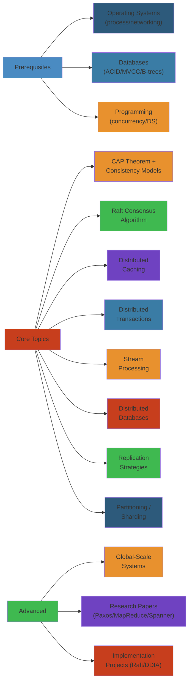

# 🌐 Distributed Systems Learning Roadmap — Complete Deep Dive

> **Scope:** A structured path through distributed systems theory and practice. Covers prerequisites, core topics in dependency order, research papers (must-read), implementation projects, and advanced topics. Each section pairs a topic with recommended resources and a hands-on project.




## Table of Contents

- [Prerequisites](#prerequisites)
- [Core Topics (Dependency Order)](#core-topics-dependency-order)
- [Topic Dependency Graph](#topic-dependency-graph)
- [Topic 1: CAP Theorem + Consistency Models](#topic-1-cap-theorem--consistency-models)
- [Topic 2: Raft Consensus Algorithm](#topic-2-raft-consensus-algorithm)
- [Topic 3: Distributed Caching](#topic-3-distributed-caching)
- [Topic 4: Distributed Transactions](#topic-4-distributed-transactions)
- [Topic 5: Stream Processing](#topic-5-stream-processing)
- [Topic 6: Distributed Consensus (Paxos)](#topic-6-distributed-consensus-paxos)
- [Topic 7: Distributed Databases](#topic-7-distributed-databases)
- [Topic 8: Replication Strategies](#topic-8-replication-strategies)
- [Topic 9: Partitioning / Sharding](#topic-9-partitioning--sharding)
- [Topic 10: Global-Scale Systems](#topic-10-global-scale-systems)
- [Research Papers (Must-Read)](#research-papers-must-read)
- [Implementation Projects](#implementation-projects)
- [Bookshelf](#bookshelf)

---

## Prerequisites

Before diving into distributed systems, you need solid fundamentals:

| Area | Minimum Knowledge | Recommended Resource |
|---|---|---|
| **Operating Systems** | Processes, threads, context switching, virtual memory, file systems, IPC (sockets, pipes, shared memory), scheduling | OSTEP (Arpaci-Dusseau), APUE (Stevens) |
| **Networking** | TCP/IP stack, UDP, DNS, HTTP/2, TLS, sockets, congestion control, NAT, load balancing | TCP/IP Illustrated Vol 1 (Stevens), Computer Networking (Kurose & Ross) |
| **Databases** | ACID, MVCC, B-trees, LSM-trees, SQL joins, indexing, query planning, transactions, isolation levels | Database Internals (Petrov), DDIA Part I (Kleppmann) |
| **Programming** | Concurrency (threads, locks, condition variables, async/await), data structures (hash tables, trees, sorted sets), profiling, debugging | Effective Java (Bloch), The Go Programming Language (Donovan & Kernighan) |

---

## Topic Dependency Graph

```
                    ┌───────────────────────────────────────┐
                    │        Prerequisites                   │
                    │  OS · Networking · Databases · Prog    │
                    └───────────┬───────────────────────────┘
                                │
                    ┌───────────▼───────────────┐
                    │  CAP Theorem              │
                    │  Consistency Models       │
                    └───────────┬───────────────┘
                                │
              ┌─────────────────┼─────────────────────┐
              │                 │                      │
     ┌────────▼───────┐  ┌─────▼──────────┐  ┌───────▼────────┐
     │  Raft Consensus│  │  Distributed   │  │  Replication   │
     │  Leader Elec.  │  │  Caching       │  │  Strategies    │
     │  Log Replic.   │  └─────┬──────────┘  │  Sync/Async    │
     └────────┬───────┘        │             │  Quorums       │
              │                │             └───────┬────────┘
              │                │                      │
     ┌────────▼───────┐  ┌─────▼──────────┐          │
     │  Paxos         │  │  Distributed   │          │
     │  Multi-Paxos   │  │  Transactions  │          │
     │  EPaxos        │  │  2PC, 3PC, Saga│          │
     └────────┬───────┘  └─────┬──────────┘          │
              │                │                      │
              └──────┬─────────┘                      │
                     │                                │
            ┌────────▼──────────┐       ┌─────────────▼──────────┐
            │  Stream Processing │       │  Distributed Databases │
            │  Kafka Streams    │       │  CockroachDB / TiDB    │
            │  Flink            │       │  Amazon Aurora          │
            └────────┬──────────┘       └─────────────┬──────────┘
                     │                                │
                     └──────────┬─────────────────────┘
                                │
                     ┌──────────▼──────────────┐
                     │  Partitioning / Sharding │
                     │  Consistent Hashing     │
                     └──────────┬──────────────┘
                                │
                     ┌──────────▼──────────────┐
                     │  Global-Scale Systems   │
                     │  Multi-region, Geo-dist  │
                     └─────────────────────────┘
```

---

## Topic 1: CAP Theorem + Consistency Models

#### Step-by-Step: Choosing Consistency Model for Your System

1. **Identify the problem domain**: Payment system? Social graph? Analytics?
2. **Assess partition likelihood**: Single datacenter (rare) vs multi-region (common)?
3. **Prioritize business requirement**: Is data loss worse than unavailability?
4. **Choose consistency**: 
   - Strong (CP): Prevents stale reads but may reject writes during partition
   - Eventual (AP): Accepts writes but users see stale data briefly
5. **Plan conflict resolution**: If AP, how do you merge divergent updates?
6. **Test under failure**: Chaos test network partitions, measure inconsistency window

#### Code Example

```java
// Consistency model selector (pseudocode)
if (domain.isPainfulIfDataLoss()) {
    // Payment system → CP (strong consistency)
    return new SpannerLikeDatabase();  // Blocks until majority ack
} else if (domain.isPainfulIfUnavailable()) {
    // Social media feed → AP (eventual consistency)
    return new CassandraLikeDatabase();  // Always accepts, converges later
} else if (domain.canTolerateStaleness(duration: "1 minute")) {
    // Analytics dashboard → Causal consistency
    return new DynamoDBLikeDatabase();  // Read your writes, but stale across regions
}
```

#### Real-World Scenario

A logistics company chose eventual consistency for package tracking (to avoid partitions blocking updates). During a network outage, parcels in transit showed "delivered" in one region and "in transit" in another for 30 minutes. When partition healed, data converged via timestamp, but customers saw conflicting statuses in the app, causing support tickets. They added a "last observed consistency timestamp" to the API response, helping users understand that data might be stale.

### Key Concepts
- **C**onsistency: Every read receives the most recent write or an error (linearizability)
- **A**vailability: Every request receives a (non-error) response, without guarantee it contains the most recent write
- **P**artition Tolerance: System continues to function despite arbitrary message loss between nodes
- **PACELC** extension: If partition (P), trade off A vs C; Else (E), trade off latency (L) vs consistency (C)
- Consistency models hierarchy:
  - **Strict** (sequential clock impossible)
  - **Linearizable** (real-time order, single-copy)
  - **Serializable** (total order of transactions)
  - **Snapshot Isolation** (reads see a consistent snapshot)
  - **Causal** (causally related operations ordered)
  - **PRAM** (FIFO order per process)
  - **Eventual** (converges if writes stop)

### Resources
| Resource | Type | Link |
|---|---|---|
| CAP Twelve Years Later: How the "Rules" Have Changed | Paper | Brewer, 2012 |
| Consistency Models | Blog | jepsen.io |
| PACELC Theorem | Paper | Abadi, 2012 |

### Implementation Project
**Build a CAP tradeoff simulator.**
- Implement a distributed key-value store where you can tune W/R/N (write/read/replication quorum).
- Measure: latency (p50, p99), consistency violations (stale reads), availability during partition.
- Show with `N=3, W=3, R=1` (CP) vs `N=3, W=1, R=1` (AP).

### Common Mistakes
- Claiming a system is "CA" without defining what partition tolerance means
- Confusing linearizability with serializability (linearizability = single-object ops; serializability = multi-object transactions)
- Assuming eventual consistency means "eventually" in wall-clock time

---

## Topic 2: Raft Consensus Algorithm

### Key Concepts
- **Leader Election**: Randomized timeouts (150–300ms), term numbers, request votes, majority required
- **Log Replication**: Client → Leader → Append to log → Replicate to followers → Commit on majority ack
- **Safety**: Election safety (only one leader per term), Log matching (logs consistent), Leader completeness (committed entries survive), State machine safety
- **Cluster Membership Change**: Joint consensus (C_old + C_new), single-server changes (simpler, most implementations)
- **Log Compaction**: Snapshotting (state machine snapshot at index X), install snapshot RPC for lagging followers

### Implementation Project
**Build a Raft-based distributed key-value store.**
- Language: Go (recommended), Java, Python, or Rust
- Implement: leader election, log replication, safety, persistence, snapshotting
- Test: network partition, leader crash, follower crash, split-brain prevention, concurrent client requests

### Resources
| Resource | Type | Link |
|---|---|---|
| In Search of an Understandable Consensus Algorithm | Paper | raft.github.io |
| The Raft Consensus Algorithm (video series) | Video | youtube.com (Raft lecture by Ongaro) |
| Raft Visualizations | Interactive | raft.github.io/raftscope |

### Code Snippet: Leader Election Loop
```python
# Simplified Raft leader election in Python-like pseudocode
class RaftNode:
    def run_election(self):
        self.current_term += 1
        self.voted_for = self.node_id
        self.state = CANDIDATE
        self.votes_received = 1
        self.election_timeout = random(150, 300)  # ms

        for peer in self.peers:
            peer.send(RequestVoteRequest(
                term=self.current_term,
                candidate_id=self.node_id,
                last_log_index=self.last_log_index,
                last_log_term=self.last_log_term
            ))

        # If majority votes received → become leader
        if self.votes_received > len(self.peers) // 2:
            self.state = LEADER
            self.next_index = {p: self.last_log_index + 1 for p in self.peers}
            self.match_index = {p: 0 for p in self.peers}
```

### Edge Cases
- Stale leader (network partition heals, old leader still thinks it's leader) — handled via term numbers
- No leader elected (split vote) — randomized timeouts ensure eventual single leader
- Committed entry not replicated — leader forces followers to overwrite conflicting entries

---

## Topic 3: Distributed Caching

### Key Concepts
- **Cache topologies**: side cache, write-through, write-behind, write-around, refresh-ahead
- **Eviction policies**: LRU, LFU, 2Q, ARC (Adaptive Replacement Cache with 4 lists: B1, T1, B2, T2), LIRS, Clock
- **Distributed design**: Partitioned (consistent hashing in memcached), Replicated (Redis Cluster with hash slots 0–16383), Tiered (L1: local LRU, L2: Redis Cluster)
- **Consistent Hashing**: Virtual nodes for load balance, ring with hash keys, minimal rehashing on node add/remove (K/n keys moved where K=total, n=nodes)
- **Hot key problem**: Single key receiving disproportionate traffic → local cache + jitter + hedging requests

### Implementation Project
**Build a distributed cache from scratch.**
- Consistent hashing with virtual nodes
- Wire protocol (Redis Serialization Protocol or custom binary)
- LRU + TTL eviction
- Client-side smart client (cache topology awareness)
- Member discovery via gossip

### Resources
| Resource | Type |
|---|---|
| memcached design | Code & docs |
| Redis Cluster Spec | redis.io |
| ARC paper: "ARC: A Self-Tuning, Low Overhead Replacement Cache" | Paper (Megiddo & Modha) |
| "Scaling Memcache at Facebook" | Paper (NSDI 2013) |

### Code Snippet: Consistent Hashing
```python
class ConsistentHashRing:
    def __init__(self, nodes: list[str], vnodes: int = 150):
        self.ring = {}
        self.vnodes = vnodes
        for node in nodes:
            for i in range(vnodes):
                key = self._hash(f"{node}:{i}")
                self.ring[key] = node
        self.sorted_keys = sorted(self.ring.keys())

    def get_node(self, key: str) -> str:
        if not self.ring:
            return None
        h = self._hash(key)
        # Binary search for first key >= h
        idx = bisect_left(self.sorted_keys, h)
        if idx == len(self.sorted_keys):
            idx = 0
        return self.ring[self.sorted_keys[idx]]
```

---

## Topic 4: Distributed Transactions

### Key Concepts
- **2PC (Two-Phase Commit)**: Coordinator -> Prepare -> All votes Yes? -> Commit. Blocking if coordinator crashes after Prepare.
- **3PC (Three-Phase Commit)**: CanCommit -> PreCommit -> DoCommit. Non-blocking under certain failures.
- **Saga Pattern**: Sequence of local transactions with compensating actions. Choreography (each service emits event, next listens) vs Orchestration (central orchestrator calls services + compensating actions).
- **TCC (Try-Confirm/Cancel)**: Try (reserve), Confirm (commit), Cancel (rollback). Used in payment systems.
- **Transactionally Staged Jobs**: Kafka transactions + exactly-once semantics.
- **Isolation via OCC**: Optimistic concurrency control with conflict detection at commit time.

### Implementation Project
**Build a saga orchestration engine.**
- Orchestrator that calls services in sequence
- Compensating actions on failure
- Persistent state (PostgreSQL or Kafka for event sourcing)
- Retry with exponential backoff + dead letter queue
- Idempotency keys

### Resources
| Resource | Type |
|---|---|
| "Sagas" (Hector Garcia-Molina & Kenneth Salem) | Paper, 1987 |
| "Consensus on Transaction Commit" (Paxos Commit) | Paper |
| Patterns: 2PC, Saga, TCC | microservices.io |

---

## Topic 5: Stream Processing

### Key Concepts
- **Event time vs processing time**: Watermarks (how late is too late), allowed lateness, side outputs for late data
- **Exactly-once semantics**: Idempotent sinks + transactional state + offsets managed transactionally
- **Stateful processing**: Keyed state, operator state, state backends (RocksDB, heap), state TTL, checkpointing
- **Windowing**: Tumbling, sliding, session windows, custom assigners, triggering (repeated, early, late firings)
- **Kafka Streams**: KTable (changelog), KStream (record stream), GlobalKTable, state stores, interactive queries
- **Flink**: Checkpoint alignment, savepoints, rescaling, operator chain, network buffers, backpressure

### Implementation Project
**Build a streaming ETL pipeline.**
- Kafka → Flink → S3 (real-time data lake ingestion)
- Transform: parse JSON, enrich with lookup table, filter anomalies, aggregate 5-min windows
- Exactly-once delivery to S3 via Flink's StreamingFileSink
- Monitoring: consumer lag, checkpoint duration, backpressure

### Resources
| Resource | Type |
|---|---|
| *Streaming Systems* | Book (Akidau, Chernyak, Lax) |
| "Kafka: a Distributed Messaging System" | Paper (Kreps et al.) |
| Flink documentation | ci.apache.org |
| "The Dataflow Model" | Paper (VLDB 2015) |

---

## Topic 6: Distributed Consensus (Paxos)

### Key Concepts
- **Basic Paxos**: Proposer (send Prepare), Acceptor (promise, highest N), Learner. Quorum intersection ensures safety.
- **Multi-Paxos**: Elect a distinguished leader (stable leader), skip Prepare phase for subsequent rounds. Leader leases.
- **Fast Paxos**: Clients send directly to acceptors, reduces to one round trip. Requires intersecting quorums (classic + fast).
- **Cheap Paxos**: Non-acceptors are "auxiliary" — only activated during failures to maintain quorum.
- **EPaxos (Egalitarian Paxos)**: No distinguished leader. Any node can propose commands. Commutative commands execute concurrently.
- **Implementations**: etcd (Raft), ZooKeeper (ZAB), Consul (Raft), Google Chubby (Paxos), Apache BookKeeper (Quorum).

### Implementation Project
**Implement Multi-Paxos from scratch.**
- Proposer → Prepare (N) → Acceptor Promise (N, accepted[N]) → Proposer → Accept (N, V) → Acceptor → Accepted(N)
- Leader election: stable leader via leasing
- Batching + pipelining for throughput
- Compare performance with Raft implementation

### Resources
| Resource | Type |
|---|---|
| "Paxos Made Simple" | Paper (Lamport) |
| "Paxos Made Live" | Paper (Chandra et al.) |
| "In Search of an Understandable Consensus Algorithm" | Paper (Raft, as foil to Paxos) |
| "The Part-Time Parliament" | Paper (Lamport, original Paxos) |

---

## Topic 7: Distributed Databases

### Key Concepts
- **CockroachDB**: Spanner-inspired. Per-node HLC (Hybrid Logical Clock), writes serialized via Raft, reads from leaseholder. Range splits/merges automatic. Serializable isolation via write intent + commit wait.
- **TiDB**: Google Spanner + HBase architecture. TiDB (stateless SQL layer), TiKV (distributed KV with Raft), PD (placement driver for auto-shard + scheduling). HTAP: TiFlash (columnar replica) for OLAP.
- **Amazon Aurora**: MySQL/PostgreSQL compatible. Storage pushed to 6-replica quorum across 3 AZs. 4/6 writes, 3/6 reads. Only redo log sent to storage — no double-write. Crash recovery: storage computes pages from redo.
- **FoundationDB**: Deterministic simulation testing. Layers for Document, SQL, Tuple store. Strict serializability.

### Implementation Project
**Build a mini distributed SQL database.**
- SQL parser → logical plan → physical plan → distributed execution
- Raft consensus for replication
- Range-based partitioning (like CockroachDB)
- Distributed JOIN (broadcast vs hash vs merge)
- Consistency: snapshot isolation

### Resources
| Resource | Type |
|---|---|
| *Database Internals* | Book (Petrov) |
| CockroachDB design docs | cockroachlabs.com |
| TiDB Internal docs | pingcap.com |
| "Spanner: Google's Globally-Distributed Database" | Paper (OSDI 2012) |

---

## Topic 8: Replication Strategies

### Key Concepts
- **Single-leader** (master-slave): All writes to one node. Async (fast, data loss risk), Sync (safe, slow, one slave at a time), Semi-sync (wait for one slave).
- **Multi-leader**: Write to multiple leaders, conflict resolution. CRDTs (state-based: merge via LUB; op-based: commutative ops), last-write-wins (LWW, with hybrid logical clocks), conflict-free replicated data types (PN-Counter, G-Set, OR-Set, LWW-Register, RGA for lists).
- **Leaderless** (Dynamo-style): Writes to all replicas, read repair, hinted handoff. Quorum N/R/W for consistency.
- **Quorum**: N = number of replicas, W = write ack count, R = read ack count. W + R > N for strong consistency.
- **Read-after-write consistency**: Read your writes (RYW), monotonic reads, bounded staleness.

### Implementation Project
**Build a replication library with configurable topologies.**
- Single-leader with switchable sync/async
- Multi-leader with CRDT-based conflict resolution (LWW-Register + OR-Set)
- Leaderless with quorum N=3, configurable W/R
- Benchmark: throughput, staleness, durability under crash

### Resources
| Resource | Type |
|---|---|
| *DDIA* Part II, Ch 5 "Replication" | Book |
| "Dynamo: Amazon's Highly Available Key-value Store" | Paper (SOSP 2007) |
| "CRDTs: Consistency without Consensus" | Paper |

---

## Topic 9: Partitioning / Sharding

### Key Concepts
- **Hash partitioning**: hash(key) % N partitions. Cannot do range queries. Rebalancing moves O(K/N) keys. Consistent hashing reduces this to O(K/n).
- **Range partitioning**: Keys ordered. Good for range scans. Risk of hotspots. Need to split/merge ranges.
- **Directory-based**: External lookup service maps key → partition. Flexibility. Extra hop.
- **Rebalancing challenges**: Reduce data movement, limit impact on read/write throughput, avoid cascading rebalancing.
- **Partitioning secondary indexes**: Document-based (each partition maintains local index → scatter/gather queries), Term-based (global index → writes are distributed but reads are single-partition).
- **Skew detection**: Identify hot partitions, split them, merge cold ones. Auto-rebalancing triggers.

### Implementation Project
**Build a partitioned key-value store with auto-rebalancing.**
- Range partitioning with split/merge
- Partition metadata manager (etcd or ZooKeeper)
- Query routing (partition-aware proxy or smart client)
- Auto-split when partition exceeds threshold size
- Dashboard showing partition size / QPS distribution

### Resources
| Resource | Type |
|---|---|
| *DDIA* Part II, Ch 6 "Partitioning" | Book |
| "Bigtable: A Distributed Storage System" | Paper (OSDI 2006) |
| Consistent hashing paper: Karger et al. | Paper |

---

## Topic 10: Global-Scale Systems

### Key Concepts
- **Multi-region deployments**: Active-passive (single region active, others standby), Active-active (all regions serve reads/writes, conflict resolution), Close-latency (routing to nearest region via GeoDNS).
- **Global consensus**: Spanner TrueTime (GPS + atomic clocks, bounded clock uncertainty ε, commit wait = 2ε), Clock-SI (Microsoft, loosely synchronized clocks + timestamp ordering).
- **Geo-distributed storage**: CRDTs for conflict-free merges across regions. DynamoDB Global Tables, CosmosDB multi-master.
- **Global load balancing**: BGP anycast (same IP advertised from multiple locations), DNS-based (GeoDNS, latency-based routing). DNS TTL tradeoffs.
- **Content Delivery Networks**: Edge caching, origin pull, surge pricing, cache invalidation via purge API.
- **Eventual consistency at scale**: Inconsistency window depends on replication lag. Amazon reports < 1 second p99 across regions with DynamoDB Global Tables.

### Implementation Project
**Build a global-scale URL shortener.**
- Multi-region active-active (US, EU, Asia)
- GeoDNS routing users to nearest region
- Cross-region replication (async)
- Conflict resolution: timestamp-based (LWW)
- Cache at edge (CloudFront/CDN)
- Metrics: p99 latency per region, conflict rate, stale read rate

### Resources
| Resource | Type |
|---|---|
| "Spanner: Google's Globally-Distributed Database" | Paper |
| "DynamoDB Global Tables" | AWS docs |
| "Time, Clocks, and the Ordering of Events" | Paper (Lamport) |
| *Designing Data-Intensive Applications* | Book |

---

## Research Papers (Must-Read)

Sorted by reading priority for a distributed systems engineer:

| # | Paper | Why | Est. Reading |
|---|---|---|---|
| 1 | In Search of an Understandable Consensus Algorithm (Raft) | Best introduction to consensus | 2 hrs |
| 2 | Dynamo: Amazon's Highly Available Key-value Store | NoSQL + replication + quorum | 3 hrs |
| 3 | Bigtable: A Distributed Storage System | Column stores at scale | 2 hrs |
| 4 | MapReduce: Simplified Data Processing on Large Clusters | Batch processing paradigm | 2 hrs |
| 5 | The Google File System | Distributed file system design | 3 hrs |
| 6 | Spanner: Google's Globally-Distributed Database | Global consistency with TrueTime | 4 hrs |
| 7 | ZooKeeper: Wait-free Coordination for Internet-scale Systems | Coordination service internals | 2 hrs |
| 8 | Kafka: a Distributed Messaging System | Messaging at scale | 2 hrs |
| 9 | Large-scale Cluster Management at Google with Borg | Cluster orchestration | 3 hrs |
| 10 | Paxos Made Simple | Consensus (concise) | 2 hrs |
| 11 | Time, Clocks, and the Ordering of Events in a Distributed System | Foundational theory | 3 hrs |
| 12 | Impossibility of Distributed Consensus with One Faulty Process (FLP) | Consensus impossibility | 2 hrs |
| 13 | Harvest, Yield, and Scalable Tolerant Systems (BASE) | Consistency vs availability | 1 hr |
| 14 | CRDTs: Consistency without Concurrency Control | Conflict-free data types | 3 hrs |
| 15 | The Dataflow Model: A Practical Approach to Balancing Correctness, Latency, and Cost | Stream processing | 4 hrs |
| 16 | Dapper: A Large-Scale Distributed Systems Tracing Infrastructure | Distributed tracing | 2 hrs |
| 17 | Tail at Scale (Dean & Barroso) | Tail latency amplification | 1 hr |
| 18 | The Byzantine Generals Problem | Byzantine fault tolerance | 2 hrs |

---

## Implementation Projects

Ordered by difficulty, each with ~2–4 weeks of effort:

```
  Project                Core Concepts                             Difficulty
───────────────────────  ────────────────────────────────────────  ──────────
1. KV Store (Raft-bsd)   Consensus, log replication, persistence   Medium
2. Distributed Cache     Consistent hashing, eviction, gossip      Medium
3. Load Balancer         Round-robin, least-conn, consistent hash  Easy
4. Message Queue         Topics, partitions, consumer groups        Medium
5. Distributed Lock      Lease, fencing token, deadlock detection   Medium-Hard
6. Task Scheduler        Cron, retry with backoff, leader election  Hard
7. Streaming ETL         Kafka, Flink, state, watermarks           Hard
8. Distributed SQL       Parser, planner, distributed executor     Expert
9. Global URL Shortener  Geo-dist, CDN, CRDTs, multi-region        Expert
```

---

## Bookshelf

| Book | Author(s) | Phase |
|---|---|---|
| *Designing Data-Intensive Applications* | Martin Kleppmann | Core |
| *Database Internals* | Alex Petrov | Core |
| *Operating Systems: Three Easy Pieces* | Arpaci-Dusseau | Pre-req |
| *Streaming Systems* | Akidau, Chernyak, Lax | Streams |
| *TCP/IP Illustrated Vol 1* | Stevens | Pre-req |
| *Site Reliability Engineering* | Beyer et al. | Production |
| *Building Microservices* (2nd Ed.) | Sam Newman | Architecture |
| *The Linux Programming Interface* | Michael Kerrisk | OS |

---

> **Next step:** Start with [Topic 2: Raft Consensus Algorithm](#topic-2-raft-consensus-algorithm) and implement the key-value store. Move to [Topic 1](#topic-1-cap-theorem--consistency-models) for the theoretical lens to understand why Raft works. Then proceed linearly through Topics 3–10.


## Practical Example

See code examples above for practical usage patterns.

---

## Interactive: Distributed Systems Architecture Map

<div style="padding:16px;background:#0b0e14;border:1px solid #1e2a3a;border-radius:8px">
  <style>
    .topology-title {
      color:#00d4ff;
      font-family:monospace;
      font-size:14px;
      font-weight:bold;
      margin-bottom:12px;
      letter-spacing:1px;
    }
    .topology-svg {
      width:100%;
      max-width:600px;
      height:300px;
      background:#1a2332;
      border:1px solid #1e3a5f;
      border-radius:4px;
    }
  </style>

  <div class="topology-title">Distributed System Core Components</div>
  <svg class="topology-svg" viewBox="0 0 600 300">
    <!-- Consensus Layer -->
    <g>
      <rect x="180" y="20" width="240" height="50" rx="4" fill="#1a2332" stroke="#fbbf24" stroke-width="2"/>
      <text x="300" y="50" text-anchor="middle" fill="#fbbf24" font-size="12" font-family="monospace" font-weight="bold">Consensus (Raft/Paxos)</text>
    </g>
    <!-- Core Services -->
    <g>
      <rect x="30" y="110" width="140" height="50" rx="4" fill="#1e3a5f" stroke="#00d4ff" stroke-width="1"/>
      <text x="100" y="140" text-anchor="middle" fill="#e3eaf0" font-size="11" font-family="monospace">State Machine</text>
    </g>
    <g>
      <rect x="230" y="110" width="140" height="50" rx="4" fill="#1e3a5f" stroke="#00d4ff" stroke-width="1"/>
      <text x="300" y="140" text-anchor="middle" fill="#e3eaf0" font-size="11" font-family="monospace">Replication</text>
    </g>
    <g>
      <rect x="430" y="110" width="140" height="50" rx="4" fill="#1e3a5f" stroke="#00d4ff" stroke-width="1"/>
      <text x="500" y="140" text-anchor="middle" fill="#e3eaf0" font-size="11" font-family="monospace">Consistency</text>
    </g>
    <!-- Application -->
    <g>
      <rect x="100" y="210" width="400" height="50" rx="4" fill="#1e3a5f" stroke="#60a5fa" stroke-width="1"/>
      <text x="300" y="240" text-anchor="middle" fill="#60a5fa" font-size="12" font-family="monospace" font-weight="bold">Application Logic (KV, DB, Cache)</text>
    </g>
    <!-- Lines -->
    <line x1="100" y1="110" x2="180" y2="70" stroke="#1e3a5f" stroke-width="1"/>
    <line x1="300" y1="110" x2="300" y2="70" stroke="#1e3a5f" stroke-width="1"/>
    <line x1="500" y1="110" x2="420" y2="70" stroke="#1e3a5f" stroke-width="1"/>
  </svg>
</div>

---

## Interactive: Distributed System States

<div style="padding:16px;background:#0b0e14;border:1px solid #1e2a3a;border-radius:8px">
  <style>
    .state-machine-title {
      color:#00d4ff;
      font-family:monospace;
      font-size:14px;
      font-weight:bold;
      margin-bottom:16px;
      letter-spacing:1px;
    }
    .state-demo {
      text-align:center;
    }
    .state-display {
      font-size:18px;
      font-family:monospace;
      padding:16px;
      border-radius:4px;
      margin:16px 0;
      color:#0b0e14;
      font-weight:bold;
      min-height:50px;
      display:flex;
      align-items:center;
      justify-content:center;
      border:2px solid currentColor;
    }
    .state-consistent { background:#34d399;border-color:#22c55e }
    .state-eventual { background:#60a5fa;border-color:#3b82f6 }
    .state-strong { background:#a78bfa;border-color:#8b5cf6 }
    .state-buttons {
      display:flex;
      gap:8px;
      justify-content:center;
      flex-wrap:wrap;
      margin-top:16px;
    }
    .state-button {
      padding:8px 16px;
      border:1px solid #00d4ff;
      background:#1e3a5f;
      color:#00d4ff;
      border-radius:4px;
      cursor:pointer;
      font-family:monospace;
      font-size:12px;
      transition:all 0.2s;
    }
    .state-button:hover {
      background:#2a5a8f;
      box-shadow:0 0 8px #00d4ff;
    }
  </style>

  <div class="state-machine-title">Consistency Models</div>
  <div class="state-demo">
    <div class="state-display state-consistent" id="consistency-state">STRONG CONSISTENCY</div>
    <div class="state-buttons">
      <button class="state-button" onclick="setConsistency('STRONG')">Strong</button>
      <button class="state-button" onclick="setConsistency('EVENTUAL')">Eventual</button>
      <button class="state-button" onclick="setConsistency('CAUSAL')">Causal</button>
    </div>
  </div>

  <script>
    const consistencyMap = {
      'STRONG': { label: 'STRONG CONSISTENCY', class: 'state-consistent' },
      'EVENTUAL': { label: 'EVENTUAL CONSISTENCY', class: 'state-eventual' },
      'CAUSAL': { label: 'CAUSAL CONSISTENCY', class: 'state-strong' }
    };
    function setConsistency(model) {
      const display = document.getElementById('consistency-state');
      const info = consistencyMap[model];
      display.textContent = info.label;
      display.className = 'state-display ' + info.class;
    }
  </script>
</div>