# 🏗️ System Design Interview Prep — Complete Deep Dive

> **Scope:** A comprehensive, battle-tested preparation guide for system design interviews at FAANG/top-tier companies. Covers the interview format, assessment criteria, the standard framework, common design patterns, database selection guide, consistency-availability tradeoff matrix, and the top 30 questions with difficulty ratings, key patterns, and black belt tradeoffs.

```mermaid
graph TD
    REQ["Requirements<br/>Functional + Non-Functional"] --> ENT["Core Entities<br/>User, Tweet, Order, Video"]
    ENT --> API["API Design<br/>REST / gRPC / WebSocket"]
    API --> DM["Data Model<br/>SQL vs NoSQL vs NewSQL"]
    DM --> HLD["High-Level Design<br/>Boxes & Arrows"]
    HLD --> DD["Deep Dive<br/>Cache, Sharding, Leader Election"]
    DD --> TR["Tradeoffs<br/>CAP, PACELC, Consistency vs Latency"]
    TR --> SC["Scaling<br/>10x, 100x, 1000x"]
    SC --> FA["Failure Analysis<br/>Single Point, Cascading, Data Loss"]

    style REQ fill:#4a8bc2
    style ENT fill:#3a7ca5
    style API fill:#2d5a7b
    style DM fill:#1e3e5c
    style HLD fill:#6f42c1
    style DD fill:#e8912e
    style TR fill:#c73e1d
    style SC fill:#d94a2a
    style FA fill:#b5321a
```




## Table of Contents

- [Interview Format & Timeline](#interview-format--timeline)
- [Assessment Criteria (What Interviewers Measure)](#assessment-criteria-what-interviewers-measure)
- [System Design Framework](#system-design-framework)
- [Common Design Patterns (Reusable Building Blocks)](#common-design-patterns-reusable-building-blocks)
- [Database Selection Guide](#database-selection-guide)
- [Consistency vs Availability Tradeoff Matrix](#consistency-vs-availability-tradeoff-matrix)
- [Top 30 System Design Questions](#top-30-system-design-questions)
- [Black Belt Tradeoffs](#black-belt-tradeoffs)
- [Preparation Strategy](#preparation-strategy)

---

## Interview Format & Timeline

#### Step-by-Step: Ace a 45-Minute System Design Interview

1. **First 5 min (Ask questions)**: What's the scope? DAU? Read/write ratio? Latency SLA?
2. **Next 10 min (Plan)**: Map functional & non-functional requirements, identify bottlenecks
3. **Next 15 min (Design)**: Draw HLD with boxes (client, LB, API, cache, DB, queue)
4. **Last 15 min (Deep dive)**: Pick one interesting component (cache, sharding, leader election)
5. **Throughout (Communicate)**: Explain your reasoning, invite feedback, adjust based on hints

#### Code Example

```
System Design Interview Timing (Example: URL Shortener)

00:00 - 05:00 REQUIREMENTS
  Q: How many users?
  Q: How long should short URL last?
  Q: Need custom slugs?
  A: 100M DAU, 1B total URLs, 10-year retention, yes custom slugs

05:00 - 10:00 CORE ENTITIES & API
  Entity: URL(id, original_url, short_code, created_at, expires_at)
  API: POST /shorten (returns short_code)
       GET /{short_code} (returns 301 redirect to original_url)

10:00 - 20:00 HIGH-LEVEL DESIGN
  [Client] → [LB] → [App Servers] → [Redis Cache] → [PostgreSQL]
                        ↓
                   [ID Generator] (Snowflake)
                        ↓
                   [Convert to Base62]

20:00 - 35:00 DEEP DIVE: Collision Handling
  Problem: Two users might generate the same short code
  Solution 1: Check if exists, regenerate
  Solution 2: Append counter to original URL before hashing
  Solution 3: Use distributed ID generator (guarantees uniqueness)
  
  Chose Solution 3 (Snowflake → base62 encoding)

35:00 - 45:00 TRADEOFFS & SCALING
  Cache hit rate: 80% of reads hit 20% of URLs
  Redis cluster for hot URLs
  Database replication for reads
  Bloom filter to prevent cache misses on nonexistent codes
```

#### Real-World Scenario

A candidate at a FAANG interview spent 30 minutes on the HLD, leaving only 15 minutes for deep dive. Interviewer asked "How would you handle a hot URL receiving 100K requests per second?" The candidate panicked, couldn't think through multi-tier caching strategy in the remaining time, and got medium rating (expected: high). Post-interview feedback: "Paced too slowly on HLD; should have spent 15 min there, 20 min on deep dive."

```
High-Level Design (HLD) — 45 minutes
─────────────────────────────────────
 0:00 – 05:00  Clarify requirements, scope, constraints
 5:00 – 15:00  Functional → Non-functional → Core entities → API
15:00 – 30:00  High-level design (whiteboard boxes & arrows)
30:00 – 45:00  Deep dive, tradeoffs, bottlenecks, failure scenarios

Low-Level Design (LLD) — 60 minutes
─────────────────────────────────────
 0:00 – 10:00  Requirements, entities, class diagram
10:00 – 30:00  Detailed design (DB schema, API contracts, protocols)
30:00 – 50:00  Implementation details (concurrency, consistency, edge cases)
50:00 – 60:00  Tradeoffs, follow-ups, scaling

Follow-up Rounds — 30 minutes each
─────────────────────────────────────
  - Capacity estimation drill
  - Failure mode analysis
  - Real-world tradeoff discussion (given a specific constraint)
  - Debugging a production issue in the designed system
```

## Assessment Criteria (What Interviewers Measure)

| Criterion | Weight | What They Look For |
|---|---|---|
| **Architecture** | 25% | Clear structure with logical boundaries, separation of concerns, suitable patterns |
| **Scalability** | 20% | Handles growth in users/data/traffic. Identifies bottlenecks and proposes solutions (sharding, caching, partitioning). |
| **Consistency & Availability** | 15% | Articulates tradeoffs. Chooses appropriate consistency model for the problem. |
| **Communication** | 15% | Structured, clear explanation. Uses diagrams, does not jump ahead. Invites feedback. |
| **Tradeoffs** | 15% | Can articulate why X over Y. Knows the downsides of the chosen approach. Proposes alternatives. |
| **Handling Feedback** | 10% | Incorporates hints. Adjusts design when asked. Doesn't get defensive. |

---

## System Design Framework

```
 ┌─────────────────────────────────────────────────────────────────────────────┐
 │                     System Design Framework Flowchart                        │
 └─────────────────────────────────────────────────────────────────────────────┘

 START
   │
   ▼
 ┌──────────────────┐
 │ 1. Requirements   │
 │ - Functional      │
 │ - Non-functional  │
 │ - Constraints     │
 └────────┬─────────┘
          │
          ▼
 ┌──────────────────┐
 │ 2. Core Entities  │
 │ (objects, data)   │
 └────────┬─────────┘
          │
          ▼
 ┌──────────────────┐
 │ 3. API Design     │
 │ (REST / gRPC / WS)│
 └────────┬─────────┘
          │
          ▼
 ┌──────────────────┐
 │ 4. Data Model     │
 │ (DB choice, schema)│
 └────────┬─────────┘
          │
          ▼
 ┌──────────────────┐
 │ 5. High-Level     │
 │    Design         │
 │ (boxes & arrows)  │
 └────────┬─────────┘
          │
          ▼
 ┌──────────────────┐
 │ 6. Deep Dive      │
 │ (key component)   │
 └────────┬─────────┘
          │
          ▼
 ┌──────────────────┐
 │ 7. Tradeoffs      │
 │ (pros/cons/downs) │
 └────────┬─────────┘
          │
          ▼
 ┌──────────────────┐
 │ 8. Scaling        │
 │ (10x, 100x, 1000x)│
 └────────┬─────────┘
          │
          ▼
 ┌──────────────────┐
 │ 9. Failure        │
 │    Analysis       │
 └────────┬─────────┘
          │
          ▼
       REPEAT / DEEPEN
```

### Step-by-Step Breakdown

**1. Requirements — 5 min**
- Functional: "What should the system do?" (e.g., upload photo, generate short URL, send message)
- Non-functional: "What properties?" (e.g., latency p99 < 200ms, 99.99% uptime, support 1B users)
- Constraints: DAU, peak QPS, storage estimate, data retention

**2. Core Entities — 2 min**
- Identify 3–6 key objects (User, Tweet, URL, Order, Video, etc.)
- Define their relationships

**3. API Design — 3 min**
- REST endpoints: POST /shorten, GET /{shortCode}
- Request/response schemas
- For data-heavy systems, discuss batch APIs

**4. Data Model — 5 min**
- Schema for core entities (denormalized or normalized?)
- Database selection (SQL vs NoSQL vs NewSQL)
- Index strategy

**5. High-Level Design — 15 min**
- Draw boxes (Client, LB, API Gateway, Service, DB, Cache, Queue, CDN)
- Draw arrows with protocol (HTTP, gRPC, WebSocket, Kafka)
- Data flow for a primary request

**6. Deep Dive — 10 min**
- Pick the most interesting or bottleneck component
- Zoom in: cache internals, database sharding, leader election, rate limiting algorithm

**7. Tradeoffs — 3 min**
- "Why did you choose SQL over NoSQL?"
- "What happens if our cache layer goes down?"
- "What's the consistency vs latency tradeoff in your design?"

**8. Scaling — 3 min**
- 10x traffic → what breaks first? (DB, cache hit ratio, network bandwidth, LB capacity)
- 100x → what architecture changes needed? (sharding, multi-region, CDN)
- 1000x → what fundamentally changes? (geo-distribution, eventual consistency, async everything)

**9. Failure Analysis — 2 min**
- Single component failure → what happens?
- Cascading failure → how to prevent? (circuit breaker, bulkhead, rate limiting)
- Data loss → durability guarantees?

---

## Common Design Patterns (Reusable Building Blocks)

| Pattern | Use When | Example |
|---|---|---|
| **Consistent Hashing** | Need to add/remove cache nodes with minimal rehashing | Memcached, Cassandra |
| **Read Replicas** | Read-heavy workload, eventual consistency acceptable | Instagram posts, blog |
| **CDN** | Global users, static or cacheable content | Netflix, YouTube, images |
| **Async Processing / Queue** | Slow operation doesn't need sync response | Email sending, video transcoding |
| **Sharding** | Data won't fit on single node, write throughput exceeds a single node | WhatsApp messages, Uber trips |
| **Caching (multi-tier)** | Hot data, reduce DB load, reduce latency | L1 (local LRU) → L2 (Redis) → DB |
| **Idempotency** | At-least-once delivery, network retry, duplicate requests are possible | Payment processing |
| **Rate Limiting** | Protect system from abuse, fair usage, cost control | API gateway (token bucket, sliding window) |
| **Circuit Breaker** | Protect system from cascading failure when dependency is slow/failing | Service mesh, Resilience4j |
| **Leader Election** | Need one node to act as coordinator, schedule tasks | Raft, ZooKeeper, etcd |
| **Load Balancing** | Distribute traffic across multiple servers | L4 (TCP), L7 (HTTP), DNS-based, Geo-LB |
| **Microservices** | Large team, independent deploy, polyglot, bounded contexts | Uber, Netflix, Amazon |
| **Event-Driven** | Decouple producers and consumers, async, extensible | Kafka, SQS, EventBridge |
| **CQRS** | Different read/write models, read performance optimized separately | Reporting, analytics |
| **Saga** | Distributed transaction across services without 2PC | Order → Payment → Inventory |
| **Bloom Filter** | Probabilistic membership check, cache stampede prevention | Caching layer (is key in DB?), web crawler URL dedup |
| **Merkle Tree** | Compare large datasets across nodes, detect inconsistency | Cassandra anti-entropy, Git, Bitcoin |
| **Gossip Protocol** | Decentralized failure detection, metadata dissemination | Cassandra, Redis Cluster, Consul |
| **Quorum** | Tune consistency vs latency with N, W, R | Dynamo-style storage |

---

## Database Selection Guide

```
 ┌──────────────────────────────────────────────────────────────────────────────┐
 │                     DATABASE SELECTION DECISION TREE                         │
 └──────────────────────────────────────────────────────────────────────────────┘

 Do you need ACID transactions?
 ├── YES ──> Are you read-heavy? Scale reads via replicas?
 │             ├── YES ──> PostgreSQL / MySQL + read replicas
 │             └── NO  ──> Is latency critical?
 │                           ├── YES ──> Single-region SQL + caching tier
 │                           └── NO  ──> Distributed SQL (CockroachDB, TiDB)
 │
 └── NO ──> What is the data model?
              ├── Document (JSON, nested) ──> MongoDB, Couchbase
              ├── Key-Value ──> Redis (cache), DynamoDB, FoundationDB
              ├── Wide-Column ──> Cassandra, ScyllaDB, HBase
              ├── Graph ──> Neo4j, Amazon Neptune, Dgraph
              ├── Time-Series ──> InfluxDB, TimescaleDB, ClickHouse
              └── Search / Full-text ──> Elasticsearch, Meilisearch, Algolia
```

### Database Comparison Table

| Feature | PostgreSQL | MongoDB | Cassandra | Redis | CockroachDB | DynamoDB |
|---|---|---|---|---|---|---|
| Data Model | Relational | Document | Wide-column | KV + data structs | Relational | KV + Document |
| Consistency | Strong | Tunable | Eventual / Tunable | Strong (single node) | Strong (Serializable) | Eventual / Strong |
| Partitioning | Manual (sharding) | Hash-based | Consistent Hashing | Hash Slots | Auto range-split | Auto hash |
| Replication | Leader + replicas | Replica set | Peer-to-peer | Leader + replicas | Multi-active Raft | Multi-region |
| Transactions | ACID | Multi-doc ACID | Lightweight | MULTI/EXEC | Serializable | TransactGet |
| Query | SQL | MQL | CQL | Commands | SQL | PartiQL / API |
| Best for | General purpose | Rapid prototyping | Write-heavy, multi-DC | Caching, real-time | Geo-distributed SQL | Serverless KV |

---

## Consistency vs Availability Tradeoff Matrix

```
       AVAILABILITY
       HIGH <─────────────────────────────> LOW
         │                                      │
         │  AP Systems           │    CP Systems │
   HIGH  │  Cassandra            │    Spanner    │
         │  DynamoDB             │    etcd       │
         │  Riak                 │    ZooKeeper  │
   C      │  CouchDB              │    HBase      │
   O      │                       │               │
   N      │  [DNS, CDN,          │    [Leader     │
   S      │   Shopping cart,     │     election,  │
   I      │   Social feed]       │     meta-      │
   S      │                       │     data]     │
   T      │                       │               │
   E      ├───────────────────────┼───────────────┤
   N      │  Highly Available    │  Strict        │
   C      │  but may miss writes │  Consistency   │
   Y      │  Example: Cassandra  │  but may be    │
         │  W=1 R=1 Quorum      │  unavailable   │
   LOW   │  Quick responses      │  Example:      │
         │                       │  Spanner /     │
         │  "Eventual"           │  ZK / etcd     │
         │                       │                │
         │                       │  "Serializable"│
         └───────────────────────────────────────┘
```

### PACELC Distribution

| System | P → A/C | E → L/C | Notes |
|---|---|---|---|
| Cassandra | **A** (AP) | **L** (low latency, eventual) | W=1, R=1 |
| Spanner | **C** (CP) | **C** (strong, 2ε wait) | Serializable, high latency cross-region |
| DynamoDB | **A** (AP) | **L** (eventual default) | Strong consistent reads cost 2x |
| etcd | **C** (CP) | **C** (linearizable) | Core to Kubernetes |
| CockroachDB | **C** (CP) | **C** (serializable) | Leaseholder reads fast, writes at quorum latency |
| Redis | **C** (no partition) | **L** (fast, async) | Cluster mode sacrifices strong consistency |

---

## Top 30 System Design Questions

```
Difficulty Key:  ★★★★☆ Easy | ★★★★☆ Medium | ★★★★★ Hard | ★★★★★ Expert
```

| # | Question | Difficulty | Key Patterns |
|---|---|---|---|
| 1 | **Design URL Shortener (TinyURL)** | ★★★☆☆ | Hashing (base62, MD5, birthday problem), redirection (301 vs 302), NoSQL KV, idempotent creation, custom slug, analytics tracking, bloom filter for spam |
| 2 | **Design WhatsApp** | ★★★★★ | WebSocket long-lived connection, chat sharding (by chat_id hash), presence (heartbeat + disco), E2E encryption, media CDN, offline message store, last-seen |
| 3 | **Design Twitter** | ★★★★★ | Fan-out on write (pre-compute timeline for active users) vs fan-out on read (pull for celebrities), tweet ID (Snowflake), newsfeed ranking, timeline caching, social graph storage |
| 4 | **Design Uber** | ★★★★★ | Geohashing (quadtree for geo-indexing), state machine (idle → looking → assigned → picked_up → in_trip → completed), real-time location streaming via WebSocket, surge pricing, ETA prediction, geo-fencing |
| 5 | **Design YouTube** | ★★★★★ | Video upload pipeline (transcoding, thumbnails, chunked upload), CDN distribution (MPEG-DASH, HLS), stream protocol (adaptive bitrate), recommendation engine, comments, views counter (eventual + exact) |
| 6 | **Design Netflix** | ★★★★★ | CDN-first (Open Connect appliances at ISP), stateless client + stateful manifest, DRM, encoding pipeline, recommendation via matrix factorization + deep learning, A/B testing at scale |
| 7 | **Design Instagram** | ★★★★☆ | Photo storage (CDN: image resizing, WebP, AVIF), feed generation (fan-out with rank), stories (ephemeral, per-user TTL), hashtag index, direct messaging, real-time notifications |
| 8 | **Design Dropbox** | ★★★★☆ | File sync protocol (delta sync, block-level dedup, CouchDB-style merge), conflict resolution (CRDT or LWW + manual), chunk storage (S3/GCS), metadata DB (SQL), LAN sync, versioning |
| 9 | **Design Google Drive** | ★★★★☆ | Similar to Dropbox + real-time collaboration (CRDT/OT), document revision history, workspace integration, sharing permissions model, team drives, offline sync |
| 10 | **Design Amazon (e-commerce)** | ★★★★★ | Product catalog (sharded + denormalized), shopping cart (in-memory + persist), order management (saga: payment → inventory → shipping), inventory (real-time count, cache + DB), payment (idempotency, PCI DSS), recommendation engine |
| 11 | **Design Facebook Newsfeed** | ★★★★★ | Feed generation (fan-out: push for active friends, pull for pages), ranking (ML features: affinity, recency, content type), ads insertion, real-time updates via WebSocket, A/B experiment platform |
| 12 | **Design Google Maps** | ★★★★★ | Geo-indexing (quadtree, S2 geometry, H3), routing (Dijkstra/A* on road graph with traffic weights), real-time traffic, reverse geocoding, offline maps, tile rendering, navigation (voice + lane assist) |
| 13 | **Design Web Crawler** | ★★★★★ | URL frontier (politeness per domain, priority), deduplication (bloom filter + Merkle tree), content extraction (HTML parsing, text extraction), crawl schedule, robots.txt compliance, rate limiting per domain |
| 14 | **Design Chat System** | ★★★★☆ | WebSocket persistent connection (presence, typing indicator, read receipts), message storage (sharded by conversation_id + time), media upload, group chat (N² fan-out for small groups, single copy for large groups) |
| 15 | **Design Key-Value Store** | ★★★★☆ | SSTables + LSM-tree (write-optimized), Memtable → Flush → Compaction, bloom filters for point reads, consistent hashing, quorum replication, anti-entropy with Merkle trees, hinted handoff |
| 16 | **Design Distributed Cache** | ★★★☆☆ | Consistent hashing, LRU/LFU/2Q eviction, TTL, replication (sentinel/cluster), hot key mitigation (local cache + jitter), connection pooling, serialization (Protocol Buffers) |
| 17 | **Design Rate Limiter** | ★★★☆☆ | Token Bucket (burst), Leaky Bucket (smooth), Sliding Window Log (precise), Sliding Window Counter (memory efficient), Fixed Window (edge case at boundary). Distributed: Redis sorted sets, CAS with Lua scripts |
| 18 | **Design Distributed ID Generator** | ★★★☆☆ | Snowflake (timestamp + worker + seq), Leaf (segment + double-buffer), UUIDv7 (timestamp + random), Instagram-style (range allocation in SQL), Baidu UidGenerator |
| 19 | **Design Distributed Locking Service** | ★★★★☆ | Lease (TTL), fencing tokens, Redlock debate (Martin Kleppmann vs Antirez), ZooKeeper lock (sequential ephemeral znodes), etcd concurrency API, deadlock detection |
| 20 | **Design Distributed Queue (Kafka)** | ★★★★★ | Topics + partitions + consumer groups, offset management, exactly-once semantics (transactional producer, idempotent producer + consumer), log compaction, partition rebalance (cooperative sticky), KRaft (no ZooKeeper) |
| 21 | **Design Notification System** | ★★★★☆ | Push (APNs, FCM), email (SES/SendGrid), SMS (Twilio), in-app (WebSocket). Queue per type, delivery retry with backoff, deduplication, user preferences, rate limiting, template engine, analytics |
| 22 | **Design Payment System (Stripe)** | ★★★★★ | Idempotency key, 2-phase commit / Saga (authorize → capture → settle), double-entry ledger (debit/credit never balance, always sum to zero), settlement with card networks, fraud detection (ML), 3DS, reconciliation, audit log |
| 23 | **Design Ticketmaster** | ★★★★★ | Queue-it (virtual waiting room), seat inventory (distributed transaction challenge: two people buying same seat), optimistic locking at seat level, release held seats on timeout, real-time seat map via WebSocket |
| 24 | **Design Hotel Booking** | ★★★★☆ | Room inventory (overbooking tradeoff), rate calculation (dynamic pricing by season/demand), cancellation, refund policies, search by location + dates, availability cache |
| 25 | **Design Uber Eats** | ★★★★☆ | Courier assignment (nearest, multi-factor optimization), order matching (dispatch engine), real-time tracking (WebSocket), ETA prediction, schedule management (restaurant prep time + driver pickup), surge pricing |
| 26 | **Design Slack** | ★★★★★ | Real-time messaging (WebSocket), workspace → channel → thread hierarchy, search (Elasticsearch), file sharing, integrations (webhooks, slash commands), presence, typing indicators, read receipts |
| 27 | **Design Zoom** | ★★★★★ | Video/audio encoding (codec selection: H.264, VP9, AV1), SFU architecture (selective forwarding unit — no mixing, just forward streams), simulcast (multiple resolution streams), adaptive bitrate, WebRTC, breakout rooms, recording |
| 28 | **Design GitHub** | ★★★★★ | Repository storage (git packfiles on S3, metadata in SQL), PR flow (merge conflict detection via merge-base + 3-way merge), code review system (comments, inline, review threads), CI/CD integration (actions runner), issue tracking |
| 29 | **Design Search Autocomplete** | ★★★☆☆ | Trie (prefix tree), top-K completion (frequency + recency), frontend-side cache (debounce + local trie), personalization, trending queries, data freshness (MRU vs batch update), sharding by prefix |
| 30 | **Design Web Search Engine (Google)** | ★★★★☆ | Crawl → Index → Rank → Serve. Crawling (URL frontier, politeness, dedup), Index (inverted index, position, TF-IDF), Ranking (PageRank, BM25, learning-to-rank with neural signals), Query understanding (spelling correction, synonyms, entity recognition) |

---

## Black Belt Tradeoffs

These deep tradeoff questions separate Senior from Staff-level candidates:

| Tradeoff | What to Discuss |
|---|---|
| **Consistency vs Latency** | Tunable consistency (MongoDB, Cassandra): how many replicas to block on write? Strong consistency adds 1 RTT. When is it worth it? |
| **Cache vs DB for source of truth** | Cache-aside: cache miss → read DB → populate cache. What if cache and DB are inconsistent? TTL vs invalidation. |
| **Synchronous vs Asynchronous Processing** | Sync: simple, request-scoped. Async: decoupled, but need idempotency and handling eventual consistency. |
| **Push vs Pull for event delivery** | Push (low latency, hard to buffer). Pull (higher latency, easier to batch and retry). WebSocket vs polling vs long polling. |
| **SQL vs NoSQL for a given workload** | SQL: joins, ACID, schema evolution (migrations). NoSQL: auto-sharding, flexible schema, high write throughput. |
| **Stateful vs Stateless design** | Stateless: easier to scale (add more instances). Stateful: required for performance (session affinity, in-memory cache). Trade: externalize state to Redis/Memcached. |
| **Strong consistency vs High availability during partition** | CP: etcd, HBase, Spanner. AP: Cassandra, DynamoDB. Which one is correct for your use case? |
| **Eventual consistency acceptance criteria** | Define acceptable staleness window (Amazon: < 1 sec p99 DynamoDB). How does the application handle stale reads? |
| **Data locality vs Data distribution** | Colocate computation with data for performance (Hadoop, Spark data locality). Distribute data across regions for disaster recovery. |

---

## Preparation Strategy

### Timeline: 8–12 weeks

```
Week 1-2:  Learn the framework. Practice 5 easy questions (rate limiter, URL shortener, KV store, cache, ID generator)
Week 3-4:  Learn patterns (consistent hashing, bloom filter, gossip, quorum). Practice 5 medium questions
Week 5-6:  Deep dive on databases, consistency, replication. Practice 5 hard questions (WhatsApp, Uber, Twitter, Netflix, YouTube)
Week 7-8:  System design mock interviews (2x/week). Practice remaining hard questions
Week 9-10:  Expert-level designs (payment, search engine, GitHub, Zoom, Ticketmaster). Failure mode analysis
Week 11-12: Mock interviews with FAANG engineers. Capacity estimation drills. Tradeoff discussions
```

### Key Resources

| Resource | Purpose |
|---|---|
| *System Design Interview* (Vol 1 & 2) — Alex Xu | Framework + question walkthroughs |
| *Designing Data-Intensive Applications* | Deep distributed systems theory |
| *The System Design Primer* (GitHub) | Free, excellent patterns reference |
| *High Scalability* blog | Real-world architecture breakdowns |
| *InfoQ / Tech at Scale* | Engineering blogs from FAANG |
| Pramp / Interviewing.io | Mock interviews |
| *USENIX / SOSP / OSDI / NSDI* papers | Deep-dive on any component |

---

> **Next step:** Start with the [System Design Framework](#system-design-framework), practice [Question 1: URL Shortener](#top-30-system-design-questions) using the full 9-step process, then progressively work through the remaining 29 questions ranked by difficulty.


## Production Failure Modes

### Failure 1: Over-Engineering the Design — Adding Components the Interviewer Didn't Ask For

| Aspect | Detail |
|--------|--------|
| **Symptoms** | Candidate adds Redis cache, Kafka queue, CDN, and multi-region replication to a URL shortener. Interviewer runs out of time before core data model is discussed. Candidate scored low on "Architecture" despite showing depth |
| **Root Cause** | Fear of missing a feature. Candidate tries to prove breadth instead of depth. No prioritization against requirements |
| **Detection** | Whiteboard has 15 boxes for a system that needs 5. 70% of time spent on "advanced" features that weren't in requirements |
| **Recovery** | Strip down to essentials: client → LB → app → DB. Add one component per justified reason (e.g., "read-heavy → add cache"). Ask: "Which part should I deep dive on?" |
| **Prevention** | Follow the 9-step framework strictly. Don't skip "Requirements" phase. Ask clarifying questions: "Do we need real-time?" "What's the read/write ratio?" "Is latency or consistency more important?" |

### Failure 2: Consistency Model Mismatch — Choosing Strong Consistency When Eventually Consistent Would Be Better

| Aspect | Detail |
|--------|--------|
| **Symptoms** | Candidate proposes Spanner/CockroachDB for a social media feed system. Higher latency and cost than needed. Interviewer challenges with "What if I told you 1-second staleness is acceptable?" |
| **Root Cause** | Defaulting to "correctness" without understanding tradeoffs. Not considering cost implications. Inability to articulate when eventual consistency is acceptable |
| **Detection** | System design uses Serializable isolation for a read-heavy newsfeed. User experience: 500ms p99 latency vs 10ms with eventual consistency |
| **Recovery** | Ask: "What's the business impact of stale reads?" For a newsfeed: stale is fine. For a payment system: never. Map consistency to UX impact. Use PACELC to justify choice |
| **Prevention** | Practice the "Consistency vs Availability Tradeoff Matrix" from this guide for each design. For every component, write down: consistency model, latency impact, failure behavior |

### Failure 3: Missing the Hot Key Problem

| Aspect | Detail |
|--------|--------|
| **Symptoms** | Candidate designs a cache layer (Redis) but doesn't account for a single key getting 100x more traffic than others. Interviewer asks: "What happens when a celebrity tweets?" |
| **Root Cause** | Designing for average load, not skewed distribution. Caching at single layer without local cache for hot keys |
| **Detection** | Cache hit ratio drops during traffic spikes. One Redis node at 100% CPU while others are idle. Single partition handles 90% of reads |
| **Recovery** | Add local cache (Guava/Caffeine) on application servers for hot keys — L1 (local LRU) → L2 (Redis) → DB. Use consistent hashing with virtual nodes for distribution |
| **Prevention** | Always ask: "What's the distribution of access?" Assume Pareto (80/20) rule. Design for hot key mitigation in any cache description. Mention read-through cache with jitter for refresh |

### Failure 4: Estimating Capacity Wrong by 10x

| Aspect | Detail |
|--------|--------|
| **Symptoms** | Candidate estimates storage for a photo-sharing app at 10TB. Actual need is 100PB. Back-of-envelope math off by factor of 100 |
| **Root Cause** | Not verifying units: MB vs GB. Not accounting for replication factor (3x). Not calculating growth over time (5-year projection vs daily). Forgetting metadata storage per object |
| **Detection** | "How many photos per user?" skipped. "Storage per photo" confused bytes vs bits. Replication factor not included |
| **Recovery** | Pause and recalculate: (DAU) x (photos per user per day) x (avg photo size) x (replication factor) x (retention days) = total. Convert to PB. Check with interviewer: "Does this seem reasonable?" |
| **Prevention** | Memorize reference numbers: 1M users = 1 QPS (peak), 1 photo = 2-5 MB, 1 video = 200 MB, 1 tweet = 280 bytes + metadata 2KB. Always double-check power-of-10 conversions |

### Failure 5: Single Point of Failure in Proposed Architecture

| Aspect | Detail |
|--------|--------|
| **Symptoms** | Candidate draws one database, one cache, one load balancer — all single nodes. Interviewer asks: "What happens when the DB goes down?" |
| **Root Cause** | Designing for happy path. No failure mode analysis. Forgetting that production systems fail regularly |
| **Detection** | Architecture diagram has no redundancy. No replication, no failover, no backups mentioned |
| **Recovery** | Add read replicas for DB. Multi-AZ deployment. Redis Sentinel/Cluster for cache. Active-passive or active-active LB configuration. Always include disaster recovery region |
| **Prevention** | After HLD, spend 2 minutes on "failure analysis" — trace each component failure and describe fallback. Mention circuit breaker, bulkhead, graceful degradation |

## Edge Cases

| Scenario | Challenge | Solution |
|----------|-----------|----------|
| **Interviewer goes silent** | No feedback, can't tell if direction is correct | Pause and ask: "Does this match what you're looking for?" or "Should I dive deeper into X or move to Y?" |
| **Time runs out before deep dive** | Framework takes too long on earlier steps | Set time checkpoints: 5min requirements, 15min HLD, 10min deep dive, 5min tradeoffs. Skip API design if time is tight |
| **Candidate forgets fundamental concept** | Can't explain consistent hashing, but design requires it | Be honest: "I don't have the details memorized, but I know the principle is X and it maps to Y in this design." Partial credit is better than bluffing |
| **Back-of-envelope numbers questioned** | Interviewer disagrees with your estimate | Say: "Let's both estimate independently and compare." Or: "What number would you use? I'll incorporate that." Shows adaptability |
| **Follow-up question exposes flaw** | Design has a bug interviewer spotted | Acknowledge: "Good catch. Here's how I'd fix it." Shows you can handle feedback — a key assessment criterion |

## Interview Questions

### Q1 (Beginner): What is the most common mistake candidates make in system design interviews?

**Answer**: Jumping to solutions before understanding requirements. Most candidates start drawing boxes (Redis, Kafka, CDN) before asking: "What's the read/write ratio?" "What's the latency requirement?" "How many users?" This results in over-engineered designs that don't match the problem. The framework (Requirements → Entities → API → Data Model → HLD → Deep Dive → Tradeoffs → Scaling) exists because FAANG interviewers use it to evaluate structured thinking, not just technical knowledge.

### Q2 (Mid-Level): How do you choose between SQL and NoSQL in a system design?

**Answer**: Use the decision tree: (1) Do you need ACID transactions? → Yes → SQL (PostgreSQL). (2) Is your data model hierarchical/nested? → Yes → Document DB (MongoDB). (3) Do you need high write throughput across multiple regions? → Yes → Wide-column (Cassandra, ScyllaDB). (4) Is the workload simple KV lookups? → Yes → KV store (Redis, DynamoDB). (5) Need global distribution with strong consistency? → Yes → NewSQL (CockroachDB, Spanner). SQL strengths: joins, migrations, tooling, ecosystem. NoSQL strengths: horizontal scaling, schema flexibility, high throughput. For most designs, start with SQL and add NoSQL only when justified.

### Q3 (Senior): Walk me through your design for a URL shortener, with capacity estimation.

**Answer**: Requirements: generate short URLs, redirect to original, 100M DAU, 1B URLs total. Estimation: 1 write/sec (peak), 10K reads/sec. Storage: 1B URLs × 500 bytes = 500GB. Cache: 80% of reads hit 20% of URLs = 100M hot URLs × 500 bytes = 50GB Redis. API: POST /shorten (original_url → short_code), GET /{short_code} → redirect. Data model: urls(id, original_url, short_code, created_at, expires_at) with index on short_code. HLD: client → LB → app servers (stateless) → Redis cache → PostgreSQL. Deep dive: short_code generation. Use base62 encoding (7 chars = 62^7 = 3.5T combinations). Generate via distributed ID service (Snowflake → base62). Cache-aside: on write, populate cache. On read, cache hit → redirect, cache miss → query DB → populate cache → redirect. Scaling: read replicas for DB (10K reads > single writer capacity), Redis Cluster for cache (50GB > single node). Failure: cache miss storm → rate limit to DB, circuit breaker on cache. Use Bloom filter to prevent cache stampede for nonexistent short codes.

### Q4 (Staff): Compare the tradeoffs between fan-out on write (Twitter for active users) vs fan-out on read (Twitter for celebrities). When would you use each?

**Answer**: Fan-out on write: pre-compute each user's timeline when a tweet is created. Write amplification: K writes per tweet (where K = followers). For a user with 10M followers, 10M writes per tweet. Fan-out on read: store tweet in a global timeline, each user fetches and merges their timeline on read. For celebrities, fan-out on write is prohibitive (10M writes per tweet). Twitter hybrid: fan-out on write for users with ≤ 5K followers (pre-compute timeline), fan-out on read for users with > 5K followers (pull tweets on read). Additional optimization: cache celebrity tweets in CDN, merge on client side. For a design question, start with fan-out on write (simpler), then mention the celebrity problem and propose the hybrid. Tradeoff: fan-out on write uses more storage but provides faster reads (O(1) timeline fetch). Fan-out on read uses more CPU but provides slower reads (O(followed_users) merge). For a real system, 95% of users have < 5K followers, so 95% fan-out on write is efficient.

### Q5 (Staff/Principal): Design a distributed rate limiter that works across multiple data centers.

**Answer**: Requirements: global rate limit of 1000 req/sec per API key across all DCs. Low latency (< 5ms overhead per request). DR: survive one DC failure. Architecture: each DC has local rate limiter (token bucket in memory) with configuration from centralized config store (etcd). Global rate limit enforced via: (a) Redis Cluster with CRDT counters (each DC writes its count, reads from all DCs), or (b) partitioned counters (each request assigned to a shard, shard tracks count). Deep dive: choose CRDT-based approach. Each DC maintains a counter per key: `dc1_requests:api_key_123 = 450`. On each request: increment local counter, compute sum(all DC counters). If sum > limit, reject. Eventual consistency means a brief period where limit is exceeded (acceptable, treat as safety margin not hard limit). Sync counters every 100ms via gossip. For failover: if one DC is down, other DCs exclude its counter from sum (use lease-based membership). For exact enforcement, use sliding window log with Redis sorted sets, but this adds 2-5ms per request — use for strict limits, token bucket for approximate.

## Cross-References

- [Backend Engineer Roadmap](/21-roadmaps/01-backend-engineer.md) — Skill progression from foundational to principal-level architecture
- [HTTP Protocols](/11-networking/02-http-protocols.md) — Network fundamentals for API design
- [Distributed Transactions](/09-distributed-systems/02-distributed-transactions.md) — Saga vs 2PC tradeoffs
- [Distributed Storage](/09-distributed-systems/03-distributed-storage.md) — Consistent hashing, quorum, replication
- [Stream Processing](/09-distributed-systems/04-stream-processing.md) — Event-time processing, watermarks, exactly-once

---

## Interactive: System Design Topology Map

<div style="padding:16px;background:#0b0e14;border:1px solid #1e2a3a;border-radius:8px">
  <style>
    .topology-title {
      color:#00d4ff;
      font-family:monospace;
      font-size:14px;
      font-weight:bold;
      margin-bottom:12px;
      letter-spacing:1px;
    }
    .topology-svg {
      width:100%;
      max-width:600px;
      height:340px;
      background:#1a2332;
      border:1px solid #1e3a5f;
      border-radius:4px;
    }
  </style>

  <div class="topology-title">Typical System Design Architecture</div>
  <svg class="topology-svg" viewBox="0 0 600 340">
    <!-- Client -->
    <circle cx="300" cy="30" r="20" fill="#34d399" stroke="#34d399" stroke-width="1"/>
    <text x="300" y="35" text-anchor="middle" fill="#0b0e14" font-size="10" font-family="monospace" font-weight="bold">Client</text>
    
    <!-- CDN -->
    <rect x="380" y="80" width="100" height="50" rx="4" fill="#1e3a5f" stroke="#00d4ff" stroke-width="1"/>
    <text x="430" y="110" text-anchor="middle" fill="#e3eaf0" font-size="11" font-family="monospace">CDN</text>
    
    <!-- LB -->
    <rect x="150" y="80" width="100" height="50" rx="4" fill="#1e3a5f" stroke="#00d4ff" stroke-width="1"/>
    <text x="200" y="110" text-anchor="middle" fill="#e3eaf0" font-size="11" font-family="monospace">LB</text>
    
    <!-- API Servers -->
    <rect x="50" y="170" width="80" height="50" rx="4" fill="#1e3a5f" stroke="#60a5fa" stroke-width="1"/>
    <text x="90" y="200" text-anchor="middle" fill="#60a5fa" font-size="10" font-family="monospace">API-1</text>
    
    <rect x="170" y="170" width="80" height="50" rx="4" fill="#1e3a5f" stroke="#60a5fa" stroke-width="1"/>
    <text x="210" y="200" text-anchor="middle" fill="#60a5fa" font-size="10" font-family="monospace">API-2</text>
    
    <rect x="290" y="170" width="80" height="50" rx="4" fill="#1e3a5f" stroke="#60a5fa" stroke-width="1"/>
    <text x="330" y="200" text-anchor="middle" fill="#60a5fa" font-size="10" font-family="monospace">API-3</text>
    
    <!-- Cache -->
    <rect x="420" y="170" width="100" height="50" rx="4" fill="#1e3a5f" stroke="#f59e0b" stroke-width="1"/>
    <text x="470" y="200" text-anchor="middle" fill="#f59e0b" font-size="10" font-family="monospace">Cache</text>
    
    <!-- DB -->
    <rect x="150" y="270" width="120" height="50" rx="4" fill="#1e3a5f" stroke="#a78bfa" stroke-width="1"/>
    <text x="210" y="300" text-anchor="middle" fill="#a78bfa" font-size="11" font-family="monospace">Primary DB</text>
    
    <!-- Replica -->
    <rect x="350" y="270" width="120" height="50" rx="4" fill="#1e3a5f" stroke="#a78bfa" stroke-width="1"/>
    <text x="410" y="300" text-anchor="middle" fill="#a78bfa" font-size="11" font-family="monospace">Replica DB</text>
    
    <!-- Edges -->
    <line x1="300" y1="50" x2="200" y2="80" stroke="#1e3a5f" stroke-width="1"/>
    <line x1="300" y1="50" x2="430" y2="80" stroke="#1e3a5f" stroke-width="1"/>
    <line x1="200" y1="130" x2="90" y2="170" stroke="#1e3a5f" stroke-width="1"/>
    <line x1="200" y1="130" x2="210" y2="170" stroke="#1e3a5f" stroke-width="1"/>
    <line x1="200" y1="130" x2="330" y2="170" stroke="#1e3a5f" stroke-width="1"/>
    <line x1="90" y1="220" x2="210" y2="270" stroke="#1e3a5f" stroke-width="1"/>
    <line x1="210" y1="220" x2="210" y2="270" stroke="#1e3a5f" stroke-width="1"/>
    <line x1="330" y1="220" x2="210" y2="270" stroke="#1e3a5f" stroke-width="1"/>
    <line x1="210" y1="320" x2="410" y2="270" stroke="#1e3a5f" stroke-width="1" stroke-dasharray="5,5"/>
  </svg>
</div>