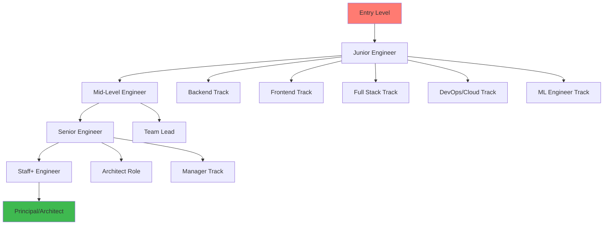
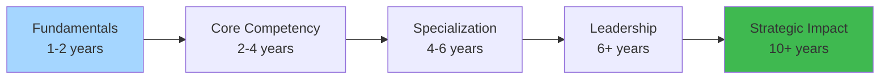

# Career Roadmaps — Complete Navigation Guide 🗺️

Roadmaps are **structured learning paths** for engineering career progression. They cover everything from junior backend engineer through staff+ architect, with specialized tracks for distributed systems, system design, and cloud-native engineering.

**Related**: [Backend](/03-backend/README.md) · [Distributed Systems](/09-distributed-systems/README.md) · [Staff Engineer](/05-cloud/README.md) · [System Design](/15-system-design/README.md)

## Career Progression Paths



## Skill Development Journey



---

## Table of Contents

- [Roadmap Types](#-roadmap-types)
- [Backend Engineer Progression](#1-backend-engineer-progression-)
- [Distributed Systems Journey](#2-distributed-systems-journey-)
- [System Design Preparation](#3-system-design-preparation-)
- [Staff+ Engineer Trajectory](#4-staff-engineer-trajectory-)
- [Cloud Native Path](#5-cloud-native-path-)
- [Machine Learning Engineer Path](#6-ml-engineer-path-)
- [Full Stack Engineer Path](#7-full-stack-engineer-path-)
- [Engineering Manager Path](#8-engineering-manager-path-)
- [Architect Path](#9-architect-path-)
- [Skill Matrices](#10-skill-matrices-)
- [Learning Resources](#11-learning-resources-)
- [Related Domains](#-related-domains)
- [Simplest Mental Model](#-simplest-mental-model)

---

## 🧭 Roadmap Types

### Career Tracks
```
Individual Contributor (IC) Track:
  Junior → Mid → Senior → Staff → Senior Staff → Principal → Fellow

Management Track:
  Tech Lead → Engineering Manager → Sr. Manager → Director → VP → CTO

Architect Track:
  Solution Architect → Principal Architect → Enterprise Architect → Chief Architect
```

### Timeline Expectations
```
Level             | Years Exp | Span of Influence
                  |           |
Junior Engineer   | 0-2       | Individual tasks
Mid-Level         | 2-5       | Features, small projects
Senior Engineer   | 5-8       | Team-level, multiple projects
Staff Engineer    | 8-12      | Organization-level, cross-team
Senior Staff      | 12-15     | Company-wide, 1-2 year horizon
Principal         | 15+       | Industry influence, multi-year
```

---

## 1. Backend Engineer Progression 🖥️

### Phase 1: Foundations (0-1 year)
```
Skills to acquire:
  - Programming language (Java, Go, Python, or TypeScript)
  - Data structures & algorithms
  - Git & version control
  - Basic Linux commands
  - SQL (CRUD operations, JOINs, aggregations)
  - REST API basics
  - One framework (Spring Boot, Django, Express, FastAPI)

Projects:
  - TODO API with CRUD operations
  - URL shortener (monolith)
  - Personal blog with comments
```

### Phase 2: Core Backend (1-3 years)
```
Skills to acquire:
  - Database design (indexing, normalization, migrations)
  - Caching (Redis basics)
  - Message queues (RabbitMQ, Kafka basics)
  - Authentication (JWT, OAuth 2.0 basics)
  - Docker & containerization
  - CI/CD pipeline
  - Testing (unit, integration)
  - Observability basics (logging, metrics)

Projects:
  - E-commerce cart service
  - Real-time chat application
  - URL shortener (scaled with caching)
```

### Phase 3: Senior Backend (3-5 years)
```
Skills to acquire:
  - Distributed systems (CAP, consensus, replication)
  - Microservices architecture
  - Advanced DB concepts (sharding, replication)
  - Performance profiling & optimization
  - Security best practices
  - API design (REST, gRPC, GraphQL)
  - Event-driven architecture
  - Kubernetes basics

Focus areas:
  - System design interviews preparation
  - Mentoring junior engineers
  - Technical decision documentation (ADRs)
```

### Phase 4: Staff+ Backend (5-8 years)
```
Skills to acquire:
  - Architecture design & evaluation
  - Multi-service, multi-team coordination
  - Production excellence (SLOs, error budgets)
  - Cost optimization
  - Incident management & postmortems
  - Organization-wide influence
  - Recruiting & interviewing

Focus areas:
  - Cross-team technical strategy
  - Building foundational platforms
  - Setting engineering standards
```

### Phase 5: Principal+ (8+ years)
```
Skills to acquire:
  - Industry-wide technical vision
  - Long-term roadmap (2-5 year horizon)
  - Business-engineering alignment
  - Organizational design (Conway's Law)
  - Technical recruiting strategy
  - Public speaking / conference talks
  - Open source leadership
```

---

## 2. Distributed Systems Journey 🌐

### Topic Map
```
1. Fundamentals
   CAP Theorem, Consistency Models, Time & Ordering

2. Storage
   LSM Trees, B-Trees, Distributed File Systems, Key-Value Stores

3. Coordination
   Consensus (Raft, Paxos), Leader Election, Distributed Locks

4. Replication & Partitioning
   Leader/Follower, Quorum, Consistent Hashing, Rebalancing

5. Transactions
   2PC, Saga, TCC, Outbox, Idempotency

6. Messaging
   Kafka, Pulsar, Exactly-once semantics, Message ordering

7. Stream Processing
   Kafka Streams, Flink, Beam — windowing, state, watermarks

8. Observability
   Distributed tracing, metrics aggregation, logging patterns

9. Failure Detection
   Gossip protocol, SWIM, Phi-Accrual, Timeouts

10. Real-World Systems
    Dynamo, Bigtable, Spanner, Cassandra, Kafka, ZooKeeper
```

### 18 Key Papers
| # | Paper | Why |
|---|-------|-----|
| 1 | In Search of an Understandable Consensus Algorithm (Raft) | Consensus foundation |
| 2 | Dynamo: Amazon's Highly Available KV Store | Eventual consistency at scale |
| 3 | Bigtable: A Distributed Storage System | Structured data at Google |
| 4 | The Google File System | Foundation of distributed storage |
| 5 | MapReduce: Simplified Data Processing | Distributed computation model |
| 6 | Spanner: Google's Globally Distributed DB | Global consistency |
| 7 | Kafka: a Distributed Messaging System | Log-based messaging |
| 8 | ZooKeeper: Wait-free Coordination | Coordination service |
| 9 | Paxos Made Simple | Consensus explained |
| 10 | The Chubby Lock Service | Distributed locking |
| 11 | Time, Clocks, and the Ordering of Events (Lamport) | Distributed time |
| 12 | Impossibility of Distributed Consensus with One Faulty Process (FLP) | Fundamental limit |
| 13 | Bitcoin: A Peer-to-Peer Electronic Cash System | Blockchain |
| 14 | Large-scale Incremental Processing Using Distributed Transactions (Percolator) | Distributed transactions |
| 15 | Cassandra — A Decentralized Structured Storage System | Wide-column store |
| 16 | WAL — Write-Ahead Logging | Storage foundation |
| 17 | CRDTs: Consistency Without Consensus | Conflict-free data types |
| 18 | Designing Data-Intensive Applications (book) | Everything above, coherent |

---

## 3. System Design Preparation 🏗️

### 30 Problems (Ranked)

**Tier 1 — Warm Up (15 min / problem)**
1. URL Shortener
2. Rate Limiter
3. Pastebin
4. Consistent Hashing

**Tier 2 — Core (30 min / problem)**
5. Key-Value Store
6. Distributed Cache
7. Distributed Queue
8. Unique ID Generator
9. Web Crawler
10. Search Autocomplete

**Tier 3 — Product Design (45 min / problem)**
11. Twitter / News Feed
12. Instagram
13. WhatsApp / Chat
14. YouTube / Netflix
15. Dropbox / Google Drive
16. Uber
17. Google Maps
18. Amazon E-Commerce

**Tier 4 — Deep Dive (60 min / problem)**
19. Distributed Database
20. Blob Store (S3)
21. Google Search
22. Video Conferencing (Zoom)
23. Collaborative Editor (Google Docs)
24. Slack / Discord
25. GitHub
26. Ticketmaster

### Preparation Strategy
```
Months 1-2:
  - Frame each problem (scope, estimate, design, tradeoffs)
  - Practice template (20 min per problem)
  - Watch system design interview walkthroughs

Months 3-4:
  - Deep dives (database, caching, consistency)
  - 10 problems in detail (Tier 2-3)
  - Peer mock interviews (2x/week)

Months 5-6:
  - All 30 problems
  - Realistic mock interviews (45 min timed)
  - Company-specific focus
```

---

## 4. Staff+ Engineer Trajectory 🌟

### Staff Engineer Archetypes (Will Larson)
```
Tech Lead: Guides team from the code
  → "Architect of the codebase"

Architect: Designs cross-team systems
  → "Map of the system"

Solver: Tackles hardest problems
  → "Fix everything that's broken"

Right Hand: Works with leadership
  → "Make leadership more effective"
```

### Skills Progression

**Technical Depth**
```
Senior: Deep expertise in 1-2 areas
Staff: Deep expertise in 2-3 + broad across many
Principal: Deep in core domain + strategic understanding
```

**Technical Strategy**
```
Senior: Design within a team
Staff: Design across teams (6-18 month horizon)
Principal: Design across org (1-3 year horizon)
```

**Communication**
```
Senior: Clear technical writing, team presentations
Staff: Org-wide RFCs, cross-team alignment
Principal: Company-wide strategy docs, external influence
```

**Mentorship**
```
Senior: Code review, pair programming, onboarding
Staff: Career mentorship, growth guidance, sponsorship
Principal: Engineering culture, organizational coaching
```

### Staff+ Expectations
```
Deletions over additions:
  - Remove complexity, don't add it
  - Say "no" to bad ideas
  - Simplify architecture

Judgment over knowledge:
  - Know when to compromise
  - Know which battles to fight
  - Know what's "good enough"

Influence without authority:
  - Persuade through technical reasoning
  - Build relationships across teams
  - Lead by example
```

---

## 5. Cloud Native Path ☁️

### Phase 1: Cloud Fundamentals
```
Skills:
  - IaaS vs PaaS vs SaaS
  - Virtual machines, VPC, subnets
  - Object storage (S3, GCS)
  - Managed databases (RDS, Cloud SQL)
  - IAM basics
  - DNS, CDN, Load Balancers

Certifications (optional):
  AWS Cloud Practitioner
  Azure AZ-900
  GCP Cloud Digital Leader
```

### Phase 2: Containers & Orchestration
```
Skills:
  - Docker (images, Dockerfile, compose)
  - Kubernetes (pods, deployments, services, ingress)
  - Helm (charts, templating)
  - Service mesh (Istio basics)
  - GitOps (ArgoCD, Flux)

Certifications:
  CKA (Certified Kubernetes Administrator)
  CKAD (Certified Kubernetes Application Developer)
```

### Phase 3: Cloud-Native Architecture
```
Skills:
  - Microservices deployment
  - Observability (Prometheus, Grafana, Loki, Tempo)
  - Event-driven on cloud (Kafka, Pub/Sub, SQS/SNS)
  - Serverless (Lambda, Cloud Functions)
  - CI/CD (GitHub Actions, GitLab CI)
  - IaC (Terraform, Pulumi, CloudFormation)

Certifications:
  AWS Solutions Architect
  GCP Professional Cloud Architect
  Terraform Associate
```

### Phase 4: Platform Engineering
```
Skills:
  - Internal Developer Platforms (IDP)
  - Backstage / Port
  - Crossplane, Cluster API
  - Policy as Code (OPA, Kyverno)
  - FinOps (cost optimization)
  - Multi-cloud architecture
```

---

## 6. ML Engineer Path 🤖

### Phase 1: Foundations
```
Skills:
  - Python (NumPy, Pandas, Matplotlib)
  - Linear algebra, calculus, probability
  - ML fundamentals (regression, classification, clustering)
  - scikit-learn
  - Jupyter notebooks

Projects:
  - House price prediction
  - Spam classifier
  - Customer segmentation
```

### Phase 2: Deep Learning
```
Skills:
  - Neural networks (CNN, RNN, LSTM, Transformer)
  - PyTorch or TensorFlow
  - Computer vision basics
  - NLP basics
  - Model evaluation & validation

Projects:
  - Image classifier
  - Sentiment analysis
  - Text summarization
```

### Phase 3: MLOps
```
Skills:
  - ML pipelines (Kubeflow, MLflow)
  - Feature stores (Feast)
  - Model serving (TensorFlow Serving, TorchServe)
  - Experiment tracking
  - A/B testing for ML
  - Data versioning (DVC, LakeFS)

Certifications:
  AWS Machine Learning Specialty
  GCP ML Engineer
```

---

## 7. Full Stack Engineer Path 🎨

### Phase 1: Frontend
```
Skills:
  - HTML, CSS, JavaScript fundamentals
  - React or Vue or Angular
  - State management (Redux, Zustand)
  - Responsive design
  - REST API integration
```

### Phase 2: Backend
```
Skills:
  - Node.js or Python (Django/Flask) or Java (Spring)
  - REST API design
  - Database basics (SQL + NoSQL)
  - Authentication (JWT, sessions)
```

### Phase 3: Full Stack Integration
```
Skills:
  - Full stack application architecture
  - CI/CD for frontend + backend
  - Testing (unit, integration, E2E)
  - Performance optimization
  - Deployment (Vercel, Netlify, AWS)
```

---

## 8. Engineering Manager Path 👥

### Phase 1: Tech Lead
```
Skills:
  - Code review at scale
  - Technical planning & estimation
  - Sprint management
  - Stakeholder communication
  - Mentoring 1-2 developers
```

### Phase 2: Engineering Manager
```
Skills:
  - 1:1s, performance reviews, career growth
  - Hiring (screening, interviewing, closing)
  - Team health & morale
  - Cross-team coordination
  - Budget & headcount planning
```

### Phase 3: Senior Manager
```
Skills:
  - Managing managers (EMs)
  - Organizational design
  - Multi-team strategy
  - Culture building
  - Executive communication
```

---

## 9. Architect Path 🏛️

### Skills
- **Technical breadth**: Know many systems, patterns, technologies
- **Abstraction**: See patterns across different domains
- **Communication**: Explain complex decisions simply
- **Business alignment**: Architecture serves business goals
- **Governance**: Standards, review processes, ADRs

### Architect Levels
```
Solution Architect:
  - Single project / product architecture
  - Technology selection, tradeoff analysis

Enterprise Architect:
  - Organization-wide standards & strategy
  - Technology portfolio management
  - Cross-domain integration

Chief Architect:
  - Industry influence
  - Long-term technology vision
  - Technology partnerships
```

---

## 10. Skill Matrices 📊

### Senior Engineer Checklist
```
Technical:
  [ ] Deep expertise in 1-2 technologies
  [ ] Can design medium-complexity systems
  [ ] Performance analysis & optimization
  [ ] Security-aware (OWASP, secure coding)

Leadership:
  [ ] Code review for team
  [ ] Mentor 1-2 junior engineers
  [ ] Lead technical discussions
  [ ] Write clear design documents

Delivery:
  [ ] Reliably deliver medium-large features
  [ ] Unblock self and team members
  [ ] Manage technical debt

Communication:
  [ ] Clear technical writing
  [ ] Good presentation skills
  [ ] Cross-team collaboration
```

### Staff Engineer Checklist
```
Technical:
  [ ] Breadth across multiple domains
  [ ] Design cross-team systems
  [ ] Deep expertise in core domain
  [ ] Industry awareness (papers, trends)

Leadership:
  [ ] Mentor mid-to-senior engineers
  [ ] Cross-team technical leadership
  [ ] Technical recruiting / interviewing
  [ ] Define engineering standards

Strategy:
  [ ] 6-18 month technical roadmap
  [ ] Identify and reduce complexity
  [ ] Cost optimization at organization level
  [ ] Technology evaluation & selection

Influence:
  [ ] RFCs adopted across org
  [ ] External presence (talks, blogs)
  [ ] Cross-org technical alignment
```

---

## 11. Learning Resources 📚

### Books
```
Foundations:
  - The Pragmatic Programmer (Hunt)
  - Clean Code (Martin)
  - Code Complete (McConnell)

Distributed Systems:
  - Designing Data-Intensive Applications (Kleppmann)
  - Distributed Systems (van Steen, Tanenbaum)
  - Patterns of Distributed Systems (Tilkov)

System Design:
  - System Design Interview — An Insider's Guide (Xu)
  - Designing Distributed Systems (Burns)
  - Fundamentals of Software Architecture (Richards, Ford)

Architecture:
  - Clean Architecture (Martin)
  - Domain-Driven Design (Evans)
  - Building Evolutionary Architectures (Ford)

Leadership:
  - Staff Engineer (Larson)
  - The Manager's Path (Fournier)
  - An Elegant Puzzle (Larson)
```

### Online Courses
```
System Design:
  - Grokking the System Design Interview (DesignGurus)
  - System Design Course (Alex Xu / ByteByteGo)

Distributed Systems:
  - MIT 6.824 Distributed Systems (YouTube)
  - Distributed Systems in One Hour (Google Tech Talks)

Cloud Native:
  - KodeKloud (Kubernetes, Docker, CKA)
  - A Cloud Guru / Pluralsight

Platform Engineering:
  - KubeCon talks (YouTube)
  - Platform Engineering (CNCF)
```

### Practice Platforms
```
Coding: LeetCode, HackerRank, Codewars
System Design: Pramp, Interviewing.io, System Design Fight Club
Architecture: Architecture kata (O'Reilly)
Hands-on: Killercoda, Play with Kubernetes, Katacoda
```

---

## 🔗 Related Domains

| Domain | Connection |
|--------|-----------|
| [System Design](/15-system-design/README.md) | Core interview prep topic |
| [Distributed Systems](/09-distributed-systems/README.md) | Deep dives path |
| [Backend](/03-backend/README.md) | Backend progression details |
| [Staff Engineer](/05-cloud/README.md) | Staff+ path specifics |
| [Interviews](/20-interviews/README.md) | Interview preparation strategy |
| [Software Engineering](/25-software-engineering/README.md) | Engineering fundamentals |
| [Cloud Computing](/05-cloud/README.md) | Cloud native path |

---

## 🧠 Simplest Mental Model

```
Career Roadmap = GPS Navigation for Your Career

Current Position: Where you are now (skills, level, impact)
Destination: Where you want to be (Staff Engineer, EM, Architect)
Waypoints: Phase 1 → Phase 2 → Phase 3 → Phase 4...
Detours: Learning new tech, switching roles, startups vs big companies
Traffic: Slower progress in some areas (learning curves, company constraints)
Re-routing: Pivoting when interests change or market shifts

Key Insight:
  The map is not the territory.
  Your path will differ from every roadmap you read.
  Use roadmaps for direction, not prescription.
```

**Growth = Deliberate practice + Stretch projects + Feedback loops. The best career path is the one you walk, not the one someone else drew.**

---

**Next**: [Production Stories](/22-production-stories/README.md) · [Interviews](/20-interviews/README.md)
