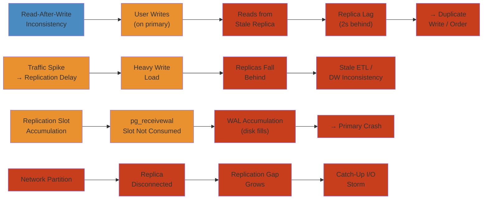

# 📊 Database Replication Lag Incidents — Production Incident Deep Dive

> **Scope:** Real-world database replication failure patterns covering read-after-write inconsistencies, replication delay during spikes, replication slot accumulation leading to disk full, network partition gap, and GTID inconsistency on failover. Each scenario covers MySQL and PostgreSQL replication with detection, investigation, root cause, mitigation, and permanent fixes.
>
> **Applicability:** Database administrators, SRE teams, backend engineers, and data platform teams managing MySQL 8.0+/PostgreSQL 12+ with replication in production.

---




## Table of Contents


1. [Scenario A: Read-After-Write Inconsistency — User Writes → Read from Stale Replica → Duplicate Write](#scenario-a-read-after-write-inconsistency--user-writes--read-from-stale-replica--duplicate-write)
2. [Scenario B: Replication Delay During Traffic Spike — Heavy Write Load → Replicas Fall Behind → Stale ETL → DW Inconsistency](#scenario-b-replication-delay-during-traffic-spike--heavy-write-load--replicas-fall-behind--stale-etl--dw-inconsistency)
3. [Scenario C: Replication Slot Accumulation — pg_receivewal Slot Not Consumed → WAL Accumulation → Disk Full → Primary Crash](#scenario-c-replication-slot-accumulation--pg_receivewal-slot-not-consumed--wal-accumulation--disk-full--primary-crash)
4. [Scenario D: Network Partition — Replica Disconnected → Replication Gap Grows → Catch-Up I/O Storm](#scenario-d-network-partition--replica-disconnected--replication-gap-grows--catch-up-io-storm)
5. [Scenario E: GTID Skip on Failover — Promoted Replica with Different GTID → Data Inconsistency](#scenario-e-gtid-skip-on-failover--promoted-replica-with-different-gtid--data-inconsistency)
6. [Detection and Monitoring Reference](#detection-and-monitoring-reference)
7. [Mitigation Playbook](#mitigation-playbook)
8. [Permanent Fixes and Configuration Reference](#permanent-fixes-and-configuration-reference)

---

## Scenario A: Read-After-Write Inconsistency — User Writes → Read from Stale Replica → Duplicate Write


### Symptom


```
User: places order #87492 at 10:00:00 on primary.
User: refreshes page at 10:00:02 → hits read replica (lag = 2s).
Replica: "No orders found for user" (hasn't replicated yet).
User: clicks "Place Order" again → creates DUPLICATE order #87493.
User: now has two orders for the same item.
Downstream systems: overcharged customer by $127.50.
Time to detect: 45 minutes (customer complaint).
Time to remediate: partial refund + database cleanup.
```

### Detection


```

── APPLICATION METRICS

Alert: Duplicate order detection — same user, same product, within 1 minute
Alert: Customer support ticket: "I was charged twice"
Alert: Reconciliation job: orders without corresponding payments

── REPLICATION LAG DETECTION

# MySQL:
SHOW SLAVE STATUS\G
             Seconds_Behind_Master: 2       ← 2 seconds behind
         Retrieved_Gtid_Set: 1-1234-567890
             Executed_Gtid_Set: 1-1234-567888  ← Last 2 GTIDs missing

# PostgreSQL:
SELECT application_name, replay_lag, write_lag, flush_lag
FROM pg_stat_replication;

 application_name | replay_lag | write_lag | flush_lag
------------------+------------+-----------+-----------
 replica-1        | 00:00:02   | 00:00:01  | 00:00:01
```

### Investigation


```

── 1. IDENTIFY APPLICATION CODE PATH

// The problematic code pattern:
@Transactional
public Order placeOrder(User user, Cart cart) {
    Order order = orderRepository.save(new Order(user, cart));
    // Return order page — reads from REPLICA:
    return orderReadService.getOrders(user.getId());  // ← Hits replica!
}

// What happens:
// 1. orderRepository.save() → writes to PRIMARY (committed)
// 2. orderReadService.getOrders() → reads from REPLICA (not yet replicated)
// 3. User sees NO orders
// 4. User clicks "Place Order" again → duplicate

── 2. CHECK READ/WRITE SPLITTING CONFIG

# Spring Boot read/write datasource config:
spring:
  datasource:
    primary:
      url: jdbc:mysql://primary:3306/orders
    replica:
      url: jdbc:mysql://replica:3306/orders

# ReplicationRoutingDataSource:
@Transactional(readOnly = true)
public List<Order> getOrders(Long userId) {
    // Returns data from REPLICA — may be stale!
}
```

### Root Cause


```
READ-AFTER-WRITE INCONSISTENCY SEQUENCE
════════════════════════════════════════

  User           Application         Primary            Replica            User Sees
   │                  │                  │                  │                  │
   │  Place Order     │                  │                  │                  │
   │────────────────>│                  │                  │                  │
   │                  │  INSERT order    │                  │                  │
   │                  │────────────────>│                  │                  │
   │                  │                  │  COMMIT          │                  │
   │                  │<────────────────│                  │                  │
   │                  │                  │                  │                  │
   │                  │  replication     │                  │                  │
   │                  │  lag = 2s        │─────────────────>│                  │
   │                  │                  │                  │                  │
   │  Refresh page    │                  │                  │                  │
   │────────────────>│                  │                  │                  │
   │                  │  SELECT * FROM   │                  │                  │
   │                  │  orders WHERE    │                  │                  │
   │                  │  user_id=?       │                  │                  │
   │                  │  (readOnly=true) │                  │                  │
   │                  │─────────────────────────────────────>│                  │
   │                  │                  │                  │  0 rows (stale!) │
   │                  │<─────────────────────────────────────│                  │
   │                  │  "No orders"     │                  │                  │
   │<────────────────│                  │                  │                  │
   │                  │                  │                  │                  │
   │  "Empty cart?"   │                  │                  │                  │
   │  Place AGAIN     │                  │                  │                  │
   │────────────────>│                  │                  │                  │
   │                  │  INSERT order    │                  │                  │
   │                  │  (DUPLICATE!)    │                  │                  │
   │                  │────────────────>│                  │                  │
   │                  │                  │  COMMIT          │                  │
   │                  │<────────────────│                  │                  │
   │                  │                  │                  │                  │
   │                  │                  │                  │  replication     │
   │                  │                  │                  │  catches up      │
   │                  │                  │                  │                  │
   │  2 orders shown  │                  │                  │                  │
   │<────────────────│                  │                  │                  │
   │                  │                  │                  │                  │
   "I was charged     │                  │                  │                  │
    twice!"           │                  │                  │                  │
```

### Mitigation


```

── IMMEDIATE: STICKY READ WITH PRIMARY ROUTING

// After write, route subsequent reads to PRIMARY for N seconds:
public List<Order> getOrders(Long userId, boolean recentlyWrote) {
    if (recentlyWrote) {
        return primaryOrderRepository.findByUserId(userId);
    }
    return replicaOrderRepository.findByUserId(userId);
}

── IMMEDIATE: DELAY REFRESH PAGE AFTER WRITE

// Frontend: disable "refresh" button for 3 seconds after order placement
// Or: redirect to an order confirmation page (not a fresh list)

── IMMEDIATE: USE SESSION FLAG TO FORCE PRIMARY

// After write, set session attribute:
session.setAttribute("lastWrite", System.currentTimeMillis());
// In datasource routing:
if (session.getAttribute("lastWrite") != null &&
    (now - session.lastWrite) < 3000) {
    usePrimary = true;
}
```

### Permanent Fix


```java
── APPLICATION-LEVEL READ-AFTER-WRITE CONSISTENCY ──────────────────────

@Component
public class ReadWriteRouter {
    private final Cache<String, Boolean> recentWrites = Caffeine.newBuilder()
        .expireAfterWrite(5, TimeUnit.SECONDS)
        .build();

    public void recordWrite(String userKey) {
        recentWrites.put(userKey, true);
    }

    public boolean hasRecentWrite(String userKey) {
        return recentWrites.getIfPresent(userKey) != null;
    }
}

── PROXY-BASED READ-WRITE SPLITTING ─────────────────────────────────────

# ProxySQL configuration:
mysql_users:
  - username: app
    default_hostgroup: 0        # Primary hostgroup

mysql_query_rules:
  # Select queries → read replicas
  - rule_id: 1
    match: "^SELECT .*"
    destination_hostgroup: 1    # Replica hostgroup
    cache_ttl: 0

  # Write queries → primary
  - rule_id: 2
    match: "^(INSERT|UPDATE|DELETE|ALTER|DROP|CREATE)"
    destination_hostgroup: 0

  # Exempt recent writers from read routing
  - rule_id: 3
    match: "^SELECT .* last_write_cookie = 1"
    destination_hostgroup: 0    # Force primary

── PGBOUNCER READ-WRITE SPLITTING ───────────────────────────────────────

# pgcat or PgBouncer with read-write split:
[routing]
primary_reads = false   # Don't route SELECT to primary by default
primary_write = true
primary_read_on_write = true  # After write, route reads to primary
primary_read_on_write_ttl = 5000  # 5 seconds
```

---

## Scenario B: Replication Delay During Traffic Spike — Heavy Write Load → Replicas Fall Behind → Stale ETL → DW Inconsistency


### Symptom


```
11:00:00 — Flash sale begins: 20,000 orders/minute peak
11:02:00 — Primary write throughput: 15 MB/s WAL generation
11:03:00 — Replica-1 replay_lag: 45 seconds
11:04:00 — Replica-2 replay_lag: 90 seconds
11:05:00 — Downstream ETL (scheduled at 11:05) reads from replica-2
11:05:00 — ETL exports snapshot with orders only up to 11:03:30
11:06:00 — ETL loads into data warehouse — missing 90 seconds of orders
11:08:00 — BI team: "Flash sale revenue numbers don't match"
11:10:00 — Reconciliation: DW has 1,847 fewer orders than primary
```

### Detection


```

── REPLICATION LAG ALERTS

# PostgreSQL:
Alert: pg_stat_replication → replay_lag > 30s
Alert: pg_stat_replication → write_lag > 10s
Alert: pg_stat_replication → flush_lag > 10s

# MySQL:
Alert: SHOW SLAVE STATUS → Seconds_Behind_Master > 30
Alert: SHOW SLAVE STATUS → Relay_Log_Space growing (replay can't keep up)

── ETL INCONSISTENCY DETECTION

Alert: Reconciliation job: row count mismatch between primary and DW
Alert: Data quality checks: missing orders in DW tables
Alert: Business metrics: revenue in DW < revenue in primary

── REPLICA PERFORMANCE

# Check replica resource usage:
$ top
  CPU: 95% (4 vCPU)
  iowait: 40%
  Memory: 90%

# Replica is underpowered and overloaded with reporting queries
```

### Investigation


```

── 1. CHECK REPLICA RESOURCES

# Count running queries on replica:
SELECT count(*), state FROM pg_stat_activity
WHERE backend_type = 'client backend'
GROUP BY state;

  state    | count
-----------+-------
 active    | 42    ← 42 active read queries!
 idle      | 8

# Heavy reporting queries consuming CPU:
SELECT pid, query, now() - query_start AS duration
FROM pg_stat_activity
WHERE state = 'active'
ORDER BY duration DESC
LIMIT 5;

── 2. CHECK LARGE TRANSACTIONS ON PRIMARY

# Primary — are there large write transactions?
SELECT pid, state, now() - xact_start AS xact_duration,
       pg_size_pretty(pg_wal_lsn_diff(
           pg_current_wal_lsn(),
           pg_stat_replication.replay_lsn
       )) AS wal_lag
FROM pg_stat_activity
WHERE state = 'active'
  AND now() - xact_start > interval '1 minute';

── 3. CHECK NETWORK LATENCY

# From replica:
$ ping primary-db
  64 bytes from 10.0.1.10: icmp_seq=1 ttl=64 time=42.3 ms  ← 42ms RTT
  64 bytes from 10.0.1.10: icmp_seq=2 ttl=64 time=41.8 ms

# In same region: < 1ms expected
# 42ms → cross-region or network issue
```

### Root Cause


```
REPLICATION LAG WATERFALL
══════════════════════════

  ┌──────────────────────────────────────────────────────────────┐
  │  PRIMARY — 15 MB/s WAL generation (flash sale peak)         │
  │      ↓                                                       │
  │  Network: 42ms RTT (cross-region)                            │
  │      ↓                                                       │
  │  REPLICA-1 (4 vCPU, 16 GB, 3000 IOPS)                       │
  │      ↓                                                       │
  │  WAL receiver thread: receives WAL at 15 MB/s               │
  │      ↓                                                       │
  │  WAL replay process (single-threaded in PG < 14)            │
  │  replays at 10 MB/s (CPU bound + I/O bound)                 │
  │      │                                                       │
  │      ├── WAL replay competes with 42 active reporting queries│
  │      │   → write-heavy reporting queries flush buffers       │
  │      │   → replay I/O delayed                                │
  │      │                                                       │
  │      └── Replay speed: 10 MB/s → 6 MB/s → 4 MB/s           │
  │          → replay_lag grows: 30s → 45s → 90s               │
  │          → WAL accumulates on primary: 250 MB → 500 MB       │
  │          → More disk space used on primary (maybe disk full) │
  │      ↓                                                       │
  │  REPLICA-2 (even heavier load — ETL runs here)              │
  │      → replay_lag: 90s                                       │
  │      → ETL reads stale snapshot → DW inconsistency           │
  └──────────────────────────────────────────────────────────────┘

  ROOT CAUSES:
  • Replica under-provisioned (4 vCPU vs primary's 16 vCPU)
  • Replica serving heavy reporting + ETL queries
  • Cross-region replication adds 42ms latency
  • Large transactions on primary (big INSERT batches)
  • Parallel replication not configured (MySQL: slave_parallel_workers=0)
```

### Mitigation


```

── IMMEDIATE: STOP NON-CRITICAL QUERIES ON REPLICA

-- Kill heavy reporting queries to free up I/O for WAL replay:
SELECT pg_terminate_backend(pid)
FROM pg_stat_activity
WHERE state = 'active'
  AND backend_type = 'client backend'
  AND query_start < now() - interval '10 minutes'
  AND usename != 'app_user';
  -- Kill analytical queries, keep app reads

── IMMEDIATE: OFFLOAD ETL TO DIFFERENT REPLICA (OR PRIMARY)

# Point ETL to a dedicated reporting replica (not the one lagging)
# Or: temporarily point ETL to primary for consistent snapshot

── IMMEDIATE: BATCH LARGE TRANSACTIONS ON PRIMARY

# Instead of 1 big INSERT for 50,000 rows:
INSERT INTO orders (...) VALUES (1, ...), (2, ...), ... (50000, ...);

# Do multiple batches with COMMIT between:
DO $$
DECLARE
    batch_size CONSTANT int := 5000;
BEGIN
    FOR i IN 0..9 LOOP
        INSERT INTO orders (...) SELECT ...
        FROM source_data
        OFFSET i * batch_size LIMIT batch_size;
        COMMIT;
    END LOOP;
END $$;
```

### Permanent Fix


```sql
── REPLICA CONFIGURATION ───────────────────────────────────────────────

# PostgreSQL replica — dedicated for replication, no reporting queries
# postgresql.conf on replica:
hot_standby_feedback = off          # No extra load from feedback
max_connections = 50                # Minimal connections — just keep replication going
# Reporting queries go to a DIFFERENT replica or primary

── PARALLEL REPLICATION (MySQL 8.0) ────────────────────────────────────

# Enable parallel replication on replica:
# my.cnf on replica:
slave_parallel_workers = 8          # Use 8 threads for replay (default: 0)
slave_parallel_type = LOGICAL_CLOCK # Group commit parallelization
slave_preserve_commit_order = 1     # Maintain commit order across threads
binlog_group_commit_sync_delay = 100  # microseconds — group commits
binlog_group_commit_sync_no_delay_count = 10

── POSTGRESQL PARALLEL WAL APPLY (PG 15+ with streaming replication) ──

# Not natively parallel — use pg_rewind for faster catchup
# Or use Patroni for automatic failover to a lag-free replica

── DEDICATED REPLICA FOR ETL ──────────────────────────────────────────

# Architecture:
# Primary → Replica-1 (sync, low lag, for app reads)
#         → Replica-2 (async, for ETL/reporting, OK with some lag)
#         → Replica-3 (async, dedicated to analytics)

── REPLICATION LAG MONITORING WITH PT-HEARTBEAT (MySQL) ──────────────

# Install pt-heartbeat:
$ pt-heartbeat --update --database percona --daemonize
$ pt-heartbeat --monitor --database percona --master-server-id=1

# Monitor true lag every second (not just Seconds_Behind_Master):
# Results: 0.01s 0.02s 0.01s ... 45.12s (alert!)
```

---

## Scenario C: Replication Slot Accumulation — pg_receivewal Slot Not Consumed → WAL Accumulation → Disk Full → Primary Crash


### Symptom


```
03:00:00 — Logical replication slot created for CDC pipeline
03:00:15 — CDC consumer crashes (bug in kafka-connect-connector)
03:00:30 — Slot exists but nothing is consuming from it
03:01:00 — WAL starts accumulating: pg_wal directory: 2 GB
03:02:00 — pg_wal: 10 GB
03:05:00 — pg_wal: 50 GB
03:10:00 — pg_wal: 200 GB (nearly full disk)
03:10:30 — WARNING: disk usage 95%
03:11:00 — ERROR: could not write to WAL: No space left on device
03:11:01 — PostgreSQL crashes: "PANIC: could not write to WAL"
03:11:02 — Primary database DOWN
03:12:00 — Database unavailable — application OUTAGE
```

### Detection


```

── REPLICATION SLOT LAG DETECTION

SELECT slot_name, plugin, slot_type,
       pg_size_pretty(pg_wal_lsn_diff(
           pg_current_wal_lsn(),
           restart_lsn
       )) AS retained_wal,
       pg_size_pretty(pg_wal_lsn_diff(
           pg_current_wal_lsn(),
           confirmed_flush_lsn
       )) AS unflushed_wal,
       active,
       xmin
FROM pg_replication_slots;

   slot_name    | plugin  | slot_type | retained_wal | unflushed_wal | active
----------------+---------+-----------+--------------+---------------+--------
 cdc_pipeline   | pgoutput| logical   | 180 GB       | 180 GB        | f      ← NOT ACTIVE!

── WAL SIZE GROWTH ALERT

Alert: pg_wal directory size > 10 GB
Alert: pg_replication_slots → active = false + retained_wal > 10 GB
Alert: WAL generation rate > WAL archiving/consumption rate

── DISK SPACE WARNING

$ df -h /data/postgresql
Filesystem      Size  Used Avail Use% Mounted on
/dev/sda1       500G  480G   20G  96% /data/postgresql
                                        ← 20 GB free, but WAL still accumulating

$ du -sh /data/postgresql/pg_wal/
180G    /data/postgresql/pg_wal/  ← WAL is 36% of disk!
```

### Investigation


```

── 1. IDENTIFY THE UNUSED SLOT

SELECT slot_name, active, pg_wal_lsn_diff(
    pg_current_wal_lsn(), restart_lsn
) / 1024 / 1024 AS wal_mb
FROM pg_replication_slots
WHERE NOT active;

   slot_name    | active | wal_mb
----------------+--------+--------
 cdc_pipeline   | f      | 184320   ← 180 GB of WAL retained!

── 2. CHECK CDC PIPELINE STATUS

$ systemctl status debezium-connect
● debezium-connect.service - Debezium Connect
   Loaded: loaded
   Active: failed (Result: exit-code) since Tue 2026-05-27 03:00:15 UTC
   Process: 12345 ExecStart=/opt/debezium/run.sh (code=exited, status=1/FAILURE)
   Main PID: 12345 (code=exited, status=1)

# CDC consumer crashed at 03:00:15
# Slot was created at 03:00:00
# Slot was never consumed → WAL retained for slot since 03:00:00

── 3. CHECK WAL ARCHIVE STATUS

$ ls -la /data/postgresql/archive/
total 0  ← ARCHIVE IS EMPTY! No WAL archiving configured!
```

### Root Cause


```
WAL ACCUMULATION LEADING TO DISK FULL
═══════════════════════════════════════

  ┌──────────────────────────────────────────────────────────────┐
  │  Logical replication slot cdc_pipeline created               │
  │  ↓                                                           │
  │  Slot stores restart_lsn = position at creation time         │
  │  ↓                                                           │
  │  CDC consumer (Debezium) connects, starts consuming          │
  │  ↓                                                           │
  │  CDC consumer crashes → slot.active = false                  │
  │  ↓                                                           │
  │  PostgreSQL STILL retains WAL from restart_lsn               │
  │  (cannot remove WAL segments that the slot might need)       │
  │  ↓                                                           │
  │  pg_wal grows:                                               │
  │  t=0:     2 GB (normal)                                      │
  │  t=5m:   50 GB (slot not consumed)                           │
  │  t=10m: 180 GB (slot not consumed)                           │
  │  ↓                                                           │
  │  No WAL archiving configured → no offloading to archive      │
  │  ↓                                                           │
  │  WAL fills entire disk → PostgreSQL panics                   │
  │  ↓                                                           │
  │  PRIMARY DATABASE CRASH                                      │
  └──────────────────────────────────────────────────────────────┘

  CONTRIBUTING FACTORS:
  • No max_slot_wal_keep_size (PG 14+: limit WAL retention per slot)
  • No WAL archiving (wal_level=logical but archive_mode=off)
  • No monitoring of slot lag
  • No alerting on slot.wal_retained
  • No alerting on pg_wal size growth
```

### Mitigation


```

── STEP 1: DELETE THE UNUSED SLOT

SELECT pg_drop_replication_slot('cdc_pipeline');
-- This releases ALL retained WAL immediately
-- (Restart_lsn no longer protected → WAL can be removed)

── STEP 2: CHECK DISK SPACE (should free up ~180 GB)

$ df -h /data/postgresql
Filesystem      Size  Used Avail Use% Mounted on
/dev/sda1       500G  300G  200G  60% /data/postgresql
                                  ← 180 GB freed

── STEP 3: START POSTGRESQL (if crashed)

$ pg_ctl start

── STEP 4: CHECK DATA INTEGRITY

$ psql -c "SELECT count(*) FROM orders;"
# Verify all data is intact

── STEP 5: FIX CDC CONSUMER AND RESTART

$ systemctl restart debezium-connect
# After restart, consumer will create new slot and continue
```

### Permanent Fix


```sql
── PostgreSQL 14+ — Limit WAL retention per slot
ALTER SYSTEM SET max_slot_wal_keep_size = '50GB';
-- Any slot that retains > 50 GB of WAL will be marked invalid
SELECT pg_reload_conf();

── Enable WAL archiving
ALTER SYSTEM SET archive_mode = on;
ALTER SYSTEM SET archive_command =
    'cp %p /data/postgresql/archive/%f && gzip /data/postgresql/archive/%f';
ALTER SYSTEM SET archive_timeout = 60;
SELECT pg_reload_conf();

── Monitor slot lag — alert if > 10 GB or inactive
CREATE OR REPLACE VIEW slot_lag_monitor AS
SELECT slot_name, plugin, active,
    pg_size_pretty(pg_wal_lsn_diff(
        pg_current_wal_lsn(), restart_lsn
    )) AS retained_wal,
    pg_size_pretty(pg_wal_lsn_diff(
        pg_current_wal_lsn(), confirmed_flush_lsn
    )) AS unflushed_wal,
    CASE
        WHEN NOT active THEN 'CRITICAL — INACTIVE'
        WHEN pg_wal_lsn_diff(pg_current_wal_lsn(), restart_lsn) > 10 * 1024 * 1024 * 1024::bigint
            THEN 'WARNING — > 10 GB retained'
        ELSE 'OK'
    END AS status
FROM pg_replication_slots;

── Monitor WAL size
CREATE OR REPLACE VIEW wal_size_monitor AS
SELECT
    pg_size_pretty(SUM(size)) AS total_wal_size,
    COUNT(*) AS wal_file_count
FROM pg_ls_waldir();

── Alerting query (run every minute)
SELECT slot_name
FROM pg_replication_slots
WHERE NOT active
   OR pg_wal_lsn_diff(pg_current_wal_lsn(), restart_lsn) > 10 * 1024 * 1024 * 1024::bigint;
```

---

## Scenario D: Network Partition — Replica Disconnected → Replication Gap Grows → Catch-Up I/O Storm


### Symptom


```
08:00:00  Network switch maintenance — replica loses connectivity to primary
08:00:05  Replication stops: "FATAL: could not connect to the primary server"
08:00:10  Replication gap starts growing
08:00:30  Gap: 500 MB (8 minutes of WAL)
08:02:00  Switch maintenance complete
08:02:05  Replica reconnects to primary
08:02:06  Replica starts catch-up: downloading 15 minutes of WAL
08:02:10  Replica I/O: 100% (restoring 2 GB of WAL)
08:02:15  Replica queries slow down significantly (I/O contention)
08:02:20  Application reads from replica start timing out
08:02:30  Replica catch-up complete. Back to normal.
```

### Detection


```

── REPLICATION STATUS

# PostgreSQL:
SELECT application_name, state, replay_lag, write_lag, flush_lag,
       pg_wal_lsn_diff(pg_current_wal_lsn(), replay_lsn) AS wal_lag_bytes
FROM pg_stat_replication;

# After partition:
 application_name | state  | replay_lag | wal_lag_bytes
------------------+--------+------------+--------------
 replica-1        | catchup| 00:15:00   | 2147483648    → 2 GB gap!

# MySQL:
SHOW SLAVE STATUS\G
             Slave_IO_Running: No    ← IO thread disconnected
             Slave_SQL_Running: Yes
         Seconds_Behind_Master: NULL  ← Unknown (was disconnected)
           Last_IO_Error: error reconnecting to master
```

### Root Cause


```

NETWORK PARTITION CATCH-UP TIMELINE
════════════════════════════════════

  ┌──────────────────────────────────────────────────────────────┐
  │  08:00:00  Switch maintenance → replica loses connection     │
  │            ↓                                                 │
  │  08:00-08:02  Partition period:                              │
  │            • Primary generates WAL: 15 MB/s                  │
  │            • Replica disconnected → WAL accumulates on primary│
  │            • wal_keep_size = 1024 MB → primary retains WAL   │
  │            • After 8 min: 7.2 GB of WAL accumulated          │
  │            ↓                                                 │
  │  08:02:00  Switch maintenance complete                        │
  │            ↓                                                 │
  │  08:02:05  Replica reconnects                                │
  │            ↓                                                 │
  │  08:02:06  Catch-up phase:                                   │
  │            • Replica requests all WAL since last LSN          │
  │            • Primary streams 7.2 GB of WAL to replica        │
  │            • Network: 1 Gbps → ~60s to transfer              │
  │            • Replica WAL receiver: 15 MB/s throughput         │
  │            • Replica WAL replay: 10 MB/s (single-threaded)   │
  │            • Total catch-up time: ~12 minutes                 │
  │            ↓                                                 │
  │  08:02:10  I/O storm on replica:                              │
  │            • WAL receiver writing to pg_wal: 15 MB/s         │
  │            • WAL replay reading WAL + writing data: 10 MB/s  │
  │            • Reporting queries also reading: 5 MB/s          │
  │            • Total I/O: 30 MB/s → exceeds replica's 3000 IOPS│
  │            ↓                                                 │
  │  08:02:15  Replica queries slow down: p99 = 5s               │
  │  08:02:30  Catch-up complete → replica returns to normal     │
  └──────────────────────────────────────────────────────────────┘
```

### Mitigation


```

── IMMEDIATE: STOP NON-CRITICAL QUERIES ON CATCHING-UP REPLICA

-- Remove replica from load balancer
-- Or kill heavy queries:
SELECT pg_terminate_backend(pid)
FROM pg_stat_activity
WHERE state = 'active'
  AND backend_type = 'client backend'
  AND query_start < now() - interval '2 minutes';

── IMMEDIATE: REDUCE WAL GENERATION ON PRIMARY (IF POSSIBLE)

-- Throttle non-critical writes:
-- Pause batch jobs, ETL processes, etc.

── IMMEDIATE: MONITOR CATCH-UP PROGRESS

SELECT application_name,
       pg_wal_lsn_diff(pg_current_wal_lsn(), replay_lsn) AS remaining_bytes,
       pg_size_pretty(pg_wal_lsn_diff(pg_current_wal_lsn(), replay_lsn)) AS remaining,
       replay_lag
FROM pg_stat_replication
WHERE application_name = 'replica-1';

-- Estimated catch-up time at 10 MB/s:
-- remaining_bytes / (10 * 1024 * 1024) = seconds
```

### Permanent Fix


```bash
── POSTGRESQL REPLICATION CONFIGURATION ────────────────────────────────

# postgresql.conf on primary:
wal_level = replica
max_wal_senders = 16
wal_keep_size = 5120              # Keep 5 GB of WAL (MB, PG 14+)
max_replication_slots = 16
wal_sender_timeout = 60000        # 60s timeout
synchronous_commit = remote_write  # Or 'off' for async

# postgresql.conf on replica:
hot_standby = on
hot_standby_feedback = off
max_standby_archive_delay = 600
max_standby_streaming_delay = 600

── BUILD A NEW REPLICA IF CATCH-UP TAKES TOO LONG ───────────────────────

# If wal_keep_size is too small, WAL may have been recycled:
# Instead of catch-up, rebuild replica:

$ pg_basebackup -h primary -D /data/postgresql -P -X stream
# This takes a fresh base backup and streams WAL from that point
# Faster than catch-up if gap is very large (> wal_keep_size)

── REPLICA CATCH-UP SPEED TUNING ──────────────────────────────────────

# Increase max_wal_size on primary to retain more WAL:
max_wal_size = 4GB
min_wal_size = 1GB

# Check if replica is I/O bound:
# If replay_lag > write_lag → replay is I/O/CPU bound
# If write_lag > replay_lag → network is bottleneck

# For I/O bound replica: faster disks (SSD), more memory (shared_buffers)
# For CPU bound replica: more CPUs, parallel replay
```

---

## Scenario E: GTID Skip on Failover — Promoted Replica with Different GTID → Data Inconsistency


### Symptom


```
Primary server crashes at 22:00:00.
Replica promoted to primary at 22:00:30.
Old primary comes back at 22:01:00.
Old primary has transactions that replica never received (1,247 orders).
New primary (old replica) has different GTID set.
Old primary re-joined as replica → data mismatch.
Reconciliation: 1,247 orders exist on old primary but not new primary.
Business: 1,247 orders are "lost" from the system.
```

### Detection


```

── CHECK GTID CONSISTENCY

# On new primary (formerly replica):
SHOW MASTER STATUS\G
           File: mysql-bin.000042
           Position: 512000
       Executed_Gtid_Set: 1-1234-567890-571000   ← Up to GTID 571000

# On old primary (now replica candidate):
SHOW MASTER STATUS\G
           File: mysql-bin.000041
           Position: 712000
       Executed_Gtid_Set: 1-1234-567890-572247   ← Has up to GTID 572247!
                                              Difference: 1,247 transactions!

── CHECK DATA MISMATCH

# Table row counts:
# New primary:
SELECT count(*) FROM orders;
  count: 5000000

# Old primary:
SELECT count(*) FROM orders;
  count: 5001247  ← 1,247 more orders!

# These 1,247 orders were committed on old primary but never:
# 1. Replicated to replica (async replication)
# 2. Included in replica's GTID set
```

### Root Cause


```

GTID INCONSISTENCY AFTER FAILOVER
══════════════════════════════════

  ┌──────────────────────────────────────────────────────────────┐
  │  Initial state:                                              │
  │  Primary (GTID: 1-1234-1 to 572247)                         │
  │   └── async replication → Replica (GTID: 1-1234-1 to 571000)│
  │                             (lag: 1,247 transactions)       │
  │                                                             │
  │  Step 1: Primary crashes at 22:00:00                        │
  │  ┌──────────────────────────────────────────────────────┐   │
  │  │  Transactions 571001 to 572247 were on primary       │   │
  │  │  but NOT yet sent to replica (async replication)     │   │
  │  │  These transactions are LOST                         │   │
  │  └──────────────────────────────────────────────────────┘   │
  │                                                             │
  │  Step 2: Replica promoted to new primary at 22:00:30       │
  │  ┌──────────────────────────────────────────────────────┐   │
  │  │  GTID: 1-1234-1 to 571000                            │   │
  │  │  The 1,247 missing transactions are in a "GTID gap"  │   │
  │  └──────────────────────────────────────────────────────┘   │
  │                                                             │
  │  Step 3: Old primary recovers at 22:01:00                  │
  │  ┌──────────────────────────────────────────────────────┐   │
  │  │  GTID: 1-1234-1 to 572247 (has the extra 1,247)     │   │
  │  │  BUT these are now AHEAD of the new primary          │   │
  │  │  → Can't simply replicate from new primary           │   │
  │  │  → Must handle GTID gap: skip or inject              │   │
  │  └──────────────────────────────────────────────────────┘   │
  │                                                             │
  │  Result: DATA INCONSISTENCY                                 │
  │  • 1,247 orders exist only on old primary                   │
  │  • New primary never had these orders                       │
  │  • If old primary is made replica w/out GTID cleanup:       │
  │    → Duplicate key errors or data divergence                │
  └──────────────────────────────────────────────────────────────┘
```

### Mitigation


```

── STEP 1: IDENTIFY THE GTID GAP

# On old primary:
SHOW MASTER STATUS\G
Executed_Gtid_Set: 1-1234-1-572247

# On new primary:
SHOW MASTER STATUS\G
Executed_Gtid_Set: 1-1234-1-571000

# Gap: 1-1234-571001-572247 (1,247 transactions)
SELECT gtid_subtract('1-1234-1-572247', '1-1234-1-571000') AS gap;
# Result: 1-1234-571001-572247

── STEP 2: EXTRACT MISSING DATA FROM OLD PRIMARY

# Dump only the missing transactions:
# Option A: Use pt-table-checksum + pt-table-sync
$ pt-table-checksum --databases=orders --replicate=percona.checksums h=old-primary
$ pt-table-sync --databases=orders --replicate=percona.checksums h=new-primary

# Option B: Manual export of affected rows
# (Requires knowing which rows were inserted in the gap)
$ mysqldump --where="created_at > '2026-05-27 21:55:00'" orders orders > missing_orders.sql
$ mysql -h new-primary orders < missing_orders.sql

── STEP 3: REJOIN OLD PRIMARY AS REPLICA

# On old primary:
SET GLOBAL gtid_purged = '1-1234-1-572247';  -- Include all GTIDs
CHANGE MASTER TO
    MASTER_HOST = 'new-primary',
    MASTER_PORT = 3306,
    MASTER_USER = 'replication',
    MASTER_PASSWORD = '...',
    MASTER_AUTO_POSITION = 1;
START SLAVE;
```

### Permanent Fix


```sql
── USE SEMI-SYNCHRONOUS REPLICATION FOR CRITICAL DATA ────────────────

# On primary:
INSTALL PLUGIN rpl_semi_sync_master SONAME 'semisync_master.so';
SET GLOBAL rpl_semi_sync_master_enabled = 1;
SET GLOBAL rpl_semi_sync_master_timeout = 1000;  -- 1s timeout

# On replica:
INSTALL PLUGIN rpl_semi_sync_slave SONAME 'semisync_slave.so';
SET GLOBAL rpl_semi_sync_slave_enabled = 1;

# Semi-sync: primary waits for at least 1 replica to ACK each transaction
# Reduces window of data loss to: network latency + fsync time (~1-10ms)

── USE GTID-BASED FAILOVER WITH LOSS-LIMIT CONFIG ───────────────────────

# Orchestrator / MySQL Raft:
# Guarantee: at most N seconds of data loss
# - Use semi-sync with timeout
# - Promote only replica with highest GTID

── FOR POSTGRESQL: SYNCHRONOUS REPLICATION ──────────────────────────────

# postgresql.conf on primary:
synchronous_commit = remote_write     # Wait for replica to write (not apply)
# OR:
synchronous_commit = on               # Wait for replica to flush and apply
synchronous_standby_names = 'FIRST 1 (replica-1)'

# This guarantees: every commit waited for replica acknowledgement
# Data loss on failover: ZERO (if at least 1 sync replica is up)

── DATA CONSISTENCY VERIFICATION ───────────────────────────────────────

# After any failover, run:
# pt-table-checksum (MySQL)
# pg_checksums (PostgreSQL)
# Manual reconciliation: compare row counts by table
```

---

## Detection and Monitoring Reference


### MySQL Replication Monitoring


```sql
── SHOW SLAVE STATUS KEY FIELDS
SHOW SLAVE STATUS\G
             Slave_IO_Running: Yes      -- IO thread connected to master?
            Slave_SQL_Running: Yes      -- SQL thread applying relay log?
        Seconds_Behind_Master: 0        -- Lag estimate (unreliable)
                Master_Log_File: mysql-bin.000042
            Relay_Master_Log_File: mysql-bin.000042  -- Same = caught up
              Relay_Log_Space: 512000   -- Relay log size (growing = lag)
         Retrieved_Gtid_Set: 1-1234-571000
             Executed_Gtid_Set: 1-1234-571000  -- Same = fully applied
               Auto_Position: 1         -- GTID auto-positioning enabled
                 Last_IO_Error:         -- Empty = OK
                Last_SQL_Error:         -- Empty = OK

── PT-HEARTBEAT (TRUE LAG MONITORING) ──────────────────────────────────

# Install on primary:
pt-heartbeat --update --database percona --daemonize

# Monitor on replica:
pt-heartbeat --monitor --database percona --master-server-id=1
0.01s [  0.00s,  0.00s,  0.00s ]
0.02s [  0.00s,  0.00s,  0.00s ]
0.01s [  0.00s,  0.00s,  0.00s ]
45.12s [ 15.04s,  5.01s,  1.67s ]  ← REAL lag detected!
```

### PostgreSQL Replication Monitoring


```sql
── PG_STAT_REPLICATION

SELECT application_name, client_addr, state, sync_state,
       pg_size_pretty(pg_wal_lsn_diff(pg_current_wal_lsn(), replay_lsn))
           AS wal_lag,
       write_lag, flush_lag, replay_lag,
       now() - pg_last_xact_replay_timestamp() AS time_since_replay
FROM pg_stat_replication;

── REPLICATION SLOT LAG

SELECT slot_name, plugin, slot_type, active, xmin,
       pg_size_pretty(pg_wal_lsn_diff(pg_current_wal_lsn(), restart_lsn))
           AS retained_wal,
       pg_size_pretty(pg_wal_lsn_diff(pg_current_wal_lsn(), confirmed_flush_lsn))
           AS unflushed_wal
FROM pg_replication_slots;
```

### Key Metrics Reference


| Metric | Source | Warning | Critical |
|--------|--------|---------|----------|
| `Seconds_Behind_Master` (MySQL) | SHOW SLAVE STATUS | > 10s | > 60s |
| `replay_lag` (PostgreSQL) | pg_stat_replication | > 10s | > 60s |
| `retained_wal` per slot | pg_replication_slots | > 10 GB | > 50 GB |
| `wal_lag_bytes` | pg_stat_replication | > 1 GB | > 10 GB |
| `Relay_Log_Space` growth | SHOW SLAVE STATUS | trending up | > 10 GB |
| `Slave_IO_Running` | SHOW SLAVE STATUS | No | No |
| `Slave_SQL_Running` | SHOW SLAVE STATUS | No | No |
| `pt-heartbeat` lag | pt-heartbeat monitor | > 1s | > 10s |

---

## Mitigation Playbook


### Read-After-Write Inconsistency


```
1. ADD sticky write session: route user to primary for 5s after write
2. USE proxy-level read-write splitting with "primary after write" hint
3. IMPLEMENT application-level idempotency (duplicate detection)
4. VERIFY: test with async replication and read-replica routing
```

### Replication Delay Emergency


```
1. STOP reporting queries on lagged replica (free I/O/CPU for replay)
2. BATCH large transactions on primary (COMMIT every 5000 rows)
3. REMOVE replica from load balancer if serving app reads
4. PROMOTE least-lagged replica if primary is the issue
5. FIX: Enable parallel replication (MySQL) or upgrade replica hardware
```

### Replication Slot/ WAL Emergency


```
1. DROP unused replication slots: SELECT pg_drop_replication_slot('name')
2. VERIFY disk space freed: df -h /data
3. RESTART database if crashed from disk full
4. CONFIGURE max_slot_wal_keep_size (PG 14+)
5. ENABLE WAL archiving to offload from primary
```

### Network Partition Catch-Up


```
1. STOP app reads on replica (remove from LB)
2. KILL heavy reporting queries on replica
3. MONITOR catch-up progress (pg_stat_replication.replay_lag)
4. IF gap > wal_keep_size: rebuild replica via pg_basebackup
5. THROTTLE writes on primary to reduce WAL generation rate
```

### GTID Failover Inconsistency


```
1. IDENTIFY GTID gap: SELECT gtid_subtract(new_primary, old_primary)
2. EXTRACT missing data from old primary
3. SYNC data to new primary (pt-table-sync or manual import)
4. REJOIN old primary as replica with GTID auto-positioning
5. VERIFY data consistency post-failover
```

---

## Permanent Fixes and Configuration Reference


### MySQL Replication Configuration


```ini
# my.cnf — primary
[mysqld]
server-id = 1
log_bin = /var/log/mysql/mysql-bin
binlog_format = ROW
binlog_row_image = FULL
expire_logs_days = 7
max_binlog_size = 1G
# GTID
gtid_mode = ON
enforce_gtid_consistency = ON
# Semi-sync replication
rpl_semi_sync_master_enabled = 1
rpl_semi_sync_master_timeout = 1000
rpl_semi_sync_master_wait_point = AFTER_SYNC
# Binary log safety
sync_binlog = 1
innodb_flush_log_at_trx_commit = 1
```

```ini
# my.cnf — replica
[mysqld]
server-id = 2
log_bin = /var/log/mysql/mysql-bin
binlog_format = ROW
gtid_mode = ON
enforce_gtid_consistency = ON
relay_log = /var/log/mysql/mysql-relay-bin
relay_log_recovery = ON
# Parallel replication
slave_parallel_workers = 8
slave_parallel_type = LOGICAL_CLOCK
slave_preserve_commit_order = 1
# Semi-sync
rpl_semi_sync_slave_enabled = 1
```

### PostgreSQL Replication Configuration


```ini
# postgresql.conf — primary
wal_level = replica
max_wal_senders = 16
wal_keep_size = 5120                   # 5 GB
max_replication_slots = 16
wal_sender_timeout = 60000
synchronous_commit = remote_write       # Wait for 1 replica
synchronous_standby_names = 'FIRST 1 (replica-1)'
# WAL archiving
archive_mode = on
archive_command = 'cp %p /archive/%f && gzip /archive/%f'
archive_timeout = 60
```

```ini
# postgresql.conf — replica
hot_standby = on
hot_standby_feedback = off
max_standby_archive_delay = 600
max_standby_streaming_delay = 600
```

---

## Lessons Learned


1. **Read-after-write consistency is an application problem, not a database problem.** The database provides eventual consistency — the application must handle it.
2. **Seconds_Behind_Master is unreliable** for long-running queries. Use pt-heartbeat for true lag detection.
3. **Each replication slot can consume gigabytes of WAL.** Monitor slot lag and set `max_slot_wal_keep_size` (PG 14+).
4. **Async replication means data loss on failover.** Use semi-sync (MySQL) or synchronous_commit (PostgreSQL) for critical data.
5. **Under-provisioned replicas are a common bottleneck.** Replicas need comparable CPU, memory, and I/O to the primary.
6. **GTID is essential for failover safety.** Without GTID, promoting the wrong replica can cause data divergence.
7. **Test failover regularly.** A failover procedure that hasn't been tested in 6 months will fail when you need it most.
8. **WAL archiving is not optional.** Without it, a replication slot issue can fill the disk and crash the primary.
9. **Parallel replication (MySQL 8.0) is a game-changer for lag reduction.** Enable `slave_parallel_workers` and `LOGICAL_CLOCK`.
10. **ETL from replicas requires tolerance for staleness.** If the ETL needs consistent data, read from primary or verify lag first.

---

## Related


- [Databases](/08-databases/) — Outages, corruption, performance
- [Distributed Systems](/09-distributed-systems/) — Consensus, cascade failures
- [Kubernetes](/07-kubernetes/) — Cluster failures
- [Networking](/11-networking/) — DNS, TCP issues
- [SRE](/14-sre-observability/) — Incident response

---

## Interactive: Replication Lag States

<div style="padding:16px;background:#0b0e14;border:1px solid #1e2a3a;border-radius:8px">
  <style>
    .state-machine-title {
      color:#00d4ff;
      font-family:monospace;
      font-size:14px;
      font-weight:bold;
      margin-bottom:16px;
      letter-spacing:1px;
    }
    .state-demo {
      text-align:center;
    }
    .state-display {
      font-size:18px;
      font-family:monospace;
      padding:16px;
      border-radius:4px;
      margin:16px 0;
      color:#0b0e14;
      font-weight:bold;
      min-height:50px;
      display:flex;
      align-items:center;
      justify-content:center;
      border:2px solid currentColor;
    }
    .state-synced { background:#34d399;border-color:#22c55e }
    .state-lagging { background:#fbbf24;border-color:#f59e0b }
    .state-critical { background:#ef4444;border-color:#dc2626 }
    .state-buttons {
      display:flex;
      gap:8px;
      justify-content:center;
      flex-wrap:wrap;
      margin-top:16px;
    }
    .state-button {
      padding:8px 16px;
      border:1px solid #00d4ff;
      background:#1e3a5f;
      color:#00d4ff;
      border-radius:4px;
      cursor:pointer;
      font-family:monospace;
      font-size:12px;
      transition:all 0.2s;
    }
    .state-button:hover {
      background:#2a5a8f;
      box-shadow:0 0 8px #00d4ff;
    }
  </style>

  <div class="state-machine-title">Database Replication States</div>
  <div class="state-demo">
    <div class="state-display state-synced" id="repl-state">SYNCED (0s lag)</div>
    <div class="state-buttons">
      <button class="state-button" onclick="setReplState('SYNCED')">Synced</button>
      <button class="state-button" onclick="setReplState('LAGGING')">Lagging</button>
      <button class="state-button" onclick="setReplState('CRITICAL')">Critical</button>
    </div>
  </div>

  <script>
    const replMap = {
      'SYNCED': { label: 'SYNCED (0s lag)', class: 'state-synced' },
      'LAGGING': { label: 'LAGGING (>10s)', class: 'state-lagging' },
      'CRITICAL': { label: 'CRITICAL (>60s)', class: 'state-critical' }
    };
    function setReplState(state) {
      const display = document.getElementById('repl-state');
      const info = replMap[state];
      display.textContent = info.label;
      display.className = 'state-display ' + info.class;
    }
  </script>
</div>

---

## Interactive: Replication Health Metrics

<div style="padding:16px;background:#0b0e14;border:1px solid #1e2a3a;border-radius:8px">
  <style>
    .obs-title {
      color:#00d4ff;
      font-family:monospace;
      font-size:14px;
      font-weight:bold;
      margin-bottom:16px;
      letter-spacing:1px;
    }
    .obs-grid {
      display:grid;
      grid-template-columns:repeat(auto-fit, minmax(150px, 1fr));
      gap:12px;
    }
    .obs-card {
      padding:12px;
      background:#1a2332;
      border:1px solid #1e3a5f;
      border-radius:4px;
      display:flex;
      flex-direction:column;
      align-items:center;
      transition:all 0.3s;
    }
    .obs-card:hover {
      border-color:#00d4ff;
      box-shadow:0 0 8px rgba(0, 212, 255, 0.3);
    }
    .obs-label {
      color:#a3aab8;
      font-family:monospace;
      font-size:11px;
      text-transform:uppercase;
      letter-spacing:0.5px;
      margin-bottom:8px;
    }
    .obs-value {
      font-family:monospace;
      font-size:20px;
      font-weight:bold;
      margin-bottom:4px;
      letter-spacing:0.5px;
    }
    .obs-unit {
      color:#a3aab8;
      font-family:monospace;
      font-size:10px;
      text-transform:uppercase;
    }
    .metric-healthy { color:#34d399 }
    .metric-warning { color:#fbbf24 }
    .metric-critical { color:#ef4444 }
  </style>

  <div class="obs-title">Replication Metrics</div>
  <div class="obs-grid">
    <div class="obs-card">
      <div class="obs-label">Lag (Heartbeat)</div>
      <div class="obs-value metric-critical">67.8</div>
      <div class="obs-unit">sec</div>
    </div>
    <div class="obs-card">
      <div class="obs-label">Relay Log Size</div>
      <div class="obs-value metric-warning">4.2</div>
      <div class="obs-unit">GB</div>
    </div>
    <div class="obs-card">
      <div class="obs-label">IO Thread</div>
      <div class="obs-value metric-healthy">YES</div>
      <div class="obs-unit">running</div>
    </div>
    <div class="obs-card">
      <div class="obs-label">SQL Thread</div>
      <div class="obs-value metric-healthy">YES</div>
      <div class="obs-unit">running</div>
    </div>
  </div>
</div>
