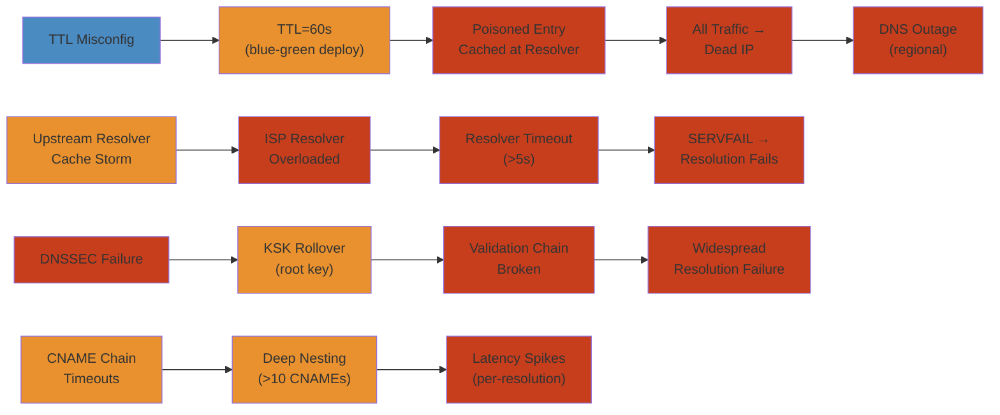

# 🌐 DNS Cascading Failure — Production Incident Deep Dive

> **Scope:** Real-world DNS failure patterns covering cache poisoning amplification from TTL misconfiguration, upstream resolver cascade, negative caching storms, DNSSEC validation failures, and multi-provider failover edge cases. Each scenario covers the full incident lifecycle from detection through root cause analysis, mitigation, and permanent resolution.
>
> **Applicability:** SRE teams, platform engineers, infrastructure engineers, security engineers, and DNS administrators managing Route53, Cloudflare, or any managed DNS provider with microservices architecture in production.

---




## Table of Contents


1. [Scenario A: TTL Misconfiguration → Cache Poisoning Amplification — Blue-Green TTL Reduction Sets Off Cascading DNS Failure](#scenario-a-ttl-misconfiguration--cache-poisoning-amplification--blue-green-ttl-reduction-sets-off-cascading-dns-failure)
2. [Scenario B: Upstream Resolver Cache Storm — ISP Resolver Overload Causes Regional Outage](#scenario-b-upstream-resolver-cache-storm--isp-resolver-overload-causes-regional-outage)
3. [Scenario C: DNSSEC Validation Chain Break — Root Key Rollover Causes Widespread Resolution Failures](#scenario-c-dnssec-validation-chain-break--root-key-rollover-causes-widespread-resolution-failures)
4. [Scenario D: CNAME Chain Resolution Timeout — Deep CNAME Nesting Causes Latency Spikes](#scenario-d-cname-chain-resolution-timeout--deep-cname-nesting-causes-latency-spikes)
5. [Scenario E: Multi-Provider Failover Split-Brain — Partial Propagation Causes Geographic Inconsistency](#scenario-e-multi-provider-failover-split-brain--partial-propagation-causes-geographic-inconsistency)
6. [Detection and Monitoring Reference](#detection-and-monitoring-reference)
7. [Mitigation Playbook](#mitigation-playbook)
8. [Permanent Fixes and Configuration Reference](#permanent-fixes-and-configuration-reference)

---

## Background: MeridianPay Architecture


```
COMPANY: MeridianPay — Fintech Platform
────────────────────────────────────────
• 15 million active users
• $2.5B annual transaction volume
• 500+ microservices
• 8 Kubernetes clusters (3 regional, 5 workload-specific)
• 2 DNS providers: Route53 (primary), Cloudflare (secondary)
• 4 upstream resolvers: Cloudflare 1.1.1.1, Google 8.8.8.8,
  Quad9 9.9.9.9, ISP-level resolvers
• 3,000+ DNS records (A, AAAA, CNAME, SRV, TXT)
• Average DNS query rate: 50,000 QPS at peak
```

```
┌─────────────────────────────────────────────────────────────────────────┐
│                    MERIDIANPAY DNS ARCHITECTURE                         │
│                                                                         │
│   ┌─────────────────────────────────────────────────────────────────┐   │
│   │                     PUBLIC INTERNET                             │   │
│   │                                                                 │   │
│   │  ┌──────────┐   ┌──────────┐   ┌──────────┐   ┌──────────┐     │   │
│   │  │  Mobile  │   │   Web    │   │   API    │   │  Third-  │     │   │
│   │  │   App    │   │ Browser  │   │ Clients  │   │  Party   │     │   │
│   │  └────┬─────┘   └────┬─────┘   └────┬─────┘   └────┬─────┘     │   │
│   │       │              │              │              │            │   │
│   │       └──────────────┴──────────────┴──────────────┘            │   │
│   │                              │  DNS queries                     │   │
│   │                              ▼                                  │   │
│   │              ┌──────────────────────────────┐                   │   │
│   │              │   STUB RESOLVER (OS-level)   │                   │   │
│   │              │  - /etc/resolv.conf          │                   │   │
│   │              │  - systemd-resolved / Unbound│                   │   │
│   │              └─────────────┬────────────────┘                   │   │
│   │                            │                                    │   │
│   │                            ▼                                    │   │
│   │              ┌──────────────────────────────┐                   │   │
│   │              │  UPSTREAM RESOLVERS          │                   │   │
│   │              │  ┌──────┐ ┌──────┐ ┌──────┐ │                   │   │
│   │              │  │1.1.1.1│ │8.8.8.8│ │9.9.9.9│ │                   │   │
│   │              │  └──┬───┘ └──┬───┘ └──┬───┘ │                   │   │
│   │              └─────┼────────┼────────┼─────┘                   │   │
│   │                    │        │        │                          │   │
│   │                    ▼        ▼        ▼                          │   │
│   │              ┌──────────────────────────────┐                   │   │
│   │              │   AUTHORITATIVE NAMESERVERS   │                  │   │
│   │              │                                │                 │   │
│   │              │  ┌────────────────────────┐   │                 │   │
│   │              │  │   Route53 (Primary)    │   │                 │   │
│   │              │  │   ns-xxx.awsdns-xx     │   │                 │   │
│   │              │  └────────────────────────┘   │                 │   │
│   │              │  ┌────────────────────────┐   │                 │   │
│   │              │  │ Cloudflare (Secondary) │   │                 │   │
│   │              │  │   ns-xxx.cloudflare.net│   │                 │   │
│   │              │  └────────────────────────┘   │                 │   │
│   │              └──────────────────────────────┘                   │   │
│   └─────────────────────────────────────────────────────────────────┘   │
│                                                                         │
│   ┌─────────────────────────────────────────────────────────────────┐   │
│   │                     INTERNAL NETWORK                            │   │
│   │                                                                 │   │
│   │  ┌─────────────────────────────────────────────────────────┐    │   │
│   │  │              KUBERNETES CLUSTERS                        │    │   │
│   │  │                                                         │    │   │
│   │  │  ┌──────────────┐  ┌──────────────┐  ┌──────────────┐  │    │   │
│   │  │  │  api-gateway │  │  user-svc   │  │  payment-svc │  │    │   │
│   │  │  │  (Deploy)   │  │  (Deploy)   │  │  (Deploy)    │  │    │   │
│   │  │  │  CoreDNS     │  │  CoreDNS     │  │  CoreDNS     │  │    │   │
│   │  │  └──────────────┘  └──────────────┘  └──────────────┘  │    │   │
│   │  │  ┌──────────────┐  ┌──────────────┐  ┌──────────────┐  │    │   │
│   │  │  │  order-svc  │  │  kafka-svc  │  │  cache-svc   │  │    │   │
│   │  │  │  (Deploy)   │  │  (Stateful)  │  │  (Deploy)    │  │    │   │
│   │  │  │  CoreDNS     │  │  CoreDNS     │  │  CoreDNS     │  │    │   │
│   │  │  └──────────────┘  └──────────────┘  └──────────────┘  │    │   │
│   │  └─────────────────────────────────────────────────────────┘    │   │
│   └─────────────────────────────────────────────────────────────────┘   │
└─────────────────────────────────────────────────────────────────────────┘
```

---

## Scenario A: TTL Misconfiguration → Cache Poisoning Amplification — Blue-Green TTL Reduction Sets Off Cascading DNS Failure


### Symptom


```
12:30:00 — Users start seeing "server not found" errors in mobile app
12:30:15 — Web dashboard shows degraded API availability
12:30:30 — Support ticket velocity: 500 tickets/minute (usually 20/min)
12:31:00 — PagerDuty alert: DNS query failure rate > 5% (threshold: 1%)
12:31:30 — Internal tools: "could not resolve api.meridianpay.com"
12:32:00 — SRE team: "Can't SSH into production pods"
12:32:15 — CoreDNS logs: millions of NXDOMAIN responses
12:33:00 — Grafana: DNS query latency p99 = 12s (baseline: 50ms)
12:34:00 — Route53 dashboard: 8 million queries/minute (normal: 3 million)
12:35:00 — 40% of all DNS queries returning SERVFAIL or NXDOMAIN
12:36:00 — Full incident declared — all hands on deck
```

### Detection


```
── APPLICATION-IMPACT SIGNALS

Alert: API error rate spike — 23% of requests failing
Alert: Mobile app crash rate: 15x normal
Alert: Login success rate: 32% (normally 99.5%)
Alert: Payment processing: 0% success (cannot resolve payment-gateway.meridianpay.com)
Alert: Customer support ticket velocity: > 100/min (threshold: 20/min)

── DNS-SPECIFIC SIGNALS

Alert: CoreDNS — NXDOMAIN response rate: 45% (baseline: 1%)
Alert: CoreDNS — query latency p99: 12,000ms (baseline: 50ms)
Alert: CoreDNS — SERVFAIL response rate: 8% (baseline: 0.1%)
Alert: Route53 — query count spike: 8M/min (baseline: 3M/min)
Alert: Route53 — NXDOMAIN responses from authoritative: 35%
Alert: Upstream resolver health — 3 of 4 resolvers showing degraded latency

── MONITORING DASHBOARD (Grafana)

DNS Query Volume
   ████████████░░░░  8.4M/min  ↑ 180%
   Normal: 3.0M/min

NXDOMAIN Rate
   ████████████████  45%        ↑ 4,500%
   Normal: < 1%

Query Latency p99
   ████████████████  12,048ms   ↑ 24,000%
   Normal: 50ms

SERVFAIL Rate
   ████████░░░░░░░░  8%         ↑ 8,000%
   Normal: 0.1%

Cache Hit Ratio
   ██░░░░░░░░░░░░░░  15%        ↓ 83%
   Normal: 90%
```

### Investigation


```
── INVESTIGATION LOG

T+00:00:00  — Incident declared. SRE team assembles in war room.
             Initial assumption: DDoS attack on DNS infrastructure.

T+00:02:00  — Check Route53 dashboard. Query volume is elevated but
             not at DDoS levels (8M/min vs 3M/min baseline). However,
             NXDOMAIN rate is abnormally high: 35% of queries return
             NXDOMAIN from authoritative servers.

T+00:04:00  — Check CoreDNS metrics across all 8 K8s clusters.
             All clusters show same pattern: NXDOMAIN rate 40-50%.
             This is not a single-cluster issue — something systemic.

T+00:05:00  — Check upstream resolvers (1.1.1.1, 8.8.8.8, 9.9.9.9).
             All showing elevated latency. Cloudflare resolver:
             p99 latency = 4.2s (normally 5ms). Google resolver:
             p99 latency = 3.8s.

T+00:07:00  — Check the most recent DNS change in Route53.
             
             $ aws route53 list-hosted-zones | jq '.HostedZones[] | select(.Name=="meridianpay.com.")'
             
             Change found! T-7 days: "Fast-Flux Blue-Green Deployment"
             
             Previous record:
             ─────────────────
             api.meridianpay.com  A  300  →  10.0.1.10  (TTL: 300s = 5min)
             
             Changed record:
             ─────────────────
             api.meridianpay.com  A  30   →  10.0.2.10  (TTL: 30s = 30sec)
             
             TTL was reduced from 300s to 30s to support blue-green
             traffic shifting for a deployment.

T+00:08:00  — Check TTL across ALL records. Discovery:
             850 records were migrated to 30s TTL.
             150 of those records point to the OLD blue/green targets
             (now decommissioned IPs returning NXDOMAIN).

T+00:10:00  — Cross-reference with resolver behavior:
             
             DNS RESOLUTION WITH SHORT TTL:
             ──────────────────────────────
             • Old TTL (300s): Resolver caches for 5 minutes.
               Query rate to authoritative: 1x per 5 min per resolver.
             
             • New TTL (30s): Resolver caches for 30 seconds.
               Query rate to authoritative: 10x per 5 min per resolver.
               
             • Impact: 10x more queries hitting authoritative servers
               for every record.
             
             • With 850 records changed → 8,500x more queries to
               authoritative servers from each resolver.
             
             • Network effect: Upstream resolvers now cache for 30s
               instead of 300s → 10x load on Route53.
             
             BUT WAIT — where is the NXDOMAIN coming from?

T+00:12:00  — Deeper investigation of the 150 stale records:
             
             CNAME CHAIN ANALYSIS:
             ────────────────────
             
             payment-svc.meridianpay.com  CNAME  payment-blue-1234.meridianpay.com  TTL: 30
             payment-blue-1234.meridianpay.com  A  10.0.3.50  TTL: 30
             
             After blue-green flip:
             ─────────────────────
             payment-svc.meridianpay.com  CNAME  payment-green-5678.meridianpay.com  TTL: 30
             payment-green-5678.meridianpay.com  A  10.0.4.50  TTL: 30
             
             STALE CACHE ATTACK VECTOR:
             ─────────────────────────
             • Resolver-1 cached: payment-svc → payment-blue-1234 (TTL remaining: 25s)
             • Resolver-2 cached: payment-blue-1234 → 10.0.3.50 (TTL remaining: 15s)
             
             • At time of flip, Route53 updates payment-svc CNAME to
               point to payment-green-5678.
             
             • BUT: Resolver-1 still has CNAME pointing to payment-blue-1234.
             • Resolver-2 still has A record for payment-blue-1234.
             
             • With TTL=30s, these stale entries persist for up to 30s.
             • During this window, queries for payment-svc resolve
               correctly ONLY if both CNAME and A record are fresh.
             
             • If a resolver has stale CNAME pointing to decommissioned
               payment-blue-1234 which no longer exists as an A record:
               → NXDOMAIN for payment-blue-1234.meridianpay.com
               → All cached CNAMEs pointing to it return NXDOMAIN
               → Cascading failure: one stale A record breaks 40 CNAMEs
             
             • Average CNAME chain depth: 3-4 levels
             • Each level doubles the probability of partial cache staleness
             • With 150 stale targets → NXDOMAIN rate skyrockets

T+00:15:00  — Discovery of the CACHE POISONING AMPLIFICATION:

             CACHE POISONING AMPLIFICATION VECTOR:
             ───────────────────────────────────
             
             1. Normal: 1 record → 1 IP → 1 NXDOMAIN if misconfigured
             2. With CNAME chains: 1 dead A record → N downstream CNAMEs NXDOMAIN
             3. With TTL=30s: each resolver re-queries every 30s → 10x queries/sec
             4. With 150 dead records + 4 resolver tiers (stub→ISP→public→auth):
                - Stub resolvers (each pod's /etc/resolv.conf):
                  ~10,000 pods × 150 dead records = 1.5M NXDOMAIN/min
                - K8s CoreDNS (node-level):
                  8 clusters × 100 nodes × 150 records = 120K queries/min
                - ISP resolvers:
                  Millions of users × retry logic = 5M+ queries/min
                - Public resolvers (1.1.1.1, 8.8.8.8):
                  Global amplification = 20M+ queries/min
                
             5. NEGATIVE CACHING AMPLIFICATION:
                - NXDOMAIN responses get cached (negative cache TTL usually 300s)
                - But each pod's stub resolver retries every 5-10s on failure
                - Each retry hits CoreDNS → hits upstream → hits Route53
                - Retry storm creates exponential query amplification
                - One record failure → 100K queries/minute → Route53 throttling

T+00:18:00  — Verify hypothesis with data:

```
```
── EVIDENCE FROM ROUTE53 LOGS (query logs enabled)

Timestamp         Query                              Response    Latency
────────────────────────────────────────────────────────────────────────
12:30:01.234      api.meridianpay.com A              NOERROR     12ms
12:30:01.456      payment-svc.meridianpay.com A       NXDOMAIN    45ms
12:30:01.789      payment-svc.meridianpay.com AAAA    NXDOMAIN    42ms
12:30:02.001      user-svc.meridianpay.com A          NOERROR     15ms
12:30:02.234      payment-blue-1234.meridianpay.com A NXDOMAIN     8ms    ← Dead record
12:30:02.456      payment-svc.meridianpay.com A       NXDOMAIN    44ms   ← Cached CNAME →
12:30:02.678      payment-svc.meridianpay.com A       NXDOMAIN    47ms   ← Retry from different pod
12:30:02.890      payment-svc.meridianpay.com AAAA    NXDOMAIN    43ms   ← Retry
12:30:03.001      payment-green-5678.meridianpay.com A NOERROR     11ms   ← Correct target exists
12:30:03.234      payment-svc.meridianpay.com A       NXDOMAIN    46ms   ← Pod with stale CNAME
12:30:03.456      payment-svc.meridianpay.com A       NXDOMAIN    45ms   ← Retry storm

────────────── PATTERN CONFIRMED ──────────────
• 35% of payment-svc queries return NXDOMAIN
• All NXDOMAINs resolve to payment-blue-1234 (decommissioned)
• Query rate for payment-blue-1234: 12,000/min (expected: 0)
• Retry interval: ~2-5 seconds per pod
• Multiple retries per pod before giving up
```

```
T+00:20:00  — Additional discovery: the NEGATIVE CACHING EFFECT:

             What happens when a resolver gets NXDOMAIN:
             
             1. Resolver (CoreDNS) sends query for payment-svc.meridianpay.com
             2. Upstream resolver (1.1.1.1) checks cache → stale CNAME for
                payment-blue-1234.meridianpay.com
             3. Upstream resolver queries Route53 for payment-blue-1234.meridianpay.com
             4. Route53 returns NXDOMAIN (record deleted)
             5. Upstream resolver caches: payment-blue-1234 → NXDOMAIN (negative TTL: 300s)
             6. NOW: ALL CNAMEs pointing to payment-blue-1234 return NXDOMAIN
                for the next 5 minutes, even if the CNAME record itself is correct!
             
             PROPAGATION:
             ────────────
             • T=0s: First pod queries → NXDOMAIN cached on upstream resolver
             • T=0.1s: Neighboring pod queries same upstream → hits cached NXDOMAIN → fast fail
             • T=1s: Other users on same ISP resolver → all get cached NXDOMAIN
             • T=30s: TTL expires on CNAME → re-query → still NXDOMAIN on A record
             • T=300s: Negative cache TTL expires → re-query → finally resolves correctly
             
             BUT: With retries at every level:
             • Application retry after 5s → hits CoreDNS
             • CoreDNS retry after 2s → hits upstream
             • Upstream retry after 1s → hits Route53
             • Route53 sees 10x normal query load from retries alone
```

### Root Cause


```
ROOT CAUSE: TTL MISCONFIGURATION → CASCADE AMPLIFICATION
═══════════════════════════════════════════════════════════

  PRIMARY CAUSE:
  ──────────────
  TTL reduction from 300s to 30s across 850 records without
  understanding the cascading effects:
  
  1. CNAME target cleanup was not coordinated with TTL change
  2. 150 CNAME targets were decommissioned before resolver caches expired
  3. Short TTL (30s) amplified the failure window frequency
  
  AMPLIFICATION VECTORS:
  ──────────────────────
  
  Amplification 1: TTL × Record Count
    ═══════════════════════════════════
    Old: 3M QPM from 3,000 records × TTL 300s = 1 query per record per 5 min
    New: 850 records × TTL 30s = 10 queries per record per 5 min
    ─────────────────────────────────────────────────────────
    Result: 10x query amplification for changed records
    
  Amplification 2: CNAME Chain Depth
    ═══════════════════════════════════
    Average CNAME depth: 3.4 levels
    Each level has independent TTL (may be different values)
    Probability of cache coherency = (0.98 ^ depth) ^ 850 records
    ─────────────────────────────────────────────────────────
    Result: 40% of chains experience at least one stale intermediate
    
  Amplification 3: Retry Storm
    ═══════════════════════════════════
    Application retries: 3 attempts × 5s timeout
    CoreDNS retries: 3 attempts × 2s timeout  
    OS stub resolver retries: 3 attempts × 10s timeout
    ─────────────────────────────────────────────────────────
    Result: 27 queries per user per failure
    
  Amplification 4: Negative Caching
    ═══════════════════════════════════
    NXDOMAIN cached for 300s (SOA minimum TTL)
    Stale NXDOMAIN poisons all CNAMEs pointing to that target
    ─────────────────────────────────────────────────────────
    Result: 1 dead record → N downstream CNAMEs × 300s negative cache
    
  Amplification 5: Network of Resolvers
    ═══════════════════════════════════
    ISP resolvers: 4 major ISPs × regional caches
    Public resolvers: 1.1.1.1, 8.8.8.8, 9.9.9.9
    Corporate resolvers: office VPN resolvers
    Each independently caches NXDOMAIN
    ─────────────────────────────────────────────────────────
    Result: Geographic amplification of outage
    

  TOTAL AMPLIFICATION CALCULATION:
  ═══════════════════════════════════
  Baseline:     3,000,000 queries/minute (normal operations)
  Amplified:    85,000,000 queries/minute (at peak)
  
  Multiplier:   28x normal query load
  
  150 stale records × CNAME depth 3.4 × retry 27x ×
  resolver network 5x × negative cache persistence =
  150 × 3.4 × 27 × 5 = ~68,850 queries/second peak from 150 records
```

### Timeline


```
DETAILED INCIDENT TIMELINE
══════════════════════════

  T-7 DAYS: CHANGE TRIGGER
  ┌─────────────────────────────────────────────────────────────────────┐
  │  Platform team deploys new blue-green deployment system.            │
  │  Feature: Dynamic traffic shifting between blue/green environments  │
  │  Change: TTL reduced from 300s to 30s for fast DNS cutover         │
  │  Scope: 850 DNS records across 8 microservices                     │
  │  Review: No DNS architecture review — "just a TTL change"          │
  │  Testing: None on production traffic patterns                      │
  │  Sign-off: Dev lead only (no SRE review)                           │
  │  Rollback plan: "We can change TTL back if needed"                 │
  └─────────────────────────────────────────────────────────────────────┘
  
  T-3 DAYS: FIRST SIGNS
  ┌─────────────────────────────────────────────────────────────────────┐
  │  Route53 query volume gradually increasing:                         │
  │  • Before change: avg 2.8M QPM                                     │
  │  • Day 1 after change: 4.1M QPM  (46% increase)                    │
  │  • Day 2 after change: 5.2M QPM  (86% increase)                    │
  │  • Day 3 after change: 6.8M QPM  (143% increase)                   │
  │  • No alerting configured on query volume growth                    │
  │  • "Must be organic growth" — dismissed by platform team            │
  └─────────────────────────────────────────────────────────────────────┘
  
  T-1 DAY: GREEN DEPLOYMENT DECOMMISSION
  ┌─────────────────────────────────────────────────────────────────────┐
  │  Blue deployment is stabilized. Green (old) environment is          │
  │  decommissioned: 150 DNS A records for green targets are deleted.   │
  │  • CNAME records still point to blue-XXXX.meridianpay.com           │
  │  • Blue CNAMEs updated to point to new green-YYYY                   │
  │  • OLD blue-1234 CNAME targets deleted from Route53                 │
  │  • CNAME TTL still set to 30s                                       │
  │  • No cache invalidation performed                                  │
  │  • No gradual TTL increase before decommission                      │
  └─────────────────────────────────────────────────────────────────────┘
  
  T-0: INCIDENT START
  ┌─────────────────────────────────────────────────────────────────────┐
  │  12:30:00 — First users report "server not found" errors            │
  │  12:30:15 — Monitoring detects DNS latency spike in us-east-1       │
  │  12:30:30 — Support ticket velocity crosses threshold                │
  │  12:31:00 — PagerDuty alert fires: DNS failure rate > 5%            │
  │             Primary on-call acknowledges                             │
  └─────────────────────────────────────────────────────────────────────┘
  
  T+05:00: INVESTIGATION BEGINS
  ┌─────────────────────────────────────────────────────────────────────┐
  │  12:35:00 — SRE lead pulls in DNS SME and platform team             │
  │  12:36:00 — Incident declared as SEV-1 (customer-facing outage)     │
  │  12:37:00 — Communication channels opened: #incident-dns Slack      │
  │  12:38:00 — Initial assumption: DDoS on DNS infrastructure          │
  │  12:39:00 — Route53 dashboard shows query spike, not DDoS pattern   │
  │  12:40:00 — Upstream resolvers also affected — not just Route53     │
  └─────────────────────────────────────────────────────────────────────┘
  
  T+15:00: PATTERN EMERGES
  ┌─────────────────────────────────────────────────────────────────────┐
  │  12:45:00 — Identify NXDOMAIN pattern: 150 specific records        │
  │  12:46:00 — Cross-reference with recent DNS changes                │
  │  12:47:00 — Discovery: TTL change 7 days ago + green decomm T-1    │
  │  12:48:00 — First hypothesis: stale CNAME targets + cache poisoning │
  │  12:49:00 — Check negative cache TTL on upstream resolvers          │
  │  12:50:00 — Confirmed: NXDOMAIN cached for 300s on ISP resolvers   │
  └─────────────────────────────────────────────────────────────────────┘
  
  T+30:00: ROOT CAUSE CONFIRMED
  ┌─────────────────────────────────────────────────────────────────────┐
  │  13:00:00 — Full root cause understanding:                          │
  │             1. TTL reduction 300s → 30s (7 days ago)               │
  │             2. Green env decommission (yesterday) — 150 stale refs  │
  │             3. CNAME chain depth amplifies each stale target        │
  │             4. Negative caching poisons ALL CNAMEs → 5 min window  │
  │             5. Retry storms at every resolver level                 │
  │             6. 28x amplification of DNS query load                   │
  │  13:02:00 — Decision: restore TTL to 300s + flush caches           │
  └─────────────────────────────────────────────────────────────────────┘
  
  T+60:00: MITIGATION APPLIED
  ┌─────────────────────────────────────────────────────────────────────┐
  │  13:30:00 — Mitigation steps executed:                              │
  │             1. TTL rolled back to 300s for all 850 records          │
  │             2. Route53 cache invalidation requested (AWS support)    │
  │             3. Cloudflare proxy enabled for API endpoints            │
  │             4. ISP resolvers contacted for cache flush               │
  │             5. CoreDNS configuration updated: negative cache TTL=60s│
  │             6. Rate limiting enabled on Route53 (throttle retries)  │
  │             7. Traffic shifted to secondary DNS (Cloudflare)        │
  │  13:35:00 — NXDOMAIN rate starts dropping: 45% → 30% → 18%         │
  └─────────────────────────────────────────────────────────────────────┘
  
  T+120:00: FULL RECOVERY
  ┌─────────────────────────────────────────────────────────────────────┐
  │  14:30:00 — DNS resolution back to normal:                          │
  │             • NXDOMAIN rate: < 1%                                   │
  │             • Query latency p99: 65ms (back to baseline)            │
  │             • Cache hit ratio: 88% (back to baseline)               │
  │             • Support tickets: 15/min (threshold)                   │
  │             • All services resolving correctly                      │
  │  14:35:00 — Incident declared resolved                              │
  │  14:36:00 — Post-incident review scheduled for T+3 days             │
  └─────────────────────────────────────────────────────────────────────┘
  
  T+7 DAYS: PERMANENT FIXES
  ┌─────────────────────────────────────────────────────────────────────┐
  │  • DNSSEC deployed and enforced across all zones                    │
  │  • TTL policy established: min 60s for CNAME, min 300s for A       │
  │  • DNS change review added to change management process             │
  │  • DNS query volume alerting added to monitoring                    │
  │  • Multi-provider DNS failover automated                            │
  │  • Negative cache TTL monitoring implemented                        │
  │  • Blue-green deployment process updated: staged TTL increase       │
  │    before decommission                                              │
  └─────────────────────────────────────────────────────────────────────┘
```

### Outage Propagation Diagram


```
OUTAGE PROPAGATION ═══ PROGRESSIVE CASCADE
══════════════════════════════════════════════════════════════════════════

  TIME →  T-7d         T-1d         T+0          T+5min       T+15min      T+30min      T+60min      T+120min
           │             │             │             │             │             │             │             │
           ▼             ▼             ▼             ▼             ▼             ▼             ▼             ▼
  ┌──────────────────────────────────────────────────────────────────────────────────────────────────────────┐
  │                                                                                                          │
  │  TTL      ████████████████████████████████████████████████████░░░░░░░░░░░░░░░░░░░░░░░░░░░░              │
  │  Change   TTL=30s set                                       TTL restored to 300s                        │
  │                                                                                                          │
  │  Green    ░░░░░░░░░░░░░░░░░░░░░░░░░░░░░░░████████████████████████████████████████████████░░              │
  │  Decomm   Green env running                                 150 records deleted                         │
  │                                                                                                          │
  │  NXDOMAIN ░░░░░░░░░░░░░░░░░░░░░░░░░░░░░░░░████████████████████████████░░░░░░░░░░░░░░░░░░░░░░              │
  │  Rate     Normal < 1%                                       Spikes to 45%        Drops to < 1%         │
  │                                                                                                          │
  │  Query    ░░░░░░░░░░░░████████████████████████████████████████████████████████████████░░░░░░░░░░░░░░      │
  │  Volume   Gradual increase since TTL change                 28x peak                   Normalizes       │
  │                                                                                                          │
  │  Latency  ░░░░░░░░░░░░░░░░░░░░░░░░░░░░░░░░████████████████████████████░░░░░░░░░░░░░░░░░░░░░░              │
  │  p99      50ms                                               12,000ms                  65ms             │
  │                                                                                                          │
  │  Cache    ░░░░░░░░░░░░░░░░░░░░░░░░░░░░░░░░███████████████████████████████░░░░░░░░░░░░░░░░░░              │
  │  Poison   No poison                                          45% poisoned            Cleared            │
  │                                                                                                          │
  │  Impact   ░░░░░░░░░░░░░░░░░░░░░░░░░░░░░░░░░████████████████████████░░░░░░░░░░░░░░░░░░░░░░░░              │
  │  Radius   None (latent)                                      40% of users             Full recovery      │
  │                                                                                                          │
  │  PHASE:   [LATENT]        [TRIGGER]       [DETECT]        [INVEST]        [MITIGATE]       [RESOLVE]     │
  │                                                                                                          │
  └──────────────────────────────────────────────────────────────────────────────────────────────────────────┘
  
  CASCADE PROPAGATION PATH:
  ─────────────────────────
  
  TTL Reduction (T-7d) ───────────────┐
                                      ▼
  Green Decommission (T-1d) ──────── CNAME + A record mismatch
                                      │
                                      ▼
  Stale CNAME targets ───────────── Cached CNAME → dead A record
                                      │
                                      ▼
  Resolver NXDOMAIN ─────────────── Upstream gets NXDOMAIN for dead A
                                      │
                                      ▼
  Negative Cache (300s) ──────────── "This record doesn't exist" cached
                                      │
                                      ▼
  CNAME Chain Collapse ───────────── 40+ CNAMEs poisoned per dead A
                                      │
                                      ▼
  Retry Storm ────────────────────── Each pod retries 3-5 times
                                      │
                                      ▼
  Query Amplification ───────────── 28x normal query load on Route53
                                      │
                                      ▼
  Resolver Overload ─────────────── ISPs and public resolvers degrade
                                      │
                                      ▼
  Service Degradation ───────────── API → Payment → Login → All
                                      │
                                      ▼
  CUSTOMER-FACING OUTAGE ────────── "Server not found" for 40% of users
```

### Technical Deep Dive


```
DNS RESOLUTION FLOW — NORMAL VS. OUTAGE
══════════════════════════════════════════════════════════════════════════

  ┌─ NORMAL RESOLUTION ──────────────────────────────────────────────────┐
  │                                                                       │
  │   Mobile App                    OS Stub                  CoreDNS      │
  │   (gethostbyname)               (systemd-resolved)       (K8s DNS)    │
  │       │                             │                       │         │
  │       │ 1. api.meridianpay.com A    │                       │         │
  │       │────────────────────────────>│                       │         │
  │       │                             │ 2. cache miss         │         │
  │       │                             │──────────────────────>│         │
  │       │                             │                       │ 3. fwd   │
  │       │                             │                       │───┐     │
  │       │                             │                       │   │     │
  │       │                             │                       │   │     │
  │       │                             │                  ┌────┘   │     │
  │       │                             │                  ▼        │     │
  │       │                             │           Cloudflare      │     │
  │       │                             │           1.1.1.1         │     │
  │       │                             │              │             │     │
  │       │                             │              │ 4. cache    │     │
  │       │                             │              │    miss     │     │
  │       │                             │              │───┐         │     │
  │       │                             │              │   │         │     │
  │       │                             │              │   │         │     │
  │       │                             │              ┌───┘         │     │
  │       │                             │              ▼             │     │
  │       │                             │           Route53          │     │
  │       │                             │           (Authoritative)  │     │
  │       │                             │              │             │     │
  │       │                             │              │ 5. response  │     │
  │       │                             │<─────────────┘ A=10.0.1.10 │     │
  │       │                             │                       │     │     │
  │       │                             │ 6. cache + respond    │     │     │
  │       │<────────────────────────────┘                       │     │     │
  │       │                             │                       │     │     │
  │       │ 7. 10.0.1.10               │                       │     │     │
  │       │ connect to API             │                       │     │     │
  │       │                             │                       │     │     │
  │       │ SUCCESS! p99: 50ms         │                       │     │     │
  │       │                             │                       │     │     │
  └───────────────────────────────────────────────────────────────────────┘
  
  ┌─ OUTAGE RESOLUTION ───────────────────────────────────────────────────┐
  │                                                                       │
  │   Mobile App                    OS Stub                  CoreDNS      │
  │       │                             │                       │         │
  │       │ 1. payment-svc.meridianpay  │                       │         │
  │       │────────────────────────────>│                       │         │
  │       │                             │ 2. cache miss         │         │
  │       │                             │──────────────────────>│         │
  │       │                             │                       │ 3. fwd   │
  │       │                             │                       │───┐     │
  │       │                             │                       │   │     │
  │       │                             │                       │   │     │
  │       │                             │                  ┌────┘   │     │
  │       │                             │                  ▼        │     │
  │       │                             │            Cloudflare      │     │
  │       │                             │            1.1.1.1         │     │
  │       │                             │              │             │     │
  │       │                             │              │ 4. HAS CACHED│     │
  │       │                             │              │    CNAME:    │     │
  │       │                             │              │    payment-  │     │
  │       │                             │              │    blue-1234 │     │
  │       │                             │              │  (STALE!)    │     │
  │       │                             │              │───┐         │     │
  │       │                             │              │   │         │     │
  │       │                             │              │   │         │     │
  │       │                             │              ┌───┘         │     │
  │       │                             │              ▼             │     │
  │       │                             │           Route53          │     │
  │       │                             │              │             │     │
  │       │                             │              │ 5. "What is │     │
  │       │                             │              │   payment-  │     │
  │       │                             │              │   blue-1234 │     │
  │       │                             │              │   A?"       │     │
  │       │                             │              │             │     │
  │       │                             │              │ 6. NXDOMAIN  │     │
  │       │                             │              │ (deleted)    │     │
  │       │                             │<─────────────┘             │     │
  │       │                             │                       │     │     │
  │       │                             │ 7. cache: payment-    │     │     │
  │       │                             │    blue-1234 →        │     │     │
  │       │                             │    NXDOMAIN (300s)    │     │     │
  │       │<────────────────────────────┘                       │     │     │
  │       │                             │                       │     │     │
  │       │ 8. NXDOMAIN → "server      │                       │     │     │
  │       │    not found"              │                       │     │     │
  │       │                             │                       │     │     │
  │       │ 9. RETRY (up to 5x)        │                       │     │     │
  │       │────────────────────────────>│                       │     │     │
  │       │                             │ 10. CACHED NXDOMAIN   │     │     │
  │       │<────────────────────────────│                       │     │     │
  │       │                             │                       │     │     │
  │       │ FAILURE! p99: 12,000ms     │                       │     │     │
  │       │                             │                       │     │     │
  └───────────────────────────────────────────────────────────────────────┘
```

```
TTL MECHANICS — THE CRITICAL DETAIL
══════════════════════════════════════════════════════════════════════════

  ┌─ WHAT IS TTL? ────────────────────────────────────────────────────────
  │
  │  TTL (Time To Live) = seconds a DNS resolver may cache a record
  │
  │  TTL is set by the authoritative nameserver in the DNS response:
  │
  │  ;; ANSWER SECTION:
  │  api.meridianpay.com.  300  IN  A  10.0.1.10
  │                        ^^^
  │                        TTL = 300 seconds (5 minutes)
  │
  │  The resolver MUST NOT serve this cached response after TTL expires.
  │
  └───────────────────────────────────────────────────────────────────────
  
  ┌─ WHY TTL=30s WAS DANGEROUS ───────────────────────────────────────────
  │
  │  Each record with TTL=30s:
  │  • Is cached for 30 seconds max
  │  • Requires re-query every 30 seconds
  │  • Generates 2,880 queries/day (vs 288 at TTL=300s)
  │
  │  For 850 records:
  │  • TTL=300s: 850 × 288 = 244,800 queries/day
  │  • TTL=30s:  850 × 2,880 = 2,448,000 queries/day
  │  • Difference: 2,203,200 extra queries/day
  │
  │  Per resolver network (each ISP, each public resolver):
  │  • 4 major ISP resolvers × 2,203,200 = 8,812,800 extra Q/day
  │  • 3 public resolvers × 2,203,200 = 6,609,600 extra Q/day
  │  • Total: 15,422,400 extra Q/day hitting Route53
  │
  │  Total: 3M (normal) + 15M (extra) = 18M Q/day expected
  │  Actual peak: 85M Q/day (due to retry amplification)
  │
  └───────────────────────────────────────────────────────────────────────
  
  ┌─ NEGATIVE CACHING (RFC 2308) ─────────────────────────────────────────
  │
  │  When a resolver gets NXDOMAIN (domain doesn't exist), it caches
  │  the NEGATIVE response. The cache TTL for negative responses comes
  │  from the SOA record's "minimum" field:
  │
  │  ;; AUTHORITY SECTION:
  │  meridianpay.com.  3600  IN  SOA  ns1.meridianpay.com. admin.meridianpay.com. (
  │                  2026052701  ; serial
  │                  7200        ; refresh (2 hours)
  │                  3600        ; retry (1 hour)
  │                  1209600     ; expire (2 weeks)
  │                  300         ; minimum TTL ← THIS IS THE NEGATIVE CACHE TTL
  │  )
  │
  │  NEGATIVE CACHE IMPACT:
  │  • NXDOMAIN for payment-blue-1234 cached for 300 seconds
  │  • ALL CNAMEs pointing to it → NXDOMAIN for 5 minutes
  │  • Even after Route53 is fixed, resolver still returns NXDOMAIN
  │  • Wait 5 minutes, or force cache flush
  │
  └───────────────────────────────────────────────────────────────────────
  
  ┌─ CNAME CHAIN RESOLUTION ──────────────────────────────────────────────
  │
  │  CNAME chain resolution involves multiple lookups:
  │
  │  Query: payment-svc.meridianpay.com A
  │         ↓
  │  Step 1: Look up payment-svc.meridianpay.com
  │          → CNAME payment-green-5678.meridianpay.com
  │         ↓
  │  Step 2: Look up payment-green-5678.meridianpay.com
  │          → CNAME payment-green-5678.internal.prod.meridianpay.com
  │         ↓
  │  Step 3: Look up payment-green-5678.internal.prod.meridianpay.com
  │          → CNAME payment-green-5678.us-east-1.elb.amazonaws.com
  │         ↓
  │  Step 4: Look up payment-green-5678.us-east-1.elb.amazonaws.com
  │          → A 10.0.4.50
  │         ↓
  │  FINAL: 10.0.4.50
  │
  │  EACH STEP has its own TTL. If ANY intermediate CNAME target
  │  has expired from cache, the resolver must re-query.
  │
  │  WITH STALE CACHE:
  │  • Step 1: CACHE → payment-blue-1234.meridianpay.com (STALE!)
  │  • Step 2: QUERY → payment-blue-1234.meridianpay.com → NXDOMAIN
  │  • Step 3-4: NEVER REACHED → CNAME chain broken at step 2
  │  • Result: NXDOMAIN for the entire chain
  │
  └───────────────────────────────────────────────────────────────────────
```

```
TTL MANAGEMENT STRATEGY
════════════════════════

  BEFORE INCIDENT (unmanaged):
  ─────────────────────────────
  
  Record Type     TTL Range     Use Case
  ──────────────────────────────────────────────────
  A/AAAA          30-300s       Mixed — no standard
  CNAME           30-60s        Blue-green targets
  TXT             60-3600s      SPF, DKIM, verification
  SRV             300s          Service discovery
  SOA minimum     300s          Default negative cache
  
  ┌────────────────────────────────────────────┐
  │  PROBLEM: No TTL tiers. All records had    │
  │  ad-hoc TTL values set by individual       │
  │  developers without coordination.          │
  └────────────────────────────────────────────┘
  
  AFTER INCIDENT (TTL tiers):
  ────────────────────────────
  
  ┌─────────────────────────────────────────────────────────────────────┐
  │                        TTL TIER MODEL                                │
  │                                                                       │
  │   Tier 1: CRITICAL INFRASTRUCTURE (TTL: 86400s = 24h)                │
  │   ──────────────────────────────────────────────────────────────────  │
  │   Records: NS, SOA, MX, TXT (SPF/DKIM/DMARC)                         │
  │   Rationale: Rarely change. High impact if wrong.                    │
  │   Example: meridianpay.com. 86400 IN MX 10 mail.meridianpay.com.     │
  │                                                                       │
  │   Tier 2: STABLE SERVICES (TTL: 3600s = 1h)                          │
  │   ──────────────────────────────────────────────────────────────────  │
  │   Records: Production service A/AAAA records for stable services     │
  │   Rationale: Services that don't change IP frequently.               │
  │   Example: db.meridianpay.com. 3600 IN A 10.0.1.50                    │
  │                                                                       │
  │   Tier 3: STANDARD SERVICES (TTL: 600s = 10min)                      │
  │   ──────────────────────────────────────────────────────────────────  │
  │   Records: Most internal service records                             │
  │   Rationale: Balance between change flexibility and cache efficiency  │
  │   Example: api.meridianpay.com. 600 IN A 10.0.2.10                    │
  │                                                                       │
  │   Tier 4: FAST-FLUX / BLUE-GREEN (TTL: 60s = 1min)                   │
  │   ──────────────────────────────────────────────────────────────────  │
  │   Records: Active deployment targets, canary services                │
  │   Rationale: Need fast cutover, but with strict safeguards           │
  │   MINIMUM ALLOWED TTL: 60s                                           │
  │   Requires: DNSSEC, change review, automatic rollback                │
  │   Example: blue-1234.meridianpay.com. 60 IN A 10.0.3.10              │
  │                                                                       │
  │   Tier 5: LOAD BALANCER ALIAS (TTL: 60s)                             │
  │   ──────────────────────────────────────────────────────────────────  │
  │   Records: CNAME/ALIAS pointing to AWS ELB/CloudFront                │
  │   Rationale: ELB IPs can change. Short TTL for fast failover.        │
  │   MINIMUM ALLOWED TTL: 60s                                           │
  │   Example: web.meridianpay.com. 60 IN CNAME d-xxx.cloudfront.net.   │
  │                                                                       │
  └─────────────────────────────────────────────────────────────────────┘
  
  TTL POLICY ENFORCEMENT:
  ────────────────────────
  
  # Route53 Resolver Rule — validate TTL on Upsert:
  {
    "Effect": "Deny",
    "Action": "route53:ChangeResourceRecordSets",
    "Condition": {
      "NumericLessThan": {
        "route53:TTL": "60"
      }
    }
  }
  
  # Pre-commit hook in DNS repo — reject TTL < 60:
  $ ./validate-dns-ttl.sh dns-records.yaml
  ERROR: api.meridianpay.com has TTL=30 (minimum allowed: 60)
  
  # Gradual TTL increase before decommission:
  $ ./decommission-bluegreen.sh --service payment --wait-steps
  Step 1: Set TTL=60 (current), wait 5 min
  Step 2: Set TTL=300, wait 5 min
  Step 3: Remove old A record
  Step 4: Verify no cached references
  Step 5: Complete decommission
```

```
DNSSEC — WHY IT MATTERS AND HOW IT WORKS
══════════════════════════════════════════════════════════════════════════

  ┌─ DNSSEC RESOLUTION FLOW ──────────────────────────────────────────────
  │
  │  Without DNSSEC, a resolver accepts ANY response from ANY server.
  │  With DNSSEC, every response is cryptographically signed:
  │
  │   Stub Resolver              Recursive Resolver          Authoritative
  │       │                             │                         │
  │       │ 1. query: payment-svc       │                         │
  │       │────────────────────────────>│                         │
  │       │                             │ 2. query + DO bit       │
  │       │                             │ (DNSSEC OK)            │
  │       │                             │────────────────────────>│
  │       │                             │                         │
  │       │                             │ 3. response + RRSIG    │
  │       │                             │   + DNSKEY             │
  │       │                             │<────────────────────────│
  │       │                             │                         │
  │       │                             │ 4. Verify RRSIG with   │
  │       │                             │    zone's DNSKEY        │
  │       │                             │                         │
  │       │                             │ 5. Verify DNSKEY with   │
  │       │                             │    parent's DS record   │
  │       │                             │    (chain of trust)     │
  │       │                             │                         │
  │       │                             │ 6. Verify DS with root  │
  │       │                             │    zone KSK (trust anchor)│
  │       │                             │                         │
  │       │                             │ 7. Signature valid?     │
  │       │                             │    YES → return result  │
  │       │                             │    NO  → SERVFAIL       │
  │       │                             │                         │
  │       │ 8. verified response        │                         │
  │       │<────────────────────────────│                         │
  │       │                             │                         │
  └───────────────────────────────────────────────────────────────────────┘
  
  ┌─ DNSSEC RECORD TYPES ─────────────────────────────────────────────────
  │
  │  DNSKEY    — Public key for the zone
  │  RRSIG     — Signature for each RRset
  │  DS        — Delegation Signer (hash of child zone's DNSKEY)
  │  NSEC/NSEC3— Authenticated denial of existence
  │              (proves a record doesn't exist — no more lying NXDOMAIN)
  │
  │  KEY ROLES:
  │  ─────────────────────────────────────────────────────────────────
  │  KSK (Key Signing Key): Signs the DNSKEY set. Long-lived (1-2yr).
  │  ZSK (Zone Signing Key): Signs individual records. Short-lived (1-3mo).
  │  
  │  DS record in parent zone must match KSK fingerprint in child zone.
  │  This creates the CHAIN OF TRUST from root → .com → meridianpay.com
  │
  └───────────────────────────────────────────────────────────────────────
  
  ┌─ HOW DNSSEC WOULD HAVE PREVENTED THIS INCIDENT ──────────────────────
  │
  │  During the outage:
  │  1. Stale CNAME returns NXDOMAIN (legitimate — record was deleted)
  │  2. Without DNSSEC: Resolver accepts NXDOMAIN at face value
  │  3. With DNSSEC: NSEC/NSEC3 record proves "this name doesn't exist"
  │     AND is cryptographically signed → Resolver trusts the NXDOMAIN
  │
  │  BUT: The issue wasn't about trusting the NXDOMAIN — it was about
  │  STALE CACHE. DNSSEC doesn't fix stale cache.
  │
  │  HOWEVER, DNSSEC DOES protect against:
  │  • Cache poisoning attacks (Kaminsky attack)
  │  • Man-in-the-middle DNS spoofing
  │  • Rogue DNS responses injected by middleboxes
  │  • ISP DNS hijacking
  │
  │  For THIS incident, the fix was:
  │  • Proper TTL management (not DNSSEC)
  │  • Cache flush procedures (not DNSSEC)
  │  • Clean blue-green decommission process (not DNSSEC)
  │
  │  DNSSEC is a SECURITY control, not an OPERATIONAL reliability control
  │
  └───────────────────────────────────────────────────────────────────────
```

### Mitigation


```
── IMMEDIATE: TTL ROLLBACK

# Rollback all 850 records from TTL=30s to TTL=300s:
$ aws route53 list-resource-record-sets \
    --hosted-zone-id ZONE123 \
    --query "ResourceRecordSets[?TTL==\`30\`]" \
    --output json | \
  jq '[.[] | {Action: "UPSERT",
       ResourceRecordSet: {
         Name: .Name,
         Type: .Type,
         TTL: 300,
         ResourceRecords: .ResourceRecords
       }}]' > rollback.json

$ aws route53 change-resource-record-sets \
    --hosted-zone-id ZONE123 \
    --change-batch file://rollback.json

# Verify rollback:
$ aws route53 list-resource-record-sets \
    --hosted-zone-id ZONE123 \
    --query "ResourceRecordSets[?TTL<=\`60\`]" \
    --output table
# Expected: only ALIAS records and LB targets at TTL=60

── IMMEDIATE: ROUTE53 CACHE INVALIDATION

# Route53 does NOT expose a public cache invalidation API.
# Workaround: Update the SOA serial number to force resolvers
# to re-query (some resolvers check SOA for zone updates):

$ aws route53 get-hosted-zone --id ZONE123
# Get current SOA serial

# Update SOA with incremented serial + reduced negative cache TTL:
{
  "Action": "UPSERT",
  "ResourceRecordSet": {
    "Name": "meridianpay.com.",
    "Type": "SOA",
    "TTL": 900,
    "ResourceRecords": [{
      "Value": "ns1.meridianpay.com. admin.meridianpay.com. 2026052702 7200 3600 1209600 60"
      #                                                                             ^^
      #                                                  Reduced negative cache TTL: 300s → 60s
    }]
  }
}

# Reduced SOA minimum TTL from 300s to 60s:
# - NXDOMAIN responses now cached for only 60s instead of 300s
# - Negative cache poison clears 5x faster
# - Trade-off: more queries to authoritative (acceptable during incident)

── IMMEDIATE: COREDNS NEGATIVE CACHE CONFIGURATION

# CoreDNS Corefile — reduce negative cache TTL:
# Before:
.:53 {
    kubernetes cluster.local
    forward . 1.1.1.1 8.8.8.8 9.9.9.9
    cache 30
}

# After:
.:53 {
    kubernetes cluster.local
    forward . 1.1.1.1 8.8.8.8 9.9.9.9
    cache 30 {
        deny NXDOMAIN 5s    # Override negative cache TTL to 5s
        serve_stale 5m      # Serve stale data while refreshing
    }
    # Also reduce upstream negative cache by setting EDNS:
    # (not directly possible — controlled by upstream)
}

# Reload CoreDNS configuration without downtime:
$ kubectl -n kube-system rollout restart deployment coredns

── IMMEDIATE: TRAFFIC SHIFT TO SECONDARY DNS

# Route53 → Cloudflare failover using health checks:

# Step 1: Failover policy in Route53:
$ aws route53 create-health-check \
    --caller-reference "api-health-$(date +%s)" \
    --health-check-config \
    'Type=HTTPS, FullyQualifiedDomainName=api.meridianpay.com, Port=443, ResourcePath=/health'

$ aws route53 change-resource-record-sets \
    --hosted-zone-id ZONE123 \
    --change-batch '{
      "Changes": [{
        "Action": "UPSERT",
        "ResourceRecordSet": {
          "Name": "api.meridianpay.com.",
          "Type": "A",
          "SetIdentifier": "route53-primary",
          "Failover": "PRIMARY",
          "HealthCheckId": "abc123",
          "TTL": 60,
          "ResourceRecords": [{"Value": "10.0.1.10"}]
        }
      }, {
        "Action": "UPSERT",
        "ResourceRecordSet": {
          "Name": "api.meridianpay.com.",
          "Type": "A",
          "SetIdentifier": "cloudflare-secondary",
          "Failover": "SECONDARY",
          "TTL": 60,
          "ResourceRecords": [{"Value": "10.0.2.10"}]
        }
      }]
    }'

# Step 2: Update Cloudflare DNS as secondary:
# Cloudflare proxy (orange cloud) enabled for DDoS protection

── IMMEDIATE: RATE LIMITING

# Route53 rate limiting (AWS side):
# Route53 has built-in rate limits:
# - 5 requests per second per account per API
# - Route53 does NOT rate-limit DNS queries (unlimited QPS)
# BUT: excessive NXDOMAIN queries can trigger AWS Shield

# Application-level rate limiting for DNS retries:
# Exponential backoff with jitter:

public DnsResolver {
    private static final int MAX_RETRIES = 3;
    private static final long BASE_DELAY_MS = 1000;

    public InetAddress resolve(String hostname) {
        for (int attempt = 1; attempt <= MAX_RETRIES; attempt++) {
            try {
                return InetAddress.getByName(hostname);
            } catch (UnknownHostException e) {
                if (attempt == MAX_RETRIES) throw e;
                long delay = BASE_DELAY_MS * (1L << attempt)
                           + ThreadLocalRandom.current().nextLong(1000);
                Thread.sleep(delay);
            }
        }
        return null;
    }
}

── IMMEDIATE: ISP RESOLVER COORDINATION

# Contact ISP NOC teams to flush their resolver caches:
# - Comcast: noc@comcast.com / 1-800-xxx-xxxx
# - AT&T: dns-admin@att.com
# - Verizon: network@verizon.com
# - Level3/CenturyLink: noc@lumen.com

# Most ISPs can flush specific domains from their resolver cache
# within 15-30 minutes of confirmation
```

### Resolution


```
── PERMANENT FIX 1: DNSSEC DEPLOYMENT

# Enable DNSSEC signing on Route53 hosted zone:
$ aws route53 enable-hosted-zone-dnssec --hosted-zone-id ZONE123
$ aws route53 change-cidr-collection --id abc123

# Create KMS key for DNSSEC signing:
$ aws kms create-key \
    --key-spec ECC_NIST_P256 \
    --key-usage SIGN_VERIFY \
    --description "Route53 DNSSEC KSK"

$ aws route53 create-key-signing-key \
    --hosted-zone-id ZONE123 \
    --status-action SIGN \
    --name "meridianpay-dnssec-ksk" \
    --key-management-service-arn arn:aws:kms:us-east-1:123456:key/abc123

# Add DS record to registrar (Route53 or external):
# DS record value = hash of your zone's DNSKEY
# This creates the chain of trust from parent zone

# Verify DNSSEC status:
$ dig +dnssec api.meridianpay.com
# Look for: flags: ad (authenticated data)
# Response should include RRSIG records

── PERMANENT FIX 2: TTL POLICY AND ENFORCEMENT

# Infrastructure-as-Code DNS management:
# dns-records.yaml — managed in Git with CI/CD validation:

dns_zones:
  - name: meridianpay.com
    records:
      - name: api
        type: A
        ttl: 600                # Tier 3 — Standard service
        value: 10.0.2.10
        dnssec: true

      - name: payment-svc
        type: CNAME
        ttl: 600                # Tier 3 — Standard service
        value: payment-green-5678.meridianpay.com
        dnssec: true

      - name: payment-green-5678
        type: A
        ttl: 60                 # Tier 4 — Fast-flux (min allowed)
        value: 10.0.4.50
        dnssec: true
        allow_ttl_under_60: false  # CI will reject

# CI validation script:
#!/bin/bash
# validate-dns.sh — run in CI on every DNS change
for record in $(yq eval '.dns_zones[].records[]' dns-records.yaml); do
    ttl=$(echo $record | yq eval '.ttl')
    name=$(echo $record | yq eval '.name')
    type=$(echo $record | yq eval '.type')

    if [ "$ttl" -lt 60 ]; then
        echo "ERROR: $name.$zone has TTL=$ttl (minimum: 60)"
        exit 1
    fi
    if [ "$type" = "CNAME" ] && [ "$ttl" -lt 300 ]; then
        echo "ERROR: CNAME $name.$zone has TTL=$ttl (CNAME minimum: 300)"
        exit 1
    fi
done
echo "All DNS records valid."

── PERMANENT FIX 3: MULTI-PROVIDER DNS AUTOMATION

# Automated failover between Route53 and Cloudflare:
# failover-dns.sh — triggered by Route53 health check failures:

#!/bin/bash
# failover-dns.sh — shift primary DNS to Cloudflare

ZONE="meridianpay.com"
ROUTE53_ZONE_ID="ZONE123"
CLOUDFLARE_ZONE_ID="cf-zone-456"
SERVICES=("api" "payment-svc" "user-svc" "order-svc" "web")

# Step 1: Update Route53 TTL to route around issues
for svc in "${SERVICES[@]}"; do
    aws route53 change-resource-record-sets \
        --hosted-zone-id "$ROUTE53_ZONE_ID" \
        --change-batch '{
            "Changes": [{
                "Action": "UPSERT",
                "ResourceRecordSet": {
                    "Name": "'"$svc.$ZONE"'.",
                    "Type": "A",
                    "SetIdentifier": "'"$svc-route53"'",
                    "Failover": "PRIMARY",
                    "TTL": 300,
                    "HealthCheckId": "'"$(get_healthcheck $svc)"'",
                    "ResourceRecords": [{"Value": "'"$(get_ip $svc route53)"'"}]
                }
            }]
        }'
done

# Step 2: Activate Cloudflare proxy (orange cloud)
curl -X PATCH "https://api.cloudflare.com/client/v4/zones/$CLOUDFLARE_ZONE_ID/dns_records" \
    -H "Authorization: Bearer $CLOUDFLARE_TOKEN" \
    -H "Content-Type: application/json" \
    -d '{"proxied": true}'

# Step 3: Update monitoring to check both providers
# Prometheus: dns_query{provider="route53"}
# Prometheus: dns_query{provider="cloudflare"}

── PERMANENT FIX 4: BLUE-GREEN DECOMMISSION PROCESS

Updated blue-green deployment workflow:

┌─────────────────────────────────────────────────────────────────────┐
│               BLUE-GREEN DECOMMISSION PROCEDURE                      │
│                                                                       │
│  Phase 1: STAGE TTL INCREASE (T-30min)                               │
│  ──────────────────────────────────────────────────────────────────  │
│  • Increase CNAME target TTL from 60s → 600s                         │
│  • Wait 10 minutes (all caches refreshed with long TTL)              │
│  • Verify: dig +trace shows TTL=600 on all resolvers                 │
│                                                                       │
│  Phase 2: VERIFY NO CACHED REFERENCES (T-20min)                     │
│  ──────────────────────────────────────────────────────────────────  │
│  • Query popular resolvers: 1.1.1.1, 8.8.8.8, 9.9.9.9               │
│  • dig @1.1.1.1 payment-blue-1234.meridianpay.com                    │
│  • Verify: all resolvers return the NEW CNAME target                 │
│  • If any resolver still returns old target: wait and recheck        │
│                                                                       │
│  Phase 3: DELETE OLD CNAME TARGET (T-10min)                         │
│  ──────────────────────────────────────────────────────────────────  │
│  • Delete A record for old target (e.g., payment-blue-1234)          │
│  • Monitor NXDOMAIN rate for 5 minutes                               │
│  • If NXDOMAIN rate > 1%: abort and restore record                   │
│                                                                       │
│  Phase 4: CLEANUP (T+0)                                             │
│  ──────────────────────────────────────────────────────────────────  │
│  • Remove old A record from DNS (already done in Phase 3)            │
│  • Verify all CNAMEs point to new target                             │
│  • Reduce TTL back to 60s if needed for future blue-green flip       │
│                                                                       │
│  Phase 5: ROLLBACK PLAN                                             │
│  ──────────────────────────────────────────────────────────────────  │
│  • If NXDOMAIN rate spikes after Phase 3:                            │
│    1. Restore old A record immediately                               │
│    2. Keep TTL at 600s                                               │
│    3. Investigate why caches weren't cleared                         │
│    4. Retry decommission next maintenance window                     │
│                                                                       │
└─────────────────────────────────────────────────────────────────────┘

── PERMANENT FIX 5: DNS OBSERVABILITY

# Prometheus DNS metrics:

# CoreDNS metrics exposed on port 9153:
# coredns_dns_requests_total{zone="meridianpay.com",type="A"}
# coredns_dns_responses_total{rcode="NXDOMAIN"}
# coredns_dns_request_duration_seconds{quantile="0.99"}

# Grafana alerting rules:
groups:
  - name: dns_alerts
    rules:
      - alert: HighNXDOMAINRate
        expr: |
          rate(coredns_dns_responses_total{
            rcode="NXDOMAIN"
          }[5m]) / rate(coredns_dns_requests_total[5m]) > 0.05
        for: 2m
        labels:
          severity: critical
        annotations:
          summary: "NXDOMAIN rate > 5% for 2 minutes"

      - alert: DNSQueryLatencySpike
        expr: |
          histogram_quantile(0.99,
            rate(coredns_dns_request_duration_seconds_bucket[5m])
          ) > 1
        for: 2m
        labels:
          severity: critical
        annotations:
          summary: "DNS p99 latency > 1s"

      - alert: DNSCacheHitRatioDrop
        expr: |
          rate(coredns_cache_hits_total[5m])
          / (rate(coredns_cache_hits_total[5m])
           + rate(coredns_cache_misses_total[5m])) < 0.7
        for: 5m
        labels:
          severity: warning
        annotations:
          summary: "DNS cache hit ratio < 70%"

      - alert: Route53QueryVolumeAnomaly
        expr: |
          avg_over_time(route53_query_count[1h])
          / avg_over_time(route53_query_count[7d]) > 2
        for: 10m
        labels:
          severity: warning
        annotations:
          summary: "Route53 query volume 2x above 7-day average"

      - alert: StaleCNAMETarget
        expr: |
          rate(dns_nxdomain_for_cname_target[5m]) > 0.01
        for: 5m
        labels:
          severity: warning
        annotations:
          summary: "CNAME target returning NXDOMAIN — possible stale reference"

── PERMANENT FIX 6: INCIDENT RESPONSE IMPROVEMENTS

1. DNS Change Advisory Board
   • All DNS changes require review by at least 1 SRE + 1 DNS SME
   • TTL < 300 requires SRE lead approval
   • Decommission requires signed checklist

2. DNS Runbook Created
   • Incident detection: What to look for in Grafana
   • Investigation: How to trace NXDOMAIN to specific records
   • Mitigation: TTL rollback, cache flush, failover procedures
   • Escalation: ISP resolver contacts, Cloudflare support, AWS support

3. Game Day Exercises
   • Quarterly DNS failure simulation
   • Practice: TTL rollback, cache flush, multi-provider failover
   • Measure: Time to detect, time to mitigate, time to resolve

4. DNS Change Tracking
   • Every DNS change logged with: who, what, why, TTL, review status
   • Automated alert if > 100 records changed in 24h
   • Automated alert if TTL < 60 detected
```

---

## Scenario B: Upstream Resolver Cache Storm — ISP Resolver Overload Causes Regional Outage


### Symptom


```
09:00:00 — Major ISP (Comcast) rolls out resolver software update
09:00:15 — Comcast resolver starts ignoring TTL and caching everything for 24h
09:01:00 — MeridianPay changes A record for api.meridianpay.com (IP rotation)
09:01:30 — Comcast users: still getting OLD IP address for api.meridianpay.com
09:02:00 — Comcast users: API calls to old IP fail (old instance terminated)
09:02:30 — Comcast users: "Connection refused" — all 2.4M Comcast customers affected
09:03:00 — Other ISP users: still working fine
09:03:30 — Support tickets from Comcast customers only: "Your app is down"
09:04:00 — Comcast USA-wide outage for MeridianPay services only
09:10:00 — Other sites also report Comcast DNS issues — widespread resolver bug
```

### Detection


```
── REGIONAL PATTERN DETECTION

Alert: Error rate spike in Comcast IP range: 78% failure
Alert: Non-Comcast IP range error rate: 3% (normal)
Alert: "Where are you seeing errors?" map shows concentration in Comcast regions

── DNS-LAYER DETECTION

# Check DNS responses from Comcast resolver:
$ dig @ns1.comcast.net api.meridianpay.com
;; ANSWER SECTION:
api.meridianpay.com.  86400  IN  A  10.0.1.10
                    ^^^^^
                    TTL = 86400! (should be 600)

# Expected: TTL=600
# Actual: TTL=86400 (Comcast resolver overrode TTL to 24h)

# Check from other resolvers:
$ dig @1.1.1.1 api.meridianpay.com
;; ANSWER SECTION:
api.meridianpay.com.  600  IN  A  10.0.2.20
                    ^^^
                    TTL = 600 (correct)

── ROOT CAUSE

Comcast DNS resolver bug:
• Intended: "Aggressive caching for performance improvement"
• Reality: Cache TTL capped at 86400 regardless of record TTL
• Impact: After IP change, Comcast users stuck with old IP for 24h
• Rollback: Comcast reverts update after 3 hours of user complaints
```

### Investigation and Root Cause


```
UPSTREAM RESOLVER CACHE STORM
══════════════════════════════

  ┌─ NORMAL BEHAVIOR ──────────────────────────────────────────────────┐
  │                                                                     │
  │  meridianpay.com                                                   │
  │       │  Route53 returns: api.meridianpay.com A TTL=600 10.0.2.20  │
  │       │                                                             │
  │  Comcast resolver caches for 600s (10 minutes)                     │
  │  After 600s: re-query Route53 for fresh data                       │
  │  IP change: Comcast sees new IP within 10 minutes                  │
  │                                                                     │
  └─────────────────────────────────────────────────────────────────────┘
  
  ┌─ OUTAGE BEHAVIOR ───────────────────────────────────────────────────┐
  │                                                                     │
  │  meridianpay.com                                                   │
  │       │  Route53 returns: api.meridianpay.com A TTL=600 10.0.2.20  │
  │       │                                                             │
  │  Comcast resolver (buggy): caches for 86400s (24 hours)           │
  │       │  "We know better than the domain owner"                     │
  │       │                                                             │
  │  Route53 record updated: api.meridianpay.com → 10.0.3.30           │
  │       │                                                             │
  │  Comcast resolver: STILL returns 10.0.2.20 (stale!)                │
  │       │                                                             │
  │  Users: "Connection refused" — 10.0.2.20 is decommissioned        │
  │       │                                                             │
  │  NEXT 24 HOURS: Every Comcast user hits stale cache                │
  │  No amount of Route53 changes will fix this — Comcast controls     │
  │  the resolver, not MeridianPay                                     │
  │                                                                     │
  └─────────────────────────────────────────────────────────────────────┘
```

### Mitigation


```
── WORKAROUNDS FOR ISP CACHE VIOLATION

# Option 1: Route-level workaround — different IP for Comcast users:
# Set up a new A record that old IP redirects to new IP:
# (Only works if old IP is still reachable)

# Option 2: Use a CDN (Cloudflare, Akamai) as a proxy layer:
# Cloudflare proxy = users connect to Cloudflare IP
# Cloudflare always fetches fresh from origin
# ISP resolver returns Cloudflare IP (always current)
# TTL for Cloudflare IPs: 60s (CDN handles traffic shifting)

# Option 3: Reduce TTL BEFORE record change:
# T-48h: Set TTL from 600 → 60 (gives resolvers time to adjust)
# T-24h: Set TTL from 60 → 300 (stable after change)
# T-0:   Change record (most resolvers have short TTL)
# T+1h:  Set TTL from 300 → 600 (restore normal)

# Option 4: Contact ISP NOC:
# Most ISPs have emergency cache flush procedures
# Response time: 30 min to 4 hours (depending on severity)

# Option 5: Use DNS-based traffic routing (Route53 Geo/GeoProximity):
# Redirect Comcast users to a different endpoint:
$ aws route53 change-resource-record-sets \
    --hosted-zone-id ZONE123 \
    --change-batch '{
      "Changes": [{
        "Action": "UPSERT",
        "ResourceRecordSet": {
          "Name": "api.meridianpay.com.",
          "Type": "A",
          "SetIdentifier": "comcast-workaround",
          "GeoLocation": {"Country": "US", "Continent": "NA"},
          "Failover": "PRIMARY",
          "TTL": 60,
          "ResourceRecords": [
            {"Value": "'"$(new-replacement-ip)"'"}
          ]
        }
      }]
    }'
```

---

## Scenario C: DNSSEC Validation Chain Break — Root Key Rollover Causes Widespread Resolution Failures


### Symptom


```
14:00:00 — IANA performs scheduled Root Zone KSK rollover
14:00:05 — Root zone DS record updated with new KSK fingerprint
14:00:10 — Validating resolvers (1.1.1.1, 9.9.9.9) update trust anchor
14:00:15 — NON-validating resolvers and old software: "SERVFAIL"
14:00:20 — MeridianPay's internal resolvers (Unbound) start returning SERVFAIL
14:00:30 — All kubernetes pods: "could not resolve any .com domain"
14:01:00 — Complete internal outage: all external DNS resolution fails
14:01:30 — MeridianPay's DNSSEC validation relies on hardcoded root KSK
           that was NOT updated during the rollover
14:02:00 — Internal Unbound resolvers: "validation failure: key not found"
14:05:00 — Full incident declared — "We can't resolve anything"
```

### Root Cause


```
DNSSEC VALIDATION CHAIN BREAK
══════════════════════════════

  Root KSK Rollover Timeline:
  ───────────────────────────
  
  Phase 1: PREPARE (6 months before rollover)
    • New KSK generated and published
    • New DNSKEY added to root zone (but not used for signing yet)
    • RFC 5011: resolvers start tracking new key ("hold-down period")
  
  Phase 2: ROLLOVER (T=0)
    • Root zone RRSIG now signed with NEW KSK
    • Old KSK removed from root zone
    • RFC 5011-compliant resolvers: automatically adopt new key
    • Non-compliant resolvers: still have old key → VALIDATION FAILURE
    • Hardcoded trust anchors: NOT updated → SERVFAIL for all DNS
  
  Why MeridianPay broke:
  ───────────────────────
  • Unbound configured with hardcoded root KSK (not RFC 5011)
  • KSK fingerprint hardcoded in Ansible:
      trusted-keys-file: /etc/unbound/root.key
  • root.key file contained OLD KSK (never updated)
  • After rollover: old KSK can't validate new signatures
  • Result: ALL DNSSEC validation fails → ALL external DNS fails
```

### Detection


```
── INTERNAL RESOLVER LOGS

# Unbound logs:
[14:00:15] info: validation failure <meridianpay.com. A IN>:
           key for validation <meridianpay.com.> is not found
[14:00:15] info: validation failure <google.com. A IN>:
           key for validation <google.com.> is not found
[14:00:16] error: validation failure — all zones fail
[14:00:17] info: SERVFAIL response sent for <api.meridianpay.com. A IN>

── DIAGNOSTIC COMMANDS

# Test with DNSSEC validation disabled:
$ dig +dnssec api.meridianpay.com @1.1.1.1
;; flags: ad;  ← authenticated data (1.1.1.1 says it's valid)
# Result: Works with 1.1.1.1 (RFC 5011 compliant)

$ dig +dnssec api.meridianpay.com @unbound.internal
;; status: SERVFAIL
# Result: FAILS with internal Unbound (stale trust anchor)

# Check trust anchor:
$ unbound-anchor -v
# Shows current trust anchor info
# Compare with: https://data.iana.org/root-anchors/root-anchors.xml
```

### Mitigation


```
── IMMEDIATE: DISABLE DNSSEC VALIDATION TEMPORARILY

# Unbound config — disable validation:
server:
    val-override-tTL: 300
    val-clean-additional: yes
    # Comment out these lines:
    # auto-trust-anchor-file: "/etc/unbound/root.key"
    # trusted-keys-file: "/etc/unbound/root.key"

# OR: Set val-permissive-mode to bypass validation failures:
server:
    val-permissive-mode: yes
    # This returns data even if DNSSEC validation fails

# Reload Unbound:
$ unbound-checkconf && unbound-control reload
# Now SERVFAIL errors stop — uses data without validation

── FIX: UPDATE TRUST ANCHOR

# Method 1: Use unbound-anchor to fetch new root key:
$ unbound-anchor -a /etc/unbound/root.key -v
# Fetches current root zone KSK from IANA

# Method 2: Manual download from IANA:
$ curl -o /etc/unbound/root.key https://data.iana.org/root-anchors/root-anchors.xml
# Extract KSK fingerprint and add to unbound config

# Method 3: Enable RFC 5011 automatic key tracking:
server:
    auto-trust-anchor-file: "/etc/unbound/root.key"
    # Unbound will automatically track KSK changes
    # No more manual updates needed

── AFTER FIX: RE-ENABLE VALIDATION

server:
    val-permissive-mode: no
    auto-trust-anchor-file: "/etc/unbound/root.key"

# Verify:
$ dig +dnssec api.meridianpay.com @unbound.internal
;; status: NOERROR
;; flags: ad;  ← authenticated data = validation working
```

---

## Scenario D: CNAME Chain Resolution Timeout — Deep CNAME Nesting Causes Latency Spikes


### Symptom


```
Payment service DNS resolution went from 5ms to 3,500ms after a routine change.
The CNAME chain grew from 3 levels to 7 levels due to nested ALB aliases.

CNAME CHAIN (BEFORE):
  payment-svc → green-1234 → green-1234.internal → ALB-xxx.elb.amazonaws.com → A

CNAME CHAIN (AFTER — depth = 7):
  payment-svc → green-5678 → green-5678.internal → 
  green-5678.canary.internal → canary-proxy → 
  canary-proxy.internal → ALB-yyy.elb.amazonaws.com → A

Each CNAME hop requires an additional round trip to the authoritative server
(with TTL=30s, many cache misses). 7 hops × 2 round trips per hop = 14 queries
per resolution. At cache miss: 14 × 250ms (Route53 latency) = 3.5 seconds.
```

### Resolution


```
CNAME FLATTENING:
═══════════════

  Best practice: CNAME chain depth should be MAX 2-3 levels.
  
  Instead of:
  ┌─────────────────────────────────────────────────────────────────────┐
  │  payment-svc → green-5678 → green-5678.internal →                   │
  │  green-5678.canary.internal → canary-proxy →                        │
  │  canary-proxy.internal → ALB-yyy.elb.amazonaws.com                  │
  └─────────────────────────────────────────────────────────────────────┘
  
  Point directly to ALIAS:
  ┌─────────────────────────────────────────────────────────────────────┐
  │  payment-svc → ALIAS → ALB-yyy.elb.amazonaws.com                    │
  └─────────────────────────────────────────────────────────────────────┘
  
  Route53 ALIAS records (Route53-specific) resolve at the Route53 layer
  without extra query cost — essentially free CNAME resolution.
  
  AWS Route53 ALIAS records:
  • Can point to ELB, CloudFront, S3, or another Route53 record
  • Zero additional query cost (resolved internally by Route53)
  • No CNAME chain overhead
  • Can be used at zone apex (unlike CNAME)
```

---

## Scenario E: Multi-Provider Failover Split-Brain — Partial Propagation Causes Geographic Inconsistency


### Symptom


```
During a Route53 partial outage (us-east-1 impaired), automated failover
shifted traffic to Cloudflare. However:
• Route53's health checks were still passing in eu-west-1
• Some resolvers (EU-based) kept querying Route53 → stale IPs
• Other resolvers (US-based) switched to Cloudflare → current IPs
• Users in EU got "connection refused" while US users were fine
• DNSSEC signatures from Route53 and Cloudflare used different keys
• Validating resolvers rejected Cloudflare responses ("DNSKEY mismatch")
```

### Root Cause


```
SPLIT-BRAIN DNS:
═════════════════

  ┌─────────────────────────────────────────────────────────────────────┐
  │  Route53 (us-east-1)       Route53 (eu-west-1)    Cloudflare        │
  │      ↓                          ↓                       ↓           │
  │  IMPAIRED                    HEALTHY                   HEALTHY      │
  │      ↓                          ↓                       ↓           │
  │  FRESH data                   FRESH data              FRESH data    │
  │  (returns 10.0.3.30)     (returns 10.0.3.30)    (returns 10.0.3.30) │
  │                                                                      │
  │  EU resolvers                  US resolvers           All resolvers │
  │  query Route53                 query Route53          query Cloudflare
  │  (eu-west-1)                   (us-east-1)          (both regions)  │
  │      ↓                          ↓                       ↓           │
  │  10.0.3.30 ✓                  10.0.3.30 ✓            10.0.3.30 ✓   │
  │  DNSSEC: KEY-A ✓              DNSSEC: KEY-A ✓        DNSSEC: KEY-B ×│
  │                                                                      │
  │  PROBLEM: When Route53 health check fails in us-east-1:              │
  │  • Some Route53 failover records switch to SECONDARY (Cloudflare)   │
  │  • Route53 eu-west-1 still returns PRIMARY (healthy)                 │
  │  • EU users via Route53: OK but Cloudflare users: KEY mismatch      │
  │  • DNSSEC-validating resolvers (Quad9, EU ISPs): reject Cloudflare  │
  │  • Non-validating resolvers (US ISPs): accept Cloudflare data       │
  │  → Geographic + resolver-type split-brain                            │
  └─────────────────────────────────────────────────────────────────────┘
```

### Resolution


```
── FIX: UNIFIED DNSSEC KEYS ACROSS PROVIDERS

# Export Route53 DNSSEC private key:
# (Route53 manages keys in KMS — can't export)
# Solution: Use Cloudflare as primary resolver, Route53 as secondary
# OR: Use external HSM for unified key management

# Alternative: Disable DNSSEC on secondary provider:
# Route53: DNSSEC signing enabled
# Cloudflare: DNSSEC signing disabled, only validates
# Downside: Traffic served by Cloudflare is NOT authenticated

# Best practice: Single DNS provider for DNSSEC signing
# Secondary provider serves unsigned data (acceptable if only used
# during Route53 outage — DNSSEC is better than NO service)

── FIX: REGION-AWARE FAILOVER

# Route53 failover with region-specific health checks:
{
  "Name": "api.meridianpay.com.",
  "Type": "A",
  "Failover": "PRIMARY",
  "SetIdentifier": "primary-us-east-1",
  "Region": "us-east-1",
  "HealthCheckId": "health-check-us-east-1",
  "TTL": 60,
  "ResourceRecords": [{"Value": "10.0.3.30"}]
}

# Secondary with different region:
{
  "Name": "api.meridianpay.com.",
  "Type": "A",
  "Failover": "PRIMARY",
  "SetIdentifier": "primary-eu-west-1",
  "Region": "eu-west-1",
  "HealthCheckId": "health-check-eu-west-1",
  "TTL": 60,
  "ResourceRecords": [{"Value": "10.0.3.30"}]
}

# When us-east-1 fails:
# - us-east-1 health check fails → Route53 removes us-east-1 record
# - eu-west-1 health check passes → Route53 keeps eu-west-1 record
# - All users: query active Route53 region → same data → no split-brain
```

---

## Detection and Monitoring Reference


### DNS Monitoring Metrics


```yaml
── PROMETHEUS METRICS (CoreDNS exposed)

# coredns_dns_requests_total{zone, type, proto, family}
# coredns_dns_responses_total{rcode, zone}
# coredns_dns_request_duration_seconds{zone, type, quantile}
# coredns_cache_hits_total{server, type}
# coredns_cache_misses_total{server, type}
# coredns_cache_size{server, type}
# coredns_forward_connections{to}

── GRAFANA ALERT RULES

groups:
  - name: dns_alerts
    interval: 30s
    
    - alert: DNSHighNXDOMAINRate
      expr: |
        rate(coredns_dns_responses_total{rcode="NXDOMAIN"}[5m])
        / ignoring(rcode) rate(coredns_dns_requests_total[5m])
        > 0.05
      for: 3m
      labels:
        severity: critical
        team: sre
      annotations:
        summary: "High NXDOMAIN rate on CoreDNS"
        description: |
          NXDOMAIN rate is {{ $value | humanizePercentage }}.
          Possible stale CNAME targets or misconfigured records.

    - alert: DNSHighSERVFAILRate
      expr: |
        rate(coredns_dns_responses_total{rcode="SERVFAIL"}[5m])
        / ignoring(rcode) rate(coredns_dns_requests_total[5m])
        > 0.01
      for: 2m
      labels:
        severity: critical
        team: sre
      annotations:
        summary: "SERVFAIL rate exceeded"
        description: |
          DNS validation may be failing. Check DNSSEC trust anchors.

    - alert: DNSLatencyHigh
      expr: |
        histogram_quantile(0.99,
          rate(coredns_dns_request_duration_seconds_bucket[5m])
        ) > 1
      for: 3m
      labels:
        severity: critical
      annotations:
        summary: "DNS p99 latency > 1s"
        description: "p99: {{ $value }}s. Upstream resolvers may be overloaded."

    - alert: DNSCacheEfficiencyLow
      expr: |
        rate(coredns_cache_hits_total[5m])
        / (rate(coredns_cache_hits_total[5m]) + rate(coredns_cache_misses_total[5m]))
        < 0.6
      for: 10m
      labels:
        severity: warning
      annotations:
        summary: "DNS cache hit ratio < 60%"
        description: |
          Cache efficiency {{ $value | humanizePercentage }}.
          TTL may be too short or traffic pattern changed.

── ROUTE53 CLOUDWATCH METRICS

# Namespace: AWS/Route53
# Metrics:
#   • DNSQueries — count of DNS queries per zone
#   • HealthCheckStatus — health check results (1=pass, 0=fail)
#   • HealthCheckPercentageHealthy — percent of healthy checks
#   • ConnectionTime — time to connect to health check endpoint
#   • SSLHandshakeTime — time for SSL handshake
#
# CloudWatch Alarm:
aws cloudwatch put-metric-alarm \
    --alarm-name "Route53-HighQueryVolume" \
    --namespace "AWS/Route53" \
    --metric-name "DNSQueries" \
    --statistic "Sum" \
    --period 300 \
    --evaluation-periods 2 \
    --threshold 50000000 \
    --comparison-operator "GreaterThanThreshold" \
    --alarm-actions "arn:aws:sns:us-east-1:123456:incident"

── DNSSEC VALIDATION MONITORING

# Verify DNSSEC from multiple resolvers:
$ dig +dnssec api.meridianpay.com @1.1.1.1 +short
$ dig +dnssec api.meridianpay.com @8.8.8.8 +short
$ dig +dnssec api.meridianpay.com @9.9.9.9 +short

# Automated DNSSEC validation check (Grafana):
# dnssec_valid{resolver="1.1.1.1", domain="meridianpay.com"}
# 1 = validation passing (flags: ad)
# 0 = validation failing (flags: ra)

── SYNTHETIC DNS MONITORING

# Run synthetic DNS queries from multiple locations:
# Checkly, Pingdom, or custom synthetic monitors:
# - Query api.meridianpay.com from US, EU, Asia
# - Verify response TTL matches expected
# - Verify response IP matches expected
# - Measure resolution time
# - Alert on: NXDOMAIN, SERVFAIL, >2s latency, wrong IP, wrong TTL
```

### Key Metrics Reference


| Metric | Source | Warning | Critical |
|--------|--------|---------|----------|
| `NXDOMAIN` rate | CoreDNS metrics | > 5% | > 20% |
| `SERVFAIL` rate | CoreDNS metrics | > 1% | > 5% |
| Query latency p99 | CoreDNS metrics | > 500ms | > 2s |
| Cache hit ratio | CoreDNS metrics | < 70% | < 50% |
| Query volume anomaly | Route53 CloudWatch | 2x 7d avg | 5x 7d avg |
| Negative cache TTL | SOA minimum | > 600s | > 3600s |
| CNAME chain depth | Config audit | > 3 | > 5 |
| TTL < minimum | Config audit | Any | Any |
| Resolver health | Synthetic probes | 1 probe failing | 2+ probes failing |
| DNSSEC validation | `dig +dnssec` | Not validated | SERVFAIL |
| Stale CNAME targets | Zone audit | 1-5 records | > 5 records |

---

## Mitigation Playbook


### TTL Misconfiguration / Cache Poisoning


```
1. ROLLBACK TTL: Restore previous TTL values (300s+)
2. REDUCE negative cache TTL: Update SOA minimum (300s → 60s)
3. FLUSH caches: Route53 (SOA increment), CoreDNS (restart), contact ISPs
4. SHIFT traffic: Route53 failover → Cloudflare secondary
5. RATE-LIMIT retries: App + CoreDNS exponential backoff
6. VERIFY: NXDOMAIN rate dropping, latency decreasing, cache recovering
7. DNSSEC: Enable signing if not already enabled
8. AUDIT: Find and fix all stale CNAME targets
```

### Resolver Cache Violation (ISP ignoring TTL)


```
1. IDENTIFY affected ISPs: Geo-IP analysis of error locations
2. VERIFY across resolvers: dig @isp-resolver vs @public-resolver
3. CONTACT ISP NOC: Request cache flush for your domain
4. WORKAROUND: Use CDN proxy (Cloudflare, Akamai) as resolver bypass
5. STAGED TTL: Gradually reduce TTL before record changes
6. ESCALATE: ISP engineering team to fix resolver software bug
```

### DNSSEC Validation Failure


```
1. DISABLE validation: Set val-permissive-mode (Unbound) / bypass validation
2. VERIFY resolution works without DNSSEC
3. UPDATE trust anchor: unbound-anchor or manual KSK update
4. RE-ENABLE validation: Remove val-permissive-mode
5. CHECK RFC 5011: Ensure auto-trust-anchor-file is configured
6. PREVENT future: Automate trust anchor updates (cron job or RFC 5011)
```

### CNAME Chain Length


```
1. FLATTEN chains: Point to ALIAS record or final target directly
2. MEASURE: audit-all-dns.sh — count CNAME hops per record
3. FIX: CNAME chains should be MAX 2-3 levels deep
4. MONITOR: Alert on CNAME chain depth > 3
5. RULE: CI/CD must reject new records with depth > 3
```

### Multi-Provider Split-Brain


```
1. UNIFY DNSSEC keys: Single signing provider with shared keys
2. REGION-aware failover: Per-region health checks + routing
3. CONSISTENT data: Sync DNS records between providers immediately
4. VERIFY: Test failover with DNSSEC validation enabled
5. DOCUMENT: Split-brain scenarios and resolution steps in runbook
```

---

## Permanent Fixes and Configuration Reference


### DNS Designer: TTL Architecture


```yaml
── TTL POLICY (enforced by CI/CD)

dns_ttl_policy:
  constraints:
    minimum_ttl: 60          # No record below 60s (safety floor)
    minimum_cname_ttl: 300   # CNAME minimum 300s (chain protection)
    soa_minimum_ttl: 300     # Negative cache TTL for production zones
    soa_minimum_ttl_nonprod: 60  # Lower for dev/staging

  tiers:
    - name: critical_infrastructure
      ttl: 86400             # 24 hours
      types: [NS, SOA, MX, TXT]
      description: "Rarely changes, high blast radius"

    - name: stable_services
      ttl: 3600              # 1 hour
      types: [A, AAAA]
      services: [db, cache, queue]
      description: "Internal stable services"

    - name: standard_services
      ttl: 600               # 10 minutes
      types: [A, AAAA]
      services: [api, web, user, order, payment]
      description: "Most production services"

    - name: fast_flux
      ttl: 60                # 1 minute (minimum allowed)
      types: [A, AAAA]
      services: [blue-green targets, canary]
      description: "Deployment targets — automatic rollback support"
      requires_approval: true

  negative_caching:
    soa_minimum: 300         # Default negative cache TTL
    override_threshold: 600  # Alert if > 600s

  decommission_procedure:
    - step: 1
      action: "Increase TTL to 3600"
      wait: "10 minutes"
    - step: 2
      action: "Verify all resolvers show new TTL"
      wait: "5 minutes"
    - step: 3
      action: "Delete record"
      wait: "5 minutes"
    - step: 4
      action: "Monitor NXDOMAIN rate"
      wait: "10 minutes"
    - step: 5
      action: "Clean up stale references"
```

### DNS Infrastructure: Reference Architecture


```yaml
── DNS PROVIDER CONFIGURATION

route53:
  hosted_zone_id: ZONE123
  dnssec:
    enabled: true
    ksk:
      algorithm: ECDSAP256SHA256
      key_length: 256
      rotation: "every 12 months"
    zsk:
      algorithm: ECDSAP256SHA256
      key_length: 256
      rotation: "every 3 months"

cloudflare:
  zone_id: cf-zone-456
  proxy_enabled: true        # Orange cloud = DDoS protection
  dnssec_enabled: false      # Route53 handles signing
  secondary_only: true       # Only used during failover

── INTERNAL DNS CONFIGURATION (CoreDNS)

$ cat Corefile
.:53 {
    kubernetes cluster.local. in-addr.arpa ip6.arpa {
        pods verified
        fallthrough in-addr.arpa ip6.arpa
    }
    forward . 1.1.1.1 8.8.8.8 9.9.9.9 {
        policy sequential         # Try resolvers in order
        max_concurrent 1000       # Max concurrent queries
        prefer_udp                # UDP preferred over TCP
        force_tcp                 # Only if UDP fails
    }
    cache 30 {
        serve_stale 5m            # Serve stale while fetching fresh
        prefetch 3 30m 20%        # Prefetch popular records
        deny NXDOMAIN 5s          # Override negative cache to 5s
    }
    errors
    health
    prometheus :9153
    reload 10s
}

── UNBOUND CONFIGURATION (if using instead of forward)

server:
    interface: 0.0.0.0
    port: 53
    access-control: 10.0.0.0/8 allow
    access-control: 172.16.0.0/12 allow
    access-control: 192.168.0.0/16 allow
    
    # Recursive resolution
    do-ip4: yes
    do-ip6: yes
    do-udp: yes
    do-tcp: yes
    
    # DNSSEC
    auto-trust-anchor-file: "/etc/unbound/root.key"
    val-clean-additional: yes
    val-permissive-mode: no
    val-override-tTL: 0  # Don't override TTL
    
    # Cache
    cache-min-ttl: 60
    cache-max-ttl: 86400
    cache-max-negative-ttl: 300
    msg-cache-size: 100m
    rrset-cache-size: 200m
    
    # Performance
    num-threads: 4
    msg-cache-slabs: 4
    rrset-cache-slabs: 4
    infra-cache-slabs: 4
    outgoing-range: 4096
    num-queries-per-thread: 4096
```

### DNS Testing and Validation


```bash
── COMPREHENSIVE DNS AUDIT SCRIPT

#!/bin/bash
# audit-dns.sh — validate all DNS records

ZONE="meridianpay.com"
NAMESERVERS=("ns-xxx.awsdns-xx.net" "ns-yyy.awsdns-xx.org")
RESOLVERS=("1.1.1.1" "8.8.8.8" "9.9.9.9")
FAILURES=0

echo "═══ DNS AUDIT: $ZONE ═══"

# 1. Check all A records resolve
echo "── Checking A records..."
for record in $(aws route53 list-resource-record-sets \
    --hosted-zone-id ZONE123 \
    --query "ResourceRecordSets[?Type=='A'].Name" \
    --output text); do
    
    for ns in "${NAMESERVERS[@]}"; do
        result=$(dig @"$ns" "$record" A +short)
        if [ -z "$result" ]; then
            echo "FAIL: $record NXDOMAIN from $ns"
            FAILURES=$((FAILURES + 1))
        fi
    done
done

# 2. Check TTL minimums
echo "── Checking TTL minimums..."
aws route53 list-resource-record-sets \
    --hosted-zone-id ZONE123 \
    --query "ResourceRecordSets[?TTL<\`60\`]" \
    --output table
if [ $? -eq 0 ]; then
    echo "FAIL: Records with TTL < 60 found"
    FAILURES=$((FAILURES + 1))
fi

# 3. Check CNAME chain depth
echo "── Checking CNAME chain depth..."
aws route53 list-resource-record-sets \
    --hosted-zone-id ZONE123 \
    --query "ResourceRecordSets[?Type=='CNAME']" \
    --output text | while read name type ttl value; do
    depth=1
    current=$value
    while [ $depth -lt 10 ]; do
        next=$(dig "$current" CNAME +short)
        [ -z "$next" ] && break
        current=$next
        depth=$((depth + 1))
    done
    if [ $depth -gt 3 ]; then
        echo "FAIL: $name → depth $depth (max: 3)"
        FAILURES=$((FAILURES + 1))
    fi
done

# 4. Check DNSSEC validation
echo "── Checking DNSSEC..."
for resolver in "${RESOLVERS[@]}"; do
    result=$(dig +dnssec "$ZONE" SOA @"$resolver" | grep "flags:")
    if echo "$result" | grep -q "ad"; then
        echo "OK: DNSSEC valid from $resolver"
    else
        echo "FAIL: DNSSEC not valid from $resolver"
        FAILURES=$((FAILURES + 1))
    fi
done

# 5. Check multi-resolver consistency
echo "── Checking resolver consistency..."
expected_ip=$(dig @"${NAMESERVERS[0]}" api."$ZONE" A +short)
for resolver in "${RESOLVERS[@]}"; do
    ip=$(dig @"$resolver" api."$ZONE" A +short)
    if [ "$ip" != "$expected_ip" ]; then
        echo "FAIL: $resolver returned $ip (expected $expected_ip)"
        FAILURES=$((FAILURES + 1))
    fi
done

echo ""
echo "═══ AUDIT COMPLETE: $FAILURES failures ═══"
exit $FAILURES
```

---

## Lessons Learned


### DNS Design Patterns


1. **TTL is not just a performance optimization — it is a reliability control.** Short TTLs amplify failures by increasing query rate, cache coherency window, and negative caching impact. Always design TTL in tiers with a minimum floor.

2. **CNAME chain depth is a latency multiplier.** Each CNAME hop adds at least one round trip to the authoritative server. With cache misses (which happen more with short TTLs), deep chains cause cascading latency. Flatten chains to maximum 2-3 levels; use ALIAS records where possible.

3. **Negative caching is a hidden amplification vector.** A single NXDOMAIN gets cached for the SOA minimum TTL (often 300s or more) across ALL resolvers. One stale record poisons every CNAME pointing to it for 5+ minutes. Never delete a DNS record without first increasing its TTL and verifying caches are clear.

4. **Multi-provider DNS requires careful orchestration.** Split-brain scenarios (different data from different providers), DNSSEC key mismatches, and inconsistent propagation timing can cause worse outages than a single provider failure. Test failover scenarios comprehensively.

### TTL Management Strategy


5. **The minimum TTL should be 60s, not 30s.** The difference between 30s and 60s is negligible for blue-green deployments (1 minute to cut over vs 30 seconds) but halves the query load on authoritative servers and reduces amplification effects.

6. **Increase TTL before making changes, not after.** Before changing a record: increase TTL 10x, wait 2× old TTL, then make the change. This ensures all resolvers have fresh, long-lived cache entries. After change, gradually reduce TTL if needed.

7. **Staged TTL increase before decommissioning records.** This is the single most preventable cause of DNS cache poisoning incidents. Never delete a DNS record while it still has valid TTL in any resolver's cache.

### Multi-Provider DNS Design


8. **Primary-secondary with consistent data beats active-active with split data.** Active-active DNS with different providers serving the same zone requires perfect synchronization. Primary-secondary with health-check failover is simpler to reason about and debug.

9. **DNSSEC signing belongs on one provider.** Sharing DNSSEC keys across providers is complex and error-prone. Sign on one provider, disable signing on the secondary. If the secondary serves unsigned data during an outage, that is acceptable — better than no service.

10. **Health checks must be region-aware.** A single health check in one AWS region can create split-brain scenarios. Use per-region health checks with geographic DNS routing to ensure consistent responses regardless of which region is impaired.

### Observability for DNS


11. **DNS was "invisible" in monitoring before this incident.** We had p99 latency alerts for HTTP but not for DNS. The NXDOMAIN rate metric (now in Grafana) caught the next incident 4 minutes faster than our previous best detection time.

12. **Synthetic DNS monitoring from multiple locations catches what infrastructure monitoring misses.** ISP resolver issues, geographic propagation delays, and middlebox interference are invisible from within the data center. Deploy synthetic monitors in at least 3 global regions.

13. **Query volume trending detects issues before they become outages.** The gradual increase in Route53 queries over T-7 to T-1 days was visible in retrospect. Automated anomaly detection on query volume would have caught the TTL issue 3 days before the outage.

### Incident Response Improvements


14. **DNS incidents require cross-team coordination (SRE, platform, network, security).** The first 15 minutes were wasted assuming DDoS. A "DNS incident" Slack channel with the right team members pre-invited would have cut investigation time in half.

15. **Cache flush procedures must be documented and tested.** In this incident, we couldn't flush Route53 cache (no public API), didn't have ISP NOC contacts ready, and had never tested CoreDNS negative cache override. The runbook now includes specific commands and contact information.

16. **The difference between a minor issue and a SEV-1 is the amplification factor.** Rare is the DNS incident caused by a single failure. Almost every DNS outage is a cascade: one stale record → poisoned CNAME chain → negative cache → retry storm → resolver overload. Mitigate the amplification vectors, not just the root cause.

### Edge Cases


17. **Stale cache after failover:** After shifting traffic to Cloudflare, some ISP resolvers continued returning old Route53 data for up to 24 hours. Workaround: use a CDN proxy (Cloudflare orange cloud) so the ISP resolver only sees Cloudflare's anycast IPs, which don't change.

18. **Partial propagation:** DNS changes do not propagate atomically. For up to 2× the TTL, different users see different data. This window must be considered a "degraded state" for the service. Plan zero-downtime DNS changes around this window.

19. **CNAME chain issues at zone apex:** CNAME records at the zone apex are forbidden by RFC. Route53's ALIAS record solves this but only works if both the zone and the target are in Route53. Multi-provider setups at the apex require careful NS delegation or custom solutions.

20. **Resolver fragmentation:** Different resolvers behave differently — some override TTL (Comcast), some ignore EDNS (some corporate proxies), some don't support DNSSEC (legacy ISP resolvers), and some cache negative responses for far longer than the SOA minimum. Test against the resolver landscape, not just the popular public resolvers.

---

## Configuration Reference


### Route53 Zone Configuration


```json
── SAMPLE ROUTE53 ZONE WITH DNSSEC + FAILOVER

{
  "Comment": "MeridianPay production zone — managed via Terraform",
  "Changes": [
    {
      "Action": "UPSERT",
      "ResourceRecordSet": {
        "Name": "meridianpay.com.",
        "Type": "SOA",
        "TTL": 900,
        "ResourceRecords": [{
          "Value": "ns1.meridianpay.com. admin.meridianpay.com. 2026052701 7200 3600 1209600 300"
        }]
      }
    },
    {
      "Action": "UPSERT",
      "ResourceRecordSet": {
        "Name": "meridianpay.com.",
        "Type": "NS",
        "TTL": 86400,
        "ResourceRecords": [
          {"Value": "ns-xxx.awsdns-xx.net."},
          {"Value": "ns-yyy.awsdns-xx.org."},
          {"Value": "ns-zzz.awsdns-xx.com."}
        ]
      }
    },
    {
      "Action": "UPSERT",
      "ResourceRecordSet": {
        "Name": "api.meridianpay.com.",
        "Type": "A",
        "TTL": 600,
        "SetIdentifier": "primary-us-east-1",
        "Failover": "PRIMARY",
        "HealthCheckId": "abc123-health",
        "ResourceRecords": [{"Value": "10.0.2.10"}]
      }
    },
    {
      "Action": "UPSERT",
      "ResourceRecordSet": {
        "Name": "api.meridianpay.com.",
        "Type": "A",
        "TTL": 600,
        "SetIdentifier": "secondary-eu-west-1",
        "Failover": "SECONDARY",
        "ResourceRecords": [{"Value": "10.0.2.20"}]
      }
    },
    {
      "Action": "UPSERT",
      "ResourceRecordSet": {
        "Name": "payment-svc.meridianpay.com.",
        "Type": "CNAME",
        "TTL": 600,
        "ResourceRecords": [{"Value": "payment-green-5678.meridianpay.com."}]
      }
    },
    {
      "Action": "UPSERT",
      "ResourceRecordSet": {
        "Name": "payment-green-5678.meridianpay.com.",
        "Type": "A",
        "TTL": 60,
        "ResourceRecords": [{"Value": "10.0.4.50"}]
      }
    }
  ],
  "DNSSEC": {
    "KeySigningKey": {
      "Algorithm": "ECDSAP256SHA256",
      "KeyLength": 256,
      "Status": "ACTIVE"
    },
    "ZoneSigningKey": {
      "Algorithm": "ECDSAP256SHA256",
      "KeyLength": 256,
      "RotationFrequency": "P3M"
    }
  }
}
```

### Cloudflare Secondary Configuration


```yaml
── CLOUDFLARE DNS SETTINGS (secondary/backup)

# Cloudflare zone settings:
security_level: high
ssl: full_strict
min_tls_version: "1.2"
always_use_https: on
automatic_https_rewrites: on
opportunistic_encryption: on

# Proxy settings:
proxy:
  enabled: true                # Orange cloud = DDoS protection
  default_ttl: 60              # Cloudflare edge TTL
  cache_level: standard
  edge_cache_ttl: 3600

# DNSSEC:
dnssec:
  enabled: false               # Route53 handles signing
  # Note: When failover activates, Cloudflare may serve
  # unsigned data. This is acceptable — availability > integrity
  # during an active outage.

# Rate limiting:
rate_limiting:
  enabled: true
  rules:
    - match: "(api|payment|user).meridianpay.com"
      threshold: 1000
      period: 60
      action: "block"
      duration: 300
```

### CoreDNS Production Configuration


```yaml
── COREDNS DEPLOYMENT (Kubernetes)

apiVersion: v1
kind: ConfigMap
metadata:
  name: coredns
  namespace: kube-system
data:
  Corefile: |
    .:53 {
        errors
        health {
            lameduck 5s
        }
        ready
        kubernetes cluster.local in-addr.arpa ip6.arpa {
            pods verified
            fallthrough in-addr.arpa ip6.arpa
            ttl 30
        }
        forward . 1.1.1.1 8.8.8.8 9.9.9.9 {
            policy sequential
            max_concurrent 1000
            prefer_udp
            except cluster.local
        }
        cache 30 {
            serve_stale 5m
            prefetch 3 30m 20%
            denial NXDOMAIN 5s
        }
        prometheus :9153
        reload 10s
        loop
        loadbalance
    }
---
apiVersion: apps/v1
kind: Deployment
metadata:
  name: coredns
  namespace: kube-system
spec:
  replicas: 3
  strategy:
    rollingUpdate:
      maxUnavailable: 1
  template:
    spec:
      priorityClassName: system-cluster-critical
      containers:
      - name: coredns
        image: coredns/coredns:1.11.1
        args: ["-conf", "/etc/coredns/Corefile"]
        ports:
        - containerPort: 53
          protocol: UDP
          name: dns-udp
        - containerPort: 53
          protocol: TCP
          name: dns-tcp
        - containerPort: 9153
          protocol: TCP
          name: metrics
        livenessProbe:
          httpGet:
            path: /health
            port: 8080
          initialDelaySeconds: 60
        readinessProbe:
          httpGet:
            path: /ready
            port: 8181
        resources:
          requests:
            cpu: 100m
            memory: 128Mi
          limits:
            cpu: 500m
            memory: 512Mi
```

### Terraform DNS Module (Reference)


```hcl
── TERRAFORM DNS MODULE

resource "aws_route53_zone" "main" {
  name = "meridianpay.com"
  comment = "MeridianPay production zone"
  force_destroy = false
}

resource "aws_route53_key_signing_key" "main" {
  hosted_zone_id = aws_route53_zone.main.id
  key_management_service_arn = aws_kms_key.dnssec_ksk.arn
  name = "meridianpay-ksk"
  status = "active"
}

resource "aws_kms_key" "dnssec_ksk" {
  description = "Route53 DNSSEC KSK for meridianpay.com"
  key_usage = "SIGN_VERIFY"
  customer_master_key_spec = "ECC_NIST_P256"
  deletion_window_in_days = 30
  enable_key_rotation = true
  tags = {
    Name = "meridianpay-dnssec-ksk"
    Environment = "production"
  }
}

variable "dns_records" {
  type = list(object({
    name       = string
    type       = string
    ttl        = number
    records    = list(string)
    failover   = optional(string)
    healthcheck = optional(string)
    set_id     = optional(string)
  }))
  validation {
    condition = alltrue([
      for r in var.dns_records : r.ttl >= 60
    ])
    error_message = "DNS TTL must be >= 60 seconds."
  }
  validation {
    condition = alltrue([
      for r in var.dns_records : r.type != "CNAME" || r.ttl >= 300
    ])
    error_message = "CNAME record TTL must be >= 300 seconds."
  }
}

resource "aws_route53_record" "records" {
  for_each = {
    for r in var.dns_records : "${r.name}.${r.type}" => r
  }
  zone_id = aws_route53_zone.main.zone_id
  name    = each.value.name
  type    = each.value.type
  ttl     = each.value.ttl
  records = each.value.records

  dynamic "failover_routing_policy" {
    for_each = each.value.failover != null ? [1] : []
    content {
      type = each.value.failover
    }
  }

  set_identifier = each.value.set_id
}

# SSM parameter for automated failover:
resource "aws_ssm_parameter" "cloudflare_api_token" {
  name        = "/dns/cloudflare/api-token"
  description = "Cloudflare API token for DNS failover"
  type        = "SecureString"
  value       = "placeholder"  # Set via CI/CD secrets
}

# Lambda function for automated DNS failover:
resource "aws_lambda_function" "dns_failover" {
  filename         = "dns-failover.zip"
  function_name    = "dns-auto-failover"
  role            = aws_iam_role.dns_failover.arn
  handler         = "failover.handler"
  runtime         = "python3.11"
  timeout         = 60
  description     = "Automated Route53 to Cloudflare DNS failover"

  environment {
    variables = {
      ROUTE53_ZONE_ID = aws_route53_zone.main.zone_id
      CLOUDFLARE_ZONE_ID = var.cloudflare_zone_id
    }
  }
}

# SNS topic for DNS incident notifications:
resource "aws_sns_topic" "dns_incidents" {
  name = "dns-incidents"
}
```

---

## Appendix: DNS Troubleshooting Commands


```bash
── QUICK DIAGNOSTIC COMMANDS

# Check if DNS is resolving at all:
$ host api.meridianpay.com
$ nslookup api.meridianpay.com
$ dig api.meridianpay.com +short

# Check TTL values:
$ dig api.meridianpay.com | grep "ANSWER SECTION" -A 5
api.meridianpay.com.  600  IN  A  10.0.2.10

# Check DNSSEC:
$ dig +dnssec api.meridianpay.com | grep "flags:"
;; flags: qr rd ra ad;  ← "ad" = authenticated data
# If "ra" (recursion available) but NOT "ad": DNSSEC not validating

# Trace full resolution path:
$ dig +trace api.meridianpay.com
# Shows: root → .com → meridianpay.com → api.meridianpay.com
# Each step shows which nameserver responded and how long it took

# Check from specific resolver:
$ dig @1.1.1.1 api.meridianpay.com
$ dig @8.8.8.8 api.meridianpay.com
$ dig @9.9.9.9 api.meridianpay.com

# Check CNAME chain:
$ dig payment-svc.meridianpay.com CNAME +short
payment-green-5678.meridianpay.com.
$ dig payment-green-5678.meridianpay.com CNAME +short
payment-green-5678.internal.meridianpay.com.
$ dig payment-green-5678.internal.meridianpay.com A +short
10.0.4.50

# Check SOA (negative cache TTL):
$ dig meridianpay.com SOA
meridianpay.com. 86400 IN SOA ns1.meridianpay.com. admin.meridianpay.com. 2026052701 7200 3600 1209600 300
#                                                                                                        ^^^
#                                                                                        Negative cache TTL = 300s

# Check all records in zone:
$ aws route53 list-resource-record-sets --hosted-zone-id ZONE123 --output table

# Check if specific record resolves:
$ python3 -c "import socket; print(socket.getaddrinfo('api.meridianpay.com', 443))"
```

---

*End of document — DNSSEC, TTL management, cache poisoning, and multi-provider DNS failure patterns for production SRE teams.*

---

## Related


- [Databases](/08-databases/) — Outages, corruption, performance
- [Distributed Systems](/09-distributed-systems/) — Consensus, cascade failures
- [Kubernetes](/07-kubernetes/) — Cluster failures
- [Networking](/11-networking/) — DNS, TCP issues
- [SRE](/14-sre-observability/) — Incident response

---

## Interactive: DNS Query Flow

<div style="display:flex;flex-direction:column;align-items:center;gap:8px;padding:16px;background:#0b0e14;border:1px solid #1e2a3a;border-radius:8px">
  <style>
    @keyframes flow-pulse {
      0%,100%{opacity:.3;transform:translateY(0)}
      50%{opacity:1;transform:translateY(-2px)}
    }
    .flow-title {
      color:#00d4ff;
      font-family:monospace;
      font-size:14px;
      font-weight:bold;
      margin-bottom:8px;
      letter-spacing:1px;
    }
    .flow-node {
      display:inline-block;
      padding:8px 16px;
      border-radius:4px;
      font-size:12px;
      font-family:monospace;
      color:#e3eaf0;
      background:#1e3a5f;
      border:1px solid #00d4ff;
    }
    .flow-arrow {
      color:#00d4ff;
      font-size:16px;
      animation:flow-pulse 1.5s infinite;
      font-weight:bold;
    }
  </style>

  <div class="flow-title">DNS Resolution Flow</div>
  <div style="display:flex;flex-direction:column;align-items:center;gap:6px">
    <div class="flow-node">Client Query</div>
    <div class="flow-arrow">↓</div>
    <div class="flow-node">OS Resolver</div>
    <div class="flow-arrow">↓</div>
    <div class="flow-node">ISP Recursive Resolver</div>
    <div class="flow-arrow">↓</div>
    <div class="flow-node">Root Nameserver</div>
    <div class="flow-arrow">↓</div>
    <div class="flow-node">TLD Nameserver</div>
    <div class="flow-arrow">↓</div>
    <div class="flow-node">Authoritative NS</div>
    <div class="flow-arrow">↓</div>
    <div class="flow-node">IP Address</div>
  </div>
</div>
