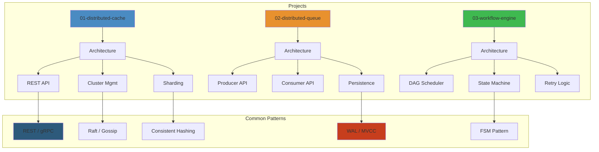

# Project Architectures — Complete Blueprint Catalog 📐




This directory contains **full architecture blueprints** for real-world systems. Each blueprint covers requirements, architecture decisions, data models, API design, deployment topology, tradeoffs, and scaling considerations.

**Related**: [System Design](/15-system-design/README.md) · [Microservices](/16-microservices/README.md) · [Software Architecture](/17-software-architecture/README.md) · [Low-Level Design](/24-low-level-design/README.md)

---

## Table of Contents

- [Blueprint Template](#-blueprint-template)
- [Chat System](#1-chat-system-)
- [E-Commerce Platform](#2-e-commerce-platform-)
- [Streaming Platform](#3-streaming-platform-)
- [Payment System](#4-payment-system-)
- [Collaboration Tool](#5-collaboration-tool-)
- [AI Agent Platform](#6-ai-agent-platform-)
- [Distributed Cache](#7-distributed-cache-)
- [Distributed Queue](#8-distributed-queue-)
- [Workflow Engine](#9-workflow-engine-)
- [Real-Time Analytics Platform](#10-real-time-analytics-)
- [Social Media Platform](#11-social-media-platform-)
- [Learning Path](#-learning-path)
- [Related Domains](#-related-domains)
- [Simplest Mental Model](#-simplest-mental-model)

---

## 🧭 Blueprint Template

Each blueprint follows this structure:

```markdown
## System Name

### Functional Requirements
- Feature A, Feature B, Feature C

### Non-Functional Requirements
- Latency: p99 < Xms
- Availability: Y.99%
- Scale: Z DAU, W QPS

### Architecture Decisions
| Decision | Option A | Option B | Chosen | Rationale |
|----------|----------|----------|--------|-----------|

### Data Model
- Entities, relationships, schema
- Database choice and partitioning

### API Design
- Key endpoints
- Protocol (REST/gRPC/GraphQL/WebSocket)

### High-Level Architecture
- System diagram (ASCII or reference)
- Write path and read path

### Deep Dives
- Database internals, caching strategy, consistency

### Deployment Topology
- Components, scaling, regions

### Tradeoffs and Alternatives
- What was considered and why rejected

### Failure Modes
- What breaks and how it recovers
```

---

## 1. Chat System 💬

### Requirements
- **Functional**: 1:1 chat, group chat, presence, push notifications, read receipts, media sharing, history
- **Non-functional**: p99 latency < 100ms delivery, 99.99% availability, 500M DAU

### Architecture
```
Client ↔ WebSocket Gateway (WebSocket, sticky) ↔ Chat Service ↔ Message Queue (Kafka)
                                                      │
                                                      ├── Redis (presence, sessions)
                                                      ├── DB (Cassandra, message history)
                                                      └── Notification Service → Push
```

### Key Decisions
| Decision | Choice | Why |
|----------|--------|-----|
| Transport | WebSocket | Bidirectional, low latency |
| Message storage | Cassandra | High write throughput, time-series friendly |
| Presence | Redis | In-memory, fast, pub/sub |
| Message ordering | Kafka partition by conversation_id | Ordered delivery per conversation |
| Delivery guarantee | At-least-once | Dedup on client side |

### Data Model
```sql
-- Messages (Cassandra)
CREATE TABLE messages_by_conversation (
    conversation_id UUID,
    message_id TIMEUUID,  -- Clustering key for ordering
    sender_id UUID,
    content TEXT,
    created_at TIMESTAMP,
    PRIMARY KEY (conversation_id, message_id)
);

-- Conversations
CREATE TABLE conversations (
    id UUID PRIMARY KEY,
    type TEXT,  -- direct/group
    participants SET<UUID>,
    last_message_at TIMESTAMP
);
```

### Failure Modes
- **WebSocket disconnection**: Client reconnects with last message ID, server replays missed messages
- **Kafka broker down**: Producers buffer, consumers rebalance
- **DB down**: Graceful degradation — new messages queued locally, history unavailable

---

## 2. E-Commerce Platform 🛒

### Requirements
- **Functional**: Product catalog, cart, checkout, payment, inventory, order tracking, search, recommendations, reviews
- **Non-functional**: p99 latency < 200ms, 99.99% availability, 100M DAU, flash sale handling

### Architecture
```
CDN → API Gateway → Product Service → Elasticsearch (search)
                      Cart Service → Redis
                      Order Service → Order DB + Kafka → Payment Service
                      Inventory Service → Redis + DB
                      Recommendation Service → ML Model
                      Review Service → DB
```

### Key Decisions
| Decision | Choice | Why |
|----------|--------|-----|
| Catalog DB | PostgreSQL | Structured data, complex queries, ACID |
| Cart | Redis (persistent) | Fast reads, TTL for abandoned carts |
| Search | Elasticsearch | Full-text, faceted search, aggregation |
| Order processing | Saga (orchestrated) | Multi-step (inventory hold → payment → shipping) |
| Inventory | Redis + DB (dual write) | Fast reads during browse, durable during checkout |
| Idempotency | Idempotency key on POST /orders | Prevents duplicate charges |

### Data Model
```sql
-- Products (PostgreSQL)
CREATE TABLE products (
    id UUID PRIMARY KEY,
    name TEXT NOT NULL,
    description TEXT,
    price DECIMAL(10,2),
    category_id UUID REFERENCES categories(id),
    inventory_count INT,
    created_at TIMESTAMP
);

-- Orders
CREATE TABLE orders (
    id UUID PRIMARY KEY,
    user_id UUID NOT NULL,
    status TEXT NOT NULL,  -- pending/confirmed/shipped/delivered/cancelled
    total DECIMAL(10,2),
    idempotency_key UUID UNIQUE,
    created_at TIMESTAMP
);

-- Order Items
CREATE TABLE order_items (
    order_id UUID REFERENCES orders(id),
    product_id UUID REFERENCES products(id),
    quantity INT,
    price DECIMAL(10,2),
    PRIMARY KEY (order_id, product_id)
);
```

### Flash Sale Handling
- Queue orders at gateway, process asynchronously
- Pre-allocate inventory in Redis
- Rate limiting per user (10 req/min)
- Webhook for order confirmation (avoid polling)

---

## 3. Streaming Platform 🎬

### Requirements
- **Functional**: Upload, transcoding, adaptive bitrate streaming (HLS/DASH), CDN delivery, DRM, recommendations, analytics
- **Non-functional**: p99 latency < 2s for start playback, 99.99% availability, 500M MAU

### Architecture
```
Upload → Transcoding Pipeline (FFmpeg + SQS) → Media Storage (S3/Blob)
                                                   │
                                                   ▼
                                               CDN (CloudFront, Akamai)
                                                   │
Client → CDN Edge → HLS/DASH Player
```

### Key Decisions
| Decision | Choice | Why |
|----------|--------|-----|
| Storage | S3/Blob Store | Cheap, durable, CDN origin |
| Transcoding | FFmpeg on Spot Instances | Cost-effective, parallel |
| Streaming format | HLS + DASH | Universal device support |
| DRM | Widevine + FairPlay | Industry standard |
| CDN | Multi-CDN | Redundancy, geographic coverage |

### Adaptive Bitrate (ABR)
```
┌────────────────────────────────┐
│ 4K    (20 Mbps) UHD            │
│ 1080p (5 Mbps)  Full HD        │
│ 720p  (3 Mbps)  HD             │
│ 480p  (1.5 Mbps) SD            │
│ 360p  (0.5 Mbps) Low Quality   │
└────────────────────────────────┘
Client algorithm selects based on bandwidth + buffer
```

### Transcoding Pipeline
```
Upload (S3) → Lambda trigger → Job Queue (SQS) → Transcoder worker
  → Fetch source file
  → Create HLS manifest (master + variant playlists)
  → Segment into .ts chunks (6s segments)
  → Upload segments + manifest back to S3
  → CDN invalidates old content
```

---

## 4. Payment System 💳

### Requirements
- **Functional**: Process payments, refunds, chargebacks, multi-currency, recurring billing, fraud detection
- **Non-functional**: Strong consistency (financial), p99 latency < 500ms, 99.999% availability, PCI DSS compliant

### Architecture
```
Client → API Gateway → Payment Service → Fraud Check → PSP (Stripe/Adyen)
                              │                             │
                              ▼                             ▼
                          Ledger DB                    Dual-write (Ledger + Transaction)
                              │
                              ▼
                          Reconciliation Engine
```

### Key Decisions
| Decision | Choice | Why |
|----------|--------|-----|
| Database | PostgreSQL | ACID compliance, financial integrity |
| Payment model | Dual-ledger (debit + credit) | Every transaction balances |
| Idempotency | Idempotency key | Prevents duplicate charges |
| PSP abstraction | Strategy pattern | Switch PSPs without code changes |
| Fraud detection | ML model + rule engine | Real-time + batch analysis |
| Reconciliation | Daily batch job | Match ledger with PSP statements |

### Data Model
```sql
-- Transactions (immutable append-only)
CREATE TABLE transactions (
    id UUID PRIMARY KEY,
    from_account_id UUID,
    to_account_id UUID,
    amount DECIMAL(12,2),
    currency TEXT,
    type TEXT,  -- debit/credit/refund/chargeback
    idempotency_key UUID UNIQUE,
    status TEXT,
    created_at TIMESTAMP
);

-- Accounts
CREATE TABLE accounts (
    id UUID PRIMARY KEY,
    user_id UUID,
    balance DECIMAL(12,2),
    currency TEXT,
    version INT,  -- optimistic locking
    updated_at TIMESTAMP
);
```

### Payment Flow
```
1. Client POST /payments { idempotency_key, amount, currency, source }
2. Validate (fraud check, balance check)
3. Debit from_account
4. Call PSP (Adyen/Stripe)
5. If PSP success: credit to_account, commit
6. If PSP failure: rollback debit, return error
7. Return transaction ID
```

---

## 5. Collaboration Tool 📝

### Requirements
- **Functional**: Real-time editing, presence, comments, version history, offline support, document management
- **Non-functional**: p99 latency < 50ms for edits, 500K concurrent editors per document, 99.99% availability

### Architecture
```
Client → WebSocket Gateway → Collaboration Service → CRDT/OT Engine → S3 (snapshots)
                              │                                            │
                              ├── Redis (presence, broadcast)              │
                              └── Kafka (operation log) ───────────────────┘
```

### Key Decisions
| Decision | Choice | Why |
|----------|--------|-----|
| Conflict resolution | CRDT (yjs) | No central server needed, offline-friendly |
| Storage | Snapshots + Ops log | Efficient storage, full history |
| Broadcast | Redis Pub/Sub | Low latency, fan-out |
| Operation log | Kafka | Durable, ordered, replayable |
| Cursor sync | WebSocket + OT | Real-time position broadcasting |

### CRDT vs OT
```
OT (Operational Transform):
  - Centralized, transform operations to merge
  - Google Docs, ShareJS
  - Sequential, requires understanding other ops

CRDT (Conflict-free Replicated Data Types):
  - Decentralized, mathematically conflict-free
  - yjs, Automerge
  - No central coordinator, offline-first
  - Chosen for: simpler reasoning, offline support
```

---

## 6. AI Agent Platform 🤖

### Requirements
- **Functional**: Multi-LLM support, function calling, RAG (Retrieval-Augmented Generation), memory, guardrails, observability, tool registry
- **Non-functional**: p99 latency < 5s (including LLM), 99.9% availability, streaming responses

### Architecture
```
User → API Gateway → Agent Runtime → LLM Provider (OpenAI/Anthropic/Open Source)
                      │                      │
                      ├── Tool Registry ─────┤ (function calling)
                      ├── Vector DB (Pinecone/PG) ← Embedding Service
                      ├── Memory Store (Redis)
                      └── Context Manager ←─┘
```

### Key Decisions
| Decision | Choice | Why |
|----------|--------|-----|
| LLM orchestration | LangChain / Custom | Flexibility, observability |
| Vector DB | pgvector / Pinecone | Similarity search for RAG |
| Memory | Redis (TTL) | Conversation history |
| Streaming | Server-Sent Events (SSE) | Real-time token display |
| Guardrails | Custom + LLM-as-judge | Content safety, jailbreak prevention |

### Agent Execution Flow
```
1. User sends prompt
2. Agent Runtime: classify intent, retrieve context (RAG)
3. Build prompt with context + conversation history
4. Call LLM with function definitions
5. If LLM returns function_call: execute tool, return results to LLM
6. Stream response to user
7. Store conversation + feedback
```

---

## 7. Distributed Cache 🗄️

### Requirements
- **Functional**: Key-value store, TTL, eviction, consistent hashing, replication, failover
- **Non-functional**: p99 latency < 1ms, 99.999% availability, 10M+ QPS

### Architecture
```
Client → Proxy Layer (Twemproxy/Redis Cluster) → Shard 1 (Redis Primary + Replicas)
                                                  Shard 2 (Redis Primary + Replicas)
                                                  Shard N (Redis Primary + Replicas)
                         Consistent Hashing + Virtual Nodes
```

### Key Decisions
| Decision | Choice | Why |
|----------|--------|-----|
| Sharding | Consistent hashing (ketama) | Minimal rehashing on add/remove |
| Replication | Redis Sentinel / Cluster | Automatic failover |
| Eviction | allkeys-lru | Most recently used items stay |
| Persistence | RDB + AOF | Recovery + durability |
| Proxy | Redis Cluster (client-side) | Simpler than Twemproxy |

### Cache Patterns
```
Cache-Aside:
  Read: Check cache → miss → query DB → set cache → return
  Write: Write DB → invalidate cache → return

Write-Through:
  Write: Write to cache → cache writes to DB → return

Write-Behind:
  Write: Write to cache (immediate) → async write to DB
```

---

## 8. Distributed Queue 📨

### Requirements
- **Functional**: Publish/subscribe, ordered messages, replay, partitioning, consumer groups, exactly-once
- **Non-functional**: p99 latency < 10ms, 99.99% availability, 1M+ msg/sec

### Architecture
```
Producer → API → Partition 1 (Leader) → Replicas
              → Partition 2 (Leader) → Replicas
              → Partition N (Leader) → Replicas
                  │
Consumer Group → Partition 1 → Consumer A
               → Partition 2 → Consumer B
               → Partition N → Consumer C
```

### Key Decisions
| Decision | Choice | Why |
|----------|--------|-----|
| Storage | Segmented log on disk | Sequential I/O, fast |
| Ordering | Partition-level ordering | Best effort, not global |
| Replication | ISR (In-Sync Replicas) | Leader + N followers |
| Exactly-once | Idempotent producer + transactions | Dedup on consumer |
| Retention | Time + size based | bounded disk usage |

---

## 9. Workflow Engine 🔄

### Requirements
- **Functional**: DAG-based workflow definition, state persistence, retry, timeout, human-in-loop, compensation (Saga)
- **Non-functional**: p99 latency < 100ms per step, 99.99% durability, runs for days/weeks

### Architecture
```
Trigger → Workflow Engine → Step Executor → State Store (PostgreSQL)
                              │
                              ├── Task Queue (Kafka)
                              ├── Timer Service (for delays/timeouts)
                              └── Compensation Handler
```

### Key Decisions
| Decision | Choice | Why |
|----------|--------|-----|
| Workflow definition | JSON/YAML DAG | Flexible, programmable |
| State store | PostgreSQL | Durable, transactional |
| Task queue | Kafka | Durable, can replay |
| Compensation | Saga pattern | Distributed rollback |
| Timeout handling | Timer service (Kafka + cron) | Exactly-once timeout delivery |

### Workflow Execution
```json
{
  "id": "order-123",
  "steps": [
    { "name": "validate_order", "type": "service_call" },
    { "name": "reserve_inventory", "type": "service_call",
      "retry": { "max_attempts": 3, "backoff": "exponential" } },
    { "name": "process_payment", "type": "service_call",
      "timeout": "30s",
      "compensation": "refund_payment" },
    { "name": "confirm_order", "type": "service_call" }
  ]
}
```

---

## 10. Real-Time Analytics Platform 📊

### Requirements
- **Functional**: Real-time event ingestion, aggregation, windowed computation, dashboard queries, alerting
- **Non-functional**: p99 latency for aggregation < 1s, 1M events/sec, retention 90 days

### Architecture
```
Event Producer → Load Balancer → Event Ingestion (Kafka) → Stream Processor (Flink/Kafka Streams)
                                                                │
                                                            Sink to OLAP (Druid/ClickHouse)
                                                                │
                                                            Query Layer → Dashboard
```

### Key Decisions
| Decision | Choice | Why |
|----------|--------|-----|
| Ingestion | Kafka | Durable, high throughput |
| Stream processing | Flink | Exactly-once, event time, watermarks |
| Storage | Druid / ClickHouse | Columnar, real-time ingestion |
| Dashboards | Grafana | Frontend for OLAP queries |

---

## 11. Social Media Platform 📱

### Requirements
- **Functional**: Feed, stories, posts, likes/comments/shares, following, notifications, search, explore
- **Non-functional**: p99 latency < 200ms, 99.99% availability, 500M DAU

### Architecture
```
Client → API Gateway → Feed Service → Timeline Cache (Redis)
                      → Post Service → DB (Cassandra) + Media (S3)
                      → Social Graph → Graph DB (Neo4j/Redis)
                      → Notification Service → Push (FCM/APNs)
                      → Search → Elasticsearch
```

### Key Decisions
| Decision | Choice | Why |
|----------|--------|-----|
| Feed generation | Fanout-on-write (celebrities: on-read) | Balance latency and write cost |
| Social graph | Redis (sorted sets) | Following/followers, fast intersection |
| Post storage | Cassandra | Time-series, high write throughput |
| Media | S3 + CDN | Cheap storage, fast delivery |
| Stories | Ephemeral (24h TTL) | Auto-delete, temporal storage |

### Feed Generation
```
Fanout-on-write:
  User creates post → Write to followers' timelines in Redis
  → Pros: Fast reads (O(1))
  → Cons: Expensive for celebrities (millions of followers)

Hybrid approach:
  Normal users → fanout-on-write
  Celebrities (>10K followers) → fanout-on-read
  Timeline = cached posts (celebrities interleaved with regular)
```

---

## 📚 Learning Path

### Phase 1: Study Blueprints
1. Read each blueprint end-to-end
2. Understand WHY each decision was made
3. Draw architecture diagrams from memory

### Phase 2: Implement MVP
1. Pick one system (chat, e-commerce, or cache)
2. Build minimal working version
3. Focus on data model + API design

### Phase 3: Deep Dive
1. Implement one component in depth (e.g., Redis cache layer)
2. Add failure handling (circuit breaker, retry)
3. Add observability (metrics, logs, traces)

### Phase 4: Scale
1. Consider the system at 10x scale
2. Identify bottlenecks
3. Propose architectural improvements

---

## 🔗 Related Domains

| Domain | Connection |
|--------|-----------|
| [System Design](/15-system-design/README.md) | Case studies, capacity estimation, tradeoffs |
| [Microservices](/16-microservices/README.md) | Service decomposition, inter-service communication |
| [Software Architecture](/17-software-architecture/README.md) | Architecture patterns, decisions, evaluation |
| [Low-Level Design](/24-low-level-design/README.md) | Class design, sequence diagrams, OOP |
| [Databases](/08-databases/README.md) | Data modeling, partitioning, replication |
| [Distributed Systems](/09-distributed-systems/README.md) | Consistency, consensus, coordination |

---

## 🧠 Simplest Mental Model

```
Project Blueprints = Recipe Book for Building Systems

Each blueprint is like a recipe:
  - Ingredients (technologies)
  - Instructions (architecture decisions)
  - Timing (latency, throughput expectations)
  - Substitutions (alternatives considered)
  - Known issues (failure modes)

Like cooking:
  - Follow the recipe exactly first time
  - Experiment with substitutions next time
  - Eventually invent your own recipes
```

**Blueprints are not prescriptions — they're starting points. The best architects adapt patterns to their specific constraints, not copy them blindly.**

---

**Next**: [Low-Level Design](/24-low-level-design/README.md) · [System Design](/15-system-design/README.md)

## Related

- [System Design Principles](/15-system-design/01-system-design-principles.md)
- [Whatsapp](/15-system-design/01-whatsapp.md)
- [Netflix](/15-system-design/02-netflix.md)
- [System Design Blueprints](/15-system-design/02-system-design-blueprints.md)
- [Twitter](/15-system-design/03-twitter.md)
- [Uber](/15-system-design/04-uber.md)
