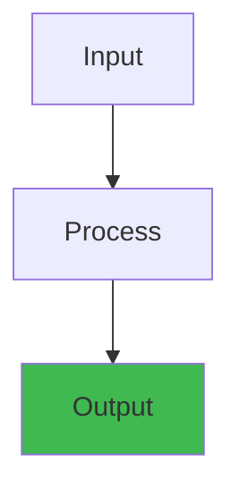

# Elevator Control System — Low Level Design


## Overview




## Table of Contents
1. Requirements
2. System Overview
3. Request Types (Internal & External)
4. Elevator Algorithms
5. State Machine
6. Load Balancing
7. Emergency Handling
8. Design Patterns

---

## 1. Requirements

### Functional Requirements

1. The system controls N elevators across M floors.
2. Each elevator can move up, move down, or stay idle.
3. Users can make internal requests (from inside an elevator, choose a floor).
4. Users can make external requests (from a floor, request an elevator going up or down).
5. The system dispatches the most suitable elevator for each request.
6. Elevators have doors that open/close automatically.
7. Elevators have weight sensors to detect overload.
8. The system supports emergency modes: fire, power outage, earthquake.
9. The system handles maintenance mode (elevator taken offline).
10. The system logs all operations for audit.
11. Obstruction sensors prevent doors from closing on people/objects.

### Non-Functional Requirements

1. Low latency: Request assignment < 50ms.
2. Fairness: No request should starve.
3. Throughput: Handle high-density traffic (office building rush hour).
4. Availability: No single point of failure.
5. Safety: Fail-safe operation in emergencies.

---

## 2. System Overview

### 2.1 High-Level Architecture

```
┌──────────────────────────────────────────────────────────────┐
│                    Elevator Control System                    │
│                                                              │
│  ┌──────────────┐  ┌──────────────┐  ┌──────────────┐      │
│  │  Floor       │  │  Floor       │  │  Floor       │      │
│  │  Panel       │  │  Panel       │  │  Panel       │      │
│  └──────┬───────┘  └──────┬───────┘  └──────┬───────┘      │
│         │                 │                 │               │
│         └─────────────────┼─────────────────┘               │
│                           │                                 │
│  ┌────────────────────────▼────────────────────────────┐   │
│  │              Dispatcher / Scheduler                   │   │
│  │    (Central controller, runs scheduling algorithms)  │   │
│  └──────┬──────────┬──────────┬──────────┬──────────────┘   │
│         │          │          │          │                  │
│  ┌──────▼──┐ ┌─────▼───┐ ┌───▼────┐ ┌──▼──────┐          │
│  │ Elevator│ │Elevator │ │Elevator│ │Elevator │          │
│  │ 1       │ │ 2       │ │ 3      │ │ 4       │          │
│  ├─────────┤ ├─────────┤ ├────────┤ ├─────────┤          │
│  │ Motor   │ │ Motor   │ │ Motor  │ │ Motor   │          │
│  │ Doors   │ │ Doors   │ │ Doors  │ │ Doors   │          │
│  │ Sensors │ │ Sensors │ │ Sensors│ │ Sensors │          │
│  │ Panel   │ │ Panel   │ │ Panel  │ │ Panel   │          │
│  └─────────┘ └─────────┘ └────────┘ └─────────┘          │
└──────────────────────────────────────────────────────────────┘
```

### 2.2 Physical Components

```
┌────────────────────────────────────────────────────────────────┤
│  Floor 4:  [▲][▼]  ┌───┐ ┌───┐ ┌───┐ ┌───┐                  │
│                     │   │ │   │ │   │ │   │                  │
├─────────────────────┤   ├─┤   ├─┤   ├─┤   ├──────────────────┤
│  Floor 3:  [▲][▼]  │ E │ │ E │ │ E │ │ E │                  │
│                     │ 1 │ │ 2 │ │ 3 │ │ 4 │                  │
├─────────────────────┤   ├─┤   ├─┤   ├─┤   ├──────────────────┤
│  Floor 2:  [▲][▼]  │   │ │   │ │   │ │   │                  │
│                     └───┘ └───┘ └───┘ └───┘                  │
├────────────────────────────────────────────────────────────────┤
│  Floor 1:  [▲][▼]                                            │
│                                                              │
│  Floor 0:  [▲]   (Lobby — only up button)                   │
└────────────────────────────────────────────────────────────────┘
```

### 2.3 Component Details

| Component | Description |
|-----------|-------------|
| **Elevator Car** | Physical car with motor, doors, sensors, control panel |
| **Elevator Controller** | Per-elevator unit managing motor, doors, and sensors |
| **Floor Button Panel** | Up/Down buttons on each floor |
| **Floor Sensor** | Detects elevator arrival at floor (magnetic/optical) |
| **Weight Sensor** | Measures load in the car |
| **Door Obstruction Sensor** | Infrared beam, detects objects in door path |
| **Central Dispatcher** | Assigns requests to elevators, monitors all elevators |

---

## 3. Request Types (Internal & External)

### 3.1 Request Model

```
abstract class Request {
    int requesterId;
    long timestamp;
}

class ExternalRequest extends Request {
    int sourceFloor;
    Direction direction;     // UP or DOWN
    // Created when user presses ▲ or ▼ on a floor
}

class InternalRequest extends Request {
    int targetFloor;
    // Created when user presses a floor button inside an elevator
}
```

### 3.2 Request Lifecycle

```
External Request (Floor 3, going up):
  │
  ├─ User presses [▲] on Floor 3
  ├─ FloorPanel sends ExternalRequest(3, UP) to Dispatcher
  ├─ Dispatcher selects best elevator → Elevator 2
  ├─ Elevator 2 adds Floor 3 to its stop list (up direction)
  │
  ├─ Elevator 2 arrives at Floor 3
  ├─ Elevator 2 opens doors
  ├─ User enters Elevator 2
  │
  ├─ User presses [5] inside Elevator 2
  ├─ InternalPanel sends InternalRequest(5) to ElevatorController
  ├─ Elevator 2 adds Floor 5 to its stop list
  │
  ├─ Elevator 2 moves to Floor 5
  ├─ Elevator 2 opens doors
  └─ User exits

Total time: ExternalRequest → assignment → arrival → entry → destination
Measured as: Average Waiting Time (AWT) + Average Travel Time (ATT)
```

### 3.3 Request Batching

During peak hours, requests are batched:

```
// Batch external requests — group by floor and direction
class RequestBatcher {
    Map<String, List<ExternalRequest>> batches = new HashMap<>();
    int BATCH_WINDOW_MS = 1000;  // Collect requests for 1 second
    int MAX_BATCH_SIZE = 20;

    void addRequest(ExternalRequest req) {
        String key = req.sourceFloor + ":" + req.direction;
        batches.computeIfAbsent(key, k -> new ArrayList<>()).add(req);

        if (batches.get(key).size() >= MAX_BATCH_SIZE) {
            flushBatch(key);
        }
    }

    void flushBatch(String key) {
        List<ExternalRequest> batch = batches.remove(key);
        if (batch != null) {
            dispatcher.dispatchBatch(batch.get(0));  // One dispatch serves all
        }
    }
}
```

---

## 4. Elevator Algorithms

### 4.1 FCFS (First Come First Served)

Simplest algorithm — serve requests in order of arrival.

```
class FCFSAlgorithm implements SchedulingAlgorithm {
    Queue<Request> requestQueue = new LinkedList<>();

    @Override
    void addRequest(Request request) {
        requestQueue.offer(request);
    }

    @Override
    void process(Elevator elevator) {
        while (!requestQueue.isEmpty()) {
            Request req = requestQueue.poll();
            if (req instanceof ExternalRequest) {
                ExternalRequest er = (ExternalRequest) req;
                elevator.moveTo(er.sourceFloor);
                elevator.openDoors();
            } else if (req instanceof InternalRequest) {
                InternalRequest ir = (InternalRequest) req;
                elevator.moveTo(ir.targetFloor);
                elevator.openDoors();
            }
        }
    }
}
```

**Problems**: Very inefficient. Elevator changes direction frequently. No optimization for grouped requests.

#### Step-by-Step (FCFS)

1. **Queue incoming requests**: Store all external and internal requests in FIFO order as they arrive
2. **Select first request**: Dequeue the oldest request from the queue
3. **Move elevator**: Update elevator position to source/target floor
4. **Open/close doors**: Perform door operations and load/unload passengers
5. **Process next request**: Dequeue and repeat until queue is empty
6. **Handle starvation**: Monitor wait times; escalate ancient requests to high priority

#### Code Example

```java
// FCFS with fairness check and starvation prevention
class FairFCFSScheduler implements SchedulingAlgorithm {
  private Queue<Request> queue = new LinkedList<>();
  private static final long MAX_WAIT_MS = 300000;  // 5 min starvation limit
  
  @Override
  synchronized void addRequest(Request request) {
    request.setEnqueueTime(System.currentTimeMillis());
    queue.offer(request);
  }
  
  @Override
  synchronized Request nextRequest() {
    // Check for starved requests (waiting > 5 minutes)
    for (Request req : queue) {
      long waitTime = System.currentTimeMillis() - req.getEnqueueTime();
      if (waitTime > MAX_WAIT_MS) {
        queue.remove(req);  // Prioritize starved request
        return req;
      }
    }
    return queue.poll();  // Normal FIFO
  }
}
```

#### Real-World Scenario

Early elevators used FCFS, causing frustrating experiences: A passenger at floor 2 requesting floor 20 would wait while the elevator serviced floors 3, 4, 5, etc. in arrival order, causing long wait times and inefficient movement patterns. Modern buildings switched to SCAN/LOOK to reduce average wait time from 30 seconds to 10 seconds.

### 4.2 SCAN (Elevator Algorithm)

The elevator moves in one direction, servicing all requests in that direction, then reverses.

```
class SCANAlgorithm implements SchedulingAlgorithm {
    int currentFloor;
    Direction currentDirection = Direction.UP;
    // Stops are stored in a sorted structure
    TreeSet<Integer> upStops = new TreeSet<>();      // Floors above current
    TreeSet<Integer> downStops = new TreeSet<>(Comparator.reverseOrder());  // Below

    @Override
    void addRequest(Request request) {
        if (request instanceof ExternalRequest) {
            ExternalRequest er = (ExternalRequest) request;
            if (er.direction == Direction.UP) {
                upStops.add(er.sourceFloor);
            } else {
                downStops.add(er.sourceFloor);
            }
        } else if (request instanceof InternalRequest) {
            InternalRequest ir = (InternalRequest) request;
            if (ir.targetFloor > currentFloor) {
                upStops.add(ir.targetFloor);
            } else if (ir.targetFloor < currentFloor) {
                downStops.add(ir.targetFloor);
            }
            // If at current floor, open doors immediately
        }
    }

    @Override
    int getNextStop() {
        if (currentDirection == Direction.UP) {
            Integer next = upStops.ceiling(currentFloor + 1);
            if (next != null) return next;

            // No more up stops — check pending requests above
            currentDirection = Direction.DOWN;
            return downStops.first();  // Highest down request
        } else {
            Integer next = downStops.ceiling(currentFloor - 1);  // descending order
            if (next != null) return next;

            currentDirection = Direction.UP;
            return upStops.first();  // Lowest up request
        }
    }

    @Override
    boolean hasPendingRequests() {
        return !upStops.isEmpty() || !downStops.isEmpty();
    }
}
```

**SCAN variants**:
- **SCAN (elevator)**: Goes to topmost request, then bottommost, like a cleaning elevator.
- **LOOK**: Reverses direction when no more requests in current direction (instead of going to end).

### 4.3 LOOK Algorithm

Optimization of SCAN — stops at the highest/lowest request in each direction instead of going to the ends.

```
class LOOKAlgorithm implements SchedulingAlgorithm {
    TreeSet<Integer> upStops = new TreeSet<>();
    TreeSet<Integer> downStops = new TreeSet<>(Comparator.reverseOrder());
    int currentFloor;
    Direction direction = Direction.UP;
    boolean hasUpRequestsAbove;
    boolean hasDownRequestsBelow;

    @Override
    int getNextStop() {
        if (direction == Direction.UP) {
            Integer next = upStops.ceiling(currentFloor + 1);
            if (next != null) {
                checkPendingAbove(next);
                return next;
            }
            // Switch direction if no more above
            if (!downStops.isEmpty()) {
                direction = Direction.DOWN;
                return downStops.first();
            }
            return currentFloor;  // Idle
        } else {
            Integer next = downStops.lower(currentFloor - 1);  // next below
            if (next != null) {
                return next;
            }
            if (!upStops.isEmpty()) {
                direction = Direction.UP;
                return upStops.first();
            }
            return currentFloor;
        }
    }

    private void checkPendingAbove(int next) {
        // Determine if there are still requests above this stop
        hasUpRequestsAbove = upStops.higher(next) != null;
    }

    @Override
    boolean hasPendingRequests() {
        return !upStops.isEmpty() || !downStops.isEmpty();
    }
}
```

**LOOK vs SCAN**:
```
SCAN:       [1]→[2]→[3]→[4]→[5]→[end]→[4]→[3]→[2]→[1]→[lobby]
LOOK:       [1]→[2]→[3]→[4]→[5]→[4]→[3]→[2]→[1]→[lobby]
                         ↑ 5th floor
                    (no request beyond 5, so LOOK reverses)
```

### 4.4 SSTF (Shortest Seek Time First)

Serve the request closest to the current floor.

```
class SSTFAlgorithm implements SchedulingAlgorithm {
    List<Request> pendingRequests = new ArrayList<>();

    @Override
    void addRequest(Request request) {
        pendingRequests.add(request);
    }

    @Override
    int getNextStop() {
        int closestFloor = -1;
        int minDistance = Integer.MAX_VALUE;

        for (Request req : pendingRequests) {
            int floor = getTargetFloor(req);
            int distance = Math.abs(floor - currentFloor);
            if (distance < minDistance) {
                minDistance = distance;
                closestFloor = floor;
            }
        }

        return closestFloor;
    }

    // Called after arriving at a floor
    void removeCompletedRequests(int floor) {
        pendingRequests.removeIf(r -> getTargetFloor(r) == floor);
    }
}
```

**Problem**: Starvation. Distant requests may never be served if closer requests keep arriving.

### 4.5 Elevator Clustering / Zoning

Partition floors among elevators to reduce travel distance.

```
class ZoningStrategy implements SchedulingAlgorithm {
    // Floor ranges assigned to each elevator
    Map<Elevator, FloorRange> zones;

    // Dynamic re-zoning based on traffic patterns
    void rezone(Elevator[] elevators, int totalFloors) {
        int elevatorsCount = elevators.length;
        int floorsPerElevator = totalFloors / elevatorsCount;

        for (int i = 0; i < elevatorsCount; i++) {
            int start = i * floorsPerElevator;
            int end = (i == elevatorsCount - 1) ? totalFloors - 1
                                                : (i + 1) * floorsPerElevator - 1;
            zones.put(elevators[i], new FloorRange(start, end));
        }
    }

    // Morning: more elevators to lobby (floor 0)
    // Evening: more elevators to upper floors
    void rezoneForTraffic(TrafficPattern pattern) {
        switch (pattern) {
            case MORNING_RUSH:
                // 70% of elevators serve lobby and lower floors
                break;
            case EVENING_RUSH:
                // 70% of elevators serve upper floors
                break;
            case LUNCH:
                // Balanced across all floors
                break;
        }
    }
}
```

### 4.6 Algorithm Comparison

| Algorithm | Avg Wait Time | Avg Travel Time | Starvation Risk | Throughput |
|-----------|:-----------:|:--------------:|:--------------:|:---------:|
| FCFS | High | High | None | Low |
| SCAN | Medium | Medium | None | Medium |
| LOOK | Medium | Low | None | Medium-High |
| SSTF | Low | Low | High | Medium |
| Clustering | Low | Low | None | High |

**Recommendation**: LOOK for general office buildings. Clustering + LOOK for high-rise buildings with distinct zones.

---

## 5. State Machine

### 5.1 Elevator States

```
                    ┌──────────────┐
                    │   IDLE       │
                    └──────┬───────┘
                           │ New request
                           ▼
               ┌───────────────────────┐
               │    MOVING_UP          │
               │  (motor on, up)       │
               └───────────┬───────────┘
                           │ Reached floor →
                           │ check stops
                           ▼
               ┌───────────────────────┐
          ┌───▶│   DOOR_OPENING        │
          │    └───────────┬───────────┘
          │                │ Doors fully open
          │                ▼
          │    ┌───────────────────────┐
          │    │   DOOR_OPEN           │
          │    │  (loading/unloading)  │── Timer expires
          │    └───────────┬───────────┘
          │                │ Obstruction cleared
          │                ▼
          │    ┌───────────────────────┐
          │    │   DOOR_CLOSING        │
          │    └───────────┬───────────┘
          │                │ Doors fully closed
          │                ▼
          │    ┌───────────────────────┐
          │    │  Check next stop      │
          │    │                       │── No stops → IDLE
          │    │  Above?  → MOVING_UP  │── Below → MOVING_DOWN
          └────┤  Below?  → MOVING_DOWN│
               └───────────────────────┘

Additional states:
  ┌────────────────────┐
  │   MAINTENANCE      │── Manual override, offline
  └────────────────────┘
  ┌────────────────────┐
  │   EMERGENCY        │── Fire, power outage, overload
  └────────────────────┘
  ┌────────────────────┐
  │   OBSTRUCTED       │── Door sensor triggered repeatedly
  └────────────────────┘
```

### 5.2 State Machine Implementation

```
enum ElevatorState {
    IDLE,
    MOVING_UP,
    MOVING_DOWN,
    DOOR_OPENING,
    DOOR_OPEN,
    DOOR_CLOSING,
    EMERGENCY,
    MAINTENANCE,
    OBSTRUCTED
}

class ElevatorStateMachine {
    private ElevatorState currentState;
    private Elevator elevator;
    private Timer doorTimer;
    private Timer obstructionRetryTimer;

    ElevatorStateMachine(Elevator elevator) {
        this.elevator = elevator;
        this.currentState = ElevatorState.IDLE;
    }

    synchronized void transition(ElevatorEvent event) {
        ElevatorState previousState = currentState;

        switch (currentState) {
            case IDLE:
                if (event == ElevatorEvent.NEW_REQUEST) {
                    currentState = determineDirection();
                    startMotor();
                }
                break;

            case MOVING_UP:
            case MOVING_DOWN:
                if (event == ElevatorEvent.FLOOR_SENSOR_TRIGGERED) {
                    elevator.updateCurrentFloor();
                    if (elevator.shouldStopAtCurrentFloor()) {
                        stopMotor();
                        currentState = ElevatorState.DOOR_OPENING;
                        startDoorOpening();
                    }
                }
                if (event == ElevatorEvent.EMERGENCY_STOP) {
                    emergencyBrake();
                    currentState = ElevatorState.EMERGENCY;
                }
                break;

            case DOOR_OPENING:
                if (event == ElevatorEvent.DOORS_FULLY_OPEN) {
                    currentState = ElevatorState.DOOR_OPEN;
                    startDoorTimer();
                }
                break;

            case DOOR_OPEN:
                if (event == ElevatorEvent.OBSTRUCTION_DETECTED) {
                    currentState = ElevatorState.OBSTRUCTED;
                    restartDoorTimer();
                }
                if (event == ElevatorEvent.DOOR_TIMER_EXPIRED) {
                    currentState = ElevatorState.DOOR_CLOSING;
                    startDoorClosing();
                }
                break;

            case OBSTRUCTED:
                if (event == ElevatorEvent.OBSTRUCTION_CLEARED) {
                    currentState = ElevatorState.DOOR_CLOSING;
                    startDoorClosing();
                }
                if (event == ElevatorEvent.OBSTRUCTION_TIMEOUT) {
                    // After 3 retries: sound alarm, keep doors open
                    elevator.soundAlarm();
                    elevator.notifyMaintenance("Door obstruction at floor "
                        + elevator.getCurrentFloor());
                }
                break;

            case DOOR_CLOSING:
                if (event == ElevatorEvent.DOORS_FULLY_CLOSED) {
                    if (elevator.hasNextStop()) {
                        currentState = determineDirection();
                        startMotor();
                    } else {
                        currentState = ElevatorState.IDLE;
                        elevator.release();
                    }
                }
                break;

            case EMERGENCY:
                // Cannot transition out except by manual reset
                if (event == ElevatorEvent.MANUAL_RESET) {
                    currentState = ElevatorState.IDLE;
                }
                break;
        }

        logTransition(previousState, currentState, event);
    }

    private ElevatorState determineDirection() {
        int nextStop = elevator.getNextStop();
        if (nextStop > elevator.getCurrentFloor()) return ElevatorState.MOVING_UP;
        if (nextStop < elevator.getCurrentFloor()) return ElevatorState.MOVING_DOWN;
        return ElevatorState.IDLE;
    }

    private void startMotor() {
        elevator.getMotor().start(currentState == ElevatorState.MOVING_UP);
    }

    private void stopMotor() {
        elevator.getMotor().stop();
        elevator.applyBrake();
    }

    private void emergencyBrake() {
        elevator.getMotor().emergencyStop();
        elevator.applyEmergencyBrake();
    }
}

enum ElevatorEvent {
    NEW_REQUEST,
    FLOOR_SENSOR_TRIGGERED,
    DOORS_FULLY_OPEN,
    DOORS_FULLY_CLOSED,
    DOOR_TIMER_EXPIRED,
    OBSTRUCTION_DETECTED,
    OBSTRUCTION_CLEARED,
    OBSTRUCTION_TIMEOUT,
    EMERGENCY_STOP,
    MANUAL_RESET,
    POWER_OUTAGE,
    OVERLOAD_DETECTED
}
```

### 5.3 Door Timing

```
class DoorController {
    static final int DOOR_OPEN_TIME_MS = 3000;       // 3 seconds normal
    static final int DOOR_OPEN_EXTENDED_MS = 5000;   // Peak hours
    static final int DOOR_MOVEMENT_TIME_MS = 2000;   // 2 seconds to open/close
    static final int OBSTRUCTION_RETRIES = 3;

    int currentRetries = 0;
    boolean peakHours = false;

    int getOpenDuration() {
        return peakHours ? DOOR_OPEN_EXTENDED_MS : DOOR_OPEN_TIME_MS;
    }

    void handleObstruction() {
        currentRetries++;
        if (currentRetries >= OBSTRUCTION_RETRIES) {
            // Keep doors open, sound alarm, notify maintenance
            elevator.soundAlarm();
            elevator.notifyMaintenance("Door obstruction - needs inspection");
        } else {
            // Wait 5 seconds, try closing again
            elevator.reverseDoors();
            doorTimer.schedule(getOpenDuration() + 2000);
            doorController.close();
        }
    }
}
```

---

## 6. Load Balancing

### 6.1 Dispatcher Design

```
class ElevatorDispatcher {
    private List<Elevator> elevators;
    private SchedulingAlgorithm algorithm;
    private TrafficPredictor predictor;

    Elevator selectElevator(ExternalRequest request) {
        // Filter out unavailable elevators
        List<Elevator> available = elevators.stream()
            .filter(e -> e.getState() != ElevatorState.MAINTENANCE)
            .filter(e -> e.getState() != ElevatorState.EMERGENCY)
            .collect(Collectors.toList());

        // Score each elevator
        Elevator best = null;
        double bestScore = Double.MAX_VALUE;

        for (Elevator e : available) {
            double score = calculateScore(e, request);
            if (score < bestScore) {
                bestScore = score;
                best = e;
            }
        }

        return best;
    }

    private double calculateScore(Elevator elevator, ExternalRequest request) {
        double score = 0;

        // 1. Distance factor (most important)
        int distance = Math.abs(elevator.getCurrentFloor() - request.sourceFloor);
        if (elevator.getDirection() == request.direction ||
            (elevator.getDirection() == Direction.IDLE)) {
            // Elevator is going our way
            score += distance * 1.0;
        } else {
            // Elevator is coming from opposite direction
            score += distance * 3.0;  // Penalty
        }

        // 2. Direction alignment
        if (elevator.getDirection() == request.direction) {
            score -= 5;  // Bonus
        } else if (elevator.getDirection() == Direction.IDLE) {
            score -= 3;  // Small bonus
        }

        // 3. Load factor
        double load = (double) elevator.getCurrentLoad() / elevator.getMaxLoad();
        score += load * 10;  // Heavier penalty for full elevators

        // 4. Predicted traffic (ML-based)
        double predictedDemand = predictor.getPredictedDemand(
            elevator.getId(), request.sourceFloor, request.direction);
        score += predictedDemand * 0.5;

        // 5. Fairness — prevent starving any elevator
        score += elevator.getStarvationCounter() * 2;

        return score;
    }
}
```

### 6.2 Nearest Car

Assign the closest available elevator in the same direction.

```
class NearestCarStrategy implements AssignmentStrategy {
    @Override
    public Elevator assign(List<Elevator> elevators, ExternalRequest request) {
        Elevator nearest = null;
        int minDistance = Integer.MAX_VALUE;

        for (Elevator e : elevators) {
            if (!e.isAvailable()) continue;

            // Only consider if moving in same direction OR idle
            if (e.getDirection() == request.direction ||
                e.getDirection() == Direction.IDLE) {

                int distance = Math.abs(e.getCurrentFloor() - request.sourceFloor);
                if (distance < minDistance) {
                    minDistance = distance;
                    nearest = e;
                }
            }
        }

        return nearest;
    }
}
```

### 6.3 Least Recently Used

Distribute load evenly by picking the elevator that has served the fewest requests recently.

```
class LeastRecentlyUsedStrategy implements AssignmentStrategy {
    @Override
    public Elevator assign(List<Elevator> elevators, ExternalRequest request) {
        return elevators.stream()
            .filter(Elevator::isAvailable)
            .min(Comparator.comparingLong(Elevator::getRequestCount))
            .orElse(null);
    }
}
```

### 6.4 Least Busy (Load-Based)

Pick the elevator with the fewest pending stops.

```
class LeastBusyStrategy implements AssignmentStrategy {
    @Override
    public Elevator assign(List<Elevator> elevators, ExternalRequest request) {
        return elevators.stream()
            .filter(Elevator::isAvailable)
            .min(Comparator.comparingInt(Elevator::getPendingStopCount))
            .orElse(null);
    }
}
```

### 6.5 Strategy Comparison

```
Peak hours (8-10 AM, 5-7 PM):
  - All strategies perform similarly
  - Nearest Car may cause bunching (all elevators go to lobby)
  - Least Busy provides best distribution
  - Recommend: Least Busy with direction-based filters

Off-peak hours:
  - Nearest Car is sufficient
  - LRU provides even wear-and-tear

Lunch hours (11 AM - 2 PM):
  - High cross-traffic (up and down mix)
  - Direction-based clustering works best
  - Recommend: Nearest Car with SSTF
```

### 6.6 Traffic Pattern Prediction

```
class TrafficPredictor {
    // ML model for predicting demand
    Map<TimeSlot, TrafficPattern> historicalPatterns;

    TrafficPattern predictPattern(LocalDateTime time) {
        DayOfWeek day = time.getDayOfWeek();
        int hour = time.getHour();
        int minute = time.getMinute();

        if (day == DayOfWeek.SATURDAY || day == DayOfWeek.SUNDAY) {
            return TrafficPattern.WEEKEND;
        }

        if (hour >= 7 && hour <= 10) {
            return TrafficPattern.MORNING_RUSH;
        }
        if (hour >= 17 && hour <= 20) {
            return TrafficPattern.EVENING_RUSH;
        }
        if (hour >= 11 && hour <= 14) {
            return TrafficPattern.LUNCH;
        }
        return TrafficPattern.OFF_PEAK;
    }

    double getPredictedDemand(int elevatorId, int floor, Direction dir) {
        TrafficPattern pattern = predictPattern(LocalDateTime.now());
        return demandTable.get(pattern).getOrDefault(floor, 0.0);
    }
}

enum TrafficPattern {
    MORNING_RUSH,     // Mostly up from lobby
    EVENING_RUSH,     // Mostly down to lobby
    LUNCH,            // Mixed
    OFF_PEAK,         // Light
    WEEKEND           // Very light
}
```

---

## 7. Emergency Handling

### 7.1 Fire Emergency Mode

```
class FireEmergencyHandler {
    private List<Elevator> elevators;
    private FireAlarmSystem fireAlarm;

    void onFireAlarm(FireZone zone) {
        // 1. Broadcast to all elevators
        for (Elevator e : elevators) {
            e.enterEmergencyMode(EmergencyType.FIRE);
        }

        // 2. Move all elevators to designated evacuation floor (usually lobby)
        for (Elevator e : elevators) {
            if (e.getCurrentFloor() == 0) {
                e.openDoors();  // Doors stay open
                e.setOutOfService(true);
            } else {
                e.setEmergencyDestination(0);
                e.moveTo(0);  // Non-stop, express to lobby
            }
        }

        // 3. Open all doors at lobby
        // 4. Disable all floor buttons except lobby
        // 5. Audio announcement: "Please evacuate the building"
        // 6. Lock out all elevator usage
        for (FloorPanel panel : floorPanels) {
            panel.setEnabled(false);
        }

        // 7. Notify fire department
        notifyFireDepartment(buildingAddress);
    }

    // Fire recall: Elevators return to designated floor (ASHRAE 15)
    // Phase 1: All elevators recalled immediately
    // Phase 2: Firefighters can use designated elevator manually
}
```

### 7.2 Power Outage

```
class PowerOutageHandler {
    private BatteryBackup batterySystem;
    private Generator generator;

    void onPowerLoss() {
        // 1. Engage emergency brakes on all moving elevators
        for (Elevator e : elevators) {
            if (e.isMoving()) {
                e.applyEmergencyBrake();
                e.setEmergencyLights(true);
            }
        }

        // 2. Switch to battery backup
        batterySystem.activate();

        // 3. Move each elevator to nearest floor one at a time
        for (Elevator e : elevators) {
            int nearestFloor = findNearestFloor(e.getCurrentFloor());
            e.moveTo(nearestFloor);
            e.openDoors();  // Mechanical release if power unavailable
            e.setOutOfService(true);
        }

        // 4. Activate emergency generator (if available)
        if (generator.hasFuel()) {
            generator.start();
            // Restore one elevator for emergency use
            elevators.get(0).setOutOfService(false);
            elevators.get(0).setEmergencyLights(false);
        }

        // 5. Audio announcement: "Elevator is out of service"
    }

    private int findNearestFloor(int currentFloor) {
        // Find the closest floor with door zone sensors
        if (Math.abs(currentFloor - round(currentFloor)) < 0.1) {
            return (int) Math.round(currentFloor);
        }
        // If between floors, emergency brake keeps car in place
        // Rescue team manually opens doors
        return -1;  // Indicates between floors
    }
}
```

### 7.3 Overload Protection

```
class OverloadHandler {
    private static final double MAX_LOAD_KG = 1600;  // Typical 20-person elevator
    private static final double OVERLOAD_THRESHOLD = 0.9;  // 90%

    void onWeightChange(Elevator elevator, double currentWeight) {
        double loadPercent = currentWeight / MAX_LOAD_KG;

        if (loadPercent > OVERLOAD_THRESHOLD) {
            elevator.setOverloaded(true);

            // Visual indicator: "Overloaded" light
            elevator.showOverloadWarning();

            // Audio: "Please exit, maximum capacity reached"
            elevator.playAudio("Overload warning");

            // Keep doors open
            elevator.keepDoorsOpen();

            // Ignore internal requests until load below threshold
            elevator.setAcceptingRequests(false);

            // Log incident
            logger.warn("Elevator {} overloaded: {} kg ({}%)",
                elevator.getId(), currentWeight, loadPercent * 100);
        } else if (loadPercent <= OVERLOAD_THRESHOLD - 0.1 &&
                   elevator.isOverloaded()) {
            // Clear overload state
            elevator.setOverloaded(false);
            elevator.setAcceptingRequests(true);
            elevator.closeDoors();
        }
    }
}
```

### 7.4 Sensor Failure Detection

```
class SensorHealthMonitor {
    private Map<String, HealthStatus> sensorHealth;
    private static final int FAILURE_THRESHOLD = 3;

    // Detect floor sensor failure
    void monitorFloorSensor(Elevator elevator) {
        // Expected: sensor triggers once per floor
        // If elevator moves past 3 floors without sensor trigger →
        // sensor failure
        int distanceMoved = elevator.getMotor().getEncoderDistance();
        int expectedFloors = distanceMoved / FLOOR_HEIGHT;

        if (expectedFloors - elevator.getLastKnownFloor() > FAILURE_THRESHOLD) {
            logger.error("Floor sensor failure on elevator {}", elevator.getId());
            elevator.enterEmergencyMode(EmergencyType.SENSOR_FAILURE);

            // Use backup sensor (accelerometer) to estimate position
            elevator.useBackupPositioning();
            elevator.reduceSpeed();   // Slow down
            elevator.notifyMaintenance("Floor sensor needs replacement");
        }
    }

    // Detect door obstruction sensor failure
    void monitorDoorSensor(Elevator elevator) {
        // If door reports obstruction when no object is present (false positive rate > 50%)
        // or never reports obstruction (false negative) — sensor may be dirty/faulty
    }
}
```

---

## 8. Design Patterns

### 8.1 State Pattern

**Use**: Elevator state machine (IDLE, MOVING, DOOR_OPEN, EMERGENCY, etc.).

```
// State interface
interface ElevatorStateHandler {
    void onEnter(ElevatorContext ctx);
    void onNewRequest(ElevatorContext ctx, Request req);
    void onFloorReached(ElevatorContext ctx, int floor);
    void onDoorObstruction(ElevatorContext ctx);
    void onEmergency(ElevatorContext ctx, EmergencyType type);
}

// Concrete state: Moving state
class MovingState implements ElevatorStateHandler {
    @Override
    public void onEnter(ElevatorContext ctx) {
        ctx.getMotor().start(ctx.getDirection() == Direction.UP);
    }

    @Override
    public void onFloorReached(ElevatorContext ctx, int floor) {
        if (ctx.shouldStopAt(floor)) {
            ctx.getMotor().stop();
            ctx.getBrake().apply();
            ctx.setState(new DoorOpeningState());
        }
    }

    @Override
    public void onEmergency(ElevatorContext ctx, EmergencyType type) {
        ctx.getMotor().emergencyStop();
        ctx.getBrake().applyEmergency();
        ctx.setState(new EmergencyState(type));
    }
}

// Concrete state: Door open state
class DoorOpenState implements ElevatorStateHandler {
    @Override
    public void onEnter(ElevatorContext ctx) {
        ctx.getDoorTimer().start(ctx.getDoorOpenDuration());
    }

    @Override
    public void onDoorObstruction(ElevatorContext ctx) {
        ctx.getDoorTimer().reset();
        ctx.getDoorController().reverse();
    }
}

// Context
class ElevatorContext {
    private ElevatorStateHandler state;
    private Motor motor;
    private Brake brake;
    private DoorController doors;
    private Direction direction;
    private int currentFloor;
    private List<Integer> stops;

    void setState(ElevatorStateHandler newState) {
        this.state = newState;
        newState.onEnter(this);
    }

    void handleEvent(ElevatorEvent event) {
        switch (event.type) {
            case NEW_REQUEST:
                state.onNewRequest(this, event.request);
                break;
            case FLOOR_REACHED:
                state.onFloorReached(this, event.floor);
                break;
            case OBSTRUCTION:
                state.onDoorObstruction(this);
                break;
            case EMERGENCY:
                state.onEmergency(this, event.emergencyType);
                break;
        }
    }
}
```

### 8.2 Observer Pattern

**Use**: Floor panels, display screens, and monitoring dashboard react to elevator state changes.

```
interface ElevatorObserver {
    void onElevatorArrived(Elevator elevator, int floor, Direction dir);
    void onElevatorDoorStateChange(Elevator elevator, DoorState state);
    void onElevatorPositionChange(Elevator elevator, int floor);
    void onElevatorEmergency(Elevator elevator, EmergencyType type);
}

class FloorDisplayPanel implements ElevatorObserver {
    int floor;

    @Override
    public void onElevatorArrived(Elevator e, int floor, Direction dir) {
        showDirection(dir);
        showFloorIndicator(floor);
        playChime();
    }

    @Override
    public void onElevatorPositionChange(Elevator e, int floor) {
        updateFloorIndicator(floor);
    }
}

class MonitoringDashboard implements ElevatorObserver {
    @Override
    public void onElevatorEmergency(Elevator e, EmergencyType type) {
        showAlert("Elevator " + e.getId() + ": " + type);
        logEmergency(e, type);
        notifyOperator(e, type);
    }

    @Override
    public void onElevatorPositionChange(Elevator e, int floor) {
        updateDashboard(e.getId(), floor, e.getDirection(), e.getState());
    }
}

class Elevator {
    private List<ElevatorObserver> observers = new ArrayList<>();

    void addObserver(ElevatorObserver obs) {
        observers.add(obs);
    }

    void notifyArrival(int floor, Direction dir) {
        for (ElevatorObserver obs : observers) {
            obs.onElevatorArrived(this, floor, dir);
        }
    }

    void notifyPosition(int floor) {
        for (ElevatorObserver obs : observers) {
            obs.onElevatorPositionChange(this, floor);
        }
    }

    void notifyEmergency(EmergencyType type) {
        for (ElevatorObserver obs : observers) {
            obs.onElevatorEmergency(this, type);
        }
    }
}
```

### 8.3 Strategy Pattern

**Use**: Interchangeable scheduling algorithms.

```
interface SchedulingAlgorithm {
    void addRequest(Request request);
    int getNextStop();
    boolean hasPendingRequests();
}

// Usage
class ElevatorController {
    private SchedulingAlgorithm algorithm;

    void setAlgorithm(SchedulingAlgorithm algorithm) {
        this.algorithm = algorithm;
    }

    void onNewRequest(Request request) {
        algorithm.addRequest(request);
        processNextStop();
    }

    void onFloorReached(int floor) {
        if (algorithm.hasPendingRequests()) {
            int nextStop = algorithm.getNextStop();
            elevator.setDestination(nextStop);
        } else {
            elevator.goIdle();
        }
    }
}

// Dynamic algorithm switching
class AdaptiveScheduler {
    void adaptToTraffic(TrafficPattern pattern) {
        switch (pattern) {
            case MORNING_RUSH:
                for (ElevatorController ctrl : controllers) {
                    ctrl.setAlgorithm(new LOOKAlgorithm());
                }
                break;
            case LUNCH:
                for (ElevatorController ctrl : controllers) {
                    ctrl.setAlgorithm(new ZoningStrategy());
                }
                break;
            case OFF_PEAK:
                for (ElevatorController ctrl : controllers) {
                    ctrl.setAlgorithm(new NearestCarStrategy());
                }
                break;
        }
    }
}
```

### 8.4 Command Pattern

**Use**: Encapsulate elevator operations for queueing, logging, and undo.

```
interface Command {
    void execute();
    void undo();
}

class MoveToFloorCommand implements Command {
    Elevator elevator;
    int targetFloor;
    int previousFloor;

    MoveToFloorCommand(Elevator e, int floor) {
        this.elevator = e;
        this.targetFloor = floor;
    }

    @Override
    public void execute() {
        previousFloor = elevator.getCurrentFloor();
        elevator.moveTo(targetFloor);
        // Log
        auditLog.record("MOVE", elevator.getId(), previousFloor, targetFloor);
    }

    @Override
    public void undo() {
        elevator.moveTo(previousFloor);
    }
}

class OpenDoorsCommand implements Command {
    Elevator elevator;

    @Override
    public void execute() {
        elevator.openDoors();
    }

    @Override
    public void undo() {
        elevator.closeDoors();
    }
}

// Command queue for sequential execution
class CommandQueue {
    Queue<Command> history = new LinkedList<>();

    void executeAndRecord(Command cmd) {
        cmd.execute();
        history.offer(cmd);
    }

    void undoLast() {
        Command cmd = history.poll();
        if (cmd != null) cmd.undo();
    }
}
```

### 8.5 Singleton Pattern

**Use**: Central dispatcher — one instance manages all elevators.

```
class Dispatcher {
    private static volatile Dispatcher instance;
    private List<Elevator> elevators;
    private SchedulingAlgorithm algorithm;
    private EmergencyHandler emergencyHandler;

    private Dispatcher() {
        elevators = new ArrayList<>();
        algorithm = new LOOKAlgorithm();
        emergencyHandler = EmergencyHandler.getInstance();
    }

    public static Dispatcher getInstance() {
        if (instance == null) {
            synchronized (Dispatcher.class) {
                if (instance == null) {
                    instance = new Dispatcher();
                }
            }
        }
        return instance;
    }

    public Elevator assignElevator(ExternalRequest request) {
        return algorithm.selectElevator(elevators, request);
    }
}
```

### 8.6 Factory Pattern

**Use**: Create different types of elevators (passenger, freight, service).

```
interface ElevatorFactory {
    Elevator createElevator(int id, int maxFloor);
}

class PassengerElevatorFactory implements ElevatorFactory {
    @Override
    public Elevator createElevator(int id, int maxFloor) {
        return new Elevator(id, maxFloor)
            .setMaxLoad(1600)     // 20 people
            .setSpeed(2.5)        // m/s
            .setDoorType(DoorType.CENTER_OPENING)
            .setHasAC(true)
            .setHasDisplay(true);
    }
}

class FreightElevatorFactory implements ElevatorFactory {
    @Override
    public Elevator createElevator(int id, int maxFloor) {
        return new Elevator(id, maxFloor)
            .setMaxLoad(5000)     // Heavy duty
            .setSpeed(1.0)        // Slow for safety
            .setDoorType(DoorType.SIDE_SLIDING)
            .setHasAC(false)
            .setHasDisplay(false)
            .setReinforcedFloor(true);
    }
}
```

### 8.7 Composite Pattern

**Use**: Building with wings, each wing has its own elevator bank.

```
interface ElevatorSystemComponent {
    void start();
    void stop();
    int getTotalElevators();
    List<Elevator> getAvailableElevators();
}

class ElevatorBank implements ElevatorSystemComponent {
    int bankId;               // "North Bank", "South Bank"
    List<Elevator> elevators;
    FloorRange servesFloors;  // e.g., floors 1-20

    @Override
    public List<Elevator> getAvailableElevators() {
        return elevators.stream()
            .filter(e -> e.getState() != ElevatorState.MAINTENANCE)
            .collect(Collectors.toList());
    }
}

class Building implements ElevatorSystemComponent {
    List<ElevatorBank> banks;

    @Override
    public int getTotalElevators() {
        return banks.stream()
            .mapToInt(ElevatorBank::getTotalElevators)
            .sum();
    }

    @Override
    public void start() {
        for (ElevatorBank bank : banks) {
            bank.start();
        }
    }
}
```

---

## 9. Class Diagram

```
┌─────────────────────────┐          ┌───────────────────────────┐
│    ElevatorDispatcher   │          │      Elevator             │
├─────────────────────────┤          ├───────────────────────────┤
│ - instance: Dispatcher  │1       N*│ - id: int                 │
│ - elevators: List<El>   │─────────▶│ - state: ElevatorState    │
│ - algorithm: Scheduling  │          │ - direction: Direction    │
│ - emergencyHandler      │          │ - currentFloor: int       │
├─────────────────────────┤          │ - stops: List<Integer>    │
│ + assignElevator(req)   │          │ - maxFloor: int           │
│ + handleEmergency(type) │          │ - maxLoad: double         │
│ + getInstance()         │          │ - currentLoad: double     │
└─────────────────────────┘          │ - motor: Motor            │
                                     │ - doors: DoorController   │
┌─────────────────────────┐          │ - sensors: List<Sensor>   │
│  SchedulingAlgorithm    │          ├───────────────────────────┤
├─────────────────────────┤          │ + moveTo(floor)           │
│ + addRequest(req)       │          │ + openDoors()             │
│ + getNextStop(): int    │          │ + closeDoors()            │
│ + hasPending(): bool    │          │ + addStop(floor)          │
└────────────┬────────────┘          │ + shouldStopAt(floor):bool│
             │                       │ + enterEmergencyMode()    │
    ┌────────┴───────────┐           └───────────────────────────┘
    │                    │
┌───▼──────┐    ┌───────▼───┐       ┌───────────────────────────┐
│ LOOKAlgo │    │ SCANAlgo  │       │  ElevatorStateMachine     │
└──────────┘    └───────────┘       ├───────────────────────────┤
                                    │ - state: ElevatorState    │
┌─────────────────────────┐         │ - context: ElevatorContext │
│      Request             │         ├───────────────────────────┤
├─────────────────────────┤         │ + transition(event)       │
│ - timestamp: long        │         │ + getState(): ElevatorState│
│ - sourceFloor: int       │         └───────────────────────────┘
└─────────────────────────┘
         ▲
┌────────┴─────────┐
│                   │
ExternalRequest   InternalRequest
│                   │
│ - direction       │ - targetFloor
└───────────────────┘
```

---

## 10. Performance Metrics

| Metric | Formula | Target |
|--------|---------|--------|
| Average Waiting Time (AWT) | Σ(assignment_time - request_time) / requests | < 30s |
| Average Travel Time (ATT) | Σ(arrival_time - entry_time) / passengers | < 60s |
| Average Journey Time (AJT) | AWT + ATT | < 90s |
| Handling Capacity (HC) | Passengers per 5 minutes | Floor/zone dependent |
| Energy Consumption | kWh per trip | Minimize |
| Idle Time | % of time not moving | Maximize (saves energy) |

**Optimization targets**:
- Morning rush: Minimize AWT (get people into building)
- Evening rush: Minimize AJT (get people out)
- Lunch: Balance AWT and ATT

---

## References

- GoF Design Patterns book
- "Elevator Traffic Handbook" by Barney & dos Santos
- CIBSE Guide D: Transportation systems in buildings (2015)
- ASME A17.1/CSA B44 Safety Code for Elevators and Escalators
- EN 81-20: Safety rules for the construction and installation of lifts
- Modern elevator control algorithms: SCAN, LOOK, SSTF, FCFS overview
- Elevator dispatching using reinforcement learning (Deep Q-Networks)

## Related

- [Transformation Summary](/03-backend/java/00-TRANSFORMATION-SUMMARY.md)
- [Oop Concepts](/03-backend/java/01-oop-concepts.md)
- [Collections Framework](/03-backend/java/02-collections-framework.md)
- [Exception Handling](/03-backend/java/03-exception-handling.md)
- [Multithreading](/03-backend/java/04-multithreading.md)
- [Jvm Architecture](/03-backend/java/05-jvm-architecture.md)

---

## Interactive: Elevator State Machine

<div style="padding:16px;background:#0b0e14;border:1px solid #1e2a3a;border-radius:8px">
  <style>
    .state-machine-title {
      color:#00d4ff;
      font-family:monospace;
      font-size:14px;
      font-weight:bold;
      margin-bottom:16px;
      letter-spacing:1px;
    }
    .state-demo {
      text-align:center;
    }
    .state-display {
      font-size:18px;
      font-family:monospace;
      padding:16px;
      border-radius:4px;
      margin:16px 0;
      color:#0b0e14;
      font-weight:bold;
      min-height:50px;
      display:flex;
      align-items:center;
      justify-content:center;
      border:2px solid currentColor;
    }
    .state-idle { background:#34d399;border-color:#22c55e }
    .state-moving { background:#60a5fa;border-color:#3b82f6 }
    .state-stopped { background:#fbbf24;border-color:#f59e0b }
    .state-buttons {
      display:flex;
      gap:8px;
      justify-content:center;
      flex-wrap:wrap;
      margin-top:16px;
    }
    .state-button {
      padding:8px 16px;
      border:1px solid #00d4ff;
      background:#1e3a5f;
      color:#00d4ff;
      border-radius:4px;
      cursor:pointer;
      font-family:monospace;
      font-size:12px;
      transition:all 0.2s;
    }
    .state-button:hover {
      background:#2a5a8f;
      box-shadow:0 0 8px #00d4ff;
    }
  </style>

  <div class="state-machine-title">Elevator States</div>
  <div class="state-demo">
    <div class="state-display state-idle" id="elevator-state">IDLE</div>
    <div class="state-buttons">
      <button class="state-button" onclick="setElevState('IDLE')">Idle</button>
      <button class="state-button" onclick="setElevState('MOVING')">Moving</button>
      <button class="state-button" onclick="setElevState('STOPPED')">Stopped</button>
    </div>
  </div>

  <script>
    const elevMap = {
      'IDLE': { label: 'IDLE', class: 'state-idle' },
      'MOVING': { label: 'MOVING', class: 'state-moving' },
      'STOPPED': { label: 'STOPPED', class: 'state-stopped' }
    };
    function setElevState(state) {
      const display = document.getElementById('elevator-state');
      const info = elevMap[state];
      display.textContent = info.label;
      display.className = 'state-display ' + info.class;
    }
  </script>
</div>
