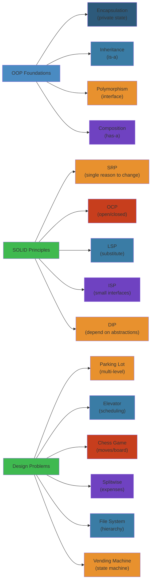

# Low-Level Design — Complete Deep Dive 🔬

Low-level design (LLD) is the **detailed blueprint** of a software component — the classes, interfaces, relationships, state machines, and algorithms that translate high-level architecture into working code.

**Related**: [Software Architecture](/17-software-architecture/README.md) · [Design Patterns](/17-software-architecture/design-patterns/designpatterns.md) · [Software Engineering](/25-software-engineering/README.md) · [System Design](/15-system-design/README.md)

---




## Table of Contents

- [OOP Foundations](#-oop-foundations)
- [SOLID Principles](#1-solid-principles-)
- [Design Patterns](#2-design-patterns-)
- [Object-Oriented Modeling](#3-object-oriented-modeling-)
- [Class Diagrams](#4-class-diagrams-)
- [Sequence Diagrams](#5-sequence-diagrams-)
- [State Machines](#6-state-machines-)
- [Design Problems Overview](#7-design-problems-overview-)
- [Parking Lot Design](#8-parking-lot-design-)
- [Elevator Design](#9-elevator-design-)
- [Chess Game](#10-chess-game-)
- [Splitwise](#11-splitwise-)
- [File System](#12-file-system-)
- [Hotel Booking](#13-hotel-booking-)
- [Vending Machine](#14-vending-machine-)
- [Additional Design Problems](#15-additional-design-problems-)
- [Learning Path](#-learning-path)
- [Related Domains](#-related-domains)
- [Simplest Mental Model](#-simplest-mental-model)

---

## 🎯 OOP Foundations

### Four Pillars
```java
// 1. Encapsulation: Hide internal state
class BankAccount {
    private double balance;

    public void deposit(double amount) {
        if (amount <= 0) throw new IllegalArgumentException();
        balance += amount;
    }

    public double getBalance() {
        return balance;  // Read-only access
    }
}

// 2. Inheritance: IS-A relationship
class Car extends Vehicle { ... }

// 3. Polymorphism: Many forms
interface Payment {
    void pay(double amount);
}
class CreditCardPayment implements Payment { ... }
class UPIPayment implements Payment { ... }

// 4. Abstraction: Hide implementation details
abstract class Database {
    abstract void connect();
    abstract void query(String sql);
}
```

### Association, Aggregation, Composition
```
Association: Uses-a (temporary)
  Driver drives Car

Aggregation: Has-a (independent lifecycle)
  Department has Professors (professor exists without department)

Composition: Has-a (dependent lifecycle)
  House has Rooms (room doesn't exist without house)
```

### Object Relationships
```
Dependency:     A uses B temporarily (method parameter)
Association:    A has B (field)
Aggregation:    A has B, B can exist without A
Composition:    A owns B, B cannot exist without A
Inheritance:    A is a B
Implementation: A implements interface B
```

---

## 1. SOLID Principles 📐

### S — Single Responsibility
A class should have one, and only one, reason to change.
```java
// Bad: Report generates content AND handles formatting AND saves to file
class Report {
    void generate() { ... }
    void formatHTML() { ... }
    void saveToFile(String path) { ... }
}

// Good: Separate responsibilities
class ReportGenerator { String generate() { ... } }
class HTMLFormatter { String format(String content) { ... } }
class FileSaver { void save(String path, String content) { ... } }
```

### O — Open/Closed
Open for extension, closed for modification.
```java
interface DiscountStrategy {
    double apply(double price);
}
class NoDiscount implements DiscountStrategy { ... }
class PercentageDiscount implements DiscountStrategy { ... }
class BogoDiscount implements DiscountStrategy { ... }
// New discount types = new class, no modification to existing code
```

### L — Liskov Substitution
Subtypes must be substitutable for their base types.
```java
// Bad: Square extends Rectangle, breaks behavior
class Rectangle {
    void setWidth(int w) { this.width = w; }
    void setHeight(int h) { this.height = h; }
    int area() { return width * height; }
}

// Problem: Square changes width and height together
class Square extends Rectangle {
    void setWidth(int w) { super.setWidth(w); super.setHeight(w); }
    void setHeight(int h) { super.setWidth(h); super.setHeight(h); }
}

// Solution: Don't inherit. Use separate shapes with area interface.
```

### I — Interface Segregation
Many specific interfaces better than one general interface.
```java
// Bad: Fat interface
interface Worker { void work(); void eat(); void sleep(); }

// Good: Segregated interfaces
interface Workable { void work(); }
interface Eatable { void eat(); }
interface Sleepable { void sleep(); }
class Robot implements Workable { ... }
class Human implements Workable, Eatable, Sleepable { ... }
```

### D — Dependency Inversion
Depend on abstractions, not concretions.
```java
// Bad: High-level depends on low-level
class OrderService {
    private MySQLDatabase db;  // Direct dependency
}

// Good: Both depend on abstraction
interface OrderRepository { void save(Order o); }
class MySQLOrderRepository implements OrderRepository { ... }
class OrderService {
    private OrderRepository repo;  // Depends on abstraction
}
```

---

## 2. Design Patterns 🧩

### Creational Patterns (Code Examples)

**Singleton**
```java
class Logger {
    private static final Logger INSTANCE = new Logger();
    private Logger() {}
    public static Logger getInstance() { return INSTANCE; }
}
```

**Factory Method**
```java
interface Parser {
    Document parse(String content);
}
class JSONParser implements Parser { ... }
class XMLParser implements Parser { ... }

class ParserFactory {
    Parser create(String type) {
        return switch (type) {
            case "json" -> new JSONParser();
            case "xml" -> new XMLParser();
            default -> throw new IllegalArgumentException();
        };
    }
}
```

**Builder**
```java
class Pizza {
    private String size;
    private boolean cheese;
    private boolean pepperoni;

    static class Builder {
        private String size;
        private boolean cheese;
        private boolean pepperoni;

        Builder size(String size) { this.size = size; return this; }
        Builder cheese(boolean v) { this.cheese = v; return this; }
        Builder pepperoni(boolean v) { this.pepperoni = v; return this; }

        Pizza build() { return new Pizza(this); }
    }

    private Pizza(Builder builder) {
        this.size = builder.size;
        this.cheese = builder.cheese;
        this.pepperoni = builder.pepperoni;
    }
}

// Usage: new Pizza.Builder().size("large").cheese(true).pepperoni(true).build();
```

### Structural Patterns

**Adapter**
```java
// Legacy XML service expects XML, new client sends JSON
interface XMLService { void process(String xml); }

class JSONToXMLAdapter implements XMLService {
    private JSONParser jsonParser;
    
    void process(String xml) {
        String json = convertXmlToJson(xml);
        jsonParser.parse(json);
    }
}
```

**Decorator**
```java
interface Coffee { double cost(); String description(); }

class SimpleCoffee implements Coffee {
    public double cost() { return 5.0; }
    public String description() { return "Coffee"; }
}

class MilkDecorator implements Coffee {
    private Coffee coffee;
    MilkDecorator(Coffee c) { this.coffee = c; }
    public double cost() { return coffee.cost() + 2.0; }
    public String description() { return coffee.description() + " + milk"; }
}

// Usage: new MilkDecorator(new SimpleCoffee())
```

### Behavioral Patterns

**Observer**
```java
interface Observer { void update(String event); }

class Subject {
    private List<Observer> observers = new ArrayList<>();
    
    void attach(Observer o) { observers.add(o); }
    void notifyObservers(String event) {
        observers.forEach(o -> o.update(event));
    }
}

// Usage: stock market updates, event listeners
```

**Strategy**
```java
interface PaymentStrategy {
    void pay(double amount);
}
class CreditCardPayment implements PaymentStrategy {
    void pay(double amount) {
        // Process via credit card gateway
    }
}
class PaymentContext {
    private PaymentStrategy strategy;
    void setStrategy(PaymentStrategy s) { this.strategy = s; }
    void executePayment(double amount) { strategy.pay(amount); }
}
```

**State**
```java
interface VendingMachineState {
    void insertCoin();
    void selectProduct();
    void dispense();
}

class IdleState implements VendingMachineState {
    public void insertCoin() { /* transition to HasCoinState */ }
    public void selectProduct() { /* cannot select without coin */ }
    public void dispense() { /* cannot dispense without selection */ }
}

class VendingMachine {
    private VendingMachineState state;
    void setState(VendingMachineState s) { this.state = s; }
    void insertCoin() { state.insertCoin(); }
}
```

---

## 3. Object-Oriented Modeling 🎨

### Approach
1. **Identify nouns** → Classes/Entities
2. **Identify verbs** → Methods/Behaviors
3. **Identify relationships** → Inheritance, Association, Composition
4. **Apply patterns** → Where appropriate
5. **Refine** → Extract interfaces, abstract classes

### Example: Library Management
```
Nouns: Book, Member, Librarian, Library, Loan, Shelf
Verbs: borrow book, return book, search book, register member
Relationships:
  Library has-a Books (aggregation)
  Library has-a Members (aggregation)
  Loan links-a Book + Member (association)
  Librarian is-a Member (inheritance)
```

### Modeling Guidelines
- **Entities**: Have identity (`equals()`/`hashCode()`)
- **Value Objects**: Immutable, equality by fields
- **Services**: Stateless operations across entities
- **Repositories**: Persistence abstraction
- **Factories**: Complex creation logic

---

## 4. Class Diagrams 🔷

### UML Basics
```
┌───────────────────────┐
│      ClassName        │
├───────────────────────┤
│ - privateField        │
│ # protectedField      │
│ + publicField         │
├───────────────────────┤
│ + publicMethod()      │
│ - privateMethod()     │
│ # protectedMethod()   │
└───────────────────────┘

Relationships:
  Inheritance:  ———▷  (empty arrow)
  Interface:    - - -▷ (dashed arrow)
  Association:  ───── (solid line)
  Aggregation:  ─────◇ (white diamond)
  Composition:  ─────◆ (filled diamond)
  Dependency:   - - -> (dashed arrow)
```

### Class Diagram for Parking Lot
```
┌──────────────────┐       ┌──────────────────┐
│    ParkingLot    │       │      Level       │
├──────────────────┤       ├──────────────────┤
│ - name: String   │◇──────│ - floor: int     │
│ - levels: List   │       │ - spots: List    │
├──────────────────┤       ├──────────────────┤
│ + park(vehicle)  │       │ + park(vehicle)  │
│ + unpark(spot)   │       │ + unpark(spot)   │
│ + available()    │       │ + available()    │
└──────────────────┘       └──────────────────┘
                                  │
                                  │◇
                                  │
                           ┌──────────────────┐
                           │      Spot        │
                           ├──────────────────┤
                           │ - id: String     │
                           │ - type: SpotType │
                           │ - occupied: bool │
                           ├──────────────────┤
                           │ + park()         │
                           │ + unpark()       │
                           └──────────────────┘
```

---

## 5. Sequence Diagrams 🔀

### Sequence Diagram for Parking Lot
```
User → ParkingLot: park(vehicle)
ParkingLot → Level: findAvailable(vehicle.type)
Level → Spot: isAvailable()
Spot -->> Level: true
Level -->> ParkingLot: spot
ParkingLot → Spot: park(vehicle)
Spot → Ticket: create(vehicle, spot)
Ticket -->> Spot: ticket
Spot -->> User: ticket
```

### Key Sequence Elements
```
Actor:         Person or system initiating action
Lifeline:      Vertical dotted line (object's lifetime)
Activation:    Rectangle on lifeline (active period)
Message:       Arrow between lifelines
Self-call:     Arrow back to same lifeline
Reply/Return:  Dashed arrow back
Alternative:   Box with "alt" label
Loop:          Box with "loop" label
```

---

## 6. State Machines 🔄

### Vending Machine States
```
                insertCoin(valid)
    ┌──────────────────────────────────┐
    │  IDLE    ──────────────────►  HAS_COIN  │
    │  ▲                               │     │
    │  │        selectProduct()        │     │
    │  │     ┌─────────────────────────┘     │
    │  │     ▼                               │
    │  │  DISPENSING                         │
    │  │     │                               │
    │  │     │ dispense()                    │
    │  │     ▼                               │
    │  │   IDLE                             │
    │  └────────────────────────────────────┘
    │         cancel()
    │         ┌──────────────────────────┐
    │         ▼                          │
    │      REFUND ───────────────────────┘
    │         │ refund()
    │         ▼
    │       IDLE
```

### State Transition Table
```
Current State  | Event           | Next State   | Action
IDLE           | insertCoin()    | HAS_COIN     | Validate coin
HAS_COIN       | selectProduct() | DISPENSING   | Check availability
HAS_COIN       | cancel()        | REFUND       | Return coin
DISPENSING     | dispense()      | IDLE         | Release product
REFUND         | refund()        | IDLE         | Return change
```

---

## 7. Design Problems Overview 🏗️

### Problem Catalog
| Problem | Key Concepts | Difficulty |
|---------|-------------|------------|
| Parking Lot | OOP, state, pricing strategy | Medium |
| Elevator System | State machine, scheduling, OOP | Medium |
| Chess Game | State machine, rules engine, OOP | Hard |
| Splitwise | Graph algorithm, expense splitting | Medium |
| File System | Composite pattern, tree traversal | Medium |
| Hotel Booking | Reservation system, search, payment | Hard |
| Vending Machine | State machine, inventory | Easy |
| Amazon Locker | Location-based, OTP, TTL | Medium |
| Restaurant Mgt | Table assignment, order tracking | Medium |
| Movie Ticket | Booking system, seat selection | Medium |
| ATM Machine | State machine, auth, balance | Easy |
| Snake & Ladder | Board game, dice, graph | Easy |
| Tic-Tac-Toe | Game logic, win detection | Easy |
| Logging Framework | Singleton, Observer | Easy |
| Task Management | CRUD, priority, deadline | Medium |

---

## 8. Parking Lot Design 🅿️

### Requirements
- Multiple levels, multiple spots per level
- Spot types: Large, Compact, Motorcycle, Handicapped
- Vehicles: Car, Truck, Motorcycle, Bus
- Ticketing system (entry time, fee calculation)
- Fee calculation based on duration + vehicle type
- Display board showing available spots

### Key Classes
```java
enum SpotType { LARGE, COMPACT, MOTORCYCLE, HANDICAPPED }
enum VehicleType { CAR, TRUCK, MOTORCYCLE, BUS }

abstract class Vehicle {
    String licensePlate;
    VehicleType type;
}

class ParkingSpot {
    String id;
    SpotType type;
    boolean occupied;
    Vehicle parkedVehicle;
    
    boolean canPark(Vehicle v) { /* spot type compatibility */ }
}

class ParkingTicket {
    String id;
    String spotId;
    String vehicleLicense;
    LocalDateTime entryTime;
    LocalDateTime exitTime;
    double fee;
}
```

### Fee Calculation (Strategy Pattern)
```java
interface FeeStrategy {
    double calculate(LocalDateTime entry, LocalDateTime exit);
}

class HourlyFee implements FeeStrategy {
    double calculate(LocalDateTime entry, LocalDateTime exit) {
        long hours = Duration.between(entry, exit).toHours();
        return Math.max(1, hours) * rate;
    }
}
```

---

## 9. Elevator Design 🛗

### Requirements
- Multiple elevators, multiple floors
- Request elevator from floor (up/down)
- Request floor from inside elevator
- Optimize: shortest path, minimize wait time
- Display: current floor, direction
- Safety: overload, emergency stop

### Key Classes
```java
enum Direction { UP, DOWN, IDLE }

class Elevator {
    int id;
    int currentFloor;
    Direction direction;
    Set<Integer> requestedFloors;  // Pending floor requests
    
    void move() {
        if (direction == UP) currentFloor++;
        else if (direction == DOWN) currentFloor--;
        // Check if current floor is in requestedFloors
    }
}

class ElevatorController {
    List<Elevator> elevators;
    
    void requestElevator(int floor, Direction dir) {
        // Find nearest idle elevator or one moving in same direction
        Elevator best = findBestElevator(floor, dir);
        best.addStop(floor);
    }
}
```

### Scheduling Strategies
- **FCFS**: Simple but inefficient
- **SCAN** (elevator algorithm): Move in one direction, service all requests, reverse
- **LOOK**: Similar to SCAN but only go to highest/lowest request
- **Nearest car**: Assign request to closest elevator

---

## 10. Chess Game ♟️

### Requirements
- 8×8 board, 6 piece types
- Turn-based (white/black alternating)
- Valid move validation per piece type
- Check, checkmate, stalemate detection
- Castling, en passant, pawn promotion
- Game state tracking, undo move support

### Key Classes
```java
enum Color { WHITE, BLACK }
enum PieceType { KING, QUEEN, ROOK, BISHOP, KNIGHT, PAWN }

abstract class Piece {
    Color color;
    PieceType type;
    abstract List<Position> getValidMoves(Board board, Position pos);
}

class Board {
    Piece[][] squares;  // 8×8
    Position getKingPosition(Color color) { ... }
    boolean isInCheck(Color color) { ... }
}

class Game {
    Board board;
    Color currentTurn;
    List<Move> moveHistory;
    
    boolean makeMove(Position from, Position to) {
        if (!isValidMove(from, to)) return false;
        Move move = executeMove(from, to);
        moveHistory.add(move);
        currentTurn = currentTurn == WHITE ? BLACK : WHITE;
        return true;
    }
}
```

### Move Validation (Strategy Pattern)
```java
interface MoveStrategy {
    List<Position> getValidMoves(Board board, Position pos, Piece piece);
}

class PawnMoveStrategy implements MoveStrategy {
    List<Position> getValidMoves(Board board, Position pos, Piece piece) {
        // Forward 1, Forward 2 (first move), diagonal capture
        // En passant, promotion
    }
}
```

---

## 11. Splitwise 💰

### Requirements
- Users can add expenses
- Split equally, exact amounts, or percentages
- Show balances between users
- Suggest settlements (who pays whom)
- Group expenses, simplify debts

### Key Classes
```java
class User {
    String id;
    String name;
    String email;
}

class Expense {
    String id;
    String paidBy;  // User ID
    double amount;
    SplitType type;  // EQUAL, EXACT, PERCENTAGE
    List<Split> splits;
    String groupId;
}

abstract class Split {
    String userId;
    double amount;
}

class EqualSplit extends Split {
    public EqualSplit(String userId, double totalAmount, int totalUsers) {
        this.userId = userId;
        this.amount = totalAmount / totalUsers;
    }
}

class BalanceService {
    Map<String, Double> balances;  // userId → netBalance (positive = owed)
    
    void addExpense(Expense expense) {
        balances.merge(expense.paidBy, expense.amount, Double::sum);
        for (Split split : expense.splits) {
            balances.merge(split.userId, -split.amount, Double::sum);
        }
    }
    
    List<Transaction> settleUp() {
        // Positive balances need to receive money
        // Negative balances need to pay
        // Generate minimum transactions
        // Greedy: sort by balance, match highest payer with highest receiver
    }
}
```

---

## 12. File System 📁

### Requirements
- Files and directories (composite pattern)
- Read, write, delete, rename
- Permissions (read/write/execute)
- Path resolution (/home/user/file.txt)
- Size calculation

### Key Classes
```java
abstract class FileSystemNode {
    String name;
    String path;
    Permission permissions;
    
    abstract long getSize();
}

class File extends FileSystemNode {
    byte[] content;
    
    long getSize() { return content.length; }
    
    byte[] read() { return content; }
    void write(byte[] data) { content = data; }
}

class Directory extends FileSystemNode {
    List<FileSystemNode> children;
    
    long getSize() {
        return children.stream().mapToLong(FileSystemNode::getSize).sum();
    }
    
    void addChild(FileSystemNode node) {
        children.add(node);
        node.path = this.path + "/" + node.name;
    }
}
```

---

## 13. Hotel Booking 🏨

### Requirements
- Search rooms by date range
- Room types (single, double, suite)
- Book room, cancel booking
- Check room availability
- Payment processing
- Reservation conflict prevention

### Key Classes
```java
class Room {
    String id;
    String hotelId;
    RoomType type;
    double pricePerNight;
    int capacity;
}

class Reservation {
    String id;
    String userId;
    String roomId;
    LocalDate checkIn;
    LocalDate checkOut;
    ReservationStatus status;
    double totalPrice;
}

class BookingService {
    boolean isAvailable(String roomId, LocalDate checkIn, LocalDate checkOut) {
        // Check overlapping reservations
        return reservationRepository.findOverlapping(roomId, checkIn, checkOut).isEmpty();
    }
    
    Reservation book(String userId, String roomId, LocalDate checkIn, LocalDate checkOut) {
        // Optimistic locking on room availability
        if (!isAvailable(roomId, checkIn, checkOut)) {
            throw new RoomNotAvailableException();
        }
        double total = calculatePrice(roomId, checkIn, checkOut);
        Reservation reservation = new Reservation(...);
        return save(reservation);
    }
}
```

---

## 14. Vending Machine 🤖

### Requirements
- Product selection, coin insertion, change dispense
- Inventory tracking, out-of-stock handling
- Multiple payment methods (coins, cards)
- Refund on cancel

### Key Classes
```java
class Product {
    String name;
    double price;
    int quantity;
}

class VendingMachine {
    Map<String, Product> inventory;
    VendingMachineState state;
    double insertedAmount;
    String selectedProduct;
    
    void insertCoin(Coin coin) {
        insertedAmount += coin.value;
        state = new HasCoinState(this);
    }
    
    void selectProduct(String productCode) {
        Product p = inventory.get(productCode);
        if (p.quantity <= 0 || p.price > insertedAmount) {
            throw new InvalidSelectionException();
        }
        selectedProduct = productCode;
        state = new DispensingState(this);
    }
    
    void dispense() {
        Product p = inventory.get(selectedProduct);
        double change = insertedAmount - p.price;
        p.quantity--;
        // Dispense product
        // Dispense change
        state = new IdleState(this);
    }
}
```

---

## 15. Additional Design Problems 📋

### Amazon Locker
- Location-based locker assignment
- OTP generation for pickup
- TTL for package storage
- Overdue fee calculation

### Restaurant Management
- Table assignment (capacity, availability)
- Order taking (items, modifications, special requests)
- Kitchen display system
- Bill splitting

### Movie Ticket Booking
- Seat selection (adjacent, wheelchair, premium)
- Show timings, screen assignment
- Booking window, cancellation rules
- Concurrency (same seat, two users)

### ATM Machine
- Card authentication, PIN entry
- Check balance, withdraw, deposit
- Denomination dispense
- Transaction limit, daily limit

### Snake & Ladder
- Board (100 squares), dice (1-6)
- Snakes (head → tail)
- Ladders (bottom → top)
- Player turns, win condition

### Task Management
- Task CRUD (title, description, due date, priority)
- User assignment, tags, lists
- Search, filter, sorting
- Recurring tasks

### Logging Framework
- Singleton logger
- Multiple appenders (console, file, database)
- Log levels (DEBUG, INFO, WARN, ERROR)
- Configuration (format, level per package)

### Tic-Tac-Toe
- 3×3 board
- Two players (X, O)
- Win detection (rows, columns, diagonals)
- Draw detection

---

## 📚 Learning Path

### Phase 1: OOP Foundations
1. Encapsulation, inheritance, polymorphism
2. Association vs aggregation vs composition
3. SOLID principles (practice each with example)

### Phase 2: Patterns
1. Creational patterns (Singleton, Factory, Builder)
2. Structural patterns (Adapter, Decorator, Composite)
3. Behavioral patterns (Strategy, Observer, State)

### Phase 3: Design Problems (Easy)
1. Vending Machine, ATM, Tic-Tac-Toe
2. Logging Framework, Task Management
3. Snake & Ladder

### Phase 4: Design Problems (Medium)
1. Parking Lot, Elevator
2. Splitwise, File System
3. Hotel Booking

### Phase 5: Design Problems (Hard)
1. Chess Game
2. Amazon Locker
3. Movie Ticket Booking

---

## 🔗 Related Domains

| Domain | Connection |
|--------|-----------|
| [Software Architecture](/17-software-architecture/README.md) | Architecture styles, high-level design |
| [System Design](/15-system-design/README.md) | Scalable system blueprints |
| [Design Patterns](/17-software-architecture/design-patterns/designpatterns.md) | Full pattern catalog with code |
| [Software Engineering](/25-software-engineering/README.md) | Clean code, SOLID, refactoring |
| [Interviews](/20-interviews/README.md) | LLD interview preparation |

---

## 🧠 Simplest Mental Model

```
Low-Level Design = LEGO Instructions for Software

High-level architecture: "Build a castle"
  → This tells you what rooms go where (macro structure)

Low-level design: "Step 47: Attach 2×4 red brick to 2×2 blue brick"
  → This tells you exactly how to build each piece (micro structure)

Good LLD means:
  - Each brick (class) has a single purpose
  - Bricks click together cleanly (interfaces)
  - You can swap a red brick for a yellow one (open/closed)
  - Instructions are clear enough for anyone to follow

The best LLD is boring. It's obvious, predictable, and unsurprising.
  (Creative LLD is usually wrong LLD.)
```

**Design for the reader, not the writer. Your code will be read 10x more than it's written.**

---

**Next**: [Software Engineering](/25-software-engineering/README.md) · [Design Patterns](/17-software-architecture/design-patterns/designpatterns.md)

## Related

- [Transformation Summary](/03-backend/java/00-TRANSFORMATION-SUMMARY.md)
- [Oop Concepts](/03-backend/java/01-oop-concepts.md)
- [Collections Framework](/03-backend/java/02-collections-framework.md)
- [Exception Handling](/03-backend/java/03-exception-handling.md)
- [Multithreading](/03-backend/java/04-multithreading.md)
- [Jvm Architecture](/03-backend/java/05-jvm-architecture.md)
