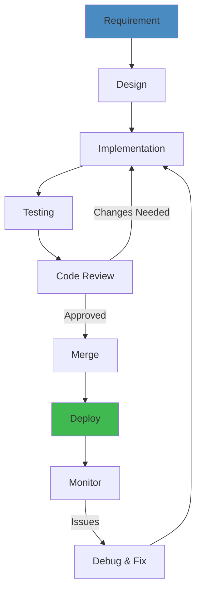
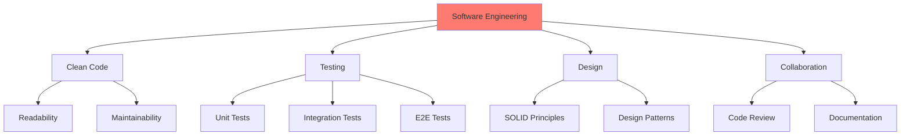

# Software Engineering — Complete Guide 🛠️


> **Run the live simulator**: [git-commit-graph.html](/25-software-engineering/git-commit-graph.html) — create commits, branches, and merges to visualize the commit DAG.

Software engineering is the **disciplined application of engineering principles** to software development. It covers coding practices, design principles, collaboration patterns, and the professional skills needed to build maintainable systems.

**Related**: [Software Architecture](/17-software-architecture/README.md) · [Testing](/19-testing/README.md) · [System Design](/15-system-design/README.md) · [Microservices](/16-microservices/README.md)

## Software Development Lifecycle



## Engineering Pillars



---

## Table of Contents

- [Engineering Mindset](#-engineering-mindset)
- [SOLID Principles](#1-solid-principles-)
- [Clean Code Practices](#2-clean-code-practices-)
- [Refactoring Techniques](#3-refactoring-techniques-)
- [Code Review Checklist](#4-code-review-checklist-)
- [Version Control (Git Internals)](#5-version-control-git-internals-)
- [Documentation & Technical Writing](#6-documentation--technical-writing-)
- [Estimation Techniques](#7-estimation-techniques-)
- [Agile Methodologies](#8-agile-methodologies-)
- [Team Topologies](#9-team-topologies-)
- [Conway's Law](#10-conways-law-)
- [Technical Debt Management](#11-technical-debt-management-)
- [Learning Path](#-learning-path)
- [Related Domains](#-related-domains)
- [Simplest Mental Model](#-simplest-mental-model)

---

## 🎯 Engineering Mindset

### Mastering vs Learning
```
A master is someone who knows what "good enough" looks like.

Key mindset shifts:
  - "It works" → "Is it maintainable?"
  - "Add this feature" → "Simplify this system"
  - "Write more code" → "Delete more code"
  - "I'll fix this later" → "Do it right now"
  - "That's not my job" → "I own this system"
```

### The Three Virtues (Larry Wall)
1. **Laziness**: Write code that makes future work easier
2. **Impatience**: Automate repetitive tasks
3. **Hubris**: Write code you're proud to put your name on

### Professional Values
- **Honesty**: Accurate estimates, admit mistakes, surface problems early
- **Courage**: Refactor when needed, say no to bad ideas
- **Humility**: Your code isn't perfect, learn from everyone
- **Discipline**: Follow conventions, write tests, document decisions

---

## 1. SOLID Principles 📐

### S — Single Responsibility
> "A class should have only one reason to change."

Each class, method, or module should do ONE thing and do it well.

**Signs of SRP violation:**
- Class has more than 5-10 methods
- Class has multiple "and" in its purpose ("handles orders and sends emails")
- Changes often touch the same class for different reasons

**Example:**
```java
// Violation: OrderService handles validation, persistence, emails, logging
class OrderService {
    void processOrder(Order o) {
        validate(o);
        save(o);
        sendConfirmationEmail(o);
        logOrder(o);
    }
}

// Better: Split responsibilities
class OrderValidator { void validate(Order o); }
class OrderRepository { void save(Order o); }
class EmailService { void sendConfirmation(Order o); }
class AuditLogger { void logOrder(Order o); }
```

### O — Open/Closed
> "Open for extension, closed for modification."

Add new behavior through new code (extending), not by changing existing code.

**Example:**
```java
// Violation: Adding new shape requires modifying Calculator
class AreaCalculator {
    double area(Object shape) {
        if (shape instanceof Circle) { ... }
        if (shape instanceof Square) { ... }
        // New shape = new if statement!
    }
}

// Better: Each shape knows its area
interface Shape { double area(); }
class Circle implements Shape { double area() { ... } }
```

### L — Liskov Substitution
> "Subtypes must be substitutable for their base types."

If code works with a base class, it should also work with any subclass without knowing it.

**Example:**
```java
// Violation: Square changes Rectangle behavior
void testRectangle(Rectangle r) {
    r.setWidth(5);
    r.setHeight(4);
    assert r.area() == 20;  // Fails for Square!
}

// Better: Separate interfaces, no inheritance for behavior
```

### I — Interface Segregation
> "Many client-specific interfaces are better than one general-purpose interface."

Don't force classes to implement methods they don't use.

**Example:**
```java
// Violation: Fat interface
interface Worker { void work(); void eat(); void sleep(); }

// Better: Segregated
interface Workable { void work(); }
interface Eatable { void eat(); }
```

### D — Dependency Inversion
> "Depend on abstractions, not concretions."

High-level modules should not depend on low-level modules. Both should depend on abstractions.

**Example:**
```java
// Violation: OrderService knows about MySQLDatabase
class OrderService {
    private MySQLDatabase db;
}

// Better: Both depend on abstraction
interface OrderRepository { void save(Order o); }
class MySQLOrderRepository implements OrderRepository { ... }
class OrderService {
    private OrderRepository repo;  // Doesn't care about implementation
}
```

---

## 2. Clean Code Practices 🧹

### Naming
```java
// Bad names
int d;  // elapsed time in days
List<Order> list;
void process();
Customer c;

// Good names
int elapsedDays;
List<Order> customerOrders;
void processRefund();
Customer customer;
```

### Functions
```java
// Bad: Too many responsibilities
void process(String input) {
    // Validate input
    // Parse to object
    // Save to database
    // Send email
}

// Good: Single responsibility
Order parseOrder(String input) { ... }
void saveOrder(Order order) { ... }
void sendConfirmation(Order order) { ... }
```

### Function Rules
- **Small**: < 20 lines ideally
- **One level of abstraction**: Don't mix high-level and low-level
- **Few parameters**: 0-2 ideal, 3 max (use object for more)
- **No side effects**: Output only through return value
- **Command-query separation**: Either do something or return something

### Comments
```java
// Bad: Obvious comment
// Increment counter
counter++;

// Bad: Misleading comment
// Order is processed (actually it's just validated)
order.process();

// Good: Why (not what)
// CAPTCHA required because of brute force attacks last month
showCaptcha();

// Good: TODO with context
// TODO: Add retry logic when payment gateway times out
```

### Error Handling
```java
// Bad: Return null
Order findOrder(String id) {
    if (notFound) return null;
}

// Bad: Swallow exception
try { process(); } catch (Exception e) { /* do nothing */ }

// Good: Throwing meaningful exceptions
Order findOrder(String id) {
    return db.find(id).orElseThrow(() -> new OrderNotFoundException(id));
}

// Good: Exception types
class PaymentDeclinedException extends RuntimeException { ... }
class InsufficientFundsException extends PaymentDeclinedException { ... }
```

### DRY (Don't Repeat Yourself)
```java
// Bad: Duplication
double calculatePriceWithTax(double price) { return price * 1.08; }
double calculateTotalWithTax(double price, int quantity) { return price * quantity * 1.08; }

// Good: Extract
double applyTax(double amount) { return amount * 1.08; }
double calculatePriceWithTax(double price) { return applyTax(price); }
double calculateTotalWithTax(double price, int qty) { return applyTax(price * qty); }
```

---

## 3. Refactoring Techniques 🔧

### Catalog (Martin Fowler)

**Composing Methods**
```
Extract Method:         Extract code block into named method
Inline Method:          Replace method call with its body
Extract Variable:       Name an expression
Replace Temp with Query: Replace temp with method call
```

**Moving Features**
```
Move Method:            Move to more appropriate class
Move Field:             Move to more appropriate class
Extract Class:          Split one large class into two
Inline Class:           Merge small class into another
```

**Organizing Data**
```
Self-Encapsulate Field: Use getter/setter internally
Replace Data with Object: Primitive → meaningful object
Replace Array with Object: Array → named fields
Change Value to Reference: Multiple copies → one shared
```

**Simplifying Conditional**
```
Decompose Conditional:  Extract complex if/else
Consolidate Conditional: Combine similar conditions
Replace Nested Conditional with Guard Clauses: Early return
Replace Conditional with Polymorphism: if/else → strategy/state
```

**Simplifying Method Calls**
```
Rename Method:          Clearer name
Add Parameter:          New parameter for variation
Remove Parameter:       Unused parameter
Separate Query from Modifier: Don't combine side-effect with return
Parameterize Method:    Multiple methods → one with parameter
```

### Refactoring Workflow
```
1. Identify "code smell" (readability issue, duplication, long method)
2. Write/run tests (ensure behavior captured)
3. Apply one refactoring at a time
4. Run tests (ensure nothing broken)
5. Commit
6. Repeat
```

### Code Smells
- **Long method**: Too many lines (10+ is suspect)
- **Large class**: Too many fields/methods
- **Primitive obsession**: Using primitives instead of objects
- **Long parameter list**: > 3 parameters
- **Data clump**: Same group of fields appearing together
- **Switch statements**: Duplicated switch on type (use polymorphism)
- **Shotgun surgery**: One change requires many small edits
- **Feature envy**: Method uses more of another class than its own
- **Inappropriate intimacy**: Classes too coupled
- **Message chains**: `a.b().c().d()`
- **Middle man**: Class delegates everything to another

---

## 4. Code Review Checklist ✅

### Functionality
```
[ ] Does the code do what it's supposed to?
[ ] Are edge cases handled? (null, empty, max values, duplicates)
[ ] Are there any race conditions?
[ ] Has error handling been implemented properly?
[ ] Are there security vulnerabilities? (injection, auth, data exposure)
```

### Design
```
[ ] Does it follow SOLID principles?
[ ] Is the code appropriately abstracted?
[ ] Is there unnecessary complexity?
[ ] Are there good separation of concerns?
[ ] Is the API intuitive? (method names, parameters)
[ ] Can this be tested easily?
```

### Readability
```
[ ] Are names clear and meaningful?
[ ] Is the code well-organized?
[ ] Are comments explaining WHY (not WHAT)?
[ ] Is there any dead code?
[ ] Are there any "magic numbers" or strings?
[ ] Is formatting consistent with project style?
```

### Testing
```
[ ] Are there unit tests for new code?
[ ] Do tests cover edge cases?
[ ] Are tests readable (AAA pattern)?
[ ] Are test names descriptive?
[ ] Are integration/E2E tests added when needed?
```

### Performance
```
[ ] Are there obvious performance issues?
[ ] Are there unnecessary DB queries (N+1)?
[ ] Are loops efficient?
[ ] Is there caching where appropriate?
[ ] Is there object allocation in hot paths?
```

### Security
```
[ ] Is input validated and sanitized?
[ ] Are secrets hardcoded?
[ ] Is authentication/authorization handled?
[ ] Are there SQL injection risks?
[ ] Is data encrypted at rest and in transit?
[ ] Are logs exposing PII?
```

---

## 5. Version Control (Git Internals) 📚

### Git Objects
```bash
# Git is a content-addressable filesystem

Blob:     File content (compressed)
Tree:     Directory (file names → blob hashes)
Commit:   Snapshot (tree hash + parent + author + message)
Tag:      Named reference to a commit

Object storage: .git/objects/XX/XXXXXXXXX...
                (first 2 chars = directory, rest = file)
```

### Git Commands Mental Model
```
Working Directory    Staging Area    Local Repo    Remote Repo
    (files)          (index)         (.git)        (GitHub)

  git add ─────────▶
                     git commit ───▶
                                    git push ────▶
      ◀─── git checkout
      ◀─── git reset (--hard)
                                    ◀── git fetch
                                    ◀── git pull
```

### Merge vs Rebase
```
Merge:
  - Creates merge commit
  - Preserves exact history
  - "Accurate" but messy

Rebase:
  - Rewrites history (linear)
  - Cleaner commit timeline
  - DANGER: Don't rebase shared branches

Squash:
  - Combines multiple commits into one
  - "Make it look like I did it perfectly the first time"
  - Use before merging feature branches
```

### Key Practices
```bash
# Atomic commits: One logical change per commit
git commit -m "feat: add order cancellation endpoint"

# Small, frequent commits
git add -p  # Stage parts of files

# Meaningful commit messages
# Format: type: subject
# Types: feat, fix, refactor, test, docs, chore, perf

# Branch strategy
main ← develop ← feature/XXX
                         fix/XXX

# Always pull before push
git pull --rebase  # Avoid merge commits
```

### .gitignore Essentials
```gitignore
# Build/ide artifacts
target/
build/
.idea/
*.iml

# Environment
.env
*.env.local

# OS files
.DS_Store
Thumbs.db

# Dependencies
node_modules/
vendor/

# Logs
*.log
```

---

## 6. Documentation & Technical Writing 📝

### Types of Documentation
```
Architecture Decision Records (ADRs):
  - Why a decision was made
  - Brief, focused, permanent

READMEs:
  - What is this project?
  - How to set up, run, test
  - Architecture overview

API Documentation:
  - Endpoints, parameters, responses
  - Examples for common use cases

Runbooks:
  - How to handle alerts/incidents
  - Step-by-step procedures
  - Updated after every incident

Design Docs:
  - Before building: "RFC" style
  - Requirements, design, alternatives, tradeoffs
```

### Writing Guidelines
- **Know your audience**: Junior dev, operator, reviewer
- **Be concise**: Shorter is better (but not at cost of clarity)
- **Use examples**: Show, don't just tell
- **Active voice**: "The service processes orders" vs "Orders are processed"
- **Structure**: Headers, lists, code blocks, diagrams
- **Keep current**: Outdated docs are worse than no docs

### ADR Format
```markdown
# ADR-001: Use PostgreSQL for Order Database

## Status
Accepted

## Context
We need a database that supports ACID transactions, complex queries,
and JSON fields for the order service.

## Decision
We will use PostgreSQL 16.

## Alternatives Considered
- MySQL: Good but PostgreSQL has better JSON support
- MongoDB: No ACID transactions needed

## Consequences
- (+) ACID compliance for order transactions
- (-) Need operational expertise for PostgreSQL
```

---

## 7. Estimation Techniques ⏱️

### Why Estimates Are Hard
- **Unknown unknowns**: Things you don't know you don't know
- **Optimism bias**: Everything takes longer than expected
- **Conway's Law**: Coordination costs grow with team size
- **Interruptions**: Context switching, meetings, incidents

### Estimation Methods
```
T-shirt sizing:
  XS (hours), S (1-2 days), M (3-5 days), L (1-2 weeks), XL (3+ weeks)

Planning Poker:
  Team estimates together, discuss differences, converge

Three-point:
  Optimistic + Most Likely + Pessimistic
  Expected = (O + 4M + P) / 6

Affinity Mapping:
  Group similar-sized stories together
```

### Estimation Tips
- **Break down**: Large tasks → smaller tasks (2-3 days max)
- **Include buffers**: 20-50% overhead for unknowns
- **Use historical data**: How long did similar work take?
- **Rethink estimates as ranges**: "2-4 days" not "3 days"
- **Track actuals**: Compare estimate → actual to calibrate

---

## 8. Agile Methodologies 🔄

### Scrum
```
Roles: Product Owner, Scrum Master, Development Team
Events:
  Sprint Planning    (2 weeks → select backlog items)
  Daily Standup      (15 min, what did I do / what's blocking / what next)
  Sprint Review      (demo to stakeholders)
  Sprint Retrospective (improve process)

Artifacts:
  Product Backlog   (ordered list of everything)
  Sprint Backlog    (committed for this sprint)
  Increment         (working software)
```

### Kanban
```
Principles:
  - Visualize workflow (board: To Do → In Progress → Review → Done)
  - Limit Work In Progress (WIP limits)
  - Manage flow (cycle time, throughput)
  - Continuous improvement

Metrics:
  - Cycle time: Time from start to done
  - Throughput: Items completed per week
  - WIP: Items in progress
  - Lead time: Time from request to delivery
```

### Which to Choose?
```
Scrum is better for:
  - Fixed-length iterations
  - Team needs structure
  - Predictable delivery cadence

Kanban is better for:
  - Continuous flow (support, Ops)
  - High variability in work
  - Teams need flexibility
```

---

## 9. Team Topologies 👥

### Four Fundamental Topologies (Matthew Skelton)

**Stream-aligned team**
- Aligned to a flow of work (business domain, feature area)
- Owns the full lifecycle of their services
- Self-sufficient (has all skills)

**Enabling team**
- Helps stream-aligned teams learn new capabilities
- Provides coaching, tools, training
- Temporary — knowledge transfers to stream-aligned

**Complicated-subsystem team**
- Deep expertise in complex domain (e.g., payments, video encoding)
- Other teams depend on their API
- Small, specialized

**Platform team**
- Builds shared infrastructure (CI/CD, observability, K8s)
- Treats other teams as customers
- Self-service, well-documented APIs

### Team Size
- **2-pizza rule** (Amazon): 6-9 people
- **Dunbar's number**: ~150 people max for community
- **Single team**: 5-9 engineers ideal

---

## 10. Conway's Law 🏛️

> "Organizations design systems that mirror their communication structure."

### Implications
```
Communication path between teams → integration between systems
  Team A talks to Team B → Service A integrates with Service B
```

### Inverse Conway Maneuver
Restructure teams to match the desired architecture — not the other way around.
```
Want microservices? → Organize teams around business capabilities
Want platform teams? → Create platform team, have teams depend on it
```

### Applying Conway's Law
1. If communication is hard between two teams, the software interface will be weak
2. If you want loose coupling between services, minimize communication between teams
3. If you want a shared platform, create a platform team
4. The architecture IS the organization chart

---

## 11. Technical Debt Management 💳

### Types of Debt
```
Reckless: "We'll fix it later" (never does)
Prudent: Short-term loan for speed (known cost, tracked)
Inadvertent: Debt discovered after the fact (learning)
Deliberate: Known tradeoff (documented in ADR)
```

### Managing Debt
```
Track it:
  - Backlog items for each debt
  - Categorized (bug, performance, maintainability)
  - Estimated effort + impact

Prioritize it:
  - High impact + high effort = deliberate decision
  - High impact + low effort = do NOW
  - Low impact + low effort = when available
  - Low impact + high effort = avoid

Pay it down:
  - Boy Scout Rule: "Leave the code better than you found it"
  - Dedicated refactoring sprints (20% time)
  - Include debt reduction in feature work
```

### The Boy Scout Rule
> "Always leave the campground cleaner than you found it."

Apply tiny refactorings every time you touch a file:
- Rename a confusing variable
- Extract a small method from a large one
- Add a missing test
- Remove a dead comment

---

## 📚 Learning Path

### Phase 1: Foundations
1. Learn SOLID principles (practice each with code)
2. Read Clean Code (Martin) — apply naming, function rules
3. Write code reviews (start with reviewing PRs)
4. Learn Git (add, commit, branch, merge, rebase)

### Phase 2: Professional Practices
1. Refactoring techniques (Martin Fowler's catalog)
2. Code review (be reviewer AND author)
3. Documentation (ADRs, READMEs, runbooks)
4. Estimation (practice sizing, track actuals)

### Phase 3: Collaboration
1. Agile (Scrum or Kanban — participate in ceremonies)
2. Team Topologies patterns
3. Conway's Law (observe in your org)
4. Technical communication (design docs, RFCs)

### Phase 4: Mastery
1. Technical debt strategy for your team
2. Mentoring junior engineers
3. Setting coding standards
4. Cross-team technical influence

---

## 🔗 Related Domains

| Domain | Connection |
|--------|-----------|
| [Software Architecture](/17-software-architecture/README.md) | High-level design, architecture evaluation |
| [Testing](/19-testing/README.md) | TDD, code quality, testability |
| [System Design](/15-system-design/README.md) | Design docs, tradeoffs, evaluation |
| [Microservices](/16-microservices/README.md) | Team topology, Conway's Law |
| [Interviews](/20-interviews/README.md) | LLD, OOP, clean code during interviews |
| [Low-Level Design](/24-low-level-design/README.md) | OOP, SOLID, design problems |

---

## 🧠 Simplest Mental Model

```
Software Engineering = Writing for Humans + Running on Machines

Writing for humans:
  - Code is read 10x more than it's written
  - The reader's time matters more than the writer's
  - Name things like a journalist (clear, accurate, boring)
  - Structure code like an essay (one idea per paragraph/function)

Running on machines:
  - Tests prove it works
  - Speed matters, but correctness matters more
  - Simple is faster than clever (usually)

The Best Engineers:
  - Write code that obvious (not clever)
  - Delete more code than they add
  - Make their future selves thank them
```

**Good code is boring code. It's predictable, obvious, and easy to change. The best engineering decision is the one that makes your teammates more productive.**

---

**Next**: [Software Architecture](/17-software-architecture/README.md) · [Testing](/19-testing/README.md)
