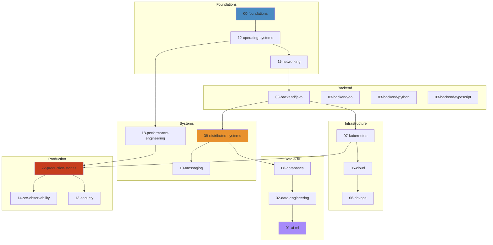

# Knowledge Connection Map 🌐

How the 254 files in this repository connect to each other.

## Learning Paths

## Domain Cross-References

| Domain | Connects To | Key Files |
|---|---|---|
| **00-foundations** | `12-operating-systems`, `11-networking` | Math → OS → Networking pipeline |
| **01-ai-ml** | `02-data-engineering`, `08-databases` | Data pipelines feed ML models |
| **02-data-engineering** | `08-databases`, `10-messaging`, `01-ai-ml` | Streaming data → Storage → AI |
| **03-backend/java** | `09-distributed-systems`, `18-performance-engineering`, `12-operating-systems` | JVM internals + OS + distributed patterns |
| **03-backend/go** | `18-performance-engineering`, `12-operating-systems` | Scheduler + memory + profiling |
| **03-backend/python** | `02-data-engineering`, `01-ai-ml` | Python drives data + ML |
| **03-backend/typescript** | `04-frontend` | Full-stack TypeScript |
| **04-frontend** | `11-networking`, `13-security` | Browser → Network → Security |
| **05-cloud** | `07-kubernetes`, `06-devops` | Cloud infra → K8s → DevOps |
| **06-devops** | `07-kubernetes`, `05-cloud`, `14-sre-observability` | IaC → K8s → Observability |
| **07-kubernetes** | `05-cloud`, `11-networking`, `13-security`, `14-sre-observability` | K8s touches everything production |
| **08-databases** | `09-distributed-systems`, `18-performance-engineering`, `12-operating-systems` | DB internals + distributed consensus + I/O |
| **09-distributed-systems** | `08-databases`, `10-messaging`, `11-networking` | Consensus + replication + messaging |
| **10-messaging** | `09-distributed-systems`, `02-data-engineering`, `22-production-stories` | Kafka/RabbitMQ patterns + failures |
| **11-networking** | `12-operating-systems`, `13-security`, `07-kubernetes` | TCP/IP → TLS → K8s networking |
| **12-operating-systems** | `11-networking`, `18-performance-engineering`, `08-databases` | Kernel → I/O → Profiling |
| **13-security** | `11-networking`, `07-kubernetes`, `04-frontend` | Web → K8s → Cryptography |
| **14-sre-observability** | `18-performance-engineering`, `07-kubernetes` | Monitoring + tracing + profiling |
| **15-system-design** | `09-distributed-systems`, `16-microservices`, `23-projects` | Theory → Practice |
| **16-microservices** | `09-distributed-systems`, `15-system-design` | Distributed patterns at scale |
| **17-software-architecture** | `15-system-design`, `16-microservices` | Architecture decisions |
| **18-performance-engineering** | `12-operating-systems`, `08-databases`, `03-backend/java` | OS + DB + JVM performance |
| **19-testing** | `06-devops`, `03-backend` | CI/CD + test strategies |
| **22-production-stories** | `09-distributed-systems`, `08-databases`, `10-messaging`, `07-kubernetes` | Real incidents → learning |
| **23-projects** | `15-system-design`, `09-distributed-systems` | Build distributed systems |
| **24-low-level-design** | `03-backend/java`, `17-software-architecture` | OOD → patterns |
| **cheat-sheets** | `18-performance-engineering`, `03-backend` | Quick reference |
| **09-distributed-systems/** | Raft consensus simulator | Run live Raft elections |
| **11-networking/** | TCP state machine, DNS resolution, TCP congestion control | Run live networking simulations |
| **16-microservices/** | Circuit breaker states | Run live circuit breaker simulation |
| **10-messaging/kafka/** | Kafka replication simulator | Run live Kafka replication |
| **07-kubernetes/** | K8s scheduling simulator | Run live pod scheduling |
| **08-databases/** | Redis eviction, MVCC visualization | Run live database simulations |

## Key Connection Paths

| Path | Stops | What You Learn |
|---|---|---|
| **Request Lifecycle** | Browser → DNS → TCP → TLS → LB → K8s → Service → Redis → PostgreSQL | Full-stack request flow |
| **Data Pipeline** | Producer → Kafka → Flink/Spark → Iceberg → ML Model → Serving | End-to-end data engineering |
| **Production Incident** | App → Redis Cache Miss → DB Overload → Connection Exhaustion → Pager | Real outage chain reaction |
| **Performance Tuning** | JVM Heap → GC Logs → Thread Dump → OS Perf → Flame Graph | Systematic optimization |
| **Deployment Flow** | Git → CI/CD → Docker → K8s Manifest → Helm → ArgoCD → Production | GitOps in action |

## Quick Reference

| Area | Start Here | Then Read |
|---|---|---|
| **New to systems?** | `00-foundations/README.md` | `12-operating-systems/03-memory-management.md` |
| **Java developer** | `03-backend/java/05-jvm-architecture.md` | `03-backend/java/15-concurrency-deep-dive.md` |
| **K8s operator** | `07-kubernetes/01-kubernetes-basics.md` | `07-kubernetes/03-kubernetes-networking.md` |
| **System design prep** | `15-system-design/01-system-design-principles.md` | `15-system-design/02-netflix.md` |
| **Production engineer** | `22-production-stories/01-kafka-outage.md` | `14-sre-observability/monitoring/01-prometheus.md` |
