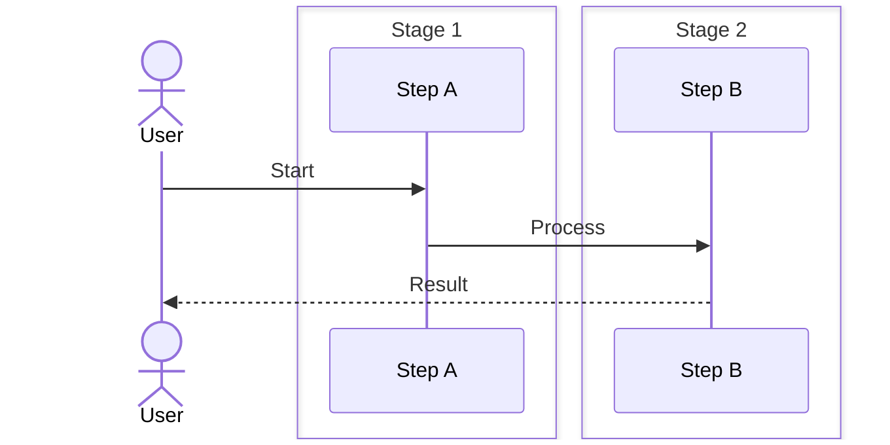

# 🎨 Interactive Visualization Engine — Architecture Blueprint

> **Status:** v0.1 — Foundational  
> **Owner:** Platform Architecture Team  
> **Last Updated:** 2026-05-27

---

## 1. Overview


The Visualization Engine transforms abstract data (graph relationships, simulation state, architecture models) into interactive, real-time visual representations. It uses a layered scene graph architecture with pluggable rendering backends (PixiJS for canvas, D3.js for SVG, Three.js for 3D), a declarative layout system, and a reactive data-binding layer powered by RxJS and Zustand.

---

## 2. Rendering Pipeline


```
 ┌──────────┐    ┌──────────┐    ┌──────────┐    ┌──────────┐    ┌──────────┐
 │  Data    │───▶│  Scene   │───▶│  Layout  │───▶│ Renderer │───▶│Compositor│───▶ Output
 │  Model   │    │  Graph   │    │  Engine  │    │          │    │          │
 └──────────┘    └──────────┘    └──────────┘    └──────────┘    └──────────┘
       │              │              │               │               │
       ▼              ▼              ▼               ▼               ▼
  Raw data       Tree of        Position/      Draw calls,     Layer merging,
  (GraphQL,     SceneNodes,    size assigned   GPU batches,    post-processing,
  WebSocket)    transforms                     shaders          blend modes

 Pipeline phases:
 1. DATA MODEL  — Fetch, validate, normalize source data
 2. SCENE GRAPH — Build node tree, attach components, set transforms
 3. LAYOUT      — Run layout algorithm, assign positions/sizes
 4. RENDER      — Generate draw calls for selected backend
 5. COMPOSITE   — Merge layers, apply effects, output to canvas/SVG
```

---

## 3. Scene Graph Model


### 3.1 Core Types


```typescript
interface SceneNode {
  id: string
  type: NodeType
  children: SceneNode[]
  parent: SceneNode | null
  transform: Transform
  visible: boolean
  opacity: number
  interactive: boolean
  data: Record<string, unknown>  // domain-specific data
}

interface Transform {
  position: Vec2  // { x: number, y: number }
  rotation: number  // radians
  scale: Vec2      // { x: number, y: number }
  origin: Vec2     // pivot point { x: 0.5, y: 0.5 }
}

type NodeType =
  | 'group'        // Container, no visual
  | 'rect'         // Rectangle (service box, card)
  | 'circle'       // Circle (node, entity)
  | 'line'         // Line (connection, edge)
  | 'path'         // SVG path (custom shapes)
  | 'text'         // Label
  | 'image'        // Icon, screenshot
  | 'graph'        // Sub-graph container
  | 'port'         // Connection point
  | 'particle'     // Animated particle
  | 'heatmap'      // Heatmap overlay
  | 'chart'        // Mini chart (sparkline)
```

### 3.2 Scene Graph Example


```
 Scene (root)
 ├── Background (rect)
 ├── GraphLayer (group)
 │   ├── NodeGroup (group)
 │   │   ├── ServiceBox (rect)
 │   │   │   ├── Icon (image)
 │   │   │   ├── Title (text)
 │   │   │   ├── PortInput (circle × N)
 │   │   │   └── PortOutput (circle × N)
 │   │   └── ServiceBox (rect) ...
 │   ├── EdgeGroup (group)
 │   │   ├── ConnectionLine (path)
 │   │   │   └── TrafficParticle (particle × M)
 │   │   └── ConnectionLine (path) ...
 │   └── AnnotationLayer (group)
 │       ├── Tooltip (rect + text)
 │       └── Highlight (rect, blend-mode)
 ├── ControlLayer (group)
 │   ├── ZoomControls (rect + text)
 │   └── MiniMap (rect)
 └── OverlayLayer (group)
     ├── LoadingSpinner (group)
     └── ErrorToast (rect + text)
```

---

## 4. Rendering Backends


```typescript
interface RenderBackend {
  name: string
  capabilities: RenderCapability[]
  createScene(): SceneHandle
  render(scene: SceneGraph, camera: Camera): void
  dispose(): void
}

interface RenderCapability {
  antialiasing: boolean
  transparency: boolean
  instancing: boolean
  particles: boolean
  filters: boolean
  mask: boolean
  sdfText: boolean
  blendModes: BlendMode[]
}

// Backend Selection Strategy
function selectBackend(requirements: RenderRequirements): RenderBackend {
  if (requirements.d3) return new D3SVGBackend()
  if (requirements.threeD) return new ThreeJSBackend()
  if (requirements.canvas) return new PixiJSBackend()
  return new PixiJSBackend()  // default
}
```

| Backend | Use Case | Strengths | Limitations |
|---------|----------|-----------|-------------|
| **PixiJS 8** | Architecture maps, topology, real-time sim viz | WebGL, 60fps, particles, filters | No 3D, SVG export limited |
| **D3.js 7** | Force-directed graphs, charts, static diagrams | SVG, data joins, transitions, accessibility | Slower at scale (>5000 nodes) |
| **Three.js** | 3D cluster topology, network mesh | Full 3D, WebGL2, materials | Heavier bundle, complex API |
| **Framer Motion** | React component animations, page transitions | Declarative, layout animations, gestures | Not for data-heavy viz |

---

## 5. Layout Engines


```typescript
type LayoutEngine = {
  name: string
  type: LayoutType
  layout(graph: GraphData, options: LayoutOptions): LayoutResult
}

type LayoutType =
  | 'dagre'          // Directed graph (DAG) — left-to-right
  | 'elk'            // Layered — top-down, hierarchical
  | 'force'          // Force-directed — exploration
  | 'grid'           // Grid — dashboards, card layouts
  | 'radial'         // Radial — hub-spoke
  | 'concentric'     // Concentric — tiered rings
  | 'tree'           // Tree — root-down
  | 'custom'         // User-defined positions
```

### 5.1 Dagre Layout


```
 Input: Directed graph (edges have direction)
 Output: Layered, left-to-right with minimized crossings

 ┌─────────┐            ┌─────────┐
 │ Service │            │ Service │
 │   A     │───────────▶│   B     │
 └─────────┘            └─────────┘
                              │
                              ▼
                         ┌─────────┐
                         │ Service │
                         │   C     │
                         └─────────┘

 Algorithm: Sugiyama framework
 1. Layer assignment (longest path)
 2. Crossing minimization (barycenter heuristic)
 3. Coordinate assignment (brandes/köpf)
```

### 5.2 Force-Directed Layout


```
 Simulation: Coulomb repulsion + Hooke spring attraction

 Initial:    Random positions
 Each tick:  Compute forces → Update positions → Cool
 Stable:     Local minimum energy

 Configurable:
   - Repulsion strength
   - Spring length (edge distance)
   - Spring stiffness
   - Gravity (center pull)
   - Damping (cooling factor)
   - Max iterations

 Used for: Knowledge graph exploration, cluster visualization
```

### 5.3 Layout Selection


```typescript
function layoutForContentType(type: ContentType): LayoutEngine {
  switch (type) {
    case 'architecture-map': return dagre({ rankDir: 'LR', nodesep: 50, ranksep: 100 })
    case 'knowledge-graph':  return force({ repulsion: 300, springLength: 150 })
    case 'protocol-flow':    return dagre({ rankDir: 'TB', nodesep: 30, ranksep: 60 })
    case 'skill-tree':       return tree({ orientation: 'vertical' })
    case 'dashboard':        return grid({ columns: 3, gap: 16 })
    case 'cluster-topology': return concentric({ rings: ['internet', 'lb', 'app', 'db'] })
    default:                 return force({ repulsion: 200, springLength: 100 })
  }
}
```

---

## 6. Animation System


```typescript
interface AnimationSystem {
  // Tween engine
  tween(target: object, props: TweenProps, duration: number, easing: Easing): Promise<void>

  // Keyframe animation
  keyframe(node: SceneNode, frames: Keyframe[], options: KeyframeOptions): Animation

  // Transition (enter/exit/list change)
  transition(node: SceneNode, from: State, to: State, strategy: TransitionStrategy): Promise<void>

  // Morph between two shapes
  morph(from: PathData, to: PathData, duration: number): Animation

  // Particle system for data flow
  createParticleSystem(config: ParticleConfig): ParticleSystem
}

// Data flow particles
const trafficParticles = particleSystem.create({
  texture: 'circle',
  count: 50,
  path: edgePath,          // along a connection line
  speed: 100,              // pixels per second
  size: { min: 2, max: 6 },
  color: { from: '#00ff00', to: '#ff0000' },
  lifespan: 2000,          // ms
  spawnRate: 4,            // particles per second
  turbulence: 0.1,         // jitter
})
```

---

## 7. Interaction System


```typescript
interface InteractionSystem {
  // Pointer events
  onPointerDown(node: SceneNode, event: PointerEvent): void
  onPointerMove(node: SceneNode, event: PointerEvent): void
  onPointerUp(node: SceneNode, event: PointerEvent): void
  onPointerEnter(node: SceneNode, event: PointerEvent): void
  onPointerLeave(node: SceneNode, event: PointerEvent): void

  // Drag behavior
  drag(node: SceneNode, options: DragOptions): DragController
  // Zoom/Pan
  zoom(camera: Camera, factor: number, center: Vec2): void
  pan(camera: Camera, delta: Vec2): void
  // Selection
  select(nodes: SceneNode[], mode: SelectionMode): void  // 'replace' | 'toggle' | 'add'
  // Connection drawing
  startConnection(sourcePort: PortNode): ConnectionController
  // Resize
  resize(node: SceneNode, handle: ResizeHandle, delta: Vec2): void
}

// Gesture support (touch)
const gestures = {
  pinchZoom: { scale: 1.0 },
  twoFingerPan: { delta: { x: 0, y: 0 } },
  longPress: { duration: 500, onActivate: showContextMenu },
  doubleTap: { onActivate: resetCamera },
}
```

---

## 8. Real-Time Data Binding


```
 ┌──────────────────┐    ┌──────────────────┐    ┌──────────────────┐
 │  Data Source     │    │  State Store     │    │  Renderer        │
 │  (RxJS/WSS)      │───▶│  (Zustand)       │───▶│  Subscription    │
 └──────────────────┘    └──────────────────┘    └──────────────────┘
        │                       │                       │
        ▼                       ▼                       ▼
  Observable stream      Immutable state         requestAnimationFrame
  of data updates        with selectors          batched render cycle

 Data binding pipeline:
 1. WebSocket/GraphQL subscription → RxJS Observable
 2. Pipe through operators (debounce, throttle, merge, scan)
 3. Update Zustand store with merge patch
 4. Store selector triggers renderer subscription
 5. Collect dirty nodes → single RAF render pass
```

```typescript
// Example: Real-time simulation data binding
class SimulationDataBinding {
  private ws: WebSocket
  private store: SimulationStore

  connect(url: string) {
    this.ws = new WebSocket(url)
    const stream = new Subject<SimSnapshot>()

    fromEvent(this.ws, 'message')
      .pipe(
        map(msg => JSON.parse(msg.data) as SimSnapshot),
        throttleTime(16),  // ~60fps max
        scan((acc, snap) => ({ ...acc, ...snap }), {} as SimSnapshot),
        distinctUntilChanged((a, b) => a.tick === b.tick)
      )
      .subscribe(snapshot => {
        this.store.setState(snapshot)
      })
  }
}
```

---

## 9. Architecture Map Renderer


```
 ┌─────────────────────────────────────────────────────────────────────┐
 │                   MICROSERVICES ARCHITECTURE MAP                    │
 │                                                                     │
 │  ┌──────────┐    ┌──────────┐    ┌──────────┐    ┌──────────┐      │
 │  │  Ingress │───▶│  Service │───▶│  Service │───▶│   DB     │      │
 │  │  Gateway │    │    A     │    │    B     │    │ Primary  │      │
 │  │  :443    │    │  :8080   │    │  :8081   │    │  :5432   │      │
 │  └──────────┘    └────┬─────┘    └────┬─────┘    └──────────┘      │
 │       │                │              │               │             │
 │       │                ▼              │               │             │
 │       │          ┌──────────┐         │         ┌──────────┐        │
 │       └─────────▶│  Queue   │─────────┘         │   DB     │        │
 │                  │  (Kafka) │───────────────────▶│ Replica  │        │
 │                  └──────────┘                    └──────────┘        │
 │                                                                     │
 │  Legend:  🟢 Healthy  🟡 Degraded  🔴 Down                         │
 │  ──➤  HTTP/gRPC traffic  ───  Async event                          │
 │  Animated particles show real-time request flow                     │
 └─────────────────────────────────────────────────────────────────────┘

 Features:
   - Service boxes with health color coding
   - Connection lines with animated traffic particles
   - Port indicators with badge counts
   - Hover tooltip with metrics (RPS, error rate, p99)
   - Click to drill-down into service details
   - Failure highlight animation
   - Scaling indicator (pod count badge)
```

---

## 10. Protocol Flow Visualizer


```
 ┌─────────────────────────────────────────────────────────────────────┐
 │                   TCP THREE-WAY HANDSHAKE                            │
 │                                                                     │
 │  Clock: 0.000ms                                                     │
 │                                                                     │
 │  ┌──────┐                                      ┌──────┐             │
 │  │Client│                                      │Server│             │
 │  └──┬───┘                                      └──┬───┘             │
 │     │                                             │                 │
 │     │  ╭──────────────────────╮                   │                 │
 │     │  │  SYN                 │                   │                 │
 │     │  │  seq=1000            │                   │                 │
 │     │  ├─────────────────────▶│                   │                 │
 │     │  │                      │                   │                 │
 │     │  │            ╭──────────────────────╮      │                 │
 │     │  │            │  SYN-ACK             │      │                 │
 │     │  │            │  seq=2000, ack=1001  │      │                 │
 │     │  │◀──────────────────────────────────┤      │                 │
 │     │  │                      │                   │                 │
 │     │  │  ╭─────────────────────────────╮         │                 │
 │     │  │  │  ACK                        │         │                 │
 │     │  │  │  seq=1001, ack=2001         │         │                 │
 │     │  ├───────────────────────────────▶│         │                 │
 │     │  │                      │                   │                 │
 │     │  │  ╭──────────────────────────────╮        │                 │
 │     │  │  │  HTTP GET /                  │        │                 │
 │     │  │  ├─────────────────────────────▶│        │                 │
 │     │  │                      │                   │                 │
 │     │  │            ╭──────────────────────────╮  │                 │
 │     │  │            │  HTTP 200 OK              │  │                 │
 │     │  │◀───────────────────────────────────────┤  │                 │
 │     │  │                      │                   │                 │
 │     └──┘                      └──┘               │                 │
 │                                                                     │
 │  Interactions:                                                      │
 │  ▶ Play/Pause  ⏪ Step back  ⏩ Step forward  🔄 Reset              │
 │  Click any packet to inspect header bytes                           │
 └─────────────────────────────────────────────────────────────────────┘
```

### 10.1 Packet Inspector


```json
{
  "selected_packet": {
    "type": "SYN",
    "timestamp_ms": 0.000,
    "source": { "ip": "192.168.1.1", "port": 54321 },
    "destination": { "ip": "10.0.0.1", "port": 80 },
    "headers": {
      "tcp": {
        "source_port": 54321,
        "dest_port": 80,
        "seq_number": 1000,
        "ack_number": 0,
        "flags": { "SYN": true, "ACK": false, "FIN": false, "RST": false },
        "window_size": 65535,
        "options": ["MSS:1460", "WScale:7", "SACKPermitted"]
      }
    }
  }
}
```

---

## 11. Dashboard Compositor


```
 ┌─────────────────────────────────────────────────────────────────────┐
 │                    SYSTEM DASHBOARD (Grid Layout)                    │
 │                                                                     │
 │  ┌──────────────────────┐  ┌──────────────────────┐  ┌───────────┐  │
 │  │  Request Rate (RPS)  │  │  Error Rate (%)       │  │  Active   │  │
 │  │  ╱╲    ╱╲            │  │  ▁▂▃▄▅▆▇█▇▆▅▄▃▂▁      │  │  Users    │  │
 │  │ ╱  ╲  ╱  ╲           │  │                      │  │   1,234   │  │
 │  │╱    ╲╱    ╲          │  │  Current: 0.12%      │  │  ▲ 5.6%   │  │
 │  │  p99: 245ms          │  │  SLO: < 1%           │  └───────────┘  │
 │  └──────────────────────┘  └──────────────────────┘                  │
 │                                                                      │
 │  ┌──────────────────────────────────────────────────────┐            │
 │  │  Latency Heatmap (last 1h)                           │            │
 │  │  ┌────┬────┬────┬────┬────┬────┬────┬────┬────┬────┐│            │
 │  │  │ ██ │ ██ │ █░ │ ░░ │ ░░ │ ██ │ ██ │ ██ │ █░ │ ░░ ││            │
 │  │  │ ██ │ ██ │ █░ │ ░░ │ ░░ │ ██ │ ██ │ ██ │ █░ │ ░░ ││            │
 │  │  │ ██ │ ██ │ █░ │ ░░ │ ░░ │ ██ │ ██ │ ██ │ █░ │ ░░ ││            │
 │  │  └────┴────┴────┴────┴────┴────┴────┴────┴────┴────┘│            │
 │  │  ██ >500ms  ██ 200-500ms  █░ 100-200ms  ░░ <100ms   │            │
 │  └──────────────────────────────────────────────────────┘            │
 │                                                                      │
 │  ┌──────────────────────┐  ┌──────────────────────┐                  │
 │  │  Topology Map        │  │  Recent Events        │                  │
 │  │  [Interactive viz]   │  │  • 10:23:45 Scaling up│                  │
 │  │                      │  │  • 10:20:12 Pod crash │                  │
 │  │                      │  │  • 10:15:00 Deploy v2 │                  │
 │  └──────────────────────┘  └──────────────────────┘                  │
 └─────────────────────────────────────────────────────────────────────┘

 Features:
   - Grid-based layout with drag-to-resize widgets
   - Variable-linked filters (time range, service, environment)
   - Cross-filter: click chart to filter other widgets
   - Drill-down: double-click for detail view
   - Widget catalog: time-series, gauge, heatmap, table, topology, log-viewer
   - Save/load dashboard layouts per user
```

---

## 12. Performance Targets


| Metric | Target | Strategy |
|--------|--------|----------|
| Scene graph build | < 50ms | Lazy node creation, object pooling |
| Layout computation (1000 nodes) | < 200ms | Web Worker, incremental layout |
| Render frame rate | 60fps | Dirty rect, instanced rendering |
| Data binding update → render | < 16ms | RAF batching, selective subscriptions |
| Animation smoothness | 60fps | requestAnimationFrame, delta-time |
| Memory (10K nodes) | < 50MB | Object pooling, texture atlas |
| Initial page load (JS) | < 200KB | Code splitting, dynamic import per backend |


## Workflow


