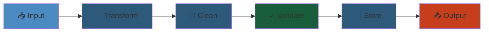

# 🔄 Content & Data Pipeline — Architecture Blueprint

> **Status:** v0.1 — Foundational  
> **Owner:** Platform Architecture Team  
> **Last Updated:** 2026-05-27

---




## 1. Overview


The Content & Data Pipeline transforms raw markdown source files into interactive, rendered experiences. It parses markdown into an AST, extracts metadata and relationships, compiles scene graphs for the Visualization Engine, indexes content for search, and publishes events for downstream consumers. The pipeline is event-driven, incremental, and designed for real-time content updates.

---

## 2. End-to-End Content Pipeline


```
 ┌──────────┐    ┌──────────┐    ┌──────────┐    ┌──────────┐    ┌──────────┐
 │  Source  │───▶│  Parser  │───▶│   AST    │───▶│  Scene   │───▶│ Renderer │
 │  Files   │    │          │    │Transform │    │  Graph   │    │          │
 └──────────┘    └──────────┘    └──────────┘    └──────────┘    └──────────┘
       │              │              │               │               │
       ▼              ▼              ▼               ▼               ▼
  data/**/*.md   remark/unified    Heading →       Sections →     DOM/Canvas/
  (git-backed)   + plugins         hierarchy       slide groups    SVG output
                                   Code blocks →   Interactive
                                   interactive     examples
                                   Links → graph   Links → edge
                                   relations       visualization
                                   Mermaid → live  Mermaid →
                                   diagram         draggable
```

---

## 3. Markdown Parser


### 3.1 Plugin Architecture


```
 ┌─────────────────────────────────────────────────────────────────────┐
 │                    UNIFIED/REMARK PIPELINE                           │
 │                                                                     │
 │  Input (md string)                                                    │
 │       │                                                             │
 │       ▼                                                             │
 │  ┌─────────────┐  ┌──────────────────────────────────────────────┐ │
 │  │  remark      │  │  Plugins (executed in order):                 │ │
 │  │  parse       │  │  1. remark-frontmatter  → extract YAML       │ │
 │  └─────────────┘  │  2. remark-gfm           → tables, strikethru │ │
 │       │           │  3. remark-code-titles   → code block labels  │ │
 │       ▼           │  4. remark-math          → LaTeX math blocks  │ │
 │  ┌─────────────┐  │  5. remark-mermaid       → mermaid code fence │ │
 │  │  mdast       │  │  6. remark-footnotes    → footnote defs      │ │
 │  │  (AST)       │  │  7. remark-images       → optimize images    │ │
 │  └─────────────┘  │  8. remark-directive     → custom containers  │ │
 │       │           │  9. remark-emoji         → emoji shortcodes   │ │
 │       ▼           └──────────────────────────────────────────────┘ │
 │  ┌─────────────┐                                                   │
 │  │  Stringify   │  ← Custom compiler transforms mdast → scene graph│
 │  │  / Compile   │                                                   │
 │  └─────────────┘                                                   │
 │       │                                                             │
 │       ▼                                                             │
 │  Output (React components / scene graph / metadata)                │
 └─────────────────────────────────────────────────────────────────────┘
```

### 3.2 Parser Configuration


```json
{
  "remarkPlugins": {
    "frontmatter": { "parseHeading": true },
    "gfm": true,
    "math": { "singleDollarTextMath": true },
    "mermaid": { "renderOnClient": true },
    "images": {
      "optimize": true,
      "maxWidth": 800,
      "formats": ["webp", "avif"]
    },
    "directives": {
      "tags": {
        "tip": { "icon": "💡", "className": "callout-tip" },
        "warning": { "icon": "⚠️", "className": "callout-warning" },
        "danger": { "icon": "🚨", "className": "callout-danger" }
      }
    }
  }
}
```

---

## 4. AST Transformer


```
 ┌─────────────────────────────────────────────────────────────────────┐
 │                       AST TRANSFORMATIONS                           │
 │                                                                     │
 │  Raw mdast ──▶  ┌─────────────────────────────────────────────────┐│
 │                  │  Heading Hierarchy Extractor                    ││
 │                  │  h1 → Topic (e.g., "Kafka Internals")          ││
 │                  │  h2 → Section (e.g., "Log Compaction")          ││
 │                  │  h3 → Subsection (e.g., "Cleanup Policies")    ││
 │                  │  Output: tree of {level, text, id, children}    ││
 │                  └─────────────────────────────────────────────────┘│
 │                              │                                      │
 │                              ▼                                      │
 │                  ┌─────────────────────────────────────────────────┐│
 │                  │  Code Block Classifier                          ││
 │                  │  Language detection from fences                 ││
 │                  │  Classification: config, code, output, diagram  ││
 │                  │  For each: add runnable/inspectable metadata    ││
 │                  └─────────────────────────────────────────────────┘│
 │                              │                                      │
 │                              ▼                                      │
 │                  ┌─────────────────────────────────────────────────┐│
 │                  │  Link Relationship Resolver                     ││
 │                  │  Internal links → resolve by slug               ││
 │                  │  External links → classify (doc, tool, paper)   ││
 │                  │  Dead link detection → broken link report       ││
 │                  └─────────────────────────────────────────────────┘│
 │                              │                                      │
 │                              ▼                                      │
 │                  ┌─────────────────────────────────────────────────┐│
 │                  │  Table Normalizer                               ││
 │                  │  Detect table type: feature-compare, config     ││
 │                  │  Add sort/filter capabilities                   ││
 │                  │  Extract key-value pairs from 2-column tables   ││
 │                  └─────────────────────────────────────────────────┘│
 │                              │                                      │
 │                              ▼                                      │
 │                  ┌─────────────────────────────────────────────────┐│
 │                  │  Metadata Extractor                              ││
 │                  │  From frontmatter + content analysis             ││
 │                  │  Title, description, tags, prerequisites,       ││
 │                  │  difficulty, estimated_time, topics             ││
 │                  └─────────────────────────────────────────────────┘│
 └─────────────────────────────────────────────────────────────────────┘
```

### 4.1 Code Block Classification


```typescript
interface ClassifiedCodeBlock {
  language: string
  content: string
  classification: CodeBlockType
  title?: string
  runnable: boolean
  inspectable: boolean
}

type CodeBlockType =
  | 'configuration'   // YAML, JSON, TOML, properties
  | 'implementation'  // Production code example
  | 'cli_command'     // Shell commands
  | 'output'          // Expected output (read-only)
  | 'diagram'         // Mermaid diagram
  | 'sql_query'       // Database query
  | 'diff'            // Before/after comparison
  | 'error'           // Error message/stacktrace

function classifyCodeBlock(language: string, content: string): CodeBlockType {
  if (['yaml', 'json', 'toml', 'xml', 'properties'].includes(language)) return 'configuration'
  if (['mermaid', 'dot', 'plantuml'].includes(language)) return 'diagram'
  if (language === 'sql') return 'sql_query'
  if (language === 'diff') return 'diff'
  if (content.startsWith('$ ') || content.startsWith('> ')) return 'cli_command'
  if (content.includes('Error:') || content.includes('Exception')) return 'error'
  if (content.match(/^\d{4}-\d{2}-\d{2}T/)) return 'output'  // log output
  return 'implementation'
}
```

---

## 5. Scene Graph Compiler


```
 ┌─────────────────────────────────────────────────────────────────────┐
 │                      SCENE GRAPH COMPILER                           │
 │                                                                     │
 │  Transformed AST ──▶                                                 │
 │                       │                                             │
 │                       ▼                                             │
 │    ┌───────────────────────────────────────────────────────────┐    │
 │    │  Section → Slide / Page Component                          │    │
 │    │  h2+content → collapsible section                          │    │
 │    │  Multiple h2 → tabbed view / page sections                 │    │
 │    └───────────────────────────────────────────────────────────┘    │
 │                                                                     │
 │    ┌───────────────────────────────────────────────────────────┐    │
 │    │  Code Block → Interactive Example                          │    │
 │    │  implementation → runnable code block (one-click exec)     │    │
 │    │  configuration → editable inline editor                    │    │
 │    │  cli_command → copy + run in browser terminal widget       │    │
 │    │  output → syntax-highlighted display                       │    │
 │    └───────────────────────────────────────────────────────────┘    │
 │                                                                     │
 │    ┌───────────────────────────────────────────────────────────┐    │
 │    │  Mermaid Block → Live Diagram                              │    │
 │    │  Render mermaid → SVG via mermaid.parse()                  │    │
 │    │  Make SVG interactive: click nodes, zoom, pan              │    │
 │    │  Add edit button: inline mermaid editor                    │    │
 │    └───────────────────────────────────────────────────────────┘    │
 │                                                                     │
 │    ┌───────────────────────────────────────────────────────────┐    │
 │    │  Table → Sortable Grid / Data Table                        │    │
 │    │  feature-compare → highlighted comparison grid             │    │
 │    │  config → editable parameter table                         │    │
 │    │  Add search, sort, column hide                             │    │
 │    └───────────────────────────────────────────────────────────┘    │
 │                                                                     │
 │    ┌───────────────────────────────────────────────────────────┐    │
 │    │  List → Step Sequence / Stepper                            │    │
 │    │  Numbered list → stepper widget with progress              │    │
 │    │  Bullet list → card grid                                   │    │
 │    └───────────────────────────────────────────────────────────┘    │
 │                                                                     │
 │    ┌───────────────────────────────────────────────────────────┐    │
 │    │  Callouts → Highlighted Callout Cards                      │    │
 │    │  :::tip → 💡 blue callout                                   │    │
 │    │  :::warning → ⚠️ yellow callout                              │    │
 │    │  :::danger → 🚨 red callout                                  │    │
 │    └───────────────────────────────────────────────────────────┘    │
 └─────────────────────────────────────────────────────────────────────┘
```

---

## 6. Content Types


| Type | Description | Rendering Strategy |
|------|-------------|-------------------|
| **article** | Full-length deep dive | Multi-section page with TOC |
| **tutorial** | Step-by-step guide | Stepper widget, progress bar |
| **reference** | API docs, config options | Searchable table of contents |
| **cheat-sheet** | Quick reference | Compact card grid |
| **scenario** | Simulation scenario | SimRunner + visual dashboard |
| **quiz** | Knowledge check | Interactive quiz widget |
| **lab** | Guided hands-on | Split pane: instructions + terminal |
| **architecture-map** | System diagram | Interactive topology map |
| **protocol-flow** | Network protocol | Step-by-step packet visualizer |
| **simulation** | Runnable sim | Embedded SimRunner |
| **interview-qa** | Interview Q&A | Accordion: question → answer |

### 6.1 Content Type Detection


```typescript
function detectContentType(frontmatter: Frontmatter, ast: Root): ContentType {
  if (frontmatter.type) return frontmatter.type as ContentType

  // Heuristic detection
  if (frontmatter.tags?.includes('tutorial')) return 'tutorial'
  if (ast.children.some(n => n.type === 'code' && n.lang === 'mermaid')) {
    if (containsSimulationKeywords(ast)) return 'simulation'
    return 'architecture-map'
  }
  if (frontmatter.tags?.includes('quiz')) return 'quiz'
  if (ast.children.some(n => isOrderedListWithInstructions(n))) return 'lab'
  if (hasQAFormat(ast)) return 'interview-qa'

  return 'article'  // default
}
```

---

## 7. Metadata Extraction


```typescript
interface ContentMetadata {
  // From frontmatter
  title: string
  description: string
  tags: string[]
  prerequisites: string[]      // slugs of prerequisite topics
  topics: string[]             // graph topic associations
  difficulty: 'beginner' | 'intermediate' | 'advanced' | 'expert'
  estimated_time: number       // minutes
  author: string
  date: string                 // ISO date
  version: number
  status: 'draft' | 'review' | 'published' | 'archived'

  // Extracted from content
  word_count: number
  code_block_count: number
  internal_links: string[]     // resolved slugs
  external_links: string[]
  images: string[]
  mermaid_diagrams: string[]
  concepts_mentioned: string[] // extracted concept names
  has_prerequisites_section: boolean
  has_related_section: boolean
}

// Extraction logic
function extractMetadata(filePath: string, rawContent: string): ContentMetadata {
  const { frontmatter, ast } = parseMarkdown(rawContent)

  return {
    title: frontmatter.title || extractTitleFromAst(ast),
    description: frontmatter.description || extractFirstParagraph(ast),
    tags: frontmatter.tags || extractTagsFromContent(ast),
    prerequisites: frontmatter.prerequisites || extractPrerequisites(ast),
    topics: frontmatter.topics || classifyTopic(filePath, ast),
    difficulty: frontmatter.difficulty || estimateDifficulty(ast),
    estimated_time: frontmatter.estimated_time || estimateReadingTime(ast),
    author: frontmatter.author || 'unknown',
    date: frontmatter.date || getGitDate(filePath),
    version: frontmatter.version || 1,
    status: frontmatter.status || 'published',
    word_count: countWords(ast),
    code_block_count: countCodeBlocks(ast),
    internal_links: resolveInternalLinks(ast),
    external_links: extractExternalLinks(ast),
    images: extractImages(ast),
    mermaid_diagrams: extractMermaid(ast),
    concepts_mentioned: extractConcepts(ast),
    has_prerequisites_section: hasSection(ast, 'prerequisites'),
    has_related_section: hasSection(ast, 'related'),
  }
}
```

---

## 8. Content Versioning


```
 ┌─────────────────────────────────────────────────────────────────────┐
 │                    CONTENT VERSIONING (Git-based)                    │
 │                                                                     │
 │  ┌─────────────────────────────────────────────────────────────┐    │
 │  │  Git History                                                  │    │
 │  │                                                               │    │
 │  │  commit abc123  "Add Kafka producer deep dive"  ──▶ v3       │    │
 │  │  commit def456  "Fix ISR description error"      ──▶ v2       │    │
 │  │  commit ghi789  "Initial Kafka internals"        ──▶ v1       │    │
 │  │                                                               │    │
 │  │  For each file, track:                                        │    │
 │  │  • Version = # of commits touching this file                  │    │
 │  │  • History of changes (via git log --follow)                  │    │
 │  │  • Blame annotations per line                                 │    │
 │  └─────────────────────────────────────────────────────────────┘    │
 │                                                                     │
 │  ┌─────────────────────────────────────────────────────────────┐    │
 │  │  Version Comparison UI                                        │    │
 │  │                                                               │    │
 │  │  ┌─────────────────────────────────────────────────────────┐ │    │
 │  │  │ ─ ISR stands for In-Sync Replicas                       │ │    │
 │  │  │ + ISR = subset of replicas that are fully caught up     │ │    │
 │  │  │   with the leader                                        │ │    │
 │  │  └─────────────────────────────────────────────────────────┘ │    │
 │  │                                                               │    │
 │  │  • Side-by-side diff view                                    │    │
 │  │  • One-click rollback to previous version                     │    │
 │  │  • Automatic changelog generation per file                    │    │
 │  └─────────────────────────────────────────────────────────────┘    │
 └─────────────────────────────────────────────────────────────────────┘
```

---

## 9. Search Indexing Pipeline


```
 Content Change Event (Kafka)
         │
         ▼
 ┌────────────────┐
 │  Reindex       │  Check if content actually changed (hash comparison)
 │  Trigger       │
 └───────┬────────┘
         │
         ▼
 ┌────────────────┐
 │  Chunking      │  Split content into overlapping chunks
 │                │  • 512 tokens with 64-token overlap
 │                │  • Chunk strategies: paragraph, section, sentence
 └───────┬────────┘
         │
         ▼
 ┌────────────────┐
 │  Embedding     │  Generate vector embedding for each chunk
 │                │  • OpenAI text-embedding-3-small (1536d)
 │                │  • Or BGE-M3 (1024d) for local
 └───────┬────────┘
         │
         ▼
 ┌────────────────┐
 │  Vector Upsert │  Upsert to Neo4j vector index
 │                │  • Batch upsert (100 chunks/batch)
 │                │  • Delete old embeddings for same content
 └───────┬────────┘
         │
         ▼
 ┌────────────────┐
 │  FTS Reindex   │  Update PostgreSQL full-text search
 │                │  • tsvector column on content_chunks table
 │                │  • Weighted by position (title > heading > body)
 └───────┬────────┘
         │
         ▼
 ┌────────────────┐
 │  Graph Update  │  Update knowledge graph relationships
 │                │  • Re-extract entities and relations
 │                │  • Add/remove edges as needed
 └────────────────┘
```

---

## 10. Event-Driven Architecture


```
 ┌─────────────────────────────────────────────────────────────────────┐
 │                    KAFKA EVENT TOPICS                                │
 │                                                                     │
 │  ┌──────────────────────┐  ┌──────────────────────────────────┐     │
 │  │  content.changed     │  │  { filePath, action, hash,       │     │
 │  │                      │  │    version, frontmatter }         │     │
 │  └──────────┬───────────┘  └──────────────────────────────────┘     │
 │             │                                                       │
 │             ├──────────────────────────────────────────────┐        │
 │             │                                              │        │
 │             ▼                                              ▼        │
 │  ┌──────────────────────┐                     ┌──────────────────┐  │
 │  │  Search Indexer      │                     │  Knowledge Graph │  │
 │  │  (Consumer Group)    │                     │  Updater         │  │
 │  └──────────────────────┘                     └──────────────────┘  │
 │             │                                              │        │
 │             ▼                                              ▼        │
 │  ┌──────────────────────┐                     ┌──────────────────┐  │
 │  │  Reindex chunks      │                     │  Parse + extract │  │
 │  │  Update embeddings   │                     │  Upsert nodes    │  │
 │  └──────────────────────┘                     └──────────────────┘  │
 │                                                                     │
 │  ┌──────────────────────┐  ┌──────────────────────────────────┐     │
 │  │  content.published   │  │  { filePath, version, timestamp }│     │
 │  └──────────┬───────────┘  └──────────────────────────────────┘     │
 │             │                                                       │
 │             ▼                                                       │
 │  ┌──────────────────────┐                                          │
 │  │  CDN Cache Invalidate│  Purge CloudFront/CDN cache              │
 │  └──────────────────────┘                                          │
 │                                                                     │
 │  ┌──────────────────────┐  ┌──────────────────────────────────┐     │
 │  │  content.deprecated  │  │  { filePath, replacement_slug }  │     │
 │  └──────────┬───────────┘  └──────────────────────────────────┘     │
 │             │                                                       │
 │             ▼                                                       │
 │  ┌──────────────────────┐                                          │
 │  │  Redirect Setup      │  Add 301 redirect to new content         │
 │  └──────────────────────┘                                          │
 └─────────────────────────────────────────────────────────────────────┘
```

---

## 11. Content Scheduling


```json
{
  "content_lifecycle": {
    "draft": {
      "visibility": "editors_only",
      "searchable": false,
      "url_prefix": "/drafts/"
    },
    "review": {
      "visibility": "reviewers_only",
      "searchable": false,
      "notification": "slack #content-review"
    },
    "scheduled": {
      "visibility": "editors_only",
      "publish_at": "2026-06-15T09:00:00Z",
      "searchable": false
    },
    "published": {
      "visibility": "public",
      "searchable": true,
      "url_prefix": "/learn/"
    },
    "deprecated": {
      "visibility": "public_with_banner",
      "searchable": true,
      "banner": "This content is deprecated. See [replacement](/learn/new-topic)"
    },
    "archived": {
      "visibility": "404",
      "searchable": false,
      "redirect": "/learn/new-topic"
    }
  }
}

// Content scheduler cron: every 5 minutes
async function processScheduledContent(): Promise<void> {
  const now = new Date()
  const toPublish = await db.query(
    `SELECT * FROM content WHERE status = 'scheduled' AND publish_at <= $1`,
    [now]
  )

  for (const content of toPublish) {
    await publishContent(content.id)
    await kafka.produce('content.published', {
      filePath: content.file_path,
      version: content.version,
      timestamp: now.toISOString(),
    })
  }
}
```

---

## 12. Multi-Format Export


```typescript
interface ExportService {
  exportPDF(contentId: string, options?: PDFOptions): Promise<Buffer>
  exportEPUB(contentId: string, options?: EPUBOptions): Promise<Buffer>
  exportHTML(contentId: string, options?: HTMLOptions): Promise<string>
  exportJSON(contentId: string): Promise<ContentJSON>
  exportOpenAPI(contentId: string): Promise<OpenAPIObject>
}

// PDF export pipeline
async function exportPDF(contentId: string): Promise<Buffer> {
  // 1. Load content from DB
  const content = await contentService.getContent(contentId)

  // 2. Render to HTML with print-specific CSS
  const html = await renderToHTML(content, {
    template: 'print',
    styles: ['print.css'],
    includeTOC: true,
    includeDiagrams: true,
  })

  // 3. Convert to PDF via Puppeteer
  const browser = await puppeteer.launch({ headless: true })
  const page = await browser.newPage()
  await page.setContent(html)
  const pdf = await page.pdf({
    format: 'A4',
    printBackground: true,
    margin: { top: '2cm', bottom: '2cm', left: '2cm', right: '2cm' },
  })
  await browser.close()

  return pdf
}
```

---

## 13. Pipeline Performance Targets


| Stage | Target | Strategy |
|-------|--------|----------|
| File parsing (100KB) | < 50ms | remark synchronous parse |
| AST transform (100KB) | < 100ms | Single pass, O(n) |
| Scene graph compile | < 200ms | Lazy evaluation, memoization |
| Embedding generation | < 500ms | Batch API call, cache |
| Full reindex (all files) | < 5 min | Parallel workers, batch upsert |
| Incremental update (1 file) | < 2s | Event-driven, targeted reindex |
| PDF export (10 pages) | < 3s | Headless Chrome, parallel |
| Content diff display | < 200ms | Unified diff, syntax highlight |
