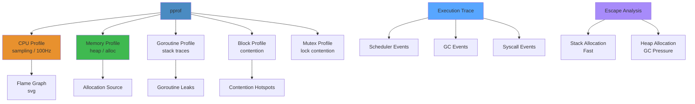

# Go Profiling Cheat Sheet




Go performance profiling with pprof, tracing, escape analysis, and memory/CPU/goroutine analysis.

**Cross-refs**: `03-backend/go/03-go-profiling-performance-debugging.md`, `03-backend/go/01-goroutines-channels-concurrency.md`, `03-backend/go/02-go-scheduler-memory-gc.md`, `18-performance-engineering/profiling/01-profiling-deep-dive.md`

## Quick Start


```go
import _ "net/http/pprof"   // register /debug/pprof/ handlers

// Or in a non-HTTP app:
import "runtime/pprof"
```

```bash
go tool pprof http://localhost:6060/debug/pprof/profile?seconds=30   # CPU
go tool pprof http://localhost:6060/debug/pprof/heap                 # Memory (inuse)
go tool pprof http://localhost:6060/debug/pprof/goroutine            # Goroutines
go tool pprof http://localhost:6060/debug/pprof/block                # Blocking
go tool pprof http://localhost:6060/debug/pprof/mutex                # Mutex contention
go tool pprof http://localhost:6060/debug/pprof/allocs               # Memory (cumulative)
```

## pprof Interactive Commands


```bash
# Enter pprof shell
go tool pprof cpu.prof

(pprof) top10                       # Top 10 by samples
(pprof) top10 -cum                  # Top 10 by cumulative
(pprof) list functionName           # Source with line-level samples
(pprof) weblist functionName        # Web-served annotated source
(pprof) peek functionName           # Callers/callees
(pprof) svg                         # SVG flame graph
(pprof) web                         # Interactive call graph
(pprof) disasm functionName         # Assembly with samples
(pprof) traces                      # All stack traces
(pprof) tree                        | Call tree

# Compare profiles
go tool pprof -base base.prof new.prof   # Delta view
```

## CPU Profiling


```bash
# 30-second CPU profile
curl -s http://localhost:6060/debug/pprof/profile?seconds=30 > cpu.prof
go tool pprof -http=:8080 cpu.prof   # Web UI

# Programmatic
f, _ := os.Create("cpu.prof")
pprof.StartCPUProfile(f)
defer pprof.StopCPUProfile()
```

```bash
# What to look for:
# - Functions with high flat (self) time → hot loops, tight computation
# - Functions with high cum (cumulative) time → called many times, big alloc
# - unexpected GC time in CPU profile → runtime.mallocgc in top
```

## Memory Profiling


```bash
# In-use memory (current)
curl -s http://localhost:6060/debug/pprof/heap > heap.prof
go tool pprof -inuse_space heap.prof          # Current heap usage
go tool pprof -inuse_objects heap.prof        # Object count

# Cumulative allocations (since start)
curl -s http://localhost:6060/debug/pprof/heap > heap.prof
go tool pprof -alloc_space heap.prof          # Total bytes allocated
go tool pprof -alloc_objects heap.prof        # Total objects allocated

# Diff two heap profiles
go tool pprof -base heap_start.prof heap_end.prof
```

```bash
# What to look for:
# - High inuse_space not explained by cache → memory leak
# - High alloc_space / alloc_objects → allocation pressure, GC stress
# - runtime.makeslice, runtime.newobject in top → too many allocs
```

## Goroutine Analysis


```go
// Web UI already shows count
// Or dump raw stack traces:
curl -s http://localhost:6060/debug/pprof/goroutine?debug=2 > goroutines.txt
```

```bash
# Profile goroutines
go tool pprof http://localhost:6060/debug/pprof/goroutine

# In pprof shell:
(pprof) top      # Shows which stack traces have most goroutines
(pprof) list     # Source view

# Programmatic dump
pprof.Lookup("goroutine").WriteTo(os.Stdout, 2)
```

```bash
# What to look for:
# - Thousands waiting on same channel/sync.Mutex → contention
# - Goroutines stuck in runtime.gopark → blocked on I/O, chan, lock
# - Growing goroutine count over time → leak (forgotten I/O, endless loops)
```

## Block & Mutex Profiling


```go
import "runtime"

// Enable profiling at init
runtime.SetBlockProfileRate(1)    // Track all blocking events
runtime.SetMutexProfileFraction(1) // Track all mutex holders
```

```bash
# Block profile (waiting on channels, locks)
go tool pprof http://localhost:6060/debug/pprof/block

# Mutex profile (contention)
go tool pprof http://localhost:6060/debug/pprof/mutex
```

## Execution Tracer


```go
// Programmatic
f, _ := os.Create("trace.out")
defer f.Close()
trace.Start(f)
defer trace.Stop()
```

```bash
# 5-second trace via HTTP
curl -s http://localhost:6060/debug/pprof/trace?seconds=5 > trace.out

# Analyze
go tool trace trace.out

# Key trace views:
# - View trace: Timeline (goroutine states, network, GC)
# - Goroutine analysis: Which goroutines exist, total execution time
# - Network blocking: I/O bottlenecks
# - Synchronization blocking: Lock contention
# - Syscall profiling: System call overhead
# - Scheduler latency profiler: P execution delays
# - User-defined tasks: Regions/latencies

# Trace should be RAREZ ≤1% of runtime, 5-30s capture
```

## Benchstat


```bash
# Run benchmarks twice and compare
go test -bench=. -count=10 > old.txt
# <make change>
go test -bench=. -count=10 > new.txt

go install golang.org/x/perf/cmd/benchstat@latest
benchstat old.txt new.txt

# Output:
#                     │  old.txt   │  new.txt   │
#                     │  sec/op    │  sec/op    │   vs base
# BenchmarkMyFunc-8   123.4n × ∞  100.2n × ∞   -18.8% (p=0.000 n=10)

# - p < 0.05 = statistically significant
# - ≠ or ~ shows if change is significant
```

## Escape Analysis


```bash
# Check what escapes to heap
go build -gcflags="-m -m" ./... 2>&1 | grep "escapes to heap\|moved to heap\|does not escape"

# Focused check on a specific function
go build -gcflags="-m -m -l" ./pkg 2>&1 | grep "myFunction"

# Visual escape analysis
go build -gcflags="-m -l" ./pkg 2>&1 | less
```

```bash
# Patterns that cause escapes:
# - Returning pointers to local variables
# - Storing in interface{} (any)
# - Global variables (even inside closures)
# - Passing to fmt.Printf / fmt.Sprintf
# - Goroutine closures that capture local vars
# - Slices that grow past capacity (append forces realloc to heap)

# Patterns that stay on stack:
# - Value receivers (non-pointer)
# - Small fixed-size arrays on stack
# - Local variables that never escape
```

## Common Profile Workflows


```bash
# CPU hotspot
curl -o cpu.prof http://localhost:6060/debug/pprof/profile?seconds=30
go tool pprof -http=:8080 cpu.prof
# Focus: flat/cum columns, flame graph

# Memory leak
curl -o heap1.prof http://localhost:6060/debug/pprof/heap
# ... wait or trigger load ...
curl -o heap2.prof http://localhost:6060/debug/pprof/heap
go tool pprof -base heap1.prof heap2.prof
(pprof) top

# High GC overhead
# If CPU profile shows runtime.gcBgMarkWorker / runtime.mallocgc in top:
# 1. Do memory profile → find allocation sources
# 2. Fix by reusing objects, pooling, or reducing escapes
curl -o heap.prof http://localhost:6060/debug/pprof/heap
go tool pprof -alloc_space heap.prof

# Goroutine leak
curl -o gor.prof http://localhost:6060/debug/pprof/goroutine
go tool pprof gor.prof
# Or look for increasing count: while true; do
#   curl -s http://localhost:6060/debug/pprof/goroutine?debug=2 | grep "^goroutine" | wc -l
#   sleep 1
# done

# Contention
curl -o block.prof http://localhost:6060/debug/pprof/block
go tool pprof -http=:8080 block.prof
```

## Anti-Patterns


| Anti-Pattern | Why It Hurts | Fix |
|-------------|-------------|-----|
| Profiling production without rate limiting | Collects too much, GC thrash | Use `-seconds=30`, sampling rate |
| Ignoring `-base` for memory leaks | Can't see growth | Always diff two heap profiles |
| Profiling CPU without load | Meaningless flat profile | Profile under realistic load |
| Only pprof, never `trace` | Misses goroutine scheduling bugs | Use `trace` for concurrency issues |
| Benchmark with `-count=1` | Noise hides real changes | `-count=10` + benchstat |
| `int` vs `int32` local var on stack | No perf impact | Focus on allocs, not micro-opt |
| Hyper-optimizing escape analysis | Readability suffers | Accept escapes unless in hot path |
| Not disabling inlining for `-m` output | Missing escape edges | Add `-l` flag with `-m` |

## Key Metrics


| Metric | Source | What It Tells |
|--------|--------|--------------|
| GC CPU % | `debug.ReadGCStats` | >25% = allocation problem |
| Heap objects | pprof `inuse_objects` | Object retention |
| Alloc rate | pprof `alloc_space/sec` | Allocation pressure |
| Goroutines | `runtime.NumGoroutine()` | >10k = likely leak or design issue |
| Next GC | `runtime.MemStats.NextGC` | Heap target before GC |
| Pause time / cycle | `trace` / `ReadGCStats` | Latency impact |
| Mutex wait time | pprof mutex | Contention hotspots |
| sched latency | `trace` → scheduler | P execution delays |

## Profile Type Comparison

| Profile | Target | Frequency | Default | Use Case |
|---|---|---|---|---|
| **CPU** | Function execution time | 100 Hz (10ms) | On | Find hot functions |
| **Heap** | Memory allocations | On `pprof.WriteHeapProfile` | Only in tests | Find allocation sources |
| **Goroutine** | Goroutine stack traces | On demand | Off | Detect goroutine leaks |
| **Block** | Contention on sync primitives | On demand | Off | Find lock contention |
| **Mutex** | Mutex hold times | On demand | Off | Find long-held locks |
| **Threadcreate** | OS thread creation | On demand | Off | Detect thread explosion |

## pprof Commands Cheat Sheet

```bash
# CPU profile (30s)
go test -cpuprofile cpu.prof -bench .
go tool pprof -http=:8080 cpu.prof

# Memory profile
go test -memprofile mem.prof -bench .
go tool pprof -top -show=MyFunc mem.prof

# Combine benchmarks
go test -bench . -cpuprofile cpu.prof -memprofile mem.prof

# Interactive CLI
go tool pprof cpu.prof
(pprof) top10
(pprof) web           # SVG flame graph in browser
(pprof) list MyFunc   # annotated source
```

## Benchmarks Best Practices

| Practice | Why | How |
|---|---|---|
| **Stable machine** | Avoid noise from other processes | Run on idle dedicated instance |
| **Benchstat** | Statistical significance | `go get golang.org/x/perf/cmd/benchstat` |
| **Warmup** | JIT / cache warmup | `-benchtime=5s` |
| **Reset timer** | Exclude setup overhead | `b.ResetTimer()` after setup |
| **Report allocs** | Memory matters | Add `-benchmem` flag |

## Related

- [Readme](/18-performance-engineering/README.md)
- [Jvm Performance](/18-performance-engineering/jvm-tuning/01-jvm-performance.md)
- [Optimization Patterns](/18-performance-engineering/optimization/01-optimization-patterns.md)
- [Profiling Deep Dive](/18-performance-engineering/profiling/01-profiling-deep-dive.md)
- [Readme](/03-backend/README.md)
- [Goroutines Channels Concurrency](/03-backend/go/01-goroutines-channels-concurrency.md)
