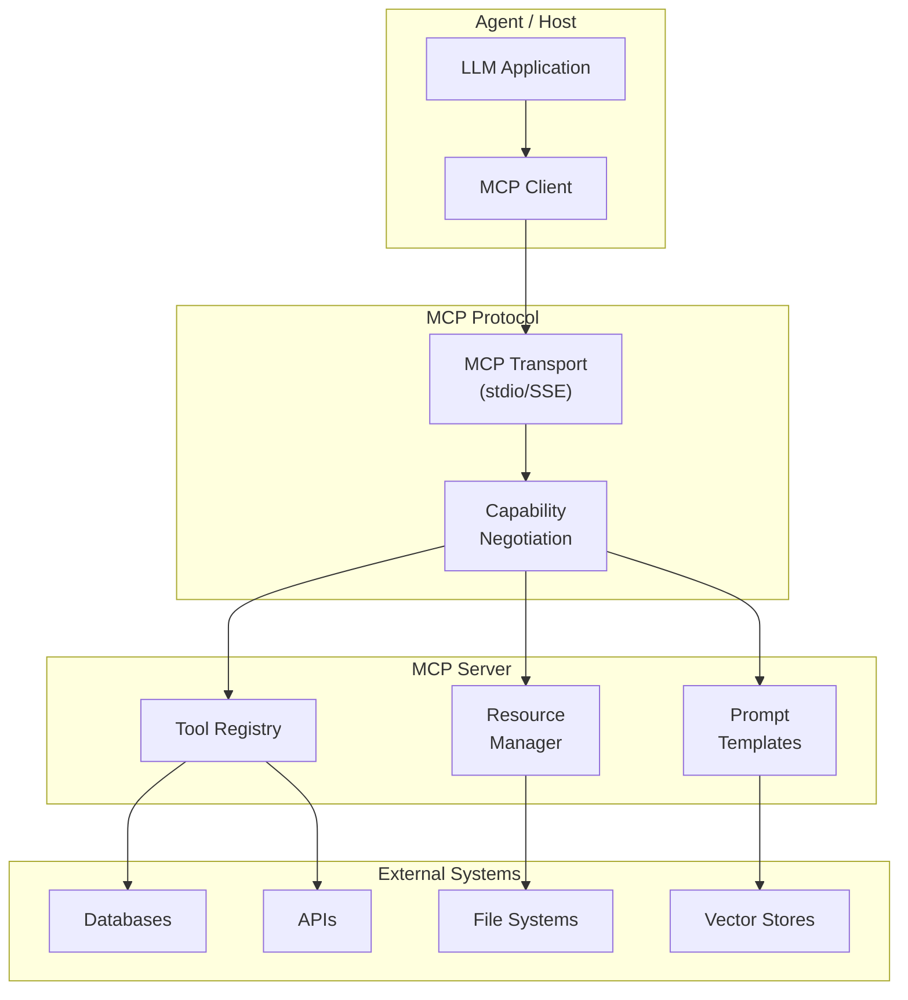

# AI Agents: Fundamentals and Engineering

## 1. AI Agent Architecture

### 1.1 The Perception-Reasoning-Action Loop

An AI agent repeatedly perceives its environment, reasons about it, and acts upon it.

```mermaid
graph TD
    A["🌍 Environment"] -->|Perception<br/>observe state| B["👁️ Perception<br/>parse input<br/>gather state"]
    B -->|sensor data| C["🧠 Reasoning<br/>LLM thinks<br/>plans, decides"]
    C -->|decision| D["⚙️ Action<br/>call tools<br/>produce output"]
    D -->|execute| E["📊 Observe<br/>result of action"]
    E -->|feedback| A
    
    style A fill:#1a3a52
    style B fill:#2d5a7b
    style C fill:#4a8bc2
    style D fill:#2d5a7b
    style E fill:#1a3a52
```



```python
from abc import ABC, abstractmethod
from dataclasses import dataclass
from typing import Any, Dict, List, Optional
import json

@dataclass
class Observation:
    content: str
    role: str
    metadata: Optional[Dict] = None

@dataclass
class Action:
    name: str
    args: Dict[str, Any]
    result: Optional[Any] = None

class BaseAgent(ABC):
    def __init__(self, system_prompt: str):
        self.system_prompt = system_prompt
        self.memory: List[Observation] = []
        self.state: Dict = {}

    @abstractmethod
    def perceive(self, observation: Observation):
        pass

    @abstractmethod
    def reason(self) -> str:
        pass

    @abstractmethod
    def act(self, decision: str) -> Action:
        pass

    def step(self, observation: Observation):
        self.perceive(observation)
        decision = self.reason()
        action = self.act(decision)
        return action


class SimpleReActAgent(BaseAgent):
    def __init__(self, system_prompt: str, llm_callable):
        super().__init__(system_prompt)
        self.llm = llm_callable
        self.max_steps = 10

    def perceive(self, observation: Observation):
        self.memory.append(observation)

    def reason(self) -> str:
        messages = [{"role": "system", "content": self.system_prompt}]
        for obs in self.memory:
            messages.append({"role": obs.role, "content": obs.content})
        response = self.llm(messages)
        return response

    def act(self, decision: str) -> Action:
        if "Action:" in decision:
            action_line = decision.split("Action:")[1].strip()
            tool_name = action_line.split("(")[0]
            args_str = action_line.split("(")[1].rstrip(")")
            args = json.loads(args_str)
            return Action(name=tool_name, args=args)
        else:
            return Action(name="final_answer", args={"content": decision})
```

### 1.2 Agent State Machine

```python
from enum import Enum

class AgentState(Enum):
    IDLE = "idle"
    THINKING = "thinking"
    ACTING = "acting"
    OBSERVING = "observing"
    COMPLETED = "completed"
    ERROR = "error"

class StatefulAgent:
    def __init__(self, system_prompt):
        self.state = AgentState.IDLE
        self.system_prompt = system_prompt
        self.conversation_history = []
        self.current_plan = []

    def transition(self, new_state: AgentState):
        print(f"State: {self.state.value} -> {new_state.value}")
        self.state = new_state

    def run(self, task: str) -> str:
        self.transition(AgentState.THINKING)
        plan = self.create_plan(task)
        self.current_plan = plan
        for step in plan:
            self.transition(AgentState.ACTING)
            result = self.execute_step(step)
            self.transition(AgentState.OBSERVING)
            self.process_result(result)
        self.transition(AgentState.COMPLETED)
        return self.summarize()

    def create_plan(self, task):
        prompt = f"Break this task into sequential steps:\n{task}"
        response = self.llm(prompt)
        steps = self.parse_steps(response)
        return steps
```

## 2. ReAct Pattern

### 2.1 Standard ReAct

ReAct interleaves reasoning traces (Thought) with actions and observations:

```
Thought: I need to find the current weather in London.
Action: search(query="London weather 2026")
Observation: London is currently 18C and partly cloudy.

Thought: The user asked if they need an umbrella.
Action: search(query="London weather forecast today rain probability")
Observation: 30% chance of rain in the afternoon.

Thought: 30% chance is moderate. Recommend umbrella.
Final Answer: You should bring an umbrella.
```

```python
class ReActAgent:
    def __init__(self, llm, tools):
        self.llm = llm
        self.tools = {t.name: t for t in tools}
        self.max_iterations = 15

    def run(self, question: str):
        thoughts = []
        actions = []
        for step in range(self.max_iterations):
            prompt = self.build_react_prompt(question, thoughts, actions)
            response = self.llm(prompt)
            if "Final Answer:" in response:
                return response.split("Final Answer:")[1].strip()
            thought = self.extract_thought(response)
            if thought:
                thoughts.append(thought)
            action_info = self.parse_action(response)
            if action_info:
                tool_name, args = action_info
                actions.append({"action": tool_name, "args": args})
                result = self.execute_tool(tool_name, args)
                actions[-1]["result"] = result
        return "Max iterations reached."

    def build_react_prompt(self, question, thoughts, actions):
        prompt = f"Question: {question}\n\n"
        for t, a in zip(thoughts, actions):
            prompt += f"Thought: {t}\n"
            if a.get("action"):
                prompt += f"Action: {a['action']}({json.dumps(a['args'])})\n"
                prompt += f"Observation: {a.get('result', '')}\n"
        prompt += "Thought: "
        return prompt

    def extract_thought(self, response):
        if "Thought:" in response:
            return response.split("Thought:")[1].split("Action:")[0].strip() if "Action:" in response else ""
        return None

    def parse_action(self, response):
        import re
        match = re.search(r'Action:\s*(\w+)\(([^)]*)\)', response)
        if match:
            tool_name = match.group(1)
            args_str = match.group(2)
            if args_str.strip():
                args = json.loads("{" + args_str + "}")
            else:
                args = {}
            return tool_name, args
        return None

    def execute_tool(self, name, args):
        if name in self.tools:
            return self.tools[name].execute(**args)
        return f"Error: Unknown tool '{name}'"
```

## 3. Tool Calling

### 3.1 Tool Definition

```python
from typing import Callable, get_type_hints
import inspect

class Tool:
    def __init__(self, name: str, description: str, fn: Callable):
        self.name = name
        self.description = description
        self.fn = fn
        self.parameters = self.extract_parameters()

    def extract_parameters(self):
        sig = inspect.signature(self.fn)
        hints = get_type_hints(self.fn)
        properties = {}
        required = []
        for name, param in sig.parameters.items():
            properties[name] = {
                "type": self.pytype_to_json(hints.get(name, str)),
                "description": f"Parameter {name}"
            }
            if param.default is inspect.Parameter.empty:
                required.append(name)
        return {"type": "object", "properties": properties, "required": required}

    def pytype_to_json(self, t):
        mapping = {str: "string", int: "integer", float: "number", bool: "boolean", list: "array", dict: "object"}
        return mapping.get(t, "string")

    def to_openai_format(self):
        return {"type": "function", "function": {"name": self.name, "description": self.description, "parameters": self.parameters}}

    def execute(self, **kwargs):
        return self.fn(**kwargs)


def search_web(query: str) -> str:
    return f"Search results for '{query}': [simulated results]"

def calculate(expression: str) -> str:
    try:
        return f"Result: {eval(expression)}"
    except Exception as e:
        return f"Error: {e}"

def get_weather(city: str, units: str = "celsius") -> str:
    return f"Weather in {city}: 22 degrees, partly cloudy"

def send_email(to: str, subject: str, body: str) -> str:
    return f"Email sent to {to} with subject '{subject}'"

tools = [
    Tool("search_web", "Search the web for current information", search_web),
    Tool("calculate", "Evaluate mathematical expressions", calculate),
    Tool("get_weather", "Get weather for a city", get_weather),
    Tool("send_email", "Send an email message", send_email),
]
```

### 3.2 Function Calling with LLM APIs

```python
class ToolExecutor:
    def __init__(self, tools: List[Tool]):
        self.tools = {t.name: t for t in tools}

    def execute(self, tool_name: str, arguments: Dict) -> str:
        if tool_name not in self.tools:
            return f"Error: tool '{tool_name}' not found"
        tool = self.tools[tool_name]
        try:
            return str(tool.execute(**arguments))
        except Exception as e:
            return f"Error executing {tool_name}: {str(e)}"


class LLMWithTools:
    def __init__(self, llm_client, tools: List[Tool]):
        self.client = llm_client
        self.tool_executor = ToolExecutor(tools)
        self.tool_defs = [t.to_openai_format() for t in tools]

    def run(self, messages: List[Dict]) -> str:
        response = self.client.chat(messages=messages, tools=self.tool_defs, tool_choice="auto")
        if response.choices[0].finish_reason == "tool_calls":
            tool_call = response.choices[0].message.tool_calls[0]
            tool_name = tool_call.function.name
            arguments = json.loads(tool_call.function.arguments)
            result = self.tool_executor.execute(tool_name, arguments)
            messages.append(response.choices[0].message)
            messages.append({"role": "tool", "tool_call_id": tool_call.id, "content": result})
            return self.run(messages)
        return response.choices[0].message.content
```

## 4. Memory Systems

### 4.1 Short-Term Memory (Context Window)

```python
class ShortTermMemory:
    def __init__(self, max_tokens: int = 4096):
        self.max_tokens = max_tokens
        self.messages: List[Dict] = []

    def add(self, role: str, content: str):
        self.messages.append({"role": role, "content": content})
        self.trim()

    def trim(self):
        while self.estimate_tokens() > self.max_tokens:
            for i, msg in enumerate(self.messages):
                if msg["role"] in ("user", "assistant"):
                    self.messages.pop(i)
                    break

    def estimate_tokens(self, text: str = None):
        if text is None:
            return sum(len(m["content"]) // 3 for m in self.messages)
        return len(text) // 3

    def get_context(self, recent_first: bool = False):
        if recent_first:
            return list(reversed(self.messages))
        return self.messages


class SlidingWindowMemory:
    def __init__(self, max_recent: int = 10):
        self.max_recent = max_recent
        self.recent_messages = []
        self.summary = ""

    def add(self, message):
        self.recent_messages.append(message)
        if len(self.recent_messages) > self.max_recent * 2:
            self.compress()

    def compress(self):
        older = self.recent_messages[:-self.max_recent]
        summary_prompt = f"Summarize these messages:\n{json.dumps(older)}"
        new_summary = self.llm(summary_prompt)
        self.summary = new_summary if not self.summary else f"{self.summary}\n{new_summary}"
        self.recent_messages = self.recent_messages[-self.max_recent:]
```

### 4.2 Long-Term Memory (RAG / Vector Store)

```python
class VectorMemory:
    def __init__(self, embedding_fn, top_k: int = 5):
        self.embedding_fn = embedding_fn
        self.top_k = top_k
        self.vectors = {}
        self.texts = {}
        self.metadata = {}

    def add(self, text: str, metadata: Dict = None):
        doc_id = str(hash(text))
        if doc_id not in self.vectors:
            self.vectors[doc_id] = self.embedding_fn(text)
            self.texts[doc_id] = text
            self.metadata[doc_id] = metadata or {}

    def search(self, query: str, top_k: int = None):
        k = top_k or self.top_k
        query_emb = self.embedding_fn(query)
        similarities = []
        for doc_id, emb in self.vectors.items():
            sim = np.dot(query_emb, emb) / (np.linalg.norm(query_emb) * np.linalg.norm(emb))
            similarities.append((doc_id, sim))
        similarities.sort(key=lambda x: x[1], reverse=True)
        results = []
        for doc_id, sim in similarities[:k]:
            results.append({"text": self.texts[doc_id], "score": sim, "metadata": self.metadata[doc_id]})
        return results

    def consolidate(self, agent_llm):
        all_texts = list(self.texts.values())
        if len(all_texts) > 100:
            chunk = "\n".join(all_texts[:50])
            summary = agent_llm(f"Summarize these memories:\n{chunk}")
            for doc_id in list(self.texts.keys())[:50]:
                del self.vectors[doc_id]
                del self.texts[doc_id]
                del self.metadata[doc_id]
            self.add(summary, {"type": "summary"})
```

### 4.3 Episodic Memory

```python
import time
from collections import Counter

class EpisodicMemory:
    def __init__(self):
        self.episodes = []

    def record_episode(self, state, action, reward, next_state):
        self.episodes.append({
            "state": state, "action": action, "reward": reward,
            "next_state": next_state, "timestamp": time.time()
        })

    def retrieve_similar_episodes(self, current_state, k=3):
        scored = []
        for ep in self.episodes:
            similarity = self.state_similarity(current_state, ep["state"])
            scored.append((similarity, ep))
        scored.sort(reverse=True)
        return [ep for _, ep in scored[:k]]

    def state_similarity(self, s1, s2):
        if isinstance(s1, str) and isinstance(s2, str):
            s1_set = set(s1.lower().split())
            s2_set = set(s2.lower().split())
            intersection = s1_set & s2_set
            union = s1_set | s2_set
            return len(intersection) / len(union) if union else 0
        return 0.0

    def get_failure_patterns(self):
        failures = [ep for ep in self.episodes if ep.get("reward", 1) < 0]
        if not failures:
            return []
        action_counts = Counter(ep["action"] for ep in failures)
        return action_counts.most_common()
```

## 5. Planning Strategies

### 5.1 Chain-of-Thought (CoT)

```python
class ChainOfThought:
    def __init__(self, llm):
        self.llm = llm

    def solve(self, problem: str) -> str:
        prompt = f"Solve step by step:\nProblem: {problem}\n\nLet's think step by step:\nStep 1:"
        response = self.llm(prompt)
        return self.extract_answer(response)

    def solve_with_verification(self, problem: str) -> str:
        paths = []
        for _ in range(5):
            path = self.solve(problem)
            verification = self.verify(path)
            paths.append((path, verification))
        answers = {}
        for path, _ in paths:
            answer = self.extract_answer(path)
            answers[answer] = answers.get(answer, 0) + 1
        return max(answers, key=answers.get)

    def verify(self, reasoning: str) -> bool:
        verification_prompt = f"Is this reasoning correct? Check each step:\n{reasoning}\nIs there any error? Answer YES or NO:"
        response = self.llm(verification_prompt)
        return "YES" in response.upper()

    def extract_answer(self, response):
        if "Answer:" in response:
            return response.split("Answer:")[-1].strip()
        return response.strip()
```

### 5.2 Tree-of-Thoughts (ToT)

```python
class TreeOfThoughts:
    def __init__(self, llm, branching_factor=3, max_depth=5):
        self.llm = llm
        self.b = branching_factor
        self.max_depth = max_depth

    def solve(self, problem: str) -> str:
        root = {"thought": "", "state": problem, "value": 0}
        frontier = [root]
        for depth in range(self.max_depth):
            new_frontier = []
            for node in frontier:
                candidates = self.generate_candidates(node["state"], self.b)
                for candidate in candidates:
                    value = self.evaluate_state(candidate["state"])
                    new_frontier.append({"thought": candidate["thought"], "state": candidate["state"], "value": value, "parent": node})
            new_frontier.sort(key=lambda x: x["value"], reverse=True)
            frontier = new_frontier[:self.b]
            for node in frontier:
                if self.is_solution(node["state"]):
                    return self.reconstruct_path(node)
        best = max(frontier, key=lambda x: x["value"])
        return self.reconstruct_path(best)

    def generate_candidates(self, state, n):
        prompt = f"Current state: {state}\nGenerate {n} possible next steps. Format: Thought: <thought> | State: <new_state>"
        response = self.llm(prompt)
        return self.parse_candidates(response)

    def evaluate_state(self, state):
        prompt = f"Evaluate how promising this state is (0-1):\nState: {state}\nScore:"
        response = self.llm(prompt)
        try:
            return float(response.strip())
        except ValueError:
            return 0.5

    def is_solution(self, state):
        prompt = f"Is this a complete solution? Answer YES or NO.\nState: {state}"
        response = self.llm(prompt)
        return "YES" in response.upper()

    def reconstruct_path(self, node):
        path = []
        while node:
            path.append(node["thought"])
            node = node.get("parent")
        return "\n".join(reversed(path))
```

### 5.3 Reflexion Pattern

```python
class ReflexionAgent:
    def __init__(self, llm, tools):
        self.llm = llm
        self.tools = tools
        self.memories = []
        self.max_attempts = 3

    def run(self, task: str) -> Dict:
        for attempt in range(self.max_attempts):
            print(f"Attempt {attempt + 1}/{self.max_attempts}")
            result = self.execute_with_memory(task)
            if result["success"]:
                return result
            reflection = self.reflect(task, result)
            self.memories.append(reflection)
        return {"success": False, "error": "Max attempts reached"}

    def execute_with_memory(self, task: str) -> Dict:
        memories_context = self.get_relevant_memories(task)
        prompt = f"Task: {task}\n\nPrevious lessons learned:\n{memories_context}\n\nExecute the task step by step:"
        actions_taken = []
        state = prompt
        for step in range(10):
            response = self.llm(state)
            if "FINISHED" in response:
                return {"success": True, "actions": actions_taken, "output": response}
            action = self.parse_action(response)
            if action:
                result = self.execute_tool(action)
                actions_taken.append({"action": action, "result": result})
                state += f"\nObservation: {result}"
            else:
                state += f"\nThought: {response}"
        return {"success": False, "actions": actions_taken, "error": "Max steps"}

    def reflect(self, task: str, result: Dict) -> str:
        prompt = f"Task: {task}\nActions taken: {json.dumps(result.get('actions', []))}\nError: {result.get('error', 'Unknown')}\n\nWhat went wrong? What should be done differently next time?\nLesson learned:"
        return self.llm(prompt)

    def get_relevant_memories(self, task: str) -> str:
        if not self.memories:
            return "No previous attempts."
        task_words = set(task.lower().split())
        scored = []
        for mem in self.memories:
            mem_words = set(mem.lower().split())
            overlap = len(task_words & mem_words)
            scored.append((overlap, mem))
        scored.sort(reverse=True)
        top_memories = [mem for _, mem in scored[:3]]
        return "\n".join(top_memories)
```

## 6. Multi-Agent Systems

### 6.1 Agent Teams with Specialization

```python
class SpecializedAgent:
    def __init__(self, name: str, role: str, llm, tools: List[Tool]):
        self.name = name
        self.role = role
        self.llm = llm
        self.tools = tools
        self.memory = []

    def process(self, task: str, context: str = "") -> str:
        prompt = f"You are {self.name}, {self.role}.\nContext: {context}\nTask: {task}\nRespond with your expertise:"
        response = self.llm(prompt)
        self.memory.append({"task": task, "response": response})
        return response


class AgentTeam:
    def __init__(self, agents: List[SpecializedAgent], coordinator_llm):
        self.agents = {a.name: a for a in agents}
        self.coordinator = coordinator_llm

    def solve(self, task: str) -> Dict:
        subtasks = self.decompose(task)
        results = {}
        for subtask in subtasks:
            agent_name = subtask["agent"]
            if agent_name in self.agents:
                context = "\n".join(f"{k}: {v}" for k, v in results.items())
                result = self.agents[agent_name].process(subtask["description"], context)
                results[agent_name] = result
        final = self.synthesize(task, results)
        return {"subtask_results": results, "final": final}

    def decompose(self, task):
        prompt = f"Decompose this task into subtasks.\nAvailable agents: {', '.join(self.agents.keys())}\nTask: {task}\nRespond in JSON format:\n[{\"agent\": \"agent_name\", \"description\": \"subtask description\"}]"
        response = self.coordinator(prompt)
        return json.loads(response)

    def synthesize(self, task, results):
        context = "\n".join(f"{k}: {v}" for k, v in results.items())
        prompt = f"Task: {task}\nResults from agents:\n{context}\nSynthesize a final response:"
        return self.coordinator(prompt)
```

### 6.2 Agent Orchestration Patterns

```python
from enum import Enum

class OrchestrationPattern(Enum):
    SEQUENTIAL = "sequential"
    ROUND_ROBIN = "round_robin"
    DEBATE = "debate"
    HIERARCHICAL = "hierarchical"
    VOTING = "voting"

class Orchestrator:
    def __init__(self, agents, llm):
        self.agents = agents
        self.llm = llm

    def run(self, task: str, pattern: OrchestrationPattern):
        if pattern == OrchestrationPattern.SEQUENTIAL:
            return self.sequential(task)
        elif pattern == OrchestrationPattern.ROUND_ROBIN:
            return self.round_robin(task)
        elif pattern == OrchestrationPattern.DEBATE:
            return self.debate(task)
        elif pattern == OrchestrationPattern.HIERARCHICAL:
            return self.hierarchical(task)
        elif pattern == OrchestrationPattern.VOTING:
            return self.voting(task)

    def sequential(self, task):
        result = task
        for agent in self.agents:
            result = agent.process(f"Continue from: {result}")
        return result

    def round_robin(self, task, rounds=3):
        messages = [{"role": "user", "content": task}]
        for r in range(rounds):
            for agent in self.agents:
                response = self.llm(messages, agent=agent)
                messages.append({"role": "assistant", "content": response, "agent": agent.name})
        return messages

    def debate(self, task, rounds=3):
        positions = {agent.name: agent.process(task) for agent in self.agents}
        for r in range(rounds):
            for agent in self.agents:
                other_positions = {k: v for k, v in positions.items() if k != agent.name}
                context = f"Your position: {positions[agent.name]}\nOthers: {json.dumps(other_positions)}"
                positions[agent.name] = agent.process(context)
        return self.synthesize_debate(positions)

    def voting(self, task):
        votes = {agent.name: agent.process(task) for agent in self.agents}
        answer_counts = {}
        for _, answer in votes.items():
            answer_counts[answer] = answer_counts.get(answer, 0) + 1
        return max(answer_counts, key=answer_counts.get)
```

### 6.3 CrewAI-Style Agent Framework

```python
class CrewAIAgent:
    def __init__(self, role: str, goal: str, backstory: str, llm, tools=None):
        self.role = role
        self.goal = goal
        self.backstory = backstory
        self.llm = llm
        self.tools = tools or []

    def execute_task(self, task: str, context: str = ""):
        prompt = f"Role: {self.role}\nGoal: {self.goal}\nBackstory: {self.backstory}\nContext: {context}\nTask: {task}\nExecute this task:"
        return self.llm(prompt)


class CrewTask:
    def __init__(self, description: str, agent: CrewAIAgent, expected_output: str = None):
        self.description = description
        self.agent = agent
        self.expected_output = expected_output
        self.context = []

    def execute(self):
        context_str = "\n".join(self.context)
        return self.agent.execute_task(self.description, context_str)


class Crew:
    def __init__(self, agents: List[CrewAIAgent], tasks: List[CrewTask], process: str = "sequential"):
        self.agents = {a.role: a for a in agents}
        self.tasks = tasks
        self.process = process

    def kickoff(self):
        results = {}
        if self.process == "sequential":
            for task in self.tasks:
                task.context = list(results.values())
                result = task.execute()
                results[task.agent.role] = result
        elif self.process == "hierarchical":
            manager = next(a for a in self.agents.values() if "manager" in a.role.lower())
            workers = [a for a in self.agents.values() if "manager" not in a.role.lower()]
            for task in self.tasks:
                assigned = manager.execute_task(f"Assign this task: {task.description}\nWorkers: {[w.role for w in workers]}")
                worker = next(w for w in workers if w.role in assigned)
                result = worker.execute_task(task.description)
                results[worker.role] = result
        return results
```

## 7. Agent Production Patterns

### 7.1 Guardrails

```python
class Guardrail:
    def check(self, input_text: str, output_text: str) -> bool:
        raise NotImplementedError

class ContentFilter(Guardrail):
    def __init__(self, forbidden_terms=None):
        self.forbidden_terms = forbidden_terms or ["violence", "hate speech", "explicit"]

    def check(self, input_text, output_text):
        for term in self.forbidden_terms:
            if term.lower() in output_text.lower():
                return False
        return True

class BudgetGuardrail(Guardrail):
    def __init__(self, max_cost_per_run: float):
        self.max_cost = max_cost_per_run
        self.total_cost = 0.0

    def check(self, input_text, output_text):
        estimated_cost = (len(input_text) + len(output_text)) * 0.00003
        if self.total_cost + estimated_cost > self.max_cost:
            return False
        self.total_cost += estimated_cost
        return True

class GuardrailManager:
    def __init__(self, guardrails: List[Guardrail]):
        self.guardrails = guardrails

    def validate(self, input_text: str, output_text: str) -> tuple[bool, str]:
        for guardrail in self.guardrails:
            if not guardrail.check(input_text, output_text):
                return False, f"Failed {type(guardrail).__name__}"
        return True, "Passed"
```

### 7.2 Human-in-the-Loop

```python
class HumanInTheLoop:
    def __init__(self, approval_threshold: float = 0.8):
        self.approval_threshold = approval_threshold

    def request_approval(self, action: Action, context: str) -> bool:
        print(f"\n=== HUMAN APPROVAL REQUIRED ===")
        print(f"Context: {context}")
        print(f"Action: {action.name}")
        print(f"Args: {action.args}")
        response = input("Approve? (y/n): ").lower()
        return response == 'y'

    def auto_approve(self, action: Action, confidence: float) -> bool:
        if confidence > self.approval_threshold:
            return True
        return self.request_approval(action, f"Low confidence ({confidence:.2f})")


class EscalationPolicy:
    def __init__(self, max_retries: int = 3):
        self.max_retries = max_retries

    def handle_error(self, error: Exception, context: str, attempt: int) -> str:
        if attempt >= self.max_retries:
            return "ESCALATE_TO_HUMAN"
        if isinstance(error, ValueError):
            return "RETRY_WITH_DIFFERENT_INPUT"
        return "RETRY"
```

### 7.3 Observability

```python
import time
from dataclasses import dataclass, field

@dataclass
class AgentTrace:
    agent_id: str
    task: str
    start_time: float
    steps: List[Dict] = field(default_factory=list)
    total_cost: float = 0.0
    end_time: float = None
    status: str = "running"

    def record_step(self, step_type: str, input: str, output: str, duration: float, cost: float = 0.0):
        self.steps.append({
            "type": step_type, "input": input, "output": output,
            "duration": duration, "cost": cost, "timestamp": time.time()
        })
        self.total_cost += cost

    def finish(self, status: str = "completed"):
        self.end_time = time.time()
        self.status = status

    def to_dict(self):
        return {
            "agent_id": self.agent_id, "task": self.task,
            "duration": (self.end_time or time.time()) - self.start_time,
            "steps": len(self.steps), "total_cost": self.total_cost,
            "status": self.status
        }


class AgentLogger:
    def __init__(self):
        self.traces = {}

    def start_trace(self, agent_id: str, task: str) -> str:
        trace_id = f"{agent_id}_{time.time()}"
        self.traces[trace_id] = AgentTrace(agent_id=agent_id, task=task, start_time=time.time())
        return trace_id

    def end_trace(self, trace_id: str, status: str = "completed"):
        if trace_id in self.traces:
            self.traces[trace_id].finish(status)

    def get_metrics(self, agent_id: str = None) -> Dict:
        traces = [t for t in self.traces.values() if not agent_id or t.agent_id == agent_id]
        if not traces:
            return {}
        durations = [t.end_time - t.start_time for t in traces if t.end_time]
        costs = [t.total_cost for t in traces]
        return {
            "total_runs": len(traces),
            "avg_duration": sum(durations) / len(durations) if durations else 0,
            "total_cost": sum(costs),
            "avg_cost": sum(costs) / len(costs) if costs else 0,
            "success_rate": sum(1 for t in traces if t.status == "completed") / len(traces)
        }
```

### 7.4 Error Recovery

```python
class RetryWithBackoff:
    def __init__(self, max_retries=3, base_delay=1.0, max_delay=60.0):
        self.max_retries = max_retries
        self.base_delay = base_delay
        self.max_delay = max_delay

    def execute(self, fn, *args, **kwargs):
        last_exception = None
        for attempt in range(self.max_retries):
            try:
                return fn(*args, **kwargs)
            except Exception as e:
                last_exception = e
                if attempt < self.max_retries - 1:
                    delay = min(self.base_delay * (2 ** attempt), self.max_delay)
                    time.sleep(delay)
        raise last_exception


class FallbackChain:
    def __init__(self, strategies: List[Callable]):
        self.strategies = strategies

    def execute(self, *args, **kwargs):
        errors = []
        for strategy in self.strategies:
            try:
                return strategy(*args, **kwargs)
            except Exception as e:
                errors.append(e)
        raise Exception(f"All strategies failed: {errors}")
```

## 8. MCP (Model Context Protocol)

### 8.1 Overview

MCP is an open protocol (Anthropic) that standardizes how AI agents connect to external tools and data sources. It provides a unified interface for tool discovery, authentication, and execution.



### 8.2 MCP Server Implementation

```python
# MCP Server (Model Context Protocol)
class MCPServer:
    """MCP server that exposes tools and resources to AI agents."""

    def __init__(self, name: str, version: str = "1.0.0"):
        self.name = name
        self.version = version
        self.tools: dict[str, MCPTool] = {}
        self.resources: dict[str, MCPResource] = {}
        self.prompts: dict[str, MCPPrompt] = {}

    def register_tool(self, name: str, description: str,
                       input_schema: dict, handler: callable):
        self.tools[name] = MCPTool(name, description, input_schema, handler)

    def register_resource(self, uri: str, name: str,
                           mime_type: str, handler: callable):
        self.resources[uri] = MCPResource(uri, name, mime_type, handler)

    def register_prompt(self, name: str, description: str,
                         template: str, arguments: list[dict]):
        self.prompts[name] = MCPPrompt(name, description, template, arguments)

    def handle_request(self, request: dict) -> dict:
        method = request.get("method")
        params = request.get("params", {})

        if method == "tools/list":
            return {"tools": [t.to_dict() for t in self.tools.values()]}
        elif method == "tools/call":
            tool_name = params.get("name")
            arguments = params.get("arguments", {})
            tool = self.tools.get(tool_name)
            if not tool:
                return {"error": f"Tool '{tool_name}' not found"}
            try:
                result = tool.handler(**arguments)
                return {"content": [{"type": "text", "text": str(result)}]}
            except Exception as e:
                return {"error": str(e)}
        elif method == "resources/list":
            return {"resources": [r.to_dict() for r in self.resources.values()]}
        elif method == "resources/read":
            uri = params.get("uri")
            resource = self.resources.get(uri)
            if not resource:
                return {"error": f"Resource '{uri}' not found"}
            content = resource.handler()
            return {"contents": [{"uri": uri, "mimeType": resource.mime_type,
                                   "text": content}]}
        elif method == "prompts/list":
            return {"prompts": [p.to_dict() for p in self.prompts.values()]}
        else:
            return {"error": f"Unknown method: {method}"}

    def serve_stdio(self):
        """Run MCP server over stdin/stdout."""
        import sys, json
        for line in sys.stdin:
            request = json.loads(line.strip())
            response = self.handle_request(request)
            print(json.dumps(response), flush=True)

    def serve_sse(self, host: str = "localhost", port: int = 8000):
        """Run MCP server over SSE (Server-Sent Events)."""
        from http.server import HTTPServer, BaseHTTPRequestHandler

        class MCPHandler(BaseHTTPRequestHandler):
            server_instance = self

            def do_POST(self):
                content_length = int(self.headers["Content-Length"])
                body = self.rfile.read(content_length)
                request = json.loads(body)
                response = self.server_instance.handle_request(request)
                self.send_response(200)
                self.send_header("Content-Type", "application/json")
                self.end_headers()
                self.wfile.write(json.dumps(response).encode())

        server = HTTPServer((host, port), MCPHandler)
        print(f"MCP server listening on {host}:{port}")
        server.serve_forever()


@dataclass
class MCPTool:
    name: str
    description: str
    input_schema: dict
    handler: callable

    def to_dict(self):
        return {
            "name": self.name,
            "description": self.description,
            "inputSchema": self.input_schema
        }


@dataclass
class MCPResource:
    uri: str
    name: str
    mime_type: str
    handler: callable

    def to_dict(self):
        return {"uri": self.uri, "name": self.name, "mimeType": self.mime_type}


@dataclass
class MCPPrompt:
    name: str
    description: str
    template: str
    arguments: list[dict]

    def to_dict(self):
        return {
            "name": self.name,
            "description": self.description,
            "arguments": self.arguments
        }


# MCP Client (connects to MCP servers)
class MCPClient:
    def __init__(self):
        self.servers: dict[str, MCPServer] = {}
        self.tool_cache: dict = {}

    def connect_stdio(self, name: str, server: MCPServer):
        self.servers[name] = server

    def list_tools(self) -> list[dict]:
        all_tools = []
        for name, server in self.servers.items():
            response = server.handle_request({"method": "tools/list"})
            for tool in response.get("tools", []):
                tool["server"] = name
                all_tools.append(tool)
        return all_tools

    def call_tool(self, server_name: str, tool_name: str,
                   arguments: dict) -> str:
        server = self.servers.get(server_name)
        if not server:
            return f"Error: Server '{server_name}' not found"
        response = server.handle_request({
            "method": "tools/call",
            "params": {"name": tool_name, "arguments": arguments}
        })
        return response.get("content", [{}])[0].get("text", str(response))


# Example: Database MCP server
class DatabaseMCPServer(MCPServer):
    def __init__(self):
        super().__init__("database-server")
        self.register_tool(
            "query", "Execute SQL query",
            {
                "type": "object",
                "properties": {
                    "sql": {"type": "string", "description": "SQL query"}
                },
                "required": ["sql"]
            },
            self.execute_query
        )
        self.register_resource(
            "db://schemas", "Database Schemas", "application/json",
            lambda: json.dumps({"tables": ["users", "orders", "products"]})
        )

    def execute_query(self, sql: str) -> str:
        return f"Query results for: {sql[:50]}..."
```

## 9. Agent Evaluation and Observability

### 9.1 Evaluation Framework

```python
class AgentEvaluator:
    def __init__(self, llm_as_judge=None):
        self.judge = llm_as_judge
        self.results = []

    def evaluate_task(self, task: str, agent_output: str,
                       expected_output: str = None) -> dict:
        metrics = {
            "task": task,
            "output_length": len(agent_output),
            "contains_error_indicators": self._check_errors(agent_output),
            "tool_calls": self._count_tool_calls(agent_output),
        }

        if expected_output:
            metrics["exact_match"] = agent_output.strip() == expected_output.strip()
            metrics["rouge_l"] = self._rouge_l(agent_output, expected_output)
            metrics["semantic_similarity"] = self._semantic_similarity(
                agent_output, expected_output
            )

        if self.judge:
            metrics["judge_score"] = self._judge_evaluation(
                task, agent_output
            )

        self.results.append(metrics)
        return metrics

    def _check_errors(self, text: str) -> bool:
        error_indicators = ["error:", "exception", "failed", "unable to",
                           "could not", "timeout", "not found"]
        return any(indicator in text.lower() for indicator in error_indicators)

    def _count_tool_calls(self, text: str) -> int:
        return text.count("Action:") + text.count("tool_call")

    def _rouge_l(self, candidate: str, reference: str) -> float:
        cand_words = candidate.lower().split()
        ref_words = reference.lower().split()
        lcs = self._longest_common_subsequence(cand_words, ref_words)
        precision = lcs / len(cand_words) if cand_words else 0
        recall = lcs / len(ref_words) if ref_words else 0
        if precision + recall == 0:
            return 0
        return 2 * precision * recall / (precision + recall)

    def _longest_common_subsequence(self, a: list, b: list) -> int:
        m, n = len(a), len(b)
        dp = [[0] * (n + 1) for _ in range(m + 1)]
        for i in range(1, m + 1):
            for j in range(1, n + 1):
                if a[i - 1] == b[j - 1]:
                    dp[i][j] = dp[i - 1][j - 1] + 1
                else:
                    dp[i][j] = max(dp[i - 1][j], dp[i][j - 1])
        return dp[m][n]

    def _semantic_similarity(self, text1: str, text2: str) -> float:
        set1 = set(text1.lower().split())
        set2 = set(text2.lower().split())
        intersection = set1 & set2
        union = set1 | set2
        return len(intersection) / len(union) if union else 0

    def _judge_evaluation(self, task: str, output: str) -> float:
        prompt = f"""Evaluate this agent's response for:
1. Correctness (1-5)
2. Completeness (1-5)
3. Clarity (1-5)

Task: {task}
Response: {output}

Score (average):"""

        score_text = self.judge(prompt) if self.judge else "4"
        try:
            return float(score_text.strip())
        except (ValueError, TypeError):
            return 3.0

    def aggregate_metrics(self) -> dict:
        if not self.results:
            return {}
        return {
            "total_evaluations": len(self.results),
            "avg_output_length": np.mean([r["output_length"] for r in self.results]),
            "error_rate": sum(1 for r in self.results if r["contains_error_indicators"]) / len(self.results),
            "avg_tool_calls": np.mean([r["tool_calls"] for r in self.results]),
            "avg_judge_score": np.mean([r.get("judge_score", 0) for r in self.results if "judge_score" in r])
        }


class AgentObservability:
    def __init__(self):
        self.traces: dict = {}
        self.metrics: dict = defaultdict(list)

    def start_trace(self, agent_id: str, task: str) -> str:
        trace_id = f"{agent_id}_{int(time.time())}"
        self.traces[trace_id] = {
            "agent_id": agent_id,
            "task": task,
            "start_time": time.time(),
            "steps": [],
            "status": "running",
            "total_cost": 0.0
        }
        return trace_id

    def record_step(self, trace_id: str, step_type: str,
                     input_text: str, output_text: str, duration: float,
                     token_usage: int = 0, cost: float = 0.0):
        trace = self.traces.get(trace_id)
        if trace:
            trace["steps"].append({
                "type": step_type,
                "input_length": len(input_text),
                "output_length": len(output_text),
                "duration_s": duration,
                "tokens": token_usage,
                "cost": cost,
                "timestamp": time.time()
            })
            trace["total_cost"] += cost

    def end_trace(self, trace_id: str, status: str = "completed"):
        trace = self.traces.get(trace_id)
        if trace:
            trace["end_time"] = time.time()
            trace["status"] = status
            trace["total_duration"] = trace["end_time"] - trace["start_time"]

            # Record aggregate metrics
            self.metrics["total_duration"].append(trace["total_duration"])
            self.metrics["total_cost"].append(trace["total_cost"])
            self.metrics["step_count"].append(len(trace["steps"]))
            self.metrics["status"].append(status)

    def get_agent_dashboard(self, agent_id: str = None) -> dict:
        traces = [t for t in self.traces.values()
                  if not agent_id or t["agent_id"] == agent_id]
        if not traces:
            return {}

        durations = [t["total_duration"] for t in traces if "total_duration" in t]
        costs = [t["total_cost"] for t in traces]
        step_counts = [len(t["steps"]) for t in traces]
        completed = sum(1 for t in traces if t["status"] == "completed")

        return {
            "total_runs": len(traces),
            "avg_duration_s": np.mean(durations) if durations else 0,
            "p95_duration_s": sorted(durations)[int(len(durations) * 0.95)] if len(durations) > 1 else 0,
            "total_cost": sum(costs),
            "avg_cost_per_run": np.mean(costs) if costs else 0,
            "avg_steps_per_run": np.mean(step_counts) if step_counts else 0,
            "success_rate": completed / len(traces) * 100 if traces else 0,
            "tokens_used": sum(
                sum(s["tokens"] for s in t["steps"])
                for t in traces if "steps" in t
            )
        }

    def get_llm_usage_report(self) -> dict:
        total_tokens = sum(
            sum(s["tokens"] for s in t["steps"] if "tokens" in s)
            for t in self.traces.values()
        )
        total_cost = sum(t["total_cost"] for t in self.traces.values())
        return {
            "total_tokens": total_tokens,
            "total_cost": total_cost,
            "cost_per_run": total_cost / len(self.traces) if self.traces else 0
        }
```

### 9.2 Production Failure Modes

```python
class AgentFailureDetector:
    """Detects and classifies agent failures in production."""

    FAILURE_TYPES = {
        "hallucination": {
            "description": "Agent fabricates tool results or facts",
            "severity": "critical",
            "detection": [
                "Confidence score < threshold",
                "Contradicts known facts",
                "Refers to non-existent tool outputs"
            ],
            "mitigation": [
                "Add result verification step",
                "Implement fact-checking against knowledge base",
                "Require citations from tool outputs",
                "Use temperature < 0.3 for factual tasks"
            ]
        },
        "tool_misuse": {
            "description": "Agent selects wrong tool for the task",
            "severity": "high",
            "detection": [
                "Tool call returns error or unexpected result",
                "Same tool called multiple times with same args",
                "Tool input doesn't match task requirements"
            ],
            "mitigation": [
                "Improve tool descriptions",
                "Add input validation before tool execution",
                "Implement tool selection validation",
                "Reduce tool count per agent"
            ]
        },
        "infinite_loop": {
            "description": "Agent repeats same action without progress",
            "severity": "high",
            "detection": [
                "Action history contains repeated patterns",
                "No progress toward task completion",
                "Tool call count exceeds threshold"
            ],
            "mitigation": [
                "Set max iterations (hard limit)",
                "Track action diversity score",
                "Implement loop detection (duplicate action > N times)",
                "Add forced progression: require different action each turn"
            ]
        },
        "context_window_overflow": {
            "description": "Agent exceeds LLM context window",
            "severity": "medium",
            "detection": [
                "Token count approaching limit",
                "Error from LLM API (context length exceeded)",
                "Early truncation of conversation history"
            ],
            "mitigation": [
                "Implement sliding window memory",
                "Summarize older context",
                "Use models with larger context (128K+ tokens)",
                "Compress tool outputs before adding to context"
            ]
        },
        "cost_explosion": {
            "description": "Agent exceeds budget due to excessive LLM calls",
            "severity": "high",
            "detection": [
                "Cost per run exceeds threshold",
                "Excessive token usage",
                "Too many retry attempts"
            ],
            "mitigation": [
                "Set per-run token budget",
                "Implement cost tracking guardrail",
                "Use smaller models for simple tasks",
                "Cache common LLM responses"
            ]
        }
    }

    def detect_failure(self, trace: dict) -> list[dict]:
        failures = []

        # Check for infinite loops
        if self._detect_loop(trace):
            failures.append({
                "type": "infinite_loop",
                "details": self.FAILURE_TYPES["infinite_loop"]
            })

        # Check for tool misuse
        if self._detect_tool_misuse(trace):
            failures.append({
                "type": "tool_misuse",
                "details": self.FAILURE_TYPES["tool_misuse"]
            })

        # Check for cost explosion
        if trace.get("total_cost", 0) > 1.0:  # $1 threshold
            failures.append({
                "type": "cost_explosion",
                "details": self.FAILURE_TYPES["cost_explosion"]
            })

        return failures

    def _detect_loop(self, trace: dict) -> bool:
        steps = trace.get("steps", [])
        if len(steps) < 10:
            return False
        recent_actions = [s.get("type") for s in steps[-10:] if s.get("type")]
        from collections import Counter
        counts = Counter(recent_actions)
        most_common = counts.most_common(1)
        return most_common and most_common[0][1] > 5

    def _detect_tool_misuse(self, trace: dict) -> bool:
        steps = trace.get("steps", [])
        error_steps = [s for s in steps if "error" in s.get("output", "").lower()]
        return len(error_steps) > len(steps) * 0.3

    def classify_severity(self, trace: dict) -> str:
        failures = self.detect_failure(trace)
        if any(f["details"]["severity"] == "critical" for f in failures):
            return "critical"
        elif any(f["details"]["severity"] == "high" for f in failures):
            return "high"
        elif failures:
            return "medium"
        return "low"


class AgentGuardrailManager:
    def __init__(self):
        self.guardrails = []

    def add_guardrail(self, name: str, check_fn: callable,
                       action: str = "block"):
        self.guardrails.append({
            "name": name,
            "check": check_fn,
            "action": action
        })

    def check_all(self, input_text: str, output_text: str,
                   trace: dict = None) -> list[dict]:
        results = []
        for guardrail in self.guardrails:
            try:
                passed = guardrail["check"](input_text, output_text, trace)
                if not passed:
                    results.append({
                        "guardrail": guardrail["name"],
                        "action": guardrail["action"],
                        "passed": False
                    })
            except Exception as e:
                results.append({
                    "guardrail": guardrail["name"],
                    "action": guardrail["action"],
                    "passed": False,
                    "error": str(e)
                })
        return results


# Production-ready agent with guardrails and monitoring
class ProductionAgent:
    def __init__(self, llm, tools: list, max_steps: int = 20,
                 max_cost: float = 0.50):
        self.agent = ReActAgent(llm, tools)
        self.monitor = AgentObservability()
        self.guardrails = AgentGuardrailManager()
        self.failure_detector = AgentFailureDetector()
        self.max_steps = max_steps
        self.max_cost = max_cost

        # Default guardrails
        self.guardrails.add_guardrail(
            "budget", lambda i, o, t: (t or {}).get("total_cost", 0) < max_cost
        )
        self.guardrails.add_guardrail(
            "max_steps", lambda i, o, t: len((t or {}).get("steps", [])) < max_steps
        )
        self.guardrails.add_guardrail(
            "toxic_output", lambda i, o, t: not self._is_toxic(o)
        )

    def run(self, task: str) -> dict:
        trace_id = self.monitor.start_trace("production_agent", task)

        try:
            result = self.agent.run(task)
            self.monitor.end_trace(trace_id, "completed")

            # Check for failures
            trace = self.monitor.traces[trace_id]
            failures = self.failure_detector.detect_failure(trace)
            guardrails = self.guardrails.check_all(task, str(result), trace)

            return {
                "result": result,
                "trace_id": trace_id,
                "failures": failures,
                "guardrails": guardrails,
                "dashboard": self.monitor.get_agent_dashboard()
            }

        except Exception as e:
            self.monitor.end_trace(trace_id, "failed")
            return {
                "error": str(e),
                "trace_id": trace_id,
                "failures": [{"type": "runtime_error", "message": str(e)}]
            }

    def _is_toxic(self, text: str) -> bool:
        toxic_patterns = ["hate", "violence", "abuse"]
        return any(p in str(text).lower() for p in toxic_patterns)
```

## 10. Agent Framework Comparison

### 10.1 Detailed Comparison

| Framework | Architecture | State Management | Tool Calling | Best For |
|-----------|-------------|-----------------|--------------|----------|
| LangChain | Agent + Tool + Chain | External memory | Function calling + custom | Quick prototyping, PoCs |
| LangGraph | State graph (nodes + edges) | Built-in graph state | Tool nodes in graph | Complex state machines, workflows |
| AutoGen | Conversable agents | Agent conversation history | Function calling | Multi-agent conversations |
| CrewAI | Crew + Process + Agent | Sequential/hierarchical | Role-based tool access | Task delegation, structured teams |
| Semantic Kernel | Plugin-based pipeline | Semantic memory | Plugin connectors | Enterprise .NET, Microsoft ecosystem |
| BabyAGI | Task queue + agent loop | Vector store | External tools | Autonomous task management |
| MCP-based | Client-Server protocol | Per-server state | MCP tools via protocol | Standardized tool access |

### 10.2 Selection Guide

```python
class AgentFrameworkSelector:
    def __init__(self):
        self.frameworks = {
            "langchain": {
                "strength": "rapid_prototyping",
                "complexity": "low",
                "use_case": "Simple RAG, single-tool agents",
                "scalability": "medium",
                "evaluation": "Manual testing"
            },
            "langgraph": {
                "strength": "complex_workflows",
                "complexity": "high",
                "use_case": "Multi-step reasoning, human-in-loop",
                "scalability": "high",
                "evaluation": "Graph-based testing"
            },
            "crewai": {
                "strength": "role_based_teams",
                "complexity": "medium",
                "use_case": "Content generation, research teams",
                "scalability": "medium",
                "evaluation": "Task completion metrics"
            },
            "autogen": {
                "strength": "conversational_agents",
                "complexity": "medium",
                "use_case": "Coding agents, debate systems",
                "scalability": "medium",
                "evaluation": "Conversation metrics"
            }
        }

    def recommend(self, requirements: dict) -> str:
        if requirements.get("state_machine"):
            return "langgraph"
        elif requirements.get("role_based"):
            return "crewai"
        elif requirements.get("conversation"):
            return "autogen"
        elif requirements.get("rapid_prototype"):
            return "langchain"

        # Scoring based on requirements
        scores = {}
        for name, info in self.frameworks.items():
            score = 0
            for req, weight in requirements.get("weights", {}).items():
                if req in info.get("tags", []):
                    score += weight
            scores[name] = score

        return max(scores, key=scores.get) if scores else "langchain"

    def deployment_considerations(self, framework: str) -> dict:
        considerations = {
            "langchain": {
                "deployment": "Standard API server",
                "monitoring": "LangSmith, LangFuse",
                "scaling": "Horizontal with request queue",
                "failure_modes": "Context overflow, tool timeout"
            },
            "langgraph": {
                "deployment": "Stateful service + checkpoint store",
                "monitoring": "LangSmith tracing, custom metrics",
                "scaling": "Checkpoint persistence + horizontal pods",
                "failure_modes": "Graph deadlock, state corruption"
            },
            "crewai": {
                "deployment": "Crew as API endpoint",
                "monitoring": "Step-by-step logging",
                "scaling": "Parallel crews, task queues",
                "failure_modes": "Agent miscommunication, cascade failures"
            }
        }
        return considerations.get(framework, {})
```

## 11. Exercise Problems

**Problem 1**: Implement a ReAct agent with tools for web search, calculator, and database query. Design the prompt format and tool calling mechanism.

**Problem 2**: Build a multi-agent system with a coordinator agent that delegates tasks to specialized sub-agents (researcher, writer, reviewer) and synthesizes results.

**Problem 3**: Implement a Reflexion agent that learns from its mistakes. Test on a multi-step reasoning task and measure improvement over attempts.

**Problem 4**: Design a production guardrail system with content filtering, budget limits, and rate limiting. Implement a retry mechanism with exponential backoff.

**Problem 5**: Build an observability system that traces agent reasoning, tracks costs, and measures success rates. Generate a dashboard-ready report.

---

## Related

- [Databases](../../08-databases/) — Vector search, embeddings storage
- [Python Backend](../../03-backend/) — ML inference APIs
- [Cloud Platforms](../../05-cloud/) — GPU/TPU infrastructure
- [Data Engineering](../../02-data-engineering/) — Training data pipelines
- [Performance Engineering](../../18-performance-engineering/) — Model optimization


## Real-World Agent Example: Customer Support Bot

```javascript
// Complete agent implementation for support tickets
class SupportAgent {
  constructor(llm) {
    this.llm = llm;
    this.tools = {
      createTicket: (issue) => ({ id: 'TKT-123', status: 'open' }),
      searchKnowledge: (query) => ([{ article: 'FAQ-1', relevance: 0.95 }]),
      escalateToHuman: (reason) => ({ assigned: 'support@company.com' })
    };
  }

  async handleRequest(userMessage) {
    // 1. Perception: Parse user request
    const perception = { input: userMessage, confidence: 0.92 };
    
    // 2. Reasoning: LLM decides action
    const decision = await this.llm.decide({
      userMessage,
      availableTools: Object.keys(this.tools),
      context: 'customer support'
    });
    
    // 3. Action: Execute chosen tool
    const result = this.tools[decision.tool]?.(decision.args);
    
    // 4. Observe: Process result
    return { response: decision.message, action: result };
  }
}
```

### Common Agent Failure Cases

| Case | Problem | Solution |
|------|---------|----------|
| Hallucination | Agent fabricates tool results | Add result verification |
| Tool misuse | Wrong tool selected | Add tool descriptions |
| Infinite loops | Agent repeats same action | Track action history |
| Context loss | Forgets previous steps | Maintain session memory |

