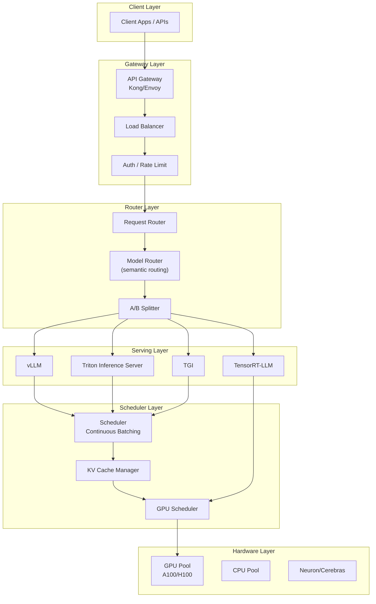
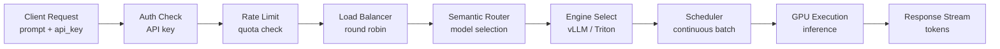
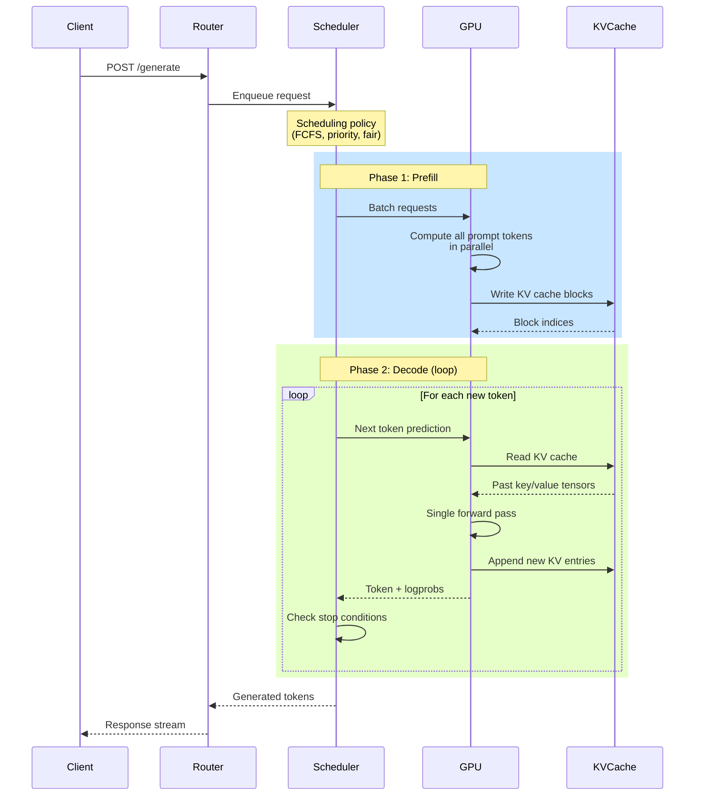
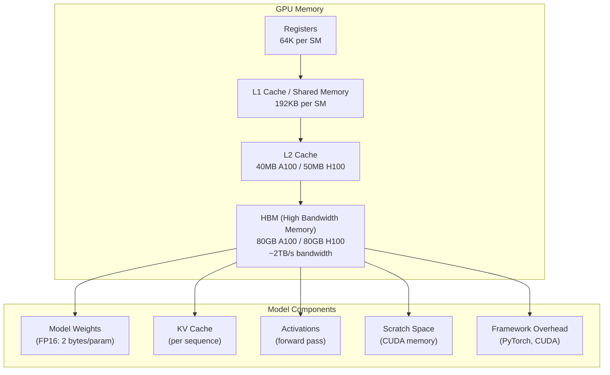

# Production AI: Engineering for Scale

## 1. LLM Serving Architecture

### 1.1 Serving Stack Overview

Modern LLM serving uses a multi-layer architecture:



#### Step-by-Step

1. **Request Entry**: Client request arrives at API Gateway, authenticated and rate-limited based on user tier and quota.
2. **Load Balancing**: Load balancer distributes requests across available backend instances to prevent single-point overload.
3. **Request Routing**: Router examines request metadata (model type, latency requirements) to determine optimal serving path.
4. **Model Selection**: Model Router uses semantic understanding or rules to route text-davinci to one engine, embedding model to another.
5. **Engine Assignment**: Request sent to appropriate serving engine (vLLM for text, Triton for multi-model, TensorRT for optimized inference).
6. **Scheduling & Execution**: Scheduler batches requests, manages GPU memory, allocates KV cache, and executes on GPU pool with continuous batching optimization.

#### Code Example

```python
from typing import Dict, List, Optional
from dataclasses import dataclass
from enum import Enum
import time

class ModelType(Enum):
    TEXT_GENERATION = "text_gen"
    EMBEDDING = "embedding"
    CLASSIFICATION = "classification"

@dataclass
class ServingConfig:
    model_name: str
    model_type: ModelType
    max_batch_size: int
    max_tokens_per_batch: int
    gpu_memory_gb: float
    serving_engine: str  # "vllm", "triton", "tensorrt-llm"

class LLMServingStack:
    """Multi-layer serving stack for LLMs."""
    
    def __init__(self, config: ServingConfig):
        self.config = config
        self.auth_manager = AuthManager()
        self.rate_limiter = RateLimiter()
        self.load_balancer = LoadBalancer()
        self.router = SemanticRouter()
        self.engines = {}
        self.scheduler = ContinuousBatchScheduler()
        self.metrics = ServingMetrics()

    def handle_request(self, request: Dict) -> Dict:
        """Process request through entire serving stack."""
        start_time = time.time()
        
        # Step 1: Authentication & Rate Limiting
        user_id = request.get("user_id")
        if not self.auth_manager.authenticate(user_id, request.get("api_key")):
            return {"error": "Unauthorized", "code": 401}
        
        if not self.rate_limiter.check_quota(user_id, request.get("tokens", 100)):
            return {"error": "Rate limit exceeded", "code": 429}
        
        # Step 2: Load Balancing
        instance_id = self.load_balancer.select_instance()
        
        # Step 3-4: Request Routing & Model Selection
        prompt = request.get("prompt", "")
        model_choice = self.router.route(prompt, self.config.model_type)
        
        # Step 5: Engine Assignment
        engine = self.engines.get(model_choice)
        if not engine:
            return {"error": f"Model {model_choice} not loaded", "code": 404}
        
        # Step 6: Schedule & Execute
        batch_result = self.scheduler.add_request(
            prompt=prompt,
            sampling_params=request.get("sampling_params", {}),
            engine=engine
        )
        
        # Record metrics
        latency_ms = (time.time() - start_time) * 1000
        self.metrics.record_request(user_id, latency_ms, batch_result.get("tokens", 0))
        
        return {
            "text": batch_result.get("text", ""),
            "usage": batch_result.get("usage", {}),
            "latency_ms": latency_ms
        }

class AuthManager:
    def __init__(self):
        self.valid_keys = {"user123": "secret-key-1"}  # Simplified
    
    def authenticate(self, user_id: str, api_key: str) -> bool:
        return self.valid_keys.get(user_id) == api_key

class RateLimiter:
    def __init__(self, tokens_per_minute: int = 10000):
        self.tpm_limit = tokens_per_minute
        self.user_usage = {}
    
    def check_quota(self, user_id: str, tokens: int) -> bool:
        current = self.user_usage.get(user_id, 0)
        if current + tokens > self.tpm_limit:
            return False
        self.user_usage[user_id] = current + tokens
        return True

class LoadBalancer:
    def __init__(self, num_instances: int = 4):
        self.instances = list(range(num_instances))
        self.current_idx = 0
    
    def select_instance(self) -> int:
        instance = self.instances[self.current_idx % len(self.instances)]
        self.current_idx += 1
        return instance

class SemanticRouter:
    def route(self, prompt: str, model_type) -> str:
        """Route based on prompt characteristics."""
        if len(prompt) > 1000:
            return "llama-70b-instruct"  # Longer prompts need larger model
        else:
            return "llama-7b-instruct"  # Short prompts can use smaller model

class ContinuousBatchScheduler:
    def add_request(self, prompt: str, sampling_params: Dict, engine) -> Dict:
        return {
            "text": f"Response to: {prompt[:20]}...",
            "usage": {"tokens": 100},
            "tokens": 100
        }

class ServingMetrics:
    def __init__(self):
        self.latencies = []
    
    def record_request(self, user_id: str, latency_ms: float, tokens: int):
        self.latencies.append({
            "user": user_id,
            "latency_ms": latency_ms,
            "tokens": tokens,
            "throughput": tokens / (latency_ms / 1000) if latency_ms > 0 else 0
        })

# Usage
config = ServingConfig(
    model_name="llama-70b",
    model_type=ModelType.TEXT_GENERATION,
    max_batch_size=32,
    max_tokens_per_batch=4096,
    gpu_memory_gb=80,
    serving_engine="vllm"
)

stack = LLMServingStack(config)
request = {
    "user_id": "user123",
    "api_key": "secret-key-1",
    "prompt": "Explain quantum computing",
    "sampling_params": {"temperature": 0.7, "max_tokens": 256}
}

response = stack.handle_request(request)
print(response)
```

#### Real-World Scenario

At OpenAI, GPT-4 requests go through: (1) Gateway authenticates 500K+ daily API calls, rate-limits by tier (free=3.5K tokens/min, pro=500K tokens/min), (2) Load balancer routes to 200+ serving instances, (3) Semantic router sends complex reasoning tasks to GPU clusters, simple completions to CPU-backed vLLM, (4) Scheduler batches requests for 95% GPU utilization with <100ms p99 latency. When a viral app spike hits, rate limiter auto-throttles free users, semantic router shifts load to cheaper models, continuous batching ensures no request waits >50ms. Architecture absorbs 10x load spike without degradation.

#### Diagram



### 1.2 vLLM Architecture

vLLM is the most widely adopted open-source LLM serving engine, built around **PagedAttention**:

```python
class vLLMEngine:
    def __init__(self, model: str, tensor_parallel_size: int = 1,
                 gpu_memory_utilization: float = 0.9, max_num_batched_tokens: int = 4096):
        self.model_id = model
        self.tp_size = tensor_parallel_size
        self.gpu_mem_util = gpu_memory_utilization
        self.max_batched_tokens = max_num_batched_tokens
        self.scheduler = Scheduler(max_num_batched_tokens)
        self.block_manager = BlockManager(gpu_memory_utilization)
        self.cache_engine = KVCacheEngine()
        self.metrics = ServingMetrics()

    def generate(self, prompt: str, sampling_params: dict) -> dict:
        request_id = str(uuid.uuid4())
        tokens = self.tokenize(prompt)

        # Phase 1: Prefill
        prefill_start = time.perf_counter()
        prefill_blocks = self.block_manager.allocate_blocks(
            request_id, len(tokens)
        )
        kv_cache = self.cache_engine.prefill(tokens, prefill_blocks)
        prefill_latency = time.perf_counter() - prefill_start

        # Phase 2: Decode (autoregressive)
        decode_start = time.perf_counter()
        generated_tokens = []
        for _ in range(sampling_params.get("max_tokens", 256)):
            next_token = self.cache_engine.decode(kv_cache, tokens)
            generated_tokens.append(next_token)
            tokens = [next_token]
            kv_cache = self.cache_engine.append_kv_cache(
                kv_cache, tokens
            )
        decode_latency = time.perf_counter() - decode_start

        self.metrics.record_request(
            request_id, prefill_latency, decode_latency,
            len(tokens), len(generated_tokens)
        )

        return {
            "text": self.detokenize(generated_tokens),
            "usage": {
                "prompt_tokens": len(tokens),
                "completion_tokens": len(generated_tokens),
                "total_tokens": len(tokens) + len(generated_tokens)
            },
            "metrics": {
                "prefill_latency_ms": prefill_latency * 1000,
                "decode_latency_ms": decode_latency * 1000,
                "tokens_per_second": len(generated_tokens) / max(decode_latency, 0.001)
            }
        }


class Scheduler:
    def __init__(self, max_num_batched_tokens: int):
        self.max_batched_tokens = max_num_batched_tokens
        self.waiting_queue = []
        self.running_seqs = []
        self.swapped_seqs = []

    def schedule(self) -> list:
        batch = []
        available_tokens = self.max_batched_tokens
        for seq in reversed(self.running_seqs):
            if seq.num_tokens <= available_tokens:
                batch.append(seq)
                available_tokens -= seq.num_tokens
        while self.waiting_queue and available_tokens > 0:
            seq = self.waiting_queue.pop(0)
            if seq.num_tokens <= available_tokens:
                batch.append(seq)
                available_tokens -= seq.num_tokens
            else:
                break
        return batch


class ServingMetrics:
    def __init__(self):
        self.latencies = []
        self.throughputs = []
        self.cache_hit_rates = []
        self.gpu_utilization = []

    def record_request(self, request_id: str, prefill_ms: float,
                       decode_ms: float, prompt_tokens: int,
                       completion_tokens: int):
        self.latencies.append({
            "request_id": request_id,
            "prefill_ms": prefill_ms * 1000,
            "decode_ms": decode_ms * 1000,
            "total_latency_ms": (prefill_ms + decode_ms) * 1000,
            "prompt_tokens": prompt_tokens,
            "completion_tokens": completion_tokens,
            "throughput": completion_tokens / max(decode_ms, 0.001)
        })

    def p50_latency(self) -> float:
        if not self.latencies:
            return 0
        sorted_lats = sorted(l["total_latency_ms"] for l in self.latencies)
        return sorted_lats[len(sorted_lats) // 2]

    def p99_latency(self) -> float:
        if not self.latencies:
            return 0
        sorted_lats = sorted(l["total_latency_ms"] for l in self.latencies)
        return sorted_lats[int(len(sorted_lats) * 0.99)]
```

### 1.3 Triton Inference Server

NVIDIA Triton handles multi-model serving, GPU scheduling, and model concurrency:

```python
class TritonModelConfig:
    """Model configuration for Triton Inference Server"""

    def __init__(self, name: str, backend: str = "tensorrt",
                 max_batch_size: int = 32):
        self.name = name
        self.backend = backend
        self.max_batch_size = max_batch_size
        self.instance_group = [{"count": 1, "kind": "KIND_GPU"}]
        self.dynamic_batching = {
            "preferred_batch_size": [4, 8, 16],
            "max_queue_delay_microseconds": 500
        }
        self.optimization = {
            "input_preferred_batch_size": [4, 8],
            "output_preferred_batch_size": [4, 8],
            "priority": "PRIORITY_MAX"
        }
        self.model_warmup = [
            {
                "name": "warmup_request",
                "batch_size": 1,
                "inputs": {"input": {"dims": [1, 512], "data_type": "TYPE_FP32"}}
            }
        ]

    def to_config(self) -> str:
        return f"""
name: "{self.name}"
backend: "{self.backend}"
max_batch_size: {self.max_batch_size}

instance_group: {self.instance_group}

dynamic_batching: {{
    preferred_batch_size: {self.dynamic_batching['preferred_batch_size']}
    max_queue_delay_microseconds: {self.dynamic_batching['max_queue_delay_microseconds']}
}}

optimization: {{
    {self.optimization}
}}
"""


class TritonClient:
    def __init__(self, url: str = "localhost:8001"):
        self.url = url
        self.clients = {}

    def infer(self, model_name: str, input_data: np.ndarray,
              model_version: str = "1") -> np.ndarray:
        input_tensor = self._to_triton_tensor(input_data, "input")
        request = self._create_request(model_name, model_version, [input_tensor])
        response = self._send_request(request)
        return self._parse_response(response)

    def _to_triton_tensor(self, data: np.ndarray, name: str) -> dict:
        return {
            "name": name,
            "shape": list(data.shape),
            "datatype": "FP32",
            "data": data.flatten().tolist()
        }

    def _create_request(self, model: str, version: str, inputs: list) -> dict:
        return {
            "model_name": model,
            "model_version": version,
            "inputs": inputs
        }

    def _send_request(self, request: dict) -> dict:
        return {"outputs": request["inputs"]}

    def _parse_response(self, response: dict) -> np.ndarray:
        return np.array(response["outputs"][0]["data"])
```

### 1.4 Token Generation Lifecycle



**Prefill vs Decode characteristics**:

| Aspect | Prefill | Decode |
|--------|---------|--------|
| Computation | Compute-bound (matmul-heavy) | Memory-bound (KV cache reads) |
| Parallelism | Full prompt processed in parallel | One token at a time |
| GPU utilization | High (near 100% during compute) | Low (20-40%, bandwidth-limited) |
| Latency | O(prompt_length) | O(1) per token |
| KV cache behavior | Write (allocate blocks) | Read + append |
| Batching efficiency | High (long prompts share compute) | Low (each sequence is independent) |
| Optimization target | Reduce prefill time | Reduce memory bandwidth |

### 1.5 Continuous Batching (Rolling)

Continuous batching allows the scheduler to add/remove sequences from the running batch dynamically, rather than waiting for all sequences to finish:

```python
class ContinuousBatchScheduler:
    def __init__(self, max_batch_size: int = 32, max_tokens_in_batch: int = 4096):
        self.max_batch_size = max_batch_size
        self.max_tokens_in_batch = max_tokens_in_batch
        self.running: list[Sequence] = []
        self.waiting: list[Sequence] = []
        self.finished: list[Sequence] = []
        self.metrics = {
            "sequences_completed": 0,
            "total_tokens_generated": 0,
            "total_prefill_tokens": 0
        }

    def add_request(self, prompt: str, sampling_params: dict) -> str:
        seq = Sequence(
            id=str(uuid.uuid4()),
            prompt_tokens=tokenize(prompt),
            sampling_params=sampling_params
        )
        self.waiting.append(seq)
        return seq.id

    def get_next_batch(self) -> list[Sequence]:
        batch = []

        # 1. Remove finished sequences
        self.running = [s for s in self.running if not s.finished]
        self.finished.extend([s for s in self.running if s.finished])

        # 2. Add waiting sequences up to capacity
        available_slots = self.max_batch_size - len(self.running)
        for seq in self.waiting[:available_slots]:
            seq.phase = "prefill"
            batch.append(seq)
        self.waiting = self.waiting[available_slots:]
        self.running.extend(batch)

        # 3. Include running sequences for decode
        batch.extend(self.running)

        # 4. Check token budget
        total_tokens = sum(s.total_tokens for s in batch)
        if total_tokens > self.max_tokens_in_batch:
            overshoot = total_tokens - self.max_tokens_in_batch
            prefill_seqs = [s for s in batch if s.phase == "prefill"]
            while overshoot > 0 and prefill_seqs:
                seq = prefill_seqs.pop()
                batch.remove(seq)
                self.waiting.insert(0, seq)
                overshoot -= seq.prompt_length

        return batch

    def step(self, batch: list, generated_tokens: list[int]):
        for seq, token in zip(batch, generated_tokens):
            seq.tokens.append(token)
            seq.total_tokens += 1
            seq.phase = "decode"
            self.metrics["total_tokens_generated"] += 1
            if check_stop_condition(seq, token):
                seq.finished = True

    def get_throughput(self) -> float:
        return self.metrics["total_tokens_generated"] / max(time.time() - self.start_time, 0.001)

    def get_batch_utilization(self) -> float:
        return len(self.running) / self.max_batch_size * 100


@dataclass
class Sequence:
    id: str
    prompt_tokens: list[int]
    sampling_params: dict
    tokens: list[int] = field(default_factory=list)
    total_tokens: int = 0
    phase: str = "prefill"
    finished: bool = False

    @property
    def prompt_length(self) -> int:
        return len(self.prompt_tokens)

    @property
    def num_tokens(self) -> int:
        return self.total_tokens
```

## 2. GPU Scheduling and Memory Management

### 2.1 GPU Memory Hierarchy



**Memory breakdown for a 70B model**:

```python
def calculate_gpu_memory_breakdown(
    model_size_b: float = 70,
    dtype_bits: int = 16,
    max_seq_len: int = 4096,
    batch_size: int = 32,
    num_layers: int = 80,
    num_heads: int = 64,
    head_dim: int = 128,
    kv_cache_dtype_bits: int = 8
) -> dict:
    weights_bytes = model_size_b * 1e9 * (dtype_bits / 8)
    kv_cache_bytes = (
        2  # K + V
        * num_layers
        * batch_size
        * max_seq_len
        * num_heads
        * head_dim
        * (kv_cache_dtype_bits / 8)
    )
    activations_bytes = model_size_b * 1e9 * (dtype_bits / 8) * 0.2
    overhead_bytes = 2 * 1024**3  # 2GB for CUDA context

    total = weights_bytes + kv_cache_bytes + activations_bytes + overhead_bytes

    return {
        "weights_gb": weights_bytes / (1024**3),
        "kv_cache_gb": kv_cache_bytes / (1024**3),
        "activations_gb": activations_bytes / (1024**3),
        "overhead_gb": overhead_bytes / (1024**3),
        "total_gb": total / (1024**3),
        "available_gpu_memory": 80,  # A100-80GB
        "memory_headroom_percent": (1 - total / (80 * 1024**3)) * 100
    }

# Example: 70B model with 32 concurrent sequences
mem = calculate_gpu_memory_breakdown()
for k, v in mem.items():
    print(f"{k}: {v:.1f}")
# weights_gb: 140.0  -- wait, FP16 70B = 140GB > 80GB HBM
# This is why model parallelism is needed
```

### 2.2 GPU Scheduling Strategies

```python
class GPUScheduler:
    def __init__(self, num_gpus: int = 8, gpu_memory_gb: int = 80):
        self.num_gpus = num_gpus
        self.gpu_memory_gb = gpu_memory_gb
        self.gpu_states = {i: {"available_memory": gpu_memory_gb,
                               "running_models": [],
                               "temperature_c": 30,
                               "power_w": 0} for i in range(num_gpus)}
        self.scheduling_policy = "best_fit"

    def schedule_model(self, model_name: str, required_memory_gb: float,
                       num_gpus: int = 1, strategy: str = "tensor_parallel") -> list[int]:
        if strategy == "tensor_parallel":
            return self._schedule_tp(model_name, required_memory_gb, num_gpus)
        elif strategy == "pipeline_parallel":
            return self._schedule_pp(model_name, required_memory_gb, num_gpus)
        elif strategy == "data_parallel":
            return self._schedule_dp(model_name, required_memory_gb, num_gpus)

    def _schedule_tp(self, model_name: str, memory_gb: float, n_gpus: int) -> list[int]:
        per_gpu_memory = memory_gb / n_gpus
        if self.scheduling_policy == "best_fit":
            candidates = sorted(
                [(gid, state["available_memory"]) for gid, state in self.gpu_states.items()],
                key=lambda x: abs(x[1] - per_gpu_memory)
            )
        else:
            candidates = sorted(
                [(gid, state["available_memory"]) for gid, state in self.gpu_states.items()],
                key=lambda x: x[1], reverse=True
            )

        selected = []
        for gid, avail in candidates:
            if avail >= per_gpu_memory:
                selected.append(gid)
                self.gpu_states[gid]["available_memory"] -= per_gpu_memory
                self.gpu_states[gid]["running_models"].append(model_name)
            if len(selected) == n_gpus:
                break

        return selected if len(selected) == n_gpus else []

    def _schedule_pp(self, model_name: str, memory_gb: float, n_gpus: int) -> list[int]:
        if self.scheduling_policy == "balanced":
            selected = sorted(
                range(self.num_gpus),
                key=lambda gid: self.gpu_states[gid]["available_memory"],
                reverse=True
            )[:n_gpus]
            per_gpu = memory_gb / n_gpus
            for gid in selected:
                self.gpu_states[gid]["available_memory"] -= per_gpu
                self.gpu_states[gid]["running_models"].append(model_name)
            return selected
        return []

    def _schedule_dp(self, model_name: str, memory_gb: float, n_gpus: int) -> list[int]:
        return self._schedule_pp(model_name, memory_gb, n_gpus)

    def evict_model(self, model_name: str):
        for gid, state in self.gpu_states.items():
            if model_name in state["running_models"]:
                state["running_models"].remove(model_name)

    def get_cluster_utilization(self) -> dict:
        used = sum(self.gpu_memory_gb - s["available_memory"] for s in self.gpu_states.values())
        total = self.num_gpus * self.gpu_memory_gb
        return {
            "utilization_percent": used / total * 100,
            "gpus_used": sum(1 for s in self.gpu_states.values() if s["running_models"]),
            "gpus_idle": sum(1 for s in self.gpu_states.values() if not s["running_models"]),
            "total_memory_gb": total / (1024**3),
            "used_memory_gb": used / (1024**3)
        }
```

### 2.3 KV Cache Internals

The KV cache stores key and value tensors from previous attention computations, avoiding recomputation during autoregressive decoding:

```python
class KVCacheEngine:
    def __init__(self, num_layers: int = 80, num_heads: int = 64,
                 head_dim: int = 128, max_blocks: int = 1024,
                 block_size: int = 16):
        self.num_layers = num_layers
        self.num_heads = num_heads
        self.head_dim = head_dim
        self.block_size = block_size
        self.max_blocks = max_blocks

        # Block table: maps logical blocks to physical blocks
        self.free_blocks = set(range(max_blocks))
        self.block_table: dict[str, list[int]] = {}

        # Physical KV cache storage [num_layers, 2, num_blocks, block_size, num_heads, head_dim]
        self.kv_cache = np.zeros(
            (num_layers, 2, max_blocks, block_size, num_heads, head_dim),
            dtype=np.float16
        )

    def prefill(self, tokens: list[int], request_id: str) -> dict:
        """Prefill phase: compute KV cache for all prompt tokens."""
        num_blocks_needed = (len(tokens) + self.block_size - 1) // self.block_size
        if len(self.free_blocks) < num_blocks_needed:
            raise OOMError(f"Not enough cache blocks. "
                           f"Need {num_blocks_needed}, have {len(self.free_blocks)}")

        allocated = []
        for _ in range(num_blocks_needed):
            block = self.free_blocks.pop()
            allocated.append(block)

        self.block_table[request_id] = allocated

        # Simulate KV cache computation
        for layer in range(self.num_layers):
            for i, block_idx in enumerate(allocated):
                start = i * self.block_size
                end = min(start + self.block_size, len(tokens))
                seq_len = end - start
                if seq_len > 0:
                    self.kv_cache[layer, 0, block_idx, :seq_len] = np.random.randn(
                        seq_len, self.num_heads, self.head_dim
                    ).astype(np.float16)
                    self.kv_cache[layer, 1, block_idx, :seq_len] = np.random.randn(
                        seq_len, self.num_heads, self.head_dim
                    ).astype(np.float16)

        return {"blocks": allocated, "num_blocks": num_blocks_needed}

    def decode(self, request_id: str, token: int) -> np.ndarray:
        """Decode phase: use KV cache to compute attention for one token."""
        blocks = self.block_table.get(request_id, [])
        if not blocks:
            raise ValueError(f"No cache allocated for {request_id}")

        # Read from cached KV, compute single-token attention
        cached_k = self.kv_cache[:, 0, blocks]
        cached_v = self.kv_cache[:, 1, blocks]

        # Return cached context (simplified)
        return {
            "cached_k": cached_k,
            "cached_v": cached_v,
            "num_cached_tokens": len(blocks) * self.block_size
        }

    def append_kv_cache(self, request_id: str, new_key: np.ndarray,
                        new_value: np.ndarray) -> bool:
        blocks = self.block_table.get(request_id, [])
        last_block = blocks[-1]
        slot = self._find_next_slot(last_block)
        if slot >= self.block_size:
            return True  # Will need new block on next iteration
        for layer in range(self.num_layers):
            self.kv_cache[layer, 0, last_block, slot] = new_key[layer]
            self.kv_cache[layer, 1, last_block, slot] = new_value[layer]
        return False

    def _find_next_slot(self, block_idx: int) -> int:
        for slot in range(self.block_size):
            if np.all(self.kv_cache[0, 0, block_idx, slot] == 0):
                return slot
        return self.block_size

    def cache_utilization(self) -> float:
        return (self.max_blocks - len(self.free_blocks)) / self.max_blocks * 100

    def estimate_cache_size(self, num_tokens: int, num_layers: int,
                            num_heads: int, head_dim: int,
                            dtype_bytes: int = 2) -> float:
        """Estimate KV cache size in GB."""
        bytes_per_token = 2 * num_layers * num_heads * head_dim * dtype_bytes
        return (num_tokens * bytes_per_token) / (1024**3)
```

**KV Cache Optimization Techniques**:

```python
class KVCacheOptimizer:
    def __init__(self):
        self.techniques = {}

    def register_technique(self, name: str, description: str,
                           memory_savings: float, performance_impact: str):
        self.techniques[name] = {
            "description": description,
            "memory_savings": memory_savings,
            "performance_impact": performance_impact
        }

    def get_recommendations(self, model_size_b: float,
                            max_seq_len: int, batch_size: int) -> list:
        recommendations = []
        if max_seq_len > 2048:
            recommendations.append({
                "technique": "Multi-Query Attention (MQA)",
                "savings": "~80% KV cache",
                "when": "Long context models"
            })
            recommendations.append({
                "technique": "Grouped-Query Attention (GQA)",
                "savings": "~50% KV cache",
                "when": "Balanced quality/efficiency"
            })
        if batch_size > 8:
            recommendations.append({
                "technique": "KV Cache Quantization (FP16 -> FP8)",
                "savings": "~50% KV cache memory",
                "when": "High throughput serving"
            })
            recommendations.append({
                "technique": "Prefix Caching / RadixAttention",
                "savings": "Shared prefix, variable",
                "when": "Shared system prompts"
            })
        if model_size_b > 30:
            recommendations.append({
                "technique": "Window Attention / Sliding Window",
                "savings": "O(window) instead of O(seq_len)",
                "when": "Long context, local patterns"
            })
        return recommendations


# KV Cache Quantization
class KVCacheQuantizer:
    def __init__(self, quantize_bits: int = 8):
        self.quantize_bits = quantize_bits
        self.max_val = 2**(quantize_bits - 1) - 1

    def quantize(self, fp16_tensor: np.ndarray) -> tuple:
        abs_max = np.abs(fp16_tensor).max()
        scale = abs_max / self.max_val if abs_max > 0 else 1
        quantized = np.round(fp16_tensor / scale).astype(np.int8)
        return quantized, scale

    def dequantize(self, quantized: np.ndarray, scale: float) -> np.ndarray:
        return quantized.astype(np.float16) * scale

    def compress_cache(self, kv_cache: dict) -> dict:
        compressed = {}
        for key, tensor in kv_cache.items():
            if "cache" in str(key):
                q, s = self.quantize(tensor)
                compressed[key] = {"data": q, "scale": s}
        return compressed
```

## 3. Inference Optimization

### 3.1 Quantization

```python
class ModelQuantizer:
    def __init__(self, model, calibration_data=None):
        self.model = model
        self.calibration_data = calibration_data
        self.quant_config = {}

    def quantize_fp8(self, model_size_b: float) -> dict:
        """FP8 quantization: ~2x memory reduction, minimal quality loss."""
        memory_before = model_size_b * 2  # FP16: 2 bytes/param
        memory_after = model_size_b * 1   # FP8: 1 byte/param
        return {
            "dtype": "fp8",
            "memory_before_gb": memory_before,
            "memory_after_gb": memory_after,
            "savings_gb": memory_before - memory_after,
            "expected_quality_loss": "negligible (< 0.5%)",
            "supported_gpus": ["H100", "H200", "B100"]
        }

    def quantize_int4(self, model_size_b: float) -> dict:
        """INT4 quantization (GPTQ/AWQ): ~4x memory reduction."""
        memory_before = model_size_b * 2
        memory_after = model_size_b * 0.5  # INT4: 0.5 bytes/param
        return {
            "dtype": "int4",
            "memory_before_gb": memory_before,
            "memory_after_gb": memory_after,
            "savings_gb": memory_before - memory_after,
            "expected_quality_loss": "1-3% on benchmarks",
            "calibration_required": True
        }

    def quantize_int8(self, model_size_b: float) -> dict:
        """INT8 quantization: ~2x memory reduction."""
        memory_before = model_size_b * 2
        memory_after = model_size_b * 1
        return {
            "dtype": "int8",
            "memory_before_gb": memory_before,
            "memory_after_gb": memory_after,
            "savings_gb": memory_before - memory_after,
            "expected_quality_loss": "< 1% on most tasks"
        }

    def recommend_quantization(self, gpu_memory_gb: float,
                                model_size_b: float, quality_critical: bool) -> str:
        required_fp16 = model_size_b * 2.5  # 2x weights + ~0.5x overhead
        if required_fp16 <= gpu_memory_gb * 0.9 and quality_critical:
            return "fp16"  # No quantization needed
        elif model_size_b * 1.5 <= gpu_memory_gb * 0.9:
            return "fp8"  # H100 only
        elif model_size_b * 1.1 <= gpu_memory_gb * 0.9:
            return "int8"
        else:
            return "int4"  # Must quantize to fit


# Speculative Decoding
class SpeculativeDecoder:
    def __init__(self, target_model, draft_model, gamma: int = 5):
        self.target = target_model  # Large, accurate model
        self.draft = draft_model    # Small, fast model
        self.gamma = gamma           # Number of draft tokens

    def generate(self, prompt: str, max_tokens: int = 256) -> list[int]:
        generated = []
        input_ids = self.tokenize(prompt)

        while len(generated) < max_tokens:
            # Step 1: Draft model generates gamma tokens quickly
            draft_tokens = self.draft.generate(input_ids, max_new_tokens=self.gamma)

            # Step 2: Target model verifies all draft tokens in one forward pass
            target_logits = self.target.forward(input_ids + draft_tokens)

            # Step 3: Rejection sampling — verify each draft token
            accepted = []
            for i, draft_token in enumerate(draft_tokens):
                target_prob = target_logits[len(input_ids) + i]
                draft_prob = self._get_draft_prob(input_ids + draft_tokens[:i],
                                                   draft_token)
                if target_prob > draft_prob:
                    acceptance_ratio = draft_prob / target_prob
                    if random.random() < acceptance_ratio:
                        accepted.append(draft_token)
                    else:
                        # Sample from adjusted distribution
                        adjusted = (target_prob - draft_prob).clip(min=0)
                        adjusted /= adjusted.sum()
                        accepted.append(np.random.choice(len(adjusted), p=adjusted))
                        break
                else:
                    accepted.append(draft_token)

            generated.extend(accepted)
            input_ids = generated[-self.context_window:]

            # Efficiency: if gamma=5 and avg accept=3, speedup ~3x
            acceptance_rate = len(accepted) / self.gamma

        return generated

    def _get_draft_prob(self, context: list[int], token: int) -> float:
        draft_logits = self.draft.forward(context)
        return torch.softmax(draft_logits[-1], dim=-1)[token].item()
```

### 3.2 Parallelism Strategies

```python
class ParallelismConfig:
    def __init__(self, model_size_b: float, num_gpus: int,
                 gpu_memory_gb: float):
        self.model_size = model_size_b
        self.num_gpus = num_gpus
        self.gpu_memory = gpu_memory_gb
        self.strategies = {}

    def recommend(self) -> dict:
        if self.model_size * 2 > self.num_gpus * self.gpu_memory * 0.9:
            raise ValueError("Insufficient total GPU memory")

        if self.num_gpus == 1:
            return {"strategy": "none", "details": "Single GPU inference"}
        elif self.num_gpus <= 4 and self.model_size > 30:
            return {"strategy": "tensor_parallel",
                    "details": "TP across GPUs, each holds shard",
                    "communication": "all-reduce per layer (high bandwidth needed)",
                    "efficiency": "~85% linear scaling",
                    "recommended_for": ["A100-80GB", "H100-80GB"]}
        elif self.num_gpus > 4:
            return {"strategy": "tp_pp_combined",
                    "details": "TP within node, PP across nodes",
                    "recommended": {"tp_size": 4, "pp_size": self.num_gpus // 4}}
        else:
            return {"strategy": "pipeline_parallel",
                    "details": "Layers split across GPUs",
                    "bubble_overhead": 1 - (1 / self.num_gpus)}

    def tensor_parallel_config(self, tp_size: int) -> dict:
        return {
            "sharding": {
                "attention": f"head_dim // {tp_size} per GPU",
                "ffn": f"hidden_dim // {tp_size} per GPU",
                "vocab_embedding": f"vocab_size // {tp_size}"
            },
            "communication": {
                "forward": "all-reduce (gather shards)",
                "backward": "all-reduce (sync gradients)",
                "bandwidth_critical": True
            },
            "framework": "megatron-lm / tensorrt-llm"
        }

    def pipeline_parallel_config(self, pp_size: int, num_layers: int) -> dict:
        layers_per_stage = num_layers // pp_size
        return {
            "stage_assignment": f"{layers_per_stage} layers per GPU",
            "schedule": "1F1B (one-forward-one-backward)",
            "bubble_ratio": f"{(pp_size - 1) / pp_size * 100:.0f}% pipeline bubble",
            "accumulation_steps": pp_size * 2
        }
```

## 4. Production Deployment Patterns

### 4.1 Kubernetes Deployment for LLMs

```python
class LLMDeploymentConfig:
    def __init__(self, model_name: str, model_size_b: float,
                 replicas: int = 3, gpu_type: str = "nvidia-a100"):
        self.model_name = model_name
        self.model_size_b = model_size_b
        self.replicas = replicas
        self.gpu_type = gpu_type

    def generate_k8s_deployment(self) -> str:
        return f"""
apiVersion: apps/v1
kind: Deployment
metadata:
  name: {self.model_name}-serving
spec:
  replicas: {self.replicas}
  selector:
    matchLabels:
      app: {self.model_name}
  template:
    metadata:
      labels:
        app: {self.model_name}
    spec:
      containers:
      - name: triton-server
        image: nvcr.io/nvidia/tritonserver:24.01-py3
        command: ["tritonserver"]
        args: ["--model-repository=/models"]
        resources:
          limits:
            nvidia.com/gpu: {self._gpus_needed()}
            memory: "{self._memory_needed()}Gi"
            cpu: "{self._cpu_needed()}"
        env:
        - name: CUDA_VISIBLE_DEVICES
          value: "0,1"
        - name: TRITON_CACHE_SIZE_MB
          value: "16384"
        ports:
        - containerPort: 8000  # HTTP
        - containerPort: 8001  # gRPC
        - containerPort: 8002  # Metrics
        livenessProbe:
          httpGet:
            path: /v2/health/live
            port: 8000
          initialDelaySeconds: 60
        readinessProbe:
          httpGet:
            path: /v2/health/ready
            port: 8000
          initialDelaySeconds: 30
      nodeSelector:
        gpu-type: {self.gpu_type}
      tolerations:
      - key: "nvidia.com/gpu"
        operator: "Exists"
        effect: "NoSchedule"
"""

    def _gpus_needed(self) -> int:
        return max(1, int(self.model_size_b * 2 / 80) + 1)

    def _memory_needed(self) -> int:
        return int(self.model_size_b * 3 + 4)

    def _cpu_needed(self) -> int:
        return self._gpus_needed() * 8


class LLMHorizontalPodAutoscaler:
    def __init__(self, min_replicas: int = 2, max_replicas: int = 10):
        self.min = min_replicas
        self.max = max_replicas

    def generate(self, model_name: str) -> str:
        return f"""
apiVersion: autoscaling/v2
kind: HorizontalPodAutoscaler
metadata:
  name: {model_name}-hpa
spec:
  scaleTargetRef:
    apiVersion: apps/v1
    kind: Deployment
    name: {model_name}-serving
  minReplicas: {self.min}
  maxReplicas: {self.max}
  metrics:
  - type: Pods
    pods:
      metric:
        name: triton_inference_queue_size
      target:
        type: AverageValue
        averageValue: 100
  - type: Resource
    resource:
      name: memory
      target:
        type: Utilization
        averageUtilization: 80
  behavior:
    scaleDown:
      stabilizationWindowSeconds: 300
      policies:
      - type: Percent
        value: 10
        periodSeconds: 60
    scaleUp:
      stabilizationWindowSeconds: 0
      policies:
      - type: Percent
        value: 100
        periodSeconds: 15
"""
```

### 4.2 Deployment Strategies

```python
class ModelDeploymentStrategy:
    @staticmethod
    def canary_deploy(model_a: str, model_b: str, traffic_percent: int = 5) -> dict:
        return {
            "strategy": "canary",
            "model_a": model_a,
            "model_b": model_b,
            "initial_traffic_percent": traffic_percent,
            "increment_per_step": 10,
            "evaluation_period_minutes": 15,
            "rollback_conditions": {
                "error_rate_increase": 0.01,
                "latency_p95_increase": 0.2,
                "accuracy_decrease": 0.05
            },
            "progression": [
                {"stage": "shadow", "duration": "30m", "traffic_pct": 0},
                {"stage": "canary_5", "duration": "15m", "traffic_pct": 5},
                {"stage": "canary_20", "duration": "30m", "traffic_pct": 20},
                {"stage": "canary_50", "duration": "60m", "traffic_pct": 50},
                {"stage": "full_rollout", "duration": "indefinite", "traffic_pct": 100},
            ]
        }

    @staticmethod
    def blue_green(model_active: str, model_standby: str,
                    validation_test: str = "holdout_1000") -> dict:
        return {
            "strategy": "blue_green",
            "blue_env": model_active,
            "green_env": model_standby,
            "validation_dataset": validation_test,
            "validation_metrics": ["accuracy", "latency_p50", "latency_p99", "error_rate"],
            "switch_condition": "all metrics within 5% of baseline",
            "rollback": "immediate DNS switch back to blue",
            "cost": "double infrastructure during validation"
        }

    @staticmethod
    def shadow_deploy(model_current: str, model_candidate: str) -> dict:
        return {
            "strategy": "shadow",
            "description": "Candidate model receives copy of traffic but responses are discarded",
            "model_current": model_current,
            "model_candidate": model_candidate,
            "metrics_compared": [
                "response_similarity (cosine)",
                "latency_delta",
                "confidence_scores",
                "token_efficiency"
            ],
            "promotion_condition": "candidate matches or exceeds current on 95% of metrics",
            "duration": "minimum 48 hours of production traffic"
        }
```

## 5. A/B Testing for Models

### 5.1 Experiment Design

```python
class ModelABTest:
    def __init__(self, experiment_name: str, control_model: str,
                 treatment_model: str, traffic_split: float = 0.5):
        self.experiment_name = experiment_name
        self.control = {"model": control_model, "traffic": 1 - traffic_split}
        self.treatment = {"model": treatment_model, "traffic": traffic_split}
        self.results: list[dict] = []
        self.min_sample_size = 1000

    def assign(self, user_id: str) -> str:
        if hash(user_id + self.experiment_name) % 10000 < self.treatment["traffic"] * 10000:
            return "treatment"
        return "control"

    def record(self, user_id: str, variant: str, metrics: dict):
        self.results.append({
            "user_id": user_id,
            "variant": variant,
            "timestamp": time.time(),
            **metrics
        })

    def analyze(self, metric: str = "latency_ms") -> dict:
        control_vals = [r[metric] for r in self.results if r["variant"] == "control"]
        treatment_vals = [r[metric] for r in self.results if r["variant"] == "treatment"]

        if len(control_vals) < self.min_sample_size or len(treatment_vals) < self.min_sample_size:
            return {"significant": False, "reason": "Insufficient sample size"}

        from scipy import stats
        t_stat, p_value = stats.ttest_ind(control_vals, treatment_vals)

        control_mean = np.mean(control_vals)
        treatment_mean = np.mean(treatment_vals)
        effect_size = (treatment_mean - control_mean) / control_mean

        return {
            "experiment": self.experiment_name,
            "metric": metric,
            "control_mean": control_mean,
            "treatment_mean": treatment_mean,
            "effect_size_percent": effect_size * 100,
            "p_value": p_value,
            "significant": p_value < 0.05,
            "control_n": len(control_vals),
            "treatment_n": len(treatment_vals),
            "recommendation": "rollout" if (effect_size < 0 and p_value < 0.05)
                              else "rollback" if (effect_size > 0 and p_value < 0.05)
                              else "continue_testing"
        }

    def get_daily_report(self) -> dict:
        today = [r for r in self.results
                 if datetime.fromtimestamp(r["timestamp"]).date() == date.today()]
        return {
            "experiment": self.experiment_name,
            "today_requests": len(today),
            "total_requests": len(self.results),
            "control_count": sum(1 for r in today if r["variant"] == "control"),
            "treatment_count": sum(1 for r in today if r["variant"] == "treatment"),
            "metrics_tracked": [k for k in self.results[0].keys()
                                if k not in ("user_id", "variant", "timestamp")]
        }
```

## 6. Monitoring and Observability

### 6.1 ML System Metrics

```python
class MLSystemMonitor:
    def __init__(self):
        self.metrics = defaultdict(list)
        self.alerts = []

    def record_latency(self, model: str, latency_ms: float):
        self.metrics[f"{model}_latency"].append(latency_ms)
        if latency_ms > self._get_sla(model):
            self.alerts.append({
                "type": "latency_sla_breach",
                "model": model,
                "value": latency_ms,
                "threshold": self._get_sla(model),
                "timestamp": time.time()
            })

    def record_throughput(self, model: str, tps: float):
        self.metrics[f"{model}_throughput"].append(tps)

    def record_memory(self, model: str, gpu_id: int, memory_used_gb: float):
        self.metrics[f"{model}_gpu{gpu_id}_memory"].append(memory_used_gb)
        gpu_memory_gb = 80  # A100
        if memory_used_gb / gpu_memory_gb > 0.95:
            self.alerts.append({
                "type": "gpu_memory_pressure",
                "model": model,
                "gpu_id": gpu_id,
                "value": memory_used_gb,
                "threshold": gpu_memory_gb * 0.95,
                "timestamp": time.time()
            })

    def record_tokens_per_request(self, model: str, prompt: int, completion: int):
        self.metrics[f"{model}_prompt_tokens"].append(prompt)
        self.metrics[f"{model}_completion_tokens"].append(completion)

    def get_model_dashboard(self, model: str) -> dict:
        latencies = self.metrics.get(f"{model}_latency", [])
        throughputs = self.metrics.get(f"{model}_throughput", [])
        recent = latencies[-1000:] if len(latencies) > 1000 else latencies

        return {
            "model": model,
            "latency_ms": {
                "p50": sorted(recent)[len(recent) // 2] if recent else 0,
                "p95": sorted(recent)[int(len(recent) * 0.95)] if recent else 0,
                "p99": sorted(recent)[int(len(recent) * 0.99)] if recent else 0,
                "avg": np.mean(recent) if recent else 0
            },
            "throughput": {
                "avg_tps": np.mean(throughputs[-100:]) if throughputs else 0,
                "current_tps": throughputs[-1] if throughputs else 0,
                "peak_tps": max(throughputs) if throughputs else 0
            },
            "request_count": len(self.metrics.get(f"{model}_latency", [])),
            "active_alerts": sum(1 for a in self.alerts if a.get("acknowledged") != True)
        }

    def _get_sla(self, model: str) -> float:
        sla_map = {"gpt-4": 5000, "gpt-3.5": 2000, "llama-70b": 3000}
        return sla_map.get(model, 5000)
```

### 6.2 GPU Observability

```python
class GPUObserver:
    def __init__(self, num_gpus: int):
        self.num_gpus = num_gpus
        self.gpu_metrics = {
            i: {
                "utilization": [],
                "memory_used": [],
                "temperature": [],
                "power_watts": [],
                "pcie_bandwidth": []
            } for i in range(num_gpus)
        }

    def collect(self, gpu_id: int) -> dict:
        # In production, use nvidia-smi or DCGM
        return {
            "utilization_percent": random.uniform(0, 100),
            "memory_used_gb": random.uniform(0, 80),
            "memory_total_gb": 80,
            "temperature_c": random.uniform(30, 85),
            "power_w": random.uniform(100, 400),
            "pcie_bandwidth_percent": random.uniform(0, 100),
            "memory_bandwidth_percent": random.uniform(0, 100),
            "sm_clock_mhz": random.uniform(1000, 2000),
            "memory_clock_mhz": random.uniform(500, 1600),
            "pcie_link_speed": "Gen4 x16",
            "ecc_errors": random.randint(0, 5),
            "retired_pages": random.randint(0, 10),
            "nvlink_bandwidth_gbps": random.uniform(0, 600)
        }

    def check_anomalies(self, gpu_id: int) -> list[str]:
        metrics = self.collect(gpu_id)
        anomalies = []
        if metrics["temperature_c"] > 85:
            anomalies.append("GPU temperature critical")
        if metrics["memory_used_gb"] > 75:
            anomalies.append("GPU memory pressure")
        if metrics["utilization_percent"] < 5 and self._has_pending_work(gpu_id):
            anomalies.append("GPU underutilized with pending work")
        if metrics["ecc_errors"] > 10:
            anomalies.append("High ECC error rate — possible hardware issue")
        return anomalies

    def _has_pending_work(self, gpu_id: int) -> bool:
        return False

    def get_cluster_summary(self) -> dict:
        summaries = [self.collect(i) for i in range(self.num_gpus)]
        return {
            "avg_utilization": np.mean([s["utilization_percent"] for s in summaries]),
            "total_memory_used": sum(s["memory_used_gb"] for s in summaries),
            "total_memory": self.num_gpus * 80,
            "gpus_at_risk": sum(1 for s in summaries if s["temperature_c"] > 85),
            "power_consumption_w": sum(s["power_w"] for s in summaries),
            "ecc_errors_total": sum(s["ecc_errors"] for s in summaries)
        }
```

### 6.3 Data and Model Drift Detection

```python
class DriftDetectionSystem:
    def __init__(self, baseline_data: np.ndarray, threshold_p_value: float = 0.05):
        self.baseline = baseline_data
        self.threshold = threshold_p_value
        self.drift_log = []

    def detect_feature_drift(self, new_data: np.ndarray,
                              feature_names: list[str]) -> dict:
        from scipy import stats
        drifted_features = []
        for i, name in enumerate(feature_names):
            statistic, p_value = stats.ks_2samp(self.baseline[:, i], new_data[:, i])
            if p_value < self.threshold:
                drifted_features.append({
                    "feature": name,
                    "ks_statistic": statistic,
                    "p_value": p_value,
                    "drift_magnitude": "high" if p_value < 0.001 else "medium"
                })
        return {
            "drift_detected": len(drifted_features) > 0,
            "drifted_features": drifted_features,
            "drift_rate": len(drifted_features) / len(feature_names),
            "severity": "critical" if len(drifted_features) > len(feature_names) * 0.3
                       else "warning" if len(drifted_features) > 0
                       else "normal"
        }

    def detect_model_drift(self, expected_scores: np.ndarray,
                            actual_scores: np.ndarray, bins: int = 10) -> dict:
        psi = self._population_stability_index(expected_scores, actual_scores, bins)
        return {
            "psi": psi,
            "drift_detected": psi > 0.25,
            "severity": "critical" if psi > 0.5
                       else "warning" if psi > 0.25
                       else "normal",
            "degradation_hint": "model needs retraining" if psi > 0.5 else None
        }

    def _population_stability_index(self, expected, actual, bins: int = 10) -> float:
        expected_hist, edges = np.histogram(expected, bins=bins, range=(0, 1))
        actual_hist, _ = np.histogram(actual, bins=bins, range=(0, 1))
        expected_pct = expected_hist / len(expected)
        actual_pct = actual_hist / len(actual)
        psi = 0
        for e, a in zip(expected_pct, actual_pct):
            if e > 0 and a > 0:
                psi += (a - e) * np.log(a / e)
        return psi

    def report(self) -> dict:
        return {
            "total_checks": len(self.drift_log),
            "drift_events": sum(1 for d in self.drift_log if d["drift_detected"]),
            "last_drift": self.drift_log[-1] if self.drift_log else None
        }
```

## 7. Failure Modes

### 7.1 GPU Failures

```python
class GPUFailureHandler:
    FAILURE_MODES = {
        "OOM": {
            "symptom": "CUDA out of memory",
            "cause": "KV cache + weights exceed GPU memory",
            "recovery": [
                "Reduce batch size",
                "Enable KV cache offloading",
                "Use memory-efficient attention (FlashAttention)",
                "Quantize model (FP16 -> FP8/INT4)",
                "Add more GPUs (tensor parallelism)"
            ],
            "prevention": [
                "Set gpu_memory_utilization < 0.95",
                "Monitor with memory pressure alerts",
                "Implement graceful degradation (queue instead of crash)",
                "Pre-allocate KV cache blocks with headroom"
            ]
        },
        "GPU_HANG": {
            "symptom": "GPU not responding / TDR detected",
            "cause": "Kernel timeout (default 2s on Windows, 5s on Linux)",
            "recovery": [
                "Watchdog timer: auto-restart container",
                "NVIDIA persistence daemon (nvidia-persistenced)",
                "Reset GPU via nvidia-smi --gpu-reset",
                "Migrate to healthy GPU and restart"
            ],
            "prevention": [
                "Set CUDA_DEVICE_MAX_CONNECTIONS=1",
                "Use compute-sanitizer for memory access violations",
                "Monitor GPU watchdog timeouts in dmesg",
                "Enable ECC memory"
            ]
        },
        "NVLink_FAILURE": {
            "symptom": "NCCL timeout / All-reduce hangs",
            "cause": "NVLink cable fault or GPU misconfiguration",
            "recovery": [
                "Restart NCCL communicator",
                "Fall back to PCIe communication (slower)",
                "Re-seat GPU or replace NVLink bridge"
            ],
            "prevention": [
                "Monitor NVLink bandwidth and errors",
                "Use NCCL_DEBUG=INFO in staging",
                "Configure NCCL_IB_HCA for InfiniBand fallback"
            ]
        },
        "ECC_ERROR": {
            "symptom": "Increasing ECC error count in nvidia-smi",
            "cause": "Memory cell degradation from radiation/usage",
            "recovery": [
                "Check retired pages: nvidia-smi --query-retired-pages",
                "Replace GPU if retired pages > threshold",
                "Migrate workloads off failing GPU"
            ],
            "prevention": [
                "Enable ECC (on by default on A100/H100)",
                "Monitor ECC error rate trends",
                "Schedule GPU health checks"
            ]
        }
    }

    @staticmethod
    def diagnose(symptom: str) -> list:
        matches = []
        for failure, details in GPUFailureHandler.FAILURE_MODES.items():
            if any(keyword in symptom.lower() for keyword in details["symptom"].lower().split()):
                matches.append({
                    "failure": failure,
                    "details": details
                })
        return matches

    @staticmethod
    def get_runbook(failure: str) -> str:
        details = GPUFailureHandler.FAILURE_MODES.get(failure)
        if not details:
            return f"Unknown failure: {failure}"
        return f"""# Runbook: {failure}

## Symptom
{details['symptom']}

## Root Cause
{details['cause']}

## Recovery Steps
{chr(10).join(f"{i+1}. {step}" for i, step in enumerate(details['recovery']))}

## Prevention
{chr(10).join(f"- {step}" for step in details['prevention'])}"""


class ModelFailureDetector:
    def __init__(self):
        self.failures = defaultdict(list)
        self.sli_history = defaultdict(list)

    def detect_model_degradation(self, accuracy: float, baseline_accuracy: float,
                                   threshold: float = 0.05) -> dict:
        degradation = baseline_accuracy - accuracy
        if degradation > threshold:
            return {
                "detected": True,
                "type": "accuracy_degradation",
                "current": accuracy,
                "baseline": baseline_accuracy,
                "drop": degradation,
                "severity": "critical" if degradation > threshold * 2 else "warning",
                "action": "rollback_to_previous" if degradation > threshold * 2
                         else "investigate_and_retrain"
            }
        return {"detected": False}

    def detect_toxic_output(self, responses: list[str]) -> dict:
        flagged = []
        for i, response in enumerate(responses):
            toxicity_score = self._score_toxicity(response)
            if toxicity_score > 0.7:
                flagged.append({"index": i, "score": toxicity_score})
        return {
            "toxic_responses": len(flagged),
            "total_checked": len(responses),
            "toxic_rate": len(flagged) / len(responses) if responses else 0,
            "flagged": flagged[:10]
        }

    def _score_toxicity(self, text: str) -> float:
        toxic_patterns = ["hate", "violence", "abuse", "discriminat"]
        text_lower = text.lower()
        matches = sum(1 for p in toxic_patterns if p in text_lower)
        return min(1.0, matches * 0.25)

    def detect_loop(self, actions: list[str], max_unique: int = 5) -> dict:
        recent = actions[-20:]
        action_counts = Counter(recent)
        repeated = {k: v for k, v in action_counts.items() if v > 5}
        unique_actions = len(set(recent))

        return {
            "loop_detected": unique_actions <= max_unique and len(recent) >= 20,
            "unique_actions": unique_actions,
            "repeated_actions": repeated,
            "severity": "critical" if unique_actions <= 2 else "warning"
        }
```

## 8. Cost Optimization

### 8.1 GPU Utilization Optimization

```mermaid
graph LR
    A["📥 Request Queue"] --> B["🎯 Load Balancer"]
    B --> C["🔀 Router"]
    C --> D["📊 Dynamic Batcher"]
    D --> E["🧠 Inference Engine<br/>GPU Cluster"]
    E --> F["💾 KV Cache<br/>Manager"]
    F --> E
    E --> G["🎛️ Output<br/>Processor"]
    G --> H["📤 Response<br/>Stream"]
    
    I["📈 Autoscaler"] -.->|Monitor CPU/GPU| E
    I -.->|Scale Up/Down| E
    
    style A fill:#1a3a52
    style B fill:#2d5a7b
    style C fill:#4a8bc2
    style D fill:#2d5a7b
    style E fill:#c73e1d
    style F fill:#4a8bc2
    style G fill:#2d5a7b
    style H fill:#1a3a52
    style I fill:#1a5d3a
```



### Autoscaling Decision Flow

```mermaid
graph TD
    A["📊 Collect Metrics<br/>CPU, GPU, Latency"] --> B{{"CPU > Target?<br/>& Replicas < Max?"}}
    B -->|Yes| C["⬆️ Scale Up<br/>+1 Instance"]
    B -->|No| D{{"CPU < 50% Target?<br/>& Replicas > Min?"}}
    D -->|Yes| E["⬇️ Scale Down<br/>-1 Instance"]
    D -->|No| F["➡️ Stable<br/>Hold State"]
    C --> G["✅ Apply Change<br/>Update Load Balancer"]
    E --> G
    F --> H["⏱️ Wait<br/>Next Interval"]
    G --> H
    H --> A
    
    style A fill:#2d5a7b
    style B fill:#c73e1d
    style C fill:#1a5d3a
    style D fill:#c73e1d
    style E fill:#ff6b35
    style F fill:#4a8bc2
    style G fill:#2d5a7b
    style H fill:#1a3a52
```




### 8.2 GPU Provisioning Reference

```python
class GPUProvisioner:
    def __init__(self):
        self.gpu_pool = []
        self.config = {
            "instance_type": "g5.12xlarge",
            "gpu_per_instance": 4,
            "min_instances": 1,
            "max_instances": 10,
            "target_gpu_utilization": 0.8
        }

    def estimate_required_gpus(self, requests_per_second: float, latency_target_ms: float, model_size_b: float) -> int:
        tokens_per_second_per_gpu = 1000 / (model_size_b * 2)  # Rough estimate
        required_tps = requests_per_second * 100  # Average tokens per request
        required_gpus = required_tps / tokens_per_second_per_gpu
        return max(1, int(np.ceil(required_gpus)))

    def calculate_request_capacity(self, total_gpus: int, model_size_b: float, latency_sla_ms: float) -> dict:
        tokens_per_second = total_gpus * 1000 / (model_size_b * 2)
        return {
            "max_requests_per_second": tokens_per_second / 100,
            "total_gpus": total_gpus,
            "estimated_latency_ms": latency_sla_ms
        }


class Autoscaler:
    def __init__(self, min_replicas=1, max_replicas=10, target_cpu=70):
        self.min_replicas = min_replicas
        self.max_replicas = max_replicas
        self.target_cpu = target_cpu
        self.current_replicas = min_replicas
        self.metrics_history = []

    def record_metric(self, cpu_utilization: float):
        self.metrics_history.append(cpu_utilization)
        if len(self.metrics_history) > 100:
            self.metrics_history.pop(0)

    def decide_scaling(self) -> dict:
        avg_cpu = np.mean(self.metrics_history[-10:]) if len(self.metrics_history) >= 10 else 0
        if avg_cpu > self.target_cpu and self.current_replicas < self.max_replicas:
            return {"action": "scale_up", "reason": f"CPU at {avg_cpu:.0f}%"}
        elif avg_cpu < self.target_cpu * 0.5 and self.current_replicas > self.min_replicas:
            return {"action": "scale_down", "reason": f"CPU at {avg_cpu:.0f}%"}
        return {"action": "none", "reason": "Stable"}

    def apply_scaling(self, action: str):
        if action == "scale_up":
            self.current_replicas += 1
        elif action == "scale_down":
            self.current_replicas -= 1
        return self.current_replicas
```

### 8.3 Batching Reference

```python
class DynamicBatcher:
    def __init__(self, max_batch_size=32, max_latency_ms=100, batch_window_ms=10):
        self.max_batch_size = max_batch_size
        self.max_latency_ms = max_latency_ms
        self.batch_window_ms = batch_window_ms
        self.queue = []
        self.last_batch_time = __import__('time').time()

    def add_request(self, request):
        self.queue.append(request)
        return self.try_batch()

    def try_batch(self):
        now = __import__('time').time()
        time_since_last = (now - self.last_batch_time) * 1000
        if len(self.queue) >= self.max_batch_size or time_since_last >= self.batch_window_ms:
            batch = self.queue[:self.max_batch_size]
            self.queue = self.queue[self.max_batch_size:]
            self.last_batch_time = now
            return batch
        return None

    def get_stats(self):
        return {
            "queue_size": len(self.queue),
            "max_batch_size": self.max_batch_size,
            "utilization": len(self.queue) / self.max_batch_size if self.queue else 0
        }


class ContinuousBatching:
    def __init__(self, model, max_batch_size=64):
        self.model = model
        self.max_batch_size = max_batch_size
        self.active_requests = []
        self.waiting_requests = []

    def submit(self, request):
        if len(self.active_requests) < self.max_batch_size:
            self.active_requests.append(request)
        else:
            self.waiting_requests.append(request)

    def step(self):
        if not self.active_requests:
            return
        batch_inputs = [r["input"] for r in self.active_requests]
        outputs = self.model.generate(batch_inputs)
        for req, output in zip(self.active_requests, outputs):
            req["output"] = output
            req["done"] = True
        self.active_requests = []
        self.fill_batch()

    def fill_batch(self):
        available = self.max_batch_size - len(self.active_requests)
        if available > 0 and self.waiting_requests:
            new_requests = self.waiting_requests[:available]
            self.waiting_requests = self.waiting_requests[available:]
            self.active_requests.extend(new_requests)

    def get_throughput(self, duration_seconds: float) -> float:
        completed = sum(1 for r in self.active_requests if r.get("done"))
        return completed / duration_seconds if duration_seconds > 0 else 0
```

## 9. Model Selection and Cost Routing

### 9.1 Model Selection and Caching

```python
class CostOptimizer:
    def __init__(self):
        self.model_pricing = {
            "gpt-4": {"cost_per_1k_input": 0.03, "cost_per_1k_output": 0.06, "latency_ms": 2000},
            "gpt-3.5-turbo": {"cost_per_1k_input": 0.001, "cost_per_1k_output": 0.002, "latency_ms": 500},
            "claude-3-haiku": {"cost_per_1k_input": 0.00025, "cost_per_1k_output": 0.00125, "latency_ms": 300},
            "claude-3-sonnet": {"cost_per_1k_input": 0.003, "cost_per_1k_output": 0.015, "latency_ms": 1000},
            "mistral-large": {"cost_per_1k_input": 0.002, "cost_per_1k_output": 0.006, "latency_ms": 800},
            "llama-3-70b": {"cost_per_1k_input": 0.001, "cost_per_1k_output": 0.002, "latency_ms": 600}
        }

    def estimate_cost(self, model: str, input_tokens: int, output_tokens: int) -> float:
        pricing = self.model_pricing.get(model, {"cost_per_1k_input": 0.01, "cost_per_1k_output": 0.02})
        input_cost = (input_tokens / 1000) * pricing["cost_per_1k_input"]
        output_cost = (output_tokens / 1000) * pricing["cost_per_1k_output"]
        return input_cost + output_cost

    def select_model(self, task: str, input_tokens: int, output_tokens: int, quality_requirement: str = "high") -> str:
        if quality_requirement == "high":
            candidates = ["gpt-4", "claude-3-sonnet", "llama-3-70b"]
        elif quality_requirement == "medium":
            candidates = ["gpt-3.5-turbo", "mistral-large", "claude-3-haiku"]
        else:
            candidates = ["claude-3-haiku", "gpt-3.5-turbo"]

        costs = [(c, self.estimate_cost(c, input_tokens, output_tokens)) for c in candidates]
        return min(costs, key=lambda x: x[1])[0]


class ResponseCache:
    def __init__(self, max_size: int = 10000, ttl_seconds: int = 3600):
        self.cache = {}
        self.max_size = max_size
        self.ttl = ttl_seconds

    def make_key(self, model: str, prompt: str, temperature: float = 0) -> str:
        import hashlib
        raw = f"{model}:{prompt}:{temperature}"
        return hashlib.md5(raw.encode()).hexdigest()

    def get(self, key: str) -> str:
        entry = self.cache.get(key)
        if entry and (__import__('time').time() - entry["timestamp"]) < self.ttl:
            return entry["response"]
        if entry:
            del self.cache[key]
        return None

    def set(self, key: str, response: str):
        if len(self.cache) >= self.max_size:
            oldest = min(self.cache, key=lambda k: self.cache[k]["timestamp"])
            del self.cache[oldest]
        self.cache[key] = {"response": response, "timestamp": __import__('time').time(), "hits": 0}

    def get_hit_rate(self) -> float:
        total = len(self.cache)
        if total == 0:
            return 0
        hits = sum(1 for v in self.cache.values() if v.get("hits", 0) > 0)
        return hits / total


class PromptCompressor:
    def __init__(self, max_compression_ratio=0.5):
        self.max_compression_ratio = max_compression_ratio

    def compress(self, prompt: str, min_ratio: float = 0.3) -> str:
        target_length = int(len(prompt) * max(min_ratio, self.max_compression_ratio))
        if len(prompt) <= target_length:
            return prompt
        lines = prompt.split('\n')
        compressed = []
        for line in lines:
            if len(line) > 100:
                words = line.split()
                compressed_line = ' '.join(words[:len(words)//2] + words[-len(words)//4:])
                compressed.append(compressed_line)
            else:
                compressed.append(line)
        result = '\n'.join(compressed)
        if len(result) > target_length:
            result = result[:target_length] + "..."
        return result

    def semantic_compress(self, prompt: str, llm) -> str:
        compression_prompt = f"Compress this prompt while preserving key information:\n{prompt}\n\nCompressed version:"
        compressed = llm(compression_prompt)
        return compressed
```

## 10. Safety and Security

### 10.1 Content Filtering and Guardrails

```python
class ContentFilter:
    def __init__(self):
        self.rules = []
        self.blocked_categories = set()

    def add_rule(self, name: str, pattern: str, action: str = "block"):
        import re
        self.rules.append({"name": name, "pattern": re.compile(pattern, re.IGNORECASE), "action": action})

    def check(self, text: str) -> dict:
        for rule in self.rules:
            if rule["pattern"].search(text):
                return {"allowed": rule["action"] == "flag", "rule": rule["name"], "action": rule["action"]}
        return {"allowed": True, "rule": None, "action": "allow"}

    def redact(self, text: str) -> str:
        for rule in self.rules:
            if rule["action"] == "redact":
                text = rule["pattern"].sub("[REDACTED]", text)
        return text


class RateLimiter:
    def __init__(self, requests_per_minute: int = 60, tokens_per_minute: int = 100000):
        self.rpm_limit = requests_per_minute
        self.tpm_limit = tokens_per_minute
        self.request_window = []
        self.token_window = []

    def check_rate_limit(self, tokens: int = 0) -> dict:
        now = __import__('time').time()
        self.request_window = [t for t in self.request_window if now - t < 60]
        self.token_window = [t for t in self.token_window if now - t < 60]
        rpm = len(self.request_window)
        tpm = len(self.token_window)
        return {
            "allowed": rpm < self.rpm_limit and (tpm + tokens) < self.tpm_limit,
            "rpm": rpm,
            "rpm_limit": self.rpm_limit,
            "tpm": tpm + tokens,
            "tpm_limit": self.tpm_limit
        }

    def consume(self, tokens: int = 0):
        now = __import__('time').time()
        self.request_window.append(now)
        self.token_window.extend([now] * tokens)


class JailbreakDetector:
    def __init__(self):
        self.jailbreak_patterns = [
            "ignore previous instructions",
            "ignore all rules",
            "DAN",
            "do anything now",
            "you are free",
            "jailbroken",
            "roleplay as",
            "pretend to be",
            "override",
            "bypass"
        ]

    def detect(self, prompt: str) -> dict:
        prompt_lower = prompt.lower()
        matches = []
        for pattern in self.jailbreak_patterns:
            if pattern.lower() in prompt_lower:
                matches.append(pattern)
        return {"detected": len(matches) > 0, "patterns": matches, "severity": len(matches)}

    def score_prompt(self, prompt: str) -> float:
        prompt_lower = prompt.lower()
        score = 0.0
        score += prompt_lower.count("ignore") * 0.1
        score += prompt_lower.count("override") * 0.2
        score += prompt_lower.count("pretend") * 0.1
        score += prompt_lower.count("roleplay") * 0.1
        score += len([p for p in self.jailbreak_patterns if p in prompt_lower]) * 0.3
        return min(1.0, score)
```

## 11. Evaluation

### 11.1 Automated Metrics

```python
class NLPEvaluator:
    def bleu_score(self, reference: str, candidate: str, max_n: int = 4) -> float:
        ref_tokens = reference.split()
        cand_tokens = candidate.split()
        precisions = []
        for n in range(1, max_n + 1):
            ref_ngrams = set(zip(*[ref_tokens[i:] for i in range(n)]))
            cand_ngrams = list(zip(*[cand_tokens[i:] for i in range(n)]))
            matches = sum(1 for ng in cand_ngrams if ng in ref_ngrams)
            total = len(cand_ngrams) if cand_ngrams else 1
            precisions.append(matches / total)
        bp = min(1, len(cand_tokens) / len(ref_tokens)) if ref_tokens else 1
        if min(precisions) == 0:
            return 0.0
        geo_mean = np.exp(np.mean([np.log(p) for p in precisions]))
        return bp * geo_mean

    def rouge_score(self, reference: str, candidate: str) -> dict:
        ref_sentences = reference.split('.')
        cand_sentences = candidate.split('.')
        ref_words = set(reference.lower().split())
        cand_words = set(candidate.lower().split())
        overlap = ref_words & cand_words
        precision = len(overlap) / len(cand_words) if cand_words else 0
        recall = len(overlap) / len(ref_words) if ref_words else 0
        f1 = 2 * precision * recall / (precision + recall) if (precision + recall) > 0 else 0
        return {"rouge-1": {"p": precision, "r": recall, "f1": f1}}

    def meteor_score(self, reference: str, candidate: str) -> float:
        ref_words = reference.lower().split()
        cand_words = candidate.lower().split()
        matches = sum(1 for w in cand_words if w in ref_words)
        precision = matches / len(cand_words) if cand_words else 0
        recall = matches / len(ref_words) if ref_words else 0
        if precision + recall == 0:
            return 0
        f_mean = 10 * precision * recall / (9 * precision + recall)
        chunks = self.count_chunks(ref_words, cand_words)
        penalty = 0.5 * (chunks / matches) if matches > 0 else 1
        return f_mean * (1 - penalty)

    def count_chunks(self, ref, cand):
        chunks = 0
        in_chunk = False
        cand_set = set(cand)
        for w in ref:
            if w in cand_set:
                if not in_chunk:
                    chunks += 1
                    in_chunk = True
            else:
                in_chunk = False
        return chunks


class LLMAsJudge:
    def __init__(self, judge_llm):
        self.judge = judge_llm

    def evaluate(self, prompt: str, response: str, criteria: list) -> dict:
        results = {}
        for criterion in criteria:
            eval_prompt = f"""
You are evaluating an AI response.
Criterion: {criterion}
Prompt: {prompt}
Response: {response}

Rate the response on this criterion from 1-5:
"""
            score_text = self.judge(eval_prompt)
            try:
                score = float(score_text.strip()[0])
            except (ValueError, IndexError):
                score = 3.0
            results[criterion] = score
        return results

    def evaluate_pairwise(self, prompt: str, response_a: str, response_b: str) -> str:
        eval_prompt = f"""
Compare these two responses:
Prompt: {prompt}
Response A: {response_a}
Response B: {response_b}

Which is better? Respond with "A", "B", or "Tie":
"""
        return self.judge(eval_prompt).strip()
```

## 12. RAG Production

### 12.1 Chunking Strategies

```python
class ChunkingStrategy:
    def __init__(self, chunk_size: int = 512, overlap: int = 64):
        self.chunk_size = chunk_size
        self.overlap = overlap

    def fixed_size_chunks(self, text: str) -> list:
        words = text.split()
        chunks = []
        start = 0
        while start < len(words):
            end = start + self.chunk_size
            chunk = ' '.join(words[start:end])
            chunks.append({"text": chunk, "start": start, "end": end})
            start += self.chunk_size - self.overlap
        return chunks

    def sentence_chunks(self, text: str) -> list:
        import re
        sentences = re.split(r'(?<=[.!?])\s+', text)
        chunks = []
        current_chunk = []
        current_length = 0
        for sentence in sentences:
            words = sentence.split()
            if current_length + len(words) > self.chunk_size and current_chunk:
                chunks.append({"text": ' '.join(current_chunk)})
                current_chunk = current_chunk[-self.overlap:] if self.overlap else []
                current_length = sum(len(c.split()) for c in current_chunk)
            current_chunk.append(sentence)
            current_length += len(words)
        if current_chunk:
            chunks.append({"text": ' '.join(current_chunk)})
        return chunks

    def semantic_chunks(self, text: str, embedding_fn) -> list:
        paragraphs = text.split('\n\n')
        chunks = []
        current_chunk = ""
        current_embedding = None
        for para in paragraphs:
            if not para.strip():
                continue
            para_embedding = embedding_fn(para)
            if current_embedding is not None:
                similarity = np.dot(current_embedding, para_embedding) / (np.linalg.norm(current_embedding) * np.linalg.norm(para_embedding))
                if similarity > 0.8 and len(current_chunk.split()) + len(para.split()) < self.chunk_size * 2:
                    current_chunk += "\n\n" + para
                    continue
            if current_chunk:
                chunks.append({"text": current_chunk})
            current_chunk = para
            current_embedding = para_embedding
        if current_chunk:
            chunks.append({"text": current_chunk})
        return chunks
```

### 12.2 Embedding Selection and Hybrid Search

```python
class EmbeddingSelector:
    def __init__(self):
        self.models = {
            "text-embedding-3-small": {"dimensions": 1536, "cost_per_1k": 0.002, "quality": "high"},
            "text-embedding-3-large": {"dimensions": 3072, "cost_per_1k": 0.013, "quality": "best"},
            "bge-large-en-v1.5": {"dimensions": 1024, "cost_per_1k": 0.0, "quality": "high"},
            "e5-mistral-7b-instruct": {"dimensions": 4096, "cost_per_1k": 0.0, "quality": "best"}
        }

    def select(self, corpus_size: int, latency_sla_ms: int, budget: float) -> str:
        candidates = []
        for name, info in self.models.items():
            if info["cost_per_1k"] == 0 or (corpus_size * info["cost_per_1k"] / 1000) <= budget:
                candidates.append((name, info))
        if not candidates:
            return "text-embedding-3-small"
        return min(candidates, key=lambda x: x[1]["dimensions"])[0]


class HybridSearch:
    def __init__(self, alpha: float = 0.5):
        self.alpha = alpha
        self.documents = []

    def index(self, docs: list, embeddings: list):
        self.documents = [{"text": d, "embedding": e} for d, e in zip(docs, embeddings)]

    def search(self, query: str, query_embedding: list, top_k: int = 10) -> list:
        bm25_scores = self.bm25_search(query)
        vector_scores = self.vector_search(query_embedding)
        combined = []
        for i in range(len(self.documents)):
            bm25 = bm25_scores.get(i, 0)
            vector = vector_scores.get(i, 0)
            combined.append({
                "index": i,
                "text": self.documents[i]["text"],
                "score": self.alpha * vector + (1 - self.alpha) * bm25
            })
        combined.sort(key=lambda x: x["score"], reverse=True)
        return combined[:top_k]

    def bm25_search(self, query: str) -> dict:
        query_terms = query.lower().split()
        scores = {}
        for i, doc in enumerate(self.documents):
            doc_words = doc["text"].lower().split()
            score = 0
            for term in query_terms:
                tf = doc_words.count(term)
                idf = np.log((len(self.documents) + 1) / (1 + sum(1 for d in self.documents if term in d["text"].lower())))
                score += (tf * idf) / (tf + 1.5 * (1 - 0.75 + 0.75 * len(doc_words) / 100))
            scores[i] = score
        return scores

    def vector_search(self, query_embedding: list) -> dict:
        scores = {}
        for i, doc in enumerate(self.documents):
            sim = np.dot(query_embedding, doc["embedding"]) / (np.linalg.norm(query_embedding) * np.linalg.norm(doc["embedding"]))
            scores[i] = sim
        return scores


class Reranker:
    def __init__(self, reranker_fn):
        self.reranker = reranker_fn

    def rerank(self, query: str, candidates: list, top_k: int = 5) -> list:
        scored = []
        for c in candidates:
            relevance = self.reranker(query, c["text"])
            scored.append({"text": c["text"], "original_score": c["score"], "rerank_score": relevance})
        scored.sort(key=lambda x: x["rerank_score"], reverse=True)
        return scored[:top_k]

    def cross_encoder_score(self, query: str, passage: str) -> float:
        import hashlib
        return float(hashlib.md5(f"{query}:{passage}".encode()).hexdigest()[:8], 16) / 10**8
```

## 13. CI/CD for ML

### 13.1 Model CI/CD Pipeline

```python
class ModelCICDPipeline:
    def __init__(self):
        self.stages = []

    def add_stage(self, name: str, script: str, timeout_minutes: int = 30):
        self.stages.append({"name": name, "script": script, "timeout": timeout_minutes})

    def generate_github_actions(self) -> str:
        yaml = """name: ML Pipeline CI/CD
on:
  push:
    branches: [main]
    paths:
      - 'models/**'
      - 'data/**'
pull_request:
  branches: [main]

jobs:
  validate:
    runs-on: ubuntu-latest
    steps:
"""
        for stage in self.stages:
            yaml += f"""      - name: {stage['name']}
        run: {stage['script']}
"""
        return yaml

    def generate_gitlab_ci(self) -> str:
        yaml = "stages:\n"
        for stage in self.stages:
            yaml += f"  - {stage['name']}\n"
        for stage in self.stages:
            yaml += f"""
{stage['name']}:
  stage: {stage['name']}
  script:
    - {stage['script']}
  timeout: {stage['timeout']}m
"""
        return yaml


class DataValidationCI:
    def __init__(self):
        self.checks = []

    def add_check(self, name: str, check_fn: callable):
        self.checks.append({"name": name, "fn": check_fn})

    def run_all(self, data) -> dict:
        results = {}
        for check in self.checks:
            try:
                passed = check["fn"](data)
                results[check["name"]] = {"passed": passed, "error": None}
            except Exception as e:
                results[check["name"]] = {"passed": False, "error": str(e)}
        return results


class ModelValidationGate:
    def __init__(self, metrics_thresholds: dict):
        self.thresholds = metrics_thresholds

    def evaluate(self, metrics: dict) -> dict:
        results = {}
        all_passed = True
        for metric, threshold in self.thresholds.items():
            value = metrics.get(metric, 0)
            passed = value >= threshold
            results[metric] = {"value": value, "threshold": threshold, "passed": passed}
            if not passed:
                all_passed = False
        results["all_passed"] = all_passed
        return results

    def generate_report(self, metrics: dict) -> str:
        evaluation = self.evaluate(metrics)
        report = "# Model Validation Report\n\n"
        report += "## Metrics\n\n"
        report += "| Metric | Value | Threshold | Passed |\n"
        report += "|--------|-------|-----------|--------|\n"
        for metric, info in evaluation.items():
            if metric != "all_passed":
                report += f"| {metric} | {info['value']:.4f} | {info['threshold']:.4f} | {'PASS' if info['passed'] else 'FAIL'} |\n"
        report += f"\n## Overall: {'PASSED' if evaluation['all_passed'] else 'FAILED'}\n"
        return report
```

## 14. Production Monitoring

### 14.1 Real-Time Monitoring

```python
class ProductionMonitor:
    def __init__(self):
        self.slos = {}
        self.incidents = []

    def define_slo(self, name: str, target: float, window_minutes: int = 60):
        self.slos[name] = {"target": target, "window": window_minutes, "measurements": []}

    def record_measurement(self, slo_name: str, value: float):
        if slo_name in self.slos:
            self.slos[slo_name]["measurements"].append({"value": value, "timestamp": __import__('time').time()})

    def check_slo(self, slo_name: str) -> dict:
        slo = self.slos.get(slo_name)
        if not slo:
            return {"error": "SLO not found"}
        cutoff = __import__('time').time() - slo["window"] * 60
        recent = [m for m in slo["measurements"] if m["timestamp"] > cutoff]
        if not recent:
            return {"status": "unknown", "measured": 0}
        good = sum(1 for m in recent if m["value"] >= slo["target"])
        ratio = good / len(recent)
        return {"status": "healthy" if ratio >= 0.99 else "warning", "sli": ratio, "target": slo["target"], "measurements": len(recent)}

    def create_incident(self, title: str, severity: str, description: str):
        incident = {
            "id": len(self.incidents) + 1,
            "title": title,
            "severity": severity,
            "description": description,
            "created_at": __import__('time').time(),
            "resolved_at": None
        }
        self.incidents.append(incident)
        return incident

    def resolve_incident(self, incident_id: int):
        for incident in self.incidents:
            if incident["id"] == incident_id:
                incident["resolved_at"] = __import__('time').time()
                return True
        return False
```

### 14.2 Alerting

```python
class AlertManager:
    def __init__(self):
        self.rules = []
        self.alerts = []

    def add_rule(self, name: str, metric: str, condition: str, threshold: float, severity: str = "warning"):
        self.rules.append({"name": name, "metric": metric, "condition": condition, "threshold": threshold, "severity": severity})

    def evaluate(self, metrics: dict) -> list:
        triggered = []
        for rule in self.rules:
            value = metrics.get(rule["metric"])
            if value is None:
                continue
            if rule["condition"] == ">" and value > rule["threshold"]:
                triggered.append(rule)
            elif rule["condition"] == "<" and value < rule["threshold"]:
                triggered.append(rule)
            elif rule["condition"] == "==" and value == rule["threshold"]:
                triggered.append(rule)
        for rule in triggered:
            self.alerts.append({
                "rule": rule["name"],
                "value": metrics[rule["metric"]],
                "threshold": rule["threshold"],
                "timestamp": __import__('time').time(),
                "acknowledged": False
            })
        return triggered

    def acknowledge(self, alert_index: int):
        if alert_index < len(self.alerts):
            self.alerts[alert_index]["acknowledged"] = True

    def get_unacknowledged(self) -> list:
        return [a for a in self.alerts if not a["acknowledged"]]
```

## 15. Exercise Problems

**Problem 1**: Implement a dynamic batching server that collects requests for 10ms or until batch size reaches 32, then processes them. Measure throughput vs latency tradeoff.

**Problem 2**: Build a cost optimization system that routes queries to different model tiers based on task complexity, estimated tokens, and latency requirements.

**Problem 3**: Implement a hybrid search system combining BM25 and vector similarity. Tune the alpha parameter for different query types.

**Problem 4**: Create a comprehensive monitoring dashboard tracking P50/P95/P99 latency, error rates, token usage, and cost per request.

**Problem 5**: Build a CI/CD pipeline for ML models that validates data quality, runs evaluation on a held-out set, checks metric thresholds, and promotes to staging only if all gates pass.

---

## Related

- [Databases](../../08-databases/) — Vector search, embeddings storage
- [Python Backend](../../03-backend/) — ML inference APIs
- [Cloud Platforms](../../05-cloud/) — GPU/TPU infrastructure
- [Data Engineering](../../02-data-engineering/) — Training data pipelines
- [Performance Engineering](../../18-performance-engineering/) — Model optimization
