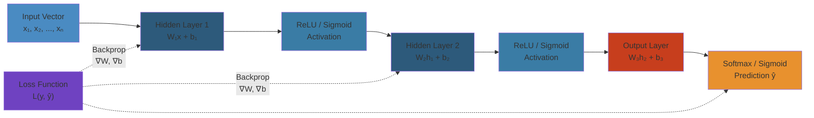

# Neural Networks and Deep Learning




## 1. The Perceptron


### 1.1 Single Perceptron


The perceptron is the fundamental building block of neural networks. It computes a weighted sum of inputs, adds a bias, and applies a step function.

$$y = \phi\left(\sum_{i=1}^{n} w_i x_i + b\right)$$

```python
import numpy as np

class Perceptron:
    def __init__(self, n_features, learning_rate=0.01):
        self.w = np.random.randn(n_features) * 0.01
        self.b = 0.0
        self.lr = learning_rate

    def forward(self, X):
        return np.where(X @ self.w + self.b >= 0, 1, 0)

    def train(self, X, y, epochs=100):
        for epoch in range(epochs):
            for xi, target in zip(X, y):
                prediction = self.forward(xi)
                error = target - prediction
                self.w += self.lr * error * xi
                self.b += self.lr * error

# Perceptron limitation: cannot learn XOR
X = np.array([[0, 0], [0, 1], [1, 0], [1, 1]])
y_xor = np.array([0, 1, 1, 0])  # XOR

p = Perceptron(2)
p.train(X, y_xor, epochs=100)
print(f"XOR predictions: {p.forward(X)}")  # Will fail!
```

### 1.2 Multi-Layer Perceptron (MLP)


MLPs solve the XOR problem by adding hidden layers with non-linear activations:

```python
class MLP:
    def __init__(self, layer_sizes):
        self.params = {}
        for i in range(1, len(layer_sizes)):
            n_in, n_out = layer_sizes[i-1], layer_sizes[i]
            scale = np.sqrt(2.0 / n_in)  # He init for ReLU
            self.params[f'W{i}'] = np.random.randn(n_in, n_out) * scale
            self.params[f'b{i}'] = np.zeros(n_out)

    def relu(self, x):
        return np.maximum(0, x)

    def softmax(self, x):
        ex = np.exp(x - np.max(x, axis=-1, keepdims=True))
        return ex / np.sum(ex, axis=-1, keepdims=True)

    def forward(self, X):
        self.cache = {'A0': X}
        for i in range(1, len(self.params) // 2 + 1):
            W = self.params[f'W{i}']
            b = self.params[f'b{i}']
            A_prev = self.cache[f'A{i-1}']
            Z = A_prev @ W + b
            A = self.relu(Z) if i < len(self.params) // 2 else self.softmax(Z)
            self.cache[f'Z{i}'] = Z
            self.cache[f'A{i}'] = A
        return self.cache[f'A{len(self.params)//2}']

# MLP solves XOR
mlp = MLP([2, 4, 2])  # Input: 2, Hidden: 4, Output: 2
print(f"MLP XOR output shape: {mlp.forward(X).shape}")
```

## 2. Activation Functions


### 2.1 Common Activations


```python
import matplotlib.pyplot as plt

def sigmoid(x):
    return 1 / (1 + np.exp(-np.clip(x, -500, 500)))

def tanh(x):
    return np.tanh(x)

def relu(x):
    return np.maximum(0, x)

def leaky_relu(x, alpha=0.01):
    return np.where(x > 0, x, alpha * x)

def gelu(x):
    return 0.5 * x * (1 + np.tanh(np.sqrt(2 / np.pi) * (x + 0.044715 * x**3)))

def swish(x, beta=1.0):
    return x * sigmoid(beta * x)

# ReLU variants
def prelu(x, alpha):
    return np.where(x > 0, x, alpha * x)

def elu(x, alpha=1.0):
    return np.where(x > 0, x, alpha * (np.exp(x) - 1))

def selu(x, alpha=1.67326, scale=1.0507):
    return scale * np.where(x > 0, x, alpha * (np.exp(x) - 1))
```

### 2.2 Modern Activation Functions


**GELU** (Gaussian Error Linear Unit): Used in BERT, GPT, ViT

$$GELU(x) = x \cdot \Phi(x) \approx 0.5x(1 + \tanh(\sqrt{2/\pi}(x + 0.044715x^3)))$$

**SwiGLU** (Swish-Gated Linear Unit): Used in Llama, PaLM, Mistral

$$SwiGLU(x, W, V) = Swish(xW) \odot (xV)$$

```python
def swiglu(x, W, V):
    # x: input, W, V: weight matrices
    gate = x @ W
    value = x @ V
    return (gate * sigmoid(gate)) * value  # Swish gating


class GLUActivation:
    """Gated Linear Unit and variants"""
    def __init__(self, dim, activation='swiglu'):
        self.W = np.random.randn(dim, dim) / np.sqrt(dim)
        self.V = np.random.randn(dim, dim) / np.sqrt(dim)
        self.activation = activation

    def forward(self, x):
        gate = x @ self.W
        value = x @ self.V
        if self.activation == 'swiglu':
            return (gate * sigmoid(gate)) * value
        elif self.activation == 'geglu':
            return gelu(gate) * value
        elif self.activation == 'reglu':
            return relu(gate) * value
```

### 2.3 Activation Function Comparison


| Function | Range | Gradient | Use Case |
|----------|-------|----------|----------|
| Sigmoid | (0, 1) | Vanishes | Binary output |
| Tanh | (-1, 1) | Vanishes | RNN variants |
| ReLU | [0, ∞) | 0 or 1 | Most CNNs/MLPs |
| Leaky ReLU | (-∞, ∞) | α or 1 | Dead ReLU fix |
| GELU | ≈(-0.17, ∞) | Smooth | Transformers |
| SwiGLU | (-∞, ∞) | Gated | Modern LLMs |

## 3. Forward and Backward Propagation


### 3.1 Forward Pass


```python
def forward_pass(X, params):
    # params: dict of W, b for each layer
    cache = {'A0': X}

    for i in range(1, len(params) // 2 + 1):
        W = params[f'W{i}']
        b = params[f'b{i}']
        A_prev = cache[f'A{i-1}']

        Z = np.dot(A_prev, W) + b
        A = relu(Z) if i < len(params) // 2 else Z  # No activation at output

        cache[f'Z{i}'] = Z
        cache[f'A{i}'] = A

    return cache[f'A{len(params)//2}'], cache
```

### 3.2 Backward Pass (Manual Backprop)


```python
def backward_pass(y_true, cache, params):
    grads = {}
    L = len(params) // 2
    m = y_true.shape[0]

    # Output layer gradient (MSE loss)
    dA = cache[f'A{L}'] - y_true  # dL/dA

    for i in range(L, 0, -1):
        A_prev = cache[f'A{i-1}']
        Z = cache[f'Z{i}']

        # dL/dZ = dL/dA * dA/dZ
        if i < L:
            dZ = dA * (Z > 0)  # ReLU backward
        else:
            dZ = dA  # Linear output

        grads[f'dW{i}'] = np.dot(A_prev.T, dZ) / m
        grads[f'db{i}'] = np.sum(dZ, axis=0, keepdims=True) / m

        # Backprop to previous layer
        dA = np.dot(dZ, params[f'W{i}'].T)

    return grads


# Full training step
def train_step(X, y, params, lr=0.01):
    # Forward
    y_pred, cache = forward_pass(X, params)

    # Loss
    loss = np.mean((y_pred - y) ** 2)

    # Backward
    grads = backward_pass(y, cache, params)

    # Update
    for i in range(1, len(params) // 2 + 1):
        params[f'W{i}'] -= lr * grads[f'dW{i}']
        params[f'b{i}'] -= lr * grads[f'db{i}']

    return loss
```

## 4. Automatic Differentiation


### 4.1 Computation Graph


```python
class Value:
    def __init__(self, data, _children=(), _op=''):
        self.data = data
        self.grad = 0
        self._backward = lambda: None
        self._prev = set(_children)
        self._op = _op

    def __add__(self, other):
        other = other if isinstance(other, Value) else Value(other)
        out = Value(self.data + other.data, (self, other), '+')

        def _backward():
            self.grad += out.grad
            other.grad += out.grad
        out._backward = _backward
        return out

    def __mul__(self, other):
        other = other if isinstance(other, Value) else Value(other)
        out = Value(self.data * other.data, (self, other), '*')

        def _backward():
            self.grad += other.data * out.grad
            other.grad += self.data * out.grad
        out._backward = _backward
        return out

    def relu(self):
        out = Value(max(0, self.data), (self,), 'ReLU')

        def _backward():
            self.grad += (out.data > 0) * out.grad
        out._backward = _backward
        return out

    def backward(self):
        topo = []
        visited = set()

        def build_topo(v):
            if v not in visited:
                visited.add(v)
                for child in v._prev:
                    build_topo(child)
                topo.append(v)

        build_topo(self)
        self.grad = 1
        for v in reversed(topo):
            v._backward()

# Example: f = (a * b) + relu(c)
a = Value(2.0); b = Value(-3.0); c = Value(1.0)
f = a * b + c.relu()
f.backward()
print(f"f = {f.data}, da = {a.grad}, db = {b.grad}, dc = {c.grad}")
```

### 4.2 PyTorch Autograd


```python
import torch

x = torch.tensor([1.0, 2.0, 3.0], requires_grad=True)
w = torch.tensor([0.5, -0.2, 0.1], requires_grad=True)
b = torch.tensor(0.0, requires_grad=True)

# Forward
y = (x * w).sum() + b  # Scalar output
loss = y ** 2  # Simple loss

# Backward
loss.backward()

# Gradients
print(f"dL/dw: {w.grad}")
print(f"dL/db: {b.grad}")

# Gradient computation graph
print(f"Requires grad: x={x.requires_grad}, w={w.requires_grad}")

# Detach from graph
y_detached = y.detach()  # No gradient tracking

# Stop gradient
with torch.no_grad():
    y_no_grad = (x * w).sum() + b  # No gradients computed
```

### 4.3 Higher-Order Gradients


```python
x = torch.tensor(2.0, requires_grad=True)

# First derivative
y = x ** 3
y.backward(retain_graph=True)  # retain_graph for higher-order
print(f"dy/dx at x=2: {x.grad.item()}")  # 12 = 3*(2)² = 12

# Second derivative
x.grad.zero_()
y.backward(create_graph=True)
# Need to do this differently for higher order

def nth_derivative(f, x, n):
    for i in range(n):
        grads = torch.autograd.grad(f, x, create_graph=True)[0]
        f = grads.sum()
    return f

x = torch.tensor(2.0, requires_grad=True)
y = x ** 4  # dy/dx = 4x³, d²y/dx² = 12x², d³y/dx³ = 24x
# First derivative at x=2: 32
# Second derivative at x=2: 48
# Third derivative at x=2: 48
```

## 5. Optimizers


### 5.1 SGD with Momentum


```python
class SGDMomentum:
    def __init__(self, params, lr=0.01, momentum=0.9):
        self.params = params
        self.lr = lr
        self.momentum = momentum
        self.velocities = {k: np.zeros_like(v) for k, v in params.items()}

    def step(self, grads):
        for k in self.params:
            self.velocities[k] = self.momentum * self.velocities[k] - self.lr * grads[f'd{k}']
            self.params[k] += self.velocities[k]
```

### 5.2 Adam (Adaptive Moment Estimation)


```python
class Adam:
    def __init__(self, params, lr=0.001, beta1=0.9, beta2=0.999, eps=1e-8):
        self.params = params
        self.lr = lr
        self.beta1 = beta1
        self.beta2 = beta2
        self.eps = eps
        self.m = {k: np.zeros_like(v) for k, v in params.items()}
        self.v = {k: np.zeros_like(v) for k, v in params.items()}
        self.t = 0

    def step(self, grads):
        self.t += 1
        for k in self.params:
            g = grads[f'd{k}']

            # Biased first moment estimate
            self.m[k] = self.beta1 * self.m[k] + (1 - self.beta1) * g
            # Biased second raw moment estimate
            self.v[k] = self.beta2 * self.v[k] + (1 - self.beta2) * (g ** 2)

            # Bias correction
            m_hat = self.m[k] / (1 - self.beta1 ** self.t)
            v_hat = self.v[k] / (1 - self.beta2 ** self.t)

            # Update
            self.params[k] -= self.lr * m_hat / (np.sqrt(v_hat) + self.eps)
```

### 5.3 AdamW (Adam with Decoupled Weight Decay)


```python
class AdamW:
    def __init__(self, params, lr=0.001, beta1=0.9, beta2=0.999,
                 eps=1e-8, weight_decay=0.01):
        self.params = params
        self.lr = lr
        self.beta1 = beta1
        self.beta2 = beta2
        self.eps = eps
        self.weight_decay = weight_decay
        self.m = {k: np.zeros_like(v) for k, v in params.items()}
        self.v = {k: np.zeros_like(v) for k, v in params.items()}
        self.t = 0

    def step(self, grads):
        self.t += 1
        for k in self.params:
            # Decoupled weight decay
            self.params[k] -= self.lr * self.weight_decay * self.params[k]

            g = grads[f'd{k}']
            self.m[k] = self.beta1 * self.m[k] + (1 - self.beta1) * g
            self.v[k] = self.beta2 * self.v[k] + (1 - self.beta2) * (g ** 2)

            m_hat = self.m[k] / (1 - self.beta1 ** self.t)
            v_hat = self.v[k] / (1 - self.beta2 ** self.t)

            self.params[k] -= self.lr * m_hat / (np.sqrt(v_hat) + self.eps)
```

### 5.4 AdaFactor


Memory-efficient alternative to Adam that factors second-moment matrix:

```python
class AdaFactor:
    def __init__(self, params, lr=0.001, beta1=0.9, beta2=0.999,
                 eps=1e-8, weight_decay=0.01, scale_parameter=True):
        self.params = params
        self.lr = lr
        self.beta1 = beta1
        self.beta2 = beta2
        self.eps = eps
        self.weight_decay = weight_decay
        self.scale_parameter = scale_parameter
        self.m = {}
        self.v = {}
        self.t = 0

    def step(self, grads):
        self.t += 1
        for k in self.params:
            g = grads[f'd{k}']
            shape = g.shape

            # First moment
            if k not in self.m:
                self.m[k] = np.zeros_like(g)
                self.v[k] = np.zeros_like(g)

            self.m[k] = self.beta1 * self.m[k] + (1 - self.beta1) * g

            # Factored second moment
            if len(shape) >= 2:
                # Factor into row and column sums
                g_sq = g ** 2
                v_row = np.mean(g_sq, axis=1, keepdims=True)
                v_col = np.mean(g_sq, axis=0, keepdims=True)
                v_hat = v_row @ v_col / np.mean(g_sq)
            else:
                v_hat = g ** 2

            self.v[k] = self.beta2 * self.v[k] + (1 - self.beta2) * v_hat

            # Step size
            step_size = self.lr
            if self.scale_parameter:
                step_size = step_size * np.sqrt(np.mean(self.v[k]) + self.eps)

            # Update with weight decay
            self.params[k] -= (step_size * self.m[k] /
                              (np.sqrt(self.v[k]) + self.eps) +
                              self.weight_decay * self.params[k])
```

### 5.5 Lion (EvoLved Sign Momentum)


```python
class Lion:
    def __init__(self, params, lr=0.0001, beta1=0.9, beta2=0.99, weight_decay=0.0):
        self.params = params
        self.lr = lr
        self.beta1 = beta1
        self.beta2 = beta2
        self.weight_decay = weight_decay
        self.m = {}

    def step(self, grads):
        for k in self.params:
            g = grads[f'd{k}'] + self.weight_decay * self.params[k]

            if k not in self.m:
                self.m[k] = np.zeros_like(g)

            # Update = sign(beta1 * m + (1 - beta1) * g)
            update = self.beta1 * self.m[k] + (1 - self.beta1) * g
            self.params[k] -= self.lr * np.sign(update)

            # Update momentum
            self.m[k] = self.beta2 * self.m[k] + (1 - self.beta2) * g
```

### 5.6 Optimizer Comparison


| Optimizer | Adaptive LR | Momentum | Memory | Best For |
|-----------|-------------|----------|--------|----------|
| SGD | No | No | Low | CV, simple tasks |
| SGD+Momentum | No | Yes | Low | Stable training |
| Adam | Yes | Yes | 2x params | NLP, Transformers |
| AdamW | Yes | Yes | 2x params | Transformers (decoupled WD) |
| AdaFactor | Yes | Yes | ~1x params | Large models (memory) |
| Lion | No (sign) | Yes | 1x params | Large models (fast) |

## 6. Normalization Layers


### 6.1 Batch Normalization


Normalizes activations across the batch dimension:

$$\hat{x}_i = \frac{x_i - \mu_B}{\sqrt{\sigma_B^2 + \epsilon}}$$
$$y_i = \gamma \hat{x}_i + \beta$$

```python
class BatchNorm1d:
    def __init__(self, num_features, eps=1e-5, momentum=0.1):
        self.gamma = np.ones(num_features)
        self.beta = np.zeros(num_features)
        self.eps = eps
        self.momentum = momentum
        self.running_mean = np.zeros(num_features)
        self.running_var = np.ones(num_features)
        self.training = True

    def forward(self, X):
        if self.training:
            mu = np.mean(X, axis=0)
            var = np.var(X, axis=0)

            # Update running statistics
            self.running_mean = (1 - self.momentum) * self.running_mean + self.momentum * mu
            self.running_var = (1 - self.momentum) * self.running_var + self.momentum * var

            # Normalize with batch stats
            X_norm = (X - mu) / np.sqrt(var + self.eps)
        else:
            # Normalize with running stats at inference
            X_norm = (X - self.running_mean) / np.sqrt(self.running_var + self.eps)

        return self.gamma * X_norm + self.beta


class BatchNorm2d:
    """Batch norm for conv layers (normalizes over N, H, W)"""
    def __init__(self, num_channels, eps=1e-5):
        self.gamma = np.ones(num_channels)
        self.beta = np.zeros(num_channels)
        self.eps = eps
        self.running_mean = np.zeros(num_channels)
        self.running_var = np.ones(num_channels)

    def forward(self, X):
        # X: (N, C, H, W)
        mu = np.mean(X, axis=(0, 2, 3), keepdims=True)
        var = np.var(X, axis=(0, 2, 3), keepdims=True)
        X_norm = (X - mu) / np.sqrt(var + self.eps)
        return self.gamma.reshape(1, -1, 1, 1) * X_norm + self.beta.reshape(1, -1, 1, 1)
```

### 6.2 Layer Normalization


Normalizes across the feature dimension (used in Transformers):

```python
class LayerNorm:
    def __init__(self, hidden_size, eps=1e-5):
        self.gamma = np.ones(hidden_size)
        self.beta = np.zeros(hidden_size)
        self.eps = eps

    def forward(self, X):
        # X: (batch, seq_len, hidden_size)
        mu = np.mean(X, axis=-1, keepdims=True)
        var = np.var(X, axis=-1, keepdims=True)
        X_norm = (X - mu) / np.sqrt(var + self.eps)
        return self.gamma * X_norm + self.beta
```

### 6.3 RMS Norm


Simplified layer norm without mean centering (used in Llama):

```python
class RMSNorm:
    def __init__(self, hidden_size, eps=1e-6):
        self.gamma = np.ones(hidden_size)
        self.eps = eps

    def forward(self, X):
        # RMS = sqrt(mean(x²))
        rms = np.sqrt(np.mean(X ** 2, axis=-1, keepdims=True) + self.eps)
        return self.gamma * (X / rms)
```

### 6.4 Normalization Comparison


| Method | Normalizes | Axis | Used In |
|--------|-----------|------|---------|
| Batch Norm | Per channel | Batch | CNNs, ResNet |
| Layer Norm | Per sample | Features | Transformers, RNNs |
| Instance Norm | Per sample/channel | H,W | Style transfer |
| Group Norm | Per sample/group | H,W | Small batches |
| RMS Norm | Per sample | Features | Llama, Mistral |

## 7. Regularization


### 7.1 Dropout


```python
class Dropout:
    def __init__(self, rate=0.5):
        self.rate = rate
        self.training = True

    def forward(self, X):
        if not self.training:
            return X

        mask = np.random.binomial(1, 1 - self.rate, X.shape)
        # Inverted dropout: scale during training
        return X * mask / (1 - self.rate)

    def backward(self, dout):
        if not self.training:
            return dout

        mask = self.mask
        return dout * mask / (1 - self.rate)
```

### 7.2 Weight Decay (L2 Regularization)


```python
def l2_regularization(params, lambda_reg=0.01):
    l2_loss = 0
    for k, v in params.items():
        if k.startswith('W'):
            l2_loss += 0.5 * lambda_reg * np.sum(v ** 2)
    return l2_loss


def l1_regularization(params, lambda_reg=0.01):
    l1_loss = 0
    for k, v in params.items():
        if k.startswith('W'):
            l1_loss += lambda_reg * np.sum(np.abs(v))
    return l1_loss
```

### 7.3 Label Smoothing


```python
def label_smoothing(y, smoothing=0.1, n_classes=10):
    """Convert hard labels to soft labels"""
    confidence = 1.0 - smoothing
    smooth_label = smoothing / (n_classes - 1)
    y_smooth = y * confidence + smooth_label * (1 - y)
    return y_smooth


def cross_entropy_with_label_smoothing(logits, targets, smoothing=0.1):
    n_classes = logits.shape[-1]
    # Create smoothed targets
    smooth_targets = np.full_like(logits, smoothing / (n_classes - 1))
    for i, t in enumerate(targets):
        smooth_targets[i, t] = 1.0 - smoothing

    # Softmax + cross-entropy
    log_probs = logits - np.log(np.sum(np.exp(logits), axis=-1, keepdims=True))
    return -np.mean(np.sum(smooth_targets * log_probs, axis=-1))
```

### 7.4 Stochastic Depth (DropPath)


```python
class DropPath:
    """Stochastic depth regularization for residual blocks"""
    def __init__(self, drop_prob=0.0):
        self.drop_prob = drop_prob
        self.training = True

    def forward(self, x):
        if not self.training or self.drop_prob == 0:
            return x

        keep_prob = 1 - self.drop_prob
        mask = np.random.binomial(1, keep_prob, size=(x.shape[0], 1, 1, 1))
        return x * mask / keep_prob
```

## 8. Training Dynamics


### 8.1 Learning Rate Schedules


```python
# Linear warmup + cosine decay
def cosine_schedule(step, total_steps, warmup_steps=0, min_lr=0.0, max_lr=0.001):
    if step < warmup_steps:
        return max_lr * step / warmup_steps

    progress = (step - warmup_steps) / (total_steps - warmup_steps)
    return min_lr + 0.5 * (max_lr - min_lr) * (1 + np.cos(np.pi * progress))


# Linear decay
def linear_schedule(step, total_steps, warmup_steps=0, min_lr=0.0, max_lr=0.001):
    if step < warmup_steps:
        return max_lr * step / warmup_steps

    progress = (step - warmup_steps) / (total_steps - warmup_steps)
    return min_lr + (max_lr - min_lr) * (1 - progress)


# Step decay
def step_decay(step, boundaries=[30, 60, 90], decay_rate=0.1, initial_lr=0.1):
    lr = initial_lr
    for boundary in boundaries:
        if step >= boundary:
            lr *= decay_rate
    return lr


# Cosine with restarts (SGDR)
def cosine_annealing_warm_restarts(step, t_0=10, t_mult=2, min_lr=1e-6, max_lr=0.001):
    # t_0: initial restart period
    # t_mult: period multiplier after each restart
    if step < t_0:
        progress = step / t_0
    else:
        # Calculate which cycle
        t_cur = step
        t_i = t_0
        while t_cur >= t_i:
            t_cur -= t_i
            t_i *= t_mult
        progress = t_cur / t_i

    return min_lr + 0.5 * (max_lr - min_lr) * (1 + np.cos(np.pi * progress))


# Warmup scheduler class
class WarmupCosineScheduler:
    def __init__(self, optimizer, warmup_steps, total_steps, min_lr=0.0, max_lr=0.001):
        self.optimizer = optimizer
        self.warmup_steps = warmup_steps
        self.total_steps = total_steps
        self.min_lr = min_lr
        self.max_lr = max_lr
        self.step = 0

    def step(self):
        self.step += 1
        lr = cosine_schedule(self.step, self.total_steps,
                             self.warmup_steps, self.min_lr, self.max_lr)
        for param_group in self.optimizer.param_groups:
            param_group['lr'] = lr
```

### 8.2 Gradient Clipping


```python
def clip_gradients(params, grads, max_norm=1.0):
    """Clip gradients to max_norm (global norm)"""
    total_norm = 0
    for k in params:
        total_norm += np.sum(grads[f'd{k}'] ** 2)
    total_norm = np.sqrt(total_norm)

    if total_norm > max_norm:
        scale = max_norm / total_norm
        for k in params:
            grads[f'd{k}'] *= scale

    return total_norm


def clip_gradient_value(params, grads, clip_value=1.0):
    """Clip each gradient component to [-clip_value, clip_value]"""
    for k in params:
        grads[f'd{k}'] = np.clip(grads[f'd{k}'], -clip_value, clip_value)
```

### 8.3 Gradient Accumulation


```python
class GradientAccumulator:
    def __init__(self, params):
        self.accumulated = {k: np.zeros_like(v) for k, v in params.items()}
        self.steps = 0

    def accumulate(self, grads):
        for k in self.accumulated:
            self.accumulated[k] += grads[f'd{k}']
        self.steps += 1

    def reset(self):
        for k in self.accumulated:
            self.accumulated[k] = np.zeros_like(self.accumulated[k])
        self.steps = 0
```

### 8.4 Mixed Precision Training


```python
# FP16 training with loss scaling
class MixedPrecisionTrainer:
    def __init__(self, model, optimizer, loss_scale=2**15):
        self.model = model
        self.optimizer = optimizer
        self.loss_scale = loss_scale

    def train_step(self, X, y):
        # Forward pass in FP16
        X_fp16 = X.astype(np.float16)

        # Scale loss to prevent underflow
        with torch.cuda.amp.autocast():  # PyTorch
            y_pred = self.model(X)
            loss = self.criterion(y_pred, y)
            scaled_loss = loss * self.loss_scale

        # Backward pass with scaled loss
        scaled_loss.backward()

        # Unscale gradients
        for param in self.model.parameters():
            if param.grad is not None:
                param.grad.data = param.grad.data / self.loss_scale

        # Clip gradients
        torch.nn.utils.clip_grad_norm_(self.model.parameters(), 1.0)

        # Optimizer step
        self.optimizer.step()
        self.optimizer.zero_grad()

        return loss.item()


# AMP (Automatic Mixed Precision) in PyTorch
import torch.cuda.amp as amp

scaler = amp.GradScaler()
for epoch in range(epochs):
    for batch in dataloader:
        with amp.autocast():
            outputs = model(batch)
            loss = criterion(outputs, targets)

        scaler.scale(loss).backward()
        scaler.step(optimizer)
        scaler.update()
        optimizer.zero_grad()
```

## 9. Advanced Architectures


### 9.1 Residual Connections (ResNet)


```python
class ResidualBlock:
    def __init__(self, in_dim, out_dim, activation='relu'):
        self.W1 = np.random.randn(in_dim, out_dim) * np.sqrt(2/in_dim)
        self.b1 = np.zeros(out_dim)
        self.W2 = np.random.randn(out_dim, out_dim) * np.sqrt(2/out_dim)
        self.b2 = np.zeros(out_dim)
        self.activation = activation

        # Skip connection projection if dimensions differ
        if in_dim != out_dim:
            self.W_skip = np.random.randn(in_dim, out_dim) * np.sqrt(2/in_dim)
        else:
            self.W_skip = None

    def forward(self, X):
        identity = X

        # First layer
        Z1 = X @ self.W1 + self.b1
        A1 = relu(Z1)

        # Second layer
        Z2 = A1 @ self.W2 + self.b2

        # Skip connection
        if self.W_skip is not None:
            identity = X @ self.W_skip

        output = relu(Z2 + identity)
        return output
```

### 9.2 Dense Connections (DenseNet)


```python
class DenseBlock:
    def __init__(self, in_dim, growth_rate=32, n_layers=4):
        self.layers = []
        current_dim = in_dim
        for i in range(n_layers):
            layer = {
                'W1': np.random.randn(current_dim, 4 * growth_rate) * np.sqrt(2/current_dim),
                'b1': np.zeros(4 * growth_rate),
                'W2': np.random.randn(4 * growth_rate, growth_rate) * np.sqrt(2/(4 * growth_rate)),
                'b2': np.zeros(growth_rate),
            }
            self.layers.append(layer)
            current_dim += growth_rate

    def forward(self, X):
        features = [X]
        for layer in self.layers:
            h = relu(X @ layer['W1'] + layer['b1'])
            h = h @ layer['W2'] + layer['b2']
            X = np.concatenate([X, h], axis=-1)
            features.append(h)
        return X
```

### 9.3 Attention-Augmented Neural Network


```python
def scaled_dot_product_attention(Q, K, V, mask=None):
    d_k = Q.shape[-1]
    scores = Q @ K.T / np.sqrt(d_k)

    if mask is not None:
        scores = np.where(mask, scores, -1e9)

    weights = np.exp(scores - np.max(scores, axis=-1, keepdims=True))
    weights = weights / np.sum(weights, axis=-1, keepdims=True)
    return weights @ V
```

## 10. Weight Initialization


```python
def xavier_init(fan_in, fan_out):
    """Uniform Xavier/Glorot initialization"""
    limit = np.sqrt(6 / (fan_in + fan_out))
    return np.random.uniform(-limit, limit, (fan_in, fan_out))


def he_init(fan_in, fan_out):
    """He initialization (ReLU networks)"""
    std = np.sqrt(2 / fan_in)
    return np.random.randn(fan_in, fan_out) * std


def orthogonal_init(shape, gain=1.0):
    """Orthogonal initialization (RNNs)"""
    W = np.random.randn(*shape)
    U, _, Vt = np.linalg.svd(W, full_matrices=False)
    # Use U if shape[0] >= shape[1], Vt otherwise
    W_ortho = U if shape[0] >= shape[1] else Vt.T
    return gain * W_ortho


# PyTorch initialization
import torch.nn as nn

def init_weights(m):
    if isinstance(m, nn.Linear):
        nn.init.kaiming_normal_(m.weight, mode='fan_in', nonlinearity='relu')
        nn.init.zeros_(m.bias)
    elif isinstance(m, nn.Conv2d):
        nn.init.kaiming_normal_(m.weight, mode='fan_out', nonlinearity='relu')
    elif isinstance(m, nn.LayerNorm):
        nn.init.ones_(m.weight)
        nn.init.zeros_(m.bias)
```

## 11. Loss Functions


```python
def mse_loss(y_pred, y_true):
    return np.mean((y_pred - y_true) ** 2)

def mae_loss(y_pred, y_true):
    return np.mean(np.abs(y_pred - y_true))

def huber_loss(y_pred, y_true, delta=1.0):
    error = y_pred - y_true
    is_small = np.abs(error) < delta
    squared_loss = 0.5 * error ** 2
    linear_loss = delta * (np.abs(error) - 0.5 * delta)
    return np.mean(np.where(is_small, squared_loss, linear_loss))

def cross_entropy_loss(y_pred, y_true):
    eps = 1e-15
    y_pred = np.clip(y_pred, eps, 1 - eps)
    return -np.mean(y_true * np.log(y_pred))

def focal_loss(y_pred, y_true, gamma=2.0, alpha=0.25):
    """Focal loss for class imbalance"""
    eps = 1e-15
    y_pred = np.clip(y_pred, eps, 1 - eps)
    pt = np.where(y_true == 1, y_pred, 1 - y_pred)
    return -np.mean(alpha * (1 - pt) ** gamma * np.log(pt))

def contrastive_loss(embedding1, embedding2, label, margin=1.0):
    """
    Contrastive loss for siamese networks
    label=1: similar pairs should be close
    label=0: dissimilar pairs should be far
    """
    distance = np.sqrt(np.sum((embedding1 - embedding2) ** 2))
    similar_loss = label * distance ** 2
    dissimilar_loss = (1 - label) * np.maximum(0, margin - distance) ** 2
    return np.mean(similar_loss + dissimilar_loss)
```

## 12. Full Training Pipeline Example


```python
def train_neural_network(model, X_train, y_train, X_val, y_val,
                         epochs=100, batch_size=32, lr=0.001):
    n_samples = X_train.shape[0]
    history = {'train_loss': [], 'val_loss': [], 'val_acc': []}

    optimizer = AdamW(model.params, lr=lr)
    scheduler = WarmupCosineScheduler(
        optimizer, warmup_steps=10, total_steps=epochs,
        max_lr=lr, min_lr=lr * 0.01
    )
    dropout = Dropout(rate=0.3)
    grad_acc = GradientAccumulator(model.params)

    for epoch in range(epochs):
        # Shuffle
        indices = np.random.permutation(n_samples)
        epoch_loss = 0

        for i in range(0, n_samples, batch_size):
            batch_idx = indices[i:i+batch_size]
            X_batch = X_train[batch_idx]
            y_batch = y_train[batch_idx]

            # Forward with dropout
            dropout.train()
            y_pred = model.forward(X_batch)

            loss = cross_entropy_loss(y_pred, y_batch)
            l2_loss = l2_regularization(model.params, lambda_reg=1e-4)
            total_loss = loss + l2_loss

            # Backward (simplified)
            grads = model.backward(y_batch)

            # Gradient clipping
            clip_norm = clip_gradients(model.params, grads, max_norm=1.0)

            # Accumulate then step
            grad_acc.accumulate(grads)

        # Optimizer step
        optimizer.step(grads)
        grad_acc.reset()
        scheduler.step()

        # Evaluation
        dropout.train()
        val_pred = model.forward(X_val)
        val_loss = cross_entropy_loss(val_pred, y_val)
        val_acc = np.mean(np.argmax(val_pred, axis=1) == np.argmax(y_val, axis=1))

        history['train_loss'].append(epoch_loss / (n_samples // batch_size))
        history['val_loss'].append(val_loss)
        history['val_acc'].append(val_acc)

        if epoch % 10 == 0:
            print(f"Epoch {epoch}: loss={history['train_loss'][-1]:.4f}, "
                  f"val_loss={val_loss:.4f}, val_acc={val_acc:.4f}")

    return history
```

## 13. Exercise Problems


**Problem 1**: Implement a 3-layer MLP from scratch (no autograd) for MNIST classification with ReLU activations, cross-entropy loss, and Adam optimizer. Achieve >97% test accuracy.

**Problem 2**: Implement Layer Normalization and RMS Normalization from scratch. Compare their forward/backward pass speeds and show they produce similar training dynamics.

**Problem 3**: Implement a learning rate finder (cyclical LR) that increases LR exponentially each batch and plots loss vs LR to find the optimal max LR.

**Problem 4**: Train a ResNet-18 on CIFAR-10 with both BatchNorm and LayerNorm. Compare convergence speed, final accuracy, and sensitivity to batch size.

**Problem 5**: Implement Mixture of Experts with noisy top-k gating. Train on a synthetic dataset and show how expert specialization emerges.

---

## Related


- [Databases](../../08-databases/) — Vector search, embeddings storage
- [Python Backend](../../03-backend/) — ML inference APIs
- [Cloud Platforms](../../05-cloud/) — GPU/TPU infrastructure
- [Data Engineering](../../02-data-engineering/) — Training data pipelines
- [Performance Engineering](../../18-performance-engineering/) — Model optimization
