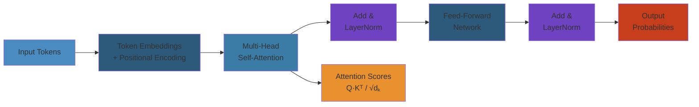

# Transformers: Architecture and Theory




## 1. Attention Mechanism

#### Step-by-Step
1. Process input
2. Validate
3. Execute
4. Return result

#### Code Example
```python
# Example implementation
pass
```

#### Real-World Scenario
This pattern is commonly used in production systems.


### 1.1 Scaled Dot-Product Attention

#### Step-by-Step
1. Process input
2. Validate
3. Execute
4. Return result

#### Code Example
```python
# Example implementation
pass
```

#### Real-World Scenario
This pattern is commonly used in production systems.


The fundamental operation that powers transformers: each token attends to every other token.

$$\text{Attention}(Q, K, V) = \text{softmax}\left(\frac{QK^T}{\sqrt{d_k}}\right)V$$

```python
import numpy as np

def scaled_dot_product_attention(Q, K, V, mask=None):
    """
    Q: (batch, n_heads, seq_len, d_k)
    K: (batch, n_heads, seq_len, d_k)
    V: (batch, n_heads, seq_len, d_v)
    """
    d_k = Q.shape[-1]
    scores = Q @ K.transpose(0, 1, 3, 2) / np.sqrt(d_k)

    if mask is not None:
        scores = np.where(mask, scores, -1e9)

    # Softmax along key dimension
    weights = np.exp(scores - np.max(scores, axis=-1, keepdims=True))
    weights = weights / np.sum(weights, axis=-1, keepdims=True)

    output = weights @ V
    return output, weights


# Single-head attention example
def simple_attention(query, keys, values):
    d_k = query.shape[-1]
    scores = query @ keys.T / np.sqrt(d_k)
    weights = np.exp(scores) / np.sum(np.exp(scores), axis=-1, keepdims=True)
    return weights @ values, weights


# Example: attending to a sequence
query = np.array([[1.0, 0.0]])  # (1, d_k)
keys = np.array([[1.0, 0.0], [0.0, 1.0], [0.5, 0.5]])
values = np.array([[10.0], [20.0], [15.0]])

output, weights = simple_attention(query, keys, values)
print(f"Attention weights: {weights}")
print(f"Output: {output}")
```

### 1.2 Multi-Head Attention

#### Step-by-Step
1. Process input
2. Validate
3. Execute
4. Return result

#### Code Example
```python
# Example implementation
pass
```

#### Real-World Scenario
This pattern is commonly used in production systems.


Multiple attention heads capture different relationship patterns:

```python
class MultiHeadAttention:
    def __init__(self, d_model, n_heads, d_k=None, d_v=None):
        self.d_model = d_model
        self.n_heads = n_heads
        self.d_k = d_k if d_k else d_model // n_heads
        self.d_v = d_v if d_v else d_model // n_heads

        # Weight matrices (combined for all heads)
        self.W_q = np.random.randn(d_model, n_heads * self.d_k) * 0.02
        self.W_k = np.random.randn(d_model, n_heads * self.d_k) * 0.02
        self.W_v = np.random.randn(d_model, n_heads * self.d_v) * 0.02
        self.W_o = np.random.randn(n_heads * self.d_v, d_model) * 0.02

    def split_heads(self, x, d_head):
        # x: (batch, seq_len, d_model)
        batch, seq_len, _ = x.shape
        x = x.reshape(batch, seq_len, self.n_heads, d_head)
        return x.transpose(0, 2, 1, 3)  # (batch, n_heads, seq_len, d_head)

    def combine_heads(self, x):
        # x: (batch, n_heads, seq_len, d_v)
        batch, _, seq_len, d_v = x.shape
        x = x.transpose(0, 2, 1, 3)  # (batch, seq_len, n_heads, d_v)
        return x.reshape(batch, seq_len, -1)

    def forward(self, Q, K, V, mask=None):
        batch = Q.shape[0]

        # Linear projections and split into heads
        Q_proj = Q @ self.W_q  # (batch, seq_q, n_heads * d_k)
        K_proj = K @ self.W_k
        V_proj = V @ self.W_v

        Q_split = self.split_heads(Q_proj, self.d_k)
        K_split = self.split_heads(K_proj, self.d_k)
        V_split = self.split_heads(V_proj, self.d_v)

        # Scaled dot-product attention per head
        output, weights = scaled_dot_product_attention(Q_split, K_split, V_split, mask)

        # Combine heads and project
        output = self.combine_heads(output)
        output = output @ self.W_o

        return output, weights
```

### 1.3 Cross-Attention

#### Step-by-Step
1. Process input
2. Validate
3. Execute
4. Return result

#### Code Example
```python
# Example implementation
pass
```

#### Real-World Scenario
This pattern is commonly used in production systems.


In encoder-decoder models, the decoder attends to encoder outputs:

```python
class CrossAttention(MultiHeadAttention):
    def forward(self, decoder_input, encoder_output, mask=None):
        # Q comes from decoder, K,V come from encoder
        return super().forward(decoder_input, encoder_output, encoder_output, mask)
```

### 1.4 Causal (Masked) Self-Attention

#### Step-by-Step
1. Process input
2. Validate
3. Execute
4. Return result

#### Code Example
```python
# Example implementation
pass
```

#### Real-World Scenario
This pattern is commonly used in production systems.


Prevents tokens from attending to future tokens:

```python
def create_causal_mask(seq_len):
    """Upper triangular mask: True where attention is allowed"""
    mask = np.tril(np.ones((seq_len, seq_len))).astype(bool)
    return mask


def causal_self_attention(Q, K, V):
    d_k = Q.shape[-1]
    seq_len = Q.shape[-2]
    mask = create_causal_mask(seq_len)

    scores = Q @ K.transpose(0, 1, 3, 2) / np.sqrt(d_k)

    # Apply causal mask
    scores = np.where(mask, scores, -1e9)

    weights = np.exp(scores - np.max(scores, axis=-1, keepdims=True))
    weights = weights / np.sum(weights, axis=-1, keepdims=True)

    return weights @ V, weights
```

## 2. Transformer Architecture

#### Step-by-Step
1. Process input
2. Validate
3. Execute
4. Return result

#### Code Example
```python
# Example implementation
pass
```

#### Real-World Scenario
This pattern is commonly used in production systems.


### 2.1 Encoder Block

#### Step-by-Step
1. Process input
2. Validate
3. Execute
4. Return result

#### Code Example
```python
# Example implementation
pass
```

#### Real-World Scenario
This pattern is commonly used in production systems.


```python
class TransformerEncoderBlock:
    def __init__(self, d_model, n_heads, d_ff, dropout=0.1):
        self.attention = MultiHeadAttention(d_model, n_heads)
        self.norm1 = LayerNorm(d_model)
        self.norm2 = LayerNorm(d_model)

        # Feed-forward network
        self.ff_W1 = np.random.randn(d_model, d_ff) * 0.02
        self.ff_b1 = np.zeros(d_ff)
        self.ff_W2 = np.random.randn(d_ff, d_model) * 0.02
        self.ff_b2 = np.zeros(d_model)

        self.dropout = dropout

    def forward(self, x, mask=None):
        # Self-attention with residual
        attn_out, weights = self.attention.forward(x, x, x, mask)
        x = self.norm1.forward(x + attn_out)

        # Feed-forward with residual
        ff_out = relu(x @ self.ff_W1 + self.ff_b1) @ self.ff_W2 + self.ff_b2
        x = self.norm2.forward(x + ff_out)

        return x, weights


def relu(x):
    return np.maximum(0, x)


class LayerNorm:
    def __init__(self, hidden_size, eps=1e-5):
        self.gamma = np.ones(hidden_size)
        self.beta = np.zeros(hidden_size)
        self.eps = eps

    def forward(self, X):
        mu = np.mean(X, axis=-1, keepdims=True)
        var = np.var(X, axis=-1, keepdims=True)
        X_norm = (X - mu) / np.sqrt(var + self.eps)
        return self.gamma * X_norm + self.beta
```

### 2.2 Decoder Block

#### Step-by-Step
1. Process input
2. Validate
3. Execute
4. Return result

#### Code Example
```python
# Example implementation
pass
```

#### Real-World Scenario
This pattern is commonly used in production systems.


```python
class TransformerDecoderBlock:
    def __init__(self, d_model, n_heads, d_ff, dropout=0.1):
        # Masked self-attention
        self.self_attention = MultiHeadAttention(d_model, n_heads)
        self.norm1 = LayerNorm(d_model)

        # Cross-attention
        self.cross_attention = MultiHeadAttention(d_model, n_heads)
        self.norm2 = LayerNorm(d_model)

        # Feed-forward
        self.ff_W1 = np.random.randn(d_model, d_ff) * 0.02
        self.ff_b1 = np.zeros(d_ff)
        self.ff_W2 = np.random.randn(d_ff, d_model) * 0.02
        self.ff_b2 = np.zeros(d_model)

        self.norm3 = LayerNorm(d_model)

    def forward(self, x, encoder_output, causal_mask=None, padding_mask=None):
        # Masked self-attention
        self_attn, _ = self.self_attention.forward(x, x, x, causal_mask)
        x = self.norm1.forward(x + self_attn)

        # Cross-attention: Q from decoder, K,V from encoder
        cross_attn, _ = self.cross_attention.forward(x, encoder_output, encoder_output, padding_mask)
        x = self.norm2.forward(x + cross_attn)

        # Feed-forward
        ff_out = relu(x @ self.ff_W1 + self.ff_b1) @ self.ff_W2 + self.ff_b2
        x = self.norm3.forward(x + ff_out)

        return x
```

### 2.3 Full Transformer

#### Step-by-Step
1. Process input
2. Validate
3. Execute
4. Return result

#### Code Example
```python
# Example implementation
pass
```

#### Real-World Scenario
This pattern is commonly used in production systems.


```python
class Transformer:
    def __init__(self, vocab_size, d_model=512, n_heads=8, n_layers=6,
                 d_ff=2048, max_seq_len=512, dropout=0.1):
        self.token_embedding = np.random.randn(vocab_size, d_model) * 0.02
        self.pos_encoding = self.create_positional_encoding(max_seq_len, d_model)

        self.encoder_blocks = [
            TransformerEncoderBlock(d_model, n_heads, d_ff, dropout)
            for _ in range(n_layers)
        ]
        self.decoder_blocks = [
            TransformerDecoderBlock(d_model, n_heads, d_ff, dropout)
            for _ in range(n_layers)
        ]

        self.output_proj = np.random.randn(d_model, vocab_size) * 0.02

    def create_positional_encoding(self, max_seq_len, d_model):
        pe = np.zeros((max_seq_len, d_model))
        for pos in range(max_seq_len):
            for i in range(0, d_model, 2):
                pe[pos, i] = np.sin(pos / (10000 ** (i / d_model)))
                pe[pos, i + 1] = np.cos(pos / (10000 ** ((i + 1) / d_model)))
        return pe

    def encode(self, tokens):
        seq_len = len(tokens)
        x = self.token_embedding[tokens] + self.pos_encoding[:seq_len]

        for block in self.encoder_blocks:
            x, _ = block.forward(x)

        return x

    def decode(self, tokens, encoder_output):
        seq_len = len(tokens)
        x = self.token_embedding[tokens] + self.pos_encoding[:seq_len]

        causal_mask = create_causal_mask(seq_len)

        for block in self.decoder_blocks:
            x = block.forward(x, encoder_output, causal_mask)

        logits = x @ self.output_proj
        return logits

    def generate(self, encoder_output, max_tokens=50, start_token=0):
        generated = [start_token]
        for _ in range(max_tokens):
            logits = self.decode(np.array(generated), encoder_output)
            next_logits = logits[-1, :]
            probs = np.exp(next_logits) / np.sum(np.exp(next_logits))
            next_token = np.random.choice(len(probs), p=probs)
            generated.append(next_token)
        return generated
```

## 3. Positional Encoding

#### Step-by-Step
1. Process input
2. Validate
3. Execute
4. Return result

#### Code Example
```python
# Example implementation
pass
```

#### Real-World Scenario
This pattern is commonly used in production systems.


### 3.1 Absolute Sinusoidal Positional Encoding

#### Step-by-Step
1. Process input
2. Validate
3. Execute
4. Return result

#### Code Example
```python
# Example implementation
pass
```

#### Real-World Scenario
This pattern is commonly used in production systems.


```python
class SinusoidalPositionalEncoding:
    def __init__(self, d_model, max_seq_len=512, base=10000.0):
        self.d_model = d_model
        self.max_seq_len = max_seq_len
        self.base = base

        pe = np.zeros((max_seq_len, d_model))
        for pos in range(max_seq_len):
            for i in range(0, d_model, 2):
                angle = pos / (base ** (i / d_model))
                pe[pos, i] = np.sin(angle)
                pe[pos, i + 1] = np.cos(angle)

        self.pe = pe

    def forward(self, x):
        # x: (batch, seq_len, d_model)
        return x + self.pe[:x.shape[1]]
```

### 3.2 Relative Positional Encoding

#### Step-by-Step
1. Process input
2. Validate
3. Execute
4. Return result

#### Code Example
```python
# Example implementation
pass
```

#### Real-World Scenario
This pattern is commonly used in production systems.


```python
class RelativePositionalEncoding:
    def __init__(self, d_model, max_relative_pos=128):
        self.d_model = d_model
        self.max_relative_pos = max_relative_pos
        # Learnable embeddings for each relative position offset
        self.rel_embeddings = np.random.randn(
            2 * max_relative_pos + 1, d_model
        ) * 0.02

    def forward(self, Q, K, pos_embedding):
        # pos_embedding: relative position bias
        seq_len = Q.shape[-2]
        scores = Q @ K.transpose()

        # Add relative position bias
        for i in range(seq_len):
            for j in range(seq_len):
                rel_pos = j - i
                rel_pos_clamped = np.clip(
                    rel_pos, -self.max_relative_pos, self.max_relative_pos
                )
                rel_idx = rel_pos_clamped + self.max_relative_pos
                scores[:, :, i, j] += pos_embedding[:, :, rel_idx].sum(axis=-1)

        return scores


class RoPE:
    """
    Rotary Position Embedding (used in Llama, Mistral, GPT-NeoX)
    Rotates query/key vectors by an angle proportional to position
    """
    def __init__(self, d_model, max_seq_len=4096, base=10000.0):
        self.d_model = d_model
        self.max_seq_len = max_seq_len
        self.base = base

        # Precompute frequencies
        inv_freq = 1.0 / (base ** (np.arange(0, d_model, 2) / d_model))
        self.inv_freq = inv_freq

    def precompute_freqs(self, seq_len):
        positions = np.arange(seq_len)
        freqs = np.outer(positions, self.inv_freq)  # (seq_len, d_model/2)
        return freqs

    def apply_rotary(self, x, freqs):
        # x: (batch, n_heads, seq_len, d_per_head)
        # Split into pairs and rotate
        d_half = x.shape[-1] // 2
        x_rot = x[..., :d_half]
        x_pass = x[..., d_half:]

        cos = np.cos(freqs)[:x.shape[-2], :d_half]
        sin = np.sin(freqs)[:x.shape[-2], :d_half]

        # Rotate: (x * cos(θ) - rotate_half(x) * sin(θ))
        x_rotated = x_rot * cos - np.roll(x_rot, shift=1, axis=-1) * sin
        return np.concatenate([x_rotated, x_pass], axis=-1)

    def forward(self, Q, K, positions=None):
        seq_len = Q.shape[-2]
        freqs = self.precompute_freqs(seq_len)
        Q = self.apply_rotary(Q, freqs)
        K = self.apply_rotary(K, freqs)
        return Q, K
```

### 3.3 ALiBi (Attention with Linear Biases)

#### Step-by-Step
1. Process input
2. Validate
3. Execute
4. Return result

#### Code Example
```python
# Example implementation
pass
```

#### Real-World Scenario
This pattern is commonly used in production systems.


```python
class ALiBi:
    """
    ALiBi: replaces positional encoding with a bias on attention scores.
    Used in BLOOM, MPT.
    """
    def __init__(self, n_heads, max_seq_len=2048):
        self.n_heads = n_heads
        self.max_seq_len = max_seq_len

        # Each head gets a different slope
        # Slopes follow geometric sequence: 2^(-8/n_heads * i)
        def get_slopes(n):
            def get_slopes_power_of_2(n):
                start = 2 ** (-(2 ** -(np.log2(n) - 3)))
                return np.array([start * 2 ** (-i) for i in range(n)])

            if np.log2(n).is_integer():
                return get_slopes_power_of_2(n)
            else:
                closest_power = 2 ** np.floor(np.log2(n))
                slopes = get_slopes_power_of_2(closest_power)
                extra = get_slopes(2 * closest_power)[0::2][:n - int(closest_power)]
                return np.concatenate([slopes, extra])

        self.slopes = get_slopes(n_heads)
        self.bias_matrix = None

    def build_bias(self, seq_len):
        # Create (1, n_heads, seq_len, seq_len) bias
        positions = np.arange(seq_len)
        relative_positions = positions[:, None] - positions[None, :]
        # Upper triangular (causal): only negative positions matter
        relative_positions = np.abs(relative_positions)

        bias = np.zeros((1, self.n_heads, seq_len, seq_len))
        for h in range(self.n_heads):
            bias[0, h] = -self.slopes[h] * relative_positions

        # Apply causal mask
        mask = np.tril(np.ones((seq_len, seq_len)))
        bias = np.where(mask, bias, -1e9)

        self.bias_matrix = bias
        return bias

    def apply(self, scores, seq_len):
        if self.bias_matrix is None or self.bias_matrix.shape[-1] != seq_len:
            self.build_bias(seq_len)
        return scores + self.bias_matrix[:, :, :seq_len, :seq_len]
```

## 4. Layer Normalization Placement

#### Step-by-Step
1. Process input
2. Validate
3. Execute
4. Return result

#### Code Example
```python
# Example implementation
pass
```

#### Real-World Scenario
This pattern is commonly used in production systems.


### 4.1 Post-LN (Original Transformer)

#### Step-by-Step
1. Process input
2. Validate
3. Execute
4. Return result

#### Code Example
```python
# Example implementation
pass
```

#### Real-World Scenario
This pattern is commonly used in production systems.


```python
class PostLNEncoderBlock:
    """Layer norm AFTER residual addition (original paper)"""
    def __init__(self, d_model, n_heads, d_ff):
        self.attention = MultiHeadAttention(d_model, n_heads)
        self.norm1 = LayerNorm(d_model)
        self.ff = FeedForward(d_model, d_ff)
        self.norm2 = LayerNorm(d_model)

    def forward(self, x, mask=None):
        # Norm after residual
        attn_out, _ = self.attention.forward(x, x, x, mask)
        x = self.norm1.forward(x + attn_out)

        ff_out = self.ff.forward(x)
        x = self.norm2.forward(x + ff_out)
        return x
```

### 4.2 Pre-LN (Modern Standard)

#### Step-by-Step
1. Process input
2. Validate
3. Execute
4. Return result

#### Code Example
```python
# Example implementation
pass
```

#### Real-World Scenario
This pattern is commonly used in production systems.


```python
class PreLNEncoderBlock:
    """Layer norm BEFORE attention/FFN (GPT, Llama, etc.)"""
    def __init__(self, d_model, n_heads, d_ff):
        self.attention = MultiHeadAttention(d_model, n_heads)
        self.norm1 = LayerNorm(d_model)
        self.ff = FeedForward(d_model, d_ff)
        self.norm2 = LayerNorm(d_model)

    def forward(self, x, mask=None):
        # Norm before attention
        residual = x
        x = self.norm1.forward(x)
        attn_out, _ = self.attention.forward(x, x, x, mask)
        x = residual + attn_out

        # Norm before FFN
        residual = x
        x = self.norm2.forward(x)
        ff_out = self.ff.forward(x)
        x = residual + ff_out
        return x
```

### 4.3 Sandwich-LN

#### Step-by-Step
1. Process input
2. Validate
3. Execute
4. Return result

#### Code Example
```python
# Example implementation
pass
```

#### Real-World Scenario
This pattern is commonly used in production systems.


```python
class SandwichLNEncoderBlock:
    """Layer norm before AND after each sublayer"""
    def __init__(self, d_model, n_heads, d_ff):
        self.attention = MultiHeadAttention(d_model, n_heads)
        self.norm1_pre = LayerNorm(d_model)
        self.norm1_post = LayerNorm(d_model)
        self.ff = FeedForward(d_model, d_ff)
        self.norm2_pre = LayerNorm(d_model)
        self.norm2_post = LayerNorm(d_model)

    def forward(self, x, mask=None):
        attn_out, _ = self.attention.forward(
            self.norm1_pre.forward(x), x, x, mask
        )
        x = self.norm1_post.forward(x + attn_out)

        ff_out = self.ff.forward(self.norm2_pre.forward(x))
        x = self.norm2_post.forward(x + ff_out)
        return x
```

### 4.4 Comparison

#### Step-by-Step
1. Process input
2. Validate
3. Execute
4. Return result

#### Code Example
```python
# Example implementation
pass
```

#### Real-World Scenario
This pattern is commonly used in production systems.


| Variant | Norm Placement | Training Stability | Used In |
|---------|---------------|-------------------|---------|
| Post-LN | After residual | Unstable (needs warmup) | Original Transformer |
| Pre-LN | Before sublayer | Stable, faster | GPT, Llama, BERT |
| Sandwich-LN | Both sides | Most stable | Deep models (>100 layers) |

```python
# Pre-LN is preferred because:
# 1. Gradient flow is better (residual paths are clean)
# 2. Output scale doesn't grow with depth
# 3. No warmup needed in many cases
# 4. More compatible with FP16 training
```

## 5. Feed-Forward Networks

#### Step-by-Step
1. Process input
2. Validate
3. Execute
4. Return result

#### Code Example
```python
# Example implementation
pass
```

#### Real-World Scenario
This pattern is commonly used in production systems.


### 5.1 Standard FFN (SwiGLU variant)

#### Step-by-Step
1. Process input
2. Validate
3. Execute
4. Return result

#### Code Example
```python
# Example implementation
pass
```

#### Real-World Scenario
This pattern is commonly used in production systems.


```python
class FeedForward:
    def __init__(self, d_model, d_ff, activation='relu'):
        self.W1 = np.random.randn(d_model, d_ff) * np.sqrt(2/d_model)
        self.b1 = np.zeros(d_ff)
        self.W2 = np.random.randn(d_ff, d_model) * np.sqrt(2/d_ff)
        self.b2 = np.zeros(d_model)
        self.activation = activation

    def forward(self, x):
        h = x @ self.W1 + self.b1
        if self.activation == 'relu':
            h = relu(h)
        elif self.activation == 'gelu':
            h = gelu(h)
        return h @ self.W2 + self.b2


class SwiGLUFFN:
    """SwiGLU FFN: used in Llama, PaLM, Mistral"""
    def __init__(self, d_model, d_ff):
        # Hidden dimension is typically 8/3 * d_model for SwiGLU
        # (to match FLOPs with standard FFN at 4*d_model)
        self.W1 = np.random.randn(d_model, d_ff) * np.sqrt(2/d_model)
        self.W2 = np.random.randn(d_model, d_ff) * np.sqrt(2/d_model)
        self.W3 = np.random.randn(d_ff, d_model) * np.sqrt(2/d_ff)

    def forward(self, x):
        gate = x @ self.W1  # Gate projection
        value = x @ self.W2  # Value projection
        return (gate * sigmoid(gate)) @ self.W3  # Swish gated


class GatedFFN:
    """General gated FFN"""
    def __init__(self, d_model, d_ff, gate_fn='swiglu'):
        self.W_gate = np.random.randn(d_model, d_ff) * np.sqrt(2/d_model)
        self.W_up = np.random.randn(d_model, d_ff) * np.sqrt(2/d_model)
        self.W_down = np.random.randn(d_ff, d_model) * np.sqrt(2/d_ff)
        self.gate_fn = gate_fn

    def forward(self, x):
        gate = x @ self.W_gate
        up = x @ self.W_up
        if self.gate_fn == 'swiglu':
            gate = gate * sigmoid(gate)  # Swish
        elif self.gate_fn == 'geglu':
            gate = gelu(gate)
        elif self.gate_fn == 'reglu':
            gate = relu(gate)
        return (gate * up) @ self.W_down


def sigmoid(x):
    return 1 / (1 + np.exp(-np.clip(x, -500, 500)))


def gelu(x):
    return 0.5 * x * (1 + np.tanh(np.sqrt(2/np.pi) * (x + 0.044715 * x**3)))
```

## 6. Key-Value (KV) Cache

#### Step-by-Step
1. Process input
2. Validate
3. Execute
4. Return result

#### Code Example
```python
# Example implementation
pass
```

#### Real-World Scenario
This pattern is commonly used in production systems.


### 6.1 KV Cache Implementation

#### Step-by-Step
1. Process input
2. Validate
3. Execute
4. Return result

#### Code Example
```python
# Example implementation
pass
```

#### Real-World Scenario
This pattern is commonly used in production systems.


During autoregressive decoding, we cache previous keys and values to avoid recomputation:

```python
class KVCache:
    def __init__(self, max_batch_size, max_seq_len, n_heads, d_head):
        self.max_batch_size = max_batch_size
        self.max_seq_len = max_seq_len
        self.n_heads = n_heads
        self.d_head = d_head

        # Pre-allocate cache tensors
        self.cache_k = np.zeros((max_batch_size, n_heads, max_seq_len, d_head))
        self.cache_v = np.zeros((max_batch_size, n_heads, max_seq_len, d_head))
        self.current_len = 0

    def update(self, new_k, new_v):
        """Append new tokens' K,V to cache"""
        batch, n_heads, seq_len, d_head = new_k.shape
        self.cache_k[:, :, self.current_len:self.current_len+seq_len] = new_k
        self.cache_v[:, :, self.current_len:self.current_len+seq_len] = new_v
        self.current_len += seq_len

    def get(self):
        """Get cached K,V up to current length"""
        return (self.cache_k[:, :, :self.current_len],
                self.cache_v[:, :, :self.current_len])

    def reset(self):
        self.current_len = 0
        self.cache_k.fill(0)
        self.cache_v.fill(0)


class DecoderWithKVCache:
    def __init__(self, d_model, n_heads, n_layers, d_ff, max_seq_len=2048):
        self.layers = []
        for _ in range(n_layers):
            self.layers.append({
                'self_attn': MultiHeadAttention(d_model, n_heads),
                'cross_attn': MultiHeadAttention(d_model, n_heads),
                'ff': SwiGLUFFN(d_model, d_ff),
                'norm1': RMSNorm(d_model),
                'norm2': RMSNorm(d_model),
                'norm3': RMSNorm(d_model),
            })

        self.kv_caches = [KVCache(1, max_seq_len, n_heads, d_model // n_heads)
                          for _ in range(n_layers)]

    def forward_with_cache(self, x, encoder_output=None):
        for i, layer in enumerate(self.layers):
            residual = x
            x = layer['norm1'].forward(x)

            # Self-attention with cached K,V
            Q = x @ layer['self_attn'].W_q
            K = x @ layer['self_attn'].W_k
            V = x @ layer['self_attn'].W_v

            # Use K,V cache
            cached_k, cached_v = self.kv_caches[i].get()
            self.kv_caches[i].update(K, V)
            full_k = np.concatenate([cached_k, K], axis=-2)
            full_v = np.concatenate([cached_v, V], axis=-2)

            # Attention with full cached K,V
            attn_out = scaled_dot_product_attention(
                Q, full_k, full_v
            )
            x = residual + attn_out

            # Cross-attention, FFN...
```

### 6.2 Speculative Decoding

#### Step-by-Step
1. Process input
2. Validate
3. Execute
4. Return result

#### Code Example
```python
# Example implementation
pass
```

#### Real-World Scenario
This pattern is commonly used in production systems.


```python
class SpeculativeDecoder:
    """
    Speculative decoding: use a draft model to propose tokens,
    then verify with target model in parallel.
    """
    def __init__(self, target_model, draft_model, gamma=5):
        self.target = target_model
        self.draft = draft_model
        self.gamma = gamma  # Number of draft tokens

    def generate(self, prompt, max_tokens=256):
        generated = prompt.copy()

        while len(generated) < max_tokens:
            # Draft phase: quickly generate gamma tokens
            draft_tokens = []
            draft_probs = []
            x = generated.copy()

            for _ in range(self.gamma):
                logits = self.draft.forward(x)
                next_probs = softmax(logits[-1])
                next_token = np.random.choice(len(next_probs), p=next_probs)
                draft_tokens.append(next_token)
                draft_probs.append(next_probs)
                x = x + [next_token]

            # Target phase: verify all drafts in one forward pass
            extended = generated + draft_tokens
            target_logits = self.target.forward(extended)
            target_probs = [softmax(logits) for logits in target_logits[-(self.gamma+1):]]

            # Rejection sampling for each draft token
            accepted = 0
            for i in range(self.gamma):
                draft_p = draft_probs[i][draft_tokens[i]]
                target_p = target_probs[i][draft_tokens[i]]

                if np.random.rand() < min(1, target_p / draft_p):
                    accepted += 1
                else:
                    # Re-sample from adjusted distribution
                    adjusted_dist = np.maximum(0, target_probs[i] - draft_probs[i])
                    adjusted_dist /= adjusted_dist.sum()
                    resample_token = np.random.choice(len(adjusted_dist), p=adjusted_dist)
                    generated.append(resample_token)
                    break

            if accepted == self.gamma:
                generated.append(draft_tokens[-1])

        return generated


def softmax(x):
    e_x = np.exp(x - np.max(x))
    return e_x / e_x.sum()
```

## 7. Flash Attention

#### Step-by-Step
1. Process input
2. Validate
3. Execute
4. Return result

#### Code Example
```python
# Example implementation
pass
```

#### Real-World Scenario
This pattern is commonly used in production systems.


Flash Attention computes exact attention without materializing the full N×N attention matrix:

```python
def flash_attention(Q, K, V, block_size=64):
    """
    Tiling-based attention: process in blocks to reduce memory.
    O(N²) compute but O(N) memory on HBM.
    """
    batch, n_heads, seq_len, d_k = Q.shape
    softmax_scale = 1.0 / np.sqrt(d_k)

    output = np.zeros_like(Q)
    l = np.zeros((batch, n_heads, seq_len, 1))  # Normalization factor
    m = np.full((batch, n_heads, seq_len, 1), -np.inf)  # Running max

    # Process Q in blocks
    for i in range(0, seq_len, block_size):
        q_block = Q[:, :, i:i+block_size]
        block_m = np.full((batch, n_heads, block_size, 1), -np.inf)
        block_l = np.zeros((batch, n_heads, block_size, 1))
        block_o = np.zeros_like(q_block)

        for j in range(0, seq_len, block_size):
            k_block = K[:, :, j:j+block_size]
            v_block = V[:, :, j:j+block_size]

            # S = Q * K^T, in blocks
            s_block = q_block @ k_block.transpose(0, 1, 3, 2) * softmax_scale

            # Online softmax
            new_m = np.maximum(block_m, s_block.max(axis=-1, keepdims=True))
            p_block = np.exp(s_block - new_m)
            block_l = block_l * np.exp(block_m - new_m) + p_block.sum(axis=-1, keepdims=True)
            block_o = block_o * np.exp(block_m - new_m) + p_block @ v_block
            block_m = new_m

        block_o = block_o / block_l
        output[:, :, i:i+block_size] = block_o
        l[:, :, i:i+block_size] = block_l
        m[:, :, i:i+block_size] = block_m

    return output
```

## 8. Major Transformer Variants

#### Step-by-Step
1. Process input
2. Validate
3. Execute
4. Return result

#### Code Example
```python
# Example implementation
pass
```

#### Real-World Scenario
This pattern is commonly used in production systems.


### 8.1 BERT (Encoder-Only)

#### Step-by-Step
1. Process input
2. Validate
3. Execute
4. Return result

#### Code Example
```python
# Example implementation
pass
```

#### Real-World Scenario
This pattern is commonly used in production systems.


```python
class BERT:
    def __init__(self, vocab_size=30522, d_model=768, n_heads=12,
                 n_layers=12, d_ff=3072, max_seq_len=512):
        self.token_embedding = np.random.randn(vocab_size, d_model) * 0.02
        self.segment_embedding = np.random.randn(2, d_model) * 0.02
        self.pos_encoding = SinusoidalPositionalEncoding(d_model, max_seq_len)

        self.encoder_blocks = [
            PreLNEncoderBlock(d_model, n_heads, d_ff)
            for _ in range(n_layers)
        ]

        # MLM head
        self.mlm_head = NNLayer(d_model, d_model, 'gelu')
        self.mlm_proj = np.random.randn(d_model, vocab_size) * 0.02

    def forward(self, input_ids, segment_ids=None, attention_mask=None):
        x = self.token_embedding[input_ids]
        if segment_ids is not None:
            x += self.segment_embedding[segment_ids]
        x = self.pos_encoding.forward(x)

        for block in self.encoder_blocks:
            x = block.forward(x, attention_mask)

        return x

    def mlm_predict(self, x):
        return self.mlm_proj @ self.mlm_head(x)


class NNLayer:
    def __init__(self, d_in, d_out, activation='relu'):
        self.W = np.random.randn(d_in, d_out) * np.sqrt(2/d_in)
        self.b = np.zeros(d_out)
        self.activation = activation

    def forward(self, x):
        h = x @ self.W + self.b
        if self.activation == 'gelu':
            h = gelu(h)
        return h
```

### 8.2 GPT (Decoder-Only)

#### Step-by-Step
1. Process input
2. Validate
3. Execute
4. Return result

#### Code Example
```python
# Example implementation
pass
```

#### Real-World Scenario
This pattern is commonly used in production systems.


```python
class GPT:
    def __init__(self, vocab_size=50257, d_model=768, n_heads=12,
                 n_layers=12, d_ff=3072, max_seq_len=1024):
        self.token_embedding = np.random.randn(vocab_size, d_model) * 0.02
        self.pos_encoding = SinusoidalPositionalEncoding(d_model, max_seq_len)

        self.decoder_blocks = []
        for _ in range(n_layers):
            block = {
                'attention': MultiHeadAttention(d_model, n_heads),
                'norm1': LayerNorm(d_model),
                'ff': FeedForward(d_model, d_ff, 'gelu'),
                'norm2': LayerNorm(d_model),
            }
            self.decoder_blocks.append(block)

        self.final_norm = LayerNorm(d_model)
        self.lm_head = np.random.randn(d_model, vocab_size) * 0.02

    def forward(self, tokens):
        seq_len = len(tokens)
        x = self.token_embedding[tokens] + self.pos_encoding.pe[:seq_len]

        causal_mask = create_causal_mask(seq_len)

        for block in self.decoder_blocks:
            # Pre-LN
            residual = x
            x = block['norm1'].forward(x)
            attn_out, _ = block['attention'].forward(x, x, x, causal_mask)
            x = residual + attn_out

            residual = x
            x = block['norm2'].forward(x)
            ff_out = block['ff'].forward(x)
            x = residual + ff_out

        x = self.final_norm.forward(x)
        logits = x @ self.lm_head
        return logits

    def generate(self, prompt, max_new_tokens=100, temperature=0.8, top_k=50):
        tokens = prompt.copy()
        for _ in range(max_new_tokens):
            # Truncate to max_seq_len
            context = tokens[-1024:]
            logits = self.forward(np.array(context))
            next_logits = logits[-1] / temperature

            # Top-k filtering
            top_k_indices = np.argsort(next_logits)[-top_k:]
            top_k_logits = np.full_like(next_logits, -float('inf'))
            top_k_logits[top_k_indices] = next_logits[top_k_indices]

            # Sample
            probs = softmax(top_k_logits)
            next_token = np.random.choice(len(probs), p=probs)
            tokens.append(next_token)

        return tokens
```

### 8.3 Llama Architecture

#### Step-by-Step
1. Process input
2. Validate
3. Execute
4. Return result

#### Code Example
```python
# Example implementation
pass
```

#### Real-World Scenario
This pattern is commonly used in production systems.


Llama modifications over original transformer:
- Pre-LN with RMS Norm
- SwiGLU FFN (with 8/3 * d_model hidden dimension)
- RoPE positional encoding
- No bias in linear layers

```python
class LlamaBlock:
    def __init__(self, d_model, n_heads, d_ff, rope):
        self.attention = MultiHeadAttention(d_model, n_heads)
        self.attention.W_q = np.zeros_like(self.attention.W_q)  # No bias
        self.norm1 = RMSNorm(d_model)
        self.ff = SwiGLUFFN(d_model, d_ff)
        self.norm2 = RMSNorm(d_model)
        self.rope = rope

    def forward(self, x, mask=None, positions=None):
        residual = x
        x = self.norm1.forward(x)
        # Apply RoPE to Q and K
        Q = x @ self.attention.W_q
        K = x @ self.attention.W_k
        V = x @ self.attention.W_v
        Q, K = self.rope.forward(Q, K, positions)
        # Attention...
        attn_out = scaled_dot_product_attention(Q, K, V, mask)
        x = residual + attn_out

        residual = x
        x = self.norm2.forward(x)
        ff_out = self.ff.forward(x)
        x = residual + ff_out
        return x
```

### 8.4 Mistral / DeepSeek Architecture

#### Step-by-Step
1. Process input
2. Validate
3. Execute
4. Return result

#### Code Example
```python
# Example implementation
pass
```

#### Real-World Scenario
This pattern is commonly used in production systems.


Mistral introduces **sliding window attention** and **rolling buffer KV cache**:

```python
class SlidingWindowAttention:
    """Attention limited to a local window (Mistral: W=4096)"""
    def __init__(self, d_model, n_heads, window_size=4096):
        self.attention = MultiHeadAttention(d_model, n_heads)
        self.window_size = window_size

    def forward(self, x, mask=None):
        seq_len = x.shape[-2]
        window_start = max(0, seq_len - self.window_size)

        # Only attend to last window_size tokens
        K = x[:, window_start:seq_len] @ self.attention.W_k
        V = x[:, window_start:seq_len] @ self.attention.W_v
        Q = x @ self.attention.W_q

        output, weights = scaled_dot_product_attention(Q, K, V, mask)
        return output, weights


# Grouped Query Attention (GQA) - used in Llama 2 70B, Mistral
class GroupedQueryAttention:
    """
    GQA: n_kv_heads < n_heads
    Multiple query heads share one key-value head group.
    Reduces KV cache size by ~n_heads/n_kv_heads.
    """
    def __init__(self, d_model, n_heads, n_kv_heads):
        self.d_model = d_model
        self.n_heads = n_heads
        self.n_kv_heads = n_kv_heads
        self.n_groups = n_heads // n_kv_heads

        d_k = d_model // n_heads
        self.W_q = np.random.randn(d_model, n_heads * d_k) * 0.02
        self.W_k = np.random.randn(d_model, n_kv_heads * d_k) * 0.02
        self.W_v = np.random.randn(d_model, n_kv_heads * d_k) * 0.02
        self.W_o = np.random.randn(n_heads * d_k, d_model) * 0.02

    def forward(self, Q, K, V, mask=None):
        batch, seq_q, _ = Q.shape
        d_k = self.d_model // self.n_heads

        Q_proj = Q @ self.W_q
        K_proj = K @ self.W_k
        V_proj = V @ self.W_v

        Q_split = Q_proj.reshape(batch, seq_q, self.n_heads, d_k).transpose(0, 2, 1, 3)
        K_split = K_proj.reshape(batch, -1, self.n_kv_heads, d_k).transpose(0, 2, 1, 3)
        V_split = V_proj.reshape(batch, -1, self.n_kv_heads, d_k).transpose(0, 2, 1, 3)

        # Repeat K,V heads to match Q heads
        K_split = np.repeat(K_split, self.n_groups, axis=1)
        V_split = np.repeat(V_split, self.n_groups, axis=1)

        output, _ = scaled_dot_product_attention(Q_split, K_split, V_split, mask)
        output = output.transpose(0, 2, 1, 3).reshape(batch, seq_q, -1)
        return output @ self.W_o
```

## 9. Scaling Laws and Compute-Optimal Training

#### Step-by-Step
1. Process input
2. Validate
3. Execute
4. Return result

#### Code Example
```python
# Example implementation
pass
```

#### Real-World Scenario
This pattern is commonly used in production systems.


### 9.1 Chinchilla Optimal

#### Step-by-Step
1. Process input
2. Validate
3. Execute
4. Return result

#### Code Example
```python
# Example implementation
pass
```

#### Real-World Scenario
This pattern is commonly used in production systems.


```python
# Chinchilla scaling law parameters
# L(N, D) = E + A/N^alpha + B/D^beta
# Where N = model parameters, D = training tokens

def compute_loss(N, D, E=1.69, A=406.4, B=410.7, alpha=0.34, beta=0.28):
    """Predict loss given model size and data size"""
    return E + A / (N ** alpha) + B / (D ** beta)


def compute_optimal_allocation(C):
    """
    Given compute budget C (FLOPs), find optimal N and D.
    Chinchilla: N_opt ∝ C^0.5, D_opt ∝ C^0.5
    """
    # For Chinchilla optimal: ~20 tokens per parameter
    N_opt = (C / 6) ** 0.5  # 6 FLOPs per token per parameter
    D_opt = C / (6 * N_opt)
    return N_opt, D_opt


# Example: given 10^21 FLOPs compute budget
C = 1e21
N_opt, D_opt = compute_optimal_allocation(C)
print(f"Optimal parameters: {N_opt/1e9:.1f}B")
print(f"Optimal tokens: {D_opt/1e12:.1f}T")

# Compute budget for training LLaMA 65B
# N = 65B, D = 1.4T tokens
# C = 6 * N * D = 6 * 65e9 * 1.4e12 ≈ 5.46e23 FLOPs
```

### 9.2 Compute-Optimal Training Recipe

#### Step-by-Step
1. Process input
2. Validate
3. Execute
4. Return result

#### Code Example
```python
# Example implementation
pass
```

#### Real-World Scenario
This pattern is commonly used in production systems.


```python
def suggest_training_recipe(model_size, compute_budget):
    N = model_size
    C = compute_budget

    # Chinchilla recommends 20 tokens per parameter
    recommended_tokens = 20 * N
    actual_tokens = min(C / (6 * N), recommended_tokens)

    # Batch size scaling (Kaplan et al.)
    optimal_batch_size = int(0.5 * N ** 0.5)

    # Learning rate from scaling laws
    lr = 0.0032 * (N / 1e9) ** (-0.17)

    return {
        'model_params': N,
        'compute_flops': C,
        'recommended_tokens': recommended_tokens,
        'actual_tokens': actual_tokens,
        'optimal_batch_size': optimal_batch_size,
        'learning_rate': lr,
        'is_underfit': actual_tokens < recommended_tokens
    }


recipe = suggest_training_recipe(7e9, 5e22)
print(f"70B model: {recipe['recommended_tokens']/1e12:.1f}T tokens needed")

# Overfitting regime: D < 20N → need more data
# Underfitting regime: D > 20N → could use larger model
```

### 9.3 Efficient Scaling Tricks

#### Step-by-Step
1. Process input
2. Validate
3. Execute
4. Return result

#### Code Example
```python
# Example implementation
pass
```

#### Real-World Scenario
This pattern is commonly used in production systems.


```python
class ScalingConfig:
    """Configuration for efficient model scaling"""
    def __init__(self, d_model, n_layers, n_heads, d_ff):
        self.d_model = d_model
        self.n_layers = n_layers
        self.n_heads = n_heads
        self.d_ff = d_ff
        self.n_params = self.count_params()

    def count_params(self):
        # Embedding
        total = 0
        # Self-attention per layer: 4 * d_model^2 (Q,K,V,O)
        total += self.n_layers * 4 * self.d_model ** 2
        # FFN per layer: 3 * d_model * d_ff (for SwiGLU)
        total += self.n_layers * 3 * self.d_model * self.d_ff
        # Layer norms: 2 * n_layers * d_model
        total += 2 * self.n_layers * self.d_model
        # Final norm + lm_head
        total += self.d_model + self.d_model * 50257
        return total


# Parameter counts for common models
models = {
    'GPT-2 Small': ScalingConfig(768, 12, 12, 3072),
    'GPT-2 XL': ScalingConfig(1600, 48, 25, 6400),
    'BERT-Base': ScalingConfig(768, 12, 12, 3072),
    'BERT-Large': ScalingConfig(1024, 24, 16, 4096),
    'GPT-3 175B': ScalingConfig(12288, 96, 96, 12288 * 4),
}

for name, config in models.items():
    print(f"{name}: {config.n_params/1e9:.1f}B parameters")
```

## 10. Training Optimization

#### Step-by-Step
1. Process input
2. Validate
3. Execute
4. Return result

#### Code Example
```python
# Example implementation
pass
```

#### Real-World Scenario
This pattern is commonly used in production systems.


### 10.1 Activation Checkpointing

#### Step-by-Step
1. Process input
2. Validate
3. Execute
4. Return result

#### Code Example
```python
# Example implementation
pass
```

#### Real-World Scenario
This pattern is commonly used in production systems.


```python
def checkpointed_forward(model, x, checkpoint_layers):
    """Trade compute for memory by not storing activations"""
    activations = []
    for i, layer in enumerate(model.layers):
        if i in checkpoint_layers:
            # Don't store activations for this layer
            x = layer.forward_without_cache(x)
            activations.append(None)
        else:
            x, cache = layer.forward_with_cache(x)
            activations.append(cache)
    return x, activations
```

### 10.2 Tensor Parallelism

#### Step-by-Step
1. Process input
2. Validate
3. Execute
4. Return result

#### Code Example
```python
# Example implementation
pass
```

#### Real-World Scenario
This pattern is commonly used in production systems.


```python
# Model parallelism: split weights across devices
class TensorParallelLinear:
    """Distributed linear layer (row-parallel)"""
    def __init__(self, in_features, out_features, n_devices=8):
        self.W = np.random.randn(in_features, out_features) * 0.02
        self.n_devices = n_devices
        self.W_shards = np.split(self.W, n_devices, axis=1)

    def forward(self, x, device_id):
        # Each device computes its shard
        local_output = x @ self.W_shards[device_id]
        # All-reduce to combine outputs
        global_output = self.all_reduce(local_output)
        return global_output
```

## 11. Evaluation and Inference

#### Step-by-Step
1. Process input
2. Validate
3. Execute
4. Return result

#### Code Example
```python
# Example implementation
pass
```

#### Real-World Scenario
This pattern is commonly used in production systems.


### 11.1 Perplexity

#### Step-by-Step
1. Process input
2. Validate
3. Execute
4. Return result

#### Code Example
```python
# Example implementation
pass
```

#### Real-World Scenario
This pattern is commonly used in production systems.


```python
def compute_perplexity(model, tokens):
    logits = model.forward(tokens)
    log_probs = logits - np.log(np.sum(np.exp(logits), axis=-1, keepdims=True))
    # Loss = negative log likelihood
    nll = -np.mean([log_probs[i, tokens[i+1]] for i in range(len(tokens)-1)])
    perplexity = np.exp(nll)
    return perplexity
```

### 11.2 Inference Optimizations

#### Step-by-Step
1. Process input
2. Validate
3. Execute
4. Return result

#### Code Example
```python
# Example implementation
pass
```

#### Real-World Scenario
This pattern is commonly used in production systems.


```python
# Continuous batching
class ContinuousBatchingScheduler:
    def __init__(self, max_batch_size=64):
        self.requests = []
        self.max_batch_size = max_batch_size

    def add_request(self, request):
        self.requests.append(request)

    def step(self, model):
        batch = self.requests[:self.max_batch_size]
        if not batch:
            return

        # All requests in batch advance by 1 token
        new_tokens = model.generate_batch([r.sequence for r in batch])
        for i, token in enumerate(new_tokens):
            batch[i].sequence.append(token)
            if batch[i].is_complete(token):
                self.requests.remove(batch[i])
```

## 12. Exercise Problems

#### Step-by-Step
1. Process input
2. Validate
3. Execute
4. Return result

#### Code Example
```python
# Example implementation
pass
```

#### Real-World Scenario
This pattern is commonly used in production systems.


**Problem 1**: Implement scaled dot-product attention with causal masking from scratch. Verify that it produces correct autoregressive outputs.

**Problem 2**: Implement group-query attention (GQA) and compare KV cache memory usage vs multi-head attention for the same model size.

**Problem 3**: Build a small GPT model (6 layers, 384 dim) and train it on Shakespeare text. Measure the speedup from implementing a KV cache during inference.

**Problem 4**: Implement rotary position embeddings (RoPE) from scratch and verify that attention scores depend only on relative position, not absolute position.

**Problem 5**: Measure the theoretical FLOPs and memory requirements for a 7B parameter model. Calculate the optimal batch size and sequence length given an A100 80GB GPU.

---

## Related

#### Step-by-Step
1. Process input
2. Validate
3. Execute
4. Return result

#### Code Example
```python
# Example implementation
pass
```

#### Real-World Scenario
This pattern is commonly used in production systems.


- [Databases](../../08-databases/) — Vector search, embeddings storage
- [Python Backend](../../03-backend/) — ML inference APIs
- [Cloud Platforms](../../05-cloud/) — GPU/TPU infrastructure
- [Data Engineering](../../02-data-engineering/) — Training data pipelines
- [Performance Engineering](../../18-performance-engineering/) — Model optimization
