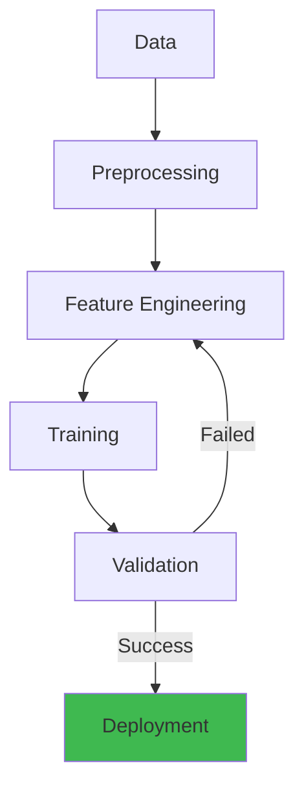

# Statistics and Probability for AI/ML


## Architecture Overview



## 1. Foundations of Probability

### 1.1 Basic Axioms

- **Probability** $P(A) \in [0, 1]$ for any event $A$
- $P(\Omega) = 1$ (the sample space has probability 1)
- For disjoint events: $P(A \cup B) = P(A) + P(B)$

**Conditional Probability**:
$$P(A|B) = \frac{P(A \cap B)}{P(B)}$$

**Chain Rule**:
$$P(A_1, A_2, ..., A_n) = P(A_1) \cdot P(A_2|A_1) \cdot P(A_3|A_1, A_2) \cdots$$

```python
import numpy as np
from scipy import stats
import matplotlib.pyplot as plt

# Simulating conditional probability
def estimate_conditional(num_samples=100000):
    # P(A) = rain, P(B) = cloudy
    cloudy = np.random.rand(num_samples) < 0.4
    rain_given_cloudy = np.random.rand(num_samples) < 0.6
    rain = cloudy & rain_given_cloudy

    # P(rain | cloudy)
    p_rain_given_cloudy = np.mean(rain[cloudy])
    return p_rain_given_cloudy

p = estimate_conditional()
print(f"P(rain | cloudy) ≈ {p:.3f}")
```

## 2. Probability Distributions

### 2.1 Discrete Distributions

#### Bernoulli Distribution

Models a single binary outcome (coin flip):

$$P(X = k) = p^k (1-p)^{1-k}, \quad k \in \{0, 1\}$$

- Mean: $p$
- Variance: $p(1-p)$

```python
p = 0.7
bernoulli = stats.bernoulli(p)
samples = bernoulli.rvs(size=1000)
print(f"Mean: {samples.mean():.3f} (expected {p:.3f})")
```

#### Binomial Distribution

Models $n$ independent Bernoulli trials:

$$P(X = k) = \binom{n}{k} p^k (1-p)^{n-k}, \quad k \in \{0, 1, ..., n\}$$

- Mean: $np$
- Variance: $np(1-p)$

```python
n, p = 10, 0.5
binomial = stats.binom(n, p)
samples = binomial.rvs(size=10000)

# Probability of exactly 5 heads
p_5 = binomial.pmf(5)
print(f"P(k=5) = {p_5:.4f}")

# Cumulative: P(X <= 3)
p_cum = binomial.cdf(3)
print(f"P(k≤3) = {p_cum:.4f}")

# Application: A/B test (binary conversion)
# Control: 100 conversions out of 1000
# Treatment: 150 conversions out of 1000
```

#### Poisson Distribution

Models the count of events in a fixed interval:

$$P(X = k) = \frac{\lambda^k e^{-\lambda}}{k!}, \quad k \in \{0, 1, 2, ...\}$$

- Mean: $\lambda$
- Variance: $\lambda$
- Models: rare events, queue lengths, radioactive decay

```python
lam = 3.0  # Average 3 events per interval
poisson = stats.poisson(lam)
samples = poisson.rvs(size=10000)

# Probability of exactly 5 events
p_5 = poisson.pmf(5)
print(f"P(k=5 | λ=3) = {p_5:.4f}")

# Applications:
# - Number of customer arrivals per hour
# - Number of API errors per minute
# - Number of goals in a soccer match

# Connection to binomial: Poisson(λ) ≈ Binomial(n, p) when n→∞, p→0, np=λ
```

#### Categorical / Multinomial Distribution

Generalizes Bernoulli/Binomial to $K$ categories:

$$P(X_1 = x_1, ..., X_K = x_K) = \frac{n!}{x_1! \cdots x_K!} p_1^{x_1} \cdots p_K^{x_K}$$

```python
# Multinomial: rolling a die
probs = [1/6] * 6
multinomial = stats.multinomial(n=10, p=probs)
sample = multinomial.rvs(size=1)
print(f"Counts from 10 rolls: {sample[0]}")
```

### 2.2 Continuous Distributions

#### Uniform Distribution

$$f(x) = \frac{1}{b-a}, \quad a \leq x \leq b$$

```python
uniform = stats.uniform(loc=0, scale=1)  # U(0, 1)
samples = uniform.rvs(size=1000)
```

#### Normal (Gaussian) Distribution

$$f(x) = \frac{1}{\sigma\sqrt{2\pi}} \exp\left(-\frac{(x-\mu)^2}{2\sigma^2}\right)$$

```python
mu, sigma = 0, 1
normal = stats.norm(mu, sigma)

# PDF at x=0
p = normal.pdf(0)  # 0.3989

# CDF: P(X <= 1.96)
p_cum = normal.cdf(1.96)  # 0.975 (95% CI)

# Quantile: z-score for 95th percentile
z = normal.ppf(0.975)  # 1.96
```

**Standard Normal**: $Z = (X - \mu) / \sigma$

**68-95-99.7 Rule**:
- 68% within $\pm 1\sigma$
- 95% within $\pm 1.96\sigma$
- 99.7% within $\pm 3\sigma$

```python
# Central Limit Theorem demonstration
def demonstrate_clt(distribution, sample_size=30, num_samples=10000):
    means = []
    for _ in range(num_samples):
        sample = distribution.rvs(size=sample_size)
        means.append(sample.mean())

    # The sampling distribution of means is approximately normal
    sample_means = np.array(means)
    print(f"Mean of means: {sample_means.mean():.4f} (expected {distribution.mean():.4f})")
    print(f"Std of means: {sample_means.std():.4f} (expected {distribution.std()/np.sqrt(sample_size):.4f})")

# CLT works even for non-normal distributions
demonstrate_clt(stats.expon(scale=1.0))
demonstrate_clt(stats.poisson(mu=2.0))
```

#### Exponential Distribution

Models time between events:

$$f(x) = \lambda e^{-\lambda x}, \quad x \geq 0$$

- Mean: $1/\lambda$
- Variance: $1/\lambda^2$
- Memoryless property: $P(X > s + t | X > s) = P(X > t)$

```python
lam = 0.5  # Rate parameter
exponential = stats.expon(scale=1/lam)

# Mean inter-arrival time = 2 units
print(f"Mean: {exponential.mean():.2f}")

# Application: modeling response times
# P(response time > 5 seconds)
p_slow = 1 - exponential.cdf(5)
print(f"P(response > 5s) = {p_slow:.4f}")
```

#### Beta Distribution

Defined on $[0, 1]$, conjugate prior for Bernoulli:

$$f(x) = \frac{x^{\alpha-1}(1-x)^{\beta-1}}{B(\alpha, \beta)}$$

```python
# Beta prior for click-through rate
alpha_prior, beta_prior = 1, 1  # Uniform prior
clicks, impressions = 45, 1000

alpha_post = alpha_prior + clicks
beta_post = beta_prior + impressions - clicks

beta_posterior = stats.beta(alpha_post, beta_post)

# Posterior mean (estimate of CTR)
ctr_estimate = beta_posterior.mean()
print(f"Estimated CTR: {ctr_estimate:.4f}")

# 95% credible interval
ci_low, ci_high = beta_posterior.ppf([0.025, 0.975])
print(f"95% CI: [{ci_low:.4f}, {ci_high:.4f}]")
```

#### Gamma Distribution

Generalizes exponential to sum of $k$ exponential variables:

```python
# Gamma distribution for modeling total wait times
gamma_dist = stats.gamma(a=2.0, scale=1.0)  # Sum of 2 exponentials
```

#### Laplace Distribution

Double exponential, used in L1 regularization (Lasso):

$$f(x) = \frac{1}{2b} \exp\left(-\frac{|x-\mu|}{b}\right)$$

```python
laplace = stats.laplace(loc=0, scale=1)
```

## 3. Bayesian vs Frequentist Inference

### 3.1 Frequentist Approach

Parameters are fixed (unknown) constants. Probability is long-run frequency.

**Maximum Likelihood Estimation (MLE)**:
$$\hat{\theta}_{MLE} = \arg\max_\theta P(X|\theta)$$

```python
from scipy.optimize import minimize

def mle_bernoulli(data):
    # data: array of 0/1 outcomes
    n = len(data)
    k = data.sum()
    # MLE for Bernoulli: p_hat = k / n
    return k / n

# Likelihood function
def neg_log_likelihood(p, data):
    k = data.sum()
    n = len(data)
    return -(k * np.log(p) + (n - k) * np.log(1 - p))

data = np.array([1, 1, 1, 0, 1, 0, 0, 1, 1, 1])
p_mle = mle_bernoulli(data)
print(f"MLE for p: {p_mle:.3f}")
```

### 3.2 Bayesian Approach

Parameters are random variables with prior distributions updated by data:

$$P(\theta|X) = \frac{P(X|\theta)P(\theta)}{P(X)} \propto P(X|\theta)P(\theta)$$

**Posterior ∝ Likelihood × Prior**

```python
def bayesian_beta_binomial(prior_alpha, prior_beta, successes, trials):
    alpha_post = prior_alpha + successes
    beta_post = prior_beta + trials - successes
    return stats.beta(alpha_post, beta_post)

# Prior: Beta(2, 2) — weak belief that p ≈ 0.5
prior = stats.beta(2, 2)
posterior = bayesian_beta_binomial(2, 2, 45, 1000)

# Posterior predictive: P(next click | data)
predictive_mean = posterior.mean()

# MAP estimate (Maximum a Posteriori)
map_estimate = (alpha_post - 1) / (alpha_post + beta_post - 2)
print(f"MAP estimate: {map_estimate:.4f}")
```

### 3.3 Bayesian vs Frequentist Comparison

| Aspect | Frequentist | Bayesian |
|--------|-------------|----------|
| Parameter | Fixed constant | Random variable |
| Probability | Long-run frequency | Degree of belief |
| Inference | Point estimate, CI | Posterior distribution |
| Prior | No | Yes (subjective or objective) |
| Interpretation | "95% of CIs contain θ" | "95% probability θ in CI" |
| Computation | Often simpler | Often MCMC/VI needed |

### 3.4 Bayesian Updating Example

```python
# Sequential Bayesian updating for coin bias
true_p = 0.7
alpha, beta = 1, 1  # Prior

n_flips = 100
flips = np.random.rand(n_flips) < true_p

alphas, betas = [alpha], [beta]
for flip in flips:
    if flip:
        alpha += 1
    else:
        beta += 1
    alphas.append(alpha)
    betas.append(beta)

# Posterior after each flip
posterior_means = [a / (a + b) for a, b in zip(alphas[1:], betas[1:])]
print(f"Final posterior mean: {posterior_means[-1]:.4f} (true: {true_p:.4f})")
```

## 4. Maximum Likelihood & MAP Estimation

### 4.1 MLE

```python
def mle_normal(data):
    mu_mle = np.mean(data)
    sigma_mle = np.std(data, ddof=0)  # Biased estimator
    return mu_mle, sigma_mle

data = np.random.randn(100) * 2 + 5  # N(5, 4)
mu_hat, sigma_hat = mle_normal(data)
print(f"MLE: μ={mu_hat:.3f}, σ={sigma_hat:.3f}")
```

### 4.2 MAP Estimation

$$\hat{\theta}_{MAP} = \arg\max_\theta P(\theta|X) = \arg\max_\theta P(X|\theta)P(\theta)$$

```python
# MAP with Gaussian prior (equivalent to L2 regularization)
def map_with_l2_prior(X, y, lambda_reg=1.0):
    # β_MAP = (X^T X + λI)^(-1) X^T y
    n_features = X.shape[1]
    XtX = X.T @ X
    Xty = X.T @ y
    beta_map = np.linalg.solve(XtX + lambda_reg * np.eye(n_features), Xty)
    return beta_map

# As λ → 0, MAP → MLE
# As λ → ∞, β → 0 (strong prior at 0)
```

### 4.3 MLE for Neural Networks (Cross-Entropy)

```python
# MLE for classification = minimize cross-entropy loss
def categorical_mle_loss(logits, targets):
    # logits: (batch_size, n_classes)
    # targets: (batch_size,) — class indices
    log_probs = logits - np.log(np.sum(np.exp(logits), axis=1, keepdims=True))
    return -np.mean(log_probs[np.arange(len(targets)), targets])
```

## 5. Hypothesis Testing

### 5.1 Framework

1. **Null hypothesis** $H_0$: no effect (e.g., $\mu_1 = \mu_2$)
2. **Alternative** $H_1$: there is an effect
3. **Test statistic**: computed from data
4. **p-value**: $P(\text{test statistic} \geq \text{observed} | H_0)$
5. **Decision**: reject $H_0$ if $p < \alpha$ (typically 0.05)

### 5.2 Types of Tests

```python
# One-sample t-test: is the mean different from 0?
data = np.random.randn(50) + 0.3
t_stat, p_value = stats.ttest_1samp(data, 0)
print(f"t = {t_stat:.3f}, p = {p_value:.4f}")

# Two-sample t-test: are two groups different?
group_a = np.random.randn(100) + 0.2
group_b = np.random.randn(100)
t_stat, p_value = stats.ttest_ind(group_a, group_b)
print(f"Two-sample t-test: t = {t_stat:.3f}, p = {p_value:.4f}")

# Chi-squared test: are two categorical variables independent?
from scipy.stats import chi2_contingency

contingency_table = np.array([
    [50, 30],
    [20, 40]
])
chi2, p, dof, expected = chi2_contingency(contingency_table)
print(f"Chi-squared: χ² = {chi2:.3f}, p = {p:.4f}")
```

### 5.3 Type I and Type II Errors

```
              H₀ true    H₀ false
Reject H₀     Type I     Correct (power)
Not reject    Correct    Type II

Type I error (α): false positive — rejecting true null
Type II error (β): false negative — not rejecting false null
Power = 1 - β: probability of detecting a true effect
```

**Multiple Testing Correction**:

```python
from scipy.stats import false_discovery_control

p_values = np.array([0.01, 0.04, 0.06, 0.20, 0.001])

# Bonferroni correction
alpha = 0.05
n_tests = len(p_values)
bonferroni_threshold = alpha / n_tests
reject_bonferroni = p_values < bonferroni_threshold

# FDR (Benjamini-Hochberg)
from statsmodels.stats.multitest import multipletests
reject_fdr, p_corrected, _, _ = multipletests(p_values, method='fdr_bh')
print(f"FDR-corrected p-values: {p_corrected}")
```

### 5.4 Confidence Intervals

```python
# Bootstrap confidence interval
def bootstrap_ci(data, statistic=np.mean, n_bootstrap=10000, ci=0.95):
    bootstraps = []
    for _ in range(n_bootstrap):
        sample = np.random.choice(data, size=len(data), replace=True)
        bootstraps.append(statistic(sample))

    alpha = 1 - ci
    lower = np.percentile(bootstraps, 100 * alpha / 2)
    upper = np.percentile(bootstraps, 100 * (1 - alpha / 2))
    return lower, upper

data = np.random.randn(100) * 2 + 5
ci_low, ci_high = bootstrap_ci(data)
print(f"Bootstrap 95% CI: [{ci_low:.3f}, {ci_high:.3f}]")
```

## 6. Information Theory

### 6.1 Entropy

Measures uncertainty / information content:

$$H(X) = -\sum_x P(x) \log_2 P(x)$$

```python
def entropy(probs, base=2):
    probs = np.array(probs)
    probs = probs[probs > 0]
    return -np.sum(probs * np.log(probs) / np.log(base))

# Fair coin: 1 bit
fair_coin = [0.5, 0.5]
print(f"Fair coin entropy: {entropy(fair_coin):.3f} bits")

# Biased coin: less entropy (more predictable)
biased_coin = [0.9, 0.1]
print(f"Biased coin entropy: {entropy(biased_coin):.3f} bits")

# Certain event: 0 bits
certain = [1.0, 0.0]
print(f"Certain entropy: {entropy(certain):.3f} bits")
```

### 6.2 Cross-Entropy

Measures the average number of bits needed to encode samples from $P$ using code optimized for $Q$:

$$H(P, Q) = -\sum_x P(x) \log Q(x)$$

This is the loss function for classification in ML:

```python
def cross_entropy_loss(y_true, y_pred):
    # y_true: one-hot or class indices
    # y_pred: predicted probabilities
    if len(y_true.shape) == 1:
        # Convert class indices to one-hot
        y_true_onehot = np.zeros_like(y_pred)
        y_true_onehot[np.arange(len(y_true)), y_true] = 1
    else:
        y_true_onehot = y_true

    # Numerical stability
    eps = 1e-15
    y_pred = np.clip(y_pred, eps, 1 - eps)
    return -np.mean(np.sum(y_true_onehot * np.log(y_pred), axis=1))

# Example
y_true = np.array([0, 2, 1])
y_pred = np.array([
    [0.9, 0.05, 0.05],
    [0.1, 0.1, 0.8],
    [0.2, 0.7, 0.1]
])
loss = cross_entropy_loss(y_true, y_pred)
print(f"Cross-entropy loss: {loss:.4f}")
```

### 6.3 KL Divergence

Measures how one distribution diverges from another:

$$D_{KL}(P \| Q) = \sum_x P(x) \log \frac{P(x)}{Q(x)} = H(P, Q) - H(P)$$

```python
def kl_divergence(p, q):
    p = np.array(p)
    q = np.array(q)
    idx = p > 0
    return np.sum(p[idx] * np.log(p[idx] / q[idx]))

# KL divergence is asymmetric!
p = np.array([0.6, 0.4])
q = np.array([0.5, 0.5])

kl_pq = kl_divergence(p, q)
kl_qp = kl_divergence(q, p)
print(f"KL(P||Q) = {kl_pq:.4f}")
print(f"KL(Q||P) = {kl_qp:.4f}")

# KL(P||Q) = 0 iff P = Q
```

### 6.4 Mutual Information

Measures dependence between random variables:

$$I(X; Y) = D_{KL}(P(X,Y) \| P(X)P(Y)) = H(X) - H(X|Y)$$

```python
def mutual_information(X, Y, bins=10):
    # Estimate MI from samples using binning
    c_xy = np.histogram2d(X, Y, bins)[0]
    c_xy = c_xy / c_xy.sum()

    c_x = c_xy.sum(axis=1)
    c_y = c_xy.sum(axis=0)

    mi = 0
    for i in range(bins):
        for j in range(bins):
            if c_xy[i, j] > 0:
                mi += c_xy[i, j] * np.log(c_xy[i, j] / (c_x[i] * c_y[j]))

    return mi

# Independent variables → MI ≈ 0
X = np.random.randn(1000)
Y = np.random.randn(1000)
print(f"MI (independent): {mutual_information(X, Y):.4f}")

# Dependent variables → MI > 0
X = np.random.randn(1000)
Y = X + np.random.randn(1000) * 0.1
print(f"MI (dependent): {mutual_information(X, Y):.4f}")
```

## 7. Applications in AI/ML

### 7.1 A/B Testing

```python
def ab_test(control_conversions, control_visitors,
            treatment_conversions, treatment_visitors,
            alpha=0.05):

    # Conversion rates
    p_control = control_conversions / control_visitors
    p_treatment = treatment_conversions / treatment_visitors

    # Pooled standard error
    p_pool = (control_conversions + treatment_conversions) / \
             (control_visitors + treatment_visitors)
    se = np.sqrt(p_pool * (1 - p_pool) * (1/control_visitors + 1/treatment_visitors))

    # Z-test
    z_stat = (p_treatment - p_control) / se
    p_value = 2 * (1 - stats.norm.cdf(abs(z_stat)))

    # Confidence interval
    z_critical = stats.norm.ppf(1 - alpha/2)
    ci_low = (p_treatment - p_control) - z_critical * se
    ci_high = (p_treatment - p_control) + z_critical * se

    # Minimum sample size for desired power
    def min_sample_size(p1, p2, alpha=0.05, power=0.8):
        z_alpha = stats.norm.ppf(1 - alpha/2)
        z_beta = stats.norm.ppf(power)
        p_bar = (p1 + p2) / 2
        n = (z_alpha * np.sqrt(2 * p_bar * (1 - p_bar)) +
             z_beta * np.sqrt(p1 * (1 - p1) + p2 * (1 - p2))) ** 2 / (p2 - p1) ** 2
        return int(np.ceil(n))

    return {
        'p_control': p_control,
        'p_treatment': p_treatment,
        'lift': (p_treatment - p_control) / p_control,
        'z_stat': z_stat,
        'p_value': p_value,
        'ci': (ci_low, ci_high),
        'significant': p_value < alpha,
        'min_sample_size': min_sample_size(p_control, p_treatment)
    }

# Example
result = ab_test(100, 1000, 150, 1000)
print(f"Control: {result['p_control']:.3f}, Treatment: {result['p_treatment']:.3f}")
print(f"Lift: {result['lift']*100:.1f}%")
print(f"p-value: {result['p_value']:.4f}, Significant: {result['significant']}")
```

### 7.2 Bayesian Optimization

```python
from scipy.stats import norm

def expected_improvement(X, y, X_candidate, xi=0.01):
    # Gaussian Process predictions
    # EI(x) = E[max(f(x) - f(x⁺), 0)]
    
    mu = np.mean(y)  # Simplified: use GP in practice
    sigma = np.std(y)
    f_best = np.max(y)

    if sigma == 0:
        return 0

    Z = (mu - f_best - xi) / sigma
    ei = (mu - f_best - xi) * norm.cdf(Z) + sigma * norm.pdf(Z)
    return ei


class BayesianOptimizer:
    def __init__(self, f, bounds, n_init=5):
        self.f = f
        self.bounds = np.array(bounds)
        self.X = []
        self.y = []

        # Initial random points
        for _ in range(n_init):
            x = np.random.uniform(bounds[:, 0], bounds[:, 1])
            self.X.append(x)
            self.y.append(f(x))

    def optimize(self, n_iterations=50):
        from sklearn.gaussian_process import GaussianProcessRegressor
        from sklearn.gaussian_process.kernels import Matern

        for i in range(n_iterations):
            gp = GaussianProcessRegressor(
                kernel=Matern(nu=2.5),
                alpha=1e-6,
                normalize_y=True
            )
            gp.fit(np.array(self.X), np.array(self.y))

            # Find point maximizing EI
            best_x = None
            best_ei = -np.inf

            for _ in range(100):
                x_candidate = np.random.uniform(self.bounds[:, 0], self.bounds[:, 1])
                mu, sigma = gp.predict([x_candidate], return_std=True)
                ei = expected_improvement(np.array(self.X), np.array(self.y), x_candidate)

                if ei > best_ei:
                    best_ei = ei
                    best_x = x_candidate

            # Evaluate
            y_new = self.f(best_x)
            self.X.append(best_x)
            self.y.append(y_new)

        best_idx = np.argmax(self.y)
        return self.X[best_idx], self.y[best_idx]
```

### 7.3 Model Evaluation Metrics

```python
def classification_metrics(y_true, y_pred, y_prob=None):
    tp = np.sum((y_true == 1) & (y_pred == 1))
    fp = np.sum((y_true == 0) & (y_pred == 1))
    tn = np.sum((y_true == 0) & (y_pred == 0))
    fn = np.sum((y_true == 1) & (y_pred == 0))

    accuracy = (tp + tn) / (tp + fp + tn + fn)
    precision = tp / (tp + fp) if (tp + fp) > 0 else 0
    recall = tp / (tp + fn) if (tp + fn) > 0 else 0
    f1 = 2 * precision * recall / (precision + recall) if (precision + recall) > 0 else 0

    return {
        'accuracy': accuracy,
        'precision': precision,
        'recall': recall,
        'f1': f1,
        'confusion_matrix': {'tp': tp, 'fp': fp, 'tn': tn, 'fn': fn}
    }


def log_loss(y_true, y_prob):
    eps = 1e-15
    y_prob = np.clip(y_prob, eps, 1 - eps)
    return -np.mean(y_true * np.log(y_prob) + (1 - y_true) * np.log(1 - y_prob))


# AUC-ROC
def auc_roc(y_true, y_scores):
    n_pos = np.sum(y_true == 1)
    n_neg = np.sum(y_true == 0)

    # Sort by score descending
    order = np.argsort(y_scores)[::-1]
    y_true_sorted = y_true[order]

    tp = 0
    fp = 0
    tpr = [0]
    fpr = [0]

    for i in range(len(y_true_sorted)):
        if y_true_sorted[i] == 1:
            tp += 1
        else:
            fp += 1
        tpr.append(tp / n_pos)
        fpr.append(fp / n_neg)

    # AUC via trapezoidal rule
    auc = np.trapz(tpr, fpr)
    return auc

# Example
y_true = np.array([1, 0, 1, 1, 0, 1, 0, 0, 1, 0])
y_pred = np.array([1, 0, 1, 0, 0, 1, 0, 0, 1, 0])
y_prob = np.array([0.9, 0.1, 0.8, 0.4, 0.3, 0.7, 0.2, 0.1, 0.6, 0.3])

metrics = classification_metrics(y_true, y_pred)
auc = auc_roc(y_true, y_prob)
print(f"F1: {metrics['f1']:.3f}, AUC: {auc:.3f}")
```

## 8. Monte Carlo Methods

### 8.1 Monte Carlo Sampling

```python
# Estimate π using Monte Carlo
def estimate_pi(n_samples=100000):
    x = np.random.uniform(-1, 1, n_samples)
    y = np.random.uniform(-1, 1, n_samples)
    inside = (x**2 + y**2) <= 1
    pi_estimate = 4 * inside.mean()
    return pi_estimate

print(f"π ≈ {estimate_pi():.4f}")

# Monte Carlo integration
def monte_carlo_integral(f, a, b, n_samples=100000):
    x = np.random.uniform(a, b, n_samples)
    return (b - a) * f(x).mean()

def f_test(x):
    return np.sin(x)

integral = monte_carlo_integral(f_test, 0, np.pi)
print(f"∫sin(x)dx from 0 to π ≈ {integral:.4f} (expected 2.0)")
```

### 8.2 Markov Chain Monte Carlo (MCMC)

```python
def metropolis_hastings(log_posterior, n_samples=10000, proposal_std=0.5):
    n_params = 1
    samples = np.zeros(n_samples)
    current = 0.0
    n_accepted = 0

    for i in range(n_samples):
        # Propose new value
        proposal = current + np.random.randn() * proposal_std

        # Acceptance ratio
        log_ratio = log_posterior(proposal) - log_posterior(current)
        accept = np.log(np.random.rand()) < log_ratio

        if accept:
            current = proposal
            n_accepted += 1

        samples[i] = current

    acceptance_rate = n_accepted / n_samples
    return samples, acceptance_rate

# Example: binomial with Beta(2, 2) prior
def log_posterior_beta(p, successes=45, trials=1000):
    if p <= 0 or p >= 1:
        return -np.inf
    log_likelihood = successes * np.log(p) + (trials - successes) * np.log(1 - p)
    log_prior = 1 * np.log(p) + 1 * np.log(1 - p)  # Beta(2,2)
    return log_likelihood + log_prior

samples, acc_rate = metropolis_hastings(log_posterior_beta, n_samples=10000)
print(f"Posterior mean: {samples.mean():.4f}")
print(f"Acceptance rate: {acc_rate:.2f}")
```

## 9. Probabilistic Programming

```python
# Using PyMC (conceptual example)
import pymc as pm

def bayesian_linear_regression(X, y):
    with pm.Model():
        # Priors
        alpha = pm.Normal('alpha', mu=0, sigma=10)
        beta = pm.Normal('beta', mu=0, sigma=10, shape=X.shape[1])
        sigma = pm.HalfNormal('sigma', sigma=5)

        # Linear model
        mu = alpha + pm.math.dot(X, beta)

        # Likelihood
        y_obs = pm.Normal('y_obs', mu=mu, sigma=sigma, observed=y)

        # Inference
        trace = pm.sample(2000, tune=1000)

    return trace

# Using NumPyro (JAX-based)
import numpyro
import numpyro.distributions as dist

def model(X, y=None):
    alpha = numpyro.sample('alpha', dist.Normal(0, 10))
    beta = numpyro.sample('beta', dist.Normal(0, 10, X.shape[1]))
    sigma = numpyro.sample('sigma', dist.HalfNormal(5))

    mu = alpha + X @ beta
    numpyro.sample('obs', dist.Normal(mu, sigma), obs=y)
```

## 10. Probability Distributions in ML Practice

### 10.1 Neural Network Weight Initialization

```python
# Xavier/Glorot initialization
fan_in, fan_out = 784, 256
limit = np.sqrt(6 / (fan_in + fan_out))
W = np.random.uniform(-limit, limit, (fan_in, fan_out))

# He initialization (ReLU)
std = np.sqrt(2 / fan_in)
W = np.random.randn(fan_in, fan_out) * std
```

### 10.2 Dropout as Approximate Bayesian Inference

```python
# Monte Carlo Dropout
def mc_dropout_predict(model, X, n_samples=100):
    predictions = []
    for _ in range(n_samples):
        # Enable dropout at inference
        predictions.append(model(X, training=True))
    predictions = np.array(predictions)
    
    # Predictive mean and uncertainty
    mean = predictions.mean(axis=0)
    std = predictions.std(axis=0)
    return mean, std
```

### 10.3 Temperature Scaling in LLMs

```python
def sample_with_temperature(logits, temperature=1.0):
    # temperature = 1.0: standard softmax
    # temperature → 0: greedy (deterministic)
    # temperature → ∞: uniform
    logits = logits / temperature
    probs = np.exp(logits - np.max(logits))
    probs = probs / probs.sum()
    return np.random.choice(len(logits), p=probs)
```

## 11. Summary: Key Formulas

| Concept | Formula | ML Application |
|---------|---------|----------------|
| Bayes' Theorem | $P(A\|B) = P(B\|A)P(A)/P(B)$ | Bayesian inference, classification |
| Entropy | $H(X) = -\sum P(x)\log P(x)$ | Information gain, decision trees |
| Cross-Entropy | $H(P,Q) = -\sum P(x)\log Q(x)$ | Classification loss |
| KL Divergence | $D_{KL}(P\|Q) = \sum P(x)\log(P(x)/Q(x))$ | Variational inference, distillation |
| Mutual Info | $I(X;Y) = H(X) - H(X\|Y)$ | Feature selection |
| MLE | $\hat{\theta} = \arg\max P(X\|\theta)$ | Parameter estimation |
| MAP | $\hat{\theta} = \arg\max P(X\|\theta)P(\theta)$ | Regularized estimation |
| CLT | $\bar{X} \sim N(\mu, \sigma^2/n)$ | Confidence intervals |
| 68-95-99.7 | Coverage for $\mu \pm k\sigma$ | Anomaly detection thresholds |

## 12. Exercise Problems

**Problem 1**: Implement a Bayesian A/B testing framework that computes the posterior probability that treatment > control using Beta-Binomial conjugate model.

**Problem 2**: Given a dataset with class imbalance, compute precision-recall curve, AUC-PR, and find the optimal threshold using F2 score.

**Problem 3**: Use KL divergence to measure how much a finetuned LLM's output distribution has drifted from the base model.

**Problem 4**: Implement Thompson Sampling for a multi-armed bandit problem with 10 arms and Bernoulli rewards.

**Problem 5**: Using Monte Carlo methods, estimate the variance of the sampling distribution of the median for different sample sizes.

---

## Related

- [Databases](../../08-databases/) — Vector search, embeddings storage
- [Python Backend](../../03-backend/) — ML inference APIs
- [Cloud Platforms](../../05-cloud/) — GPU/TPU infrastructure
- [Data Engineering](../../02-data-engineering/) — Training data pipelines
- [Performance Engineering](../../18-performance-engineering/) — Model optimization
